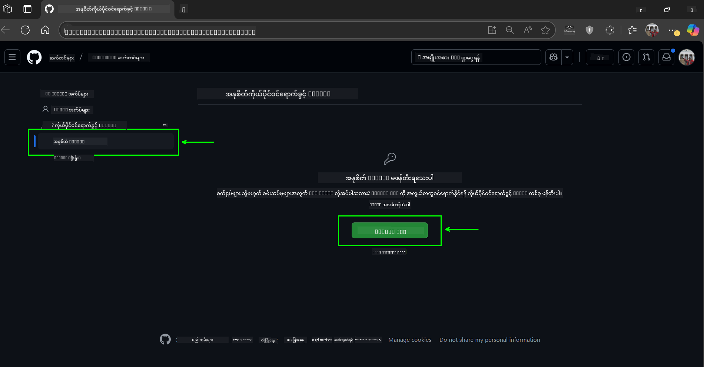
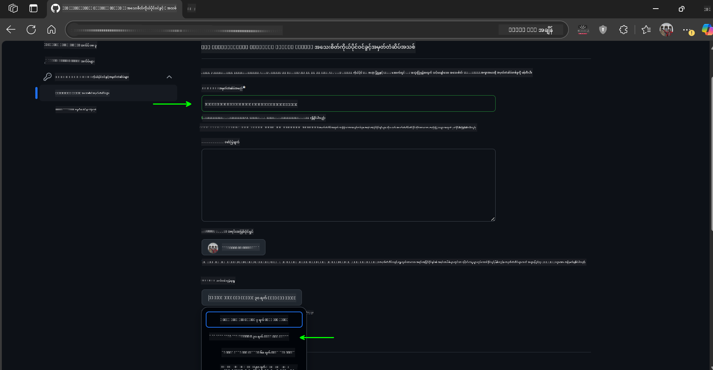
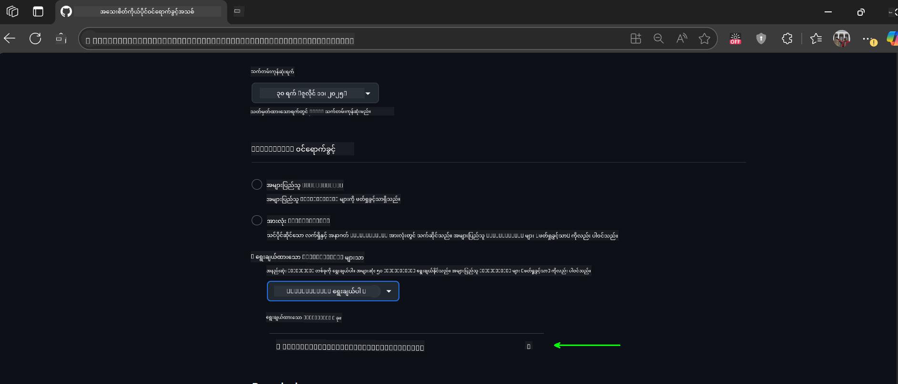
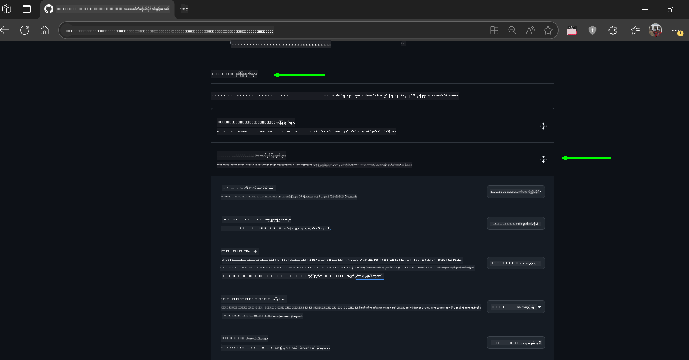

<!--
CO_OP_TRANSLATOR_METADATA:
{
  "original_hash": "c6a79c8f2b56a80370ff7e447765524f",
  "translation_date": "2025-07-24T09:13:01+00:00",
  "source_file": "00-course-setup/README.md",
  "language_code": "my"
}
-->
# သင်ခန်းစာ စတင်ခြင်း

## နိဒါန်း

ဒီသင်ခန်းစာမှာ သင်ခန်းစာရဲ့ ကုဒ်နမူနာတွေကို ဘယ်လိုလုပ်ဆောင်ရမယ်ဆိုတာကို ဖော်ပြပေးမှာပါ။

## ဒီ Repo ကို Clone လုပ်ပါ သို့မဟုတ် Fork လုပ်ပါ

စတင်ရန်အတွက် GitHub Repository ကို Clone လုပ်ပါ သို့မဟုတ် Fork လုပ်ပါ။ ဒါက သင့်ကိုယ်ပိုင် သင်ခန်းစာအကြောင်းအရာကို ရရှိစေပြီး ကုဒ်ကို လုပ်ဆောင်၊ စမ်းသပ်၊ ပြင်ဆင်နိုင်စေမှာပါ။

ဒါကို လင့်ခ်ကို နှိပ်ခြင်းဖြင့် ပြုလုပ်နိုင်ပါတယ်။


## ကုဒ်ကို လုပ်ဆောင်ခြင်း

ဒီသင်ခန်းစာမှာ AI Agents တည်ဆောက်ဖို့ လက်တွေ့အတွေ့အကြုံရရှိစေမယ့် Jupyter Notebooks များပါဝင်ပါတယ်။

ကုဒ်နမူနာတွေမှာ အောက်ပါအတိုင်း အသုံးပြုထားပါတယ် -

**GitHub အကောင့်လိုအပ်သည် - အခမဲ့**:

1) Semantic Kernel Agent Framework + GitHub Models Marketplace (semantic-kernel.ipynb)  
2) AutoGen Framework + GitHub Models Marketplace (autogen.ipynb)

**Azure Subscription လိုအပ်သည်**:
3) Azure AI Foundry + Azure AI Agent Service (azureaiagent.ipynb)

သုံးမျိုးလုံးကို စမ်းသပ်ကြည့်ဖို့ အကြံပြုပါတယ်၊ ဘယ်ဟာက သင့်အတွက် အကောင်းဆုံးဖြစ်မလဲဆိုတာ သိနိုင်ဖို့ပါ။

သင်ရွေးချယ်မည့် အခွင့်အလမ်းအပေါ်မူတည်ပြီး အောက်ပါအဆင့်များကို လိုက်နာရပါမည်။

## လိုအပ်ချက်များ

- Python 3.12+  
  - **မှတ်ချက်**: Python3.12 မရှိပါက သင့်စက်တွင် Python3.12 ကို ထည့်သွင်းပါ။ ပြီးလျှင် requirements.txt ဖိုင်မှ သင့်အတွက်လိုအပ်သော ဗားရှင်းများကို ထည့်သွင်းရန် python3.12 ကို အသုံးပြု၍ venv ဖန်တီးပါ။
- GitHub အကောင့် - GitHub Models Marketplace ကို အသုံးပြုရန်
- Azure Subscription - Azure AI Foundry ကို အသုံးပြုရန်
- Azure AI Foundry အကောင့် - Azure AI Agent Service ကို အသုံးပြုရန်

ဒီ Repository ရဲ့ အခြေခံတွင် `requirements.txt` ဖိုင်ကို ထည့်သွင်းထားပြီး ကုဒ်နမူနာများကို လုပ်ဆောင်ရန် လိုအပ်သော Python packages များပါဝင်သည်။

အောက်ပါ command ကို သင့် terminal တွင် Repository ရဲ့ အခြေခံတွင် ရိုက်ထည့်ခြင်းဖြင့် ထည့်သွင်းနိုင်သည် -

```bash
pip install -r requirements.txt
```  
Python virtual environment တစ်ခု ဖန်တီးခြင်းအား အကြံပြုပါသည်၊ ဒါက အချင်းချင်း မတူညီမှုများနှင့် ပြဿနာများကို ရှောင်ရှားနိုင်စေပါမည်။

## VSCode ကို ပြင်ဆင်ပါ
VSCode တွင် Python ရဲ့ မှန်ကန်သော ဗားရှင်းကို အသုံးပြုနေကြောင်း သေချာပါစေ။


## GitHub Models ကို အသုံးပြုသော နမူနာများအတွက် ပြင်ဆင်ခြင်း

### အဆင့် ၁: GitHub Personal Access Token (PAT) ကို ရယူပါ

ဒီသင်ခန်းစာမှာ GitHub Models Marketplace ကို အသုံးပြုထားပြီး သင် AI Agents တည်ဆောက်ဖို့ အသုံးပြုမည့် Large Language Models (LLMs) များကို အခမဲ့ရရှိစေပါသည်။

GitHub Models ကို အသုံးပြုရန် [GitHub Personal Access Token](https://docs.github.com/en/authentication/keeping-your-account-and-data-secure/managing-your-personal-access-tokens) တစ်ခု ဖန်တီးရန် လိုအပ်ပါမည်။

ဒါကို သင့် GitHub အကောင့်တွင် ပြုလုပ်နိုင်ပါသည်။

[Principle of Least Privilege](https://docs.github.com/en/get-started/learning-to-code/storing-your-secrets-safely) ကို လိုက်နာပါ။ ဒါက သင့် token ကို ဒီသင်ခန်းစာရဲ့ ကုဒ်နမူနာများကို လုပ်ဆောင်ရန် လိုအပ်သော ခွင့်ပြုချက်များပဲ ပေးရန် ဆိုလိုသည်။

1. မျက်နှာပြင်၏ ဘယ်ဘက်တွင် `Fine-grained tokens` ကို ရွေးပါ။  
   ပြီးလျှင် `Generate new token` ကို ရွေးပါ။

   

2. သင့် token ရဲ့ ရည်ရွယ်ချက်ကို ဖော်ပြသည့် အမည်တစ်ခု ထည့်ပါ။ သက်တမ်းကုန်ရက်ကို သတ်မှတ်ပါ (အကြံပြုချက်: ၃၀ ရက်၊ သို့မဟုတ် ၇ ရက်လို အတိုချုံးထားလျှင် ပိုမိုလုံခြုံပါသည်)။

   

3. Token ရဲ့ scope ကို သင် Fork လုပ်ထားသော Repository အတွက်သာ ကန့်သတ်ပါ။

   

4. Token ရဲ့ ခွင့်ပြုချက်များကို ကန့်သတ်ပါ - **Permissions** အောက်တွင် **Account Permissions** ကို toggle လုပ်ပြီး **Models** ကို ရွေးပါ။ GitHub Models အတွက် လိုအပ်သော read-access ကိုသာ ဖွင့်ပါ။

   

   

သင်ဖန်တီးထားသော token ကို ကူးယူပါ။ အခု သင့် `.env` ဖိုင်တွင် ထည့်သွင်းပါမည်။

### အဆင့် ၂: `.env` ဖိုင်ကို ဖန်တီးပါ

`.env` ဖိုင်ကို ဖန်တီးရန် သင့် terminal တွင် အောက်ပါ command ကို ရိုက်ထည့်ပါ။

```bash
cp .env.example .env
```

ဒါက နမူနာဖိုင်ကို ကူးပြီး `.env` ဖိုင်ကို သင့် directory တွင် ဖန်တီးပေးပါမည်။ ထို့နောက် environment variables များအတွက် တန်ဖိုးများကို ဖြည့်ပါ။

သင့် token ကို `.env` ဖိုင်တွင် `GITHUB_TOKEN` အကွက်တွင် ထည့်သွင်းပါ။

အခု သင် ဒီသင်ခန်းစာရဲ့ ကုဒ်နမူနာများကို လုပ်ဆောင်နိုင်ပါပြီ။

## Azure AI Foundry နှင့် Azure AI Agent Service ကို အသုံးပြုသော နမူနာများအတွက် ပြင်ဆင်ခြင်း

### အဆင့် ၁: Azure Project Endpoint ကို ရယူပါ

Azure AI Foundry တွင် hub နှင့် project တစ်ခု ဖန်တီးရန် အဆင့်များကို [Hub resources overview](https://learn.microsoft.com/en-us/azure/ai-foundry/concepts/ai-resources) တွင် ကြည့်ပါ။

Project တစ်ခု ဖန်တီးပြီးနောက် သင့် project အတွက် connection string ကို ရယူရန် လိုအပ်ပါမည်။

ဒါကို Azure AI Foundry portal တွင် သင့် project ရဲ့ **Overview** စာမျက်နှာတွင် ပြုလုပ်နိုင်ပါသည်။


### အဆင့် ၂: `.env` ဖိုင်ကို ဖန်တီးပါ

`.env` ဖိုင်ကို ဖန်တီးရန် သင့် terminal တွင် အောက်ပါ command ကို ရိုက်ထည့်ပါ။

```bash
cp .env.example .env
```

ဒါက နမူနာဖိုင်ကို ကူးပြီး `.env` ဖိုင်ကို သင့် directory တွင် ဖန်တီးပေးပါမည်။ ထို့နောက် environment variables များအတွက် တန်ဖိုးများကို ဖြည့်ပါ။

သင့် token ကို `.env` ဖိုင်တွင် `PROJECT_ENDPOINT` အကွက်တွင် ထည့်သွင်းပါ။

### အဆင့် ၃: Azure တွင် လော့ဂ်အင် ဝင်ပါ

လုံခြုံရေးအတွက် [keyless authentication](https://learn.microsoft.com/azure/developer/ai/keyless-connections?tabs=csharp%2Cazure-cli?WT.mc_id=academic-105485-koreyst) ကို အသုံးပြုပါ။

Terminal ကို ဖွင့်ပြီး `az login --use-device-code` ကို ရိုက်ထည့်၍ သင့် Azure အကောင့်တွင် လော့ဂ်အင် ဝင်ပါ။

လော့ဂ်အင်ပြီးပါက terminal တွင် သင့် subscription ကို ရွေးပါ။

## Azure Search နှင့် Azure OpenAI အတွက် အပိုဆောင်း Environment Variables

Agentic RAG သင်ခန်းစာ - သင်ခန်းစာ ၅ - တွင် Azure Search နှင့် Azure OpenAI ကို အသုံးပြုသော နမူနာများ ပါဝင်သည်။

ဒီနမူနာများကို လုပ်ဆောင်လိုပါက `.env` ဖိုင်တွင် အောက်ပါ environment variables များကို ထည့်သွင်းရန် လိုအပ်ပါမည် -

### Project Overview Page

- `AZURE_SUBSCRIPTION_ID` - **Overview** စာမျက်နှာတွင် **Project details** ကို ကြည့်ပါ။
- `AZURE_AI_PROJECT_NAME` - **Overview** စာမျက်နှာ၏ ထိပ်ဆုံးတွင် ကြည့်ပါ။
- `AZURE_OPENAI_SERVICE` - **Overview** စာမျက်နှာတွင် **Included capabilities** tab တွင် **Azure OpenAI Service** ကို ရှာပါ။

### Management Center

- `AZURE_OPENAI_RESOURCE_GROUP` - **Management Center** ရဲ့ **Overview** စာမျက်နှာတွင် **Project properties** ကို ကြည့်ပါ။
- `GLOBAL_LLM_SERVICE` - **Connected resources** အောက်တွင် **Azure AI Services** connection name ကို ရှာပါ။

### Models + Endpoints Page

- `AZURE_OPENAI_EMBEDDING_DEPLOYMENT_NAME` - သင့် embedding model (ဥပမာ - `text-embedding-ada-002`) ကို ရွေးပြီး model details မှ **Deployment name** ကို မှတ်သားပါ။
- `AZURE_OPENAI_CHAT_DEPLOYMENT_NAME` - သင့် chat model (ဥပမာ - `gpt-4o-mini`) ကို ရွေးပြီး model details မှ **Deployment name** ကို မှတ်သားပါ။

### Azure Portal

- `AZURE_OPENAI_ENDPOINT` - **Azure AI services** ကို ရှာပြီး **Resource Management** > **Keys and Endpoint** > "Azure OpenAI endpoints" တွင် "Language APIs" ကို ကူးယူပါ။
- `AZURE_OPENAI_API_KEY` - အတူတူသော စာမျက်နှာတွင် KEY 1 သို့မဟုတ် KEY 2 ကို ကူးယူပါ။
- `AZURE_SEARCH_SERVICE_ENDPOINT` - **Azure AI Search** resource ကို ရှာပြီး **Overview** ကို ကြည့်ပါ။
- `AZURE_SEARCH_API_KEY` - **Settings** > **Keys** တွင် admin key ကို ကူးယူပါ။

### External Webpage

- `AZURE_OPENAI_API_VERSION` - [API version lifecycle](https://learn.microsoft.com/en-us/azure/ai-services/openai/api-version-deprecation#latest-ga-api-release) စာမျက်နှာတွင် **Latest GA API release** ကို ကြည့်ပါ။

### Keyless Authentication ကို ပြင်ဆင်ပါ

သင့် credentials များကို hardcode မလုပ်ဘဲ Azure OpenAI နှင့် keyless connection ကို အသုံးပြုပါ။ ဒါကို `DefaultAzureCredential` ကို import လုပ်ပြီး `DefaultAzureCredential` function ကို later တွင် အသုံးပြုပါ။

```python
from azure.identity import DefaultAzureCredential, InteractiveBrowserCredential
```

## ပြဿနာတစ်ခုခု ရှိပါသလား?

ဒီ setup ကို လုပ်ဆောင်ရာတွင် ပြဿနာတစ်ခုခု ရှိပါက, ကျွန်ုပ်တို့၏ ...

## နောက်သင်ခန်းစာ

အခု သင် ဒီသင်ခန်းစာရဲ့ ကုဒ်ကို လုပ်ဆောင်ရန် ပြင်ဆင်ပြီးဖြစ်ပါပြီ။ AI Agents အကြောင်းပိုမိုလေ့လာရင်း ပျော်ရွှင်ပါစေ!

[AI Agents နှင့် Agent အသုံးပြုမှုအတွက် နိဒါန်း](../01-intro-to-ai-agents/README.md)

**ဝက်ဘ်ဆိုက်မှတ်ချက်**:  
ဤစာရွက်စာတမ်းကို AI ဘာသာပြန်ဝန်ဆောင်မှု [Co-op Translator](https://github.com/Azure/co-op-translator) ကို အသုံးပြု၍ ဘာသာပြန်ထားပါသည်။ ကျွန်ုပ်တို့သည် တိကျမှန်ကန်မှုအတွက် ကြိုးစားနေပါသော်လည်း၊ အလိုအလျောက်ဘာသာပြန်ဆိုမှုများတွင် အမှားများ သို့မဟုတ် မတိကျမှုများ ပါဝင်နိုင်သည်ကို ကျေးဇူးပြု၍ သတိပြုပါ။ မူရင်းစာရွက်စာတမ်းကို ၎င်း၏ မူလဘာသာစကားဖြင့် အာဏာတည်သောရင်းမြစ်အဖြစ် သတ်မှတ်သင့်ပါသည်။ အရေးကြီးသော အချက်အလက်များအတွက် လူ့ဘာသာပြန်ပညာရှင်များမှ ပြန်ဆိုမှုကို အကြံပြုပါသည်။ ဤဘာသာပြန်ဆိုမှုကို အသုံးပြုခြင်းမှ ဖြစ်ပေါ်လာသော နားလည်မှုမှားမှုများ သို့မဟုတ် အဓိပ္ပါယ်မှားမှုများအတွက် ကျွန်ုပ်တို့သည် တာဝန်မယူပါ။ 