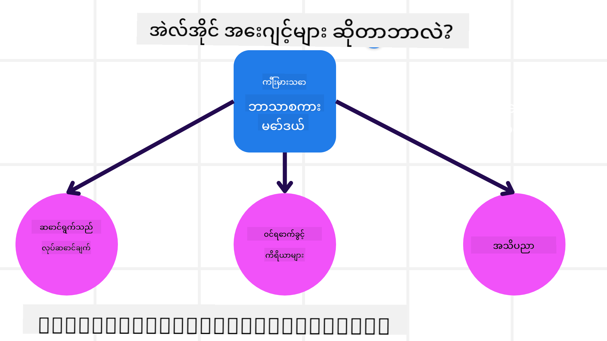
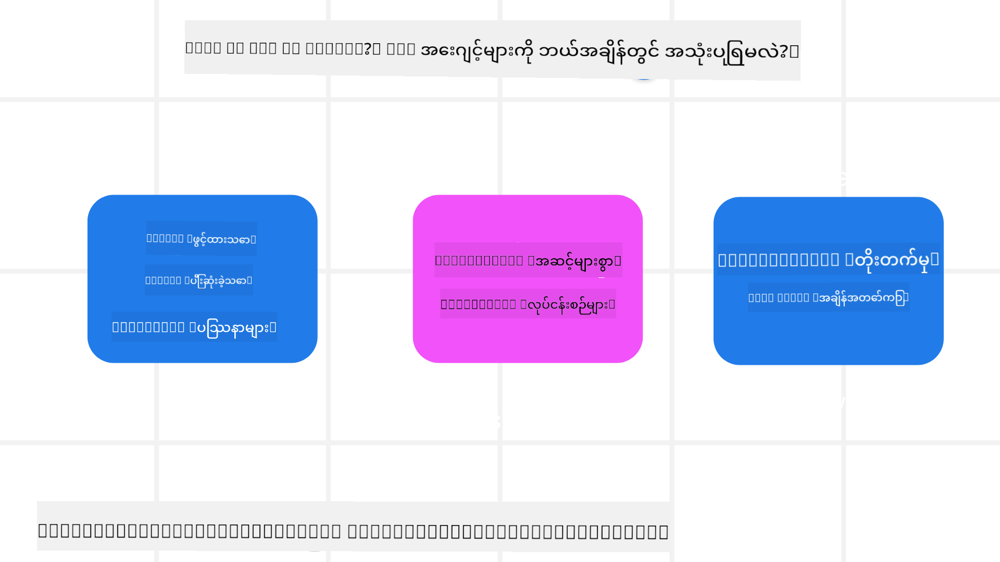

<!--
CO_OP_TRANSLATOR_METADATA:
{
  "original_hash": "1e40fe956ff79462a02a17080b125041",
  "translation_date": "2025-08-30T09:26:52+00:00",
  "source_file": "01-intro-to-ai-agents/README.md",
  "language_code": "my"
}
-->

> _(ဤသင်ခန်းစာ၏ ဗီဒီယိုကို ကြည့်ရန် အထက်ပါ ပုံကို နှိပ်ပါ)_

# AI အေးဂျင့်များနှင့် အေးဂျင့် အသုံးပြုမှုအကြောင်း မိတ်ဆက်

"AI Agents for Beginners" သင်ခန်းစာသို့ ကြိုဆိုပါသည်! ဤသင်ခန်းစာသည် AI အေးဂျင့်များကို တည်ဆောက်ရန် အခြေခံသိမှတ်စရာများနှင့် လက်တွေ့နမူနာများကို ပေးစွမ်းပါသည်။

ဤသင်ခန်းစာကို စတင်ရန်၊ AI အေးဂျင့်များသည် အဘယ်နည်း၊ ကျွန်ုပ်တို့ တည်ဆောက်သော အက်ပလီကေးရှင်းများနှင့် လုပ်ငန်းစဉ်များတွင် မည်သို့ အသုံးပြုနိုင်သည်ကို ပိုမိုနားလည်စေရန် စတင်ပါမည်။

## မိတ်ဆက်

ဤသင်ခန်းစာတွင် ပါဝင်သည်-

- AI အေးဂျင့်များသည် အဘယ်နည်း၊ အေးဂျင့်အမျိုးအစားများကွဲပြားမှုများကော ရှိပါသလား?
- AI အေးဂျင့်များအတွက် အကောင်းဆုံး အသုံးပြုမှုများကော မည်သို့ ကူညီပေးနိုင်မည်နည်း?
- Agentic Solutions တစ်ခုကို ဒီဇိုင်းဆွဲရာတွင် အခြေခံအဆင့်များကော မည်သို့ဖြစ်သင့်သနည်း?

## သင်ယူရမည့် ရည်မှန်းချက်များ
ဤသင်ခန်းစာကို ပြီးမြောက်ပြီးနောက်၊ သင်သည်-

- AI အေးဂျင့်၏ အယူအဆများကို နားလည်ပြီး အခြား AI ဖြေရှင်းချက်များနှင့် မည်သို့ ကွဲပြားသည်ကို သိရှိနိုင်မည်။
- AI အေးဂျင့်များကို အကျိုးရှိစွာ အသုံးချနိုင်မည်။
- အသုံးပြုသူများနှင့် ဖောက်သည်များအတွက် Agentic Solutions များကို ထိရောက်စွာ ဒီဇိုင်းဆွဲနိုင်မည်။

## AI အေးဂျင့်များနှင့် အေးဂျင့်အမျိုးအစားများကို သတ်မှတ်ခြင်း

### AI အေးဂျင့်များသည် အဘယ်နည်း?

AI အေးဂျင့်များသည် **စနစ်များ**ဖြစ်ပြီး **Large Language Models(LLMs)** ကို **တိုးချဲ့စွမ်းရည်များ**ပေးခြင်း၊ **Tools** နှင့် **Knowledge** ကို အသုံးပြုခွင့်ပေးခြင်းအားဖြင့် **လုပ်ဆောင်မှုများ** ပြုလုပ်နိုင်စေသည်။

ဤအဓိပ္ပါယ်ကို အပိုင်းပိုင်း ခွဲခြားကြည့်ပါစို့-

- **စနစ်** - အေးဂျင့်များကို တစ်ခုတည်းသော အစိတ်အပိုင်းအဖြစ် မထင်ရဘဲ စနစ်တစ်ခုအဖြစ် တွေးဆလိုက်ပါ။ AI အေးဂျင့်၏ အခြေခံအစိတ်အပိုင်းများမှာ:
  - **ပတ်ဝန်းကျင်** - AI အေးဂျင့်အလုပ်လုပ်နေသော သတ်မှတ်ထားသော နေရာ။ ဥပမာအားဖြင့် ခရီးသွားအေးဂျင့်တစ်ခုရှိပါက၊ အေးဂျင့်အလုပ်လုပ်ရန် ခရီးသွားဘွတ်ကင်စနစ်သည် ပတ်ဝန်းကျင်ဖြစ်နိုင်သည်။
  - **အာရုံခံကိရိယာများ** - ပတ်ဝန်းကျင်တွင် အချက်အလက်များနှင့် တုံ့ပြန်မှုများ ရှိသည်။ AI အေးဂျင့်များသည် ပတ်ဝန်းကျင်၏ လက်ရှိအခြေအနေကို သိရှိရန် အာရုံခံကိရိယာများကို အသုံးပြုသည်။ ခရီးသွားအေးဂျင့်နမူနာတွင်၊ ဟိုတယ်ရရှိနိုင်မှု သို့မဟုတ် လေယာဉ်လက်မှတ်ဈေးနှုန်းများကို ပတ်ဝန်းကျင်က ပေးနိုင်သည်။
  - **လုပ်ဆောင်သူများ** - AI အေးဂျင့်သည် ပတ်ဝန်းကျင်၏ လက်ရှိအခြေအနေကို ရရှိပြီးနောက်၊ လက်ရှိအလုပ်အတွက် ပတ်ဝန်းကျင်ကို ပြောင်းလဲရန် မည်သည့် လုပ်ဆောင်မှုကို ပြုလုပ်မည်ကို ဆုံးဖြတ်သည်။ ခရီးသွားအေးဂျင့်အတွက်၊ အသုံးပြုသူအတွက် ရရှိနိုင်သော အခန်းကို ဘွတ်ကင်လုပ်ရန် ဖြစ်နိုင်သည်။

**Large Language Models** - အေးဂျင့်၏ အယူအဆသည် LLM မတည်ရှိမီကတည်းက ရှိခဲ့သည်။ LLM များဖြင့် AI အေးဂျင့်များကို တည်ဆောက်ခြင်း၏ အားသာချက်မှာ လူ့ဘာသာစကားနှင့် ဒေတာကို အဓိပ္ပါယ်ဖွင့်ဆိုနိုင်စွမ်းဖြစ်သည်။ ဤစွမ်းရည်သည် LLM များကို ပတ်ဝန်းကျင်အချက်အလက်များကို အဓိပ္ပါယ်ဖွင့်ဆိုရန်နှင့် ပတ်ဝန်းကျင်ကို ပြောင်းလဲရန် အစီအစဉ်တစ်ခုကို သတ်မှတ်ရန် ခွင့်ပြုသည်။

**လုပ်ဆောင်မှုများ ပြုလုပ်ခြင်း** - AI အေးဂျင့်စနစ်များအပြင်၊ LLM များသည် အသုံးပြုသူ၏ အဆိုပြုချက်အပေါ် အကြောင်းအရာ သို့မဟုတ် အချက်အလက်ကို ဖန်တီးခြင်းဖြင့်သာ လုပ်ဆောင်မှုများကို ကန့်သတ်ထားသည်။ AI အေးဂျင့်စနစ်များတွင်၊ LLM များသည် အသုံးပြုသူ၏ တောင်းဆိုမှုကို အဓိပ္ပါယ်ဖွင့်ဆိုခြင်းနှင့် ပတ်ဝန်းကျင်တွင် ရရှိနိုင်သော Tools များကို အသုံးပြုခြင်းဖြင့် အလုပ်များကို ပြီးမြောက်စေသည်။

**Tools အသုံးပြုခွင့်** - LLM သည် Tools များကို အသုံးပြုခွင့်ရှိသည်မှာ ၁) ၎င်း၏ လုပ်ဆောင်နေသော ပတ်ဝန်းကျင်နှင့် ၂) AI အေးဂျင့်၏ Developer မှ သတ်မှတ်ထားခြင်းဖြစ်သည်။ ခရီးသွားအေးဂျင့်နမူနာတွင်၊ အေးဂျင့်၏ Tools များသည် ဘွတ်ကင်စနစ်တွင် ရရှိနိုင်သော လုပ်ဆောင်မှုများဖြင့် ကန့်သတ်ထားပြီး၊ Developer သည် လေယာဉ်များအတွက် Tools အသုံးပြုခွင့်ကို ကန့်သတ်နိုင်သည်။

**မှတ်ဉာဏ်+Knowledge** - မှတ်ဉာဏ်သည် အသုံးပြုသူနှင့် အေးဂျင့်အကြား စကားဝိုင်း၏ အကြောင်းအရာတွင် အတိုချုံးဖြစ်နိုင်သည်။ ရေရှည်တွင်၊ ပတ်ဝန်းကျင်မှ ပေးထားသော အချက်အလက်များအပြင်၊ AI အေးဂျင့်များသည် အခြားစနစ်များ၊ ဝန်ဆောင်မှုများ၊ Tools များနှင့် အခြားအေးဂျင့်များမှ Knowledge ကိုလည်း ရယူနိုင်သည်။ ခရီးသွားအေးဂျင့်နမူနာတွင်၊ ဤ Knowledge သည် ဖောက်သည်ဒေတာဘေ့စ်တွင် ရှိသော အသုံးပြုသူ၏ ခရီးသွားနှစ်သက်မှုအချက်အလက်ဖြစ်နိုင်သည်။

### အေးဂျင့်အမျိုးအစားများ

AI အေးဂျင့်များ၏ အထွေထွေ အဓိပ္ပါယ်ကို သိရှိပြီးနောက်၊ ခရီးသွားဘွတ်ကင် AI အေးဂျင့်တွင် မည်သို့ အသုံးပြုနိုင်မည်ကို အေးဂျင့်အမျိုးအစားများကို ကြည့်ပါ။

| **အေးဂျင့်အမျိုးအစား**          | **ဖော်ပြချက်**                                                                                                                       | **ဥပမာ**                                                                                                                                                                                                                   |
| ----------------------------- | ------------------------------------------------------------------------------------------------------------------------------------- | ----------------------------------------------------------------------------------------------------------------------------------------------------------------------------------------------------------------------------- |
| **Simple Reflex Agents**      | သတ်မှတ်ထားသော စည်းကမ်းများအပေါ် အခြေခံ၍ ချက်ချင်း လုပ်ဆောင်မှုများ ပြုလုပ်သည်။                                                                                  | ခရီးသွားအေးဂျင့်သည် အီးမေးလ်၏ အကြောင်းအရာကို အဓိပ္ပါယ်ဖွင့်ဆိုပြီး ခရီးသွားတိုင်ကြားမှုများကို ဖောက်သည်ဝန်ဆောင်မှုသို့ ပို့သည်။                                                                                                                          |
| **Model-Based Reflex Agents** | ကမ္ဘာ့မော်ဒယ်နှင့် မော်ဒယ်၏ ပြောင်းလဲမှုများအပေါ် အခြေခံ၍ လုပ်ဆောင်မှုများ ပြုလုပ်သည်။                                                              | ခရီးသွားအေးဂျင့်သည် သမိုင်းဈေးနှုန်းဒေတာကို အသုံးပြု၍ အဓိကဈေးနှုန်းပြောင်းလဲမှုများကို ဦးစားပေးသည်။                                                                                                             |
| **Goal-Based Agents**         | ရည်မှန်းချက်ကို အဓိပ္ပါယ်ဖွင့်ဆိုပြီး ရောက်ရှိရန် လိုအပ်သော လုပ်ဆောင်မှုများကို ဆုံးဖြတ်ခြင်းဖြင့် ရည်မှန်းချက်များကို ရောက်ရှိရန် အစီအစဉ်များ ဖန်တီးသည်။                                  | ခရီးသွားအေးဂျင့်သည် လက်ရှိနေရာမှ သွားရောက်လိုသောနေရာသို့ ခရီးသွားစီစဉ်မှုများ (ကား၊ အများပြည်သူသယ်ယူပို့ဆောင်ရေး၊ လေယာဉ်) ကို ဆုံးဖြတ်ခြင်းဖြင့် ခရီးစဉ်ကို ဘွတ်ကင်လုပ်သည်။                                                                                |
| **Utility-Based Agents**      | ရည်မှန်းချက်များကို ရောက်ရှိရန် မည်သို့လုပ်ဆောင်မည်ကို သတ်မှတ်ရန် အကျိုးကျေးဇူးများကို စဉ်ဆက်မပြတ် တိုင်းတာသည်။                                               | ခရီးသွားအေးဂျင့်သည် ခရီးစဉ်ဘွတ်ကင်လုပ်ရာတွင် အဆင်ပြေမှုနှင့် ကုန်ကျစရိတ်ကို တိုင်းတာခြင်းဖြင့် အကျိုးကျေးဇူးကို အများဆုံးဖြစ်စေသည်။                                                                                                                                          |
| **Learning Agents**           | တုံ့ပြန်မှုကို ဖြေရှင်းခြင်းနှင့် လုပ်ဆောင်မှုများကို ပြင်ဆင်ခြင်းဖြင့် အချိန်ကြာလာသည်နှင့်အမျှ တိုးတက်မှုရှိသည်။                                                        | ခရီးသွားအေးဂျင့်သည် ခရီးစဉ်ပြီးဆုံးပြီးနောက် စစ်တမ်းများမှ ဖောက်သည်တုံ့ပြန်မှုကို အသုံးပြု၍ အနာဂတ်ဘွတ်ကင်များကို ပြင်ဆင်ခြင်းဖြင့် တိုးတက်မှုရှိသည်။                                                                                                               |
| **Hierarchical Agents**       | အဆင့်မြင့်အေးဂျင့်များသည် အလုပ်များကို အဆင့်အနိမ့်အေးဂျင့်များအတွက် အလုပ်ခွဲခြင်းဖြင့် ပြီးမြောက်စေသော အဆင့်လိုက်စနစ်ရှိသည်။ | ခရီးသွားအေးဂျင့်သည် ခရီးစဉ်ကို ပယ်ဖျက်ရာတွင် အလုပ်ကို အလုပ်ခွဲခြင်း (ဥပမာအားဖြင့် သတ်မှတ်ထားသော ဘွတ်ကင်များကို ပယ်ဖျက်ခြင်း) ဖြင့် အဆင့်အနိမ့်အေးဂျင့်များကို ပြီးမြောက်စေပြီး အဆင့်မြင့်အေးဂျင့်သို့ ပြန်လည်တင်ပြသည်။                                     |
| **Multi-Agent Systems (MAS)** | အေးဂျင့်များသည် လွတ်လပ်စွာ အလုပ်များကို ပြီးမြောက်စေပြီး၊ ပူးပေါင်းမှု သို့မဟုတ် ယှဉ်ပြိုင်မှုဖြင့် ဖြစ်နိုင်သည်။                                                           | ပူးပေါင်းမှု- အေးဂျင့်များစွာသည် ဟိုတယ်၊ လေယာဉ်နှင့် အပန်းဖြေဝန်ဆောင်မှုများကို ဘွတ်ကင်လုပ်သည်။ ယှဉ်ပြိုင်မှု- အေးဂျင့်များစွာသည် ဖောက်သည်များကို ဟိုတယ်တွင် ဘွတ်ကင်လုပ်ရန် ဟိုတယ်ဘွတ်ကင်ပြက္ခဒိန်ကို စီမံခန့်ခွဲပြီး ယှဉ်ပြိုင်သည်။ |

## AI အေးဂျင့်များကို မည်သည့်အခါ အသုံးပြုမည်နည်း

အေးဂျင့်အမျိုးအစားများကို ခရီးသွားဘွတ်ကင်နမူနာတွင် မည်သို့ အသုံးပြုနိုင်သည်ကို အထက်တွင် ရှင်းပြခဲ့ပါသည်။ ဤသင်ခန်းစာတစ်ခုလုံးတွင် ဤအက်ပလီကေးရှင်းကို ဆက်လက်အသုံးပြုပါမည်။

AI အေးဂျင့်များကို အသုံးပြုရန် အကောင်းဆုံးဖြစ်သော အသုံးပြုမှုအမျိုးအစားများကို ကြည့်ပါစို့-

- **ပွင့်လင်းသော ပြဿနာများ** - Workflow တစ်ခုတွင် အဆင့်များကို အမြဲတမ်း Hardcode မလုပ်နိုင်သောကြောင့် LLM ကို လိုအပ်သော အဆင့်များကို ဆုံးဖြတ်ခွင့်ပေးခြင်း။
- **အဆင့်များစွာပါဝင်သော လုပ်ငန်းစဉ်များ** - AI အေးဂျင့်သည် Tools သို့မဟုတ် အချက်အလက်များကို တစ်ကြိမ်တည်း Retrieve လုပ်ခြင်းမဟုတ်ဘဲ အဆင့်များစွာတွင် အသုံးပြုရန် လိုအပ်သော အဆင့်မြင့်လုပ်ငန်းစဉ်များ။
- **အချိန်ကြာလာသည်နှင့်အမျှ တိုးတက်မှုရှိခြင်း** - ပတ်ဝန်းကျင် သို့မဟုတ် အသုံးပြုသူများမှ တုံ့ပြန်မှုကို ရရှိခြင်းဖြင့် Utility ကို ပိုမိုကောင်းမွန်စေရန် အေးဂျင့်တစ်ခု တိုးတက်မှုရှိနိုင်သော အလုပ်များ။

AI အေးဂျင့်များကို အသုံးပြုခြင်းနှင့် ပိုမိုယုံကြည်စိတ်ချရသော AI အေးဂျင့်များ တည်ဆောက်ခြင်းသင်ခန်းစာတွင် ဆက်လက်လေ့လာပါ။

## Agentic Solutions အခြေခံများ

### အေးဂျင့် တီထွင်မှု

AI အေးဂျင့်စနစ်တစ်ခုကို ဒီဇိုင်းဆွဲရာတွင် ပထမဆုံးအဆင့်မှာ Tools, Actions, နှင့် Behaviors များကို သတ်မှတ်ခြင်းဖြစ်သည်။ ဤသင်ခန်းစာတွင် **Azure AI Agent Service** ကို အသုံးပြု၍ အေးဂျင့်များကို သတ်မှတ်ခြင်းအပေါ် အာရုံစိုက်ပါသည်။ ၎င်းသည် အောက်ပါ Features များကို ပေးစွမ်းသည်-

- Open Models များ (ဥပမာ- OpenAI, Mistral, Llama) ရွေးချယ်ခြင်း
- Tripadvisor ကဲ့သို့သော Provider များမှ Licensed Data အသုံးပြုခြင်း
- OpenAPI 3.0 Tools များကို စံပြအဖြစ် အသုံးပြုခြင်း

### Agentic Patterns

LLM များနှင့် ဆက်သွယ်မှုသည် Prompts ဖြင့် ဖြစ်သည်။ AI အေးဂျင့်များ၏ Semi-Autonomous လုပ်ဆောင်မှုအနေအထားကြောင့် ပတ်ဝန်းကျင်တွင် ပြောင်းလဲမှုဖြစ်ပြီးနောက် LLM ကို လက်စွဲပြန်လည် Prompt လုပ်ရန် မလိုအပ်သည့်အခါများရှိသည်။ **Agentic Patterns** ကို အသုံးပြု၍ LLM ကို အဆင့်များစွာတွင် Prompt လုပ်ခြင်းဖြင့် ပိုမို Scalable ဖြစ်စေသည်။

ဤသင်ခန်းစာကို လက်ရှိ လူကြိုက်များသော Agentic Patterns များအလိုက် ခွဲခြားထားသည်။

### Agentic Frameworks

Agentic Frameworks များသည် Developer များကို Agentic Patterns များကို Code ဖြင့် အကောင်အထည်ဖော်ရန် ခွင့်ပြုသည်။ ဤ Frameworks များသည် Template, Plugins, နှင့် Tools များကို ပေးစွမ်းပြီး AI အေးဂျင့်များ ပိုမိုကောင်းမွန်စွာ ပူးပေါင်းဆောင်ရွက်နိုင်စေသည်။ ၎င်းတို့၏ အကျိုးကျေးဇူးများသည် AI အေးဂျင့်စနစ်များ၏ Observability နှင့် Troubleshooting ကို ပိုမိုကောင်းမွန်စေသည်။

ဤသင်ခန်းစာတွင် သုတေသနအခြေခံ AutoGen Framework နှင့် Semantic Kernel မှ ထုတ်လုပ်မှုအဆင့် Agent Framework ကို လေ့လာမည်။

### AI အေးဂျင့်များ

---

**အကြောင်းကြားချက်**:  
ဤစာရွက်စာတမ်းကို AI ဘာသာပြန်ဝန်ဆောင်မှု [Co-op Translator](https://github.com/Azure/co-op-translator) ကို အသုံးပြု၍ ဘာသာပြန်ထားပါသည်။ ကျွန်ုပ်တို့သည် တိကျမှုအတွက် ကြိုးစားနေသော်လည်း၊ အလိုအလျောက် ဘာသာပြန်မှုများတွင် အမှားများ သို့မဟုတ် မတိကျမှုများ ပါရှိနိုင်သည်ကို သတိပြုပါ။ မူရင်းဘာသာစကားဖြင့် ရေးသားထားသော စာရွက်စာတမ်းကို အာဏာရှိသော ရင်းမြစ်အဖြစ် သတ်မှတ်သင့်ပါသည်။ အရေးကြီးသော အချက်အလက်များအတွက် လူ့ဘာသာပြန်ပညာရှင်များမှ ပရော်ဖက်ရှင်နယ် ဘာသာပြန်မှုကို အကြံပြုပါသည်။ ဤဘာသာပြန်မှုကို အသုံးပြုခြင်းမှ ဖြစ်ပေါ်လာသော အလွဲအလွတ်များ သို့မဟုတ် အနားလွဲမှုများအတွက် ကျွန်ုပ်တို့သည် တာဝန်မယူပါ။