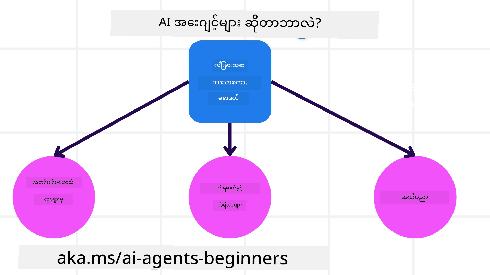
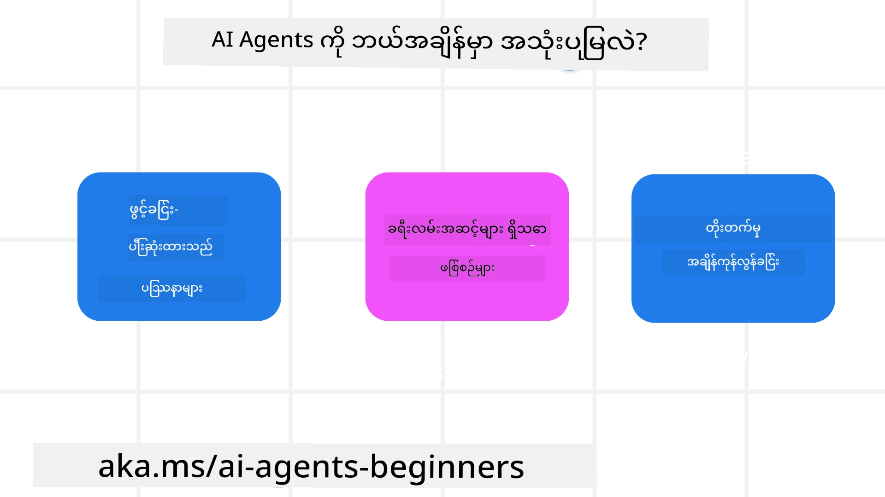

> _(အပေါ်ထားတဲ့ ပုံကို နှိပ်၍ ဤသင်ခန်းစာ၏ ဗီဒီယိုကို ကြည့်ပါ)_

# AI Agents နှင့် Agent အသုံးချမှုများအတွက် နိဒါန်း

Welcome to the "AI Agents for Beginners" course! This course provides fundamental knowledge and applied samples for building AI Agents.

အခြား သင်ယူသူများနှင့် AI Agent တည်ဆောက်သူများကို တွေ့ဆုံပြီး ဤသင်တန်းနှင့် ပတ်သက်သည့် မေးခွန်းများကို မေးနိုင်ရန် <a href="https://discord.gg/kzRShWzttr" target="_blank">Azure AI Discord အသိုင်းအဝိုင်း</a> တွင် ပူးပေါင်းပါ။

ဤသင်တန်းကို စတင်ရန်အတွက် ကျွန်ုပ်တို့သည် AI Agents သည်ဘာလဲ၊ ကျွန်ုပ်တို့ ဖန်တီးသော အက်ပလီကေးရှင်းများနှင့် အလုပ်ဖြစ်စဉ်များအတွင်း ဘယ်လို အသုံးချနိုင်သည်ကို ပိုမိုနားလည်ရန် စတင်မည်။

## နိဒါန်း

ဤသင်ခန်းစာတွင် ပါဝင်သောအကြောင်းအရာများ:

- AI Agents ဆိုတာဘာလဲ နှင့် အမျိုးအစားမျိုးကွဲများ ဘာတွေလဲ?
- AI Agents အတွက် မည်သည့် အသုံးချမှုများ သင့်လျော်ပြီး ကျွန်ုပ်တို့ကို ဘယ်လိုအကူအညီပေးနိုင်မလဲ?
- Agentic ဖြေရှင်းချက်များဒီဇိုင်းထုတ်ရာတွင် အသုံးများသော အခြေခံတည်ဆောက်ပစ္စည်းများက ဘာများလဲ?

## လေ့လာရေး ရည်မှန်းချက်များ
ဤသင်ခန်းစာကို ပြီးမြောက်ပါက သင်သည် အောက်ပါအရာများကို ပြုလုပ်နိုင်ရမည် -

- AI Agent အယူအဆများကို နားလည်ရန်နှင့် အခြား AI ဖြေရှင်းချက်များနှင့် မည်သို့ မတူကွဲပြားကြောင်း သိရှိရန်။
- AI Agents များကို ထိထိရောက်ရောက် အသုံးပြုနိုင်ရန်။
- အသုံးပြုသူများနှင့် ဖောက်သည်များအတွက် ထုတ်ကုန်အကျိုးပြန်လည်မြှင့်မားစေသော Agentic ဖြေရှင်းချက်များကို ဒီဇိုင်းချရန်။

## AI Agents ကို သတ်မှတ်ခြင်းနှင့် AI Agent မျိုးအစားများ

### AI Agents ဆိုတာဘာလဲ?

AI Agents သည် **စနစ်များ** ဖြစ်ကာ **Large Language Models(LLMs)** များအား သူတို့၏ စွမ်းရည်များကို တိုးချဲ့ပေး၍ LLMs များကို **ကိရိယာများသုံးရန် ဝင်ရောက်ခွင့်** နှင့် **အသိပညာ** ပေးကာ **လုပ်ဆောင်ချက်များ ဆောင်ရွက်နိုင်စေရန်** အထောက်အကူပြုသည်။

ဤသတ်မှတ်ချက်ကို သေးငယ်သော အစိတ်အပိုင်းများအဖြစ် ခွဲကြည့်ကြမယ် -

- **System** - Agent များကို တစ်ခုတည်းသော အစိတ်အပိုင်းတစ်ခုအဖြစ်မတွေးပါနှင့်၊ အစား များစွာသော အစိတ်အပိုင်းများပါသော စနစ်တစ်ခုအဖြစ် တွေးရန် အရေးကြီးသည်။ အခြေခံအဆင့်တွင် AI Agent တစ်ခု၏ အစိတ်အပိုင်းများမှာ -
  - **Environment** - AI Agent သည် လှုပ်ရှားနေသော သတ်မှတ်ထားသော နေရာ။ ဥပမာ၊ ခရီးစဉ် ဘွတ်ကင် AI Agent တစ်ခုရှိပါက ပတ်ဝန်းကျင်မှာ အဲဒီ Agent သည် လုပ်ငန်းများ ပြီးစီးရန် အသုံးပြုသည့် ခရီးဘွတ်ကင် စနစ် ဖြစ်နိုင်သည်။
  - **Sensors** - ပတ်ဝန်းကျင်များတွင် အချက်အလက်များ ရှိပြီး တုံ့ပြန်ချက်များ ပေးသည်။ AI Agents များသည် စန်ဆာများကို အသုံးပြုကာ ပတ်ဝန်းကျင်၏ လက်ရှိ အခြေအနေ ပတ်သက်သည့် အချက်အလက်များကို စုဆောင်း၍ ကိုInterpret သည်။ ခရီးဘွတ်ကင် Agent ဥပမာတွင် ဘွတ်ကင်စနစ်မှ ဟိုတယ် ရရှိနိုင်မှု သို့မဟုတ် လေကြောင်းဈေးနှုန်းများကဲ့သို့ အချက်အလက်များ ပေးနိုင်သည်။
  - **Actuators** - AI Agent သည် ပတ်ဝန်းကျင်၏ လက်ရှိ အခြေအနေကို လက်ခံရရှိလာပါက လက်ရှိ တာဝန်အတွက် ပတ်ဝန်းကျင်ကို ပြောင်းလဲစေရန် ဘာလုပ်ရမည်ကို ဆုံးဖြတ်သည်။ ခရီးဘွတ်ကင် Agent အတွက် အသုံးပြုသူအတွက် ရရှိနိုင်သော အခန်းကို ဘွတ်ကင်လုပ်ပေးခြင်း ဖြစ်နိုင်သည်။

**Large Language Models** - Agent များ၏ အယူအဆသည် LLMs ဖန်တီးမီကထဲက ရှိခဲ့ပါသည်။ LLMs အသုံးပြု၍ AI Agents တည်ဆောက်ခြင်း၏ အားသာချက်မှာ လူဘာသာစကားနှင့် ဒေတာကို ဖော်ထုတ်နိုင်မှု ဖြစ်သည်။ ဤစွမ်းအားကြောင့် LLMs များသည် ပတ်ဝန်းကျင် အချက်အလက်များကို ရှာဖွဲ့ ကြားနာပြီး ပတ်ဝန်းကျင်ကို ပြောင်းလဲရန် စီမံချက်ကို သတ်မှတ်နိုင်သည်။

**Perform Actions** - AI Agent စနစ်အပြင်တွင် LLMs များက အသုံးပြုသူ၏ prompt အပေါ် အချက်အလက် သို့မဟုတ် မူကြောင်း ဖန်တီးခြင်းအတွက်သာ စည်းကမ်းထားသော အခြေအနေများထဲက သာ အကန့်အသတ်ရှိသည်။ AI Agent စနစ်အတွင်းတွင် LLMs များသည် အသုံးပြုသူတောင်းဆိုချက်ကို အဓိပ္ပါယ်ဖော်၍ ပတ်ဝန်းကျင်တွင် ရနိုင်သည့် ကိရိယာများကို အသုံးပြုကာ တာဝန်များကို ပြီးမြောက်စေနိုင်သည်။

**Access To Tools** - LLM သည် ဘယ်ကိရိယာများကို ဝင်ရောက် အသုံးပြုနိုင်သည်ဆိုတာကို ၁) လှုပ်ရှားနေသော ပတ်ဝန်းကျင်နှင့် ၂) AI Agent ကို ဖန်တီးသူ သတ်မှတ်သည်။ ကျွန်ုပ်တို့၏ ခရီးသွား Agent ဥပမာအတွက် Agent ၏ ကိရိယာများသည် ဘွတ်ကင်စနစ်တွင် ရနိုင်သော လုပ်ဆောင်ချက်များဖြင့် ကန့်သတ်ပြီး၊ ဒါမှမဟုတ် ဖန်တီးသူက Agent ၏ ကိရိယာ အသုံးခွင့်ကို လေကြောင်းအတွက်သာ ကန့်သတ်နိုင်သည်။

**Memory+Knowledge** - မှတ်ဉာဏ်သည် အသုံးပြုသူနှင့် Agent တို့အကြား ဆက်သွယ်မှု၏ အပေါ်ပိုင်းတွင် ကျော်ကြားသော အတိုအထွာ ဖြစ်နိုင်သည်။ ရေရှည်အနေဖြင့် ပတ်ဝန်းကျင်မှ ပေးထားသည့် အချက်အလက်များအပြင် AI Agents များသည် အခြား စနစ်များ၊ ဝန်ဆောင်မှုများ၊ ကိရိယာများနှင့် အခြား Agent များကနေ အသိပညာကို ပြန်လည်ယူဆောင်နိုင်သည်။ ခရီးသွား Agent ဥပမာတွင် ဤအသိပညာမှာ ဖောက်သည် Database တွင် တည်ရှိသော ဖောက်သည်၏ ခရီးစိတ်နှစ်သက်ချက် များဆိုင်ရာ အချက်အလက်များ ဖြစ်နိုင်သည်။

### Agent မျိုးအမျိုးအစားများ

ယခု AI Agents ၏ အမြန်သတ်မှတ်ချက်ကို သိရှိပြီးနောက် သီးသန့် Agent အမျိုးအစားများနှင့် ၎င်းတို့ကို ခရီးဘွတ်ကင် AI Agent တွင် မည်သို့ အသုံးချနိုင်သည်ဆိုသည်ကို ကြည့်ကြမယ်။

| **Agent အမျိုးအစား**                | **ဖော်ပြချက်**                                                                                                                       | **ဥပမာ**                                                                                                                                                                                                                   |
| ----------------------------- | ------------------------------------------------------------------------------------------------------------------------------------- | ----------------------------------------------------------------------------------------------------------------------------------------------------------------------------------------------------------------------------- |
| **Simple Reflex Agents**      | ကြိုတင်သတ်မှတ်ထားသည့် စည်းကမ်းများအပေါ် အခြေခံ၍ ချက်ချင်း လုပ်ဆောင်ချက်များ ဆောင်ရွက်သည်။                                                                                  | ခရီးဘွတ်ကင် Agent သည် အီးမေးလ်၏ အကြောင်းအရာကို ရှာဖွေ၍ ခရီးပျက်ဆီးမှု များကို ဖောက်သည် ဝန်ဆောင်မှုဆီ ပို့ဆောင်ပေးသည်။                                                                                                                          |
| **Model-Based Reflex Agents** | ကမ္ဘာပုံစံတစ်ခုနှင့် ထိုမော်ဒယ်တွင် ဖြစ်ပျက်သော ပြောင်းလဲမှုများအပေါ် အခြေခံ၍ လုပ်ဆောင်ချက်များ ဆောင်ရွက်သည်။                                                              | ခရီးဘွတ်ကင် Agent သည် သမိုင်းဝင် ဈေးနှုန်းဒေတာများကို လက်လှမ်း ရရှိနိုင်မှုအရ အဓိက ဈေးနှုန်းပြောင်းလဲမှုများရှိသော လမ်းကြောင်းများအား ဦးစားပေးစီစစ်သည်။                                                                                                             |
| **Goal-Based Agents**         | ရည်မှန်းချက်တစ်ခုကို ဖော်ထုတ်၍ ထိုရည်မှန်းချက်ကို ရောက်ရှိစေရန် လုပ်ဆောင်ချက်များ သတ်မှတ်ကာ စီမံချက်များ ပြုလုပ်သည်။                                  | ခရီးဘွတ်ကင် Agent သည် လက်ရှိနေရာမှ 到 ရောက်ရန် လိုအပ်သော ခရီးစဉ် စီမံချက်များ (ကား၊ ပြည်သူ့စီးပတ်ယာဉ်၊ လေယာဉ်) ကို သတ်မှတ်ကာ ခရီးတစ်ခုကို ဘွတ်ကင်လုပ်ပေးသည်။                                                                                |
| **Utility-Based Agents**      | နှစ်သက်ချက်များကို စဉ်းစားကာ အကျိုးဆက်များကို အရေအတွက်ဖြင့် ချိန်နှိုင်း၍ ရည်မှန်းချက်များကို မည်သို့ ရရှိစေရန် ဆုံးဖြတ်ချက်ချလေ့ရှိသည်။                                               | ခရီးဘွတ်ကင် Agent သည် ခရီးဘွတ်ကင်းလုပ်စဉ်တွင် အဆင်ပြေမှုနှင့် ကုန်ကျစရိတ်တို့ကို ဆန့်ကျင်တွေနှိုင်းယှဉ်ကာ အမြတ်ဆုံး အသုံးတန်ဖိုးရရှိစေရန် ဆောင်ရွက်သည်။                                                                                                                                          |
| **Learning Agents**           | တုံ့ပြန်ချက်များကို လက်ခံ၍ လုပ်ဆောင်ချက်များကို အချိန်အလိုက် အဆင်ပြေစေရန် ပြင်ဆင်ခြင်းဖြင့် တိုးတက်တက်မြောက်သည်။                                                        | ခရီးဘွတ်ကင် Agent သည် ခရီးပြီးပြီးနောက် စာမေးပွဲများမှ ဖောက်သည်တုံ့ပြန်ချက်များကို အသုံးပြုပြီး အနာဂတ် ဘွတ်ကင်များတွင် တိုက်ဆိုင်ပြင်ဆင်မှုများ ပြုလုပ်ကာ တိုးတက်လာသည်။                                                                                                               |
| **Hierarchical Agents**       | အဆင့်လိုက် စနစ်တွင် အမျိုးမျိုးသော Agent များပါဝင်ပြီး အထက်အဆင့် Agent များသည် လုပ်ငန်းများကို သေးငယ်သော အလုပ်အပိုင်းများသို့ ခွဲပြီး အောက်အဆင့် Agent များအား ပြီးမြောက်စေသည်။ | ခရီးဘွတ်ကင် Agent သည် ခရီးတစ်ခုကို ဖျက်ရန် လုပ်ငန်းကို သေးငယ်သော အပိုလုပ်ငန်းများ (ဥပမာအားဖြင့် သတ်မှတ်ထားသော သီးသန့် ဖော်မြောက်မှုများကို ဖျက်ခြင်း) သို့ ခွဲထုတ်ကာ အောက်အဆင့် Agent များအား ပြီးမြောက်စေပြီး အထက်အဆင့် Agent သို့ အစီရင်ခံသည်။                                     |
| **Multi-Agent Systems (MAS)** | Agent များသည် ကိုယ်ပိုင်စွမ်းရည်ဖြင့် လုပ်ငန်းများကို တီးဖြတ်စွာ သို့မဟုတ် ပူးပေါင်း၍ သက်ဆိုင်ရာ ဝတ္ထုများကို ပြီးမြောက်စေသည်။                                                           | ပူးပေါင်း: Agent များစွာက ဟိုတယ်၊ လေယာဉ်နှင့် ဖျော်ဖြေမှုကဲ့သို့သော သီးခြား ခရီးဝန်ဆောင်မှုများကို ဘွတ်ကင်လုပ်ပေးသည်။ ယှဉ်ပြိုင်: Agent များစွာက အမျိုးတူ ဟိုတယ် ဘွတ်ကင် အတူတူ သတ်မှတ်ထားသော ပြက္ခဒိန်ပေါ်တွင် ပါဝင်၍ ဧည့်သည်များကို ဟိုတယ်အတွင်း မှာကြိုတင်ခရီးစီစဉ်ရန် ယှဉ်ပြိုင်ကြသည်။ |

## AI Agents ကို ဘယ်အချိန်အသုံးပြုသင့်သလဲ

အရင်ႏွစ်ပိုင်းတွင် ကျွန်ုပ်တို့သည် ခရီးဘွတ်ကင် Agent အသုံးချမှု ဥပမာကို သုံးကာ Agent မျိုးအမျိုးအစားများကို ခရီးဘွတ်ကင်၏ မတူကွဲပြားသော အခြေအနေများတွင် မည်သို့ အသုံးချနိုင်သည်ကို ရှင်းပြခဲ့သည်။ ဤအက်ပလီကေးရှင်းကို သင်တန်းလုံးလုံးဖြင့် ဆက်လက်အသုံးပြုမည်။

AI Agents များအတွက် အထူးသင့်လျော်သော အသုံးချမှုအမျိုးအစားများကို ကြည့်ပါ -

- **Open-Ended Problems** - မိမိတီထွင်ထားသော workflow တွင် အမြဲတမ်း ချိတ်ဆက်သတ်မှတ်၍ မရနိုင်သည့် အတွက် လိုအပ်သည့် အဆင့်များကို LLM သည် ဆောင်ရွက်ရန် သတ်မှတ်နိုင်စေရန်။
- **Multi-Step Processes** - တစ်ခါတည်း ရယူ၍ မဖြေရှင်းနိုင်သော ကိစ္စများ၊ AI Agent သည် ကိရိယာများ သို့မဟုတ် အချက်အလက်များကို မကြာခဏ အသုံးပြုရမည့် ပြဿနာများအတွက် လိုအပ်သော စုပေါင်းလုပ်ငန်းစဉ်များကို ဆောင်ရွက်နိုင်သည်။  
- **Improvement Over Time** - Agent သည် ပတ်ဝန်းကျင် သို့မဟုတ် အသုံးပြုသူများထံမှ တုံ့ပြန်ချက်များ ရရှိသဖြင့် အချိန်အလိုက် တိုးတက်ကောင်းမွန်လာနိုင်သည့် လုပ်ငန်းများအတွက်။

ယုံကြည်စိတ်ချရသော AI Agents တည်ဆောက်ခြင်း သင်ခန်းစာတွင် AI Agents အသုံးပြုရာတွင် ဆောင်ရွက်ရန် စဉ်းစားချက်များကို ပိုမို ဖော်ပြထားသည်။

## Agentic ဖြေရှင်းချက်များ၏ အခြေခံများ

### Agent ဖွံ့ဖြိုးရေး

AI Agent စနစ်ကို ဒီဇိုင်းချရန် ပထမဆင့်မှာ ကိရိယာများ၊ လုပ်ဆောင်ချက်များနှင့် အပြုအမူများကို သတ်မှတ်ရန် ဖြစ်သည်။ ဤသင်တန်းတွင် ကျွန်ုပ်တို့သည် Agent များကို သတ်မှတ်ရန် **Azure AI Agent Service** ကို အသုံးပြုခြင်းအပေါ် ကျယ်ကျယ်ပြန့်ပြန့် အာရုံစိုက်မည်။ ၎င်းသည် အောက်ပါ လက္ခဏာများကို ပေးဆောင်သည်။

- OpenAI, Mistral, နှင့် Llama ကဲ့သို့သော Open မော်ဒယ်များကို ရွေးချယ်နိုင်ခြင်း
- Tripadvisor ကဲ့သို့ ပေးသည့် ပံ့ပိုးသူများမှ လိုင်စင်ရရှိထားသော ဒေတာများကို အသုံးပြုနိုင်ခြင်း
- OpenAPI 3.0 စံပြ ပုံစံအရ ကိရိယာများကို အသုံးပြုနိုင်ခြင်း

### Agentic Patterns

LLMs နှင့် ဆက်သွယ်မှုမှာ prompt များမှတဆင့် ဖြစ်သည်။ Agent များသည် တာဝန်ဖြည့်ဆောင်ရာတွင် တိကျစွာ မန်နယ်အားဖြင့် LLM ကို ထပ်မံ ပြန်မေးရန် လိုအပ်ခြင်း မရှိနိုင်သလို လိုအပ်ချက်မရှိသည့်အနေအထားများလည်း ရှိသည်။ ကျွန်ုပ်တို့သည် **Agentic Patterns** များကို အသုံးပြုကာ LLM ကို အဆင့်အတန်းကွဲများဖြင့် ပိုမိုကျယ်ပြန့်စွာ prompt ပြုလုပ်နိုင်စေပါသည်။

ဤသင်တန်းသည် လက်ရှိအချိန်တွင် လူကြိုက်များသော Agentic pattern များ အချို့ကို ခွဲခြမ်း လေ့လာထားသည်။

### Agentic Frameworks

Agentic Frameworks များသည် developer များအား code မှတဆင့် agentic pattern များကို အလွယ်တကူ အကောင်အထည်ဖော်နိုင်စေသည်။ ၎င်း framework များတွင် template များ၊ plugin များနှင့် Agent များ အပြန်အလှန် ပူးပေါင်းဆောင်ရွက်မှုအတွက် ကိရိယာများ ပါဝင်သည်။ ဤအကျိုးကျေးဇူးများက Agent စနစ်များအတွက် မြင်သာအောင်ကြည့်ရှုနိုင်မှုနှင့် ပြဿနာဖြေရှင်းရေး အားနည်းချက်များကို ကောင်းမွန်စေရန် အထောက်အကူဖြစ်စေသည်။

ဤသင်တန်းတွင် ကျွန်ုပ်တို့သည် ထုတ်လုပ်မှုအဆင်သင့် AI agents များ ဖန်တီးရန် Microsoft Agent Framework (MAF) ကို လေ့လာမည်။

## နမူနာ ကုတ်များ

- Python: [Agent Framework](./code_samples/01-python-agent-framework.ipynb)
- .NET: [Agent Framework](./code_samples/01-dotnet-agent-framework.md)

## AI Agents ပေါ်တွင် မေးစရာများပိုမို ရှိပါသလား?

အခြား သင်ယူသူများနှင့် တွေ့ဆုံခြင်း၊ office hours များ တက်ရောက်ခြင်းနှင့် သင်၏ AI Agents ပတ်သက်သည့် မေးခွန်းများကို ဖြေရှင်းပေးရန် [Microsoft Foundry Discord](https://aka.ms/ai-agents/discord) တွင် ပူးပေါင်းပါ။

## Previous Lesson

[သင်တန်း စတင်ပြင်ဆင်ခြင်း](../00-course-setup/README.md)

## Next Lesson

[Agentic Framework များ ရှာဖွေခြင်း](../02-explore-agentic-frameworks/README.md)

---

<!-- CO-OP TRANSLATOR DISCLAIMER START -->
သတိပေးချက်:
ဤစာတမ်းကို AI ဘာသာပြန်ဝန်ဆောင်မှု [Co-op Translator](https://github.com/Azure/co-op-translator) ဖြင့် ဘာသာပြန်ထားပါသည်။ ကျွန်ုပ်တို့သည် တိကျမှန်ကန်မှုဆိုင်ရာကြိုးပမ်းမှုများပြုသော်လည်း အလိုအလျောက်ဘာသာပြန်ချက်များတွင် အမှားများ သို့မဟုတ် မှန်ကန်မှုလျော့နည်းမှုများ ပါဝင်နိုင်ကြောင်း သတိပြုပါ။ မူရင်းဘာသာစကားဖြင့် ရှိသည့် မူလစာတမ်းကိုသာ တရားဝင် အချက်အလက်အရင်းမြစ်အဖြစ် ယူဆရန် လိုအပ်ပါသည်။ အရေးကြီးသော သတင်းအချက်အလက်များအတွက်တော့ ပရော်ဖက်ရှင်နယ် လူဘာသာပြန်ချက်ကို အသုံးပြုရန် အကြံပြုပါသည်။ ဤဘာသာပြန်ချက်ကို အသုံးပြုခြင်းမှ ဖြစ်ပေါ်နိုင်သည့် နားမလည်မှုများ သို့မဟုတ် မှားယွင်းဖတ်ရှုမှုများအတွက် ကျွန်ုပ်တို့သည် တာဝန်မယူပါ။
<!-- CO-OP TRANSLATOR DISCLAIMER END -->