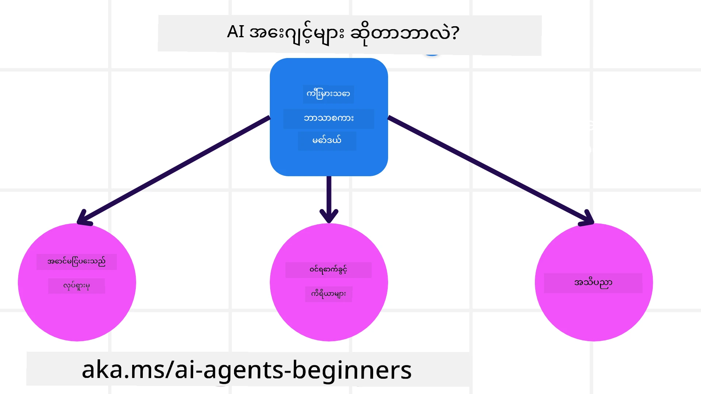
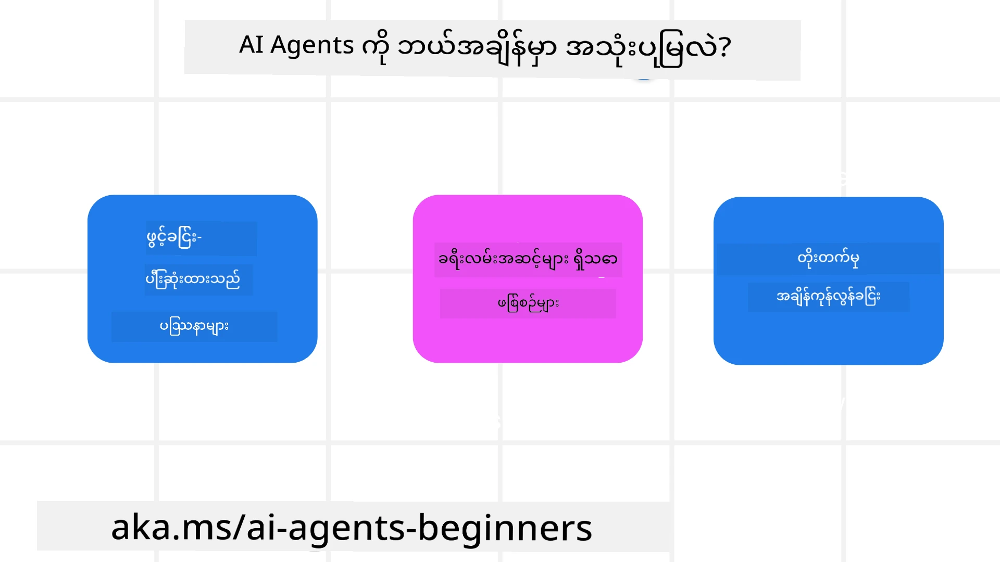

> _(ဤသင်ခန်းစာအတွက် ဗီဒီယိုကို ကြည့်ရန် ဓာတ်ပုံကို နှိပ်ပါ)_

# AI ကိုယ်စားလှယ်များ နှင့် ကိုယ်စားလှယ် သုံးစွဲမှု များအတွက် နိဒါန်း

**AI ကိုယ်စားလှယ်များအတွက် စတင်သူများ** သင်တန်းသို့ကြိုဆိုပါသည်! ဤသင်တန်းသည်တည်ဆောက် ပုံမှန်အသိပညာနှင့် သက်သေခံအလုပ်လုပ်သောကုဒ်တို့ဖြင့် AI ကိုယ်စားလှယ်များကို စတင်တည်ဆောက်နိုင်ရန် အခြေခံများကို ပေးသည်။

<a href="https://discord.gg/kzRShWzttr" target="_blank">Azure AI Discord Community</a> တွင် ကြိုဆိုပါတယ် — ဤနေရာတွင် သင်ယူနေသူများနှင့် AI ဖန်တီးသူများရှိပြီး မေးခွန်းများကို နှုတ်ဆက်ပေးကြသည်။

တည်ဆောက်မှုကို စတင်မတုန်းမှာ AI ကိုယ်စားလှယ်ဆိုတာ ဘာလိုလဲ၊ ဘယ်အချိန်မှာ သုံးရမလဲဆိုတာ ကိုပိုင်စွမ်းစွယ်စုံ နားလည်ထားဖို့လိုပါတယ်။

---

## နိဒါန်း

ဤသင်ခန်းစာတွင် ပါဝင်သောအကြောင်းအရာများမှာ –

- AI ကိုယ်စားလှယ်များဆိုတာ ဘာလဲ၊ အမျိုးအစားများ
- AI ကိုယ်စားလှယ်များ သင့်လျော်သော လုပ်ငန်းများ
- ကိုယ်စားလှယ်ဖြေရှင်းချက်ရေးဆွဲရာတွင် အသုံးပြုမည့် အခြေခံ ထုတ်လုပ်ပစ္စည်းများ

## သင်ယူရမည့်ရည်မှန်းချက်များ

ဤသင်ခန်းစာပြီးဆုံးသည့်အချိန်တွင် အောက်ပါအရာများကို လုပ်နိုင်သင့်သည် –

- AI ကိုယ်စားလှယ်ဆိုတာဘာလဲ၊ ပုံမှန် AI ဖြေရှင်းချက်တစ်ခုနှင့် ဘယ်လိုကွဲပြားသနည်း ရှင်းပြနိုင်ရန်
- ဘယ်အချိန်တွင် AI ကိုယ်စားလှယ်ကို အသုံးပြုရမလဲ (နှင့် ဘယ်အချိန်တွင် မသုံးသင့်ဘူး)
- ပြိုင်တူသော ပြဿနာတစ်ခုအတွက် ကိုယ်စားလှယ် ဖြေရှင်းချက် ဒီဇိုင်း အကြမ်းဖျဉ်းရေးဆွဲနိုင်ရန်

---

## AI ကိုယ်စားလှယ်များသတ်မှတ်ခြင်းနှင့် AI ကိုယ်စားလှယ်အမျိုးအစားများ

### AI ကိုယ်စားလှယ်ဆိုတာဘာလဲ။

ရိုးရှင်းစွာရှင်းပြရမယ်ဆိုရင် –

> **AI ကိုယ်စားလှယ်များသည် ကြီးမားသောဘာသာစကားပုံစံများ (LLMs) ကို စဉ်ဆက်မှတ်သားခြင်းမဖြစ်ပဲ လုပ်ဆောင်နိုင်စေသည့် စနစ်များဖြစ်သည် - ကိရိယာများနှင့် နည်းပညာအသိပညာများကို ပေး၍ လောကကြီးမှာ လှုပ်ရှားနိုင်စေသည်။**

ဤအတိုင်းပြောပြပါမယ် –

- **စနစ်** — AI ကိုယ်စားလှယ်သည် တစ်ခုတည်းသော အရာမဟုတ်ပါ။ အစိတ်အပိုင်းများ စုပေါင်းလုပ်ဆောင်နေသော စနစ်ဖြစ်သည်။ အုတ်မြစ်တွင် ကိုယ်စားလှယ်တိုင်းတွင် အပိုင်းသုံးခုရှိသည်။
  - **ပတ်ဝန်းကျင်** — ကိုယ်စားလှယ်သောတာစွမ်းဆောင်ရာနေရာ။ ခရီးသွားစာရင်းသွင်းရေးကိုယ်စားလှယ်အတွက် ဤမှာ စာရင်းသွင်းပလက်ဖောင်းသည်။
  - **အာရုံခံကိရိယာများ** — ကိုယ်စားလှယ်သည် သူ့ ပတ်ဝန်းကျင်၏ လက်ရှိအခြေအနေကို ဖတ်ရှုနည်း။ ခရီးသွားအေးဂျင်သည် ဟိုတယ်လက်ဝယ်မှု သို့မဟုတ် လေယာဉ်ဈေးနှုန်းများကို စစ်ဆေးနိုင်သည်။
  - **အဆောင်အအုံကိရိယာများ** — ကိုယ်စားလှယ်သည် လုပ်ဆောင်မှုလုပ်ပုံ။ ခရီးသွားအေးဂျင်သည် အခန်းမှာစာရင်းသွင်း၊ အတည်ပြုသက်သေ မက်ဆေ့ချ် ပို့၊ သို့မဟုတ်စာရင်းပယ်ဖျက်နိုင်သည်။

- **ကြီးမားသောဘာသာစကားပုံစံများ** — ကိုယ်စားလှယ်များသည် LLM မတည်ရှိခင်မှာ ရှိခဲ့ပေမယ့် LLM များက အသစ်သော ကိုယ်စားလှယ်များကို အားသာချက်များပေးသည်။ သူတို့သည် သဘာဝဘာသာစကားကို နားလည်နိုင်ပြီး၊ အကြောင်းအရာကို တွေးခေါ်နိုင်ပြီး၊ အသုံးပြုသူ တောင်းဆိုချက်ကို အ konkret မျိုးစံတစ်ခု ဖြစ်လာစေသည်။

- **လုပ်ဆောင်မှုများဆောင်ရွက်ခြင်း** — ကိုယ်စားလှယ်စနစ်မရှိဘဲ LLM သည် စာသားထုတ်ပေးခြင်းသာ ဖြစ်သည်။ ကိုယ်စားလှယ်စနစ်တွင် LLM သည် အဆင့်ဆင့် လုပ်ဆောင်မှုများကို တကယ်အပြီးသတ်နိုင်သည် - ဒေတာရှာဖွေခြင်း၊ API ခေါ်ဆိုခြင်း၊ ဆက်သွယ် စာပို့ခြင်း။ 

- **ကိရိယာများသုံးစွဲခြင်းခွင့်** — ကိုယ်စားလှယ်အသုံးပြုနိုင်မှုသည် (၁) ကိုယ်စားလှယ် လည်ပတ်နေသော ပတ်ဝန်းကျင်၊ နှင့် (၂) ဖန်တီးသူက ပေးလိုက်သည့်ကိရိယာများပေါ် မူတည်သည်။ ခရီးသွားအေးဂျင်သည် လေယာဉ်ရှာဖွေနိုင်ပေမယ့် ဖောက်သည်မှတ်တမ်းများ မပြုပြင်နိုင်ကြောင်းဖြစ်နိုင်သည် — သင့် လမ်းကြောင်းနှင့် ဆက်သွယ်ရမည့်ကိရိယာများပေါ်မူတည်သည်။

- **မှတ်ဉာဏ် + အသိပညာ** — ကိုယ်စားလှယ်များတွင် ထိပ်တိုက်မှတ်ဉာဏ် (လောလောဆယ် စကားပြောချက်) နှင့် ရှည်ရှည်လျားလျားမှတ်ဉာဏ် (ဖောက်သည် ဒေတာ, အတိတ်ဆက်ဆံမှု) ရှိသည်။ ခရီးသွားအေးဂျင်သည် သင် အပြတန့်ထိုင်ခုံများကို နှစ်သက်စိတ်ဝင်စားသည်ကို "မှတ်မိ" နိုင်သည်။

---

### AI ကိုယ်စားလှယ်အမျိုးအစားများ

ကိုယ်စားလှယ်အားလုံးသည် တူညီစွာ မတည်ဆောက်ကြပါ။ အောက်တွင် ခရီးသွားစာရင်းသွင်းကိုယ်စားလှယ်ကို ဥပမာပြ၍ အမျိုးအစားအဓိကများအား ဖော်ပြထားသည်။

| **ကိုယ်စားလှယ်အမျိုးအစား** | **လုပ်ဆောင်ချက်** | **ခရီးသွားအေးဂျင်ဥပမာ** |
|---|---|---|
| **ရိုးရိုးလေ့လာကြည့်တိုင်း ပြန်လည်တုံ့ပြန်တဲ့ ကိုယ်စားလှယ်များ** | အမှတ်တရစည်းကမ်းများအတိုင်းသာ လုပ်ဆောင် — မှတ်ဉာဏ်မရှိ၊ စီမံကိန်းမရေးပါ။ | တောင်းဆိုချက်အီးမေးလ်ကို မြင် → ဖောက်သည်ဝန်ဆောင်မှုဆီ ပို့သည်။ အဲဒါပဲ။ |
| **ပုံစံအပေါ် အခြေခံ ပြန်လည်တုံ့ပြန်ကိုယ်စားလှယ်များ** | ကမ္ဘာအပေါ် အတွင်းပိုင်းပုံစံကို ထိန်းသိမ်း၍ ပြောင်းလဲမှုများကို နောက်တစ်ကြိမ် update လုပ်သည်။ | ဦးစီးလေယာဉ်ဈေးနှုန်းမှတ်တမ်းများကိုပြုစု၊ ပြင်းထန်စွာ မြင့်တက်လာသော လမ်းကြောင်းများကို သတိပေးသည်။ |
| **ရည်မှန်းချက်အပေါ် အခြေခံ ကိုယ်စားလှယ်များ** | ရည်မှန်းချက်တစ်ခုရှိပြီး အဆင့်ဆင့် ပစ်မှတ်ကို ရောက်ရှိဖို့ ရှာဖွေသည်။ | လက်ရှိတည်နေရာမှ သင့်ပစ်မှတ်သို့ လေယာဉ်၊ ကား၊ ဟိုတယ် စသည်ဖြင့် ခရီးစဉ်စုံစာရင်းသွင်း။ |
| **တန်ဖိုးအပေါ်အခြေခံ ကိုယ်စားလှယ်များ** | ဖြေရှင်းချက်တစ်ခုသာ မဟုတ်ဘဲ လုပ်ငန်းစဉ်များအတွင်း အကောင်းဆုံးဖြေရှင်းချက်ကို ရှာဖွေသည်။ | စျေးနှုန်း နှင့် အဆင်ပြေမှုကိုချိန်ညှိပြီး သင့်စိတ်ကြိုက်မွမ်းမံခရီးကို ရှာပါ။ |
| **သင်ယူတိုးတက်သော ကိုယ်စားလှယ်များ** | တုံ့ပြန်မှုမှ သင်ယူပြီး အချိန်ကြာသမျှ တိုးတက်လာသည်။ | ခရီးပြီးသည့်စမ်းသပ်မှုရလဒ်များအပေါ် မူတည်၍ အနာဂတ်စာရင်းသွင်းအကြံပြုချက်များ ပြင်ဆင်သည်။ |
| **အဆင့်လိုက် ကိုယ်စားလှယ်များ** | အပေါ်အဆင့်ကိုယ်စားလှယ်တစ်ခုသည် အလုပ်ကို အသေးစိတ် ဝေစု၍ အောက်ဆုံးအဆင့် ကိုယ်စားလှယ်များကို ညွှန်ပြသည်။ | "ခရီးပယ်ဖျက်" တောင်းဆိုချက်ကို လေယာဉ်ပယ်ဖျက်၊ ဟိုတယ်ပယ်ဖျက်၊ ကားငှားစနစ်ပယ်ဖျက် စသဖြင့် အပိုင်းလိုက်ခွဲပြီး အောက်ဆုံးကိုယ်စားလှယ်များက ကိုင်တွယ်သည်။ |
| **အများအပြား ကိုယ်စားလှယ်စနစ်များ (MAS)** | အလိုအလျောက် လုပ်ဆောင်သော ကိုယ်စားလှယ်များစုပေါင်း (သို့မဟုတ် ယှဉ်ပြိုင်) လုပ်ဆောင်သည်။ | ပူးပေါင်းဆောင်ရွက်ခြင်း – ဟိုတယ်များ၊ လေယာဉ်များနှင့် ဖျော်ဖြေရေးကို ကိုယ်စားလှယ် ကွဲပြားစွာ ကိုင်တွယ်သည်။ ယှဉ်ပြိုင်ခြင်း – အများအပြား ကိုယ်စားလှယ်များဟိုတယ်ခန်းများကို စျေးနှုန်းကောင်းဆုံးဖြင့် ဖြည့်စွက်ရန် ယှဉ်ပြိုင်သည်။ |

---

## AI ကိုယ်စားလှယ်များ ဘယ်အချိန်သုံးမလဲ

AI ကိုယ်စားလှယ်ကို သုံးနိုင်တယ်ဆိုတာ ဘယ်အချိန်မှာမဆို သုံးသင့်တယ်ဆိုတာ မဟုတ်ပါ။ ဒီနေရာတွေမှာ ကိုယ်စားလှယ်တွေ အထူးထွက်တွေ့ပါတယ်။

- **အဆက်မပြတ်သော ပြဿနာများ** — ပြဿနာဖြေရှင်းရန်အဆင့်များကို ကြိုတင်အစီအစဉ်မရေးနိုင်သောအခါ။ LLM သည် လမ်းကြောင်းကို မျှတအောင် တွက်ချက်နိုင်ဖို့လိုသည်။
- **အဆင့်အတန်းများစီမံခန့်ခွဲရေး** — တစ်ချက်တည်းရှာဖွေခြင်း သို့မဟုတ် ဖန်တီးခြင်းမဟုတ်သော ကိရိယာများကို အဆက်မပြတ် သုံးရသော လုပ်ငန်းများ။
- **အချိန်ကြာလာသည်နှင့် တိုးတက်မှု** — အသုံးပြုသူတုံ့ပြန်မှု သို့မဟုတ် ပတ်ဝန်းကျင် အချက်အလက်များအား အခြေခံ၍ စနစ်သည် ပညာမြင့်လာစေချင်သောအခါ။

ယခုသင်တန်းတွင် AI ကိုယ်စားလှယ်များကို ဘယ်အချိန်သုံးသင့်၊ မသုံးသင့် ဆိုတာကို **ယုံကြည်စိတ်ချရသော AI ကိုယ်စားလှယ်များတည်ဆောက်ခြင်း** သင်ခန်းစာတွင် နက်ရှိုင်းစွာ အတူတကွ လေ့လာမည် ဖြစ်သည်။

---

## ကိုယ်စားလှယ်ဖြေရှင်းချက် ဖွဲ့စည်းခြင်း အခြေခံစိတ်

### ကိုယ်စားလှယ်ဖွံ့ဖြိုးတိုးတက်မှု

ကိုယ်စားလှယ်တစ်ယောက် တည်ဆောက်ရာတွင် ပထမဦးဆုံး သတ်မှတ်ရန် အချက်မှာ *လက်ရှိလက်တွေ့လုပ်နိုင်စွမ်း* ဖြစ်သည် - သူ၏ကိရိယာများ၊ လှုပ်ရှားမှုများနှင့် သဘောထားများ။

ဤသင်တန်းတွင် ကျွန်တော်တို့သည် **Microsoft Foundry Agent Service** ကို အဓိကပလက်ဖောင်းအဖြစ်အသုံးပြုသည်။ ၎င်းသည် -

- OpenAI, Mistral, Meta (Llama) ကဲ့သို့သော ပံ့ပိုးပေးသူမှ မော်ဒယ်များ
- Tripadvisor ကဲ့သို့သော ပံ့ပိုးပေးသူမှ လိုင်စင် ရရှိထားသော ဒေတာများ
- OpenAPI 3.0 ကိရိယာ သတ်မှတ်ချက်များကို စံပြအဖြစ် ပံ့ပိုးမှု။

### ကိုယ်စားလှယ်ပုံစံများ

LLM များနှင့် ဆက်သွယ်ရာတွင် prompt များဖြင့်ပြုလုပ်သည်။ ကိုယ်စားလှယ်များတွင် တစ်ချက်ချင်းချင်း prompt ကို လက်ဖြင့်ရေးသားမလို့မရ - ကိုယ်စားလှယ်သည် အဆင့်အတန်းများတွင် လှုပ်ရှားရမည်။ ထိုအတွက် **ကိုယ်စားလှယ်ပုံစံများ** သည် LLM များအား စနစ်တကျ နှင့် ယုံကြည်စိတ်ချရမှုရှိစွာ ဦးစီး လုပြီး ရေးဆွဲမှုများအတွက် ပြန်လည်အသုံးပြုနိုင်သော မဟာဗျူဟာများ ဖြစ်သည်။

ဤသင်တန်းသည် အများဆုံး အသုံးဝင်ပြီး ကိုယ်စားလှယ်ပုံစံများပေါ်မှာ တည်ဆောက်ထားသည်။

### ကိုယ်စားလှယ်ဖွဲ့စည်းပုံများ

ကိုယ်စားလှယ်ဖွဲ့စည်းပုံများသည် ဖန်တီးသူများကို တိုက်ရိုက် အသုံးပြုနိုင်သော နမူနာများ၊ ကိရိယာများ၊ ဖွဲ့စည်းပုံများနှင့် အခြေခံအဆောက်အအုံ ပံ့ပိုးပေးသည်။ ၎င်းတို့သည် လွယ်ကူစွာလုပ်ဆောင်နိုင်ရန်ကူညီသည်။ 

- ကိရိယာများနှင့် စွမ်းရည်များ ကို ချိတ်ဆက်ခြင်း
- ကိုယ်စားလှယ်၏ လုပ်ဆောင်ချက်ကြိုးကို ကြည့်ရှု (အမှားဖြစ်ရင် ဖြေရှင်း)
- ကိုယ်စားလှယ်များ အများကြား အတူတကွ လုပ်ဆောင်ခြင်း

ဤသင်တန်းတွင် ကျွန်တော်တို့သည် ထုတ်လုပ်မှုအဆင်ပြေသော ကိုယ်စားလှယ်များ ဖန်တီးရာတွင် **Microsoft Agent Framework (MAF)** ကို အဓိက သုံးထားသည်။

---

## ကုဒ်နမူနာများ

လက်တွေ့ကြည့်ရှူရန် အသင့်ဖြစ်ပြီလား? ဤသင်ခန်းစာအတွက် ကုဒ်နမူနာများမှာ -

- 🐍 Python: [Agent Framework](./code_samples/01-python-agent-framework.ipynb)
- 🔷 .NET: [Agent Framework](./code_samples/01-dotnet-agent-framework.md)

---

## မေးခွန်းများရှိပါသလား?

အခြား သင်ယူသူများနှင့် ချိတ်ဆက်ရန်၊ အလုပ်ချိန်များတက်ရောက်ရန်နှင့် AI ကိုယ်စားလှယ် မေးခွန်းရရှိရန် [Microsoft Foundry Discord](https://discord.com/invite/ATgtXmAS5D) တွင် ပါဝင်ဆောင်ရွက်ပါ။

---

## ယခင်သင်ခန်းစာ

[Course Setup](../00-course-setup/README.md)

## နောက်တန်းသင်ခန်းစာ

[Exploring Agentic Frameworks](../02-explore-agentic-frameworks/README.md)

---

<!-- CO-OP TRANSLATOR DISCLAIMER START -->
**ပြောကြားချက်**
ဤစာတမ်းကို AI ဘာသာပြန်ဝန်ဆောင်မှု [Co-op Translator](https://github.com/Azure/co-op-translator) အသုံးပြု၍ ဘာသာပြန်ထားပါသည်။ ကျွန်ုပ်တို့သည် တိကျမှန်ကန်မှုအတွက် ကြိုးပမ်းနေသော်လည်း၊ စက်ကိရိယာဘာသာပြန်ခြင်းများတွင် အမှားများ သို့မဟုတ် မှားယွင်းချက်များ ပါဝင်နိုင်ကြောင်း သတိပြုပါရန် လိုအပ်ပါသည်။ မူလစာတမ်းကို မူရင်းဘာသာဖြင့်သာ ယုံကြည်စိတ်ချရသော အချက်အလက်အဖြစ် သတ်မှတ်သင့်သည်။ အရေးကြီးသည့် သတင်းအချက်အလက်များအတွက် ပရော်ဖက်ရှင်နယ် လူသားဘာသာပြန်သူဝန်ဆောင်မှုကို အကြံပြုပါသည်။ ဤဘာသာပြန်ချက်ကို အသုံးပြုခြင်းမှ ဖြစ်ပေါ်လာသော နားလည်မှုကွာခြားမှုများ သို့မဟုတ် မမှန်ကန်သော အသုံးပြုမှုများအတွက် ကျွန်ုပ်တို့ တာဝန်မခံပါ။
<!-- CO-OP TRANSLATOR DISCLAIMER END -->