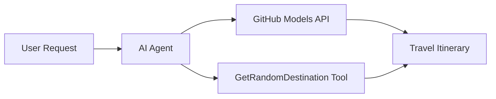

# 🌍 Microsoft Agent Framework (.NET) ဖြင့် AI ခရီးသွားအကျိုးဆောင်

## 📋 အခြေအနေအကျဉ်းချုပ်

ဒီ notebook က Microsoft Agent Framework for .NET ကို အသုံးပြုပြီး အတတ်နိုင်ဆုံး ခရီးစဉ်အစီအစဉ်ရေးဆွဲနိုင်တဲ့ အတတ်ပညာရှိ ခရီးသွားအကျိုးဆောင်တစ်ဦးကို တည်ဆောက်ပုံကို ပြသထားပါတယ်။ ဒီအကျိုးဆောင်က ကမ္ဘာတစ်ဝှမ်းရှိ အခွင့်အရေးကောင်းတဲ့နေရာများအတွက် တစ်နေ့တာခရီးစဉ်အစီအစဉ်ကို ကိုယ်ပိုင်အလိုက် ပြုလုပ်ပေးနိုင်ပါတယ်။

**အဓိကစွမ်းရည်များ:**
- 🎲 **အခွင့်အရေးကောင်းတဲ့နေရာရွေးချယ်မှု**: အကျိုးဆောင်အတွက် `GetRandomDestination()` ဆိုတဲ့ custom tool ကို အသုံးပြု
- 🗺️ **အတတ်ပညာရှိ ခရီးစဉ်အစီအစဉ်ရေးဆွဲမှု**: တစ်နေ့စီအတွက် အသေးစိတ်အစီအစဉ်များကို ဖန်တီးပေး
- 🔄 **အချိန်နှင့်တပြေးညီ Streaming**: ချက်ချင်းနှင့် Streaming အဖြေများကို ပံ့ပိုးပေး
- 🛠️ **Custom Tool ပေါင်းစပ်မှု**: အကျိုးဆောင်စွမ်းရည်များကို တိုးချဲ့ပုံကို ပြသ

## 🔧 နည်းပညာဆိုင်ရာ ဖွဲ့စည်းပုံ

### အဓိကနည်းပညာများ
- **Microsoft Agent Framework**: AI အကျိုးဆောင်ဖွံ့ဖြိုးရေးအတွက် .NET implementation အသစ်
- **GitHub Models Integration**: GitHub ရဲ့ AI model inference service ကို အသုံးပြု
- **OpenAI API Compatibility**: OpenAI client libraries ကို custom endpoints ဖြင့် အသုံးပြု
- **Secure Configuration**: API key များကို ပတ်ဝန်းကျင်အခြေခံစနစ်ဖြင့် စီမံခန့်ခွဲမှု

### အဓိကအစိတ်အပိုင်းများ
1. **AIAgent**: စကားဝိုင်းလှုပ်ရှားမှုကို စီမံခန့်ခွဲတဲ့ အဓိကအကျိုးဆောင်
2. **Custom Tools**: အကျိုးဆောင်အတွက် ရရှိနိုင်တဲ့ `GetRandomDestination()` function
3. **Chat Client**: GitHub Models-backed စကားဝိုင်း interface
4. **Streaming Support**: အချိန်နှင့်တပြေးညီ အဖြေဖန်တီးမှုစွမ်းရည်

### ပေါင်းစပ်မှုပုံစံ


## 🚀 စတင်အသုံးပြုခြင်း

**လိုအပ်ချက်များ:**
- .NET 9.0 သို့မဟုတ် အထက်
- GitHub Models API access token
- `.env` ဖိုင်တွင် ပတ်ဝန်းကျင် variable များကို စီမံထားရှိ

**လိုအပ်သော ပတ်ဝန်းကျင် variable များ:**
```env
GITHUB_TOKEN=your_github_token
GITHUB_ENDPOINT=https://models.inference.ai.azure.com
GITHUB_MODEL_ID=gpt-4o-mini
```

အောက်ပါ cells များကို အစဉ်လိုက် run လုပ်ပြီး ခရီးသွားအကျိုးဆောင်ရဲ့ လုပ်ဆောင်မှုကို ကြည့်ရှုပါ!

---

## .NET Single File App: AI Travel Agent Example

See `01-dotnet-agent-framework.cs` for the complete runnable code sample.

အောက်ပါကုဒ်နမူနာကို run ပါ:

```bash
dotnet run 01-dotnet-agent-framework.cs
```

### Sample Code

```csharp
static string GetRandomDestination()
{
    var destinations = new List<string>
    {
        "Paris, France",
        "Tokyo, Japan",
        "New York City, USA",
        "Sydney, Australia",
        "Rome, Italy",
        "Barcelona, Spain",
        "Cape Town, South Africa",
        "Rio de Janeiro, Brazil",
        "Bangkok, Thailand",
        "Vancouver, Canada"
    };
    var random = new Random();
    int index = random.Next(destinations.Count);
    return destinations[index];
}

// Extract configuration from environment variables
var github_endpoint = Environment.GetEnvironmentVariable("GITHUB_ENDPOINT") ?? throw new InvalidOperationException("GITHUB_ENDPOINT is not set.");
var github_model_id = Environment.GetEnvironmentVariable("GITHUB_MODEL_ID") ?? "gpt-4o-mini";
var github_token = Environment.GetEnvironmentVariable("GITHUB_TOKEN") ?? throw new InvalidOperationException("GITHUB_TOKEN is not set.");

// Configure OpenAI Client Options
var openAIOptions = new OpenAIClientOptions()
{
    Endpoint = new Uri(github_endpoint)
};

// Initialize OpenAI Client with GitHub Models Configuration
var openAIClient = new OpenAIClient(new ApiKeyCredential(github_token), openAIOptions);

// Create AI Agent with Travel Planning Capabilities
AIAgent agent = openAIClient
    .GetChatClient(github_model_id)
    .CreateAIAgent(
        instructions: "You are a helpful AI Agent that can help plan vacations for customers at random destinations",
        tools: [AIFunctionFactory.Create(GetRandomDestination)]
    );

// Execute Agent: Plan a Day Trip (Non-Streaming)
Console.WriteLine(await agent.RunAsync("Plan me a day trip"));

// Execute Agent: Plan a Day Trip (Streaming Response)
await foreach (var update in agent.RunStreamingAsync("Plan me a day trip"))
{
    Console.Write(update);
}
```
