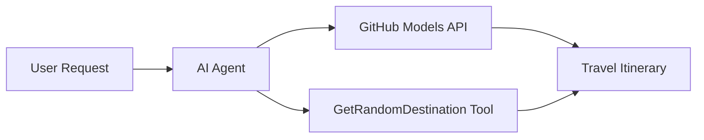

<!--
CO_OP_TRANSLATOR_METADATA:
{
  "original_hash": "23afd9be7b6ba5b69a44c3b6a78e07f6",
  "translation_date": "2025-11-06T10:07:14+00:00",
  "source_file": "01-intro-to-ai-agents/code_samples/01-dotnet-agent-framework.md",
  "language_code": "my"
}
-->
# 🌍 Microsoft Agent Framework (.NET) ဖြင့် AI ခရီးသွားအေးဂျင့်

## 📋 အခြေအနေအကျဉ်းချုပ်

ဒီ notebook က Microsoft Agent Framework for .NET ကို အသုံးပြုပြီး အတတ်နိုင်ဆုံး ခရီးစဉ်အစီအစဉ်ရေးဆွဲနိုင်တဲ့ အေးဂျင့်တစ်ခုကို တည်ဆောက်ပုံကို ပြသထားပါတယ်။ အေးဂျင့်က ကမ္ဘာတစ်ဝှမ်းရှိ အခွင့်အရေးရှိတဲ့နေရာများအတွက် ကိုယ်ပိုင်နေ့စဉ်ခရီးစဉ်အစီအစဉ်များကို အလိုအလျောက် ဖန်တီးပေးနိုင်ပါတယ်။

**အဓိကစွမ်းရည်များ:**
- 🎲 **အခွင့်အရေးရှိတဲ့နေရာရွေးချယ်မှု**: အေးဂျင့်အတွက် custom tool ကို အသုံးပြု၍ ခရီးစဉ်နေရာများကို ရွေးချယ်ပေးသည်
- 🗺️ **အတတ်နိုင်ဆုံး ခရီးစဉ်အစီအစဉ်ရေးဆွဲမှု**: နေ့စဉ်ခရီးစဉ်အစီအစဉ်များကို အသေးစိတ်ဖန်တီးပေးသည်
- 🔄 **အချိန်နှင့်တပြေးညီ Streaming**: ချက်ချင်းနှင့် Streaming အဖြေများကို ပံ့ပိုးပေးသည်
- 🛠️ **Custom Tool ပေါင်းစည်းမှု**: အေးဂျင့်စွမ်းရည်များကို တိုးချဲ့ပုံကို ပြသသည်

## 🔧 နည်းပညာဆောက်လုပ်ပုံ

### အဓိကနည်းပညာများ
- **Microsoft Agent Framework**: AI အေးဂျင့်ဖွံ့ဖြိုးရေးအတွက် .NET implementation အသစ်
- **GitHub Models Integration**: GitHub ရဲ့ AI model inference service ကို အသုံးပြုသည်
- **OpenAI API Compatibility**: OpenAI client libraries ကို custom endpoints ဖြင့် အသုံးပြုသည်
- **Secure Configuration**: API key များကို ပတ်ဝန်းကျင်အခြေခံစနစ်ဖြင့် စီမံခန့်ခွဲသည်

### အဓိကအစိတ်အပိုင်းများ
1. **AIAgent**: စကားဝိုင်းလှည့်ပတ်မှုကို စီမံခန့်ခွဲသော အဓိကအေးဂျင့်
2. **Custom Tools**: `GetRandomDestination()` function ကို အေးဂျင့်အတွက် ရရှိနိုင်သည်
3. **Chat Client**: GitHub Models-backed စကားဝိုင်း interface
4. **Streaming Support**: အချိန်နှင့်တပြေးညီ အဖြေဖန်တီးမှုစွမ်းရည်

### ပေါင်းစည်းမှုပုံစံ


## 🚀 စတင်အသုံးပြုခြင်း

**လိုအပ်ချက်များ:**
- .NET 10.0 သို့မဟုတ် အထက်
- GitHub Models API access token
- `.env` ဖိုင်တွင် ပတ်ဝန်းကျင် variable များကို စီမံထားရှိရန်

**လိုအပ်သော ပတ်ဝန်းကျင် variable များ:**
```env
GITHUB_TOKEN=your_github_token
GITHUB_ENDPOINT=https://models.inference.ai.azure.com
GITHUB_MODEL_ID=gpt-4o-mini
```

အောက်ပါ code ကို အဆင့်လိုက် အကောင်အထည်ဖော်ပြီး ခရီးသွားအေးဂျင့်၏ လုပ်ဆောင်မှုကို ကြည့်ရှုပါ။

---

## .NET Single File App: AI ခရီးသွားအေးဂျင့် နမူနာ

`01-dotnet-agent-framework.cs` တွင် အပြည့်အစုံရနိုင်သော code နမူနာကို ကြည့်ရှုပါ။

```bash
dotnet run 01-dotnet-agent-framework.cs
```

### နမူနာ Code

```csharp
static string GetRandomDestination()
{
    var destinations = new List<string>
    {
        "Paris, France",
        "Tokyo, Japan",
        "New York City, USA",
        "Sydney, Australia",
        "Rome, Italy",
        "Barcelona, Spain",
        "Cape Town, South Africa",
        "Rio de Janeiro, Brazil",
        "Bangkok, Thailand",
        "Vancouver, Canada"
    };
    var random = new Random();
    int index = random.Next(destinations.Count);
    return destinations[index];
}

// Extract configuration from environment variables
var github_endpoint = Environment.GetEnvironmentVariable("GITHUB_ENDPOINT") ?? throw new InvalidOperationException("GITHUB_ENDPOINT is not set.");
var github_model_id = Environment.GetEnvironmentVariable("GITHUB_MODEL_ID") ?? "gpt-4o-mini";
var github_token = Environment.GetEnvironmentVariable("GITHUB_TOKEN") ?? throw new InvalidOperationException("GITHUB_TOKEN is not set.");

// Configure OpenAI Client Options
var openAIOptions = new OpenAIClientOptions()
{
    Endpoint = new Uri(github_endpoint)
};

// Initialize OpenAI Client with GitHub Models Configuration
var openAIClient = new OpenAIClient(new ApiKeyCredential(github_token), openAIOptions);

// Create AI Agent with Travel Planning Capabilities
AIAgent agent = openAIClient
    .GetChatClient(github_model_id)
    .CreateAIAgent(
        instructions: "You are a helpful AI Agent that can help plan vacations for customers at random destinations",
        tools: [AIFunctionFactory.Create(GetRandomDestination)]
    );

// Execute Agent: Plan a Day Trip (Non-Streaming)
Console.WriteLine(await agent.RunAsync("Plan me a day trip"));

// Execute Agent: Plan a Day Trip (Streaming Response)
await foreach (var update in agent.RunStreamingAsync("Plan me a day trip"))
{
    Console.Write(update);
}
```

---

**အကြောင်းကြားချက်**:  
ဤစာရွက်စာတမ်းကို AI ဘာသာပြန်ဝန်ဆောင်မှု [Co-op Translator](https://github.com/Azure/co-op-translator) ကို အသုံးပြု၍ ဘာသာပြန်ထားပါသည်။ ကျွန်ုပ်တို့သည် တိကျမှန်ကန်မှုအတွက် ကြိုးစားနေသော်လည်း အလိုအလျောက် ဘာသာပြန်မှုများတွင် အမှားများ သို့မဟုတ် မမှန်ကန်မှုများ ပါဝင်နိုင်သည်ကို သတိပြုပါ။ မူရင်းဘာသာစကားဖြင့် ရေးသားထားသော စာရွက်စာတမ်းကို အာဏာတရားရှိသော အရင်းအမြစ်အဖြစ် သတ်မှတ်သင့်ပါသည်။ အရေးကြီးသော အချက်အလက်များအတွက် လူက ဘာသာပြန်မှုကို အကြံပြုပါသည်။ ဤဘာသာပြန်မှုကို အသုံးပြုခြင်းမှ ဖြစ်ပေါ်လာသော အလွဲအမှားများ သို့မဟုတ် အနားလွဲမှုများအတွက် ကျွန်ုပ်တို့သည် တာဝန်မယူပါ။