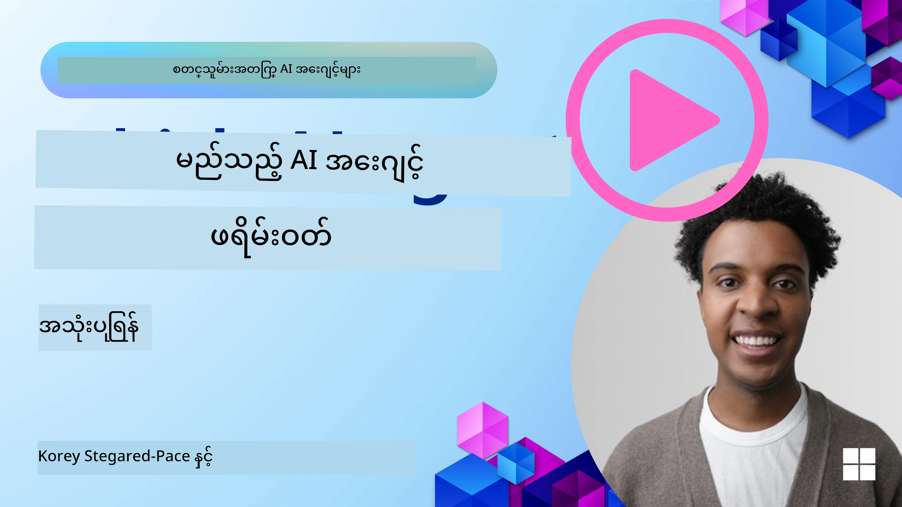

[](https://youtu.be/ODwF-EZo_O8?si=1xoy_B9RNQfrYdF7)

> _(ဤသင်ခန်းစာရဲ့ ဗီဒီယိုကို ကြည့်ရန် အပေါ်ဖော်ပြထားသော ပုံကို နှိပ်ပါ)_

# AI Agent Frameworks ကို ရှာဖွေပါ

AI agent framework များမှာ AI agent များကို ဖန်တီးခြင်း၊ ထုတ်ပေးခြင်း၊ နှင့် စီမံခန့်ခွဲခြင်းများကို လွယ်ကူစေရန် ဒီဇိုင်น์ထားတဲ့ ဆော့ဖ်ဝဲ ပလက်ဖောင်းများ ဖြစ်သည်။ ၎င်း framework များသည် ဖွံ့ဖြိုးရေးသူများအတွက် ကြိုတင်တည်ဆောက်ထားသော အစိတ်အပိုင်းများ၊ abstraction များနှင့် ကိရိယာများကို ပံ့ပိုးပေးကာ ဆက်စပ်သော ကိစ္စရပ်များကို လျှော့ချကူညီသည်။

ဤ framework များက ဖွံ့ဖြိုးရေးသူများကို သူတို့၏ အက်ပလီကေးရှင်းများ၏ ထူးခြားချက်များအပေါ် အာရုံစိုက်နိုင်စေရန် စံကျသော နည်းလမ်းများကို ပံ့ပိုးပေးသည်။ ၎င်းတို့က system များကို ပိုမိုချဲ့ထွင်နိုင်စေရန်၊ အသုံးပြုရ လွယ်ကူစေရန်နှင့် ထိရောက်မှုကိုတိုးမြှင့်သည့် အရာများကို ပံ့ပိုးပေးသည်။

## အကျဉ်းချုံး

ဤသင်ခန်းစာတွင် ရှင်းပြရမည့်အချက်များမှာ -

- AI Agent Frameworks ဆိုတာဘာလဲ၊ ဖွံ့ဖြိုးရေးသူများအား ဘာတွေ ပြုလုပ်ခွင့်ပြုပေးသလဲ?
- အဖွဲ့များသည် agent ၏ ဗဟုသုတနှင့် စွမ်းရည်များကို မြန်မြန်ဆန်ဆန် prototype ဖန်တီး၊ iterate နိုင်ရန် မည်သို့ အသုံးချနိုင်သလဲ?
- Microsoft (<a href="https://aka.ms/ai-agents-beginners/ai-agent-service" target="_blank">Azure AI Agent Service</a> နှင့် <a href="https://learn.microsoft.com/azure/ai-services/openai/how-to/responses" target="_blank">Microsoft Agent Framework</a>) မှ ဖန်တီးထားတဲ့ framework နှင့် ကိရိယာများအကြား မတူကွဲပြားချက်များက ဘာတွေလဲ?
- ကျွန်တော့်ရဲ့ ရှိပြီးသား Azure ecosystem ကိရိယာများကို တိုက်ရိုက် ထည့်သွင်းအသုံးပြုနိုင်မလား၊ ဒါမှမဟုတ် သီးခြား ဖြေရှင်းချက်များလိုအပ်မလား?
- Azure AI Agents service ဆိုတာဘာလဲ၊ ဤ service က ကျွန်တော့်ကို မည်သို့ ကူညီနေလဲ?

## သင်ယူရမည့် ရည်မှန်းချက်များ

ဤသင်ခန်းစာ၏ ရည်မှန်းချက်များမှာ သင့်အား အောက်ပါများကို နားလည်နိုင်စေရန်ဖြစ်သည်။

- AI ဖွံ့ဖြိုးရေးတွင် AI Agent Frameworks ၏ အခန်းကဏ္ဍ။
- အသေချာ Intelligent agent များ ဖန်တီးရန် AI Agent Frameworks ကို မည်သို့ အသုံးချရမည်နည်း။
- AI Agent Frameworks ကပေးနိုင်သည့် အဓိက စွမ်းရည်များ။
- Microsoft Agent Framework နှင့် Azure AI Agent Service တို့အကြား မတူကွဲပြားချက်များ။

## AI Agent Frameworks ဆိုတာဘာလဲ၊ ဖွံ့ဖြိုးရေးသူများအား ဘာတွေ ပြုလုပ်ခွင့်ပြုပေးသလဲ?

ရိုးရာ AI Frameworks များက သင့်အက်ပလီကေးရှင်းများထဲသို့ AI ကို ထည့်သွင်းကာ ဤအက်ပလီကေးရှင်းများကို အောက်ပါနည်းလမ်းများဖြင့် ကောင်းမွန်စေပါသည်။

- **ပုဂ္ဂိုလ်မိရေး(Customization/Personalization)**: AI သည် အသုံးပြုသူ လုပ်ရပ်များနှင့် နှစ်သက်ချက်များကို ဗေဒင်ကောက်ချက်ချကာ ကိုယ်ပိုင် အကြံပြုချက်များ၊ အကြောင်းအရာများနှင့် အသုံးပြုသူ အတွေ့အကြုံများကို ပေးနိုင်သည်။
  ဥပမာ: Netflix စသည့် streaming services များက AI ကို အသုံးပြု၍ ကြည့်ရှုမှတ်တမ်းအပေါ် အခြေခံ၍ ရုပ်ရှင်များနှင့် ပြဇာတ်များကို အကြံပြုကာ အသုံးပြုသူ စိတ်ဝင်စားမှုနှင့် ကျေနပ်မှုကို မြှင့်တင်သည်။
- **အလိုအလျောက်လုပ်ဆောင်ခြင်းနှင့် ထိရောက်မှု**: AI သည် အကြိမ်ကြိမ် ပြန်လုပ်ရသော လုပ်ငန်းများကို အလိုအလျောက်လုပ်ဆောင်ပေးနိုင်ပြီး workflow များကို ရိုးရွင်းစေကာ လုပ်ငန်းစဉ် ထိရောက်မှုကို တိုးတက်စေသည်။
  ဥပမာ: ဖောက်သည်ဝန်ဆောင်မှု အက်ပလီကေးရှင်းများတွင် AI စနစ်ဖြင့် ဖန်တီးထားသော chatbot များကို အသုံးပြု၍ ပုံမှန် မေးခွန်းများကို ကိုင်တွယ်ပေးကာ အဖြေချိန်များကို လျော့ချပြီး လူ့အင်အားများကို ပို၍ မျက်နှာကြီး အခက်အခဲများဆိုင်ရာများအတွက် သီးသန့်ထားနိုင်စေသည်။
- **အသုံးပြုသူအတွေ့အကြုံ တိုးတက်စေမှု**: AI သည် အသံ အသိခံခြင်း၊ သဘာဝဘာသာစကား ကိုင်တွယ်ခြင်း (NLP)၊ နှင့် စကားလုံးခန့်မှန်းရေးစသည့် မျိုးစုံသော အထူးစွမ်းဆောင်ချက်များကို ပေးပြီး အသုံးပြုသူ အတွေ့အကြုံကို တိုးတက်စေသည်။
  ဥပမာ: Siri နဲ့ Google Assistant စသည့် virtual assistants များသည် အသုံးပြုသူ၏ အသံ အညွှန်းများကို နားလည်ကာ တုံ့ပြန်ပေးနိုင်သည်၊ ထို့ကြောင့် ဧည့်သည်များအနေဖြင့် သူတို့၏ စက်ပစ္စည်းများနှင့် ပိုမိုလွယ်ကူစွာ ဆက်သွယ်နိုင်စေသည်။

### အခုအပေါ်က အကုန်ကောင်းသေးတယ်၊ ဒါပေမယ့် AI Agent Framework လိုအပ်သလား?

AI Agent framework များသည် ရိုးရိုး AI framework များထက် ပို၍ ကြီးမားသော အရာတစ်ခုကို ကိုယ်စားပြုသည်။ ၎င်းတို့ကို အသုံးပြုရာတွင် အသုံးပြုသူများနှင့်၊ အခြား agent များနှင့်၊ ပတ်ဝန်းကျင်နှင့် အပြန်အလှန် ဆက်သွယ်နိုင်ပြီး သတ်မှတ်ထားသော ရည်မှန်းချက်များကို ပြည့်မီစေရန် သက်ဆိုင်သော intelligent agents များကို ဖန်တီးနိုင်ရန် ဒီဇိုင်းထုတ်ထားသည်။ ၎င်း agent များသည် ကိုယ်ပိုင် လုပ်ရပ်များ ပြုနိုင်ပြီး ဆုံးဖြတ်ချက်များ ချနိုင်ကာ ပြောင်းလဲနေသည့် အခြေအနေများအပေါ် ကိုက်ညီလျှင် အပြုပြင်ပြောင်းလဲနိုင်သည်။ AI Agent Framework များက ပံ့ပိုးပေးနိုင်သည့် အဓိက စွမ်းရည်များကို ကြည့်ကြပါစို့။

- **Agent များ၏ ပူးပေါင်းဆောင်ရွက်မှုနှင့် နှောင့်ယှက်မှု မရှိခြင်း**: လုပ်ငန်းခွဲခြားထားသည့် အကောင်အထည်ဖော် agent များကို တည်ဆောက်နိုင်၍ အတူတကွ အလုပ်လုပ်ကာ ဆက်သွယ် တြောငျ့ညှိနှိုင်းနိုင်စေရန် ပံ့ပိုးပေးသည်။
- **တာဝန် သတ်မှတ်ခြင်းနှင့် စီမံခန့်ခွဲမှု အလိုအလျောက်လုပ်ဆောင်ခြင်း**: multi-step workflow များကို အလိုအလျောက် ဆောင်ရွက်ရန်၊ တာဝန် ပေးအပ်ခြင်းနှင့် dynamic task management များကို ပံ့ပိုးပေးသည်။
- **အခြေအနေ ကို နားလည်ခြင်းနှင့် ကိုက်ညီပြောင်းလဲနိုင်ခြင်း**: agent များကို အခြေအနေကို နားလည်နိုင်စေရန်၊ ပတ်ဝန်းကျင် ပြောင်းလဲမှုများ ရှိလာပါက ကိုက်ညီ အပြုအမူ ပြောင်းလဲနိုင်ရန် အခွင့်အရေးပေးသည်။

အကျဉ်းချုံးမှာ၊ agent များက သင့်အား ပိုမိုများစွာ ပြုလုပ်နိုင်စေပြီး အလိုအလျောက်လုပ်ငန်းများကို နောက်ထပ်အဆင့်တက်စေကာ ပတ်ဝန်းကျင်ထဲကနေ သင်ယူယူပြီး ကိုက်ညီ လေ့လာနိုင်သည့် ပိုမိုသူသိလာသော စနစ်များ ဖန်တီးနိုင်စေသည်။

## agent ၏ စွမ်းရည်များကို မြန်မြန်ဆန်ဆန် prototype, iterate, နှင့် တိုးတက်စေရန် မည်သို့လုပ်မလဲ?

ဤကွင်းဆက်သည် အလျင်အမြန်တိုးတက်နေသော်လည်း အများအပြား AI Agent Frameworks များတွင် ရှိနေသော ပုံမှန် အချက်များရှိသည်။ ၎င်းတို့သည် module components, ပူးပေါင်းဆောင်ရွက်မှု ကိရိယာများ၊ နှင့် real-time learning တို့ဖြစ်ကြသည်။ အောက်တွင် အသေးစိတ်ကြည့်ပါ။

- **Module အစိတ်အပိုင်းများကို အသုံးပြုပါ**: AI SDK များတွင် AI နှင့် Memory connectors, natural language သို့မဟုတ် code plugins အသုံးပြု၍ function calling, prompt templates စသည့် ကြိုတင်တည်ဆောက်ထားသော အစိတ်အပိုင်းများပါရှိသည်။
- **ပူးပေါင်းဆောင်ရွက်မှုကိရိယာများကို အထောက်အကူပြုပါ**: agent များကို သတ်မှတ်ချက်များနှင့် တာဝန်များ ပေးသည့် ဖန်တီးခြင်းဖြင့် ပူးပေါင်းလုပ်ငန်းစဉ်များကို စမ်းသပ် ပြုပြင်နိုင်စေပါသည်။
- **တက်လှမ်းချိန်တွင် သင်ယူပါ (Learn in Real-Time)**: agent များ interaction များမှ သင်ယူ၍ သူတို့၏ အပြုအမူကို dynamic အနေဖြင့်၊ ပြင်ဆင်နိုင်သည့် feedback loop များကို ထည့်သွင်းဆောင်ရွက်နိုင်ပါသည်။

### Module အစိတ်အပိုင်းများကို အသုံးပြုခြင်း

Microsoft Agent Framework ကဲ့သို့သော SDK များသည် AI connectors, tool definition များ၊ agent management စသည်ဖြင့် ကြိုတင်တည်ဆောက်ထားသော component များကို ထောက်ပံ့ပေးသည်။

**အသင်းများ အနေနဲ့ ဘယ်လို အသုံးချနိုင်သလဲ**: အသင်းများသည် ၎င်း component များကို အလျင်အမြန် စုပေါင်းကာ စမ်းသပ်နိုင်သော functional prototype တစ်ခု ဖန်တီးနိုင်သည်၊ ထိုကြောင့် အပေါ်ယံ စမ်းသပ်မှုနှင့် iterate လုပ်ရာတွင် ထိရောက်စေသည်။

**လုပ်ဆောင်ပုံကို လက်တွေ့ကြည့်မယ်ဆို**: သင်သည် အသုံးပြုသူထဲက input မှ အချက်အလက်များကို အထောက်အပံ့ဖြင့် ထုတ်ယူရန် အတွက် ကြိုတင်တည်ဆောက်ထားသော parser တစ်ခု၊ data များကို သိမ်းဆည်းကာ ထုတ်ယူရန် memory module တစ်ခု၊ အသုံးပြုသူနှင့် ဆက်သွယ်ရန် prompt generator တစ်ခုကို အသုံးပြုနိုင်သည်။ ၎င်းအားလုံးကို သိုလှောင်ရန် သင်ကိုယ်တိုင် အစိတ်အပိုင်းများကို ပြန်လုပ်ရန် မလိုဘဲ အသုံးပြုနိုင်သည်။

**Example code**. Microsoft Agent Framework ကို `AzureAIProjectAgentProvider` နှင့် အတူ အသုံးပြု၍ model ကို အသုံးပြုသူ input အပေါ် tool calling ဖြင့် တုံ့ပြန်စေမည့် ဥပမာကို ကြည့်ပါ။

``` python
# Microsoft Agent Framework Python ကိုင်တွယ်မှုဥပမာ

import asyncio
import os
from typing import Annotated

from agent_framework.azure import AzureAIProjectAgentProvider
from azure.identity import AzureCliCredential


# ခရီးသွားစာရင်းမှာရန် နမူနာကိရိယာလုပ်ဆောင်ချက်ကို သတ်မှတ်ပါ
def book_flight(date: str, location: str) -> str:
    """Book travel given location and date."""
    return f"Travel was booked to {location} on {date}"


async def main():
    provider = AzureAIProjectAgentProvider(credential=AzureCliCredential())
    agent = await provider.create_agent(
        name="travel_agent",
        instructions="Help the user book travel. Use the book_flight tool when ready.",
        tools=[book_flight],
    )

    response = await agent.run("I'd like to go to New York on January 1, 2025")
    print(response)
    # ဥပမာရလဒ်: ၂၀၂၅ ခုနှစ် ဇန်နဝါရီ ၁ ရက်နေ့တွင် သင့် New York သို့ ပျံသန်းမှုကို အောင်မြင်စွာ မှတ်ပုံတင်ပြီး ဖြစ်ပါပြီ။ ခရီးသွားရာလမ်းမှာလုံခြုံပါစေ! ✈️🗽


if __name__ == "__main__":
    asyncio.run(main())
```

ဤဥပမာမှ သင်မြင်ရမည့်အချက်မှာ အသုံးပြုသူ input မှ လက်ရေးထည့်ချက်များ (ဥပမာ origin, destination, date အစရှိသည့် flight booking request အချက်အလက်များ) ကို ထုတ်ယူပေးနိုင်သော ကြိုတင်တည်ဆောက်ထားသော parser ကို မည်သို့ အသုံးချနိုင်သည်ကို ဖြစ်သည်။ ဤ modular လမ်းစနစ်က သင်အား high-level logic များပေါ် အာရုံစိုက်နိုင်စေသည်။

### ပူးပေါင်းဆောင်ရွက်မှုကိရိယာများကို အသုံးချပါ

Microsoft Agent Framework ကဲ့သို့သော framework များသည် အတူတကွ အလုပ်လုပ်နိုင်သည့် agent များကို ဖန်တီးရန် အထောက်အကူပြုသည်။

**အသင်းများ အနေနဲ့ ဘယ်လို အသုံးချနိုင်သလဲ**: အသင်းများသည် agent များကို သတ်မှတ်ထားသော ရာထူးများနှင့် တာဝန်များ ဖြင့် ဒီဇိုင်းဆွဲနိုင်သည်၊ ၎င်းအနေဖြင့် ပူးပေါင်းလုပ်ငန်းစဉ်များကို စမ်းသပ် ပြုပြင်၍ စနစ်၏ စွမ်းဆောင်ရည်ကို တိုးတက်စေသည်။

**လုပ်ဆောင်ပုံကို လက်တွေ့ကြည့်မယ်ဆို**: သင်သည် data retrieval, analysis, သို့မဟုတ် decision-making ကဲ့သို့ အထူးပြုလုပ်ဆောင်ချက်ရှိသည့် agent များကို တစ်စုလျှောက် ဖန်တီးနိုင်သည်။ ဤ agent များသည် ဆက်သွယ်ကာ အချက်အလက်များကို မျှဝေ၍ အသင်း၏ ရည်မှန်းချက်ကို တစ်ပြိုင်နက်တည်း ပြီးမြောက်စေသည်၊ ဥပမာ user query တစ်ခုကို ဖြေရှင်းခြင်း သို့မဟုတ် အလုပ်တစ်ခုကို ပြီးမြောက်စေခြင်း။

**Example code (Microsoft Agent Framework)**:

```python
# Microsoft Agent Framework ကို အသုံးပြု၍ အလုပ်လုပ်သော အေးဂျင့်များ များစွာ ဖန်တီးခြင်း

import os
from agent_framework.azure import AzureAIProjectAgentProvider
from azure.identity import AzureCliCredential

provider = AzureAIProjectAgentProvider(credential=AzureCliCredential())

# ဒေတာ ရယူမှု အေးဂျင့်
agent_retrieve = await provider.create_agent(
    name="dataretrieval",
    instructions="Retrieve relevant data using available tools.",
    tools=[retrieve_tool],
)

# ဒေတာ ခွဲခြမ်းစိတ်ဖြာမှု အေးဂျင့်
agent_analyze = await provider.create_agent(
    name="dataanalysis",
    instructions="Analyze the retrieved data and provide insights.",
    tools=[analyze_tool],
)

# တစ်ခုချင်း အေးဂျင့်များကို တာဝန်တစ်ခုတွင် အဆင့်လိုက် လည်ပတ်ခြင်း
retrieval_result = await agent_retrieve.run("Retrieve sales data for Q4")
analysis_result = await agent_analyze.run(f"Analyze this data: {retrieval_result}")
print(analysis_result)
```

ယခင် code ဥပမာတွင် မြင်ရသည့်အတိုင်း မျိုးစုံသော agent များကို အသုံးပြု၍ data ကို ချဲ့ထွင် လေ့လာသည့် task တစ်ခုကို မည်သို့ ဖန်တီးနိုင်သည်ကို ဖော်ပြထားသည်။ တစ်ဦးချင်းစီ agent သည် သတ်မှတ်ထားသည့် အလုပ်တာဝန်ကို ဆောင်ရွက်ပြီး ရလဒ်ရရှိအောင် agent များကို ညှိနှိုင်း၍ အလုပ်ကို အလိုအလျောက် ဆောင်ရွက်စေသည်။ အထူးပြု agent များကို ဖန်တီးခြင်းဖြင့် task ၏ ထိရောက်မှုနှင့် စွမ်းဆောင်ရည်ကို တိုးမြှင့်နိုင်သည်။

### တက်လှမ်းချိန်တွင် သင်ယူပါ (Learn in Real-Time)

တိုးတက်ပြီးသော framework များတွင် real-time context ကို နားလည်ခြင်းနှင့် ကိုက်ညီ ပြင်ဆင်နိုင်ရန် စွမ်းရည်များပါရှိသည်။

**အသင်းများ အနေနဲ့ ဘယ်လို အသုံးချနိုင်သလဲ**: အသင်းများသည် agent interaction များမှ သင်ယူကာ သူတို့၏ အပြုအမူကို dynamic အနေဖြင့် ပြင်ဆင်နိုင်သည့် feedback loop များကို ထည့်သွင်းနိုင်သည်၊ ၎င်းက စွမ်းရည်များကို အဆက်မပြတ် တိုးတက်စေသည်။

**လုပ်ဆောင်ပုံကို လက်တွေ့ကြည့်မယ်ဆို**: agent များသည် အသုံးပြုသူမှ ရရှိသည့် feedback, ပတ်ဝန်းကျင်ဒေတာများနှင့် task ရလဒ်များကို ခွဲခြမ်းစိစစ်ကာ သူတို့၏ knowledge base ကို update ပြုလုပ်နိုင်ပြီး ဆုံးဖြတ်ချက် ချမှု algorithm များကို ကိုက်ညီ ပြင်ဆင်နိုင်သည်။ ဤ iterative learning လုပ်ငန်းစဉ်က agent များအား ပြင်ဆင်နိုင်ခြင်းနှင့် အသုံးပြုသူနှစ်သက်မှုပေါ် အခြေခံ၍ ကိုက်ညီမှုအရ မျှော်လင့်ရသော အကျိုးသက်ရောက်မှုကို တိုးတက်စေသည်။

## Microsoft Agent Framework နှင့် Azure AI Agent Service တို့အကြား မတူကွဲပြားချက်များက ဘာတွေလဲ?

ဤနည်းလမ်းများကို နှိုင်းယှဉ်နိုင်သည့် နည်းလမ်းများ များစွာ ရှိသော်လည်း ၎င်းတို့၏ ဒီဇိုင်နာ၊ စွမ်းရည်များ၊ နှင့် ရည်ညွှန်းထားသည့် အသုံးပြုမှုကိစ္စများအား အောက်ပါအတိုင်း ကြည့်ရအောင်။

## Microsoft Agent Framework (MAF)

Microsoft Agent Framework သည် `AzureAIProjectAgentProvider` ကို အသုံးပြု၍ AI agent များကို တည်ဆောက်ရန် streamlined SDK ကို ပေးထားသည်။ ၎င်းက Azure OpenAI မော်ဒယ်များကို အသုံးပြုပြီး built-in tool calling, conversation management, နှင့် Azure identity မှတဆင့် စီးပွားရေးအဆင့် လုံခြုံရေးကို ပံ့ပိုးနိုင်စေရသည်။

**အသုံးပြုမှု အခန်းကဏ္ဍများ**: tool အသုံးပြုခြင်း၊ multi-step workflows နှင့် စီးပွားရေး အျပန်အလှန် ထည့်သွင်းမှုများနှင့် တွဲဖက်၍ production-ready AI agents များ ဖန်တီးရန်။

Microsoft Agent Framework ၏ အချို့သော အဓိက အယူအဆများမှာ -

- **Agents**. Agent တစ်ခုကို `AzureAIProjectAgentProvider` မှတစ်ဆင့် ဖန်တီးပြီး name, instructions, tools တို့ဖြင့် ဖွဲ့စည်းသည်။ agent သည်
  - **အသုံးပြုသူစာတိုများကို 프로से့စ်လုပ်ပြီး** Azure OpenAI မော်ဒယ်များကို အသုံးပြုကာ ဖြေကြားချက်များ ထုတ်ပေးနိုင်သည်။
  - **Tool များကို call လုပ်နိုင်သည်** conversation context အပေါ် အခြေခံ၍ အလိုအလျောက်။
  - **စကားပြောဆိုမှု အခြေနေကို ထိန်းသိမ်းနိုင်သည်** များစွာသော အပြန်အလှန်ဆက်ဆံမှုများအတွင်း။

  Agent ဖန်တီးရန် code snippet များကို အောက်တွင် ပြထားသည်။

    ```python
    import os
    from agent_framework.azure import AzureAIProjectAgentProvider
    from azure.identity import AzureCliCredential

    provider = AzureAIProjectAgentProvider(credential=AzureCliCredential())
    agent = await provider.create_agent(
        name="my_agent",
        instructions="You are a helpful assistant.",
    )

    response = await agent.run("Hello, World!")
    print(response)
    ```

- **Tools**. Framework သည် agent က အလိုအလျောက် ခေါ်ယူနိုင်သည့် Python function အဖြစ် tool များကို သတ်မှတ်ပေးရန် ထောက်ပံ့ပေးသည်။ Agent ဖန်တီးစဉ်တွင် tools များကို မှတ်ပုံတင်သည်။

    ```python
    def get_weather(location: str) -> str:
        """Get the current weather for a location."""
        return f"The weather in {location} is sunny, 72\u00b0F."

    agent = await provider.create_agent(
        name="weather_agent",
        instructions="Help users check the weather.",
        tools=[get_weather],
    )
    ```

- **Multi-Agent Coordination**. မျိုးစုံ အထူးပြုမှုရှိသည့် agent များကို ဖန်တီးကာ ၎င်းတို့၏ အလုပ်များကို ညှိနှိုင်းနိုင်သည်။

    ```python
    planner = await provider.create_agent(
        name="planner",
        instructions="Break down complex tasks into steps.",
    )

    executor = await provider.create_agent(
        name="executor",
        instructions="Execute the planned steps using available tools.",
        tools=[execute_tool],
    )

    plan = await planner.run("Plan a trip to Paris")
    result = await executor.run(f"Execute this plan: {plan}")
    ```

- **Azure Identity Integration**. Framework သည် `AzureCliCredential` (သို့မဟုတ် `DefaultAzureCredential`) ကို အသုံးပြုကာ လုံခြုံသည့် keyless authentication ကို ပေးပို့သည်၊ ထို့ကြောင့် API keys ကို တိုက်ရိုက် စီမံရန်မလိုအပ်ပဲ ဖြစ်သည်။

## Azure AI Agent Service

Azure AI Agent Service သည် Microsoft Ignite 2024 တွင် မိတ်ဆက်ခဲ့သည့် နောက်ဆုံးထပ်ထည့်သည့် ဝန်ဆောင်မှုတစ်ခုဖြစ်သည်။ ၎င်းက မြင်သာထားသော models များကိုပိုမိုလွယ်ကူစွာ အသုံးပြုနိုင်စေပြီး open-source LLM များ (ဥပမာ Llama 3, Mistral, Cohere) များကို တိုက်ရိုက် ခေါ်ယူနိုင်သည်။

Azure AI Agent Service သည် စီးပွားရေးအဆင့် လုံခြုံရေး မက်ကနိဇึမ်များနှင့် ဒေတာသိုလှောင်မှု နည်းလမ်းများကို မေ့မထားဘဲ ပိုမိုကောင်းမွန်စေရန် ဖန်တီးထားပြီး စီးပွားရေးအသုံးပြုမှုများအတွက် သင့်လျော်သည်။

၎င်းသည် Microsoft Agent Framework နှင့် အတူ အလုပ်ဖြစ်အောင် အထောက်အကူပြု၍ agent များကို တည်ဆောက်၍ ထုတ်ပေးနိုင်သည်။

ဤဝန်ဆောင်မှုသည် ယခု Public Preview အဆင့်တွင် ဖြစ်ပြီး agent များ ဖန်တီးရာတွင် Python နှင့် C# ကို ပံ့ပိုးသည်။

Azure AI Agent Service Python SDK ကို အသုံးပြု၍ user-defined tool တစ်ခုပါသော agent တစ်ခု ဖန်တီးနိုင်ပါသည်။

```python
import asyncio
from azure.identity import DefaultAzureCredential
from azure.ai.projects import AIProjectClient

# ကိရိယာလုပ်ဆောင်ချက်များသတ်မှတ်ပါ
def get_specials() -> str:
    """Provides a list of specials from the menu."""
    return """
    Special Soup: Clam Chowder
    Special Salad: Cobb Salad
    Special Drink: Chai Tea
    """

def get_item_price(menu_item: str) -> str:
    """Provides the price of the requested menu item."""
    return "$9.99"


async def main() -> None:
    credential = DefaultAzureCredential()
    project_client = AIProjectClient.from_connection_string(
        credential=credential,
        conn_str="your-connection-string",
    )

    agent = project_client.agents.create_agent(
        model="gpt-4o-mini",
        name="Host",
        instructions="Answer questions about the menu.",
        tools=[get_specials, get_item_price],
    )

    thread = project_client.agents.create_thread()

    user_inputs = [
        "Hello",
        "What is the special soup?",
        "How much does that cost?",
        "Thank you",
    ]

    for user_input in user_inputs:
        print(f"# User: '{user_input}'")
        message = project_client.agents.create_message(
            thread_id=thread.id,
            role="user",
            content=user_input,
        )
        run = project_client.agents.create_and_process_run(
            thread_id=thread.id, agent_id=agent.id
        )
        messages = project_client.agents.list_messages(thread_id=thread.id)
        print(f"# Agent: {messages.data[0].content[0].text.value}")


if __name__ == "__main__":
    asyncio.run(main())
```

### အဓိက အယူအဆများ

Azure AI Agent Service တွင် အောက်ပါ အဓိက အယူအဆများ ရှိသည်။

- **Agent**. Azure AI Agent Service သည် Microsoft Foundry နှင့် ပေါင်းစည်းထားသည်။ AI Foundry အတွင်းတွင် AI Agent သည် "လှုပ်ရှားနိုင်သော" microservice တစ်ခုအဖြစ် အလုပ်လုပ်နိုင်ပြီး RAG (retrieve-and-generate) ဖြင့် မေးခွန်းများကောက်ယူပေးခြင်း၊ အက်ရှင်တစ်ခုကို ဆောင်ရွက်ပေးခြင်း၊ သို့မဟုတ် workflow များကို လုံးဝအလိုအလျောက် ဖျော်ဖြေရန် အသုံးပြုနိုင်သည်။ ၎င်းသည် generative AI မော်ဒယ်များ၏ စွမ်းအားကို တကသို့ ကြိုးပမ်းကာ ကိရိယာများအား ဖြင့် သက်ဆိုင်ရာ real-world data sources များကို ချိတ်ဆက်ရယူရန်နှင့် အပြန်အလှန် အမြန်ဆက်သွယ်နိုင်စေသည်။ Agent ၏ ဥပမာကို အောက်တွင် ပြထားသည်။

    ```python
    agent = project_client.agents.create_agent(
        model="gpt-4o-mini",
        name="my-agent",
        instructions="You are helpful agent",
        tools=code_interpreter.definitions,
        tool_resources=code_interpreter.resources,
    )
    ```

    ဤဥပမာတွင် agent တစ်ခုကို `gpt-4o-mini` model ဖြင့်၊ name `my-agent` နှင့် အInstruction `You are helpful agent` ဖြင့် ဖန်တီးထားသည်။ Agent သည် code interpretation လုပ်ငန်းများ ဆောင်ရွက်ရန် tools နှင့် resources များဖြင့် ပြင်ဆင်ထားသည်။

- **Thread နှင့် messages**. Thread သည် အခြား အရေးကြီးသည့် အယူအဆတစ်ခုဖြစ်သည်။ ၎င်းသည် agent နှင့် အသုံးပြုသူအကြား စကားဝိုင်း သို့မဟုတ် အပြန်အလှန် ဆက်သွယ်မှုကို ကိုယ်စားပြုသည်။ Threads ကို စကားဝိုင်း၏ တိုးတက်မှုကို လိုက်လံခြင်း၊ context အချက်အလက်များ သိမ်းဆည်းခြင်းနှင့် interaction ၏ အခြေအနေကို စီမံရန် အသုံးပြုနိုင်သည်။ Thread ၏ ဥပမာကို အောက်တွင် ဖော်ပြထားသည်။

    ```python
    thread = project_client.agents.create_thread()
    message = project_client.agents.create_message(
        thread_id=thread.id,
        role="user",
        content="Could you please create a bar chart for the operating profit using the following data and provide the file to me? Company A: $1.2 million, Company B: $2.5 million, Company C: $3.0 million, Company D: $1.8 million",
    )
    
    # Ask the agent to perform work on the thread
    run = project_client.agents.create_and_process_run(thread_id=thread.id, agent_id=agent.id)
    
    # Fetch and log all messages to see the agent's response
    messages = project_client.agents.list_messages(thread_id=thread.id)
    print(f"Messages: {messages}")
    ```

    ယခင် code တွင် thread ကို ဖန်တီးထားသည်။ ထို့နောက် thread သို့ message တစ်ခုကို ပို့ထားသည်။ `create_and_process_run` ကို ခေါ်သည့်အခါ agent ကို thread ပေါ်တွင် အလုပ်လုပ်ရန် တောင်းဆိုထားသည်။ နောက်ဆုံးတွင် messages များကို ရယူ၍ agent ၏ တုံ့ပြန်ချက်ကို မှတ်တမ်းတင်သည်။ ထို messages များက အသုံးပြုသူနှင့် agent အကြား စကားဝိုင်း၏ တိုးတက်မှုကို ဖော်ပြသည်။ ထို messages များသည် စာသား၊ ရုပ်ပုံ သို့မဟုတ် ဖိုင်ကဲ့သို့ အမျိုးအစား မျိုးစုံ ရှိနိုင်ကြောင်းကိုလည်း နားလည်ရမည်။ ဥပမာအားဖြင့် agent ၏ လုပ်ငန်းထဲမှ ရလဒ်အနေနှင့် ရုပ်ပုံ သို့မဟုတ် စာသား တုံ့ပြန်ချက် တစ်ခု ရရှိနိုင်သည်။ ဖွံ့ဖြိုးရေးသူအနေနှင့် သင်သည် ၎င်းအချက်အလက်များကို နောက်ထပ် အလုပ်ရှုပ်ရန် သို့မဟုတ် အသုံးပြုသူဆီ ထုတ်ပြရန် အသုံးပြုနိုင်သည်။

- **Microsoft Agent Framework နှင့် ပေါင်းစည်းမှု**. Azure AI Agent Service သည် Microsoft Agent Framework နှင့် အဆင်ပြေစွာ လက်တွဲလုပ်ဆောင်နိုင်သည်၊ ၎င်းက `AzureAIProjectAgentProvider` ကို အသုံးပြု၍ agent များကို ဖန်တီးကာ Agent Service မှတဆင့် production scenarios အတွက် deploy လုပ်နိုင်စေသည်။

**အသုံးပြုမှု အခန်းကဏ္ဍများ**: Azure AI Agent Service သည် လုံခြုံ စိတ်ချရသော၊ ချဲ့ထွင်နိုင်သောနှင့် တိုက်ရိုက် မော်ဒယ်ပိုင်း ပြောင်းလဲနိုင်မှုလိုအပ်သည့် စီးပွားရေး အသုံးပြုမှုများအတွက် ဒီဇိုင်းထုတ်ထားသည်။

## ဤနည်းလမ်းများအကြား မည်သည်က မတူပါသလဲ?

မျှော်လင့်သလို အချို့ overlap များ ရှိပေမယ့် ၎င်းတို့၏ ဒီဇိုင်နာ၊ စွမ်းရည်များနှင့် ရည်ရွယ်ထားသည့် အသုံးပြုမှု ကိစ္စများအရ အချို့ မတူကွဲပြားချက်များ ရှိသည် -

- **Microsoft Agent Framework (MAF)**: AI agent များ ဖန်တီးရန် production-ready SDK ဖြစ်သည်။ Tool calling, conversation management နှင့် Azure identity အစရှိသည့် streamlined API ကို ပေးသည်။
- **Azure AI Agent Service**: Agents အတွက် Azure Foundry တွင် platform နှင့် deployment ဝန်ဆောင်မှု ဖြစ်သည်။ Azure OpenAI, Azure AI Search, Bing Search နှင့် code execution ကဲ့သို့ ဝန်ဆောင်မှုများနှင့် built-in connectivity ကို ပေးသည်။

ခုမှ မသေချာသေးလား၊ အခု ဘာကို ရွေးရမလဲ?

### အသုံးပြုမှု အခန်းကဏ္ဍများ

ပုံမှန် ဖြစ်ပေါ်နေသော အသုံးပြုမှုများနှင့်အတူ သင့်အား အကူအညီရစေရန် ကြိုးစားကြည့်ရအောင်။

> Q: ကျွန်တော် production AI agent applications များကို တည်ဆောက်ချင်ပြီး အမြန်ချောကာ စတင်လိုသည်။
>

> A: Microsoft Agent Framework သည် အလွန်ကောင်းမွန်သည့် ရွေးချယ်မှုဖြစ်သည်။ ၎င်းသည် `AzureAIProjectAgentProvider` မှတဆင့် Pythonic API တစ်ခု ရရှိစေကာ မြန်မြန် လွယ်လင့်အသုံးပြု၍ tools နှင့် instructions များပါဝင်သည့် agent များကို အတစ်ချို့ အကြောင်းအရာများဖြင့် သတ်မှတ်နိုင်စေသည်။

> Q: စီးပွားရေးအဆင့် deployment နှင့် Azure ညွှန်ရင်းများ (Search နှင့် code execution အပါအဝင်) လိုအပ်နေသည်။
>
> A: Azure AI Agent Service သည် အကောင်းဆုံး ကိုက်ညီမှုရှိသည်။ ၎င်းသည် မော်ဒယ်အမျိုးမျိုး၊ Azure AI Search, Bing Search နှင့် Azure Functions အတွက် built-in ကြိုးကို ပေးသည့် platform ဝန်ဆောင်မှုဖြစ်သည်။ Foundry Portal တွင် agent များကို အလွယ်တကူ ဖန်တီးကာ ပမာဏအရ deploy လုပ်နိုင်စေသည်။

> Q: ငါအခုကျောကျော ကျူးကျူး သိပ်မရှင်းဘူး၊ တစ်ခုတည်းရွေးချင်တယ်။
>
> A: Microsoft Agent Framework ကနေ စတင်ပြီး သင့် agent များကို ဖန်တီးပါ၊ ထို့နောက် production တွင် deploy လိုအပ်လာပါက Azure AI Agent Service ကို အသုံးပြုပါ။ ဤနည်းလမ်းက သင့်အား agent logic ပေါ်တွင် မြန်မြန် iterate လုပ်နိုင်စေပြီး စီးပွားရေး deployment သို့ ရောက်နိုင်ရန် သတ်မှတ်လမ်းကြောင်း ပေးသည်။

အောက်တွင် ကွဲပြားချက် အဓိကများကို ဇယားတစ်ခုအဖြစ် အကျဉ်းချုပ်ထားသည်။

| Framework | Focus | Core Concepts | Use Cases |
| --- | --- | --- | --- |
| Microsoft Agent Framework | Tool calling ပါသော အလွယ်တကူ အသုံးပြုနိုင်သော agent SDK | Agents, Tools, Azure Identity | AI agent များ ဖန်တီးခြင်း၊ tool အသုံးပြုခြင်း၊ multi-step workflows |
| Azure AI Agent Service | Flexible မော်ဒယ်များ၊ စီးပွားရေးအဆင့် လုံခြုံရေး၊ Code generation, Tool calling | Modularity, Collaboration, Process Orchestration | လုံခြုံ၍ ချဲ့ထွင်နိုင်ပြီး ပြောင်းလွယ်ပြင်လွယ်သော AI agent deployment |

## ကျွန်တော့် ရှိပြီးသား Azure ecosystem ကိရိယာများကို တိုက်ရိုက် ထည့်သွင်းအသုံးပြုနိုင်မလား၊ ဒါမှမဟုတ် သီးခြား ဖြေရှင်းချက်များလိုအပ်မလား?
The answer is yes, you can integrate your existing Azure ecosystem tools directly with Azure AI Agent Service especially, as it has been built to work seamlessly with other Azure services. You could for example integrate Bing, Azure AI Search, and Azure Functions. There's also deep integration with Microsoft Foundry.

The Microsoft Agent Framework also integrates with Azure services through `AzureAIProjectAgentProvider` and Azure identity, letting you call Azure services directly from your agent tools.

## Sample Codes

- Python: [Agent Framework](./code_samples/02-python-agent-framework.ipynb)
- .NET: [Agent Framework](./code_samples/02-dotnet-agent-framework.md)

## Got More Questions about AI Agent Frameworks?

Join the [Microsoft Foundry Discord](https://aka.ms/ai-agents/discord) to meet with other learners, attend office hours and get your AI Agents questions answered.

## References

- <a href="https://techcommunity.microsoft.com/blog/azure-ai-services-blog/introducing-azure-ai-agent-service/4298357" target="_blank">Azure Agent Service</a>
- <a href="https://learn.microsoft.com/azure/ai-services/openai/how-to/responses" target="_blank">Microsoft Agent Framework - Azure OpenAI Responses</a>
- <a href="https://learn.microsoft.com/azure/ai-services/agents/overview" target="_blank">Azure AI Agent service</a>

## Previous Lesson

[Introduction to AI Agents and Agent Use Cases](../01-intro-to-ai-agents/README.md)

## Next Lesson

[Understanding Agentic Design Patterns](../03-agentic-design-patterns/README.md)

---

<!-- CO-OP TRANSLATOR DISCLAIMER START -->
ပယ်ချခံချက်:
ဒီစာတမ်းကို AI ဘာသာပြန်ဝန်ဆောင်မှု [Co-op Translator](https://github.com/Azure/co-op-translator) ဖြင့် ဘာသာပြန်ထားပါသည်။ ကျွန်ုပ်တို့သည် တိကျမှုအတွက် ကြိုးပမ်းပေမယ့် အလိုအလျောက် ဘာသာပြန်ချက်များတွင် အမှားများ သို့မဟုတ် တိကျမှုမရှိမှုများ ပါနိုင်ကြောင်း သတိပြုပါ။ မူလစာတမ်းကို မူလဘာသာဖြင့် ရှိသည်သည့် မူရင်းစာတမ်းကိုသာ အာဏာရှိသော အရင်းအမြစ်အဖြစ် ယူဆသင့်ပါသည်။ အရေးကြီးသော အချက်အလက်များအတွက် ပရော်ဖက်ရှင်နယ် လူသား ဘာသာပြန်ကူထောက်မှုကို အကြံပြုပါသည်။ ဤဘာသာပြန်ချက်ကို အသုံးပြုမှုကြောင့် ဖြစ်ပေါ်နိုင်သည့် နားလည်မှုမှားများ သို့မဟုတ် မှားယွင်းသော အဓိပ္ပာယ်ဖော်ပြမှုများအတွက် ကျွန်ုပ်တို့ တာဝန်မယူပါ။
<!-- CO-OP TRANSLATOR DISCLAIMER END -->