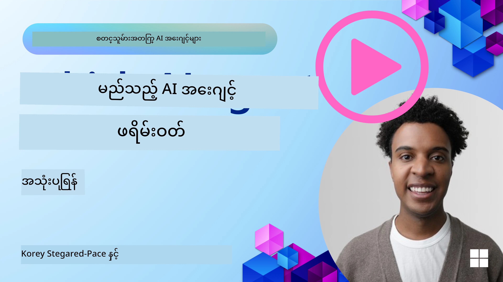

[](https://youtu.be/ODwF-EZo_O8?si=1xoy_B9RNQfrYdF7)

> _(ဒီသင်ခန်းစာရဲ့ ဗွီဒီယိုကိုကြည့်ရန်အတွက် အပေါ်မှာရှိသော ဓာတ်ပုံကိုနှိပ်ပါ)_

# AI Agent Frameworks ကို စူးစမ်းခြင်း

AI agent frameworks များသည် AI agent များကို ဖန်တီးခြင်း၊ အလားအလာဖြန့်ဖြူးခြင်းနှင့် စီမံခန့်ခွဲခြင်းကို လွယ်ကူစေရန် ဒီဇိုင်းတည်ဆောက်ထားသော ဆော့ဖ်ဝဲပလက်ဖောင်းများဖြစ်သည်။ ဤ frameworks များသည် ဖွံ့ဖြိုးတိုးတက်သူများအား ကြိုတင်တည်ဆောက်ထားသော မူကားအပိုင်းများ၊ အကျဉ်းချုပ်များနှင့် ကိရိယာများကို ပံ့ပိုးပေးကာ ရှုပ်ထွေးသော AI စနစ်များ ဖန်တီးခြင်းကို အဆင်ပြေနေစေသည်။

ဒီ frameworks များသည် AI agent ဖွံ့ဖြိုးတိုးတက်မှုတွင် ပုံမှန်ဖြစ်သော အခက်အခဲများအပေါ် မူတည်ပြီး စံပုံစံတစ်ကြောင်းကို ပေးစွမ်းခြင်းအားဖြင့် ဖွံ့ဖြိုးတိုးတက်သူများကို သူတို့၏ အထူးပြုချက်များအပေါ် အာရုံစူးစိုက်နိုင်စေသည်။ ၎င်းတို့သည် AI စနစ်များ တည်ဆောက်ရာတွင် စွမ်းဆောင်ရည်၊ ဝင်ရောက်လွယ်ကူမှု၊ ထိရောက်မှုများကို တိုးတက်စေသည်။

## နိဒါန်း

ဒီသင်ခန်းစာတွင် ဆွေးနွေးမည့် အကြောင်းအရာများ ဖြစ်ပါသည်။

- AI Agent Frameworks ဆိုတာ ဘာလဲ၊ ဖွံ့ဖြိုးတိုးတက်သူများအတွက် မည်သို့ အကျိုးဖြစ်စေသနည်း။
- အဖွဲ့များသည် AI agent ၏ စွမ်းဆောင်ရည်များကို မ်ားစွာအရှိန်ပြန်ပြန် လုပ်ဆောင်၊ ပြန်လည်တိုးမြှင့်နိုင်ရန် မည်သို့ အသုံးပြုနိုင်သနည်း။
- Microsoft (<a href="https://aka.ms/ai-agents-beginners/ai-agent-service" target="_blank">Microsoft Foundry Agent Service</a> နှင့် <a href="https://learn.microsoft.com/azure/ai-services/openai/how-to/responses" target="_blank">Microsoft Agent Framework</a>) မှဖန်တီးထားသော frameworks နှင့် ကိရိယာများ၏ မတူကွဲပြားချက်များ ဘာတွေရှိသလဲ။
- ကျွန်ုပ်၏ ရှိပြီးသား Azure ecosystem ကိရိယာများကို တိုက်ရိုက် ထည့်သွင်း ဆက်စပ်နိုင်ပါသလား၊ ဒါမှမဟုတ် သီးခြားဖြေရှင်းနည်းများ လိုအပ်ပါသလား။
- Microsoft Foundry Agent Service ဆိုတာ ဘာလဲ၊ ဒါက ဘယ်လိုကူညီပေးနေလဲ။

## သင်ယူရမည့် ရည်မှန်းချက်များ

ဒီသင်ခန်းစာရဲ့ ရည်မှန်းချက်မှာ သင်ကို နားလည်စေဖို့ ဖြစ်သည်။

- AI Agent Frameworks ၏ အခြား AI ဖွံ့ဖြိုးတိုးတက်မှုတွင် ပြုလုပ်သည့် အခန်းကဏ္ဍ။
- AI Agent Frameworks ကို အသုံးပြု၍ အကြံပေးသူများ ဖန်တီးခြင်းနည်းလမ်းများ။
- AI Agent Frameworks က ပံ့ပိုးပေးသော အဓိက စွမ်းဆောင်ရည်များ။
- Microsoft Agent Framework နှင့် Microsoft Foundry Agent Service ၏ ကွာခြားချက်များ။

## AI Agent Frameworks ဆိုတာ ဘာလဲ၊ ဖွံ့ဖြိုးတိုးတက်သူများကို ဘာတွေ လုပ်နိုင်စေသလဲ။

ရိုးရာ AI Frameworks များသည် သင့် app များတွင် AI ကို ထည့်သွင်းပြီး အောက်ပါနည်းဖြင့် ယင်း app များကို ပိုမိုကောင်းမွန်စေရန် အကူအညီဖြစ်စေသည်။

- **ကိုယ်ပိုင်ချိန်ညှိမှု (Personalization)**: AI သည် အသုံးပြုသူ၏ အပြုအမှုန်များနှင့် ကြိုက်နှစ်သက်မှုများအား ခွဲခြားစိစစ်၍ ကိုယ်ပိုင်အကြံပြုချက်များ၊ အကြောင်းအရာများနှင့် အတွေ့အကြုံများ ပေးစွမ်းနိုင်သည်။
ဥပမာ – Netflix ကဲ့သို့သော စီးရီးလည်ပတ်ပေးမည့် ဝန်ဆောင်မှုများသည် အသုံးပြုသူကြည့်ရှုမှုမှတ်တမ်းအပေါ် မူတည်ကာ ရုပ်ရှင်နှင့် ရုပ်သံဇာတ်လမ်းများကို အကြံပြုသွားပြီး အသုံးပြုသူစိတ်ဝင်စားမှုနှင့် ကျေနပ်မှုကို တိုးတက်စေသည်။
- **အလိုအလျောက်လုပ်ဆောင်မှုနှင့် ထိရောက်မှု (Automation and Efficiency)**: AI သည် ပြန်လည်လုပ်ဆောင်သည့် တာဝန်များ၊ လုပ်ငန်းစဉ်များကို အလိုအလျောက်ပြုလုပ်ကာ လုပ်ငန်းထိရောက်မှုကို တိုးတက်စေနိုင်သည်။
ဥပမာ – ဖောက်သည်ဝန်ဆောင်မှု app များသည် AI အစွမ်းထက် chatbot များကို အသုံးပြုကာ မေးခွန်းများအား ဖြေဆိုကာ မျက်နှာချင်းဆိုင်လူသားအေးဂျင့်များအတွက် ရန်ပုံငွေ ထိန်းသိမ်းစေသည်။
- **အသုံးပြုသူအတွေ့အကြုံ တိုးတက်မြှင့်တင်ခြင်း (Enhanced User Experience)**: AI သည် အသံအသိအမှတ်ပြုမှု၊ သဘာဝဘာသာစကားစီမံခြင်း၊ ခန့်မှန်းစာသားများကဲ့သို့သော အတတ်ပညာဆိုင်ရာ လုပ်ဆောင်ချက်များကို ပေးစွမ်းကာ အသုံးပြုသူအတွေ့အကြုံကို မြှင့်တင်ပေးသည်။
ဥပမာ – Siri နှင့် Google Assistant ကဲ့သို့သော မျက်နှာသာကူပံ့သူများသည် အသံအမိန့်များကို နားလည်ကာ ပြန်လည်တုံ့ပြန်ပေး၍ အသုံးပြုသူများအတွက် စက်ပစ္စည်းများနှင့် လျင်မြန်သော အပြန်အလှန်ဆက်သွယ်မှုကို ဖြစ်စေသည်။

### ဒီစကားလုံးဆိုတဲ့ အကြောင်းကောင်းလား၊ ဒါပေမယ့် AI Agent Framework လိုအပ်တာ ဘာလဲ။

AI Agent frameworks များသည် AI frameworks ပုံစံများထက် ပိုမိုကြီးမားသည့် အရာတစ်ခုဖြစ်သည်။ ၎င်းတို့သည် အသုံးပြုသူများ၊ အခြား agent များနှင့် ပတ်ဝန်းကျင်နှင့် ဆက်သွယ်၍ ထူးခြားသော ရည်မှန်းချက်များ ရရှိစေရန် တုံ့ပြန်ဆောင်ရွက်နိုင်သည့် အကြံပေးသူများ ဖန်တီးရန် ဒီဇိုင်းထားခြင်း ဖြစ်သည်။ ၎င်း agent များသည် ကိုယ်ပိုင်အပြုအမူပြုနိုင်ခြင်း၊ ဆုံးဖြတ်ချက်ချနိုင်ခြင်းနှင့် ပြောင်းလဲနေသော အခြေအနေများတွင် ကိုက်ညီနိုင်ခြင်းတို့ ရှိသည်။ AI Agent Frameworks မှ ကူညီပေးသည့် အဓိက စွမ်းဆောင်ရည် များကို ကြည့်ပါ။

- **Agent ပူးပေါင်းဆောင်ရွက်ခြင်းနှင့် ချိန်ညှိမှု (Agent Collaboration and Coordination)**: စုပေါင်းခြင်းဖြင့် အဆင့်မြင့် လုပ်ငန်းများကို ဖြေရှင်းနိုင်သော မတူညီသော AI Agent များ ဖန်တီးနိုင်ခြင်း။
- **တာဝန်ခွဲဝေရေးနှင့် စီမံခန့်ခွဲမှု (Task Automation and Management)**: အဆင့်များစွာသော Workflow များအလိုအလျောက် ပြုလုပ်ခြင်း၊ တာဝန်သတ်မှတ်ခြင်းနှင့် dynamic task management ကို ပံ့ပိုးပေးခြင်း။
- **အနှီးအချုပ်နားလည်မှုနှင့် ကိုက်ညီပြုပြင်မှု (Contextual Understanding and Adaptation)**: အကြောင်းအရာကို နားလည်ပြီး ပတ်ဝန်းကျင်အနေအထားပြောင်းလဲမှုများကို ကိုက်ညီပြုလုပ်၍ သတင်းအချက်အလက်အချိန်နောက်ကျခြင်း မရှိဘဲ ဆုံးဖြတ်ချက် ချနိုင်ခြင်း။

အကျဉ်းချုပ်မှာ အကြံပေးသူများသည် သင့်အား ပိုမိုလုပ်ဆောင်နိုင်စေပြီး အလိုအလျောက်လုပ်ဆောင်မှုကို နောက်တစ်ဆင့်တိုးမြှင့်ပေးကာ ပတ်ဝန်းကျင်မှ သင်ယူနိုင်သော ပိုမိုလွှမ်းခြုံသော စနစ်များ ဖန်တီးနိုင်စေသည်။

## AI agent ၏ စွမ်းဆောင်ရည်များကို မျက်နှာပြင်မြန်မြန်ဖန်တီးခြင်း၊ ပြန်လည်တိုးတက်စေရန် အဘယ်နည်း။

ဒီမှာက အလျင်အမြန်တိုးတက်နေတဲ့ နယ်ပယ်တစ်ခု ဖြစ်ပြီးတော့ များသော AI Agent Frameworks များတွင် အများကြီးတူညီသည့် အစိတ်အပိုင်းများ ရှိသည်။ ၎င်းတို့မှာ module components၊ ပူးပေါင်းဆောင်ရွက်ရေး ကိရိယာများ၊ နှင့် အချိန်နောက်ကျခြင်းမရှိသော သင်ယူမှုတို့ ဖြစ်သည်။ လေ့လာကြည့်ပါ။

- **Module Components များကို အသုံးပြုပါ**: AI SDK များတွင် AI နှင့် မှတ်ဉာဏ် ချိတ်ဆက်မှုများ၊ သဘာဝဘာသာစကားသို့မဟုတ် ကုဒ် plugin များမှ function call များ၊ prompt template များ ကဲ့သို့သော ကြိုတင်တည်ဆောက်ထားသော အစိတ်အပိုင်းများ ပါဝင်သည်။
- **ပူးပေါင်းဆောင်ရွက်ရေးကိရိယာများ အသုံးပြုပါ**: အကြံပေးသူများကို အထူးအခန်းကဏ္ဍနှင့် တာဝန်များဖြင့် ဒီဇိုင်းဆွဲခြင်း၊ ပူးပေါင်းလုပ်ဆောင်မှုပုံစံများ စမ်းသပ်ပြောင်းလဲပိုင်းခြားနိုင်ခြင်း။
- **အချိန်နောက်ကျသည့် သင်ယူမှု**: အကြံပေးသူများသည် ဆက်ဆံမှုများမှ သင်ယူပြီး ကိုယ်ပိုင်အပြုအမူ ပြင်ဆင်ကာ အချိန်နှင့်တပြေးညီ တိုးတက်ပြောင်းလဲမှု ရရှိစေရန် feedback loop များ လုပ်ဆောင်ခြင်း။

### Module Components ကို အသုံးပြုခြင်း

Microsoft Agent Framework ကဲ့သို့သော SDK များတွင် AI connectors, tool definitions နှင့် agent စီမံခန့်ခွဲမှု အစိတ်အပိုင်းများ ပါဝင်သည်။

**အဖွဲ့များဘယ်လိုအသုံးပြုနိုင်သလဲ**: အဖွဲ့များသည် အစိတ်အပိုင်းများကို အခြေမထားဘဲ အစိတ်အပိုင်းများကို တမြောက်တည်း စုပေါင်းဖန်တီးကာ အမြန်စမ်းသပ်နှင့် ပြန်လည်တိုးတက်မှုအတွက် အသုံးပြုနိုင်သည်။

**လက်တွေ့အလုပ်လုပ်ပုံ**: အသုံးပြုသူ၏ထည့်သွင်းချက်များမှ သတင်းအချက်အလက်များအား ခွဲချက်ထုတ်ယူသည့် ကြိုတင်တည်ဆောက်ထားသော parser တစ်ခု၊ ဒေတာ သိမ်းဆည်းရန် နှင့် ရယူရန် memory module တစ်ခု၊ အသုံးပြုသူနှင့် ဆက်သွယ်ရန် prompt generator တို့ကို စတင်ဖန်တီးရန် မလိုပဲ အသုံးပြုနိုင်သည်။

**ဥပမာကုဒ်** - Microsoft Agent Framework နှင့် `FoundryChatClient` ကို အသုံးပြုပြီး ကိရိယာခေါ်ဆိုမှုဖြင့် အသုံးပြုသူထံ ပြန်ကြားမှု တခု ပြုလုပ်ပုံကို ကြည့်လိုက်ပါ။

``` python
# Microsoft Agent Framework Python ဥပမာ

import asyncio
import os

from agent_framework import tool
from agent_framework.foundry import FoundryChatClient
from azure.identity import AzureCliCredential


# ခရီးသွားစာရင်းမှာရန် စမ်းသပ်ကိရိယာလုပ်ဆောင်ချက်ကို သတ်မှတ်ပါ
@tool(approval_mode="never_require")
def book_flight(date: str, location: str) -> str:
    """Book travel given location and date."""
    return f"Travel was booked to {location} on {date}"


async def main():
    provider = FoundryChatClient(
        project_endpoint=os.environ["AZURE_AI_PROJECT_ENDPOINT"],
        model=os.environ["AZURE_AI_MODEL_DEPLOYMENT_NAME"],
        credential=AzureCliCredential(),
    )
    agent = provider.as_agent(
        name="travel_agent",
        instructions="Help the user book travel. Use the book_flight tool when ready.",
        tools=[book_flight],
    )

    response = await agent.run("I'd like to go to New York on January 1, 2025")
    print(response)
    # ဥပမာ ထုတ်လွှင့်ချက်: ၂၀၂၅ ခုနှစ် ဇန်နဝါရီ ၁ ရက်နေ့တွင် သင်၏ New York ခရီးသွားလေယာဉ် ခရီးစဉ် အောင်မြင်စွာ စာရင်းသွင်းပြီးပါပြီ။ ခရီးသွားရာတွင် ဘေးကင်းချောမွေ့ပါစေ! ✈️🗽


if __name__ == "__main__":
    asyncio.run(main())
```

ဤဥပမာတွင် user input မှ အရေးပါသော သတင်းအချက်အလက်များ (ရင်းမြစ်၊ ရောက်ရှိမည့်နေရာ၊ လေယာဉ်လက်မှတ်စာရင်းသွင်းရန်နေ့စွဲ) များကို ကြိုတင်တည်ဆောက်ထားသော parser ဖြင့် ခွဲထုတ်ယူနိုင်ပုံကို သင်မြင်နိုင်သည်။ ဒီလို မှာ module ပုံစံဖြင့် ဂရုစိုက်စရာ Logic အပေါ်တွင် အာရုံစူးစိုက်နိုင်စေသည်။

### ပူးပေါင်းဆောင်ရွက်ရေးကိရိယာများ အသုံးပြုခြင်း

Microsoft Agent Framework ကဲ့သို့သော Framework များသည် အကြံပေးသူများစုပေါင်းလုပ်ဆောင်နိုင်ခြင်းကို အလွယ်တကူပြုလုပ်ခြင်းဆိုင်ရာ တိုးတက်မှုများ ရှိသည်။

**အဖွဲ့များ ဘယ်လိုအသုံးပြုနိုင်သလဲ**: အဖွဲ့များသည် သတ်မှတ်ထားသော အခန်းကဏ္ဍများနှင့် တာဝန်များပါရှိသော agent များ ရေးဆွဲကာ ပူးပေါင်းဆောင်ရွက်မှုစနစ်များကို စမ်းသပ်ပြင်ဆင်၍ စနစ်အကျိုးသက်ရောက်မှုကို တိုးတက်စေပါသည်။

**လက်တွေ့ အသုံးပြုမှု**: သီးခြားလုပ်ငန်းတာဝန်များ (ဒေတာ ရယူမှု၊ သုံးသပ်ခြင်း၊ ဆုံးဖြတ်ချက်ချခြင်း) ကို အထူးပြုသော agent များစုပေါင်းပြီး အသုံးပြုသူမေးခွန်းတစ်ခုဖြေရှင်းပေးရန် သို့မဟုတ် လုပ်ငန်းတစ်ခု ပြီးစီးရန် ပူးပေါင်းလုပ်ဆောင်နိုင်သည်။

**ဥပမာကုဒ် (Microsoft Agent Framework)**:

```python
# Microsoft Agent Framework ကို အသုံးပြု၍ အတူတကွဆောင်ရွက်သော စွမ်းအင်အေဂျင့်များ များစွာ ဖန်တီးခြင်း

import os
from agent_framework.foundry import FoundryChatClient
from azure.identity import AzureCliCredential

provider = FoundryChatClient(
    project_endpoint=os.environ["AZURE_AI_PROJECT_ENDPOINT"],
    model=os.environ["AZURE_AI_MODEL_DEPLOYMENT_NAME"],
    credential=AzureCliCredential(),
)

# ဒေတာ ရယူရေး အေဂျင့်
agent_retrieve = provider.as_agent(
    name="dataretrieval",
    instructions="Retrieve relevant data using available tools.",
    tools=[retrieve_tool],
)

# ဒေတာ ခွဲခြမ်းစိတ်ဖြာရေး အေဂျင့်
agent_analyze = provider.as_agent(
    name="dataanalysis",
    instructions="Analyze the retrieved data and provide insights.",
    tools=[analyze_tool],
)

# တာဝန်တစ်ခုအတွက် အေဂျင့်များကို အစဉ်လိုက် ချိန်ဆဖြင့် လည်ပတ်ခြင်း
retrieval_result = await agent_retrieve.run("Retrieve sales data for Q4")
analysis_result = await agent_analyze.run(f"Analyze this data: {retrieval_result}")
print(analysis_result)
```

ယခင်ကုဒ်တွင် အချက်အလက်များစစ်ဆေးရန် အများ agent များပူးပေါင်းလုပ်ဆောင်ချက် တစ်ခုဖန်တီးနည်းကို မြင်ရသည်။ agent တစ် ဦးချင်းစီသည် ပူးပေါင်းရေး တာဝန်ရှိပြီး တာဝန်များကို ချိန်ညှိပြီး ဦးတည်ချက်ကို ရရှိစေသည်။ ထူးချွန်သကဲ့သို့ အကြောင်းအမျိုးမျိုးသော agent များ စီမံခန့်ခွဲရခြင်းသည် တာဝန်ထိရောက်မှုနှင့် စွမ်းဆောင်ရည်ကို တိုးမြှင့်သည်။

### အချိန်နောက်ကျခြင်းမရှိသော သင်ယူမှု

ကြီးမားပြီး တိုးတက်သော Framework များတွင် အချိန်နောက်ကျခြင်းမရှိသော အကြောင်းအရာနားလည်မှုနှင့် ကိုက်ညီပြုပြင်မှု စွမ်းဆောင်ရည် အထောက်အပံ့ ပေးသည်။

**အဖွဲ့များ ဘယ်လိုအသုံးပြုနိုင်သလဲ**: အကြံပေးသူများသည် ဆက်ဆံဆောင်ရွက်မှုများမှ သင်ယူကာ ကိုယ်ပိုင်အပြုအမူများကိုပြောင်းလဲ တိုးတက်စေနိုင်ရန် feedback loop များ အကောင်အထည်ဖော်နိုင်သည်။

**လက်တွေ့အသုံးပြုမှု**: အသုံးပြုသူတုံ့ပြန်ချက်များ၊ ပတ်ဝန်းကျင်ဒေတာများ၊ တာဝန်ဆောင်ရွက်မှုအောင်မြင်မှုများကို သုံးသပ်ပြီး သိပ္ပံနည်းကျ အချက်အလက်စုဆောင်းမှုများအား အဆက်မပြတ် တိုးတက်မွမ်းမံရန် သုံးနိုင်သည်။ ၎င်း နှုတ်ဆက်မှု သင်ယူမှုဖြင့် agent များအနေဖြင့် ပြောင်းလဲမှုများနှင့် အသုံးပြုသူပေါ်မူတည်၍ ကောင်းမွန်ပိုမိုမြှင့်တင်နိုင်သည်။

## Microsoft Agent Framework နှင့် Microsoft Foundry Agent Service ၏ ကွာခြားချက်များ

ဒီနည်းလမ်းများကို နှိုင်းယှဉ်ဖို့ အမျိုးမျိုးသော နည်းလမ်းများ ရှိသည်၊ သို့သော် ဒီဇိုင်း၊ စွမ်းဆောင်ရည်များနှင့် မျှော်မှန်းထားသော အသုံးချပုံများ အရ အဓိကကွာခြားချက် အချို့ကို ကြည့်လိုက်ရအောင်။

## Microsoft Agent Framework (MAF)

Microsoft Agent Framework သည် `FoundryChatClient` ကိုအသုံးပြု၍ AI agent များ တည်ဆောက်နိုင်မည့် သက်သာလွယ်ကူသော SDK ဖြစ်သည်။ ၎င်းသည် Azure OpenAI မော်ဒယ်များကို အသုံးပြုကာ စကားပြောစီမံမှု၊ ကိရိယာခေါ်ဆိုမှုနှင့် Azure အထူးလုံခြုံရေး ကို ထောက်ပံ့ပေးသည်။

**အသုံးပြုမှု နေရာများ**: ကိရိယာအသုံးပြုခြင်း၊ အဆင့်များစွာသော workflow များနှင့် စက်မှုလုပ်ငန်းထောက်ပံ့မှု အရေးကြီးသော AI agent များ တည်ဆောက်ရေး။

Microsoft Agent Framework ၏ အဓိက အကြောင်းအရာများမှာ:

- **Agent များ**။ agent တစ်ခုကို `FoundryChatClient` ဖြင့် ဖန်တီးပြီး အမည်၊ အညွှန်းများနှင့် ကိရိယာများ ဖြင့် သတ်မှတ်သည်။ agent သည်
  - **အသုံးပြုသူ မက်ဆေ့ခ်ျများကိုလုပ်ဆောင်ပြီး** Azure OpenAI မော်ဒယ်ဖြင့် ဖြေကြားချက်များထုတ်ပေးနိုင်သည်။
  - **စကားပြောအကြောင်းအရာအပေါ် အလိုအလျောက် ကိရိယာများ ခေါ်ဆိုနိုင်သည်**။
  - **စကားပြောအခြေအနေကို** များစွာသော ဆက်သွယ်မှုများအတွင်း ထိန်းသိမ်းနိုင်သည်။

  ဤအောက်ပါကုဒ် နမူနာသည် agent တစ်ခုကို ဖန်တီးပုံကို ပြသသည်။

    ```python
    import os
    from agent_framework.foundry import FoundryChatClient
    from azure.identity import AzureCliCredential

    provider = FoundryChatClient(
        project_endpoint=os.environ["AZURE_AI_PROJECT_ENDPOINT"],
        model=os.environ["AZURE_AI_MODEL_DEPLOYMENT_NAME"],
        credential=AzureCliCredential(),
    )
    agent = provider.as_agent(
        name="my_agent",
        instructions="You are a helpful assistant.",
    )

    response = await agent.run("Hello, World!")
    print(response)
    ```

- **ကိရိယာများ**။ framework သည် Python function များအဖြစ် သတ်မှတ်၍ agent မှ အလိုအလျောက် ခေါ်ဆိုနိုင်သည့် ကိရိယာများကို ထောက်ပံ့သည်။ agent ဖန်တီးရာတွင် ကိရိယာများကို မှတ်ပုံတင်သည်။

    ```python
    def get_weather(location: str) -> str:
        """Get the current weather for a location."""
        return f"The weather in {location} is sunny, 72\u00b0F."

    agent = provider.as_agent(
        name="weather_agent",
        instructions="Help users check the weather.",
        tools=[get_weather],
    )
    ```

- **အကြောင်းအရာမြှင့်တင် Agent ပူးပေါင်းဆောင်ရွက်မှု**။ သီးသန့် အထူးပြု agent များ စုပေါင်းပြီး၊ ၎င်းတို့၏ လုပ်ငန်းများကို ချိန်ညှိနိုင်သည်။

    ```python
    planner = provider.as_agent(
        name="planner",
        instructions="Break down complex tasks into steps.",
    )

    executor = provider.as_agent(
        name="executor",
        instructions="Execute the planned steps using available tools.",
        tools=[execute_tool],
    )

    plan = await planner.run("Plan a trip to Paris")
    result = await executor.run(f"Execute this plan: {plan}")
    ```

- **Azure Identity ဆက်စပ်မှု**။ framework သည် API key မလိုအပ်ဘဲ လုံခြုံမှုအတွက် `AzureCliCredential` (သို့) `DefaultAzureCredential` ကို အသုံးပြုသည်။

## Microsoft Foundry Agent Service

Microsoft Foundry Agent Service သည် ၂၀၂၄ ခုနှစ် Microsoft Ignite တွင် မိတ်ဆက်ထားသော နောက်ဆုံးပေါ် တင်သွင်းမှုဖြစ်ပြီး၊ Llama 3, Mistral, Cohere ကဲ့သို့ ရှင်းလင်းသော open-source LLM များကို တိုက်ရိုက် ခေါ်ဆိုနိုင်သော ပိုမိုချောမွေ့သော မော်ဒယ်များဖြင့် AI agent များ ဖန်တီး၊ ဖြန့်ဖြူးရန် ခွင့်ပြုသည်။

Microsoft Foundry Agent Service သည် စက်မှုလုပ်ငန်းအတွက် သင့်တော်သော လုံခြုံမှုစနစ်များနှင့် ဒေတာ သိမ်းဆည်းခြင်းနည်းလမ်းများ ပိုမိုခိုင်မာစေသည်။

Microsoft Agent Framework နှင့် ပေါင်းစည်း အသုံးပြု၍ agent များကို တည်ဆောက်၊ ဖြန့်ဖြူးနိုင်သည်။

ယခုဝန်ဆောင်မှုသည် ပြည်သူ့အသုံးပြုမှု အဆင့် Public Preview တွင်ရှိပြီး Python နှင့် C# ကို အသုံးပြု agent များ ဖန်တီးနိုင်သည်။

Microsoft Foundry Agent Service Python SDK ကို အသုံးပြုပြီး အသုံးပြုသူသတ်မှတ် tool ရှိ agent တစ်ခု ဖန်တီးနိုင်ပါသည်။

```python
import asyncio
from azure.identity import DefaultAzureCredential
from azure.ai.projects import AIProjectClient

# ကိရိယာလုပ်ဆောင်ချက်များကို သတ်မှတ်ပါ
def get_specials() -> str:
    """Provides a list of specials from the menu."""
    return """
    Special Soup: Clam Chowder
    Special Salad: Cobb Salad
    Special Drink: Chai Tea
    """

def get_item_price(menu_item: str) -> str:
    """Provides the price of the requested menu item."""
    return "$9.99"


async def main() -> None:
    credential = DefaultAzureCredential()
    project_client = AIProjectClient.from_connection_string(
        credential=credential,
        conn_str="your-connection-string",
    )

    agent = project_client.agents.create_agent(
        model="gpt-4o-mini",
        name="Host",
        instructions="Answer questions about the menu.",
        tools=[get_specials, get_item_price],
    )

    thread = project_client.agents.create_thread()

    user_inputs = [
        "Hello",
        "What is the special soup?",
        "How much does that cost?",
        "Thank you",
    ]

    for user_input in user_inputs:
        print(f"# User: '{user_input}'")
        message = project_client.agents.create_message(
            thread_id=thread.id,
            role="user",
            content=user_input,
        )
        run = project_client.agents.create_and_process_run(
            thread_id=thread.id, agent_id=agent.id
        )
        messages = project_client.agents.list_messages(thread_id=thread.id)
        print(f"# Agent: {messages.data[0].content[0].text.value}")


if __name__ == "__main__":
    asyncio.run(main())
```

### အဓိကအယူအဆများ

Microsoft Foundry Agent Service တွင် အောက်ပါ အဓိက အယူအဆများ ရှိသည်။

- **Agent**။ Microsoft Foundry Agent Service သည် Microsoft Foundry နှင့် ပေါင်းစည်းထားသည်။ Microsoft Foundry အတွင်း AI Agent သည် "လှုပ်ရှားတတ်သော" microservice တစ်ခု အဖြစ် လုပ်ဆောင်ကာ စကားဝိုင်းဖြေရှင်းခြင်း (RAG), လုပ်ဆောင်ချက်များ ဆောင်ရွက်ခြင်း သို့မဟုတ် အလုပ်စဉ်များ အလိုအလျောက် ပြီးမြောက်စေရန် အသုံးပြုသည်။ ၎င်းသည် generative AI မော်ဒယ်များ၏ စွမ်းအားနှင့် အမှန်တကယ် ဒေတာ အရင်းအမြစ်များသို့ ဝင်ရောက် ဆက်သွယ်နိုင်သော ကိရိယာများ ပေါင်းစပ်ခြင်းဖြင့် မြင့်မားသော လုပ်ဆောင်ချက် ပေးသည်။ ဤ agent ဥပမာကို ကြည့်ပါ။

    ```python
    agent = project_client.agents.create_agent(
        model="gpt-4o-mini",
        name="my-agent",
        instructions="You are helpful agent",
        tools=code_interpreter.definitions,
        tool_resources=code_interpreter.resources,
    )
    ```

    ဤဥပမာတွင် agent တစ်ခုကို `gpt-4o-mini` မော်ဒယ်နှင့် `my-agent` အမည်၊ `You are helpful agent` ဟူသောညွှန်ကြားချက်များဖြင့် ဖန်တီးထားသည်။ agent သည် ကုဒ် နားလည်ခြင်း လုပ်ငန်းများ ပြုလုပ်နိုင်ရန် ကိရိယာများနှင့် အရင်းအမြစ်များဖြင့် ကောင်းစွာ ပြင်ဆင်ထားသည်။

- **ဆက်စပ် မက်ဆေ့ချ်များနှင့် Thread**။ Thread သည် အရေးပါသော အယူအဆ တစ်ခုဖြစ်သည်။ ၎င်းသည် agent နှင့် အသုံးပြုသူ တို့၏ ပြောဆိုဆက်ဆံမှု သို့မဟုတ် လုပ်ဆောင်မှုကို ကိုယ်စားပြုသည်။ Thread များအား ဆက်ဆံမှု တိုးတက်မှုကို သတိထား၍ စီမံရန်၊ နေရာထိုင်ခုံ သတင်းအချက်အလက်များ သိမ်းဆည်းရန် နှင့် လုပ်ဆောင်မှုအခြေအနေကို စီမံခန့်ခွဲရန် အသုံးပြုနိုင်သည်။ Thread ဥပမာကို ကြည့်ပါ။

    ```python
    thread = project_client.agents.create_thread()
    message = project_client.agents.create_message(
        thread_id=thread.id,
        role="user",
        content="Could you please create a bar chart for the operating profit using the following data and provide the file to me? Company A: $1.2 million, Company B: $2.5 million, Company C: $3.0 million, Company D: $1.8 million",
    )
    
    # အေးဂျင့်အား တစ်သားတွင် အလုပ်ဆောင်ရန် တောင်းဆိုပါ
    run = project_client.agents.create_and_process_run(thread_id=thread.id, agent_id=agent.id)
    
    # အေးဂျင့်၏ တုံ့ပြန်မှုကို ကြည့်ရှုရန် မက်ဆေ့ခ်ျများအားလုံးကို ရယူပြီး မှတ်တမ်းတင်ပါ
    messages = project_client.agents.list_messages(thread_id=thread.id)
    print(f"Messages: {messages}")
    ```

    ယခင်ကုဒ်တွင် thread တစ်ခုဖန်တီးပြီးနောက် မက်ဆေ့ချ်တစ်ခု ပို့သည်။ `create_and_process_run` ကို ခေါ်ဆိုကာ agent ကို thread ပေါ်မှာ အလုပ်လုပ်ရန် တိုက်တွန်းသည်။ နောက်ဆုံးတွင် မက်ဆေ့ချ်များကို ရယူပြီး agent ၏ ပြန်လည်တုံ့ပြန်ချက်များကို မှတ်တမ်းတင်သည်။ မက်ဆေ့ချ်များသည် အသုံးပြုသူနှင့် agent တို့ဆက်ဆံမှု တိုးတက်မှုကို ပြသသည်။ မက်ဆေ့ချ်များမှာ စာသား၊ ပုံရိပ် သို့မဟုတ် ဖိုင်ကဲ့သို့ တုံ့ပြန်မှုအမျိုးအစား များဖြစ်နိုင်ပြီး၊ ဖွံ့ဖြိုးသူအနေဖြင့် ဒီသတင်းအချက်အလက်များအား နောက်ထပ် လုပ်ထုံးလုပ်နည်းများဖြင့် ဆက်လက် ကိုင်တွယ်နိုင်သည်။

- **Microsoft Agent Framework နှင့် ပေါင်းစည်းမှု**။ Microsoft Foundry Agent Service သည် Microsoft Agent Framework နှင့် မဖြစ်မနေ ပေါင်းစည်း၍ အသုံးပြုနိုင်သည်၊ သို့ဖြစ်၍ `FoundryChatClient` ဖြင့် agents ဖန်တီးကာ Agent Service မှတဆင့် ထုတ်လုပ်မှုတွင် ပြန်လည် ဖြန့်ဖြူးနိုင်သည်။

**အသုံးပြုမှု နေရာများ**: Microsoft Foundry Agent Service သည် လုံခြုံရေး၊ တိုးချဲ့နိုင်မှုနှင့် ချောမွေ့မှုကို လိုအပ်သော စက်မှုလုပ်ငန်း ကိရိယာများအတွက် ဒီဇိုင်းရေးဆွဲထားသည်။

## ဒီ နည်းလမ်းများ၏ ကွာခြားချက်များ?
 
တူညီမှုတွေ ရှိသော်လည်း ဒီဇိုင်း၊ စွမ်းဆောင်ရည်နှင့် အသုံးချမှု များအပေါ် နည်းကွာခြားချက် အချို့ရှိသည်။
 
- **Microsoft Agent Framework (MAF)**: AI agent များဖန်တီးရန် အထောက်အကူဖြစ်သော ပြီးပြည့်စုံသည့် SDK ဖြစ်ပြီး ကိရိယာခေါ်ဆိုမှု၊ စကားပြောစီမံမှု နှင့် Azure အထူးလုံခြုံရေး ပံ့ပိုးပေးသော အဆင့်မြှင့် API ပေးသည်။
- **Microsoft Foundry Agent Service**: Microsoft Foundry မှ platform နှင့် deployment ဝန်ဆောင်မှုဖြစ်ပြီး Azure OpenAI, Azure AI Search, Bing Search နှင့် ကုဒ် ဖျော်ဖြေမှု ကဲဆောင်မှုများကို build-in ဖြင့် ဆက်သွယ်မှု ရှိသည်။
 
ယခုအချိန်တွင် မည်သည်ကိုရွေးရမည်ကို မသေချာသေးပါဘူးလား?

### အသုံးပြုမှု ဥပမာများ
 
လူတော်တော်များများ အသုံးပြုသော အခြေအနေများကို ကြည့်ပြီး အကူအညီပေးကြစို့။
 
> Q: အထွေထွေအဆင့် AI agent app များကို အမြန်စတင်တည်ဆောက်ချင်ပါသည်။
>

>A: Microsoft Agent Framework ကောင်းတဲ့ ရွေးချယ်မှုဖြစ်သည်။ `FoundryChatClient` ဖြင့် ကိရိယာများနှင့် အညွှန်းများ ပါရှိသည့် AI agent များကို သိသာထင်ရှားမှုနည်းတဲ့ Python API အသုံးပြုကာ ဖန်တီးနိုင်သည်။

>Q: Azure ကို Search, ကုဒ် ဖျော်ဖြေမှု ပါ အဆင့်မြှင့် စီးပွားရေး ဝန်ဆောင်မှုလိုအပ်သည်။
>
> A: Microsoft Foundry Agent Service သည် အကောင်းဆုံးသင့်တော်သော ဝန်ဆောင်မှုဖြစ်သည်။ မော်ဒယ်များစွာ၊ Azure AI Search, Bing Search နှင့် Azure Functions များကို build-in ပံ့ပိုးမှု ရှိပြီး Foundry Portal တွင် agent များဖန်တီးပြီး စနစ် ကျယ်ပြန့်စွာ ဖြန့်ဖြူးနိုင်သည်။
 
> Q: မနက်ဖြန်နားလည်ဖို့ ခက်တယ်၊ ရွေးချယ်စရာတစ်ခုသာပြောပါ။
>
> A: စတင်ဖန်တီးရန် Microsoft Agent Framework ကို အသုံးပြုပြီး အထုတ်အပလွေမှာ Microsoft Foundry Agent Service ကို အသုံးပြုပါ။ ဒီနည်းလမ်းက agent မျာ logic ဖြေပွောဖို့ အလျင်မြန် တိုးတက်စေပြီး စီးပွားရေးအသုံးချမှုအတွက် တိုးချဲ့အသုံးပြုမှု အရမ်းသေချာစေသည်။
 
အဓိက ကွာခြားချက်များကို ဇယားတစ်ခုဖြင့် အနှစ်ချုပ်ပြပါမည်။

| Framework | အာရုံစိုက်မှု | အဓိက အယူအဆများ | အသုံးပြုမှု နေရာများ |
| --- | --- | --- | --- |
| Microsoft Agent Framework | ကိရိယာခေါ်ဆိုမှုပါ streamlined agent SDK | Agents, Tools, Azure Identity | AI agent ဖန်တီးခြင်း, ကိရိယာအသုံးပြုခြင်း, အဆင့်မြင့် workflow |
| Microsoft Foundry Agent Service | မော်ဒယ်များ လွန်ကဲမှု၊ စက်မှု လုံခြုံရေး၊ ကုဒ် ဖျော်ဖြေမှု၊ ကိရိယာခေါ်ဆိုမှု | Modularity, Collaboration, Process Orchestration | လုံခြုံသော၊ တိုးချဲ့နိုင်သော နှင့် ချောမွေ့သော AI agent ဖြန့်ဖြူးမှု |

## ကျွန်ုပ်၏ရှိပြီးသား Azure ကိရိယာများကို တိုက်ရိုက် ထည့်သွင်းပြီး အသုံးပြုနိုင်ပါသလား၊ သီးခြား ဖြေရှင်းနည်းများ လိုအပ်ပါသလား။


အကြောင်းပြချက်မှာ ဟုတ်ကဲ့၊ သင်၏ ရှိပြီးသား Azure ပတ်ဝန်းကျင်ကိရိယာများကို Microsoft Foundry Agent Service နှင့် တိုက်ရိုက် ပေါင်းစည်းနိုင်ပါတယ်၊ အထူးသဖြင့် ဒါဟာ အခြား Azure ဝန်ဆောင်မှုများနှင့် ဆက်စပ်အသုံးပြုရန်အတွက် ဆန်းသစ်တည်ဆောက်ထားတာ ဖြစ်ပါတယ်။ ဥပမာအားဖြင့် Bing, Azure AI Search နှင့် Azure Functions များကို ပေါင်းစည်းနိုင်ပါတယ်။ Microsoft Foundry နှင့်လည်း အနက်ရှိုင်းသော ပေါင်းစည်းမှု ရှိသည်။

Microsoft Agent Framework သည် `FoundryChatClient` နှင့် Azure မှတ်ပုံတင်မှုများအား မှီငြမ်းကာ Azure ဝန်ဆောင်မှုများကို သင့်အေးဂျင့်ကိရိယာများမှ တိုက်ရိုက် ခေါ်ယူနိုင်ရန် Azure ဝန်ဆောင်မှုများနှင့် ပေါင်းစည်းထားသည်။

## နမူနာ ကုဒ်များ

- Python: [Agent Framework (Microsoft Foundry)](./code_samples/02-python-agent-framework.ipynb)
- Python: [Agent Framework (Azure OpenAI Responses API)](./code_samples/02-python-agent-framework-azure-openai.ipynb)
- .NET: [Agent Framework](./code_samples/02-dotnet-agent-framework.md)

## AI Agent Frameworks အကြောင်း ပိုမိုမေးမြန်းလိုပါသလား?

[Microsoft Foundry Discord](https://discord.com/invite/ATgtXmAS5D) တွင် ဝင်ရောက်ပြီး သင်တန်းသားများနှင့် တွေ့ဆုံခြင်း၊ ရုံးချိန်များတက်ရောက်ခြင်းနှင့် သင့်ရဲ့ AI Agents ဆိုင်ရာ မေးခွန်းများကို ဖြေကြားနိုင်ပါသည်။

## အရင်းအမြစ်များ

- <a href="https://techcommunity.microsoft.com/blog/azure-ai-services-blog/introducing-azure-ai-agent-service/4298357" target="_blank">Azure Agent Service</a>
- <a href="https://learn.microsoft.com/azure/ai-services/openai/how-to/responses" target="_blank">Microsoft Agent Framework - Azure OpenAI Responses</a>
- <a href="https://learn.microsoft.com/azure/ai-services/agents/overview" target="_blank">Microsoft Foundry Agent Service</a>

## ယနေ့သင်ခန်းစာ

[AI Agents နှင့် Agent အသုံးချမှု မိတ်ဆက်](../01-intro-to-ai-agents/README.md)

## နောက်ဆုံးသင်ခန်းစာ

[Agentic Design Patterns နားလည်ခြင်း](../03-agentic-design-patterns/README.md)

---

<!-- CO-OP TRANSLATOR DISCLAIMER START -->
**ပြောကြားချက်**
ဤစာတမ်းကို AI ဘာသာပြန်ဝန်ဆောင်မှု [Co-op Translator](https://github.com/Azure/co-op-translator) အသုံးပြု၍ ဘာသာပြန်ထားပါသည်။ ကျွန်ုပ်တို့သည် တိကျမှန်ကန်မှုအတွက် ကြိုးပမ်းနေသော်လည်း၊ စက်ကိရိယာဘာသာပြန်ခြင်းများတွင် အမှားများ သို့မဟုတ် မှားယွင်းချက်များ ပါဝင်နိုင်ကြောင်း သတိပြုပါရန် လိုအပ်ပါသည်။ မူလစာတမ်းကို မူရင်းဘာသာဖြင့်သာ ယုံကြည်စိတ်ချရသော အချက်အလက်အဖြစ် သတ်မှတ်သင့်သည်။ အရေးကြီးသည့် သတင်းအချက်အလက်များအတွက် ပရော်ဖက်ရှင်နယ် လူသားဘာသာပြန်သူဝန်ဆောင်မှုကို အကြံပြုပါသည်။ ဤဘာသာပြန်ချက်ကို အသုံးပြုခြင်းမှ ဖြစ်ပေါ်လာသော နားလည်မှုကွာခြားမှုများ သို့မဟုတ် မမှန်ကန်သော အသုံးပြုမှုများအတွက် ကျွန်ုပ်တို့ တာဝန်မခံပါ။
<!-- CO-OP TRANSLATOR DISCLAIMER END -->