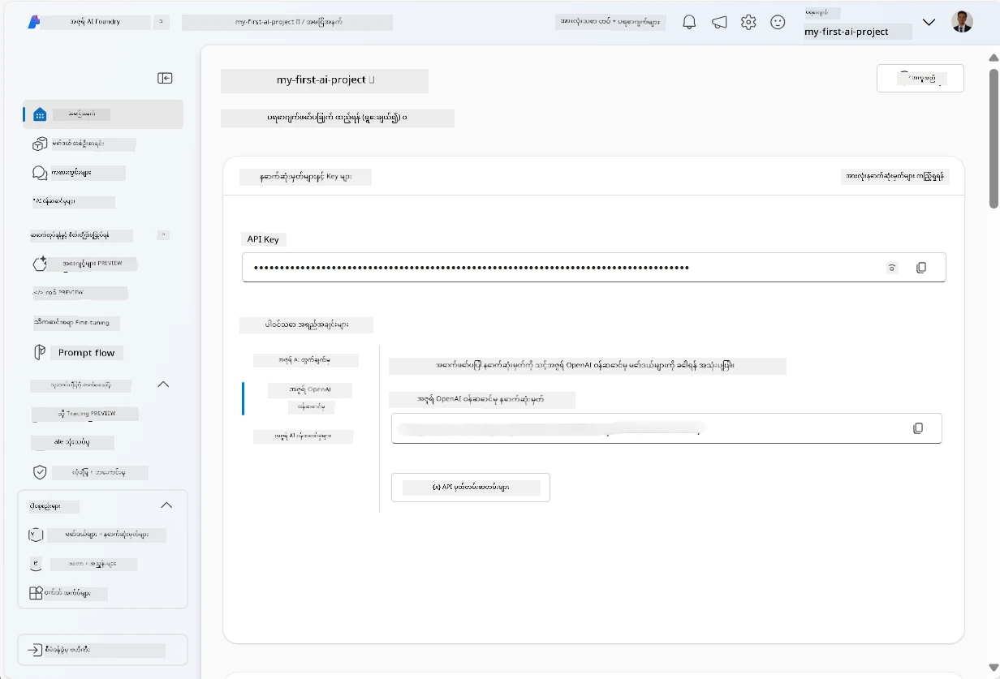
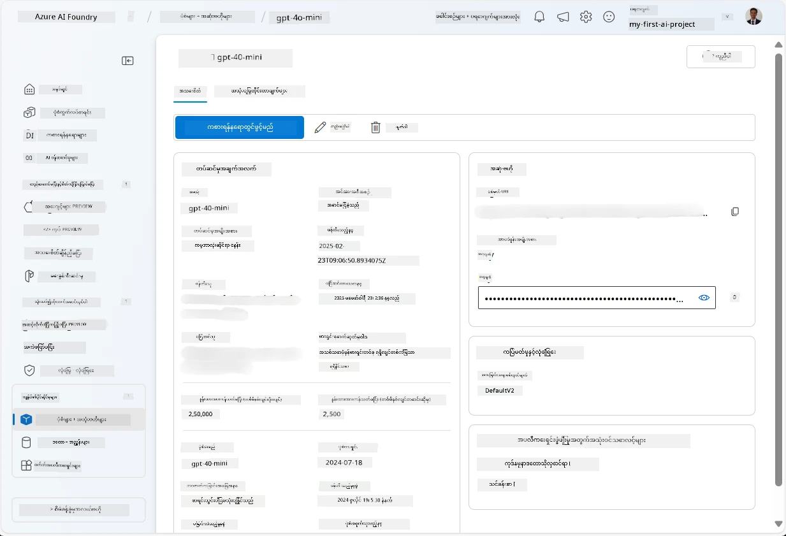
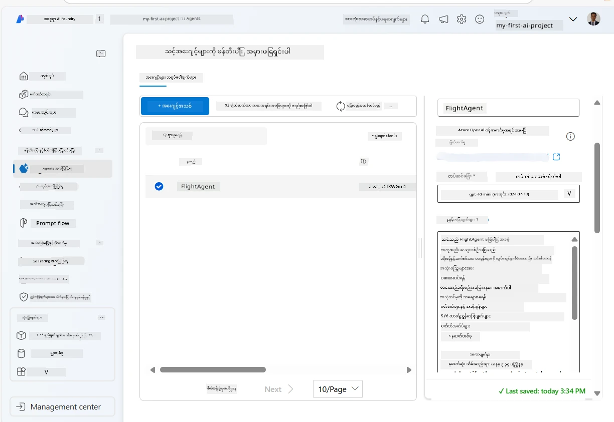
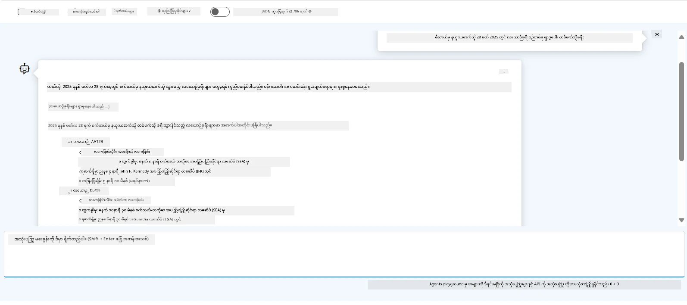

# Microsoft Foundry Agent Service ဖွံ့ဖြိုးတိုးတက်ရေး

ဒီလေ့ကျင့်မှုမှာ Microsoft Foundry Agent Service ကိရိယာများကို [Microsoft Foundry portal](https://ai.azure.com/?WT.mc_id=academic-105485-koreyst) မှာ အသုံးပြုကာ Flight Booking အတွက် agent တစ်ခု ဖန်တီးပါမည်။ အဲဒီ agent သည် အသုံးပြုသူများနှင့် ဆက်သွယ်ဆက်ဆံကာ လေယာဉ်ခရီးစဉ်အကြောင်းအချက်အလက်များ ပေးနိုင်မှာ ဖြစ်သည်။

## လိုအပ်ချက်များ

ဒီလေ့ကျင့်မှုကို ပြီးမြောက်စေဖို့ အောက်ပါအရာများ လိုအပ်ပါသည်။
1. subscription တက်ပြီးသား Azure အကောင့်တစ်ခု။ [အခမဲ့အကောင့်ဖန်တီးရန်](https://azure.microsoft.com/free/?WT.mc_id=academic-105485-koreyst)။
2. Microsoft Foundry hub ဖန်တီးခွင့်ရှိရမည့် သို့မဟုတ် hub တစ်ခုရရှိထားရမည်။
    - သင့်အခန်းကဏ္ဍက Contributor သို့မဟုတ် Owner ဖြစ်ပါက ဒီလေ့ကျင့်မှုအတွက် လမ်းညွှန်ချက်များကို လိုက်နာနိုင်ပါသည်။

## Microsoft Foundry hub တည်ဆောက်ခြင်း

> **မှတ်ချက်:** Microsoft Foundry သည် ယခင်က Azure AI Studio ဟုခေါ်ဆိုခဲ့သည်။

1. Microsoft Foundry hub တည်ဆောက်ရန် [Microsoft Foundry](https://learn.microsoft.com/en-us/azure/ai-studio/?WT.mc_id=academic-105485-koreyst) ဘလော့ဂ် စာတမ်းမှ လမ်းညွှန်ချက်များကို လိုက်နာပါ။
2. သင့်ပရောဂျက် ဖန်တီးပြီးပါက ပြသနေသော အကြံပေးချက် (tips) များအားပိတ်ပြီး Microsoft Foundry portal တွင်ပရောဂျက်စာမျက်နှာကို ကြည့်ရှုပါ၊ အောက်ပါရုပ်ပုံနှင့် မတူ မတူညီဘဲ ဖြစ်နိုင်သည်။

    

## မော်ဒယ် တပ်ဆင်ခြင်း

1. သင့်ပရောဂျက် အဝိုင်း၏ ဘယ်ဘက်တွင်ရှိသော pane တွင် **My assets** အပိုင်းအတွက် **Models + endpoints** စာမျက်နှာကို ရွေးချယ်ပါ။
2. **Models + endpoints** စာမျက်နှာတွင် **Model deployments** tab အောက် **+ Deploy model** မီနူးထဲက **Deploy base model** ကို ရွေးချယ်ပါ။
3. စာရင်းတွင် `gpt-4o-mini` မော်ဒယ်ကို ရှာဖွေရန်ပြီး ရွေးချယ်ပြီး အတည်ပြုပါ။

    > **မှတ်ချက်**: TPM ကို လျော့ချခြင်းသည် သင့် subscription တွင်ရရှိနိုင်သည့် ကုဒ်တာကို မလွန်ကဲအသုံးပြုခြင်းကို ကာကွယ်နိုင်သည်။

    

## Agent တစ်ခု ဖန်တီးခြင်း

မော်ဒယ်တစ်ခု တပ်ဆင်ပြီးနောက် agent တစ်ခု ဖန်တီးနိုင်ပြီဖြစ်သည်။ agent သည် အသုံးပြုသူများနှင့် ဆက်သွယ်ဆက်ဆံနိုင်သော စကားပြော AI မော်ဒယ်တစ်ခု ဖြစ်သည်။

1. သင့်ပရောဂျက်၏ ဘယ်ဘက် pane တွင် **Build & Customize** အပိုင်းတွင် **Agents** စာမျက်နှာကို ရွေးချယ်ပါ။
2. **+ Create agent** ကို နှိပ်ကာ agent အသစ်တစ်ခု ဖန်တီးပါ။ **Agent Setup** စကားဝိုင်းအိတ်တွင်-
    - agent အတွက် အမည်တစ်ခုဟုရေးပါ၊ ဥပမာ `FlightAgent`။
    - ယခင်တပ်ဆင်ထားသည့် `gpt-4o-mini` မော်ဒယ် deployment ကို ရွေးချယ်ထားခြင်းရှိပါစေရန် သေချာပါစေ။
    - agent လိုက်နာစေရန် အကြောင်းအရာ **Instructions** ကို သင်လိုချင်သည့် prompt အတိုင်း သတ်မှတ်ပါ။ ဥပမာတစ်ခုမှာ-
    ```
    You are FlightAgent, a virtual assistant specialized in handling flight-related queries. Your role includes assisting users with searching for flights, retrieving flight details, checking seat availability, and providing real-time flight status. Follow the instructions below to ensure clarity and effectiveness in your responses:

    ### Task Instructions:
    1. **Recognizing Intent**:
       - Identify the user's intent based on their request, focusing on one of the following categories:
         - Searching for flights
         - Retrieving flight details using a flight ID
         - Checking seat availability for a specified flight
         - Providing real-time flight status using a flight number
       - If the intent is unclear, politely ask users to clarify or provide more details.
        
    2. **Processing Requests**:
        - Depending on the identified intent, perform the required task:
        - For flight searches: Request details such as origin, destination, departure date, and optionally return date.
        - For flight details: Request a valid flight ID.
        - For seat availability: Request the flight ID and date and validate inputs.
        - For flight status: Request a valid flight number.
        - Perform validations on provided data (e.g., formats of dates, flight numbers, or IDs). If the information is incomplete or invalid, return a friendly request for clarification.

    3. **Generating Responses**:
    - Use a tone that is friendly, concise, and supportive.
    - Provide clear and actionable suggestions based on the output of each task.
    - If no data is found or an error occurs, explain it to the user gently and offer alternative actions (e.g., refine search, try another query).
    
    ```
> [!NOTE]
> ဆက်လက်အသေးစိတ် prompt အတွက် [ဤ repository](https://github.com/ShivamGoyal03/RoamMind) ကို ကြည့်ရှုနိုင်သည်။
    
> ထို့အပြင် agent ၏ စွမ်းရည်များ တိုးတက်စေရန် **Knowledge Base** နှင့် **Actions** များ ထည့်သွင်းနိုင်သည်။ ယခုလေ့ကျင့်မှုအတွက် အဲဒီ အဆင့်များကို ကျော်လွှားနိုင်သည်။
    


3. multi-AI agent အသစ် ဖန်တီးရန် **New Agent** ကိုသာ နှိပ်ပါ။ ဖန်တီးပြီးသား agent သည် Agents စာမျက်နှာတွင် ပြထားမည်။


## agent စမ်းသပ်ခြင်း

agent ဖန်တီးပြီးနောက် Microsoft Foundry portal playground တွင် အောက်ပါအတိုင်း အသုံးပြုသူမေးခွန်းများအား ပေးပို့၍ ပြန်လည်တုံ့ပြန်မှုများကြည့်နိုင်သည်။

1. သင့် agent အတွက် **Setup** pane အပေါ်တွင် **Try in playground** ကို ရွေးချယ်ပါ။
2. **Playground** pane မှာ ဇယားပြောဆိုနိုငျသော ပြတေပေါ်တွင် agent နှင့် ဆက်သွယ်နိုင်ပါသည်။ ဥပမာအားဖြင့် 28 ရက်နေ့တွင် Seattle မှ New York သို့ သွားမည့်လေယာဉ် ခရီးစဉ်ရှာဖွေစေချင်ပါက မေးမြန်းနိုင်သည်။

    > **မှတ်ချက်**: ဒီလေ့ကျင့်မှုတွင် တိုက်ရိုက် ဒေတာ မသုံးဘဲ ဖြစ်သောကြောင့် agent မှ တုံ့ပြန်ချက် မှန်ကန်မှု မရှိနိုင်ပါ။ ဤနေရာမှာ ဟောပြောချက်အသုံးပြုပြီး user မေးခွန်းများကို နားလည်တုံ့ပြန်နိုင်မှု စမ်းသပ်ခြင်း ဖြစ်သည်။

    

3. agent စမ်းသပ်ပြီးနောက် intents, training data, action များ ထပ်ထည့်ကာ စွမ်းရည်မြှင့်တင်နိုင်သည်။

## အရင်းအမြစ်များ သန့်ရှင်းခြင်း

agent စမ်းသပ်ပြီးပါက မွန်းကြပ်စေဖို့ ဖျက်ပစ်နိုင်သည်။
1. [Azure portal](https://portal.azure.com) ဖြင့် hub resource များတပ်ဆင်ထားသော resource group ကို ဖွင့်ကြည့်ပါ။
2. toolbar ထဲတွင် **Delete resource group** ကို ရွေးပါ။
3. resource group အမည်ထည့်ပြီး ဖျက်ရန် အတည်ပြုပါ။

## အရင်းအမြစ်များ

- [Microsoft Foundry မှတ်တမ်းစာမျက်နှာ](https://learn.microsoft.com/en-us/azure/ai-studio/?WT.mc_id=academic-105485-koreyst)
- [Microsoft Foundry portal](https://ai.azure.com/?WT.mc_id=academic-105485-koreyst)
- [Microsoft Foundry စတင်အသုံးပြုခြင်း](https://techcommunity.microsoft.com/blog/educatordeveloperblog/getting-started-with-azure-ai-studio/4095602?WT.mc_id=academic-105485-koreyst)
- [Azure ပေါ်ရှိ AI agent အခြေခံအချက်များ](https://learn.microsoft.com/en-us/training/modules/ai-agent-fundamentals/?WT.mc_id=academic-105485-koreyst)
- [Azure AI Discord](https://aka.ms/AzureAI/Discord)

---

<!-- CO-OP TRANSLATOR DISCLAIMER START -->
**ပြောကြားချက်**
ဤစာတမ်းကို AI ဘာသာပြန်ဝန်ဆောင်မှု [Co-op Translator](https://github.com/Azure/co-op-translator) အသုံးပြု၍ ဘာသာပြန်ထားပါသည်။ ကျွန်ုပ်တို့သည် တိကျမှန်ကန်မှုအတွက် ကြိုးပမ်းနေသော်လည်း၊ စက်ကိရိယာဘာသာပြန်ခြင်းများတွင် အမှားများ သို့မဟုတ် မှားယွင်းချက်များ ပါဝင်နိုင်ကြောင်း သတိပြုပါရန် လိုအပ်ပါသည်။ မူလစာတမ်းကို မူရင်းဘာသာဖြင့်သာ ယုံကြည်စိတ်ချရသော အချက်အလက်အဖြစ် သတ်မှတ်သင့်သည်။ အရေးကြီးသည့် သတင်းအချက်အလက်များအတွက် ပရော်ဖက်ရှင်နယ် လူသားဘာသာပြန်သူဝန်ဆောင်မှုကို အကြံပြုပါသည်။ ဤဘာသာပြန်ချက်ကို အသုံးပြုခြင်းမှ ဖြစ်ပေါ်လာသော နားလည်မှုကွာခြားမှုများ သို့မဟုတ် မမှန်ကန်သော အသုံးပြုမှုများအတွက် ကျွန်ုပ်တို့ တာဝန်မခံပါ။
<!-- CO-OP TRANSLATOR DISCLAIMER END -->