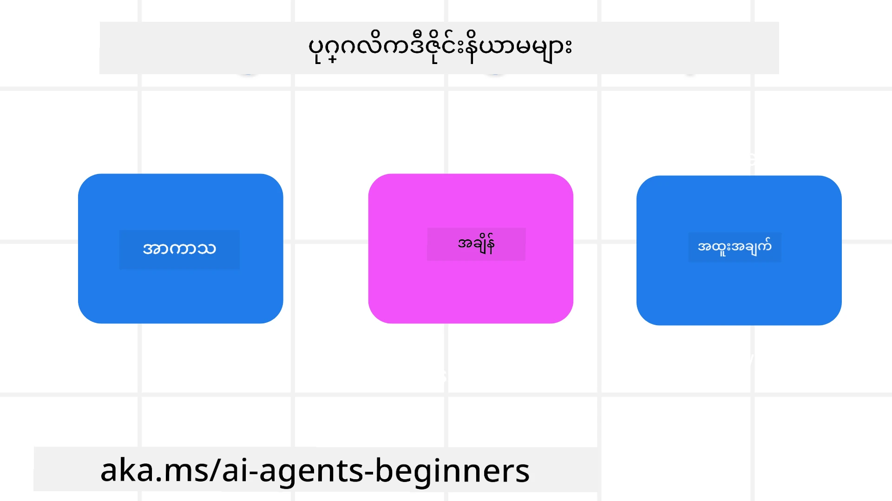

> _(ဒီဘာသာတော်၏ ဗီဒီယိုကိုကြည့်ရန် အပေါ်ပါ ပုံကိုနှိပ်ပါ)_
# AI Agentic ပုံစံဒီဇိုင်း၏ မူဝါဒများ

## နိဒါန်း

AI Agentic စနစ်များ တည်ဆောက်သည့် နည်းလမ်းများစွာ ရှိသည်။ Generative AI ဒီဇိုင်းတွင် မရှင်းလင်းမှုသည် အမှားအယွင်း မဟုတ်ဘဲ လက္ခဏာဖြစ်သောကြောင့် အင်ဂျင်နီယာများအနေဖြင့် မည်သည့်နေရာမှ စတင်ရန် မဖြစ်နိုင်ဘဲ ခက်ခဲမှုရှိတတ်သည်။ ကျွန်ုပ်တို့သည် ဖောက်သည် ဦးတည်ပြီး agentic စနစ်များ တည်ဆောက်နိုင်ရန် လူဦးတည် UX ဒီဇိုင်း မူဝါဒများကို ဖန်တီးထားပြီး အဖွဲ့များသည် agent အတွေ့အကြုံများကို သတ်မှတ်၍ တည်ဆောက်ရာတွင် စတင်နိုင်ရန် အစဖြစ်သည်။ ဒီ မူဝါဒများမှာ ကြပ်တည်းသော တည်ဆောက်မှုပုံစံ မဟုတ်ဘဲ အသုံးပြုသူအခြေခံ ဖြစ်ကြောင်း ဖြစ်သည်။

အထွေထွေ အနေနဲ့ agent များသည်-

- လူ့စွမ်းရည်များကို ကျယ်ပြန့်စွာ တိုးချဲ့ပေးရန် (စိတ်ကူးထုတ်ခြင်း၊ ပြဿနာဖြေရှင်းခြင်း၊ စက်ရုပ်လုပ်ဆောင်မှု စသည့်)
- အသိပညာ အားနည်းချက်များ ဖြည့်ဆည်းပေးရန် (အသိပညာနယ်ပယ်များကို အမြန်သိရှိစေခြင်း၊ ဘာသာပြန်ဆိုခြင်း စသည့်)
- သီးခြားကျွန်ုပ်တို့နှင့် အခြားသူများပေါင်းပြီး ပူးပေါင်းအလုပ်လုပ်ရာတွင် အထောက်အကူပြုရန်
- ကျွန်ုပ်တို့ကို ပိုကောင်းသော မူလအခြေအနေများဖြစ်စေခြင်း (ဥပမာ- ဘဝအကြံပေး၊ လုပ်ငန်းတာဝန်ဖြေရှင်းသူ၊ စိတ်ခံစားမှု ထိန်းသိမ်းခြင်းနှင့် စိတ်ရှင်းလင်းမှု ကျွမ်းကျင်မှုများ လေ့လာရန်ကူညီခြင်း၊ တည်ငြိမ်မှု တည်ဆောက်ခြင်း စသည့်)

## ဒီ သင်ခန်းစာတွင် ပါဝင်သောအကြောင်းအရာများ

- Agentic ဒီဇိုင်း မူဝါဒများ ဆိုတာဘာလဲ
- ဒီမူဝါဒများ အကောင်အထည်ဖော်စဉ် လမ်းညွှန်ချက်များ
- ဒီဇိုင်း မူဝါဒများ အသုံးပြုထားသည့် နမူနာများ

## သင်ယူရမည့် ရည်မှန်းချက်များ

ဒီသင်ခန်းစာပြီးစီးပြီးနောက် ချင်တာတွေမှာ-

1. Agentic ဒီဇိုင်း မူဝါဒများကို ရှင်းပြနိုင်မယ်
2. Agentic ဒီဇိုင်း မူဝါဒများ အသုံးပြုစဉ် လမ်းညွှန်ချက်များ ရှင်းပြနိုင်မယ်
3. Agentic ဒီဇိုင်း မူဝါဒများ အရ agent တည်ဆောက်နည်းနားလည်မယ်

## Agentic ဒီဇိုင်း မူဝါဒများ

### Agent (အာကာသ)

Agent သည် လည်ပတ်နေသည့် ပတ်ဝန်းကျင် ဖြစ်သည်။ ဒီမူဝါဒများမှာ ဖွံ့ဖြိုးတိုးတက်မှု လက်တွေ့နယ်ပယ်များ (ဖိဇစ်နှင့် ဒစ်ဂျစ်တယ်) တွင် agent များကို ဒီဇိုင်းလုပ်ရာတွင် အကြောင်းပြုသည်။

- **ချိတ်ဆက်ခြင်း၊ ပျက်ဆီးခြင်း မဟုတ်သည်** – လူများ၊ အဖြစ်အပျက်များနှင့် အလုပ်လုပ်နိုင်သော အသိပညာများ ထံ ချိတ်ဆက်ပေးကူညီခြင်းဖြင့် ပူးပေါင်းဆောင်ရွက်ခွင့်နှင့် ချိတ်ဆက်မှုကို ချဉ်းကပ်ခြင်း။
- Agent များသည် အဖြစ်အပျက်များ၊ အသိပညာများနှင့် လူများကို ချိတ်ဆက်ကူညီသည်။
- Agent များသည် လူများကို ပိုနီးကပ်စေသည်။ လူများကို အစားထိုးရန် သို့မဟုတ် ထိခိုက်စေဖို့ဒီဇိုင်းမလုပ်ထားပါ။
- **လွယ်ကူစွာရယူနိုင်သော်လည်း တခဏတည်းမျှ မမြင်ရသော** – Agent သည် များအားဖြင့် နောက်ခံတွင် လည်ပတ်ပြီး သင့်တော်မှုရှိသောအခါတွင်သာ ကျွန်ုပ်တို့အား ဆန်းစစ်နှိုးဆွ ပြုလုပ်သည်။
  - Agent သည် ခွင့်ပြုထားသော အသုံးပြုသူများအတွက် မည်သည့် စက်ပစ္စည်း သို့မဟုတ် ပလက်ဖောင်းတွင် မဆို ရှာဖွေ ရရှိနိုင်ပြီ ကူညီ ပံ့ပိုးသည်။
  - Agent သည် အသံ၊ အသံပြောဆို၊ စာသား စသည့် မျိုးစုံရိုက်ချက်နှင့် ထွက်ရှိမှုများကို ပံ့ပိုးသည်။
  - Agent သည် ရည်ရွယ်ချက်နှင့် အသုံးပြုသူလိုအပ်ချက် များအပေါ်မူတည်ပြီး နောက်ခံနှင့် ရှေ့ပြေး အဖြစ် လွယ်ကူစွာပြောင်းလဲနိုင်သည်။
  - Agent သည် မမြင်နိုင်သောပုံစံဖြင့် လည်ပတ်နိုင်သော်လည်း နောက်ခံလုပ်ငန်းစဉ်လမ်းကြောင်းနှင့် အခြား Agent များနှင့် ပူးပေါင်းဆောင်ရွက်မှုကို အသုံးပြုသူက ထိန်းချုပ်နိုင်ခြင်းနှင့် ထင်ဟပ်မြင်သာစေသည်။

### Agent (အချိန်)

Agent သည် အချိန်အတိုင်းအတာအလိုက် လည်ပတ်သည်။ ဒီ မူဝါဒများသည် အတိတ်၊ ပစ္စည်း၊ အနာဂတ်အကြား အပြန်အလှန်ဆက်ဆံရာတွင် Agent များကို ဒီဇိုင်းလုပ်ရာ ချဉ်းကပ် နည်းများဖြစ်သည်။

- **အတိတ်**: အခြေအနေ နှင့် သက်ဆိုင်ရာ အကြောင်းအရာများ ပါဝင်သော သမိုင်းကြောင်းကို ပြန်လည်သတိရခြင်း။
  - Agent သည် အဖြစ်အပျက်၊ လူ၊ ပြည်သူ့အခြေအနေ တို့ အထက်ပို၍ နက်ရှိုင်းသော သမိုင်းအချက်အလက်များကို ခြုံငုံသုံးသပ်ပြီး ပိုသင့်တော်သော ရလဒ်များ ပေးသည်။
  - Agent သည် အတိတ်ဖြစ်ရပ်များမှ ချိတ်ဆက်မှုများတည်ဆောက်ကာ ယခုအချိန် ဖြစ်ရပ်များနှင့် မေ့မရသော မှတ်ဉာဏ်များကို လှုပ်ရှားစေပြီး ဆက်သွယ်လုပ်ဆောင်သည်။
- **အခု**: သတိပေးရေးထက် ပိုမိုနှိုးဆော်ခြင်း။
  - Agent သည် လူများနှင့် ဆက်ဆံရာတွင် ကွဲပြားသော နည်းလမ်းများစွာ တက်ကြွကောင်းမွန်စွာ ဆောင်ရွက်သည်။ ဖြစ်ရပ်တစ်ခု ဖြစ်ပွားသည့်အခါ Agent သည် ရိုးရိုးသတိပေးခြင်း သို့မဟုတ် အခြား ရိုးရိုး သက်သေခံမှုများ ဖြတ်ကျော် ထုတ်ပြန်ရန် အသင့်ရှိသည်။ Agent သည် စီးလျားမှုများကို လွယ်ကူစွာ ပြင်ဆင်ပေးနိုင်ပြီး အသုံးပြုသူ၏ သတိကို မှန်ကန်သော အချိန်တွင် ဆွဲဆောင်နိုင်မည့် သင်္ကေတများကို dynamic ပြုလုပ်ပေးနိုင်သည်။
  - Agent သည် ပတ်ဝန်းကျင်ဆိုင်ရာ အခြေအနေများ၊ လူမှုမှုရေးနှင့် ယဉ်ကျေးမှု အပြောင်းအလဲများအပေါ် မူတည်ပြီး အသုံးပြုသူ ရည်ရွယ်ချက်နှင့် ကိုက်ညီသော သတင်းအချက်အလက်များ ပေးပို့သည်။
  - Agent ဆက်ဆံရေးသည် ရေရှည်အတွင်း အသုံးပြုသူများအား အင်အားဖြည့်ပေးရန် အဆင့်မြှင့်ဖြစ်ကာ ပြောင်းလဲတိုးတက်နိုင်သည်။
- **အနာဂတ်**: သွေဖယ် ကြီးထွားတိုးတက်ခြင်း။
  - Agent သည် စက်ပစ္စည်းများ၊ ပလက်ဖောင်းများနှင့် မျိုးစုံနည်းလမ်းများသို့ ကိုက်ညီ ပြောင်းလဲ သွားမည်။
  - Agent သည် အသုံးပြုသူ လုပ်ဆောင်မှု၊ ပိုင်ဆိုင်မှု လိုအပ်ချက်များအပေါ် မူတည်၍ လွတ်လပ်စွာ ပြင်ဆင်နိုင် နှင့် စိတ်ကြိုက် ပြုလုပ်နိုင်သည်။
  - Agent သည် အသုံးပြုသူ၏ ဆက်လက်ပူးပေါင်းမှုဖြင့် ပုံသဏ္ဍာန်ဖွံ့ဖြိုးကောင်းကောင်း ထွက်ပေါ်လာသည်။

### Agent (အဓိက)

Agent ဒီဇိုင်း၏ အဓိက အစိတ်အပိုင်းများ ဖြစ်သည်။

- **မသေချာမှုကို ကြိုဆိုပေမဲ့ ယုံကြည်မှု တည်ဆောက်ပါ။**
  - Agent များတွင် တစ်စိတ်တစ်ပိုင်း မသေချာမှု ရှိနိုင်သည်ဟု မျှော်လင့်သည်။ မသေချာမှုသည် Agent ဒီဇိုင်း၏ အဓိက အစိတ်အပိုင်းဖြစ်သည်။
  - ယုံကြည်မှုနှင့် ထင်ဟပ်မြင်သာမှုသည် Agent ဒီဇိုင်း၏ မူလ အခြေခံမှုများဖြစ်သည်။
  - လူမှုတွေက Agent ကို မည်သည့်အချိန်တွင် ဖွင့်/ပိတ် မည်ကို ထိန်းချုပ်နိုင်ပြီး Agent အခြေအနေကို အမြဲတမ်း ထင်ဟပ်မြင်သာစေရမည်။

## ဒီမူဝါဒများ အကောင်အထည်ဖော်ရန် လမ်းညွှန်ချက်များ

နောက်တစ်ခုတွင် ဖော်ပြထားသော ဒီဇိုင်းမူဝါဒများ အသုံးပြုသည့်အခါ အောက်ပါ လမ်းညွှန်ချက်များကို အသုံးချပါ-

1. **ထင်ဟပ်မြင်သာမှု**: AI ပါဝင်သည်ကို အသုံးပြုသူသိရှိစေရန်၊ လုပ်ဆောင်ပုံ (အတိတ်လုပ်ဆောင်ချက်များ ပါဝင်သည်) နှင့် အကြံပြုချက် များပေးခြင်းနှင့် စနစ် ပြင်ဆင်နိုင်မှု ပါဝင်သည်ကို သတင်းပို့ပါ။
2. **ထိန်းချုပ်မှု**: အသုံးပြုသူအနေဖြင့် စနစ်နှင့် ၎င်း၏ အသွင်အပြင်များကို ကိုယ်တိုင် ပြင်ဆင်နိုင်ပြီး ကိုယ်တိုင် နှစ်သက်ရာ သတ်မှတ်၍ ထိန်းချုပ်နိုင်စေရန် (မေ့လိုက်နိုင်စွမ်းပါ ပါဝင်သည်)။
3. **အဆက်မပြတ်မှု**: စက်ပစ္စည်းနှင့် အဆုံးမရှိမှုများတွင် မျိုးစုံသော အတွေ့အကြုံ များကို တူညီစေရန် အာရုံစိုက်ပါ။ နေရာရောက်သော UI/UX အစိတ်အပိုင်းများကို အသုံးပြုပါ (ဥပမာ- အသံနဲ့ ဆက်သွယ်ရာအတွက် မိုက်ခရိုဖုန်း အိုင်ကွန်) နှင့် ဖောက်သည်၏ စိတ်ဉာဏ်ပိတ်ဆို့မှု လျှော့ချပါ (ဥပမာ- တိုချုံးသော ဖြေကြားမှုများ၊ ဗီဇူအယ် သဘောတရားများနှင့် ‘ပိုမိုလေ့လာရန်’ အကြောင်းအရာ)။

## ဒီမူဝါဒများနှင့် လမ်းညွှန်ချက်များဖြင့် ခရီးသွား အေးဂျင့်ဒီဇိုင်းလုပ်နည်း

သင်သည် ခရီးသွား အေးဂျင့်တစ်ခု ဒီဇိုင်းလုပ်နေသည်ဟု တွေးကြည့်ပါ၊ ဒီမှာ ဒီဇိုင်းမူဝါဒများနှင့် လမ်းညွှန်ချက်များ အသုံးပြုနည်းဖြစ်သည်-

1. **ထင်ဟပ်မြင်သာမှု** – အသုံးပြုသူအား ခရီးသွားအေးဂျင့်သည် AI အသုံးပြုသော Agent ဖြစ်ကြောင်း အသိပေးပါ။ စတင်နည်း မူလ ညွှန်ကြားချက်များ (ဥပမာ- “မင်္ဂလာပါ” စာ, ဥပမာ မေးခွန်းများ) ပေးပါ။ ထုတ်ကုန် စာမျက်နှာတွင် သေချာ ဖေါ်ပြပါ။ အသုံးပြုသူက ယခင်ကမေးခဲ့သော မေးခွန်းစာရင်းကို ပြပါ။ Feedback ပေးနည်း (အတင်းအကျပ်နှင့် အနုတ်လက္ခဏာ၊ Feedback ပေးရန် ခလုတ်) ကို ရှင်းလင်း ဖေါ်ပြပါ။ Agent သည် အသုံးပြုခွင့် သို့မဟုတ် အကြောင်းအရာ ကန့်သတ်ချက်များ ရှိပါက သေချာ ဖေါ်ပြပါ။
2. **ထိန်းချုပ်မှု** – Agent ကို စတင်ဖန်တီးပြီးနောက် အသုံးပြုသူက System Prompt ကဲ့သို့ ပြင်ဆင်နိုင်မည့် နည်းလမ်းများ ကျင်းပပါစေ။ Agent ၏ စကားသွယ်ချက် အလှူနည်း၊ စာရေးပုံစံ၊ အသုံးမပြုသင့်သော ချက်များကို မည်သို့ သတ်မှတ်ရမည်ကို အသုံးပြုသူကို ရွေးခွင့်ပေးပါ။ ဖိုင်များ၊ ဒေတာများ၊ မေးခွန်းများနှင့် ယခင် စကားပြောဆိုမှုများကို ကြည့်ရှု နိုင်၍ ဖျက်ပါခွင့်ပေးပါ။
3. **အဆက်မပြတ်မှု** – Share Prompt အိုင်ကွန်၊ ဖိုင် သို့မဟုတ် ဓာတ်ပုံထည့်သည့် အိုင်ကွန် နှင့် တစ်စုံတစ်ရာ သူကို ချိတ်ဆက်ရန် အိုင်ကွန်များသည် စံနှင့် ကိုက်ညီ၍ ချဉ်းကပ်ကြောင်း သေချာစေပါ။ ဖိုင်တင်/မျှဝေမှုအတွက် ကပ်ထားသည့် အိုင်ကွန် (paperclip icon) နှင့် ဓာတ်ပုံတင်ရန် အိုင်ကွန်ကိုအသုံးပြုပါ။

## နမူနာ ကုဒ်များ

- Python: [Agent Framework](./code_samples/03-python-agent-framework.ipynb)
- .NET: [Agent Framework](./code_samples/03-dotnet-agent-framework.md)

## AI Agentic ဒီဇိုင်း ပုံစံများ အကြောင်းပိုမေးမြန်းလိုပါသလား?

အခြားသင်ယူသူများနှင့် မိတ်ဆက်ရန်၊ ရုံးချိန်များ တက်ရောက်ရန်နှင့် AI Agent မေးခွန်းများဖြေဆိုနိုင်ရန် [Microsoft Foundry Discord](https://discord.com/invite/ATgtXmAS5D) တွင် ပါဝင်ဆွေးနွေးပါ။

## အပိုဆောင်း အရင်းအမြစ်များ

- <a href="https://openai.com" target="_blank">Agentic AI စနစ်များ အုပ်ချုပ်မှု လေ့ကျင့်မှုများ | OpenAI</a>
- <a href="https://microsoft.com" target="_blank">HAX Toolkit Project - Microsoft Research</a>
- <a href="https://responsibleaitoolbox.ai" target="_blank">Responsible AI Toolbox</a>

## ယခင် သင်ခန်းစာ

[Agentic Framework များကို ရှာဖွေပါ](../02-explore-agentic-frameworks/README.md)

## နောက်တစ်ခေါက် သင်ခန်းစာ

[ကိရိယာ အသုံးပြုမှု ဒီဇိုင်း ပုံစံ](../04-tool-use/README.md)

---

<!-- CO-OP TRANSLATOR DISCLAIMER START -->
**ပြောကြားချက်**
ဤစာတမ်းကို AI ဘာသာပြန်ဝန်ဆောင်မှု [Co-op Translator](https://github.com/Azure/co-op-translator) အသုံးပြု၍ ဘာသာပြန်ထားပါသည်။ ကျွန်ုပ်တို့သည် တိကျမှန်ကန်မှုအတွက် ကြိုးပမ်းနေသော်လည်း၊ စက်ကိရိယာဘာသာပြန်ခြင်းများတွင် အမှားများ သို့မဟုတ် မှားယွင်းချက်များ ပါဝင်နိုင်ကြောင်း သတိပြုပါရန် လိုအပ်ပါသည်။ မူလစာတမ်းကို မူရင်းဘာသာဖြင့်သာ ယုံကြည်စိတ်ချရသော အချက်အလက်အဖြစ် သတ်မှတ်သင့်သည်။ အရေးကြီးသည့် သတင်းအချက်အလက်များအတွက် ပရော်ဖက်ရှင်နယ် လူသားဘာသာပြန်သူဝန်ဆောင်မှုကို အကြံပြုပါသည်။ ဤဘာသာပြန်ချက်ကို အသုံးပြုခြင်းမှ ဖြစ်ပေါ်လာသော နားလည်မှုကွာခြားမှုများ သို့မဟုတ် မမှန်ကန်သော အသုံးပြုမှုများအတွက် ကျွန်ုပ်တို့ တာဝန်မခံပါ။
<!-- CO-OP TRANSLATOR DISCLAIMER END -->