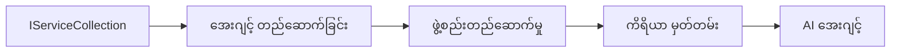

# 🎨 Azure OpenAI (Responses API) ဖြင့် Agentic ဒီဇိုင်မ်ပုံစံများ (.NET)

## 📋 သင်ယူရမည့် ရည်မှန်းချက်များ

ဤဥပမာသည် Microsoft Agent Framework ကို .NET အတွက် Azure OpenAI (Responses API) ကို ပေါင်းစပ်အသုံးပြုကာ တီထွင်သည့် बुद्धिमत्ता agent များ ဖန်တီးရာတွင် စက်ရုံအဆင့်ဒီဇိုင်းပုံစံများကို ပြသသည်။ ပရော်ဖက်ရှင်နယ်ပုံစံများနှင့် စက်မှုလုပ်ငန်းများတွင် အသုံးပြုနိုင်သောပြုလုပ်နည်းများကို သင်ယူရမည်ဖြစ်ပြီး၊ ထို agent များကို ထုတ်လုပ်မှုအဆင့်သင့်၊ ပြုပြင်ထိန်းသိမ်းရ လွယ်ကူပြီး များပြားတိုးချဲ့နိုင်စေသည်။

### စက်ရုံဒီဇိုင်းပုံစံများ

- 🏭 **Factory Pattern**: အခြေခံ dependency injection ဖြင့် အေဂျင့် ဖန်တီးခြင်းကို စံချိန်စံညွှန်းလုပ်ဆောင်ခြင်း
- 🔧 **Builder Pattern**: စိတ်ကြိုက် agent ဖွဲ့စည်း မှုပြုလုပ်ခြင်းနှင့် စီစဉ်ခြင်း
- 🧵 **Thread-Safe Patterns**: တပြိုင်နက် စကားပြောဆက်ဆံမှု စီမံခန့်ခွဲမှု
- 📋 **Repository Pattern**: ကိရိယာများနှင့် စွမ်းဆောင်ရည် စနစ်တကျစီမံခန့်ခွဲခြင်း

## 🎯 .NET-ထူးခြားသော ဆောက်လုပ်မှုပုံစံများ

### စက်ရုံအင်္ဂါရပ်များ

- **ကြံ့ခိုင်သောအမျိုးအစား**: Compile-time မှန်ကန်မှုနှင့် IntelliSense ကူညီမှု
- **Dependency Injection**: Built-in DI container ပေါင်းစပ်မှု
- **ဖွဲ့စည်းမှု စီမံခန့်ခွဲမှု**: IConfiguration နှင့် Options ပုံစံများ
- **Async/Await**: သဘာဝ asynchronous programming ပံ့ပိုးမှု

### ထုတ်လုပ်မှုအဆင့် သင့်ပုံစံများ

- **Logging Integration**: ILogger နှင့် ဖွဲ့စည်းတည်ဆောက်သော logging ပံ့ပိုးမှု
- **Health Checks**: Built-in စောင့်ကြည့်မှုနှင့် ရောဂါစောင်ခြင်း
- **Configuration Validation**: ကြံ့ခိုင်သောအမျိုးအစားနှင့် ဒေတာ annotation ဖြင့် စစ်ဆေးခြင်း
- **Error Handling**: ဖွဲ့စည်းတည်ဆောက်သော exception စီမံခန့်ခွဲမှု

## 🔧 နည်းပညာဆိုင်ရာ ဆောက်လုပ်မှုပုံစံ

### အခြေခံ .NET ကဏ္ဍများ

- **Microsoft.Extensions.AI**: AI စနစ် သေချာစွာ ပေါင်းစည်းခြင်း
- **Microsoft.Agents.AI**: စက်ရုံအဆင့် agent စီမံခန့်ခွဲမှု framework
- **Azure OpenAI (Responses API)**: မြင့်မားသောစွမ်းဆောင်ရည် API client ပုံစံများ
- **ဖွဲ့စည်းမှုစနစ်**: appsettings.json နှင့် ပတ်ဝန်းကျင် ပေါင်းစည်းမှု

### ဒီဇိုင်းပုံစံ တကျကျ လုပ်ဆောင်မှု



## 🏗️ ပြသထားသော စက်ရုံပုံစံများ

### 1. **ဖန်တီးမှု ပုံစံများ**

- **Agent Factory**: တကျကျ ဖန်တီးမှုနှင့် တူညီသော ဖွဲ့စည်းမှု
- **Builder Pattern**: မျက်စိမြင် API ဖြင့် စွမ်းဆောင်ရည်ပြည့်စုံသော agent ဖန်တီးခြင်း
- **Singleton Pattern**: အကျိုးပြု resource များနှင့် ဖွဲ့စည်းမှု စီမံခန့်ခွဲခြင်း
- **Dependency Injection**: ပိုမိုလွယ်ကူစေပြီး စမ်းသပ်နိုင်စေခြင်း

### 2. **အပြုအမှု ပုံစံများ**

- **Strategy Pattern**: လုပ်ဆောင်ချက်အတွက် ထပ်ဆင့်ရွေးချယ်နိုင်သော နည်းလမ်းများ
- **Command Pattern**: Agent လုပ်ဆောင်ချက်များကို encapsulate လုပ်ခြင်းနှင့် undo/redo
- **Observer Pattern**: နေ့စဉ်ပြောင်းလဲမှုများအတွက် အီးဗျင့်ပေါ်တွင် စီမံခြင်း
- **Template Method**: စံချိန်စံညွှန်း agent လုပ်ဆောင်ရန် workflow များ

### 3. **ဖွဲ့စည်မှု ပုံစံများ**

- **Adapter Pattern**: Azure OpenAI (Responses API) ပေါင်းစည်းမှု အလွှာ
- **Decorator Pattern**: Agent စွမ်းဆောင်ရည်တိုးမြှင့်ခြင်း
- **Facade Pattern**: အသုံးပြုရလွယ်ကူသော agent များ၏ အင်တာဖေ့စ်
- **Proxy Pattern**: Lazy loading နှင့် caching မှတဆင့် စွမ်းဆောင်မှု မြှင့်တင်ခြင်း

## 📚 .NET ဒီဇိုင်းအခြေခံ 원칙များ

### SOLID 원칙များ

- **Single Responsibility**: ကဏ္ဍတစ်ခုစီမှာ တိတိကျကျ တာဝန်ရှိခြင်း
- **Open/Closed**: ပြင်ဆင်ခြင်း မလိုအပ်ဘဲ တိုးချဲ့နိုင်ခြင်း
- **Liskov Substitution**: အင်တာဖေ့စ်အခြေပြု ကိရိယာများ ပြင်ဆင်ခြင်း
- **Interface Segregation**: အာရုံစိုက်ပြီး ညီညွတ်သော အင်တာဖေ့စ်များ
- **Dependency Inversion**: အကျဉ်းအဝိုင်းများပေါ်တွင် မူတည်ခြင်း၊ ပုံမှန်များ မဟုတ်ခြင်း

### သန့်ရှင်းသော ဆောက်လုပ်မှု

- **Domain Layer**: အဓိက agent နှင့် ကိရိယာ အကျဉ်း
- **Application Layer**: Agent စီမံခန့်ခွဲမှုနှင့် workflow များ
- **Infrastructure Layer**: Azure OpenAI (Responses API) ပေါင်းစည်းမှုနှင့် ပြင်ပ ဝန်ဆောင်မှုများ
- **Presentation Layer**: အသုံးပြုသူ အပြန်အလှန်နှင့် ဖြေကြားမှု ဖော်ပြချက်

## 🔒 စက်ရုံအဆင့် အကြံပြုချက်များ

### လုံခြုံရေး

- **Credential Management**: IConfiguration ဖြင့် API key များ လုံခြုံစွာ ကိုင်တွယ်ခြင်း
- **Input Validation**: ကြံ့ခိုင်သောအမျိုးအစားနှင့် ဒေတာ annotation စစ်ဆေးမှု
- **Output Sanitization**: လုံခြုံသော ဖြေကြားမှု များကို စီမံခြင်းနှင့် စစ်ထုတ်ခြင်း
- **Audit Logging**: စနစ်တကျ လုပ်ငန်းလည်ပတ်မှု ထောက်လှမ်းခြင်း

### စွမ်းဆောင်ရည်

- **Async Patterns**: ပိတ်မထားသော I/O လုပ်ငန်းစဉ်များ
- **Connection Pooling**: ထိရောက်သော HTTP client စီမံခန့်ခွဲမှု
- **Caching**: ဖြေကြားမှု caching ဖြင့် စွမ်းဆောင်မှု တိုးတက်မှု
- **Resource Management**: သင့်တော်စွာ ပြန်လည်ပယ်ဖျက်ခြင်းနှင့် သန့်ရှင်းရေး ပုံစံများ

### တိုးချဲ့နိုင်ရေး

- **Thread Safety**: တပြိုင်နက် agent အပြုအမှု ပံ့ပိုးမှု
- **Resource Pooling**: ထိရောက်သော အရင်းအမြစ် အသုံးချမှု
- **Load Management**: အမြင့်နှုန်းကန့်သတ်မှုနှင့် ပြန်ဖိနပ် စီမံခန့်ခွဲမှု
- **Monitoring**: စွမ်းဆောင်ရည် တိုင်းတာမှုများနှင့် ကျန်းမာရေး စစ်ဆေးမှုများ

## 🚀 ထုတ်လုပ်မှုအသုံးပြုမှု

- **Configuration Management**: ပတ်ဝန်းကျင်အလိုက် သတ်မှတ်ချက်များ
- **Logging Strategy**: ဖွဲ့စည်းတည်ဆောက်သော logging နှင့် correlation ID များ
- **Error Handling**: အပြည့်အစုံ exception စီမံခန့်ခွဲမှုနှင့် သင့်တော်သော ပြန်လည်ထူထောင်မှု
- **Monitoring**: application insights နှင့် performance counters
- **Testing**: unit tests, integration tests, နှင့် load testing ပုံစံများ

.NET ဖြင့် စက်ရုံအဆင့် အထက် Intelligence agent များ တည်ဆောက်ရန် အသင့်ဖြစ်ပြီလား? တည်ဆောက်ရန် ခိုင်မာသောပုံစံတစ်ခု လုပ်ကြရအောင်! 🏢✨

## 🚀 စတင်ရန်

### ပြင်ဆင်ထားရမည့်အရာများ

- [.NET 10 SDK](https://dotnet.microsoft.com/download/dotnet/10.0) ဒါမှမဟုတ် ထို့ကြီးမြတ်သော version
- Azure OpenAI resource နှင့် model deployment ပါဝင်သော [Azure subscription](https://azure.microsoft.com/free/)
- [Azure CLI](https://learn.microsoft.com/cli/azure/install-azure-cli) — `az login` ဖြင့် အကောင့် ဝင်ရန်

### လိုအပ်သော ပတ်ဝန်းကျင် ကွဲပြားချက်များ

```bash
# zsh/bash
export AZURE_OPENAI_ENDPOINT=https://<your-resource>.openai.azure.com
export AZURE_OPENAI_DEPLOYMENT=gpt-4o-mini
# ထိုအချိန်တွင် AzureCliCredential သည် token ရနိုင်ရန်အတွက် စာရင်းဝင်ပါ။
az login
```

```powershell
# PowerShell
$env:AZURE_OPENAI_ENDPOINT = "https://<your-resource>.openai.azure.com"
$env:AZURE_OPENAI_DEPLOYMENT = "gpt-4o-mini"
# ပြီးနောက် AzureCliCredential သည် token ရယူနိုင်ရန် အကောင့်ထဲသို့ လော့ဂ်အင် ဝင်ပါ။
az login
```

### နမူနာကုဒ်

ကုဒ်ဥပမာကို တည်ဆောက်ရန်၊

```bash
# zsh/bash
chmod +x ./03-dotnet-agent-framework.cs
./03-dotnet-agent-framework.cs
```

ဒါမှမဟုတ် dotnet CLI အသုံးပြု၍ -

```bash
dotnet run ./03-dotnet-agent-framework.cs
```

ပြည့်စုံသောကုဒ်များအတွက် [`03-dotnet-agent-framework.cs`](../../../../03-agentic-design-patterns/code_samples/03-dotnet-agent-framework.cs) အား ကြည့်ရှုပါ။

```csharp
#!/usr/bin/dotnet run

#:package Microsoft.Extensions.AI@10.*
#:package Microsoft.Agents.AI.OpenAI@1.*-*
#:package Azure.AI.OpenAI@2.1.0
#:package Azure.Identity@1.13.1

using System.ComponentModel;

using Microsoft.Agents.AI;
using Microsoft.Extensions.AI;

using Azure.AI.OpenAI;
using Azure.Identity;

// Tool Function: Random Destination Generator
// This static method will be available to the agent as a callable tool
// The [Description] attribute helps the AI understand when to use this function
// This demonstrates how to create custom tools for AI agents
[Description("Provides a random vacation destination.")]
static string GetRandomDestination()
{
    // List of popular vacation destinations around the world
    // The agent will randomly select from these options
    var destinations = new List<string>
    {
        "Paris, France",
        "Tokyo, Japan",
        "New York City, USA",
        "Sydney, Australia",
        "Rome, Italy",
        "Barcelona, Spain",
        "Cape Town, South Africa",
        "Rio de Janeiro, Brazil",
        "Bangkok, Thailand",
        "Vancouver, Canada"
    };

    // Generate random index and return selected destination
    // Uses System.Random for simple random selection
    var random = new Random();
    int index = random.Next(destinations.Count);
    return destinations[index];
}

// Azure OpenAI with the Responses API (stable v1 endpoint). Sign in with `az login`.
var azureEndpoint = Environment.GetEnvironmentVariable("AZURE_OPENAI_ENDPOINT")
    ?? throw new InvalidOperationException("AZURE_OPENAI_ENDPOINT is not set.");
var deployment = Environment.GetEnvironmentVariable("AZURE_OPENAI_DEPLOYMENT") ?? "gpt-4o-mini";

var azureClient = new AzureOpenAIClient(new Uri(azureEndpoint), new AzureCliCredential());

// Define Agent Identity and Comprehensive Instructions
// Agent name for identification and logging purposes
var AGENT_NAME = "TravelAgent";

// Detailed instructions that define the agent's personality, capabilities, and behavior
// This system prompt shapes how the agent responds and interacts with users
var AGENT_INSTRUCTIONS = """
You are a helpful AI Agent that can help plan vacations for customers.

Important: When users specify a destination, always plan for that location. Only suggest random destinations when the user hasn't specified a preference.

When the conversation begins, introduce yourself with this message:
"Hello! I'm your TravelAgent assistant. I can help plan vacations and suggest interesting destinations for you. Here are some things you can ask me:
1. Plan a day trip to a specific location
2. Suggest a random vacation destination
3. Find destinations with specific features (beaches, mountains, historical sites, etc.)
4. Plan an alternative trip if you don't like my first suggestion

What kind of trip would you like me to help you plan today?"

Always prioritize user preferences. If they mention a specific destination like "Bali" or "Paris," focus your planning on that location rather than suggesting alternatives.
""";

// Create AI Agent with Advanced Travel Planning Capabilities
// Get the Responses client for the deployment and create the AI agent
// Configure agent with name, detailed instructions, and available tools
// This demonstrates the .NET agent creation pattern with full configuration
AIAgent agent = azureClient
    .GetOpenAIResponseClient(deployment)
    .CreateAIAgent(
        name: AGENT_NAME,
        instructions: AGENT_INSTRUCTIONS,
        tools: [AIFunctionFactory.Create(GetRandomDestination)]
    );

// Create New Conversation Thread for Context Management
// Initialize a new conversation thread to maintain context across multiple interactions
// Threads enable the agent to remember previous exchanges and maintain conversational state
// This is essential for multi-turn conversations and contextual understanding
AgentThread thread = agent.GetNewThread();

// Execute Agent: First Travel Planning Request
// Run the agent with an initial request that will likely trigger the random destination tool
// The agent will analyze the request, use the GetRandomDestination tool, and create an itinerary
// Using the thread parameter maintains conversation context for subsequent interactions
await foreach (var update in agent.RunStreamingAsync("Plan me a day trip", thread))
{
    await Task.Delay(10);
    Console.Write(update);
}

Console.WriteLine();

// Execute Agent: Follow-up Request with Context Awareness
// Demonstrate contextual conversation by referencing the previous response
// The agent remembers the previous destination suggestion and will provide an alternative
// This showcases the power of conversation threads and contextual understanding in .NET agents
await foreach (var update in agent.RunStreamingAsync("I don't like that destination. Plan me another vacation.", thread))
{
    await Task.Delay(10);
    Console.Write(update);
}
```

---

<!-- CO-OP TRANSLATOR DISCLAIMER START -->
**ပြောကြားချက်**
ဤစာတမ်းကို AI ဘာသာပြန်ဝန်ဆောင်မှု [Co-op Translator](https://github.com/Azure/co-op-translator) အသုံးပြု၍ ဘာသာပြန်ထားပါသည်။ ကျွန်ုပ်တို့သည် တိကျမှန်ကန်မှုအတွက် ကြိုးပမ်းနေသော်လည်း၊ စက်ကိရိယာဘာသာပြန်ခြင်းများတွင် အမှားများ သို့မဟုတ် မှားယွင်းချက်များ ပါဝင်နိုင်ကြောင်း သတိပြုပါရန် လိုအပ်ပါသည်။ မူလစာတမ်းကို မူရင်းဘာသာဖြင့်သာ ယုံကြည်စိတ်ချရသော အချက်အလက်အဖြစ် သတ်မှတ်သင့်သည်။ အရေးကြီးသည့် သတင်းအချက်အလက်များအတွက် ပရော်ဖက်ရှင်နယ် လူသားဘာသာပြန်သူဝန်ဆောင်မှုကို အကြံပြုပါသည်။ ဤဘာသာပြန်ချက်ကို အသုံးပြုခြင်းမှ ဖြစ်ပေါ်လာသော နားလည်မှုကွာခြားမှုများ သို့မဟုတ် မမှန်ကန်သော အသုံးပြုမှုများအတွက် ကျွန်ုပ်တို့ တာဝန်မခံပါ။
<!-- CO-OP TRANSLATOR DISCLAIMER END -->