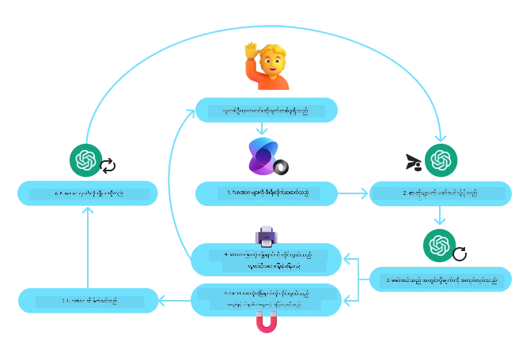
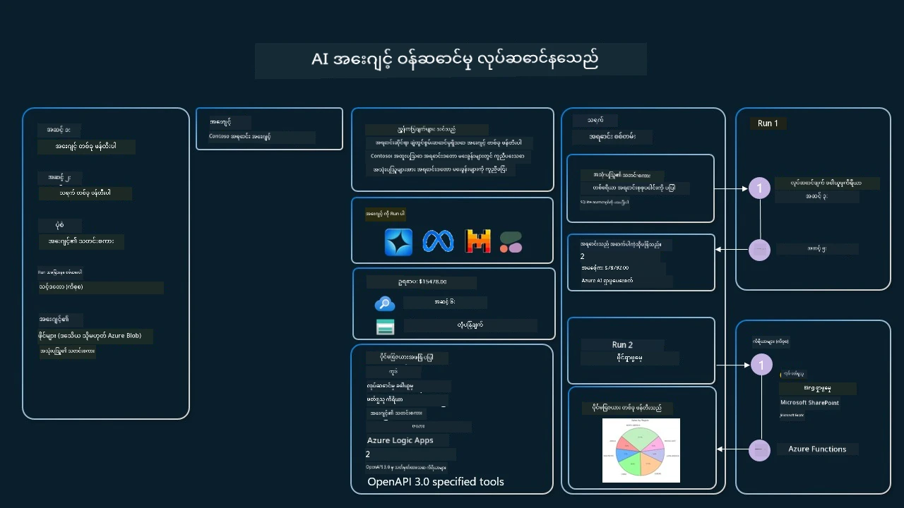

[](https://youtu.be/vieRiPRx-gI?si=cEZ8ApnT6Sus9rhn)

> _(ဤသင်ခန်းစာ၏ ဗီဒီယိုအား ကြည့်ရန် အထက်ပါ ဓာတ်ပုံကို နှိပ်ပါ)_

# ကိရိယာအသုံးပြုမှု ဒီဇိုင်းပုံစံ

ကိရိယာများသည် AI တိုက်ရိုက်ကြားသူများအား ပိုမိုကျယ်ပြန့်သော စွမ်းဆောင်ရည်များရှိစေရန် ခွင့်ပြုသည်ဖြစ်သောကြောင့် စိတ်ဝင်စားဖွယ်ကောင်းသည်။ တိုက်ရိုက်ကြားသူ၏ လုပ်ဆောင်နိုင်သော လှုပ်ရှားမှုအစုအဝေးကန့်သတ်ထားခြင်းမဟုတ်ပဲ ကိရိယာတစ်ခုထည့်သွင်းခြင်းဖြင့် အဲ့ဒီတိုက်ရိုက်ကြားသူသည် လှုပ်ရှားမှုအမျိုးမျိုးကျယ်ပြန့်စွာ ပြုလုပ်နိုင်သည်။ ဒီအခန်းကဏ္ဍတွင် ကျွန်ုပ်တို့သည် AI တိုက်ရိုက်ကြားသူများသည် သူတို့ရဲ့ ရည်မှန်းချက်များကို ပြည့်မှီစေရန် အထူးကိရိယာများကို အဘယ်လိုအသုံးပြုနိုင်သူကို ဖော်ပြသည့် ကိရိယာအသုံးပြုမှု ဒီဇိုင်းပုံစံကို ကြည့်ရှုသွားမှာဖြစ်သည်။

## မိတ်ဆက်

ဤသင်ခန်းစာတွင် ကျွန်ုပ်တို့ ပြေဖြေလိုသော မေးခွန်းများမှာ -

- ကိရိယာအသုံးပြုမှု ဒီဇိုင်းပုံစံ ဆိုတာဘာလဲ?
- ၎င်းကို ဘယ်လိုသုံးနိုင်မလဲ?
- ဒီဇိုင်းပုံစံကို အကောင်အထည်ဖော်ရန် လိုအပ်သော အစိတ်အပိုင်းများ/ဖွဲ့စည်းမှုအချက်များ ဘာတွေလဲ?
- ယုံကြည်စိတ်ချရသော AI တိုက်ရိုက်ကြားသူများ ဖန်တီးရာတွင် ကိရိယာအသုံးပြုမှု ဒီဇိုင်းပုံစံအသုံးပြုတဲ့အခါ သတိပြုရမည့် အထူးအချက်များ ဘာတွေလဲ?

## သင်ယူရမည့် ရည်မှန်းချက်များ

ဤသင်ခန်းစာပြီးမြောက်ပြီးနောက် သင်သည် -

- ကိရိယာအသုံးပြုမှု ဒီဇိုင်းပုံစံအဓိပ္ပါယ်နှင့် ရည်ရွယ်ချက်ကို သတ်မှတ်နိုင်မည်။
- ကိရိယာအသုံးပြုမှု ဒီဇိုင်းပုံစံကို သုံးနိုင်သည့် အသုံးချမှုအခြေအနေများကို တိကျစွာ သဘောပေါက်နိုင်မည်။
- ဒီဇိုင်းပုံစံကို အကောင်အထည်ဖော်ရန် လိုအပ်သော အဓိကအချက်များကို နားလည်နိုင်မည်။
- ဒီဇိုင်းပုံစံအသုံးပြု AI တိုက်ရိုက်ကြားသူများ၏ ယုံကြည်စိတ်ချရမှုအတွက် သတိပြုရမည့် အချက်များကို အသိအမှတ်ပြုနိုင်မည်။

## ကိရိယာအသုံးပြုမှု ဒီဇိုင်းပုံစံ란?

**ကိရိယာအသုံးပြုမှု ဒီဇိုင်းပုံစံ** သည် LLM များအား ခြေလှမ်းသတ်မှတ်ထားသော ရည်မှန်းချက်များကို ပြည့်မှီစေရန် ပြင်ပကိရိယာများနှင့် ဆက်သွယ်လုပ်ဆောင်နိုင်ခြင်းအား ပေးသည့် ပုံစံဖြစ်သည်။ ကိရိယာသည် တိုက်ရိုက်ကြားသူမှ လုပ်ဆောင်မှုများ ပြုလုပ်နိုင်‌စေရန် အကောင်အထည်ဖော်နိုင်သည့် နည်းလမ်းတစ်ခုဖြစ်ပြီး၊ ကိရိယာတစ်ခုမှာ ကိန်းတွက်စက်ကဲ့သို့ စာရင်းအင်းပြုလုပ်ပေးနိုင်သော လွယ်ကူသောလုပ်ဆောင်ချက်တစ်ခုဖြစ်နိုင်သည် သို့မဟုတ် အတတည်ရှိသူ၏ ဝန်ဆောင်မှုများ၏ API ခေါ်ဆိုမှုများကဲ့သို့ ကျယ်ပြန့်သော အချက်အလက်ရှာဖွေမှုများ ပြုလုပ်ပေးနိုင်သည်။ AI တိုက်ရိုက်ကြားသူများဆိုင်ရာတွင် ကိရိယာများကို **မော်ဒယ်ထုတ်လုပ်သည့် လုပ်ဆောင်ချက်ခေါ်ဆိုမှုများ** နှင့် တုံ့ပြန်၍ တိုက်ရိုက်ကြားသူများမှ ဆောင်ရွက်နိုင်စေရန် ဒီဇိုင်းဗျူဟာများအတိုင်း ဖန်တီးထားသည်။

## ၎င်းကို ဘယ်လိုအသုံးပြုနိုင်သလဲ?

AI တိုက်ရိုက်ကြားသူများသည် ကိရိယာများကို အသုံးပြု၍ ကြီးမားသော တာဝန်များ အပြီးသတ်နိုင်ပြီး သတင်းအချက်အလက် ရယူခြင်း၊ ဆုံးဖြတ်ချက်ချခြင်းများ ပြုလုပ်နိုင်သည်။ ကိရိယာအသုံးပြုမှု ဒီဇိုင်းပုံစံကို အထူးသဖြင့် ပြင်ပစနစ်များဖြစ်သော ဒေတာဘေ့စ်များ၊ ဝက်ဘ်ဝန်ဆောင်မှုများ၊ ကုဒ်အသုံးပြုသူများ စသည်ဖြင့် ‌တိုက်ရိုက်ဆက်သွယ်ဖလှယ်ရမည့် အခြေအနေများတွင် အသုံးပြုသည်။ ဤအင်္ဂါရပ်သည် အမျိုးမျိုးသော အသုံးချမှုများအတွက် အထောက်အကူဖြစ်ပြီး -

- **သတင်းအချက်အလက် ရယူခြင်း:** တိုက်ရိုက်ကြားသူများသည် ပြင်ပ API များ သို့မဟုတ် ဒေတာဘေ့စ်များဖြင့် မှန်ကန်သားအချက်အလက်သိရန် ကျော်ဖြတ်မေးခြင်း (ဥပမာ - SQLite ဒေတာဘေ့စ်ကို ကုဒ်စစ်ဆေးမှုအတွက် မေးခြင်း၊ ရှယ်ယာစျေးနှုန်း သို့မဟုတ် ရာသီဥတုပြုမှုများ ရယူခြင်း)။
- **ကုဒ် လည်ပတ်မှုနှင့် ဖတ်မြင်ခြင်း:** အချက်၌ ကုဒ်သို့မဟုတ် စက္ကူများ ပြုလုပ်ခြင်းဖြင့် သင်္ချာပြဿနာများ ဖြေရှင်းခြင်း၊ ရရှိရန် ရုပ်ပြစာရင်းများ ဖန်တီးခြင်း သို့မဟုတ် အတုဂဏန်းများ ဆောင်ရွက်ခြင်း။
- **လုပ်ငန်းစဉ် အလိုအလျောက်ရေးဆွဲခြင်း:** တုံ့ပြန်မှုများကို လုပ်ငန်းစဉ်များ၊ အီးမေလ် ဝန်ဆောင်မှုများ သို့မဟုတ် ဒေတာလိုင်းများကဲ့သို့ ဝကျပ်နောက်ခံကိရိယာများကို ထည့်သွင်းမှုပြု၍ အလွယ်တကူလုပ်ဆောင်ခြင်း။
- **ဖောက်သည် ကူညီမှု:** CRM စနစ်များ၊ တစ်ကတ်မှတ် ပလက်ဖောင်းများ သို့မဟုတ် သတင်းအချက်အလက် အဖွဲ့များနှင့် ချိတ်ဆက်ပြီး အသုံးပြုသူ မေးခွန်းများ ဖြေရှင်းခြင်း။
- **အကြောင်းအရာ ဖန်တီးမှုနှင့် ပြုပြင်ခြင်း:** ဝါကျစစ်ခြင်း၊ စာသားအကျဉ်းချုပ်သူများ သို့မဟုတ် အကြောင်းအရာ လုံခြုံရေးစစ်ဆေးသူ ကိရိယာများကို အသုံးပြု၍ အကြောင်းအရာဖန်တီးခြင်းအား ကူညီမှုဖြစ်စေရန်။

## ကိရိယာအသုံးပြုမှု ဒီဇိုင်းပုံစံ၏ အစိတ်အပိုင်းများ/ဖွဲ့စည်းမှု

AI တိုက်ရိုက်ကြားသူများသည် အသားတင် တာဝန်များလုပ်ဆောင်နိုင်စေရန် ဒီအချက်များ မရှိမဖြစ်လိုအပ်ပါသည်။ ကိရိယာအသုံးပြုမှု ဒီဇိုင်းပုံစံ အကောင်အထည်ဖော်ရန် လိုအပ်သော အစိတ်အပိုင်းအဓိကများကို လေ့လာကြည့်ကြပါစို့ -

- **လုပ်ဆောင်ချက်/ကိရိယာ အနုတ်စုများ (Function/Tool Schemas)**: ရရှိနိုင်သော ကိရိယာများ၏ အသေးစိတ် ဖေါ်ပြချက်များ၊ လုပ်ဆောင်ချက်နာမည်၊ ရည်ရွယ်ချက်၊ လိုအပ်သည့် ပါရာမီတာများနှင့် မျှော်မှန်းထားသည့် ထွက်ရှိမှုများ၊ LLM အနေဖြင့် ရရှိနိုင်သည့် ကိရိယာများဖော်ပြချက်အား နားလည်နိုင်ရန်နှင့် တောင်းဆိုမှုမှာ မှန်ကန်စေရန် schema များ။
- **လုပ်ဆောင်ချက် လွှမ်းမိုးမှု လိုဂျစ်(စ်)**: အသုံးပြုသူ ရည်ရွယ်ချက်နှင့် စကားဝိုင်းအခြေအနေများအပေါ် ကျော်ဖြတ်၍ ကိရိယာများကို မည်သို့နှင့် မည်အချိန်မှာ အသုံးပြုမည်ကို ဆုံးဖြတ်ပေးခြင်း။ နေရာယူခြင်း မော်ဂျူးများ၊ လမ်းကြောင်းခြားခြင်း၊ စည်းနှုန်းများအောက်ရှိလှုပ်ရှားမှုများ ပါဝင်နိုင်သည်။
- **စာတိုဆက်သွယ်မှု စနစ်**: အသုံးပြုသူ၏ အဝင်၊ LLM ဖြေကြားမှု၊ ကိရိယာ ခေါ်ဆိုမှုများနှင့် ထွက်ရှိမှုများကြား ဆက်သွယ်မှု စီမံခန့်ခွဲမှု။
- **ကိရိယာ ပေါင်းစည်းမှု ပံ့ပိုးမှု**: တိုက်ရိုက်ကြားသူနှင့် ကိရိယာများကို ချိတ်ဆက်ပေးသည့်အခြေခံပလက်ဖောင်း၊ လွယ်ကူသောလုပ်ဆောင်ချက်များမှ စပြီး ပြင်ပဝန်ဆောင်မှုများကို ချိတ်ဆက်နိုင်ခြင်း။
- **အမှား စီမံခြင်းနှင့် အတည်ပြုခြင်း**: ကိရိယာ လုပ်ဆောင်မှုမှ ချို့ယွင်းမှုများကို ကိုင်တွယ်ခြင်း၊ ပါရာမီတာများကို စစ်ဆေးခြင်းနှင့် မမျှော်လင့်ထားသော တုံ့ပြန်မှုများ ကို စီမံခန့်ခွဲခြင်း။
- **အခြေအနေ စီမံမှု**: စကားဝိုင်းအခြေအနေ၊ ယခင်ကိရိယာဆက်သွယ်မှုများနှင့် ဒေတာ များကို တွဲဖက် ထိန်းသိမ်းမှုဖြင့် ဘယ်အချိန်မှာမဆို တိုက်ရိုက်ကြားသူ၏ တေစီမြဲမှု ကိုသေချာစေရန်။

နောက်တစ်ခါမှာတော့ လုပ်ဆောင်ချက်/ကိရိယာ ခေါ်ဆိုမှုကို ပိုမိုအသေးစိတ်ကြည့်လိုက်ရအောင်။

### လုပ်ဆောင်ချက်/ကိရိယာ ခေါ်ဆိုမှု

လုပ်ဆောင်ချက်ခေါ်ဆိုခြင်းသည် LLM များအား ကိရိယာများနှင့် ဆက်သွယ်ရန် အဓိကနည်းလမ်းဖြစ်သည်။ ပုံမှန်ကျသော 'Function' နှင့် 'Tool' ဆိုသော စကားလုံးများကို ညီညွတ်စွာအသုံးပြုကြသည်။ အကြောင်းမှာ 'လုပ်ဆောင်ချက်' များ သည် ပြန်လည်အသုံးပြုနိုင်သော ကုဒ်အပိုင်းများဖြစ်ပြီး ကိရိယာများအဖြစ် ၏ချိတ်ဆက်မှုဖြစ်သည်။ လုပ်ဆောင်ချက်၏ကုဒ်ကို ခေါ်ဆိုရန် LLM က အသုံးပြုသူ၏ တောင်းဆိုချက်ကို လုပ်ဆောင်ချက်ဖော်ပြချက်နှင့် နှိုင်းယှဉ်ရမည်။ ၎င်းအတွက်  ရှိသည့်လုပ်ဆောင်ချက်အားလုံး၏ ဖော်ပြချက်များပါရှိသည့် schema ကို LLM ထံသို့ ပို့ပေးပါသည်။ ထိုနောက် LLM သည် ထိပ်တန်းသင့်တင့်သော လုပ်ဆောင်ချက်အားရွေးချယ်ကာ ကျန်ရစ်နေသော နာမည်နှင့် ပါရာမီတာများကို ပြန်လည်ပေးပို့သည်။ ရွေးချယ်ခံရသော လုပ်ဆောင်ချက်ကို ခေါ်ဆိုပြီး ပြန်လည်ရရှိသော တုံ့ပြန်မှုကို LLM သို့ ပြန်ပို်း၍ အသုံးပြုသူ တောင်းဆိုချက်ကို ဖြေရှင်းသည်။

လုပ်ဆောင်ချက်ခေါ်ဆိုမှုပုံစံကို အကောင်အထည်ဖော်ရန် -

1. လုပ်ဆောင်ချက်ခေါ်ဆိုမှုများကို ထောက်ပံ့ပေးသည့် LLM မော်ဒယ်တစ်ခု။
2. လုပ်ဆောင်ချက်ဖော်ပြချက်ပါရှိသည့် schema တစ်ခုပြုလုပ်ထားရှိခြင်း။
3. ဖော်ပြထားသော လုပ်ဆောင်ချက်တစ်ခုစီအတွက် ကုဒ်။

မြို့တစ်မြို့ရှိ လက်ရှိအချိန် ရယူခြင်း ဒေမိုန့်ရှင်းကို လို့ကြည့်ပါစို့ -

1. **လုပ်ဆောင်ချက်ခေါ်ဆိုမှုကို ထောက်ပံ့သည့် LLM ကို စတင်ဖွင့်ပါ။**

    မော်ဒယ်အားလုံးမှာ လုပ်ဆောင်ချက်ခေါ်ဆိုမှုကို ထောက်ပံ့မထားပါ၊ သင့်အသုံးပြုနေသော LLM မှ ထောက်ပံ့မှုရှိသည်ကို စစ်ဆေးရန် လိုအပ်သည်။ <a href="https://learn.microsoft.com/azure/ai-services/openai/how-to/function-calling" target="_blank">Azure OpenAI</a> သည် လုပ်ဆောင်ချက်ခေါ်ဆိုမှုကို ထောက်ပံ့သည်။ Azure OpenAI client ကို စတင်ဖွင့်ခြင်းကနေ ဆက်လုပ်နိုင်သည်။

    ```python
    # Azure OpenAI ဖောက်သည်ကို စတင်ဆောင်ရွက်ပါ
    client = AzureOpenAI(
        azure_endpoint = os.getenv("AZURE_AI_PROJECT_ENDPOINT"), 
        api_key=os.getenv("AZURE_OPENAI_API_KEY"),  
        api_version="2024-05-01-preview"
    )
    ```

1. **လုပ်ဆောင်ချက် Schema တည်ဆောက်ပါ။**

    လုပ်ဆောင်ချက်နာမည်၊ ၎င်းလုပ်ဆောင်ချက်၏ ရည်ရွယ်ချက်နှင့် ပါရာမီတာများ၏ နာမည်များနှင့် ဖေါ်ပြချက်များပါရှိသည့် JSON schema တစ်ခု ဖန်တီးသွားမည်ဖြစ်သည်။
    ထို schema ကို ယခင်က ဖန်တီးထားသည့် client ထံသို့တွင် ထည့်သွင်းကာ အသုံးပြုသူ၏ တောင်းဆိုချက်ဖြင့် San Francisco ၏ အချိန်ကို ရှာဖွေမည်ဖြစ်သည်။ ထူးခြားချက်မှာ **tool call** ဖြစ်သော တောင်းဆိုမှုဖြင့် တုံ့ပြန်သည့် အဖြေ မဟုတ်ပဲ၊ LLM က ၎င်းလုပ်ဆောင်ချက်ကို ရွေးချယ်သည့်နာမည်နှင့် ပါရာမီတာများကိုသာ ပြန်ပေးပို့သည်။

    ```python
    # မော်ဒယ်အတွက် ဖတ်ရန် ဖန့်ချမှုဖွင့်ဆိုချက်
    tools = [
        {
            "type": "function",
            "function": {
                "name": "get_current_time",
                "description": "Get the current time in a given location",
                "parameters": {
                    "type": "object",
                    "properties": {
                        "location": {
                            "type": "string",
                            "description": "The city name, e.g. San Francisco",
                        },
                    },
                    "required": ["location"],
                },
            }
        }
    ]
    ```
   
    ```python
  
    # စတင်အသုံးပြုသူစာသား
    messages = [{"role": "user", "content": "What's the current time in San Francisco"}] 
  
    # ပထမဆုံး API ခေါ်ဆိုခြင်း: မော်ဒယ်ကို function သုံးရန် တောင်းဆိုပါ
      response = client.chat.completions.create(
          model=deployment_name,
          messages=messages,
          tools=tools,
          tool_choice="auto",
      )
  
      # မော်ဒယ်၏တုံ့ပြန်ချက်ကို ဆက်လက်ဆောင်ရွက်ပါ
      response_message = response.choices[0].message
      messages.append(response_message)
  
      print("Model's response:")  

      print(response_message)
  
    ```

    ```bash
    Model's response:
    ChatCompletionMessage(content=None, role='assistant', function_call=None, tool_calls=[ChatCompletionMessageToolCall(id='call_pOsKdUlqvdyttYB67MOj434b', function=Function(arguments='{"location":"San Francisco"}', name='get_current_time'), type='function')])
    ```
  
1. **တာဝန်ထမ်းဆောင်ရန် လုပ်ဆောင်ချက် ကုဒ်ကို ဆောက်လုပ်ပါ။**

    ယခု LLM သည် လုပ်ဆောင်မှုဆောင်ရွက်ရန် လုပ်ဆောင်ချက်ကို ရွေးချယ်ပြီးဖြစ်သောကြောင့် အဲ့ဒီလုပ်ဆောင်ချက်ကို အကောင်အထည်ဖော် ဆောင်ရွက်ရန်ကုဒ်ရေးသားရမည်ဖြစ်သည်။
    Python တွင် လက်ရှိအချိန်အား ရယူရန် ကုဒ်ရေးသားနိုင်ပါသည်။ ပြီးနောက် response_message မှ လုပ်ဆောင်ချက်နာမည်နှင့် ပါရာမီတာများကို ပြန်ထုတ်ယူရန် ကုဒ်ရေးသားရမည်ဖြစ်သည်။

    ```python
      def get_current_time(location):
        """Get the current time for a given location"""
        print(f"get_current_time called with location: {location}")  
        location_lower = location.lower()
        
        for key, timezone in TIMEZONE_DATA.items():
            if key in location_lower:
                print(f"Timezone found for {key}")  
                current_time = datetime.now(ZoneInfo(timezone)).strftime("%I:%M %p")
                return json.dumps({
                    "location": location,
                    "current_time": current_time
                })
      
        print(f"No timezone data found for {location_lower}")  
        return json.dumps({"location": location, "current_time": "unknown"})
    ```

     ```python
     # ဖောင်ရှင်ခေါ်ဆိုမှုများကို ကိုင်တွယ်ပါ
      if response_message.tool_calls:
          for tool_call in response_message.tool_calls:
              if tool_call.function.name == "get_current_time":
     
                  function_args = json.loads(tool_call.function.arguments)
     
                  time_response = get_current_time(
                      location=function_args.get("location")
                  )
     
                  messages.append({
                      "tool_call_id": tool_call.id,
                      "role": "tool",
                      "name": "get_current_time",
                      "content": time_response,
                  })
      else:
          print("No tool calls were made by the model.")  
  
      # ဒုတိယ API ခေါ်ဆိုမှု: မော်ဒယ်မှအဆုံးသတ်ဖြေကြောင်း ကိုရယူပါ
      final_response = client.chat.completions.create(
          model=deployment_name,
          messages=messages,
      )
  
      return final_response.choices[0].message.content
     ```

     ```bash
      get_current_time called with location: San Francisco
      Timezone found for san francisco
      The current time in San Francisco is 09:24 AM.
     ```

လုပ်ဆောင်ချက်ခေါ်ဆိုမှုသည် တိုက်ရိုက်ကြားသူ၏ ကိရိယာအသုံးပြုမှု ဒီဇိုင်း၏ အဓိကအပိုင်းဖြစ်သော်လည်း အစမှတည်ဆောက်ရ၍ စိန်ခေါ်မှုရှိနိုင်သည်။
[Lesson 2](../../../02-explore-agentic-frameworks) တွင် လေ့လာသည့်အတိုင်း agentic frameworks များက တိုက်ရိုက်ကြားသူ ကိရိယာအသုံးပြုမှု အကောင်အထည်ဖော်ရန် ပြုပြင်ထားသည့်ဖွဲ့စည်းမှုများပေးသည်။

## Agentic Frameworks ဖြင့် ကိရိယာအသုံးပြုမှု တိုက်ရိုက်ကြားသူ ဥပမာများ

အောက်တွင် အမျိုးအစား agentic frameworks များကို အသုံးပြုပြီး ကိရိယာအသုံးပြုမှု ဒီဇိုင်းပုံစံကို အကောင်အထည်ဖော်နည်း ဥပမာများ ပေးထားသည်-

### Microsoft Agent Framework

<a href="https://learn.microsoft.com/azure/ai-services/agents/overview" target="_blank">Microsoft Agent Framework</a> သည် AI တိုက်ရိုက်ကြားသူဖန်တီးရာတွင် အသုံးပြုသော အဖွဲ့အစည်း အလွယ်ကူ ပြုလုပ်ထားသည့် AI Framework ဖြစ်သည်။ function calling ကို Python လုပ်ဆောင်ချက်များကို `@tool` decorator ဖြင့် သတ်မှတ်ခြင်းဖြင့် တိုးမြှင့်ပေးသည်။ Framework သည် မော်ဒယ်နှင့် သင့်ကုဒ်အကြား ဆက်သွယ်မှုလုပ်ငန်းစဉ်ကို ကိုင်တွယ်ပေးသည်။ AzureAIProjectAgentProvider မှတဆင့် File Search နှင့် Code Interpreter ကဲ့သို့ လုပ်ဆောင်ချက်များ အသုံးပြုနိုင်သည်။

အောက်ပါပုံရိပ်တွင် Microsoft Agent Framework တွင် function calling ဖြစ်ပုံကို ဖော်ပြသည်။



Microsoft Agent Framework တွင် ကိရိယာများကို decorator ဖြင့် သတ်မှတ်ထားသည့် လုပ်ဆောင်ချက်များအဖြစ် ဖော်ပြသည်။ ယခင်မှာ မြင်ခဲ့သော `get_current_time` လုပ်ဆောင်ချက်ကို `@tool` decorator အသုံးပြု၍ ကိရိယာသို့ပြောင်းလဲနိုင်သည်။ Framework သည် လုပ်ဆောင်ချက်နှင့် ပါရာမီတာများကို အလိုအလျောက် စီးရီးလိုက် ပြောင်းလဲပြီး LLM ထံသို့ ပို့ရန် schema ကို ဖန်တီးပေးသည်။

```python
from agent_framework import tool
from agent_framework.azure import AzureAIProjectAgentProvider
from azure.identity import AzureCliCredential

@tool
def get_current_time(location: str) -> str:
    """Get the current time for a given location"""
    ...

# ကလေးယ့်ကို ဖန်တီးပါ။
provider = AzureAIProjectAgentProvider(credential=AzureCliCredential())

# အေးဂျင့်တစ်ယောက် ဖန်တီးပြီး ကိရိယာနှင့် အတူ chạyပါ။
agent = await provider.create_agent(name="TimeAgent", instructions="Use available tools to answer questions.", tools=get_current_time)
response = await agent.run("What time is it?")
```
  
### Azure AI Agent Service

<a href="https://learn.microsoft.com/azure/ai-services/agents/overview" target="_blank">Azure AI Agent Service</a> သည် developer များအား ဘေးကင်းလုံခြုံစွာ AI တိုက်ရိုက်ကြားသူများကို ဖန်တီးရန်၊ တပ်ဆင်ရန်နှင့် တိုးချဲ့ရန် အကူအညီပေးသည့် နောက်ဆုံးပေါ် agentic framework ဖြစ်သည်။ အထူးသဖြင့် လုပ်ငန်းအသုံးချမှုများတွင် အထောက်အကူပြုသည်၊ ဘေးကင်းလုံခြုံမှု အဆင့်မြင့်ဖြစ်ပြီး အပြည့်အဝ စီမံခန့်ခွဲထားသည့် ဝန်ဆောင်မှုတစ်ရပ်ဖြစ်သောကြောင့်။

LLM API ကိုတိုက်ရိုက်အသုံးပြု၍ ဖွံ့ဖြိုးတိုးတက်မှုနှင့် နှိုင်းယှဉ်လျှင် Azure AI Agent Service သည် အောက်ပါ အကျိုးကျေးဇူးများ ရရှိစေသည် -

- ကိရိယာခေါ်ဆိုမှုကို အလိုအလျောက် လုပ်ဆောင်ပေးခြင်း – ကိရိယာခေါ်ဆိုမှုကို ခွဲခြမ်းစစ်ဆေးရန်၊ ကိရိယာခေါ်ဆိုရန်နှင့် တုံ့ပြန်မှု ကိုစီမံရန်လိုအပ်ချက်မရှိ၊ ၀န်ဆောင်မှုဘက်မှ တာဝန်ယူသည်။
- ဒေတာ အချက်အလက်များကို ဘေးကင်းလုံခြုံစွာ စီမံမှု – ကိုယ့်ကိုယ်ကို စကားဝိုင်းအခြေအနေ ထိန်းသိမ်းရန် မလိုအပ်ဘဲ Threads ကို အသုံးပြု၍ လိုအပ်သော သတင်းအချက်အလက်အားလုံး သိမ်းဆည်းခြင်း။
- ပြင်ပ data source များနှင့် ဆက်သွယ်ရန် ရရှိနိုင်သည့် ကိရိယာများ – Bing, Azure AI Search နှင့် Azure Functions ကဲ့သို့သော ကိရိယာများ။

Azure AI Agent Service တွင် ရနိုင်သော ကိရိယာများကို နှစ်မျိုးခွဲမည် –

1. ဗဟုသုတကိရိယာများ:
    - <a href="https://learn.microsoft.com/azure/ai-services/agents/how-to/tools/bing-grounding?tabs=python&pivots=overview" target="_blank">Bing Search ဖျက်နုတ်ခြင်း</a>
    - <a href="https://learn.microsoft.com/azure/ai-services/agents/how-to/tools/file-search?tabs=python&pivots=overview" target="_blank">ဖိုင် ရှာဖွေရေး</a>
    - <a href="https://learn.microsoft.com/azure/ai-services/agents/how-to/tools/azure-ai-search?tabs=azurecli%2Cpython&pivots=overview-azure-ai-search" target="_blank">Azure AI Search</a>

2. လုပ်ဆောင်ချက် ကိရိယာများ:
    - <a href="https://learn.microsoft.com/azure/ai-services/agents/how-to/tools/function-calling?tabs=python&pivots=overview" target="_blank">လုပ်ဆောင်ချက်ခေါ်ဆိုခြင်း</a>
    - <a href="https://learn.microsoft.com/azure/ai-services/agents/how-to/tools/code-interpreter?tabs=python&pivots=overview" target="_blank">ကုဒ်ဖတ်ရှုသူ</a>
    - <a href="https://learn.microsoft.com/azure/ai-services/agents/how-to/tools/openapi-spec?tabs=python&pivots=overview" target="_blank">OpenAPI သတ်မှတ်ထားသည့် ကိရိယာများ</a>
    - <a href="https://learn.microsoft.com/azure/ai-services/agents/how-to/tools/azure-functions?pivots=overview" target="_blank">Azure Functions</a>

Agent Service သည် ကိရိယာမျိုးစုံကို `toolset` အဖြစ် အသုံးပြုခွင့် ပေးပြီး လက်ရှိစကားဝိုင်းမှတ်တမ်းကို မှတ်သားထားသည့် `threads` ကိုလည်း အသုံးပြုသည်။

Contoso အမည်ရှိ ကုမ္ပဏီ ၏ အရောင်း ကိုယ်စားလှယ်တစ်ဦး ဖြစ်ခဲ့ကြောင်း ထင်မြင်ပါစို့။ သင်သည် အရောင်း ဒေတာအကြောင်း မေးခွန်းများကို ဖြေရှင်းပေးနိုင်သည့် စကားဝိုင်းတုံ့ပြန်မှု တိုက်ရိုက်ကြားသူတစ်ဦး ဖန်တီးလိုသည်။

အောက်ဖော်ပြပါ ဓာတ်ပုံသည် Azure AI Agent Service ကို အသုံးပြု၍ အရောင်းဒေတာကို သုံးသပ်သည့် ပုံကို ဖော်ပြထားသည်။



ဝန်ဆောင်မှုနှင့် အကောင်အထည်ဖော်ရန် client တစ်ခု ဖန်တီးပြီး ကိရိယာ သို့မဟုတ် toolset တစ်ခု ကို သတ်မှတ်နိုင်သည်။ Python ကုဒ်ကို အသုံးပြု၍ ဒီကိစ္စအတွက် အကောင်အထည်ဖော်နိုင်သည်။ LLM သည် toolset ကို ကြည့်ပြီး အသုံးပြုသူ ဖန်တီးထားသော `fetch_sales_data_using_sqlite_query` လုပ်ဆောင်ချက်ကို သို့မဟုတ် စီစစ်ကုဒ် ဖတ်ရှုသူကို အသုံးပြုရန်ဆုံးဖြတ်နိုင်သည်။

```python 
import os
from azure.ai.projects import AIProjectClient
from azure.identity import DefaultAzureCredential
from fetch_sales_data_functions import fetch_sales_data_using_sqlite_query # fetch_sales_data_using_sqlite_query ဖန်ကွက်သည် fetch_sales_data_functions.py ဖိုင်ထဲတွင်တွေ့ရှိနိုင်သော function ဖြစ်သည်။
from azure.ai.projects.models import ToolSet, FunctionTool, CodeInterpreterTool

project_client = AIProjectClient.from_connection_string(
    credential=DefaultAzureCredential(),
    conn_str=os.environ["PROJECT_CONNECTION_STRING"],
)

# ကိရိယာများကို စတင်ပြင်ဆင်ခြင်း
toolset = ToolSet()

# fetch_sales_data_using_sqlite_query ဖန်ကွက်နှင့် function calling agent ကို စတင်ပြင်ဆင်ပြီး ကိရိယာများထဲသို့ ထည့်သွင်းခြင်း
fetch_data_function = FunctionTool(fetch_sales_data_using_sqlite_query)
toolset.add(fetch_data_function)

# Code Interpreter tool ကို စတင်ပြင်ဆင်ပြီး ကိရိယာများထဲသို့ ထည့်သွင်းခြင်း။
code_interpreter = code_interpreter = CodeInterpreterTool()
toolset.add(code_interpreter)

agent = project_client.agents.create_agent(
    model="gpt-4o-mini", name="my-agent", instructions="You are helpful agent", 
    toolset=toolset
)
```

## ကိရိယာအသုံးပြုမှု ဒီဇိုင်းပုံစံ အသုံးပြု၍ ယုံကြည်စိတ်ချရသော AI တိုက်ရိုက်ကြားသူများ ဖန်တီးရာတွင် သတိပြုရမည့် အချက်များ

LLM များမှ dynamic ဖြစ်သည့် SQL များထုတ်လုပ်ခြင်းအပေါ် ယုံကြည်စိတ်ချမှုဆိုင်ရာ စိုးရိမ်မှုများ ရှိသည်၊ အထူးသဖြင့် SQL injection သို့မဟုတ် အဆိုးတရားဆန့်ကျင်မှုများ (database ကို ဖျက်ဆီးခြင်း သို့မဟုတ် ဖျက်သိမ်းခြင်း) ဖြစ်ပေါ်နိုင်ခြေရှိသည်။ ယင်း စိုးရိမ်မှုများ သေချာစွာကာကွယ်ရန် database access permission များကို သင့်တော်စွာဖြင့် တပ်ဆင်သင့်သည်။ အများအားဖြင့် ဒေတာဘေ့စ်ကို read-only အဖြစ် သတ်မှတ်ခြင်းဖြစ်သည်။ PostgreSQL သို့မဟုတ် Azure SQL တို့ကဲ့သို့ database ဝန်ဆောင်မှုများတွင် read-only (SELECT) role ပေးစနစ်ရှိသည်။

အထူးသဖြင့် လုံခြုံသော ပတ်ဝန်းကျင်ယန္တရားတွင် app ကို ပြေးဆွဲခြင်းသည် ကာကွယ်မှုကို ပိုမိုမြှင့်တင်ပေးသည်။ လုပ်ငန်းအရမ်းများတွင်ဒေတာကို လည်ပတ်မှုစနစ်များမှ ထုတ်ယူပြီး read-only database သို့မဟုတ် data warehouse နှင့် အသုံးပြုသူအတွက် မိတ်ဆက်ရိုးရာ schema ဖြင့် ပြောင်းလဲပြီး သိုလှောင်သည်။ ဤနည်းလမ်းသည် ဒေတာလုံခြုံမှု၊ လုပ်ဆောင်ချက်မြန်ဆန်မှုနှင့် လွယ်ကူလက်လှမ်းမောင်းနိုင်မှုများ အား အာမခံပေးပြီး app ကို ဖောက်သည်သည် ရှာဖွေရေးပိုင်းတွင်သာကိုင်တွယ်ရန်သတ်မှတ်သည်။

## နမူနာကုဒ်များ

- Python: [Agent Framework](./code_samples/04-python-agent-framework.ipynb)
- .NET: [Agent Framework](./code_samples/04-dotnet-agent-framework.md)

## ကိရိယာအသုံးပြုမှု ဒီဇိုင်းပုံစံများအကြောင်း နောက်ထပ်မေးခွန်းများရှိပါသလား?

[Microsoft Foundry Discord](https://aka.ms/ai-agents/discord) တွင် တက်ရောက်ပြီး အခြားလေ့လာသူများနှင့် တွေ့ဆုံရန်၊ office hours တက်ရောက်ရန်နှင့် သင့် AI တိုက်ရိုက်ကြားသူမေးခွန်းများ ဖြေရှင်းနိုင်ပါသည်။

## ထပ်ဆောင်း အရင်းအမြစ်များ

- <a href="https://microsoft.github.io/build-your-first-agent-with-azure-ai-agent-service-workshop/" target="_blank">Azure AI Agents Service အလုပ်ရုံဆွေးနွေးပွဲ</a>
- <a href="https://github.com/Azure-Samples/contoso-creative-writer/tree/main/docs/workshop" target="_blank">Contoso Creative Writer Multi-Agent အလုပ်ရုံဆွေးနွေးပွဲ</a>
- <a href="https://learn.microsoft.com/azure/ai-services/agents/overview" target="_blank">Microsoft Agent Framework သုံးသပ်ချက်</a>

## ယခင်သင်ခန်းစာ

[Agentic Design Patterns နားလည်ခြင်း](../03-agentic-design-patterns/README.md)

## နောက်တတ်သင်ခန်းစာ
[Agentic RAG](../05-agentic-rag/README.md)

---

<!-- CO-OP TRANSLATOR DISCLAIMER START -->
**သတိပေးချက်**  
ဤစာတမ်းကို AI ဘာသာပြန်စနစ်ဖြစ်သော [Co-op Translator](https://github.com/Azure/co-op-translator) ဖြင့် ဘာသာပြန်ထားပါသည်။ တိကျမှန်ကန်မှုအတွက် အကောင်းဆုံးကြိုးစားထားသော်လည်း စက်ရုပ်အလိုအလျှောက် ဘာသာပြန်ခြင်းမှာ အမှားများ သို့မဟုတ်မှားယွင်းချက်များပါရှိနိုင်ကြောင်း သတိပြုပါရန်။ မူရင်းစာတမ်းကို မိမိဘာသာစကားဖြင့်သာ တရားဝင်အရင်းအမြစ်အဖြစ်ယူဆသင့်ပါသည်။ အရေးကြီးသော သတင်းအချက်အလက်များအတွက် ပြပွဲကျွမ်းကျင် မြန်မာဘာသာပြန်များမှ တရားဝင် ဘာသာပြန်ခြင်းကို အကြံပြုပါသည်။ ဤဘာသာပြန်ချက်ကို အသုံးပြုမှုကြောင့် ဖြစ်ပေါ်နိုင်သည့် မပြေမစုံများ သို့မဟုတ် ဟောပြောမှားယွင်းမှုများအတွက် ကျွန်ုပ်တို့အား တာဝန်မဲ့ဖြစ်ပါသည်။
<!-- CO-OP TRANSLATOR DISCLAIMER END -->