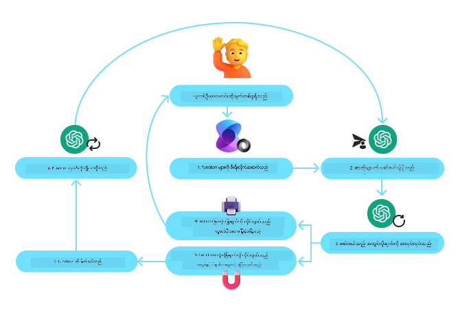
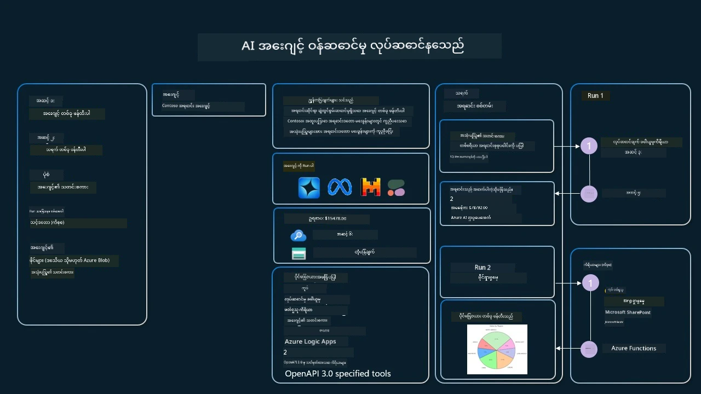

[](https://youtu.be/vieRiPRx-gI?si=cEZ8ApnT6Sus9rhn)

> _(ဤသင်ခန်းစာ၏ ဗီဒီယိုကိုကြည့်ရန် အပေါ်တွင်ရှိသော ပုံကိုနှိပ်ပါ)_

# ကိရိယာအသုံးပြုမှု ဒီဇိုင်းပုံစံ

ကိရိယာများသည် AI ကိုယ်စားလှယ်များကို ပိုမိုကျယ်ပြန့်သော လုပ်ဆောင်နိုင်စွမ်းများ ဖန်တီးနိုင်စေသောကြောင့် စိတ်ဝင်စားစရာကောင်းပါသည်။ ကိုယ်စားလှယ်၏ လုပ်ဆောင်ချက်စနစ် ကန့်သတ်ထားခြင်းမဟုတ်ဘဲ ကိရိယာတစ်ခုကို ထည့်သွင်းခြင်းဖြင့် အခွင့်အလမ်းများ ကြီးမားလာသည်။ ဤအခန်းတွင် AI ကိုယ်စားလှယ်များသည် ရည်မှန်းချက်များကို ပြည့်မှီစေရန် နည်းလမ်းအထူးများဖြင့် ကိရိယာများကို အသုံးပြုနိုင်ခြင်းကို ဖော်ပြသွားမှာဖြစ်သည်။

## နိဒါန်း

ဤသင်ခန်းစာတွင် ကျွန်ုပ်တို့ဒီမေးခွန်းများကို ဖြေကြားသွားမည်။

- ကိရိယာအသုံးပြုမှု ဒီဇိုင်းပုံစံဆိုတာဘာလဲ?
- ဘာအတွက် အသုံးပြုနိုင်သလဲ?
- ဒီဇိုင်းပုံစံကို အကောင်အထည်ဖော်ဖို့ လိုအပ်တဲ့ အစိတ်အပိုင်း/တည်ဆောက်မှုများက ဘာတွေပါလဲ?
- ယုံကြည်စိတ်ချရသော AI ကိုယ်စားလှယ်များ တည်ဆောက်ရာတွင် ကိရိယာအသုံးပြုမှု ဒီဇိုင်းပုံစံကို အသုံးပြုရာတွင် လိုအပ်သော အထူးအချက်များက ဘာတွေလဲ?

## သင်ယူရမည့် ရည်မှန်းချက်များ

ဤသင်ခန်းစာပြီးဆုံးပြီးနောက် သင်သည် အောက်ပါအတိုင်း သိရှိနားလည်နိုင်မည်။

- ကိရိယာအသုံးပြုမှု ဒီဇိုင်းပုံစံကို သတ်မှတ်နိုင်ရေးနှင့် ၎င်း၏ ရည်ရွယ်ချက်များ။
- ကိရိယာအသုံးပြုမှု ဒီဇိုင်းပုံစံ မည်သည့်အခြေအနေများတွင် သင့်လျော်ကြောင်း ဖော်ထုတ်နိုင်ခြင်း။
- ဒီဇိုင်းပုံစံ အကောင်အထည်ဖော်ရန် လိုအပ်သော အဓိကအစိတ်အပိုင်းများကို နားလည်ခြင်း။
- ဒီဇိုင်းပုံစံအသုံးပြုသည့် AI ကိုယ်စားလှယ်များတွင် ယုံကြည်စိတ်ချမှု ရရှိရေး အတွက် တွေးစားချက်များကို သိရှိခြင်း။

## ကိရိယာအသုံးပြုမှု ဒီဇိုင်းပုံစံဆိုတာဘာလဲ?

**ကိရိယာအသုံးပြုမှု ဒီဇိုင်းပုံစံ** သည် LLM များအား ထူးခြားသော ရည်မှန်းချက်များ ပြည့်မှီရန် ပြင်ပကိရိယာများနှင့် ဆက်သွယ်နိုင်စွမ်းပေးခြင်း အပေါ် ဦးတည်သည်။ ကိရိယာဆိုသည်မှာ ကိုယ်စားလှယ်မှ လုပ်ဆောင်ချက်အတွက် အကောင်အထည်ဖော်နိုင်သည့် ကုဒ်များ ဖြစ်သည်။ ကိရိယာတစ်ခုမှာ ကိန်းဂဏန်းခန့်မှန်းခြေ စသည်ဖြင့် ရိုးရှင်းသောလုပ်ဆောင်ချက်တစ်ခုဖြစ်နိုင်သလို၊ စတော့ရှယ်ယာဈေးနှုန်းရှာဖွေခြင်း သို့မဟုတ် ရာသီဥတုပညာမှတ်တမ်း ဝန်ဆောင်မှုခေါ်ဆိုခြင်းလို ပထဝီဝင် လုပ်ငန်းများကိုလည်း ဖော်ဆောင်နိုင်သည်။ AI ကိုယ်စားလှယ်များ အရ ကိရိယာများသည် **မော်ဒယ်ထုတ်လုပ်သောလုပ်ဆောင်ချက်ခေါ်ဆိုမှုများ** အား ကြိုတင်တုံ့ပြန်ပြီး ဆောင်ရွက်ရန် ရည်ရွယ်သည်။

## ဘယ်နေရာတွေအတွက် အသုံးပြုနိုင်သလဲ?

AI ကိုယ်စားလှယ်များသည် ကိရိယာများ အသုံးပြု၍ အကြောင်းအရာရှုပ်ထွေသော လုပ်ငန်းများ ပြီးမြောက်စေရန်၊ သတင်းအချက်အလက် ရယူရန်၊ ဆုံးဖြတ်ချက်ချရန် အသုံးချနိုင်သည်။ ကိရိယာအသုံးပြုမှု ဒီဇိုင်းပုံစံသည် ဒေတာဘေ့စ်များ၊ ဝက်ဘ်ဝန်ဆောင်မှုများ၊ ကုဒ်ဖတ်ရှုသူများ အစရှိသည့် ပြင်ပစနစ်များနှင့် အပြောင်းအလဲ ဆက်သွယ်နိုင်သော သဘောတရားရှိသော အခြေအနေများတွင် အများနှင့် အပြား အသုံးပြုလေ့ရှိသည်။ ဤစွမ်းဆောင်ရည်သည် အောက်ပါ ကိစ္စများအတွက် အထူးအသုံးဝင်သည်။

- **ဒိုင်နမစ် သတင်းအချက်အလက် ရယူခြင်း**: ကိုယ်စားလှယ်များသည် ပြင်ပ APIs သို့မဟုတ် ဒေတာဘေ့စ်များကို မက်သစ် အချက်အလက် ရရှိစေရန် မေးမြန်းနိုင်သည်။ (ဥပမာ၊ SQLite ဒေတာဘေ့စ်မှာ ဒေတာစစ်တမ်းများဆွဲယူခြင်း၊ စတော့ဈေးနှုန်း သို့မဟုတ် ရာသီအခြေအနေရဟတ်လမ်းညွှန်များကို ရယူခြင်း)။
- **ကုဒ်အသုံးပြုပြီး စစ်ဆေးခြင်းနှင့် ဖော်ပြချက်**: ကိုယ်စားလှယ်များသည် ကုဒ်များသို့မဟုတ် စက္ကူများကို ဂဏန်းဆိုင်ရာ ပြဿနာများ ဖြေရှင်းရန်၊ အစီရင်ခံစာများ ဖန်တီးရန်၊ သို့မဟုတ် ကုန်ကျစရိတ်များ ကို ရူပတည်ဆောင်ခြင်းတွင် အသုံးပြုနိုင်သည်။
- **အလုပ်စဉ် အလိုအလျောက်လုပ်ခြင်း**: လုပ်ငန်းများအား အလိုလို လုပ်ဆောင်ရန် Task schedulers, အီးမေးလ်ဝန်ဆောင်မှုများ သို့မဟုတ် ဒေတာလိုင်းများ တို့နှင့် ပေါင်းစည်းစီမံခြင်းဖြင့် စွမ်းဆောင်သည်။
- **ပစ္စည်းထောက်ပံ့မှု**: ကိုယ်စားလှယ်များသည် CRM စနစ်များ၊ လက်မှတ်စနစ်များ သို့မဟုတ် သိပ္ပံအခြေခံ ဗဟုသုတများနှင့် ဆက်သွယ်ကူညီ၍ အသုံးပြုသူမေးခွန်းများ ဖြေရှင်းသည်။
- **အကြောင်းအရာ ဖန်တီးခြင်းနှင့် ပြုပြင်ထိန်းသိမ်းခြင်း**: ကိုယ်စားလှယ်များသည် သဒ္ဒါစစ်ဆေးသူများ၊ စာပိုဒ် အကျဉ်းချုပ်ပြုသူများ သို့မဟုတ် အကြောင်းအရာလုံခြုံရေး စစ်တမ်းရေးသူများ ကဲ့သို့ ကိရိယာများကို အသုံးပြုကူညီပေးသည်။

## ကိရိယာအသုံးပြုမှု ဒီဇိုင်းပုံစံကို အကောင်အထည်ဖော်ရာတွင် လိုအပ်သော အစိတ်အပိုင်းများ

၎င်းအစိတ်အပိုင်းများက AI ကိုယ်စားလှယ်အား လုပ်ငန်းလုပ်ဆောင်ရာတွင် ကျယ်ပြန့်သော လုပ်ဆောင်ချက်များ ပြုလုပ်နိုင်ရန် ကူညီပေးသည်။ ကိရိယာအသုံးပြုမှု ဒီဇိုင်းပုံစံ အကောင်အထည်ဖော်ရန် လိုအပ်သော အဓိကအစိတ်အပိုင်းများကို ကြည့်ကြမည်။

- **လုပ်ဆောင်ချက်/ကိရိယာ schemas**: လက်ရှိ ရရှိနိုင်သော ကိရိယာများ၏ အသေးစိတ် ဖော်ပြချက်များဖြစ်ပြီး၊ လုပ်ဆောင်ချက်နာမည်၊ ရည်ရွယ်ချက်၊ လိုအပ်သည့် ပါရာမီတာများနှင့် မျှော်မှန်းရလဒ်များ ကို ဖွဲ့စည်းသတ်မှတ်ထားသည်။ ဤ schemas များက LLM ကို ရရှိနိုင်သော ကိရိယာများကို နားလည်စေပြီး တိကျမှန်ကန်သော မှတောင်းဆိုမှုများ တည်ဆောက်နိုင်စေရန် ကူညီသည်။

- **လုပ်ဆောင်ချက် အပြုအမူ သဘောတရား**: အသုံးပြုသူရဲ့ ရည်ရွယ်ချက်နှင့် စကားပြောမှု အခြေအနေတစ်ခုချင်းအရ ကိရိယာများကို ဘယ်တုန်းခေါ်လို့ရမလဲ၊ ဘယ်အချိန်ခေါ်လို့ရမလဲဆိုတာကိုစီမံခန့်ခွဲသည်။ ဒီမှာ စီမံသူ module များ၊ လမ်းကြောင်း ရွေးချယ်မှုနှင့် အခြေအနေမှီ အဆင့်ဆင့်စနစ်များ ပါဝင်နိုင်သည်။

- **စာဆက်သွယ်မှု စနစ်**: အသုံးပြုသူ မှတ်ချက်များ၊ LLM ဖြေပေးချက်များ၊ ကိရိယာခေါ်ဆိုမှုများ နှင့် ကိရိယာတုံ့ပြန်မှုများ ကို စီမံသိမ်းဆည်းသည်။

- **ကိရိယာ ပေါင်းစည်းမှု ဖွဲ့စည်းမှု**: ကိုယ်စားလှယ်ကို ကိရိယာများနှင့် ချိတ်ဆက်ပေးသော အင်ဖားစထရပ်ချာဖြစ်ပြီး၊ ရိုးရှင်းသော လုပ်ဆောင်ချက်များ သို့မဟုတ် ပြင်ပဝန်ဆောင်မှုရှုပ်ထွေးမှုများအားလုံးအတွက် အသုံးပြုနိုင်သည်။

- **အမှား စစ်ဆေးခြင်းနှင့် အတည်ပြုခြင်း**: ကိရိယာအကောင်အထည်ဖော်ရာတွင် အမှားများဖြစ်မှုပေါ် အကောင်းဆုံးဆောင်ရွက်ခြင်း၊ ပါရာမီတာများကို အတည်ပြုခြင်းနှင့် မမျှော်လင့်ထားသော တုံ့ပြန်မှုများ စီမံခန့်ခွဲခြင်း။

- **အခြေအနေ စီမံခန့်ခွဲမှု**: စကားဝိုင်းအခြေအနေ၊ မတူညီသောကိရိယာ မေးခွန်းများနှင့် တည်ငြိမ်သော ဒေတာများကို မှတ်တမ်းတင်ရန်။

နောက်တစ်ဆင့်မှာ လုပ်ဆောင်ချက်/ကိရိယာ ခေါ်ဆိုမှုကို ပိုမိုအသေးစိတ် ကြည့်ရှုမည်။
 
### လုပ်ဆောင်ချက်/ကိရိယာ ခေါ်ဆိုချက်

လုပ်ဆောင်ချက် ခေါ်ဆိုခြင်းသည် LLM များအား ကိရိယာများနှင့် ဆက်သွယ်နိုင်စေရန် အဓိကနည်းလမ်းဖြစ်သည်။ 'Function' နှင့် 'Tool' ဆိုသည်မှာ အချိန်အစားထိုးအသုံးဝင်တပ်ဆင်သော ကုဒ်ပုံစံများဖြစ်ပြီး၊ အဲဒီ function များကို ကိုယ်စားလှယ်များက လုပ်ဆောင်ချက်ဆောင်ရွက်ရန်ကိရိယာအဖြစ် အသုံးပြုကြသည်။ Function ကိုခေါ်ယူနိုင်ရန် LLM သည် အသုံးပြုသူတောင်းဆိုမှုကို function ဖော်ပြချက်နှင့် နှိုင်းယှဉ်ရမည်။ ၎င်းအတွက် ရရှိနိုင်သည့် လုပ်ဆောင်ချက်ပေါင်းများအား ဖော်ပြချက်ပါသော schema တစ်ခုကို LLM သို့ ပေးပို့ပြီး LLM သည် အလုပ်လုပ်ရန်အတွက် အထူးသင့်တော်ဆုံး function ကို ရွေးချယ်ပြီး function နာမည်နှင့် အဂ်မြူမြင်ကို ပြန်ပေးပို့မည်။ ရွေးချယ်ထားသော function ကို ခေါ်ယူ၍ မူလ အသုံးပြုသူတောင်းဆိုမှုကို ဖြေဆိုရန် အချက်အလက်ဖြင့် LLM သို့ ပြန်ပို့သည်။

ကိုယ်စားလှယ်များအတွက် function calling ကို တည်ဆောက်လိုသော အင်အားပြုလုပ်သူများအတွက် လိုအပ်သည်မှာ။

1. function calling ကို ထောက်ခံသော LLM မော်ဒယ်တစ်ခု
2. function ဖော်ပြချက် ပါသော schema
3. ဖော်ပြထားသော function များအတွက် ကုဒ်

မြို့တစ်မြို့အတွင်း လက်ရှိအချိန်ရယူရန် ဥပမာအဖြစ် ယူစားကြည့်မည်။

1. **Function calling ကို မူလကထောက်ခံသည့် LLM ကို စတင်သုံးပါ:**

    မော်ဒယ်အားလုံးမှာ function calling ကိုထောက်ခံခြင်းမရှိပါ၊ သင့်အသုံးပြုမည့် LLM က ဒါကိုထောက်ခံသေချာခြင်း အရေးကြီးသည်။ <a href="https://learn.microsoft.com/azure/ai-services/openai/how-to/function-calling" target="_blank">Azure OpenAI</a> သည် function calling ကို ထောက်ခံသည်။ OpenAI client ကို Azure OpenAI **Responses API** အပေါ်မှ စတင်နိုင်သည်။ (`/openai/v1/` stable endpoint ဖြစ်ပြီး `api_version` တောင်းဆိုမှုမလိုအပ်ပါ)။

    ```python
    # Azure OpenAI အတွက် OpenAI client ကို စတင်ဆောက်လုပ်ပါ (Responses API, v1 endpoint)
    client = OpenAI(
        base_url=f"{os.environ['AZURE_OPENAI_ENDPOINT'].rstrip('/')}/openai/v1/",
        api_key=os.environ["AZURE_OPENAI_API_KEY"],
    )
    deployment_name = os.environ["AZURE_OPENAI_DEPLOYMENT"]
    ```

1. **Function Schema တည်ဆောက်ခြင်း:**

    နောက်တစ်ဆင့်မှာ function နာမည်၊ လုပ်ဆောင်ချက်ဖော်ပြချက်နှင့် function ပာရီမီတာများ၏ နာမည်နှင့် ဖော်ပြချက် ပါသော JSON schema တစ်ခု ဖန်တီးမည်။ 
    ဒီ schema ကို ယခင်မှာ ဖန်တီးထားသော client ကို အသုံးပြုသူ၏ "San Francisco တွင် အချိန် ရှာရန်" တောင်းဆိုမှုနှင့်အတူ ပေးပို့ပါမည်။ အရေးကြီးတာက နောက်ဆုံး ဖြေရှင်းချက်မဟုတ်ပဲ **ကိရိယာခေါ်ဆိုမှု** ခေါ်သော အဖြေကိုဖြစ်သည်။ ကျွန်ုပ်တို့ဟာ LLM က အလုပ်လုပ်ရန် function နာမည်နှင့် သွင်းပေးသည့် အဂ်မြူမြင်များကို ပြန်ပို့သည်။

    ```python
    # မော်ဒယ်အတွက် ဖတ်ရန် ရည်ရွယ်ချက် function ဆောင်တာ (Responses API flat tool ပုံစံ)
    tools = [
        {
            "type": "function",
            "name": "get_current_time",
            "description": "Get the current time in a given location",
            "parameters": {
                "type": "object",
                "properties": {
                    "location": {
                        "type": "string",
                        "description": "The city name, e.g. San Francisco",
                    },
                },
                "required": ["location"],
            },
        }
    ]
    ```
   
    ```python
  
    # စတင်အသုံးပြုသူမက်ဆေ့ခ်ျ
    messages = [{"role": "user", "content": "What's the current time in San Francisco"}]

    # ပထမဆုံး API ခေါ်ဆိုမှု: မော်ဒယ်ကို function အသုံးပြုရန် မေးမြန်းပါ
    response = client.responses.create(
        model=deployment_name,
        input=messages,
        tools=tools,
        tool_choice="auto",
        store=False,
    )

    # Responses API သည် tool calls များကို function_call ပစ္စည်းများအဖြစ် response.output တွင် ပြန်လည်ပေးပို့သည်။
    # မော်ဒယ်အနေနှင့် နောက်တစ်ခေါက်ပြောဆိုရာတွင် စုံလင်သောအကြောင်းအရာရှိစေရန် ဒီများကို စကားပြောချင်တာထဲ ထည့်ပါ။
    messages += response.output

    print("Model's response:")
    print(response.output)
  
    ```

    ```bash
    Model's response:
    [ResponseFunctionToolCall(arguments='{"location":"San Francisco"}', call_id='call_pOsKdUlqvdyttYB67MOj434b', name='get_current_time', type='function_call')]
    ```
  
1. **အလုပ်လုပ်ရန် လိုအပ်သော function ကုဒ်:**

    လုပ်ဆောင်ရန် function ကို LLM ရွေးချယ်ပြီးနောက်၊ ထိုလုပ်ငန်းတည်ဆောက်ရာ ကုဒ်ကို ဆောင်ရွက်ရမည်။ 
    Python ဖြင့် လက်ရှိအချိန် ရယူရန် ကုဒ်ရေးဆွဲမည်။ တုံ့ပြန်သည့် ပြန်ကြားစာမှ နာမည်နှင့် အဂ်မြူမြင်များကို ခွဲထုတ်ရန်ကုဒ်လည်းရေးရန် ဖြစ်သည်။

    ```python
      def get_current_time(location):
        """Get the current time for a given location"""
        print(f"get_current_time called with location: {location}")  
        location_lower = location.lower()
        
        for key, timezone in TIMEZONE_DATA.items():
            if key in location_lower:
                print(f"Timezone found for {key}")  
                current_time = datetime.now(ZoneInfo(timezone)).strftime("%I:%M %p")
                return json.dumps({
                    "location": location,
                    "current_time": current_time
                })
      
        print(f"No timezone data found for {location_lower}")  
        return json.dumps({"location": location, "current_time": "unknown"})
    ```

     ```python
    # function ကိုခေါ်ယူခြင်းကို ကိုင်တွယ်ပါ
    tool_calls = [item for item in response.output if item.type == "function_call"]
    if tool_calls:
        for tool_call in tool_calls:
            if tool_call.name == "get_current_time":

                function_args = json.loads(tool_call.arguments)

                time_response = get_current_time(
                    location=function_args.get("location")
                )

                # tool ရလဒ်ကို function_call_output အရာအဖြစ် ပြန်ပေးပါ
                messages.append({
                    "type": "function_call_output",
                    "call_id": tool_call.call_id,
                    "output": time_response,
                })
    else:
        print("No tool calls were made by the model.")

    # ဒုတိယ API ခေါ်ဆိုမှု: မော်ဒယ်မှ နောက်ဆုံးတုံ့ပြန်ချက်ကို ရယူပါ
    final_response = client.responses.create(
        model=deployment_name,
        input=messages,
        tools=tools,
        store=False,
    )

    return final_response.output_text
     ```

     ```bash
      get_current_time called with location: San Francisco
      Timezone found for san francisco
      The current time in San Francisco is 09:24 AM.
     ```

Function Calling သည် ကိုယ်စားလှယ် ကိရိယာအသုံးပြုမှု ဒီဇိုင်း၏ အခြေခံဖြစ်ပြီး၊ စတင်ထည့်သွင်းရာတွင် ခက်ခဲမှုရှိနိုင်သည်။
[Lesson 2](../../../02-explore-agentic-frameworks) တွင် သင်ယူခဲ့သလို၊ agentic framework များက ကိရိယာအသုံးပြုမှုအတွက် ကြိုတင်တည်ဆောက်ထားသော အစိတ်အပိုင်းများကို ပံ့ပိုးပေးသည်။
 
## Agentic Framework များနှင့်အတူ ကိရိယာ အသုံးပြုမှု ဥပမာများ

ကွဲပြားသော agentic framework များ အသုံးပြုပြီး ကိရိယာအသုံးပြုမှု ဒီဇိုင်းပုံစံကို မည်သို့ အကောင်အထည်ဖော်နိုင်သည်ဆိုသည့် ဥပမာများက如下ပါသည်။

### Microsoft Agent Framework

<a href="https://learn.microsoft.com/azure/ai-services/agents/overview" target="_blank">Microsoft Agent Framework</a> သည် AI ကိုယ်စားလှယ်များ ဖန်တီးရန် ဖွင့်လှစ်ထားသော AI Framework ဖြစ်သည်။ function calling အသုံးပြုရလွယ်ကူစေရန် `@tool` decorator ဖြင့် Python function များအား ကိရိယာများအဖြစ် သတ်မှတ်နိုင်သည်။ Framework မှ မော်ဒယ်နဲ့ သင့်ကုဒ် အကြား ဆက်သွယ်မှုကို ကိုင်တွယ်ပေးသည်။ ပို၍ `FoundryChatClient` ကတဆင့် ဖိုင်ရှာဖွေရေးနှင့် ကုဒ်ဖတ်ရှုသူကဲ့သို့ ကြိုတင်တည်ဆောက်ထားသော ကိရိယာများကို ဝင်ရောက် အသုံးပြုခွင့် ရရှိစေသည်။

Microsoft Agent Framework ဖြင့် function calling လုပ်ငန်းစဉ်ကို အောက်ပါပုံပြင်က ပုံဖော်ထားသည်။



Microsoft Agent Framework တွင် ကိရိယာများကို decorator ဖြင့် ဖော်ပြထားသော function များအဖြစ် သတ်မှတ်သည်။ ဥပမာအားဖြင့် ယခင်က ကြည့်ရှုခဲ့သော `get_current_time` function ကို `@tool` decorator ဖြင့် ကိရိယာအဖြစ် ပြောင်းလဲရန် ရနိုင်သည်။ Framework မှ function နှင့် ၎င်း၏ ပါရာမီတာများကို အလိုအလျောက် serialize ပြုလုပ်ပြီး LLM သို့ ပို့ရန် schema ပြုလုပ်ပေးသည်။

```python
import os
from agent_framework import tool
from agent_framework.foundry import FoundryChatClient
from azure.identity import AzureCliCredential

@tool(approval_mode="never_require")
def get_current_time(location: str) -> str:
    """Get the current time for a given location"""
    ...

# အဖောက်သည်ကို ဖန်တီးပါ
provider = FoundryChatClient(
    project_endpoint=os.environ["AZURE_AI_PROJECT_ENDPOINT"],
    model=os.environ["AZURE_AI_MODEL_DEPLOYMENT_NAME"],
    credential=AzureCliCredential(),
)

# အေးဂျင့်တစ်ယောက် ဖန်တီး၍ ကိရိယာဖြင့် လည်ပတ်ပါ
agent = provider.as_agent(name="TimeAgent", instructions="Use available tools to answer questions.", tools=get_current_time)
response = await agent.run("What time is it?")
```
  
### Microsoft Foundry Agent Service

<a href="https://learn.microsoft.com/azure/ai-services/agents/overview" target="_blank">Microsoft Foundry Agent Service</a> သည် developer များအတွက် လုံခြုံစိတ်ချစွာ AI ကိုယ်စားလှယ်များ ရေးဆွဲ၊ တပ်ဆင်၊ ချိန်ညှိနိုင်ပြီး လည်း ကြီးထွားမှုရရှိစေရန် ဒီဇိုင်းပြုလုပ်ထားသော agentic framework အသစ်ဖြစ်သည်။ အရင်းအမြစ်မှ အခြေခံသော ကွန်ပျူတာနှင့် သိုလှောင်မှု အရင်းအမြစ်များကိုစီမံခန့်ခွဲရန် မလိုအပ်ဘဲ စီးပွားရေးလုပ်ငန်းများတွင် အထူးအသုံးဝင်သော လုံခြုံမှုအဆင့်မြင့် ဝန်ဆောင်မှုဖြစ်သည်။

LLM API တိုက်ရိုက် အသုံးပြုခြင်းနှင့် နှိုင်းယှဉ်ပါက Microsoft Foundry Agent Service တွင် အောက်ပါအားသာချက်များ ရှိပါသည်။

- ကိရိယာခေါ်ဆိုမှုကို စနစ်တကျ အလိုအလျောက် ဆောင်ရွက်ပေးခြင်း – ကိရိယာခေါ်ယူခြင်း၊ တုံ့ပြန်မှုကို ထိန်းချုပ်မှု စက်မှုလုပ်ငန်းကို ဆာဗာဘက်တွင် လုပ်ဆောင်ခြင်း။
- လုံခြုံစိတ်ချရသော ဒေတာစီမံခန့်ခွဲမှု – ကိုယ်ပိုင် စကားပြောစာရင်းမှတ်တမ်း မဲ့ဘဲ လိုအပ်သော အချက်အလက်အားလုံးကို Threads မှ ထိန်းသိမ်းကြပါသည်။
- ရိုးရိုးရှိသော ကိရိယာများ – သင့်ဒေတာအရင်းမြစ်နှင့် ဆက်သွယ်ရန် အသုံးပြုနိုင်သူ Tool များဖြစ်ပြီး Bing, Azure AI Search, Azure Functions တို့ ပါဝင်သည်။

Microsoft Foundry Agent Service ရှိ ကိရိယာများကို နှစ်မျိုးခွဲခြားနိုင်သည်။

1. အသိပညာ ကိရိယာများ:
    - <a href="https://learn.microsoft.com/azure/ai-services/agents/how-to/tools/bing-grounding?tabs=python&pivots=overview" target="_blank">Bing ရှာဖွေရေးဖြင့် အခြေခံခြင်း</a>
    - <a href="https://learn.microsoft.com/azure/ai-services/agents/how-to/tools/file-search?tabs=python&pivots=overview" target="_blank">ဖိုင်ရှာဖွေရေး</a>
    - <a href="https://learn.microsoft.com/azure/ai-services/agents/how-to/tools/azure-ai-search?tabs=azurecli%2Cpython&pivots=overview-azure-ai-search" target="_blank">Azure AI ရှာဖွေရေး</a>

2. လုပ်ဆောင်ချက် ကိရိယာများ:
    - <a href="https://learn.microsoft.com/azure/ai-services/agents/how-to/tools/function-calling?tabs=python&pivots=overview" target="_blank">Function Calling</a>
    - <a href="https://learn.microsoft.com/azure/ai-services/agents/how-to/tools/code-interpreter?tabs=python&pivots=overview" target="_blank">Code Interpreter</a>
    - <a href="https://learn.microsoft.com/azure/ai-services/agents/how-to/tools/openapi-spec?tabs=python&pivots=overview" target="_blank">OpenAPI ဖြင့် သတ်မှတ်ထားသော ကိရိယာများ</a>
    - <a href="https://learn.microsoft.com/azure/ai-services/agents/how-to/tools/azure-functions?pivots=overview" target="_blank">Azure Functions</a>

Agent Service သည် ဤ ကိရိယာများကို `toolset` အဖြစ် အသုံးပြုခွင့် ရရှိစေပြီး၊ `threads` များအသုံးပြုပြီး စကားစဉ်မှတ်တမ်းများကို မွမ်းမံ ထိန်းသိမ်းသည်။

သင်သည် Contoso ဟုခေါ်သော ကုမ္ပဏီတွင် အရောင်း ကိုယ်စားလှယ်တစ်ဦးဖြစ်ကြောင်း စဉ်းစားကြည့်ပါ။ သင့်ရဲ့ အရောင်းဒေတာနှင့်ပတ်သက်ပြီး မေးခွန်းများကို ဖြေဆိုနိုင်သည့် စကားပြော ကိုယ်စားလှယ်တစ်ခု ဖန်တီးချင်သည်။

အောက်ပါပုံသည် Microsoft Foundry Agent Service ကို အသုံးပြုပြီး သင့်အရောင်းဒေတာကို မည်သို့ ဖေါ်ထုတ်စစ်ဆေးနိုင်သည်ကို ပြသပါသည်။



၎င်းဝန်ဆောင်မှုနှင့် ကိရိယာများကိုအသုံးပြုရန် client တစ်ခု ဖန်တီး၍ tool သို့ toolset ကို သတ်မှတ်နိုင်သည်။  လက်တွေ့အကောင်အထည်ဖော်ရန် အောက်ပါ Python ကုဒ်ကို အသုံးပြုနိုင်ပြီး LLM မှ toolset ထဲမှ အသုံးပြုသူရေးဆွဲထားသော `fetch_sales_data_using_sqlite_query` function သို့မဟုတ် ကြိုတင်တည်ဆောက်ထားသော Code Interpreter ကို အသုံးပြုရန်ဆုံးဖြတ်လိမ့်မည်။

```python 
import os
from azure.ai.projects import AIProjectClient
from azure.identity import DefaultAzureCredential
from fetch_sales_data_functions import fetch_sales_data_using_sqlite_query # fetch_sales_data_using_sqlite_query ဖန်ခွဲရေး ဖိုင် fetch_sales_data_functions.py မှ တွေ့နိုင်သော function ဖြစ်သည်။
from azure.ai.projects.models import ToolSet, FunctionTool, CodeInterpreterTool

project_client = AIProjectClient.from_connection_string(
    credential=DefaultAzureCredential(),
    conn_str=os.environ["PROJECT_CONNECTION_STRING"],
)

# ကိရိယာစုကို စတင်ဖွင့်ထားသည်
toolset = ToolSet()

# fetch_sales_data_using_sqlite_query function ဖြင့် function calling agent ကို စတင်ဖွင့်ပြီး ကိရိယာစုထဲ ထည့်သည်
fetch_data_function = FunctionTool(fetch_sales_data_using_sqlite_query)
toolset.add(fetch_data_function)

# Code Interpreter ကိရိယာကို စတင်ဖွင့်ပြီး ကိရိယာစုထဲ ထည့်သည်။
code_interpreter = CodeInterpreterTool()toolset.add(code_interpreter)

agent = project_client.agents.create_agent(
    model="gpt-4o-mini", name="my-agent", instructions="You are helpful agent", 
    toolset=toolset
)
```

## ယုံကြည်စိတ်ချရသော AI ကိုယ်စားလှယ်များ တည်ဆောက်ရာတွင် ကိရိယာအသုံးပြုမှု ဒီဇိုင်းပုံစံအသုံးပြုသော အထူးစဉ်းစားရမည့်အချက်များ

LLM များဖြင့် အလိုအလျောက် ဖန်တီးသော SQL တွဲစပ်ချက်များနှင့် ပတ်သက်ပြီး စိုးရိမ်ဖွယ်ကိစ္စများမှာ လုံခြုံရေးနှင့် ချည်လှုပ်မှု အန္တရာယ်များ ဖြစ်ပေါ်နိုင်ခြင်းဖြစ်သည်။ ဥပမာ ၊ SQL injection အန္တရာယ် သို့မဟုတ် ဒေတာဘေ့စ် ပြိုလဲခြင်းစသဖြင့် ဖြစ်နိုင်ပါသည်။ ဤ စိုးရိမ်မှုများကို ဒေတာဘေ့စ် ခွင့်ပြုချက်များကို သင့်တော်စွာ ပြုပြင်ခြင်းဖြင့် ထိရောက်စွာ ကာကွယ်နိုင်သည်။ ဒေတာဘေ့စ်များအတွက် ဖတ်-only အဖြစ် သတ်မှတ်ခြင်း (PostgreSQL သို့မဟုတ် Azure SQL ကဲ့သို့သော ဝန်ဆောင်မှုများတွင်) လိုအပ်ပါသည်။

secure ဝန်းကျင် ထဲတွင် application ကို run ပြီးတာနဲ့ ကာကွယ်မှု တိုးတက်စေနိုင်သည်။ စီးပွားရေးအသုံးအဆောင်၌ ဒေတာသည် လည်ပတ်မှုစနစ်များမှ ဆွဲထုတ်ပြီး ဖတ်-only ဒေတာဘေ့စ် သို့ ဒေတာဂိုဒေါင်သို့ ပြောင်းလဲသိမ်းဆည်းထားသည်။ ၎င်းနည်းလမ်းသည် ဒေတာလုံခြုံမှု၊ စွမ်းဆောင်ရည်နှင့် လိုက်လျောညီထွေမှုကို ထိန်းသိမ်းပေးပြီး app သည် ဖတ်-only အတားကွပ်ဖြင့် အဆင်ပြေနိုင်စေရန် ဖြစ်သည်။

## နမူနာကုဒ်များ

- Python: [Agent Framework](./code_samples/04-python-agent-framework.ipynb)
- .NET: [Agent Framework](./code_samples/04-dotnet-agent-framework.md)

## ကိရိယာအသုံးပြုမှု ဒီဇိုင်းပုံစံများနှင့်ပတ်သက်ပြီး မေးခွန်းများ မရှိသေးပါသလား?

[Microsoft Foundry Discord](https://discord.com/invite/ATgtXmAS5D) တွင် ပူးပေါင်း၍ သင်ယူသူများနှင့်တွေ့ဆုံ၊ office hours တွင်ပါဝင်ပြီး AI ကိုယ်စားလှယ် မေးခွန်းများ ရယူနိုင်ပါသည်။

## ထပ်ဆောင်း အရင်းအမြစ်များ

- <a href="https://microsoft.github.io/build-your-first-agent-with-azure-ai-agent-service-workshop/" target="_blank">Azure AI Agents Service အလုပ်ရုံဆွေးနွေးပွဲ</a>
- <a href="https://github.com/Azure-Samples/contoso-creative-writer/tree/main/docs/workshop" target="_blank">Contoso Creative Writer Multi-Agent အလုပ်ရုံဆွေးနွေးပွဲ</a>
- <a href="https://learn.microsoft.com/azure/ai-services/agents/overview" target="_blank">Microsoft Agent Framework အကျဉ်းချုပ်</a>


## ယခင်သင်ခန်းစာ

[Agentic Design Patterns ကိုနားလည်ခြင်း](../03-agentic-design-patterns/README.md)

## နောက်တစ်ခန်းစာ

[Agentic RAG](../05-agentic-rag/README.md)

---

<!-- CO-OP TRANSLATOR DISCLAIMER START -->
**ပြောကြားချက်**
ဤစာတမ်းကို AI ဘာသာပြန်ဝန်ဆောင်မှု [Co-op Translator](https://github.com/Azure/co-op-translator) အသုံးပြု၍ ဘာသာပြန်ထားပါသည်။ ကျွန်ုပ်တို့သည် တိကျမှန်ကန်မှုအတွက် ကြိုးပမ်းနေသော်လည်း၊ စက်ကိရိယာဘာသာပြန်ခြင်းများတွင် အမှားများ သို့မဟုတ် မှားယွင်းချက်များ ပါဝင်နိုင်ကြောင်း သတိပြုပါရန် လိုအပ်ပါသည်။ မူလစာတမ်းကို မူရင်းဘာသာဖြင့်သာ ယုံကြည်စိတ်ချရသော အချက်အလက်အဖြစ် သတ်မှတ်သင့်သည်။ အရေးကြီးသည့် သတင်းအချက်အလက်များအတွက် ပရော်ဖက်ရှင်နယ် လူသားဘာသာပြန်သူဝန်ဆောင်မှုကို အကြံပြုပါသည်။ ဤဘာသာပြန်ချက်ကို အသုံးပြုခြင်းမှ ဖြစ်ပေါ်လာသော နားလည်မှုကွာခြားမှုများ သို့မဟုတ် မမှန်ကန်သော အသုံးပြုမှုများအတွက် ကျွန်ုပ်တို့ တာဝန်မခံပါ။
<!-- CO-OP TRANSLATOR DISCLAIMER END -->