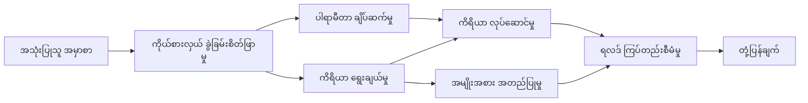

# 🛠️ Azure OpenAI နှင့် အဆင့်မြင့် ကိရိယာ အသုံးပြုမှု (.NET)

## 📋 သင်ယူရမည့် ရည်ရွယ်ချက်များ

ဤ notebook သည် Microsoft Agent Framework ကို .NET ဖြင့် အသုံးပြုကာ Azure OpenAI (Responses API) ဖြင့် အဆင့်မြင့် ကုမ္ပဏီအဆင့် ကိရိယာ ပေါင်းစပ်မှု ပုံစံများကို ပြသသည်။ သင်သည် C# ၏ အတည်ပြု အမျိုးအစားများနှင့် .NET ၏ ကုမ္ပဏီအဆင့် အင်္ဂါရပ်များကို အသုံးပြု၍ အထူးပြုကိရိယာများစွာပါသည့် ကြီးမားသော Agent များကို တည်ဆောက်နိုင်အောင် သင်ယူမည်ဖြစ်သည်။

### သင် သိရှိရမည့် အဆင့်မြင့် ကိရိယာ အင်္ဂါရပ်များ

- 🔧 **စြမ်းဆောင်ရည် အမျိုးမျိုးကိရိယာ ဖွဲ့စည်းမှု**: အချက်အလက်များစွာပါသည့် Agent များတည်ဆောက်ခြင်း
- 🎯 **အမျိုးအစား လုံခြုံမှု ရှိသော ကိရိယာ လုပ်ဆောင်မှု**: C# ၏ compile-time အတည်ပြုမှု သုံးစွဲခြင်း
- 📊 **ကုမ္ပဏီ အဆင့် ကိရိယာ ပုံစံများ**: ထုတ်လုပ်မှုအဆင့် ကိရိယာ ဒီဇိုင်းနှင့် အမှား ကိုင်တွယ်မှု
- 🔗 **ကိရိယာ ပေါင်းစပ်မှု**: စ پیچကျယ်ပြန့်သော စီးပွားရေး အလုပ်လုပ်ဆောင်မှုများအတွက် ကိရိယာများပေါင်းစပ်ခြင်း

## 🎯 .NET ကိရိယာ ဖွဲ့စည်းမှု အကျိုးကျေးဇူးများ

### ကုမ္ပဏီအဆင့် ကိရိယာ အင်္ဂါရပ်များ

- **Compile-Time အတည်ပြုမှု**: အမာခံ typing ဖြင့် ကိရိယာ parameter မှန်ကန်မှုကို သေချာစေခြင်း
- **Dependency Injection**: IoC container ပေါင်းစည်းမှုဖြင့် ကိရိယာ စီမံခန့်ခွဲမှု
- **Async/Await ပုံစံများ**: စနစ်တက်ထိန်းသိမ်းပြီး အချိန်မကြာဘဲ ကိရိယာကို လုပ်ဆောင်ခြင်း
- **အစီအစဉ် တိုက်ရိုက် မှတ်တမ်း ထားခြင်း**: ကိရိယာ လုပ်ဆောင်မှု ကြည့်ရှုမှုအတွက် တပ်ဆင်ထားသော အစီအစဉ်မှတ်တမ်းများ

### ထုတ်လုပ်မှု အသင့် ပုံစံများ

- **Exception ကိုင်တွယ်မှု**: အမျိုးအစားသတ်မှတ်ထားသော အမှားကြီးကြီးကို အပြည့်အစုံ စီမံခန့်ခွဲခြင်း
- **အရင်းအမြစ် စီမံခန့်ခွဲမှု**: သင့်တော်တဲ့ စနစ် ပိတ်ပင်မှုနှင့် မှတ်ဉာဏ် စီမံခြင်း
- **စွမ်းဆောင်ရည် ကြည့်ရှုမှု**: တပ်ဆင်ထားသော စွမ်းဆောင်ရည် တိုင်းတာမှုများနှင့် အရေအတွက် တိုင်းတာချက်များ
- **ဖွဲ့စည်းမှု စီမံခန့်ခွဲမှု**: အမျိုးအစား လုံခြုံမှု ပါသော ဖွဲ့စည်းမှု နှင့် အတည်ပြုခြင်း

## 🔧 နည်းပညာ ဖွဲ့စည်းမှုပုံစံ

### အဓိက .NET ကိရိယာ တွဲဖက်မှုများ

- **Microsoft.Extensions.AI**: ညီညွတ်သည့် ကိရိယာ abstraction အလွှာ
- **Microsoft.Agents.AI**: ကုမ္ပဏီအဆင့် ကိရိယာ စီမံခန့်ခွဲမှု
- **Azure OpenAI (Responses API)**: မြင့်မားသော စွမ်းဆောင်ရည် API client နှင့် ချိတ်ဆက်မှု ဖြန့်ဖြူးမှု

### ကိရိယာ လုပ်ဆောင်မှု စဉ်



## 🛠️ ကိရိယာအမျိုးအစားများနှင့် ပုံစံများ

### 1. **ဒေတာ ကိရိယာများ**

- **ထည့်သွင်းမှု အတည်ပြုမှု**: အမျိုးအစား သတ်မှတ်ချက်များဖြင့် ပြင်းပြမှုရှိသော ထည့်သွင်းမှု
- **ပြောင်းလဲမှု လုပ်ဆောင်ချက်များ**: အမျိုးအစားလုံခြုံမှုရှိသော ဒေတာ ပြောင်းလဲမှုနှင့် ပုံစံကျသော ဖော်ပြမှု
- **စီးပွားရေး အခြေခံ လုပ်ဆောင်ချက်များ**: ဒေသအလိုက် အချက်အလက်တွက်ချက်မှုနှင့် ခွဲခြမ်းစိတ်ဖြတ်ကိရိယာများ
- **ထုတ်လွှင့်ပုံစံပြုခြင်း**: ဖွဲ့စည်းထားသော ဖြေဆိုမှုဖန်တီးခြင်း

### 2. **ပေါင်းစပ်မှု ကိရိယာများ** 

- **API ဆက်သွယ်မှုများ**: HttpClient ဖြင့် RESTful ဝန်ဆောင်မှု ပေါင်းစပ်မှု
- **ဒေတာဘေ့(စ်) ကိရိယာများ**: Entity Framework ဖြင့် ဒေတာ ဝင်ရောက်ချိတ်ဆက်မှု
- **ဖိုင် လုပ်ဆောင်ချက်များ**: အတည်ပြုချက်ပါရှိသော လုံခြုံသော ဖိုင်စနစ် လုပ်ဆောင်ချက်များ
- ** ပြင်ပ ဝန်ဆောင်မှုများ**: တတိယ ကူးသန်း ပေးဝေရေး ဝန်ဆောင်မှု ပုံစံများ

### 3. **အသုံးပြုသူ ကိရိယာများ**

- **စာသား လုပ်ဆောင်မှု**: စာသား ကိုင်တွယ်ခြင်းနှင့် ပုံစံဖော်ပြခြင်း အသုံးပြုမှု
- **နေ့စွဲ/အချိန် လုပ်ဆောင်မှုများ**: ယဉ်ကျေးမှုကို အသိအမှတ်ပြုသော နေ့စွဲ/အချိန်တွက်ချက်မှုများ
- **သင်္ချာ ကိရိယာများ**: တိကျသည့်တွက်ချက်မှုနှင့် စာရင်းအင်း လုပ်ဆောင်ချက်များ
- **အတည်ပြု ကိရိယာများ**: စီးပွားရေး စည်းကမ်းများ အတည်ပြုမှုနှင့် ဒေတာ စစ်ဆေးခြင်း

.NET တွင် စွမ်းအားပြင်းထန်ပြီး အမျိုးအစား လုံခြုံမှုရှိသည့် ကိရိယာများဖြင့် ကုမ္ပဏီအဆင့် Agent များ တည်ဆောက်ရန် အသင့်ပါသလား? လက်ရှိတွင် အသုံးပြုသော အဆင့်မြင့် ဖြေရှင်းနည်းများ ဆောက်လုပ်ကြရအောင်! 🏢⚡

## 🚀 စတင်လိုက်ရအောင်

### လိုအပ်သော အချက်အလက်များ

- [.NET 10 SDK](https://dotnet.microsoft.com/download/dotnet/10.0) သို့မဟုတ် အထက်
- Azure OpenAI အရင်းအမြစ်နှင့် မော်ဒယ် တပ်ဆင်မှု ပါရှိသည့် [Azure subscription](https://azure.microsoft.com/free/)
- [Azure CLI](https://learn.microsoft.com/cli/azure/install-azure-cli) — `az login` ဖြင့် အကောင့်ဝင်ထားရန်

### လိုအပ်သော ပတ်ဝန်းကျင် မတည်မြဲချက်များ

```bash
# zsh/bash
export AZURE_OPENAI_ENDPOINT=https://<your-resource>.openai.azure.com
export AZURE_OPENAI_DEPLOYMENT=gpt-4o-mini
# ဒါမှတဆင့် AzureCliCredential သည် token ကိုရရှိနိုင်ရန် လက်မှတ်ထိုးဝင်ပါ။
az login
```

```powershell
# PowerShell
$env:AZURE_OPENAI_ENDPOINT = "https://<your-resource>.openai.azure.com"
$env:AZURE_OPENAI_DEPLOYMENT = "gpt-4o-mini"
# ပြီးရင် AzureCliCredential က တိုကင်ယူနိုင်ဖို့အတွက် လော့ဂ်အင်ဝင်ပါ။
az login
```

### နမူနာ ကုဒ်

ကုဒ် ဥပမာကို လည်ပတ်ရန်,

```bash
# zsh/bash
chmod +x ./04-dotnet-agent-framework.cs
./04-dotnet-agent-framework.cs
```

ဒါမှမဟုတ် dotnet CLI အသုံးပြု၍:

```bash
dotnet run ./04-dotnet-agent-framework.cs
```

ပြည့်စုံကုဒ်အတွက် [`04-dotnet-agent-framework.cs`](../../../../04-tool-use/code_samples/04-dotnet-agent-framework.cs) ကို ကြည့်ပါ။

```csharp
#!/usr/bin/dotnet run

#:package Microsoft.Extensions.AI@10.*
#:package Microsoft.Agents.AI.OpenAI@1.*-*
#:package Azure.AI.OpenAI@2.1.0
#:package Azure.Identity@1.13.1

using System.ComponentModel;

using Microsoft.Agents.AI;
using Microsoft.Extensions.AI;

using Azure.AI.OpenAI;
using Azure.Identity;

// Tool Function: Random Destination Generator
// This static method will be available to the agent as a callable tool
// The [Description] attribute helps the AI understand when to use this function
// This demonstrates how to create custom tools for AI agents
[Description("Provides a random vacation destination.")]
static string GetRandomDestination()
{
    // List of popular vacation destinations around the world
    // The agent will randomly select from these options
    var destinations = new List<string>
    {
        "Paris, France",
        "Tokyo, Japan",
        "New York City, USA",
        "Sydney, Australia",
        "Rome, Italy",
        "Barcelona, Spain",
        "Cape Town, South Africa",
        "Rio de Janeiro, Brazil",
        "Bangkok, Thailand",
        "Vancouver, Canada"
    };

    // Generate random index and return selected destination
    // Uses System.Random for simple random selection
    var random = new Random();
    int index = random.Next(destinations.Count);
    return destinations[index];
}

// Azure OpenAI with the Responses API (stable v1 endpoint). Sign in with `az login`.
var azureEndpoint = Environment.GetEnvironmentVariable("AZURE_OPENAI_ENDPOINT")
    ?? throw new InvalidOperationException("AZURE_OPENAI_ENDPOINT is not set.");
var deployment = Environment.GetEnvironmentVariable("AZURE_OPENAI_DEPLOYMENT") ?? "gpt-4o-mini";

var azureClient = new AzureOpenAIClient(new Uri(azureEndpoint), new AzureCliCredential());

// Define Agent Identity and Comprehensive Instructions
// Agent name for identification and logging purposes
var AGENT_NAME = "TravelAgent";

// Detailed instructions that define the agent's personality, capabilities, and behavior
// This system prompt shapes how the agent responds and interacts with users
var AGENT_INSTRUCTIONS = """
You are a helpful AI Agent that can help plan vacations for customers.

Important: When users specify a destination, always plan for that location. Only suggest random destinations when the user hasn't specified a preference.

When the conversation begins, introduce yourself with this message:
"Hello! I'm your TravelAgent assistant. I can help plan vacations and suggest interesting destinations for you. Here are some things you can ask me:
1. Plan a day trip to a specific location
2. Suggest a random vacation destination
3. Find destinations with specific features (beaches, mountains, historical sites, etc.)
4. Plan an alternative trip if you don't like my first suggestion

What kind of trip would you like me to help you plan today?"

Always prioritize user preferences. If they mention a specific destination like "Bali" or "Paris," focus your planning on that location rather than suggesting alternatives.
""";

// Create AI Agent with Advanced Travel Planning Capabilities
// Get the Responses client for the deployment and create the AI agent
// Configure agent with name, detailed instructions, and available tools
// This demonstrates the .NET agent creation pattern with full configuration
AIAgent agent = azureClient
    .GetOpenAIResponseClient(deployment)
    .CreateAIAgent(
        name: AGENT_NAME,
        instructions: AGENT_INSTRUCTIONS,
        tools: [AIFunctionFactory.Create(GetRandomDestination)]
    );

// Create New Conversation Thread for Context Management
// Initialize a new conversation thread to maintain context across multiple interactions
// Threads enable the agent to remember previous exchanges and maintain conversational state
// This is essential for multi-turn conversations and contextual understanding
AgentThread thread = agent.GetNewThread();

// Execute Agent: First Travel Planning Request
// Run the agent with an initial request that will likely trigger the random destination tool
// The agent will analyze the request, use the GetRandomDestination tool, and create an itinerary
// Using the thread parameter maintains conversation context for subsequent interactions
await foreach (var update in agent.RunStreamingAsync("Plan me a day trip", thread))
{
    await Task.Delay(10);
    Console.Write(update);
}

Console.WriteLine();

// Execute Agent: Follow-up Request with Context Awareness
// Demonstrate contextual conversation by referencing the previous response
// The agent remembers the previous destination suggestion and will provide an alternative
// This showcases the power of conversation threads and contextual understanding in .NET agents
await foreach (var update in agent.RunStreamingAsync("I don't like that destination. Plan me another vacation.", thread))
{
    await Task.Delay(10);
    Console.Write(update);
}
```

---

<!-- CO-OP TRANSLATOR DISCLAIMER START -->
**ပြောကြားချက်**
ဤစာတမ်းကို AI ဘာသာပြန်ဝန်ဆောင်မှု [Co-op Translator](https://github.com/Azure/co-op-translator) အသုံးပြု၍ ဘာသာပြန်ထားပါသည်။ ကျွန်ုပ်တို့သည် တိကျမှန်ကန်မှုအတွက် ကြိုးပမ်းနေသော်လည်း၊ စက်ကိရိယာဘာသာပြန်ခြင်းများတွင် အမှားများ သို့မဟုတ် မှားယွင်းချက်များ ပါဝင်နိုင်ကြောင်း သတိပြုပါရန် လိုအပ်ပါသည်။ မူလစာတမ်းကို မူရင်းဘာသာဖြင့်သာ ယုံကြည်စိတ်ချရသော အချက်အလက်အဖြစ် သတ်မှတ်သင့်သည်။ အရေးကြီးသည့် သတင်းအချက်အလက်များအတွက် ပရော်ဖက်ရှင်နယ် လူသားဘာသာပြန်သူဝန်ဆောင်မှုကို အကြံပြုပါသည်။ ဤဘာသာပြန်ချက်ကို အသုံးပြုခြင်းမှ ဖြစ်ပေါ်လာသော နားလည်မှုကွာခြားမှုများ သို့မဟုတ် မမှန်ကန်သော အသုံးပြုမှုများအတွက် ကျွန်ုပ်တို့ တာဝန်မခံပါ။
<!-- CO-OP TRANSLATOR DISCLAIMER END -->