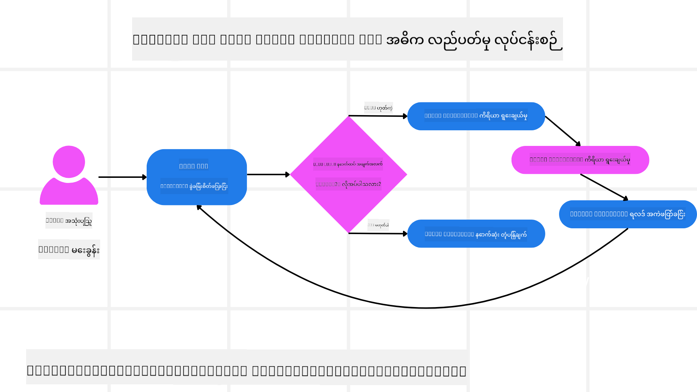
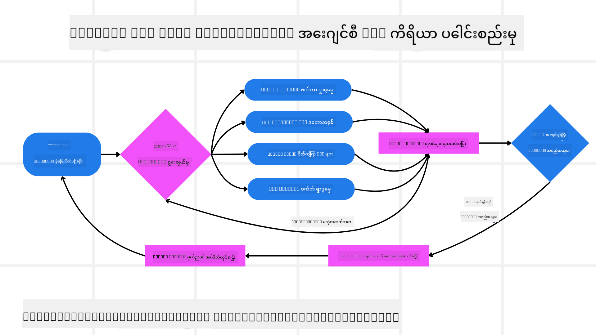
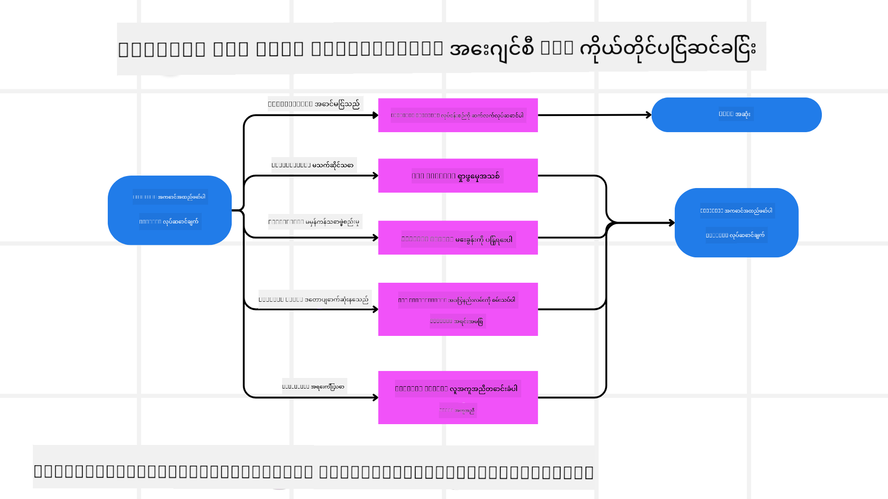

<!--
CO_OP_TRANSLATOR_METADATA:
{
  "original_hash": "d2f04b783b9e1253100329afd698f8ff",
  "translation_date": "2025-08-30T09:37:57+00:00",
  "source_file": "05-agentic-rag/README.md",
  "language_code": "my"
}
-->

> _(အထက်ပါပုံကိုနှိပ်ပြီး ဒီသင်ခန်းစာရဲ့ ဗီဒီယိုကို ကြည့်ပါ)_

# Agentic RAG

ဒီသင်ခန်းစာမှာ Agentic Retrieval-Augmented Generation (Agentic RAG) ဆိုတဲ့ AI ရဲ့ အသစ်ထွက်ပေါ်လာတဲ့ ပုံစံတစ်ခုကို အကျယ်အဝန်း ရှင်းလင်းပြသထားပါတယ်။ ဒီပုံစံမှာ အကြီးစားဘာသာစကားမော်ဒယ်များ (LLMs) က အပြင်ပေါ်မှ အချက်အလက်များကို ရယူရင်း၊ ကိုယ်တိုင်အဆင့်ဆင့် အစီအစဉ်ချပြီး နောက်တစ်ဆင့်ကို ဆောင်ရွက်သွားပါတယ်။ ရိုးရိုး static retrieval-then-read ပုံစံနဲ့ မတူဘဲ Agentic RAG မှာ LLM ကို အဆင့်ဆင့် ခေါ်ယူပြီး၊ tool သို့မဟုတ် function ကို ခေါ်ယူခြင်းနှင့် structured outputs တွေကို ပေါင်းစပ်ထားပါတယ်။ စနစ်က ရလဒ်တွေကို အကဲဖြတ်ပြီး၊ query တွေကို ပြန်လည်တိုးတက်အောင် ပြင်ဆင်၊ လိုအပ်ပါက tool တွေကို ထပ်ခေါ်ပြီး၊ လိုက်လျောညီထွေတဲ့ ဖြေရှင်းချက်ရရှိတဲ့အထိ ဒီစက်ဝိုင်းကို ဆက်လက်လုပ်ဆောင်သွားပါတယ်။

## အကျဉ်းချုပ်

ဒီသင်ခန်းစာမှာ အောက်ပါအကြောင်းအရာများကို လေ့လာပါမည်-

- **Agentic RAG ကို နားလည်ခြင်း:** အကြီးစားဘာသာစကားမော်ဒယ်များ (LLMs) က အပြင်ပေါ်မှ အချက်အလက်များကို ရယူရင်း၊ ကိုယ်တိုင်အဆင့်ဆင့် အစီအစဉ်ချပြီး ဆောင်ရွက်သွားတဲ့ AI ရဲ့ အသစ်ထွက်ပေါ်လာတဲ့ ပုံစံကို လေ့လာပါ။
- **Iterative Maker-Checker Style ကို နားလည်ခြင်း:** LLM ကို အဆင့်ဆင့် ခေါ်ယူပြီး၊ tool သို့မဟုတ် function calls နှင့် structured outputs တွေကို ပေါင်းစပ်ထားတဲ့ loop ကို နားလည်ပါ၊ ဒီစနစ်က မှားယွင်းတဲ့ query တွေကို ကိုင်တွယ်ပြီး၊ တိကျမှုကို တိုးတက်အောင် လုပ်ဆောင်ပါတယ်။
- **အကောင်းဆုံး အသုံးချမှုများကို ရှာဖွေခြင်း:** Agentic RAG က ထူးချွန်တဲ့နေရာများ၊ ဥပမာ- တိကျမှုကို ဦးစားပေးတဲ့ ပတ်ဝန်းကျင်များ၊ ရှုပ်ထွေးတဲ့ database တွေကို ကိုင်တွယ်ခြင်း၊ နှင့် အချိန်ကြာရှည် workflows တွေကို ရှာဖွေပါ။

## သင်ယူရမည့် ရည်မှန်းချက်များ

ဒီသင်ခန်းစာပြီးဆုံးပြီးနောက်မှာ သင်သည် အောက်ပါအရာများကို နားလည်နိုင်ပါမည်-

- **Agentic RAG ကို နားလည်ခြင်း:** အကြီးစားဘာသာစကားမော်ဒယ်များ (LLMs) က အပြင်ပေါ်မှ အချက်အလက်များကို ရယူရင်း၊ ကိုယ်တိုင်အဆင့်ဆင့် အစီအစဉ်ချပြီး ဆောင်ရွက်သွားတဲ့ AI ရဲ့ အသစ်ထွက်ပေါ်လာတဲ့ ပုံစံကို လေ့လာပါ။
- **Iterative Maker-Checker Style:** LLM ကို အဆင့်ဆင့် ခေါ်ယူပြီး၊ tool သို့မဟုတ် function calls နှင့် structured outputs တွေကို ပေါင်းစပ်ထားတဲ့ loop ကို နားလည်ပါ၊ ဒီစနစ်က မှားယွင်းတဲ့ query တွေကို ကိုင်တွယ်ပြီး၊ တိကျမှုကို တိုးတက်အောင် လုပ်ဆောင်ပါတယ်။
- **Reasoning Process ကို ကိုယ်တိုင် ဆောင်ရွက်နိုင်ခြင်း:** စနစ်က ကိုယ်တိုင် reasoning process ကို ကိုင်တွယ်နိုင်ပြီး၊ ပြဿနာကို ကိုင်တွယ်ဖို့ pre-defined paths မရှိဘဲ ဆောင်ရွက်နိုင်ပါတယ်။
- **Workflow:** Agentic မော်ဒယ်က ကိုယ်တိုင် market trend reports တွေကို ရယူ၊ ပြိုင်ဘက် data တွေကို ရှာဖွေ၊ internal sales metrics တွေကို correlation လုပ်၊ findings တွေကို စနစ်တကျ စုစည်းပြီး၊ strategy ကို အကဲဖြတ်နိုင်ပါတယ်။
- **Iterative Loops, Tool Integration, and Memory:** Loop interaction pattern ကို အခြေခံပြီး၊ state နှင့် memory ကို ထိန်းသိမ်းထားနိုင်ခြင်း၊ repetitive loops တွေကို ရှောင်ရှားပြီး၊ informed decisions တွေကို ဆောင်ရွက်နိုင်ပါတယ်။
- **Failure Modes ကို ကိုင်တွယ်ခြင်းနှင့် Self-Correction:** Iterating နှင့် re-querying, diagnostic tools တွေကို အသုံးပြုခြင်း၊ human oversight ကို fallback လုပ်ခြင်း စတဲ့ self-correction mechanisms တွေကို လေ့လာပါ။
- **Boundaries of Agency:** Agentic RAG ရဲ့ အကန့်အသတ်များကို နားလည်ပါ၊ domain-specific autonomy, infrastructure dependence, guardrails တွေကို လေးစားခြင်း။
- **Practical Use Cases and Value:** Agentic RAG က ထူးချွန်တဲ့နေရာများ၊ ဥပမာ- တိကျမှုကို ဦးစားပေးတဲ့ ပတ်ဝန်းကျင်များ၊ ရှုပ်ထွေးတဲ့ database တွေကို ကိုင်တွယ်ခြင်း၊ နှင့် အချိန်ကြာရှည် workflows တွေကို ရှာဖွေပါ။
- **Governance, Transparency, and Trust:** Governance နှင့် transparency ရဲ့ အရေးပါမှုကို လေ့လာပါ၊ reasoning ကို ရှင်းလင်းပြနိုင်ခြင်း၊ bias ကို ထိန်းချုပ်ခြင်း၊ human oversight ကို ထည့်သွင်းခြင်း။

## Agentic RAG ဆိုတာ ဘာလဲ?

Agentic Retrieval-Augmented Generation (Agentic RAG) ဆိုတာ AI ရဲ့ အသစ်ထွက်ပေါ်လာတဲ့ ပုံစံတစ်ခုဖြစ်ပြီး၊ အကြီးစားဘာသာစကားမော်ဒယ်များ (LLMs) က အပြင်ပေါ်မှ အချက်အလက်များကို ရယူရင်း၊ ကိုယ်တိုင်အဆင့်ဆင့် အစီအစဉ်ချပြီး ဆောင်ရွက်သွားပါတယ်။ Static retrieval-then-read ပုံစံနဲ့ မတူဘဲ Agentic RAG မှာ LLM ကို အဆင့်ဆင့် ခေါ်ယူပြီး၊ tool သို့မဟုတ် function calls နှင့် structured outputs တွေကို ပေါင်းစပ်ထားပါတယ်။ စနစ်က ရလဒ်တွေကို အကဲဖြတ်ပြီး၊ query တွေကို ပြန်လည်တိုးတက်အောင် ပြင်ဆင်၊ လိုအပ်ပါက tool တွေကို ထပ်ခေါ်ပြီး၊ လိုက်လျောညီထွေတဲ့ ဖြေရှင်းချက်ရရှိတဲ့အထိ ဒီစက်ဝိုင်းကို ဆက်လက်လုပ်ဆောင်သွားပါတယ်။

ဒီ iterative “maker-checker” ပုံစံက တိကျမှုကို တိုးတက်အောင် လုပ်ဆောင်ပြီး၊ မှားယွင်းတဲ့ query တွေကို ကိုင်တွယ်နိုင်ပြီး၊ အရည်အသွေးမြင့်မားတဲ့ ရလဒ်တွေကို အာမခံပါတယ်။ စနစ်က ကိုယ်တိုင် reasoning process ကို ကိုင်တွယ်နိုင်ပြီး၊ မအောင်မြင်တဲ့ query တွေကို ပြန်ရေး၊ retrieval methods တွေကို ရွေးချယ်၊ tools တွေကို ပေါင်းစပ်နိုင်ပါတယ်—ဥပမာ vector search in Azure AI Search, SQL databases, သို့မဟုတ် custom APIs—ပြီးနောက်မှာ အဖြေကို အတည်ပြုပါတယ်။ Agentic စနစ်ရဲ့ ထူးခြားတဲ့ အရည်အသွေးက reasoning process ကို ကိုယ်တိုင် ဆောင်ရွက်နိုင်ခြင်း ဖြစ်ပါတယ်။ ရိုးရိုး RAG implementations တွေက pre-defined paths တွေကို အခြေခံထားပြီး၊ agentic စနစ်က ရှာဖွေတဲ့ အချက်အလက်ရဲ့ အရည်အသွေးကို အခြေခံပြီး အဆင့်ဆင့် ဆောင်ရွက်နိုင်ပါတယ်။

## Agentic Retrieval-Augmented Generation (Agentic RAG) ကို အဓိပ္ပါယ်ဖွင့်ဆိုခြင်း

Agentic Retrieval-Augmented Generation (Agentic RAG) ဆိုတာ AI ရဲ့ အသစ်ထွက်ပေါ်လာတဲ့ ပုံစံတစ်ခုဖြစ်ပြီး၊ LLMs က အပြင်ပေါ်မှ အချက်အလက်များကို ရယူရင်း၊ ကိုယ်တိုင်အဆင့်ဆင့် အစီအစဉ်ချပြီး ဆောင်ရွက်သွားပါတယ်။ Static retrieval-then-read ပုံစံ သို့မဟုတ် scripted prompt sequences တွေကို မအခြေခံဘဲ Agentic RAG မှာ LLM ကို အဆင့်ဆင့် ခေါ်ယူပြီး၊ tool သို့မဟုတ် function calls နှင့် structured outputs တွေကို ပေါင်းစပ်ထားပါတယ်။ စနစ်က ရလဒ်တွေကို အကဲဖြတ်ပြီး၊ query တွေကို ပြန်လည်တိုးတက်အောင် ပြင်ဆင်၊ tool တွေကို ထပ်ခေါ်ပြီး၊ လိုက်လျောညီထွေတဲ့ ဖြေရှင်းချက်ရရှိတဲ့အထိ ဒီစက်ဝိုင်းကို ဆက်လက်လုပ်ဆောင်သွားပါတယ်။

ဒီ iterative “maker-checker” ပုံစံက တိကျမှုကို တိုးတက်အောင် လုပ်ဆောင်ပြီး၊ မှားယွင်းတဲ့ query တွေကို ကိုင်တွယ်နိုင်ပြီး၊ အရည်အသွေးမြင့်မားတဲ့ ရလဒ်တွေကို အာမခံပါတယ်။ Prompt chains တွေကို အခြေခံထားတဲ့ traditional RAG implementations တွေကို မလိုအပ်ဘဲ၊ စနစ်က reasoning process ကို ကိုယ်တိုင် ဆောင်ရွက်နိုင်ပါတယ်။ Query တွေကို ပြန်ရေး၊ retrieval methods တွေကို ရွေးချယ်၊ tools တွေကို ပေါင်းစပ်နိုင်ပါတယ်—ဥပမာ vector search in Azure AI Search, SQL databases, သို့မဟုတ် custom APIs—ပြီးနောက်မှာ အဖြေကို အတည်ပြုပါတယ်။ Orchestration frameworks တွေကို ရှောင်ရှားပြီး၊ ရိုးရိုး loop of “LLM call → tool use → LLM call → …” က sophisticated outputs တွေကို ရရှိစေပါတယ်။

## Reasoning Process ကို ကိုယ်တိုင် ဆောင်ရွက်နိုင်ခြင်း

Agentic စနစ်ရဲ့ ထူးခြားတဲ့ အရည်အသွေးက reasoning process ကို ကိုယ်တိုင် ဆောင်ရွက်နိုင်ခြင်း ဖြစ်ပါတယ်။ Traditional RAG implementations တွေက model အတွက် pre-defined path ကို လူတွေက သတ်မှတ်ပေးထားရပါတယ်—retrieve လုပ်ရမယ့်အရာနဲ့ အချိန်ကို chain-of-thought အနေနဲ့ သတ်မှတ်ထားရပါတယ်။
Agentic စနစ်က ပြဿနာကို ကိုင်တွယ်ဖို့ အတွင်းပိုင်းမှာ ကိုယ်တိုင် ဆုံးဖြတ်နိုင်ပါတယ်။ Script ကို အကောင်အထည်ဖော်တာမဟုတ်ဘဲ၊ ရှာဖွေတဲ့ အချက်အလက်ရဲ့ အရည်အသွေးကို အခြေခံပြီး အဆင့်ဆင့် ဆောင်ရွက်နိုင်ပါတယ်။
ဥပမာ၊ product launch strategy တစ်ခုကို ဖန်တီးဖို့ တောင်းဆိုခဲ့ရင်၊ အပြည့်အစုံ research နှင့် decision-making workflow ကို prompt မှာ ရေးထားတာကို မူတည်မထားဘဲ၊ agentic model က ကိုယ်တိုင် ဆုံးဖြတ်နိုင်ပါတယ်-

1. Bing Web Grounding ကို အသုံးပြုပြီး လက်ရှိ market trend reports တွေကို ရယူ။
2. Azure AI Search ကို အသုံးပြုပြီး သက်ဆိုင်ရာ ပြိုင်ဘက် data တွေကို ရှာဖွေ။
3. Azure SQL Database ကို အသုံးပြုပြီး အတိတ် internal sales metrics တွေကို correlation လုပ်။
4. Azure OpenAI Service ကို အသုံးပြုပြီး findings တွေကို စနစ်တကျ စုစည်း။
5. Strategy ကို gaps သို့မဟုတ် inconsistencies တွေကို အကဲဖြတ်ပြီး၊ လိုအပ်ပါက retrieval round တစ်ခုကို ထပ်လုပ်။

ဒီအဆင့်တွေ—query တွေကို ပြင်ဆင်ခြင်း၊ sources တွေကို ရွေးချယ်ခြင်း၊ အဖြေကို “happy” ဖြစ်တဲ့အထိ iterate လုပ်ခြင်း—model က ကိုယ်တိုင် ဆုံးဖြတ်ပြီး၊ လူတွေက pre-scripted လုပ်ထားတာမဟုတ်ပါ။

## Iterative Loops, Tool Integration, and Memory

Agentic စနစ်က looped interaction pattern ကို အခြေခံထားပါတယ်-

- **Initial Call:** User prompt (အသုံးပြုသူရဲ့ ရည်မှန်းချက်) ကို LLM မှာ တင်ပြ။
- **Tool Invocation:** Model က မရှိတဲ့ အချက်အလက် သို့မဟုတ် မရှင်းလင်းတဲ့ အညွှန်းတွေကို တွေ့ရှိရင်၊ tool သို့မဟုတ် retrieval method ကို ရွေးချယ်—ဥပမာ vector database query (Azure AI Search Hybrid search over private data) သို့မဟုတ် structured SQL call—ပြီး context ပိုမိုရရှိအောင် ဆောင်ရွက်။
- **Assessment & Refinement:** ပြန်လာတဲ့ data ကို ပြန်လည်သုံးသပ်ပြီး၊ model က အချက်အလက်လုံလောက်မှုကို ဆုံးဖြတ်။ မလုံလောက်ပါက query ကို ပြင်ဆင်၊ tool တစ်ခုကို ပြောင်းရွေး၊ သို့မဟုတ် လုပ်ဆောင်မှုကို ပြင်ဆင်။
- **Repeat Until Satisfied:** Model က clarity နှင့် evidence လုံလောက်မှုကို ရရှိတဲ့အထိ ဒီစက်ဝိုင်းကို ဆက်လက်လုပ်ဆောင်။
- **Memory & State:** စနစ်က state နှင့် memory ကို ထိန်းသိမ်းထားနိုင်တဲ့အတွက်၊ အရင်လုပ်ဆောင်မှုတွေကို မှတ်မိပြီး၊ repetitive loops တွေကို ရှောင်ရှားပြီး၊ informed decisions တွေကို ဆောင်ရွက်နိုင်ပါတယ်။

အချိန်ကြာလာတာနဲ့အမျှ၊ ဒီစနစ်က အဆင့်ဆင့် နားလည်မှုကို ဖွံ့ဖြိုးစေပြီး၊ ရှုပ်ထွေးတဲ့ multi-step tasks တွေကို လူတွေက အမြဲတမ်း intervention လုပ်စရာမလိုဘဲ ဆောင်ရွက်နိုင်စေပါတယ်။

## Failure Modes ကို ကိုင်တွယ်ခြင်းနှင့် Self-Correction

Agentic RAG ရဲ့ autonomy က robust self-correction mechanisms တွေကိုလည်း ပါဝင်ပါတယ်။ စနစ်က dead ends တွေကို ရောက်တဲ့အခါ—ဥပမာ မသက်ဆိုင်တဲ့ စာရွက်စာတမ်းတွေကို ရယူခြင်း သို့မဟုတ် malformed queries တွေကို တွေ့ရှိခြင်း—စနစ်က-

- **Iterate and Re-Query:** တန်ဖိုးနည်းတဲ့ အဖြေတွေကို ပြန်မပေးဘဲ၊ model က search strategies အသစ်တွေကို လုပ်ဆောင်၊ database queries တွေကို ပြန်ရေး၊ သို့မဟုတ် alternative data sets တွေကို ရှာဖွေ။
- **Use Diagnostic Tools:** Reasoning steps တွေကို debug လုပ်ဖို့ သို့မဟုတ် ရယူထားတဲ့ data ရဲ့ တိကျမှုကို အတည်ပြုဖို့ အထောက်အကူပြုတဲ့ functions တွေကို စနစ်က ခေါ်ယူနိုင်ပါတယ်။ Azure AI Tracing က observability နှင့် monitoring ကို အထောက်အကူပြုမှာ ဖြစ်ပါတယ်။
- **Fallback on Human Oversight:** အရေးကြီးတဲ့ သို့မဟုတ် အမြဲမအောင်မြင်တဲ့ အခြေအနေတွေမှာ၊ model က uncertainty ကို flag လုပ်ပြီး လူတွေက အကြံပေးမှုကို တောင်းဆိုနိုင်ပါတယ်။ လူတွေက corrective feedback ပေးပြီးနောက်မှာ၊ model က အဲ့ feedback ကို အနာဂတ်မှာ incorporate လုပ်နိုင်ပါတယ်။

ဒီ iterative နှင့် dynamic approach က model ကို အဆင့်ဆင့် တိုးတက်အောင် လုပ်ဆောင်ပြီး၊ one-shot system မဟုတ်ဘဲ session တစ်ခုအတွင်း missteps တွေကို သင်ယူနိုင်စေပါတယ်။

## Boundaries of Agency

Task တစ်ခုအတွင်းမှာ autonomy ရှိသော်လည်း၊ Agentic RAG ကို Artificial General Intelligence နဲ့ မတူပါဘူး။ “agentic” capabilities တွေက လူတွေက ဖန်တီးထားတဲ့ tools, data sources, နှင့် policies တွေကိုသာ အကန့်အသတ်ထားပါတယ်။ ကိုယ်တိုင် tools တွေကို ဖန်တီးနိုင်ခြင်း သို့မဟုတ် သတ်မှတ်ထားတဲ့ domain boundaries တွေကို ကျော်လွှားနိုင်ခြင်း မရှိပါဘူး။ အစား၊ ရှိပြီးသား resources တွေကို dynamically orchestrate လုပ်နိုင်တာမှာ ထူးချွန်ပါတယ်။
ပိုမိုတိုးတက်တဲ့ AI ပုံစံတွေနဲ့ ကွာခြားမှုများမှာ-

1. **Domain-Specific Autonomy:** Agentic RAG စနစ်တွေက user-defined goals တွေကို ရှိပြီးသား domain အတွင်းမှာ အောင်မြင်အောင် ဆောင်ရွက်ပါတယ်၊ query rewriting သို့မဟုတ် tool selection စတဲ့ strategies တွေကို အသုံးပြုပြီး ရလဒ်တွေကို တိုးတက်အောင် လုပ်ဆောင်ပါတယ်။
2. **Infrastructure-Dependent:** စနစ်ရဲ့ capabilities တွေက developer တွေက ထည့်သွင်းထားတဲ့ tools နှင့် data တွေကို အခြေခံထားပါတယ်။ လူတွေက intervention မလုပ်ဘဲ ဒီ boundaries
<a href="https://learn.microsoft.com/training/modules/use-own-data-azure-openai" target="_blank">
Azure OpenAI Service ကို အသုံးပြု၍ Retrieval Augmented Generation (RAG) ကို အကောင်အထည်ဖော်ခြင်း: Azure OpenAI Service ကို သင့်ကိုယ်ပိုင်ဒေတာနှင့်အတူ အသုံးပြုနည်းကို လေ့လာပါ။ Microsoft Learn module သည် RAG ကို အကောင်အထည်ဖော်ရန် လမ်းညွှန်ချက်များကို ပြည့်စုံစွာ ပေးထားသည်</a>
- <a href="https://learn.microsoft.com/azure/ai-studio/concepts/evaluation-approach-gen-ai" target="_blank">Azure AI Foundry ဖြင့် Generative AI အက်ပလီကေးရှင်းများကို အကဲဖြတ်ခြင်း: ဒီဆောင်းပါးတွင် Agentic AI အက်ပလီကေးရှင်းများနှင့် RAG architecture များအပါအဝင်၊ အများသုံးဒေတာများပေါ်တွင် မော်ဒယ်များကို အကဲဖြတ်ခြင်းနှင့် နှိုင်းယှဉ်ခြင်းကို ဖော်ပြထားသည်</a>
- <a href="https://weaviate.io/blog/what-is-agentic-rag" target="_blank">Agentic RAG ဆိုတာဘာလဲ | Weaviate</a>
- <a href="https://ragaboutit.com/agentic-rag-a-complete-guide-to-agent-based-retrieval-augmented-generation/" target="_blank">Agentic RAG: Agent-Based Retrieval Augmented Generation အတွက် လမ်းညွှန်ချက် – Generation RAG မှ သတင်း</a>
- <a href="https://huggingface.co/learn/cookbook/agent_rag" target="_blank">Agentic RAG: Query Reformulation နှင့် Self-Query ဖြင့် RAG ကို အရှိန်မြှင့်ပါ! Hugging Face Open-Source AI Cookbook</a>
- <a href="https://youtu.be/aQ4yQXeB1Ss?si=2HUqBzHoeB5tR04U" target="_blank">RAG တွင် Agentic Layers ထည့်သွင်းခြင်း</a>
- <a href="https://www.youtube.com/watch?v=zeAyuLc_f3Q&t=244s" target="_blank">Knowledge Assistants ရဲ့ အနာဂတ်: Jerry Liu</a>
- <a href="https://www.youtube.com/watch?v=AOSjiXP1jmQ" target="_blank">Agentic RAG Systems ကို ဘယ်လို တည်ဆောက်မလဲ</a>
- <a href="https://ignite.microsoft.com/sessions/BRK102?source=sessions" target="_blank">AI Agents များကို အကျိုးရှိစွာ တိုးချဲ့ရန် Azure AI Foundry Agent Service ကို အသုံးပြုခြင်း</a>

### သုတေသနစာတမ်းများ

- <a href="https://arxiv.org/abs/2303.17651" target="_blank">2303.17651 Self-Refine: Self-Feedback ဖြင့် Iterative Refinement</a>
- <a href="https://arxiv.org/abs/2303.11366" target="_blank">2303.11366 Reflexion: Verbal Reinforcement Learning ဖြင့် Language Agents</a>
- <a href="https://arxiv.org/abs/2305.11738" target="_blank">2305.11738 CRITIC: Large Language Models သည် Tool-Interactive Critiquing ဖြင့် Self-Correct လုပ်နိုင်သည်</a>
- <a href="https://arxiv.org/abs/2501.09136" target="_blank">2501.09136 Agentic Retrieval-Augmented Generation: Agentic RAG အပေါ် Survey</a>

## ယခင်သင်ခန်းစာ

[Tool Use Design Pattern](../04-tool-use/README.md)

## နောက်သင်ခန်းစာ

[Trustworthy AI Agents တည်ဆောက်ခြင်း](../06-building-trustworthy-agents/README.md)

---

**အကြောင်းကြားချက်**:  
ဤစာရွက်စာတမ်းကို AI ဘာသာပြန်ဝန်ဆောင်မှု [Co-op Translator](https://github.com/Azure/co-op-translator) ကို အသုံးပြု၍ ဘာသာပြန်ထားပါသည်။ ကျွန်ုပ်တို့သည် တိကျမှုအတွက် ကြိုးစားနေသော်လည်း၊ အလိုအလျောက် ဘာသာပြန်ခြင်းတွင် အမှားများ သို့မဟုတ် မတိကျမှုများ ပါဝင်နိုင်သည်ကို သတိပြုပါ။ မူရင်းစာရွက်စာတမ်းကို ၎င်း၏ မူရင်းဘာသာစကားဖြင့် အာဏာတရားရှိသော အရင်းအမြစ်အဖြစ် ရှုလေ့လာသင့်ပါသည်။ အရေးကြီးသော အချက်အလက်များအတွက် လူက ဘာသာပြန်ခြင်းကို အကြံပြုပါသည်။ ဤဘာသာပြန်ကို အသုံးပြုခြင်းမှ ဖြစ်ပေါ်လာသော အလွဲအလွတ်များ သို့မဟုတ် အနားလွဲမှုများအတွက် ကျွန်ုပ်တို့သည် တာဝန်မယူပါ။