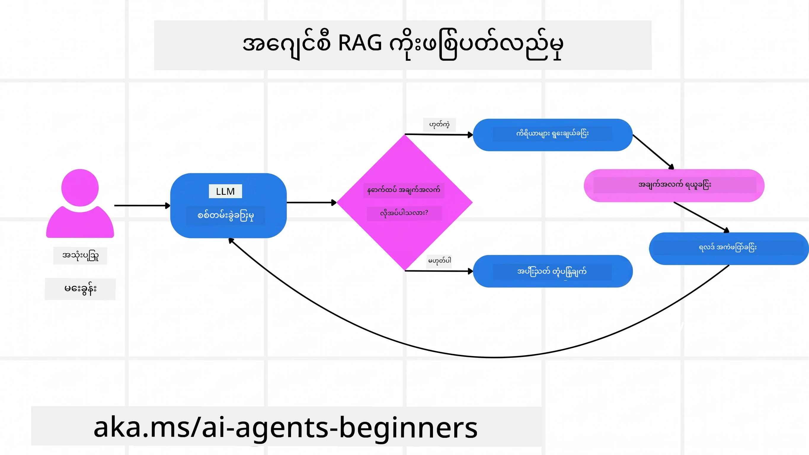
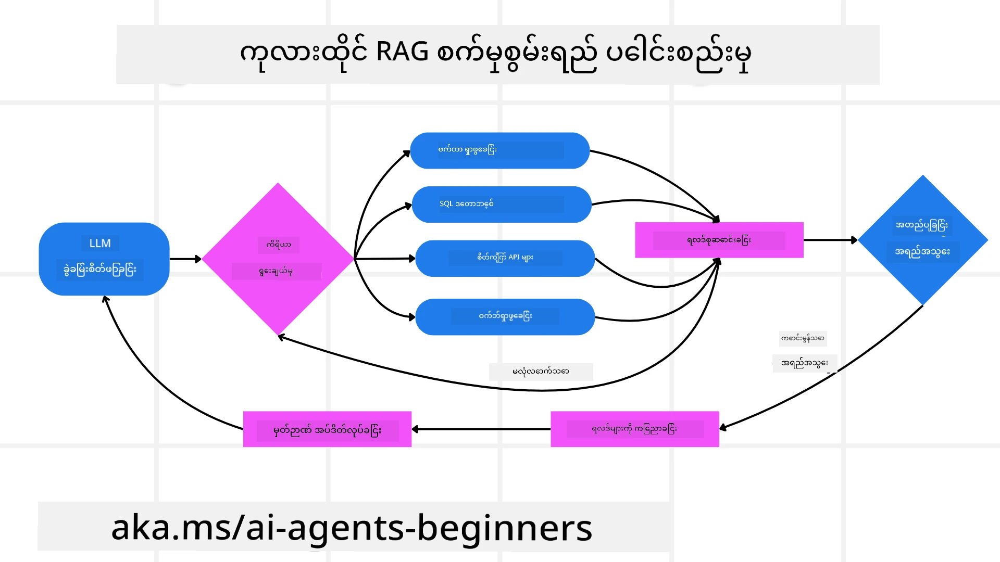
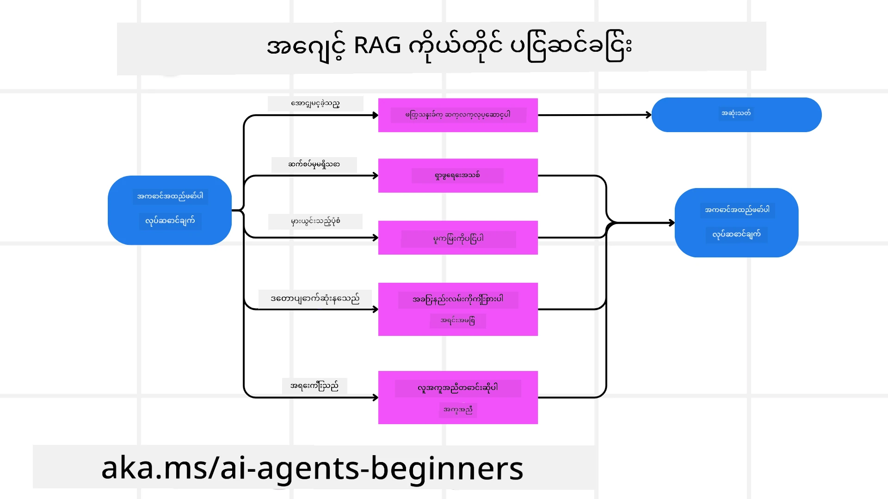
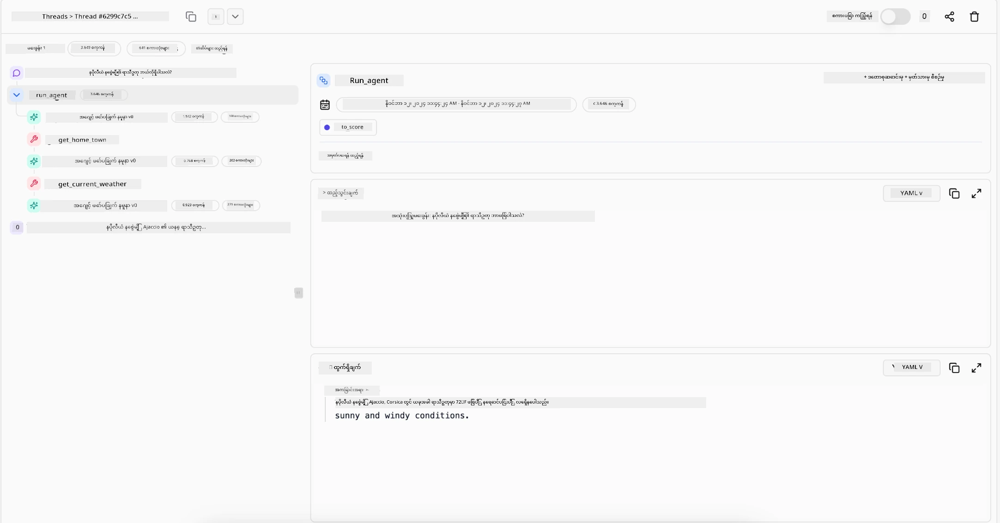

> _(ဒီသင်ခန်းစာရဲ့ ဗီဒီယိုကို ကြည့်ရှုရန် အပေါ်ပါပုံကို နှိပ်ပါ)_

# Agentic RAG

ဤသင်ခန်းစာသည် Agentic Retrieval-Augmented Generation (Agentic RAG) အကြောင်းအသေးစိတ်လေ့လာမှုကို ပံ့ပိုးပေးသည်။ ၎င်းသည် ထင်ရှားလာသော AI အတွေးအခေါ်တစ်ခုဖြစ်ပြီး၊ လက်ကြီးဘာသာစကားမော်ဒယ်များ (LLMs) သည် ကိုယ်တိုင် သူတို့ရဲ့ နောက်ထပ်လှုပ်ရှားမှုများကို စီစဉ်ပြီး အသုံးပြုသူ၏ ပြင်ပအချက်အလက်များကနေ သတင်းအချက်အလက်များကို ဆွဲထုတ်ယူကြသည်။ စံနှုန်းထားထားသော retrieval-then-read ပုံစံများနှင့် မတူကွဲပြား၍ Agentic RAG သည် LLM ကို ပြန်လည်ခေါ်ဆိုမှုများ လုပ်ဆောင်ခြင်း၊ စက်ကိရိယာသို့မဟုတ် function ခေါ်ဆိုမှုများနှင့် ဖွဲ့စည်းထားသော အထွေထွေထွက်များဖြင့် ပိုမိုတိုးတက်စေသော လှုပ်ရှားမှုဇတ်လမ်းများကို ပါဝင်သည်။ စနစ်က ရလာဒ်များအား သုံးသပ်ပြီး၊ မေးခွန်းများအား ပြုပြင်တိုးတက်စေပြီး၊ လိုအပ်ပါက ထပ်မံသော စက်ကိရိယာများကို ခေါ်ယူကာ ထိုလည်ပတ်မှုကို သေချာသောဖြေရှင်းချက်တစ်ခု ရရှိသည်အထိ ဆက်လက်လုပ်ဆောင်သည်။

## မိတ်ဆက်

ဤသင်ခန်းစာတွင် ပါဝင်သည့်အရာများသည်

- **Agentic RAG ကိုနားလည်ရန်:** လက်ကြီးဘာသာစကားမော်ဒယ်များ (LLMs) သည် သူတို့ရဲ့ နောက်ဆက်တွဲလှုပ်ရှားမှုများကို ကိုယ်တိုင် စီစဉ်ပြီး ပြင်ပအချက်အလက်များမှ သတင်းအချက်အလက်များ ဆွဲထုတ်ယူသည့် အသစ်ပေါ်လာသော AI စနစ်အကြောင်း သင်ယူပါ။
- **Iterative Maker-Checker စတိုင်ကို ပိုမိုနားလည်စေရန်:** LLM ကို ပြန်ခေါ်၍၊ စက်ကိရိယာသို့မဟုတ် function ခေါ်ယူမှုများနှင့် ဖွဲ့စည်းထားသော အထွေထွေထွက်များကို ရေးဆွဲခြင်းဖြင့် တိုးတက်မှုပြုလုပ်သော loop ကို နားလည်လိုက်ပါ။
- **လက်တွေ့အသုံးချမှုများကို စူးစမ်းရန်:** Agentic RAG စနစ်အတွက် အကျိုးရှိသောနေရာများဖြစ်သော မှန်ကန်မှု ဦးစားပေးသော ပတ်ဝန်းကျင်များ၊ ခက်ခဲသော ဒေတာဘေ့စ် ဆက်သွယ်မှုများနှင့် ရေရှည်လုပ်ဆောင်မှုများကို သုံးသပ်ပါ။

## လေ့လာမှု ရည်မှန်းချက်များ

ဤသင်ခန်းစာပြီးဆုံးခြင်းနောက်ပိုင်းတွင်၊ သင်သည် သင်ယူနားလည်နိုင်မည်မှာ

- **Agentic RAG နားလည်ခြင်း:** LLM များသည် ပြင်ပ ဒေတာအရင်းအမြစ်များမှ သတင်းအချက်အလက်ဆွဲထုတ်ပြီး ကိုယ်တိုင် သူတို့၏ နောက် လှုပ်ရှားမှုများကို စီစဉ်နိုင်ခြင်းကို သင်ယူပါ။
- **Iterative Maker-Checker စတိုင်:** LLM ကို ထပ်ခါတလဲလဲ ခေါ်ဆိုမှုများ၊ စက်ကိရိယာ သို့မဟုတ် function ခေါ်ဆိုမှုများနှင့် ဖွဲ့စည်းထားသော အထွေထွေထွက်များ တို့ကို ဦးစားပေးတိုးတက်မှုအတွက် နားလည်ပါ။
- **အတွေးခေါ်မှု လုပ်ငန်းစဉ်ကို ကိုယ်ပိုင်ပိုင်ဆိုင်ခြင်း:** စနစ်သည် အတွေးခေါ်မှုပုံစံကို ကိုယ်တိုင် လျော်ကြားနိုင်ပြီး၊ ပြဿနာများကို တုံ့ပြန်ဆောင်ရွက်ရာတွင် ကြိုတင်သတ်မှတ်ထားသော လမ်းကြောင်းများမလိုအပ်ဘဲ ဆုံးဖြတ်ချက်များ ချနိုင်သည်ကို နားလည်ပါ။
- **လုပ်ငန်းစဉ်:** Agentic မော်ဒယ်သည် မိမိ အလိုက်အနှောက် များဖြင့် စျေးကွက် ညွှန်းချက်များကို ရှာဖွေ၊ ပြိုင်ဘက် ဒေတာများသိရှိ၊ အတွင်းစီးပွားရေးရောင်းအားအဆင့်အတန်းများနှင့် ဆက်စပ်၊ ရလဒ်များကို ပေါင်းစပ်ပြီး မဟာဗျူဟာကို သုံးသပ် နားလည်ပါ။
- **Iterative Loop များ၊ စက်ကိရိယာ ပေါင်းစည်းခြင်းနှင့် မှတ်ဉာဏ်:** စနစ်သည် loop များ အတွင်း နေရာရှိ၍ အဆင့်ဆင့်မှတ်ဉာဏ်နှင့် အခြေအနေကို ထိန်းသိမ်းထား၍ ပြန်လည်လှည့်လည်မှုများကြောင့် ထပ်တလဲလဲ မဖြစ်ပွားစေရန် ဆုံးဖြတ်ချက်များ ချနိုင်သည်ကို သင်ယူပါ။
- **မအောင်မြင်မှုဖြစ်ပေါ်မှုများ အသိအမှတ်ပြုပြုပြင်ခြင်း:** စနစ်သည် နှိုင်းယှဉ် သုံးသပ်ခြင်း၊ နောက်ထပ်မေးခွန်းများ ထပ်မံမေးခြင်း၊ ပြုပြင်သူစက်ကိရိယာများ လည်းကောင်း၊ လူသုံးစွဲသူ စစ်ဆေးမှုများကူညီမှုများလည်းကောင်း စနစ်တကျ ပြုပြင်ဖြေရှင်းမှုများ ရှိသည်။
- **အေးဂျင့်၏ အကန့်အသတ်များ:** Agentic RAG ၏ အကန့်အသတ်များကို နားလည်ပါ၊ တိမ်းမှားဘေးကင်းရေးနည်း များနှင့် ကိုယ်ပိုင်လုပ်ငန်းစဉ်များ နှင့် မိတ်ဆက်ထားသော ကန့်သတ်ချက်များအတွက် အရေးပေါ်စည်းကမ်းများ လိုက်နာရပါမည်။
- **လက်တွေ့အသုံးချမှုများနှင့်တန်ဖိုး:** Agentic RAG စနစ်သည် မှန်ကန်မှု ဦးစားပေးခြင်း၊ ခက်ခဲသော ဒေတာဆက်သွယ်မှုများနှင့် ရေရှည်လုပ်ငန်းစဉ်များ တို့တွင် ထူးခြားစွာ ထိရောက်မှု ရှိသည်။
- **အုပ်ချုပ်မှု၊ ထင်ဟပ်မြင်သာမှုနှင့် ယုံကြည်စိတ်ချမှု:** အုပ်ချုပ်မှုနှင့် ထင်ဟပ်မြင်သာမှု ၏ အရေးပါမှုများကို သင်ယူပါ၊ ရှင်းပြနိုင်သော အတွေးခေါ်ခြင်း၊ ကွဲပြားချက် ထိန်းချုပ်မှုနှင့် လူသုံးစွဲသူ စစ်ဆေးမှုများ ပါဝင်သည်။

## Agentic RAG ဆိုတာဘာလဲ။

Agentic Retrieval-Augmented Generation (Agentic RAG) သည် လက်ကြီးဘာသာစကားမော်ဒယ်များ (LLMs) က ကိုယ်တိုင် သူတို့ရဲ့ နောက်တစ်ဆင့်တက်လှုပ်ရှားမှုများကို စီစဉ် လုပ်ဆောင်ရင်း ပြင်ပအချက်အလက်များမှ သတင်းအချက်အလက်များကို ဆွဲထုတ်ယူသောအသင်းသစ် AI စနစ်တစ်ခုဖြစ်သည်။ စံနှုန်းထားထားသော retrieval-then-read ပုံစံများနှင့် မတူကွဲပြား၍ Agentic RAG သည် LLM ကို ထပ်ခါတလဲလဲ ခေါ်ဆိုမှုများ၊ စက်ကိရိယာသို့မဟုတ္ function ခေါ်ဆိုမှုများနှင့် ဖွဲ့စည်းထားသော ထွက်ရှိမှုများကို ပါဝင်သည်။ စနစ်သည် ရရှိခဲ့သော ရလဒ်များကို သုံးသပ်၊ မေးခွန်းများအား ပြုပြင်နိမိတ်ချပေး၊ လိုအပ်ပါက ထပ်မံစက်ကိရိယာများကို ခေါ်ယူပြီး ဤလည်ပတ်မှုကို သေချာအောင် ဆက်လက်ပြုလုပ်သည်။ ဤ iterative “maker-checker” စတိုင်သည် မှန်ကန်မှုတိုးတက်စေပြီး မမှန်ကန်သော မေးခွန်းများကို ကိုင်တွယ်ကာ အရည်အသွေးမြင့်မားသော ရလဒ်များ ထုတ်ပေးသည်။

စနစ်သည် ကိုယ်တိုင် သင့်တင့်သော အတွေးခေါ်မှုလုပ်ငန်းစဉ်ကို ပိုင်ဆိုင် ကာ၊ မတော်တဆ မေးခွန်းများပြန်လည်ရေးသားခြင်း၊ retrieval နည်းလမ်းများပြောင်းရွှေ့ခြင်းနှင့် Azure AI Search ၏ ဗက်တာရှာဖွေရေး၊ SQL ဒေတာဘေ့စ်များ သို့မဟုတ် စိတ်ကြိုက် APIs ကဲ့သို့သော စက်ကိရိယာများစွာ ပါဝင်ပေါင်းစည်းမှုကို ပြုလုပ်ပြီး နောက်ဆုံးဖြေရှင်းချက်ကို သတ်မှတ်ပေးသည်။ Agentic စနစ်၏ ထူးခြားချက်မှာ ကိုယ်တိုင်အတွေးခေါ်မှုကို ပိုင်ဆိုင်နိုင်ခြင်းဖြစ်သည်။ ရိုးရာ RAG စနစ်များမှာ ကြိုတင်သတ်မှတ်ထားသော လမ်းကြောင်းများအပေါ် မူတည်သည်မှာ မတူကွဲပြားသည်၊ Agentic စနစ်သည် ချိတ်ဆက်ထားသည့် အချက်အလက် အရည်အသွေးအပေါ် မူတည်၍ လှုပ်ရှားမှု အဆင့်လိုက်စီမံခန့်ခွဲမှုကို ကိုယ်တိုင်ဆုံးဖြတ်ပါသည်။

## Agentic Retrieval-Augmented Generation (Agentic RAG) ကို အဓိပ္ပါယ်ဖေါ်ခြင်း

Agentic Retrieval-Augmented Generation (Agentic RAG) သည် LLM များသည် ပြင်ပ ဒေတာအရင်းအမြစ်များမှ သတင်းအချက်အလက် ဆွဲထုတ်ခြင်းသာမက ကိုယ်တိုင် သူတို့၏ နောက်လှုပ်ရှားမှုများကို စီစဉ်နိုင်ခြင်းသည် စောင့်ကြည့်ရေးနှင့် AI ဖွံ့ဖြိုးတိုးတက်မှု၌ ထင်ရှားလာသော မော်ဒယ်တစ်ခုဖြစ်သည်။ စံနမူနာဖြစ်သော retrieval-then-read များ သို့မဟုတ် အရေးကြီးအညွှန်းများဖြင့် ကောင်းမွန်စွာ စီမံထားသော prompt များကို မိမိအားလုံး မူတည်မထားဘဲ၊ Agentic RAG သည် LLM ထပ်ခါတလဲလဲ ခေါ်ဆိုမှုများ၊ စက်ကိရိယာသို့မဟုတ် function ခေါ်ဆိုမှုများနှင့် ဖွဲ့စည်းထားသော ထွက်ရှိမှုများ ဖြင့် သွားလာမှုစနစ် ဖြစ်သည်။ ယင်းစနစ်သည် ရလဒ်များကို သုံးသပ်ပြီး မေးခွန်းပြန်လည်ပြုပြင်ရန် ဆုံးဖြတ်၊ ထပ်မံစက်ကိရိယာများကို သုံးဖို့လိုပါက ခေါ်ယူပြီး ပြီးမြောက် အဖြေထွက်အောင် လည်ပတ်မည်။

ဤ iterative “maker-checker” လုပ်ထုံးလုပ်နည်းသည် မှန်ကန်မှုတိုးတက်စေရန်၊ ပုံမှန် မဟုတ်သည့် မေးခွန်းများကို (ဥပမာ NL2SQL) ဖက်အမူ database များတွင် ဖြစ်ပေါ်မည်ကို စီမံနိုင်ရန်နှင့် အရည်အသွေးမြင့်မားသော ရလဒ်များ ထုတ်ဖော်ပေးရန် ရည်ရွယ်သည်။ ပိုတိုးတက်စေရန် ဒီဇိုင်းထုတ် prompt စနစ်များကို အပြည့်အဝ မူတည်မထားဘဲ၊ စနစ်သည် ကိုယ်တိုင် အတွေးခေါ်မှုလုပ်ငန်းစဉ်ကို ပိုင်ဆိုင်သည်။ မအောင်မြင်သော မေးခွန်းများကို ပြန်လည်ရေးသားခြင်း၊ retrieval နည်းလမ်းများပြောင်းရွှေ့ခြင်း၊ Azure AI Search ၏ vector search, SQL ဒေတာဘေ့စ်များ, စိတ်ကြိုက် API များ ၏ စက်ကိရိယာများ ဖြင့် ထပ်မံ ပေါင်းစည်းခြင်းတို့ကို ပြုလုပ်နိုင်သည်။ ဤနည်းစနစ်သည် ပိုမို ရှုပ်ထွေးသော orchestration frameworks မကိုင်တွယ်မှီမရနိုင်ခြင်းကိုဖြေရှင်းပေးသည်။ သာမာန် loop တစ်ခုဖြစ်သည့် “LLM ခေါ်ဆိုမှု → စက်ကိရိယာအသုံးပြုမှု → LLM ခေါ်ဆိုမှု → …” ကနေ အဆင့်မြင့် နားလည်မှုရှိသော ထွက်ရှိမှုများ ကိုယ်တိုင် ယူဆောင်နိုင်သည်။

## အတွေးခေါ်မှု လုပ်ငန်းစဉ်ကို ကိုယ်ပိုင်စီမံခန့်ခွဲခြင်း

စနစ်တစ်ခုကို “agentic” လို့ သတ်မှတ်စေသော ထူးခြားချက်မှာ ၎င်း၏ အတွေးခေါ်မှုလုပ်ငန်းစဉ်ကို ကိုယ်တိုင် ပိုင်ဆိုင်နိုင်ခြင်းဖြစ်သည်။ ရိုးရာ RAG မော်ဒယ်များမှာ လူမှု့အသုံးပြုသူများက မော်ဒယ်၏ လုပ်ဆောင်ရန် လမ်းကြောင်းကို ကြိုတင်သတ်မှတ်ပေးရခြင်းရှိသည်။
သို့သော် စနစ်သည် တကယ် agentic ဖြစ်ပါက၊ ၎င်းသည် ပြဿနာကို မည်သို့ လိုက်နာဆောင်ရွက်မည်ကို ကိုယ်တိုင်ဆုံးဖြတ်သည်။ ပြန်လည်စီမံထားသော စာရင်းတစ်ခုကို ဖျက်သိမ်းခြင်းပင်မဟုတ်၊ ရရှိသော အချက်အလက်အရည်အသွေးအပေါ် မူတည်၍ လှုပ်ရှားမှုစဉ်လိုက်ကို ကိုယ်တိုင် သတ်မှတ်ခြင်းဖြစ်သည်။
ဥပမာအားဖြင့် ထုတ်ကုန်တင်မည့် မဟာဗျူဟာတစ်ခု ဖန်တီးရန် တောင်းဆိုပါက၊ အဲ့ဒီမှာ prompt တစ်ခုတည်းနှင့် အပြည့်အစုံ သုတေသနလုပ်ငန်းစဉ်နှင့် ဆုံးဖြတ်ချက်လုပ်ငန်းစဉ် ကို မူတည်မထားဘဲ၊ agentic မော်ဒယ်သည် ကိုယ်တိုင် ဆုံးဖြတ်သည်။

1. Bing Web Grounding အသုံးပြုကာ စျေးကွက်လက်ရှိအခြေအနေ တင်ပြချက်များကို ရှာဖွေခြင်း
2. Azure AI Search ကိုအသုံးပြုကာ ပြိုင်ဘက်ဆိုင်ရာ ဒေတာများ ရှာဖွေခြင်း
3. Azure SQL Database ဖြင့် သမိုင်းဆိုင်ရာ အတွင်းရောင်းအားကိန်းဂဏန်းများ ကို တွဲဆက်သုံးသပ်ခြင်း
4. ရှာဖွေတွေ့ရှိချက်များကို Azure OpenAI Service ဖြင့် ပေါင်းစပ် ပြုပြင်ထားသော မဟာဗျူဟာတစ်ခုဖြင့် ပြန်လည်အသုံးချခြင်း
5. မဟာဗျူဟာတွင် ချို့ယွင်းချက်များရှိနေလား ထပ်မံ သုံးသပ်ခြင်းနှင့် လိုအပ်ပါက ထပ်မံ ရှာဖွေရေး ချမှတ်ခြင်း
ထိုလှုပ်ရှားမှု အားလုံး - မေးခွန်းများ ပြုပြင်ခြင်း၊ အချက်အလက်အရင်းအမြစ်များ ရွေးချယ်ခြင်း၊ ဖြေဆိုချက်နှင့် မကျေနပ်သေးမှ တစ်ဆင့်ပြန်လည်လုပ်ဆောင်ခြင်းများကို မော်ဒယ်မှ ကိုယ်တိုင် သတ်မှတ်သည်၊ လူသားကကြိုတင်ရေးသား ပေးခြင်း မဟုတ်ပါ။

## Iterative Loop များ၊ စက်ကိရိယာ ပေါင်းစည်းမှုနှင့် မှတ်ဉာဏ်

Agentic စနစ်သည် ခြေလှမ်းတစ်ခုစီနှင့် လည်ပတ်သူ သွားလာမှု စနစ်တစ်ခု မှီထားသည်။

- **အစောပိုင်း ခေါ်ဆိုမှု:** အသုံးပြုသူရဲ့ ရည်ရွယ်ချက် (user prompt) ကို LLM သို့ ပေးပို့သည်။
- **စက်ကိရိယာ ခေါ်ယူမှု:** မော်ဒယ်သည် အချက်အလက် လိုချိန် သို့မဟုတ် အညွှန်းများ မှတ်မိမှု မရှိသလားဆိုတာတွေ့ရင်၊ အချက်အလက်စုဆောင်းရန် စက်ကိရိယာ သို့မဟုတ် retrieval နည်းလမ်းတစ်ခု (ဥပမာ Azure AI Search Hybrid search သို့မဟုတ် မိမိထိန်းသိမ်းထားသော vector database query, သို့မဟုတ် ဖွဲ့စည်းထားသော SQL ခေါ်ဆိုမှု) ကို ရွေးချယ်သည်။
- **သုံးသပ်ခြင်းနှင့် ပြုပြင်ချက်:** ပြန်လည်ရရှိသည့် အချက်အလက်များကို စစ်ဆေးပြီး၊ လုံလောက်သည်လားကြည့်သည်။ နည်းလမ်းမမှန်ဘဲပါက မေးခွန်းများ ပြန်လည်တိုးတက်၊ စက်ကိရိယာတစ်ခု သို့မဟုတ် ဖြစ်မနေခြင်း များ လုပ်သည်။
- **ကျေနပ်မှုရအောင် ထပ်မံ လည်ပတ်ခြင်း:** မျပည့်စုံသေး၍ ၎င်းသည် သေချာ ကြည့်ရွယ်ချက် ရရှိသည်ထိ ထပ်မံ လည်ပတ်လျှက် ရှိသည်။
- **မှတ်ဉာဏ်နှင့် အခြေအနေ:** စနစ်သည် လုပ်ငန်းစဉ်များနှင့်အတူ အခြေအနေများကို ထိန်းသိမ်းထား၍၊ ယခင် လုပ်ဆောင်ခဲ့မှုများနှင့် ရလဒ်များကို သတိပြု၊ ထပ်ခါတလဲလဲ မှုများရှောင်ကြောင်း ဆုံးဖြတ်ချက် ပို၍ စဉ်းစား၍ ဆောင်ရွက်နိုင်သည်။ 

အချိန်ကုန်ထိမ်းသိမ်းမှုနှင့် မျက်မှောက်နားလည်မှုတစ်ခု ပေါ်ပေါက်လာပြီး၊ မော်ဒယ်သည် လူ့အထောက်အပံ့မလိုဘဲ ရှုပ်ထွေးသော ခြေလှမ်းများ ဦးတည်နိုင်သည်။

## မအောင်မြင်မှုဖြစ်ပေါ်မှုများနှင့် ကိုယ်တိုင် ပြုပြင်ခြင်း

Agentic RAG ၏ ကိုယ်ပိုင် လွတ်လပ်မှုတွင် ခိုင်မာသော ကိုယ်တိုင် ပြင်ဆင်နိုင်မှုစနစ်လည်း ပါဝင်သည်။ စနစ်သည် မမှန်ကန်သည့်စာရွက်များ ရှာဖွေခြင်း သို့မဟုတ် မမှန်ကန်သော မေးခွန်းများ ကြုံတွေ့သည့် အချိန်တွင်

- **ထပ်လည်ပြီး ပြန်မေးခြင်း:** မတန်ဖိုးသော ဖြေဆိုချက်များ ပြန်ပေးခြင်းမလုပ်ပဲ၊ မော်ဒယ်သည် အသစ်ရှာဖွေရေး နည်းလမ်းများစမ်းတယ်၊ ဒေတာဘေ့စ် မေးခွန်းများ ပြန်ရေးတယ်၊ မတူညီသော ဒေတာအစုအဝေးများကို ကြည့်ကြည့် သည်။
- **စစ်ဆေးကိရိယာများ အသုံးပြုခြင်း:** စနစ်သည် အတွေးခေါ်မှု လုပ်ဆောင်စဉ်များကို ဒီဘစ်ချ် မယ်လိုက်ဖို့ သို့မဟုတ် ရရှိထားသော ဒေတာမှန်ကြောင်း အတည်ပြုဖို့ အပို function များကို ခေါ်ယူနိုင်သည်။ Azure AI Tracing ကဲ့သို့သော စက်ကိရိယာများသည် စနစ်၏ ပုံမှန်ကြည့်ရှုတင်ပြမှုလည်းကောင်း၊ စောင့်ကြည့်မှုလည်းကောင်း အရေးကြီးသည်။
- **လူ့စစ်ဆေးမှုကို အားပေးခြင်း:** အန္တရာယ်မြင့် သို့မဟုတ် ထပ်တလဲလဲ မအောင်မြင်မှုများဖြစ်ပွားသော အခြေအနေများတွင် ၎င်းသည် အတိအကျမသေချာမှုကို ဖော်ပြ၍ လူများဆီက အကြံဉာဏ်ယူမည်။ လူ့ feedback များ ရရှိပါက၊ လေ့လာသင်ယူပြီး ရှေ့ဆက်ဆောင်ရွက်နိုင်သည်။

ဤ iterative နှင့် မျက်မှောက်ပြုပြင်မှု အပြောင်းအလဲဖြင့် မော်ဒယ်သည် အမြဲတမ်းတိုးတက်ဆင်ခြွေ၍၊ တစ်ကြိမ်တည်း ဖြေဆိုချက်မှ မဟုတ်ပဲ၊ အချိန်ပြည့်တစ်အစည်းအဝေးအတွင်း အမှားများမှ သင်ယူနိုင်သော စနစ်ဖြစ်လာသည်။

## အေးဂျင့်၏ အကန့်အသတ်များ

လုပ်ငန်းတစ်ခုအတွင်း လွတ်လပ်မှုရှိရာအထိဖြစ်ပေမယ့် Agentic RAG သည် Artificial General Intelligence (AGI) နှင့် ဆင်တူမဟုတ်ပါ။ ၎င်း၏ “agentic” စွမ်းဆောင်ရည်များသည် လူ့ဖန်တီးသူများ ထောက်ပံ့ပေးသော စက်ကိရိယာများ၊ ဒေတာအရင်းအမြစ်များနှင့် မူဝါဒများအတွင်း ဆက်ကြည့်ထားရသည်။ ၎င်းသည် ကိုယ်ပိုင် စက်ကိရိယာအသစ်များ ဖန်တီးနိုင်ခြင်း မရှိသလို၊ ကြပ်မတ်ထားသော နယ်ပယ်ကန့်သတ်ချက်များ ထက် အပြင်သို့ မထွက်နိုင်ပါ။ ၎င်းသည် လက်ရှိ ရရှိနိုင်သော နည်းစနစ်များကို များစွာ ဦးဆောင်စီမံနိုင်ပြီး ထိရောက်သည်။
အရေးကြီးကျော်ကြားသော ခွဲခြားချက်များမှာ

1. **နယ်ပယ်အထူး လွတ်လပ်မှု:** Agentic RAG စနစ်များသည် အသုံးပြုသူ သတ်မှတ်ထားသော ရည်ရွယ်ချက်များကို ရရှိရန် ဂရုပြုကြသည်။ မေးခွန်းပြန်ေရးခြင်း သို့မဟုတ် စက်ကိရိယာရွေးချယ်ခြင်း ကဲ့သို့သော နည်းလမ်းများဖြင့် အကောင်းဆုံး ရလဒ်ရရှိစေရန် ကြိုးပမ်းသည်။
2. **အခြေခံ လုပ်ငန်းအဆင့် မဟာဗျူဟာ ပေါ်တည်မှု:** စနစ်၏ စွမ်းဆောင်ရည်များသည် ဖန်တီးသူများ ထည့်သွင်းပေးထားသော စက်ကိရိယာများနှင့် ဒေတာအရင်းအမြစ်များပေါ် မူတည်သည်။ လူ့အထောက်အပံ့ မရှိဘဲ ၎င်းက ထိုနယ်ပယ်များထက် ကျော်လွန်၍ ရောက်ရှိနိုင်ခြင်း မရှိပါ။
3. **လုံခြုံရေး ဥပဒေများနှင့် ဂါးဒ်ရေကို စောင့်ရှောက်မှု:** ကျင့်သုံးစည်းကမ်းများ၊ စည်းမျဉ်းများ၊ နှင့် လုပ်ငန်းမူဝါဒများသည် အရေးကြီးသည်။ အေးဂျင့်၏ လွတ်လပ်ခွင့်သည် အမြဲတမ်း လုံခြုံရေးနည်းလမ်းများနှင့် စောင့်ကြည့်မှုစနစ်များဖြင့် ကန့်သတ်ထားသည် (မျှော်လင့်ရုံမကောင်းပါနှင့်)

## လက်တွေ့အသုံးချမှုများနှင့် တန်ဖိုး

Agentic RAG သည် လည်ပတ်မှု ထပ်ခါတလဲလဲ နှင့် တိကျမှန်ကန်မှု လိုအပ်သော ရှေ့ဆက်အခြေအနေများတွင် ထူးခြားသော ထိရောက်မှုရှိသည်။

1. **မှန်ကန်မှု ဦးစားပေးသော ပတ်ဝန်းကျင်များ:** စည်းကမ်းစစ်ဆေးမှုများ၊ စည်းမျဉ်းစနစ်များ သုံးသပ်ခြင်း သို့မဟုတ် ဥပဒေရေးရာ သုတေသနများတွင်၊ agentic မော်ဒယ်သည် အချက်အလက်များအား တဖြည်းဖြည်း ထပ်မံစစ်ဆေးခြင်း၊ အရင်းအမြစ် များစွာအား ညှိနှိုင်းခြင်း၊ မေးခွန်းများ ပြန်လည်ရေးဆွဲခြင်းတို့ ပြုလုပ်နိုင်သည်။
2. **ခက်ခဲသော ဒေတာဘေ့စ်ဆက်သွယ်မှုများ:** ဖွဲ့စည်းထားသော ဒေတာတွင် မေးခွန်းများ ထပ်ခါတလဲလဲ မအောင်မြင်လျှင်၊ စနစ်သည် Azure SQL သို့မဟုတ် Microsoft Fabric OneLake အသုံးပြုကာ မေးခွန်းများကို ကိုယ်တိုင် ပြန်လည်ပြုပြင်၍ အဆုံးသတ် retrieval သည် အသုံးပြုသူ ရည်ရွယ်ချက်နှင့် ကိုက်ညီသည်ကို သေချာစေသည်။
3. **ရေရှည်လုပ်ငန်းစဉ်များ:** သတင်းအချက်အလက် အသစ်များ တွေ့ရှိလာသည်နှင့်အမျှ ရေရှည် အစည်းအဝေးများ ဖွံဖြိုးတိုးတက်နိုင်သည်။ Agentic RAG သည် အချက်အလက်အသစ်များကို များစွာ ထည့်သွင်းပြီး ပြဿနာနေရာအပေါ် အမြဲလေ့လာခြင်းဖြင့် မဟာဗျူဟာများ ပြောင်းလဲမှုများ ဆောင်ရွက်နိုင်သည်။

## အုပ်ချုပ်မှု၊ ထင်ဟပ်မြင်သာမှုနှင့် ယုံကြည်စိတ်ချမှု

ထိုစနစ်များသည် ၎င်းတို့၏ အတွေးအခေါ် လွတ်လပ်စွာ ဆောင်ရွက်ရာတွင်၊ အုပ်ချုပ်မှုနှင့် ထင်ဟပ်မြင်သာမှု ဂရုပြုရန် အရေးကြီးသည်။

- **ရှင်းလင်းပြတ်သားသော အတွေးခေါ်မှု:** မော်ဒယ်သည် ၎င်း လုပ်ဆောင်ခဲ့သော မေးခွန်းများ၊ ပြန်လည်အသုံးပြုသော အရင်းအမြစ်များနှင့် ရလဒ် ခံယူရန် ဆုံးဖြတ်ချက်တွင် အသုံးပြုခဲ့သော အတွေးခေါ်မှု လုပ်ဆောင်ချက်များကို ဖော်ပြနိုင်သည်။ Azure AI Content Safety နှင့် Azure AI Tracing / GenAIOps ကဲ့သို့သော စက်ကိရိယာများသည် ထင်ဟပ်မြင်သာမှုကို ထိန်းသိမ်းကာ အန္တရာယ်များ လျော့နည်းစေသည်။
- **အရပ်ရပ်မှ မူတည် အချက်အလက်များ ထိန်းချုပ်မှုနှင့် ညီမျှမှု:** ဖန်တီးသူများသည် Retrieval နည်းလမ်းများကို ချိန်ညှိ၍ ဒေတာ အရင်းအမြစ်များမှ ပုံမှန်ညီမျှသော၊ ကိုယ်စားလှယ် တင်ပြမှုရှိစေရန် သတ်မှတ်နိုင်ပြီး၊ Azure Machine Learning အသုံးပြု၍ အဆင့်မြင့် ဒေတာသိပ္ပံ အဖွဲ့အစည်းများ အတွက် ကွဲပြားမှုများ ရှာဖွေရန် မော်ဒယ်များဖြင့် ရလဒ်များကို စစ်ဆေး သေချာစေသည်။
- **လူမှု့စစ်ဆေးမှုနှင့် စည်းကမ်းလိုက်နာမှု:** အရေးကြီးရာ လုပ်ငန်းများအတွက် လူများ၏ ကြည့်ရှုမှု ထိန်းသိမ်းမှု တစ်ခါတစ်ရံ လိုအပ်သည်။ Agentic RAG သည် လူမှု့ အသိပညာအား အစားထိုးမထားနိုင်ပေ၊ အစားထိုးခြင်းမဟုတ်ပဲ ပို၍ စနစ်တကျ ထိရောက်သော ရွေးချယ်စရာများ ပေးနိုင်သည်။

အလုပ်များ၏ အပြည့်အစုံကို မွမ်းမံထားသော ကိရိယာများ လက်ရှိရှိထားခြင်း အရေးကြီးသည်။ မရှိပါက အဆင့်မြင့် လုပ်ငန်းစဉ်များ သူဌေးရှာ ဘာသာရပ် ပြသခြင်း အလွန်ခက်ခဲသည်။ Literal AI (Chainlit မှာတည်ရှိသော ကုမ္ပဏီ) မှ Agent run ဥပမာကိုကြည့်ပါ။

## နိဂုံးချုပ်

Agentic RAG သည် AI စနစ်များသည် ရှုပ်ထွေးမှုများနှင့် ဒေတာများအလွန်ပြည့်စုံသော ပြဿနာများကို ကိုင်တွယ်ရာတွင် သဘာဝတရားထွက်ပေါက်မှုဖြစ်စေသည်။ Looped interaction ပုံစံကို လက်ခံအသုံးပြုကာ စက်ကိရိယာများကို ကိုယ်တိုင် ရွေးချယ်ပြီး မေးခွန်းများ ပြုပြင်တိုးတက်စေသည်။ ဒီစနစ်သည် အတိတ် prompt များကို လိုက်နာသော static စနစ်များထက်ပို၍ ယူဆောင်နိုင်သော၊ ပတ်ဝန်းကျင်ကို သတိပြုသော ဆုံးဖြတ်ချက်ချသူတစ်ခုအဖြစ် ဖွံ့ဖြိုးလာသည်။ လူ့ဖန်တီးသူများ သတ်မှတ်ထားသည့် မဟာဗျူဟာများနှင့် ကျင့်သုံးစည်းကမ်းများထဲမှာ ဆက်လက်နေရန်ရှိသော်လည်း၊ ဒီ agentic စွမ်းရည်များသည် စီးပွားရေးလုပ်ငန်းများနှင့် အသုံးပြုသူများ အတွက် ပို၍ စွမ်းဆောင်ရည်မြင့်သော၊ မျိုးစုံ အသုံးဝင်သော AI ဆက်သွယ်မှုများကို ဖန်တီးပေးသည်။

### Agentic RAG အကြောင်း သေးငယ်သော မေးခွန်းများ ရှိပါသလား?

[Microsoft Foundry Discord](https://discord.com/invite/ATgtXmAS5D) တွင် ဆက်သွယ်ပါက လူသင်တန်းသားများနှင့် တွေ့ဆုံပွဲများ တက်ရောက်နိုင်ပြီး၊ office hours တွင် ပါဝင်၍ သင့် AI Agents မေးခွန်းများကို ဖြေဆိုပေးမည်။

## အပိုဆောင်းအရင်းအမြစ်များ

- <a href="https://learn.microsoft.com/training/modules/use-own-data-azure-openai" target="_blank">Azure OpenAI Service ဖြင့် Retrieval Augmented Generation (RAG) ကို ကျင့်သုံးခြင်း: Azure OpenAI Service ဟာ ကိုယ့်ဒေတာကိုသုံးပြီး RAG ကို တာဝန်ခံ အသုံးပြုနည်း လေ့လာနိုင်သည်။ Microsoft Learn ရဲ့ ဒီမော်ဂျူးသည် RAG ရဲ့ အကောင်းဆုံး အကျိုးသက်ရောက်မှုများကို ပေးသည်</a>
- <a href="https://learn.microsoft.com/azure/ai-studio/concepts/evaluation-approach-gen-ai" target="_blank">Microsoft Foundry နှင့် Generative AI အပလီကေးရှင်းများကို အကဲဖြတ်ခြင်း: ဒီဆောင်းပါးက လူသိများသော ဒေတာအစုများအပေါ် မော်ဒယ်များ၏ အကဲဖြတ်ခြင်းနှင့် နှိုင်းယှဉ်ခြင်းကို မိတ်ဆက်ပြီး Agentic AI အပလီကေးရှင်းများနှင့် RAG စနစ်များကို ဖော်ပြသည်</a>
- <a href="https://weaviate.io/blog/what-is-agentic-rag" target="_blank">Agentic RAG ဆိုတာဘာလဲ | Weaviate</a>
- <a href="https://ragaboutit.com/agentic-rag-a-complete-guide-to-agent-based-retrieval-augmented-generation/" target="_blank">Agentic RAG: Agent-Based Retrieval Augmented Generation တွင် အပြည့်အစုံလမ်းညွှန်ချက် – News from generation RAG</a>

- <a href="https://huggingface.co/learn/cookbook/agent_rag" target="_blank">Agentic RAG: မေးခွန်းပြန်ပြင်ခြင်းနှင့် ကိုယ်တိုင်မေးခွန်းတောင်းခြင်းဖြင့် သင့် RAG ကို အရှိန်အဟုန်ပိုစေပါ! Hugging Face အဖွင့်ရင်းမြစ် AI ဟုတ်ဘွတ်ခ်</a>
- <a href="https://youtu.be/aQ4yQXeB1Ss?si=2HUqBzHoeB5tR04U" target="_blank">Agentic Layer များကို RAG တွင် ထည့်သွင်းခြင်း</a>
- <a href="https://www.youtube.com/watch?v=zeAyuLc_f3Q&t=244s" target="_blank">အသိပညာအကူအညီများ၏ အနာဂတ်: Jerry Liu</a>
- <a href="https://www.youtube.com/watch?v=AOSjiXP1jmQ" target="_blank">Agentic RAG စနစ်များကို မည်သို့တည်ဆောက်မလဲ</a>
- <a href="https://ignite.microsoft.com/sessions/BRK102?source=sessions" target="_blank">Microsoft Foundry Agent Service ကိုသုံးပြီး သင့် AI အေးဂျင့်များကို အရွယ်အစားကြီးမြတ်စေရန်</a>

### တက္ကသိုလ်စာတမ်းများ

- <a href="https://arxiv.org/abs/2303.17651" target="_blank">2303.17651 Self-Refine: ကိုယ်တိုင်ပြန်လည်ပြုပြင်ခြင်းနှင့် တုံ့ပြန်ချက်</a>
- <a href="https://arxiv.org/abs/2303.11366" target="_blank">2303.11366 Reflexion: ပြောဆိုမှုဖြင့် သင့်မြှင့်အသုံးပြုသော ဘာသာစကားအေးဂျင့်များ</a>
- <a href="https://arxiv.org/abs/2305.11738" target="_blank">2305.11738 CRITIC: အသုံးအဆောင်ပြကိရိယာနှင့် အပြန်အလှန် သုံးသပ်ခြင်းဖြင့် ဘာသာစကားမော်ဒယ်ကြီးများကို ကိုယ်တိုင်ပြင်ဆင်နိုင်ခြင်း</a>
- <a href="https://arxiv.org/abs/2501.09136" target="_blank">2501.09136 Agentic Retrieval-Augmented Generation: Agentic RAG အပေါ် စဉ်းစားခြင်း</a>

## ယခင်သင်ခန်းစာ

[ကိရိယာအသုံးပြုမှု ဒီဇိုင်းပုံစံ](../04-tool-use/README.md)

## နောက်ထပ်သင်ခန်းစာ

[ယုံကြည်ရသော AI အေးဂျင့်များ တည်ဆောက်ခြင်း](../06-building-trustworthy-agents/README.md)

---

<!-- CO-OP TRANSLATOR DISCLAIMER START -->
**ပြောကြားချက်**
ဤစာတမ်းကို AI ဘာသာပြန်ဝန်ဆောင်မှု [Co-op Translator](https://github.com/Azure/co-op-translator) အသုံးပြု၍ ဘာသာပြန်ထားပါသည်။ ကျွန်ုပ်တို့သည် တိကျမှန်ကန်မှုအတွက် ကြိုးပမ်းနေသော်လည်း၊ စက်ကိရိယာဘာသာပြန်ခြင်းများတွင် အမှားများ သို့မဟုတ် မှားယွင်းချက်များ ပါဝင်နိုင်ကြောင်း သတိပြုပါရန် လိုအပ်ပါသည်။ မူလစာတမ်းကို မူရင်းဘာသာဖြင့်သာ ယုံကြည်စိတ်ချရသော အချက်အလက်အဖြစ် သတ်မှတ်သင့်သည်။ အရေးကြီးသည့် သတင်းအချက်အလက်များအတွက် ပရော်ဖက်ရှင်နယ် လူသားဘာသာပြန်သူဝန်ဆောင်မှုကို အကြံပြုပါသည်။ ဤဘာသာပြန်ချက်ကို အသုံးပြုခြင်းမှ ဖြစ်ပေါ်လာသော နားလည်မှုကွာခြားမှုများ သို့မဟုတ် မမှန်ကန်သော အသုံးပြုမှုများအတွက် ကျွန်ုပ်တို့ တာဝန်မခံပါ။
<!-- CO-OP TRANSLATOR DISCLAIMER END -->