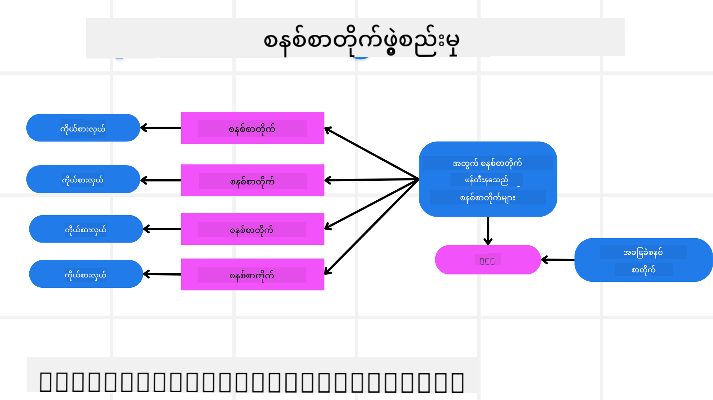
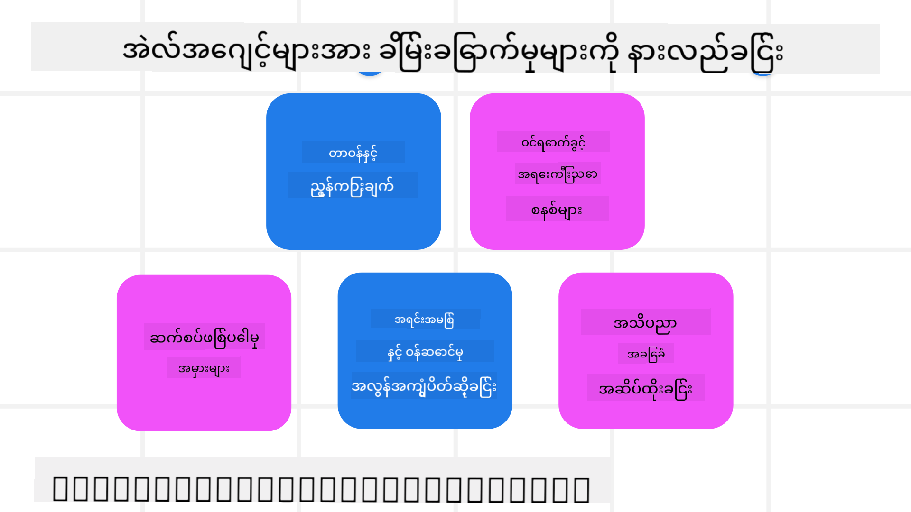
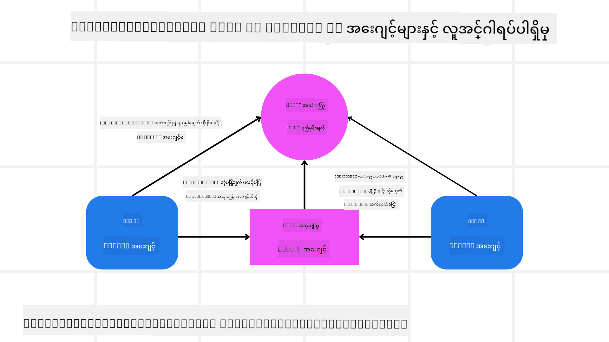

<!--
CO_OP_TRANSLATOR_METADATA:
{
  "original_hash": "498802b4c3c3cc486b86f27a12cebb34",
  "translation_date": "2025-08-30T09:34:40+00:00",
  "source_file": "06-building-trustworthy-agents/README.md",
  "language_code": "my"
}
-->
[](https://youtu.be/iZKkMEGBCUQ?si=Q-kEbcyHUMPoHp8L)

> _(ဤပုံကိုနှိပ်၍ ဒီသင်ခန်းစာ၏ ဗီဒီယိုကို ကြည့်ရှုပါ)_

# ယုံကြည်စိတ်ချရသော AI အေးဂျင့်များ တည်ဆောက်ခြင်း

## နိဒါန်း

ဒီသင်ခန်းစာမှာ အောက်ပါအကြောင်းအရာများကို လေ့လာပါမည်-

- ဘယ်လိုအကောင်အထည်ဖော်ပြီး လုံခြုံပြီး ထိရောက်သော AI အေးဂျင့်များ တည်ဆောက်ရမည်နည်း။
- AI အေးဂျင့်များ ဖွံ့ဖြိုးတိုးတက်စဉ်တွင် အရေးကြီးသော လုံခြုံရေးအချက်များ။
- AI အေးဂျင့်များ ဖွံ့ဖြိုးတိုးတက်စဉ်တွင် ဒေတာနှင့် အသုံးပြုသူ၏ ကိုယ်ရေးအချက်အလက် လုံခြုံမှုကို ဘယ်လိုထိန်းသိမ်းရမည်နည်း။

## သင်ယူရမည့် ရည်မှန်းချက်များ

ဒီသင်ခန်းစာပြီးဆုံးသည့်အခါ၊ သင်သည် အောက်ပါအချက်များကို သိရှိပြီးဖြစ်မည်-

- AI အေးဂျင့်များ ဖန်တီးရာတွင် ဖြစ်နိုင်သော အန္တရာယ်များကို ဖော်ထုတ်ပြီး လျှော့ချနိုင်မည်။
- ဒေတာနှင့် ဝင်ရောက်ခွင့်များကို မှန်ကန်စွာ စီမံခန့်ခွဲနိုင်ရန် လုံခြုံရေးအဆင့်များကို အကောင်အထည်ဖော်နိုင်မည်။
- ဒေတာလုံခြုံမှုကို ထိန်းသိမ်းပြီး အသုံးပြုသူအတွေ့အကြုံကောင်းများ ပေးစွမ်းနိုင်သော AI အေးဂျင့်များ ဖန်တီးနိုင်မည်။

## လုံခြုံမှု

ပထမဦးစွာ လုံခြုံသော အေးဂျင့်ဆိုင်ရာ အက်ပ်လီကေးရှင်းများ တည်ဆောက်ခြင်းကို ကြည့်ကြရအောင်။ လုံခြုံမှုဆိုသည်မှာ AI အေးဂျင့်သည် ရည်ရွယ်ထားသည့်အတိုင်း လုပ်ဆောင်နိုင်ခြင်းကို ဆိုလိုသည်။ အေးဂျင့်ဆိုင်ရာ အက်ပ်လီကေးရှင်းများ တည်ဆောက်သူများအနေဖြင့် လုံခြုံမှုကို အများဆုံးမြှင့်တင်နိုင်ရန် နည်းလမ်းများနှင့် ကိရိယာများ ရှိသည်-

### စနစ်မက်ဆေ့ချ် ဖရိမ်ဝေါ့ခ် တည်ဆောက်ခြင်း

သင်သည် အကြီးမားသော ဘာသာစကားမော်ဒယ်များ (LLMs) ကို အသုံးပြု၍ AI အက်ပ်တစ်ခုခု တည်ဆောက်ဖူးလျှင်၊ ခိုင်မာသော စနစ်မက်ဆေ့ချ် (system prompt) တစ်ခုကို ဒီဇိုင်းဆွဲရမည့် အရေးကြီးမှုကို သိပြီးဖြစ်မည်။ ဒီမက်ဆေ့ချ်များသည် LLM သည် အသုံးပြုသူနှင့် ဒေတာကို ဘယ်လို အပြန်အလှန်လုပ်ဆောင်မည်ဆိုသည်ကို သတ်မှတ်ပေးသည်။

AI အေးဂျင့်များအတွက် စနစ်မက်ဆေ့ချ်သည် ပိုမိုအရေးကြီးသည်၊ အကြောင်းမှာ AI အေးဂျင့်များသည် ကျွန်ုပ်တို့ ဒီဇိုင်းဆွဲထားသည့် တာဝန်များကို ပြည့်စုံစွာ လုပ်ဆောင်ရန် အလွန်သေးစိတ်သော ညွှန်ကြားချက်များ လိုအပ်မည်ဖြစ်သည်။

စမတ်စနစ်မက်ဆေ့ချ်များကို တည်ဆောက်ရန်၊ ကျွန်ုပ်တို့သည် အက်ပ်တွင် အေးဂျင့်တစ်ခု သို့မဟုတ် အများအပြားကို တည်ဆောက်ရန်အတွက် စနစ်မက်ဆေ့ချ် ဖရိမ်ဝေါ့ခ်ကို အသုံးပြုနိုင်သည်-



#### အဆင့် ၁: Meta System Message တစ်ခု ဖန်တီးပါ

Meta Prompt သည် ကျွန်ုပ်တို့ ဖန်တီးမည့် အေးဂျင့်များအတွက် စနစ်မက်ဆေ့ချ်များကို LLM မှ ထုတ်လုပ်ရန် အသုံးပြုမည့် မက်ဆေ့ချ်ဖြစ်သည်။ ကျွန်ုပ်တို့သည် ဒါကို Template အဖြစ် ဒီဇိုင်းဆွဲပြီး လိုအပ်ပါက အေးဂျင့်များ အများအပြားကို ထိရောက်စွာ ဖန်တီးနိုင်သည်။

ဤသည်မှာ Meta System Message တစ်ခု၏ ဥပမာဖြစ်သည်-

```plaintext
You are an expert at creating AI agent assistants. 
You will be provided a company name, role, responsibilities and other
information that you will use to provide a system prompt for.
To create the system prompt, be descriptive as possible and provide a structure that a system using an LLM can better understand the role and responsibilities of the AI assistant. 
```

#### အဆင့် ၂: အခြေခံ Prompt တစ်ခု ဖန်တီးပါ

နောက်တစ်ဆင့်မှာ AI အေးဂျင့်ကို ဖော်ပြသည့် အခြေခံ Prompt တစ်ခု ဖန်တီးခြင်းဖြစ်သည်။ အေးဂျင့်၏ အခန်းကဏ္ဍ၊ အေးဂျင့်၏ တာဝန်များနှင့် အခြားတာဝန်များကို ထည့်သွင်းဖော်ပြရမည်။

ဤသည်မှာ ဥပမာတစ်ခုဖြစ်သည်-

```plaintext
You are a travel agent for Contoso Travel that is great at booking flights for customers. To help customers you can perform the following tasks: lookup available flights, book flights, ask for preferences in seating and times for flights, cancel any previously booked flights and alert customers on any delays or cancellations of flights.  
```

#### အဆင့် ၃: အခြေခံ System Message ကို LLM သို့ ပေးပို့ပါ

ယခု ကျွန်ုပ်တို့သည် Meta System Message ကို System Message အဖြစ် အသုံးပြုပြီး အခြေခံ System Message ကို ထည့်သွင်းခြင်းဖြင့် ဒီ System Message ကို အကောင်းဆုံး ဒီဇိုင်းဆွဲနိုင်သည်။

ဤသည်မှာ AI အေးဂျင့်များကို လမ်းညွှန်ရန် ပိုမိုသင့်တော်သော System Message တစ်ခု ထုတ်လုပ်မည်ဖြစ်သည်-

```markdown
**Company Name:** Contoso Travel  
**Role:** Travel Agent Assistant

**Objective:**  
You are an AI-powered travel agent assistant for Contoso Travel, specializing in booking flights and providing exceptional customer service. Your main goal is to assist customers in finding, booking, and managing their flights, all while ensuring that their preferences and needs are met efficiently.

**Key Responsibilities:**

1. **Flight Lookup:**
    
    - Assist customers in searching for available flights based on their specified destination, dates, and any other relevant preferences.
    - Provide a list of options, including flight times, airlines, layovers, and pricing.
2. **Flight Booking:**
    
    - Facilitate the booking of flights for customers, ensuring that all details are correctly entered into the system.
    - Confirm bookings and provide customers with their itinerary, including confirmation numbers and any other pertinent information.
3. **Customer Preference Inquiry:**
    
    - Actively ask customers for their preferences regarding seating (e.g., aisle, window, extra legroom) and preferred times for flights (e.g., morning, afternoon, evening).
    - Record these preferences for future reference and tailor suggestions accordingly.
4. **Flight Cancellation:**
    
    - Assist customers in canceling previously booked flights if needed, following company policies and procedures.
    - Notify customers of any necessary refunds or additional steps that may be required for cancellations.
5. **Flight Monitoring:**
    
    - Monitor the status of booked flights and alert customers in real-time about any delays, cancellations, or changes to their flight schedule.
    - Provide updates through preferred communication channels (e.g., email, SMS) as needed.

**Tone and Style:**

- Maintain a friendly, professional, and approachable demeanor in all interactions with customers.
- Ensure that all communication is clear, informative, and tailored to the customer's specific needs and inquiries.

**User Interaction Instructions:**

- Respond to customer queries promptly and accurately.
- Use a conversational style while ensuring professionalism.
- Prioritize customer satisfaction by being attentive, empathetic, and proactive in all assistance provided.

**Additional Notes:**

- Stay updated on any changes to airline policies, travel restrictions, and other relevant information that could impact flight bookings and customer experience.
- Use clear and concise language to explain options and processes, avoiding jargon where possible for better customer understanding.

This AI assistant is designed to streamline the flight booking process for customers of Contoso Travel, ensuring that all their travel needs are met efficiently and effectively.

```

#### အဆင့် ၄: ပြန်လည်ဆန်းစစ်ပြီး တိုးတက်မှုများ ပြုလုပ်ပါ

ဤစနစ်မက်ဆေ့ချ် ဖရိမ်ဝေါ့ခ်၏ အဓိကတန်ဖိုးမှာ အေးဂျင့်များ အများအပြားအတွက် စနစ်မက်ဆေ့ချ်များကို ပိုမိုလွယ်ကူစွာ ဖန်တီးနိုင်ရန်နှင့် အချိန်ကြာလာသည်နှင့်အမျှ စနစ်မက်ဆေ့ချ်များကို တိုးတက်အောင် ပြုလုပ်နိုင်ရန် ဖြစ်သည်။ သင့်ရဲ့ စနစ်မက်ဆေ့ချ်သည် ပထမဆုံးကြိမ်မှာပင် သင့်ရဲ့ အသုံးပြုမှုအတွက် ပြည့်စုံစွာ အလုပ်မလုပ်နိုင်ပါ။ အခြေခံ System Message ကို အနည်းငယ် ပြင်ဆင်ပြီး စနစ်မှတဆင့် ပြန်လည်လည်ပတ်ခြင်းဖြင့် ရလဒ်များကို နှိုင်းယှဉ်ပြီး အကဲဖြတ်နိုင်မည်ဖြစ်သည်။

## အန္တရာယ်များကို နားလည်ခြင်း

ယုံကြည်စိတ်ချရသော AI အေးဂျင့်များ တည်ဆောက်ရန်အတွက် AI အေးဂျင့်၏ အန္တရာယ်များနှင့် ခြိမ်းခြောက်မှုများကို နားလည်ပြီး လျှော့ချရန် အရေးကြီးသည်။ AI အေးဂျင့်များကို ခြိမ်းခြောက်နိုင်သော အန္တရာယ်အချို့နှင့် ၎င်းတို့ကို ပိုမိုကောင်းမွန်စွာ စီမံဆောင်ရွက်နိုင်ရန် နည်းလမ်းများကို ကြည့်ကြရအောင်-



### တာဝန်နှင့် ညွှန်ကြားချက်များ

**ဖော်ပြချက်**: တိုက်ခိုက်သူများသည် Prompt သို့မဟုတ် Input များကို ပြောင်းလဲခြင်းဖြင့် AI အေးဂျင့်၏ ညွှန်ကြားချက်များ သို့မဟုတ် ရည်မှန်းချက်များကို ပြောင်းလဲရန် ကြိုးစားသည်။

**ကာကွယ်နည်း**: AI အေးဂျင့်မှ အလုပ်လုပ်မည့်အချိန်တွင် အန္တရာယ်ရှိနိုင်သော Prompt များကို စစ်ဆေးရန် Validation Check များနှင့် Input Filter များကို အကောင်အထည်ဖော်ပါ။ AI အေးဂျင့်နှင့် အပြန်အလှန်လုပ်ဆောင်မှုများကို ကန့်သတ်ခြင်းသည်လည်း ဒီလိုတိုက်ခိုက်မှုများကို ကာကွယ်နိုင်သော နည်းလမ်းတစ်ခုဖြစ်သည်။

### အရေးကြီးသော စနစ်များသို့ ဝင်ရောက်ခွင့်

**ဖော်ပြချက်**: AI အေးဂျင့်သည် အရေးကြီးသော ဒေတာများကို သိမ်းဆည်းထားသည့် စနစ်များနှင့် ဝန်ဆောင်မှုများသို့ ဝင်ရောက်ခွင့်ရှိပါက၊ တိုက်ခိုက်သူများသည် အေးဂျင့်နှင့် ၎င်းဝန်ဆောင်မှုများအကြား ဆက်သွယ်မှုကို ချိုးဖောက်နိုင်သည်။

**ကာကွယ်နည်း**: AI အေးဂျင့်များသည် လိုအပ်သောအခါတွင်သာ စနစ်များသို့ ဝင်ရောက်ခွင့်ရှိစေရန် စီမံဆောင်ရွက်ပါ။ အေးဂျင့်နှင့် စနစ်အကြား ဆက်သွယ်မှုကို လုံခြုံစေရန် Authentication နှင့် Access Control ကို အကောင်အထည်ဖော်ပါ။

### အရင်းအမြစ်နှင့် ဝန်ဆောင်မှုများကို အလွန်အကျွံ အသုံးပြုခြင်း

**ဖော်ပြချက်**: AI အေးဂျင့်များသည် တာဝန်များကို ပြည့်စုံစွာ လုပ်ဆောင်ရန် ကိရိယာများနှင့် ဝန်ဆောင်မှုများကို အသုံးပြုနိုင်သည်။ တိုက်ခိုက်သူများသည် အေးဂျင့်မှတဆင့် အလွန်အကျွံတောင်းဆိုမှုများ ပေးပို့ခြင်းဖြင့် စနစ်များကို ချိုးဖောက်နိုင်သည်။

**ကာကွယ်နည်း**: AI အေးဂျင့်သည် တစ်ခုချင်းစီသော ဝန်ဆောင်မှုများသို့ တောင်းဆိုမှုအရေအတွက်ကို ကန့်သတ်ပါ။ AI အေးဂျင့်နှင့် အပြန်အလှန်လုပ်ဆောင်မှုများကိုလည်း ကန့်သတ်ခြင်းဖြင့် ဒီလိုတိုက်ခိုက်မှုများကို ကာကွယ်နိုင်သည်။

### Knowledge Base ကို ချိုးဖောက်ခြင်း

**ဖော်ပြချက်**: ဒီလိုတိုက်ခိုက်မှုသည် AI အေးဂျင့်ကို တိုက်ရိုက်မဟုတ်ဘဲ၊ အေးဂျင့်အသုံးပြုမည့် Knowledge Base သို့မဟုတ် အခြားဝန်ဆောင်မှုများကို ပစ်မှတ်ထားသည်။ ဒေတာများကို ချိုးဖောက်ခြင်းဖြင့် အသုံးပြုသူများအတွက် မလိုလားအပ်သော အဖြေများကို AI အေးဂျင့်မှ ထုတ်ပေးနိုင်သည်။

**ကာကွယ်နည်း**: AI အေးဂျင့်အသုံးပြုမည့် ဒေတာများကို ပုံမှန်စစ်ဆေးပါ။ ဒေတာများကို လုံခြုံစွာ သိမ်းဆည်းပြီး ယုံကြည်ရသော ပုဂ္ဂိုလ်များမှသာ ပြောင်းလဲနိုင်စေရန် စီမံဆောင်ရွက်ပါ။

### အမှားများ ပျံ့နှံ့ခြင်း

**ဖော်ပြချက်**: AI အေးဂျင့်များသည် တာဝန်များကို ပြည့်စုံစွာ လုပ်ဆောင်ရန် ကိရိယာများနှင့် ဝန်ဆောင်မှုများကို အသုံးပြုသည်။ တိုက်ခိုက်သူများမှ ဖြစ်ပေါ်သော အမှားများကြောင့် အခြားစနစ်များတွင်လည်း ပြဿနာများ ဖြစ်ပေါ်စေနိုင်သည်။

**ကာကွယ်နည်း**: AI အေးဂျင့်ကို Docker Container ကဲ့သို့သော ကန့်သတ်ထားသော ပတ်ဝန်းကျင်တွင် လုပ်ဆောင်စေရန် စီမံဆောင်ရွက်ပါ။ အမှားဖြစ်ပေါ်ပါက ပြန်လည်ကြိုးစားရန် လုပ်ဆောင်ချက်များကို ထည့်သွင်းပါ။

## လူသားများ ပါဝင်သော စနစ် (Human-in-the-Loop)

ယုံကြည်စိတ်ချရသော AI အေးဂျင့်စနစ်များ တည်ဆောက်ရန် အကျိုးရှိသော နည်းလမ်းတစ်ခုမှာ Human-in-the-Loop ကို အသုံးပြုခြင်းဖြစ်သည်။ ၎င်းသည် အသုံးပြုသူများကို အေးဂျင့်များ၏ လုပ်ငန်းစဉ်အတွင်း အကြံပြုချက်များ ပေးနိုင်စေရန် စနစ်တစ်ခု ဖန်တီးပေးသည်။



ဤအယူအဆကို အကောင်အထည်ဖော်ထားသည့် AutoGen ကို အသုံးပြုထားသော ကုဒ်ဥပမာတစ်ခုမှာ-

```python

# Create the agents.
model_client = OpenAIChatCompletionClient(model="gpt-4o-mini")
assistant = AssistantAgent("assistant", model_client=model_client)
user_proxy = UserProxyAgent("user_proxy", input_func=input)  # Use input() to get user input from console.

# Create the termination condition which will end the conversation when the user says "APPROVE".
termination = TextMentionTermination("APPROVE")

# Create the team.
team = RoundRobinGroupChat([assistant, user_proxy], termination_condition=termination)

# Run the conversation and stream to the console.
stream = team.run_stream(task="Write a 4-line poem about the ocean.")
# Use asyncio.run(...) when running in a script.
await Console(stream)

```

## နိဂုံး

ယုံကြည်စိတ်ချရသော AI အေးဂျင့်များ တည်ဆောက်ရန်အတွက် သေချာစွာ ဒီဇိုင်းဆွဲခြင်း၊ ခိုင်မာသော လုံခြုံရေးအဆင့်များနှင့် ဆက်လက်တိုးတက်မှုများ ပြုလုပ်ခြင်း လိုအပ်သည်။ Meta Prompting စနစ်များကို ဖွဲ့စည်းခြင်း၊ ဖြစ်နိုင်သော ခြိမ်းခြောက်မှုများကို နားလည်ခြင်းနှင့် ကာကွယ်ရေးမဟာဗျူဟာများကို အကောင်အထည်ဖော်ခြင်းဖြင့် လုံခြုံပြီး ထိရောက်သော AI အေးဂျင့်များကို ဖန်တီးနိုင်သည်။ ထို့အပြင် Human-in-the-Loop ကို ထည့်သွင်းခြင်းဖြင့် AI အေးဂျင့်များသည် အသုံးပြုသူ၏ လိုအပ်ချက်များနှင့် ကိုက်ညီနေစေရန် အထောက်အကူပြုသည်။ AI သည် ဆက်လက်တိုးတက်နေသည့်အခါတွင် လုံခြုံရေး၊ ကိုယ်ရေးအချက်အလက်နှင့် စည်းမျဉ်းသိက္ခာဆိုင်ရာ အချက်များကို အလေးထားဆောင်ရွက်ခြင်းသည် AI စနစ်များအပေါ် ယုံကြည်မှုနှင့် ယုံကြည်စိတ်ချမှုကို တိုးတက်စေမည်ဖြစ်သည်။

### ယုံကြည်စိတ်ချရသော AI အေးဂျင့်များ တည်ဆောက်ခြင်းနှင့် ပတ်သက်၍ မေးခွန်းများ ရှိပါသလား?

[Azure AI Foundry Discord](https://aka.ms/ai-agents/discord) တွင် တက်ကြွသော သင်ယူသူများနှင့် တွေ့ဆုံပြီး Office Hours တွင် ပါဝင်ကာ သင့် AI အေးဂျင့်များနှင့် ပတ်သက်သော မေးခွန်းများကို ဖြေရှင်းနိုင်ပါသည်။

## ထပ်မံလေ့လာရန် အရင်းအမြစ်များ

- <a href="https://learn.microsoft.com/azure/ai-studio/responsible-use-of-ai-overview" target="_blank">AI ကို တာဝန်ရှိစွာ အသုံးပြုခြင်းအကြောင်းအရာ</a>
- <a href="https://learn.microsoft.com/azure/ai-studio/concepts/evaluation-approach-gen-ai" target="_blank">Generative AI မော်ဒယ်များနှင့် AI အက်ပ်များကို အကဲဖြတ်ခြင်း</a>
- <a href="https://learn.microsoft.com/azure/ai-services/openai/concepts/system-message?context=%2Fazure%2Fai-studio%2Fcontext%2Fcontext&tabs=top-techniques" target="_blank">လုံခြုံရေးဆိုင်ရာ စနစ်မက်ဆေ့ချ်များ</a>
- <a href="https://blogs.microsoft.com/wp-content/uploads/prod/sites/5/2022/06/Microsoft-RAI-Impact-Assessment-Template.pdf?culture=en-us&country=us" target="_blank">အန္တရာယ်အကဲဖြတ်မှု Template</a>

## ယခင်သင်ခန်းစာ

[Agentic RAG](../05-agentic-rag/README.md)

## နောက်သင်ခန်းစာ

[Planning Design Pattern](../07-planning-design/README.md)

---

**ဝက်ဘ်ဆိုက်မှတ်ချက်**:  
ဤစာရွက်စာတမ်းကို AI ဘာသာပြန်ဝန်ဆောင်မှု [Co-op Translator](https://github.com/Azure/co-op-translator) ကို အသုံးပြု၍ ဘာသာပြန်ထားပါသည်။ ကျွန်ုပ်တို့သည် တိကျမှန်ကန်မှုအတွက် ကြိုးစားနေပါသော်လည်း၊ အလိုအလျောက်ဘာသာပြန်မှုများတွင် အမှားများ သို့မဟုတ် မတိကျမှုများ ပါဝင်နိုင်သည်ကို ကျေးဇူးပြု၍ သတိပြုပါ။ မူရင်းစာရွက်စာတမ်းကို ၎င်း၏ မူလဘာသာစကားဖြင့် အာဏာတည်သောရင်းမြစ်အဖြစ် သတ်မှတ်ပါ။ အရေးကြီးသော အချက်အလက်များအတွက် လူပညာရှင်များမှ ဘာသာပြန်မှုကို အကြံပြုပါသည်။ ဤဘာသာပြန်မှုကို အသုံးပြုခြင်းမှ ဖြစ်ပေါ်လာသော နားလည်မှုမှားများ သို့မဟုတ် အဓိပ္ပါယ်မှားများအတွက် ကျွန်ုပ်တို့သည် တာဝန်မယူပါ။