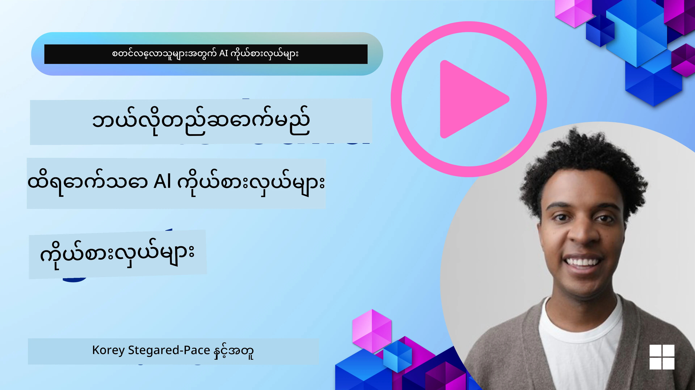
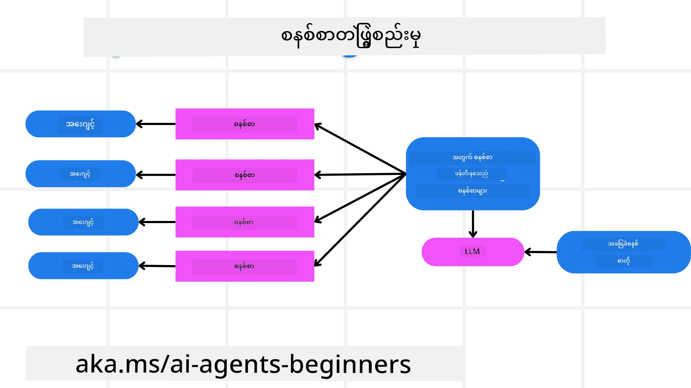
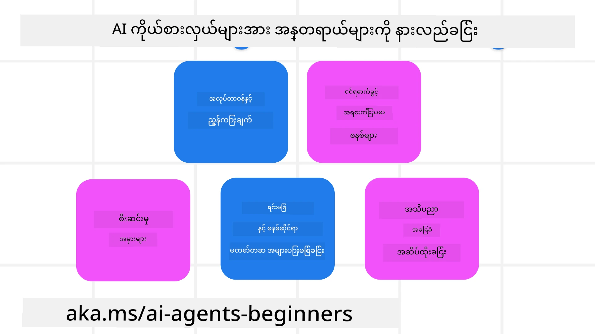
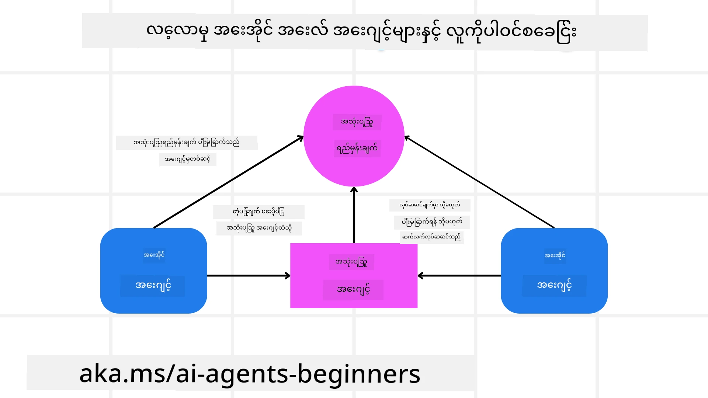

[](https://youtu.be/iZKkMEGBCUQ?si=Q-kEbcyHUMPoHp8L)

> _(ဓာတ်ပုံကိုနှိပ်၍ဤသင်ခန်းစာရဲ့ဗီဒီယိုကိုကြည့်ရှုနိုင်သည်)_

# ယုံကြည်စိတ်ချရတဲ့ AI အေးဂျင့်များ တည်ဆောက်ခြင်း

## နိဒါန်း

ဤသင်ခန်းစာတွင် ဖော်ပြမည်မှာ -

- ဘယ်လိုလုံခြုံပြီး ထိရောက်သော AI အေးဂျင့်များကို တည်ဆောက်သုံးသပ်၍ ထုတ်လုပ်မည်နည်း။
- AI အေးဂျင့်များ ဖန်တီးရာတွင် လုံခြုံရေးဆိုင်ရာ အရေးကြီးချက်များ။
- AI အေးဂျင့်များ ဖန်တီးရာတွင် ဒေတာနှင့် အသုံးပြုသူ ကိုယ်ရေးကိုယ်တာကို ထိန်းသိမ်းသည့် နည်းလမ်းများ။

## သင်ယူရမည့် ရည်မှန်းချက်များ

ဤသင်ခန်းစာပြီးဆုံးချိန်တွင် သင်သည် သိရှိနိုင်မည်မှာ -

- AI အေးဂျင့်များ ဖန်တီးရာတွင် ဖြစ်ပေါ်နိုင်သော အန္တရာယ်များကို ဖော်ထုတ်ပြီး လျော့ချပေးနည်း။
- ဒေတာနှင့် ဝင်ရောက်ခွင့်များကို သေချာစွာ စီမံခန့်ခွဲရန် လုံခြုံရေး မူဝါဒများ စနစ်တကျ ထည့်သွင်းဆောင်ရွက်နိုင်သည်။
- ဒေတာကို ပုဂ္ဂိုလ်နယ်သိမ်းထားပြီး အရည်အသွေးရှိသည့် အသုံးပြုသူ အတွေ့အကြုံ ရရှိစေရန် AI အေးဂျင့်များကို ဖန်တီးနိုင်သည်။

## လုံခြုံရေး

ပထမဦးဆုံး လုံခြုံသော agentic အပလီကေးရှင်းများ ရေးဆွဲခြင်းအား ကြည့်ကြရအောင်။ လုံခြုံမှုဆိုသည်မှာ AI အေးဂျင့်သည် မှန်ကန်သည့် ဒီဇိုင်းအတိုင်း လုပ်ဆောင်သည့်အတိုင်း ဖြစ်ခြင်း ဖြစ်သည်။ agentic အပလီကေးရှင်းရေးဆွဲသူများအနေနှင့် ကျွန်ုပ်တို့တွင် လုံခြုံမှု အများဆုံးဖြစ်စေရန် နည်းလမ်းများနှင့် ကိရိယာများရှိသည်။

### စနစ်မက်ဆေ့ခ်ျ ဖရိမ်းဝက်စ် တည်ဆောက်ခြင်း

သင့်အား ကြီးမားသော ဘာသာစကား မော်ဒယ်များ (LLMs) အသုံးပြု၍ AI အပလီကေးရှင်းတစ်ခုတည်ဆောက်ဖူးပါက စနစ်ခေါင်းစဉ် သို့မဟုတ် စနစ်မက်ဆေ့ခ်ျ တစ်ခုအား ခိုင်မာစွာ ဒီဇိုင်းဆွဲထားခြင်း၏ အရေးပါမှုကို သိရှိမြင်တွေ့ဖြစ်ပါ၏။ ဤမက်ဆေ့ခ်ျများသည် LLM နှင့် အသုံးပြုသူ၊ ဒေတာတို့ ဆက်သွယ်မှု များအတွက် စည်းမျဉ်းများ၊ ညွှန်ကြားချက်များ နှင့် လမ်းညွှန်ချက်များ သတ်မှတ်ပေးသည်။

AI အေးဂျင့်များအတွက် စနစ်ခေါင်းစဉ်သည် ပိုမိုအရေးကြီးသည်။ AI အေးဂျင့်များသည် ကျွန်ုပ်တို့ ဒီဇိုင်းဆွဲထားသည့် တာဝန်များကို ပြီးမြောက်အောင် အထူးအသေးစိတ် ညွှန်ကြားချက်များ လိုအပ်မည် ဖြစ်သည်။

စနစ်မက်ဆေ့ခ်ျများကို တိုးချဲ့နိုင်ရန် ကျွန်ုပ်တို့သည် အပလီကေးရှင်းအတွင်း အေးဂျင့်တစ်ချို့ သို့မဟုတ် တစ်ချို့ထက် ပိုမိုရှိတဲ့ အေးဂျင့်များ ဖန်တီးရန် စနစ်မက်ဆေ့ခ်ျ ဖရိမ်းဝက်စ် အသုံးပြုနိုင်ပါသည်-



#### ခြောက်လှမ်း ၁: မက်တာ စနစ်မက်ဆေ့ခ်ျ တစ်ခု ဖန်တီးရန်

မက်တာ prompt ကို LLM သုံး၍ ကျွန်တော်တို့ ဖန်တီးလိုသော အေးဂျင့်များဆီသို့ စနစ်မက်ဆေ့ခ်ျများ ဖန်တီးရန် အသုံးပြုသည်။ မိမိတည်ဆောက်လိုသော အေးဂျင့်များ အများအတွက် ထိရောက်စွာဖန်တီးနိုင်ရန် ဖောင်ပုံစံအဖြစ် ဒီဇိုင်းဆွဲပါသည်။

ဤအောက်တွင် LLM ကိုပေးမည့် မက်တာ စနစ်မက်ဆေ့ချ် ဥပမာတစ်ခု ပါရှိသည်-

```plaintext
You are an expert at creating AI agent assistants. 
You will be provided a company name, role, responsibilities and other
information that you will use to provide a system prompt for.
To create the system prompt, be descriptive as possible and provide a structure that a system using an LLM can better understand the role and responsibilities of the AI assistant. 
```

#### ခြောက်လှမ်း ၂: မူလ prompt တစ်ခု ဖန်တီးရန်

နောက်ထပ်ခြေလှမ်းမှာ AI အေးဂျင့်၏ ဖော်ပြချက် အတွက် မူလ prompt တစ်ခု ဖန်တီးခြင်းဖြစ်သည်။ အေးဂျင့်၏ တာဝန်၊ ပြီးမြောက်ရမည့် တာဝန်များနှင့် တာဝန်ဖြစ်စေရမည့် အချက်များကို ထည့်သွင်းရေးသားသင့်ပါသည်။

ဥပမာအားဖြင့် -

```plaintext
You are a travel agent for Contoso Travel that is great at booking flights for customers. To help customers you can perform the following tasks: lookup available flights, book flights, ask for preferences in seating and times for flights, cancel any previously booked flights and alert customers on any delays or cancellations of flights.  
```

#### ခြောက်လှမ်း ၃: အခြေခံ စနစ်မက်ဆေ့ခ်ျကို LLM သို့ ပေးပို့ပါ

ယခု အခြေခံ စနစ်မက်ဆေ့ခ်ျနှင့် မက်တာ စနစ်မက်ဆေ့ခ်ျကို စနစ်မက်ဆေ့ချ်အနေဖြင့် ပေးပို့ခြင်းဖြင့် ဒီစနစ်မက်ဆေ့ချ်အား အချိန်နှင့် အတူ ပိုမို ကောင်းမွန်အောင် တိုးတက်အောင်ပြုပြင်နိုင်ပါသည်။

ဒါကြောင့် ကျွန်ုပ်တို့၏ AI အေးဂျင့်များ လမ်းညွှန်ရာတွင် ပိုမိုကောင်းမွန်သော စနစ်မက်ဆေ့ချ် ရရှိမည်ဖြစ်သည်-

```markdown
**Company Name:** Contoso Travel  
**Role:** Travel Agent Assistant

**Objective:**  
You are an AI-powered travel agent assistant for Contoso Travel, specializing in booking flights and providing exceptional customer service. Your main goal is to assist customers in finding, booking, and managing their flights, all while ensuring that their preferences and needs are met efficiently.

**Key Responsibilities:**

1. **Flight Lookup:**
    
    - Assist customers in searching for available flights based on their specified destination, dates, and any other relevant preferences.
    - Provide a list of options, including flight times, airlines, layovers, and pricing.
2. **Flight Booking:**
    
    - Facilitate the booking of flights for customers, ensuring that all details are correctly entered into the system.
    - Confirm bookings and provide customers with their itinerary, including confirmation numbers and any other pertinent information.
3. **Customer Preference Inquiry:**
    
    - Actively ask customers for their preferences regarding seating (e.g., aisle, window, extra legroom) and preferred times for flights (e.g., morning, afternoon, evening).
    - Record these preferences for future reference and tailor suggestions accordingly.
4. **Flight Cancellation:**
    
    - Assist customers in canceling previously booked flights if needed, following company policies and procedures.
    - Notify customers of any necessary refunds or additional steps that may be required for cancellations.
5. **Flight Monitoring:**
    
    - Monitor the status of booked flights and alert customers in real-time about any delays, cancellations, or changes to their flight schedule.
    - Provide updates through preferred communication channels (e.g., email, SMS) as needed.

**Tone and Style:**

- Maintain a friendly, professional, and approachable demeanor in all interactions with customers.
- Ensure that all communication is clear, informative, and tailored to the customer's specific needs and inquiries.

**User Interaction Instructions:**

- Respond to customer queries promptly and accurately.
- Use a conversational style while ensuring professionalism.
- Prioritize customer satisfaction by being attentive, empathetic, and proactive in all assistance provided.

**Additional Notes:**

- Stay updated on any changes to airline policies, travel restrictions, and other relevant information that could impact flight bookings and customer experience.
- Use clear and concise language to explain options and processes, avoiding jargon where possible for better customer understanding.

This AI assistant is designed to streamline the flight booking process for customers of Contoso Travel, ensuring that all their travel needs are met efficiently and effectively.

```

#### ခြောက်လှမ်း ၄: အကြိမ်ကြိမ်ပြန်လည်သုံးသပ်ပြီး တိုးတက်အောင်ပြုလုပ်ခြင်း

ဤ စနစ်မက်ဆေ့ချ် ဖရိမ်းဝက်စ်၏ တန်ဖိုးမှာ အေးဂျင့်အများအပြား၏ စနစ်မက်ဆေ့ချ်များ ထပ်ပြီးတိုးချဲ့ဖန်တီးနိုင်ခြင်းနှင့် သင့်စနစ်မက်ဆေ့ခ််များကို အချိန်နှင့်အမျှ တိုးတက်ကောင်းမွန်အောင် ပြုပြင်ပြောင်းလဲနိုင်ခြင်း ဖြစ်သည်။ သင့်အသုံးအဆောင်ကိစ္စအပေါ် မှန်ကန်မွန်ကန်အလုပ်လုပ်သော စနစ်မက်ဆေ့ချ်ကို ပထမဆုံးကြိမ်တည်းမှာ ရရှိမည်ဟု မဖြစ်လေ့ရှိပါ။ အခြေခံ စနစ်မက်ဆေ့ချ်ကို ပြောင်းလဲပြီး စနစ်မှတဆင့် လည်ပတ်စေခြင်းအားဖြင့် ရလဒ်များအား နှိုင်းယှဉ်စစ်ဆေးနိုင်ခြင်းနှင့် သုံးသပ်နိုင်ခြင်းဖြင့် သေးငယ်သော ပြင်ဆင်မှုများ ပြုလုပ်နိုင်မည်ဖြစ်သည်။

## ဒုံ့ဂလပ်များကို နားလည်ခြင်း

ယုံကြည်စိတ်ချရသော AI အေးဂျင့်များ တည်ဆောက်ရာတွင် သင့် AI အေးဂျင့်အား ဖြစ်ပေါ်နိုင်သည့် အန္တရာယ်များနှင့် ဒုံ့ဂလပ်များကို နားလည်ပြီး လျော့ချပေးရန် အရေးကြီးပါသည်။ AI အေးဂျင့်များ ရင်ဆိုင်နိုင်သည့် အန္တရာယ်များအနည်းငယ်ကိုသာ ကြည့်ပါမည်နှင့် ဒုံ့ဂလပ်များ ကြိုတင်စီစဉ်ကာကွယ် နည်းလမ်းများ သင်ယူကြပါစို့။



### တာဝန်နှင့် ညွှန်ကြားချက်

**ဖော်ပြချက်:** တိုက်ခိုက်သူများသည် prompt အသုံးပြုခြင်း သို့မဟုတ် input များကို မတရားထားရှိခြင်းဖြင့် AI အေးဂျင့်၏ ညွှန်ကြားချက် သို့မဟုတ် ရည်မှန်းချက်များ ပြောင်းလဲရန် ကြိုးစားသည်။

**လျော့ချပေးရန်:** မနက်သက်မรุ่งသော prompt များကို AI အေးဂျင့်သို့ တင်ပို့ခြင်းမပြုမီ စစ်ဆေးမှုများနှင့် input စစ်စစ်များ လုပ်ဆောင်ပါ။ ထိုတိုက်ခိုက်မှုများတွင် အေးဂျင့်နှင့် အများဆုံး ဆက်သွယ်မှုလိုအပ်သောကြောင့် စကားပြောပွဲ အလှည့်အပြောင်း ကန့်သတ်ခြင်းအားဖြင့် မူလတိုက်ခိုက်မှုများကို ကာကွယ်နိုင်ပါသည်။

### အရေးပါတဲ့ စနစ်များသို့ ဝင်ရောက်ခွင့်

**ဖော်ပြချက်:** AI အေးဂျင့်သည် သိမ်းဆည်းထားသော စနစ်များနှင့် ဝန်ဆောင်မှုများသို့ ဝင်ရောက်ခွင့်ရှိပါက တိုက်ခိုက်သူများသည် အေးဂျင့်နှင့် ၎င်းတို့ဝန်ဆောင်မှုများအကြား ဆက်သွယ်မှုကို ပျက်စီးစေနိုင်သည်။ ၎င်းသည် တိုက်ခိုက်မှုတိုက်ရိုက်ဖြစ်နိုင်သလို အကြောင်းအရာရရှိရန် အဆက်အသွယ်များဖြင့် ကြိုးစားမှုအဖြစ်လည်း ဖြစ်နိုင်သည်။

**လျော့ချပေးရန်:** AI အေးဂျင့်အနေဖြင့် လိုအပ်သည့် စနစ်များကိုသာ ဝင်ရောက်ခွင့်ပြုသင့်ပြီး ဒုံ့ဂလပ်တိုက်ခိုက်မှုများကို ကာကွယ်နိုင်သည်။ အေးဂျင့်နှင့်စနစ်တို့အကြား ဆက်သွယ်မှုလည်း လုံခြုံရမည်။ အထောက်အထားအတည်ပြုခြင်းနှင့် ဝင်ရောက်ခွင့် ထိန်းချုပ်မှု လုပ်ဆောင်ခြင်းဖြင့် ထိုသိထားချက်များကို ကာကွယ်နိုင်ပါသည်။

### အရင်းအမြစ်နှင့် ဝန်ဆောင်မှုများ များပြားသော တောင်းဆိုမှုများဖြစ်စေခြင်း

**ဖော်ပြချက်:** AI အေးဂျင့်များသည် တာဝန်များ ပြီးမြောက်အောင် ကိရိယာများနှင့် ဝန်ဆောင်မှုများ အသုံးပြုနိုင်သည်။ တိုက်ခိုက်သူများသည် AI အေးဂျင့်အားဖြင့် တောင်းဆိုမှုအများအပြား ပို့ပေး၍ ၎င်းဝန်ဆောင်မှုများအား တိုက်ခိုက်နိုင်ပြီး စနစ်များအား မလုပ်ဆောင်မှုများ သို့မဟုတ် အလွန်ကြီးမားသော ကုန်ကျစရိတ် ဖြစ်ပေါ်စေနိုင်ကြောင်း ဖြစ်သည်။

**လျော့ချပေးရန်:** AI အေးဂျင့်တစ်ခုက ဝန်ဆောင်မှုတစ်ခုသို့ တောင်းဆိုနိုင်သော အရေအတွက်ကို ကန့်သတ်မှု မူဝါဒများ တည်ဆောက်ပါ။ စကားပြော အလှည့်အပြောင်းများနှင့် တောင်းဆိုမှုအရေအတွက်ကို ကန့်သတ်ခြင်း ကဲ့သို့သော နည်းလမ်းများကို ထည့်သွင်းအသုံးပြုပါ။

### နည်းပညာဗဟုသုတ အချက်အလက်များ ထိခိုက်မှု

**ဖော်ပြချက်:** ဤတိုက်ခိုက်မှုသည် AI အေးဂျင့်ကို တိုက်ရိုက် မလှုံ့ဆော်ပေဘဲ AI အေးဂျင့်အသုံးပြုမည့် နည်းပညာဗဟုသုတနှင့် အခြားဝန်ဆောင်မှုများကို ပစ်မှတ်ထားသည်။ ဒေတာများ သို့မဟုတ် အချက်အလက်များပျက်စီးသည်ငြိမ်း၊ ယင်းအား အခြားသူများထံမှထိခိုက်မှုရှိပြီး အသုံးပြုသူထံဖြစ်ပေါ်စေမည့် မဖြစ်စေလိုသော တုံ့ပြန်ချက်များ ဖြစ်စေနိုင်သည်။

**လျော့ချပေးရန်:** AI အေးဂျင့်သည် အသုံးပြုမည့် ဒေတာများကို ပုံမှန်စစ်ဆေးပြီး သေချာစေရန်လုပ်ဆောင်ပါ။ ထိုဒေတာများကို လုံခြုံစွာ ထိန်းသိမ်းထားသင့်ပြီး ယုံကြည်စိတ်ချရသူများမှသာ ပြောင်းလဲနိုင်စေရန် သေချာစေရန်လိုအပ်သည်။

### အဆက်မပြတ် ဖြစ်ပေါ်သော အမှားများ

**ဖော်ပြချက်:** AI အေးဂျင့်များသည် တာဝန်များ ပြီးမြောက်ရန် ကိရိယာနှင့် ဝန်ဆောင်မှုအမျိုးမျိုးကို အသုံးပြုသည်။ တိုက်ခိုက်သူများဖြစ်သော အမှားများသည် အခြားစနစ်များအပေါ် ကြောင့်ထိခိုက်မှုရှိစေပြီး သိသာထင်ရှားသော ပြဿနာများ ဖြစ်ပေါ်ခြင်းနှင့် ခက်ခဲသော ပြုပြင်ခြင်းတို့ ဖြစ်တတ်သည်။

**လျော့ချပေးရန်:** AI အေးဂျင့်သည် တိုက်ရိုက် စနစ်များကို တိုက်ခိုက်ခံရသည့် အခွင့်အလမ်းကို ကန့်သတ်ရန် Docker container ကဲ့သို့သော ကန့်သတ်ထားသော ပတ်ဝန်းကျင်တွင် တာဝန်ဖြည့်ဆောင်ရန် လုပ်ပါ။ တစ်ချို့သော စနစ်များမှ စာရင်းမမှန် သို့မဟုတ် အမှားများပြန်လည်တုံ့ပြန်သည့်အခါ ပြန်လည်စမ်းသပ်ခြင်း (retry) နှင့် အခြား ပါရှိမှုကာကွယ်ခြင်း စနစ်များ ဖန်တီးပါ။

## လူတစ်ဦး ထည့်သွင်းပါ

ယုံကြည်စိတ်ချရသော AI အေးဂျင့်စနစ်များ တည်ဆောက်ရာတွင် လူတစ်ဦးကို ထည့်သွင်းခြင်းသည် ထိရောက်သော နည်းလမ်းတစ်ခုဖြစ်သည်။ ၎င်းသည် အသုံးပြုသူများအား အေးဂျင့်များ လည်ပတ်စဉ် feedback ပေးနိုင်ခြင်းသည် အလွယ်တကူ လုပ်ဆောင်ပေးသည့် ဖလို့ ဖြစ်ပေါ်စေသည်။ အသုံးပြုသူသည် စနစ်များတွင် အေးဂျင့်များကဲ့သို့ multi-agent စနစ်အနေနှင့် တည်ရှိပြီး အရေးပေါ် သို့မဟုတ် လုပ်ငန်းကို သင့်တော်စွာ ချုပ်ပိတ်ခြင်း ဒသမတရား လက်ခံပေးခြင်းတို့ လုပ်ဆောင်ပါသည်။



အောက်ပါသည် Microsoft Agent Framework ကို အသုံးပြု၍ ဤအယူအဆကို မည်သို့ အကောင်အထည်ဖော်သည့် ကုဒ် ပုံစံ ရှင်းလင်းချက် ဖြစ်ပါသည်-

```python
import os
from agent_framework.azure import AzureAIProjectAgentProvider
from azure.identity import AzureCliCredential

# လူအတည်ပြုမှုပါရှိသည့် provider ကို ဖန်တီးပါ
provider = AzureAIProjectAgentProvider(
    credential=AzureCliCredential(),
)

# လူအတည်ပြုမှု တစ်ဆင့်ပါရှိသည့် agent ကို ဖန်တီးပါ
response = provider.create_response(
    input="Write a 4-line poem about the ocean.",
    instructions="You are a helpful assistant. Ask for user approval before finalizing.",
)

# အသုံးပြုသူသည် တုံ့ပြန်ချက်အား ပြန်လည်သုံးသပ်၍ အတည်ပြုနိုင်သည်
print(response.output_text)
user_input = input("Do you approve? (APPROVE/REJECT): ")
if user_input == "APPROVE":
    print("Response approved.")
else:
    print("Response rejected. Revising...")
```

## နိဂုံးချုပ်

ယုံကြည်စိတ်ချရသော AI အေးဂျင့်များ တည်ဆောက်ဖို့ သေချာစွာ ဒီဇိုင်းဆွဲခြင်း၊ မခိုင်မာသော လုံခြုံရေး မူဝါဒများ ထည့်သွင်းခြင်းနှင့် ဆက်တိုက် တိုးတက်အောင်ပြုလုပ်ခြင်း လိုအပ်ပါသည်။ ဖွဲ့စည်းတည်ဆောက်ထားသော မက်တာ prompting စနစ်များ အကောင်အထည်ဖော်ခြင်း၊ ဖြစ်နိုင်သော ဒုံ့ဂလပ်များ နားလည်ခြင်းနှင့် လျော့ချပေးမှု မူဝါဒများကို တပ်ဆင်ခြင်းတို့အား ဖြင့် တည်ဆောက်သူများသည် လုံခြုံပြီး ထိရောက်သော AI အေးဂျင့်များ ဖန်တီးနိုင်သည်။ ထို့အပြင် လူတစ်ဦး ထည့်သွင်းထားသည့် နည်းလမ်းအသုံးပြုခြင်းသည် AI အေးဂျင့်များကို အသုံးပြုသူလိုအပ်ချက်များနှင့် ကိုက်ညီစွာ ဆက်လက်လုပ်ဆောင်ရန် နှင့် အန္တရာယ်များကို လျော့ချပေးရန် အထောက်အကူဖြစ်သည်။ AI တိုးတက်လာသည့်အခါတွင် လုံခြုံရေး၊ ကိုယ်ရေးကာကွယ်မှု နှင့် ကိုယ်ကျင့်တရားဆိုင်ရာ ယဉ်ကျေးမှုများကို ကြိုတင်စီစဉ် ဆောင်ရွက်ခြင်းသည် AI ဂရပ်ဖိုင်စနစ်များတွင် ယုံကြည်စိတ်ချမှုနှင့် ယုံကြည်မှုရှိစေရန် အဓိကဖြစ်ပါသည်။

### ယုံကြည်စိတ်ချရသော AI အေးဂျင့်များ တည်ဆောက်ခြင်းအကြောင်း မေးခွန်းများ ထပ်မံရှိပါသလား?

[Microsoft Foundry Discord](https://aka.ms/ai-agents/discord) တွင် ဝင်ရောက်ပြီး အခြား သင်ယူသူများနှင့် တွေ့ဆုံခြင်း၊ အလုပ်ရုံအစည်းအဝေးများတက်ရောက်ခြင်းနှင့် သင်၏ AI အေးဂျင့် မေးခွန်းများကို ဖြေရှင်းခြင်းများ ရယူနိုင်ပါသည်။

## အပိုဆောင်းအရင်းအမြစ်များ

- <a href="https://learn.microsoft.com/azure/ai-studio/responsible-use-of-ai-overview" target="_blank">တာဝန်ရှိသော AI အကျဉ်းချုပ်</a>
- <a href="https://learn.microsoft.com/azure/ai-studio/concepts/evaluation-approach-gen-ai" target="_blank">ဖန်တီးမှု AI မော်ဒယ်များနှင့် AI အပလီကေးရှင်းများ အကဲဖြတ်ခြင်းနည်းလမ်း</a>
- <a href="https://learn.microsoft.com/azure/ai-services/openai/concepts/system-message?context=%2Fazure%2Fai-studio%2Fcontext%2Fcontext&tabs=top-techniques" target="_blank">လုံခြုံရေး စနစ်မက်ဆေ့ချ်များ</a>
- <a href="https://blogs.microsoft.com/wp-content/uploads/prod/sites/5/2022/06/Microsoft-RAI-Impact-Assessment-Template.pdf?culture=en-us&country=us" target="_blank">အန္တရာယ်အကဲဖြတ်မှု စံနမူနာ</a>

## ယခင် သင်ခန်းစာ

[Agentic RAG](../05-agentic-rag/README.md)

## နောက်တစ်ကြိမ် သင်ခန်းစာ

[Planning Design Pattern](../07-planning-design/README.md)

---

<!-- CO-OP TRANSLATOR DISCLAIMER START -->
**အသိပေးချက်**  
ဤစာရွက်စာတမ်းကို AI ဘာသာပြန်ဝန်ဆောင်မှု [Co-op Translator](https://github.com/Azure/co-op-translator) အသုံးပြု၍ ဘာသာပြန်ထားပါသည်။ ကျွန်ုပ်တို့သည် တိကျမှန်ကန်မှုအတွက် ကြိုးပမ်းထားသော်လည်း၊ စက်ရုပ်အလိုအလျောက် ဘာသာပြန်ခြင်းတွင် အမှားများ သို့မဟုတ် မှားယွင်းမှုများ ရှိနိုင်ကြောင်း သတိပြုပါရန် ပြောကြားလိုပါသည်။ မူလစာတမ်းကို မူရင်းဘာသာဖြင့်သာ အတည်ပြု စံချိန်စံညွှန်းအဖြစ် ယူဆရမည် ဖြစ်ပါသည်။ အရေးကြီးသော အချက်အလက်များအတွက် မဟာဝန်သူ ဘာသာပြန်ခြင်းကို အကြံပြုပါသည်။ ဤဘာသာပြန်ချက်ကို အသုံးပြုခြင်းကြောင့် ဖြစ်ပေါ်လာနိုင်သည့် လွဲမှားနားလည်မှုများအတွက် ကျွန်ုပ်တို့သည် တာဝန်ခံမနေပါ။
<!-- CO-OP TRANSLATOR DISCLAIMER END -->