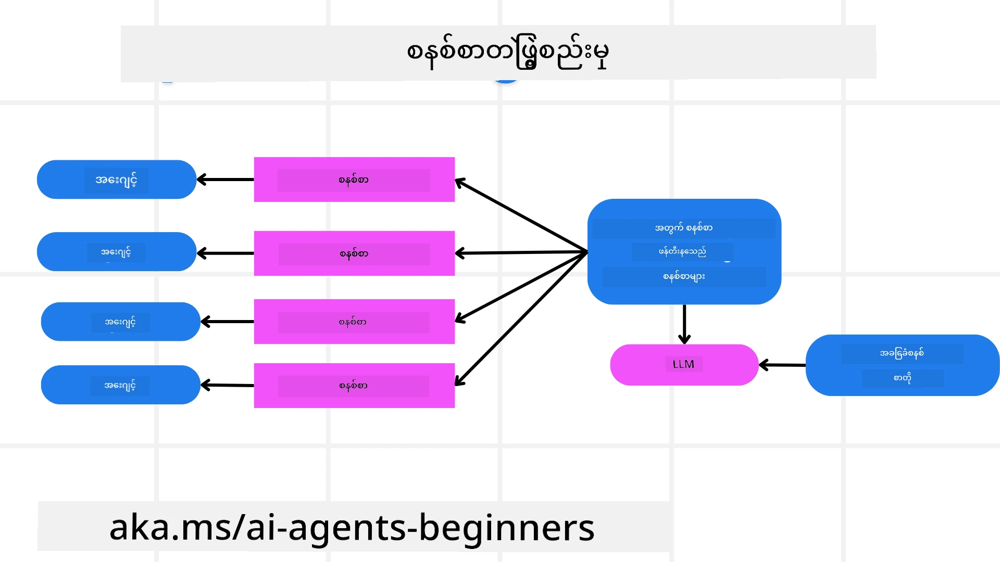
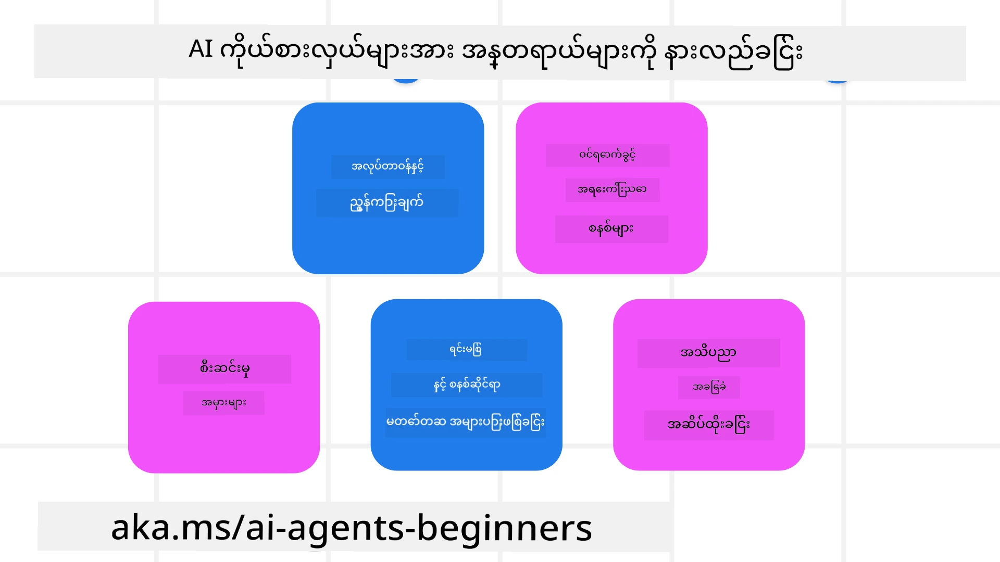
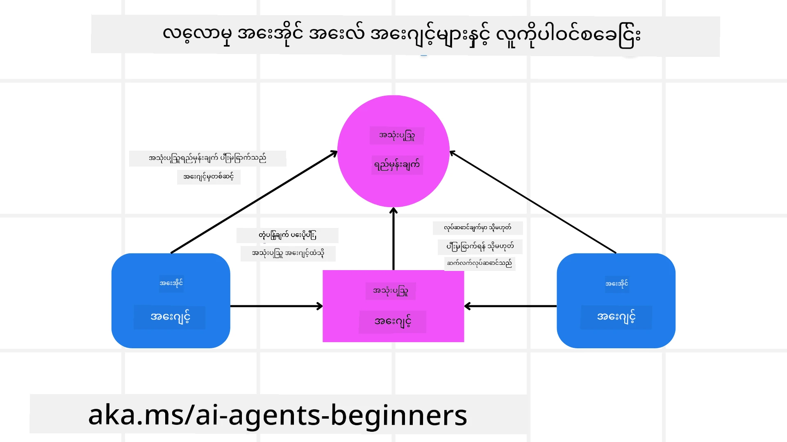

[](https://youtu.be/iZKkMEGBCUQ?si=Q-kEbcyHUMPoHp8L)

> _(ဒီသင်ခန်းစာရဲ့ ဗီဒီယိုကို ကြည့်ရန်အတွက်ပုံကို နှိပ်ပါ)_

# ယုံကြည်စိတ်ချရသော AI အေးဂျင့်များ တည်ဆောက်ခြင်း

## နိဒါန်း

ဒီသင်ခန်းစာမှာ များကိုဖော်ပြပါမည်။

- ဘေးကင်းလုံခြုံပြီး ထိရောက်သော AI အေးဂျင့်များကို ဘယ်လို တည်ဆောက်ပြီး ဖြန့်ချိရမလဲ
- AI အေးဂျင့် ဖန်တီးစဉ်တွင် အရေးကြီးသော လုံခြုံရေးဆိုင်ရာ အကြောင်းများ
- AI အေးဂျင့် ဖန်တီးစဉ်တွင် ဒေတာနှင့် အသုံးပြုသူ၏ ကိုယ်ရေးကိုယ်တာကို 어떻게 ထိန်းသိမ်းရမလဲ

## သင်ယူရမည့် ရည်မှန်းချက်များ

ဒီသင်ခန်းစာပြီးမြောက်မှုနောက်ပိုင်း သင်သည် သိရှိ ရမည့်အချက်များမှာ

- AI အေးဂျင့်များ ဖန်တီးရာတွင် ဖြစ်နိုင်ခြေရှိသည့် အန္တရာယ်များကို ကွယ်ကာရှောင်ရွှေ့နည်းများ
- ဒေတာနှင့် 접근ကို လုံခြုံစိတ်ချစွာ မျှဝေစီမံနိုင်ရန် လုံခြုံရေးကို အကောင်အထည်ဖော်နည်းများ
- ဒေတာကို ကိုယ်ရေးကိုယ်တာ ထိန်းသိမ်းပြီး အသုံးပြုသူအတွေ့အကြုံကို အရည်အသွေးမြှင့်စေသော AI အေးဂျင့်ဖန်တီးနည်း

## လုံခြုံမှု

ပထမဦးစွာ ဘေးကင်းလုံခြုံသော အေးဂျင့် အခြေခံ အက်ပလီကေးရှင်းများကို ကြည့်ရအောင်။ လုံခြုံမှုဆိုသည်မှာ AI အေးဂျင့်က ရည်ရွယ်ထားသည့် အတိုင်း လုပ်ဆောင်နိုင်ရမည်ဖြစ်သည်။ အေးဂျင့် အက်ပလီကေးရှင်းများ တည်ဆောက်သူများအနေဖြင့် လုံခြုံမှု အရှိဆုံးအောင် ပြုလုပ်နိုင်ရန် နည်းလမ်းနှင့် ကိရိယာများ ရှိသည်။

### စနစ်စာတိုက် ဖွဲ့စည်းခြင်း

သင်က အကြီးစား ဘာသာစကား မော်ဒယ်များ (LLMs) အသုံးပြု၍ AI အက်ပလီကေးရှင်း တစ်ခုတည်ဆောက်ဖူးစရာရှိပါက၊ မည်သည့်စနစ်ဖြစ်စေပေ မောင်းနှင်မှု ခိုင်မာသော စနစ် prompt သို့မဟုတ် စနစ်စာတိုက် ပြုလုပ်ခြင်း၏ အရေးပါမှုကို သိပြီးဖြစ်ပါကြောင်း သိရှိကြောင်း ဖြစ်သည်။ ၎င်း prompts များသည် LLM နှင့် အသုံးပြုသူ၊ ဒေတာတို့အကြား မည်သို့ လိုက်လျောညီထွေ ပြုမည်ကို ဥပဒေသတ်မှတ်ချက်များ၊ ညွှန်ကြားချက်များ၊ လမ်းညွှန်ချက်များကို သတ်မှတ်ပေးသည်။

AI အေးဂျင့်များအတွက် စနစ် prompt သည် ပိုမိုအရေးကြီးသည်။ အကြောင်းမှာ AI အေးဂျင့်များသည် ကျွန်ုပ်တို့သတ်မှတ်ထားသော တာဝန်များ ပြီးမြောက်စေရန် အထူးရှင်းလင်းသော ညွှန်ကြားချက်များ လိုအပ်မည် ဖြစ်သည်။

စနစ် prompt များကို အရွယ်တိုးပြုလုပ်နိုင်ရန်၊ ကျွန်ုပ်တို့၏ အက်ပလီကေးရှင်းအတွက် အေးဂျင့်တစ်သို့မဟုတ် အများကြီးတည်ဆောက်ရာ၌ စနစ်စာတိုက် ဖွဲ့စည်းမှုကို အသုံးပြုနိုင်ပါသည်။



#### အဆင့် ၁: Meta စနစ်စာတိုက် တည်ဆောက်ခြင်း

Meta prompt သည် LLM ကို အသုံးပြု၍ ကျွန်ုပ်တို့ဖန်တီးချင်သည့် အေးဂျင့်များအတွက် စနစ် prompt များ ဖန်တီးရန် အသုံးပြုမည်ဖြစ်သည်။ ကျွန်ုပ်တို့အနေဖြင့် တယောက်ထက်ပိုသော အေးဂျင့် များကို ထိရောက်စွာ ဖန်တီးနိုင်ရန် Template အဖြစ် ဒီဇိုင်း ဆွဲထားပါသည်။

ဤမှာ LLM သို့ ပေးပို့မည့် meta စနစ်စာတိုက်၏ ဥပမာဖြစ်ပါသည်။

```plaintext
You are an expert at creating AI agent assistants. 
You will be provided a company name, role, responsibilities and other
information that you will use to provide a system prompt for.
To create the system prompt, be descriptive as possible and provide a structure that a system using an LLM can better understand the role and responsibilities of the AI assistant. 
```

#### အဆင့် ၂: အခြေခံ prompt တစ်ခု ဖန်တီးခြင်း

နောက်တစ်ဆင့်မှာ AI အေးဂျင့်အကြောင်း ဖော်ပြရန် အခြေခံ prompt တစ်ခု ဖန်တီးရန်ဖြစ်သည်။ အေးဂျင့်၏ တာဝန်၊ အေးဂျင့်တတ်ပုံ တာဝန်၊ အခြားတာဝန်များ အစရှိသည်ကို ထည့်သွင်းဖော်ပြသင့်သည်။

ဤမှာ ဥပမာတစ်ခု ဖြစ်ပါသည်။

```plaintext
You are a travel agent for Contoso Travel that is great at booking flights for customers. To help customers you can perform the following tasks: lookup available flights, book flights, ask for preferences in seating and times for flights, cancel any previously booked flights and alert customers on any delays or cancellations of flights.  
```

#### အဆင့် ၃: အခြေခံ စနစ်စာတိုက်ကို LLM တွင် ထည့်သွင်းခြင်း

ယခု ကျွန်ုပ်တို့ meta စနစ်စာတိုက်နှင့် အခြေခံ စနစ်စာတိုက်ကို ပေးသည့် စနစ်စာတိုက် အသစ်တစ်ခုကို Optimize ပြုလုပ်နိုင်ပါပြီ။

၎င်းသည် ကျွန်ုပ်တို့၏ AI အေးဂျင့်များအတွက် လမ်းပြရာတွင် ပိုမိုကောင်းမွန်သော စနစ်စာတိုက်ကို ရရှိစေပါလိမ့်မယ်။

```markdown
**Company Name:** Contoso Travel  
**Role:** Travel Agent Assistant

**Objective:**  
You are an AI-powered travel agent assistant for Contoso Travel, specializing in booking flights and providing exceptional customer service. Your main goal is to assist customers in finding, booking, and managing their flights, all while ensuring that their preferences and needs are met efficiently.

**Key Responsibilities:**

1. **Flight Lookup:**
    
    - Assist customers in searching for available flights based on their specified destination, dates, and any other relevant preferences.
    - Provide a list of options, including flight times, airlines, layovers, and pricing.
2. **Flight Booking:**
    
    - Facilitate the booking of flights for customers, ensuring that all details are correctly entered into the system.
    - Confirm bookings and provide customers with their itinerary, including confirmation numbers and any other pertinent information.
3. **Customer Preference Inquiry:**
    
    - Actively ask customers for their preferences regarding seating (e.g., aisle, window, extra legroom) and preferred times for flights (e.g., morning, afternoon, evening).
    - Record these preferences for future reference and tailor suggestions accordingly.
4. **Flight Cancellation:**
    
    - Assist customers in canceling previously booked flights if needed, following company policies and procedures.
    - Notify customers of any necessary refunds or additional steps that may be required for cancellations.
5. **Flight Monitoring:**
    
    - Monitor the status of booked flights and alert customers in real-time about any delays, cancellations, or changes to their flight schedule.
    - Provide updates through preferred communication channels (e.g., email, SMS) as needed.

**Tone and Style:**

- Maintain a friendly, professional, and approachable demeanor in all interactions with customers.
- Ensure that all communication is clear, informative, and tailored to the customer's specific needs and inquiries.

**User Interaction Instructions:**

- Respond to customer queries promptly and accurately.
- Use a conversational style while ensuring professionalism.
- Prioritize customer satisfaction by being attentive, empathetic, and proactive in all assistance provided.

**Additional Notes:**

- Stay updated on any changes to airline policies, travel restrictions, and other relevant information that could impact flight bookings and customer experience.
- Use clear and concise language to explain options and processes, avoiding jargon where possible for better customer understanding.

This AI assistant is designed to streamline the flight booking process for customers of Contoso Travel, ensuring that all their travel needs are met efficiently and effectively.

```

#### အဆင့် ၄: ပြန်လည်စိစစ်ပြီး တိုးတက်အောင်လုပ်ခြင်း

ဒီ စနစ်စာတိုက် ဖွဲ့စည်းမှု၏ တန်ဖိုးမှာ အေးဂျင့် အများအတွက် စနစ်စာတိုက်တွေ ဖန်တီးရာ၌ အဆင်ပြေစေခြင်းနှင့် စနစ်စာတိုက်ကို အချိန်ကြာလေ့လာ ပြန်လည်ကောင်းမွန်အောင် ပြုလုပ်နိုင်ခြင်း ဖြစ်သည်။ သင့် အသုံးပြုမှု အပြည့်အစုံအတွက် ပထမဆုံးတယ်မှာ အသုံးပြုနိုင်စေသည့် စနစ်စာတိုက်ကို ရှာဖွေခြင်း၊ တိုးတက်မှုများကို သေးငယ်သော ပြင်ဆင်မှုဖြင့် စနစ်တကျ ကြည့်ရှု၍ အလျင်အမြန် လုပ်ဆောင်နိုင်သည့် အားသာချက်များ ရှိပါသည်။

## အန္တရာယ် အားနည်းချက်များ နားလည်ခြင်း

ယုံကြည်စိတ်ချရသော AI အေးဂျင့်ကို တည်ဆောက်ရန်အတွက် သင့် AI အေးဂျင့်ဆီသို့ ရောက်နိုင်သော အန္တရာယ်များနှင့် ခြိမ်းခြောက်မှုများကို နားလည်ပြီး ကာကွယ်ရမည်မှာ အရေးကြီးပါသည်။ AI အေးဂျင့်များအား ခြိမ်းခြောက်သော အန္တရာယ် အမျိုးမျိုးအနည်းငယ်ကို ကြည့်ရှုကြပါစို့၊ သင့်တော်သော စီမံချက်များနှင့် ပြင်ဆင်မှုများ လုပ်ဆောင်နည်းကောင်းများကို သင်ယူကြရအောင်။



### တာဝန် နှင့် ညွှန်ကြားချက်

**ဖော်ပြချက်:**  ပြင်ဆင်သူများသည် prompt များဖြင့် AI အေးဂျင့်၏ ညွှန်ကြားချက်များ သို့မဟုတ် ရည်မှန်းချက်များကို ပြောင်းလဲရန် ကြိုးပမ်းသည်။

**ကာကွယ်ခြင်း:** အန္တရာယ်ရှိစေနိုင်သော prompt များကို သုံးမတတ်မှီ စစ်တမ်းအတည်ပြုခြင်းနှင့် input စစ်ထုတ်ခြင်းများ ပြုလုပ်ပါ။ ၎င်းအမျိုးအစားများသည် AI အေးဂျင့်နှင့် အမြဲတမ်း ဆက်သွယ်မှုလိုအပ်သောကြောင့် စကားပြောဆက်ဆံမှု အကြိမ်ရေကို ကန့်သတ်ခြင်းဖြင့် ကာကွယ်နိုင်ပါသည်။

### အရေးကြီးသော စနစ်များ သို့ရောက်ကြည့်ခြင်း

**ဖော်ပြချက်:** AI အေးဂျင့်တွင် အရေးကြီးသော ဒေတာများ သိမ်းဆည်းသော စနစ်များနှင့် ဝန်ဆောင်မှုများကိုလည်း ဖြစ်ပါက ပြင်ဆင်သူများသည် အေးဂျင့်နှင့် ဤပြင်ဆင်မှုများအကြား ဆက်သွယ်မှုကို ခြိမ်းခြောက်နိုင်သည်။ တိုက်ရိုက်တိုက်ခိုက်မှု သို့မဟုတ် အေးဂျင့်မှတဆင့် စနစ်များအကြောင်း အချက်အလက် ရယူရန် ကြိုးပမ်းမှုများ ဖြစ်နိုင်သည်။

**ကာကွယ်ခြင်း:** AI အေးဂျင့်များသည် လိုအပ်သော စနစ်များသာ ပိုမို ရယူနိုင်စေရန် အကန့်အသတ်ထားသင့်သည်။ အေးဂျင့်နှင့် စနစ်များအကြား ဆက်သွယ်မှုသည်လည်း လုံခြုံစိတ်ချရစေရန် လိုအပ်ပါသည်။ အတည်ပြုခြင်းနှင့် 접근ထိန်းချုပ်မှု များအကောင်အထည်ဖော်ခြင်းကောင်းကာ ကာကွယ်နိုင်ပါသည်။

### အရင်းအမြစ်များ နှင့် ဝန်ဆောင်မှုများ အလေးပေးအသုံးပြုမှု

**ဖော်ပြချက်:** AI အေးဂျင့်များသည် တာဝန်များ ပြီးမြောက်ရန် ကိရိယာနှင့် ဝန်ဆောင်မှု အမျိုးမျိုးကို အသုံးပြုနိုင်သည်။ ပြင်ဆင်သူများသည် AI အေးဂျင့်အသုံးပြုပြီး ဝန်ဆောင်မှုများကို အမြောက်အမြား တောင်းဆို၍ အစနစ် မအောင်မြင်ခြင်း သို့မဟုတ် ကုန်ကျစရိတ် ကြီးစေရန် တိုက်ခိုက်နိုင်သည်။

**ကာကွယ်ခြင်း:** AI အေးဂျင့်မှ ဝန်ဆောင်မှုတစ်ခုသို့ တောင်းဆိုမှု အရေအတွက်ကို ကန့်သတ်ရန် မူဝါဒများ ဖန်တီးပါ။ စကားဝိုင်းသုံးစွဲခွင့်နှင့် တောင်းဆိုမှု အရေအတွက်ကို ကန့်သတ်ခြင်းက အသုံးပြုမှုမျိုးများကို ကာကွယ်နိုင်သည်။

### အသိပညာအခြေခံ စွန့်ပစ်ခြင်း

**ဖော်ပြချက်:** ဒီအမျိုးအစားတိုက်ခိုက်မှုသည် AI အေးဂျင့်ကို တိုက်ခိုက်ခြင်း မဟုတ်ပဲ AI အေးဂျင့်အသုံးပြုမည့် အသိပညာအခြေခံ နှင့် အခြားဝန်ဆောင်မှုများကို ပိုက်ဆံများခြင်းဖြစ်သည်။ ဒါကြောင့် ဒေတာကို လိမ်လည်ရေးရာတွင် အချက်အလက်များဖျက်ဆီးခြင်း သို့မဟုတ် ပြောင်းလဲခြင်း ဖြစ်နိုင်ပြီး အသုံးပြုသူကို မမှန်ကန်သော မဟုတ်လိုသော အဖြေများပေးနိုင်သည်။

**ကာကွယ်ခြင်း:** AI အေးဂျင့်သည် သုံးသည့် ဒေတာကို အချိန်အားလုံး စစ်ဆေးပါ။ ဒေတာへのアクセス်ကို လုံခြုံစိတ်ချရစေရန် နှင့် ယုံကြည်စိတ်ချရသူများမှသာ ပြင်ဆင်နိုင်စေရန် အကောင်အထည်ဖော်ပါ။

### ကြိုးပမ်းမှု အမှားများ ပေါ်လာခြင်း

**ဖော်ပြချက်:** AI အေးဂျင့်သည် တာဝန်များ ပြီးမြောက်ရန် ကိရိယာနှင့် ဝန်ဆောင်မှုများ အသုံးပြုကြောင်း၊ ပြင်ဆင်သူများ၏ အမှားများကြောင့် AI အေးဂျင့် ရေပန်းစားသော စနစ်များ ဖြတ်သန်းသော အမှားများ ဖြစ်ပေါ်ပြီး အဓိကစနစ်များ ဆုံးရှုံးသွားနိုင်ပြီး ပြဿနာတက်သွားသည်။

**ကာကွယ်ခြင်း:** AI အေးဂျင့်ကို ကြိုးကာကွယ်ရန် အကန့်အသတ်ရှိသော ပတ်ဝန်းကျင် (ဥပမာ Docker container) တွင်တည်ဆောက်ကာ တိုက်ရိုက်စနစ်တိုက်ခိုက်မှု မဖြစ်စေတာဖြစ်သည်။ အမှားဖြစ်သည့် အချိန်များတွင် ပြန်လည်မြှုပ်နှံတားဆီးခြင်း နှင့် ထပ်မံကြိုးစားမည့် လုပ်ထုံးလုပ်နည်းများ ဖန်တီးထားသင့်သည်။

## လူနဲ့ ပတ်သက်သော လုပ်ငန်းစဉ်

ယုံကြည်စိတ်ချရသော AI အေးဂျင့် စနစ်များ တည်ဆောက်ရာတွင် လူ/အတန်းအဖြစ် ပါဝင်စေရန် နည်းလမ်းတစ်ခုဖြစ်သည်။ ၎င်းနည်းလမ်းသည် အသုံးပြုသူများကို အေးဂျင့်များထဲတွင် တည်ဆောက်ထားသော အမျိုးမျိုးသော အေးဂျင့်များအဖြစ်  Feedback ပေးနိုင်ရန် ဖြစ်သည့်အစီအစဉ် တစ်ခုကို ဖန်တီးပေးသည်။



Microsoft Agent Framework ကို အသုံးပြု၍ ဒီအယူအဆကို ဘယ်လို အကောင်အထည်ဖော်ထားသလဲ ဆိုတာပြသကုန်သည့် ကုဒ် ဇယားဖြစ်ပါသည်။

```python
import os
from agent_framework.foundry import FoundryChatClient
from azure.identity import AzureCliCredential

# လူတစ်ဦး၏အတည်ပြုမှုဖြင့် provider ကိုဖန်တီးပါ
provider = FoundryChatClient(
    project_endpoint=os.environ["AZURE_AI_PROJECT_ENDPOINT"],
    model=os.environ["AZURE_AI_MODEL_DEPLOYMENT_NAME"],
    credential=AzureCliCredential(),
)

# လူတစ်ဦး၏အတည်ပြုမှုအဆင့်ဖြင့် agent ကိုဖန်တီးပါ
response = provider.create_response(
    input="Write a 4-line poem about the ocean.",
    instructions="You are a helpful assistant. Ask for user approval before finalizing.",
)

# အသုံးပြုသူသည် တုံ့ပြန်ချက်ကို ပြန်လည်သုံးသပ်ပြီး အတည်ပြုနိုင်သည်
print(response.output_text)
user_input = input("Do you approve? (APPROVE/REJECT): ")
if user_input == "APPROVE":
    print("Response approved.")
else:
    print("Response rejected. Revising...")
```

## နိဂုံး

ယုံကြည်စိတ်ချရသော AI အေးဂျင့် ဖန်တီးရန်မှာ သေချာသော ဒီဇိုင်းရေးဆွဲခြင်း၊ ခိုင်မာသော လုံခြုံရေး ကာကွယ်မှုများနှင့် တစ်ဆက်တိုက် ပြောင်းလဲတိုးတက်မှုများ လိုအပ်သည်။ စနစ် prompt များကို ဖွဲ့စည်းတည်ဆောက်ရန်၊ ဖြစ်နိုင်သော ခြိမ်းခြောက်မှုများနားလည်ရန်၊ ကာကွယ်နိုင်ရေး မဟာဗျူဟာများ အကောင်အထည်ဖော်ရန်ဖြင့် တိုးတက်တဲ့ AI အေးဂျင့်များ ဖန်တီးနိုင်ပါသည်။ ထို့အပြင် လူနည်းပဲ ပါဝင်သော နည်းလမ်းဖြင့် အသုံးပြုသူလိုအပ်ချက်များနှင့် ကိုက်ညီစေပြီး ဖောက်ပြန်မှုများကို လျော့နည်းစေသည်။ AI နည်းပညာတိုးတက်လိုက်သည့်အတိုင်း လုံခြုံမှု၊ ကိုယ်ရေးကိုယ်တာ ကာကွယ်မှုများနဲ့ တရားဥပဒေဖြစ်စဉ်များ အပေါ် သံယောဇဉ်ရှိ၍ ယုံကြည်စိတ်ချရခြင်းနှင့် ယုံကြည်မှုရှိသည့် AI စနစ်များ ဖော်ဆောင်ရန် အရေးကြီးသေးသည်။

## ကုဒ် နမူနာများ

- [`code_samples/06-system-message-framework.ipynb`](code_samples/06-system-message-framework.ipynb): meta-prompt system-message framework ကို ခြေလှမ်းလိုက် ပြသချက်။
- [`code_samples/06-human-in-the-loop.ipynb`](code_samples/06-human-in-the-loop.ipynb): မှန်ကန်မှု ကြိုတင်ခွင့်ပြုခြင်း၊ အန္တရာယ် အဆင့်သတ်မှတ်ခြင်းနှင့် မှတ်တမ်းတင်ခြင်းနှင့် ယုံကြည်စိတ်ချရသော အေးဂျင့်များအတွက်။

### ယုံကြည်စိတ်ချရသော AI အေးဂျင့်များ တည်ဆောက်ခြင်းအတွက် ထပ်မံမေးမြန်းလိုပါသလား?

[Microsoft Foundry Discord](https://discord.com/invite/ATgtXmAS5D) တွင် ပူးပေါင်းဆွေးနွေးဖို့၊ အချိန်ညှိ ဆွေးနွေးပွဲများနှင့် AI အေးဂျင့် မေးခွန်းများ ပြန်လည်ဖြေရှင်းနိုင်ပါသည်။

## ထပ်ဆောင်း အရင်းအမြစ်များ

- <a href="https://learn.microsoft.com/azure/ai-studio/responsible-use-of-ai-overview" target="_blank">တာဝန်ရှိ AI အကျဉ်းချုပ်</a>
- <a href="https://learn.microsoft.com/azure/ai-studio/concepts/evaluation-approach-gen-ai" target="_blank">လူကြီးမင်းသော AI မော်ဒယ်များနှင့် AI အက်ပလီကေးရှင်းများကို တန်ဖိုးသတ်မှတ်ခြင်း</a>
- <a href="https://learn.microsoft.com/azure/ai-services/openai/concepts/system-message?context=%2Fazure%2Fai-studio%2Fcontext%2Fcontext&tabs=top-techniques" target="_blank">လုံခြုံရေးစနစ်စာတိုက်များ</a>
- <a href="https://blogs.microsoft.com/wp-content/uploads/prod/sites/5/2022/06/Microsoft-RAI-Impact-Assessment-Template.pdf?culture=en-us&country=us" target="_blank">အန္တရာယ်သုံးသပ်မှု အစီအစဉ်</a>

## ယခင် သင်ခန်းစာ

[Agentic RAG](../05-agentic-rag/README.md)

## နောက်တစ်ဆင့် သင်ခန်းစာ

[Planning Design Pattern](../07-planning-design/README.md)

---

<!-- CO-OP TRANSLATOR DISCLAIMER START -->
**ပြောကြားချက်**
ဤစာတမ်းကို AI ဘာသာပြန်ဝန်ဆောင်မှု [Co-op Translator](https://github.com/Azure/co-op-translator) အသုံးပြု၍ ဘာသာပြန်ထားပါသည်။ ကျွန်ုပ်တို့သည် တိကျမှန်ကန်မှုအတွက် ကြိုးပမ်းနေသော်လည်း၊ စက်ကိရိယာဘာသာပြန်ခြင်းများတွင် အမှားများ သို့မဟုတ် မှားယွင်းချက်များ ပါဝင်နိုင်ကြောင်း သတိပြုပါရန် လိုအပ်ပါသည်။ မူလစာတမ်းကို မူရင်းဘာသာဖြင့်သာ ယုံကြည်စိတ်ချရသော အချက်အလက်အဖြစ် သတ်မှတ်သင့်သည်။ အရေးကြီးသည့် သတင်းအချက်အလက်များအတွက် ပရော်ဖက်ရှင်နယ် လူသားဘာသာပြန်သူဝန်ဆောင်မှုကို အကြံပြုပါသည်။ ဤဘာသာပြန်ချက်ကို အသုံးပြုခြင်းမှ ဖြစ်ပေါ်လာသော နားလည်မှုကွာခြားမှုများ သို့မဟုတ် မမှန်ကန်သော အသုံးပြုမှုများအတွက် ကျွန်ုပ်တို့ တာဝန်မခံပါ။
<!-- CO-OP TRANSLATOR DISCLAIMER END -->