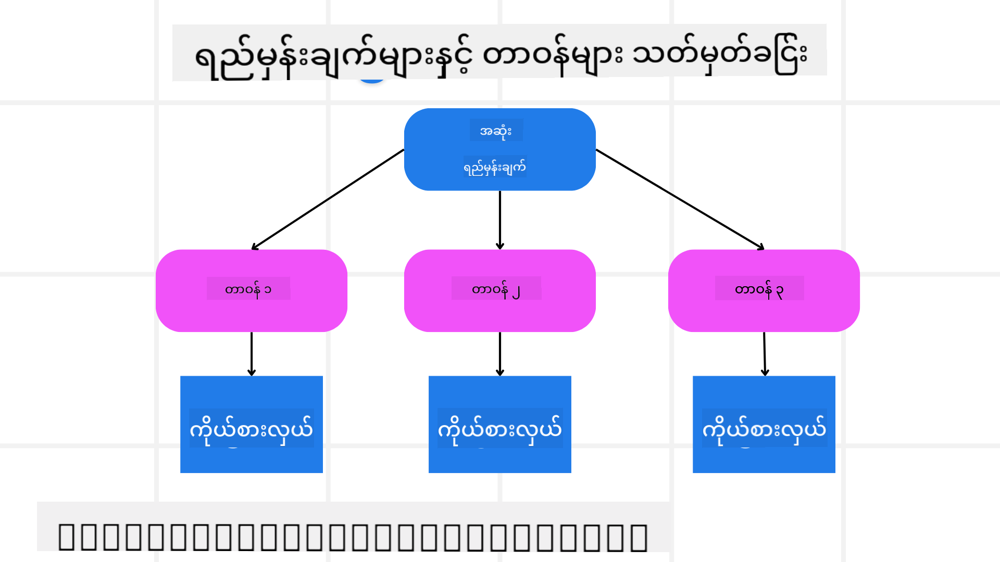

<!--
CO_OP_TRANSLATOR_METADATA:
{
  "original_hash": "a28d30590704ea13b6a08d4793cf9c2b",
  "translation_date": "2025-08-30T09:41:44+00:00",
  "source_file": "07-planning-design/README.md",
  "language_code": "my"
}
-->
[](https://youtu.be/kPfJ2BrBCMY?si=9pYpPXp0sSbK91Dr)

> _(အပေါ်ရှိပုံကိုနှိပ်ပြီး ဒီသင်ခန်းစာရဲ့ ဗီဒီယိုကို ကြည့်ပါ)_

# အစီအစဉ်ရေးဆွဲမှု ဒီဇိုင်း

## မိတ်ဆက်

ဒီသင်ခန်းစာမှာ အောက်ပါအကြောင်းအရာများကို လေ့လာပါမည်-

* ရှင်းလင်းသော အထွေထွေရည်မှန်းချက်ကို သတ်မှတ်ပြီး ရှုပ်ထွေးသောအလုပ်ကို စီမံနိုင်သောအလုပ်များအဖြစ် ခွဲခြားခြင်း။
* ယုံကြည်စိတ်ချရပြီး စက်များဖတ်ရှုနိုင်သော အဖြေများရရှိရန် ဖွဲ့စည်းထားသော output ကို အသုံးချခြင်း။
* အ动态အလုပ်များနှင့် မမျှော်လင့်ထားသော input များကို ကိုင်တွယ်ရန် အဖြစ်အပျက်အခြေခံနည်းလမ်းကို အသုံးပြုခြင်း။

## သင်ယူရမည့် ရည်မှန်းချက်များ

ဒီသင်ခန်းစာကို ပြီးမြောက်ပြီးနောက်မှာ သင်သည် အောက်ပါအရာများကို နားလည်ထားမည်ဖြစ်သည်-

* AI agent အတွက် အထွေထွေရည်မှန်းချက်ကို သတ်မှတ်ပြီး ဘာကို ရောက်ရှိရမည်ဆိုတာ ရှင်းလင်းစွာ သိရှိထားရန်။
* ရှုပ်ထွေးသောအလုပ်ကို စီမံနိုင်သော subtask များအဖြစ် ခွဲခြားပြီး အဆင့်လိုက် အစီအစဉ်တစ်ခုအဖြစ် စီမံခြင်း။
* agent များကို search tools သို့မဟုတ် data analytics tools ကဲ့သို့သော သင့်တော်သော tools များဖြင့် ပြင်ဆင်ပေးပြီး အချိန်နှင့် နည်းလမ်းကို ဆုံးဖြတ်ခြင်း၊ မမျှော်လင့်ထားသော အခြေအနေများကို ကိုင်တွယ်ခြင်း။
* Subtask ရလဒ်များကို အကဲဖြတ်ခြင်း၊ လုပ်ဆောင်မှုကို တိုးတက်စေရန် အဆင့်ဆင့် ပြင်ဆင်ခြင်း။

## ရည်မှန်းချက်သတ်မှတ်ခြင်းနှင့် အလုပ်ခွဲခြင်း



အများစုသော အမှန်တကယ်လုပ်ငန်းများသည် တစ်ဆင့်တည်းဖြင့် ဖြေရှင်းရန် အလွန်ရှုပ်ထွေးနေတတ်သည်။ AI agent တစ်ခုသည် ၎င်း၏ အစီအစဉ်ရေးဆွဲမှုနှင့် လုပ်ဆောင်မှုများကို လမ်းညွှန်ရန် ရှင်းလင်းသော ရည်မှန်းချက်တစ်ခုလိုအပ်သည်။ ဥပမာအားဖြင့် ရည်မှန်းချက်မှာ-

    "၃ ရက်ခရီးစဉ် အစီအစဉ်တစ်ခုကို ဖန်တီးပါ။"

ရည်မှန်းချက်ကို ရှင်းလင်းစွာ ဖော်ပြနိုင်သော်လည်း ၎င်းကို ထပ်မံ ပြင်ဆင်ရန် လိုအပ်သည်။ ရည်မှန်းချက်ကို ပိုမိုရှင်းလင်းစွာ ဖော်ပြနိုင်လျှင် agent (နှင့် လူသားပူးပေါင်းလုပ်ကိုင်သူများ) သည် flight options, hotel recommendations, နှင့် activity suggestions ပါဝင်သော comprehensive itinerary တစ်ခု ဖန်တီးရန် အာရုံစိုက်နိုင်မည်ဖြစ်သည်။

### အလုပ်ခွဲခြင်း

ကြီးမားသော သို့မဟုတ် ရှုပ်ထွေးသောအလုပ်များကို သေးငယ်သော ရည်မှန်းချက်အခြေခံ subtask များအဖြစ် ခွဲခြားခြင်းဖြင့် ပိုမိုစီမံနိုင်စေသည်။
ခရီးစဉ်အစီအစဉ် ဥပမာအတွက် ရည်မှန်းချက်ကို အောက်ပါအတိုင်း ခွဲခြားနိုင်သည်-

* Flight Booking
* Hotel Booking
* Car Rental
* Personalization

Subtask တစ်ခုစီကို အထူးပြု agent များ သို့မဟုတ် လုပ်ငန်းစဉ်များဖြင့် ကိုင်တွယ်နိုင်သည်။ Agent တစ်ခုသည် အကောင်းဆုံး flight deal များကို ရှာဖွေခြင်းအတွက် အထူးပြုထားနိုင်ပြီး၊ တစ်ခုသည် hotel booking များအတွက် အာရုံစိုက်ထားနိုင်သည်။ “downstream” agent သို့မဟုတ် စီမံခန့်ခွဲသူတစ်ဦးသည် ၎င်းတို့ရလဒ်များကို စုပေါင်းပြီး အဆုံးသုံးစွဲသူအတွက် တစ်ခုတည်းသော itinerary အဖြစ် ဖော်ပြနိုင်သည်။

ဒီ modular နည်းလမ်းသည် တိုးတက်မှုများကို အဆင့်ဆင့် ပြုလုပ်နိုင်စေသည်။ ဥပမာအားဖြင့် Food Recommendations သို့မဟုတ် Local Activity Suggestions အတွက် အထူးပြု agent များကို ထည့်သွင်းပြီး itinerary ကို အချိန်ကြာလာသည်နှင့်အမျှ ပိုမိုပြည့်စုံစေနိုင်သည်။

### ဖွဲ့စည်းထားသော output

Large Language Models (LLMs) သည် structured output (ဥပမာ JSON) ကို ဖန်တီးနိုင်ပြီး ၎င်းသည် downstream agent များ သို့မဟုတ် service များအတွက် parse နှင့် process လုပ်ရန် ပိုမိုလွယ်ကူစေသည်။ ၎င်းသည် multi-agent context တွင် အထူးအသုံးဝင်ပြီး planning output ရရှိပြီးနောက် အလုပ်များကို လုပ်ဆောင်နိုင်သည်။ 

အမြန်လမ်းညွှန်အတွက် ```python
from pydantic import BaseModel
from enum import Enum
from typing import List, Optional, Union
import json
import os
from typing import Optional
from pprint import pprint
from autogen_core.models import UserMessage, SystemMessage, AssistantMessage
from autogen_ext.models.azure import AzureAIChatCompletionClient
from azure.core.credentials import AzureKeyCredential

class AgentEnum(str, Enum):
    FlightBooking = "flight_booking"
    HotelBooking = "hotel_booking"
    CarRental = "car_rental"
    ActivitiesBooking = "activities_booking"
    DestinationInfo = "destination_info"
    DefaultAgent = "default_agent"
    GroupChatManager = "group_chat_manager"

# Travel SubTask Model
class TravelSubTask(BaseModel):
    task_details: str
    assigned_agent: AgentEnum  # we want to assign the task to the agent

class TravelPlan(BaseModel):
    main_task: str
    subtasks: List[TravelSubTask]
    is_greeting: bool

client = AzureAIChatCompletionClient(
    model="gpt-4o-mini",
    endpoint="https://models.inference.ai.azure.com",
    # To authenticate with the model you will need to generate a personal access token (PAT) in your GitHub settings.
    # Create your PAT token by following instructions here: https://docs.github.com/en/authentication/keeping-your-account-and-data-secure/managing-your-personal-access-tokens
    credential=AzureKeyCredential(os.environ["GITHUB_TOKEN"]),
    model_info={
        "json_output": False,
        "function_calling": True,
        "vision": True,
        "family": "unknown",
    },
)

# Define the user message
messages = [
    SystemMessage(content="""You are an planner agent.
    Your job is to decide which agents to run based on the user's request.
                      Provide your response in JSON format with the following structure:
{'main_task': 'Plan a family trip from Singapore to Melbourne.',
 'subtasks': [{'assigned_agent': 'flight_booking',
               'task_details': 'Book round-trip flights from Singapore to '
                               'Melbourne.'}
    Below are the available agents specialised in different tasks:
    - FlightBooking: For booking flights and providing flight information
    - HotelBooking: For booking hotels and providing hotel information
    - CarRental: For booking cars and providing car rental information
    - ActivitiesBooking: For booking activities and providing activity information
    - DestinationInfo: For providing information about destinations
    - DefaultAgent: For handling general requests""", source="system"),
    UserMessage(
        content="Create a travel plan for a family of 2 kids from Singapore to Melboune", source="user"),
]

response = await client.create(messages=messages, extra_create_args={"response_format": 'json_object'})

response_content: Optional[str] = response.content if isinstance(
    response.content, str) else None
if response_content is None:
    raise ValueError("Response content is not a valid JSON string" )

pprint(json.loads(response_content))

# # Ensure the response content is a valid JSON string before loading it
# response_content: Optional[str] = response.content if isinstance(
#     response.content, str) else None
# if response_content is None:
#     raise ValueError("Response content is not a valid JSON string")

# # Print the response content after loading it as JSON
# pprint(json.loads(response_content))

# Validate the response content with the MathReasoning model
# TravelPlan.model_validate(json.loads(response_content))
``` ကို ကြည့်ပါ။

### Multi-Agent Orchestration ဖြင့် Planning Agent

ဒီဥပမာမှာ Semantic Router Agent တစ်ခုသည် အသုံးပြုသူရဲ့ တောင်းဆိုမှု (ဥပမာ "ကျွန်တော်ရဲ့ ခရီးစဉ်အတွက် hotel plan တစ်ခုလိုအပ်ပါတယ်။") ကို လက်ခံရရှိသည်။

Planner သည်-

* Hotel Plan ကို လက်ခံခြင်း- Planner သည် အသုံးပြုသူရဲ့ message ကို လက်ခံပြီး system prompt (ရရှိနိုင်သော agent အချက်အလက်များပါဝင်သည်) အပေါ်အခြေခံပြီး structured travel plan တစ်ခုကို ဖန်တီးသည်။
* Agent များနှင့် ၎င်းတို့ရဲ့ Tools ကို စာရင်းပြုစုခြင်း- Agent registry တွင် agent များ (ဥပမာ flight, hotel, car rental, နှင့် activities အတွက်) နှင့် ၎င်းတို့ရဲ့ functions/tools များကို စာရင်းပြုစုထားသည်။
* Plan ကို သက်ဆိုင်ရာ Agent များထံ ပို့ခြင်း- Subtask များရဲ့ အရေအတွက်ပေါ်မူတည်ပြီး Planner သည် message ကို တစ်ခုတည်းသော task အတွက် အထူးပြု agent ထံ တိုက်ရိုက်ပို့ခြင်း သို့မဟုတ် multi-agent collaboration အတွက် group chat manager မှတစ်ဆင့် စီမံခန့်ခွဲခြင်း။
* ရလဒ်ကို အကျဉ်းချုပ်ခြင်း- Planner သည် ဖန်တီးထားသော plan ကို ရှင်းလင်းစွာ အကျဉ်းချုပ်ပေးသည်။

အောက်ပါ Python code sample သည် ဒီအဆင့်များကို ဖော်ပြထားသည်-

```python

from pydantic import BaseModel

from enum import Enum
from typing import List, Optional, Union

class AgentEnum(str, Enum):
    FlightBooking = "flight_booking"
    HotelBooking = "hotel_booking"
    CarRental = "car_rental"
    ActivitiesBooking = "activities_booking"
    DestinationInfo = "destination_info"
    DefaultAgent = "default_agent"
    GroupChatManager = "group_chat_manager"

# Travel SubTask Model

class TravelSubTask(BaseModel):
    task_details: str
    assigned_agent: AgentEnum # we want to assign the task to the agent

class TravelPlan(BaseModel):
    main_task: str
    subtasks: List[TravelSubTask]
    is_greeting: bool
import json
import os
from typing import Optional

from autogen_core.models import UserMessage, SystemMessage, AssistantMessage
from autogen_ext.models.openai import AzureOpenAIChatCompletionClient

# Create the client with type-checked environment variables

client = AzureOpenAIChatCompletionClient(
    azure_deployment=os.getenv("AZURE_OPENAI_DEPLOYMENT_NAME"),
    model=os.getenv("AZURE_OPENAI_DEPLOYMENT_NAME"),
    api_version=os.getenv("AZURE_OPENAI_API_VERSION"),
    azure_endpoint=os.getenv("AZURE_OPENAI_ENDPOINT"),
    api_key=os.getenv("AZURE_OPENAI_API_KEY"),
)

from pprint import pprint

# Define the user message

messages = [
    SystemMessage(content="""You are an planner agent.
    Your job is to decide which agents to run based on the user's request.
    Below are the available agents specialized in different tasks:
    - FlightBooking: For booking flights and providing flight information
    - HotelBooking: For booking hotels and providing hotel information
    - CarRental: For booking cars and providing car rental information
    - ActivitiesBooking: For booking activities and providing activity information
    - DestinationInfo: For providing information about destinations
    - DefaultAgent: For handling general requests""", source="system"),
    UserMessage(content="Create a travel plan for a family of 2 kids from Singapore to Melbourne", source="user"),
]

response = await client.create(messages=messages, extra_create_args={"response_format": TravelPlan})

# Ensure the response content is a valid JSON string before loading it

response_content: Optional[str] = response.content if isinstance(response.content, str) else None
if response_content is None:
    raise ValueError("Response content is not a valid JSON string")

# Print the response content after loading it as JSON

pprint(json.loads(response_content))
```

အထက်ပါ code ရဲ့ output ကို ```json
{
    "is_greeting": "False",
    "main_task": "Plan a family trip from Singapore to Melbourne.",
    "subtasks": [
        {
            "assigned_agent": "flight_booking",
            "task_details": "Book round-trip flights from Singapore to Melbourne."
        },
        {
            "assigned_agent": "hotel_booking",
            "task_details": "Find family-friendly hotels in Melbourne."
        },
        {
            "assigned_agent": "car_rental",
            "task_details": "Arrange a car rental suitable for a family of four in Melbourne."
        },
        {
            "assigned_agent": "activities_booking",
            "task_details": "List family-friendly activities in Melbourne."
        },
        {
            "assigned_agent": "destination_info",
            "task_details": "Provide information about Melbourne as a travel destination."
        }
    ]
}
``` မှာ ကြည့်နိုင်ပြီး structured output ကို `assigned_agent` ထံ ပို့ပြီး travel plan ကို အဆုံးသုံးစွဲသူအတွက် အကျဉ်းချုပ်နိုင်သည်။

ဒီ code sample ရဲ့ notebook ကို [ဒီမှာ](07-autogen.ipynb) ရရှိနိုင်ပါသည်။

### Iterative Planning

အချို့သောအလုပ်များသည် အဆင့်ဆင့် ပြန်လည်စဉ်းစားခြင်း သို့မဟုတ် re-planning လိုအပ်ပြီး subtask တစ်ခုရဲ့ ရလဒ်သည် နောက်တစ်ခုကို သက်ရောက်စေသည်။ ဥပမာအားဖြင့် agent တစ်ခုသည် flight booking လုပ်စဉ်မှာ မမျှော်လင့်ထားသော data format ကို ရှာဖွေတွေ့ရှိခဲ့လျှင်၊ hotel booking မလုပ်မီ ၎င်းရဲ့ strategy ကို ပြောင်းလဲရန် လိုအပ်နိုင်သည်။

ထို့အပြင် အသုံးပြုသူ feedback (ဥပမာ လူသားတစ်ဦးက နောက်ကျသော flight ကို မရွေးချယ်လိုကြောင်း ဆုံးဖြတ်ခြင်း) သည် partial re-plan ကို ဖြစ်ပေါ်စေနိုင်သည်။ ဒီ dynamic, iterative နည်းလမ်းသည် အဆုံးသတ်ဖြေရှင်းချက်သည် အမှန်တကယ်အခြေအနေများနှင့် အသုံးပြုသူရဲ့ အဆင့်ဆင့်လိုအပ်ချက်များနှင့် ကိုက်ညီစေရန် သေချာစေသည်။

ဥပမာ code:

```python
from autogen_core.models import UserMessage, SystemMessage, AssistantMessage
#.. same as previous code and pass on the user history, current plan
messages = [
    SystemMessage(content="""You are a planner agent to optimize the
    Your job is to decide which agents to run based on the user's request.
    Below are the available agents specialized in different tasks:
    - FlightBooking: For booking flights and providing flight information
    - HotelBooking: For booking hotels and providing hotel information
    - CarRental: For booking cars and providing car rental information
    - ActivitiesBooking: For booking activities and providing activity information
    - DestinationInfo: For providing information about destinations
    - DefaultAgent: For handling general requests""", source="system"),
    UserMessage(content="Create a travel plan for a family of 2 kids from Singapore to Melbourne", source="user"),
    AssistantMessage(content=f"Previous travel plan - {TravelPlan}", source="assistant")
]
# .. re-plan and send the tasks to respective agents
```

ရှုပ်ထွေးသောအလုပ်များကို ဖြေရှင်းရန် ပိုမိုကျယ်ကျယ်ပြန့်ပြန့်သော planning အတွက် Magnetic One ကို ကြည့်ပါ။

## အကျဉ်းချုပ်

ဒီဆောင်းပါးမှာ သတ်မှတ်ထားသော agent များကို dynamically ရွေးချယ်နိုင်သော planner တစ်ခုကို ဖန်တီးနည်းကို ကြည့်ရှုခဲ့ပါသည်။ Planner ရဲ့ output သည် အလုပ်များကို ခွဲခြားပြီး agent များကို assign လုပ်ပေးပြီး ၎င်းတို့ကို လုပ်ဆောင်နိုင်စေသည်။ Agent များသည် အလုပ်ကို လုပ်ဆောင်ရန် လိုအပ်သော functions/tools များကို access ရှိသည်ဟု ယူဆထားသည်။ Agent များအပြင် reflection, summarizer, နှင့် round robin chat ကဲ့သို့သော pattern များကို ထည့်သွင်းပြီး ပိုမို customize လုပ်နိုင်သည်။

## ထပ်ဆောင်းအရင်းအမြစ်များ

* AutoGen Magnetic One - ရှုပ်ထွေးသောအလုပ်များကို ဖြေရှင်းရန် Generalist multi-agent system တစ်ခုဖြစ်ပြီး agentic benchmarks အမျိုးမျိုးတွင် ထူးချွန်သောရလဒ်များရရှိထားသည်။ Reference:

ဒီ implementation မှာ orchestrator သည် task-specific plan ကို ဖန်တီးပြီး ဒီ tasks များကို ရရှိနိုင်သော agent များထံ ပေးအပ်သည်။ Planning အပြင် orchestrator သည် task ရဲ့ တိုးတက်မှုကို စောင့်ကြည့်ပြီး လိုအပ်သလို ပြန်လည်စီမံခြင်းကို လုပ်ဆောင်သည်။

### Planning Design Pattern အကြောင်း ပိုမိုမေးမြန်းလိုပါသလား?

[Azure AI Foundry Discord](https://aka.ms/ai-agents/discord) ကို ဝင်ရောက်ပြီး အခြားသော သင်ယူသူများနှင့် တွေ့ဆုံပါ၊ office hours တွင် ပါဝင်ပါ၊ AI Agents အကြောင်း မေးမြန်းပါ။

## ယခင်သင်ခန်းစာ

[ယုံကြည်စိတ်ချရသော AI Agents ဖန်တီးခြင်း](../06-building-trustworthy-agents/README.md)

## နောက်သင်ခန်းစာ

[Multi-Agent Design Pattern](../08-multi-agent/README.md)

---

**အကြောင်းကြားချက်**:  
ဤစာရွက်စာတမ်းကို AI ဘာသာပြန်ဝန်ဆောင်မှု [Co-op Translator](https://github.com/Azure/co-op-translator) ကို အသုံးပြု၍ ဘာသာပြန်ထားပါသည်။ ကျွန်ုပ်တို့သည် တိကျမှုအတွက် ကြိုးစားနေသော်လည်း၊ အလိုအလျောက် ဘာသာပြန်မှုများတွင် အမှားများ သို့မဟုတ် မတိကျမှုများ ပါရှိနိုင်သည်ကို သတိပြုပါ။ မူရင်းဘာသာစကားဖြင့် ရေးသားထားသော စာရွက်စာတမ်းကို အာဏာတရ အရင်းအမြစ်အဖြစ် ရှုလေ့လာသင့်ပါသည်။ အရေးကြီးသော အချက်အလက်များအတွက် လူ့ဘာသာပြန်ပညာရှင်များမှ ပရော်ဖက်ရှင်နယ် ဘာသာပြန်မှုကို အကြံပြုပါသည်။ ဤဘာသာပြန်မှုကို အသုံးပြုခြင်းမှ ဖြစ်ပေါ်လာသော အလွဲအလွဲအချော်အချော်များ သို့မဟုတ် အနားလွဲမှုများအတွက် ကျွန်ုပ်တို့သည် တာဝန်မယူပါ။