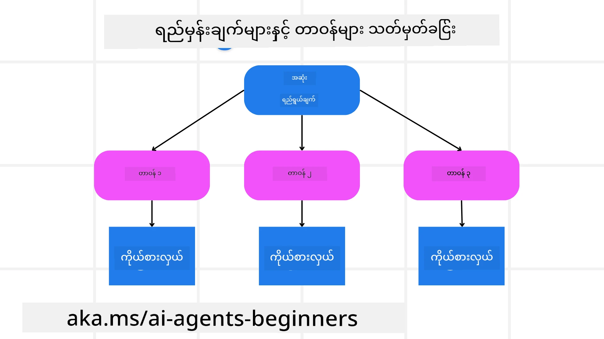

[](https://youtu.be/kPfJ2BrBCMY?si=9pYpPXp0sSbK91Dr)

> _(ဤ သင်ခန်းစာ၏ ဗီဒီယိုကို ကြည့်ရန် အထက်ပါ ပုံကို နှိပ်ပါ)_

# ပြင်ဆင်ခြင်း ဒီဇိုင်း

## မိတ်ဆက်

ဤသင်ခန်းစာတွင် ပါဝင်သောအကြောင်းအရာများမှာ

* ရှင်းလင်းသော စုပေါင်းရည်မှန်းချက်တစ်ခုကို သတ်မှတ်ခြင်းနှင့် ရုပ်ပုံဖော်ရန်ခက်ခဲသော တာဝန်ကို စီမံခန့်ခွဲနိုင်သော တာဝန်များသို့ ခွဲခြမ်းခြင်း။
* တိကျပြတ်သားပြီး စက်များအတွက် ဖတ်ရှုနိုင်သော ထုတ်လွှင့်ချက်များကို အသုံးပြုခြင်း။
* ဖြစ်ပျက်မှုအခြေအနေများနှင့် မမျှော်လင့်ထားသောအကြောင်းအရာများကို ကိုင်တွယ်ရန် ဖြစ်စဉ်အခြေပြု နည်းလမ်းအသုံးပြုခြင်း။

## သင်ယူရရှိမည့်ရည်ရွယ်ချက်များ

ဤသင်ခန်းစာပြီးမြောက်သည့်နောက်၊ သင်သည် အောက်ပါ အချက်များကို နားလည်နိင်ပါမည် -

* AI ကိုယ်စားလှယ်တစ်ဦးအတွက် စုပေါင်းရည်မှန်းချက်ကို ဆွဲဆောင်နိုင်ပြီး သတ်မှတ်နိုင်ခြင်း၊ အာရုံစိုက်ရန် ရည်ရွယ်ချက်ကိုရှင်းလင်းစွာ သိရှိထားခြင်း။
* ရုပ်ပုံဖော်ရန်ခက်ခဲသော တာဝန်တစ်ခုကို စီမံခန့်ခွဲနိုင်သော အပိုင်းအသေးသော တာဝန်များသို့ ခွဲခြမ်း၍ သေချာစွာစီမံခန့်ခွဲနိုင်ခြင်း။
* ကိုယ်စားလှယ်များကို သင့်တော်သော သုံးစွဲထက် (ဥပမာ - ရှာဖွေရေးကိရိယာများ သို့မဟုတ် ဒေတာသုံးသပ်ကိရိယာများ) ဖြင့် စီစဉ်ပေး၍၊ ဘယ်အချိန်တွင် ဘယ်လို အသုံးပြုရမည့်အတိုင်ကို ဆုံးဖြတ်ပေးခြင်း၊ မမျှော်လင့်ထားသော အခြေအနေများကို ကိုင်တွယ်နိုင်ခြင်း။
* အပိုင်းအသေးသော တာဝန်များ၏ ရလဒ်များကို လေ့လာတိုင်းတာခြင်း၊ စွမ်းဆောင်ရည်ကို တိုင်းတာပြီး လှုပ်ရှားမှုများကို လေ့လာပြုပြင်ခြင်းဖြင့် နောက်ဆုံးထွက်ရှိမှုကို မြှင့်တင်ခြင်း။

## စုပေါင်းရည်မှန်းချက်ကို သတ်မှတ်ခြင်း နှင့် တာဝန် ခွဲခြမ်းခြင်း



အများအားဖြင့် လောက၌ ဖြစ်ပြီးသား တာဝန်များသည် တစ်ကြိမ်တည်း ဖြေရှင်းရန် ခက်ခဲပြီး ကျယ်ပြန့်သည်။ AI ကိုယ်စားလှယ်သည် ပြင်ဆင်ရေးနှင့် လှုပ်ရှားမှုများအတွက် တိကျသော ရည်ရွယ်ချက်တစ်ခု လိုအပ်သည်။ ဥပမာအနေနှင့်

    "၃ရက်ခရီးစဉ် စီမံချက်တစ်ခု ဖန်တီးပါ။"

ဆိုသည်မှာ ရိုးရိုးရှင်းရှင်းဖြစ်သော်လည်း၊ ပိုမိုသေချာရန်လိုအပ်သည်။ ရည်မှန်းချက်မရှင်းလင်းလျှင်၊ ကိုယ်စားလှယ် (နှင့် ယင်းအပေါ် တာဝန်ယူသူများ) သည် လိုအပ်သည့် ပြီးမြောက်ချက် (ဥပမာ - လေယာဉ်လမ်းကြောင်းအတွက်ရွေးချယ်မှုများ၊ ဟိုတယ်၏ အကြံပြုချက်များ၊ လှုပ်ရှားမှု အဆိုပြုချက်များ ပါသော စုံလင်သော စီမံချက်တစ်ခု) တွင် အာရုံစိုက်ရန် မပြုနိုင်ပေ။

### တာဝန် ခွဲခြမ်းခြင်း

ကြီးမားသော သို့မဟုတ် ရှုပ်ထွေးသော တာဝန်များကို စိတ်တိုင်းကျ ခွဲခြမ်းသော အပိုင်းအသေးသော ရည်ရွယ်ချက်သတ်မှတ်ထားသော တာဝန်များအဖြစ် ခွဲ၍ များသောအားဖြင့် လွယ်ကူစေရန်ဖြစ်သည်။
ခရီးစဉ်စီမံချက် အတွက် ရည်မှန်းချက်ကို အောက်ပါအတိုင်း ခွဲခြမ်းနိုင်ပါသည် -

* လေယာဉ်လက်မှတ်စာရင်းသွင်းခြင်း
* ဟိုတယ်စာရင်းသွင်းခြင်း
* ကားငှားခွင့်
* ကိုယ်ပိုင်ပြင်ဆင်မှုများ

တာဝန်အပိုင်းတိုင်းကို အသီးသီး ကိုယ်စားလှယ်များ သို့မဟုတ် လုပ်ငန်းစဉ်များမှ ကိုင်တွယ်နိုင်ပြီး၊ တစ်ဦးက လေယာဉ်စျေးနှုန်းများ ရှာဖွေရန်အထူးပြု၊ တစ်ဦးက ဟိုတယ်စာရင်းသွင်းမှုများ သီးသန့် တာဝန်ယူ ဆောင်ရွက်သည်။ ပြီးနောက် စနစ်တကျ သွားထိန်းညှိမှုပေးသော ကိုယ်စားလှယ်တစ်ဦးက စုစုပေါင်းအဖြေများကို အသုံးပြုသူထံတွင် တိုက်ရိုက် စုပေါင်းပေးသည်။

ဤ မော်ဂျူးလ်နည်းကို အသုံးပြု၍ အဆင့်ဆင့် တိုးတက်မှုများလည်း လုပ်ဆောင်နိုင်သည်။ ဥပမာ အစားအစာအကြံပြုမှုများ သို့မဟုတ် ဒေသတွင်း လှုပ်ရှားမှု အဆိုပြုချက်များအတွက် အထူးပြု ကိုယ်စားလှယ်များ ထည့်သွင်းပြီး ခရီးစဉ်ကို အချိန်ဖြင့် ပြုပြင်တိုးတက်စေပါသည်။

### စနစ်တကျ ထုတ်လွှင့်မှု

အကြီးစား ဘာသာစကား မော်ဒယ်များ (LLMs) သည် အောက်ကြောင်းကို နားလည်ခြင်း၊ တစ်ဆက်တည်း လုပ်ဆောင်သော ကိုယ်စားလှယ် သို့မဟုတ် ဝန်ဆောင်မှုများအတွက် ပိုမိုလွယ်ကူစေရန် စနစ်တကျ ထုတ်လွှင့်မှု (ဥပမာ - JSON) များ ဖန်တီးပေးနိုင်သည်။ အထူးသဖြင့် မျိုးစုံကိုယ်စားလှယ်နယ်ပယ်တွင် အသုံးဝင်ပြီး ပလန်းမင် ထွက်ရှိချိန်နောက်ပိုင်း အပေါ် တာဝန်များ ဆောင်ရွက်နိုင်သည့် အခြေအနေကို ရရှိစေသည်။

အောက်က Python ကိုဒ် နမူနာသည် ရည်မှန်းချက်တစ်ခုကို အပိုင်းအသေးသော တာဝန်များသို့ ခွဲခြမ်းကာ စနစ်တကျ စီမံချက် ဖန်တီးနေသည့် လွယ်ကူသော Planning Agent ကို ပြသသည် -

```python
from pydantic import BaseModel
from enum import Enum
from typing import List, Optional, Union
import json
import os
from typing import Optional
from pprint import pprint
from agent_framework.azure import AzureAIProjectAgentProvider
from azure.identity import AzureCliCredential

class AgentEnum(str, Enum):
    FlightBooking = "flight_booking"
    HotelBooking = "hotel_booking"
    CarRental = "car_rental"
    ActivitiesBooking = "activities_booking"
    DestinationInfo = "destination_info"
    DefaultAgent = "default_agent"
    GroupChatManager = "group_chat_manager"

# ခရီးသွား အတွင်းပိုင်း လုပ်ငန်း မော်ဒယ်
class TravelSubTask(BaseModel):
    task_details: str
    assigned_agent: AgentEnum  # အဲဂျင့်ကို တာဝန်ပေးလိုသည်

class TravelPlan(BaseModel):
    main_task: str
    subtasks: List[TravelSubTask]
    is_greeting: bool

provider = AzureAIProjectAgentProvider(credential=AzureCliCredential())

# အသုံးပြုသူ မက်ဆေ့ချ်ကို သတ်မှတ်ပါ
system_prompt = """You are a planner agent.
    Your job is to decide which agents to run based on the user's request.
    Provide your response in JSON format with the following structure:
{'main_task': 'Plan a family trip from Singapore to Melbourne.',
 'subtasks': [{'assigned_agent': 'flight_booking',
               'task_details': 'Book round-trip flights from Singapore to '
                               'Melbourne.'}
    Below are the available agents specialised in different tasks:
    - FlightBooking: For booking flights and providing flight information
    - HotelBooking: For booking hotels and providing hotel information
    - CarRental: For booking cars and providing car rental information
    - ActivitiesBooking: For booking activities and providing activity information
    - DestinationInfo: For providing information about destinations
    - DefaultAgent: For handling general requests"""

user_message = "Create a travel plan for a family of 2 kids from Singapore to Melbourne"

response = client.create_response(input=user_message, instructions=system_prompt)

response_content = response.output_text
pprint(json.loads(response_content))
```

### မျိုးစုံကိုယ်စားလှယ် ညှိနှိုင်းခြင်းနှင့် Planning Agent

ဤနမူနာတွင် Semantic Router Agent သည် အသုံးပြုသူတောင်းဆိုချက် (ဥပမာ - "ကျွန်ုပ်၏ ခရီးစဉ်အတွက် ဟိုတယ် စီမံချက် လိုအပ်သည်။") ကို လက်ခံရရှိသည်။

စီမံသူက -

* ဟိုတယ် စီမံချက်ကို လက်ခံသည် - အသုံးပြုသူ၏ စာစောင်ကို ယူ၍ စနစ်၏ အကြံပြုချက် (ထည့်သွင်းထားသည့် ကိုယ်စားလှယ် အချက်အလက်များပါဝင်) အပေါ် မူတည်ကာ စနစ်တက်သော ခရီးစဉ် စီမံချက် တစ်ခု ဖန်တီးပေးသည်။
* ကိုယ်စားလှယ်များနှင့် ၎င်းတို့၏ ကိရိယာများ စာရင်းပြုစုသည် - ကိုယ်စားလှယ် စာရင်းတွင် လေယာဉ်၊ ဟိုတယ်၊ ကားငှားခွင့် နှင့် လှုပ်ရှားမှုများအတွက် ကိုယ်စားလှယ်များနှင့် ၎င်းတို့ ထောက်ပံ့သော လုပ်ဆောင်ချက်များ သို့မဟုတ် ကိရိယာများ ပါဝင်သည်။
* စီမံချက်ကို ကိုယ်စားလှယ်များသို့ လမ်းညွှန်ပေးသည် - တာဝန်အပိုင်းအရေအတွက်ပေါ်မူတည်ကာ စီမံသူက တာဝန်တစ်ခုတည်း ရှိပါက တိုက်ရိုက် အထူးပြု ကိုယ်စားလှယ်ထံ ထုတ်ပေးမည်၊ မျိုးစုံကိုယ်စားလှယ် ပူးပေါင်းဆောင်ရွက်မှုအတွက် အုပ်စုဆွေးနွေးမှု မန်နေဂျာမှ တဆင့်ညှိနှိုင်းမည်။
* အပြီးသတ်ရလဒ်ကို အကျဉ်းချုပ်တင်ပြသည် - နောက်ဆုံးတွင် စီမံသူက ဖန်တီးထားသည့် စီမံချက်ကို ရိုးရှင်းချဲ့ထွင်၍ တင်ပြသည်။
အောက်ပါ Python ကုဒ် ဥပမာတွင် ဤအဆင့်များကို ဖော်ပြထားသည်-

```python

from pydantic import BaseModel

from enum import Enum
from typing import List, Optional, Union

class AgentEnum(str, Enum):
    FlightBooking = "flight_booking"
    HotelBooking = "hotel_booking"
    CarRental = "car_rental"
    ActivitiesBooking = "activities_booking"
    DestinationInfo = "destination_info"
    DefaultAgent = "default_agent"
    GroupChatManager = "group_chat_manager"

# ခရီးသွားဆိုင်ရာ အလုပ်ခွဲပုံစံ

class TravelSubTask(BaseModel):
    task_details: str
    assigned_agent: AgentEnum # အလုပ်ကိုကိုယ်စားလှယ်အား တာဝန်ပေးလိုသည်

class TravelPlan(BaseModel):
    main_task: str
    subtasks: List[TravelSubTask]
    is_greeting: bool
import json
import os
from typing import Optional

from agent_framework.azure import AzureAIProjectAgentProvider
from azure.identity import AzureCliCredential

# ဖောက်သည်ဖန်တီးပါ

provider = AzureAIProjectAgentProvider(credential=AzureCliCredential())

from pprint import pprint

# အသုံးပြုသူ၏ စာတိုက် သတ်မှတ်ပါ

system_prompt = """You are a planner agent.
    Your job is to decide which agents to run based on the user's request.
    Below are the available agents specialized in different tasks:
    - FlightBooking: For booking flights and providing flight information
    - HotelBooking: For booking hotels and providing hotel information
    - CarRental: For booking cars and providing car rental information
    - ActivitiesBooking: For booking activities and providing activity information
    - DestinationInfo: For providing information about destinations
    - DefaultAgent: For handling general requests"""

user_message = "Create a travel plan for a family of 2 kids from Singapore to Melbourne"

response = client.create_response(input=user_message, instructions=system_prompt)

response_content = response.output_text

# JSON အဖြစ်ဖတ်ပြီးနောက် တုံ့ပြန်ချက်အကြောင်းအရာကိုပုံနှိပ်ပါ

pprint(json.loads(response_content))
```

အောက်ပါအချက်အလက်မှာ မကြာသေးမီက ကုဒ်မှ ထွက်ရှိလာသည်။ ထိုစနစ်တကျ ထုတ်လွှင့်ချက်ကို `assigned_agent` သို့ လမ်းညွှန်ပြီး ခရီးစဉ် စီမံချက်ကို အသုံးပြုသူထံ အကျဉ်းချုပ်တင်ပြနိုင်သည်။

```json
{
    "is_greeting": "False",
    "main_task": "Plan a family trip from Singapore to Melbourne.",
    "subtasks": [
        {
            "assigned_agent": "flight_booking",
            "task_details": "Book round-trip flights from Singapore to Melbourne."
        },
        {
            "assigned_agent": "hotel_booking",
            "task_details": "Find family-friendly hotels in Melbourne."
        },
        {
            "assigned_agent": "car_rental",
            "task_details": "Arrange a car rental suitable for a family of four in Melbourne."
        },
        {
            "assigned_agent": "activities_booking",
            "task_details": "List family-friendly activities in Melbourne."
        },
        {
            "assigned_agent": "destination_info",
            "task_details": "Provide information about Melbourne as a travel destination."
        }
    ]
}
```

မကြာသေးမီ ရေးသားထားသော ကုဒ် နမူနာပါရှိသည့် နမူနာ နုတ်ဘုတ်ဘွတ်က [ဒီမှာ](07-python-agent-framework.ipynb) ရနိုင်ပါသည်။

### အဆက်မပြတ် ပြင်ဆင်ခြင်း

တစ်ခြားအိမ်အမှတ်တရ မလိုအပ်ချက်များကြောင့် ရှေ့တန်း တာဝန်၏ အကျိုးသက်ရောက်မှုသည် နောက်တန်း တာဝန်အပေါ် သက်ရောက်နိုင်သည်။ ဥပမာ - ကိုယ်စားလှယ်တစ်ဦးသည် လေယာဉ်လက်မှတ်စာရင်းသွင်းမှုအတွင်း မမျှော်လင့်ထားသော ဒေတာပုံစံရှာဖွေသည်ဆိုပါက ဟိုတယ်စာရင်းသွင်းမှုလိုရောက်ရန် မတိုင်ခင်ကြိုးစား သွားသောနည်းလမ်းကို အကောင်အထည်ဖော်ရန် လိုအပ်နိုင်သည်။

ထို့အပြင် အသုံးပြုသူတုံ့ပြန်ချက် (ဥပမာ - လူတစ်ဦးသည် မနက်ပိုင်း လေယာဉ်ကို ပိုမိုနှစ်သက်ကြောင်း ဆုံးဖြတ်သည်) ထိုကဲ့သို့ အပိုင်းတစ်ခုတည်း ပြင်ဆင်ရန် ပြန်လည်စီမံမှု ဖြစ်ပေါ်စေနိုင်သည်။ ဤနည်းလမ်းသည် တောက်လျှောက် ပြင်ဆင်မှုဖြင့် နောက်ဆုံးဖြေရှင်းချက်သည် လောကိကအကန့်အသတ်များနှင့် အသုံးပြုသူလိုအပ်ချက်များနှင့် ကိုက်ညီစေရန် ခိုင်မာစွာ သေချာစေရန်ဖြစ်သည်။ 

ဥပမာကုဒ်

```python
from agent_framework.azure import AzureAIProjectAgentProvider
from azure.identity import AzureCliCredential
#.. ယခင်ကုဒ်နှင့်တူပြီး အသုံးပြုသူမှတ်တမ်း၊ လက်ရှိအစီအစဉ်ကို ဆက်လက်ပို့ပါ

system_prompt = """You are a planner agent to optimize the
    Your job is to decide which agents to run based on the user's request.
    Below are the available agents specialized in different tasks:
    - FlightBooking: For booking flights and providing flight information
    - HotelBooking: For booking hotels and providing hotel information
    - CarRental: For booking cars and providing car rental information
    - ActivitiesBooking: For booking activities and providing activity information
    - DestinationInfo: For providing information about destinations
    - DefaultAgent: For handling general requests"""

user_message = "Create a travel plan for a family of 2 kids from Singapore to Melbourne"

response = client.create_response(
    input=user_message,
    instructions=system_prompt,
    context=f"Previous travel plan - {TravelPlan}",
)
# .. ပြန်လည်အစီအစဉ်ပြုလုပ်ပြီး တာဝန်များကို သင့်လျော်သော ကိုယ်စားလှယ်များဆီ ပို့ပါ
```

ပိုမိုဖော်ပြရန် Magnetic One <a href="https://www.microsoft.com/research/articles/magentic-one-a-generalist-multi-agent-system-for-solving-complex-tasks" target="_blank">ဘလော့ဂ်ပိုစ့်</a> ကို ကြည့်ရှုနိုင်ပြီး ရှုပ်ထွေးသော တာဝန်များကို ဖြေရှင်းပုံကို လေ့လာနိုင်ပါသည်။

## အကျဉ်းချုပ်

ဤဆောင်းပါးတွင် မျိုးစုံကိုယ်စားလှယ်များကို လုပ်ဆောင်ရန် ရရှိနိုင်သော ကိုယ်စားလှယ်များကို သတ်မှတ်ပြီး စိတ်ကြိုက် ရွေးချယ်နိုင်သည့် Planning Agent ကို ဖန်တီးနည်းနမူနာကို ကြည့်ရှုခဲ့ပါသည်။ Planning Agent မှ ထုတ်လွှင့်သော ထုတ်ကုန်သည် တာဝန်များကို ခွဲခြမ်းပြီး သူတို့အား ကိုယ်စားလှယ်များသို့ ခန့်အပ်ပေးသည့်အတွက် ဆောင်ရွက်နိုင်သည်။ ကိုယ်စားလှယ်များတွင် ရှိရမည့် လုပ်ဆောင်ချက်များ/ကိရိယာများကို အသုံးပြုခွင့် ရရှိထားသည်ဟု ယူဆသည်။ ကိုယ်စားလှယ်များအပြင် reflection, summarizer, round robin chat ကဲ့သို့သော အခြား ပုံစံများပါ ထည့်သွင်း၍ အပိုမို ပြင်ဆင်နိုင်သည်။

## ပိုမိုသိရှိရန်

Magentic One - ရှုပ်ထွေးသော တာဝန်များ ဖြေရှင်းရန် စပ်ဆိုင်သော သာမန်မျိုးစုံ ကိုယ်စားလှယ်စနစ်တစ်ခု ဖြစ်ပြီး တတ်ကျွမ်းမှုရှိသော agentic benchmark များတွင် ထူးခြားသော ရလဒ်များ ထုတ်ပြန်ထားသည်။ ကိုးကား - <a href="https://www.microsoft.com/research/articles/magentic-one-a-generalist-multi-agent-system-for-solving-complex-tasks" target="_blank">Magentic One</a>။ ဤ အကောင်အထည်ဖော်မှု၌ စနစ်ညှိနှိုင်းသူသည် တာဝန်အလိုက် သီးသန့် စီမံချက်များ ဖန်တီးခြင်းနှင့် ထို စီမံချက်များကို ရနိုင်သော ကိုယ်စားလှယ်များသို့ ခန့်အပ်ပေးခြင်းတို့ ပြုလုပ်သည်။ ပလန်းမင်အပြင်၊ စနစ်ညှိနှိုင်းသူသည် တာဝန်တိုးတက်မှုကို စောင့်ကြည့်ခြင်းနှင့် လိုအပ်သလို ပြန်လည်စီမံခြင်း များ ပါဝင်သည်။

### Planning Design Pattern အကြောင်း ပိုမိုမေးမြန်းလိုပါသလား?

အခြား လေ့လာသူများနှင့် တွေ့ဆုံဖလှယ် နှင့် အသင်းဝင်၍ AI Agents ဖြေကြားချက်များ ရရှိရန် [Microsoft Foundry Discord](https://aka.ms/ai-agents/discord) တွင် ပါဝင်ဆွေးနွေးနိုင်ပါသည်။

## မတိုင်မီ သင်ခန်းစာ

[အပြုအမူယုံကြည်စိတ်ချရသော AI ကိုယ်စားလှယ်များ တည်ဆောက်ခြင်း](../06-building-trustworthy-agents/README.md)

## နောက်တစ်ခု သင်ခန်းစာ

[မျိုးစုံ ကိုယ်စားလှယ် ဒီဇိုင်း နည်းပညာ](../08-multi-agent/README.md)

---

<!-- CO-OP TRANSLATOR DISCLAIMER START -->
**ဝန်ခံချက်**  
ဤစာတမ်းသည် AI ဘာသာပြန်ဝန်ဆောင်မှု [Co-op Translator](https://github.com/Azure/co-op-translator) ကို အသုံးပြု၍ ဘာသာပြန်ထားခြင်းဖြစ်သည်။ ကျွန်ုပ်တို့သည် တိကျမှန်ကန်မှုအတွက် ကြိုးပမ်းသော်လည်း၊ စက်ကိရိယာများမှ ပြုလုပ်သော ဘာသာပြန်မှုများတွင် အမှားများ သို့မဟုတ် တိကျမှုမရှိမှုများ ဖြစ်ပေါ်နိုင်ကြောင်း သတိပြုရန် လိုအပ်ပါသည်။ မူလစာတမ်းကို မူရင်းဘာသာစကားဖြင့်သာ ယုံကြည် မှတ်ယူသင့်သည်။ အရေးကြီးသော အချက်အလက်များအတွက် လူ့ဘာသာပြန်သူမှ ဘာသာပြန်ခြင်းကို အကြံပြုပါသည်။ ဤဘာသာပြန်မှုကို အသုံးပြုသည့်အတွက် ဖြစ်ပေါ်နိုင်သည့် နားလေရာမရှိမှုများ သို့မဟုတ် အနုပညာမရှိမှုများအတွက် ကျွန်ုပ်တို့၏ တာဝန်မရှိပါ။
<!-- CO-OP TRANSLATOR DISCLAIMER END -->