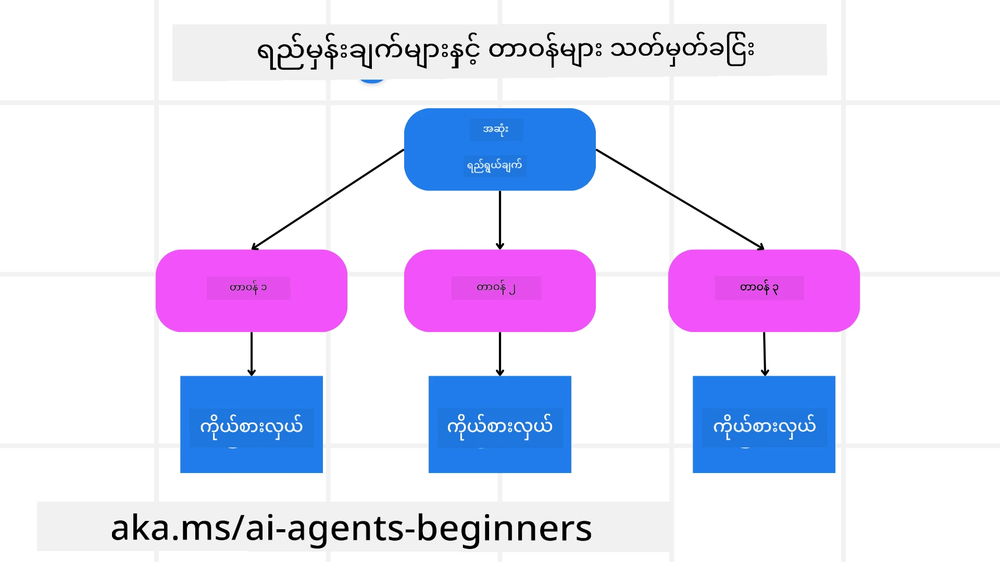

[](https://youtu.be/kPfJ2BrBCMY?si=9pYpPXp0sSbK91Dr)

> _(ဤသင်ခန်းစာ၏ ဗီဒီယိုကို ကြည့်ရန် အပေါ်က ပုံကို နှိပ်ပါ)_

# စီမံကိန်းဒီဇိုင်း

## နိဒါန်း

ဤသင်ခန်းစာတွင် မျက်စိပွတ်မိမည့်အချက်များမှာ

* စပ်ဆိုင်သော ကျယ်ပြန့်သော ရည်မှန်းချက်ကို သတ်မှတ်ခြင်းနှင့် ခက်ခဲသော တာဝန်ကို စီမံခန့်ခွဲနိုင်သော လုပ်ငန်းများသို့ ခွဲခြားခြင်း။
* ယုံကြည်စိတ်ချရပြီး စက်တွင် ဖတ်ရှုနိုင်သည့် တုံ့ပြန်ချက်များအတွက် ဖွဲ့စည်းတည်ဆောက်ထားသော ထုတ်လွှင့်ချက်ကို အသုံးပြုခြင်း။
* ဖြစ်ရပ်အခြေပြု နည်းလမ်းအား အသုံးပြု၍ ဒိုင်နမစ်အလုပ်များနှင့် မမျှော်လင့်ထားသော အချက်အလက်များကို ကိုင်တွယ်ခြင်း။

## သင်ယူရမည့်ရည်မှန်းချက်များ

ဤသင်ခန်းစာကို ပြီးမြောက်စွာ လေ့လာပြီးနောက်၊ သင်သည် အောက်ပါအချက်များကို နားလည်မှုရှိမည်ဖြစ်သည်။

* AI ကိုယ်စားလှယ်အတွက် ကျယ်ပြန့်သော ရည်မှန်းချက်ကို ဖော်ထုတ် ထား၍ ဘာလုပ်ရန် လိုအပ်သည်ကို ရှင်းပြနိုင်ရန် သတ်မှတ်ပေးနိုင်ခြင်း။
* ခက်ခဲသော တာဝန်ကို စီမံခန့်ခွဲရန် တာဝန်အသေးစားသို့ ခွဲခြားပြီး သေချာတိကျသော အဆင့်လိုက်စဉ်သို့ စုစည်းတင်စားနိုင်ခြင်း။
* ကိုယ်စားလှယ်များကို သင့်တော်သောကိရိယာများ (ဥပမာ- ရှာဖွေရေးကိရိယာများ သို့မဟုတ် ဒေတာသုံးသပ်ခန့်မှန်းကိရိယာများ) ဖြင့်ပြင်ဆင်ပေးနိုင်ခြင်း၊ မည်ခါတွင်၊ မည်သို့ အသုံးပြုရန်ဆုံးဖြတ်ပေးခြင်းနှင့် မမျှော်လင့်ထားသော အခြေအနေများကို ကိုင်တွယ်နိုင်ခြင်း။
* တာဝန်အသေးစားရလဒ်များကို သုံးသပ်ပြီး စွမ်းဆောင်ရည်တိုင်းတာကာ နောက်တစ်ဆင့် အလုပ်လုပ်ဆောင်မှုများတိုးတက်အောင် ပြန်လည်ပြင်ဆင်ခြင်း။

## ကျယ်ပြန့်သော ရည်မှန်းချက်သတ်မှတ်ခြင်းနှင့် တာဝန်ခွဲခြင်း



ပုံမှန်တကယ့်ကမ္ဘာတွင် အလုပ်များသည် တစ်ကြိမ်တည်းဖြင့် မျှသာပြည့်စုံစွာဖြေရှင်း၍ မရနိုင်ကြပါ။ AI ကိုယ်စားလှယ်များသည် ၎င်း၏စီမံချက်များနှင့် လုပ်ဆောင်ချက်များကို ဦးတည်ရန် ရည်မှန်းချက် တိတိကျကျလိုအပ်သည်။ ဥပမာအားဖြင့်၊ ရည်မှန်းချက်မှာ -

    "၃ ရက်ခရီးစဉ်အစီအစဉ် ဖန်တီးရန်။"

ရိုးရိုးရှင်းရှင်း ဖြေဆိုနိုင်သော်လည်း နောက်ထပ် အနည်းဆုံးညှိနှိုင်းမှုလိုအပ်သည်။ ရည်မှန်းချက်သည် အသက်သာကြည်လင်သှားလျှင် AI ကိုယ်စားလှယ် (နှင့် လူ you တွေနှင့် ပူးပေါင်းသူများ) ကို တိကျသော ရလဒ်ရရန် အာရုံစိုက်နိုင်ရန် ကောင်းစေသည်၊ ဥပမာ- လေယာဉ်လက်မှတ်ရွေးချယ်မှုများ၊ ဟိုတယ် အကြံပြုချက်များနှင့် လှုပ်ရှားမှု အကြံပြုချက်များပါရှိသော စုံလင်သော ခရီးစဉ်အစီအစဉ် တစ်ခု ဖန်တီးခြင်း။

### တာဝန်ခွဲခြင်း

ကြီးမား သို့မဟုတ် ခက်ခဲသော အလုပ်များမှာ တာဝန်အသေးစား၊ ရည်မှန်းချက်ပြည့်စုံသော လုပ်ငန်းများသို့ ခွဲခြားခြင်းဖြင့် ပိုမို စီမံနိုင်စေသည်။
ခရီးစဉ်အစီအစဉ် မူရင်းရည်မှန်းချက်ကို အောက်ပါအတိုင်း ခွဲခြားနိုင်ပါသည်။

* လေယာဉ် လက်မှတ် ကြိုတင်စာရင်းသွင်းခြင်း
* ဟိုတယ် ကြိုတင်စာရင်းသွင်းခြင်း
* ကားငှားရမ်းခြင်း
* ကိုယ်ပိုင်သီးသန့်တိုးချဲ့မှု

တာဝန်သူတစ်ဦးစီက ကောင်းမွန်ဆုံးအကြောင်းအရာများကို ရှာဖွေရန်၊ ဟိုတယ်လုပ်ငန်းတွင် အကြောင်းအရာ ပေါင်းစည်းမှုကို ဦးတည်လုပ်ဆောင်နိုင်သည်။ တာဝန်ခံများသုံးသပ်မှုဖြင့် အဆိုပါရလဒ်များကို စုပေါင်း၍ သုံးစွဲသူထံ ပေးပို့သည်။

ဤ မော်ဂျူးရွယ်နည်းပညာသည် တိုးတက်မှုများ ပြုလုပ်သွားရန်လည်း အဆင်ပြေသည်။ ဥပမာ - စားနပ်ရိက္ခာ၊ ဒေသဆိုင်ရာလှုပ်ရှားမှု အကြံပြုချက်များအတွက် ထူးခြားသော ကိုယ်စားလှယ်များ ထည့်သွင်း၍ ခရီးစဉ်ကို စဉ်ဆက်မပြတ် တိုးတက်အောင် ပြုလုပ်နိုင်သည်။

### ဖွဲ့စည်းတည်ဆောက်ထားသော ထုတ်လွှင့်ချက်

ကြီးမားသော ဘာသာစကား မော်ဒယ်များ (LLMs) သည် နောက်ပိုင်း ကိုယ်စားလှယ်များသို့ သို့မဟုတ် ဝန်ဆောင်မှုများကို ပိုမို လွယ်ကူစွာ ဖတ်နိုင်သော ဖွန်ရှင်များအတွက် ဖွဲ့စည်းထားသော ထုတ်လွှင့်ချက် (ဥပမာ- JSON) ကို ဖန်တီးနိုင်သည်။ အထူးသဖြင့် အများအပြား ဆိုက် အဖွဲ့အစည်းများ တည်ဆောက်ထားသော နယ်ပယ်တွင် အလွန်အသုံးဝင်သည်။ စီမံကိန်းထုတ်လွှင့်ချက်လာလျှင် လုပ်ငန်းများကို ဆက်လုပ်ဆောင်နိုင်သည်။

အောက်ပါ Python ကုတ်အပိုင်းမှာ ရည်မှန်းချက်ကို တာဝန်အသေးစားများသို့ ခွဲခြားပြီး ဖွဲ့စည်းတည်ဆောက်ထားသော စီမံကိန်းတစ်ခု ဖန်တီးသည့် ရိုးရှင်းသော စီမံကိန်း ကိုယ်စားလှယ်ကို ပြသသည်။

```python
from pydantic import BaseModel
from enum import Enum
from typing import List, Optional, Union
import json
import os
from typing import Optional
from pprint import pprint
from agent_framework.foundry import FoundryChatClient
from azure.identity import AzureCliCredential

class AgentEnum(str, Enum):
    FlightBooking = "flight_booking"
    HotelBooking = "hotel_booking"
    CarRental = "car_rental"
    ActivitiesBooking = "activities_booking"
    DestinationInfo = "destination_info"
    DefaultAgent = "default_agent"
    GroupChatManager = "group_chat_manager"

# ခရီးသွားအနောက်အလုပ်မော်ဒယ်
class TravelSubTask(BaseModel):
    task_details: str
    assigned_agent: AgentEnum  # အလုပ်ကို Agent သို့ ပေးလိုသည်

class TravelPlan(BaseModel):
    main_task: str
    subtasks: List[TravelSubTask]
    is_greeting: bool

provider = FoundryChatClient(
    project_endpoint=os.environ["AZURE_AI_PROJECT_ENDPOINT"],
    model=os.environ["AZURE_AI_MODEL_DEPLOYMENT_NAME"],
    credential=AzureCliCredential(),
)

# အသုံးပြုသူစာတိုက်ကို သတ်မှတ်ပါ
system_prompt = """You are a planner agent.
    Your job is to decide which agents to run based on the user's request.
    Provide your response in JSON format with the following structure:
{'main_task': 'Plan a family trip from Singapore to Melbourne.',
 'subtasks': [{'assigned_agent': 'flight_booking',
               'task_details': 'Book round-trip flights from Singapore to '
                               'Melbourne.'}
    Below are the available agents specialised in different tasks:
    - FlightBooking: For booking flights and providing flight information
    - HotelBooking: For booking hotels and providing hotel information
    - CarRental: For booking cars and providing car rental information
    - ActivitiesBooking: For booking activities and providing activity information
    - DestinationInfo: For providing information about destinations
    - DefaultAgent: For handling general requests"""

user_message = "Create a travel plan for a family of 2 kids from Singapore to Melbourne"

response = client.create_response(input=user_message, instructions=system_prompt)

response_content = response.output_text
pprint(json.loads(response_content))
```

### ပြင်းစွာ အမျိုးမျိုးသော ကိုယ်စားလှယ် စီမံကိန်း ကိုယ်စားလှယ်

ဤနမူနာတွင် Semantic Router Agent တစ်ဦးက အသုံးပြုသူ၏ တောင်းဆိုချက် (ဥပမာ - "ကျွန်ုပ်၏ ခရီးစဉ်အတွက် ဟိုတယ်အစီအစဉ် လိုအပ်သည်။") ကို လက်ခံသည်။

စီမံခန့်ခွဲသူက စဉ်ဆက်မှတ်ချက်ကို

* ဟိုတယ်အစီအစဉ် လက်ခံသည် - အသုံးပြုသူ၏ စာသားကို လက်ခံပြီး စနစ်က ပြောသော တောင်းဆိုချက်များနှင့် ကိုက်ညီမှုအရ ဖွဲ့စည်းထားသော ခရီးစဉ်အစီအစဉ်ကို ဖန်တီးသည်။
* ကိုယ်စားလှယ်များနှင့် ၎င်းတို့၏ ကိရိယာများအား စာရင်းပြုစုသည် - ကိုယ်စားလှယ် စာရင်းတွင် လေယာဉ်၊ ဟိုတယ်၊ ကားငှားခြင်းနှင့် လှုပ်ရှားမှုများအတွက် ကိုယ်စားလှယ်များ နှင့် ၎င်းတို့က ပေးသည့် လုပ်ဆောင်ချက်များ၊ ကိရိယာများ ပါရှိသည်။
* စီမံကိန်းကို ကိုယ်စားလှယ်များသို့ လမ်းညွှန်ပေးသည် - တာဝန်အသေးစား အရေအတွက်ပေါ်မူတည်၍ စီမံခန့်ခွဲသူသည် တစ်ခုတည်းသော ကိုယ်စားလှယ်သို့ တိုက်ရိုက်ပို့ခြင်း သို့မဟုတ် အများအပြားကိုယ်စားလှယ် ပူးပေါင်းဆောင်ရွက်ရန် အဖွဲ့တစ်ခုထိန်းသိမ်းမှုမှတဆင့် ချိန်ညှိပေးသည်။
* ရလဒ်ကို ချုပ်ဆိုသည် - နောက်ဆုံးတွင် စီမံခန့်ခွဲသူက ဖန်တီးထားသော စီမံကိန်းကို ရှင်းလင်းစွာ ချုပ်ကိုင်ပြီးပေးသည်။
အောက်ပါ Python ကုတ်နမူနာသည် ဤအဆင့်များကို ပြသသည်။

```python

from pydantic import BaseModel

from enum import Enum
from typing import List, Optional, Union

class AgentEnum(str, Enum):
    FlightBooking = "flight_booking"
    HotelBooking = "hotel_booking"
    CarRental = "car_rental"
    ActivitiesBooking = "activities_booking"
    DestinationInfo = "destination_info"
    DefaultAgent = "default_agent"
    GroupChatManager = "group_chat_manager"

# ခရီးသွား SubTask မော်ဒယ်

class TravelSubTask(BaseModel):
    task_details: str
    assigned_agent: AgentEnum # ကျွန်ုပ်တို့သည် တာဝန်ကို အေးဂျင့်ထံ သတ်မှတ်လိုသည်

class TravelPlan(BaseModel):
    main_task: str
    subtasks: List[TravelSubTask]
    is_greeting: bool
import json
import os
from typing import Optional

from agent_framework.foundry import FoundryChatClient
from azure.identity import AzureCliCredential

# က라이င့် တည်ဆောက်ပါ

provider = FoundryChatClient(
    project_endpoint=os.environ["AZURE_AI_PROJECT_ENDPOINT"],
    model=os.environ["AZURE_AI_MODEL_DEPLOYMENT_NAME"],
    credential=AzureCliCredential(),
)

from pprint import pprint

# အသုံးပြုသူစာတိုက်ကို သတ်မှတ်ပါ

system_prompt = """You are a planner agent.
    Your job is to decide which agents to run based on the user's request.
    Below are the available agents specialized in different tasks:
    - FlightBooking: For booking flights and providing flight information
    - HotelBooking: For booking hotels and providing hotel information
    - CarRental: For booking cars and providing car rental information
    - ActivitiesBooking: For booking activities and providing activity information
    - DestinationInfo: For providing information about destinations
    - DefaultAgent: For handling general requests"""

user_message = "Create a travel plan for a family of 2 kids from Singapore to Melbourne"

response = client.create_response(input=user_message, instructions=system_prompt)

response_content = response.output_text

# JSON အဖြစ် loading ပြီးနောက် တုံ့ပြန်မှုအကြောင်းအရာကို ပုံနှိပ်ပါ

pprint(json.loads(response_content))
```

ယခင်ကုတ်မှ ထွက်ရှိလာသော ထုတ်လွှင့်ချက်ဖြစ်ပြီး ၎င်းကို `assigned_agent` သို့ လမ်းကြောင်းပြပေးကာ ခရီးစဉ်အစီအစဉ်ကို ဦးဆောင်ပြီး သုံးစွဲသူထံ ချုပ်ဆိုနိုင်သည်။

```json
{
    "is_greeting": "False",
    "main_task": "Plan a family trip from Singapore to Melbourne.",
    "subtasks": [
        {
            "assigned_agent": "flight_booking",
            "task_details": "Book round-trip flights from Singapore to Melbourne."
        },
        {
            "assigned_agent": "hotel_booking",
            "task_details": "Find family-friendly hotels in Melbourne."
        },
        {
            "assigned_agent": "car_rental",
            "task_details": "Arrange a car rental suitable for a family of four in Melbourne."
        },
        {
            "assigned_agent": "activities_booking",
            "task_details": "List family-friendly activities in Melbourne."
        },
        {
            "assigned_agent": "destination_info",
            "task_details": "Provide information about Melbourne as a travel destination."
        }
    ]
}
```

ယခင် ကုတ်နမူနာပါ Notebook ကို [ဒီမှာ](./code_samples/07-python-agent-framework.ipynb) ရနိုင်ပါသည်။

### ဆက်လက် ပြန်လည်စီမံခြင်း

တာဝန်အချို့သည် တစ်ဖန်၊ တစ်ဖန် ပြန်လည်လုပ်ဆောင်မှု သို့မဟုတ် ပြန်လည် စီမံမှုလိုအပ်ပါသည်။ တစ်ခုသော တာဝန်အသေးစားရလဒ်သည် နောက်တစ်ခုတွင် သက်ရောက်မှုရှိသည်။ ဥပမာ - ကိုယ်စားလှယ်သည် လေယာဉ်လက်မှတ် ဝယ်ယူကြည့်နေစဉ် မမျှော်လင့်ထားသော ဒေတာပုံစံတစ်ခု တွေ့ရှိပါက ဟိုတယ် ယူဆောင်မှု မလုပ်မီ ၎င်း၏ မဟာဗျူဟာကို ပြင်ဆင်ရန် လိုအပ်သည်။

ထို့အပြင် အသုံးပြုသူ တုံ့ပြန်ချက် (ဥပမာ - လူတစ်ဦးသည် စောင့်ရှောက်မှု လေယာဉ်ကို ကြိုက်နှစ်သက်သည့် အချိန်ကို ရွေးချယ်ခြင်း) ကအစိတ်အပိုင်း ပြန်လည်စီမံမှုဖြစ်ပေါ်စေသည်။ ဤ ကိုင်တွယ်မှု၊ ဆက်တိုက်ပြန်လည်လုပ်ဆောင်မှုနည်းလမ်းသည် နောက်ဆုံးဖြေရှင်းချက်ကို အမှန်တကယ် ကန့်သတ်ချက်များနှင့် အသုံးပြုသူ ပြောင်းလဲနေသောနှစ်သက်မှုများနှင့် ကိုက်ညီစေရန် အာမခံသည်။

ဥပမာ ကုတ်

```python
import os
from agent_framework.foundry import FoundryChatClient
from azure.identity import AzureCliCredential
#.. ယခင်ကုဒ်နှင့်တူပြီး အသုံးပြုသူမှတ်တမ်း၊ လက်ရှိအစီအစဉ်ကို ပို့ဆောင်ပါ

system_prompt = """You are a planner agent to optimize the
    Your job is to decide which agents to run based on the user's request.
    Below are the available agents specialized in different tasks:
    - FlightBooking: For booking flights and providing flight information
    - HotelBooking: For booking hotels and providing hotel information
    - CarRental: For booking cars and providing car rental information
    - ActivitiesBooking: For booking activities and providing activity information
    - DestinationInfo: For providing information about destinations
    - DefaultAgent: For handling general requests"""

user_message = "Create a travel plan for a family of 2 kids from Singapore to Melbourne"

response = client.create_response(
    input=user_message,
    instructions=system_prompt,
    context=f"Previous travel plan - {TravelPlan}",
)
# .. ပြန်လည်အစီအစဉ်ပြုလုပ်၍ တာဝန်များကို သက်ဆိုင်ရာကိုယ်စားလှယ်များထံပို့ပါ
```

ပိုမို တိကျစုံလင်သော စီမံကိန်းအတွက် Magnetic One <a href="https://www.microsoft.com/research/articles/magentic-one-a-generalist-multi-agent-system-for-solving-complex-tasks" target="_blank">ဘလော့ဂ်</a> ကို ကြည့်ရှုနိုင်ပါသည်။

## အကျဉ်းချုပ်

ဤဆောင်းပါးတွင် ကျွန်ုပ်တို့သည် ရရှိနိုင်သော ကိုယ်စားလှယ်များကို ချိန်ညှိရွေးချယ်နိုင်သော စီမံကိန်းတစ်ခု ပြုလုပ်နည်း ကို သိရှိခဲ့သည်။ စီမံကိန်းမှ ထွက်ရှိသော ထုတ်လွှင့်ချက်သည် တာဝန်များကို ခွဲခြား၍ ကိုယ်စားလှယ်များသို့ ပေးပို့သည် ထို့ကြောင့် ၎င်းတို့က တာဝန်များကို ဆောင်ရွက်နိုင်သည်ဟု ယူဆရသည်။ ကိုယ်စားလှယ်များမှာ ဆောင်ရွက်ရန်လိုအပ်သော လုပ်ဆောင်ခန်းများ / ကိရိယာများကို ဝင်ရောက် အသုံးပြုနိုင်သည်ဟု ယူဆသည်။ ကိုယ်စားလှယ်များအပြင် ပြန်လည် စူးစမ်းခြင်း၊ အကြောင်းအရာချုပ်ဆိုမှုနှင့် သုံးသပ်ခြင်းကဲ့သို့သော မျက်နှာဖုံးပုံစံများကိုလည်း ထည့်သွင်း၍ ပိုမို ကိုယ်ပိုင်ပြုပြင်နိုင်သည်။

## နောက်ထပ် အရင်းအမြစ်များ

Magentic One - ခက်ခဲသော အလုပ်များ ဖြေရှင်းရန် အထူးပြု သုံးသပ်ချက်ပါရှိသည့် generalist multi-agent စနစ် ဖြစ်ပြီး agent ဆိုင်ရာ စိန်ခေါ်မှုများတွင် ထူးချွန်သော ရလဒ်များ ရရှိခဲ့သည်။ ရှင်းလင်းမှု - <a href="https://www.microsoft.com/research/articles/magentic-one-a-generalist-multi-agent-system-for-solving-complex-tasks" target="_blank">Magentic One</a>။ ဤအကောင်အထည်ဖော်မှုတွင် orchestrator သည် တာဝန်အသီးသီးအတွက် စီမံကိန်းများကို ဖန်တီးပြီး ရနိုင်သော ကိုယ်စားလှယ်များသို့ တာဝန်များ ပေးအပ်သည်။ စီမံမှုနှင့်အတူ orchestrator သည် တာဝန်တိုးတက်မှုကို ကြည့်ရှုရန် အချက်အလက်ခေါ်ဆိုမှုတစ်ခုကိုလည်း အသုံးပြုကာ လိုအပ်လျှင် ပြန်လည် စီမံသည်။

### စီမံကိန်း ဒီဇိုင်းပုံစံ အကြောင်း အပိုမေးစရာများ ရှိပါသလား?

အခြားသင်ယူသူများနှင့် တွေ့ဆုံရန်၊ ရုံးချိန်များတက်ရန်နှင့် သင်၏ AI ကိုယ်စားလှယ်များ အကြောင်း မေးခွန်းများ ခေါ်ယူရန် [Microsoft Foundry Discord](https://discord.com/invite/ATgtXmAS5D) တွင် ပါဝင်ဆက်သွယ်ပါ။

## ယခင် သင်ခန်းစာ

[ယုံကြည်မှုရှိသော AI ကိုယ်စားလှယ်များ တည်ဆောက်ခြင်း](../06-building-trustworthy-agents/README.md)

## နောက်တစ်ခန်း သင်ခန်းစာ

[အများအပြား ကိုယ်စားလှယ် သင်ခန်းစာပုံစံ](../08-multi-agent/README.md)

---

<!-- CO-OP TRANSLATOR DISCLAIMER START -->
**ပြောကြားချက်**
ဤစာတမ်းကို AI ဘာသာပြန်ဝန်ဆောင်မှု [Co-op Translator](https://github.com/Azure/co-op-translator) အသုံးပြု၍ ဘာသာပြန်ထားပါသည်။ ကျွန်ုပ်တို့သည် တိကျမှန်ကန်မှုအတွက် ကြိုးပမ်းနေသော်လည်း၊ စက်ကိရိယာဘာသာပြန်ခြင်းများတွင် အမှားများ သို့မဟုတ် မှားယွင်းချက်များ ပါဝင်နိုင်ကြောင်း သတိပြုပါရန် လိုအပ်ပါသည်။ မူလစာတမ်းကို မူရင်းဘာသာဖြင့်သာ ယုံကြည်စိတ်ချရသော အချက်အလက်အဖြစ် သတ်မှတ်သင့်သည်။ အရေးကြီးသည့် သတင်းအချက်အလက်များအတွက် ပရော်ဖက်ရှင်နယ် လူသားဘာသာပြန်သူဝန်ဆောင်မှုကို အကြံပြုပါသည်။ ဤဘာသာပြန်ချက်ကို အသုံးပြုခြင်းမှ ဖြစ်ပေါ်လာသော နားလည်မှုကွာခြားမှုများ သို့မဟုတ် မမှန်ကန်သော အသုံးပြုမှုများအတွက် ကျွန်ုပ်တို့ တာဝန်မခံပါ။
<!-- CO-OP TRANSLATOR DISCLAIMER END -->