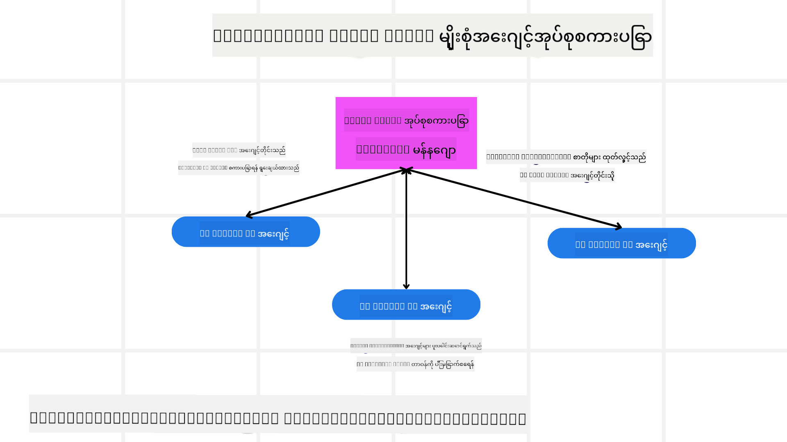
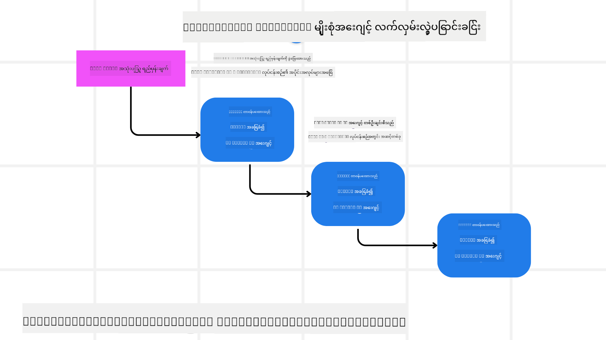
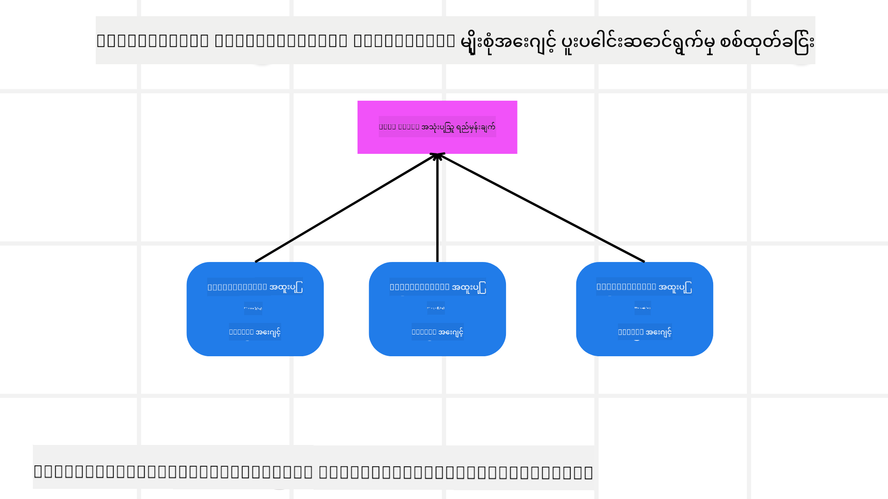

<!--
CO_OP_TRANSLATOR_METADATA:
{
  "original_hash": "1a008c204051cba8d0e253b75f261c41",
  "translation_date": "2025-08-30T09:33:51+00:00",
  "source_file": "08-multi-agent/README.md",
  "language_code": "my"
}
-->

> _(ဤပုံကိုနှိပ်ပြီး ဤသင်ခန်းစာ၏ ဗီဒီယိုကို ကြည့်ရှုပါ)_

# Multi-agent design patterns

အများအပြား agent များပါဝင်သော ပရောဂျက်တစ်ခုကို စတင်လုပ်ဆောင်လိုက်သောအခါ Multi-agent design pattern ကိုစဉ်းစားရန်လိုအပ်ပါမည်။ သို့သော် multi-agents သို့ ပြောင်းရန်အချိန်နှင့် ၎င်း၏ အကျိုးကျေးဇူးများကို ချက်ချင်းမသိသာနိုင်ပါ။

## အကျဉ်းချုပ်

ဤသင်ခန်းစာတွင် ကျွန်ုပ်တို့သည် အောက်ပါမေးခွန်းများကို ဖြေရှင်းရန် ကြိုးစားပါမည်-

- Multi-agents သုံးရန် သင့်လျော်သော အခြေအနေများက ဘာတွေလဲ?
- တစ်ဦးတည်းသော agent သာ အသုံးပြု၍ အလုပ်များစွာလုပ်ဆောင်ခြင်းထက် multi-agents အသုံးပြုခြင်း၏ အကျိုးကျေးဇူးများက ဘာတွေလဲ?
- Multi-agent design pattern ကို အကောင်အထည်ဖော်ရာတွင် အခြေခံအဆောက်အအုံများက ဘာတွေလဲ?
- Multi-agents များအချင်းချင်း အပြန်အလှန် လုပ်ဆောင်နေမှုကို မည်သို့မြင်နိုင်မည်နည်း?

## သင်ယူရမည့် ရည်မှန်းချက်များ

ဤသင်ခန်းစာပြီးဆုံးချိန်တွင် သင်သည်-

- Multi-agents သုံးရန် သင့်လျော်သော အခြေအနေများကို သတ်မှတ်နိုင်ရမည်။
- တစ်ဦးတည်းသော agent ထက် multi-agents အသုံးပြုခြင်း၏ အကျိုးကျေးဇူးများကို အသိအမှတ်ပြုနိုင်ရမည်။
- Multi-agent design pattern ကို အကောင်အထည်ဖော်ရာတွင် အခြေခံအဆောက်အအုံများကို နားလည်နိုင်ရမည်။

အကြီးမားဆုံးသော ရည်ရွယ်ချက်ကဘာလဲ?

*Multi-agents ဆိုသည်မှာ ပန်းတိုင်တစ်ခုကို အတူတကွ ရောက်ရှိရန် agent များစွာကို ပူးပေါင်းလုပ်ဆောင်စေသော design pattern တစ်ခုဖြစ်သည်*။

ဤ pattern ကို ရိုဘော့တစ်စ်, ကိုယ်ပိုင်လုပ်ဆောင်နိုင်သောစနစ်များနှင့် ဖြန့်ဖြူးထားသော ကွန်ပျူတာစနစ်များအပါအဝင် အမျိုးမျိုးသော နယ်ပယ်များတွင် ကျယ်ကျယ်ပြန့်ပြန့် အသုံးပြုကြသည်။

## Multi-Agents သုံးရန် သင့်လျော်သော အခြေအနေများ

Multi-agents ကို သုံးရန် သင့်လျော်သော အခြေအနေများက ဘာတွေလဲ? အဖြေကတော့ အခြေအနေများစွာရှိပြီး အထူးသဖြင့် အောက်ပါအခြေအနေများတွင် အကျိုးရှိစေပါသည်-

- **အလုပ်ပမာဏများကြီးမားသောအခါ**: အလုပ်ပမာဏများကို သေးငယ်သော အလုပ်များအဖြစ် ခွဲခြားပြီး အခြား agent များအား ပေးအပ်နိုင်သည်။ ဤနည်းလမ်းဖြင့် အချိန်တိုအတွင်း အလုပ်များကို ပြီးစီးစေပါသည်။ ဥပမာအားဖြင့် အချက်အလက်များကို အစုလိုက်အပြုံလိုက် လုပ်ဆောင်ရမည့် အလုပ်များတွင် ဖြစ်နိုင်ပါသည်။
- **ရှုပ်ထွေးသောအလုပ်များ**: ရှုပ်ထွေးသောအလုပ်များကိုလည်း သေးငယ်သော အလုပ်များအဖြစ် ခွဲခြားပြီး agent တစ်ဦးစီအား အထူးကျွမ်းကျင်မှုအရ ပေးအပ်နိုင်သည်။ ဥပမာအားဖြင့် ကိုယ်ပိုင်မောင်းနှင်သော ယာဉ်များတွင် navigation, အတားအဆီးရှာဖွေခြင်းနှင့် အခြားယာဉ်များနှင့် ဆက်သွယ်မှုတို့ကို တာဝန်ယူသော agent များကို သီးခြားထားနိုင်သည်။
- **အထူးကျွမ်းကျင်မှုများ မတူညီသောအခါ**: Agent များသည် မတူညီသော ကျွမ်းကျင်မှုများရှိပြီး တစ်ဦးတည်းသော agent ထက် အလုပ်တစ်ခု၏ အပိုင်းအစများကို ပိုမိုထိရောက်စွာ လုပ်ဆောင်နိုင်သည်။ ဥပမာအားဖြင့် ကျန်းမာရေးကဏ္ဍတွင် diagnostic, ကုသမှုအစီအစဉ်များနှင့် လူနာစောင့်ကြည့်မှုတို့ကို တာဝန်ယူသော agent များကို သီးခြားထားနိုင်သည်။

## တစ်ဦးတည်းသော Agent ထက် Multi-Agents အသုံးပြုခြင်း၏ အကျိုးကျေးဇူးများ

တစ်ဦးတည်းသော agent စနစ်သည် ရိုးရှင်းသောအလုပ်များအတွက် သင့်တော်နိုင်သော်လည်း ရှုပ်ထွေးသောအလုပ်များအတွက် Multi-agents အသုံးပြုခြင်းသည် အကျိုးကျေးဇူးများစွာပေးစွမ်းနိုင်သည်-

- **အထူးကျွမ်းကျင်မှု**: Agent တစ်ဦးစီသည် အလုပ်တစ်ခုစီအတွက် အထူးကျွမ်းကျင်မှုရှိနိုင်သည်။ တစ်ဦးတည်းသော agent တွင် အထူးကျွမ်းကျင်မှုမရှိခြင်းကြောင့် ရှုပ်ထွေးသောအလုပ်များတွင် အလွဲအချော်များဖြစ်နိုင်သည်။
- **အတိုင်းအတာချဲ့ထွင်နိုင်မှု**: စနစ်ကို တစ်ဦးတည်းသော agent ကို ပိုမိုအလုပ်ပေးခြင်းထက် agent အသစ်များ ထည့်သွင်းခြင်းဖြင့် ပိုမိုလွယ်ကူစွာ ချဲ့ထွင်နိုင်သည်။
- **ချို့ယွင်းမှုခံနိုင်ရည်**: Agent တစ်ဦးချို့ယွင်းသွားပါက အခြား agent များက ဆက်လက်လုပ်ဆောင်နိုင်ပြီး စနစ်၏ ယုံကြည်စိတ်ချရမှုကို သေချာစေသည်။

ဥပမာအားဖြင့် အသုံးပြုသူတစ်ဦးအတွက် ခရီးစဉ်တစ်ခုကို ကြိုတင်စာရင်းသွင်းရန် စဉ်းစားပါ။ တစ်ဦးတည်းသော agent စနစ်သည် ခရီးစဉ်စာရင်းသွင်းမှု၏ အပိုင်းအစအားလုံးကို ကိုင်တွယ်ရမည်ဖြစ်ပြီး လေယာဉ်လက်မှတ်ရှာဖွေခြင်းမှ စတင်ကာ ဟိုတယ်များနှင့် ကားငှားခြင်းအထိ လုပ်ဆောင်ရမည်။ Multi-agent စနစ်တွင်တော့ လေယာဉ်လက်မှတ်ရှာဖွေခြင်း, ဟိုတယ်စာရင်းသွင်းခြင်းနှင့် ကားငှားခြင်းတို့အတွက် အထူးကျွမ်းကျင်သော agent များကို သီးခြားထားနိုင်သည်။ 

ဤနမူနာကို mom-and-pop စတိုးဆိုင်ဖြင့် လုပ်ဆောင်သော ခရီးသွားရုံးနှင့် franchise အဖြစ် လုပ်ဆောင်သော ခရီးသွားရုံးတို့နှင့် နှိုင်းယှဉ်ကြည့်ပါ။ Mom-and-pop စတိုးဆိုင်တွင် တစ်ဦးတည်းသော agent သည် အလုပ်အားလုံးကို ကိုင်တွယ်ရမည်ဖြစ်ပြီး franchise တွင်တော့ agent များသည် အလုပ်တစ်ခုစီကို သီးခြားလုပ်ဆောင်မည်ဖြစ်သည်။

## Multi-Agent Design Pattern ကို အကောင်အထည်ဖော်ရာတွင် အခြေခံအဆောက်အအုံများ

Multi-agent design pattern ကို အကောင်အထည်ဖော်ရန်မတိုင်မီ pattern ၏ အခြေခံအဆောက်အအုံများကို နားလည်ရန်လိုအပ်ပါသည်။

ခရီးစဉ်စာရင်းသွင်းမှုကို နမူနာအဖြစ် ပြန်လည်စဉ်းစားပါက အခြေခံအဆောက်အအုံများမှာ-

- **Agent အချင်းချင်း ဆက်သွယ်မှု**: လေယာဉ်လက်မှတ်ရှာဖွေခြင်း, ဟိုတယ်စာရင်းသွင်းခြင်းနှင့် ကားငှားခြင်းတို့အတွက် agent များသည် အသုံးပြုသူ၏ အလိုဆန္ဒများနှင့် ကန့်သတ်ချက်များကို အပြန်အလှန်မျှဝေရမည်။
- **လုပ်ဆောင်မှုညှိနှိုင်းမှု Mechanisms**: Agent များသည် အသုံးပြုသူ၏ အလိုဆန္ဒများနှင့် ကန့်သတ်ချက်များကို ဖြည့်ဆည်းရန် လုပ်ဆောင်မှုများကို ညှိနှိုင်းရမည်။
- **Agent Architecture**: Agent များသည် အသုံးပြုသူနှင့် အပြန်အလှန်ဆက်သွယ်မှုမှ ဆုံးဖြတ်ချက်ချခြင်းနှင့် သင်ယူနိုင်စွမ်းရှိရမည်။
- **Multi-Agent Interactions တွင် မြင်နိုင်မှု**: Agent များအချင်းချင်း လုပ်ဆောင်မှုကို မြင်နိုင်ရန် လိုအပ်သည်။
- **Multi-Agent Patterns**: Centralized, decentralized, hybrid စနစ်များအနက် သင့်လျော်သော pattern ကို ရွေးချယ်ရမည်။
- **Human in the loop**: အချို့သောအခါတွင် လူသား၏ အတည်ပြုချက်ကို လိုအပ်နိုင်သည်။

## Multi-Agent Interactions တွင် မြင်နိုင်မှု

Agent များအချင်းချင်း လုပ်ဆောင်မှုကို မြင်နိုင်ရန် လိုအပ်သည်။ ဤမြင်နိုင်မှုသည် debugging, optimization, စနစ်၏ ထိရောက်မှုကို သေချာစေရန် အရေးကြီးသည်။

ဥပမာအားဖြင့် ခရီးစဉ်စာရင်းသွင်းမှုအတွက် dashboard တစ်ခုကို အသုံးပြုနိုင်သည်။ ဤ dashboard တွင် agent တစ်ခုစီ၏ အခြေအနေ, အသုံးပြုသူ၏ အလိုဆန္ဒများနှင့် agent များအချင်းချင်း လုပ်ဆောင်မှုများကို ပြသနိုင်သည်။

- **Logging နှင့် Monitoring Tools**: Agent တစ်ဦးစီ၏ လုပ်ဆောင်မှုများကို မှတ်တမ်းတင်ရန် လိုအပ်သည်။
- **Visualization Tools**: Agent များအချင်းချင်း ဆက်သွယ်မှုကို ပုံဖော်ပြသနိုင်သည်။
- **Performance Metrics**: Multi-agent စနစ်၏ ထိရောက်မှုကို တိုင်းတာနိုင်သည်။

## Multi-Agent Patterns

Multi-agent app များဖန်တီးရာတွင် အသုံးပြုနိုင်သော pattern များကို ကြည့်ကြပါစို့-

### Group chat

ဤ pattern သည် agent များစွာအကြား စကားပြောဆက်သွယ်မှုကို ဖန်တီးလိုသောအခါ အသုံးဝင်သည်။ 

### Hand-off

ဤ pattern သည် agent များအကြား အလုပ်များကို လွှဲပြောင်းပေးနိုင်စေသောအခါ အသုံးဝင်သည်။

### Collaborative filtering

ဤ pattern သည် agent များစွာ ပူးပေါင်း၍ အသုံးပြုသူများအတွက် အကြံပြုချက်များပေးနိုင်စေသောအခါ အသုံးဝင်သည်။

## နမူနာ: ပြန်အမ်းငွေလုပ်ငန်းစဉ်

အသုံးပြုသူတစ်ဦးသည် ထုတ်ကုန်တစ်ခုအတွက် ပြန်အမ်းငွေတောင်းဆိုလိုသောအခါ ပါဝင်နိုင်သော agent များကို အောက်ပါအတိုင်း ခွဲခြားနိုင်သည်-

**ပြန်အမ်းငွေလုပ်ငန်းစဉ်အတွက် သီးသန့် agent များ**:

- **Customer agent**: အသုံးပြုသူကို ကိုယ်စားပြုသည်။
- **Seller agent**: ရောင်းသူကို ကိုယ်စားပြုသည်။
- **Payment agent**: ငွေပေးချေမှုကို ကိုယ်စားပြုသည်။
- **Resolution agent**: ပြဿနာများကို ဖြေရှင်းသည်။
- **Compliance agent**: စည်းမျဉ်းများနှင့် ကိုက်ညီမှုကို သေချာစေသည်။

**အထွေထွေ agent များ**:

- **Shipping agent**: ပစ္စည်းပို့ဆောင်မှုကို ကိုယ်စားပြုသည်။
- **Feedback agent**: အသုံးပြုသူ၏ အကြံပြုချက်များကို စုဆောင်းသည်။
- **Escalation agent**: ပြဿနာများကို အဆင့်မြှင့်တင်သည်။
- **Notification agent**: အသုံးပြုသူအား အသိပေးချက်များပေးသည်။
- **Analytics agent**: အချက်အလက်များကို ချက်ချင်းခွဲခြမ်းစိတ်ဖြာသည်။
- **Audit agent**: လုပ်ငန်းစဉ်ကို စစ်ဆေးသည်။
- **Reporting agent**: အစီရင်ခံစာများကို ဖန်တီးသည်။
- **Knowledge agent**: သက်ဆိုင်သော အချက်အလက်များကို သိမ်းဆည်းသည်။
- **Security agent**: လုံခြုံရေးကို သေချာစေသည်။
- **Quality agent**: အရည်အသွေးကို စစ်ဆေးသည်။

ဤနမူနာများသည် သင့် multi-agent စနစ်တွင် agent များကို မည်သို့ သတ်မှတ်ရမည်ကို အကြံဉာဏ်ပေးနိုင်သည်။

## လုပ်ငန်းတာဝန်
## Solution

[Solution](./solution/solution.md)

## Knowledge checks

မေးခွန်း - Multi-agents ကိုဘယ်အချိန်မှာအသုံးပြုသင့်သလဲ?

- [ ] A1: အလုပ်ပမာဏနည်းပြီး တစ်ခုတည်းသောရိုးရှင်းတဲ့အလုပ်ရှိတဲ့အခါ
- [ ] A2: အလုပ်ပမာဏများတဲ့အခါ
- [ ] A3: ရိုးရှင်းတဲ့အလုပ်တစ်ခုရှိတဲ့အခါ

[Solution quiz](./solution/solution-quiz.md)

## Summary

ဒီသင်ခန်းစာမှာ Multi-agent design pattern ကိုလေ့လာခဲ့ပြီး Multi-agents ကိုအသုံးပြုသင့်တဲ့အခြေအနေများ၊ Singular agent ထက် Multi-agents အသုံးပြုခြင်း၏အားသာချက်များ၊ Multi-agent design pattern ကိုအကောင်အထည်ဖော်ရာမှာလိုအပ်တဲ့အခြေခံအဆောက်အအုံများ၊ နှင့် Multi-agents တွေဘယ်လိုအပြန်အလှန်လုပ်ဆောင်နေကြတယ်ဆိုတာကိုမြင်နိုင်ဖို့နည်းလမ်းများကိုလေ့လာခဲ့ပါတယ်။

### Multi-Agent Design Pattern အကြောင်းပိုမေးချင်ပါသလား?

[Azure AI Foundry Discord](https://aka.ms/ai-agents/discord) ကို join လုပ်ပြီး အခြားသောလေ့လာသူများနှင့်တွေ့ဆုံပါ၊ office hours တွေတက်ရောက်ပါ၊ AI Agents အကြောင်းမေးခွန်းများကိုဖြေရှင်းပါ။

## Additional resources

- ## Previous Lesson

[Planning Design](../07-planning-design/README.md)

## Next Lesson

[Metacognition in AI Agents](../09-metacognition/README.md)

---

**အကြောင်းကြားချက်**:  
ဤစာရွက်စာတမ်းကို AI ဘာသာပြန်ဝန်ဆောင်မှု [Co-op Translator](https://github.com/Azure/co-op-translator) ကို အသုံးပြု၍ ဘာသာပြန်ထားပါသည်။ ကျွန်ုပ်တို့သည် တိကျမှန်ကန်မှုအတွက် ကြိုးစားနေသော်လည်း၊ အလိုအလျောက် ဘာသာပြန်ခြင်းတွင် အမှားများ သို့မဟုတ် မမှန်ကန်မှုများ ပါဝင်နိုင်သည်ကို သတိပြုပါ။ မူရင်းဘာသာစကားဖြင့် ရေးသားထားသော စာရွက်စာတမ်းကို အာဏာတရားရှိသော ရင်းမြစ်အဖြစ် သတ်မှတ်သင့်ပါသည်။ အရေးကြီးသော အချက်အလက်များအတွက် လူ့ဘာသာပြန်ပညာရှင်များမှ ပရော်ဖက်ရှင်နယ် ဘာသာပြန်ခြင်းကို အကြံပြုပါသည်။ ဤဘာသာပြန်ကို အသုံးပြုခြင်းမှ ဖြစ်ပေါ်လာသော အလွဲအလွတ်များ သို့မဟုတ် အနားယူမှားမှုများအတွက် ကျွန်ုပ်တို့သည် တာဝန်မယူပါ။