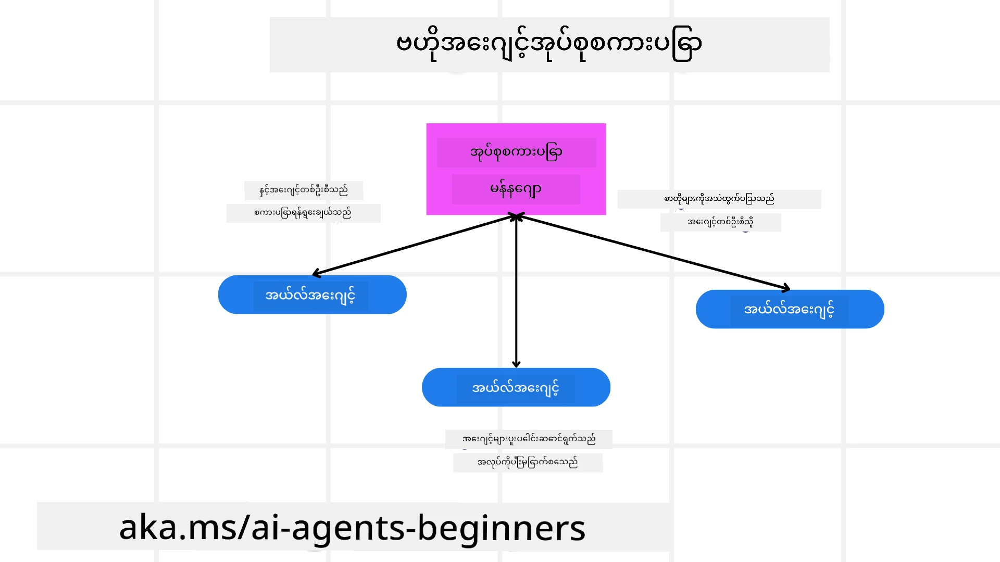
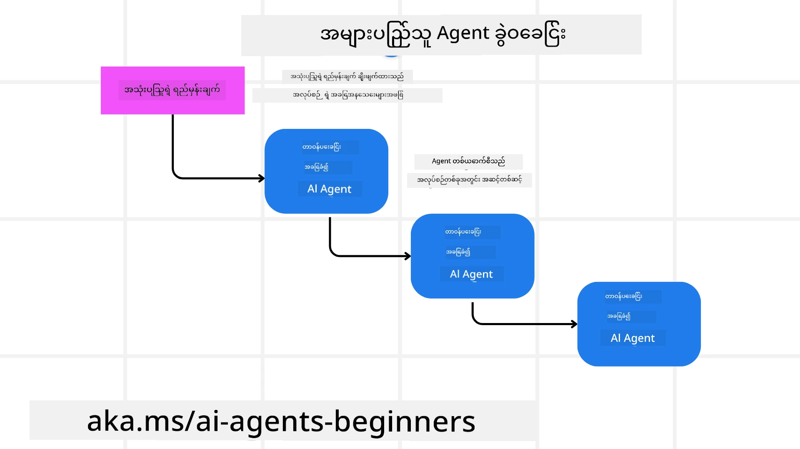
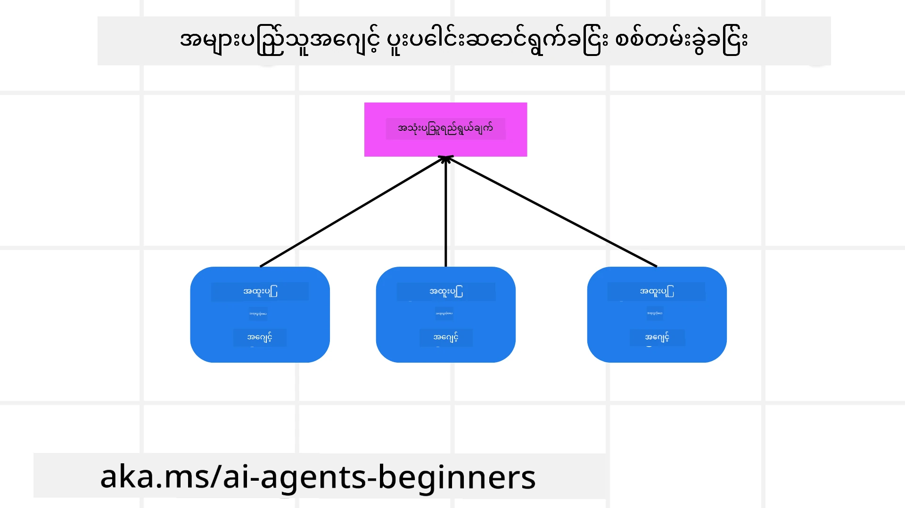

> _(ဒီသင်ခန်းစာ ဗီဒီယိုကို ကြည့်ရန် အပေါ်ပါ ပုံကို နှိပ်ပါ)_

# Multi-agent ဒီဇိုင်းပုံစံများ

အေဂျင့်များ များစွာ ပါဝင်သော ပရောဂျက်တစ်ခုတွင် ပြုလုပ်ရန် စတင်လိုက်သည့်အချိန်အခါတွင် များစွာသော အေဂျင့်ဒီဇိုင်းပုံစံကို စဉ်းစားရမည် ဖြစ်သည်။ သို့သော် မကြာခင်မှာ မည်သည့်အချိန်တွင် များစွာသော အေဂျင့်သို့ ပြောင်းရွှေ့ရမည် ဖြစ်သလဲ၊ အကျိုးကျေးဇူးများက ဘာတွေလဲ ဆိုသည်ကို နားလည်ရန်ခက်ခဲနိုင်သည်။

## အ introduction

ဒီသင်ခန်းစာတွင် ဤမေးခွန်းများကို ဖြေရှင်းချင်ပါတယ် -

- မည်သည့် စုံတွဲအခြေအနေများတွင် များစွာသော အေဂျင့်များကို သုံးနိုင်ပါသလဲ။
- တစ်စုတစ်စည်းတည်းသော အေဂျင့်တစ်ခုထက် များစွာသော အေဂျင့်များအသုံးပြုခြင်း၏ အကျိုးကျေးဇူးများက ဘာတွေလဲ။
- များစွာသော အေဂျင့်ဒီဇိုင်းပုံစံကို ဖြည့်ဆည်းဆောင်ရွက်ရာတွင် သဘာဝတရားအဆောက်အအုံများက ဘာတွေပါသလဲ။
- များစွာသော အေဂျင့်များ တစ်ယောက်နဲ့ တစ်ယောက် ဘယ်လို တုံ့ပြန်ဆက်ဆံမှုရှိနေသည်ကို မည်သို့ မြင်သာစေမလဲ။

## သင်ယူရရှိရန် ရည်ရွယ်ချက်များ

ဒီသင်ခန်းစာပြီးလျှင် မင်းအောက်ပါအတတ် ability တွေ ရရှိနိုင်ပါမယ် -

- များစွာသော အေဂျင့်များအသုံးပြုရမည့် စုံတွဲအခြေအနေများကိုဖော်ထုတ်နိုင်ခြင်း
- တစ်ဦးတည်း ပြုလုပ်သော အေဂျင့်နဲ့ ယှဉ်လျှင် များစွာသော အေဂျင့်အသုံးပြုခြင်း၏ အကျိုးကျေးဇူးတွေကို သိရှိနိုင်ခြင်း
- များစွာသော အေဂျင့်ဒီဇိုင်းပုံစံကို အကောင်အထည်ဖော်ရာ အဆောက်အအုံများကို နားလည်နိုင်ခြင်း

အကြီးစား ရှုထောင့်က ဘာတွေလဲ?

*Multi-agent တွေဟာ ပူးပေါင်း၍ တစ်ခုတည်းသော ရည်မှန်းချက်တစ်ခုကို ရရှိရန် ကူညီပေးနိုင်တဲ့ ဒီဇိုင်းပုံစံဖြစ်ပါတယ်*။

ဒီပုံစံကို ရိုဘိုတစ်ကိရိယာများ၊ ကြံ့ကြံ့ခိုင်ခိုင် စနစ်များနှင့် ဖျော်ဖြေပေးကွန်ပျူတာများတွင် ကျယ်ပြန့်စွာ အသုံးပြုသည်။

## များစွာသော အေဂျင့်များအသုံးပြုရမည့် စုံတွဲအခြေအနေများ

ဒါဆို မည်သည့်အခြေအနေများတွင် များစွာသော အေဂျင့် အသုံးပြုမှု သင့်တော်သလဲ? ဖြေကြားချက်မှာ များစွာသော အေဂျင့်အသုံးပြုခြင်း သက်သာသော အခြေအနေများအများကြီး ရှိတယ်၊ အထူးသဖြင့် အောက်ပါကိစ္စများတွင် ပါဝင်သည် -

- **အလုပ်များ သာမာန်ထက်အကြီးစား**: အလုပ်များကို ပိုငယ်သော အလုပ်အပိုင်းများအဖြစ် ခွဲခြမ်းဖျက်ဆီးပြီး မတူညီတဲ့ အေဂျင့်များကို တာဝန်ပေးနိုင်ကြသည်၊ အဲဒါက 병렬 အလုပ်လုပ်ပြီး လျင်မြန်စွာ အလုပ်ပြီးမြောက်မှု ရနိုင်စေသည်။ ဥပမာ တစ်ခုက အကြီးစား ဒေတာ ကန့်သတ်ကိန်းရေးအလုပ်ဖြစ်သည်။
- **ရှုပ်ထွေးသော အလုပ်များ**: ရှုပ်ထွေးသော အလုပ်တွေမှာလည်း အကြီးစားအလုပ်များပုံစံလိုပဲ များစွာသော အလုပ်ခွဲများတွင် ခွဲခြမ်းပြီး မတူညီသော အေဂျင့်များဖြင့် ကိုယ်ပိုင် အထူးကျွမ်းကျင်မှုရှိအောင် ပြုလုပ်နိုင်သည်။ ဥပမာ လူကိုယ်တိုင် မောင်းနှင်သူယာဉ်များတွင် မတူညီသော အေဂျင့်များဟာ လမ်းညွှန်ခြင်း၊ ခြေရာမှတ်ခြင်းနှင့် အခြားကားများနှင့် ဆက်သွယ်မှုများကို စီမံခန့်ခွဲကြသည်။
- **အထူးကျွမ်းကျင်မှု အမျိုးမျိုး**: အေဂျင့်များတွင် အထူးကျွမ်းကျင်မှု အမျိုးမျိုးရှိနိုင်ပြီး တစ်ဦးတည်းသော အေဂျင့်ထက် ကောင်းမွန်စွာ အလုပ်ခွဲခြားတာဝန်များကို ကိုင်တွယ်နိုင်သည်။ ဥပမာ ဆေးဘက်ဆိုင်ရာတွင် ဆရာဝန်များအဖြစ် ခွဲခြား၍ ရောဂါရှာဖွေရေး၊ ကုသမှုအစီအစဉ်များနှင့် လူနာ စောင့်ကြည့်မှုကို စီမံခန့်ခွဲသည်။

## တစ်ဦးတည်းအေဂျင့်ထက် များစွာသော အေဂျင့်အသုံးပြုခြင်း၏ အကျိုးကျေးဇူးများ

တစ်ဦးတည်းသော အေဂျင့်စနစ်သည် ရိုးရှင်းသော အလုပ်များအတွက်လည်း ပြင်ဆင်နိုင်သည်၊ ဒါပေမဲ့ ရှုပ်ထွေးသော အလုပ်များအတွက် များစွာသော အေဂျင့်အသုံးပြုခြင်းက အောက်ပါ ကြိုးပမ်းမှုများကို ပေးနိုင်သည် -

- **အထူးပြုလုပ်ခြင်း**: မည်သည့် အလုပ်ဖြစ်စေ တစ်ဦးချင်းစီအတွက် အထူးပြုလုပ်နိုင်သည်။ တစ်ဦးတည်းအေဂျင့်တွင် အထူးပြုလုပ်မှုမရှိခြင်းသည် တစ်ဦးတည်း အလုပ်ကို လုပ်နိုင်သော်လည်း ရှုပ်ထွေးသော အလုပ်များရှိသည့်အချိန်၌ ဘာလုပ်ရမည်ကို ရှုံးနစ်နိုင်သည်။ ဥပမာ အထူးမသင့်ညီသော အလုပ်ကို ပြုလုပ်ရနိုင်ပါသည်။
- **တိုးချဲ့နိုင်ခြင်း**: စနစ်ကို တိုးချဲ့ရန်အတွက် တစ်ဦးတည်းအေဂျင့်ကို အလေးချိန်အများအပြားပေးရန်ထက် များစွာသော အေဂျင့်များ ထပ်ထည့်ခြင်း ရိုးရှင်းသည်။
- **အမှားခံနိုင်ခြင်း**: တစ်ဦးတည်းအေဂျင့်ပျက်ကွက်လျှင်၊ အခြားများစွာသောေဂျင့်များက ချိန်ဆကိုင်ဆောင်ရွက်နိုင်၍ စနစ်အားလုံး ပျက်စီးမှုမရှိဘဲ အလုပ်လုပ်နိုင်စေရန် အာမခံသည်။

ဥပမာအနေနှင့် ကျွန်ုပ်တို့ အသုံးပြုသူတစ်ယောက် အတွက် ခရီးစဉ် စီစဉ်မယ်ဆိုပါစို့။ တစ်ဦးတည်းအေဂျင့်စနစ်သည် ခရီးစဉ် စီစဉ်ခြင်းနှင့် ပတ်သက်သည့် အဆင့်အတန်းများအားလုံးကို ကိုင်တွယ်ရမည်ဖြစ်သည်၊ ဥပမာ လေကြောင်း လက်မှတ် ရှာဖွေခြင်းမှ စတင်၍ ဟိုတယ်များနှင့် ကားငှားခြင်း အစရှိသည့် အကြောင်းကို ပါဝင်သည်။ တစ်ဦးတည်း အေဂျင့်သည် အဲဒီအလုပ်တွေကို အားလုံးကို ထိန်းညှိရန် ကိရိယာများ ရှိရမည်ဖြစ်ကာ၊ အဲဒါက ရှုပ်ထွေးပြီး တစ်နေရာတည်းရှိသော စနစ်အဖြစ် သက်ဆိုင်ရာ ပြုပြင်ထိန်းသိမ်းခြင်းနှင့် တိုးချဲ့ရန် ခက်ခဲစေသည်။ များစွာသော အေဂျင့်စနစ်မှာတော့ လေကြောင်း လက်မှတ် ရှာဖွေရေး၊ ဟိုတယ်ဘွတ်ကင်ရေးနှင့် ကားငှားခြင်းတို့တွင် အထူးပြု လုပ်ငန်းများရှိသော မတူညီသော အေဂျင့်များရှိနေသည်။ ဒါကြောင့် စနစ်သည် ပိုမို အပိုင်းပိုင်းခြားထားပြီး ထိန်းသိမ်းရလွယ်ကူပြီး တိုးချဲ့လွယ်ကူသော ဖြစ်စေသည်။

အဓိကမှာ မိသားစုလို ခရီးသွားဆိုင်နှင့် ခရီးသွားအဖွဲ့အစည်းလို အသုံးပြုမှုကို နှိုင်းယှဉ်ကြည့်တော့ မိသားစုဆိုင်က ခရီးစဉ်၏ အချက်အလက်ကို တစ်ဦးတည်းအေဂျင့်ဖြင့် လုပ်ကိုင်နေသောအခါ၊ ခရီးသွားအဖွဲ့အစည်းသည် များစွာသော အေဂျင့်များကို သုံးပြီး ခရီးစဉ်မှာ ပါဝင်သည့် အပိုင်းပိုင်းကို ကိုင်တွယ်နေသည်။

## များစွာသော အေဂျင့်ဒီဇိုင်းပုံစံ အကောင်အထည်ဖော်ရာ အဆောက်အအုံများ

မိမိ များစွာသော အေဂျင့်ဒီဇိုင်းပုံစံကို ရေးဆွဲခြင်းမတိုင်မီ ပုံစံကို ဖွဲ့စည်းထားသော အစိတ်အပိုင်းများကို နားလည်ရမည်ဖြစ်သည်။

ထပ်မံပြောရရင်၊ အသုံးပြုသူတစ်ယောက်အတွက် ခရီးစဉ်တစ်ခု ဘွတ်ကင် ရှာဖွေရာမြင်ကြရအောင်။ ဒီအခြေအနေမှာ အဆောက်အအုံများမှာ အောက်ပါအတိုင်းဖြစ်နိုင်သည် -

- **ေဂျင့်ဆက်သွယ်မှု**: လေကြောင်းလက်မှတ်ရှာဖွေရေး၊ ဟိုတယ်ဘွတ်ကင်ရေးနှင့် ကားငှားခြင်းဆိုင်ရာ အေဂျင့်များသည် အသုံးပြုသူ၏ စိတ်ကြိုက်နှင့် ကန့်သတ်ချက်များကို မျှဝေ ဆက်သွယ်ရမည်။ ဆက်သွယ်မှု စနစ်များနှင့် နည်းလမ်းများကို ဆုံးဖြတ်ရမည်။ အဓိကမှာလေကြောင်းလက်မှတ်ရှာဖွေမှုအေဂျင့်သည် ဟိုတယ်ဘွတ်ကင်ရေး အေဂျင့်နဲ့ ခရီးစဉ်ရက်စွဲများကို တပြိုင်နက်မှာ ညှိနှိုင်းရန် ဆက်သွယ်ရမည် ဖြစ်သောကြောင့် အသုံးပြုသူ၏ ခရီးစဉ်ရက်များအား အသေးစိတ် သတင်းအချက်အလက်များကို မည်သူများနှင့် မည်ဘယ်နည်းမျိုး မျှဝေမယ် ဆိုတာ ဆုံးဖြတ်ဖို့ လိုပါသည်။
- **ညှိနှိုင်းမှု စနစ်များ**: အေဂျင့်များသည် အသုံးပြုသူ၏ စိတ်ကြိုက်များ နှင့် ကန့်သတ်ချက်များကို တွက်ချက်ရန် လုပ်ဆောင်မှုများကို ညှိနှိုင်းရမည်။ ဥပမာ အသုံးပြုသူသည် ကားငှားခြင်း အတွက် လေဆိပ်နီးရာ ဟိုတယ်လိုချင်ကြောင်း စိတ်ကြိုက်တင်ပြထားပါက ဟိုတယ်ဘွတ်ကင်ရေးအေဂျင့်နှင့် ကားငှားခြင်းအေဂျင့်တို့က တစ်ပြိုင်နက်မှာ ညှိနှိုင်းခြင်း လုပ်ဆောင်ရမည်။ ဒါဟာ *ေဂျင့်များဘယ်လို ညှိနှိုင်း ဆောင်ရွက်နည်း* ကို သတ်မှတ်ရမှာ ဖြစ်နေပါသည်။
- **ေဂျင့်ဖွဲ့စည်းပုံ**: အေဂျင့်များသည်ဆုံးဖြတ်နိုင်မှုများ ဆောင်ရွက်ခြင်း နဲ့ အသုံးပြုသူနှင့် ကြုံတွေ့ဆက်ဆံမှုအပေါ်မှ သင်ယူတိုးတက်မှု အတွက် ပုံစံတည်ဆောက်ထားရမည်။ ဥပမာ လေကြောင်းလက်မှတ်ရှာဖွေမှုအေဂျင့်သည် အသုံးပြုသူ၏ အရင်အကြိုက်များအပေါ် အခြေခံပြီး စက်လေ့လာမှု မော်ဒယ်တစ်ခုကို အသုံးပြု၍ လေကြောင်းပျံခရီးများကို အကြံပြုနိုင်ရမှာ ဖြစ်သည်။ ဒီလို *ေဂျင့်များ ဘယ်လိုဆုံးဖြတ်မှုလုပ်ထုံးလုပ်နည်းနှင့် သင်ယူမှုလုပ်ဆောင်နေသည်*ကို သတ်မှတ်ဖို့ လိုအပ်သည်။
- **မျိုးစုံအေဂျင့်တွေ တုံ့ပြန်မှုလှည့်သည့် ဖော်ပြချက်**: များစွာသော ေဂျင့်များ သည် ပူးပေါင်းဆက်ဆံမှုလုပ်နေခြင်းကို မြင်လိုပါက ယင်းတို့၏ လုပ်ဆောင်မှုနှင့် ဆက်သွယ်မှုများကို မှတ်တမ်းတင်ခြင်း၊ ကြည့်ရှုခြင်းနှင့်  စွမ်းဆောင်မှုများကို စစ်ဆေးနိုင်စေသည့် ကိရိယာများ လိုအပ်သည်။
- **အများစွာသော အေဂျင့်ပုံစံများ**: အများစုကို စနစ်တကျဖွဲ့စည်းသည့်ပုံစံများမှာ မွန်တလတ် အလယ်ခံ (centralized), ခွဲခြားထားမှု (decentralized) နှင့် ပြန့်နှံ့ပုံစံ (hybrid) architectures ဖြစ်သည်။ အသုံးပြုမှု အတိုင်း ကိုက်ညီသော ပုံစံကို ရွေးချယ်ရမည်။
- **အဖက်တွင် လူသားပါဝင်ခြင်း**: လူသားတစ်ဦးကို လိုအပ်သောအချိန်တွင် အေဂျင့်များပြောဆို၍ လူသား အကူအညီ တောင်းနိုင်အောင် သင်ကြားပေးရမည်။ ဥပမာ အသုံးပြုသူက ရိုးရိုး ဟိုတယ် တစ်ခု သို့မဟုတ် လေကြောင်းပျံခရီး တစ်ခု ကြိုတင်မပြောခဲ့သောအခါတောင်းဆိုခြင်း၊ ဘွတ်ကင် အသေးစိတ် အတည်ပြုမှု လိုအပ်သောအခါတို့။

## များစွာသော အေဂျင့်များ၏ တုံ့ပြန်မှုများထဲသို့ မြင်သာမှု

မျိုးစုံ အေဂျင့်များ ဘယ်လို ဆက်ဆံရာတွင် မြင်သာမှုရှိခြင်း အလွန် အရေးကြီးသည်။ ဒီမြင်သာမှုဟာ ဖော်ထုတ်ခြင်း၊ အကောင်းမြှင့်တင်ခြင်း၊ နှင့် စနစ်တစ်ခုလုံး၏ ထိရောက်မှု အာမခံခြင်းအတွက် မရှိမဖြစ်လိုအပ်သည်။ ဒါ့အတွက်၊ အေဂျင့်လုပ်ငန်းများနှင့် ဆက်ဆံမှုများကို စောင့်ကြည့်နိုင်မယ့် ကိရိယာများ၊ နည်းလမ်းများ ရှိရမည်။ ၎င်းသည် မှတ်တမ်းတင်ခြင်းနှင့် စောင့်ကြည့်ခြင်း ကိရိယာများ၊ မြင်သာပြလျက် ကိရိယာများနှင့် စွမ်းဆောင်ရည် တိုင်းတာမှုများ အဖြစ် ဖြစ်နိုင်သည်။

ဥပမာ အသုံးပြုသူတစ်ဦးအတွက် ခရီးစဉ် ဘွတ်ကင်ခြင်းတွင် အရေအတွက်တစ်ခုရှိသော dashboard က မည်သည့် အေဂျင့်၏ အခြေအနေ, အသုံးပြုသူ၏ စိတ်ကြိုက် နှင့် ကန့်သတ်ချက်များ၊ အေဂျင့်များအကြား ဆက်သွယ်မှုများကို ပြသနိုင်သည်။ ဤ dashboard မှာ အသုံးပြုသူ ခရီးစဉ်ရက်စွဲများ၊ လေကြောင်း အကြံပြုချက်များ၊ ဟိုတယ်အကြံပြုချက်များနှင့် ကားငှားခွင့်အကြံပြုချက်များကို ဖော်ပြနိုင်သည်။ ဒါက အေဂျင့်များ ဘယ်လို ဆက်ဆံေနအောင်ဖြစ်နေသည်၊ အသုံးပြုသူ၏ စိတ်ကြိုက်နှင့် ကန့်သတ်ချက်များက မျှတစွာ ဖြည့်ဆည်းပေးနေတာလား ဆိုတာအား ဖော်ပြပေးပါသေးတယ်။

ဒီအချက်တွေကို အသေးစိတ် ပြောကြပါစို့။

- **မှတ်တမ်းတင်ခြင်းနှင့် စောင့်ကြည့်ကိရိယာများ**: အေဂျင့်တစ်ဦးချင်းစီဆောင်ရွက်သည့် လုပ်ငန်းကို မှတ်တမ်းတင်ရန်လိုသည်။ မှတ်တမ်းထဲတွင် အရေးပေါ် လုပ်ဆောင်သူ အေဂျင့်၊ လုပ်ဆောင်ချက်၊ လုပ်ဆောင်ချိန်နှင့် ရလဒ်များကို စနစ်တကျ သိမ်းဆည်းထားနိုင်သည်။ ၎င်းကို နားလည်ဖြေရှင်းခြင်း၊ အကောင်းမြှင့်တင်ခြင်းတို့အတွက် အသုံးပြုသည်။
- **မြင်သာ့ပြတင်းပေါက်ကိရိယာများ**: မြင်သာ့ပြတင်းပေါက်ကိရိယာများက အေဂျင့်များအကြား ဆက်သွယ်မှုများကို ပိုမို နက်ရှိုင်းပြီး အနက်ဖွင့် ပြောတတ်စေသည်။ ဥပမာ၊ အေဂျင့်များအကြား သတင်းအချက်အလက် လွှဲပြောင်းမှု လမ်းကြောင်းကို ဂရပ်ဖ်ပုံဖော်ပြတတ်သည်။ သင်စနစ်အတွင်း တားဆီးခြင်း၊ ကော်နာဖြတ်ခြင်းများနှင့် အခြား ပြဿနာများ ရှာဖွေလေ့ရှိသည်။
- **စွမ်းဆောင်ရည် လက္ခဏာများ**: စွမ်းဆောင်ရည် လက္ခဏာများက များစွာသော အေဂျင့်စနစ်၏ ထိရောက်မှုကို အတိုင်းအတာသတ်မွတ်ပေးသည်။ ဥပမာ အလုပ်တစ်ခု ပြီးမြောက်ရန် လိုသည့် အချိန်၊ တစ်ယူနစ်အချိန်အတွင်း ပြီးမြောက်သည့် အလုပ်အရေအတွက်၊ အေဂျင့်များ၏ အကြံပြုချက်တိကျမှုများအား တိုင်းတာနိုင်သည်။ ဤသတင်းအချက်အလက်များက တိုးတက်ရေးအတွက် နေရာများ ရှာဖွေရန်နှင့် စနစ်ကို အကောင်းမြှင့်ရန် အကူအညီပြုသည်။

## များစွာသော အေဂျင့်ပုံစံများ

မူလ တည်ဆောက်မှုများအနေနှင့် များစွာသော အေဂျင့် အက်ပ်များ ဖန်တီးရာတွင် သုံးရမည့် နှစ်သက်စရာ ပုံစံများကို ချိတ်ဆက်ကြည့်ပါအုံး။ အောက်ပါ ပုံစံများမှာ စိတ်ဝင်စားဖွယ်ရှိသည် -

### အုပ်စု စကားပြောခြင်း

အခုပုံစံက စကားပြောအုပ်စု အသုံးပြုမှုအတွက် သင့်တော်သည်၊ များစွာသော အေဂျင့်များသည် တစ်ယောက်နဲ့ တစ်ယောက် ဆက်သွယ်နိုင်သည်။ ဒီပုံစံကို အသုံးပြုသည့် အဆိုပါ အခြေအနေများမှာ အဖွဲ့အလုပ်လုပ်ခြင်း၊ ဝန်ဆောင်မှု ထောက်ပံ့ခြင်းနှင့် လူမှုကွန်ယက် စသဖြင့် ဖြစ်သည်။

ဒီပုံစံမှာ တစ်ဦးချင်း စကားပြောအုပ်စုမှာ အသုံးပြုသူတစ်ဦးချင်းကိုယ်စားပြုသည်။ စာတိုက်သို့မဟုတ် စကားအစောင့်တွင် စာများ ပြန်လည် စိစစ်နှင့် တုံ့ပြန်ပေးနိုင်သည်။ 

ဤပုံစံကို စင်တာ မော်ဒယ်ဖြင့် (messages အား စနစ်တကျ ဆက်လက်ပို့ခြင်း) သို့မဟုတ် တိုက်ရိုက် စုံညီစွာ ပို့ပေးဆက်သွယ်သော ဒက်ဆင်ထရိုမိုက်ဇိတ် မော်ဒယ်ဖြင့် ပြုလုပ်နိုင်သည်။

### လက်လှန်လှမ်းမှု (Hand-off)

ဒီပုံစံသည် များစွာသော အေဂျင့်များက လုပ်ငန်းတစ်ခုမှ တစ်ခုသို့ ကိစ္စများ လက်လှန်လှမ်းနိုင်ရန် အသုံးပြုသည်။

အခြားသုံးစွဲမှုပုံစံများမှာ ဝန်ဆောင်မှုထောက်ပံ့ခြင်း၊ တာဝန် စီမံခန့်ခွဲမှုနှင့် လုပ်ငန်းစဉ် အလိုအလျောက်စနစ်ဖြစ်သည်။

ဒီပုံစံတွင် တစ်ဦးစီအေဂျင့်သည် တစ်ခန်းတာဝန် သို့မဟုတ် လုပ်ငန်းစဉ်ခရီးတစ်ခုကို ကိုယ်စားပြုသည်၊ မူဝါဒအရ အခြားအေဂျင့်ထံ လက်လှန်ပေးနိုင်သည်။

### ပူးပေါင်း အကြံပြုခြင်း (Collaborative filtering)

ဒီပုံစံသည် များစွာသော အေဂျင့်များက ပူးပေါင်း၍ အသုံးပြုသူများအား အကြံပြုချက်များ ပေးနိုင်ရန် အသုံးပြုသည်။

မည်သို့မဆို များစွာသော အေဂျင့်များ အကြံပြုရာတွင် ပူးပေါင်းလိုသည်မှာ တစ်ဦးချင်းစီအပေါ် မတူညီသော ကျွမ်းကျင်မှုများရှိပြီး အကြံပြုရာတွင် သွယ်ဝိုက် ထည့်သွင်းနိုင်မှ ဖြစ်သည်။

ဥပမာ အခု အသုံးပြုသူတစ်ယောက်က နိုင်ငံတကာ ရှယ်ယာ ဈေးကောက်သုံးရန် အကောင်းဆုံးရှယ်ယာအကြံပြုချက် တောင်းဆိုကိုင်ပါစို့။

- **စက်မှုလုပ်ငန်း အထူးပြုမှု**: အေဂျင့်တစ်ဦးက စက်မှုလုပ်ငန်းအတွင်း ကျွမ်းကျင်သူဖြစ်သည်။
- **နည်းပညာစစ်တမ်း**: နောက်တစ်ဦးက နည်းပညာဥပဒေစစ်မူများ၌ ကျွမ်းကျင်သူဖြစ်သည်။
- **မျိုးနွယ်စည်သူ ဝန်းကျင်စစ်တမ်း**: သုံးသပ်ချက်များတွင် ကျွမ်းကျင်သူတစ်ဦးရှိသည်။ အတူပေါင်းပြီး အသုံးပြုသူအတွက် ပိုမို အကျိုးရှိသော အကြံပြုချက်များ ပေးနိုင်သည်။

## အခြေအနေဥပမာ - ပြန်လည်ပေးချေမှု လုပ်ငန်းစဉ်

ကုန်ပစ္စည်းတစ်ခုအတွက် ပြန်လည်ပေးချေမှု လုပ်ငန်းစဉ်တွင် စားသုံးသူ နှင့် ဆက်နွယ်သော အေဂျင့်များကျယ်ပြန့်နိုင်သည်၊ ဒါပေမဲ့ အောက်ပါအတိုင်း သီးခြားအပြင် နောက်ထပ်စီးပွားရေး လုပ်ငန်းများ၌ အသုံးပြုနိုင်သော အေဂျင့်များကို ခွဲခြားနိုင်သည်။

**ပြန်လည်ပေးချေမှု လုပ်ငန်းစဉ်အတွက် သီးသန့် အေဂျင့်များ**:

ပြန်လည်ပေးချေမှု လုပ်ငန်းစဉ်တွင် ပါဝင်နိုင်သော အေဂျင့်များမှာ -

- **စားသုံးသူ အေဂျင့်**: စားသုံးသူကို ကိုယ်စားပြု၍ ပြန်လည်ပေးချေမှု စတင်သူ။
- **ရောင်းသူ အေဂျင့်**: ရောင်းသူကို ကိုယ်စားပြု၍ ပြန်လည်ပေးချေမှုကို ဆောင်ရွက်သူ။
- **ငွေပေးချေမှု အေဂျင့်**: ငွေပေးချေမှုလုပ်ငန်းစဉ်ကို ကိုယ်စားပြုပြီး စားသုံးသူ၏ ငွေပေးချေမှု ပြန်လည်ပေးချေမှုများ စီမံသူ။
- **ဖြေရှင်းမှု အေဂျင့်**: ပြန်လည်ပေးချေမှု လုပ်ငန်းစဉ်အတွင်း ဖြစ်ပေါ်လာနိုင်သည့်ပြဿနာများကို ဖြေရှင်းပေးသူ။
- **လိုက်နာမှု အေဂျင့်**: ပြန်လည်ပေးချေမှုလုပ်ငန်းစဉ်သည် ဥပဒေ အာမခံချက်များနှင့် ကိုက်ညီကြောင်း သေချာစေသူ။

**ယေဘုယျ အေဂျင့်များ**:

သင့် စီးပွားရေး၏ အခြား အပိုင်းများတွင် အသုံးပြုနိုင်သော အေဂျင့်များဖြစ်သည် -

- **ပို့ဆောင်ရေး အေဂျင့်**: ကုန်ပစ္စည်းကို ရောင်းသူထံ ပြန်ပို့ခြင်း ဆိုင်ရာ စီမံခန့်ခွဲသူ။ ပြန်လည်ပေးချေမှု လုပ်ငန်းစဉ်နှင့် ပုံမှန် အရောင်းအဝယ် ပို့ဆောင်ရေးနှင့် ပူးတွဲ အသုံးပြုနိုင်သည်။
- **တုံ့ပြန်ချက် စုစည်းရေး အေဂျင့်**: စားသုံးသူမှ တုံ့ပြန်ချက်များ စုဆောင်းရေး ဆောင်ရွက်သူ။ ပြန်လည်ပေးချေမှု လုပ်ငန်းစဉ်အချိန်မက အချိန်တိုင်းတွင် အချက်အလက် ရယူနိုင်သည်။
- **မြှင့်တင်ရေး အေဂျင့်**: ပြဿနာများကို အခြေခံအဆင့် မြှင့်တင်ခြင်းလုပ်ငန်းစဉ်ကို ကိုယ်စားပြုပြီး ထိုသတင်းအချက်ကို တာဝန်ခံအသင်းထံ ပေးပို့သူ။ မည်သည့် လုပ်ငန်းစဉ်တွင်မဆို အသုံးပြုနိုင်သည်။
- **အသိပေးချက် အေဂျင့်**: ပြန်လည်ပေးချေမှု လုပ်ငန်းစဉ်ရှိ အဆင့်အတန်းအချို့တွင် စားသုံးသူအား အသိပေးစာများ ပေးပို့သူ။
- **စိစစ်ခွင့်လမ်းညွှန် အေဂျင့်**: ပြန်လည်ပေးချေမှု လုပ်ငန်းစဉ်နှင့် ဆက်စပ်သော ဒေတာများကို စိစစ်ခွဲခြမ်းသောအရာ။
- **စစ်ဆေးရေး အေဂျင့်**: ပြန်လည်ပေးချေမှု လုပ်ငန်းစဉ်မှန်ကန်စွာ ဆောင်ရွက်နေခြင်းအတွက် စစ်ဆေးသူ။
- **အစီရင်ခံရေး အေဂျင့်**: ပြန်လည်ပေးချေမှု လုပ်ငန်းစဉ် အစီရင်ခံစာများပြုစုသူ။
- **အသိပညာ အေဂျင့်**: ပြန်လည်ပေးချေမှုနှင့် ဆက်စပ်သော ဘဏ္ဍာရေး ဗဟုသုတအချက်များကို သိမ်းဆည်းထားသူ၊ စီးပွားရေးအခြားအပိုင်းများတွင်လည်း အသုံးပြုနိုင်။
- **လုံခြုံရေး အေဂျင့်**: ပြန်လည်ပေးချေမှု လုပ်ငန်းစဉ်လုံခြုံမှုကို သေချာစေသူ။
- **အရည်အသွေး အေဂျင့်**: ပြန်လည်ပေးချေမှု လုပ်ငန်းစဉ်အရည်အသွေးကို အာမခံသူ။

ယခင်တွင် ဖော်ပြထားသော အေဂျင့်အများအပြားရှိကြောင်း များစွာသော ပြန်လည်ပေးချေမှု လုပ်ငန်းစဉ်ကိုသာမက စီးပွားရေးအခြားပိုင်းများတွင်လည်း အသုံးပြုနိုင်သော အေဂျင့်များ ပါဝင်ပါသည်။ ဒီဟာက မင်း၏ များစွာသော အေဂျင့်စနစ်အတွက် ဘယ်လို အေဂျင့်များကို အသုံးပြုရမည်ဆိုတာ ပိုမိုနားလည်စေမယ်လို့မျှော်လင့်ပါတယ်။

## တာဝန်ပေးခြင်း

စားသုံးသူ ထောက်ခံမှု လုပ်ငန်းစဉ်အတွက် များစွာသော အေဂျင့်စနစ် တစ်ခုဒီဇိုင်းဆွဲပါ။ လုပ်ငန်းစဉ်တွင် ပါဝင်နေသော အေဂျင့်များ၊ ၎င်းတို့၏ တာဝန်များနှင့် အလုပ်ခွဲချက်များ၊ သက်ဆိုင်သူများ ဖော်ပြပေးပါ။ စားသုံးသူ ထောက်ခံမှု လုပ်ငန်းစဉ်အထူးသီးသန့် အေဂျင့်များနှင့် စီးပွားရေးအခြားပိုင်းများတွင် အသုံးပြုနိုင်သော ယေဘုယျ အေဂျင့်များနှစ်မျိုးစလုံးကို ထည့်သွင်းစဉ်းစားပါ။
> လက်တွေ့ဖြေရှင်းချက်ကို ဖတ်ရှုရန်မတိုင်မီ သင့်အနေနဲ့ပြီးပြည့်စုံစွာစဉ်းစားပါ၊ သင်ထင်ထားသလို လူမျိုးစုံပိုနေလိုတတ်ပါတယ်။

> TIP: ဖောက်သည်ထောက်ခံမှုလုပ်ငန်းစဉ်ရဲ့အဆင့်အတန်းမျိုးစုံနဲ့ စနစ်အတွက်လိုအပ်တဲ့ လူမျိုးစုံကိုတွဲတွေးပါ။

## ဖြေရှင်းချက်

[Solution](./solution/solution.md)

## နောက်ခံစစ်ဆေးမှုများ

မေးခွန်း- လူမျိုးစုံကို ဘယ်အချိန်မှာ အသုံးပြုသင့်တယ်ဆိုတာ သတ်မှတ်သင့်သလဲ?

- [ ] A1: လုပ်ငန်းပမာဏသေးသွားပြီး လုပ်ငန်းတာဝန်ပေါ်တစ်ခုရှိတဲ့အချိန်။
- [ ] A2: လုပ်ငန်းပမာဏကြီးတဲ့အချိန်
- [ ] A3: လုပ်ငန်းတာဝန်ရိုးရှင်းတဲ့အချိန်။

[Solution quiz](./solution/solution-quiz.md)

## အနှစ်ချုပ်

ဒီသင်ခန်းစာမှာ ကျနော်တို့ လူမျိုးစုံ ဒီဇိုင်းပုံစံကို လေ့လာကြပြီး၊ လူမျိုးစုံသုံးစွဲသင့်တဲ့ကိစ္စရပ်များ၊ လူမျိုးတစ်ဦးနဲ့နှိုင်းယှဉ်တဲ့ သူတို့ရဲ့အားသာချက်များ၊ လူမျိုးစုံ ဒီဇိုင်းပုံစံကို တည်ဆောက်ဖို့ အဓိကအစိတ်အပိုင်းတွေ၊ လူမျိုးစုံတွေ ဘယ်လိုမကြာခဏအတူတူ ဆက်ဆံတာတွေကို ကြည့်ရှုနိုင်ဖို့ နည်းလမ်းများအကြောင်းတွေ ရှင်းလင်းပြောကြားထားပါတယ်။

### လူမျိုးစုံ ဒီဇိုင်းပုံစံအကြောင်း မေးခွန်းပိုများနေသလား?

[Microsoft Foundry Discord](https://aka.ms/ai-agents/discord) ကို ဝင်ရောက်ပြီး အခြားသူအတန်းသူတွေကို တွေ့ဆုံ၊ ရုံးချိန်တွေတက်ရောက်၊ AI Agents အကြောင်း မေးခွန်းတွေကို ဖြေကြားပေးမှုခံယူပါ။

## အပိုဆောင်းအရင်းအမြစ်များ

- <a href="https://learn.microsoft.com/azure/ai-services/agents/overview" target="_blank">Microsoft Agent Framework ဒေါက်မြင့်မန်ခြင်းစာတမ်း</a>
- <a href="https://www.analyticsvidhya.com/blog/2024/10/agentic-design-patterns/" target="_blank">Agentic ဒီဇိုင်းပုံစံများ</a>

## ယခင်သင်ခန်းစာ

[Planning Design](../07-planning-design/README.md)

## နောက်ထပ်သင်ခန်းစာ

[Metacognition in AI Agents](../09-metacognition/README.md)

---

<!-- CO-OP TRANSLATOR DISCLAIMER START -->
**အဆိုပြုချက်**  
ဒီစာတမ်းကို AI ဘာသာပြန်ဝန်ဆောင်မှုဖြစ်သော [Co-op Translator](https://github.com/Azure/co-op-translator) ကို အသုံးပြု၍ ဘာသာပြန်ထားခြင်းဖြစ်သည်။ တိကျမှန်ကန်မှုကို ကြိုးစားပြုလုပ်ထားပေမယ့် အလိုအလျောက် ဘာသာပြန်ခြင်းများတွင် အမှားများ သို့မဟုတ် မှားယွင်းချက်များ ပါဝင်နိုင်ခြင်းကို သတိပြုပါ။ မူရင်းစာတမ်းရှိ ဘာသာစကားကို တရားဝင် အဖွဲ့အနေဖြင့် ယူဆသင့်ပါသည်။ အရေးကြီးသည့် အချက်အလက်များအတွက် လူ့ပညာရှင်ကိုယ်တိုင် ဘာသာပြန်ခြင်းကို အကြံပြုပါသည်။ ဤဘာသာပြန်ချက်အား အသုံးပြုရာမှ ဖြစ်ပေါ်လာသည့် နားမလည်မှုများ သို့မဟုတ် မှားယွင်းဖော်ပြမှုများအတွက် ကျွန်ုပ်တို့တွင် တာ၀န်မရှိပါ။
<!-- CO-OP TRANSLATOR DISCLAIMER END -->