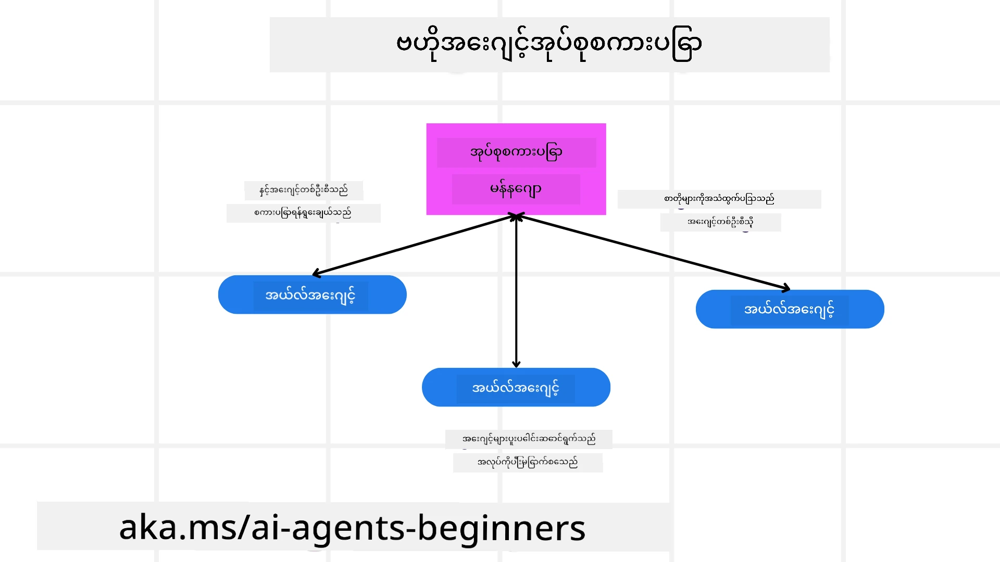
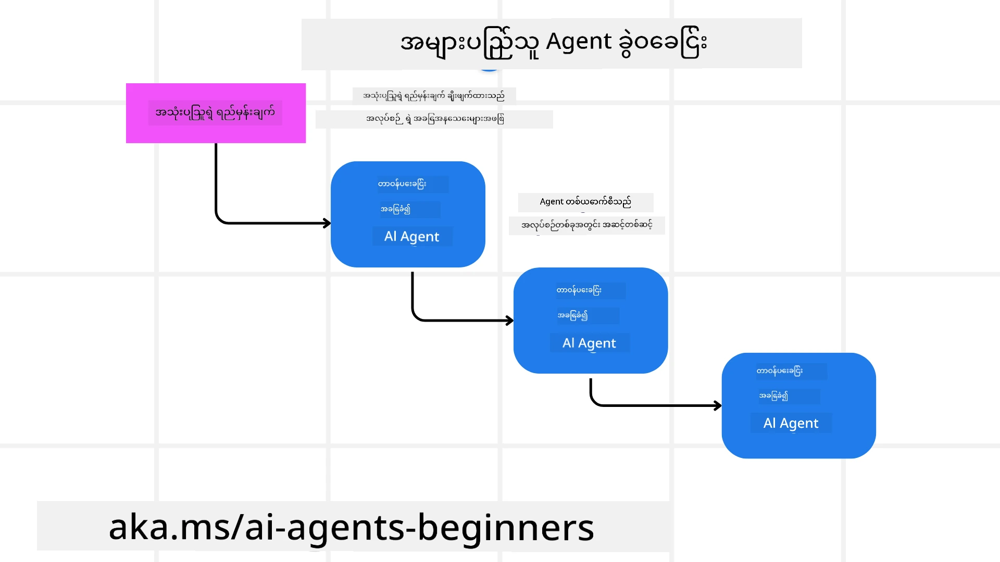
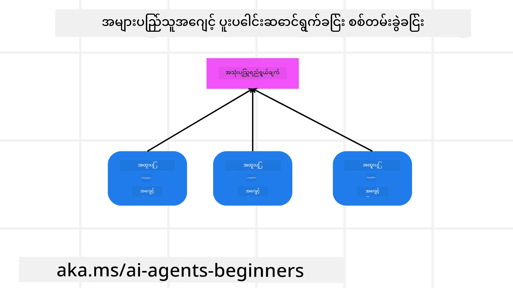

> _(ဤသင်ခန်းစာ၏ ဗီဒီယိုကို ကြည့်ရန် ပုံရိပ်အထက်နှိပ်ပါ)_

# အမြုပ်သုံးရုံးတင် စီမံခန့်ခွဲမှု ပုံစံများ

အမြုပ်သုံးရုံးတင် ပါဝင်သော ပရောဂျက်တစ်ခု အလုပ်လုပ်ရန် စတင်သွားသည်နှင့်အတူ၊ အမြုပ်သုံးရုံးတင် စီမံခန့်ခွဲမှု ပုံစံကို ပဋိရိယာဉ်ပြုရန် လိုအပ်ပါမည်။ သို့ဖြစ်သော်လည်း မည်သည့်အခါတွင် အမြုပ်သုံးရုံးများသို့ ပြောင်းလဲသင့်သည်၊ အားသာချက်များ ဘယ်လိုရှိသည်ဆိုတာ ကို တိုက်ရိုက် နားလည်ရန် ခက်ခဲနိုင်ပါသည်။

## နိဒါန်း

ဤသင်ခန်းစာတွင် ကျွန်ုပ်တို့ သုတေသနပြုရန် ဆောင်ရွက်မည့် မေးခွန်းများမှာ -

- အမြုပ်သုံးရုံးများ အသုံးပြုရန် သင့်လျော်သည့် အခြေအနေများဘာတွေလဲ?
- တစ်ရုံးတည်းသော အေးဂျင့်တစ်ယောက်ဖြင့် တာဝန်စုံ လုပ်ဆောင်ခြင်းနှင့် နှိုင်းယှဉ်စျေးကြည့်ခဲ့သည့်အခါ အမြုပ်အေရအတွက် အားသာချက်များ ဘာတွေလဲ?
- အမြုပ်သုံးရုံးတင် စီမံခန့်ခွဲမှုပုံစံ ပြုလုပ်ရာတွင် ပါဝင်သော အခြေခံအဆောက်အအုံများ ဘာတွေလဲ?
- အမြုပ်သုံးရုံးများက ဘယ်လိုအပြန်အလှန် ဆက်သွယ်ဆောင်ရွက်နေကြသည်ကို မြင်နိုင်ရန် ဘယ်လိုလုပ်မလဲ?

## သင်ယူရေးရည်မှန်းချက်များ

ဤသင်ခန်းစာပြီးဆုံးပြီးနောက်၊ သင်မှာ -

- အမြုပ်သုံးရုံးတွေသုံးတဲ့အခြေအနေတွေကို ရှာဖွေသတိထားနိုင်မည်
- တစ်ရုံးတည်းသော အေးဂျင့်နှင့်နှိုင်းယှဉ်၍ အမြုပ်အေးဂျင့်အသုံးပြုခြင်း၏ အားသာချက်များကို နားလည်နိုင်မည်
- အမြုပ်သုံးရုံးတင် စီမံခန့်ခွဲမှု ပုံစံ၏ အခြေခံအဆောက်အအုံများကိုနားလည်နိုင်မည်

ပိုမိုကြီးမားသော ပုံရိပ်က ဘာလဲ?

*အမြုပ်အေးဂျင့်များသည် ပူးပေါင်း၍ လူတူရည်မှန်းချက်တစ်ခု ကို အောင်မြင်စေရန် အတူတကွ အလုပ်လုပ်နိုင်သည့် စီမံခန့်ခွဲမှုပုံစံ တစ်မျိုး ဖြစ်ပါသည်။*

ဤပုံစံကို ရုပ်ရှင်၊ ကိုယ်တိုင်လည်ပတ်နိုင်သည့်စနစ်များနှင့် ဖြန့်ဝေရေးကွန်ပျူတာလုပ်ငန်းများတွင် ကျယ်ပြန့်စွာ အသုံးပြုကြပါသည်။

## အမြုပ်သုံးရုံးများ အသုံးပြုလျှောက်လွှာ သင့်လျော်သည့် အခြေအနေများ

အမြုပ်သုံးရုံးများ အသုံးပြုရန် သင့်လျော်သည့် အခြေအနေများရော ဘာတွေလဲ? တချို့အခြေအနေများမှာ အောက်ပါအတိုင်း အများအပြားရှိပါသည်-

- **အလုပ်လုပ်ပမာဏကြီးကျယ်ခြင်း**: အလုပ်များကို အသေးစားတာဝန်များသို့ ခွဲ၍ အေးဂျင့်အမျိုးမျိုးအား မျှပေးနိုင်ခြင်းဖြင့် 병렬ပြုလုပ်မှုနှင့် မြန်ဆန်စွာပြီးမြောက်အောင်လုပ်ဆောင်နိုင်သည်။ ဥပမာအားဖြင့် အချက်အလက်ကြီးများကို ကိုင်တွယ်မှု။
- **ရှုပ်ထွေးသောတာဝန်များ**: ရှုပ်ထွေးသောတာဝန်များကိုလည်း အသေးစားအပိုင်းများအလိုက် ခွဲခြားပေး၍ အေးဂျင့်အမျိုးမျိုးအား ခန့်အပ်ပေးနိုင်သည်။ ဥပမာတစ်ခုမှာ ကိုယ်တိုင်ဆွေးနွေးမှုပညာဥပဒေအတွက် အေးဂျင့်တွေက လမ်းညွှန်ခြင်း၊ အတားအဆီးရှာဖွေခြင်းနှင့် အခြားယာဉ်များနှင့် ဆက်သွယ်ရေးစီမံခန့်ခွဲခြင်းတို့ကို ခွဲခြားတာဝန်ယူပါသည်။
- **လုပ်ဖော်ကိုင်ဖက်ကျွမ်းကျင်မှုအမျိုးမျိုး**: အေးဂျင့်အမျိုးအစားများမှာ တာဝန်၏ အပိုင်းအစအမျိုးမျိုးကို ထိရောက်စွာ ကိုင်တွယ်နိုင်သော ကျွမ်းကျင်မှုများ ထောက်ပံ့နိုင်သည်။ ဤနေရာတွင် ကျန်းမာရေးကဏ္ဍတွင် အေးဂျင့်များသည် သိပ္ပံစစ်ဆေးမှု၊ ကုသမှုအစီအစဉ်များနှင့် လူနာအခြေအနေ စောင့်ကြပ်မှုများကို ကိုင်တွယ်နိုင်သည့် ဥပမာ ဖြစ်သည်။

## တစ်ရုံးတည်းသော အေးဂျင့်နှင့် နှိုင်းယှဉ်၍အမြုပ်အေးဂျင့်အသုံးပြုခြင်း၏ အားသာချက်များ

တစ်ရုံးတည်းသောအေးဂျင့်စနစ်သည် ရိုးရှင်းသောတာဝန်များအတွက် သင့်တော်နိုင်သော်လည်း ထပ်ခါထပ်ရပ်သော အလုပ်များအတွက် အမြုပ်အေးဂျင့်တွေသုံးခြင်းက အတော်သောအားသာချက်များရှိပါသည်။

- **ကျွမ်းကျင်မှု များစွာ ချိန်ညှိခြင်း**: တစ်ဦးချင်း အေးဂျင့်သည် တစ်ခုတည်းသော တာဝန်တွင် ကျွမ်းကျင်နိုင်ပါသည်။ တစ်ရုံးတည်းအေးဂျင့်တွင် ကျွမ်းကျင်မှုမရှိခြင်းကြောင့် ရှုပ်ထွေးသောတာဝန်များကြုံရင် ဘာလုပ်ရမည်ကို ခေါင်းလျှောက်နိုင်ပြီး မသင့်တော်သော တာဝန်ကို အဆုံးသတ်ဖို့ဖြစ်နိုင်သည်။
- **တိုးချဲ့ရန်လွယ်ကူခြင်း**: တစ်ဦးတည်းအေးဂျင့်ပေါ် အလွှာတင်ရန် မလုပ်ပဲ၊ အေးဂျင့်များ ပေါင်းထည့်ခြင်းဖြင့် စနစ်များ တိုးချဲ့ရ လွယ်ကူသည်။
- **အမှားခံနိုင်မှု**: အေးဂျင့်တစ်ယောက် ပျက်ကွက်ခဲ့လျှင် အခြားတို့ လုပ်ဆောင်နိုင်၍ စနစ်ယုံကြည်စိတ်ချမှုရှိစေသည်။

ဥပမာတစ်ခုအနေဖြင့် အသုံးပြုသူအတွက် ခရီးစဉ်တစ်ခု တင်စားစဉ်းစားကြည့်ပါ။ တစ်ရုံးတည်းသောစနစ်သည် ခရီးစဉ်စာရင်း များ၊ ဟိုတယ်များနှင့် မော်တော်ကားငှားရမ်းခြင်းတို့ကို စီမံရန် တာဝန်ယူရမည်ဖြစ်သလို အရာအားလုံးကို ကိုင်တွယ်ရန် tool များ လိုအပ်ပါသည်။ ထိုသည်ကတော့ စနစ်တစ်ခုကို ရိုးရှင်းခြင်း မရှိပဲ ပုံမှန်မော်နိုလစ်ပုံစံဖြစ်ပြီး စီမံခန့်ခွဲရန်နှင့် တိုးချဲ့ရန် အခက်အခဲများ ရှိနိုင်ပါတယ်။ အခြားဘက်တွင် အမြုပ်သုံးရုံးစနစ်သည် လေယာဉ်ရှာဖွေမှု၊ ဟိုတယ်မှတ်ပုံတင်မှုနှင့် မော်တော်ကားငှားရမ်းမှုအတွက် ခွဲခြားပြီး တာဝန်ရှိသော အေးဂျင့် များ ရှိနိုင်ပါသည်။ သည်သည်စနစ်ကိုပိုမို အပိုင်းခွဲပြီး စီမံခန့်ခွဲရန် လွယ်ကူပြီး တိုးချဲ့ရန်လည်း လွယ်ကူသွားပါသည်။

အခြားနမူနာအနေဖြင့် မိဘနှင့်ကလေးဆိုင်က စီမံခန့်ခွဲသော ခရီးသွားဌာနနှင့် Franchise အဖြစ်လည်ပတ်သော ခရီးသွားဌာနကို နှိုင်းယှဉ်ကြည့်ပါ။ မိဘနှင့်ကလေးဆိုင်သည် တစ်ရုံးတည်းအေးဂျင့်ဖြင့် ခရီးသွားအစီအစဉ် အားလုံးကို ကိုင်တွယ်မှာဖြစ်ပြီး franchise သည် လိုအပ်သလို အောင်မြင် အပိုင်းအသီးသီးကို ကိုင်တွယ်သော အေးဂျင့်များ ရှိပါသည်။

## အမြုပ်သုံးရုံးတင် စီမံခန့်ခွဲမှုပုံစံ အကောင်အထည်ဖော်ခြင်းအတွက် အခြေခံအဆောက်အအုံများ

အမြုပ်သုံးရုံးတင် စီမံခန့်ခွဲမှုပုံစံကို လက်တွေ့အသုံးပြုမီ၊ ဤပုံစံကို ဖွဲ့စည်းသည့် အခြေခံဖွဲ့စည်းပုံများကို ရှင်းလင်းနားလည်ထားရပါမည်။

ပြန်လည်ရှင်းလင်းရန်အတွက် အသုံးပြုသူ ခရီးစဉ်တင်စားမှု ဥပမာကို ထပ်မံကြည့်ကြပါစို့။ ဤនៅတွင် အခြေခံအဆောက်အအုံများမှာ -

- **အေးဂျင့် ဆက်သွယ်မှု**: လေယာဉ်ရှာဖွေသူ၊ ဟိုတယ်ရန် ပုံမှန်ပြုလုပ်သူနှင့် မော်တော်ကား ငှားရမ်းသူများသည် အသုံးပြုသူ၏ ကြိုက်နှစ်သက်မှုနှင့် ကန့်သတ်ချက်များအပေါ် သတင်းအချက်အလက်မျှဝေ ဆက်သွယ်ရမည်။ ဤဆက်သွယ်မှုအတွက် အသုံးပြုမည့် ပရိုတိုကောနှင့် နည်းလမ်းများကို ဆုံးဖြတ်ရမည်။ ဥပမာအနေဖြင့် လေယာဉ်ရှာဖွေသူသည် ဟိုတယ်လက်မှတ်ရရှိသည့် အချိန်များနှင့် ကိုက်ညီမှုရှိရန် ဟိုတယ်လက်မှတ်ပေးသူနှင့် ဆက်သွယ်ဖလှယ်ရမည်။ ထိုကြောင့် အေးဂျင့်များသည် အသုံးပြုသူ ခရီးသွားအချိန်များကို မျှဝေရန် လိုအပ်ပြီး *ဘယ်အေးဂျင့်များ ထိုသတင်းအချက်အလက် မျှဝေနိုင်မှာလဲ၊ ဘယ်လိုမျှဝေနိုင်မလဲ* ဆိုတာကို ဆုံးဖြတ်ရမည်ဟု ဆိုလိုသည်။
- **ညှိနှိုင်းရေး ကိရိယာများ**: အေးဂျင့်များသည် အသုံးပြုသူ၏ ကြိုက်နှစ်သက်မှုနှင့် ကန့်သတ်ချက်များကို ဖြည့်ဆည်းပေးနိုင်ရန် တို့၏ လှုပ်ရှားမှုများကို ညှိနှိုင်းရမည်ဖြစ်သည်။ ဥပမာအားဖြင့် အသုံးပြုသူသည် လေဆိပ်အနီး ဟိုတယ်တစ်ခုလိုချင်ပြီး ကန့်သတ်ချက်အနေဖြင့် မော်တော်ကားငှားရမ်းခြင်းသည် လေဆိပ်တွင်သာရရှိနိုင်သည် ဆိုပါစို့။ ထိုသူများသည် ဟိုတယ်လိုက်ဖက်မှုနှင့် မော်တော်ကားငှားရမ်းခြင်းကို ပြုလုပ်သည့် အေးဂျင့်များဆီတွင် ဆက်သွယ်ညှိနှိုင်းမှု လိုအပ်မည် ဖြစ်သည်။ ထိုအရေးအတွက် *အေးဂျင့်များသည် မည်သို့ လှုပ်ရှားမှုများကို ညှိနှိုင်းကြောင်း* ဆုံးဖြတ်ရမည်။
- **အေးဂျင့် ဖွဲ့စည်းပုံ**: အေးဂျင့်များသည် အသုံးပြုသူနှင့် ဆက်သွယ်မှုမှ သင်ယူ၍ ဆုံးဖြတ်ချက်ချနိုင်ရန် အတွင်းဖွဲ့စည်းပုံရှိရမည်။ ဥပမာအနေဖြင့် လေယာဉ်ရှာဖွေသူအေးဂျင့်သည် အသုံးပြုသူ အကြိုက်များအပေါ် အခြေခံ၍ လေယာဉ် အကြံပြုချက်များ ပေးနိုင်ရန် ဆုံးဖြတ်ချက်ချရေးအတွက် ဖွဲ့စည်းပုံရှိရန်လိုအပ်သည်။ ထိုသည့်အတွက် *အေးဂျင့်များသည် မည်သို့ ဆုံးဖြတ်ချက်ချပြီး အသုံးပြုသူနှင့် ဆက်သွယ်မှုမှ သင်ယူမှု ပြုလုပ်သည်* ဆိုတာ ဆုံးဖြတ်ရမည်။ ဥပမာအဖြစ် လေယာဉ်ရှာဖွေသူအေးဂျင့်သည် အရင်အကြိုက်များအပေါ် မော်ဒယ်သင်ယူမှု များကို အသုံးပြုပြီး လေယာဉ်အကြံပြုနိုင်သည်။
- **အမြုပ်အေးဂျင့် ဆက်ဆံမှု များကို မြင်နိုင်ခြင်း**: အေးဂျင့်များသည် အပြန်အလှန် ဦးဆောင်ဆက်ဆံမှု ကို မြင်နိုင်ဖို့လိုပါသည်။ ထိုကို တွေ့ရှိရန် အလားတူ အေးဂျင့် လှုပ်ရှားမှုများနှင့် ဆက်ဆံမှုများကို မှတ်တမ်းတင်ရေးဆွဲ ကြည့်ရန်၊ မကြာခဏ စစ်ဆေးရေး များ၊ ကြည့်ရှုဖော်ပြရန် အကိရိယာများနှင့် တိုင်းတာမှုများလိုအပ်သည်။
- **အမြုပ်အသုံးချမှု ပုံစံများ**: အမြုပ်သုံးရုံးစနစ်များအတွက် အမျိုးအစားကွဲပြားသော ပုံစံများရှိသည်၊ ဥပမာ - ဗဟိုစနစ်, ဖြစ်စဉ်အဆင့်များခွဲခြားခြင်း၊နှင့် မျိုးစုံပုံစံများ။ သင့်သုံးစွဲမှုအတွက် အကောင်းဆုံးပုံစံကို ရွေးချယ်ရပါမည်။
- **လူသား ပါဝင်မှု**: အများအားဖြင့် လူသားတစ်ဦး နှင့် အေးဂျင့်တို့ အပြန်အလှန် ဆက်ဆံမှုရှိပြီး လူထိတွေ့ရေးလိုအပ်သော အချိန်များ၊ လူအား မှီတင်းရန်အချိန်များစဉ်းစားရမည်။ ဥပမာ အေးဂျင့်များ မအကြံပြုထားသော ဟိုတယ် သို့ လေယာဉ်ကို အသုံးပြုသူ မေးမြန်းသည် (လက်ခံမှု မပြုလုပ်မီ သတိပေးသည့် အဆင့်)။

## အမြုပ်အေးဂျင့်ဆက်ဆံမှုများကို မြင်နိုင်ခြင်း

အေးဂျင့်များသည် အပြန်အလှန် မည်သို့ ဆက်ဆံဆောင်ရွက်နေကြသည်ကို မြင်ရခြင်းမှာ အရေးပါတော့သည်။ ဤမြင့်တင်မှုပြုခြင်းသည် အမှားရှာဖွေရေး၊ စနစ်တိုးတက်မြှင့်တင်ရေးနှင့် စနစ်တစ်ခုလုံး၏ ထိရောက်မှုကို သေချာစေရန် အထောက်အကူပြုသည်။ ထို့အတွက် အေးဂျင့်လုပ်ဆောင်မှုများနှင့် ဆက်သွယ်မှုများကို မှတ်တမ်းတင်ခြင်း၊ ကြည့်ရှုဖော်ပြခြင်းနှင့် လုပ်ဆောင်မှုတိုင်းတာမှုကိရိယာများလိုအပ်ပါသည်။

ဥပမာတွင် အသုံးပြုသူ ခရီးစဉ် တင်စားမှု တစ်ခု အတွက် dashboard တစ်ခုထည့်သွင်းနိုင်ပြီး အေးဂျင့်တစ်ခုချင်း၏ အခြေအနေ၊ အသုံးပြုသူ၏ ကြိုက်နှစ်သက်မှုများ၊ ကန့်သတ်ချက်များနှင့် အေးဂျင့်များအကြား ဆက်သွယ်မှုကို ပြသနိုင်ပါသည်။ အဆိုပါ dashboard တွင် အသုံးပြုသူ ခရီးသွားအချိန်များ၊ လေယာဉ်အကြံပြုချက်များ၊ ဟိုတယ်အကြံပြုချက်များ၊ မော်တော်ကား ငှားရမ်းမှု အကြံပြုချက်များ ပြသမည်ဖြစ်သည်။ ၎င်းဖြင့် အေးဂျင့်တွေ မည်သို့ ဆက်ဆံနေကြောင်း၊ အသုံးပြုသူသဘောထားနှင့် ကန့်သတ်ချက်များ ထိန်းသိမ်းလျက်ရှိမှုရှိ/မရှိကို တိတိကျကျ မြင်နိုင်ပါသည်။

အချက်အလက်တွဲအား ကိုးကား၍ အနက်ရှိုင်းစွာ ကြည့်ရှုကြပါစို့။

- **မှတ်တမ်းတင်ခြင်းနှင့် မော်နီတာကိရိယာများ**: အေးဂျင့်တစ်ခုချင်း တဆင့် လုပ်ဆောင်ချက်တိုင်းကို မှတ်တမ်းတင်ပါ ရမည်။ မှတ်တမ်းတွင် လုပ်ဆောင်သူ အေးဂျင့်၊ လုပ်ဆောင်ချက်အမျိုးအစား၊ လုပ်ဆောင်ချိန်နှင့် လုပ်ဆောင်ချက်ရလဒ်တို့ ပါဝင်စွာ သိမ်းဆည်းထားနိုင်သည်။ ဤဒေတာကို အမှားရှာဖွေရေး၊ တိုးတက်အောင်လုပ်ဆောင်မှု နှင့် အခြားအခန်းကဏ္ဍများတွင် အသုံးပြုနိုင်သည်။

- **ကြည့်ရှုဖော်ပြမှုကိရိယာများ**: အေးဂျင့်များအကြားဆက်ဆံမှုများကို ပိုမို ရှင်းလင်း နားလည်စေရန် ကြည့်ရှုဖော်ပြမှုကိရိယာများ ဖြင့် ထောက်ပံ့ခြင်း။ ဥပမာ၊ အေးဂျင့်များအကြား သတင်းအချက်အလက် လှုပ်ရှားမှုကြောင်းကို ဂရပ်ဖ်ဖြင့် ဖော်ပြနိုင်သည်။ ဤကိရိယာများသည် စနစ်၏ အရှုပ်တော်ပေါင်း၊ များမှားမှုများနှင့် အခြားပြဿနာများဖြစ်ပေါ်နေရာများကို ရှာဖွေရန် အထောက်အကူဖြစ်စေပါသည်။

- **စွမ်းဆောင်ရည်တိုင်းတာမှုများ**: အမြုပ်အေးဂျင့်စနစ်၏ ထိရောက်မှုကို စစ်ဆေးနိုင်ရန် စွမ်းဆောင်ရည်တိုင်းတာမှုများ သုံးနိုင်သည်။ ဥပမာ၊ လူလုပ်ငန်းများ အချိန်ယူမှု၊ တစ်ခုချင်း သတ်မှတ်ချိန်အတွင်း တာဝန်ပြီးဆုံးမှု အရေအတွက်နှင့် အကြံပြုချက်တိကျမှု တို့ကို တိုင်းတာနိုင်သည်။ ဤသတင်းအချက်အလက်များကို အမြှင့်တင်ရန် နယ်ပယ်များ ရှာဖွေရန်နှင့် စနစ်ကို သက်ဆိုင်ရာ အတိုင်း ပြုပြင်ရန် အသုံးပြုနိုင်သည်။

## အမြုပ်သုံးရုံး အသုံးပြုစနစ် ပုံစံများ

အမြုပ်အေးဂျင့် app များ ဆောက်ရန် အသုံးပြုနိုင်သော ပုံစံစာချုပ် များအား မိတ်ဆက်ပါမည်။ အောက်ပါ ပုံစံများကို စဉ်းစားအသုံးချစရာ လိုအပ်သည်ဟု သိမြင်ရပါသည်။

### အုပ်စု ဆက်သွယ်ရေး (Group chat)

ဤပုံစံသည် အမြုပ်အေးဂျင့်များ အချင်းချင်း ဆက်သွယ်နိုင်သည့် အုပ်စု ဆက်သွယ်ရေး app တည်ဆောက်ချင်သောအခါ အသုံးဝင်ပါသည်။ အသုံးများသောကိစ္စများမှာ အဖွဲ့အစည်းပူးပေါင်းဆောင်ရွက်မှု၊ ဖောက်သည်ပံ့ပိုးမှုနှင့် လူမှုကွန်ရက်။

ဤပုံစံတွင် တစ်ဦးချင်း အေးဂျင့်သည် အုပ်စု ဆက်သွယ်ရေးမှ အဖက်ရာအား ကိုယ်စားပြုသည်။ သတင်းပို့မှုများကို သတင်းပို့ရေး ပရိုတိုကောဖြင့် ပို့သွားမည်။

ဤပုံစံကို ဗဟိုစနစ်ဖြင့် အချက်အလက်အားလုံးကို ဗဟိုဆာဗာမှ လမ်းညွှန်၍ အရန်ပြုလုပ်နိုင်သလို၊ တိုက်ရိုက် ပို့ဆောင်မှုများ ပြုလုပ်ရသော သော့ပိတ်မည်။

### လက်ခံပြီး တာဝန်ပေးခြင်း (Hand-off)

ဤပုံစံသည် အမြုပ်အေးဂျင့်များ တစ်ဦးမှ တစ်ဦးသို့ တာဝန်များ လွှဲပြောင်းနိုင်သော app တည်ဆောက်ရာတွင် အသုံးဝင်သည်။

စုံစမ်းဖောက်သည်ပံ့ပိုးမှု, တာဝန်စီမံခန့်ခွဲမှုနှင့် လုပ်ငန်းလုပ်ဆောင်မှုစနစ်များတွင် အသုံးပြုကြသည်။

အေးဂျင့်တစ်ခုချင်းသည် တာဝန် သို့မဟုတ် လုပ်ငန်း လှုပ်ရှားမှုအဆင့်ကို ကိုယ်စားပြုပြီး အကြံပြု အဆင့်စည်းမျဉ်းများအတိုင်း တာဝန်များကို ထပ်တလဲလဲ လွှဲပြောင်းနိုင်သည်။

### ပူးပေါင်းအကြံပြုမှု (Collaborative filtering)

ဤပုံစံသည် အမြုပ်အေးဂျင့်များ ပူးပေါင်းကူညီပြီး အသုံးပြုသူများအား အကြံပြုချက်ပေးရာတွင် အသုံးဝင်သည်။

အမြုပ်အေးဂျင့်များကို ပူးပေါင်းအသုံးပြုချင်သော အကြောင်းမှာ၊ နိုင်ငံအမျိုးမျိုးအရ အေးဂျင့်နှစ်ဦးနှင့်ပိုပြီးကျွမ်းကျင်မှုအမျိုးမျိုး ရှိနိုင်ပြီး အကြံပြုမှုလုပ်ငန်းမှာ တကယ်သက်သာစေတတ်သည်။

ဥပမာအနေဖြင့် stock market တွင် လူတစ်ယောက် အကောင်းဆုံးစတော့ရှယ်ယာ အကြံပြုချက် ရယူလိုပါက -

- **စက်မှုနှင့် စျေးကွက် ကျွမ်းကျင်သူ**: အေးဂျင့်တစ်ခုမှာ သတ်မှတ်ကဏ္ဍတွင် ကျွမ်းကျင်သူဖြစ်ပါသည်။
- **နည်းပညာဆန်းစစ်ခြင်း**: မတူညီသော အေးဂျင့်တစ်ခုမှာ စွမ်းဆောင်ရည်ဆန်းစစ်မှု ရှိသည်။
- **အခြေခံဆန်းစစ်ခြင်း**: အခြားတစ်ဦးမှာ အခြေခံစစ်တမ်းများ ကျွမ်းကျင်သူဖြစ်သည်။ ဤအေးဂျင့်များ ပူးပေါင်း၍ အသုံးပြုသူအတွက် ပိုမိုကျယ်ပြန့်ပြီး စုံလင်သော အကြံပြုချက် ထုတ်ပေးနိုင်သည်။

## နမူနာ - ပြန်အမ်းငွေ ဆောင်ရွက်မှု

ဖောက်သည်တစ်ဦးထံမှ ထုတ်ကုန်အတွက် ပြန်အမ်းငွေ ရယူရန် ကြိုးပမ်းနေသည်ဆိုပါက၊ ဤလုပ်ထုံးလုပ်နည်းအတွင်း ပါဝင်နိုင်သော အေးဂျင့်များ များပြားသည်။ ယင်းအေးဂျင့်များအား ပြန်လည်ကောက်နှုတ်မှု အထူးတလည် သတ်မှတ်ချက်ရှိသောများနှင့် အခြား စီးပွားရေးလုပ်ငန်းတွင် အသုံးပြုနိုင်သော စံတမျိုးထား အေးဂျင့်များသို့ ခွဲခြားနိုင်ပါသည်။

**ပြန်အမ်းငွေ ဆောင်ရွက်မှု အတွက် အထူး ခန့်အပ်သော အေးဂျင့်များ**:

ပြန်အမ်းငွေ ဆောင်ရွက်မှုတွင် ပါဝင်နိုင်သော အေးဂျင့်များမှာ -

- **ဖောက်သည် အေးဂျင့်**: ဖောက်သည်ကို ကိုယ်စားပြုပြီး ပြန်အမ်းငွေ လုပ်ထုံးလုပ်နည်း စတင်ရန် တာဝန်ရှိသည်။
- **အရောင်းသူ အေးဂျင့်**: အရောင်းသူ၏ ကိုယ်စားပြု၍ ပြန်အမ်းငွေ လုပ်ထုံးလုပ်နည်းကို ဆောင်ရွက်သည်။
- **ငွေပေးချေမှု အေးဂျင့်**: ပေးငွေ လုပ်ထုံးလုပ်နည်းကို ကိုယ်စားပြုပြီး ဖောက်သည်ငွေပြန်အမ်းမှုကို ဆောင်ရွက်သည်။
- **ဖြေရှင်းမှု အေးဂျင့်**: ပြန်အမ်းငွေ ဆောင်ရွက်မှုအတွင်း ဖြစ်ပေါ်လာသော ပြဿနာများကို ဖြေရှင်းရေး တာဝန်ရှိသည်။
- **လိုက်ပံ့မှု အေးဂျင့်**: ပြန်အမ်းငွေ လုပ်ထုံးလုပ်နည်းသည် စည်းကမ်းများနှင့် မူဝါဒများနဲ့ ကိုက်ညီစေရန် တာဝန်ယူသည်။

**အထွေထွေ အေးဂျင့်များ**:

ဤအေးဂျင့်များသည် သင်၏ စီးပွားရေး အခြားဝန်းကျင်များတွင်လည်း အသုံးပြုနိုင်ပါသည်။

- **ပို့ဆောင်ရေး အေးဂျင့်**: ထုတ်ကုန်ကို အရောင်းသူဆီ ပြန်ပို့ရာ လုပ်ငန်းစဉ်အား ကိုယ်စားပြုသည်။ ဤအေးဂျင့်ကို ပြန်အမ်းငွေ ဆောင်ရွက်မှုတွင်သာမက အခြားပစ္စည်းပို့ဆောင်မှုလုပ်ငန်းများတွင်လည်း အသုံးပြုနိုင်သည်။
- **တုံ့ပြန်မှု အေးဂျင့်**: ဖောက်သည်၏ တုံ့ပြန်မှု စုဆောင်းရေးတာဝန်ရှိသည်။ တုံ့ပြန်မှုကို ဘယ်အချိန်မဆို ထုတ်ယူနိုင်သည်၊ ပြန်အမ်းငွေလုပ်ငန်းပြီးဆုံးချိန်သာမက။
- **မြင့်မားမှု အေးဂျင့်**: ပြဿနာများကို အဆင့်မြှင့်ရန် တာဝန်ယူသည်။ မည်သည့်လုပ်ငန်းလုပ်ဆောင်မှုတွင်မဆို ပြဿနာ မြင့်မားမှု အသုံးပြုနိုင်သည်။
- **အသိပေးမှု အေးဂျင့်**: ပြန်အမ်းငွေ လုပ်ငန်းစဉ် အစဉ်အဆက် အသိပေးချက်များ ပို့နိုင်သည်။
- **စစ်တမ်း အေးဂျင့်**: ပြန်အမ်းငွေ လုပ်ငန်းနှင့်ဆိုင်သော သတင်းအချက်အလက်များ စစ်တမ်းတင်၍ ခွဲခြမ်းစိတ်ဖြာသည်။
- **စစ်ဆေးမှု အေးဂျင့်**: ပြန်အမ်းငွေ လုပ်ငန်းကို မှန်မှန်ကန်ကန် ဆောင်ရွက်နေမှုကို စစ်ဆေးသည်။
- **အစီရင်ခံမှု အေးဂျင့်**: ပြန်အမ်းငွေ ဆောင်ရွက်မှု အခြေအနေများအပေါ် စာရင်းများ ထုတ်ပေးသည်။
- **အသိပညာ အေးဂျင့်**: ပြန်အမ်းငွေ ဆိုင်ရာ သတင်းအချက်အလက်များနှင့် သင်၏ စီးပွားရေး အစိတ်အပိုင်းများအတွက် အသိပညာ အချက်အလက် များ စုဆောင်း၊ ထိန်းသိမ်းသည်။
- **လုံခြုံရေး အေးဂျင့်**: ပြန်အမ်းငွေ လုပ်ငန်း၏ လုံခြုံရေးကို အာမခံသည်။
- **အရည်အသွေး အေးဂျင့်**: ပြန်အမ်းငွေ လုပ်ငန်းအရည်အသွေးကို ထိန်းသိမ်း သေချာစေရန် တာဝန်ယူသည်။

အထက်တွင်ပြုစုထားသော အေးဂျင့်များသည် ပြန်အမ်းငွေ လုပ်ငန်းအတွက်သာမက စီးပွားရေးအခြားအပိုင်းများတွင်လည်း အသုံးပြုနိုင်သည်ဟု မျှော်လင့်ပါသည်။ ထို့ကြောင့် မည်သို့ အေးဂျင့်များကို သင့်အမြုပ်စနစ်တွင် အသုံးပြုမည်ကို စဉ်းစားနိုင်ဖို့ ကြောက်ရွံ့ချက်ပေးပါသည်။

## လေ့ကျင့်ခန်း

ဖောက်သည်ပံ့ပိုးမှု လုပ်ငန်းစဉ်အတွက် အမြုပ်အေးဂျင့်စနစ်တစ်ခုဒီဇိုင်းဆွဲပါ။ ပါဝင်သော အေးဂျင့်များ၊ ၎င်းတို့၏ တာဝန်များနှင့် အပြန်အလှန် ဆက်ဆံမှုများကို ဖော်ထုတ်ပါ။ ဖောက်သည်ပံ့ပိုးမှုတွင်သာ သီးခြားသတ်မှတ်ထားသော အေးဂျင့်များနှင့် စီးပွားရေးအခြားဝန်းကျင်များတွင် အသုံးပြုနိုင်သော အေးဂျင့်ပုံစံများကို စဉ်းစားပါ။

> အောက်ပါ ဖြေရှင်းချက်ကို ဖတ်ရှုမယ့်အခါ မဖတ်မီ စဉ်းစားလိုက်ပါ၊ သင်စဉ်းစားထားသည့်ထက် ပိုပြီး အေးဂျင့်များ လိုအပ်နိုင်ပါတယ်။

> အကြံပြုချက် - ဖောက်သည် စာနာမှု လုပ်ငန်းစဉ် အဆင့်အတန်းများနှင့် မည်သည့်စနစ်အတွက်မဆို လိုအပ်သော အေးဂျင့်များကို စဉ်းစားပါ။

## ဖြေရှင်းချက်

[Solution](./solution/solution.md)

## အသိပညာစစ်ဆေးမှုများ

### မေးခွန်း ၁

မည်သည့်အခြေအနေသည် မျိုးစုံအေးဂျင့်စနစ်အတွက် အကောင်းဆုံးသင့်တော်မှုရှိသနည်း။

- [ ] A1: အထွေထွေမေးခွန်းများကို တစ်ခုသော သိပ္ပံဗေဒအခြေခံနှင့် ကျန်ရှစ်သောကိရိယာများအသုံးပြုပြီး စနစ်တကျ ဖြေကြားသော အထောက်အပံ့ဘော့တစ်ခု။
- [ ] A2: ငွေပြန်ထုတ်ခြင်း လုပ်ငန်းစဉ်တွင် အတုအယောင် ခွဲခြားမှု၊ ငွေပေးချေမှုနှင့် လိုက်နာမှု အခန်းကဏ္ဍများကို ခွဲခြားထားရပြီး၊ အခန်းကဏ္ဍတိုင်းတွင် မိမိကိရိယာများရှိပြီး၊ ၎င်းတို့ရလဒ်များကို ကိုင်တွယ်စနစ်တကျ စီမံခန့်ခွဲရမည်။
- [ ] A3: တစ်နာရီကြာ အာရုံစိုက်မှု လုပ်ငန်းသို့ မည်သည့်ပုံစံဖြင့် မဆို လွယ်ကူသော စီမျဉ်ခြင်း တုံ့ပြန်မှုများ သန်းချီပေါ်တင်လာသည်။

### မေးခွန်း ၂

တစ်ဦးတည်းအေးဂျင့်သည် မည်အချိန်တွင် ပိုမိုသင့်တော်သနည်း။

- [ ] A1: တာဝန်ကို တစ်ခုသော ညွှန်ကြားချက်နှင့် ကိရိယာများဖြင့် လုပ်ဆောင်နိုင်ပြီး၊ အထူးကျွမ်းကျင်သူထံ လွှဲပြောင်းခြင်း မလိုအပ်ပါ။
- [ ] A2: အေးဂျင့်သည် မိမိလက်ထက်ရှိ ကိရိယာများထက် ပိုမိုရရှိနိုင်သည်။
- [ ] A3: လုပ်ငန်းစဉ်တွင် ခွဲခြားထားသည့် အခန်းကဏ္ဍများ ရှိပြီး၊ ခွင့်ပြုချက်ကွဲပြားခြားနားပြီး၊ အလိုအလျောက် စစ်ဆေးမှု မှတ်တမ်းပေါင်းများစွာ လိုအပ်သည်။

[Solution quiz](./solution/solution-quiz.md)

## အယူအဆ

ဤသင်ခန်းစာတွင် မျိုးစုံအေးဂျင့်ဒီဇိုင်းပုံစံအား လေ့လာပြီး၊ မျိုးစုံအေးဂျင့်များ အသုံးပြုသင့်သော အခြေအနေများ၊ တစ်ဦးတည်းအေးဂျင့်ထက် မျိုးစုံအေးဂျင့် သုံးခြင်း၏ အားသာချက်များ၊ မျိုးစုံအေးဂျင့်ဒီဇိုင်းပုံစံ ထည့်သွင်းဆောင်ရွက်ရာတွင် အသုံးပြုသည့် အခြေခံအဆောက်အအုံများနှင့် မျိုးစုံအေးဂျင့်များလက်တွေ့ ဆက်သွယ်ဆောင်ရွက်မှုများကို ကြည့်ရှုနိုင်သည်။

### မျိုးစုံအေးဂျင့်ဒီဇိုင်းပုံစံနှင့် ပတ်သတ်၍ မေးခွန်းများ ရှိနေပါသလား။

[Microsoft Foundry Discord](https://discord.com/invite/ATgtXmAS5D) တွင်အတူတူ၍ အခြားတတ်မြောက်သူများနှင့် တွေ့ဆုံကာ အလုပ်ချိန်များ တက်ရောက်၍ သင်၏ AI အေးဂျင့်များဆိုင်ရာမေးခွန်းများကို ဖြေကြားပါ။

## အပိုဆောင်းအရင်းအမြစ်များ

- <a href="https://learn.microsoft.com/azure/ai-services/agents/overview" target="_blank">Microsoft Agent Framework သတင်းအချက်အလက်</a>
- <a href="https://www.analyticsvidhya.com/blog/2024/10/agentic-design-patterns/" target="_blank">Agentic ဒီဇိုင်န့်ပုံစံများ</a>

## ယခင်သင်ခန်းစာ

[Planning Design](../07-planning-design/README.md)

## နောက်တန်းသင်ခန်းစာ

[Metacognition in AI Agents](../09-metacognition/README.md)

---

<!-- CO-OP TRANSLATOR DISCLAIMER START -->
**ပြောကြားချက်**
ဤစာတမ်းကို AI ဘာသာပြန်ဝန်ဆောင်မှု [Co-op Translator](https://github.com/Azure/co-op-translator) အသုံးပြု၍ ဘာသာပြန်ထားပါသည်။ ကျွန်ုပ်တို့သည် တိကျမှန်ကန်မှုအတွက် ကြိုးပမ်းနေသော်လည်း၊ စက်ကိရိယာဘာသာပြန်ခြင်းများတွင် အမှားများ သို့မဟုတ် မှားယွင်းချက်များ ပါဝင်နိုင်ကြောင်း သတိပြုပါရန် လိုအပ်ပါသည်။ မူလစာတမ်းကို မူရင်းဘာသာဖြင့်သာ ယုံကြည်စိတ်ချရသော အချက်အလက်အဖြစ် သတ်မှတ်သင့်သည်။ အရေးကြီးသည့် သတင်းအချက်အလက်များအတွက် ပရော်ဖက်ရှင်နယ် လူသားဘာသာပြန်သူဝန်ဆောင်မှုကို အကြံပြုပါသည်။ ဤဘာသာပြန်ချက်ကို အသုံးပြုခြင်းမှ ဖြစ်ပေါ်လာသော နားလည်မှုကွာခြားမှုများ သို့မဟုတ် မမှန်ကန်သော အသုံးပြုမှုများအတွက် ကျွန်ုပ်တို့ တာဝန်မခံပါ။
<!-- CO-OP TRANSLATOR DISCLAIMER END -->