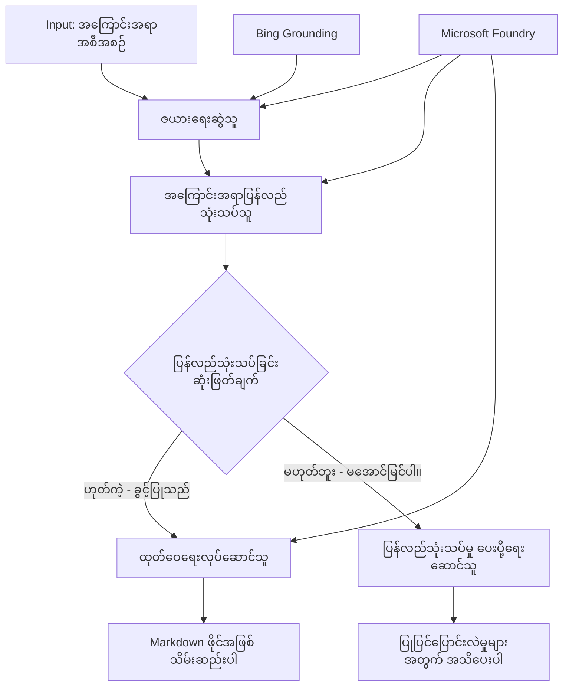

# 🔀 Microsoft Foundry (.NET) နှင့် အခြေအနေတစ်ခုအရ အေးဂျင့်လုပ်ငန်းစဉ်များ

## 📋 သင်ခန်းစာ - သိပ္ပံနှင့် ဆုံးဖြတ်ချက်အခြေခံ လုပ်ငန်းစဉ်များ

ဤမှတ်စုစာအုပ်သည် Microsoft Foundry နှင့် Microsoft Agent Framework ကို အသုံးပြု၍ **အခြေအနေတစ်ခုအပေါ် အခြေခံသော Workflow ပုံစံများ** ကို ပြသသည်။ သင်သည် AI သုံးသပ်ချက်များ၊ စီးပွားရေး စည်းကမ်းများနှင့် အပြောင်းအလဲရှိသည့် အခြေအနေများအရ ချဉ်းကပ်မှုများကို ဉာဏ်ရည်မြင့်စွာ ဦးတည်စီမံနိုင်သော စက်မှုလုပ်ငန်းအဆင့်မြင့် automation workflows ဖန်တီးနည်းကို လေ့လာရမည်ဖြစ်သည်။

## 🎯 လေ့လာရမည့် ရည်ရွယ်ချက်များ

### 🧠 **သိပ္ပံနှင့် ဆုံးဖြတ်ချက် အခြေခံ အင်ဂျင်နီယာ**
- **အခြေအနေတစ်ခုအပေါ် အခြေခံ လိုဂျစ် ဆောက်လုပ်ခြင်း**: ပိုမိုရှုပ်ထွေးသည့် ဆုံးဖြတ်ချက်သစ်တောများ နှင့် ခွဲခွန်အချက်များ တည်ဆောက်ခြင်း
- **AI အင်အားဖြင့် ဦးတည်ရန်လမ်းကြောင်း ရွေးချယ်မှု**: Microsoft Foundry မော်ဒယ်များကို အသုံးပြု၍ ဉာဏ်ရည်ရှိသော လမ်းကြောင်း ရွေးချယ်ခြင်း
- **အပြောင်းအလဲရှိခြင်း Workflow ကို ကိုက်ညီစေရန်**: ပြောင်းလဲခြင်းများနှင့် Runtime သုံးသပ်ချက်များအပေါ် အခြေခံ၍ Workflow အပြုအမူ ပြောင်းလဲခြင်း
- **စီးပွားရေး စည်းကမ်းများ စည်းညွန်မှု**: လုပ်ငန်းလိုဂျစ်နှင့် လိုက်နာရမည့် စည်းကမ်းများကို Workflow ထဲ ပေါင်းစပ်ခြင်း

### 🔀 **တိုးတက်တဲ့ အခြေအနေတစ်ခုအပေါ် အခြေခံပုံစံများ**
- **အချက်ပေါင်းများစွာ ပါဝင်သော ဆုံးဖြတ်ချက် ပြုလုပ်ခြင်း**: လမ်းကြောင်း ရွေးချယ်ခြင်းအတွက် အချက်ဗေဒများစွာ ကို သုံးသပ်ခြင်း
- **အကြောင်းအရာသိမြင့် သုံးသပ်မှု**: Workflow သုံးသပ်မှုနဲ့ သမိုင်းကြောင်းအခြေခံ၍ ဆုံးဖြတ်ချက် ပြုလုပ်ခြင်း
- **အပြောင်းအလဲရှိစေသော Workflow ပြုပြင်မှု**: အချိန်နှင့်တပြေးညီ အခြေအနေများအရ လုပ်ငန်းလမ်းကြောင်း ပြောင်းလဲခြင်း
- **စည်းကမ်းအင်ဂျင် ပေါင်းစပ်ခြင်း**: Workflow အတွင်း ရှုပ်ရှင်းသော စီးပွားရေး စည်းကမ်း အင်ဂျင်များ ဆောက်လုပ်ခြင်း

### 🏢 **စီးပွားရေးအတွက် အခြေအနေတစ်ခုအပေါ် အခြေခံလှုပ်ရှားမှုများ**
- **စာရွက်စာတမ်း သတ်မှတ်ခြင်းနှင့် လမ်းကြောင်းပေးခြင်း**: စာရွက်စာတမ်းများကို အလိုအလျောက် သတ်မှတ်ပြီး သင့်လျော်သော Workflow သို့ ဦးတည်ပေးခြင်း
- **ဖောက်သည်ဝန်ဆောင်မှု စစ်ဆေးခြင်း**: ဖောက်သည်မေးမြန်းမှုများကို ကျွမ်းကျင်သော အဖွဲ့များသို့ ဉာဏ်ရည်ရှိစွာ ဦးတည်ပေးခြင်း
- **လိုက်နာမှုနှင့် အန္တရာယ် စစ်ဆေးခြင်း**: အန္တရာယ်အခြေအနေအရ သတ်မှတ်ထားသည့် စစ်ဆေးခြင်းများ အသုံးပြုခြင်း
- **အရည်အသွေး အာမခံမှု Workflow များ**: အရည်အသွေး ဆန်းစစ်မှုများအပေါ် အခြေခံ၍ သင့်လျော်သော စစ်ဆေးမှု လမ်းကြောင်း ပေးခြင်း

## ⚙️ လိုအပ်ချက်များနှင့် စီမံခြင်း

### 📦 **လိုအပ်သော NuGet ကုဒ်များ**

အခြေအနေတစ်ခုအပေါ် အခြေခံ Workflow ကို စီမံရန် နောက်ဆုံးပေါ် စက္ကန့်တွေ:

```xml
<!-- Core AI Framework -->
<PackageReference Include="Microsoft.Extensions.AI" Version="9.9.0" />

<!-- Azure AI Agents with Persistent State -->
<PackageReference Include="Azure.AI.Agents.Persistent" Version="1.2.0-beta.5" />

<!-- Azure Identity and Utilities -->
<PackageReference Include="Azure.Identity" Version="1.15.0" />
<PackageReference Include="System.Linq.Async" Version="6.0.3" />
<PackageReference Include="DotNetEnv" Version="3.1.1" />

<!-- Local Workflow Framework References -->
<!-- Microsoft.Agents.Workflows.dll - Advanced workflow orchestration -->
<!-- Microsoft.Agents.AI.AzureAI.dll - Microsoft Foundry integration -->
<!-- Microsoft.Agents.AI.dll - Core agent abstractions -->
```

### 🔑 **Microsoft Foundry ကွန်ဖစ်တွက်ရှင်း**

**လိုအပ်သော Azure အရင်းအမြစ်များ:**
- Microsoft Foundry နေရာတွင် အခြေအနေတစ်ခုအပေါ် အခြေခံ ဆက်လက်သုံးစွဲမှု မော်ဒယ်များ ရှိရန်
- Azure subscription တွင် သင့်တော်သော ကွန်ပျူက်ရှင်း အရေအတွက်နှင့် ခွင့်ပြုချက်များ ရှိရန်
- ဆုံးဖြတ်ချက် ပြုလုပ်မှုနှင့် အကြောင်းအရာ သုံးသပ်မှု အတွက် AI မော်ဒယ်များ တွင် ထည့်သွင်းထားရန်
- (Optional) Bing Search API ဆက်သွယ်မှု အတည်ပြုနိုင်စေရန်

**ပတ်ဝန်းကျင် ဖိုင် ပြင်ဆင်မှု (.env ဖိုင်):**
```env
# Microsoft Foundry Configuration
AZURE_AI_PROJECT_ENDPOINT=https://your-project.cognitiveservices.azure.com/
BING_CONNECTION_ID=your-bing-connection-id
```

**အတည်ပြုမှု စနစ်များ စီမံခြင်း:**
```csharp
// Azure CLI or Managed Identity authentication
using Azure.Identity;
var credential = new AzureCliCredential();

// Load environment configuration
DotNetEnv.Env.Load("../../../.env");
```

### 🏗️ **အခြေအနေတစ်ခုအပေါ်အခြေခံ Workflow ဖွဲ့စည်းပုံ**



**အဓိက ပါဝင်သူများ:**
- **Draft Executor**: မူကြမ်းရေးဆွဲမှုအတွက် AI အေးဂျင့်
- **Content Review Executor**: Draft အရည်အသွေး နှင့် လိုက်နာမှု စစ်ဆေးသူ AI အေးဂျင့်
- **Conditional Routing**: သုံးသပ်ချက်အပေါ် မူတည်ပြီး လမ်းကြောင်း ရွေးချယ်သူ
- **Publish/Review Paths**: ခွင့်ပြုထားသည့်အကြောင်းအရာ နှင့်ငြင်းပယ်ထားသည့် အကြောင်းအရာ အတွက် လမ်းကြောင်းကွဲပြားမှုများ
- **State Management**: Workflow တစ်လျှောက်လုံး အကြောင်းအရာနှင့် သုံးသပ်ချက် အချက်အလက်များ ထိန်းသိမ်းစောင့်ရှောက်ခြင်း

## 🎨 **အခြေအနေတစ်ခုအပေါ် အခြေခံ Workflow တီထွင်ခြင်း ပုံစံများ**

### 📋 **အရည်အသွေး အတန်းများနှင့်အတူ အကြောင်းအရာ ထုတ်လုပ်ခြင်း**
```
Outline → Draft Creation → Quality Review → {Approve: Publish | Reject: Revise}
```

### 🎯 **အန္တရာယ်အခြေခံစာရွက်စာတမ်း ကိစ္စရပ်များ ကိုင်တွယ်ခြင်း**
```
Document → Risk Assessment → {Low: Standard | High: Enhanced Review}
```

### 🔍 **ဖောက်သည်ဝန်ဆောင်မှု ဉာဏ်ရည်များဖြင့် လမ်းကြောင်းရွေးချယ်ခြင်း**
```
Customer Query → Analysis → {Simple: FAQ Bot | Complex: Human Agent}
```

### 💼 **လိုက်နာမှု အခြေခံ Workflow များ**
```
Content → Compliance Check → {Pass: Publish | Fail: Legal Review}
```

## 🏢 **စီးပွားရေး အခြေအနေတစ်ခုအပေါ် အကျိုးကျေးဇူးများ**

### 🎯 **ဉာဏ်ရည်ကြီး Automation**
- **အသိပညာပါ ဆုံးဖြတ်ချက်များ**: အကြောင်းအရာ သုံးသပ်ချက်နှင့် အကြောင်းအရာသက်ဆိုင်မှုအပေါ် အခြေခံ၍ AI လမ်းကြောင်းရွေးချယ်မှု
- **အပြောင်းအလဲဖြစ်နိုင်သော လုပ်ငန်းစဉ်များ**: အခြေအနေများ ပြောင်းလဲမှုအပေါ် အလိုအလျောက် ပြင်ဆင်သွားသော Workflow များ
- **စီးပွားရေး စည်းကမ်းဆောင်ရွက်ခြင်း**: ရှုပ်ထွေးသော စည်းကမ်းများ နှင့် မူဝါဒများကို အလိုအလျောက် အကောင်အထည်ဖော်ခြင်း
- **အကြောင်းအရာသိမြင့် လမ်းကြောင်းရွေးချယ်မှု**: Workflow အနှံ့အပြား သမိုင်းပြ ပြီးစုထားသော အချက်အလက်များအပေါ် အခြေခံ၍ ဆုံးဖြတ်ချက်ချခြင်း

### 📈 **လုပ်ဆောင်ချက်အလွန်ကောင်းမြင့်ခြင်း**
- **အရင်းအမြစ်မွန်မြတ်စွာ ဖြန့်ဝေခြင်း**: အကောင်းဆုံး ကျွမ်းကျင်သူများနှင့် လုပ်ထုံးလုပ်နည်းများသို့ အလုပ်များ ဦးတည်ပေးခြင်း
- **လူ့မီနူးကျောပုံ လျော့နည်းခြင်း**: စက်မှုဆိုင်ရာ ဆုံးဖြတ်ချက်များမှ ဖြစ်ပေါ်သောလမ်းကြောင်းများကို အလိုအလျောက် လုပ်ဆောင်ခြင်း
- **ဖြေရှင်းမှုပိုမိုမြန်ဆန်ခြင်း**: တိကျသည့် ကျွမ်းကျင်သူများနှင့် လုပ်ထုံးလုပ်နည်းများထံ တိုက်ရိုက် ဦးတည်ပေးခြင်း
- **တိကျမှန်ကန်သော လိုအပ်ချက်များ လုပ်ဆောင်မှု**: စီးပွားရေး စည်းကမ်းများ နှင့် ဆုံးဖြတ်ချက် အခြေခံများကို ညီအောင် ဆောင်ရွက်ခြင်း

### 🛡️ **အန္တရာယ် စီမံခန့်ခွဲမှုနှင့် လိုက်နာမှု**
- **အလိုအလျောက် အန္တရာယ် သတ်မှတ်ချက်**: အကြောင်းအရာ နှင့် အခြေအနေ အန္တရာယ်များကို AI ဖြင့် သုံးသပ်ခြင်း
- **လိုက်နာမှု အကောင်အထည်ဖော်ခြင်း**: အလိုအလျောက် စည်းကမ်းလိုက်နာရန် လမ်းကြောင်းများမှတ်သားပေးခြင်း
- **လုံခြုံရေး စနစ် အသုံးပြုခြင်း**: အန္တရာယ်အခြေအနေများအပေါ် ဦးတည်ပြီး လုံခြုံရေး နည်းလမ်းများအား မြှင့်တင်အကောင်အထည်ဖော်ခြင်း
- **စာရင်းပြုစုခြင်း**: လမ်းကြောင်းရွေးချယ်မှုပေါ် ပြည့်စုံသော မှတ်တမ်းနှင့် အကြောင်းရင်းများ တတ်သိမ်းခြင်း

### 📊 **စိစစ်ချက်များနှင့် ဆက်လက်တိုးတတ်မှုများ**
- **ဆုံးဖြတ်မှု ဆန်းစစ်ချက်များ**: လမ်းကြောင်းရွေးချယ်မှုများ၏ ထိရောက်မှုနှင့် တိကျမှု စောင့်ကြည့်ခြင်း
- **ပုံစံ အသိအမှတ်ပြုခြင်း**: ကြာရှည်တစ်လျှောက် လမ်းကြောင်းရွေးချယ်မှုများတွင် ထင်ဟပ်သော ပုံစံများကို ရှာဖွေခြင်း
- **အလုပ်လုပ်စွမ်းရည် မြှင့်တင်ခြင်း**: ဆုံးဖြတ်ချက် သတ်မှတ်ချက်များနှင့် လမ်းကြောင်း ရွေးချယ်မှု ထိရောက်မှု မကြိုးတင်တိုးတက်စေခြင်း
- **စီးပွားရေး ဉာဏ်ရည်**: အကြောင်းအရာ သဘာဝနှင့် လုပ်ငန်းစဉ်လိုအပ်ချက်များ အပေါ် မျှဝေသိမြင့်မှုများ ရရှိစေခြင်း

### 🔧 **နည်းပညာ ထူးခြားမှုများ**
- **နေရပ်တည်ငြိမ်မှု စီမံခန့်ခွဲမှု**: Workflow လုပ်ငန်းစဉ်မှတစ်ဆင့် ရှုပ်ထွေးသော အခြေအနေများ ထိန်းသိမ်းမှု
- **တိုးချဲ့နိုင်သော ဖွဲ့စည်းပုံ**: အများအပြား အခြေအနေတစ်ခုအပေါ် အခြေခံ လုပ်ငန်းစဉ်များ ကိုင်တွယ်နိုင်ခြင်း
- **ပေါင်းစည်းနိုင်မှု**: ရှိပြီးသား စီးပွားရေး စနစ်များနှင့် လုပ်ငန်းစဉ်များ ထိပ်တိုက်ပေါင်းစည်းနိုင်ခြင်း
- **စောင့်ကြည့်မှုနှင့် မှတ်တမ်းတင်ခြင်း**: Workflow ရဲ့ ဆောင်ရွက်မှုနှင့် ဆုံးဖြတ်ချက်များကို တိကျအကျယ် ဖော်ပြတင်ပြခြင်း

.NET ဖြင့် ဉာဏ်ရည်မြင့်ပြီး ဆုံးဖြတ်ချက်အခြေခံ စီးပွားရေး Workflow များ ဖန်တီးကြပါစို့! 🚀

## 💻 ကုဒ်ကို အလုပ်လုပ်အောင် မလုပ်ခြင်း

စာကို `04.dotnet-agent-framework-workflow-aifoundry-condition.cs` တွင် ပြည့်စုံစွာ လုပ်ဆောင်ထားပြီး၊ သည်မှာ **အရည်အသွေး အတန်းများပါရှိသော အကြောင်းအရာထုတ်လုပ်သည့် workflow** ကို ပြသသည်။

### 🏗️ **Workflow ဖွဲ့စည်းပုံ**

```
Content Outline → Draft Creation → Quality Review → Conditional Routing:
                                                      ├─ Approved (>200 words) → Publish
                                                      └─ Rejected (<200 words) → Review Notification
```

**Workflow အတွင်း ပါဝင်သော အေးဂျင့်များ:**
1. **Evangelist Agent**: Bing Grounding နဲ့ သင်ခန်းစာအကြောင်းအရာ မူကြမ်းရေးဆွဲသူ
2. **Content Reviewer Agent**: မူကြမ်းအရည်အသွေးကို အကဲခတ်သူ ( စကားလံုးဂဏန်း၊ ပြည့်စုံမှု)
3. **Publisher Agent**: ခွင့်ပြုထားသည့် အကြောင်းအရာကို မှတ်တမ်းတင် Markdown ဖိုင်အဖြစ် သိမ်းဆည်းသူ

**Custom Executors:**
1. **DraftExecutor**: မူကြမ်းဖန်တီးမှုကို စီမံခန့်ခွဲသူ
2. **ContentReviewExecutor**: အရည်အသွေး သုံးသပ်သူ
3. **PublishExecutor**: ခွင့်ပြုချက်ရထားသော အကြောင်းအရာ ပို့ဆောင်မှုကို ကိုင်တွယ်သူ
4. **SendReviewExecutor**: ငြင်းပယ်ထားသော အကြောင်းအရာ အကြောင်းကြားပေးသူ

### 🚀 ကိုယ်တိုင် ကြိုးစားလည်ပတ်ခြင်း

**လိုအပ်ချက်များ:**
- Microsoft Foundry workspace ပြင်ဆင်ပြီး
- Azure CLI အတည်ပြုခြင်း (`az login`)
- (Optional) Bing Search ဆက်သွယ်ရေး Grounding အတွက်

```bash
# စခရစ်ပတ်ကို executable ဖြစ်အောင် ပြုလုပ်ပါ (Unix/Linux/macOS)
chmod +x 04.dotnet-agent-framework-workflow-aifoundry-condition.cs

# အခြေအနေပေါ်မူတည်သော workflow ကို ထုတ်ချပါ
./04.dotnet-agent-framework-workflow-aifoundry-condition.cs
```

သို့မဟုတ် Windows တွင်:
```powershell
dotnet run 04.dotnet-agent-framework-workflow-aifoundry-condition.cs
```

### 📝 မျှော်မှန်းထားသော ထွက်ရှိမည့် အချက်အလက်များ

Workflow သည် -
1. **အေးဂျင့်များ ဖန်တီးခြင်း**: Microsoft Foundry အတွက် အထူးပြု အေးဂျင့်သုံးဦးကို စတင်ဖန်တီးခြင်း
2. **မူကြမ်းဖန်တီးခြင်း**: Evangelist အေးဂျင့်က outline မှ သင်ခန်းစာ မူကြမ်းရေးဆွဲခြင်း
3. **အကြောင်းအရာသုံးသပ်ခြင်း**: Content Reviewer အေးဂျင့်က မူကြမ်းအရည်အသွေး စစ်ဆေးခြင်း
4. **အခြေအနေတစ်ခုအပေါ် လမ်းကြောင်းရွေးချယ်ခြင်း**
   - **အဆင်ပြေပါက (>200 စကားလုံး)**: Publish Executor က Markdown ဖိုင်အနေဖြင့် သိမ်းဆည်းခြင်း
   - **ငြင်းပယ်ပါက (<200 စကားလုံး)**: Send Review က အကြောင်းကြားစာ ပို့ခြင်း
5. **ရလဒ် ပြသခြင်း**: နောက်ဆုံးမှာ workflow ရလဒ်များ ပြသခြင်း

### 🔧 အပြင်အဆင် ပြုလုပ်နိုင်ခြင်း များ

**သုံးသပ်ချက် စံချိန်များ ပြောင်းလဲခြင်း:**
```csharp
const string ContentReviewerInstructions = @"
You are a content reviewer...
1. Check if content is more than 500 words (instead of 200)
2. Verify technical accuracy
3. Ensure proper formatting
...";
```

**အခြား လမ်းကြောင်းများ ပေါင်းထည့်ခြင်း:**
```csharp
var workflow = new WorkflowBuilder(draftExecutor)
    .AddEdge(draftExecutor, contentReviewerExecutor)
    .AddEdge(contentReviewerExecutor, publishExecutor, condition: GetCondition("Excellent"))
    .AddEdge(contentReviewerExecutor, editExecutor, condition: GetCondition("Good"))
    .AddEdge(contentReviewerExecutor, sendReviewerExecutor, condition: GetCondition("Poor"))
    .Build();
```

**အကြောင်းအရာလိုအပ်ချက် ပြောင်းလဲခြင်း:**
```csharp
string OUTLINE_Content = @"
# Your Custom Topic
## Section 1
https://your-reference-url
## Section 2
...
";
```

### 🎯 အမှန်တကယ် အသုံးချနိုင်သော အသွင်

ဤ Workflow pattern သည် အထူးသင့်တော်သည် -
- **အကြောင်းအရာ စီမံခန့်ခွဲမှု စနစ်များ**: အရည်အသွေး အတန်းများ ပါဝင်သော အလိုအလျောက်တည်ဆောက် ထုတ်လုပ်မှုများ
- **စာရွက်စာတမ်း ကိစ္စရပ်များ**: သတ်မှတ်မှုနှင့် လိုက်နာမှု မူပိုင်ရာအရ စာရွက်စာတမ်းများ ဦးတည်ပေးခြင်း
- **ဖောက်သည် ပံ့ပိုးမှု**: ပြဿနာအပြည့်အစုံနှင့် အရေးပေါ်မှု အပေါ် မူတည်၍ အသက်သာဆုံး တစ်ကားရှင်းလင်းမှု
- **ဥပဒေရေးရာ သုံးသပ်မှု**: စာချုပ်များ ကို အန္တရာယ်နှင့် တန်ဖိုးများအပေါ် အခြေခံ၍ ဦးတည်လမ်းကြောင်းပေးခြင်း
- **ကုမ္ပဏီ လူ့စွမ်းအားလုပ်ငန်းစဉ်များ**: အချက်အလက် Screening workflow များသို့ လျှောက်လွှာများ ဦးတည်ပေးခြင်း

### 🔍 အခြေအနေတစ်ခုအပေါ် အခြေခံ လိုဂျစ် ကို နားလည်ခြင်း

**Condition function:**
```csharp
public Func<object?, bool> GetCondition(string expectedResult) =>
    reviewResult => reviewResult is ReviewResult review && review.Result == expectedResult;
```

ဤ function သည် ရုပ်သိမ်းချက်အား ဖန်တီးပြီး -
1. ရလဒ်သည် `ReviewResult` မျိုးဖြစ်မဖြစ် စစ်ဆေးခြင်း
2. `Result` ပိုင်ဆိုင်ချက်ကို မျှော်မှန်းထားသော တန်ဖိုးနှင့် နှိုင်းယှဉ်ခြင်း
3. လမ်းကြောင်း ရွေးချယ်မှုအတွက် true/false ပြန်ပေးခြင်း

**Condition များပါသော Workflow edges:**
```csharp
.AddEdge(contentReviewerExecutor, publishExecutor, condition: GetCondition("Yes"))
.AddEdge(contentReviewerExecutor, sendReviewerExecutor, condition: GetCondition("No"))
```

### 📊 တိုးတက်သော လက္ခဏာများ

**JSON Schema အတည်ပြုခြင်း:**
Workflow သည် တိကျစွာ ဖွဲ့စည်းထားသော တုံ့ပြန်ချက်များအတွက် JSON schema များ အသုံးပြုသည်။

```csharp
// Define response structure
public class ReviewResult
{
    [JsonPropertyName("review_result")]
    public string Result { get; set; } = string.Empty;
    
    [JsonPropertyName("reason")]
    public string Reason { get; set; } = string.Empty;
    
    [JsonPropertyName("draft_content")]
    public string DraftContent { get; set; } = string.Empty;
}

// Apply to agent
ResponseFormat = ChatResponseFormat.ForJsonSchema(
    AIJsonUtilities.CreateJsonSchema(typeof(ReviewResult)), 
    "ReviewResult", 
    "Review Result From DraftContent"
)
```

**Bing Grounding ပေါင်းစပ်မှု:**
Evangelist အေးဂျင့်သည် Bing Grounding ကို အသုံးပြုကာ အချိန်နှင့်တပြေးညီ သတင်းအချက်အလက်များ ရယူသည်။

```csharp
var bingGroundingConfig = new BingGroundingSearchConfiguration(bing_conn_id);
BingGroundingToolDefinition bingGroundingTool = new(
    new BingGroundingSearchToolParameters([bingGroundingConfig])
);
```

ဤသည်မှ အဲ့ထဲမှ URL များကို လိုက်နာကာ လက်ရှိ သတင်းအချက်အလက် ရယူနိုင်စေသည်။

### 🛡️ အမှားကိုင်တွယ်မှု

Workflow တွင် ငြင်းပယ်ခံထားသည့် အကြောင်းအရာများအတွက် အမှားကိုင်တွယ်မှုအားကောင်းစွာ ပါဝင်သည်။
- သုံးသပ်မှု မအောင်မြင်ပါက တခြားလမ်းကြောင်းကို ရောက်ရှိစေခြင်း
- ငြင်းပယ်ခြင်းအကြောင်းကို သတိပေးချက်ပေးခြင်း
- ပြန်လည် ပြန်လည်ပြင်ဆင်ရန် အကြောင်းအရာများ သိမ်းဆည်းထားခြင်း

### 🔄 Workflow ကို ဆက်လက်တိုးချဲ့ခြင်း

**ပြန်လည်ဆန်းစစ်မှု လုပ်ငန်းစဉ် ထည့်သွင်းခြင်း:**
အလိုအလျောက် ပြန်လည်ရေးဆွဲမှု အတွက် တုံ့ပြန်မှု လုပ်ငန်းစဉ်ဖန်တီးခြင်း

```csharp
.AddEdge(contentReviewerExecutor, publishExecutor, condition: GetCondition("Yes"))
.AddEdge(contentReviewerExecutor, draftExecutor, condition: GetCondition("No")) // Loop back
```

**အဆင့်များစွာ ရှိသည့် သုံးသပ်မှု ထည့်သွင်းခြင်း:**
အဆင့်များစွာ သုံးသပ်မှုများ နှင့် စံချိန်များ ထည့်သွင်းခြင်း

```csharp
.AddEdge(draftExecutor, technicalReviewer)
.AddEdge(technicalReviewer, editorialReviewer, condition: GetCondition("TechPass"))
.AddEdge(editorialReviewer, publishExecutor, condition: GetCondition("EditPass"))
```

ဤ အခြေအနေတစ်ခုအပေါ် အခြေခံ Workflow ပုံစံသည် သိပ္ပံနှင့် ဆက်စပ်သော စီးပွားရေး automation စနစ်များ ဖွဲ့စည်းရန် အခြေခံ ခြေတစ်ခု ဖြစ်ပါသည်! 🚀

---

<!-- CO-OP TRANSLATOR DISCLAIMER START -->
**ပြောကြားချက်**
ဤစာတမ်းကို AI ဘာသာပြန်ဝန်ဆောင်မှု [Co-op Translator](https://github.com/Azure/co-op-translator) အသုံးပြု၍ ဘာသာပြန်ထားပါသည်။ ကျွန်ုပ်တို့သည် တိကျမှန်ကန်မှုအတွက် ကြိုးပမ်းနေသော်လည်း၊ စက်ကိရိယာဘာသာပြန်ခြင်းများတွင် အမှားများ သို့မဟုတ် မှားယွင်းချက်များ ပါဝင်နိုင်ကြောင်း သတိပြုပါရန် လိုအပ်ပါသည်။ မူလစာတမ်းကို မူရင်းဘာသာဖြင့်သာ ယုံကြည်စိတ်ချရသော အချက်အလက်အဖြစ် သတ်မှတ်သင့်သည်။ အရေးကြီးသည့် သတင်းအချက်အလက်များအတွက် ပရော်ဖက်ရှင်နယ် လူသားဘာသာပြန်သူဝန်ဆောင်မှုကို အကြံပြုပါသည်။ ဤဘာသာပြန်ချက်ကို အသုံးပြုခြင်းမှ ဖြစ်ပေါ်လာသော နားလည်မှုကွာခြားမှုများ သို့မဟုတ် မမှန်ကန်သော အသုံးပြုမှုများအတွက် ကျွန်ုပ်တို့ တာဝန်မခံပါ။
<!-- CO-OP TRANSLATOR DISCLAIMER END -->