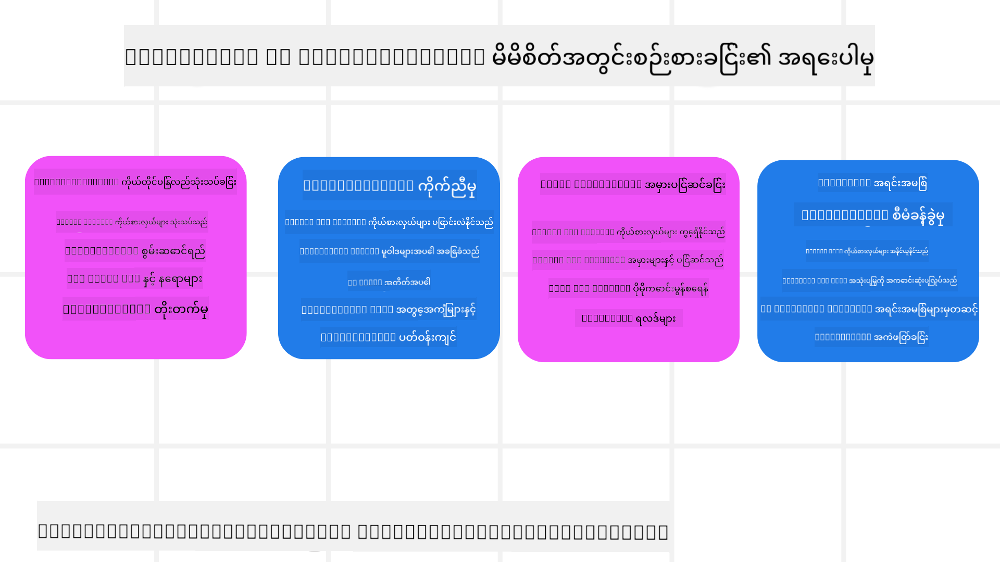

<!--
CO_OP_TRANSLATOR_METADATA:
{
  "original_hash": "5f0deef171fc3a68d5d3d770a8bfb03d",
  "translation_date": "2025-08-30T09:29:05+00:00",
  "source_file": "09-metacognition/README.md",
  "language_code": "my"
}
-->
[](https://youtu.be/His9R6gw6Ec?si=3_RMb8VprNvdLRhX)

> _(အပေါ်ရှိပုံကိုနှိပ်ပြီး ဒီသင်ခန်းစာရဲ့ ဗီဒီယိုကို ကြည့်ပါ)_
# AI အေးဂျင့်များတွင် Metacognition

## မိတ်ဆက်

AI အေးဂျင့်များတွင် metacognition အပေါ် သင်ခန်းစာမှကြိုဆိုပါတယ်! ဒီအခန်းက AI အေးဂျင့်များသည် သူတို့၏ စဉ်းစားမှုလုပ်ငန်းစဉ်များကို စဉ်းစားနိုင်ပုံကို စိတ်ဝင်စားသော အခြေခံသိရှိမှုရှိသူများအတွက် ဒီဇိုင်းလုပ်ထားသည်။ သင်ခန်းစာအဆုံးတွင် အဓိကအယူအဆများကို နားလည်ပြီး AI အေးဂျင့်ဒီဇိုင်းတွင် metacognition ကို အသုံးချနိုင်ရန် လက်တွေ့နမူနာများနှင့် ပြည့်စုံလိမ့်မည်။

## သင်ယူရမည့်ရည်မှန်းချက်များ

ဒီသင်ခန်းစာကို ပြီးမြောက်ပြီးနောက် သင်သည် အောက်ပါအရာများကို နားလည်နိုင်ပါမည်-

1. အေးဂျင့်အဓိပ္ပာယ်များတွင် reasoning loops ရဲ့ အကျိုးသက်ရောက်မှုကို နားလည်ပါ။
2. Self-correcting အေးဂျင့်များကို ကူညီရန် အစီအစဉ်ရေးဆွဲခြင်းနှင့် အကဲဖြတ်နည်းလမ်းများကို အသုံးပြုပါ။
3. ကိုယ်ပိုင်အေးဂျင့်များကို ဖန်တီးပြီး ကုဒ်ကို ပြောင်းလဲကာ တာဝန်များကို ပြည့်စုံစွာ ဆောင်ရွက်နိုင်ပါ။

## Metacognition အကြောင်းမိတ်ဆက်

Metacognition သည် ကိုယ်ပိုင်စဉ်းစားမှုကို စဉ်းစားခြင်းနှင့် ပတ်သက်သော အဆင့်မြင့် cognitive လုပ်ငန်းစဉ်များကို ဆိုလိုသည်။ AI အေးဂျင့်များအတွက်၊ ၎င်းသည် ကိုယ်ပိုင်သတိရှိမှုနှင့် အတိတ်အတွေ့အကြုံများအပေါ် အခြေခံပြီး ၎င်းတို့၏ လုပ်ဆောင်မှုများကို အကဲဖြတ်ပြီး ချိန်ညှိနိုင်ရန် အဓိကဖြစ်သည်။ Metacognition သည် "စဉ်းစားမှုကို စဉ်းစားခြင်း" ဟုခေါ်ပြီး agentic AI စနစ်များ ဖွံ့ဖြိုးတိုးတက်မှုတွင် အရေးပါသော အယူအဆတစ်ခုဖြစ်သည်။ ၎င်းသည် AI စနစ်များကို ကိုယ်ပိုင်လုပ်ငန်းစဉ်များအပေါ် သတိရှိစေပြီး ၎င်းတို့၏ အပြုအမူကို စောင့်ကြည့်၊ စီမံခန့်ခွဲ၊ ပြင်ဆင်နိုင်စေသည်။ လူသားများက အခန်းအခြေအနေကို ဖတ်ရှုခြင်း သို့မဟုတ် ပြဿနာကို ကြည့်ရှုခြင်းလုပ်ဆောင်သည့်ပုံစံနှင့် ဆင်တူသည်။ ဒီကိုယ်ပိုင်သတိရှိမှုက AI စနစ်များကို ပိုမိုကောင်းမွန်သော ဆုံးဖြတ်ချက်များ ချမှတ်ရန်၊ အမှားများကို ဖော်ထုတ်ရန်နှင့် ၎င်းတို့၏ စွမ်းဆောင်ရည်ကို အချိန်ကြာမြင့်စွာ တိုးတက်စေရန် ကူညီပေးနိုင်သည်။ Turing test နှင့် AI သည် လူသားများကို အစားထိုးနိုင်မည်ဆိုသော အငြင်းပွားမှုများနှင့် ပြန်လည်ချိတ်ဆက်သည်။

Agentic AI စနစ်များ၏ အခြေအနေတွင်၊ metacognition သည် အောက်ပါ စိန်ခေါ်မှုများကို ဖြေရှင်းရန် ကူညီနိုင်သည်-
- Transparency: AI စနစ်များသည် ၎င်းတို့၏ reasoning နှင့် ဆုံးဖြတ်ချက်များကို ရှင်းလင်းစွာ ရှင်းပြနိုင်စေရန်။
- Reasoning: AI စနစ်များ၏ အချက်အလက်များကို စုစည်းပြီး sound decisions ချမှတ်နိုင်စေရန် တိုးတက်စေခြင်း။
- Adaptation: AI စနစ်များကို ပတ်ဝန်းကျင်အသစ်များနှင့် အခြေအနေများပြောင်းလဲမှုများကို ချိန်ညှိနိုင်စေရန်။
- Perception: AI စနစ်များ၏ ပတ်ဝန်းကျင်မှ အချက်အလက်များကို မှန်ကန်စွာ အသိအမှတ်ပြုခြင်းနှင့် အဓိပ္ပာယ်ဖော်ထုတ်ခြင်း။

### Metacognition ဆိုတာဘာလဲ?

Metacognition သည် "စဉ်းစားမှုကို စဉ်းစားခြင်း" ဟုခေါ်ပြီး ကိုယ်ပိုင် cognitive လုပ်ငန်းစဉ်များကို ကိုယ်ပိုင်သတိရှိမှုနှင့် ကိုယ်ပိုင်စီမံခန့်ခွဲမှုတို့ပါဝင်သော အဆင့်မြင့် cognitive လုပ်ငန်းစဉ်တစ်ခုဖြစ်သည်။ AI ရဲ့ နယ်ပယ်တွင်၊ metacognition သည် အေးဂျင့်များကို ၎င်းတို့၏ မဟာဗျူဟာများနှင့် လုပ်ဆောင်မှုများကို အကဲဖြတ်ပြီး ချိန်ညှိနိုင်စေကာ ပြဿနာများကို ဖြေရှင်းခြင်းနှင့် ဆုံးဖြတ်ချက်ချခြင်းစွမ်းရည်များကို တိုးတက်စေသည်။ Metacognition ကို နားလည်ခြင်းအားဖြင့် သင်သည် ပိုမိုထူးချွန်ပြီး ချိန်ညှိနိုင်သော AI အေးဂျင့်များကို ဒီဇိုင်းဆွဲနိုင်သည်။ တကယ့် metacognition တွင်၊ AI သည် ၎င်း၏ reasoning ကို ထင်ရှားစွာ reasoning ပြုလုပ်နေသည်ကို တွေ့ရမည်။

ဥပမာ- “ငါ သက်သာတဲ့ လေယာဉ်ခရီးစဉ်များကို ဦးစားပေးခဲ့တယ်... ဒါပေမယ့် direct flights များကို လွဲချော်နေမယ်ထင်တယ်၊ ဒါကြောင့် ပြန်စစ်ကြည့်ရမယ်။”
- ၎င်းသည် တစ်ခုခုကို ရွေးချယ်ခဲ့ပုံကို မှတ်သားထားခြင်း။
- အတိတ် user preferences များကို အလွန်အမင်း အားထားခဲ့သောကြောင့် အမှားများ ဖြစ်ပေါ်ခဲ့သည်ကို မှတ်သားပြီး ၎င်း၏ ဆုံးဖြတ်ချက်ချမှတ်မှု မဟာဗျူဟာကို ပြောင်းလဲခြင်း (နောက်ဆုံးအကြံပြုချက်ကိုသာ မပြောင်းလဲခြင်း)။
- “User က 'လူများအများ' ဆိုတဲ့ စကားကို ပြောတဲ့အခါ၊ ငါသည် အရမ်းလူကြိုက်များသော attractions များကို ဖယ်ရှားရုံသာမက 'top attractions' ရွေးချယ်မှုနည်းလမ်းကို ပြန်လည်စဉ်းစားရမယ်၊ popularity အပေါ် အမြဲအခြေခံပြီး အဆင့်သတ်မှတ်နေမယ်ဆိုရင် flawed ဖြစ်နေတယ်” ဆိုတဲ့ pattern များကို ခွဲခြားနိုင်ခြင်း။

### AI အေးဂျင့်များတွင် Metacognition ရဲ့ အရေးပါမှု

Metacognition သည် AI အေးဂျင့်ဒီဇိုင်းတွင် အရေးပါသော အခန်းကဏ္ဍတစ်ခုကို ထိန်းသိမ်းထားသည်-



- Self-Reflection: အေးဂျင့်များသည် ၎င်းတို့၏ စွမ်းဆောင်ရည်ကို အကဲဖြတ်ပြီး တိုးတက်မှုလိုအပ်သော နေရာများကို ဖော်ထုတ်နိုင်သည်။
- Adaptability: အေးဂျင့်များသည် အတိတ်အတွေ့အကြုံများနှင့် အခြေအနေများပြောင်းလဲမှုများအပေါ် အခြေခံပြီး ၎င်းတို့၏ မဟာဗျူဟာများကို ပြောင်းလဲနိုင်သည်။
- Error Correction: အေးဂျင့်များသည် အမှားများကို ကိုယ်တိုင်ဖော်ထုတ်ပြီး ပြင်ဆင်နိုင်သည်၊ ၎င်းသည် ပိုမိုမှန်ကန်သော ရလဒ်များကို ဖြစ်ပေါ်စေသည်။
- Resource Management: အေးဂျင့်များသည် ၎င်းတို့၏ လုပ်ဆောင်မှုများကို စီမံခန့်ခွဲခြင်းအားဖြင့် အချိန်နှင့် ကွန်ပျူတာစွမ်းအားကဲ့သို့သော အရင်းအမြစ်များကို အကောင်းဆုံးအသုံးပြုနိုင်သည်။

## AI အေးဂျင့်၏ အစိတ်အပိုင်းများ

Metacognitive လုပ်ငန်းစဉ်များကို စတင်မပြုလုပ်မီ၊ AI အေးဂျင့်၏ အခြေခံအစိတ်အပိုင်းများကို နားလည်ရန် အရေးကြီးသည်။ AI အေးဂျင့်သည် အောက်ပါအစိတ်အပိုင်းများပါဝင်သည်-

- Persona: User များနှင့် အပြန်အလှန်ဆက်သွယ်ပုံကို သတ်မှတ်သော အေးဂျင့်၏ ပုဂ္ဂိုလ်ရေးနှင့် လက္ခဏာများ။
- Tools: အေးဂျင့်က ဆောင်ရွက်နိုင်သော စွမ်းရည်များနှင့် လုပ်ဆောင်ချက်များ။
- Skills: အေးဂျင့်က ပိုင်ဆိုင်ထားသော အသိပညာနှင့် ကျွမ်းကျင်မှု။

ဒီအစိတ်အပိုင်းများသည် "expertise unit" ကို ဖန်တီးရန် ပေါင်းစည်းလုပ်ဆောင်သည်။

**ဥပမာ**:
ခရီးသွားအေးဂျင့်ကို စဉ်းစားပါ၊ ၎င်းသည် သင့်ရဲ့ အပန်းဖြေခရီးစဉ်ကို စီစဉ်ပေးရုံသာမက real-time အချက်အလက်နှင့် အတိတ် customer journey အတွေ့အကြုံများအပေါ် အခြေခံပြီး ၎င်း၏ လမ်းကြောင်းကို ချိန်ညှိပေးသည်။

### ဥပမာ- ခရီးသွားအေးဂျင့်ဝန်ဆောင်မှုတွင် Metacognition

သင်သည် AI အားဖြင့် အားပေးထားသော ခရီးသွားအေးဂျင့်ဝန်ဆောင်မှုကို ဒီဇိုင်းဆွဲနေသည်ဟု စဉ်းစားပါ။ ဒီအေးဂျင့် "Travel Agent" သည် user များကို ၎င်းတို့၏ အပန်းဖြေခရီးစဉ်များကို စီစဉ်ရန် ကူညီပေးသည်။ Metacognition ကို ထည့်သွင်းရန် Travel Agent သည် ကိုယ်ပိုင်သတိရှိမှုနှင့် အတိတ်အတွေ့အကြုံများအပေါ် အခြေခံပြီး ၎င်း၏ လုပ်ဆောင်မှုများကို အကဲဖြတ်ပြီး ချိန်ညှိရန် လိုအပ်သည်။ Metacognition သည် အောက်ပါအတိုင်း အခန်းကဏ္ဍတစ်ခုကို ထိန်းသိမ်းထားသည်-

#### လက်ရှိတာဝန်

လက်ရှိတာဝန်မှာ user ကို ပဲရစ်ခရီးစဉ်ကို စီစဉ်ပေးရန်ဖြစ်သည်။

#### တာဝန်ကို ပြည့်စုံစွာ ဆောင်ရွက်ရန် လိုအပ်သောအဆင့်များ

1. **User Preferences စုဆောင်းပါ**: User ကို ၎င်းတို့၏ ခရီးသွားရက်များ၊ ဘတ်ဂျက်၊ စိတ်ဝင်စားမှုများ (ဥပမာ- ပြတိုက်များ၊ အစားအစာ၊ စျေးဝယ်ခြင်း) နှင့် အထူးလိုအပ်ချက်များကို မေးပါ။
2. **အချက်အလက်များ ရှာဖွေပါ**: User preferences နှင့် ကိုက်ညီသော လေယာဉ်ခရီးစဉ်များ၊ အဆောင်များ၊ attractions များနှင့် restaurants များကို ရှာဖွေပါ။
3. **အကြံပြုချက်များ ဖန်တီးပါ**: လေယာဉ်အသေးစိတ်အချက်အလက်များ၊ ဟိုတယ်အပ်ငွေများနှင့် အကြံပြုလုပ်ဆောင်မှုများပါဝင်သော ကိုယ်ပိုင် itinerary ကို ပေးပါ။
4. **Feedback အပေါ် အခြေခံပြီး ချိန်ညှိပါ**: အကြံပြုချက်များအပေါ် user ၏ feedback ကို မေးပြီး လိုအပ်သော ပြင်ဆင်မှုများကို ပြုလုပ်ပါ။

#### လိုအပ်သော အရင်းအမြစ်များ

- လေယာဉ်နှင့် ဟိုတယ် booking database များကို access ရရှိမှု။
- ပဲရစ်ရှိ attractions နှင့် restaurants အကြောင်းအချက်အလက်။
- အတိတ် interactions များမှ user feedback data။

#### အတွေ့အကြုံနှင့် ကိုယ်ပိုင်အကဲဖြတ်မှု

Travel Agent သည် ၎င်း၏ စွမ်းဆောင်ရည်ကို အကဲဖြတ်ပြီး အတိတ်အတွေ့အကြုံများမှ သင်ယူရန် metacognition ကို အသုံးပြုသည်။ ဥပမာ-

1. **User Feedback ကို ခွဲခြားခြင်း**: Travel Agent သည် user feedback ကို ပြန်လည်သုံးသပ်ပြီး အကြံပြုချက်များထဲမှ အကောင်းဆုံးနှင့် အဆိုးဆုံးကို သတ်မှတ်သည်။ ၎င်းသည် ၎င်း၏ အနာဂတ်အကြံပြုချက်များကို ချိန်ညှိသည်။
2. **Adaptability**: User သည် crowded places ကို မကြိုက်ကြောင်း အတိတ်တွင် ပြောခဲ့ပါက၊ Travel Agent သည် အနာဂတ်တွင် လူကြိုက်များသော tourist spots များကို peak hours တွင် မအကြံပြုရန် ရှောင်ရှားသည်။
3. **Error Correction**: Travel Agent သည် အတိတ် booking မှာ အမှားတစ်ခု ဖြစ်ပေါ်ခဲ့ပါက၊ ဥပမာ- fully booked ဟိုတယ်ကို အကြံပြုခဲ့သည်၊ ၎င်းသည် အနာဂတ်အကြံပြုချက်များကို ပြုလုပ်မီ availability ကို ပိုမိုတိကျစွာ စစ်ဆေးရန် သင်ယူသည်။

#### Developer အတွက် လက်တွေ့နမူနာ

Travel Agent ရဲ့ metacognition ကို ထည့်သွင်းထားသော code ရဲ့ ရိုးရှင်းသော နမူနာကို အောက်ပါအတိုင်း ဖော်ပြထားသည်-

```python
class Travel_Agent:
    def __init__(self):
        self.user_preferences = {}
        self.experience_data = []

    def gather_preferences(self, preferences):
        self.user_preferences = preferences

    def retrieve_information(self):
        # Search for flights, hotels, and attractions based on preferences
        flights = search_flights(self.user_preferences)
        hotels = search_hotels(self.user_preferences)
        attractions = search_attractions(self.user_preferences)
        return flights, hotels, attractions

    def generate_recommendations(self):
        flights, hotels, attractions = self.retrieve_information()
        itinerary = create_itinerary(flights, hotels, attractions)
        return itinerary

    def adjust_based_on_feedback(self, feedback):
        self.experience_data.append(feedback)
        # Analyze feedback and adjust future recommendations
        self.user_preferences = adjust_preferences(self.user_preferences, feedback)

# Example usage
travel_agent = Travel_Agent()
preferences = {
    "destination": "Paris",
    "dates": "2025-04-01 to 2025-04-10",
    "budget": "moderate",
    "interests": ["museums", "cuisine"]
}
travel_agent.gather_preferences(preferences)
itinerary = travel_agent.generate_recommendations()
print("Suggested Itinerary:", itinerary)
feedback = {"liked": ["Louvre Museum"], "disliked": ["Eiffel Tower (too crowded)"]}
travel_agent.adjust_based_on_feedback(feedback)
```

#### Metacognition ရဲ့ အရေးပါမှု

- **Self-Reflection**: အေးဂျင့်များသည် ၎င်းတို့၏ စွမ်းဆောင်ရည်ကို အကဲဖြတ်ပြီး တိုးတက်မှုလိုအပ်သော နေရာများကို ဖော်ထုတ်နိုင်သည်။
- **Adaptability**: အေးဂျင့်များသည် feedback နှင့် အခြေအနေများပြောင်းလဲမှုများအပေါ် အခြေခံပြီး ၎င်းတို့၏ မဟာဗျူဟာများကို ပြောင်းလဲနိုင်သည်။
- **Error Correction**: အေးဂျင့်များသည် အမှားများကို ကိုယ်တိုင်ဖော်ထုတ်ပြီး ပြင်ဆင်နိုင်သည်။
- **Resource Management**: အေးဂျင့်များသည် ၎င်းတို့၏ လုပ်ဆောင်မှုများကို စီမံခန့်ခွဲခြင်းအားဖြင့် အချိန်နှင့် ကွန်ပျူတာစွမ်းအားကဲ့သို့သော အရင်းအမြစ်များကို အကောင်းဆုံးအသုံးပြုနိုင်သည်။

Metacognition ကို ထည့်သွင်းခြင်းအားဖြင့် Travel Agent သည် ပိုမိုကိုယ်ပိုင်နှင့် မှန်ကန်သော ခရီးသွားအကြံပြုချက်များကို ပေးနိုင်ပြီး၊ user experience ကို တိုးတက်စေသည်။

---

## 2. အေးဂျင့်များတွင် Planning

Planning သည် AI အေးဂျင့်၏ အပြုအမူတွင် အရေးပါသော အစိတ်အပိုင်းတစ်ခုဖြစ်သည်။ ၎င်းသည် လက်ရှိအခြေအနေ၊ အရင်းအမြစ်များနှင့် အခက်အခဲများကို စဉ်းစားပြီး ရည်မှန်းချက်ကို ရောက်ရှိရန် လိုအပ်သော အဆင့်များကို ရေးဆွဲခြင်းဖြစ်သည်။

### Planning ရဲ့ အစိတ်အပိုင်းများ

- **လက်ရှိတာဝန်**: တာဝန်ကို ရှင်းလင်းစွာ သတ်မှတ်ပါ။
- **တာဝန်ကို ပြည့်စုံစွာ ဆောင်ရွက်ရန် လိုအပ်သောအဆင့်များ**: တာဝန်ကို စီမံနိုင်သော အဆင့်များအဖြစ် ခွဲခြားပါ။
- **လိုအပ်သော အရင်းအမြစ်များ**: လိုအပ်သော အရင်းအမြစ်များကို သတ်မှတ်ပါ။
- **အတွေ့အကြုံ**: Planning ကို အတိတ်အတွေ့အကြုံများကို အသုံးပြုပါ။

**ဥပမာ**:
Travel Agent သည် user ကို ခရီးစဉ်ကို ထိရောက်
```python
class Travel_Agent:
    def __init__(self):
        self.user_preferences = {}
        self.experience_data = []

    def gather_preferences(self, preferences):
        self.user_preferences = preferences

    def retrieve_information(self):
        flights = search_flights(self.user_preferences)
        hotels = search_hotels(self.user_preferences)
        attractions = search_attractions(self.user_preferences)
        return flights, hotels, attractions

    def generate_recommendations(self):
        flights, hotels, attractions = self.retrieve_information()
        itinerary = create_itinerary(flights, hotels, attractions)
        return itinerary

    def adjust_based_on_feedback(self, feedback):
        self.experience_data.append(feedback)
        self.user_preferences = adjust_preferences(self.user_preferences, feedback)
        new_itinerary = self.generate_recommendations()
        return new_itinerary

# Example usage
travel_agent = Travel_Agent()
preferences = {
    "destination": "Paris",
    "dates": "2025-04-01 to 2025-04-10",
    "budget": "moderate",
    "interests": ["museums", "cuisine"]
}
travel_agent.gather_preferences(preferences)
itinerary = travel_agent.generate_recommendations()
print("Suggested Itinerary:", itinerary)
feedback = {"liked": ["Louvre Museum"], "disliked": ["Eiffel Tower (too crowded)"]}
new_itinerary = travel_agent.adjust_based_on_feedback(feedback)
print("Updated Itinerary:", new_itinerary)
```

### ကြိုတင်အခြေခံအချက်အလက် တင်သွင်းခြင်း

ကြိုတင်အခြေခံအချက်အလက် တင်သွင်းခြင်းဆိုသည်မှာ မေးခွန်းတစ်ခုကို ဖြေရှင်းရန်မတိုင်မီ သက်ဆိုင်ရာအချက်အလက်များကို မော်ဒယ်ထဲသို့ ကြိုတင်ထည့်သွင်းခြင်းဖြစ်သည်။ ဒီနည်းလမ်းက မော်ဒယ်ကို အစပိုင်းကတည်းက အချက်အလက်များကို အသုံးပြုခွင့်ပေးပြီး၊ အလယ်အလတ်အဆင့်တွင် ထပ်မံအချက်အလက် ရှာဖွေရန်မလိုဘဲ ပိုမိုတိကျသော အဖြေများ ထုတ်ပေးနိုင်စေသည်။

Python ဖြင့် ခရီးသွားအက်ပလီကေးရှင်းအတွက် ကြိုတင်အခြေခံအချက်အလက် တင်သွင်းခြင်းကို ရိုးရှင်းစွာ ပြထားသော ဥပမာတစ်ခုမှာ -

```python
class TravelAgent:
    def __init__(self):
        # Pre-load popular destinations and their information
        self.context = {
            "Paris": {"country": "France", "currency": "Euro", "language": "French", "attractions": ["Eiffel Tower", "Louvre Museum"]},
            "Tokyo": {"country": "Japan", "currency": "Yen", "language": "Japanese", "attractions": ["Tokyo Tower", "Shibuya Crossing"]},
            "New York": {"country": "USA", "currency": "Dollar", "language": "English", "attractions": ["Statue of Liberty", "Times Square"]},
            "Sydney": {"country": "Australia", "currency": "Dollar", "language": "English", "attractions": ["Sydney Opera House", "Bondi Beach"]}
        }

    def get_destination_info(self, destination):
        # Fetch destination information from pre-loaded context
        info = self.context.get(destination)
        if info:
            return f"{destination}:\nCountry: {info['country']}\nCurrency: {info['currency']}\nLanguage: {info['language']}\nAttractions: {', '.join(info['attractions'])}"
        else:
            return f"Sorry, we don't have information on {destination}."

# Example usage
travel_agent = TravelAgent()
print(travel_agent.get_destination_info("Paris"))
print(travel_agent.get_destination_info("Tokyo"))
```

#### ရှင်းလင်းချက်

1. **စတင်ဖွင့်လှစ်ခြင်း (`__init__` method)**: `TravelAgent` class သည် Paris, Tokyo, New York, Sydney စသည့် လူကြိုက်များသော ခရီးစဉ်နေရာများအကြောင်း အချက်အလက်များပါဝင်သော dictionary တစ်ခုကို ကြိုတင်တင်သွင်းထားသည်။ ဒီ dictionary တွင် နေရာတိုင်းအတွက် နိုင်ငံ၊ ငွေကြေး၊ ဘာသာစကားနှင့် အဓိကဆွဲဆောင်မှုများ ပါဝင်သည်။

2. **အချက်အလက် ရယူခြင်း (`get_destination_info` method)**: အသုံးပြုသူက သတ်မှတ်ထားသော နေရာတစ်ခုအကြောင်း မေးမြန်းသောအခါ `get_destination_info` method သည် ကြိုတင်တင်သွင်းထားသော dictionary မှ သက်ဆိုင်ရာအချက်အလက်များကို ရယူပေးသည်။

ကြိုတင်အခြေခံအချက်အလက် တင်သွင်းထားခြင်းကြောင့် ခရီးသွားအက်ပလီကေးရှင်းသည် အသုံးပြုသူ၏ မေးခွန်းများကို အချိန်နှင့်တပြေးညီ ဖြေရှင်းပေးနိုင်ပြီး အပြင်ပန်းအရင်းအမြစ်များမှ အချက်အလက်များကို တိုက်ရိုက် ရယူရန် မလိုတော့ပါ။ ဒီနည်းလမ်းက အက်ပလီကေးရှင်းကို ပိုမိုထိရောက်စေပြီး တုံ့ပြန်မှုမြန်ဆန်စေသည်။

### ရည်မှန်းချက်ဖြင့် စတင်ပြီး အဆင့်ဆင့်တိုးတက်မှု

ရည်မှန်းချက်ဖြင့် စတင်ခြင်းဆိုသည်မှာ ရည်ရွယ်ချက်တစ်ခု သို့မဟုတ် ရလဒ်တစ်ခုကို အစပိုင်းတွင် သတ်မှတ်ထားခြင်းဖြစ်သည်။ ဒီရည်မှန်းချက်ကို အစပိုင်းတွင် သတ်မှတ်ထားခြင်းဖြင့် မော်ဒယ်သည် အဆင့်ဆင့်တိုးတက်မှုအတွင်း အဓိကလမ်းညွှန်ချက်အဖြစ် အသုံးပြုနိုင်သည်။ ဒီနည်းလမ်းက တိုးတက်မှုတိုင်းကို ရည်မှန်းချက်အတိုင်း ပိုမိုနီးကပ်စေပြီး လုပ်ငန်းစဉ်ကို ပိုမိုထိရောက်စေသည်။

Python ဖြင့် ခရီးသွားအက်ပလီကေးရှင်းအတွက် ရည်မှန်းချက်ဖြင့် စတင်ပြီး အဆင့်ဆင့်တိုးတက်မှုကို ပြထားသော ဥပမာတစ်ခုမှာ -

### အခြေအနေ

ခရီးသွားအက်ဂျင့်တစ်ဦးသည် အသုံးပြုသူအတွက် စိတ်ကြိုက်ခရီးစဉ်အစီအစဉ်တစ်ခုကို စီစဉ်လိုသည်။ ရည်မှန်းချက်မှာ အသုံးပြုသူ၏ စိတ်ကျေနပ်မှုကို အများဆုံးဖြစ်အောင် စီစဉ်ခြင်းဖြစ်ပြီး၊ သူတို့၏ အကြိုက်နှင့် ဘတ်ဂျက်အတိုင်း ဖြစ်ရမည်။

### လုပ်ဆောင်ရန်အဆင့်များ

1. အသုံးပြုသူ၏ အကြိုက်နှင့် ဘတ်ဂျက်ကို သတ်မှတ်ပါ။
2. ဒီအကြိုက်အတိုင်း အစီအစဉ်ကို စတင်စီစဉ်ပါ။
3. အစီအစဉ်ကို အဆင့်ဆင့်တိုးတက်အောင် ပြုပြင်ပါ၊ အသုံးပြုသူ၏ စိတ်ကျေနပ်မှုအတိုင်း အကောင်းဆုံးဖြစ်အောင် လုပ်ဆောင်ပါ။

#### Python Code

```python
class TravelAgent:
    def __init__(self, destinations):
        self.destinations = destinations

    def bootstrap_plan(self, preferences, budget):
        plan = []
        total_cost = 0

        for destination in self.destinations:
            if total_cost + destination['cost'] <= budget and self.match_preferences(destination, preferences):
                plan.append(destination)
                total_cost += destination['cost']

        return plan

    def match_preferences(self, destination, preferences):
        for key, value in preferences.items():
            if destination.get(key) != value:
                return False
        return True

    def iterate_plan(self, plan, preferences, budget):
        for i in range(len(plan)):
            for destination in self.destinations:
                if destination not in plan and self.match_preferences(destination, preferences) and self.calculate_cost(plan, destination) <= budget:
                    plan[i] = destination
                    break
        return plan

    def calculate_cost(self, plan, new_destination):
        return sum(destination['cost'] for destination in plan) + new_destination['cost']

# Example usage
destinations = [
    {"name": "Paris", "cost": 1000, "activity": "sightseeing"},
    {"name": "Tokyo", "cost": 1200, "activity": "shopping"},
    {"name": "New York", "cost": 900, "activity": "sightseeing"},
    {"name": "Sydney", "cost": 1100, "activity": "beach"},
]

preferences = {"activity": "sightseeing"}
budget = 2000

travel_agent = TravelAgent(destinations)
initial_plan = travel_agent.bootstrap_plan(preferences, budget)
print("Initial Plan:", initial_plan)

refined_plan = travel_agent.iterate_plan(initial_plan, preferences, budget)
print("Refined Plan:", refined_plan)
```

#### ကုဒ် ရှင်းလင်းချက်

1. **စတင်ဖွင့်လှစ်ခြင်း (`__init__` method)**: `TravelAgent` class သည် နေရာအမျိုးမျိုး၏ အမည်၊ ကုန်ကျစရိတ်နှင့် လှုပ်ရှားမှုအမျိုးအစားများပါဝင်သော အချက်အလက်များဖြင့် စတင်ဖွင့်လှစ်သည်။

2. **အစီအစဉ် စတင်ခြင်း (`bootstrap_plan` method)**: ဒီ method သည် အသုံးပြုသူ၏ အကြိုက်နှင့် ဘတ်ဂျက်အတိုင်း အစီအစဉ်ကို စတင်ဖန်တီးသည်။ နေရာများကို စစ်ဆေးပြီး အကြိုက်နှင့် ကိုက်ညီပြီး ဘတ်ဂျက်အတွင်းရှိပါက အစီအစဉ်ထဲသို့ ထည့်သွင်းသည်။

3. **အကြိုက်ကိုက်ညီမှု စစ်ဆေးခြင်း (`match_preferences` method)**: ဒီ method သည် နေရာတစ်ခုသည် အသုံးပြုသူ၏ အကြိုက်နှင့် ကိုက်ညီမညီ စစ်ဆေးသည်။

4. **အစီအစဉ် ပြုပြင်ခြင်း (`iterate_plan` method)**: ဒီ method သည် အစီအစဉ်ကို အဆင့်ဆင့် ပြုပြင်ပြီး အသုံးပြုသူ၏ အကြိုက်နှင့် ဘတ်ဂျက်အတိုင်း ပိုမိုကောင်းမွန်အောင် လုပ်ဆောင်သည်။

5. **ကုန်ကျစရိတ်တွက်ချက်ခြင်း (`calculate_cost` method)**: ဒီ method သည် လက်ရှိအစီအစဉ်၏ စုစုပေါင်းကုန်ကျစရိတ်ကို တွက်ချက်သည်။

#### ဥပမာ အသုံးပြုမှု

- **အစီအစဉ် စတင်ခြင်း**: ခရီးသွားအက်ဂျင့်သည် အသုံးပြုသူ၏ အကြိုက် sightseeing နှင့် $2000 ဘတ်ဂျက်အတိုင်း အစီအစဉ်ကို စတင်ဖန်တီးသည်။
- **အစီအစဉ် ပြုပြင်ခြင်း**: ခရီးသွားအက်ဂျင့်သည် အစီအစဉ်ကို အဆင့်ဆင့် ပြုပြင်ပြီး အသုံးပြုသူ၏ အကြိုက်နှင့် ဘတ်ဂျက်အတိုင်း အကောင်းဆုံးဖြစ်အောင် လုပ်ဆောင်သည်။

ရည်မှန်းချက်ကို ရှင်းလင်းစွာ သတ်မှတ်ပြီး အစီအစဉ်ကို အဆင့်ဆင့် ပြုပြင်ခြင်းဖြင့် ခရီးသွားအက်ဂျင့်သည် အသုံးပြုသူအတွက် စိတ်ကြိုက်နှင့် အကောင်းဆုံး ခရီးစဉ်အစီအစဉ်ကို ဖန်တီးနိုင်သည်။ ဒီနည်းလမ်းက ခရီးစဉ်အစီအစဉ်သည် အသုံးပြုသူ၏ အကြိုက်နှင့် ဘတ်ဂျက်နှင့် ကိုက်ညီစေပြီး အဆင့်တိုင်းတွင် ပိုမိုကောင်းမွန်အောင် ပြုပြင်ပေးသည်။

### LLM ကို အသုံးပြု၍ Re-ranking နှင့် Scoring

```python
import requests
import json

class TravelAgent:
    def __init__(self, destinations):
        self.destinations = destinations

    def get_recommendations(self, preferences, api_key, endpoint):
        # Generate a prompt for the Azure OpenAI
        prompt = self.generate_prompt(preferences)
        
        # Define headers and payload for the request
        headers = {
            'Content-Type': 'application/json',
            'Authorization': f'Bearer {api_key}'
        }
        payload = {
            "prompt": prompt,
            "max_tokens": 150,
            "temperature": 0.7
        }
        
        # Call the Azure OpenAI API to get the re-ranked and scored destinations
        response = requests.post(endpoint, headers=headers, json=payload)
        response_data = response.json()
        
        # Extract and return the recommendations
        recommendations = response_data['choices'][0]['text'].strip().split('\n')
        return recommendations

    def generate_prompt(self, preferences):
        prompt = "Here are the travel destinations ranked and scored based on the following user preferences:\n"
        for key, value in preferences.items():
            prompt += f"{key}: {value}\n"
        prompt += "\nDestinations:\n"
        for destination in self.destinations:
            prompt += f"- {destination['name']}: {destination['description']}\n"
        return prompt

# Example usage
destinations = [
    {"name": "Paris", "description": "City of lights, known for its art, fashion, and culture."},
    {"name": "Tokyo", "description": "Vibrant city, famous for its modernity and traditional temples."},
    {"name": "New York", "description": "The city that never sleeps, with iconic landmarks and diverse culture."},
    {"name": "Sydney", "description": "Beautiful harbour city, known for its opera house and stunning beaches."},
]

preferences = {"activity": "sightseeing", "culture": "diverse"}
api_key = 'your_azure_openai_api_key'
endpoint = 'https://your-endpoint.com/openai/deployments/your-deployment-name/completions?api-version=2022-12-01'

travel_agent = TravelAgent(destinations)
recommendations = travel_agent.get_recommendations(preferences, api_key, endpoint)
print("Recommended Destinations:")
for rec in recommendations:
    print(rec)
```

... (translation continues for the remaining sections) ...
#### လက်တွေ့ ဥပမာ - ခရီးသွား အေးဂျင့်တွင် ရည်ရွယ်ချက်ဖြင့် ရှာဖွေခြင်း

ခရီးသွား အေးဂျင့်ကို ဥပမာအဖြစ် ယူပြီး ရည်ရွယ်ချက်ဖြင့် ရှာဖွေခြင်းကို ဘယ်လို အကောင်အထည်ဖော်နိုင်မလဲဆိုတာ ကြည့်ကြမယ်။

1. **အသုံးပြုသူ၏ အလိုဆန္ဒများ စုဆောင်းခြင်း**

   ```python
   class Travel_Agent:
       def __init__(self):
           self.user_preferences = {}

       def gather_preferences(self, preferences):
           self.user_preferences = preferences
   ```

2. **အသုံးပြုသူ၏ ရည်ရွယ်ချက်ကို နားလည်ခြင်း**

   ```python
   def identify_intent(query):
       if "book" in query or "purchase" in query:
           return "transactional"
       elif "website" in query or "official" in query:
           return "navigational"
       else:
           return "informational"
   ```

3. **အခြေအနေကို သိရှိခြင်း**

   ```python
   def analyze_context(query, user_history):
       # Combine current query with user history to understand context
       context = {
           "current_query": query,
           "user_history": user_history
       }
       return context
   ```

4. **ရှာဖွေပြီး ရလဒ်များကို ကိုယ်ပိုင်အတိုင်း ပြင်ဆင်ခြင်း**

   ```python
   def search_with_intent(query, preferences, user_history):
       intent = identify_intent(query)
       context = analyze_context(query, user_history)
       if intent == "informational":
           search_results = search_information(query, preferences)
       elif intent == "navigational":
           search_results = search_navigation(query)
       elif intent == "transactional":
           search_results = search_transaction(query, preferences)
       personalized_results = personalize_results(search_results, user_history)
       return personalized_results

   def search_information(query, preferences):
       # Example search logic for informational intent
       results = search_web(f"best {preferences['interests']} in {preferences['destination']}")
       return results

   def search_navigation(query):
       # Example search logic for navigational intent
       results = search_web(query)
       return results

   def search_transaction(query, preferences):
       # Example search logic for transactional intent
       results = search_web(f"book {query} to {preferences['destination']}")
       return results

   def personalize_results(results, user_history):
       # Example personalization logic
       personalized = [result for result in results if result not in user_history]
       return personalized[:10]  # Return top 10 personalized results
   ```

5. **အသုံးပြုမှု ဥပမာ**

   ```python
   travel_agent = Travel_Agent()
   preferences = {
       "destination": "Paris",
       "interests": ["museums", "cuisine"]
   }
   travel_agent.gather_preferences(preferences)
   user_history = ["Louvre Museum website", "Book flight to Paris"]
   query = "best museums in Paris"
   results = search_with_intent(query, preferences, user_history)
   print("Search Results:", results)
   ```

---

## 4. ကိရိယာအဖြစ် ကုဒ်ကို ဖန်တီးခြင်း

ကုဒ်ဖန်တီးသည့် အေးဂျင့်များသည် AI မော်ဒယ်များကို အသုံးပြု၍ ကုဒ်ရေးခြင်းနှင့် အကောင်အထည်ဖော်ခြင်းများကို လုပ်ဆောင်ပြီး ရှုပ်ထွေးသော ပြဿနာများကို ဖြေရှင်းခြင်းနှင့် အလုပ်များကို အလိုအလျောက်လုပ်ဆောင်နိုင်စေသည်။

### ကုဒ်ဖန်တီး အေးဂျင့်များ

ကုဒ်ဖန်တီး အေးဂျင့်များသည် ကုဒ်ရေးခြင်းနှင့် အကောင်အထည်ဖော်ခြင်းများကို AI မော်ဒယ်များဖြင့် ပြုလုပ်သည်။ ဤအေးဂျင့်များသည် ရှုပ်ထွေးသော ပြဿနာများကို ဖြေရှင်းခြင်း၊ အလုပ်များကို အလိုအလျောက်လုပ်ဆောင်ခြင်းနှင့် အမျိုးမျိုးသော ပရိုဂရမ်မင်းဘာသာစကားများတွင် ကုဒ်ဖန်တီးခြင်းဖြင့် တန်ဖိုးရှိသော အမြင်များကို ပေးစွမ်းနိုင်သည်။

#### လက်တွေ့ အသုံးချမှုများ

1. **ကုဒ်အလိုအလျောက် ဖန်တီးခြင်း**: ဒေတာခွဲခြမ်းစိတ်ဖြာခြင်း၊ ဝက်ဘ်မှ ဒေတာရယူခြင်း၊ သို့မဟုတ် စက်လေ့လာမှုလိုက်နာမှုများအတွက် ကုဒ်ပိုင်းများ ဖန်တီးခြင်း။
2. **SQL ကို RAG အဖြစ် အသုံးပြုခြင်း**: ဒေတာဘေ့စ်များမှ ဒေတာရယူခြင်းနှင့် ပြုပြင်ခြင်း။
3. **ပြဿနာ ဖြေရှင်းခြင်း**: သတ်မှတ်ထားသော ပြဿနာများကို ဖြေရှင်းရန် ကုဒ်ဖန်တီးခြင်းနှင့် အကောင်အထည်ဖော်ခြင်း။

#### ဥပမာ - ဒေတာခွဲခြမ်းစိတ်ဖြာမှုအတွက် ကုဒ်ဖန်တီး အေးဂျင့်

သင်သည် ကုဒ်ဖန်တီး အေးဂျင့်တစ်ခုကို ဒီဇိုင်းဆွဲနေသည်ဟု စဉ်းစားပါ။ ၎င်းသည် အောက်ပါအတိုင်း လုပ်ဆောင်နိုင်သည်-

1. **တာဝန်**: ဒေတာအစုအဝေးကို ခွဲခြမ်းစိတ်ဖြာပြီး လမ်းညွှန်မှုများနှင့် ပုံစံများကို ရှာဖွေပါ။
2. **အဆင့်များ**:
   - ဒေတာအစုအဝေးကို ဒေတာခွဲခြမ်းစိတ်ဖြာမှုကိရိယာထဲသို့ တင်ပါ။
   - SQL query များကို ဖန်တီးပြီး ဒေတာကို စစ်ထုတ်ပါ။
   - Query များကို အကောင်အထည်ဖော်ပြီး ရလဒ်များကို ရယူပါ။
   - ရလဒ်များကို အသုံးပြု၍ ရှင်းလင်းချက်များနှင့် အမြင်များ ဖန်တီးပါ။
3. **လိုအပ်သော အရင်းအမြစ်များ**: ဒေတာအစုအဝေး၊ ဒေတာခွဲခြမ်းစိတ်ဖြာမှုကိရိယာများနှင့် SQL စွမ်းရည်များ။
4. **အတွေ့အကြုံ**: ယခင်ခွဲခြမ်းစိတ်ဖြာမှုရလဒ်များကို အသုံးပြု၍ နောက်ထပ်ခွဲခြမ်းစိတ်ဖြာမှုများ၏ တိကျမှုနှင့် သက်ဆိုင်မှုကို တိုးတက်စေပါ။

### ဥပမာ - ခရီးသွား အေးဂျင့်အတွက် ကုဒ်ဖန်တီး အေးဂျင့်

ဤဥပမာတွင် ခရီးစဉ်စီစဉ်ရာတွင် အသုံးပြုသူများကို ကူညီရန် ကုဒ်ဖန်တီးခြင်းနှင့် အကောင်အထည်ဖော်ခြင်းကို ပြုလုပ်သော ခရီးသွား အေးဂျင့်တစ်ခုကို ဒီဇိုင်းဆွဲပါမည်။ ဤအေးဂျင့်သည် ခရီးသွားရွေးချယ်မှုများ ရယူခြင်း၊ ရလဒ်များကို စစ်ထုတ်ခြင်းနှင့် AI ဖန်တီးမှုကို အသုံးပြု၍ ခရီးစဉ်အစီအစဉ်တစ်ခုကို စုစည်းခြင်းကဲ့သို့သော တာဝန်များကို လုပ်ဆောင်နိုင်သည်။

#### ကုဒ်ဖန်တီး အေးဂျင့်၏ အကျဉ်းချုပ်

1. **အသုံးပြုသူ၏ အလိုဆန္ဒများ စုဆောင်းခြင်း**: သွားရောက်လိုသောနေရာ၊ ခရီးသွားရက်များ၊ ဘတ်ဂျက်နှင့် စိတ်ဝင်စားမှုများကဲ့သို့သော အသုံးပြုသူ၏ အချက်အလက်များကို စုဆောင်းပါ။
2. **ဒေတာရယူရန် ကုဒ်ဖန်တီးခြင်း**: လေယာဉ်ခရီးစဉ်များ၊ ဟိုတယ်များနှင့် ဆွဲဆောင်မှုများအကြောင်း ဒေတာရယူရန် ကုဒ်ပိုင်းများ ဖန်တီးပါ။
3. **ဖန်တီးထားသော ကုဒ်ကို အကောင်အထည်ဖော်ခြင်း**: အချိန်နှင့်တပြေးညီ အချက်အလက်များ ရယူရန် ဖန်တီးထားသော ကုဒ်ကို အကောင်အထည်ဖော်ပါ။
4. **ခရီးစဉ်အစီအစဉ် ဖန်တီးခြင်း**: ရယူထားသော ဒေတာများကို အသုံးပြု၍ ကိုယ်ပိုင်ခရီးစဉ်အစီအစဉ်တစ်ခုကို စုစည်းပါ။
5. **တုံ့ပြန်ချက်အပေါ် မူတည်၍ ပြင်ဆင်ခြင်း**: အသုံးပြုသူ၏ တုံ့ပြန်ချက်ကို လက်ခံပြီး ရလဒ်များကို ပိုမိုတိကျစေရန် ကုဒ်ကို ပြန်လည်ဖန်တီးပါ။

#### အဆင့်ဆင့် အကောင်အထည်ဖော်ခြင်း

1. **အသုံးပြုသူ၏ အလိုဆန္ဒများ စုဆောင်းခြင်း**

   ```python
   class Travel_Agent:
       def __init__(self):
           self.user_preferences = {}

       def gather_preferences(self, preferences):
           self.user_preferences = preferences
   ```

2. **ဒေတာရယူရန် ကုဒ်ဖန်တီးခြင်း**

   ```python
   def generate_code_to_fetch_data(preferences):
       # Example: Generate code to search for flights based on user preferences
       code = f"""
       def search_flights():
           import requests
           response = requests.get('https://api.example.com/flights', params={preferences})
           return response.json()
       """
       return code

   def generate_code_to_fetch_hotels(preferences):
       # Example: Generate code to search for hotels
       code = f"""
       def search_hotels():
           import requests
           response = requests.get('https://api.example.com/hotels', params={preferences})
           return response.json()
       """
       return code
   ```

3. **ဖန်တီးထားသော ကုဒ်ကို အကောင်အထည်ဖော်ခြင်း**

   ```python
   def execute_code(code):
       # Execute the generated code using exec
       exec(code)
       result = locals()
       return result

   travel_agent = Travel_Agent()
   preferences = {
       "destination": "Paris",
       "dates": "2025-04-01 to 2025-04-10",
       "budget": "moderate",
       "interests": ["museums", "cuisine"]
   }
   travel_agent.gather_preferences(preferences)
   
   flight_code = generate_code_to_fetch_data(preferences)
   hotel_code = generate_code_to_fetch_hotels(preferences)
   
   flights = execute_code(flight_code)
   hotels = execute_code(hotel_code)

   print("Flight Options:", flights)
   print("Hotel Options:", hotels)
   ```

4. **ခရီးစဉ်အစီအစဉ် ဖန်တီးခြင်း**

   ```python
   def generate_itinerary(flights, hotels, attractions):
       itinerary = {
           "flights": flights,
           "hotels": hotels,
           "attractions": attractions
       }
       return itinerary

   attractions = search_attractions(preferences)
   itinerary = generate_itinerary(flights, hotels, attractions)
   print("Suggested Itinerary:", itinerary)
   ```

5. **တုံ့ပြန်ချက်အပေါ် မူတည်၍ ပြင်ဆင်ခြင်း**

   ```python
   def adjust_based_on_feedback(feedback, preferences):
       # Adjust preferences based on user feedback
       if "liked" in feedback:
           preferences["favorites"] = feedback["liked"]
       if "disliked" in feedback:
           preferences["avoid"] = feedback["disliked"]
       return preferences

   feedback = {"liked": ["Louvre Museum"], "disliked": ["Eiffel Tower (too crowded)"]}
   updated_preferences = adjust_based_on_feedback(feedback, preferences)
   
   # Regenerate and execute code with updated preferences
   updated_flight_code = generate_code_to_fetch_data(updated_preferences)
   updated_hotel_code = generate_code_to_fetch_hotels(updated_preferences)
   
   updated_flights = execute_code(updated_flight_code)
   updated_hotels = execute_code(updated_hotel_code)
   
   updated_itinerary = generate_itinerary(updated_flights, updated_hotels, attractions)
   print("Updated Itinerary:", updated_itinerary)
   ```

### ပတ်ဝန်းကျင်သိရှိမှုနှင့် အကြောင်းပြချက်များကို အသုံးချခြင်း

ဇယား၏ schema ကို အခြေခံ၍ query ဖန်တီးမှုလုပ်ငန်းစဉ်ကို ပိုမိုတိုးတက်စေရန် ပတ်ဝန်းကျင်သိရှိမှုနှင့် အကြောင်းပြချက်များကို အသုံးချနိုင်သည်။

ဤအရာကို ဘယ်လိုလုပ်ဆောင်နိုင်မလဲဆိုတာ ဥပမာတစ်ခုဖြင့် ကြည့်ပါ-

1. **Schema ကို နားလည်ခြင်း**: စနစ်သည် ဇယား၏ schema ကို နားလည်ပြီး query ဖန်တီးမှုကို အခြေခံနိုင်သည်။
2. **တုံ့ပြန်ချက်အပေါ် မူတည်၍ ပြင်ဆင်ခြင်း**: စနစ်သည် အသုံးပြုသူ၏ အလိုဆန္ဒများကို တုံ့ပြန်ချက်အပေါ် မူတည်၍ ပြင်ဆင်ပြီး schema တွင် ဘယ်အကွက်များကို ပြင်ဆင်ရမည်ကို အကြောင်းပြုနိုင်သည်။
3. **Query များ ဖန်တီးခြင်းနှင့် အကောင်အထည်ဖော်ခြင်း**: စနစ်သည် အသစ်ပြင်ဆင်ထားသော အလိုဆန္ဒများအပေါ် မူတည်၍ query များကို ဖန်တီးပြီး အကောင်အထည်ဖော်ပါမည်။

ဤအကြောင်းအရာများကို ပေါင်းစပ်ထားသော Python ကုဒ်ဥပမာကို ကြည့်ပါ-

```python
def adjust_based_on_feedback(feedback, preferences, schema):
    # Adjust preferences based on user feedback
    if "liked" in feedback:
        preferences["favorites"] = feedback["liked"]
    if "disliked" in feedback:
        preferences["avoid"] = feedback["disliked"]
    # Reasoning based on schema to adjust other related preferences
    for field in schema:
        if field in preferences:
            preferences[field] = adjust_based_on_environment(feedback, field, schema)
    return preferences

def adjust_based_on_environment(feedback, field, schema):
    # Custom logic to adjust preferences based on schema and feedback
    if field in feedback["liked"]:
        return schema[field]["positive_adjustment"]
    elif field in feedback["disliked"]:
        return schema[field]["negative_adjustment"]
    return schema[field]["default"]

def generate_code_to_fetch_data(preferences):
    # Generate code to fetch flight data based on updated preferences
    return f"fetch_flights(preferences={preferences})"

def generate_code_to_fetch_hotels(preferences):
    # Generate code to fetch hotel data based on updated preferences
    return f"fetch_hotels(preferences={preferences})"

def execute_code(code):
    # Simulate execution of code and return mock data
    return {"data": f"Executed: {code}"}

def generate_itinerary(flights, hotels, attractions):
    # Generate itinerary based on flights, hotels, and attractions
    return {"flights": flights, "hotels": hotels, "attractions": attractions}

# Example schema
schema = {
    "favorites": {"positive_adjustment": "increase", "negative_adjustment": "decrease", "default": "neutral"},
    "avoid": {"positive_adjustment": "decrease", "negative_adjustment": "increase", "default": "neutral"}
}

# Example usage
preferences = {"favorites": "sightseeing", "avoid": "crowded places"}
feedback = {"liked": ["Louvre Museum"], "disliked": ["Eiffel Tower (too crowded)"]}
updated_preferences = adjust_based_on_feedback(feedback, preferences, schema)

# Regenerate and execute code with updated preferences
updated_flight_code = generate_code_to_fetch_data(updated_preferences)
updated_hotel_code = generate_code_to_fetch_hotels(updated_preferences)

updated_flights = execute_code(updated_flight_code)
updated_hotels = execute_code(updated_hotel_code)

updated_itinerary = generate_itinerary(updated_flights, updated_hotels, feedback["liked"])
print("Updated Itinerary:", updated_itinerary)
```

#### ရှင်းလင်းချက် - တုံ့ပြန်ချက်အပေါ် မူတည်၍ Booking ပြုလုပ်ခြင်း

1. **Schema သိရှိမှု**: `schema` dictionary သည် တုံ့ပြန်ချက်အပေါ် မူတည်၍ အလိုဆန္ဒများကို ဘယ်လိုပြင်ဆင်ရမည်ကို သတ်မှတ်ထားသည်။ ၎င်းတွင် `favorites` နှင့် `avoid` ကဲ့သို့သော အကွက်များပါဝင်ပြီး သက်ဆိုင်ရာ ပြင်ဆင်မှုများပါဝင်သည်။
2. **အလိုဆန္ဒများ ပြင်ဆင်ခြင်း (`adjust_based_on_feedback` method)**: ဤနည်းလမ်းသည် အသုံးပြုသူ၏ တုံ့ပြန်ချက်နှင့် schema အပေါ် မူတည်၍ အလိုဆန္ဒများကို ပြင်ဆင်သည်။
3. **ပတ်ဝန်းကျင်အပေါ် မူတည်၍ ပြင်ဆင်ခြင်း (`adjust_based_on_environment` method)**: ဤနည်းလမ်းသည် schema နှင့် တုံ့ပြန်ချက်အပေါ် မူတည်၍ ပြင်ဆင်မှုများကို စိတ်ကြိုက်ပြုလုပ်သည်။
4. **Query များ ဖန်တီးခြင်းနှင့် အကောင်အထည်ဖော်ခြင်း**: စနစ်သည် ပြင်ဆင်ထားသော အလိုဆန္ဒများအပေါ် မူတည်၍ လေယာဉ်ခရီးစဉ်နှင့် ဟိုတယ်ဒေတာများကို ရယူရန် ကုဒ်ဖန်တီးပြီး query များကို အကောင်အထည်ဖော်သည်။
5. **ခရီးစဉ်အစီအစဉ် ဖန်တီးခြင်း**: စနစ်သည် အသစ်ရရှိထားသော လေယာဉ်ခရီးစဉ်၊ ဟိုတယ်နှင့် ဆွဲဆောင်မှုဒေတာများအပေါ် မူတည်၍ ခရီးစဉ်အစီအစဉ်တစ်ခုကို ဖန်တီးသည်။

စနစ်ကို ပတ်ဝန်းကျင်သိရှိစေပြီး schema အပေါ် မူတည်၍ အကြောင်းပြုနိုင်စေခြင်းဖြင့် query များကို ပိုမိုတိကျပြီး သက်ဆိုင်မှုရှိစေကာ အသုံးပြုသူအတွက် ပိုမိုကိုယ်ပိုင်ဖြစ်သော အကြံပြုချက်များကို ပေးနိုင်သည်။

### SQL ကို Retrieval-Augmented Generation (RAG) နည်းလမ်းအဖြစ် အသုံးပြုခြင်း

SQL (Structured Query Language) သည် ဒေတာဘေ့စ်များနှင့် အလုပ်လုပ်ရန် အလွန်အစွမ်းထက်သော ကိရိယာတစ်ခုဖြစ်သည်။ RAG (Retrieval-Augmented Generation) နည်းလမ်း၏ အစိတ်အပိုင်းတစ်ခုအဖြစ် အသုံးပြုသောအခါ SQL သည် ဒေတာဘေ့စ်များမှ သက်ဆိုင်သော ဒေတာများကို ရယူပြီး AI အေးဂျင့်များတွင် တုံ့ပြန်မှုများ သို့မဟုတ် လုပ်ဆောင်မှုများကို ဖန်တီးရန် အသုံးပြုနိုင်သည်။ SQL ကို RAG နည်းလမ်းအဖြစ် ခရီးသွား အေးဂျင့်၏ အခြေအနေတွင် ဘယ်လိုအသုံးပြုနိုင်မလဲဆိုတာ ကြည့်ကြမယ်။

#### အဓိက အကြောင်းအရာများ

1. **ဒေတာဘေ့စ်နှင့် အပြန်အလှန်လုပ်ဆောင်ခြင်း**:
   - SQL ကို အသုံးပြု၍ ဒေတာဘေ့စ်များမှ သက်ဆိုင်သော အချက်အလက်များကို ရှာဖွေခြင်းနှင့် ပြုပြင်ခြင်း။
   - ဥပမာ - ခရီးသွားအချက်အလက်များ၊ ဟိုတယ်အချက်အလက်များနှင့် ဆွဲဆောင်မှုများကို ရှာဖွေခြင်း။

2. **RAG နှင့် ပေါင်းစပ်ခြင်း**:
   - SQL query များကို အသုံးပြုသူ၏ အလိုဆန္ဒများနှင့် အချက်အလက်များအပေါ် မူတည်၍ ဖန်တီးခြင်း။
   - ရယူထားသော ဒေတာများကို အသုံးပြု၍ ကိုယ်ပိုင်အကြံပြုချက်များ သို့မဟုတ် လုပ်ဆောင်မှုများကို ဖန်တီးခြင်း။

3. **Dynamic Query ဖန်တီးခြင်း**:
   - AI အေးဂျင့်သည် အခြေအနေနှင့် အသုံးပြုသူ၏ လိုအပ်ချက်များအပေါ် မူတည်၍ Dynamic SQL query များကို ဖန်တီးသည်။
   - ဥပမာ - ဘတ်ဂျက်၊ ရက်များနှင့် စိတ်ဝင်စားမှုများအပေါ် မူတည်၍ SQL query များကို စိတ်ကြိုက်ပြုလုပ်ခြင်း။

#### အသုံးချမှုများ

- **ကုဒ်အလိုအလျောက် ဖန်တီးခြင်း**: သတ်မှတ်ထားသော တာဝန်များအတွက် ကုဒ်ပိုင်းများ ဖန်တီးခြင်း။
- **SQL ကို RAG အဖြစ် အသုံးပြုခြင်း**: SQL query များကို ဒေတာကို ပြုပြင်ရန် အသုံးပြုခြင်း။
- **ပြဿနာ ဖြေရှင်းခြင်း**: ပြဿနာများကို ဖြေရှင်းရန် ကုဒ်ဖန်တီးခြင်းနှင့် အကောင်အထည်ဖော်ခြင်း။

**ဥပမာ**:
ဒေတာခွဲခြမ်းစိတ်ဖြာမှုအတွက် အေးဂျင့်တစ်ခု-

1. **တာဝန်**: ဒေတာအစုအဝေးကို ခွဲခြမ်းစိတ်ဖြာပြီး လမ်းညွှန်မှုများကို ရှာဖွေပါ။
2. **အဆင့်များ**:
   - ဒေတာအစုအဝေးကို တင်ပါ။
   - SQL query များကို ဖန်တီးပြီး ဒေတာကို စစ်ထုတ်ပါ။
   - Query များကို အကောင်အထည်ဖော်ပြီး ရလဒ်များကို ရယူပါ။
   - ရလဒ်များကို အသုံးပြု၍ ရှင်းလင်းချက်များနှင့် အမြင်များ ဖန်တီးပါ။
3. **အရင်းအမြစ်များ**: ဒေတာအစုအဝေး၊ SQL စွမ်းရည်များ။
4. **အတွေ့အကြုံ**: ယခင်ရလဒ်များကို အသုံးပြု၍ နောက်ထပ်ခွဲခြမ်းစိတ်ဖြာမှုများကို တိုးတက်စေပါ။

#### လက်တွေ့ ဥပမာ - ခရီးသွား အေးဂျင့်တွင် SQL ကို အသုံးပြုခြင်း

1. **အသုံးပြုသူ၏ အလိုဆန္ဒများ စုဆောင်းခြင်း**

   ```python
   class Travel_Agent:
       def __init__(self):
           self.user_preferences = {}

       def gather_preferences(self, preferences):
           self.user_preferences = preferences
   ```

2. **SQL Query များ ဖန်တီးခြင်း**

   ```python
   def generate_sql_query(table, preferences):
       query = f"SELECT * FROM {table} WHERE "
       conditions = []
       for key, value in preferences.items():
           conditions.append(f"{key}='{value}'")
       query += " AND ".join(conditions)
       return query
   ```

3. **SQL Query များကို အကောင်အထည်ဖော်ခြင်း**

   ```python
   import sqlite3

   def execute_sql_query(query, database="travel.db"):
       connection = sqlite3.connect(database)
       cursor = connection.cursor()
       cursor.execute(query)
       results = cursor.fetchall()
       connection.close()
       return results
   ```

4. **အကြံပြုချက်များ ဖန်တီးခြင်း**

   ```python
   def generate_recommendations(preferences):
       flight_query = generate_sql_query("flights", preferences)
       hotel_query = generate_sql_query("hotels", preferences)
       attraction_query = generate_sql_query("attractions", preferences)
       
       flights = execute_sql_query(flight_query)
       hotels = execute_sql_query(hotel_query)
       attractions = execute_sql_query(attraction_query)
       
       itinerary = {
           "flights": flights,
           "hotels": hotels,
           "attractions": attractions
       }
       return itinerary

   travel_agent = Travel_Agent()
   preferences = {
       "destination": "Paris",
       "dates": "2025-04-01 to 2025-04-10",
       "budget": "moderate",
       "interests": ["museums", "cuisine"]
   }
   travel_agent.gather_preferences(preferences)
   itinerary = generate_recommendations(preferences)
   print("Suggested Itinerary:", itinerary)
   ```

#### SQL Query ဥပမာများ

1. **လေယာဉ်ခရီးစဉ် Query**

   ```sql
   SELECT * FROM flights WHERE destination='Paris' AND dates='2025-04-01 to 2025-04-10' AND budget='moderate';
   ```

2. **ဟိုတယ် Query**

   ```sql
   SELECT * FROM hotels WHERE destination='Paris' AND budget='moderate';
   ```

3. **ဆွဲဆောင်မှု Query**

   ```sql
   SELECT * FROM attractions WHERE destination='Paris' AND interests='museums, cuisine';
   ```

SQL ကို Retrieval-Augmented Generation (RAG) နည်းလမ်း၏ အစိတ်အပိုင်းအဖြစ် အသုံးပြုခြင်းဖြင့် Travel Agent ကဲ့သို့သော AI အေးဂျင့်များသည် သက်ဆိုင်သော ဒေတာများကို ဒိုင်နမစ်အတိုင်း ရယူပြီး တိကျပြီး ကိုယ်ပိုင်ဖြစ်သော အကြံပြုချက်များကို ပေးနိုင်သည်။

### Metacognition ၏ ဥပမာ

Metacognition ကို အကောင်အထည်ဖော်မှုကို ပြသရန် အေးဂျင့်တစ်ခုကို ဖန်တီးကြည့်ပါမည်။ 

---

**အကြောင်းကြားချက်**:  
ဤစာရွက်စာတမ်းကို AI ဘာသာပြန်ဝန်ဆောင်မှု [Co-op Translator](https://github.com/Azure/co-op-translator) ကို အသုံးပြု၍ ဘာသာပြန်ထားပါသည်။ ကျွန်ုပ်တို့သည် တိကျမှုအတွက် ကြိုးစားနေပါသော်လည်း၊ အလိုအလျောက် ဘာသာပြန်မှုများတွင် အမှားများ သို့မဟုတ် မတိကျမှုများ ပါရှိနိုင်သည်ကို သတိပြုပါ။ မူရင်းဘာသာစကားဖြင့် ရေးသားထားသော စာရွက်စာတမ်းကို အာဏာတရ အရင်းအမြစ်အဖြစ် ရှုလေ့လာသင့်ပါသည်။ အရေးကြီးသော အချက်အလက်များအတွက် လူ့ဘာသာပြန်ပညာရှင်များမှ ဘာသာပြန်မှုကို အကြံပြုပါသည်။ ဤဘာသာပြန်မှုကို အသုံးပြုခြင်းမှ ဖြစ်ပေါ်လာသော အလွဲအလွတ်များ သို့မဟုတ် အနားလွဲမှုများအတွက် ကျွန်ုပ်တို့သည် တာဝန်မယူပါ။