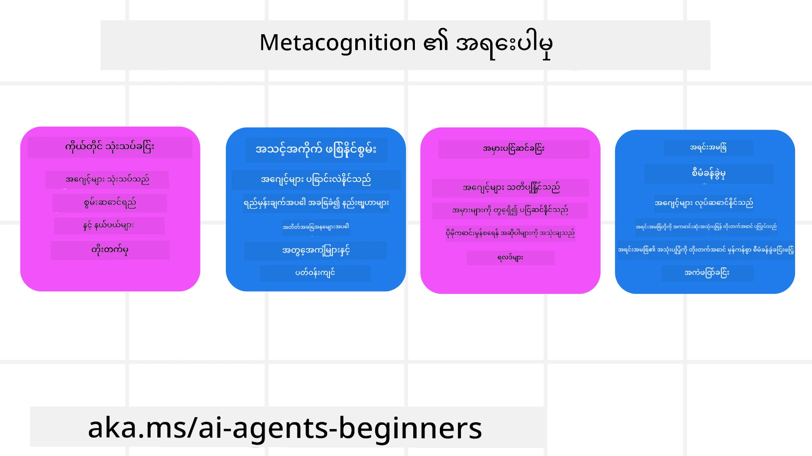
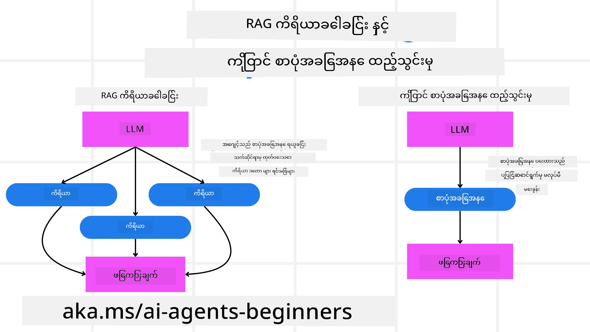

[](https://youtu.be/His9R6gw6Ec?si=3_RMb8VprNvdLRhX)

> _(ဤသင်ခန်းစာ၏ ဗီဒီယိုကို ကြည့်ရန် ရုပ်ပုံကို နှိပ်ပါ)_
# AI အေးဂျင့်များတွင် မီတာကိုဂျီနီရှင်း

## နိဒါန်း

AI အေးဂျင့်များတွင် မီတာကိုဂျီနီရှင်းအကြောင်း သင်ခန်းစာသို့ ကြိုဆိုပါတယ်! ဤအခန်းသည် AI အေးဂျင့်များသောသူတို့၏စဉ်းစားမှု အပြုအမှုနှင့်ပတ်သက်၍ မည်ကဲ့သို့ စဉ်းစားနိုင်သလဲဆိုတာကို စိတ်ဝင်စားသော စတင်သင်ယူသူများအတွက် ဖန်တီးထားပါသည်။ ဤသင်ခန်းစာ၏ အဆုံးတွင် သင်သည် အဓိက ယေဘုယျအတွေးများကို နားလည်ပြီး AI အေးဂျင့်ဒီဇိုင်းတွင် မီတာကိုဂျီနီရှင်းအသုံးချရန် လက်တွေ့ အတုယူနိုင်ပါလိမ့်မည်။

## သင်ယူမှုရည်မှန်းချက်များ

ဤသင်ခန်းစာကို ပြီးစီးပြီးနောက် သင်သည် အသုံးချနိုင်ပါသည် -

1. အေးဂျင့်သတ်မှတ်ချက်များ၌ အတွေးလှုပ်ရှားမှု လုပ်ငန်းစဉ်များ၏ သက်ရောက်မှုကို နားလည်ရန်။
2. ကိုယ်တိုင်မှားချက်ပြင်ဆင်နိုင်သော အေးဂျင့်များအား စီမံကိန်းရေးဆွဲခြင်းနှင့် သုံးသပ်ခြင်း နည်းလမ်းများ အသုံးပြုနိုင်ရန်။
3. လုပ်ငန်းများကို ပြီးမြောက်စေမည့် ကုဒ်ကို ကိုယ်ဘယ်လို ရိုက်နှိပ်နိုင်သော အေးဂျင့်များကို ဖန်တီးနိုင်ရန်။

## မီတာကိုဂျီနီရှင်းနိဒါန်း

မီတာကိုဂျီနီရှင်း ဆိုသည်မှာ မိမိ၏စဉ်းစားနေမှုအပေါ် စဉ်းစားခြင်းနှင့် ဆက်စပ်သော အဆင့်မြင့် ဉာဏ်ရည်လုပ်ဆောင်မှုများကို ဆိုလိုသည်။ AI အေးဂျင့်များအတွက် မည်ကဲ့သို့များစွာ ကိုယ်တိုင်သိမြင်ခြင်းနှင့် ယခင်အတွေ့အကြုံများကို အသုံးပြု၍ လုပ်ဆောင်ချက်များအား သုံးသပ်ပြီး ပြင်ဆင် နိုင်စေရန်ဖြစ်သည်။ မီတာကိုဂျီနီရှင်း သည် "စဉ်းစားခြင်းအပေါ် စဉ်းစားခြင်း" ဟုခေါ်ပြီး အေးဂျင့် AI စနစ်များ ဖွံ့ဖြိုးတိုးတက်ရေးတွင် အရေးကြီးသော အတွေးအခေါ် ဖြစ်သည်။ ၎င်းသည် AI စနစ်များကို သူတို့၏ကိုယ်ပိုင် ပြင်ပလုပ်ငန်းစဉ်များကို သိမြင် နားလည်နိုင်၍၊ သတိထား၊ ထိန်းချုပ်၊ နှင့် အတုယူလေ့လာ ပြောင်းလဲထားနိုင်စေရန်ပါဝင်သည်။ လူတွေက မဟုတ်သည့် စုံစမ်းစစ်ဆေးမှုများ၊ ပြဿနာမျက်နှာနှင့် ကြည့်ရှုသောအတိုင်းဖြစ်သည်။ ၎င်းကိုယ်တိုင်သိမြင်မှုကြောင့် AI စနစ်များသည် သေချာသော ဆုံးဖြတ်ချက်များကို ချမှတ်နိုင်ပြီး အမှားများကို ရှာဖွေစိစစ်ပြီး တိုးတက်မှုများ အချိန်ကြာမြင့်စွာတိုးတက်စေသည်။ ထပ်မံ၍ Turing စမ်းသပ်မှုနှင့် AI ကိုယ်တိုင်ကိုက်တွယ်မည်ဆွေးနွေးမှုကို ပြန်လည်ဆက်ဆံသည်။

အေးဂျင့် AI စနစ်များအရ မီတာကိုဂျီနီရှင်းမှာ အောက်ပါ စိန်ခေါ်မှုများကို ရင်ဆိုင်ကာဖြေရှင်းပေးနိုင်ကြောင်း ဖြစ်သည်။
- ထင်ရှားဖြစ်စေခြင်း: AI စနစ်များသည် သူတို့၏ အတွေးအခေါ်နှင့် ဆုံးဖြတ်ချက်များကို ရှင်းလင်းဝေဖန်နိုင်စေရန်။
- အတွေးအခေါ်: AI စနစ်များသည် အချက်အလက်များကို အတူတကွဆက်စပ်စီမံကိန်းရေးဆွဲ၍ သေချာသော ဆုံးဖြတ်ချက်များ ချနိုင်စေရန်။
- ပိုမိုသင့်တော်မှု: AI စနစ်များသည် ပတ်ဝန်းကျင်အသစ်များနှင့် အခြေအနေညှိနှိုင်းမှုများကို လိုက်လျောညီထွေပြောင်းလဲနိုင်စေရန်။
- ထင်မြင်မှု: AI စနစ်များသည် သူတို့၏ပတ်ဝန်းကျင်မှ ဒေတာများကို မှန်ကန်စွာ အသိအမှတ်ပြုနားလည်နိုင်စေရန် တိုးတက်စေခြင်း။

### မီတာကိုဂျီနီရှင်း ဆိုသည်မှာ?

မီတာကိုဂျီနီရှင်း သည် "စဉ်းစားခြင်းအပေါ် စဉ်းစားခြင်း" ဟူ၍ ကိုယ်တိုင်သိမြင် ထိန်းချုပ်မှုပါဝင်သည့် အဆင့်မြင့် ဉာဏ်ရည်လုပ်ငန်းစဉ်ဖြစ်သည်။ AI လောက၌ မီတာကိုဂျီနီရှင်းသည် အေးဂျင့်များအား သူတို့၏ မဟာဗျူဟာနှင့် လုပ်ဆောင်ချက်များအား သုံးသပ် ပြင်ဆင်နိုင်စေရန် အာဏာပေးသည်၊ ထို့ကြောင့် ပြဿနာဖြေရှင်းမှုနှင့် ဆုံးဖြတ်မှု တိုးတက်စေသည်။ မီတာကိုဂျီနီရှင်းကို နားလည်ခြင်းဖြင့် သင်သည် ပိုမို ထင်ရှားသော AI အေးဂျင့်များကိုသာမက ပိုမိုညှိနှိုင်းနိုင်သောနှင့် ထိရောက်သော AI များကို ဒီဇိုင်းဆွဲနိုင်ပါမည်။ မီတာကိုဂျီနီရှင်းမှန်ကန်စွာဖြင့် သင်သည် AI ကို သူ၏ ကိုယ်ပိုင် အတွေးအခေါ်ကို ထောက်လှမ်း သုံးသပ်နေသည်ကို တွေ့မည်ဖြစ်သည်။

ဥပမာ- “ငါသည် သက်သာသည့် လေယာဉ်မွန်းကို ဦးစားပေးထားသည်၊ အဘယ်ကြောင့်ဆိုသော်… တိုက်ရိုက်လေယာဉ်များကို လက်လွတ်နိုင်သည်ဟု ထင်ရသဖြင့် ပြန်စစ်ရမည်။”။
သတ်မှတ်ရာလမ်းကြောင်းက ဘယ်လို ရွေးချယ်ခဲ့သည်ကို မှတ်သားထားခြင်း။
- ယခင်တုန်းက အသုံးပြုသူစိတ်ကြိုက်ကိစ္စများအပေါ် များစွာအားထားရန်ကြောင့် အမှားလုပ်ခဲ့သည်ကို မှတ်ထား၍ နောက်ဆုံး အကြံပြုချက်မဟုတ်ဘဲ ဆုံးဖြတ်မှုမဟာဗျူဟာကိုပြောင်းလဲသည်။
- “အသုံးပြုသူက ‘အလွန်ပြည့်ဖြည်းဖြည်း’ ဟူ၍ ဆိုသည့်အခါ၊ ဥစ္စာအချို့ကို ဖယ်ရှားရန်သာမက ‘အထိပ်တန်း အလှည့်အပြောင်းများ’ ရွေးချယ်မူအဆင်မပြေသည်ဆိုသည်ကို တွေ့ရှိ၍ ပြဿနာများကို မှန်ကန်စွာသိရှိခြင်း”စသည်တို့ကို ခွဲခြားခြင်း။

### AI အေးဂျင့်များတွင် မီတာကိုဂျီနီရှင်း၏ အရေးပါမှု

မီတာကိုဂျီနီရှင်းသည် AI အေးဂျင့် ဒီဇိုင်းတွင် အောက်ပါအချက်များအတွက် အလွန်အရေးကြီးပါသည်။



- ကိုယ်တိုင်သုံးသပ်ခြင်း: အေးဂျင့်များသည် သူတို့၏ လုပ်ဆောင်ချက်များကို သုံးသပ်၍ တိုးတက်ရေးအတွက် နေရာများကို ရှာဖွေသည်။
- ညှိနှိုင်းနိုင်မှု: အေးဂျင့်များသည် ယခင်အတွေ့အကြုံများနှင့် အပြောင်းအလဲလိုအပ်ချက်များအပေါ် မဟာဗျူဟာများကို ပြောင်းလဲပါသည်။
- အမှားပြင်ဆင်ခြင်း: အေးဂျင့်များသည် အမှားများကို ကိုယ်တိုင်တွေ့၍ ပြင်ဆင်နိုင်ပြီး တိကျမှု မြင့်စေသည်။
- အရင်းအမြစ် စီမံခန့်ခွဲမှု: အေးဂျင့်များသည် အချိန်နှင့် ကွန်ပြူတာစွမ်းအား ကဲ့သို့သော အရင်းအမြစ်များကို စီမံကိန်းရေးဆွဲပြီး သုံးသပ်ကာ အကြောင်းပြု စိတ်ကြိုက် အသုံးပြုနိုင်ပါသည်။

## AI အေးဂျင့်၏ အစိတ်အပိုင်းများ

မီတာကိုဂျီနီရှင်းလုပ်ဆောင်ချက်များအထဲသို့ ဝင်မည့်အခါ AI အေးဂျင့်၏ အခြေခံအစိတ်အပိုင်းများကို နားလည်ခြင်း အရေးကြီးပါသည်။ AI အေးဂျင့်သည် ပုံမှန်အားဖြင့် ဒီအပိုင်းများ ပါဝင်သည်။

- မိဘစိတ္တ: အေးဂျင့်၏ ဉာဏ်ရည်နှင့် ပုံသဏ္ဍာန်များ၊ အသုံးပြုသူနှင့် မည်ကဲ့သို့ ဆက်ဆံသည်ကို သတ်မှတ်သည်။
- ကိရိယာများ: အေးဂျင့်လုပ်ဆောင်နိုင်သည့် အရည်အချင်းများနှင့် လုပ်ဆောင်ချက်များ။
- ကျွမ်းကျင်မှုများ: အေးဂျင့်ပိုင်ဆိုင်သည့် အသိပညာနှင့် ကြားနှင့်ပြတ်မှုများ။

ဤအစိတ်အပိုင်းများသည် အချည်းနှိုင်းလုပ်နိုင်သော "ကျွမ်းကျင်မှုယူနစ်" တစ်ခုဖန်တီးသောကြောင့် အထူးလုပ်ငန်းများကို ဆောင်ရွက်နိုင်စေသည်။

**ဥပမာ**-
ခရီးသွားအေးဂျင့်တစ်ယောက်ကို စဉ်းစားပါ၊ ၎င်းသည် သင်၏ပွဲစဉ်အစီအစဉ်ကို စီမံကိန်းရေးဆွဲရာတွင်သာမက ဒေတာနှင့် ယခင်ခရီးသွားအကွက်အကြောင်းအခြေအနေများအပေါ် မူတည်၍ လမ်းကြောင်းပြောင်းလဲပါသည်။

### ဥပမာ- ခရီးသွားအေးဂျင့်ဝန်ဆောင်မှုတွင် မီတာကိုဂျီနီရှင်း။

သင်သည် AI ဖြင့်ထောက်ပံ့ထားသော ခရီးသွားအေးဂျင့်ဝန်ဆောင်မှုကို ဒီဇိုင်းဆွဲနေသည်ဟု တွေးပါ။ "ခရီးသွားအေးဂျင့်" သည် အသုံးပြုသူကို ခရီးစဉ်စီမံကိန်းရေးဆွဲရာတွင် ကူညီသည်။ မီတာကိုဂျီနီရှင်းကို ထည့်သွင်းရန်၊ ခရီးသွားအေးဂျင့်သည် ကိုယ်တိုင်သိမြင်မှုနှင့် ယခင်အတွေ့အကြုံများအပေါ် အခြေခံ၍ လုပ်ဆောင်ချက်များကို သုံးသပ်ပြင်ဆင်ရမည်ဖြစ်သည်။ မီတာကိုဂျီနီရှင်း သုံးစွဲမှုသည် မည်ကဲ့သို့ပါဝင်နိုင်သည့် နည်းလမ်းမှာ အောက်ပါအတိုင်းဖြစ်သည်။

#### လက်ရှိတာဝန်

လက်ရှိတာဝန်မှာ အသုံးပြုသူတစ်ဦးအား 파ရီ(Paris) ခရီးစဉ်စီမံရန် ကူညီခြင်း ဖြစ်သည်။

#### တာဝန်ကို ပြီးမြောက်စေရန်အဆင့်များ

1. **အသုံးပြုသူ စိတ်ကြိုက်ချက်စုဆောင်းခြင်း** - ခရီးသွားရက်များ၊ ဘတ်ဂျက်၊ စိတ်ဝင်စားရာများ (ဥပမာ၊ ပြတိုက်များ၊ အာဟာရ၊ ဖက်ရှင်) နှင့် အထူးလိုအပ်ချက်များကို မေးမြန်းပါ။
2. **သတင်းအချက်အလက် ရယူခြင်း** - အသုံးပြုသူ စိတ်ကြိုက်ချက်နှင့် ကိုက်ညီသော လေကြောင်းလေယာဉ်ရွေးချယ်စရာများ၊ အဆောင်များ၊ ခရီးသွားဖျော်ဖြေရေးနေရာများနှင့်စားသောက်ဆိုင်များကို ရှာဖွေပါ။
3. **အကြံပြုချက် ထုတ်ပေးခြင်း** - ကိုယ်ပိုင်စိတ်ကြိုက် ခရီးစဉ်စာရင်းကို လေကြောင်းအသေးစိတ်၊ ဟိုတယ္ အပ်နှံ၊ နှင့် အကြံပြု လှုပ်ရှားမှုများပါဝင်သော အနီးကပ်ပေးပါ။
4. **တုံ့ပြန်ချက်အရ ပြင်ဆင်ခြင်း** - အကြံပြုချက်များအပေါ် အသုံးပြုသူ၏ တုံ့ပြန်ချက်ကို မေးမြန်းပြီး လိုအပ်သည့် ပြင်ဆင်မှုများ ပြုလုပ်ပါ။

#### လိုအပ်သော အရင်းအမြစ်များ

- လေကြောင်းနှင့် ဟိုတယ္ အပ်နှံမှု ဒေတာဘေ့စ်များ ရရှိနိုင်မှု။
- 파ရီမြို့ရှိ ခရီးသွားဖျော်ဖြေရေးနေရာများနှင့်စားသောက်ဆိုင်များ အကြောင်းသတင်းအချက်အလက်။
- ယခင်ပြောဆိုမှုများမှ အသုံးပြုသူ တုံ့ပြန်ချက်ဒေတာ။

#### အတွေ့အကြုံနှင့် ကိုယ်တိုင်သုံးသပ်မှု

ခရီးသွားအေးဂျင့်သည် မီတာကိုဂျီနီရှင်းကို အသုံးပြုပြီး သူ၏လုပ်ဆောင်မှုကို သုံးသပ်ကာ ယခင်အတွေ့အကြုံမှ သင်ယူသည်။ ဥပမာ -

1. **အသုံးပြုသူတုံ့ပြန်ချက် စိစစ်ခြင်း** - ခရီးသွားအေးဂျင့်သည် အသုံးပြုသူတုံ့ပြန်ချက်များအား ပြန်လည်စမ်းသပ်ကာ အကြံပြုချက်များမှ ဘာကောင်းမွန်ပြီး ဘာမကောင်းခဲ့သည်ကို သတ်မှတ်ပါသည်။ ၎င်းသည် နောင်တစ်ချိန်တွင် အကြံပြုချက်များပြောင်းလဲစေလိမ့်မည်။
2. **ညှိနှိုင်းနိုင်မှု** - အသုံးပြုသူသည် ပြီးခဲ့သည့်အခါ ပြည့်နှက်သောနေရာများကို မနှစ်သက်ကြောင်း ပြောခဲ့ပါက ခရီးသွားအေးဂျင့်သည် နောက်မှ လူအများကြိုက်သောခရီးသွားရာဇာတ်ရုံများကို အချိန်မြင့်များတွင် မတိုင်ကြိုက်အပ်ရန်ရှောင်ကြဉ်လိမ့်မည်။
3. **အမှားပြင်ဆင်မှု** - ခရီးသွားအေးဂျင့်သည် အရင်က အမှားကျခဲ့သော ဟိုတယ္အပ်နှံမှု များ (ဥပမာ၊ ပြည့်နောက်ဆုံးအပ်နှံထားသော ဟိုတယ္) ကို နောက်တစ်ကြိမ်တွင် ထပ်စစ်ဆေးပြီး ပြင်ဆင်သွားသည်။

#### လက်တွေ့ ဖန်တီးသူ ဥပမာ

မီတာကိုဂျီနီရှင်း ဖြည့်စွက်ထားသော ခရီးသွားအေးဂျင့်ကုဒ်၏ တစ်စိတ်တစ်ဒေသ ကို ရိုးရှင်းစွာ ဖော်ပြထားသည့် ဥပမာ။

```python
class Travel_Agent:
    def __init__(self):
        self.user_preferences = {}
        self.experience_data = []

    def gather_preferences(self, preferences):
        self.user_preferences = preferences

    def retrieve_information(self):
        # ဦးစားပေးချက်များအပေါ် အခြေခံပြီး လေယာဉ်စီးလိုက်၊ ဟိုတယ်များနှင့် အလှောက်အလှမ်းများကို ရှာဖွေပါ
        flights = search_flights(self.user_preferences)
        hotels = search_hotels(self.user_preferences)
        attractions = search_attractions(self.user_preferences)
        return flights, hotels, attractions

    def generate_recommendations(self):
        flights, hotels, attractions = self.retrieve_information()
        itinerary = create_itinerary(flights, hotels, attractions)
        return itinerary

    def adjust_based_on_feedback(self, feedback):
        self.experience_data.append(feedback)
        # တုံ့ပြန်ချက်များကို စိစစ်၍ အနာဂတ် အကြံပြုချက်များကို ပြန်လည်ညှိနှိုင်းပါ
        self.user_preferences = adjust_preferences(self.user_preferences, feedback)

# အသုံးပြုမှု နမူနာ
travel_agent = Travel_Agent()
preferences = {
    "destination": "Paris",
    "dates": "2025-04-01 to 2025-04-10",
    "budget": "moderate",
    "interests": ["museums", "cuisine"]
}
travel_agent.gather_preferences(preferences)
itinerary = travel_agent.generate_recommendations()
print("Suggested Itinerary:", itinerary)
feedback = {"liked": ["Louvre Museum"], "disliked": ["Eiffel Tower (too crowded)"]}
travel_agent.adjust_based_on_feedback(feedback)
```

#### မီတာကိုဂျီနီရှင်း၏ အရေးပါမှု

- **ကိုယ်တိုင်သုံးသပ်ခြင်း**: အေးဂျင့်များသည် သူတို့၏ လုပ်ငန်းစွမ်းဆောင်ရည်ကို သုံးသပ်ကာ တိုးတက်မှုနေရာများကို ရှာဖွေသည်။
- **ညှိနှိုင်းနိုင်မှု**: တုံ့ပြန်ချက်နှင့် အခြေအနေပြောင်းလဲမှုအပေါ် မဟာဗျူဟာများကို ပြောင်းလဲနိုင်သည်။
- **အမှားပြင်ဆင်မှု**: အေးဂျင့်များသည် ကိုယ်တိုင်အမှား အချက်မှားများကို ရှာဖွေပြီး ပြင်ဆင်နိုင်သည်။
- **အရင်းအမြစ် စီမံခန့်ခွဲမှု**: အချိန်၊ ကွန်ပြူတာစွမ်းအားကဲ့သို့သောအရင်းအမြစ်များအား အကောင်းဆုံး အသုံးချနိုင်သည်။

မီတာကိုဂျီနီရှင်းထည့်သွင်းခြင်းဖြင့် ခရီးသွားအေးဂျင့်သည် ပိုမိုစိတ်ကြိုက်အကြံပြုချက်များကို ပံ့ပိုးပေးနိုင်၍ အသုံးပြုသူအတွေ့အကြုံကို တိုးတက်စေပါသည်။

---

## ၂။ အေးဂျင့်များတွင် စီမံကိန်းရေးဆွဲခြင်း

စီမံကိန်းရေးဆွဲခြင်း သည် AI အေးဂျင့်ယုံကြည်မှုအပြုအမှု၏ အရေးကြီးသောအစိတ်အပိုင်းဖြစ်သည်။ ၎င်းသည် ရည်မှန်းချက်ယူရန်လိုသောခြေလှမ်းများကို ဖေါ်ထုတ်ပုံသည့် စဉ်လာဖြစ်ပြီး လက်ရှိအခြေအနေ၊ အရင်းအမြစ်များနှင့် ဖြစ်နိုင်ခြေရှိသော အခက်အခဲများအား စဉ်းစားခြင်း ပါဝင်ပါသည်။

### စီမံကိန်းရေးဆွဲမှု အစိတ်အပိုင်းများ

- **လက်ရှိတာဝန်**: ထပ်မံသတ်မှတ်ခြင်း။
- **တာဝန်အားဖြည့်ဆည်းခြင်းခြေလှမ်းများ**: တာဝန်အား အထိန်းချုပ်လွယ်သော အဆင့်များသို့ ခွဲခြမ်းခြင်း။
- **လိုအပ်သော အရင်းအမြစ်များ**: လိုအပ်သော အရင်းအမြစ်များအား ဖော်ထုတ်ခြင်း။
- **အတွေ့အကြုံ**: ယခင်အတွေ့အကြုံများအား စီမံကိန်းရေးဆွဲမှုအတွက် အသုံးချခြင်း။

**ဥပမာ**:
ခရီးသွားအေးဂျင့်သည် အသုံးပြုသူအား အထိရောက်ဆုံး ခရီးစီမံရေးဆွဲရန် လိုအပ်သော ခြေလှမ်းများမှာ အောက်ပါအတိုင်း ဖြစ်သည် -

### ခရီးသွားအေးဂျင့်အတွက် ခြေလှမ်းများ

1. **အသုံးပြုသူစိတ်ကြိုက်ချက်စုဆောင်းခြင်း**
   - အသုံးပြုသူ၏ ခရီးသွားရက်များ၊ ငွေကြေးကန့်သတ်ချက်၊ စိတ်ဝင်စားရာများနှင့် အထူးလိုအပ်ချက်များကို မေးမြန်းပါ။
   - ဥပမာများ- "သင်တို့ ဘယ်တော့ခရီးသွားပြီလဲ?" "ငွေကြေး ကန့်သတ်ချက် ဘယ်လောက်လဲ?" "ခရီးသွားစဉ် အပန်းဖြေမှုတွင် ဘယ်လို လှုပ်ရှားမှုများကို နှစ်သက်ပါသလဲ?"

2. **သတင်းအချက်အလက် ရယူခြင်း**
   - အသုံးပြုသူစိတ်ကြိုက်ချက်တို့ကို အခြေခံ၍ သက်ဆိုင်ရာ ခရီးသွားရွေးချယ်စရာများကို ရှာဖွေပါ။
   - **လေကြောင်းလေယာဉ်များ**: အသုံးပြုသူဘတ်ဂျက်နှင့် ခရီးသွားရက်များအတွင်း ရရှိနိုင်သော လေကြောင်းလေယာဉ်ရွေးချယ်စရာများကို ရှာပါ။
   - **အဆောင်များ**: အသုံးပြုသူစိတ်ကြိုက်၏ တည်နေရာ၊ စျေးနှုန်းနှင့် အဆင်ပြေမှုများကို ကိုက်ညီသော ဟိုတယ္ သို့မဟုတ် ငှားသုံးနေရာများကို ရှာဖွေပါ။
   - **ခရီးသွား ဖျော်ဖြေရေးနေရာများနှင့်စားသောက်ဆိုင်များ**: အသုံးပြုသူစိတ်ဝင်စားရာများနှင့် ကိုက်ညီသော လူကြိုက်များသော ခရီးသွားနိုင်ငံများ၊ လှုပ်ရှားမှုများနှင့် အစားအသောက် နေရာများကို ဖော်ထုတ်ပါ။

3. **အကြံပြုချက် ထုတ်ပေးခြင်း**
   - ရယူထားသော သတင်းအချက်အလက်များကို ကိုယ်ပိုင်စိတ်ကြိုက် ခရီးစဉ်စာရင်းအဖြစ် ပေါင်းစပ်ပါ။
   - လေကြောင်းရွေးချယ်စရာများ၊ ဟိုတယ္အပ်နှံမှုနှင့် အကြံပြုလှုပ်ရှားမှုများအတွက် အသေးစိတ်အချက်အလက်များ၊ အသုံးပြုသူစိတ်ကြိုက်ချက်အတိုင်း အကြံပြုချက်များကို ထောက်ပံ့ပါ။

4. **အသုံးပြုသူထံ သွင်းကြော်ငြာခြင်း**
   - အကြံပြု ခရီးစဉ်စာရင်းကို အသုံးပြုသူထံ ပေးပို့ပါ။
   - ဥပမာ- "သင်၏ ပါရီခရီးစဉ်အတွက် အကြံပြု စာရင်းဖြစ်ပါသည်။ လေကြောင်းအသေးစိတ်၊ ဟိုတယ္အပ်နှံမှု နှင့် အကြံပြု လှုပ်ရှားမှုများအပြင် စားသောက်ဆိုင်စာရင်းပါ ၀င်ပါတယ်။ သင့်ရဲ့ အမြင်ဘယ်လိုတွေလဲ?"

5. **တုံ့ပြန်ချက် စုဆောင်းခြင်း**
   - အကြံပြုမှုများအပေါ် အသုံးပြုသူ၏ တုံ့ပြန်ချက်ကို မေးမြန်းပါ။
   - ဥပမာများ- "လေကြောင်းရွေးချယ်ခြင်းအပေါ် သဘောကျပါသလား?" "ဟိုတယ္သည် သင့်လိုအပ်ချက်နှင့် ကိုက်ညီပါသလား?" "ထပ်ထည့်လိုသည့် လှုပ်ရှားမှုများ ရှိပါသလား?"

6. **တုံ့ပြန်ချက်အနုင်ငံပြင်ဆင်ခြင်း**
   - အသုံးပြုသူ၏ တုံ့ပြန်ချက်အပေါ် အခြေခံပြီး ခရီးစဉ်စာရင်းအား ပြင်ဆင်မည်။
   - လေကြောင်း၊ အဆောင်နှင့် လှုပ်ရှားမှုအကြံပြုချက်များကို အသုံးပြုသူစိတ်ကြိုက်ဖွင့်ပြင်ပါ။

7. **နောက်ဆုံး အတည်ပြုချက်**
   - အသုံးပြုသူထံ ပြုပြင်ပြီး ခရီးစဉ်စာရင်းအား နောက်ဆုံး အတည်ပြုရန် ပေးပို့ပါ။
   - ဥပမာ- "သင့်တုံ့ပြန်ချက်အရ ပြင်ဆင်ပြီးပါပြီ။ ဒီစာရင်းက အဆင်ပြေပါသလား?"

8. **လက်မှတ်ရေးထိုးခြင်းနှင့် အတည်ပြုချက်ပေးခြင်း**
   - အသုံးပြုသူ အတည်ပြုပြီးနောက် လေကြောင်းလှုပ်ရှားမှု၊ ဟိုတယ္ အပ်နှံမှုနှင့် ကြိုတင်စီစဉ်ထားသော လှုပ်ရှားမှုများကို စီစဉ်ပါ။
   - အတည်ပြုချက်အသေးစိတ်ကို အသုံးပြုသူထံ ပို့ပါ။

9. **ဆက်လက်ထောက်ပံ့မှု ပေးခြင်း**
   - ခရီးစဉ်တိုးချဲ့ခြင်းများ သို့မဟုတ် တူညီမှုများအတွက် အသုံးပြုသူအား အသုံးပြုခွင့်ရှိနေပါသည်။
   - ဥပမာ - "ခရီးတလမ်းလုံးအတွင်း သင့်အား ကူညီရန် လိုအပ်ပါက မည်သည့်အချိန်မဆို ဆက်သွယ်နိုင်ပါသည်။"

### ဥပမာ အပြန်အလှန် ဆက်သွယ်မှု

```python
class Travel_Agent:
    def __init__(self):
        self.user_preferences = {}
        self.experience_data = []

    def gather_preferences(self, preferences):
        self.user_preferences = preferences

    def retrieve_information(self):
        flights = search_flights(self.user_preferences)
        hotels = search_hotels(self.user_preferences)
        attractions = search_attractions(self.user_preferences)
        return flights, hotels, attractions

    def generate_recommendations(self):
        flights, hotels, attractions = self.retrieve_information()
        itinerary = create_itinerary(flights, hotels, attractions)
        return itinerary

    def adjust_based_on_feedback(self, feedback):
        self.experience_data.append(feedback)
        self.user_preferences = adjust_preferences(self.user_preferences, feedback)

# booing တောင်းဆိုချက်အတွင်းတွင် ဥပမာအသုံးပြုမှု
travel_agent = Travel_Agent()
preferences = {
    "destination": "Paris",
    "dates": "2025-04-01 to 2025-04-10",
    "budget": "moderate",
    "interests": ["museums", "cuisine"]
}
travel_agent.gather_preferences(preferences)
itinerary = travel_agent.generate_recommendations()
print("Suggested Itinerary:", itinerary)
feedback = {"liked": ["Louvre Museum"], "disliked": ["Eiffel Tower (too crowded)"]}
travel_agent.adjust_based_on_feedback(feedback)
```

## ၃။ ပြင်ဆင်မှုပြုနှင့် RAG စနစ်

ပထမ ဦး စွာ RAG ကိရိယာနှင့် မတိုင်မီ အသုံးပြုမည့် အခြေအနေဒေတာထည့်သွင်းခြင်း (Pre-emptive Context Load) နှစ်ခု ကြား ကွာခြားချက်ကို နားလည်လိုက်ပါ။



### Retrieval-Augmented Generation (RAG)

RAG သည် ရယူမှုစနစ်နှင့် ထုတ်လုပ်မှု မော်ဒယ်တို့ ပေါင်းစည်းထားသည်။ မေးခွန်းတစ်ခု လာသည့်အခါ ရယူစနစ်အကြောင်းအရာနှင့် သက်ဆိုင်သည့် စာရွက်စာတမ်းများကို ပြန်ယူပြီး ထုတ်လုပ်မော်ဒယ်အတွက် အင်พု့အား တိုးမြှင့်ပေးသည်။ ထိုကဲ့သို့ဖြင့် မော်ဒယ်သည် ပိုမိုတိကျပြီး အကြောင်းအရာနှင့် ကိုက်ညီသောဖြေကြားချက်များ ထုတ်ပေးနိုင်သည်။

RAG စနစ်တွင် အေးဂျင့်သည် သိပ္ပံပညာ အခြေခံများမှ သက်ဆိုင်သော သတင်းအချက်အလက်များ ရယူပြီး သေချာသည့်ဖြေကြားချက်များ သို့မဟုတ် လုပ်ဆောင်ချက်များ ထုတ်ပေးသည်။

### ပြင်ဆင်မှုပြု RAG နည်းလမ်း

ပြင်ဆင်မှုပြု RAG နည်းလမ်းသည် RAG နည်းလမ်းများကို ပြုလုပ်ကာ အမှားများ ပြင်ဆင်ခြင်းနှင့် AI အေးဂျင့် တိကျမှုပိုမိုမြှင့်တင်ရန် အာရုံစိုက်သည်။ ၎င်းတွင် -

1. **မေးခွန်းပေးနည်း**: သက်ဆိုင်သည့် သတင်းအချက်အလက်များ ရယူရန် အေးဂျင့်အား လမ်းညွှန်ပေးသည့် ထူးခြားသောမေးခွန်းများအရောက်။
2. **ကိရိယာ**: ရယူထားသည့် သတင်းအချက်အလက်များ၏ သက်ဆိုင်မှုကို သုံးသပ်ပြီး တိကျသောဖြေကြားချက်များ ထုတ်ပေးရန် မော်ဒယ်များနှင့် စနစ်များ ချမှတ်ခြင်း။
3. **သုံးသပ်မှု**: အေးဂျင့်၏ ဖျော်ဖြေမှုကို အဆက်မပြတ် စိစစ်ကာ အတိအကျနှင့် ထိရောက်မှုတိုးတက်စေရန် ပြုပြင်မွမ်းမံခြင်း။

#### ဥပမာ - ရှာဖွေရေးအေးဂျင့်တွင် ပြင်ဆင်မှုပြု RAG

အင်တာနက်မှ အသုံးပြုသူမေးခွန်းများကို ဖြေကြားရန် သတင်းအချက်အလက် ရယူသော ရှာဖွေရေးအေးဂျင့်ကို အောက်ပါနည်းလမ်းများဖြင့် ပြင်ဆင်မှုပြု RAG ဖြင့် အသုံးပြုနိုင်သည် -

1. **မေးခွန်းပေးနည်း**: အသုံးပြုသူထံမှ ရရှိသည့် ဝင်ရောက်တဲ့အချက်များ ဖြစ်စဉ်အတိုင်း ရှာဖွေမှု မေးခွန်းများ ဖန်တီးခြင်း။
2. **ကိရိယာ**: သဘာဝဘာသာစကားကြားနာခြင်းနှင့် စက်သင်ယူမှု မော်ဒယ်များအား အသုံးပြု၍ ရလဒ်များအား အဆင့်သတ်မှတ်ခြင်းနှင့် စစ်ထုတ်ခြင်း။
3. **သုံးသပ်မှု**: အသုံးပြုသူတုံ့ပြန်ချက်များကို စမ်းသပ်ပြီး ရရှိသည့် သတင်းအချက်အလက်မှားများကို ဖော်ထုတ်ပြီး ပြင်ဆင်ခြင်း။

### ခရီးသွားအေးဂျင့်တွင် ပြင်ဆင်မှုပြု RAG

ပြင်ဆင်မှုပြု RAG (Retrieval-Augmented Generation) သည် AI အား တိကျပြီး သက်ဆိုင်သော သတင်းအချက်အလက်များ ရယူစေနိုင်ခြင်းနှင့် မမှန်ကန်သောအချက်များကို ပြင်ဆင်ကာ ထုတ်ပေးနိုင်စေသည်။ ခရီးသွားအေးဂျင့်သည် ပြင်ဆင်မှုပြု RAG နည်းလမ်းကို အသုံးပြု၍ ပိုမိုတိကျသော နှင့် သက်ဆိုင်သော ခရီးသွားအကြံပြုချက်များ ပေးနိုင်သည့်အတိုင်း ကြည့်ကြမည်။

၎င်းတွင် -

- **မေးခွန်းပေးနည်း:** သက်ဆိုင်သော သတင်းအချက်အလက် ရယူရန် အေးဂျင့်အား အထူးအစီအစဉ်များ ဖြင့် လမ်းညွှန်ခြင်း။
- **ကိရိယာ:** အေးဂျင့်သည် ရယူထားသည့် သတင်းအချက်အလက်၏ သက်ဆိုင်မှုကို သုံးသပ်ကာ တိကျထိရောက်သောဖြေကြားချက်များ ထုတ်ပေးနိုင်စေရန် မော်ဒယ်နည်းပညာများ အသုံးပြုခြင်း။
- **သုံးသပ်မှု**: အေးဂျင့်လုပ်ဆောင်မှုကို ဆက်လက်စိစစ်ကာ တိကျမှုပိုမို မြှင့်တင်ရန် ပြုပြင်မွမ်းမံခြင်း။

#### ခရီးသွားအေးဂျင့်အတွက် ပြင်ဆင်မှုပြု RAG အကောင်အထည်ဖော်ခြင်းဆိုင်ရာ ခြေလှမ်းများ

1. **အစပြု အသုံးပြုသူအပြန်အလှန် ဆက်သွယ်မှု**
   - ခရီးသွားအေးဂျင့် သည် ပထမဦးဆုံး အသုံးပြုသူ၏ စိတ်ကြိုက်ချက်များကို စုဆောင်းသည်၊ ဥပမာ - ခရီးသွားနိုင်ရာနေရာ၊ ခရီးသွားရက်များ၊ ဘတ်ဂျက်၊ စိတ်ဝင်စားမှုများ။
   - ဥပမာ-

     ```python
     preferences = {
         "destination": "Paris",
         "dates": "2025-04-01 to 2025-04-10",
         "budget": "moderate",
         "interests": ["museums", "cuisine"]
     }
     ```

2. **သတင်းအချက်အလက် ရယူခြင်း**
   - ခရီးသွားအေးဂျင့် သည် အသုံးပြုသူစိတ်ကြိုက်ချက်များအပေါ်မူတည်၍ လေကြောင်းလေယာဉ်၊ အဆောင်၊ ခရီးသွားအဆင့်မြင့်နေရာများနှင့် စားသောက်ဆိုင်များအကြောင်း သတင်းအချက်အလက် ရယူသည်။
   - ဥပမာ-

     ```python
     flights = search_flights(preferences)
     hotels = search_hotels(preferences)
     attractions = search_attractions(preferences)
     ```

3. **စတင်အကြံပြုချက် ထုတ်ပေးခြင်း**
   - ခရီးသွားအေးဂျင့် သည် ရယူထားသော သတင်းအချက်အလက်များအား အသုံးပြုပြီး ကိုယ်ပိုင်စိတ်ကြိုက် ခရီးစဉ် စာရင်းတစ်ခု ထုတ်ပေးသည်။
   - ဥပမာ-

     ```python
     itinerary = create_itinerary(flights, hotels, attractions)
     print("Suggested Itinerary:", itinerary)
     ```

4. **အသုံးပြုသူတုံ့ပြန်ချက် လက်ခံခြင်း**
   - ခရီးသွားအေးဂျင့် သည် စတင်အကြံပြုချက်များပေါ် အသုံးပြုသူ၏ တုံ့ပြန်ချက်ကို မေးမြန်းသည်။
   - ဥပမာ-

     ```python
     feedback = {
         "liked": ["Louvre Museum"],
         "disliked": ["Eiffel Tower (too crowded)"]
     }
     ```

5. **ပြင်ဆင်မှုပြု RAG လုပ်ငန်းစဉ်**
   - **မေးခွန်းပေးနည်း**: အသုံးပြုသူတုံ့ပြန်ချက်အပေါ် မူတည်၍ ခရီးသွားအေးဂျင့် သည် ရှာဖွေမှု မေးခွန်းများကို ဖောင်မူဖြစ်စေသည်။
     - ဥပမာ-

       ```python
       if "disliked" in feedback:
           preferences["avoid"] = feedback["disliked"]
       ```

   - **ကိရိယာ**: ခရီးသွားအေးဂျင့်သည် အသုံးပြုသူတုံ့ပြန်မှုအရ သက်ဆိုင်မှုကို အလေးထားခြင်းဖြင့် ရှာဖွေမှုရလဒ်အသစ်များအား အဆင့်သတ်မှတ်ခြင်းနှင့် စစ်ထုတ်ခြင်းများ ဆောင်ရွက်သည်။
     - ဥပမာ-

       ```python
       new_attractions = search_attractions(preferences)
       new_itinerary = create_itinerary(flights, hotels, new_attractions)
       print("Updated Itinerary:", new_itinerary)
       ```

   - **သုံးသပ်မှု**: ခရီးသွားအေးဂျင့်သည် အသုံးပြုသူတုံ့ပြန်ချက်ကို စူးစမ်းသုံးသပ်ကာ၊ အကြံပြုချက်များ၏ သက်ဆိုင်မှု၊ တိကျမှုပေါ် မူတည်၍ ဆက်လက်ပြင်ဆင်ပြောင်းလဲမှုများပြုလုပ်သည်။
     - ဥပမာ-

       ```python
       def adjust_preferences(preferences, feedback):
           if "liked" in feedback:
               preferences["favorites"] = feedback["liked"]
           if "disliked" in feedback:
               preferences["avoid"] = feedback["disliked"]
           return preferences

       preferences = adjust_preferences(preferences, feedback)
       ```

#### လက်တွေ့ ဥပမာ

အောက်မှာ ပြင်ဆင်မှုပြု RAG နည်းလမ်းကို ခရီးသွားအေးဂျင့်တွင် ထည့်သွင်းသုံးစွဲသည့် ရိုးရှင်းသည့် Python ကုဒ်ဥပမာရှိသည်။

```python
class Travel_Agent:
    def __init__(self):
        self.user_preferences = {}
        self.experience_data = []

    def gather_preferences(self, preferences):
        self.user_preferences = preferences

    def retrieve_information(self):
        flights = search_flights(self.user_preferences)
        hotels = search_hotels(self.user_preferences)
        attractions = search_attractions(self.user_preferences)
        return flights, hotels, attractions

    def generate_recommendations(self):
        flights, hotels, attractions = self.retrieve_information()
        itinerary = create_itinerary(flights, hotels, attractions)
        return itinerary

    def adjust_based_on_feedback(self, feedback):
        self.experience_data.append(feedback)
        self.user_preferences = adjust_preferences(self.user_preferences, feedback)
        new_itinerary = self.generate_recommendations()
        return new_itinerary

# နမူနာ အသုံးပြုမှု
travel_agent = Travel_Agent()
preferences = {
    "destination": "Paris",
    "dates": "2025-04-01 to 2025-04-10",
    "budget": "moderate",
    "interests": ["museums", "cuisine"]
}
travel_agent.gather_preferences(preferences)
itinerary = travel_agent.generate_recommendations()
print("Suggested Itinerary:", itinerary)
feedback = {"liked": ["Louvre Museum"], "disliked": ["Eiffel Tower (too crowded)"]}
new_itinerary = travel_agent.adjust_based_on_feedback(feedback)
print("Updated Itinerary:", new_itinerary)
```

### မတိုင်မီ အသုံးပြုမည့် အခြေအနေဒေတာ ထည့်သွင်းခြင်း


Pre-emptive Context Load သည် မေးခွန်းတစ်ခုကို ပြုလုပ်မှုပြုလုပ်မီ မော်ဒယ်ထဲသို့ သက်ဆိုင်ရာ သွင်းချက် သို့မဟုတ် နောက်ခံအချက်အလက်များကို ယူလှည့်ခြင်းအား ထည့်သွင်းခြင်းဖြစ်သည်။ ၎င်းသည် မော်ဒယ်တွင် အစပိုင်းမှ ဒီအချက်အလက်များကို အသုံးပြုခွင့်ရှိရှိ သောကြောင့် လုပ်ငန်းစဉ်အတွင်း အပိုအချက်အလက်များ ရှာဖွေရန် မလိုအပ်ဘဲ ပိုမို အသိပညာရှိသော တုံ့ပြန်ချက်များ ထုတ်ပေးနိုင်စေသည်။

Python တွင် ခရီးသွားအေဂျင့်လျှောက်လွှာအတွက် pre-emptive context load မည်သို့ ဖြစ်နိုင်သည်ကို ရိုးရှင်းစွာ ဖော်ပြထားသော နမူနာတစ်ခု ဒီမှာရှိပါတယ်။

```python
class TravelAgent:
    def __init__(self):
        # နာမည်ကျော်အကြိုဆုံးသွားရောက်ရာရာများနှင့်၎င်းတို့၏သတင်းအချက်အလက်များအားကြိုတင်တင်ပို့ပါ
        self.context = {
            "Paris": {"country": "France", "currency": "Euro", "language": "French", "attractions": ["Eiffel Tower", "Louvre Museum"]},
            "Tokyo": {"country": "Japan", "currency": "Yen", "language": "Japanese", "attractions": ["Tokyo Tower", "Shibuya Crossing"]},
            "New York": {"country": "USA", "currency": "Dollar", "language": "English", "attractions": ["Statue of Liberty", "Times Square"]},
            "Sydney": {"country": "Australia", "currency": "Dollar", "language": "English", "attractions": ["Sydney Opera House", "Bondi Beach"]}
        }

    def get_destination_info(self, destination):
        # ကြိုတင်တင်ပို့ထားသောအောက်ခံအချက်အလက်မှသွားရောက်ရာရာသတင်းအချက်အလက်ယူဆောင်ပါ
        info = self.context.get(destination)
        if info:
            return f"{destination}:\nCountry: {info['country']}\nCurrency: {info['currency']}\nLanguage: {info['language']}\nAttractions: {', '.join(info['attractions'])}"
        else:
            return f"Sorry, we don't have information on {destination}."

# ဥပမာအသုံးပြုမှု
travel_agent = TravelAgent()
print(travel_agent.get_destination_info("Paris"))
print(travel_agent.get_destination_info("Tokyo"))
```

#### ရှင်းလင်းချက်

1. **Initialization (`__init__` method)**: `TravelAgent` class သည် ပဲရစ်၊ တိုကျို၊ နယူးယောက်၊ ဆိဒ်နီ စသည်ဖြင့် လူသိများသော ခရီးစရာများအကြောင်း အချက်အလက်များပါဝင်သော dictionary ကို ကြိုတင်ပုံသွင်းထားသည်။ ဒီ dictionary တွင် နိုင်ငံ၊ ငွေကြေး၊ ဘာသာစကားနှင့် အထင်ကရ သွားရောက်စရာများအကြောင်း အချက်အလက်များ ပါရှိသည်။

2. **Retrieving Information (`get_destination_info` method)**: အသုံးပြုသူသည် သတ်မှတ်ထားသော ခရီးစရာအကြောင်း မေးမြန်းသောအခါ `get_destination_info` method က ကြိုတင်ပုံသွင်းထားသော context dictionary မှ သက်ဆိုင်ရာ အချက်အလက်များကို ရယူပေးသည်။

ကြိုတင် context ပုံသွင်းခြင်းကြောင့် ခရီးသွားအေဂျင့်လျှောက်လွှာသည် အသုံးပြုသူ မေးခွန်းများကို အချိန်နှင့် တပြေးညီ အပြန်အလှန်ဓာတ်မြန်စွာ ဖြေကြားနိုင်ပြီး လက်ရှိအချိန်တွင် ပြင်ပအရင်းအမြစ်မှ အချက်အလက်များ ရယူရန် မလိုအပ်တော့ပေ။

### စဉ်ဆက်မပြတ် ဦးတည်ချက်ဖြင့် စီမံကိန်းစတင်ခြင်း

ဦးတည်ချက်နှင့်အတူ စီမံကိန်းစတင်ခြင်းသည် ရည်မှန်းချက် သို့မဟုတ် ရလဒ်ရရှိရန် ရည်ရွယ်ချက် တိတိကျကျဖြင့် စတင်ခြင်းဖြစ်သည်။ ဤရည်သတ်ကို အစမှာသတ်မှတ်ခြင်းဖြင့် မော်ဒယ်သည် သွားလာခြင်းလုပ်ငန်းစဉ်၏ တစ်စိတ်တစ်ပိုင်းအား ဦးတည်ချက်အဖြစ် အသုံးပြုနိုင်ပြီး သက်ဆိုင်ရာ ရလဒ်များရရှိရန် အထောက်အကူပြုသည်။ ၎င်းက စီမံကိန်းလုပ်ငန်းစဉ်ကို ပိုမိုထိရောက်ပြီး စနစ်တကျ ဖြစ်စေသည်။

Python တွင် ခရီးသွားအေဂျင့်အတွက် ဦးတည်ချက်ဖြင့် စီမံကိန်းကို စတင်ပြီး စဉ်ဆက်၍ ပြုပြင်တိုးတက်စေခြင်းနမူနာ ဖြစ်သည်။

### သဘောတူညီချက်

ခရီးသွားအေဂျင့်တစ်ဦးသည် ဖောက်သည်အတွက် ကိုယ်ပိုင် ခရီးစဉ်အစီအစဉ် တစ်ခုကို စီစဥ်လိုသည်။ ရည်မှန်းချက်မှာ ဖောက်သည်၏ စိတ်ကျေနပ်မှုများနှင့် ဘတ်ဂျက်အရ အများဆုံးဖြစ်စေရန် ခရီးစဉ်ကို ဖန်တီးခြင်းဖြစ်သည်။

### ပြုလုပ်ရန်အဆင့်များ

1. ဖောက်သည်၏ စိတ်ဝင်စားမှုများနှင့် ဘတ်ဂျက်သတ်မှတ်ရန်။
2. ၎င်းစိတ်ဝင်စားမှုများအပေါ်အခြေခံ၍ စီမံကိန်းအစကို စတင်ဖန်တီးရန်။
3. စီမံကိန်းကို ဆက်လက် ပြုပြင်၍ ဖောက်သည် စိတ်ကျေနပ်မှုအား တိုးမြှင့်ရန် စဉ်ဆက်ခြင်း။

#### Python ကုဒ်

```python
class TravelAgent:
    def __init__(self, destinations):
        self.destinations = destinations

    def bootstrap_plan(self, preferences, budget):
        plan = []
        total_cost = 0

        for destination in self.destinations:
            if total_cost + destination['cost'] <= budget and self.match_preferences(destination, preferences):
                plan.append(destination)
                total_cost += destination['cost']

        return plan

    def match_preferences(self, destination, preferences):
        for key, value in preferences.items():
            if destination.get(key) != value:
                return False
        return True

    def iterate_plan(self, plan, preferences, budget):
        for i in range(len(plan)):
            for destination in self.destinations:
                if destination not in plan and self.match_preferences(destination, preferences) and self.calculate_cost(plan, destination) <= budget:
                    plan[i] = destination
                    break
        return plan

    def calculate_cost(self, plan, new_destination):
        return sum(destination['cost'] for destination in plan) + new_destination['cost']

# နမူနာ အသုံးပြုမှု
destinations = [
    {"name": "Paris", "cost": 1000, "activity": "sightseeing"},
    {"name": "Tokyo", "cost": 1200, "activity": "shopping"},
    {"name": "New York", "cost": 900, "activity": "sightseeing"},
    {"name": "Sydney", "cost": 1100, "activity": "beach"},
]

preferences = {"activity": "sightseeing"}
budget = 2000

travel_agent = TravelAgent(destinations)
initial_plan = travel_agent.bootstrap_plan(preferences, budget)
print("Initial Plan:", initial_plan)

refined_plan = travel_agent.iterate_plan(initial_plan, preferences, budget)
print("Refined Plan:", refined_plan)
```

#### ကုဒ် ရှင်းလင်းချက်

1. **Initialization (`__init__` method)**: `TravelAgent` class သည် ခရီးစရာ လျှောက်ထားနိုင်သော မြို့များစာရင်းနှင့် အမည်၊ စရိတ်၊ လှုပ်ရှားမှုအမျိုးအစား စသည့် attribute များအပါအဝင် အသုံးပြုသူ input အတွက် စတင်ပြင်ဆင်ထားသည်။

2. **Bootstrapping the Plan (`bootstrap_plan` method)**: ဒီ method သည် ဖောက်သည်၏ စိတ်ဝင်စားမှုများနှင့် ဘတ်ဂျက်အပေါ် အခြေခံပြီး စီမံကိန်းအစ စတင်ဖန်တီးသည်။ မြို့များစာရင်းကို တစ်ခုချင်းစီ စစ်ဆေးကာ ဖောက်သည်စိတ်ဝင်စားမှုနှင့်ကိုက်ညီပြီး ဘတ်ဂျက်ထဲသို့ ထည့်နိုင်လျှင် စီမံကိန်းထဲ ထည့်ပါသည်။

3. **Matching Preferences (`match_preferences` method)**: ဒီ method သည် မြို့တစ်မြို့သည် ဖောက်သည်စိတ်ဝင်စားမှုများနှင့် ကိုက်ညီမှု ရှိ/မရှိ စစ်ဆေးသည်။

4. **Iterating the Plan (`iterate_plan` method)**: ဒီ method သည် စီမံကိန်းအစကို ဖောက်သည် စိတ်ဝင်စားမှုများနှင့် ဘတ်ဂျက်ကန့်သတ်ချက်များကို ဂရုစိုက်၍ ပိုမိုတိုးတက်သော အစားထိုး မြို့များကို စီမံကိန်းထဲတွင် အစားထိုးခြင်းဖြင့် ပြုပြင် တိုးတက်စေသည်။

5. **Calculating Cost (`calculate_cost` method)**: လက်ရှိစီမံကိန်း၏ စုစုပေါင်း စရိတ်ကို သတ်မှတ်ရန် အသုံးပြုသည်၊ အသစ်တစ်ခု ထည့်သွင်းချင်လျှင်ပါ တိုင်းတာခြင်း။

#### အသုံးပြုနမူနာ

- **စီမံကိန်းအစ**: ခရီးသွားအေဂျင့်သည် ဖောက်သည်၏ သဘောထား (sightseeing) နှင့် $2000 ဘတ်ဂျက်အပေါ် အခြေခံ၍ စီမံကိန်းအစကို ဖန်တီးသည်။
- **စီမံကိန်းပြုပြင်ပြီး**: ခရီးသွားအေဂျင့်သည် ဖောက်သည်ဆန္ဒနှင့် ဘတ်ဂျက်အလိုက် စီမံကိန်းကို စဉ်ဆက်၍ ပြုပြင်တိုးတက်စေသည်။

ဦးတည်ချက်အဓိပ္ပါယ် ရှာဖွေပြီး စီမံကိန်းကို စတင်ပြီး နောက်တိုင်းအဆင့်တွင် ပြုပြင်တိုးတက်စေခြင်းအားဖြင့် ခရီးသွားအေဂျင့်သည် ဖောက်သည်လိုအပ်ချက်များနှင့် ဘတ်ဂျက်ကို မူတည်၍ ကိုယ်ပိုင်ပြင်ဆင်ထားသော ခရီးစဥ်အစီအစဉ်တစ်ခုကို ဖန်တီးနိုင်သည်။ ၎င်းနည်းလမ်းသည် ခရီးစဉ်အစီအစဉ်ကို ဖောက်သည်စိတ်ကြိုက် ပြင်ဆင်ရုံသာမက ထိရောက်ပြီး တိကျသေချာစေရန် အထောက်အကူပြုသည်။

### LLM ကို အသုံးပြုပြီး ရှယ်ယာပြန်စဉ် နှင့် အဆင့်သတ်မှတ်ခြင်း

ကြီးမားသော ဘာသာစကားမော်ဒယ်များ(LLMs) ကို ရှာဖွေပြီး ရရှိသော စာရွက်စာတမ်းများ သို့မဟုတ် ထုတ်ပြန်ခဲ့သော တုံ့ပြန်ချက်များ၏ အသုံးဝင်မှုနှင့် အရည်အသွေးကို အကဲဖြတ်ခြင်းအားဖြင့် ရှယ်ယာ (re-ranking) ပြန်စဉ်ခြင်း နှင့် အဆင့်သတ်မှတ်ခြင်း အတွက် အသုံးပြုနိုင်သည်။ ၎င်းနည်းလမ်းတွေဟာ အောက်ပါအတိုင်း ဆောင်ရွက်သည်။

**ရှာဖွေရေး**: မူလ ရှာဖွေရေးအဆင့်တွင် မေးခွန်းအပေါ်အခြေခံပြီး အသုံးပြုနိုင်သည့် စာရွက်စာတမ်းများ သို့မဟုတ် တုံ့ပြန်ချက်များ စုစည်းသည်။

**ရွေးချယ်စဉ် ပြန်စဉ်ခြင်း(Re-ranking)**: LLM သည် ဤအလျောက် ရွေးချယ်ထားသော စာရွက်စာတမ်းများကို အရေးပါမှုနှင့် အရည်အသွေးအပေါ်တွင် ပြန်စဉ်ပေးသည်။ ၎င်းက အရေးပါဆုံး နှင့် အရည်အသွေးမြင့်သော အချက်အလက်များ ပထမဆုံး ဖော်ပြပေးသည်။

**အဆင့်သတ်မှတ်ခြင်း (Scoring):** LLM သည် တစ်ခုချင်းစီကို အဆင့်ပေးကာ ၎င်းတို့ ရှေ့အရည်အသွေးနှင့် အရေးပါမှုကို ပြသပါသည်။  ၎င်းက အသုံးပြုသူအတွက် အကောင်းဆုံး တုံ့ပြန်ချက် သို့မဟုတ် စာရွက်စာတမ်းကို ရွေးချယ်ရန် အထောက်အကူပြုသည်။

LLM များအား ရှယ်ယာပြန်စဉ်ခြင်းနှင့် အဆင့်သတ်မှတ်ရာတွင် အကောင်းဆုံးအသုံးချခြင်းဖြင့် စနစ်က ပိုမိုတိကျသော နှင့် အကြောင်းအရာနှင့် သက်ဆိုင်သော အချက်အလက်များကို ပံ့ပိုးပေးနိုင်သည်၊ အသုံးပြုသူတုံ့ပြန်ချက် အရည်အသွေးကို တိုးတက်စေသည်။

Python တွင် သုံးသည့် ခရီးသွားအေဂျင့်များအတွက် အသုံးပြုသူ စိတ်ဝင်စားချက်အပေါ် အခြေခံ၍ မြို့များကို တန်းစီ ပေးခြင်းနှင့် အဆင့်သတ်မှတ်ခြင်းအတွက် LLM ကို မည်သို့ အသုံးပြုနိုင်သည်ဆိုသည့် ဥပမာကို အောက်တွင် ဖော်ပြထားသည်။

#### သဘောတူညီချက် - စိတ်ဝင်စားချက်အပေါ် အခြေခံ၍ ခရီးသွားခြင်း

ခရီးသွားအေဂျင့်တစ်ဦးသည် ဖောက်သည်၏ စိတ်ဝင်စားချက်အပေါ်အခြေခံ၍ အကောင်းဆုံး ခရီးစရာများကို အကြံပေးလိုသည်။ LLM က မြို့များကို ပြန်စဉ်ပေးခြင်းနှင့် အဆင့်သတ်မှတ်ပေးခြင်းအားဖြင့် ပြင်ပအရာများမှ အကောင်းဆုံးရွေးချယ်ပေးနိုင်ရန် ကူညီပေးသည်။

#### အဆင့်များ၊

1. အသုံးပြုသူ စိတ်ဝင်စားမှုများ စုဆောင်းခြင်း။
2. အလားအလာ ခရီးစရာများစာရင်း ရယူခြင်း။
3. LLM ကို အသုံးပြုပြီး စိတ်ဝင်စားချက်အပေါ် ဂရူကရမှုရှိအောင် မြို့များကို ပြန်စဉ်ခြင်းနှင့် အဆင့်သတ်မှတ်ခြင်း။

အောက်တွင် ယခင်က ဥပမာကို Azure OpenAI ဝန်ဆောင်မှုများ အသုံးပြု၍ အဆင့်သတ်မှတ်ခြင်းနှင့် ပြန်စဉ်ခြင်းအတွက် မည်သို့ ပြောင်းလဲ၍ အသုံးပြုနိုင်သည်ကို ဖော်ပြထားသည်။

#### လိုအပ်ချက်များ

1. Azure စာရင်းသွင်းထားရှိမှု။
2. Azure OpenAI resource တည်ဆောက်၍ API key ရယူခြင်း။

#### Python ကုဒ် ဥပမာ

```python
import requests
import json

class TravelAgent:
    def __init__(self, destinations):
        self.destinations = destinations

    def get_recommendations(self, preferences, api_key, endpoint):
        # Azure OpenAI အတွက် prompt တစ်ခု ထုတ်ပေးပါ
        prompt = self.generate_prompt(preferences)
        
        # တောင်းဆိုမှုအတွက် header များနှင့် payload ကို သတ်မှတ်ပါ
        headers = {
            'Content-Type': 'application/json',
            'Authorization': f'Bearer {api_key}'
        }
        payload = {
            "prompt": prompt,
            "max_tokens": 150,
            "temperature": 0.7
        }
        
        # တန်ဖိုးပြန်ခွဲပြီး အဆင့်သတ်မှတ်ထားသော destination များရရန် Azure OpenAI API ကို ခေါ်ပါ
        response = requests.post(endpoint, headers=headers, json=payload)
        response_data = response.json()
        
        # အကြံပြုချက်များကို ရယူပြီး ပြန်လည်ထုတ်ပေးပါ
        recommendations = response_data['choices'][0]['text'].strip().split('\n')
        return recommendations

    def generate_prompt(self, preferences):
        prompt = "Here are the travel destinations ranked and scored based on the following user preferences:\n"
        for key, value in preferences.items():
            prompt += f"{key}: {value}\n"
        prompt += "\nDestinations:\n"
        for destination in self.destinations:
            prompt += f"- {destination['name']}: {destination['description']}\n"
        return prompt

# ဥပမာ အသုံးပြုမှု
destinations = [
    {"name": "Paris", "description": "City of lights, known for its art, fashion, and culture."},
    {"name": "Tokyo", "description": "Vibrant city, famous for its modernity and traditional temples."},
    {"name": "New York", "description": "The city that never sleeps, with iconic landmarks and diverse culture."},
    {"name": "Sydney", "description": "Beautiful harbour city, known for its opera house and stunning beaches."},
]

preferences = {"activity": "sightseeing", "culture": "diverse"}
api_key = 'your_azure_openai_api_key'
endpoint = 'https://your-endpoint.com/openai/deployments/your-deployment-name/completions?api-version=2022-12-01'

travel_agent = TravelAgent(destinations)
recommendations = travel_agent.get_recommendations(preferences, api_key, endpoint)
print("Recommended Destinations:")
for rec in recommendations:
    print(rec)
```

#### ကုဒ် ရှင်းလင်းချက် - စိတ်ဝင်စားချက်စာရင်း

1. **Initialization**: `TravelAgent` class သည် ခရီးစရာ အလားအလာရှိမြို့များစာရင်းနှင့် အမည်၊ ဖော်ပြချက် အစရှိသည့် attribute များပါဝင်ပြီး စတင်တည်ဆောက်ထားသည်။

2. **Getting Recommendations (`get_recommendations` method)**: ဤ method သည် အသုံးပြုသူစိတ်ဝင်စားချက်အပေါ်အခြေခံ၍ Azure OpenAI ဝန်ဆောင်မှုအတွက် prompt တစ်ခု ဖန်တီးပြီး HTTP POST တောင်းဆိုမှုတစ်ခု ပြုလုပ်ကာ မြို့များကို ပြန်စဉ်ကာ အဆင့်သတ်မှတ်ထားသော ရလဒ်များရယူသည်။

3. **Generating Prompt (`generate_prompt` method)**: Azure OpenAI သို့ ပို့ရန် prompt များ တည်ဆောက်မှုဖြစ်ပြီး အသုံးပြုသူ စိတ်ဝင်စားမှုများနှင့် မြို့စာရင်း ပါဝင်သည်။ ၎င်းသည် မော်ဒယ်ကို ရွေးချယ်ပြီးအဆင့်သတ်မှတ်ရန် လမ်းညွှန်သည်။

4. **API Call**: `requests` library နှင့် Azure OpenAI API endpoint သို့ HTTP POST တောင်းဆိုမှု ရဲ့ဖြေချင်းများမှ ပြန်စဉ်ထားသော မြို့များကို ရယူသည်။

5. **အသုံးပြု နမူနာ**: ခရီးသွားအေဂျင့်သည် အသုံးပြုသူစိတ်ဝင်စားချက်များ (ဥပမာ - sightseeing နှင့် ယဉ်ကျေးမှုမျိုးစုံ) ကို စုဆောင်းကာ Azure OpenAI ဝန်ဆောင်မှုမှ မြို့များကို ပြန်စဉ်အဆင့်သတ်မှတ် စနစ် အသုံးပြုသည်။

`your_azure_openai_api_key` ကို တကယ့် Azure OpenAI API Key ဖြင့် ပြောင်းရန်နှင့် `https://your-endpoint.com/...` ကို သင်၏ Azure OpenAI deployment ၏ လိပ်စာဖြင့် ပြောင်းပေးရန် သတိပြုပါ။

LLM ကို ပြန်စဉ်ခြင်းနှင့် အဆင့်သတ်မှတ်ခြင်းအတွက် အသုံးပြုခြင်းက ခရီးသွားအေဂျင့်အား ပိုမိုကိုယ်ပိုင်ပြန်လည်ပြင်ဆင်နိုင်ပြီး သက်ဆိုင်မှုမြင့် ခရီးအကြံဉာဏ်များ ပေးနိုင်စေရန် ကူညီပေးသည်၊ အသုံးပြုသူအတွေ့အကြုံ တိုးတက်စေသည်။

### RAG: Prompting နည်းပညာနှင့် ကိရိယာ

Retrieval-Augmented Generation (RAG) သည် AI အေးဂျင့်ဖွံ့ဖြိုးမှုတွင် prompting နည်းပညာဖြစ်လို့မဟုတ် tool ဖြစ်နိုင်သည်။ နှစ်ခုကြား ခွဲခြားနားလည်ခြင်းက RAG ကို ပိုမိုထိရောက်စွာအသုံးချရန် အထောက်အကူပြုသည်။

#### RAG အဖြစ် prompting နည်းပညာ

**ဒါဘာလဲ?**

- Prompting နည်းပညာအနေနဲ့ RAG ဟာ အကြောင်းအရာတိကျတဲ့ မေးခွန်းများ သို့မဟုတ် prompt များ ဖန်တီးကာ ကြီးမားသော ဒေတာစုစည်းမှု သို့မဟုတ် ဒေတာဘေ့စ်မှ သက်ဆိုင်ရာ အချက်အလက် ဦးတည် ရယူဖို့ လမ်းညွှန်ခြင်းဖြစ်သည်။ ဒီအချက်အလက်များကို ပြန်လည်ထုတ်ဖော်ခြင်း သို့မဟုတ် လုပ်ဆောင်ချက်အဖြစ် အသုံးပြုသည်။

**လုပ်ဆောင်ပုံ**:

1. **Prompt ဖန်တီးခြင်း**: လုပ်ငန်းတာဝန် သို့မဟုတ် အသုံးပြုသူ input အပေါ် တည်၍ သေချာစွာ ဒီဇိုင်း ပြုပြင်ထားသော prompt များကို ဖန်တီးသည်။
2. **အချက်အလက် ရှာဖွေခြင်း**: ဒီ prompt များကို အသုံးပြုပြီး ရှိပြီးသား သိမှတ်ထားသည့် knowledge base သို့ dataset မှ သက်ဆိုင်သော ဒေတာ ရှာဖွေသည်။
3. **တုံ့ပြန်ချက် ထုတ်ပေးခြင်း**: ရှာဖွေ၍ ရရှိသော အချက်အလက်များကို generative AI မော်ဒယ်များနှင့် ပေါင်းစပ်ကာ ပြည့်စုံ သေချာသော တုံ့ပြန်ချက် များကို ထုတ်ပေးသည်။

**ခရီးသွားအေဂျင့်တွင် နမူနာ**:

- အသုံးပြုသူ input: "ကျွန်ုပ် ပဲရစ်ရှိ ပြတိုက်တွေ သွားချင်ပါတယ်။"
- Prompt: "ပဲရစ်ရှိ ထိပ်တန်း ပြတိုက်တွေကို ရှာပါ။"
- ရရှိသော အချက်အလက်: Louvre ပြတိုက်၊ Musée d'Orsay စသည့် အချက်အလက်များ။
- ထုတ်ပေးသော တုံ့ပြန်ချက်: "ပဲရစ်ရှိ ထိပ်တန်း ပြတိုက်များမှာ Louvre ပြတိုက်၊ Musée d'Orsay, Centre Pompidou တို့ ဖြစ်ပါသည်။"

#### RAG အဖြစ် ကိရိယာ (Tool)

**ဒါဘာလဲ?**

- RAG သည် tool အဖြစ် ဖြင့် အချက်အလက် ရှာဖွေမှုနှင့် တုံ့ပြန်ချက် ထုတ်ပေးမှုကို အလိုအလျောက် ဆောင်ရွက်ပေးသည့် စနစ်တစ်ခုဖြစ်၍ တစ်ခုချင်းစီ မေးခွန်းအတွက် manually prompt ဖန်တီးပေးရန်မလိုဘဲ AI အိုင်ဂျင့်တွင် ပြီးပြည့်စုံစေရန်ဆောင်ရွက်နိုင်သည်။

**လုပ်ဆောင်ပုံ**:

1. **ပေါင်းစည်းခြင်း**: RAG ကို AI အေးဂျင့်ဖွဲ့စည်းမှုနဲ့ ထည့်သွင်း၍ ရှာဖွေမှုနှင့် ထုတ်ဖော်မှုကို အလိုအလျောက် ဆောင်ရွက်သည်။
2. **အလိုအလျောက်ဆောင်ရွက်မှု**: သုံးစွဲသူ input ကို လက်ခံကာ နောက်ဆုံးတုံ့ပြန်ချက် ထုတ်ပေးသည်အထိ ပြုလုပ်ပေးသည်၊ တစ်စီတစ်ရာ prompt တောင်းဆိုရန် မလိုတော့ပါ။
3. **ထိရောက်မှု**: ရှာဖွေမှုနှင့် ထုတ်ဖော်မှု လုပ်ငန်းစဉ်များကို အဆင်ပြေစေရန် ကူညီပေးကာ တုံ့ပြန်ချက် ပိုမိုမြန်ဆန်ကောင်းမွန်စေသည်။

**ခရီးသွားအေဂျင့်တွင် နမူနာ**:

- အသုံးပြုသူ input: "ကျွန်ုပ် ပဲရစ်ရှိ ပြတိုက်တွေ သွားချင်ပါတယ်။"
- RAG Tool: ပြတိုက်အကြောင်း အချက်အလက်များကို အလိုအလျောက် ရှာဖွေကာ တုံ့ပြန်ချက် ထုတ်ပေးသည်။
- ထုတ်ပေးသော တုံ့ပြန်ချက်: "ပဲရစ်ရှိ ထိပ်တန်း ပြတိုက်များမှာ Louvre ပြတိုက်၊ Musée d'Orsay, Centre Pompidou တို့ ဖြစ်ပါသည်။"

### နှိုင်းယှဉ်ချက်

| အချက်တစ်ခု           | Prompting နည်းပညာ                                   | ကိရိယာ                                              |
|------------------------|-----------------------------------------------------|-----------------------------------------------------|
| **Manual vs Automatic**| တစ်ခုချင်းမေးခွန်းအတွက် manual prompt ဖန်တီးခြင်း | ရှာဖွေခြင်းနှင့် ထုတ်ဖော်ခြင်းကို အလိုအလျောက် ဆောင်ရွက်သည်။ |
| **ထိန်းချုပ်မှု**        | ရှာဖွေရေးလုပ်ငန်းစဉ်ပေါ် အတိုးအကျယ် ထိန်းချုပ်မှုရှိသည် | ရှာဖွေမှုနှင့် ထုတ်ဖော်မှုကို streamline နှင့် အလိုအလျောက်လုပ်ဆောင်သည်။ |
| **သိသာချက်**          | လိုအပ်ချက်အပေါ် အခြေခံ၍ မှန်ကန်သော prompt များ ဖန်တီးနိုင်သည် | ကြီးမားသော အသုံးပြုမှုများအတွက် ပိုထိရောက်သည်။ |
| **စိန်ခေါ်မှု**          | prompt ဖန်တီးခြင်းနှင့် ပြင်ဆင်ခြင်း လိုအပ်သည်            | AI အေးဂျင့် ဖွဲ့စည်းမှုအတွင်း ပေါင်းစည်းရန် လွယ်ကူသည်။    |

### လက်တွေ့ ဥပမာများ

**Prompting နည်းပညာ ဥပမာ**:

```python
def search_museums_in_paris():
    prompt = "Find top museums in Paris"
    search_results = search_web(prompt)
    return search_results

museums = search_museums_in_paris()
print("Top Museums in Paris:", museums)
```

**ကိရိယာ ဥပမာ**:

```python
class Travel_Agent:
    def __init__(self):
        self.rag_tool = RAGTool()

    def get_museums_in_paris(self):
        user_input = "I want to visit museums in Paris."
        response = self.rag_tool.retrieve_and_generate(user_input)
        return response

travel_agent = Travel_Agent()
museums = travel_agent.get_museums_in_paris()
print("Top Museums in Paris:", museums)
```

### သက်ဆိုင်မှုအကဲဖြတ်ခြင်း

သက်ဆိုင်မှုအကဲဖြတ်ခြင်းသည် AI အေးဂျင့် စွမ်းဆောင်ရည်၏ အရေးကြီးသော အချက်ဖြစ်သည်။ ၎င်းက AI အေးဂျင့်မှ ရှာဖွေရန်နှင့် ထုတ်လုပ်ခဲ့သော အချက်အလက်များသည် အသုံးပြုသူအတွက် သင့်တော်မှု၊ တိကျမှုနှင့် အသုံးဝင်မှုရှိ ရမည်ဆိုသည်ကို အာမခံပေးသည်။ AI အေးဂျင့်များတွင် သက်ဆိုင်မှု အကဲဖြတ်ပုံကို နမူနာတို့နှင့် နည်းလမ်းများဖြင့် လေ့လာကြရအောင်။

#### သက်ဆိုင်မှုအကဲဖြတ်ခြင်းတွင် အဓိကအယူအဆများ

1. **အကြောင်းအရာ သိရှိမှု**:
   - အသုံးပြုသူ မေးခွန်း၏ အကြောင်းအရာကို သေချာနားလည်ကာ သက်ဆိုင်သော အချက်အလက် ရှာဖွေဖော်ပြရမည်။
   - ဥပမာ - "ပဲရစ်ရှိ အကောင်းဆုံးစားသောက်ဆိုင်များ" မေးသောအခါ အသုံးပြုသူ၏ စိတ်ဝင်စားမှုများ (အစားအစာအမျိုးအစား၊ ဘတ်ဂျက် စသည်) ကို မကြာခဏ ထည့်သွင်းစဉ်းစားရမည်။

2. **တိကျမှန်ကန်မှု**:
   - AI မှ ထောက်ပံ့သော အချက်အလက်များသည် တိကျမှန်ကန်၍ လက်ရှိဖြစ်ရမည်။
   - ဥပမာ - လက်ရှိ ဖွင့်လှစ်လျက်ရှိပြီး အကောင်းဆုံး သုံးသပ်ချက်များရှိသော စားသောက်ဆိုင်များကို အကြံပေးရန်။

3. **အသုံးပြုသူ ရည်ရွယ်ချက်**:
   - မေးခွန်းအောက်ရှိ အသုံးပြုသူရဲ့ ရည်ရွယ်ချက်ကို ကောက်နုတ်ဖော်ထုတ်ကာ အကောင်းဆုံးရလဒ်ပေးရန်။
   - ဥပမာ - "ငွေတန်ဆီကောင်းတဲ့ ဟိုတယ်တွေ" မေးသောအခါ စျေးသက်သာမှုကို ဦးစားပေးပေးရန်။

4. **တုံ့ပြန်ချက် ဆက်လက် ရယူမှု**:
   - အသုံးပြုသူ၏ တုံ့ပြန်ချက်များကို ဆက်လက် စုဆောင်းကာ သက်ဆိုင်မှု အကဲဖြတ်မှုတိုးတက်ရေးအတွက် အသုံးပြုသည်။
   - ဥပမာ - ယခင် အကြံပြုချက်များတွင် အသုံးပြုသူမှ အဆင့်သတ်မှတ်ချက်များ ထည့်သွင်းပြီး နောက်ထပ်ပြောင်းလဲမှုများ ဆောင်ရွက်ခြင်း။

#### သက်ဆိုင်မှု အကဲဖြတ်ရန် လက်တွေ့ နည်းများ

1. **သက်ဆိုင်မှု အဆင့်သတ်မှတ်ခြင်း**:
   - အသုံးပြုသူ မေးခွန်းနှင့် စိတ်ဝင်စားမှုများနှင့် ကိုက်ညီမှုအပေါ် အခြေခံ၍ ရရှိသော အချက်အလက်တစ်ခုချင်းစီကို သက်ဆိုင်မှုအမှတ် ပေးခြင်း။
   - ဥပမာ -

     ```python
     def relevance_score(item, query):
         score = 0
         if item['category'] in query['interests']:
             score += 1
         if item['price'] <= query['budget']:
             score += 1
         if item['location'] == query['destination']:
             score += 1
         return score
     ```

2. **ရှင်းထောက်မှုနှင့် အဆင့်သတ်မှတ်ခြင်း**:
   - သက်ဆိုင်မှု မရှိသော အချက်အလက်များကို ဖယ်ရှားကာ ကျန်ရှိသော အချက်များကို အဆင့်သတ်မှတ်ချက်အရ စီမံခြင်း။
   - ဥပမာ -

     ```python
     def filter_and_rank(items, query):
         ranked_items = sorted(items, key=lambda item: relevance_score(item, query), reverse=True)
         return ranked_items[:10]  # ထိပ်ဆုံး သက်ဆိုင်ရာ အရာ ၁၀ ခု ပြန်ပေးပါ
     ```

3. **သဘာဝဘာသာစကား ကူးပြောင်းမှု (NLP)**:
   - အသုံးပြုသူ၏ မေးခွန်းကို နားလည်ပြီး သက်ဆိုင်သော အချက်အလက် ရှာဖွေရန် NLP နည်းလမ်းများ အသုံးပြုသည်။
   - ဥပမာ -

     ```python
     def process_query(query):
         # အသုံးပြုသူ၏ မေးခွန်းမှ အဓိက အချက်အလက်များကို NLP ဖြင့် အထုတ်ယူပါ
         processed_query = nlp(query)
         return processed_query
     ```

4. **အသုံးပြုသူ တုံ့ပြန်ချက် ပေါင်းစည်းမှု**:
   - ထောက်ပံ့သော အကြံပြုချက်များအပေါ် အသုံးပြုသူတုံ့ပြန်ချက်များကို စုဆောင်းကာ မျှော်မှန်းထားသည့် သက်ဆိုင်မှု အဆင့်ဖိုရီးယားကို သက်သာစေရန် အသုံးပြုသည်။
   - ဥပမာ -

     ```python
     def adjust_based_on_feedback(feedback, items):
         for item in items:
             if item['name'] in feedback['liked']:
                 item['relevance'] += 1
             if item['name'] in feedback['disliked']:
                 item['relevance'] -= 1
         return items
     ```

#### ဥပမာ - ခရီးသွားအေဂျင့်တွင် သက်ဆိုင်မှုကို အကဲဖြတ်ခြင်း

ခရီးသွားအေဂျင့်သည် ခရီးသွား အကြံပြုချက်များ၏ သက်ဆိုင်မှုကို မည်သို့ မှီခိုသတ်မှတ်နိုင်သည်ဆိုသည်ကို လက်တွေ့နမူနာဖြင့် ဖော်ပြထားသည် -

```python
class Travel_Agent:
    def __init__(self):
        self.user_preferences = {}
        self.experience_data = []

    def gather_preferences(self, preferences):
        self.user_preferences = preferences

    def retrieve_information(self):
        flights = search_flights(self.user_preferences)
        hotels = search_hotels(self.user_preferences)
        attractions = search_attractions(self.user_preferences)
        return flights, hotels, attractions

    def generate_recommendations(self):
        flights, hotels, attractions = self.retrieve_information()
        ranked_hotels = self.filter_and_rank(hotels, self.user_preferences)
        itinerary = create_itinerary(flights, ranked_hotels, attractions)
        return itinerary

    def filter_and_rank(self, items, query):
        ranked_items = sorted(items, key=lambda item: self.relevance_score(item, query), reverse=True)
        return ranked_items[:10]  # အထက်တန်း ၁၀ ခု သင့်လျော်သော ပစ္စည်းများကို ပြန်လည်ထုတ်ပေးသည်

    def relevance_score(self, item, query):
        score = 0
        if item['category'] in query['interests']:
            score += 1
        if item['price'] <= query['budget']:
            score += 1
        if item['location'] == query['destination']:
            score += 1
        return score

    def adjust_based_on_feedback(self, feedback, items):
        for item in items:
            if item['name'] in feedback['liked']:
                item['relevance'] += 1
            if item['name'] in feedback['disliked']:
                item['relevance'] -= 1
        return items

# ဥပမာ အသုံးပြုမှု
travel_agent = Travel_Agent()
preferences = {
    "destination": "Paris",
    "dates": "2025-04-01 to 2025-04-10",
    "budget": "moderate",
    "interests": ["museums", "cuisine"]
}
travel_agent.gather_preferences(preferences)
itinerary = travel_agent.generate_recommendations()
print("Suggested Itinerary:", itinerary)
feedback = {"liked": ["Louvre Museum"], "disliked": ["Eiffel Tower (too crowded)"]}
updated_items = travel_agent.adjust_based_on_feedback(feedback, itinerary['hotels'])
print("Updated Itinerary with Feedback:", updated_items)
```

### ရည်ရွယ်ချက်ဖြင့် ရှာဖွေရေး

ရည်ရွယ်ချက်ဖြင့် ရှာဖွေရေးသည် အသုံးပြုသူ၏ မေးခွန်းအောက်ရှိ ရည်ရွယ်ချက် သို့မဟုတ် ရလဒ် ကို နားလည် ထောက်ခံကာ အတိအကျ သက်ဆိုင်ပြီး အသုံးဝင်သော အချက်အလက်များကို ရှာဖွေ ထုတ်ပေးခြင်းဖြစ်သည်။ ၎င်းနည်းလမ်းသည် ခေါင်းစဉ်နှင့် ကိုက်ညီမှု အောက်မေ့၍ အသုံးပြုသူ၏ လိုအပ်ချက်နှင့် နောက်ခံ၏ အခြေအနေကိုပိုမိုလက်ခံသည်။

#### ရည်ရွယ်ချက်ဖြင့် ရှာဖွေရေးအတွက် အဓိကအယူအဆများ

1. **အသုံးပြုသူ ရည်ရွယ်ချက်နားလည်မှု**:
   - အသုံးပြုသူ ရည်ရွယ်ချက်များသည် သတင်းအချက်အလက် ရှာဖွေရေး၊ ဦးတည်ချက်အား ရောက်ရှိမှုနှင့် စီးပွားရေး လုပ်ငန်းလုပ်ဆောင်မှုများ သုံးမျိုးအဖြစ် ခွဲခြားနိုင်သည်။
     - **သတင်းအချက်အလက် ရည်ရွယ်ချက်**: အသုံးပြုသူသည် ခေါင်းစဉ်အကြောင်း သိခ်င်သည် (ဥပမာ- "ပဲရစ်ရှိ ထိပ်တန်း ပြတိုက်တွေ ဘာတွေလဲ").
     - **ဦးတည်ချက် ရည်ရွယ်ချက်**: အသုံးပြုသူသည် သီးသန့် ဝက်ဘ်ဆိုက် သို့မဟုတ် စာမျက်နာသို့ မောက် မောင်းလိုသည် (ဥပမာ- "Louvre ပြတိုက်၏ တရားဝင် ဝက်ဘ်ဆိုက်").
     - **စီးပွားရေးလုပ်ငန်း ရည်ရွယ်ချက်**: အသုံးပြုသူသည် လုပ်ဆောင်မှုတစ်ခု ပြုလုပ်လိုသည်၊ ဥပမာ လေကြောင်းလက်မှတ် ကြိုတင်မှာယူခြင်း (ဥပမာ- "ပဲရစ် သို့ လေယာဉ် ခရီးစဉ် ကြိုတင်မှာယူပါ").

2. **အကြောင်းအရာ သတိထားမှု**:
   - အသုံးပြုသူ မေးခွန်း၏ နောက်ခံသဘောကို ချဉ်းကပ်ဆန်းစစ်ရမည်။ ဤတွင် ယခင်ပြောဆိုမှုများ၊ အသုံးပြုသူ စိတ်ဝင်စားမှုများနှင့် လက်ရှိမေးခွန်းရဲ့ အသေးစိတ်အချက်အလက်များပါဝင်သည်။

3. **သဘာဝဘာသာစကား ကူးပြောင်းမှု (NLP)**:
   - အသုံးပြုသူ ပေးပို့သော သဘာဝဘာသာစကား မေးခွန်းများကို နားလည်ဖေါ်ထုတ်ရန် NLP နည်းပညာများ ကို အသုံးပြုသည်။ ဥပမာ - အရာအမည် သတ်မှတ်ခြင်း (entity recognition), စိတ်ခံစားချက် ခွဲခြားခြင်း, မေးခွန်း ခွဲခြားခြင်းကဲ့သို့သော လုပ်ငန်းများ။

4. **ပုဂ္ဂိုလ်ရေးချိန်ညှိမှု (Personalization)**:
   - အသုံးပြုသူ၏ မှတ်တမ်း၊ စိတ်ဝင်စားမှုများနှင့် တုံ့ပြန်ချက်များအပေါ်အခြေခံ၍ ရှာဖွေရေး ရလဒ်များကို ကိုယ်ပိုင်စိတ်ကျေနပ်မှု မြှင့်တင်ရန် ဖန်တီးသည်။

#### လက်တွေ့ ဥပမာ - ရည်ရွယ်ချက်ဖြင့် ရှာဖွေရေး ခရီးသွားအေဂျင့်တွင်

ခရီးသွားအေဂျင့်ကို သုံး၍ ရည်ရွယ်ချက်ဖြင့် ရှာဖွေရေးကို မည်သို့ အကောင်အထည်ဖော်နိုင်သည် ဆိုတာ ကြည့်ကြရအောင်။

1. **အသုံးပြုသူ စိတ်ဝင်စားချက် စုဆောင်းခြင်း**

   ```python
   class Travel_Agent:
       def __init__(self):
           self.user_preferences = {}

       def gather_preferences(self, preferences):
           self.user_preferences = preferences
   ```

2. **အသုံးပြုသူ ရည်ရွယ်ချက်နားလည်မှု**

   ```python
   def identify_intent(query):
       if "book" in query or "purchase" in query:
           return "transactional"
       elif "website" in query or "official" in query:
           return "navigational"
       else:
           return "informational"
   ```

3. **အကြောင်းအရာ သိရှိမှု**


   ```python
   def analyze_context(query, user_history):
       # လက်ရှိမေးခွန်းကို အသုံးပြုသူမှတ်တမ်းနှင့်ပေါင်းစပ်ကာ အကြောင်းအရာကိုနားလည်ရန်
       context = {
           "current_query": query,
           "user_history": user_history
       }
       return context
   ```

4. **ရလဒ်များကို ရှာဖွေခြင်းနှင့် ကိုယ်ပိုင်ပြင်ဆင်ခြင်း**

   ```python
   def search_with_intent(query, preferences, user_history):
       intent = identify_intent(query)
       context = analyze_context(query, user_history)
       if intent == "informational":
           search_results = search_information(query, preferences)
       elif intent == "navigational":
           search_results = search_navigation(query)
       elif intent == "transactional":
           search_results = search_transaction(query, preferences)
       personalized_results = personalize_results(search_results, user_history)
       return personalized_results

   def search_information(query, preferences):
       # သတင်းအချက်အလက် ရည်ရွယ်ချက်အတွက် ဥပမာ ရှာဖွေရေး ဒီဇိုင်း
       results = search_web(f"best {preferences['interests']} in {preferences['destination']}")
       return results

   def search_navigation(query):
       # မောင်းနှင်မှု ရည်ရွယ်ချက်အတွက် ဥပမာ ရှာဖွေရေး ဒီဇိုင်း
       results = search_web(query)
       return results

   def search_transaction(query, preferences):
       # လုပ်ငန်းဆိုင်ရာ ရည်ရွယ်ချက်အတွက် ဥပမာ ရှာဖွေရေး ဒီဇိုင်း
       results = search_web(f"book {query} to {preferences['destination']}")
       return results

   def personalize_results(results, user_history):
       # ကိုယ်ပိုင်ပြုပြင်ချက် သဘောတရား ဥပမာ
       personalized = [result for result in results if result not in user_history]
       return personalized[:10]  # ထိပ်တန်း ၁၀ ခု ကိုယ်ပိုင်ပြုပြင်ထားသော ရလဒ်များ ပြန်လည်ပေးပို့ပါစေ
   ```

5. **အသုံးပြုမှု ဥပမာ**

   ```python
   travel_agent = Travel_Agent()
   preferences = {
       "destination": "Paris",
       "interests": ["museums", "cuisine"]
   }
   travel_agent.gather_preferences(preferences)
   user_history = ["Louvre Museum website", "Book flight to Paris"]
   query = "best museums in Paris"
   results = search_with_intent(query, preferences, user_history)
   print("Search Results:", results)
   ```

---

## 4. ကိရိယာတစ်ခုအနေဖြင့် ကိုဒ်ထုတ်လုပ်ခြင်း

ကိုဒ်ထုတ်လုပ်သော အေးဂျင့်များသည် AI မော်ဒယ်များကို အသုံးပြု၍ ကိုဒ် ရေးသားထုတ်လုပ်ပြီး ပြဿနာကို ဖြေရှင်းကူညီသောအပြင် လုပ်ငန်းတာဝန်များကို အော်တိုမိတ်လုပ်ဆောင်ပါသည်။

### ကိုဒ်ထုတ်လုပ်သော အေးဂျင့်များ

ကိုဒ်ထုတ်လုပ်သော အေးဂျင့်များသည် ဖန်တီးမှု AI မော်ဒယ်များကို အသုံးပြုကာ ကိုဒ်ရေးသား၊ လုပ်ဆောင်ပါသည်။ ဤအေးဂျင့်များသည် ပြဿနာရှုပ်ထွေးမှုများကို ဖြေရှင်းကူညီခြင်း၊ လုပ်ငန်းတာဝန်များ အော်တိုမိတ်ပြုလုပ်ခြင်းနှင့် အမျိုးမျိုးသော programming ဘာသာစကားများဖြင့် ကိုဒ်ထုတ်လုပ်ပြီး လည်ပတ်မှုများပေးနိုင်သည်။

#### လက်တွေ့အသုံးချမှုများ

1. **အော်တိုမိတ်ကိုဒ်ထုတ်လုပ်ခြင်း**: ဒေတာသုံးသပ်မှု၊ ဝက်ဘ် ဆှက်ကပ်လုပ်ခြင်း သို့မဟုတ် မက်ရှင်လေ့လာမှုနှင့်ဆိုင်သော အလုပ်များအတွက် ကိုဒ်နမူနာများ ထုတ်လုပ်ခြင်း။
2. **RAG အနေဖြင့် SQL**: ဒေတာဘေ့စ်များထဲမှ ဒေတာများကို ရယူ နှင့် ပြင်ဆင်ရန် SQL query များ အသုံးပြုခြင်း။
3. **ပြဿနာ ဖြေရှင်းခြင်း**: အထူးပြဿနာများကို ဖြေရှင်းရန် ကိုဒ်ဖန်တီးပြီး လုပ်ဆောင်ခြင်း၊ ဥပမာအားဖြင့် ကြိုးများ၏ ထိရောက်မှု မြှင့်တင်ခြင်း သို့မဟုတ် ဒေတာသုံးသပ်ခြင်း။

#### ဥပမာ- ဒေတာသုံးသပ်မှုအတွက် ကိုဒ်ထုတ်လုပ်သော အေးဂျင့်

သင်သည် ကိုဒ်ထုတ်လုပ်သော အေးဂျင့်တစ်ခု ဖန်တီးနေသည်ဟု တွေးပါ။ အောက်ပါအတိုင်း လုပ်ဆောင် မှုဖြစ်နိုင်သည်။

1. **တာဝန်**: ဒေတာစုစည်းမှုတစ်ခုကို သုံးသပ်ကာ လေ့လာချက်များနှင့် ပုံစံများ ရှာဖွေရန်။
2. **အဆင့်များ**:
   - ဒေတာစုစည်းမှုကို ဒေတာသုံးသပ်မှုကိရိယာသို့ အမိန့်လုပ်၍ ထည့်သွင်းသည်။
   - ဒေတာအား စနစ်တကျ စစ်ထုတ်ဖို့ SQL query များ ထုတ်လုပ်သည်။
   - ထို query များကို လည်ပတ်ကာ ရလဒ်များ ဆွဲယူသည်။
   - ရလဒ်များကို အသုံးပြုကာ ကြည့်ဖူးစာရင်းနှင့် သုံးသပ်ချက်များ ထုတ်ပြန်သည်။
3. **လိုအပ်သော အရင်းအမြစ်များ**: ဒေတာစုစည်းမှုအား ရရှိနိုင်ခြင်း၊ ဒေတာသုံးသပ်ကိရိယာများနှင့် SQL စွမ်းရည်။
4. **အတွေ့အကြုံ**: ယခင် သုံးသပ်ချက်များကို အသုံးပြုကာ အနာဂတ် သုံးသပ်မှုများ၏ တိကျမှုနှင့် ဆိုင်မှုကို တိုးတက်စေခြင်း။

### ဥပမာ - ခရီးသွား အေးဂျင့် အတွက် ကိုဒ်ထုတ်လုပ်သည့် အေးဂျင့်

ဤဥပမာတွင် ကျွန်ုပ်တို့သည် ခရီးသွား အမှာစာပြုစုရာမှာ ကူညီမှု ပေးနိုင်ရန် ကိုဒ်ထုတ်လုပ်၍ လည်ပတ်နိုင်သော ခရီးသွား အေးဂျင့်တစ်ခု ဖန်တီးမည်ဖြစ်သည်။ ဤအေးဂျင့်သည် ခရီးစဉ် ရွေးချယ်မှုများ ရယူခြင်း၊ ရလဒ်များ စစ်ထုတ်ခြင်းနှင့် ခရီးစဉ် စာရင်း စုစည်းခြင်းလုပ်ငန်းများကို Generative AI ရုံးရင်းလုပ်ဆောင်နိုင်သည်။

#### ကိုဒ်ထုတ်လုပ်သော အေးဂျင့် အကြောင်းအကျဉ်း

1. **အသုံးပြုသူ စိတ်ဝင်စားမှု စုစည်းခြင်း**: တည်နေရာ, ခရီးသွားရက်များ, ဘက်ဂျက်နှင့် စိတ်ဝင်စားရာများ အစရှိသည့် အသုံးပြုသူ အချက်အလက်များ စုစည်းခြင်း။
2. **ဒေတာ ရယူရန် ကိုဒ် ထုတ်လုပ်ခြင်း**: လေကြောင်းတင်သွင်းမှု၊ ဟိုတယ်နှင့် ဆွဲဆန်ရာများဆိုင်ရာ ဒေတာကို ရယူရန် ကိုဒ်နမူနာထုတ်လုပ်ခြင်း။
3. **ထုတ်လွှင့်ထားသော ကိုဒ် လည်ပတ်ခြင်း**: အချိန်နှင့် တပြိုင်နက်အချက်အလက်များကို ရယူရန် ထုတ်လွှင့်ထားသော ကိုဒ်ကို လည်ပတ်ခြင်း။
4. **ခရီးစဉ် စုစည်းခြင်း**: ရရှိထားသော ဒေတာများကို ကိုယ်ပိုင်ခရီးစဉ် အပြီးအစီး စုစည်းခြင်း။
5. **တုံ့ပြန်ချက်အရ သုံးသပ် ပြုပြင်ခြင်း**: အသုံးပြုသူ ထောက်ပြချက်ကို ဝင်ရောက်စစ်ဆေးကာ လိုအပ်ပါက ကိုဒ် ထပ်မံထုတ်လုပ်ပြီး ရလဒ်များ ပိုမိုတိကျအောင် ပြင်ဆင်ခြင်း။

#### အဆင့်တိုင်းအအနေဖြင့် အကောင်အထည်ဖော်ခြင်း

1. **အသုံးပြုသူ စိတ်ဝင်စားမှု စုစည်းခြင်း**

   ```python
   class Travel_Agent:
       def __init__(self):
           self.user_preferences = {}

       def gather_preferences(self, preferences):
           self.user_preferences = preferences
   ```

2. **ဒေတာ ရယူရန် ကိုဒ် ထုတ်လုပ်ခြင်း**

   ```python
   def generate_code_to_fetch_data(preferences):
       # နမူနာ- အသုံးပြုသူနှစ်သက်မှုအရ လေယာဉ် ခရီးစဥ် ရှာဖွေရန် ကုဒ်ထုတ်လုပ်ခြင်း
       code = f"""
       def search_flights():
           import requests
           response = requests.get('https://api.example.com/flights', params={preferences})
           return response.json()
       """
       return code

   def generate_code_to_fetch_hotels(preferences):
       # နမူနာ- ဟိုတယ်များ ရှာဖွေရန် ကုဒ်ထုတ်လုပ်ခြင်း
       code = f"""
       def search_hotels():
           import requests
           response = requests.get('https://api.example.com/hotels', params={preferences})
           return response.json()
       """
       return code
   ```

3. **ထုတ်လွှင့်ထားသော ကိုဒ် လည်ပတ်ခြင်း**

   ```python
   def execute_code(code):
       # exec ကိုသုံးပြီး ဖန်တီးထားသည့်ကုဒ်ကို အကောင်အထည်ဖော်ပါ
       exec(code)
       result = locals()
       return result

   travel_agent = Travel_Agent()
   preferences = {
       "destination": "Paris",
       "dates": "2025-04-01 to 2025-04-10",
       "budget": "moderate",
       "interests": ["museums", "cuisine"]
   }
   travel_agent.gather_preferences(preferences)
   
   flight_code = generate_code_to_fetch_data(preferences)
   hotel_code = generate_code_to_fetch_hotels(preferences)
   
   flights = execute_code(flight_code)
   hotels = execute_code(hotel_code)

   print("Flight Options:", flights)
   print("Hotel Options:", hotels)
   ```

4. **ခရီးစဉ် စုစည်းခြင်း**

   ```python
   def generate_itinerary(flights, hotels, attractions):
       itinerary = {
           "flights": flights,
           "hotels": hotels,
           "attractions": attractions
       }
       return itinerary

   attractions = search_attractions(preferences)
   itinerary = generate_itinerary(flights, hotels, attractions)
   print("Suggested Itinerary:", itinerary)
   ```

5. **တုံ့ပြန်ချက်အရ ပြင်ဆင်ခြင်း**

   ```python
   def adjust_based_on_feedback(feedback, preferences):
       # အသုံးပြုသူတုံ့ပြန်ချက်အပေါ်အခြေခံပြီး ဦးစားပေးချက်များကို ပြင်ဆင်ပါ
       if "liked" in feedback:
           preferences["favorites"] = feedback["liked"]
       if "disliked" in feedback:
           preferences["avoid"] = feedback["disliked"]
       return preferences

   feedback = {"liked": ["Louvre Museum"], "disliked": ["Eiffel Tower (too crowded)"]}
   updated_preferences = adjust_based_on_feedback(feedback, preferences)
   
   # ဦးစားပေးချက်အသစ်များဖြင့် ကုဒ်ကို ထပ်မံဖန်တီးပြီး ထပ်မံအကောင်အထည်ဖော်ပါ
   updated_flight_code = generate_code_to_fetch_data(updated_preferences)
   updated_hotel_code = generate_code_to_fetch_hotels(updated_preferences)
   
   updated_flights = execute_code(updated_flight_code)
   updated_hotels = execute_code(updated_hotel_code)
   
   updated_itinerary = generate_itinerary(updated_flights, updated_hotels, attractions)
   print("Updated Itinerary:", updated_itinerary)
   ```

### ပတ်ဝန်းကျင် သဘောတရား နှင့် ဖြေရှင်းနည္းများ ထိရောက်အသုံးချခြင်း

စနစ်၏ ဇယား စားပွဲကို နားလည်မှသာ Query ထုတ်လုပ်မှု လုပ်ငန်းစဉ် ပိုမိုထိရောက်စေရန် ပတ်ဝန်းကျင်သဘောတရားနှင့် အခြေအနေသဘောတရားများကို အသုံးချနိုင်သည်။

ဤနမူနာ၌ ဘယ်လိုလုပ်နိုင်မည်ဆိုသည်မှာ -

1. **ဇယား စားပွဲ နားလည်ခြင်း**: စနစ်သည် ဇယား၏ စားပွဲဖွဲ့စည်းပုံ ကို နားလည်ကာ Query ထုတ်လုပ်မှုကို အခြေပြုလိမ့်မည်။
2. **တုံ့ပြန်ချက်အရ ပြင်ဆင်ခြင်း**: စနစ်သည် အသုံးပြုသူစိတ်ကြိုက်များကို မျှတသော တုံ့ပြန်ချက်အရ ပြင်ဆင်ကာ ဇယားထဲရှိ အကွက်များကို ပြုပြင်သင့်မှု ဆင်ခြင်လိမ့်မည်။
3. **Query များ ထုတ်လုပ်ခြင်းနှင့် လည်ပတ်ခြင်း**: နောက်ဆုံး ပြင်ဆင်ထားသော စိတ်ကြိုက်မှုများပြင်ပအရ လေကြောင်းအပြောင်းအလဲနည်းနည်းများနှင့် ဟိုတယ်ဆိုင်ရာ ဒေတာကို ရယူရန် Query များ ထုတ်လုပ်ပြီး လည်ပတ်ရန် စနစ်သည်လုပ်ဆောင်မည်။

ဤအယူအဆများ ပါဝင်သည့် လတ်တလော Python ကိုဒ်နမူနာ ဖြစ်သည် -

```python
def adjust_based_on_feedback(feedback, preferences, schema):
    # အသုံးပြုသူတုံ့ပြန်ချက်အပေါ် မူတည်၍ ဦးစားပေးချိန်ညှိပါ
    if "liked" in feedback:
        preferences["favorites"] = feedback["liked"]
    if "disliked" in feedback:
        preferences["avoid"] = feedback["disliked"]
    # အခြားဆက်စပ်သော ဦးစားပေးချိန်များကို ဆက်စပ်စွာအကြောင်းပြချက်တည်၍ ချိန်ညှိခြင်း
    for field in schema:
        if field in preferences:
            preferences[field] = adjust_based_on_environment(feedback, field, schema)
    return preferences

def adjust_based_on_environment(feedback, field, schema):
    # ပုံစနစ်နှင့် တုံ့ပြန်ချက်အပေါ် မူတည်၍ ပုံစနစ် Logic ကိုချိန်ညှိခြင်း
    if field in feedback["liked"]:
        return schema[field]["positive_adjustment"]
    elif field in feedback["disliked"]:
        return schema[field]["negative_adjustment"]
    return schema[field]["default"]

def generate_code_to_fetch_data(preferences):
    # ပြောင်းလဲထားသော ဦးစားပေးချိန်များအပေါ် မူတည်၍ ဉာဏ်ရထွက်ပျံခရီးသွားဒေတာကို ရယူရန် ကုဒ်ထုတ်လုပ်ခြင်း
    return f"fetch_flights(preferences={preferences})"

def generate_code_to_fetch_hotels(preferences):
    # ပြောင်းလဲထားသော ဦးစားပေးချိန်များအပေါ် မူတည်၍ ဟိုတယ်ဒေတာကို ရယူရန် ကုဒ်ထုတ်လုပ်ခြင်း
    return f"fetch_hotels(preferences={preferences})"

def execute_code(code):
    # ကုဒ်ကို အကောင်အထည်ဖော်၍ မော့ခ်ဒေတာပြန်လည်ထုတ်ပေးခြင်း
    return {"data": f"Executed: {code}"}

def generate_itinerary(flights, hotels, attractions):
    # ပျံခရီး, ဟိုတယ်နှင့် आकर्षणများအပေါ် မူတည်၍ ခရီးစဉ်ချမှတ်ခြင်း
    return {"flights": flights, "hotels": hotels, "attractions": attractions}

# နမူနာပုံစံ
schema = {
    "favorites": {"positive_adjustment": "increase", "negative_adjustment": "decrease", "default": "neutral"},
    "avoid": {"positive_adjustment": "decrease", "negative_adjustment": "increase", "default": "neutral"}
}

# နမူနာအသုံးပြုမှု
preferences = {"favorites": "sightseeing", "avoid": "crowded places"}
feedback = {"liked": ["Louvre Museum"], "disliked": ["Eiffel Tower (too crowded)"]}
updated_preferences = adjust_based_on_feedback(feedback, preferences, schema)

# ပြောင်းလဲထားသော ဦးစားပေးချိန်များဖြင့် ကုဒ်ကို ထပ်မံထုတ်လုပ်၍ အကောင်အထည်ဖော်ခြင်း
updated_flight_code = generate_code_to_fetch_data(updated_preferences)
updated_hotel_code = generate_code_to_fetch_hotels(updated_preferences)

updated_flights = execute_code(updated_flight_code)
updated_hotels = execute_code(updated_hotel_code)

updated_itinerary = generate_itinerary(updated_flights, updated_hotels, feedback["liked"])
print("Updated Itinerary:", updated_itinerary)
```

#### ရှင်းလင်းချက် - တုံ့ပြန်ချက်အပေါ် အခြေခံ၍ စာရင်းသွင်းခြင်း

1. **ဇယားသဘောတရား**: `schema` dictionary သည် တုံ့ပြန်ချက်အရ စိတ်ကြိုက် ကိစ္စများ ပြင်ဆင်သင့်မှုများကို သတ်မှတ်သည်။ `favorites` နှင့် `avoid` ကဲ့သို့ခေါင်းစဉ်များနှင့် အသေးစိတ် ပြင်ဆင်ချက်များ ပါဝင်သည်။
2. **စိတ်ကြိုက် အသုံးပြုမှု ပြင်ဆင်ခြင်း(`adjust_based_on_feedback` method)**: အသုံးပြုသူ တုံ့ပြန်ချက်အပေါ် အခြေခံပြီး စိတ်ကြိုက်မှုများ ပြင်ဆင်သည့် နည်းလမ်းဖြစ်သည်။
3. **ပတ်ဝန်းကျင်အခြေခံ ပြင်ဆင်ခြင်း(`adjust_based_on_environment` method)**: ဇယားသဘောတရားနှင့် တုံ့ပြန်ချက်များအပေါ် အခြေခံ၍ ပြင်ဆင်မှုများကို အပြောင်းအလဲဆောင်ရွက်သည်။
4. **Query များ ထုတ်လုပ်ခြင်းနှင့် လည်ပတ်ခြင်း**: ပြင်ဆင်ထားသော စိတ်ကြိုက်မှုအပေါ် အခြေခံကာ လေကြောင်းနှင့် ဟိုတယ် ဒေတာ အသစ်များ ရယူရန် ကိုဒ် များ ထုတ်လုပ်ပြီး Query များ လည်ပတ်မှု များကို ဇယားလိုက် လုပ်ဆောင်သည်။
5. **ခရီးစဉ် စုစည်းခြင်း**: လေကြောင်း၊ ဟိုတယ်နှင့် ဆွဲဆန်ရာ ဒေတာအသစ်များအပေါ် မူတည်၍ ခရီးစဉ် စာရင်း အသစ်တစ်ခု ဖန်တီးသည်။

စနစ်မှာ ပတ်ဝန်းကျင်သဘောတရားနှင့် ဇယားကိုအသုံးပြု၍ မှန်ကန်ပြီး ဆက်စပ်မှုရှိသော Query များ ထုတ်လုပ်နိုင်သည်၊ ဒါကြောင့် ခရီးသွားအကြံပြုမှုများ ပိုမိုတိကျလစ်လပ်စေလိမ့်မည် နှင့် အသုံးပြုသူကို ပိုမိုကိုယ်ပိုင်ဆန်သော အတွေ့အကြုံ ပေးစွမ်းနိုင်သည်။

### RAG နည်းစနစ်အဖြစ် SQL အသုံးပြုခြင်း

SQL (Structured Query Language) သည် ဒေတာဘေ့စ် နှင့် ဆက်သွယ်ဖလှယ်မှု အတွက် ခိုင်မာသောကိရိယာဖြစ်သည်။ Retrieval-Augmented Generation (RAG) နည်းပညာတွင် SQL ကို အသုံးပြု၍ ဒေတာဘေ့စ်ထဲမှ လိုအပ်သော ဒေတာများ ရယူ၍ AI အေးဂျင့်များ၏ တုံ့ပြန်မှုများ သို့မဟုတ် လုပ်ဆောင်မှုများကို ဖန်တီးရာတွင် အသုံးပြုနိုင်သည်။ ခရီးသွား အေးဂျင့်အတွက် SQL ကို RAG နည်းလမ်းအဖြစ် အသုံးပြုနည်းကို လေ့လာကြမယ်။

#### အဓိကအယူအဆများ

1. **ဒေတာဘေ့စ်ဆက်သွယ်မှု**:
   - SQL ကို ဒေတာဘေ့စ်များ queried ဖွင့်၊ သင့်တော်သော အချက်အလက် ရယူခြင်းနှင့် ဒေတာများကို ပြုပြင်ခြင်းအတွက် အသုံးပြုသည်။
   - ဥပမာ: ခရီးသွား ဒေတာဘေ့စ်မှ လေကြောင်းအကြောင်းအရာများ၊ ဟိုတယ်ဆိုင်ရာ အချက်အလက်များနှင့် ဆွဲဆန်ရာများ ရယူခြင်း။

2. **RAG နှင့် ပေါင်းစည်းခြင်း**:
   - အသုံးပြုသူရဲ့ input နှင့် စိတ်ကြိုက် အချက်အလက်များအပေါ် အခြေခံပြီး SQL queries များ ထုတ်လုပ်သည်။
   - ရရှိလာသော ဒေတာကို ကိုယ်ပိုင်စိတ်ကြိုက် အကြံပြုချက်များ သို့မဟုတ် ဆောင်ရွက်ချက်များ ဖန်တီးရာတွင် အသုံးပြုသည်။

3. **ဒိုင်နမစ် Query ထုတ်လုပ်ခြင်း**:
   - AI အေးဂျင့်သည် အကြောင်းအရာနှင့် အသုံးပြုသူ လိုအပ်ချက်အပေါ် အခြေခံကာ ဒိုင်နမစ် SQL query များ ဖန်တီးသည်။
   - ဥပမာ: ဘက်ဂျက်၊ ရက်စွဲများနှင့် စိတ်ဝင်စားမှုများအပေါ် အခြေခံကာ SQL query များ ကိုယ်ပိုင်ပြင်ဆင်မှု။

#### အသုံးချမှုများ

- **အော်တိုမိတ်ကိုဒ်ထုတ်လုပ်ခြင်း**: အထူးလုပ်ငန်းများအတွက် ကိုဒ်နမူနာများ ထုတ်လုပ်ခြင်း။
- **RAG အနေဖြင့် SQL**: ဒေတာများ ပြုပြင်ခွင့်နဲ့ SQL queries အသုံးပြုခြင်း။
- **ပြဿနာ ဖြေရှင်းခြင်း**: ပြဿနာများ ဖြေရှင်းရန် ကိုဒ်ကို ဖန်တီးပါ၊ လည်ပတ်ပါ။

**ဥပမာ**:
ဒေတာသုံးသပ်မှု အေးဂျင့်:

1. **တာဝန်**: ဒေတာစုစည်းမှုကို သုံးသပ်ကာ စဉ်ဆက်မပြတ် ရွေ့လျားမှုများကို ရှာဖွေရန်။
2. **အဆင့်များ**:
   - ဒေတာစုစည်းမှုကို တင်သွင်းသည်။
   - ဖလှယ်ရန် SQL query များ ထုတ်လုပ်သည်။
   - Query များ လည်ပတ်ကာ ရလဒ် ရယူသည်။
   - ကြည့်ဖူးစာရင်းနှင့် သုံးသပ်ချက်များ ထုတ်လုပ်သည်။
3. **အရင်းအမြစ်များ**: ဒေတာစုစည်းမှု ရယူနှင့် SQL စွမ်းရည်။
4. **အတွေ့အကြုံ**: ယခင် ရလဒ်များ ဖြင့် အနာဂတ် သုံးသပ်ချက်များ တိုးတက်စေခြင်း။

#### လက်တွေ့ ဥပမာ - ခရီးသွား အေးဂျင့်ထဲတွင် SQL အသုံးပြုခြင်း

1. **အသုံးပြုသူ စိတ်ဝင်စားမှု စုစည်းခြင်း**

   ```python
   class Travel_Agent:
       def __init__(self):
           self.user_preferences = {}

       def gather_preferences(self, preferences):
           self.user_preferences = preferences
   ```

2. **SQL Query များ ထုတ်လုပ်ခြင်း**

   ```python
   def generate_sql_query(table, preferences):
       query = f"SELECT * FROM {table} WHERE "
       conditions = []
       for key, value in preferences.items():
           conditions.append(f"{key}='{value}'")
       query += " AND ".join(conditions)
       return query
   ```

3. **SQL Query များ လည်ပတ်ခြင်း**

   ```python
   import sqlite3

   def execute_sql_query(query, database="travel.db"):
       connection = sqlite3.connect(database)
       cursor = connection.cursor()
       cursor.execute(query)
       results = cursor.fetchall()
       connection.close()
       return results
   ```

4. **အကြံပြုချက်များ ထုတ်လုပ်ခြင်း**

   ```python
   def generate_recommendations(preferences):
       flight_query = generate_sql_query("flights", preferences)
       hotel_query = generate_sql_query("hotels", preferences)
       attraction_query = generate_sql_query("attractions", preferences)
       
       flights = execute_sql_query(flight_query)
       hotels = execute_sql_query(hotel_query)
       attractions = execute_sql_query(attraction_query)
       
       itinerary = {
           "flights": flights,
           "hotels": hotels,
           "attractions": attractions
       }
       return itinerary

   travel_agent = Travel_Agent()
   preferences = {
       "destination": "Paris",
       "dates": "2025-04-01 to 2025-04-10",
       "budget": "moderate",
       "interests": ["museums", "cuisine"]
   }
   travel_agent.gather_preferences(preferences)
   itinerary = generate_recommendations(preferences)
   print("Suggested Itinerary:", itinerary)
   ```

#### SQL Query များ ဥပမာ

1. **လေကြောင်း Query**

   ```sql
   SELECT * FROM flights WHERE destination='Paris' AND dates='2025-04-01 to 2025-04-10' AND budget='moderate';
   ```

2. **ဟိုတယ် Query**

   ```sql
   SELECT * FROM hotels WHERE destination='Paris' AND budget='moderate';
   ```

3. **ဆွဲဆန်ရာ Query**

   ```sql
   SELECT * FROM attractions WHERE destination='Paris' AND interests='museums, cuisine';
   ```

SQL ကို Retrieval-Augmented Generation (RAG) နည်းစနစ်တစ်စိတ်တစ်ပိုင်း အဖြစ် အသုံးချခြင်းဖြင့် ခရီးသွား အေးဂျင့်များက တိကျပြီး ကိုယ်ပိုင်စိတ်ကြိုက် အကြံပြုချက်များ ဖန်တီးနိုင်ရန် ပိုမိုကောင်းမွန်စေသည်။

### Metacognition ဥပမာ

Metacognition ကို အကောင်အထည်ဖော်ရာတွင် မဖြေရှင်းရသေးသော ပြဿနာကို ဖြေရှင်းစဉ်၌ အသုံးပြုသူ၏ ဆုံးဖြတ်ချက် လမ်းကြောင်းကို *တုံ့ပြန် သုံးသပ်ရန်* နည်းလမ်းတစ်ခုဖြစ်သည်။ ဤဥပမာတွင် အေးဂျင့်တစ်ခုသည် ဟိုတယ်ရွေးချယ်ရာတွင် စျေးနှုန်းနှင့် အရည်အသွေး နှစ်ဖက်လုံးကို ဆက်စပ်နည်းဖြင့် ရွေးချယ်ပေးသော်လည်း ကွဲပြားချက်များ ရှိသောအခါ မိမိတို့ ဆုံးဖြတ်မှုကို ပြန်လည်သုံးသပ် ပြင်ဆင်သွားမည်ဖြစ်သည်။

ဤကိစ္စကို ဥပမာ အဖြစ် စတင်ခြင်းမှာ စျေးနှုန်းနိမ့်ဆုံး ဟိုတယ်ရွေးချယ်ပြီး ဖြစ်သည်။ ထို့နောက် အေးဂျင့်သည် မိမိဆုံးဖြတ်မှုများကို "reflect" လုပ်ကာ လိုအပ်ပါက ပြောင်းလဲသည်။

#### ဤနည်းလမ်းသည် metacognition ကို မည်ကဲ့သို့ဖော်ပြသနည်း

1. **အစောပိုင်း ဆုံးဖြတ်ချက်**: အေးဂျင့်သည် အရည်အသွေး သဘောမသိဘဲ စျေးနှုန်းနိမ့်ဆုံး ဟိုတယ်ကို ရွေးချယ်သည်။
2. **Reflection နှင့် သုံးသပ်ချက်**: အစောပိုင်း ရွေးချယ်မှုပြီးသောနောက် အသုံးပြုသူ တုံ့ပြန်ချက်များသုံး၍ အရည်အသွေးနိမ့်သည်ဆိုသည်မှာ မမှန်ကန်သော ရွေးချယ်မှုဖြစ်ကြောင်း ပြန်လည်သုံးသပ်သည်။
3. **နည်းဗျူဟာ ပြင်ဆင်ခြင်း**: အရေးပါတဲ့အချက်မှာ အေးဂျင့်သည် "ချို"နှုန်းနိမ့်ဆုံးခြင်းမှ "အရည်အသွေးအမြင့်ဆုံး" သို့ ပြောင်းလဲသွားပြီး အနာဂတ် ဆုံးဖြတ်မှုများ ပိုမိုတိုးတက်စေသည်။

ဤမှာ ဥပမာတစ်ခုရှိသည်။

```python
class HotelRecommendationAgent:
    def __init__(self):
        self.previous_choices = []  # ယခင်တွင်ရွေးချယ်ထားသောဟိုတယ်များကို သိမ်းဆည်းသည်
        self.corrected_choices = []  # ပြင်ဆင်ပြီးသောရွေးချယ်မှုများကို သိမ်းဆည်းသည်
        self.recommendation_strategies = ['cheapest', 'highest_quality']  # ရရှိနိုင်သောနည်းဗျူဟာများ

    def recommend_hotel(self, hotels, strategy):
        """
        Recommend a hotel based on the chosen strategy.
        The strategy can either be 'cheapest' or 'highest_quality'.
        """
        if strategy == 'cheapest':
            recommended = min(hotels, key=lambda x: x['price'])
        elif strategy == 'highest_quality':
            recommended = max(hotels, key=lambda x: x['quality'])
        else:
            recommended = None
        self.previous_choices.append((strategy, recommended))
        return recommended

    def reflect_on_choice(self):
        """
        Reflect on the last choice made and decide if the agent should adjust its strategy.
        The agent considers if the previous choice led to a poor outcome.
        """
        if not self.previous_choices:
            return "No choices made yet."

        last_choice_strategy, last_choice = self.previous_choices[-1]
        # ယခင်ရွေးချယ်မှုပေါ်မူတည်၍ အကောင်းဆုံးဖြစ်သဖြင့် အသုံးပြုသူတုံ့ပြန်ချက်ရှိသည်ဟု ယူဆကြပါစို့
        user_feedback = self.get_user_feedback(last_choice)

        if user_feedback == "bad":
            # ယခင်ရွေးချယ်မှု မကျေနပ်ဖွယ်ရှိလျှင် နည်းဗျူဟာကို ထိန်းသိမ်းသွားမည်
            new_strategy = 'highest_quality' if last_choice_strategy == 'cheapest' else 'cheapest'
            self.corrected_choices.append((new_strategy, last_choice))
            return f"Reflecting on choice. Adjusting strategy to {new_strategy}."
        else:
            return "The choice was good. No need to adjust."

    def get_user_feedback(self, hotel):
        """
        Simulate user feedback based on hotel attributes.
        For simplicity, assume if the hotel is too cheap, the feedback is "bad".
        If the hotel has quality less than 7, feedback is "bad".
        """
        if hotel['price'] < 100 or hotel['quality'] < 7:
            return "bad"
        return "good"

# ဟိုတယ်စာရင်းကို (စျေးနှုန်းနှင့် အရည်အသွေး) စမ်းသပ်မည်
hotels = [
    {'name': 'Budget Inn', 'price': 80, 'quality': 6},
    {'name': 'Comfort Suites', 'price': 120, 'quality': 8},
    {'name': 'Luxury Stay', 'price': 200, 'quality': 9}
]

# Agent သွားဖန်တီးသည်
agent = HotelRecommendationAgent()

# အဆင့် ၁: Agent သည် "အဆင့်အတန်းဆွဲ" နည်းဗျူဟာသုံး၍ ဟိုတယ်တစ်ခုကို အကြံပြုသည်
recommended_hotel = agent.recommend_hotel(hotels, 'cheapest')
print(f"Recommended hotel (cheapest): {recommended_hotel['name']}")

# အဆင့် ၂: Agent သည် ရွေးချယ်မှုကို ပြန်လည်စဉ်းစားပြီး လိုအပ်ပါက နည်းဗျူဟာကို ပြင်ဆင်သည်
reflection_result = agent.reflect_on_choice()
print(reflection_result)

# အဆင့် ၃: Agent သည် ပြင်ဆင်ပြီးသော နည်းဗျူဟာကို အသုံးပြုပြီး ထပ်မံအကြံပြုသည်
adjusted_recommendation = agent.recommend_hotel(hotels, 'highest_quality')
print(f"Adjusted hotel recommendation (highest_quality): {adjusted_recommendation['name']}")
```

#### အေးဂျင့်၏ Metacognition စွမ်းရည်များ

အဓိကမှာ အေးဂျင့်သည် -
- မတိုင်မီဆုံးဖြတ်ချက်များနှင့် ဆုံးဖြတ်မှု လမ်းကြောင်းကို သုံးသပ်ရန်။
- သုံးသပ်ချက်အပေါ် အခြေခံပြီး နည်းဗျူဟာ ပြင်ဆင်ရန်၊ ယင်းကို metacognition ဟု ခေါ်သည်။

ဒါဟာ စနစ်အတွင်းရှိ တုံ့ပြန်ချက်အပေါ် အခြေခံပြီး တုံ့ပြန်ခြင်းနှင့် ဆုံးဖြတ်မှု လမ်းကြောင်း ပြင်ဆင်ခွင့်အတိုင်း အလွန်ရိုးရှင်းတဲ့ metacognition ဖြစ်သည်။

### သတ်မှတ်ချက်

Metacognition သည် AI အေးဂျင့်များ၏ စွမ်းဆောင်ရည်များကို အလွန်တိုးတက်စေနိုင်သော အရေးကြီးကိရိယာ တစ်ခုဖြစ်သည်။ Metacognitive လုပ်ငန်းစဉ်များ ပေါင်းစပ်ခြင်းဖြင့် စနစ်များကို ထက်မြက်ပြီး အဆင်ပြေရွယ်သမာဖြစ်စေပါသည်။ ထပ်ဖြည့်ကျွမ်းကျင်စရာ အရင်းအမြစ်များကို အသုံးပြုကာ မေတ္တာဆန်သော metacognition လောကကို စူးစမ်းစေလို့ ရပါသည်။

### Metacognition ဒီဇိုင်းပုံစံအပေါ် ပိုမိုမေးစရာများ ရှိပါသလား?

[Microsoft Foundry Discord](https://discord.com/invite/ATgtXmAS5D) တွင် အခြားသင်ယူသူများနှင့် တွေ့ဆုံ၍ ရုံးချိန်များ တက်ရောက်ကာ သင့် AI အေးဂျင့် မေးခွန်းများကို ဖြေဆိုချက်ရယူပါ။

## ယခင်သင်ခန်းစာ

[Multi-Agent Design Pattern](../08-multi-agent/README.md)

## နောက်ထပ် သင်ခန်းစာ

[AI Agents in Production](../10-ai-agents-production/README.md)

---

<!-- CO-OP TRANSLATOR DISCLAIMER START -->
**ပြောကြားချက်**
ဤစာတမ်းကို AI ဘာသာပြန်ဝန်ဆောင်မှု [Co-op Translator](https://github.com/Azure/co-op-translator) အသုံးပြု၍ ဘာသာပြန်ထားပါသည်။ ကျွန်ုပ်တို့သည် တိကျမှန်ကန်မှုအတွက် ကြိုးပမ်းနေသော်လည်း၊ စက်ကိရိယာဘာသာပြန်ခြင်းများတွင် အမှားများ သို့မဟုတ် မှားယွင်းချက်များ ပါဝင်နိုင်ကြောင်း သတိပြုပါရန် လိုအပ်ပါသည်။ မူလစာတမ်းကို မူရင်းဘာသာဖြင့်သာ ယုံကြည်စိတ်ချရသော အချက်အလက်အဖြစ် သတ်မှတ်သင့်သည်။ အရေးကြီးသည့် သတင်းအချက်အလက်များအတွက် ပရော်ဖက်ရှင်နယ် လူသားဘာသာပြန်သူဝန်ဆောင်မှုကို အကြံပြုပါသည်။ ဤဘာသာပြန်ချက်ကို အသုံးပြုခြင်းမှ ဖြစ်ပေါ်လာသော နားလည်မှုကွာခြားမှုများ သို့မဟုတ် မမှန်ကန်သော အသုံးပြုမှုများအတွက် ကျွန်ုပ်တို့ တာဝန်မခံပါ။
<!-- CO-OP TRANSLATOR DISCLAIMER END -->