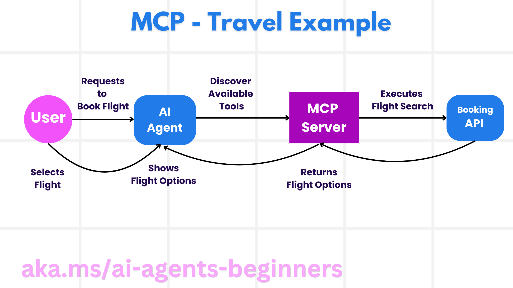

<!--
CO_OP_TRANSLATOR_METADATA:
{
  "original_hash": "f6600bebb86f72f3f62a9163fcce9566",
  "translation_date": "2025-08-30T10:11:13+00:00",
  "source_file": "11-agentic-protocols/README.md",
  "language_code": "my"
}
-->
# Agentic Protocols (MCP, A2A နှင့် NLWeb) ကို အသုံးပြုခြင်း

AI အေးဂျင့်များကို အသုံးပြုမှု တိုးလာသည့်အခါ၊ စံနှုန်းတစ်ခုတည်းဖြင့် လုပ်ဆောင်နိုင်မှု၊ လုံခြုံမှုနှင့် ဖွင့်လှစ်နည်းပညာဆန်းသစ်မှုကို ပံ့ပိုးပေးနိုင်သော ပရိုတိုကောများအတွက် လိုအပ်ချက်များလည်း တိုးလာပါသည်။ ဒီသင်ခန်းစာမှာ Model Context Protocol (MCP), Agent to Agent (A2A) နှင့် Natural Language Web (NLWeb) ဆိုသော ၃ ခုသော ပရိုတိုကောများကို လေ့လာသွားမည်ဖြစ်သည်။

## အကျဉ်းချုပ်

ဒီသင်ခန်းစာမှာ လေ့လာမည်မှာ -

• **MCP** သည် AI အေးဂျင့်များကို အသုံးပြုသူ၏ တာဝန်များကို ပြည့်စုံစွာ ဆောင်ရွက်ရန် အပြင်ပစ္စည်းများနှင့် ဒေတာများကို ရယူနိုင်စေသည့် နည်းလမ်းကို ဘယ်လိုပံ့ပိုးပေးသလဲ။

• **A2A** သည် အမျိုးမျိုးသော AI အေးဂျင့်များအကြား ဆက်သွယ်မှုနှင့် ပူးပေါင်းဆောင်ရွက်မှုကို ဘယ်လိုပံ့ပိုးပေးသလဲ။

• **NLWeb** သည် AI အေးဂျင့်များကို ဝက်ဘ်ဆိုဒ်များ၏ အကြောင်းအရာများကို ရှာဖွေပြီး အပြန်အလှန် ဆက်သွယ်နိုင်စေသည့် သဘာဝဘာသာစကား အင်တာဖေ့စ်များကို ဘယ်လိုပေးသလဲ။

## သင်ယူရမည့် ရည်မှန်းချက်များ

• **သတ်မှတ်နိုင်ရန်** MCP, A2A, NLWeb ၏ အဓိကရည်ရွယ်ချက်နှင့် အကျိုးကျေးဇူးများကို AI အေးဂျင့်များ၏ အခြေအနေတွင် သိရှိရန်။

• **ရှင်းပြနိုင်ရန်** LLMs, tools, နှင့် အခြားအေးဂျင့်များအကြား ဆက်သွယ်မှုနှင့် အပြန်အလှန် လုပ်ဆောင်မှုကို ပရိုတိုကောတစ်ခုစီက ဘယ်လိုပံ့ပိုးပေးသလဲ။

• **သိရှိနိုင်ရန်** အေးဂျင့်စနစ်များကို ဖွဲ့စည်းရာတွင် ပရိုတိုကောတစ်ခုစီ၏ သီးခြားအခန်းကဏ္ဍများကို သိရှိရန်။

## Model Context Protocol

**Model Context Protocol (MCP)** သည် LLMs များကို context နှင့် tools များပေးရန် အဆင်ပြေသော နည်းလမ်းတစ်ခုကို ပံ့ပိုးပေးသည့် ဖွင့်လှစ်စံနှုန်းတစ်ခုဖြစ်သည်။ ဒါဟာ AI အေးဂျင့်များအတွက် အမျိုးမျိုးသော ဒေတာရင်းမြစ်များနှင့် tools များကို တစ်ခုတည်းသော နည်းလမ်းဖြင့် ချိတ်ဆက်နိုင်စေသည်။

MCP ၏ အစိတ်အပိုင်းများ၊ API ကို တိုက်ရိုက်အသုံးပြုခြင်းနှင့် နှိုင်းယှဉ်၍ ရရှိနိုင်သော အကျိုးကျေးဇူးများ၊ AI အေးဂျင့်များက MCP server ကို ဘယ်လိုအသုံးပြုနိုင်မည်ကို လေ့လာကြမည်။

### MCP ၏ အဓိကအစိတ်အပိုင်းများ

MCP သည် **client-server architecture** ကို အခြေခံထားပြီး အဓိကအစိတ်အပိုင်းများမှာ -

• **Hosts** သည် MCP Server များနှင့် ချိတ်ဆက်မှုကို စတင်သော LLM အပလီကေးရှင်းများ (ဥပမာ - VSCode ကဲ့သို့သော code editor) ဖြစ်သည်။

• **Clients** သည် host application အတွင်းရှိ အစိတ်အပိုင်းများဖြစ်ပြီး server များနှင့် တစ်ဦးချင်းချိတ်ဆက်မှုကို ထိန်းသိမ်းသည်။

• **Servers** သည် သတ်မှတ်ထားသော လုပ်ဆောင်နိုင်မှုများကို ဖော်ပြပေးသည့် အလွယ်တကူ အသုံးပြုနိုင်သော အစီအစဉ်များဖြစ်သည်။

MCP Server ၏ လုပ်ဆောင်နိုင်မှုများမှာ -

• **Tools**: AI အေးဂျင့်များက လုပ်ဆောင်မှုတစ်ခုကို ဆောင်ရွက်ရန် ခေါ်ယူနိုင်သော discrete actions သို့မဟုတ် functions များဖြစ်သည်။ ဥပမာ - မိုးလေဝသဝန်ဆောင်မှုသည် "get weather" tool ကို ဖော်ပြနိုင်သည်၊ e-commerce server သည် "purchase product" tool ကို ဖော်ပြနိုင်သည်။

• **Resources**: MCP server က ပေးနိုင်သော ဖတ်ရှုနိုင်သော ဒေတာ items သို့မဟုတ် စာရွက်များဖြစ်ပြီး clients များက လိုအပ်သည့်အခါ retrieve လုပ်နိုင်သည်။

• **Prompts**: Predefined templates များဖြစ်ပြီး ပိုမိုရှုပ်ထွေးသော workflows များကို ပံ့ပိုးပေးသည်။

### MCP ၏ အကျိုးကျေးဇူးများ

MCP သည် AI အေးဂျင့်များအတွက် အရေးကြီးသော အကျိုးကျေးဇူးများပေးသည် -

• **Dynamic Tool Discovery**: Server မှ ရရှိနိုင်သော tools များကို dynamic ရရှိနိုင်စေသည်။

• **Interoperability Across LLMs**: အမျိုးမျိုးသော LLMs များအကြား လိုက်လျောညီထွေမှုကို ပံ့ပိုးပေးသည်။

• **Standardized Security**: Authentication နည်းလမ်းတစ်ခုတည်းကို ပံ့ပိုးပေးသည်။

### MCP ၏ ဥပမာ

ဥပမာအားဖြင့် AI assistant ကို အသုံးပြု၍ လေယာဉ်လက်မှတ်ကို ဘွတ်ကင်လုပ်လိုသည်ဟု စဉ်းစားပါ။

1. **Connection**: AI assistant (MCP client) သည် လေကြောင်းလိုင်း၏ MCP server နှင့် ချိတ်ဆက်သည်။

2. **Tool Discovery**: Client သည် server ကို "ရရှိနိုင်သော tools များ ဘာတွေလဲ?" ဟု မေးမြန်းသည်။

3. **Tool Invocation**: အသုံးပြုသူသည် "Portland မှ Honolulu သို့ လေယာဉ်ရှာဖွေပါ" ဟု AI assistant ကို မေးမြန်းသည်။

4. **Execution and Response**: MCP server သည် လေကြောင်းလိုင်း၏ internal API ကို ခေါ်ယူပြီး flight information ကို client သို့ ပြန်ပေးသည်။

5. **Further Interaction**: အသုံးပြုသူသည် flight ကို ရွေးချယ်ပြီး "book flight" tool ကို ခေါ်ယူသည်။

## Agent-to-Agent Protocol (A2A)

MCP သည် tools များနှင့် LLMs များကို ချိတ်ဆက်ပေးသည့်အခါ၊ **Agent-to-Agent (A2A) protocol** သည် အေးဂျင့်များအကြား ဆက်သွယ်မှုနှင့် ပူးပေါင်းဆောင်ရွက်မှုကို ပံ့ပိုးပေးသည်။

A2A ၏ အစိတ်အပိုင်းများနှင့် အကျိုးကျေးဇူးများကို လေ့လာပြီး travel application ၏ ဥပမာကို ကြည့်ရှုပါမည်။

### A2A ၏ အဓိကအစိတ်အပိုင်းများ

A2A သည် အေးဂျင့်များအကြား ဆက်သွယ်မှုကို အဓိကထားပြီး အသုံးပြုသူ၏ subtask ကို ပြည့်စုံစွာ ဆောင်ရွက်ရန် ပံ့ပိုးပေးသည်။

#### Agent Card

MCP server ၏ tools list ကဲ့သို့ Agent Card တွင် -

    ◦ အေးဂျင့်၏ အမည်  
    ◦ **လုပ်ဆောင်နိုင်သော အလုပ်များ**  
    ◦ **သတ်မှတ်ထားသော ကျွမ်းကျင်မှုများ**  
    ◦ **Endpoint URL**  
    ◦ **version** နှင့် **capabilities**  

#### Agent Executor

Agent Executor သည် **အသုံးပြုသူ chat context ကို remote agent သို့ ပေးပို့ရန်** တာဝန်ရှိသည်။

#### Artifact

Remote agent သည် တာဝန်ကို ပြည့်စုံစွာ ဆောင်ရွက်ပြီးနောက် artifact ကို ဖန်တီးသည်။

#### Event Queue

**အရေးပေါ် update များနှင့် message များကို စီမံခန့်ခွဲရန်** အသုံးပြုသည်။

### A2A ၏ အကျိုးကျေးဇူးများ

• **Enhanced Collaboration**: အေးဂျင့်များအကြား seamless automation ကို ပံ့ပိုးပေးသည်။

• **Model Selection Flexibility**: အေးဂျင့်တစ်ခုစီသည် ကိုယ်ပိုင် LLM ကို ရွေးချယ်နိုင်သည်။

• **Built-in Authentication**: Authentication ကို protocol ထဲတွင် ပေါင်းစပ်ထားသည်။

### A2A ၏ ဥပမာ

Travel booking scenario ကို A2A ဖြင့် တိုးချဲ့ကြည့်ပါ။

1. **User Request to Multi-Agent**: အသုံးပြုသူသည် "Honolulu သို့ ခရီးစဉ်တစ်ခုကို လေယာဉ်၊ ဟိုတယ်၊ ကားငှားမှုအပါအဝင် ဘွတ်ကင်လုပ်ပါ" ဟု Travel Agent ကို မေးမြန်းသည်။

2. **Orchestration by Travel Agent**: Travel Agent သည် A2A protocol ကို အသုံးပြု၍ Airline Agent, Hotel Agent, Car Rental Agent တို့နှင့် ချိတ်ဆက်သည်။

3. **Delegated Task Execution**: Travel Agent သည် တစ်ဦးချင်း task များကို အေးဂျင့်များသို့ ပေးပို့သည်။

4. **Consolidated Response**: Travel Agent သည် အေးဂျင့်များ၏ အလုပ်ရလဒ်များကို စုပေါင်းပြီး အသုံးပြုသူထံ ပြန်ပေးသည်။

## Natural Language Web (NLWeb)

ဝက်ဘ်ဆိုဒ်များသည် အင်တာနက်ပေါ်တွင် ဒေတာများကို ရယူရန် အဓိကနည်းလမ်းဖြစ်သည်။

NLWeb ၏ အစိတ်အပိုင်းများ၊ အကျိုးကျေးဇူးများနှင့် travel application ၏ ဥပမာကို လေ့လာကြည့်ပါမည်။

### NLWeb ၏ အစိတ်အပိုင်းများ

- **NLWeb Application (Core Service Code)**: သဘာဝဘာသာစကားမေးခွန်းများကို ဆောင်ရွက်ပေးသည့် စနစ်ဖြစ်သည်။

- **NLWeb Protocol**: ဝက်ဘ်ဆိုဒ်နှင့် သဘာဝဘာသာစကား interaction အတွက် အခြေခံစည်းမျဉ်းများဖြစ်သည်။

- **MCP Server (Model Context Protocol Endpoint)**: NLWeb setup သည် MCP server အဖြစ်လည်း လုပ်ဆောင်နိုင်သည်။

- **Embedding Models**: ဝက်ဘ်ဆိုဒ်အကြောင်းအရာကို vectors အဖြစ် ပြောင်းလဲပေးသည်။

- **Vector Database (Retrieval Mechanism)**: Embeddings များကို သိမ်းဆည်းထားသည်။

### NLWeb ၏ ဥပမာ

Travel booking website ကို NLWeb ဖြင့် လေ့လာကြည့်ပါ။

1. **Data Ingestion**: Schema.org သို့မဟုတ် RSS feeds ကို အသုံးပြု၍ ဒေတာများကို NLWeb tools မှ စုဆောင်းသည်။

2. **Natural Language Query (Human)**: အသုံးပြုသူသည် "Honolulu တွင် swimming pool ပါသော family-friendly ဟိုတယ်ရှာပါ" ဟု chat interface တွင် ရေးသားသည်။

3. **NLWeb Processing**: NLWeb application သည် query ကို LLM သို့ ပေးပို့ပြီး vector database ကို ရှာဖွေသည်။

4. **Accurate Results**: LLM သည် database ရှာဖွေမှုရလဒ်များကို သုံးပြီး natural language ဖြင့် ပြန်လည်တင်ပြသည်။

5. **AI Agent Interaction**: NLWeb သည် MCP server အဖြစ်လည်း လုပ်ဆောင်နိုင်သဖြင့် AI travel agent များက website ၏ NLWeb instance ကို ချိတ်ဆက်နိုင်သည်။

### MCP/A2A/NLWeb အကြောင်း မေးခွန်းများရှိပါသလား?

[Azure AI Foundry Discord](https://aka.ms/ai-agents/discord) တွင် တက်ကြွသော သင်ယူသူများနှင့် တွေ့ဆုံပြီး office hours တွင် မေးခွန်းများကို ဖြေရှင်းနိုင်ပါသည်။

## Resources

- [MCP for Beginners](https://aka.ms/mcp-for-beginners)  
- [MCP Documentation](https://github.com/microsoft/semantic-kernel/tree/main/python/semantic-kernel/semantic_kernel/connectors/mcp)  
- [NLWeb Repo](https://github.com/nlweb-ai/NLWeb)  
- [Semantic Kernel Guides](https://learn.microsoft.com/semantic-kernel/)  

---

**အကြောင်းကြားချက်**:  
ဤစာရွက်စာတမ်းကို AI ဘာသာပြန်ဝန်ဆောင်မှု [Co-op Translator](https://github.com/Azure/co-op-translator) ကို အသုံးပြု၍ ဘာသာပြန်ထားပါသည်။ ကျွန်ုပ်တို့သည် တိကျမှုအတွက် ကြိုးစားနေသော်လည်း၊ အလိုအလျောက် ဘာသာပြန်ခြင်းတွင် အမှားများ သို့မဟုတ် မတိကျမှုများ ပါဝင်နိုင်သည်ကို သတိပြုပါ။ မူရင်းစာရွက်စာတမ်းကို ၎င်း၏ မူရင်းဘာသာစကားဖြင့် အာဏာတရားရှိသော အရင်းအမြစ်အဖြစ် သတ်မှတ်သင့်ပါသည်။ အရေးကြီးသော အချက်အလက်များအတွက် လူ့ဘာသာပြန်ပညာရှင်များမှ ပရော်ဖက်ရှင်နယ် ဘာသာပြန်ခြင်းကို အကြံပြုပါသည်။ ဤဘာသာပြန်ကို အသုံးပြုခြင်းမှ ဖြစ်ပေါ်လာသော အလွဲအမှားများ သို့မဟုတ် အနားလွဲမှုများအတွက် ကျွန်ုပ်တို့သည် တာဝန်မယူပါ။