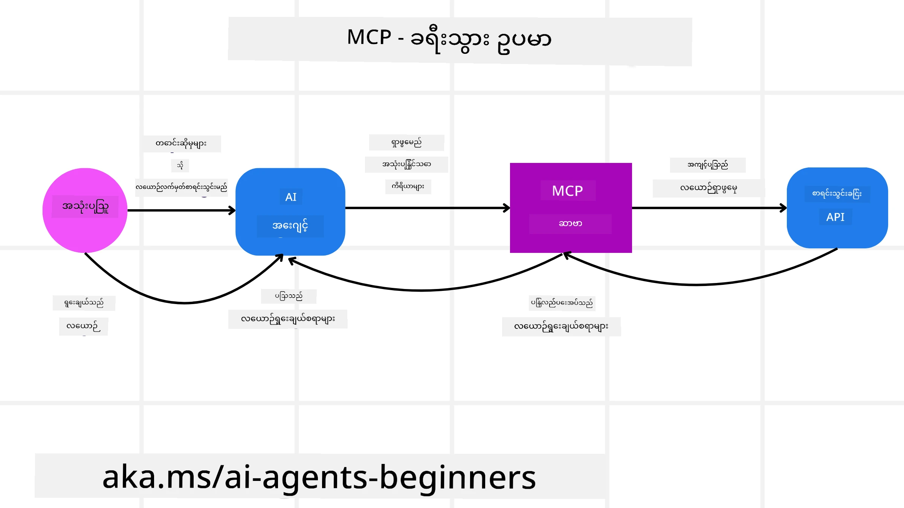
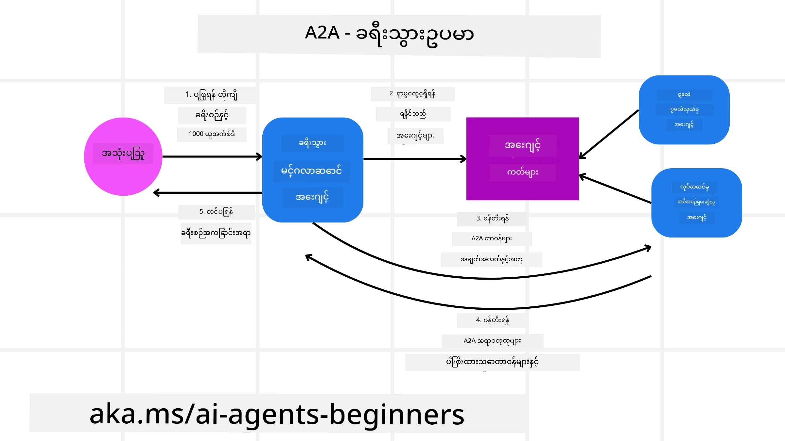
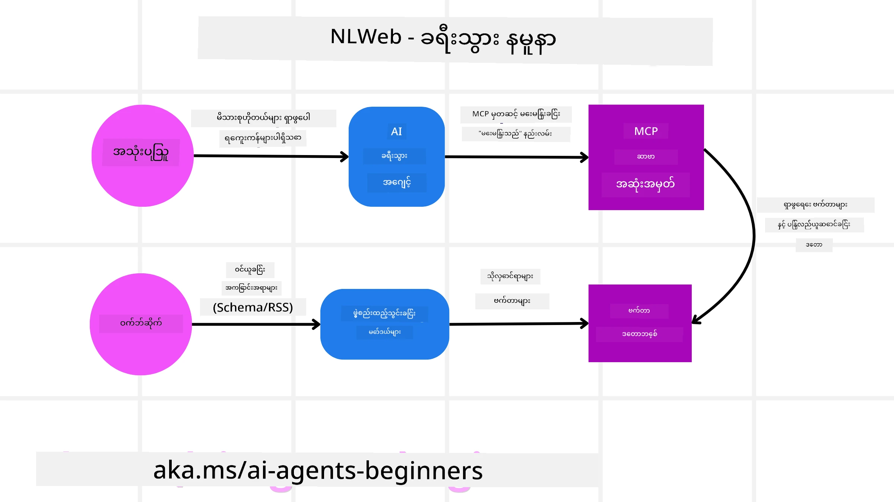

# Agentic Protocols များကို အသုံးပြုခြင်း (MCP, A2A နှင့် NLWeb)

> _(အထက်ပါ ရုပ်ပုံကို နှိပ်၍ ဒီ သင်ခန်းစာ၏ ဗီဒီယိုကို ကြည့်ပါ)_

AI အေးဂျင့်များ အသုံးပြုမှု တိုးလာသည့်အခါတွင် စံချိန်စံညွှန်း၊ လုံခြုံရေးနှင့် ဖွင့်လှစ် အင်နိုဗေးရှင်းကို အထောက်အပံ့ပေးနိုင်မည့် ပရိုတိုကောများ အရေးကြီးလာသည်။ ဒီသင်ခန်းစာတွင် ကျွန်တော်တို့အောက်ပါ လိုအပ်ချက်များကို ဖြည့်ဆည်းရန် ရည်ရွယ်ထားသည့် ပရိုတိုကော ၃ မျိုးကို ကိုင်တွယ်သွားမည် — Model Context Protocol (MCP), Agent to Agent (A2A) နှင့် Natural Language Web (NLWeb)။

## မိတ်ဆက်

ဒီသင်ခန်းစာတွင် ကျွန်တော်တို့ လေ့လာမည့်အချက်များမှာ -

• **MCP** သည် AI အေးဂျင့်များအား အသုံးပြုသူ အလုပ်များကို ပြီးမြောက်စေရန် ပြင်ပ ကိရိယာများနှင့် ဒေတာများကို လက်လှမ်းမီစေသည့် နည်းလမ်းကို မည်သို့ ခွဲခြမ်းရှင်းလင်းပေးသည့်နည်းကို။

• **A2A** သည် မတူကွဲပြားသော AI အေးဂျင့်များအကြား ဆက်သွယ်ဆောင်ရွက်မှုနှင့် ပူးပေါင်းဆောင်ရွက်မှုကို မည်သို့ ဖော်ဆောင်ပေးသည့်နည်းကို။

• **NLWeb** သည် ဝက်ဘ်ဆိုက် မည်သည့်နေရာမဆို သဘာဝဘာသာစကား အင်တာဖေ့စ်များကို ဖော်ဆောင်ကာ AI အေးဂျင့်များအား အဆိုပါ အကြောင်းအရာကို ရှာဖွေနိုင်ရန်နှင့် အပြန်အလှန် ဆက်သွယ်နိုင်စေရန် မည်သို့ ကူညီပေးသည့်နည်းကို။

## သင်ယူရန် ရည်မှန်းချက်များ

• **သတ်မှတ်ပါ။** AI အေးဂျင့်များအတွက် MCP, A2A, နှင့် NLWeb ၏ ဉီးစားပေးရည်ရွယ်ချက်နှင့် အကျိုးကျေးဇူးများကို။

• **ရှင်းပြနိုင်ပါ။** တစ်ခုချင်းစီက LLMs, ကိရိယာများနှင့် အခြားအေးဂျင့်များအကြား ဆက်သွယ်မှုနှင့် အပြန်အလှန် ဆောင်ရွက်မှုကို မည်သို့ လွယ်ကူစေသည်ကို။

• **တိကျစွာ သတိပြုနိုင်ပါ။** စနစ်များခွဲခြားပြီး စုံလင်သော agentic စနစ်များ တည်ဆောက်ရာတွင် တစ်ခုချင်းစီ၏ အခန်းကဏ္ဍများကို သိရှိနိုင်ရန်။

## မော်ဒယ် ကွန်တက်စ် ပရိုတိုကော (Model Context Protocol)

Model Context Protocol (MCP) သည် LLMs များအား ကွန်တက်စ်နှင့် ကိရိယာများကို ပံ့ပိုးပေးရန် စံချိန်စံညွှန်းဖြစ်သော ဖွင့်လှစ်စံစဉ်တစ်ခုဖြစ်သည်။ ၎င်းသည် AI အေးဂျင့်များ ဆက်သွယ်နိုင်ရန် တစ်စုတစ်ရံ အမျိုးမျိုးသော ဒေတာရင်းမြစ်များနှင့် ကိရိယာများကို "ယူနီဗာဆယ် အက်ဒပ်တာ" တစ်ခုကို အသုံးပြု၍ အတူတကွ ချိတ်ဆက်နိုင်စေသည်။

MCP ၏ ဇယားပစ္စည်းများ၊ တိုက်ရိုက် API အသုံးပြုမှုနှင့် နှိုင်းယှဉ်ပြီး ထူးခြားချက်များနှင့် AI အေးဂျင့်များ MCP server ကို မည်သို့ အသုံးပြုနိုင်သည် ဆိုသော ဥပမာကို ကြည့်ကြမည်။

### MCP ၏ အခြေခံ အစိတ်အပိုင်းများ

MCP သည် **client-server architecture** ဖြင့် လည်ပတ်ပြီး အခြေခံ အစိတ်အပိုင်းများမှာ -

• **Hosts** သည် LLM အပလီကေးရှင်းများ (ဥပမာ VSCode ကဲ့သို့ ကုဒ်တည်းဖြတ်ကိရိယာ) ဖြစ်ပြီး MCP Server များသို့ ချိတ်ဆက်မှုများကို စတင်သူများ ဖြစ်သည်။

• **Clients** သည် host အပလီကေးရှင်းအတွင်းရှိ အစိတ်အပိုင်းများဖြစ်ပြီး server များနှင့် တစ်ခုချင်းဆက်သွယ်မှုကို ထိန်းသိမ်းထားသည်။

• **Servers** သည် သတ်မှတ်ထားသည့် စွမ်းဆောင်ရည်များကို ထုတ်ဖော်ပြသသည့် အလေးပေးဖြစ်သော ပရိုဂရမ်များ ဖြစ်သည်။

ပရိုတိုကောတွင် ဗဟိုဝင်သော primitive သုံးခုပါဝင်ပြီး ၎င်းတို့မှာ MCP Server ၏ စွမ်းဆောင်ရည်များဖြစ်သည် -

• **Tools**: AI အေးဂျင့်တစ်ခုသည် တစ်ခုချင်းစီ အမှုများ သို့မဟုတ် function များကို ခေါ်ယူကာ အကြောင်းအရာလုပ်ဆောင်နိုင်သည်။ ဥပမာ၊ ရာသီဥတုဝန်ဆောင်မှုတစ်ခုသည် "get weather" tool ကို ထုတ်ဖော်နိုင်သည်၊ သို့မဟုတ် အီကော်မার্স server တစ်ခုသည် "purchase product" tool ကို ထုတ်ဖော်နိုင်သည်။ MCP servers များသည် ၎င်းတို့ tool တစ်ခုချင်းစီ၏ name, description နှင့် input/output schema များကို capabilities listing တွင် ကြေညာသည်။

• **Resources**: MCP server တစ်ခုမှ ပေးနိုင်သည့် ဖတ်-only ဒေတာအရာများ သို့မဟုတ် စာတမ်းများဖြစ်ပြီး clients များသည် လိုအပ်သလို ထုတ်ယူနိုင်သည်။ ဥပမာများတွင် ဖိုင်အကြောင်းအရာများ၊ ဒေတာဘေ့စ် မှတ်တမ်းများ သို့မဟုတ် log ဖိုင်များ ပါဝင်နိုင်သည်။ Resources များသည် စာသား (ကုဒ် သို့မဟုတ် JSON ကဲ့သို့) သို့မဟုတ် မျိုးစုံ binary (ပုံများ သို့မဟုတ် PDF များ) ဖြစ်နိုင်သည်။

• **Prompts**: ပိုမိုရှုပ်ထွေးသော စီမံကိန်းများအတွက် အကြံပြု prompt များကို ပေးသည့် ကြိုတင်သတ်မှတ်ထားသော template များ ဖြစ်သည်။

### MCP ၏ အကျိုးကျေးဇူးများ

MCP သည် AI အေးဂျင့်များအတွက် အထူးသဖြင့် အကျိုးကျေးဇူးများ စွမ်းဆောင်ပေးသည်။

• **Dynamic Tool Discovery**: Agents များသည် server မှ ရရှိနိုင်သည့် tool များ၏ စာရင်းကို နှိုင်းယှဉ်ဖော်ပြချက်များနှင့်အတူ ဒိုင်နမစ်ပုံစံဖြင့် လက်ခံနိုင်သည်။ ၎င်းသည် ပုံမှန် API များနှင့်ကွာခြားသည်။ ရိုးရှင်းအားဖြင့် API integration များတွင် static coding လိုအပ်ပြီး API ပြောင်းလဲမှုတိုင်းအတွက် code ပြင်ဆင်ရသည်။ MCP သည် "တစ်ကြိမ် integrate လုပ်ပါ" ဆိုသည့် နည်းလမ်းပေးကာ ပို၍ သဘာဝဖြစ်စေသည်။

• **Interoperability Across LLMs**: MCP သည် မတူညီသော LLM များနှင့် လည်ပတ်နိုင်သည်၊ မူလမော်ဒယ်ကို အစားထိုး စမ်းသပ်ရန် လွယ်ကူစေသည်။

• **Standardized Security**: MCP တွင် စံသတ်မှတ်ထားသည့် authentication နည်းစနစ်ပါဝင်သလို MCP servers အသစ်များကို ထည့်သွင်းသည်နှင့်အမျှ အဆင့်ချဲ့နိုင်မှုကို ကောင်းမွန်စေသည်။ ၎င်းသည် ရိုးရိုး API များအတွက် အမျိုးမျိုးသော key များနှင့် authentication အမျိုးအစားများကို စီမံရန်ထက် ရိုးရှင်းသည်။

### MCP ဥပမာ

အသုံးပြုသူတစ်ဦးသည် AI အကူအညီဖြင့် လေယာဉ် ခရီးစဥ် တည်းဖြတ်ချင်သည်ဟု ထင်ပါစို့၊ အဲဒါကို MCP ဖြင့် စီမံဆောင်ရွက်သည့် နည်းလမ်းကို ကြည့်ကြရအောင်။

1. **Connection**: AI အကူအညီ (MCP client) သည် လေဆိပ်ကုမ္ပဏီတစ်ခုမှ ပေးသည့် MCP server သို့ ချိတ်ဆက်သည်။

2. **Tool Discovery**: Client သည် လေဆိပ်၏ MCP server သို့ "What tools do you have available?" ဟုတ်/မဟုတ် မေးသည်။ Server သည် "search flights" နှင့် "book flights" ကဲ့သို့သော tools များဖြင့် တုံ့ပြန်လာသည်။

3. **Tool Invocation**: သင် AI အကူအညီအား "Please search for a flight from Portland to Honolulu." ဟု တောင်းဆိုသည်။ AI အကူအညီသည် ၎င်း၏ LLM ကို အသုံးပြုကာ "search flights" tool ကို ခေါ်ရန်လိုအပ်ကြောင်း ဖော်ထုတ်ပြီး အသုံးချရန် အချက်အလက်များ (origin, destination) ကို MCP server သို့ ပေးပို့သည်။

4. **Execution and Response**: MCP server သည် wrapper အဖြစ် လုပ်ဆောင်ကာ လေဆိပ်၏ internal booking API သို့ တိုက်ရိုက် call ပြုလုပ်သည်။ ထို့နောက် လေကြောင်းအချက်အလက် (ဥပမာ JSON ဒေတာ) ကို လက်ခံပြီး AI အကူအညီထံ ပြန်ပို့ပေးသည်။

5. **Further Interaction**: AI အကူအညီသည် အစီရင်ခံသော လေကြောင်းရွေးချယ်မှုများကို ပြသသည်။ သင် လေကြောင်းတစ်ခုကို ရွေးချယ်သည့်အခါ assistant သည် တူညီသော MCP server ပေါ်ရှိ "book flight" tool ကို ခေါ်ယူ၍ booking ကို ပြီးမြောက်စေတတ်သည်။

## Agent-to-Agent Protocol (A2A)

MCP သည် LLM များကို ကိရိယာများနှင့် ချိတ်ဆက်ရန် အာရုံစိုက်သော်လည်း **Agent-to-Agent (A2A) protocol** သည် ဆက်သွယ်ဆောင်ရွက်ခြင်းနှင့် မတူကွဲပြားသော AI အေးဂျင့်များအကြား ပူးပေါင်းလုပ်ဆောင်နိုင်စေရေးတွင် တစ်ဆင့် မြှင့်တင်ပေးသည်။ A2A သည် ကုမ္ပဏီအမျိုးမျိုး၊ ပတ်ဝန်းကျင်များနှင့် နည်းပညာ အတွင်းကွဲပြားချက်များရှိသော အေးဂျင့်များကို ထိတွေ့ ဆက်သွယ်ကာ မျှဝေပြီး ပူးပေါင်း ဆောင်ရွက်ရန် အထောက်အပံ့ပေးသည်။

ကျွန်တော်တို့သည် A2A ၏ အစိတ်အပိုင်းများ၊ အကျိုးကျေးဇူးများကို စိစစ်ကြည့်မည်နှင့် ခရီးသွား အက်ပ်လီကေးရှင်းတွင် ၎င်းကို မည်သို့ အသုံးချနိုင်သည်ဆိုသည်ကို ဥပမာဖြင့် ရှင်းပြမည်။

### A2A ၏ အခြေခံ အစိတ်အပိုင်းများ

A2A သည် အေးဂျင့်များအကြား ဆက်သွယ်ရေးကို အထောက်အကူပြုခြင်းနှင့် သက်ဆိုင်ရာ subtask တစ်ခုကို ပြီးမြောက်စေရန် ပူးပေါင်းဆောင်ရွက်စေခြင်း ပေါ် အာရုံစိုက်သည်။ ပရိုတိုကော၏ တစ်ခုချင်းစီ၏ အစိတ်အပိုင်းသည် အောက်ပါအတိုင်း ပါဝင်သည်။

#### Agent Card

MCP server သည် tool များစာရင်းမျိုးမျိုးမျှ ကြေညာသလို Agent Card တွင်လည်း -
- အေးဂျင့်၏ Name။
- ၎င်း ပြီးမြောက်ပေးသည့် အထွေထွေ အလုပ်များ အကြောင်း **ဖော်ပြချက်**။
- အခြားအေးဂျင့်များ (သို့မဟုတ် လူသားအသုံးပြုသူများ) အဘို့ အဆိုပါ agent ကို ဘယ်အချိန် နှင့် မည်သို့ ခေါ်ယူသင့်သည်ကို နားလည်စေရန် ကူညီပေးသည့် **အသေးစိတ် ကျွမ်းကျင်မှုများ** အချက်အလက်စာရင်း။
- အေးဂျင့်၏ **လက်ရှိ Endpoint URL**။
- အေးဂျင့်၏ **version** နှင့် **capabilities** (ဥပမာ streaming responses နှင့် push notifications)။

#### Agent Executor

Agent Executor သည် **အသုံးပြုသူ chat ၏ context ကို remote agent ထံ ပို့ပေးခြင်း** အတွက်တာဝန်ယူသည်။ remote agent သည် အလုပ်ဆောင်ရန် လိုအပ်သော အလုပ်ကို နားလည်စေရန် ၎င်း context ကို လိုအပ်သည်။ A2A server အတွင်းတွင် အေးဂျင့်တစ်ခုသည် ၎င်း၏ ကိုယ်ပိုင် Large Language Model (LLM) ကို အသုံးပြုကာ ရောက်လာသည့် request များကို ပါာစပြုလုပ်၍ ၎င်း၏ ကိုယ်ပိုင် internal tools များကို အသုံးပြုပြီး အလုပ်များကို ဆောင်ရွက်သည်။

#### Artifact

remote agent သည် တောင်းခံထားသည့် အလုပ်ကို ပြီးမြောက်လိုက်သော အခါ၌ ၎င်း၏ အလုပ်ရလဒ်ကို artifact တစ်ခုအဖြစ် ဖန်တီးပေးသည်။ artifact သည် **agent ၏ အလုပ်ရလဒ်**, **ပြီးမြောက်ထားသည့်အရာ၏ ဖော်ပြချက်**, နှင့် ပရိုတိုကောမှတဆင့် ပို့ပေးသော **စာသား context** ကို ထောက်ပံ့ပေးသည်။ artifact ပို့ပြီးလျှင် remote agent နှင့် ချိတ်ဆက်မှုကို အလုပ်လိုအပ်ချိန်ထိ ပိတ်သိမ်းထားသည်။

#### Event Queue

ဤအစိတ်အပိုင်းသည် **မွမ်းမံမှုများကို ကိုင်တွယ်ခြင်းနှင့် မက်ဆေ့ချ်များ ပို့ဆောင်ခြင်း** အား တာဝန်ယူသည်။ ပိုမိုရှည်လျားသော အလုပ်ပြီးမြောက်ချိန်များရှိနိုင်သည့် အခြေအနေများတွင် ထိန်းသိမ်းမှုမရှိလျှင် အေးဂျင့်များအကြား ချိတ်ဆက်မှုကို အလုပ်ပြီးမြောက်ရန် မပြီးစီးမီ ပိတ်ဆို့မှုဖြစ်နေခြင်းကို ကာကွယ်ရန် ထုတ်လုပ်ရေးပတ်ဝန်းကျင်တွင် အလွန်အရေးကြီးသည်။

### A2A ၏ အကျိုးကျေးဇူးများ

• **ပူးပေါင်းဆောင်ရွက်မှု မြှင့်တင်မှု**: အမျိုးမျိုးသော vendor များနှင့် ပလက်ဖောင်းများမှ အေးဂျင့်များသည် ကြားဝင် ဆက်သွယ်ကာ context များကို မျှဝေ၍ ပူးပေါင်းလုပ်ဆောင်နိုင်သည်၊ ရိုးရာအားဖြင့် ခွဲထွက်နေသော စနစ်များ အလျှောက် အလိုအလျောက်လုပ်ဆောင်မှုကို တိုးတက်စေသည်။

• **မော်ဒယ်ရွေးချယ်ခွင့် လွတ်လပ်မှု**: တစ်ခုချင်းစီသော A2A agent သည် ၎င်း၏ request များကို ဆောင်ရွက်ရန် အသုံးပြုလိုသည့် LLM ကို ကိုယ်ပိုင်အဖြစ် ဆုံးဖြတ်နိုင်သည်၊ ၎င်းက agent တစ်ခုချင်းစီအတွက် တိက်မြင့်မားသည့် သို့မဟုတ် fine-tuned မော်ဒယ်များကို အသုံးပြုနိုင်စေသည်၊ MCP အချို့၏ တစ်ခုတည်း LLM ချိတ်ဆက်မှုနှင့် ဆန့်ကျင်သည်။

• **တပ်ဆင်ထားသော Authentication**: Authentication သည် တိုက်ရိုက် A2A ပရိုတိုကောထဲတွင် ချိတ်ဆက်ထား၍ agent များ၏ ဆက်သွယ်မှုများအတွက် ကောင်းမွန်သော လုံခြုံရေး စနစ်ကို ပေးသည်။

### A2A ဥပမာ

ခရီးသွား booking ဇယားကို A2A ဖြင့် ရှင်းလင်းကြည့်ကြမည်။

1. **အသုံးပြုသူ၏ မျိုးစုံ အေးဂျင့်သို့ တောင်းဆိုချက်**: အသုံးပြုသူတစ်ဦးသည် "Travel Agent" A2A client/agent နှင့် ဆက်သွယ်ကာ၊ "Please book an entire trip to Honolulu for next week, including flights, a hotel, and a rental car" ဟု တောင်းဆိုနိုင်သည်။

2. **Travel Agent မှ ဗဟိုညှိနှိုင်းခြင်း**: Travel Agent သည် ဤရှုပ်ထွေးသော တောင်းဆိုချက်ကို လက်ခံသည်။ ၎င်းသည် ၎င်း၏ LLM ကို အသုံးပြုကာ အလုပ်၏ အပိုင်းများကို ယူဆပြီး မည်သည့် အထူးပြု agent များနှင့် ဆက်သွယ်ရမည်ကို သတ်မှတ်သည်။

3. **အေးဂျင့်များအကြား ဆက်သွယ်မှု**: Travel Agent သည် A2A ပရိုတိုကောကို အသုံးပြုကာ downstream agents များ (ဥပမာ "Airline Agent", "Hotel Agent", နှင့် "Car Rental Agent") တို့နှင့် ချိတ်ဆက်သည်၊ ၎င်းတို့သည် ကုမ္ပဏီ အမျိုးမျိုး မှ ဖန်တီးထားကြသည်။

4. **အလုပ် အခန်းကဏ္ဍများ ကို အပ်နှံ၍ ဆောင်ရွက်ခြင်း**: Travel Agent သည် ထို အထူးပြု agent များသို့ သတ်မှတ်ထားသော task များ (ဥပမာ "Find flights to Honolulu", "Book a hotel", "Rent a car") ကို ပို့သည်။ ထိုအထူးပြု agent တစ်ခုချင်းစီသည် ကိုယ်ပိုင် LLM များကို ဆောင်ရွက်ကာ ကိုယ်ပိုင် tools (ယင်းတို့သည် MCP servers ဖြစ်နိုင်သည်) ကို အသုံးပြုပြီး ၎င်းတို့၏ တာဝန်ကို ပြီးမြောက်စေသည်။

5. **စုစည်းပြီး တုံ့ပြန်ချက်ပို့ခြင်း**: အောက်ခံ agents အားလုံး အလုပ်ပြီးမြောက်သည့်အခါ Travel Agent သည် အကျဉ်းချုပ် ပြန်လည်စုစည်းကာ (လေကြောင်း အချက်အလက်များ၊ ဟိုတယ် အတည်ပြုချက်၊ ကားငှား စာချုပ်) အသုံးပြုသူထံ chat-ပုံစံတုံ့ပြန်ချက် တစ်ခုအနေဖြင့် ပို့ပေးသည်။

## Natural Language Web (NLWeb)

ဝက်ဘ်ဆိုက်များသည် အင်တာနက်ပေါ်တွင် အသုံးပြုသူများအတွက် သတင်းအချက်အလက်နှင့် ဒေတာများကို ရရှိနိုင်စေသော အဓိက နည်းလမ်းဖြစ်နေဆဲဖြစ်သည်။

NLWeb ၏ အစိတ်အပိုင်းများ၊ NLWeb ၏ အကျိုးကျေးဇူးများနှင့် ကျွန်တော်တို့၏ ခရီးသွား အက်ပ်လီကေးရှင်းတွင် NLWeb က မည်သို့ လည်ပတ်သလဲ ဆိုသည့် ဥပမာတစ်ခုကို ကြည့်မည်။

### NLWeb ၏ အစိတ်အပိုင်းများ

- **NLWeb Application (Core Service Code)**: သဘာဝဘာသာမေးခွန်းများကို ကိုင်တွယ်သော စနစ်ဖြစ်သည်။ ၎င်းသည် ပလက်ဖောင်း၏ အစိတ်အပိုင်းမျိုးစုံကို ချိတ်ဆက်ကာ တုံ့ပြန်ချက်များဖန်တီးသည်။ ၎င်းကို ဝက်ဘ်ဆိုက်၏ သဘာဝဘာသာလုပ်ဆောင်ချက်များကို စွမ်းအားပေးသည့် အင်ဂျင်အဖြစ် တွေးနိုင်သည်။

- **NLWeb Protocol**: ဝက်ဘ်ဆိုက်နှင့် သဘာဝဘာသာ ဆက်သွယ်ရန်အတွက် **အခြေခံ စည်းမျဉ်းစနစ်** ဖြစ်သည်။ ၎င်းသည် JSON ပုံစံဖြင့် တုံ့ပြန်ချက်များ ပေးပို့သည် (အများအားဖြင့် Schema.org ကို အသုံးပြုသော)။ ၎င်း၏ ရည်ရွယ်ချက်မှာ HTML ကာက documents များ မျှဝေခြင်းကို ခွင့်ပြုသည့် နည်းပညာကဲ့သို့ပင် “AI Web” အတွက် ရိုးရှင်းသော အခြေခံအခြေစိုက်မြစ်တစ်ခုကို ဖန်တီးပေးရန် ဖြစ်သည်။

- **MCP Server (Model Context Protocol Endpoint)**: အခြား AI စနစ်များနှင့် tools (ဥပမာ "ask" method) နှင့် ဒေတာများ မျှဝေရာ၌ NLWeb setup တစ်ခုလည်း **MCP server** အဖြစ် လုပ်ဆောင်နိုင်သည်။ အပြည့်အစုံတွင် ၎င်းသည် ဝက်ဘ်ဆိုက်၏ အကြောင်းအရာနှင့် စွမ်းဆောင်ရည်များကို AI အေးဂျင့်များ အတွက် အသုံးပြုနိုင်စေပြီး ဆိုက်ကို "agent ecosystem" အစိတ်အပိုင်းအဖြစ် ပြောင်းလဲစေသည်။

- **Embedding Models**: ဤမော်ဒယ်များသည် ဝက်ဘ်ဆိုက်အကြောင်းအရာများကို ဂဏန်းသင်္ကေတများ (vectors) အဖြစ် ပြောင်းလဲပေးရန် အသုံးပြုသည်။ ဤ vectors များတွင် အဓိပ္ပာယ်ကို ကွန်ပြူတာများ တိုင်းတာနိုင်သည့် နည်းဖြင့် ဖော်ဆောင်ထားသည်။ ၎င်းတို့ကို အထူး ဒေတာဘေ့စ်တစ်ခုတွင် သိမ်းဆည်းပြီး အသုံးပြုသူများသည် မည်သည့် embedding model ကို အသုံးချမည်ကို ရွေးနိုင်သည်။

- **Vector Database (Retrieval Mechanism)**: ဤဒေတာဘေ့စ်သည် **ဝက်ဘ်ဆိုက်အကြောင်းအရာ၏ embeddings များကို သိမ်းဆည်း**သည်။ မေးခွန်းတစ်ခုထပ်မံရောက်လာသည့်အခါ NLWeb သည် vector database ကို စစ်ဆေးကာ အကြောင်းအရာနှင့် အနီးဆုံး ကိုက်ညီမှုရှိသည့် အချက်အလက်များကို တိုက်ရိုက် ရှာဖွေသည်။ ၎င်းသည် ဆင်တူမှုအလိုက် အချက်အလက်များကို အမြန်ဆုံး စီစဉ်ပေးသည်။ NLWeb သည် Qdrant, Snowflake, Milvus, Azure AI Search, နှင့် Elasticsearch ကဲ့သို့သော ကွာကွာခြားခြား vector သိုလှောင်မှုစနစ်များနှင့် အလုပ်လုပ်နိုင်သည်။

### NLWeb ၏ ဥပမာ

ကျွန်တော်တို့၏ ခရီးသွား booking ဝက်ဘ်ဆိုက်ကို ထပ်မံစဥ်းစားကြည့်ပါ၊ ဒီတစ်ကြိမ်တော့ NLWeb ဖြင့် စွမ်းအားပေးထားသည်။

1. **Data Ingestion**: ခရီးသွား ဝက်ဘ်ဆိုက်၏ ရှိပြီးသား ပစ္စည်းကတ်တာများ (ဥပမာ လေကြောင်းစာရင်းများ၊ ဟိုတယ် ဖော်ပြချက်များ၊ ခရီးစဉ်ပက်ကေ့ချ်များ) ကို Schema.org နည်းဖြင့် ဖော်မတ်ထည့်သွင်းခြင်း သို့မဟုတ် RSS feed များမှ လုပ်ငန်းဖြင့် တင်သွင်းသည်။ NLWeb ၏ ကိရိယာများသည် ဤ ဖွဲ့စည်းထားသော ဒေတာများကို စုပ်ယူကာ embeddings ဖန်တီး၍ ဒေသခံ သို့မဟုတ် remote vector database တွင် သိမ်းဆည်းသည်။

2. **Natural Language Query (Human)**: အသုံးပြုသူတစ်ဦးသည် ဝက်ဘ်ဆိုက်သို့ လာရောက်၍ menu များကိုတက်ရွေ့ခြင်းမလုပ်ဘဲ chat interface တစ်ခုတွင် "Find me a family-friendly hotel in Honolulu with a pool for next week" ဟု ရိုက်ထည့်သည်။

3. **NLWeb Processing**: NLWeb application သည် ဤ စုံစမ်းမှုကို လက်ခံသည်။ ၎င်းသည် မေးခွန်းကို နားလည်စေရန် LLM သို့ ပို့ပြီး တစ်ပြိုင်နက် vector database ကိုလည်း သက်ဆိုင်ရာ ဟိုတယ်စာရင်းများအတွက် ရှာဖွေသည်။

4. **Accurate Results**: LLM သည် database မှ ရလာသည့် ရှာဖွေမှုအဖြေများကို ဘာသာရပ်ပိုင်းနဲ့ အထောက်အကူပြုကာ "family-friendly", "pool", နှင့် "Honolulu" စံညဏ်များကို အခြေခံ၍ အကောင်းဆုံး ကိုက်ညီမှုများကို ဖော်ထုတ်ကာ သဘာဝဘာသာဖြင့် တုံ့ပြန်ချက်တစ်ခုအဖြစ် ဖော်ပြပေးသည်။ အရေးကြီးသည်မှာ တုံ့ပြန်ချက်အတွင်း ပါရှိသော အချက်လက်များသည် ဝက်ဘ်ဆိုက်၏ ကတ်လော့ဂ်မှ ရှာဖွေထုတ်ယူထားသည့် ဟိုတယ်များကို ကိုးကားထားသဖြင့် မသိမ်းဆည်းထားသော အချက်အလက် ဖန်တီးထုတ်ရှိမှုကို ခွင့်လွှတ်မထားပါ။

5. **AI Agent Interaction**: NLWeb သည် MCP server အဖြစ် ဆောင်ရွက်သဖြင့် ပြင်ပ အေးဂျင့် (ဥပမာ AI travel agent) တစ်ခုလည်း ဝက်ဘ်ဆိုက်၏ NLWeb instance သို့ ချိတ်ဆက်နိုင်သည်။ AI agent သည် `ask("ဟိုနိုလူ မြို့နယ်တွင် ဟိုတယ်က အကြံပြုထားသော ဗီဂန် အစားအစာကို လက်ခံနိုင်တဲ့ စားသောက်ဆိုင်များ ရှိပါသလား?")` ဆိုသည့် MCP method ကို အသုံးပြုပြီး ဝက်ဘ်ဆိုက်အား တိုက်ရိုက် မေးမြန်းနိုင်သည်။ NLWeb instance သည် ၎င်းကို ကိုင်တွယ်ကာ အကယ်တော် restaurant အချက်အလက်ဒေတာဘေ့စ် (သို့) အချက်အလက်များကို အသုံးပြုပြီး စနစ်ကျ JSON ဖော်မတ်ဖြင့် တုံ့ပြန်ပေးမည်။

### MCP/A2A/NLWeb အကြောင်း နောက်ထပ် မေးခွန်းများ ရှိပါသလား?

[Microsoft Foundry Discord](https://aka.ms/ai-agents/discord) တွင် အခြားလေ့လာသူများနှင့် တွေ့ဆုံရန်၊ office hours များတက်ရောက်ရန်နှင့် သင့် AI Agents ဆက်သွယ်မှုများနှင့် ပတ်သက်သည့် မေးခွန်းများကို ဖြေဆိုပေးစေမြင့် နိုင်ပါတယ်။

## ရင်းမြစ်များ

- [MCP for Beginners](https://aka.ms/mcp-for-beginners)  
- [MCP Documentation](https://learn.microsoft.com/python/api/overview/azure/ai-projects-readme)
- [NLWeb Repo](https://github.com/nlweb-ai/NLWeb)
- [Microsoft Agent Framework](https://aka.ms/ai-agents-beginners/agent-framewrok)

---

<!-- CO-OP TRANSLATOR DISCLAIMER START -->
သတိပေးချက်:
ဤစာတမ်းကို AI ဘာသာပြန်ဝန်ဆောင်မှု [Co-op Translator](https://github.com/Azure/co-op-translator) ဖြင့် ဘာသာပြန်ထားပါသည်။ ကျွန်ုပ်တို့သည် တိကျမှန်ကန်မှုအတွက် ကြိုးစားပါသည်၊ သို့သော် အလိုအလျောက် ဘာသာပြန်ချက်များတွင် အမှားများ သို့မဟုတ် မမှန်ကန်မှုများ ပါဝင်နိုင်ကြောင်း ကျေးဇူးပြု၍ သိရှိပါ။ မူလစာတမ်းကို ၎င်း၏ မူလဘာသာဖြင့်သာ ယုံကြည်စိတ်ချရသော အရင်းအမြစ်အဖြစ် ချမှတ်ရန် ဖြစ်ပါသည်။ အရေးကြီးသော အချက်အလက်များအတွက် သက်ဆိုင်ရာ ပရော်ဖက်ရှင်နယ် လူဘာသာပြန်လုပ်ငန်းကို အသုံးပြုရန် အကြံပြုပါသည်။ ဤဘာသာပြန်ချက်ကို အသုံးပြုခြင်းကြောင့် ဖြစ်ပေါ်လာနိုင်သည့် နားမလည်မှုများ သို့မဟုတ် မှားယွင်းဖတ်ရှုမှုများအတွက် ကျွန်ုပ်တို့ တာဝန်မယူပါ။
<!-- CO-OP TRANSLATOR DISCLAIMER END -->