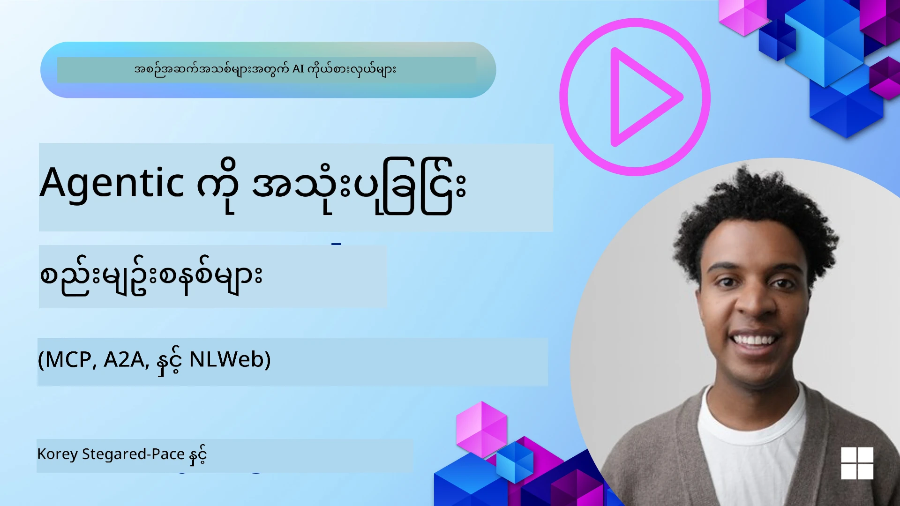
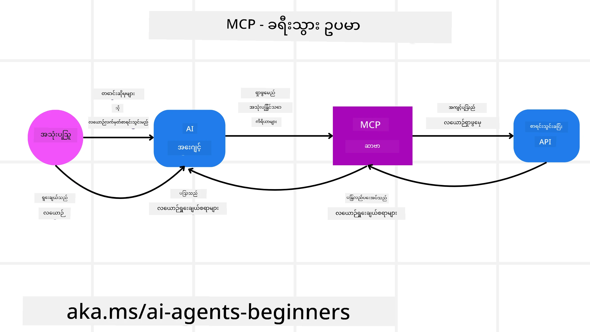
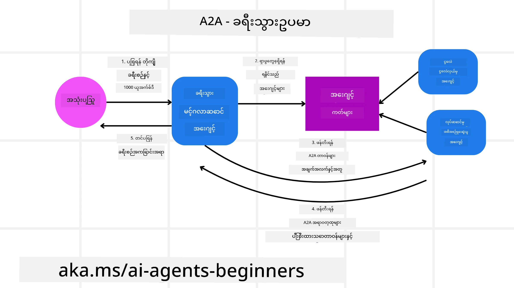
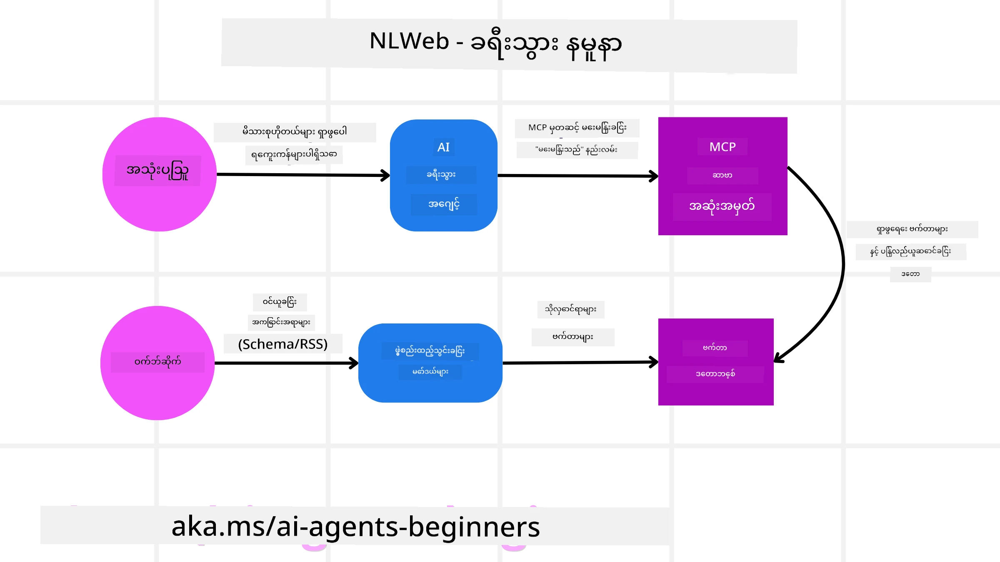

# Agentic Protocols (MCP, A2A နှင့် NLWeb) အသုံးပြုခြင်း

> _(ဤသင်ခန်းစာအတွက် ဗီဒီယိုကြည့်ရန် ဓာတ်ပုံကို နှိပ်ပါ)_

AI agent များအသုံးပြုမှု တိုးလာသည့်အတိုင်း ပုံမှန်အဆင့်သတ်မှတ်ခြင်း၊ လုံခြုံရေးနှင့် ဖွင့်လင်းမူဆွဲထိုးမှုကို ဦးတည်သည့် protocols များအတွက် လိုအပ်ချက်လည်း တိုးလာနေသည်။ ဤသင်ခန်းစာတွင် ဒီလိုလိုအပ်ချက်တွေဖြည့်ဆည်းပေးမယ့် protocols သုံးခုကို ဖော်ပြမှာဖြစ်ပြီး Model Context Protocol (MCP), Agent to Agent (A2A), နှင့် Natural Language Web (NLWeb) ဖြစ်သည်။

## နိဒါန်း

ဤသင်ခန်းစာတွင် ကျွန်တော်တို့ လေ့လာသွားမှာမှာလည်း -

• အဘယ်ကြောင့် **MCP** သည် AI Agent တို့အား user အလုပ်များ ပြည့်စုံစွာ ဆောင်ရွက်နိုင်ရန် အပြင် tools နှင့် ဒေတာများကို ဝင်ရောက် အသုံးပြုခွင့်ပေးသည်။

• အဘယ်ကြောင့် **A2A** သည် မတူညီသော AI agent များအကြား ဆက်သွယ်ရေးနှင့် ပူးပေါင်းဆောင်ရွက်မှုကို ချဲ့ထွင်ပေးသည်။

• အဘယ်ကြောင့် **NLWeb** သည် ဘယ်လို natural language interface များကို ဝက်ဘ်ဆိုဒ်များတွင် မည်သည့်အခါမဆို AI Agents များ အကြောင်းအရာရှာဖွေနိုင်ရန် နှင့် သက်ဆိုင်ဆက်သွယ်နိုင်ရန် ဖန်တီးပေးသည်။

## သင်ယူရမည့်ရည်မှန်းချက်များ

• AI Agent များ၏ အေကြောင်းအရ MCP, A2A, နှင့် NLWeb ၏ အဓိကရည်ရွယ်ချက် နှင့် အကျိုးကျေးဇူးများကို **သိရှိ** သည်။

• Protocol များ တစ်ခုချင်းစီသည် LLMs, tools နှင့် အခြား agent များအကြား ဆက်သွယ်ရေးနှင့် အပြန်အလှန် သက်ဆိုင်မှုကို မည်သို့ ရောထွေးပေးသည်ကို **ရှင်းပြ** သည်။

• အလှည့်အပြောင်း agentic စနစ်များဖန်တီးရာတွင် Protocol တစ်ခုချင်း၏ သီးခြားအခန်းကဏ္ဍများကို **အသိအမှတ်ပြု** သည်။

## Model Context Protocol

**Model Context Protocol (MCP)** သည် ပုံမှန်စံနှုန်းတစ်ခုဖြစ်ပြီး applications များက LLMs များအတွက် context နှင့် tools ပေးရန် စံချုပ်တစ်ခုဖြစ်သည်။ ၎င်းက AI Agent များ ဖတ်ရှုရန်တူညီသည့် ပုံစံဖြင့် data source များနှင့် tools များကို အဆက်အသွယ်ပေးသည့် "universal adaptor" အဖြစ်လည်း လုပ်ဆောင်နိုင်သည်။

MCP ၏အစိတ်အပိုင်းများ၊ တိုက်ရိုက် API အသုံးပြုမှုနှင့် နှိုင်းယှဉ်ခြင်းဖြင့်ရရှိသော အကျိုးကျေးဇူးများနှင့် AI agent များ သုံးသည့် MCP server ၏ဥပမာကို ကြည့်ပါမည်။

### MCP ၏ အခြေခံအစိတ်အပိုင်းများ

MCP သည် **client-server architecture** များအား အခြေခံပြီး အခြေခံအစိတ်အပိုင်းများမှာ -

• **Hosts** သည် MCP Server သို့ဆက်သွယ်မှုများ ဖန်တီးသော LLM application များဖြစ်သည် (ဥပမာ - VSCode ကဲ့သို့သော code editor)။

• **Clients** သည် host application ထဲရှိ server များနှင့် ယှဉ်ဆက်ဖက်တစ်ခုတည်းဆက်သွယ်မှုများ ထားရှိသောအစိတ်အပိုင်းများဖြစ်သည်။

• **Servers** သည် ထူးခြားတတ်နိုင်သော လုပ်ဆောင်ချက်များကို ပြသသော လေးလံမထိခိုက်သော برنامهများဖြစ်သည်။

Protocol ထဲတွင် MCP Server ၏ စွမ်းရည်များဖြစ်သော primitive များ သုံးခုပါဝင်သည်-

• **Tools**: AI agent တစ်ယောက်က အခြားလုပ်ဆောင်မှုများဆောင်ရွက်ရန်ခေါ်နိုင်သော တစ်ထောင့်တစ်မျက်နှာ လုပ်ဆောင်ချက်များ သို့မဟုတ် function များဖြစ်သည်။ ဥပမာ - ရာသီဥတု ဝန်ဆောင်မှုတစ်ခုက "get weather" tool ကို သုံးနိုင်သည်၊ e-commerce server က "purchase product" tool ကို ထုတ်ပြန်နိုင်သည်။ MCP servers များသည် သူတို့၏ tools များအမည်၊ ဖော်ပြချက်နှင့် input/output schema ကို တစ်ဦးချင်း capabilities စာရင်းတွင် ဖော်ပြသည်။

• **Resources**: MCP server မှ ဖွင့်လှစ်ပေးနိုင်သော ဖတ်ရုံသာဖြစ်သည့် ဒေတာသို့မဟုတ်စာရွက်စာတမ်းများဖြစ်ပြီး clients များသည် လိုအပ်သည့်အခါ ရယူနိုင်သည်။ ဥပမာ - ဖိုင်အတွင်းအကြောင်းအရာများ၊ ဒေတာဘေ့စ်မှတ်တမ်းများ သို့မဟုတ် လော့ဂ်ဖိုင်များ။ Resources များသည် စာသား (code သို့မဟုတ် JSON ကဲ့သို့) သို့မဟုတ် binary (ပုံများ သို့မဟုတ် PDF များကဲ့သို့) ဖြစ်နိုင်သည်။

• **Prompts**: မူကြမ်းပြုပြင်ထားသော templates များဖြစ်ပြီး စေ့စပ်တဲ့ အလုပ်စဉ်များကို ပံ့ပိုးပေးနိုင်သည်။

### MCP ၏ အကျိုးကျေးဇူးများ

MCP သည် AI Agent များအတွက် အထူးသော အကျိုးကျေးဇူးများ ရရှိစေသည်။

• **Dynamic Tool Discovery**: Agent များသည် server ကနေ အသုံးပြုနိုင်သော tools များ စာရင်းနှင့် ၎င်းတို့၏ဖော်ပြချက်များကို dynamic လက်ခံရရှိနိုင်သည်။ ဤသည်မှာ パtraditional API များ၏ static coding ထက်ကွာခြားပုံဖြစ်ပြီး API ပြောင်းလဲမှုတစ်ခုတိုင်းမှာ code ပြင်ဆင်မှု လိုတတ်သည်။ MCP သည် "တစ်ကြိမ်ပေါင်းစပ်ခြင်း" အမြင်ဖြင့် လိုအပ်ချက်ပြောင်းလဲမှုများ အတွက် ပိုမိုလိုက်လျောညီထွေ ဖြစ်စေသည်။

• **Interoperability Across LLMs**: MCP သည် မတူညီသော LLM များတွင် လည်ပတ်နိုင်ပြီး မျိုးစုံအခြေခံမော်ဒယ်များ အသုံးပြု၍ ကောင်းမွန်သော စွမ်းဆောင်ရည် ရရှိစေရန် လွတ်လပ်စွာ နေရာပြောင်းနိုင်သည်။

• **Standardized Security**: MCPတွင် စံသတ်မှတ်ထားသော authentication နည်းလမ်းများ ပါဝင်ပြီး MCP server အသစ်များကို ခွင့်ပြုရန် ပိုမိုပြေလည်ကူညီသည်။ ၎င်းသည် သာမာန် API များအတွက်သော စကားဝှက် နှင့် authentication စနစ်များစွာကို စီမံခန့်ခွဲရခြင်းထက် ပိုမို ရိုးရှင်းသည်။

### MCP ဥပမာ

အသုံးပြုသူတစ်ဦးသည် MCP အား အသုံးပြုသော AI အကူအညီနှင့် ပျံခရီးကို စီစဉ်ချင်သည်ဟု ထင်မြင်ပါစို့။

1. **ဆက်သွယ်မှု**: AI အကူအညီ (MCP client ဖြစ်သည်) သည် လေကြောင်းလိုင်းတစ်ခုမှ ပေးသော MCP server နှင့်ချိန်းဆက်သည်။

2. **Tool ရှာဖွေမှု**: Client သည် လေကြောင်းလိုင်း MCP server ကို “သင်မှာရရှိနိုင်သော tools များ ရှိပါသလား” ဟု မေးသည်။ Server သည် "search flights" နှင့် "book flights" စသည့် tools များအဖြစ် ပြန်လည် တုံ့ပြန်သည်။

3. **Tool ခေါ်ဆိုခြင်း**: အသုံးပြုသူသည် AI အကူအညီအား “Portland မှ Honolulu သို့ အင်္ဂါနေ့ပျံသန်းမှု ရှာပေးပါ” ဟုတောင်းဆိုသည်။ AI အကူအညီသည် LLM ကို အသုံးပြုကာ "search flights" tool ကို ခေါ်ရမည်ကို လေ့လာပြီး လိုအပ်သော parameters (origin, destination) များကို MCP server သို့ ပေးပို့သည်။

4. **ဆောင်ရွက်ခြင်းနှင့် တုံ့ပြန်မှု**: MCP server သည် လေကြောင်းလိုင်း၏ booking API ကို wrapper အဖြစ် ခေါ်ဆိုကာ flight အချက်အလက် (ဥပမာ JSON data) ကို လက်ခံပြီး AI အကူအညီထံ ပြန်လည်ပို့သည်။

5. **နောက်ထပ်ဆက်သွယ်မှု**: AI အကူအညီသည် ခရီးစဉ်ရွေးချယ်မှုများကို တင်ပြသည်။ အသုံးပြုသူ Flight တစ်စီးရွေးချယ်ပြီးပါက assistant သည် “book flight” tool ကို MCP server ပေါ်တွင်ခေါ်ဆိုကာ စာချုပ်လုပ်နိုင်သည်။

## Agent-to-Agent Protocol (A2A)

MCP သည် LLM များနှင့် tools များချိတ်ဆက်ပေးသော်လည်း **Agent-to-Agent (A2A) protocol** သည် မတူညီသော AI agent များအကြား ဆက်သွယ်လုပ်ဆောင်မှုနှင့် ပူးပေါင်းမှုကို ကာကွယ်ပေးသည်။ A2A သည် မတူညီသော အဖွဲ့အစည်းများ၊ ပတ်ဝန်းကျင်များနှင့် နည်းပညာ ပေါင်းစပ် စနစ်များရှိသူ agent များကို ကိုယ်ပိုင်ကျွမ်းကျင်မှု နှင့် ပူးပေါင်း ဆောင်ရွက်စေရန် ချိတ်ဆက်ပေးသည်။

A2A ၏အစိတ်အပိုင်းများနှင့် အကျိုးကျေးဇူးများ၊ ကျွန်တော်တို့၏ ခရီးစဉ် အပလီကေးရှင်းတွင် A2A ၏ အသုံးချပုံ တစ်ခုကို ကြည့်မည်။

### A2A ၏ အခြေခံအစိတ်အပိုင်းများ

A2A သည် agent များ ကြားဆက်သွယ်ပြီး အသုံးပြုသူ၏ အလုပ်ငယ်တစ်ခုကို အတူတကွ ဖြေရှင်းနိုင်ရေး အတွက် ဦးတည်သည်။ Protocol ၏ တစ်စိတ်တစ်ပိုင်း တစ်ခုချင်းစီသည် ဤအရေးကိုမြှင့်တင်ပေးသည်။

#### Agent Card

MCP server သည် tool စာရင်းကိုမျှဝေသည့်နည်းပုံ၌ Agent Card သည် အောက်ပါအချက်များ ပါရှိသည် -
- Agent ၏နာမည်။
- ၎င်း ပြီးမြောက်နိုင်သော အလုပ်အပေါ် သုံးချက်ဖော်ပြချက်။
- အခြား agent များ (သို့) လူသားအသုံးပြုသူများကို သဘောပေါက်ရန် အထောက်အကူပြုသော အတိအကျကျွမ်းကျင်မှု စာရင်း ဖော်ပြချက်နှင့်အတူ။
- Agent ၏ လက်ရှိ Endpoint URL။
- Agent ၏ ဗားရှင်းနှင့် streaming response သို့မဟုတ် push notification တို့ကဲ့သို့ စွမ်းရည်များ။

#### Agent Executor

Agent Executor သည် **အသုံးပြုသူစာပို့ချက်အခန်းကဏ္ဍကို remote agent ထံ ပေးပို့ခြင်း** အတွက် တာဝန်ယူသည်။ remote agent သည် သင်္ကေတတန်ဖိုးများကို နားလည်ရန်နှင့် ကိုယ်ပိုင် tools များနှင့် ပေါင်းစပ် လုပ်ဆောင်နိုင်ရန် ၎င်း၏ Large Language Model ကို အသုံးပြုသည်။

#### Artifact

remote agent သည် လိုအပ်သောအလုပ်ကို ပြီးမြောက်လာသည်နှင့် ၎င်း၏ လုပ်ငန်းရလဒ်ကို artifact အဖြစ် ဖန်တီးသည်။ artifact တစ်ခုတွင် **agent ၏ လုပ်ငန်းရလဒ်**၊ **ပြီးမြောက်ချက် ဖော်ပြချက်** နှင့် protocol ဖြတ်ပြီးပိုစ်အဆက်အတန်းစာသား ပါဝင်သည်။ artifact ပို့ပြီးလျှင် remote agent နှင့် ဆက်သွယ်မှုကို လိုအပ်သည့်အချိန်ထိ ပိတ်ထားသည်။

#### Event Queue

သည် **အပ်ဒိတ်များကို ဆက်လက် ကမ်းလှမ်းခြင်းနှင့် မက်ဆေ့ချ်များ ပို့ဆောင်ခြင်း** အတွက် အသုံးပြုသည်။ ထူးခြားစွာ ဧရိယာမှ မှန်ကန်သည့်လုပ်ငန်းလုပ်ကိုင်မှုကို အာမခံရန် agentic စနစ်များတွင် အရေးကြီးသည်၊ အထူးသဖြင့် အချိန်ယူပြီးပြီးမြောက်ရေးလိုအပ်သော အထွေထွေ အလုပ်များတွင်။

### A2A ၏ အကျိုးကျေးဇူးများ

• **ပူးပေါင်းဆောင်ရွက်မှုမြှင့်တင်ခြင်း**: ကွဲပြားသောရောင်းချသူများနှင့် ပလက်ဖောင်းများမှ agent များသို့ ဆက်သွယ်ပြီး context များမျှဝေကာ ပူးပေါင်းလုပ်ကိုင်စေရန်၊ ယခင်တွင် ခွဲထွက်နေသောစနစ်များအကြား အတိုင်းအတာမရှိသော စက်မှု automation ပိုမိုလွယ်ကူစေသည်။

• **Model ရွေးချယ်မှု လွတ်လပ်မှု**: A2A agent တစ်ခုချင်း စိတ်တိုင်းကျ သုံးစွဲမည့် LLM ကို သတ်မှတ်နိုင်ကာ optimize နှင့် fine-tuning ပြုလုပ်ခြင်း ပြုနိုင်ပြီး MCP ၏ တစ်ခုတည်းသော LLM ချိတ်ဆက်မှုထက် ပိုမိုမျိုးစုံစွာဖြစ်သည်။

• **Authentication built-in**: A2A protocol ကျော်တိုက်ရာ authentication ကို တိုက်ရိုက်ထည့်သွင်းထားပြီး agent များအကြား လုံခြုံရေးစနစ် တည်ဆောက်ပေးသည်။

### A2A ဥပမာ

ခရီးစဉ် စီစဉ်ခြင်းအကြောင်း ကို အသေးစိတ်ရှင်းပြပါမည်၊ ယခုအခါ A2A ဖြင့်။

1. **အသုံးပြုသူတောင်းဆိုမှုမှ Multi-Agent ဆီသို့**: အသုံးပြုသူသည် "Travel Agent" A2A client/agent တွင် "လာမယ့်အပတ် Honolulu မှာ ဦးအသုံးပြုဖို့ လေကြောင်း၊ ဟိုတယ်နှင့် ကားငှားစနစ် အားလုံး စီစဉ်ပေးပါ" ဟု တောင်းဆိုသည်။

2. **Travel Agent မှ စီမံခန့်ခွဲမှု**: Travel Agent သည် ဤရှုပ်ထွေးသော တောင်းဆိုမှုကို လက်ခံပြီး ၎င်း၏ LLM ကို အသုံးပြုပြီး အလုပ်ကို နားလည်ကာ အချက်အလက်များအတွက် အခြား အထူးပြု အေးဂျင့်များနှင့် ဆက်သွယ်ရန် ဆုံးဖြတ်သည်။

3. **အေးဂျင့်များကြား ဆက်သွယ်မှု**: Travel Agent သည် A2A protocol ကို သုံး၍ downstream အေးဂျင့်များဖြစ်သည့် "Airline Agent," "Hotel Agent" နှင့် "Car Rental Agent" ဆီချိတ်ဆက်သည်၊ ၎င်းတို့သည် ကွာခြားသောကုမ္ပဏီများမှ ဖန်တီးထားသည်။

4. **တာဝန်အပ်နှံ၍ ဆောင်ရွက်ခြင်း**: Travel Agent က အကြောင်းအရာ သတ်မှတ်၍ downstream အေးဂျင့် များထံ ပေးပို့သည် (ဥပမာ - "Honolulu သို့ လေကြောင်းလိုင်းများ ရှာပါ," "ဟိုတယ်မှာ စာရင်းသွင်းပါ," "ကားငှားပါ")။ downstream အေးဂျင့်များကိုယ်ပိုင် LLM နှင့် ကိုယ်ပိုင် tools (MCP servers ဖြစ်နိုင်သည်) အသုံးပြုကာ ၎င်း၏ အလုပ်စိတ်ပိုင်းဆောင်ရွက်သည်။

5. **တစ်စုတစ်စည်းတင်ပြချက်**: downstream အေးဂျင့်များ အားလုံးအလုပ်ပြီး ချိန်တိုင်း Travel Agent သည် လေကြောင်း အချက်အလက်၊ ဟိုတယ်အတည်ပြုချက်၊ ကားငှားစာချုပ် အစရှိသည့် အချက်အလက်များ ချုပ်ဆုံပြီး အသုံးပြုသူ ထံ ပြန်ပို့သည်။

## Natural Language Web (NLWeb)

ဝက်ဘ်ဆိုဒ်များသည် အင်တာနက်တွင် အသုံးပြုသူများ အတွက် အချက်အလက် များ ဝင်ရောက်ရယူရန် မူလနည်းလမ်းဖြစ်နေဆဲဖြစ်သည်။

NLWeb ၏ အစိတ်အပိုင်းများ၊ အကျိုးကျေးဇူးများနှင့် နမူနာမှတဆင့် ခရီးစဉ် အပလီကေးရှင်း တည်ဆောက်ပုံကို ကြည့်ရှုပါမည်။

### NLWeb ၏ အစိတ်အပိုင်းများ

- **NLWeb Application (Core Service Code)**: သဘာဝဘာသာဖြင့် မေးခွန်းများကို ဖြေဆိုပေးသော စနစ်ဖြစ်သည်။ ကွန်ယက်ပလက်ဖောင်းရှိ အစိတ်အပိုင်းများကို ချိတ်ဆက်ကာ တုံ့ပြန်ချက်များ ဖန်တီးသည်။ ၎င်းကို ဝက်ဘ်ဆိုက်ရှိ သဘာဝဘာသာ စွမ်းဆောင်ရည် ကို အားပေးသော engine တစ်ခုဟု တွေးနိုင်သည်။

- **NLWeb Protocol**: ဝက်ဘ်ဆိုက်နှင့် သဘာဝဘာသာဆက်သွယ်ခြင်းအတွက် နည်းလမ်းနှင့် စည်းမျဉ်းများ ပါဝင်သော မူလ အချက်အလက်များဖြစ်သည်။ JSON အဖြစ် နောက်ဆက်တင်ကို ပြန်ပေးပို့သည် (Schema.org အသုံးပြုသည်။) ထို protocol သည် “AI Web” အတွက် အခြေခံအုတ် သို့မဟုတ် မူကွဲတစ်ခု ဖြစ်သည်၊ HTML က online စာရွက်များမျှဝေရေး လုပ်ပေးသည့် အတိုင်းဖြစ်သည်။

- **MCP Server (Model Context Protocol Endpoint)**: NLWeb ဖြင့် စနစ်တစ်ခုချင်းစီသည် MCP server အဖြစ်လည်း လုပ်ဆောင်နိုင်သည်။ ၎င်းက 다른 AI စနစ်များနှင့် tools (အဖြစ် “ask” method ကဲ့သို့) နှင့် ဒေတာ မျှဝေပေးနိုင်သည်။ ရလဒ်အားဖြင့် ဝက်ဘ်ဆိုက်အကြောင်းအရာများနှင့် လုပ်ဆောင်ချက်များကို AI agents သုံးနိုင်ရန်၊ ဝက်ဘ်ဆိုက်ကို agent ecosystem ၏ အစိတ်အပိုင်း ဖြစ်အောင် လုပ်နေသည်။

- **Embedding Models**: ဝက်ဘ်ဆိုက်အကြောင်းအရာများကို ကွန်ပျူတာများနားလည်နိုင်သော နံပါတ်အမျိုးအစား vector များ (embedding) သို့ ပြောင်းလဲပေးသည်။ ဤ vectors သည် အဓိပ္ပာယ် ကို သိရှိဖော်ပြနိုင်သော နည်းလမ်းဖြင့် ထုတ်ပေးသည်။ ဤမြေပုံများကို database တွင် သိမ်းဆည်းထားသည်။ အသုံးပြုသူများသည် သူတို့တစ်ဆက်တည်းအသုံးပြုမည့် embedding model ကို ရွေးချယ်နိုင်သည်။

- **Vector Database (Retrieval Mechanism)**: ဝက်ဘ်ဆိုက်ဒေတာ ညာဖော်ပြချက်များကို သိမ်းဆည်းထားသော database ဖြစ်သည်။ မေးခွန်းတစ်ခု ရောက်လာသည့်အခါ NLWeb မှ သေချာဆုံး အချက်အလက်များကို ရှာဖွေရန် vector database ကို စစ်ဆေးသည်။ အဖြေများကို ဆင်တူမှုအဆင့် အလိုက် အမြန်ဆုံး ပံ့ပိုးပေးသည်။ NLWeb သည် Qdrant, Snowflake, Milvus, Azure AI Search နှင့် Elasticsearch ကဲ့သို့ မတူညီသော vector storage system များနှင့် လုပ်ဆောင်နိုင်သည်။

### NLWeb ကို ဥပမာဖြင့် တင်ပြခြင်း

ခရီးစဉ် စီစဉ်ရေးဝက်ဘ်ဆိုက်ကို ပြန်လည်စဉ်းစားပါ၊ ယခုချိန်တွင် NLWeb ဖြင့် လုပ်ဆောင်နေသည်။

1. **ဒေတာထည့်သွင်းခြင်း**: ခရီးစဉ် ဝက်ဘ်ဆိုက်၏ ရှိပြီးသား ထုတ်ကုန် စာရင်းများ (ဥပမာ - လေကြောင်း၊ ဟိုတယ်ဖော်ပြချက်များ၊ ခရီးစဉ်အထုပ်များ) ကို Schema.org ဖြင့် ဖော်ပြထားသော်လည်း RSS feed များမှတဆင့်လည်း ထည့်သွင်းထားသည်။ NLWeb ၏ tools များသည် ၎င်းဒေတာများကို ဂရုစိုက် စုဆောင်းကာ ဒေတာထဲမှ embedding များဖန်တီးပြီး နေအိမ်သိုသိမ်းဆည်းရာ vector database တွင် သိမ်းဆည်းသည်။

2. **သဘာဝဘာသာမေးခွန်း (လူ)**: အသုံးပြုသူသည် ဝက်ဘ်ဆိုက်ကို လည်ပတ်လာပြီး မီနူးရှာခြင်း မပြုဘဲ chat interface မှ “လာမယ့်အပတ် Honolulu တွင် မိသားစုနဲ့ သင့်တော်ပြီး ရေကန်ပါရှိသော ဟိုတယ် ရှာဖွေပါ” ဟု ဖြည့်သွင်းသည်။

3. **NLWeb လုပ်ငန်းဆောင်တာ**: NLWeb application သည် ဤမေးခွန်းကို လက်ခံပြီး LLM သို့ ပို့ပြီးနားလည်ခြင်း ပြုစေသည်။ တစ်ပြိုင်နက် vector database ကို စစ်ဆေးကာ သက်ဆိုင်ရာ ဟိုတယ်စာရင်းများ ရှာဖွေသည်။

4. **မှန်ကန်သောရလဒ်များ**: LLM သည် database မှ ရှာဖွေမှု ထုတ်လွှင့်ချက်များကို အဓိပ္ပါယ်ဖော် ထွက်ထားပြီး “မိသားစုစိတ်ကြိုက်,” “ရေကန်ပါ,” “Honolulu” စသည်ဖြင့် အကောင်းဆုံး ကိုက်ညီမှု ရှာဖွေနိုင်ရန် ပံ့ပိုးပေးသည်။ တုံ့ပြန်ချက်သည် ဝက်ဘ်ဆိုက် ရှိ ဟိုတယ်စာရင်းများကို။ ဖြည့်ဆည်းပေးပြီး မတူညီသော အချက်အလက် မပြောပါ။

5. **AI Agent ဆက်သွယ်မှု**: NLWeb သည် MCP server အဖြစ် လည်း ရပ်တည်မည်ဖြစ်သဖြင့် အပြင် AI ခရီးသွားအေးဂျင့်တစ်ခုသည် ၎င်းဝက်ဘ်ဆိုက်၏ NLWeb instance နှင့် ချိတ်ဆက်နိုင်သည်။ AI agent သည် `ask` MCP method ကို အသုံးပြုကာ ဝက်ဘ်ဆိုက်မှ တိုက်ရိုက်မေးမြန်းနိုင်သည် - `ask("ဟိုတယ်မှ အကြံပြုသည့် Honolulu အာဟာရအလွန်သက်ဆိုင်သည့် စားသောက်ဆိုင် ရှိပါသလား?")`။ NLWeb သည် ဤမေးခွန်းကို လုပ်ဆောင်ကာ စားသောက်ဆိုင်အချက်အလက် database (load လုပ်လျှင်) ကို အရောက်ပို့ကာ စနစ်တကျ JSON တုံ့ပြန်ချက် ပေးသည်။

### MCP/A2A/NLWeb အကြောင်း မေးမြန်းလိုပါသလား?

အခြားလေ့လာသူများနှင့် တွေ့ဆုံ၊ office hours မျက်နှာသာများတက်ရောက်ပြီး AI Agent မေးခွန်းများကို ဖြေလျော့နိုင်ရန် [Microsoft Foundry Discord](https://discord.com/invite/ATgtXmAS5D) တွင် ပါဝင်ဆက်သွယ်ပါ။

## အရင်းအမြစ်များ

- [MCP for Beginners](https://aka.ms/mcp-for-beginners)  
- [MCP Documentation](https://learn.microsoft.com/python/api/overview/azure/ai-projects-readme)
- [NLWeb Repo](https://github.com/nlweb-ai/NLWeb)
- [Microsoft Agent Framework](https://learn.microsoft.com/en-us/agent-framework/overview/?wt.mc_id=youtube_26688_organicsocial_reactor&pivots=programming-language-python)

## ယခင် သင်ခန်းစာ

[AI Agents in Production](../10-ai-agents-production/README.md)

## နောက်တစ်ခု သင်ခန်းစာ

[Context Engineering for AI Agents](../12-context-engineering/README.md)

---

<!-- CO-OP TRANSLATOR DISCLAIMER START -->
**ပြောကြားချက်**
ဤစာတမ်းကို AI ဘာသာပြန်ဝန်ဆောင်မှု [Co-op Translator](https://github.com/Azure/co-op-translator) အသုံးပြု၍ ဘာသာပြန်ထားပါသည်။ ကျွန်ုပ်တို့သည် တိကျမှန်ကန်မှုအတွက် ကြိုးပမ်းနေသော်လည်း၊ စက်ကိရိယာဘာသာပြန်ခြင်းများတွင် အမှားများ သို့မဟုတ် မှားယွင်းချက်များ ပါဝင်နိုင်ကြောင်း သတိပြုပါရန် လိုအပ်ပါသည်။ မူလစာတမ်းကို မူရင်းဘာသာဖြင့်သာ ယုံကြည်စိတ်ချရသော အချက်အလက်အဖြစ် သတ်မှတ်သင့်သည်။ အရေးကြီးသည့် သတင်းအချက်အလက်များအတွက် ပရော်ဖက်ရှင်နယ် လူသားဘာသာပြန်သူဝန်ဆောင်မှုကို အကြံပြုပါသည်။ ဤဘာသာပြန်ချက်ကို အသုံးပြုခြင်းမှ ဖြစ်ပေါ်လာသော နားလည်မှုကွာခြားမှုများ သို့မဟုတ် မမှန်ကန်သော အသုံးပြုမှုများအတွက် ကျွန်ုပ်တို့ တာဝန်မခံပါ။
<!-- CO-OP TRANSLATOR DISCLAIMER END -->