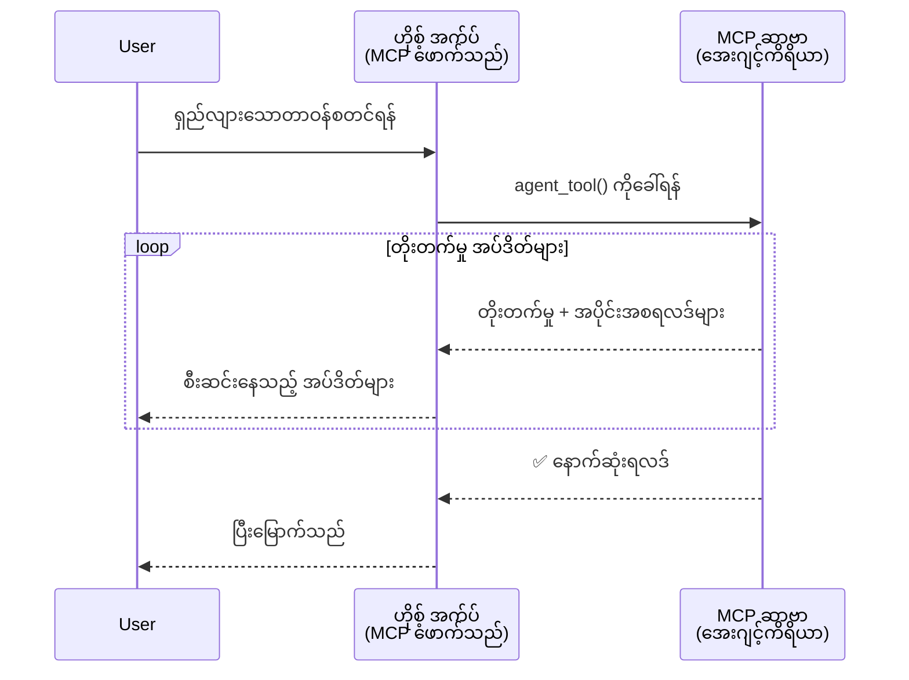
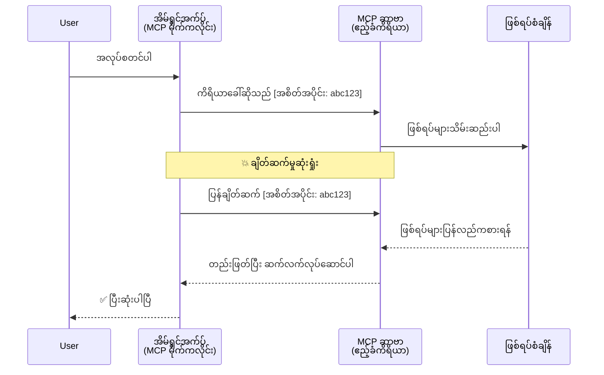
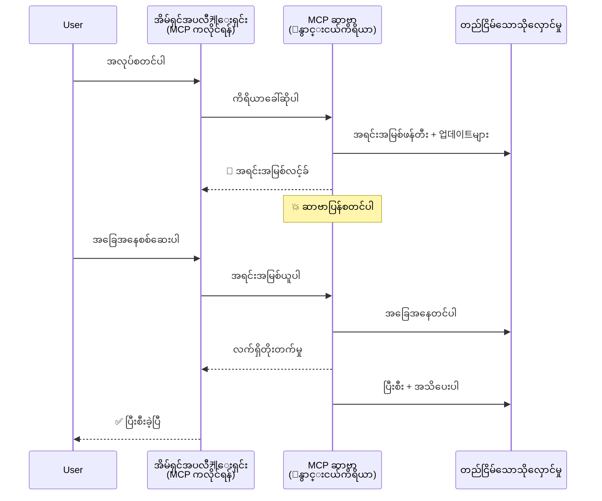
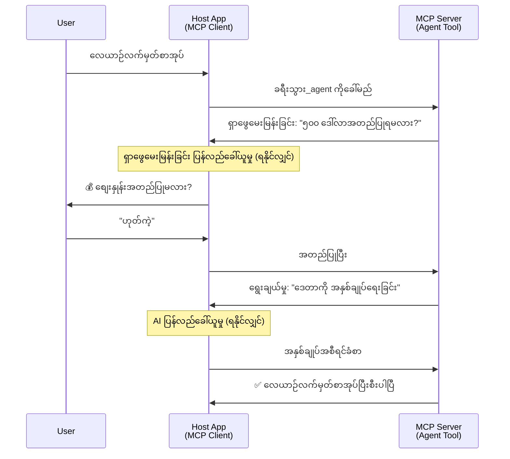
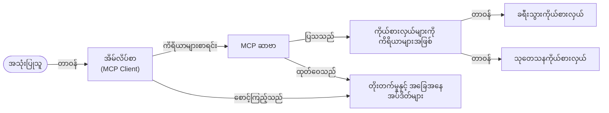

# MCP ဖြင့် Agent-to-Agent ဆက်သွယ်မှု စနစ်များ တည်ဆောက်ခြင်း

> TL;DR - MCP ပေါ်တွင် Agent2Agent ဆက်သွယ်မှု တည်ဆောက်နိုင်ပါသလား? ဟုတ်ကဲ့!

MCP သည် "LLM များအား context ပေးခြင်း" ဆိုသော မူလရည်မှန်းချက်ထက်မဟုတ်ဘဲ တဖြည်းဖြည်းတိုးတက်နေပြီး ဖြစ်သည်။ နောက်ဆုံးတိုးတက်မှုများတွင် [ပြန်လည်ဆက်သွယ်နိုင်သည့် streams](https://modelcontextprotocol.io/docs/concepts/transports#resumability-and-redelivery), [elicitation](https://modelcontextprotocol.io/specification/2025-06-18/client/elicitation), [sampling](https://modelcontextprotocol.io/specification/2025-06-18/client/sampling) နှင့် အသိပေးချက်များ ([တိုးတက်မှု](https://modelcontextprotocol.io/specification/2025-06-18/basic/utilities/progress) နှင့် [အရင်းအမြစ်များ](https://modelcontextprotocol.io/specification/2025-06-18/schema#resourceupdatednotification)) ပါဝင်ပြီးဖြစ်သည်။ MCP သည် ယခုခေတ်၌ ဆက်စပ် agent-to-agent ဆက်သွယ်မှု စနစ်ရှုပ်ထွေးများ ဖန်တီးရန် အခြေခံခံပလက်ဖောင်းတစ်ခုအဖြစ်ရရှိထားပါသည်။

## Agent/Tool မှားယွင်းသဘောထား

ဗဟုသုတရသော ပရိုဂရမ်မာများသည် agent ၏ အပြုအမူများ (ရှည်လျားစွာ လုပ်ဆောင်နိုင်ခြင်း၊ အလယ်တွင် ထပ်မံအချက်အလက်လိုအပ်နိုင်ခြင်း စသည်) ပါဝင်သည့် tool များကို ရှာဖွေစူးစမ်းလာသည်။ MCP သည် သက်ဆိုင်ရာ tool များ၏ ပုံစံနမူနာများမှာ ရိုးရှင်းသော တောင်းဆိုချက်-ပြန်ကြားချက် ပုံစံအပေါ်သာ အခြေခံထားသောကြောင့် မသင့်လျော်ကြောင်း သဘောထားဖြစ်ပါသည်။

ဤမြင်ကွင်းမှာ ယခင်ခေတ်သော်လည်းယနေ့မသင့်လျော်တော့ပါ။ မကြာသေးမီလကြာကာလအတွင်း MCP သဘောတူချက်သည် agent ၏ ရှည်လျားစွာ အပြုအမူများ ဖန်တီးရာတွင် ချို့တဲ့ချက်များ ပြင်ဆင်တိုးတက်လာပါသည်။

- **စတီးခြင်းနှင့် အပိုဆောင်းရလဒ်များ**: လည်ပတ်နေစဉ် တိုက်ရိုက်တိုးတက်မှုအသိပေးချက်များ
- **ပြန်လည်ဆက်သွယ်နိုင်ခြင်း**: ပြတ်တောက်ပြီးနောက် ပြန်ဆက်သွယ်၍ ဆက်လက်လုပ်ဆောင်နိုင်ခြင်း
- **ခိုင်မာမှု**: ရလဒ်များသည် server ပြန်လုပ်သည့်အခါ အတည်ပြုပြန်နိုင်ခြင်း (ဥပမာ resource link မှတဆင့်)
- **အတည့်တစ်ခါထပ်သွားခြင်း**: elicitation နှင့် sampling မှတဆင့် လည်ပတ်စဉ် အတွင်း အပြန်အလှန် ထည့်သွင်းမှုများ

ဤ အင်္ဂါရပ်များကို ပေါင်းစပ်ကာ ရှုပ်ထွေး agentic နှင့် multi-agent applications များ တည်ဆောက်ရာတွင် MCP protocol ပေါ်တွင် တည်ဆောက်နိုင်ပါသည်။

အညွန်းအဖြစ်၊ agent တစ်ခုကို MCP server ပေါ်တွင် ရရှိနိုင်သော "tool" ဟု ခေါ်ဆိုပါမည်။ ၎င်းသည် MCP client ကို အကောင်အထည်ဖော်သည့် host application တစ်ခု ရှိ၍ MCP server နှင့် အစည်းအဝေးတစ်ခု စတင်ကာ agent ကို ဖုန်းခေါ်နိုင်ခြင်းကို တို့ ဆိုလိုသည်။

## MCP Tool တစ်ခု "Agentic" ဟု ဘယ်လို သတ်မှတ်မလဲ?

အကောင်အထည်ဖော်မှုဆီသို့ စတင်ဝင်မစဉ်မီ၊ ရှည်လျားစွာ လည်ပတ်နိုင်သော agent များကို ထောက်ပံ့ရမည့် အခြေခံ အချက်အလက်များကို သတ်မှတ်ကြပါမည်။

> agent ဆိုသည်မှာ ရှည်လျားစွာ လွတ်လပ်စွာ လည်ပတ်နိုင်သော အဖွဲ့အစည်းတစ်ခုဖြစ်၍ ဘာသာစကား တုံ့ပြန်ချက်၊ အဆင့်ဆင့်ပြင်ဆင်မှုများ သို့မဟုတ် တုံ့ပြန်ချက်များပေါ်မူတည်၍ စိတ်လှုပ်ရှားသော လုပ်ငန်းများကို ကိုင်တွယ်နိုင်သော အဖွဲ့အစည်းဖြစ်သည်ဟု သတ်မှတ်မည်။

### ၁။ စတီးခြင်းနှင့် အပိုဆောင်းရလဒ်များ

ရိုးရာ တောင်းဆိုမှု-ပြန်ကြားမှု ပုံစံများသည် ရှည်လျားစွာ လုပ်ဆောင်ရမည့် လုပ်ငန်းများတွင် မအောင်မြင်ပါ။ Agent များမှာ အောက်ပါ အချက်များပေးနိုင်ရန် လိုအပ်သည်။

- တိုက်ရိုက် တိုးတက်မှု အသိပေးချက်များ
- အလယ်အလတ် နောက်ဆက်တွဲရလဒ်များ

**MCP Support**: Resource update အသိပေးချက်များသည် အပိုဆောင်းနောက်ဆက်တွဲ ရလဒ်များ ရရှိစေရန် streaming ကို ခွင့်ပြုသော်လည်း JSON-RPC ၏ 1:1 request/response model နှင့် အညီလိုက်ဖက်ရန် အကြံပြု ဒီဇိုင်းလိုက်နာရမည်။

| အင်္ဂါရပ်                  | အသုံးပြုမှု                                                                                                                                                          | MCP ပံ့ပိုးမှု                                              |
| -------------------------- | ----------------------------------------------------------------------------------------------------------------------------------------------------------------- | ---------------------------------------------------------- |
| တိုက်ရိုက် တိုးတက်မှု အသိပေးချက်များ | အသုံးပြုသူက ကုဒ်အခြေခံ ပြောင်းရွှေ့မှု တောင်းဆိုသည်။ Agent သည် တိုးတက်မှုများကို စတီးပါသည်။ "10% - မှတ်တမ်း စစ်ဆေးခြင်း... 25% - TypeScript ဖိုင်များ ပြောင်းခြင်း... 50% - အပိုင်းဆက်စပ်မှု ပြုပြင်ခြင်း..." | ✅ တိုးတက်မှု အသိပေးချက်များ                                      |
| အပိုဆောင်းရလဒ်များ          | "စာအုပ် ဖန်တီးရန်" လုပ်ငန်းမှာ အပိုဆောင်း ရလဒ်များ (၁) ဇာတ်လမ်း အကြမ်းဖျဥ်း၊ (၂) အခန်းစာရင်း၊ (၃) အခန်းတိုင်း အပြီးသတ်။ Host သည် စတင်၊ ရပ်စဲသို့မဟုတ် ပြောင်းလဲနိုင်သည်။                              | ✅ အသိပေးချက်များကို "တိုးချဲ့"၍ အပိုဆောင်းရလဒ်များ ထည့်သွင်းနိုင်ပြီး PR 383, 776 တွင် အကြံပြုချက်များရှိသည် |

<div align="center" style="font-style: italic; font-size: 0.95em; margin-bottom: 0.5em;">
<strong>ပုံ ၁:</strong> ဤပုံက MCP agent က ရှည်လျားစွာ လုပ်ဆောင်ချက်တစ်ခုတွင် host application သို့ တိုက်ရိုက် တိုးတက်မှုအသိပေးချက်များနှင့် အပိုဆောင်းရလဒ်များကို ဘယ်လို စတီးဖြင့် ပေးပို့ကြောင်း ပြသထားသည်၊ အသုံးပြုသူသည် လည်ပတ်မှုကို တိုက်ရိုက်ကြည့်ရှုနိုင်သည်။
</div>



### ၂။ ပြန်လည် ဆက်သွယ်နိုင်ခြင်း

Agent များသည် ကွန်ယက်ချို့တဲ့မှုများကို ချောမွေ့စွာ တာဝန်ယူ ပြုလုပ်နိုင်ရမည်။

- (Client) ပျက်ကွက်ပြီးနောက် ပြန်ဆက်သွယ်နိုင်ခြင်း
- မစပ်ဆောင်းသောနေရာမှ ဆက်လက်လုပ်ဆောင်ခြင်း (message ပြန်ပို့ခြင်း)

**MCP Support**: MCP StreamableHTTP သယ်ယူပို့ဆောင်မှုသည် ယခုအခါ session resumption နှင့် message redelivery ကို session IDs နှင့် last event IDs ဖြင့် ပံ့ပိုးပေးသည်။ ဒါပေမယ့် server သည် client ပြန်ဆက်သွယ်မှုအတွက် ပြန်လည်တင်ပြချက်များ ပြုလုပ်နိုင်သော EventStore တစ်ခု ထည့်သွင်းဆောင်ရွက်ရမည်။
နောက်ထပ်၊ transport-agnostic ပြန်လည်ဆက်သွယ်နိုင်သော streams ကို အကဲဖြတ်သည့် တိုက်တွန်းချက် community proposal (PR #975) တစ်ခုရှိသည်။

| အင်္ဂါရပ်     | အသုံးပြုမှု                                                                                                                                                         | MCP ပံ့ပိုးမှု                                                         |
| ------------ | ---------------------------------------------------------------------------------------------------------------------------------------------------------------- | --------------------------------------------------------------------- |
| ပြန်လည်ဆက်သွယ်နိုင်ခြင်း | Clientသည် ရှည်လျားစွာ လုပ်ဆောင်နေစဉ် သည် ချိတ်ထွက်သွားသောအခါ ပြန်ဆက်သွယ်မှုဖြင့် session ကို သိမ်းဆည်းပြီး လုပ်ဆောင်မှု ဆက်လက်ကြိုးပမ်းနိုင်သည်၊ ဖြတ်သန်းသွားသော event များကို ပြန်လည်ဖျတ်သိမ်းသည်။        | ✅ StreamableHTTP သယ်ယူပို့ဆောင်မှုစနစ်၊ session ID များ၊ event ပြန်ဖျတ်ရေးနှင့် EventStore ပါရှိသည် |

<div align="center" style="font-style: italic; font-size: 0.95em; margin-bottom: 0.5em;">
<strong>ပုံ ၂:</strong> MCP ၏ StreamableHTTP သယ်ယူပို့ဆောင်မှုနှင့် event store သည် seamless session ပြန်လည်ဆက်သွယ်မှုကို ဘယ်လို ချဲ့ထွင်ပေးသည်ကို ပြသထားသည်။ client ချိတ်ဆက်မှု ပျက်ကွက်ပါက ပြန်ဆက်သွယ်၍ မမြင်ရသည့် event များကို ပြန်လည်ဖျတ်သိမ်းခြင်းဖြင့် ဆက်လက်လုပ်ဆောင်နိုင်သည်။
</div>



### ၃။ ခိုင်မာမှု

ရှည်လျားစွာ လည်ပတ်သည့် agent များအတွက် အခြေအနေတည်ငြိမ်မှု လိုအပ်သည်။

- ရလဒ်များသည် server ပြန်စတင်သည့်အချိန်တွင် တည်ဆောက်နိုင်ရမည်
- အခြေအနေနှင့် အခြားအချက်အလက်များကို Band ပြင်ပမှ ယူနိုင်ရန်
- session များ တစ်လျှောက် တိုးတက်မှုကို လေ့လာနိုင်ရန်

**MCP Support**: MCP သည် ယခုမူလတွင် tool ဖုန်းခေါ်မှုများတွင် Resource link return type ကို ပံ့ပိုးသည်။ ယနေ့တွင် pattern တစ်ခုမှာ resource တည်ဆောက်ပြီး အဆက်အသွယ် resource link ကို အမြန်ပြန်ပေးခြင်းဖြစ်သည်။ tool သည် backend မှာ အလုပ်ဆက်ပြီး resource ကို အဆက်မပြတ် update ပြုလုပ်နိုင်ပြီး client သည် partial သို့မဟုတ် full ရလဒ်များဆီ သွားရန် resource အခြေအနေကို ဆက်လက် ဆော့စစ်ခြင်းကို ရွေးချယ်နိုင်ပြီး သို့မဟုတ် resource update အသိပေးချက်များအတွက် subscribe လုပ်နိုင်သည်။

ကျွန်ုပ်တို့ ရှေ့မှာ resource များကို poll လုပ်ခြင်း သို့မဟုတ် update များအတွက် subscribe လုပ်ခြင်းသည် အရင်းအမြစ်များကို စားသုံးမည် ဖြစ်ပြီး များပြားလာပါက ထိခိုက်မှုရှိနိုင်သည်။ server သည် client/host application ကို update များပေးပို့ခြင်းများအတွက် webhook သို့မဟုတ် triggers များ ထည့်သွင်းနိုင်ရန် community proposal (အထူးသဖြင့် #992) တစ်ခုရှိသည်။

| အင်္ဂါရပ်   | အသုံးပြုမှု                                                                                                                            | MCP ပံ့ပိုးမှု                                                     |
| ---------- | ------------------------------------------------------------------------------------------------------------------------------------- | ---------------------------------------------------------------- |
| ခိုင်မာမှု   | ဒေတာ ပြောင်းရွှေ့မှု လုပ်ဆောင်နေစဉ် server ပျက်ကွက်မှု။ ရလဒ်များနှင့် တိုးတက်မှုများသည် ပြန်လည်စတင်မှုကို ရှာဖွေနိုင်ပြီး client သည် အခြေအနေကိုစစ်ဆေးကာ တည်ငြိမ်နေသော resource မှ ဆက်လက်ဆောင်ရွက်နိုင်သည်။ | ✅ Persistent storage နှင့် status notifications ပါသော Resource links |

ယနေ့တွင် pattern တစ်ခုမှာ အဆက်အသွယ် resource link ကိုချက်ချင်း ပြန်ပေးသည့် resource တစ်ခု ဖန်တီးသော tool ကို ဒီဇိုင်းဆွဲခြင်း ဖြစ်သည်။ tool သည် backend မှာ ဒီလုပ်ငန်းကို ဆက်လက် လေလှမ်းပေးပြီး၊ partial result များပေးသည့် resource notifications များထုတ်ပေးကာ resource ၏ အကြောင်းအရာကို update လုပ်ပေးသည်။

<div align="center" style="font-style: italic; font-size: 0.95em; margin-bottom: 0.5em;">
<strong>ပုံ ၃:</strong> MCP agent များသည် တည်ငြိမ်သော resource များနှင့် status အသိပေးချက်များကို အသုံးပြုပြီး ရှည်လျားစွာ လုပ်ငန်းများကို server ပြန်လုပ်ခြင်းများတစ်လျှောက် သက်တမ်းတိုးအောင် ဆောင်ရွက်နိုင်ပြီး client များသည် လုပ်ငန်းတိုးတက်မှု စစ်ဆေးကာ ရလဒ်များကို ပြန်လည်ရယူနိုင်သည်ကို ဖော်ပြထားသည်။
</div>



### ၄။ အတည့်များစွာ အပြန်အလှန်ဆက်သွယ်မှုများ

Agent များသည် လည်ပတ်နေစဉ် ထပ်မံထည့်သွင်းရန် input လိုအပ်သည်။

- လူသား ရှင်းလင်းချက် သို့မဟုတ် အတည်ပြုချက်
- ရှုပ်ထွေးသော ဆုံးဖြတ်ချက်များအတွက် AI အကူအညီ
- စင်တင်များ ပြောင်းလဲခြင်း

**MCP Support**: AI input များအတွက် sampling နှင့် လူ input များအတွက် elicitation ဖြင့် ပြည့်စုံစွာပံ့ပိုးသည်။

| အင်္ဂါရပ်               | အသုံးပြုမှု                                                                                                                                    | MCP ပံ့ပိုးမှု                                     |
| ----------------------- | --------------------------------------------------------------------------------------------------------------------------------------------- | ------------------------------------------------- |
| အတည့်များစွာ ဆက်သွယ်မှုများ | ခရီးသွားစာချုပ် Agent က အသုံးပြုသူထံမှ စျေးနှုန်း အတည်ပြုချက် စုံစမ်းပြီး AI မှ ခရီးသွားဒေတာအစီအစဉ်ကို အတည်ပြုပြီးစာချုပ် ပြီးစီးစေသည်။                              | ✅ လူ input အတွက် elicitation၊ AI input အတွက် sampling  |

<div align="center" style="font-style: italic; font-size: 0.95em; margin-bottom: 0.5em;">
<strong>ပုံ ၄:</strong> MCP agent များသည် တစ်လည်လှည့်လုပ်ငန်းစဉ်တွင်း လူ input ကို elicitation ဖြင့် မေးမြန်းခြင်း သို့မဟုတ် AI အကူအညီကို တောင်းဆိုခြင်းများ ပြုလုပ်နိုင်ကြောင်း၊ သက်ဆိုင်ရာ အတည့်အတွဲမျိုးစုံသော workflows များအတွက် ဝိုင်းဝန်းလုပ်ဆောင်မှုများ ပြသထားခြင်းဖြစ်သည်။
</div>



## MCP ပေါ်တွင် ရှည်လျားစွာ လည်ပတ်သော Agent များ အကောင်အထည်ဖော်ခြင်း - ကုဒ် အကျဉ်းချုပ်

ဤဆောင်းပါးအပိုင်း၏ အစိတ်အပိုင်းတစ်ခုအနေဖြင့် MCP Python SDK တစ်ခုကို StreamableHTTP သယ်ယူပို့ဆောင်မှု ဖြင့် session ပြန်လည်ဆက်သွယ်ခြင်းနှင့် message ပြန်ပေးပို့ခြင်း၏ ကြောင်းပြုပုံလမ်းညွှန်ချက်များပါဝင်သည့် ရှည်လျားသော agent များ အကောင်အထည်ဖော်ထားသည့် [ကုဒ် repository](https://github.com/victordibia/ai-tutorials/tree/main/MCP%20Agents) ကို ကမ်းလှမ်းပေးထားသည်။ ၎င်းအကောင်အထည်ဖော်မှုတွင် MCP အင်္ဂါရပ်များကို ပေါင်းစပ်ကာ အသေးစိတ် agent ဆောင်ရွက်မှုတစ်ခု ဆိုင်ရာအတိုင်း ဖေါ်ပြထားသည်။

အထူးသဖြင့်၊ ၂ ဂဏန်း agent tool များ သုံးပါသည်။

- **ခရီးသွား Agent** - elicitation ဖြင့် စျေးနှုန်း အတည်ပြုချက် ပါသော ခရီးသွားစာချုပ် ဝန်ဆောင်မှုအတု
- **သုတေသန Agent** - sampling ဖြင့် AI အကူအညီ ပါသော သုတေသနလုပ်ငန်းများကို လုပ်ဆောင်သည်

agent နှစ်ခုလုံးမှာ တိုက်ရိုက် တိုးတက်မှု အသိပေးချက်များ၊ အတည့်အတွဲ အတည်ပြုချက်များနှင့် ပြန်လည်ဆက်သွယ်နိုင်မှု လုပ်ဆောင်ချက်များပါရှိသည်။

### အဓိက အကောင်အထည်ဖော်မှု ရှုပ်ထွေးမှုများ

အောက်ဖေါ်ပြပါ မြောက်ဂဏန်းများသည် server ပေါ်အရေးယူမှု agent အကောင်အထည်ပြုခြင်းနှင့် client ယာဉ် အကောင်အထည်ပြုမှု တို့ကို ပြသပါသည်။

#### စတီးခြင်းနှင့် ရလဒ် တိုးတက်မှု အသိပေးချက်များ - တိုက်ရိုက် လုပ်ငန်းအခြေအနေ

စတီးခြင်းသည် ရှည်လျားသော agent လုပ်ငန်းများတွင် တိုက်ရိုက် တိုးတက်မှု အသိပေးချက်များ ပေးနိုင်ရန် ကျယ်ပြန့်စွာ အသုံးပြုသည်၊ အသုံးပြုသူအား လုပ်ငန်း အခြေအနေ နှင့် အလယ်ပိုင်းရလဒ်များကို အကြောင်းကြားနိုင်သည်။

**Server အကောင်အထည်ဖော်မှု (agent မှ တိုးတက်မှု အသိပေးချက်များ ပို့ခြင်း):**

```python
# server/server.py မှ - ခရီးသွားကိုယ်စားလှယ် ဖော်ပြချက်များ ပို့နေသည်
for i, step in enumerate(steps):
    await ctx.session.send_progress_notification(
        progress_token=ctx.request_id,
        progress=i * 25,
        total=100,
        message=step,
        related_request_id=str(ctx.request_id)
    )
    await anyio.sleep(2)  # အလုပ်လုပျမှုကို ခန့်မှန်းရန်

# အခြားရွေးချယ်မှု - အဆင့်ဆင့် ဖော်ပြချက်များ အတွက် မှတ်တမ်းတိုက်မက်နက်များပေးရန်
await ctx.session.send_log_message(
    level="info",
    data=f"Processing step {current_step}/{steps} ({progress_percent}%)",
    logger="long_running_agent",
    related_request_id=ctx.request_id,
)
```

**Client အကောင်အထည်ဖော်မှု (host မှ တိုးတက်မှု အသိပေးချက်များ လက်ခံခြင်း):**

```python
# client/client.py မှ - အချိန်နှင့်တပြေးညီ အသိပေးချက်များကို ကိုင်တွယ်နေသည်
async def message_handler(message) -> None:
    if isinstance(message, types.ServerNotification):
        if isinstance(message.root, types.LoggingMessageNotification):
            console.print(f"📡 [dim]{message.root.params.data}[/dim]")
        elif isinstance(message.root, types.ProgressNotification):
            progress = message.root.params
            console.print(f"🔄 [yellow]{progress.message} ({progress.progress}/{progress.total})[/yellow]")

# စက်ရှ်ရှင်းဖန်တီးစဉ် စာတန်းလက်ခံသူကို မှတ်ပုံတင်ပါ
async with ClientSession(
    read_stream, write_stream,
    message_handler=message_handler
) as session:
```

#### Elicitation - အသုံးပြုသူ input တောင်းဆိုခြင်း

Elicitation သည် agent များအား လည်ပတ်နေစဉ် အသုံးပြုသူ input များတောင်းဆိုရန် ခွင့်ပြုသည်။ ဤသည်မှာ တိုးတက်နေစဉ် အတည်ပြုချက်များ၊ ရှင်းလင်းချက်များ သို့မဟုတ် ခွင့်ပြုချက်များကို လိုအပ်သည့်အခါ မရှိမဖြစ်လိုအပ်ပါသည်။

**Server အကောင်အထည်ဖော်မှု (agent မှ အတည်ပြုချက် တောင်းဆိုခြင်း):**

```python
# server/server.py မှ - ခရီးသွားအေးဂျင့်က စျေးနှုန်းအတည်ပြုချက်ကို တောင်းဆိုနေသည်
elicit_result = await ctx.session.elicit(
    message=f"Please confirm the estimated price of $1200 for your trip to {destination}",
    requestedSchema=PriceConfirmationSchema.model_json_schema(),
    related_request_id=ctx.request_id,
)

if elicit_result and elicit_result.action == "accept":
    # 예약ကို ဆက်လက်လုပ်ဆောင်ပါ
    logger.info(f"User confirmed price: {elicit_result.content}")
elif elicit_result and elicit_result.action == "decline":
    # 예약ကို ဖျက်လိုက်ပါ
    booking_cancelled = True
```

**Client အကောင်အထည်ဖော်မှု (host မှ elicitation callback ပေးခြင်း):**

```python
# client/client.py မှ - Client ၏ တောင်းဆိုချက်ကို ကိုင်တွယ်ခြင်း
async def elicitation_callback(context, params):
    console.print(f"💬 Server is asking for confirmation:")
    console.print(f"   {params.message}")

    response = console.input("Do you accept? (y/n): ").strip().lower()

    if response in ['y', 'yes']:
        return types.ElicitResult(
            action="accept",
            content={"confirm": True, "notes": "Confirmed by user"}
        )
    else:
        return types.ElicitResult(
            action="decline",
            content={"confirm": False, "notes": "Declined by user"}
        )

# Session ဖန်တီးသောအခါ callback ကို မှတ်ပုံတင်ပါ
async with ClientSession(
    read_stream, write_stream,
    elicitation_callback=elicitation_callback
) as session:
```

#### Sampling - AI အကူအညီ တောင်းဆိုခြင်း

Sampling သည် agent များအား စိတ်တိုင်းကျ ဖန်တီးမှုများ သို့မဟုတ် ရှုပ်ထွေးဆုံးဖြတ်ချက်များအတွက် LLM အကူအညီ တောင်းဆိုရန် ခွင့်ပြုသည်။ ၎င်းသည် လူနှင့် AI ပူးပေါင်းခြင်း ဆောင်ရွက်မှုများကို ချဲ့ထွင်ပေးသည်။

**Server အကောင်အထည်ဖော်မှု (agent မှ AI အကူအညီ တောင်းဆိုခြင်း):**

```python
# server/server.py မှ - သုတေသနအေးဇင့်သည် AI အကျဉ်းချုပ်ကို တောင်းဆိုသည်
sampling_result = await ctx.session.create_message(
    messages=[
        SamplingMessage(
            role="user",
            content=TextContent(type="text", text=f"Please summarize the key findings for research on: {topic}")
        )
    ],
    max_tokens=100,
    related_request_id=ctx.request_id,
)

if sampling_result and sampling_result.content:
    if sampling_result.content.type == "text":
        sampling_summary = sampling_result.content.text
        logger.info(f"Received sampling summary: {sampling_summary}")
```

**Client အကောင်အထည်ဖော်မှု (host မှ sampling callback ပေးခြင်း):**

```python
# client/client.py မှ - Client များ၏ sampling request များကို ကိုင်တွယ်ခြင်း
async def sampling_callback(context, params):
    message_text = params.messages[0].content.text if params.messages else 'No message'
    console.print(f"🧠 Server requested sampling: {message_text}")

    # အမှန်တကယ် application တစ်ခုတွင်၊ ဤသည်မှာ LLM API ကို ခေါ်သုံးနိုင်သည်
    # ပြသမှုအတွက် မော်ဒယ်တစ်ခုမှ ပြန်လည်ဖြေကြားချက်ကို ပေးပါသည်
    mock_response = "Based on current research, MCP has evolved significantly..."

    return types.CreateMessageResult(
        role="assistant",
        content=types.TextContent(type="text", text=mock_response),
        model="interactive-client",
        stopReason="endTurn"
    )

# session ဖန်တီးသောအခါ callback ကို စာရင်းသွင်းပါ
async with ClientSession(
    read_stream, write_stream,
    sampling_callback=sampling_callback,
    elicitation_callback=elicitation_callback
) as session:
```

#### ပြန်လည် ဆက်သွယ်နိုင်မှု - ချိတ်ဆက်မှု ပျက်ကွက်မှုတစ်လျှောက် session ဆက်လက်မှု

ပြန်လည်ဆက်သွယ်နိုင်မှုသည် ရှည်လျားစွာ လည်ပတ်သည့် agent လုပ်ငန်းများသည် client ချိတ်ဆက်မှု ပျက်ကွက်ခြင်းကို ကျော်လွှားကာ ပြန်ဆက်သွယ်မှုအခါ seamless ဆက်လက် ဆောင်ရွက်နိုင်ရန် သေချာစေသည်။ ၎င်းသည် event stores နှင့် ပြန်ဆက်သွယ်မှု token များဖြင့် ကူညီ ဆောင်ရွက်သည်။

**Event Store အကောင်အထည်ဖော်မှု (server တွင် session အခြေအနေ ထိန်းသိမ်းခြင်း):**

```python
# server/event_store.py မှ - ရိုးရိုး ရိုးရှင်းတဲ့ အမှတ်အသားမှတ်တမ်း စုစည်းရေး
class SimpleEventStore(EventStore):
    def __init__(self):
        self._events: list[tuple[StreamId, EventId, JSONRPCMessage]] = []
        self._event_id_counter = 0

    async def store_event(self, stream_id: StreamId, message: JSONRPCMessage) -> EventId:
        """Store an event and return its ID."""
        self._event_id_counter += 1
        event_id = str(self._event_id_counter)
        self._events.append((stream_id, event_id, message))
        return event_id

    async def replay_events_after(self, last_event_id: EventId, send_callback: EventCallback) -> StreamId | None:
        """Replay events after the specified ID for resumption."""
        start_index = None
        stream_id = None
        for index, (event_stream_id, event_id, _) in enumerate(self._events):
            if event_id == last_event_id:
                start_index = index + 1
                stream_id = event_stream_id
                break

        if start_index is None:
            return None

        # Session ရဲ့ မူလ stream မှ နောက်ပိုင်း ဖြစ်ရပ်များကိုသာ ပြန်လည်ဖွင့်ပါ။
        for event_stream_id, event_id, message in self._events[start_index:]:
            if event_stream_id != stream_id:
                continue
            await send_callback(EventMessage(message, event_id))

        return stream_id

# server/server.py မှ - Event store ကို session မန်နေဂျာသို့ ပေးပို့ခြင်း
def create_server_app(event_store: Optional[EventStore] = None) -> Starlette:
    server = ResumableServer()

    # ပြန်လည်ဆက်ခံရေးအတွက် event store နှင့် session မန်နေဂျာ ဖန်တီးပါ။
    session_manager = StreamableHTTPSessionManager(
        app=server,
        event_store=event_store,  # Event store သည် session ပြန်လည်ဆက်ခံခြင်းကို အထောက်အကူပြုသည်
        json_response=False,
        security_settings=security_settings,
    )

    return Starlette(routes=[Mount("/mcp", app=session_manager.handle_request)])

# အသုံးပြုနည်း: Event store ဖြင့် စတင်ရန်
event_store = SimpleEventStore()
app = create_server_app(event_store)
```

**Client Metadata သည် ပြန်လည်ဆက်သွယ်မှု token ဖြင့် (client မှ သိမ်းဆည်းထားသောအခြေအနေ ဖြင့် ပြန်ဆက်သွယ်ခြင်း):**

```python
# client/client.py မှ - metadata ဖြင့် Client resumption
if existing_tokens and existing_tokens.get("resumption_token"):
    # ကျန်ခဲ့သည့်နေရာမှ ဆက်လက်ရန် ရှိပြီးသား resumption token ကိုအသုံးပြုပါ
    metadata = ClientMessageMetadata(
        resumption_token=existing_tokens["resumption_token"],
    )
else:
    # ပေးပို့လာသော resumption token ကို သိမ်းဆည်းရန် callback ဖန်တီးပါ
    def enhanced_callback(token: str):
        protocol_version = getattr(session, 'protocol_version', None)
        token_manager.save_tokens(session_id, token, protocol_version, command, args)

    metadata = ClientMessageMetadata(
        on_resumption_token_update=enhanced_callback,
    )

# resumption metadata ဖြင့် request ပေးပို့ပါ
result = await session.send_request(
    types.ClientRequest(
        types.CallToolRequest(
            method="tools/call",
            params=types.CallToolRequestParams(name=command, arguments=args)
        )
    ),
    types.CallToolResult,
    metadata=metadata,
)
```

host application သည် session ID များနှင့် ပြန်လည်ဆက်သွယ်မှု token များကို ဒေသခံတွင် ထိန်းသိမ်းကာ progress သို့မဟုတ် အခြေအနေ ပျောက်ဆုံးခြင်း မရှိပဲ ရှိပြီးသား session များအား ပြန်ဆက်သွယ်နိုင်သည်။

### ကုဒ် စီမံခန့်ခွဲမှု

<div align="center" style="font-style: italic; font-size: 0.95em; margin-bottom: 0.5em;">
<strong>ပုံ ၅:</strong> MCP-based agent system အင်ဂျင်နီယာရေးရာ ဖွဲ့စည်းပုံ
</div>



**အဓိက ဖိုင်များ:**

- **`server/server.py`** - elicitation, sampling နှင့် တိုးတက်မှု အသိပေးချက် များကို ပြသသော ခရီးသွားနှင့် သုတေသန agents ဖြင့် ပြန်လည်ဆက်သွယ်နိုင်သည့် MCP server
- **`client/client.py`** - ပြန်လည်ဆက်သွယ်မှု ပံ့ပိုးမှု၊ callback handler များနှင့် token စီမံခန့်ခွဲမှု ပါရှိသည့် interactive host application
- **`server/event_store.py`** - session ပြန်လည်ဆက်သွယ်မှုနှင့် message ပြန်ပေးပို့ခြင်း မြှင့်တင်ပေးသော event store အကောင်အထည်ဖော်မှု

## MCP ပေါ်တွင် Multi-Agent ဆက်သွယ်မှု တိုးချဲ့ခြင်း

အထက်ဖော်ပြထားသည့်အကောင်အထည်ဖော်မှုကို host application ၏ နည်းပညာတိုးတက်ခြင်း နှင့် ကိုယ်စားလှယ်များ၏ နယ်ပယ် ကို ပိုမိုချဲ့ထွင်ခြင်းဖြင့် multi-agent system များအဖြစ် တိုးချဲ့နိုင်သည်။

- **နည်းပညာရှင် အလုပ်ခွဲခြားခြင်း**: host သည် အသုံးပြုသူ၏ ရှုပ်ထွေးသော တောင်းဆိုမှုများကို ခွဲခြား၍ အထူးပြု agent များဆီ သို့ အသေးစိတ် အလုပ်ခွဲများသို့ ခွဲထုတ်ပေးသည်
- **Multi-Server အမှုဆောင်မှု**: host သည် MCP server များစွာနှင့် ချိတ်ဆက်မှု တည်ဆောက်ထားပြီး agent များ၏ အရည်အချင်း အမျိုးမျိုးကို ဖော်ပြသည်
- **အလုပ်အခြေအနေ စီမံခန့်ခွဲမှု**: host သည် agent task များစွာအား တပတ်လုံး တိုးတက်မှုကို လေ့လာခြင်း၊ မှီခိုမှုများနှင့် အဆက်အစပ်များကို ထိန်းသိမ်းသည်
- **စွမ်းဆောင်ရည် ချဲ့တိုးခြင်းနှင့် ထပ်မံကြိုးပမ်းမှုများ**: agent မရရှိနိုင်သောအချိန်တွင် ချို့ယွင်းမှုများ စီမံခန့်ခွဲခြင်း၊ နောက်တကြိမ်ကြိုးပမ်းမှု ရှိစေရန် နှင့် task ပိုင်းခြားပြောင်းလဲခြင်းများ ဆောင်ရွက်သည်
- **ရလဒ် ပေါင်းစည်းခြင်း**: agent များစွာမှ ထွက်လာသော အချက်အလက်များကို ယုံကြည်စိတ်ချရသော  နောက်ဆုံးရလဒ်အဖြစ် ပေါင်းစည်းသည်

host သည် ရိုးရှင်းသည့် client မှ ဉာဏ်ရည်မြင့် orchestrator တစ်ခုအဖြစ် ပြောင်းလဲကာ ယခင် MCP protocol အခြေခံမှု ကို ကောင်းမွန်စွာ ထိန်းသိမ်းထားသည်။

## နိဂုံးချုပ်

MCP ၏ တိုးတက်ထားသည့် အင်္ဂါရပ်များ - resource အသိပေးချက်များ၊ elicitation/sampling၊ ပြန်လည်ဆက်သွယ်နိုင်သည့် streams နှင့် တည်ငြိမ်သော resources များသည် စနစ်ရှုပ်ထွေးသော agent-to-agent အပြန်အလှန်ဆက်သွယ်မှုများကို လုပ်ဆောင်နိုင်စေရန် အသုံးပြုမှုများဖြစ်ပါသည်။ protocol ရိုးရှင်းမှုကို ထိန်းသိမ်းထားသည်။

## စတင် အသုံးပြုရန်

မိမိ၏ agent2agent စနစ် တည်ဆောက်လိုပါသလား? အောက်ပါ အဆင့်များလိုက်နာပါ။

### ၁။ ဇယားကို ချောမွေ့စွာ ပြေးပါ

```bash
# ပြန်လည်ဆက်သွယ်ရန်အတွက် event store ဖြင့် ဆာဗာကို စတင်ပါ
python -m server.server --port 8006

# တခြား terminal တစ်ခု၌ အပြန်အလှန် client ကို ပြေးပါ
python -m client.client --url http://127.0.0.1:8006/mcp
```

**အင်တာแက်တစ်ရှင်းန့် မိုဒ် တွင် အသုံးပြုနိုင်သော command များ:**

- `travel_agent` - elicitation ဖြင့် စျေးနှုန်း အတည်ပြုချက် ပါသော ခရီးစာချုပ် အသုံးပြုခြင်း
- `research_agent` - sampling ဖြင့် AI အကူအညီ ပါသော သုတေသန ခေါင်းစဉ်များ ဆောင်ရွက်ခြင်း
- `list` - ရနိုင်သော tool များအားလုံး ပြသခြင်း
- `clean-tokens` - ပြန်လည်ဆက်သွယ်မှု token များ သန့်ရှင်းခြင်း
- `help` - command အသေးစိတ် ကူညီချက် ဖော်ပြခြင်း
- `quit` - client ထွက်ရန်

### ၂။ ပြန်လည်ဆက်သွယ်နိုင်မှု စမ်းသပ်မှု

- ရှည်လျားစွာ လည်ပတ်နေသော agent တစ်ခု စတင်ပါ (ဥပမာ- `travel_agent`)
- လည်ပတ်စဉ် client ကို ဖျက်ဆိုင်းပါ (Ctrl+C)
- client ကို ပြန်စတင်ပါ - ၎င်းသည် ချိတ်ဆက်မှုပြတ်ဖျက်သောနေရာမှ အလိုအလျောက် ပြန်ဆက်သွယ်ပါမည်

### ၃။ လေ့လာခြင်းနှင့် တိုးချဲ့မှု

- **နမူနာများကို စူးစမ်းပါ**: [mcp-agents](https://github.com/victordibia/ai-tutorials/tree/main/MCP%20Agents) ကို စစ်ဆေးပါ
- **အသိုင်းအဝိုင်းသို့ ပါဝင်ပါ**: GitHub တွင် MCP ဆွေးနွေးချက်တွင် ပါဝင်ဆောင်ရွက်ပါ
- **စမ်းသပ်လေ့လာပါ**: ရိုးရှင်းသည့် ရှည်လျားသော လုပ်ငန်းတစ်ခုနဲ့ စတင်ကာ streaming, ပြန်ဆက်သွယ်နိုင်မှု နှင့် multi-agent ချိတ်ဆက်မှုများ ဖြည့်စွက်ပါ

ဤသည်က MCP သည် tool-based ရိုးရှင်းမှု ထိမ်းသိမ်းကာ ဉာဏ်ရည်မြင့် agent အပြုအမူများ ချဲ့ထွင်နိုင်ကြောင်း ဖော်ပြသည်။

ယေဘုယျအားဖြင့် MCP protocol သဘောတူချက်သည် လျင်မြန်စွာ တိုးတက်နေပါသည်။ နောက်ဆုံးအဆင့် အသစ်များအတွက် နောက်ဆုံးပေါ် အဖွဲ့အစည်းဝက်ဘ်ဆိုက် https://modelcontextprotocol.io/introduction ကို လေ့လာကြည့်ရန် အကြံပြုပါသည်။

---

<!-- CO-OP TRANSLATOR DISCLAIMER START -->
**ပြောကြားချက်**
ဤစာတမ်းကို AI ဘာသာပြန်ဝန်ဆောင်မှု [Co-op Translator](https://github.com/Azure/co-op-translator) အသုံးပြု၍ ဘာသာပြန်ထားပါသည်။ ကျွန်ုပ်တို့သည် တိကျမှန်ကန်မှုအတွက် ကြိုးပမ်းနေသော်လည်း၊ စက်ကိရိယာဘာသာပြန်ခြင်းများတွင် အမှားများ သို့မဟုတ် မှားယွင်းချက်များ ပါဝင်နိုင်ကြောင်း သတိပြုပါရန် လိုအပ်ပါသည်။ မူလစာတမ်းကို မူရင်းဘာသာဖြင့်သာ ယုံကြည်စိတ်ချရသော အချက်အလက်အဖြစ် သတ်မှတ်သင့်သည်။ အရေးကြီးသည့် သတင်းအချက်အလက်များအတွက် ပရော်ဖက်ရှင်နယ် လူသားဘာသာပြန်သူဝန်ဆောင်မှုကို အကြံပြုပါသည်။ ဤဘာသာပြန်ချက်ကို အသုံးပြုခြင်းမှ ဖြစ်ပေါ်လာသော နားလည်မှုကွာခြားမှုများ သို့မဟုတ် မမှန်ကန်သော အသုံးပြုမှုများအတွက် ကျွန်ုပ်တို့ တာဝန်မခံပါ။
<!-- CO-OP TRANSLATOR DISCLAIMER END -->