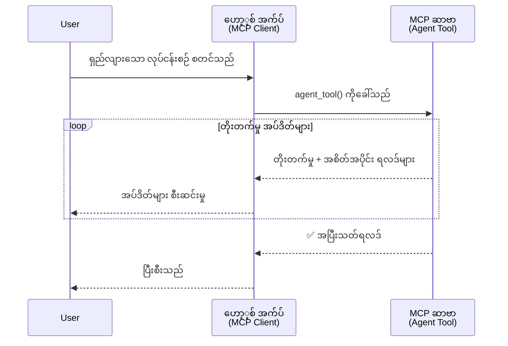
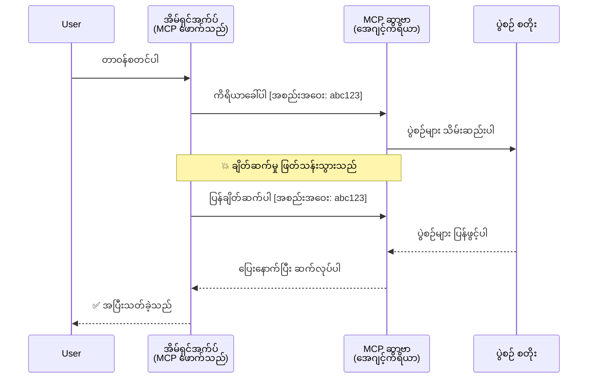
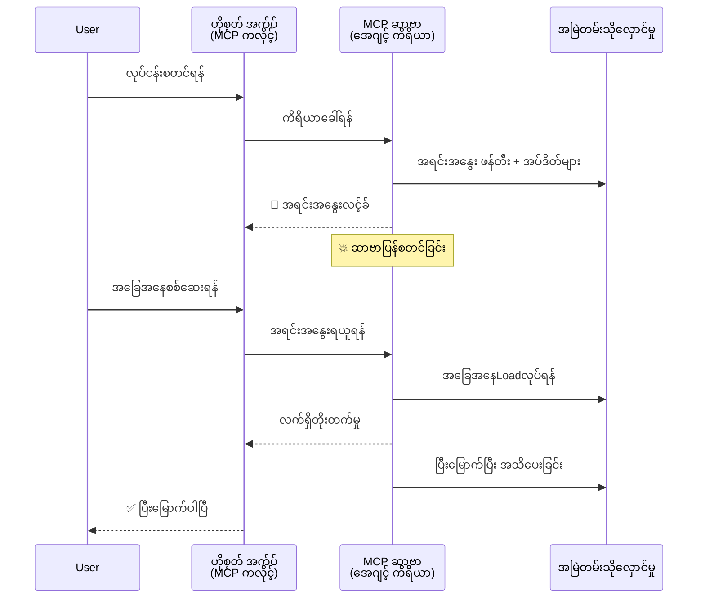
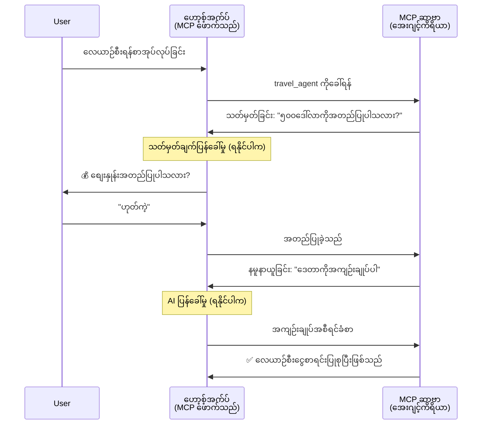
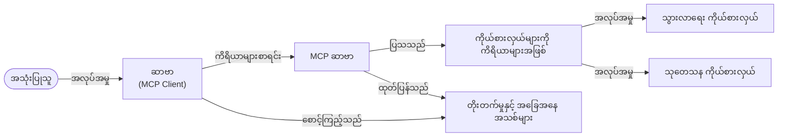

# MCP နှင့်အတူ Agent-မှ-Agent ဆက်သွယ်ရေး စနစ်များ တည်ဆောက်ခြင်း

> TL;DR - MCP ပေါ်တွင် Agent2Agent ဆက်သွယ်ရေးကို တည်ဆောက်နိုင်ပါသလား? ဟုတ်ကဲ့!

MCP သည် "LLMs များအတွက် context ပေးခြင်း" ကို အခြေခံရည်မှန်းချက်အဖြစ်ထားရှိခဲ့ပေမယ့် ထူးခြားစွာတိုးတက်လာခဲ့ပြီး [resumable streams](https://modelcontextprotocol.io/docs/concepts/transports#resumability-and-redelivery), [elicitation](https://modelcontextprotocol.io/specification/2025-06-18/client/elicitation), [sampling](https://modelcontextprotocol.io/specification/2025-06-18/client/sampling) နှင့် အသိပေးချက်များ ([progress](https://modelcontextprotocol.io/specification/2025-06-18/basic/utilities/progress) နှင့် [resources](https://modelcontextprotocol.io/specification/2025-06-18/schema#resourceupdatednotification)) အပါအဝင် တိုးတက်မှုများကြောင့် MCP သည် ပြင်းထန်ခိုင်မာသော agent-to-agent ဆက်သွယ်ရေးစနစ်များ တည်ဆောက်ရာအတွက် အခြေခံမြစ်မြောင်း အဖြစ် အသုံးပြုနိုင်ပါသည်။

## Agent/Tool တိုက်ဆိုင်သည့် မမှန်မကန် သဘောထား

developer များသည် agentic အပြုအမှုများ ပါဝင်သည့် tools များ (ရှည်လျားစွာ စတင်လည်ပတ်နိုင်ပြီး လုပ်ငန်းဆောင်တာအတွင်း သွားလာရန် input ပေါင်းထည့်ရန်လိုအပ်နိုင်ခြင်း စသဖြင့်) ကို ရှာဖွေစူးစမ်းရာတွင် MCP မှာ မသင့်လျော်ပုံမျိုး ထင်မြင်ထားကြပြီး ၎င်း၏ tool များအတွက် မူလဥပမာများမှာ ရိုးရိုးရှင်းရှင်း request-response စနစ်ကိုသာ ဦးစားပေးထားခြင်းဖြစ်ကြောင်း ယူဆလေ့ရှိကြသည်။

သို့သော် ဤမြင်ကွင်းမှာ ရှေးအဖွဲ့ဖြစ်ပြီး မကြာသေးမီလအတွင်း MCP အသုံးပြုမှုများတွင် တိုးတက်မှုများဖြင့် agentic အပြုအမူရှည်လျားသောလုပ်ငန်းများကို ပိုမိုကောင်းမွန်စွာ တည်ဆောက်နိုင်ရန် အခွင့်အလမ်းများ ပိုမိုဖြစ်ပေါ်လာသည်။

- **Streaming & Partial Results**: လုပ်ငန်းဆောင်တာအတွင်း အချိန်နှင့်တပြေးညီ တိုးတက်မှုအသိပေးချက်များ
- **Resumability**: client ဖြင့် အဆက်မပြတ် ချိတ်ဆက်ပြီး ပြန်ရောက်ပြီးဆက်လက်လုပ်ကိုင်နိုင်ခြင်း
- **Durability**: server restart များမှ ကြာရှည်တည်ဆောက်ထားသောရလဒ်များသက်တမ်းရှည် ထိန်းသိမ်းပေးခြင်း (ဥပမာ resource links အား အသုံးပြုခြင်း)
- **Multi-turn**: နောက်လမ်း input ပေးရန် elicitation နှင့် sampling များကူညီပေးခြင်းဖြင့် အပြန်အလှန်ဆက်သွယ်နိုင်ခြင်း

ယခုအချက်များအားလုံးကို ပေါင်းစပ်အသုံးပြုခြင်းဖြင့် ရှည်လျားသော agentic နှင့် multi-agent application များကို MCP protocol ပေါ်တွင် တည်ဆောက်နိုင်ပါသည်။

အညွန်းအဖြစ် agent ၏ နာမည်ကို MCP server ပေါ်တွင် ရရှိနိုင်သည့် "tool" ဟူ၍ ခေါ်ဆိုမည်ဖြစ်ပြီး အဲဒီအတိုင်း MCP client ကို တည်ဆောက်ထားသော host application ရှိပြီး MCP server နှင့် ဆက်သွယ်ပြီး agent ကို ခေါ်ဆိုနိုင်မှုအား ဖော်ပြပါသည်။

## MCP Tool တစ်ခုကို "Agentic" ဖန်တီးပုံ

အကောင်အထည်ဖော်မှုအရ သာမန်ရှိသည့် လုပ်ငန်းရေးဆွဲမှုများမလုပ်မီ ရှည်လျားစွာ လည်ပတ်နိုင်သော agent များအတွက် ဘယ် infrastructure အင်အားများကို လိုအပ်သည်ကို သတ်မှတ်လိုက်ပါမည်။

> Agent ကို ကာလကြာရှည်သုံးနိုင်ပြီး များမြင့်သော အသွင်အပြင်နှင့် လုပ်ဆောင်ရမည့် အလုပ်များကို ကိုင်တွယ်နိုင်သည့်, အချိန်နှင့်တပြေးညီ feedback အပေါ် အခြေခံ၍ အပြန်အလှန်ပြောဆိုချက်များ သို့မဟုတ် ပြင်ဆင်မှုများ လုပ်ဆောင်နိုင်သည့် အင်အားရှိသော အဖွဲ့အစည်းဟု သတ်မှတ်ပါမည်။

### 1. Streaming & Partial Results

ရိုးရာ request-response ပုံစံများသည် ရှည်လျားသော လုပ်ငန်းများအတွက် သင့်တော်မှုမရှိပါ။ Agent များတွင် လိုအပ်သည်မှာ -

- အချိန်နှင့်တပြေးညီ တိုးတက်မှု အသိပေးချက်များ
- အလယ်ပိုင်းရလဒ်များ

**MCP Support**: resource update notifications များက partial results ကို streaming ပုံစံဖြင့် အသုံးပြုခွင့်ပြုသော်လည်း JSON-RPC ၏ 1:1 request/response ပုံစံနှင့် မကိုက်ညီမှုကို သတိထား ရှင်းလင်းစေရန် လိုအပ်ပါသည်။

| Feature                    | Use Case                                                                                                                                                                       | MCP Support                                                                                |
| -------------------------- | ------------------------------------------------------------------------------------------------------------------------------------------------------------------------------ | ------------------------------------------------------------------------------------------ |
| Real-time Progress Updates | အသုံးပြုသူက ကုဒ်အခြေပြု migration လုပ်ငန်း တောင်းဆိုသည်။ Agent က အရပ်အတည်အောင်တိုင်း တိုးတက်မှုများကို ပြသသည် - "10% - လိုအပ်ဒက်(Dependencies) စစ်ဆေးနေသည်... 25% - TypeScript ဖိုင်များ ပြောင်းလဲနေသည်... 50% - import များ အပ်ဒိတ်လုပ်နေသည်..."            | ✅ Progress notifications                                                                  |
| Partial Results            | "စာအုပ် တစ်အုပ် ဖန်တီးပါ" ဆိုသည့် လုပ်ငန်းတွင် အပိုင်းအစတွေကို streaming ဖြင့် ထုတ်ပြသသည်။ ဥပမာ- ၁) ဇာတ်လမ်း အကြောင်းအရာ အကျဉ်း, ၂) အခန်းစာ စာရင်း, ၃) အခန်းတိုင်းကို ပြီးစီးသည့်အတိုင်း ပြသသည်။ Host သည် လုပ်ငန်းအဆင့် အလိုက် ကြည့်ရှု၊ ပိတ်သိမ်း၊ သို့မဟုတ် ပြောင်းလဲနိုင်သည်။ | ✅ Partial results အပါအဝင် အတိုးများအတွက် အကြံပြုချက်များကို PR 383, 776 တွင် ကြည့်ပါ                    |

<div align="center" style="font-style: italic; font-size: 0.95em; margin-bottom: 0.5em;">
<strong>ပုံ ၁။</strong> ဤပုံကြမ်းတွင် MCP agent သည် ရှည်လျားသော လုပ်ငန်းတစ်ခုအတွင်း အချိန်နှင့်တပြေးညီ တိုးတက်မှုနှင့် partial results များကို host application ထံ ဖြန့်ဝေသည့်နည်းကို ဖော်ပြထားသည်။ အသုံးပြုသူသည် လုပ်ငန်းအခြေအနေကို တိုက်ရိုက် ကြည့်ရှုနိုင်သည်။
</div>



### 2. Resumability

Agent များသည် ကွန်ယက် ဆက်သွယ်မှု မျက်မှောက်ချိန်များကို သေချာစွာ ကိုင်တွယ်နိုင်ရမည်။

- (Client) ခွဲထွက်သွားလျှင် ပြန်ချိတ်ဆက်နိုင်ရမည်
- မပြတ်စွာ ဆက်လက်လုပ်ကိုင်နိုင်ရန် မပြီးစီးသည့် အစိတ်အပိုင်းများကို ပြန်ပို့ပေးနိုင်ရမည်

**MCP Support**: MCP StreamableHTTP transport သည် ယနေ့နေ့တွင် session resumption နှင့် message redelivery ကို session ID များနှင့် နောက်ဆုံး event ID များဖြင့် ပံ့ပိုးပေးသည်။ အရေးကြီးချက်မှာ server က client ပြန်ချိတ်ဆက်သည့်အခါ ပြန်လည်ပြရန် event များကို ထိန်းသိမ်းထားသော EventStore တစ်ခုကို တီထွင်ထားရမည်ဖြစ်သည်။
သတိပြုရန်- community မှ proposal (PR #975) တစ်ခုရှိပြီး transport-agnostic resumable streams ကို စိစစ်လေ့လာနေသည်။

| Feature      | Use Case                                                                                                                                                   | MCP Support                                                                |
| ------------ | ---------------------------------------------------------------------------------------------------------------------------------------------------------- | -------------------------------------------------------------------------- |
| Resumability | Client သည် ရှည်လျားသော လုပ်ငန်းဆောင်တာသုံးနေစဉ် ခွဲထွက်ရပြီး ပြန်ချိတ်ဆက်သောအခါ မထင်မှတ်ထားသော event များ ပြန်လည်ဖော်ပြခြင်းဖြင့် ဆက်လက်လုပ်ကိုင်နိုင်သည်။                             | ✅ StreamableHTTP transport ၊ session ID များ၊ event replay နှင့် EventStore ပါဝင်သည်     |

<div align="center" style="font-style: italic; font-size: 0.95em; margin-bottom: 0.5em;">
<strong>ပုံ ၂။</strong> MCP StreamableHTTP transport နှင့် event store များသည် client ခွဲထွက်ပါက ပြန်ချိတ်ဆက်ခြင်းဖြင့် မပြတ်စွာ session ကို ယှဉ်ပြိုင် (replay) ပြန်ဖွင့်ပေးနိုင်မှုအား ရှင်းလင်းပြသည်။ ဒီလိုမှ လုပ်ငန်းတိုးတက်မှု မပျောက်ဆုံးဘဲ ဆက်လက် ဆောင်ရွက်နိုင်ပါသည်။
</div>



### 3. Durability

ရှည်လျားသော agent များအတွက် ယာယီ state မဟုတ်ပဲ အမြဲတမ်းထိန်းသိမ်းထားရန်လိုအပ်သည်။

- Server လည်ပတ်မှု ပြန်စတင်ရာတွင် ဖျက်မပျောက်သော ရလဒ်များ သိမ်းဆည်းထားရမည်
- အခြေအနေကို နေရာကွင်းအပြင်မှတဆင့် သိရှိနိုင်ရန်
- Session များကြား တိုးတက်မှု စောင့်ကြည့်မှု

**MCP Support**: MCP သည် ယခုအခါ tool ခေါ်ဆိုမှုများအတွက် Resource link ပြန်လည်ပေးပုံကို ပံ့ပိုးနေသည်။ ယနေ့တွင် tool သည် resource တစ်ခု အလိုအလျောက်ဖန်တီးပြီး resource link ကို မျက်နှာချင်းဆိုင် သို့မဟုတ် ပြန်ပေးပို့သည်။ Tool သည် နောက်ခံတွင် လုပ်ငန်းကို ဆက်လက် လုပ်ဆောင်နိုင်ပြီး resource ကို update လုပ်နိုင်သည်။ Client သည် resource အတိုင်းအတာများကို ထပ်မံစစ်ဆေးရန် သို့မဟုတ် resource အသစ်များအတွက် subscription ပေး၍ notification များလက်ခံနိုင်သည်။

ဒီမှာ ကန့်သတ်ချက်တစ်ခုမှာ resource များကို polling လုပ်ခြင်း သို့မဟုတ် update အတွက် subscription လုပ်ခြင်းသည် စွမ်းဆောင်ရည်သုံးစွဲမှု အမြင့်အတွက် ဖိအားတစ်ခု ဖြစ်နိုင်သည်။ community မှ အကြံပြုချက် (ဥပမာ #992) ရှိပြီး server မှ client/host application သို့ update များကို အသိပေးရန် webhook သို့မဟုတ် trigger များ ထည့်သွင်းနိုင်ရေး စဉ်းစားလျက်ရှိသည်။

| Feature    | Use Case                                                                                                                                        | MCP Support                                                        |
| ---------- | ----------------------------------------------------------------------------------------------------------------------------------------------- | ------------------------------------------------------------------ |
| Durability | Server ပျက်ကွက်ရာတွင် data migration လုပ်ငန်း။ ရလဒ်နှင့် တိုးတက်မှုများသည် restart ပြန်ပြီးပါကလည်း အသက်သွင်းထားပြီး client သည် အခြေအနေစစ်ဆေး၍ resource အပြည့်အစုံဖြင့် ဆက်လက်ကူညီပါသည်။ | ✅ Resource links နှင့် persistent storage နှင့် status notifications ပါဝင်သည် |

ယနေ့တွင် tool တစ်ခုကို resource ဖန်တီး၍ resource link ကို ချက်ချင်းပြန်ပေးပုံနည်း common ဖြစ်သည်။ Tool က နောက်ခံတွင် လုပ်ငန်းကို ဆက်လက်လုပ်ဆောင်ပြီး resource notifications အား progress update ပေးသည့်အပြင် partial results များကိုပါ ထည့်သွင်းနိုင်သည်။

<div align="center" style="font-style: italic; font-size: 0.95em; margin-bottom: 0.5em;">
<strong>ပုံ ၃။</strong> ဤပုံသည် MCP agent များသည် persistent resources များနှင့် status notifications များကို အသုံးပြုကာ ရှည်လျားသောလုပ်ငန်းများကို server restart မပြုလုပ်မီနှင့် ပြုလုပ်ပြီး ဖြစ်စဉ်တွင်တောင် ပြန်လည်ဆက်လက် စောင့်ကြည့်နိုင်စေရန် မည်သို့ကူညီသည့်အကြောင်း ဖော်ပြထားသည်။
</div>



### 4. Multi-Turn Interactions

Agent များတွင် လုပ်ငန်း ဆောင်တာမပြီးဆုံးခင် အတွင်းပိုင်း input အသစ် လိုအပ်တတ်သည်။

- လူ့အသိပေးချက် သို့မဟုတ် အတည်ပြုပြန်ကြားချက်
- AI ကူညီချက်များ၊ ရွေးချယ်မှုများအတွက်
- လုပ်ငန်း parameter များကို dynamic ပြောင်းလဲတပ်ဆင်ခြင်း

**MCP Support**: AI input များအတွက် sampling နှင့် လူ့ input များအတွက် elicitation ဖြင့် လုံးလုံးဝ အထောက်အပံ့ရှိသည်။

| Feature                 | Use Case                                                                                                                                     | MCP Support                                           |
| ----------------------- | -------------------------------------------------------------------------------------------------------------------------------------------- | ----------------------------------------------------- |
| Multi-Turn Interactions | ခရီးသွားစာရင်းသွင်းသူ agent သည်အသုံးပြုသူထံ ကုန်ကျစရိတ် အတည်ပြုချက် မေးပြီး နောက် AI သို့ခရီးသွားသမိုင်း အကျဉ်းချုပ် တောင်းပြီးမှ စာရင်းသွင်းမှုကို အပြီးသတ်သည်။ | ✅ Elicitation (လူ input) နှင့် sampling (AI input) အသုံးပြုသည် |

<div align="center" style="font-style: italic; font-size: 0.95em; margin-bottom: 0.5em;">
<strong>ပုံ ၄။</strong> MCP agent များသည် လုပ်ငန်းတွင် လူ input ကို အဆက်အသွယ်ဖြင့် ရယူခြင်း သို့မဟုတ် AI ကူညီမှု တောင်းဆိုခြင်းကဲ့သို့ multi-turn စနစ်အလုပ်လုပ်နိုင်ရေးကို ဖော်ပြထားသည်။ ၎င်းသည် ထင်မြင်တုံ့ပြန်မှုများနှင့် dynamic ဆုံးဖြတ်မှုများတွင် အထောက်အကူဖြစ်စေသည်။
</div>



## MCP ပေါ်တွင် ရှည်လျားသော Agent များ အကောင်အထည်ဖော်ခြင်း - ကုဒ်အကျဉ်း

ဤဆောင်းပါးတွင် MCP Python SDK နှင့် StreamableHTTP transport ကို အသုံးပြု၍ ရှည်လျားသော agent များ အကောင်အထည်ဖော်ထားသည့် [code repository](https://github.com/victordibia/ai-tutorials/tree/main/MCP%20Agents) ကို ဖော်ပြထားသည်။ ဤအကောင်အထည်ဖော်မှုသည် MCP ၏စွမ်းရည်များအား ပေါင်းစပ်၍ အခက်အခဲ agent ဆီလျော်သော အပြုအမူများဖန်တီးနိုင်မှုကို ပြသသည်။

အထူးသဖြင့်၊ server တွင် agent tools နှစ်ခု အဓိက ဖန်တီးထားသည်။

- **ခရီးသွား Agent** - elicitation ဖြင့် စျေးနှုန်း အတည်ပြုချက်ရယူကာ ခရီးသွားစာရင်းသွင်းခြင်း များကို simulate လုပ်သည်။
- **သုတေသန Agent** - sampling ဖြင့် AI ကူညီလိုက်ကာ သုတေသန ထောက်ခံချက်များ ပြုလုပ်သည်။

နှစ်ခုလုံးသည် အချိန်နှင့်တပြေးညီ တိုးတက်မှုအသိပေးချက်များ၊ အပြန်အလှန် အတည်ပြုချက်များနှင့် session resumption လုပ်ဆောင်ချက်များကို ပြသသည်။

### အဓိက အကောင်အထည်ဖော်မှု သဘောတရားများ

အောက်ပါ အပိုင်းများတွင် server-side agent implement နှင့် client-side host handling ကို feature အလိုက် ဖော်ပြထားသည်။

#### Streaming နှင့် Progress Updates - အချိန်နှင့်တပြေးညီ အလုပ်အခြေအနေ

Streaming သည် ရှည်လျားသောလုပ်ငန်းအတွင်း အချိန်နှင့်တပြေးညီ တိုးတက်မှု အသိပေးချက်များ ပေးနိုင်စေရန် ကူညီသည်။

**Server Implementation (agent သည် progress notifications ပို့သည်):**

```python
# server/server.py မှ - ခရီးသွားအေးဂျင့်က တိုးတက်မှု နောက်ဆုံးအခြေအနေများ ပေးပို့ခြင်း
for i, step in enumerate(steps):
    await ctx.session.send_progress_notification(
        progress_token=ctx.request_id,
        progress=i * 25,
        total=100,
        message=step,
        related_request_id=str(ctx.request_id)
    )
    await anyio.sleep(2)  # အလုပ်ကို ကိုယ့်စိတ်အတိုင်းလုပ်ဆောင်ခြင်း

# အခြားနည်းလမ်း - အသေးစိတ် အဆင့်စီနောက်ဆုံးအခြေအနေများအတွက် မှတ်တမ်းသွင်းချက်များရေးသားခြင်း
await ctx.session.send_log_message(
    level="info",
    data=f"Processing step {current_step}/{steps} ({progress_percent}%)",
    logger="long_running_agent",
    related_request_id=ctx.request_id,
)
```

**Client Implementation (host သည် progress updates လက်ခံသည်):**

```python
# client/client.py မှ - အသုံးပြုသူကို အချိန်နှင့်တပြေးညီ သတိပေးချက်များကို ကိုင်တွယ်ပေးခြင်း
async def message_handler(message) -> None:
    if isinstance(message, types.ServerNotification):
        if isinstance(message.root, types.LoggingMessageNotification):
            console.print(f"📡 [dim]{message.root.params.data}[/dim]")
        elif isinstance(message.root, types.ProgressNotification):
            progress = message.root.params
            console.print(f"🔄 [yellow]{progress.message} ({progress.progress}/{progress.total})[/yellow]")

# စက်ရှင်ဖန်တီးစဉ် သတင်းပို့မှု ကိုင်တွယ်သူကို မှတ်ပုံတင်ခြင်း
async with ClientSession(
    read_stream, write_stream,
    message_handler=message_handler
) as session:
```

#### Elicitation - အသုံးပြုသူ input တောင်းဆိုခြင်း

Elicitation သည် agent များ၏ အလုပ်အလုပ်ချိန်တစ်လျှောက် အသုံးပြုသူထံ input ရယူရန် အသုံးဝင်သည်။ ၎င်းသည် အတည်ပြုချက်များ၊ရှင်းလင်းချက်များ သို့မဟုတ် သဘောတူမှုများအတွက် အရေးကြီးသည်။

**Server Implementation (agent သည် အတည်ပြုချက် တောင်းဆိုသည်):**

```python
# server/server.py မှ - ခရီးသွားအေးဂျင့်က စျေးနှုန်းအတည်ပြုမှုကိုတောင်းဆိုခြင်း
elicit_result = await ctx.session.elicit(
    message=f"Please confirm the estimated price of $1200 for your trip to {destination}",
    requestedSchema=PriceConfirmationSchema.model_json_schema(),
    related_request_id=ctx.request_id,
)

if elicit_result and elicit_result.action == "accept":
    # စာရင်းသွင်းခြင်းကိုဆက်လုပ်ပါ
    logger.info(f"User confirmed price: {elicit_result.content}")
elif elicit_result and elicit_result.action == "decline":
    # စာရင်းသွင်းခြင်းကိုပယ်ဖျက်ပါ
    booking_cancelled = True
```

**Client Implementation (host သည် elicitation callback ပေးသည်):**

```python
# client/client.py မှ - Client ကို elicitation အတွက် ကိုင်တွယ်ခြင်း
async def elicitation_callback(context, params):
    console.print(f"💬 Server is asking for confirmation:")
    console.print(f"   {params.message}")

    response = console.input("Do you accept? (y/n): ").strip().lower()

    if response in ['y', 'yes']:
        return types.ElicitResult(
            action="accept",
            content={"confirm": True, "notes": "Confirmed by user"}
        )
    else:
        return types.ElicitResult(
            action="decline",
            content={"confirm": False, "notes": "Declined by user"}
        )

# session ဖန်တီးစဉ် callback ကို မှတ်ပုံတင်ပါ။
async with ClientSession(
    read_stream, write_stream,
    elicitation_callback=elicitation_callback
) as session:
```

#### Sampling - AI ကူညီခြင်း တောင်းဆိုခြင်း

Sampling သည် agent များကို အလုပ်အလုပ်ချိန်မှာ LLM အကူအညီ တောင်းနိုင်စေသည်။ ၎င်းသည် လူနှင့် AI ပူးပေါင်း လုပ်ငန်းဆောင်တာများတွင် အထောက်အကူ ဖြစ်စေသည်။

**Server Implementation (agent သည် AI ကူညီမှု တောင်းဆိုသည်):**

```python
# server/server.py မှ - သုတေသနကိရိယာ AI အကျဉ်းချုပ်ကို တောင်းဆိုနေသည်
sampling_result = await ctx.session.create_message(
    messages=[
        SamplingMessage(
            role="user",
            content=TextContent(type="text", text=f"Please summarize the key findings for research on: {topic}")
        )
    ],
    max_tokens=100,
    related_request_id=ctx.request_id,
)

if sampling_result and sampling_result.content:
    if sampling_result.content.type == "text":
        sampling_summary = sampling_result.content.text
        logger.info(f"Received sampling summary: {sampling_summary}")
```

**Client Implementation (host သည် sampling callback ပေးသည်):**

```python
# client/client.py မှ - Client စမ်းသပ်မှုတောင်းဆိုမှုများကို ကိုင်တွယ်ခြင်း
async def sampling_callback(context, params):
    message_text = params.messages[0].content.text if params.messages else 'No message'
    console.print(f"🧠 Server requested sampling: {message_text}")

    # အမှန်တကယ်အသုံးပြုမှုတွင်၊ ဤသည်သည် LLM API ကိုခေါ်နိုင်ပါသည်
    # ပြသရန်ရည်ရွယ်ချက်အတွက်၊ မို့ခ်တုံ့ပြန်မှုကို ပံ့ပိုးပေးသည်
    mock_response = "Based on current research, MCP has evolved significantly..."

    return types.CreateMessageResult(
        role="assistant",
        content=types.TextContent(type="text", text=mock_response),
        model="interactive-client",
        stopReason="endTurn"
    )

# စက်ရှင် ဖန်တီးသောအချိန်တွင် callback ကို မှတ်ပုံတင်ပါ
async with ClientSession(
    read_stream, write_stream,
    sampling_callback=sampling_callback,
    elicitation_callback=elicitation_callback
) as session:
```

#### Resumability - ခွဲထွက်ပြီး ချိတ်ဆက် အသွားအလာ ဆက်လက်မှု

Resumability သည် ရှည်လျားသော agent လုပ်ငန်းခွဲများကို client ခွဲထွက်မှုအကြောင်းမရှိဘဲ ပြန်လည်ချိတ်ဆက်နိုင်ရန် နှင့် လုပ်ငန်း လက်ရှိအခြေအနေ ထိန်းသိမ်း ပေးရန် အရေးကြီးသည်။

**Event Store Implementation (server သည် session state ကို သိမ်းဆည်းထားသည်):**

```python
# server/event_store.py မှ - ရိုးရိုး in-memory event store
class SimpleEventStore(EventStore):
    def __init__(self):
        self._events: list[tuple[StreamId, EventId, JSONRPCMessage]] = []
        self._event_id_counter = 0

    async def store_event(self, stream_id: StreamId, message: JSONRPCMessage) -> EventId:
        """Store an event and return its ID."""
        self._event_id_counter += 1
        event_id = str(self._event_id_counter)
        self._events.append((stream_id, event_id, message))
        return event_id

    async def replay_events_after(self, last_event_id: EventId, send_callback: EventCallback) -> StreamId | None:
        """Replay events after the specified ID for resumption."""
        # နောက်ဆုံးအကြိမ် သိရှိထားသော event ၏နောက်မှ event များ ရှာပြီး ပြန်လည်ဖျော်ဖြေပါ
        for _, event_id, message in self._events[start_index:]:
            await send_callback(EventMessage(message, event_id))

# server/server.py မှ - event store ကို session manager သို့ ပေးပို့ခြင်း
def create_server_app(event_store: Optional[EventStore] = None) -> Starlette:
    server = ResumableServer()

    # session ပြန်စတင်နိုင်ရေးအတွက် event store ဖြင့် session manager ဖန်တီးရန်
    session_manager = StreamableHTTPSessionManager(
        app=server,
        event_store=event_store,  # Event store သည် session ပြန်စတင်နိုင်စွမ်း ပေးစွမ်းသည်
        json_response=False,
        security_settings=security_settings,
    )

    return Starlette(routes=[Mount("/mcp", app=session_manager.handle_request)])

# သုံးစွဲမှု: event store ဖြင့် စတင် initialize ပြုလုပ်ရန်
event_store = SimpleEventStore()
app = create_server_app(event_store)
```

**Client Metadata နှင့် Resumption Token (client သည် သိမ်းဆည်းထားသော အခြေအနေဖြင့် ပြန်ချိတ်ဆက်သည်):**

```python
# client/client.py မှ - ဖောက်သည် resumption ကို metadata ဖြင့်
if existing_tokens and existing_tokens.get("resumption_token"):
    # ရှိပြီးသား resumption token ကို အသုံးပြု၍ စတင်နောက်တဆင့်ဆက်လုပ်ရန်
    metadata = ClientMessageMetadata(
        resumption_token=existing_tokens["resumption_token"],
    )
else:
    # resumption token လက်ခံရရှိသည့်အခါ သိမ်းဆည်းရန် callback ဖန်တီးရန်
    def enhanced_callback(token: str):
        protocol_version = getattr(session, 'protocol_version', None)
        token_manager.save_tokens(session_id, token, protocol_version, command, args)

    metadata = ClientMessageMetadata(
        on_resumption_token_update=enhanced_callback,
    )

# resumption metadata ဖြင့် request ပို့ရန်
result = await session.send_request(
    types.ClientRequest(
        types.CallToolRequest(
            method="tools/call",
            params=types.CallToolRequestParams(name=command, arguments=args)
        )
    ),
    types.CallToolResult,
    metadata=metadata,
)
```

Host application သည် session ID များနှင့် resumption token များ ကိုယ်တိုင် ထိန်းသိမ်းထားပြီး ရှိနေသော session သို့ ပျောက်ဆုံးမှုမရှိဘဲ ပြန်ချိတ်ဆက်နိုင်သည်။

### ကုဒ် စီမံခန့်ခွဲမှု

<div align="center" style="font-style: italic; font-size: 0.95em; margin-bottom: 0.5em;">
<strong>ပုံ ၅။</strong> MCP မူတည်ပြီး ဖန်တီးထားသော agent စနစ် ပုံပန်းစံတော်ချိန်။
</div>



**အဓိက ဖိုင်များ:**

- **`server/server.py`** - elicitation, sampling နှင့် progress update များ ပြသနိုင်သော resumable MCP server ဖြစ်သည့် ခရီးသွားနှင့် သုတေသန agent များ
- **`client/client.py`** - resumption အား ပံ့ပိုးကူညီသော interactive host application နှင့် callback handlers နှင့် token management
- **`server/event_store.py`** - session resumption နှင့် message redelivery အတွက် event store အကောင်အထည်ဖော်မှု

## MCP ပေါ်တွင် Multi-Agent ဆက်သွယ်ရေးကို တိုးချဲ့ခြင်း

အထက်ပါ အကောင်အထည်ဖော်မှုကို host application ၏ သိပ္ပံပညာနှင့် အကျယ်အဝန်းကို တိုးချဲ့ခြင်းဖြင့် multi-agent စနစ်များအဖြစ် ကြီးပြင်းစေလိုပါက

- **အသုံးပြုသူ တောင်းဆိုမှုများ ပြုပြင်ခြင်းအတွက် ကျွမ်းကျင်သော စီမံခန့်ခွဲခြင်း**: အသုံးပြုသူ ရိုးရှင်းသောတောင်းဆိုမှုများကို အထူးပြု သတ္တု agent များအတွက် မီတာတစ်ခု ခွဲထုတ်ပြီး စီမံခန့်ခွဲခြင်း
- **Multi-Server ပေါင်းစည်း ဆက်သွယ်မှု**: MCP server များစွာနှင့် ချိတ်ဆက်ထားပြီး agent များ၏ အမျိုးမျိုးသောစွမ်းရည်များကို ထုတ်ပေးခြင်း
- **လုပ်ငန်းအခြေအနေ စီမံခန့်ခွဲမှု**: စံနှုန်း agent များ တိုက်ရိုက် ဆက်သွယ်မှုများကို စောင့်ကြည့်ခြင်း၊ အလားအလာများနှင့် အမှုဆက်တင်များ ကိုင်တွယ်ခွင့်
- **ခံနိုင်ရည် & ပြန်ဖြေရှင်းမှု**: ကျဉ်းမြောင်းပြီး လက်လုံးကျဆုံးခြင်းများ အတွက် သက်ဆိုင်ရာ ပြန်လည်ကြိုးစားမှုနှင့် လမ်းကြောင်းပြောင်းခြင်း စနစ်များ
- **ရလဒ် ပေါင်းစည်းခြင်း**: Agent များစွာမှ ထွက်ရှိသော ထုတ်ကုန်များကို စုပေါင်းပြီး တစ်ခုတည်းသော အတည်ပြု လက်မှတ်တင်ခြင်း

Host သည် ရိုးရှင်းသော client မှ သိပ္ပံပညာကောင်းမွန်သော orchestrator သို့ ပြောင်းလဲကာ distributed agent စွမ်းရည်များကို ကိုက်ညီစွာ စီမံခန့်ခွဲနိုင်ပြီး MCP protocol ၏ အခြေခံတည်နေရာကို ဆက်လက်ထိန်းသိမ်းသည်။

## သုံးသပ်ချက်

MCP ၏ ထူးခြားသော စွမ်းရည်များ - resource notifications, elicitation/sampling, resumable streams, persistent resources များဖြင့် ရှုပ်ထွေးသော agent-to-agent အပြန်အလှန်ဆက်သွယ်မှုများကို လွယ်ကူစွာ ဖန်တီးနိုင်စေပြီး protocol ရိုးရှင်းမှုကို ထိန်းသိမ်းထားသည်။

## စတင်ခြင်း

သင့်ကိုယ်ပိုင် agent2agent စနစ် တည်ဆောက်ရန် ပြင်ဆင်နေပါသလား? အောက်ပါအဆင့်များကို လိုက်နာပါ။

### 1. ဒီ demo ကို ပြေးပေးပါ

```bash
# ပြန်လည်ဆက်သွယ်နိုင်ရန်အတွက် event store နှင့်အတူ server ကိုစတင်ပါ
python -m server.server --port 8006

# တခြား terminal တစ်ခုတွင် interactive client ကို run ပါ
python -m client.client --url http://127.0.0.1:8006/mcp
```

**interactive mode တွင် အသုံးပြုနိုင်သော command များ:**

- `travel_agent` - elicitation ဖြင့် စျေးနှုန်း အတည်ပြုကာ ခရီးသွားစာရင်းသွင်းခြင်း
- `research_agent` - sampling ဖြင့် AI ကူညီသော သုတေသန ချုပ်ဆိုချက်များ
- `list` - ရရှိနိုင်သည့် tool များ ပြရန်
- `clean-tokens` - resumption tokens များ ဖျက်ပစ်ရန်
- `help` - command အသေးစိတ် အကူအညီ ပြရန်
- `quit` - client ထွက်ခွာရန်

### 2. Resumption စွမ်းရည်များကို စမ်းသပ်ပါ

- ရှည်လျားသော agent တစ်ခု (ဥပမာ `travel_agent`) ကို စတင်ပါ
- လုပ်ငန်းအတွင်း client ကို မတော်တဆ ရပ်တန့်ပါ (Ctrl+C)
- client ကို ပြန်လည် စတင်ပါ - ၎င်းသည် မပြီးစီးသောနေရာမှ လုပ်ကိုင်ဆက်လက်သည်

### 3. စူးစမ်းပြီး တိုးချဲ့ပါ

- **ဥပမာများကို စူးစမ်းပါ**: ဤ [mcp-agents](https://github.com/victordibia/ai-tutorials/tree/main/MCP%20Agents) ကို ကြည့်ရှုပါ
- **အသိုင်းအဝိုင်းတွင် ပါဝင်ဆောင်ရွက်ပါ**: GitHub တွင် MCP ဆွေးနွေးပွဲများတွင် ပါဝင်ပါ
- **စမ်းသပ်ပါ**: ရိုးရှင်းသော ရှည်လျားသော လုပ်ငန်းအတွက် စတင်ပြီး၊ streaming, resumability, multi-agent ကို တဖြည်းဖြည်း ထည့်သွင်းလိုက်ပါ

ဤနည်းလမ်း၌ MCP သည် tool အခြေပြု ရိုးရှင်းမှုကို ထိန်းသိမ်းထားသဖြင့် အသိဥာဏ်ရှိသော agent အပြုအမူများ ဖန်တီးရန် ကူညီပေးသည်။

စုစုပေါင်း MCP protocol specification သည် အလျင်မြန်စွာ တိုးတက်လျက်ရှိသဖြင့် နောက်ဆုံးအသစ်များကို https://modelcontextprotocol.io/introduction တွင် ကြည့်ရှုရန် ဖိတ်ခေါ်ပါသည်။

---

<!-- CO-OP TRANSLATOR DISCLAIMER START -->
**ပြောကြားချက်**
ဤစာတမ်းကို AI ဘာသာပြန်ဝန်ဆောင်မှု [Co-op Translator](https://github.com/Azure/co-op-translator) အသုံးပြု၍ ဘာသာပြန်ထားပါသည်။ ကျွန်ုပ်တို့သည် တိကျမှန်ကန်မှုအတွက် ကြိုးပမ်းနေသော်လည်း၊ စက်ကိရိယာဘာသာပြန်ခြင်းများတွင် အမှားများ သို့မဟုတ် မှားယွင်းချက်များ ပါဝင်နိုင်ကြောင်း သတိပြုပါရန် လိုအပ်ပါသည်။ မူလစာတမ်းကို မူရင်းဘာသာဖြင့်သာ ယုံကြည်စိတ်ချရသော အချက်အလက်အဖြစ် သတ်မှတ်သင့်သည်။ အရေးကြီးသည့် သတင်းအချက်အလက်များအတွက် ပရော်ဖက်ရှင်နယ် လူသားဘာသာပြန်သူဝန်ဆောင်မှုကို အကြံပြုပါသည်။ ဤဘာသာပြန်ချက်ကို အသုံးပြုခြင်းမှ ဖြစ်ပေါ်လာသော နားလည်မှုကွာခြားမှုများ သို့မဟုတ် မမှန်ကန်သော အသုံးပြုမှုများအတွက် ကျွန်ုပ်တို့ တာဝန်မခံပါ။
<!-- CO-OP TRANSLATOR DISCLAIMER END -->