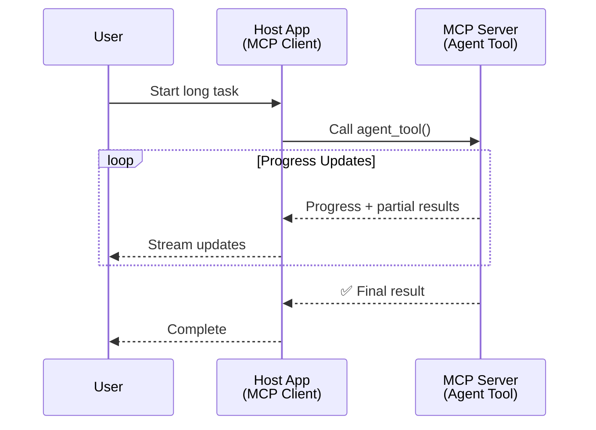
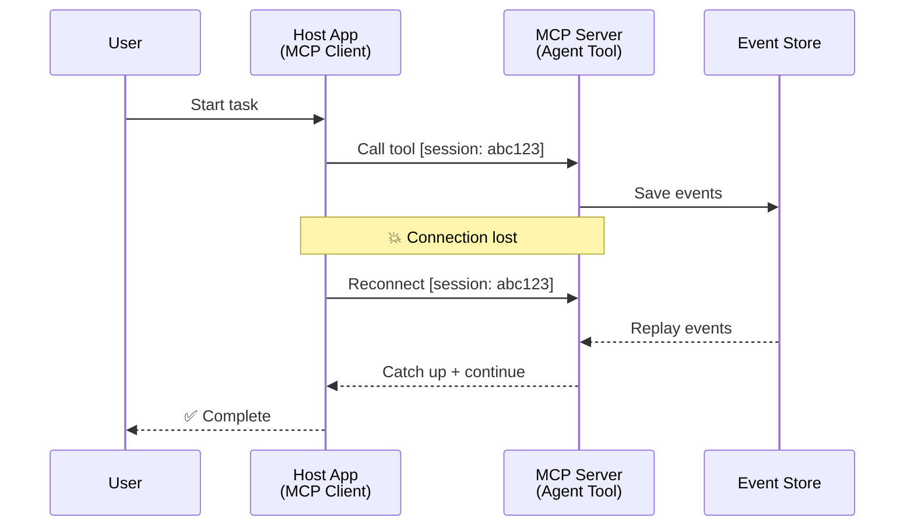
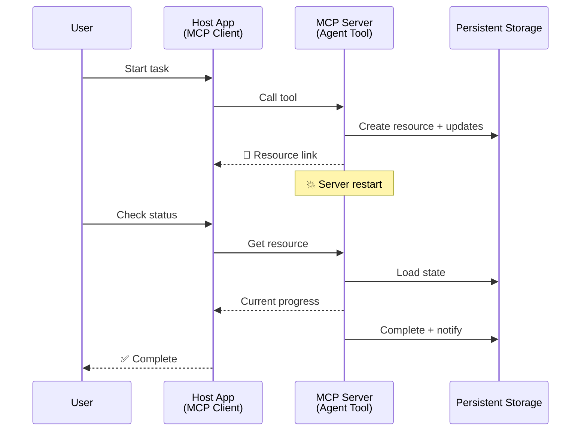
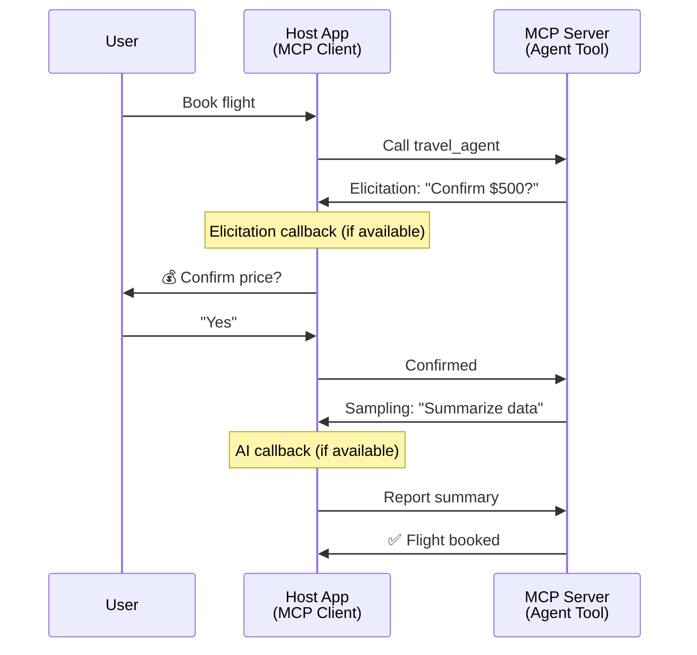

<!--
CO_OP_TRANSLATOR_METADATA:
{
  "original_hash": "5cc6836626047aa055e8960c8484a7d0",
  "translation_date": "2025-07-24T10:17:09+00:00",
  "source_file": "11-mcp/code_samples/mcp-agents/README.md",
  "language_code": "my"
}
-->
# MCP ဖြင့် အေးဂျင့်-မှ-အေးဂျင့် ဆက်သွယ်မှုစနစ်များ တည်ဆောက်ခြင်း

> TL;DR - MCP ပေါ်တွင် Agent2Agent ဆက်သွယ်မှု တည်ဆောက်နိုင်မလား? အဖြေက ဟုတ်ပါတယ်!

MCP သည် "LLMs များအတွက် အကြောင်းအရာပေးခြင်း" ဆိုသည့် မူလရည်မှန်းချက်ထက် အလွန်တိုးတက်လာခဲ့ပါပြီ။ [resumable streams](https://modelcontextprotocol.io/docs/concepts/transports#resumability-and-redelivery), [elicitation](https://modelcontextprotocol.io/specification/2025-06-18/client/elicitation), [sampling](https://modelcontextprotocol.io/specification/2025-06-18/client/sampling) နှင့် [progress](https://modelcontextprotocol.io/specification/2025-06-18/basic/utilities/progress) နှင့် [resources](https://modelcontextprotocol.io/specification/2025-06-18/schema#resourceupdatednotification) တို့အပါအဝင် နောက်ဆုံးတိုးတက်မှုများဖြင့် MCP သည် အေးဂျင့်-မှ-အေးဂျင့် ဆက်သွယ်မှုစနစ်များ တည်ဆောက်ရန် အခိုင်အမာအခြေခံစနစ်တစ်ခုကို ပံ့ပိုးပေးနိုင်ပါပြီ။

## အေးဂျင့်/Tool အကြောင်း အထင်မှားမှု

အေးဂျင့်ဆန်သော အပြုအမူများ (ကြာရှည်စွာ လည်ပတ်နိုင်ခြင်း၊ အလယ်အလတ်တွင် ထပ်မံအချက်အလက်လိုအပ်နိုင်ခြင်း စသည်) ပါဝင်သည့် tools များကို တီထွင်နေသော developer များအနက် MCP သည် မသင့်တော်ကြောင်း ယုံကြည်မှုတစ်ခု ရှိနေသည်။ ၎င်းသည် MCP ၏ tools primitive သည် ရိုးရှင်းသော request-response ပုံစံများကို အစပိုင်းတွင် အာရုံစိုက်ခဲ့သောကြောင့် ဖြစ်သည်။

ဤအမြင်သည် ယနေ့အချိန်တွင် မမှန်တော့ပါ။ MCP specification သည် ကြာရှည်လည်ပတ်နိုင်သော အေးဂျင့်ဆန်သော အပြုအမူများ တည်ဆောက်ရန် လိုအပ်သော စွမ်းရည်များဖြင့် နောက်ဆုံးလများအတွင်း အလွန်တိုးတက်လာခဲ့သည်။

- **Streaming & Partial Results**: လုပ်ဆောင်မှုအတွင်း အချိန်နှင့်တပြေးညီ တိုးတက်မှုများကို အပ်ဒိတ်ပေးခြင်း
- **Resumability**: Client များ disconnect ဖြစ်ပြီးနောက် ပြန်လည်ဆက်သွယ်နိုင်ခြင်း
- **Durability**: Server ပြန်လည်စတင်မှုများအပြီးတွင် ရလဒ်များ ဆက်လက်တည်ရှိခြင်း (ဥပမာ - resource links ဖြင့်)
- **Multi-turn**: လုပ်ဆောင်မှုအတွင်း အပြန်အလှန် အချက်အလက်ရယူခြင်း (elicitation နှင့် sampling)

ဤ features များကို ပေါင်းစပ်၍ MCP protocol ပေါ်တွင် ကြီးမားသော အေးဂျင့်ဆန်သော နှင့် multi-agent applications များကို တည်ဆောက်နိုင်ပါသည်။

အေးဂျင့်ကို MCP server ပေါ်တွင် ရရှိနိုင်သော "tool" အဖြစ် ရည်ညွှန်းပါမည်။ ၎င်းသည် MCP client ကို အကောင်အထည်ဖော်သော host application တစ်ခု ရှိနေပြီး MCP server နှင့် session တစ်ခုကို တည်ဆောက်ကာ အေးဂျင့်ကို ခေါ်နိုင်သည်ကို ဆိုလိုသည်။

## MCP Tool တစ်ခုကို "Agentic" ဖြစ်စေသည့် အချက်များ

အကောင်အထည်ဖော်မှုကို စတင်မပြုမီ ကြာရှည်လည်ပတ်နိုင်သော အေးဂျင့်များကို ပံ့ပိုးရန် လိုအပ်သော အခြေခံစွမ်းရည်များကို သတ်မှတ်လိုက်ပါမည်။

> အေးဂျင့်ကို ကြာရှည်လည်ပတ်နိုင်သော၊ အချိန်နှင့်တပြေးညီ အချက်အလက်များအပေါ် အခြေခံ၍ ပြန်လည်ညှိနှိုင်းနိုင်သော ရှုပ်ထွေးသော လုပ်ငန်းများကို ကိုင်တွယ်နိုင်သော အလိုအလျောက် လုပ်ဆောင်နိုင်သော entity တစ်ခုအဖြစ် သတ်မှတ်ပါမည်။

### 1. Streaming & Partial Results

ရိုးရှင်းသော request-response ပုံစံများသည် ကြာရှည်လည်ပတ်သော လုပ်ငန်းများအတွက် မသင့်တော်ပါ။ အေးဂျင့်များသည် အောက်ပါအချက်များကို ပံ့ပိုးရမည်။

- အချိန်နှင့်တပြေးညီ တိုးတက်မှုအပ်ဒိတ်များ
- အလယ်အလတ်ရလဒ်များ

**MCP Support**: Resource update notifications သည် streaming partial results များကို ပံ့ပိုးပေးနိုင်သည်။ သို့သော် JSON-RPC ၏ 1:1 request/response ပုံစံနှင့် မတူညီမှုများကို ရှောင်ရှားရန် သေချာစွာ ဒီဇိုင်းဆွဲရမည်။

| Feature                    | Use Case                                                                                                                                                                       | MCP Support                                                                                |
| -------------------------- | ------------------------------------------------------------------------------------------------------------------------------------------------------------------------------ | ------------------------------------------------------------------------------------------ |
| Real-time Progress Updates | အသုံးပြုသူသည် codebase migration task တစ်ခုကို တောင်းဆိုသည်။ အေးဂျင့်သည် တိုးတက်မှုကို stream လုပ်ပေးသည် - "10% - Analyzing dependencies... 25% - Converting TypeScript files... 50% - Updating imports..."          | ✅ Progress notifications                                                                  |
| Partial Results            | "Generate a book" task သည် partial results များကို stream လုပ်ပေးသည် - ၁) Story arc outline, ၂) Chapter list, ၃) အချိန်နှင့်တပြေးညီ ပြီးစီးသည့် Chapter များ။ Host သည် အချိန်မရွေး စစ်ဆေး၊ ဖျက်သိမ်း၊ သို့မဟုတ် redirect ပြုလုပ်နိုင်သည်။ | ✅ Notifications can be "extended" to include partial results see proposals on PR 383, 776 |

<div align="center" style="font-style: italic; font-size: 0.95em; margin-bottom: 0.5em;">
<strong>ပုံ ၁:</strong> ဤပုံသည် MCP အေးဂျင့်သည် ကြာရှည်လည်ပတ်သော task တစ်ခုအတွင်း အချိန်နှင့်တပြေးညီ တိုးတက်မှုအပ်ဒိတ်များနှင့် partial results များကို host application သို့ stream လုပ်ပေးပုံကို ဖော်ပြသည်။
</div>



### 2. Resumability

အေးဂျင့်များသည် network ချိတ်ဆက်မှုပြတ်တောက်မှုများကို သက်သာစွာ ကိုင်တွယ်နိုင်ရမည်။

- Client disconnect ဖြစ်ပြီးနောက် ပြန်လည်ဆက်သွယ်နိုင်ခြင်း
- မျှဝေထားသော message များကို ပြန်လည်ပေးပို့နိုင်ခြင်း

**MCP Support**: MCP StreamableHTTP transport သည် session resumption နှင့် message redelivery ကို session IDs နှင့် last event IDs ဖြင့် ပံ့ပိုးပေးသည်။ Server သည် EventStore တစ်ခုကို အကောင်အထည်ဖော်ထားရမည်။ ၎င်းသည် client ပြန်လည်ဆက်သွယ်မှုအတွင်း event replays များကို ပံ့ပိုးပေးသည်။  
Community proposal (PR #975) သည် transport-agnostic resumable streams ကို စူးစမ်းလျက်ရှိသည်။

| Feature      | Use Case                                                                                                                                                   | MCP Support                                                                |
| ------------ | ---------------------------------------------------------------------------------------------------------------------------------------------------------- | -------------------------------------------------------------------------- |
| Resumability | Client သည် ကြာရှည်လည်ပတ်သော task အတွင်း disconnect ဖြစ်သည်။ ပြန်လည်ဆက်သွယ်မှုအတွင်း session သည် ပြတ်တောက်သည့်နေရာမှ seamless ပြန်လည်ဆက်သွယ်နိုင်သည်။ | ✅ StreamableHTTP transport with session IDs, event replay, and EventStore |

<div align="center" style="font-style: italic; font-size: 0.95em; margin-bottom: 0.5em;">
<strong>ပုံ ၂:</strong> ဤပုံသည် MCP ၏ StreamableHTTP transport နှင့် event store သည် session resumption ကို ဘယ်လိုပံ့ပိုးပေးသည်ကို ဖော်ပြသည်။ Client disconnect ဖြစ်ပါက ပြန်လည်ဆက်သွယ်ပြီး ပြတ်တောက်သည့်နေရာမှ task ကို ဆက်လက်လုပ်ဆောင်နိုင်သည်။
</div>



### 3. Durability

ကြာရှည်လည်ပတ်သော အေးဂျင့်များသည် အောက်ပါအချက်များအတွက် persistent state လိုအပ်သည်။

- Server ပြန်လည်စတင်မှုများအပြီးတွင် ရလဒ်များ ဆက်လက်တည်ရှိခြင်း
- Status ကို out-of-band ဖြင့် retrieve ပြုလုပ်နိုင်ခြင်း
- Sessions များအတွင်း တိုးတက်မှု tracking ပြုလုပ်နိုင်ခြင်း

**MCP Support**: MCP သည် tool calls များအတွက် Resource link return type ကို ပံ့ပိုးပေးသည်။ Tool တစ်ခုသည် resource တစ်ခုကို ဖန်တီးပြီး resource link ကို ချက်ချင်းပြန်ပေးနိုင်သည်။ Tool သည် background တွင် task ကို ဆက်လက်လုပ်ဆောင်ပြီး resource ကို update ပြုလုပ်နိုင်သည်။ Client သည် resource ၏ state ကို poll လုပ်၍ partial သို့မဟုတ် full results များကို ရယူနိုင်သည် (server ပေးသော resource updates အပေါ်မူတည်၍) သို့မဟုတ် resource update notifications များကို subscribe လုပ်နိုင်သည်။

| Feature    | Use Case                                                                                                                                        | MCP Support                                                        |
| ---------- | ----------------------------------------------------------------------------------------------------------------------------------------------- | ------------------------------------------------------------------ |
| Durability | Server သည် data migration task အတွင်း crash ဖြစ်သည်။ ရလဒ်များနှင့် တိုးတက်မှုများသည် restart အပြီးတွင် ဆက်လက်တည်ရှိပြီး client သည် status ကို စစ်ဆေးကာ ဆက်လက်လုပ်ဆောင်နိုင်သည်။ | ✅ Resource links with persistent storage and status notifications |

<div align="center" style="font-style: italic; font-size: 0.95em; margin-bottom: 0.5em;">
<strong>ပုံ ၃:</strong> ဤပုံသည် MCP အေးဂျင့်များသည် persistent resources နှင့် status notifications ကို အသုံးပြု၍ ကြာရှည်လည်ပတ်သော task များကို server restart များအပြီးတွင် ဆက်လက်လုပ်ဆောင်နိုင်ပုံကို ဖော်ပြသည်။
</div>



### 4. Multi-Turn Interactions

အေးဂျင့်များသည် လုပ်ဆောင်မှုအတွင်း အလယ်အလတ်တွင် ထပ်မံ input လိုအပ်နိုင်သည်။

- လူ့အတည်ပြုချက် သို့မဟုတ် ရှင်းလင်းချက်
- ရှုပ်ထွေးသော ဆုံးဖြတ်ချက်များအတွက် AI အကူအညီ
- Dynamic parameter ပြင်ဆင်မှု

**MCP Support**: Sampling (AI input အတွက်) နှင့် elicitation (လူ့ input အတွက်) ဖြင့် အပြည့်အဝ ပံ့ပိုးပေးထားသည်။

| Feature                 | Use Case                                                                                                                                     | MCP Support                                           |
| ----------------------- | -------------------------------------------------------------------------------------------------------------------------------------------- | ----------------------------------------------------- |
| Multi-Turn Interactions | ခရီးသွားစာရင်း agent သည် အသုံးပြုသူထံမှ စျေးနှုန်းအတည်ပြုချက်တောင်းဆိုပြီးနောက် AI ကို ခရီးသွားဒေတာကို အကျဉ်းချုပ်ရန် တောင်းဆိုကာ booking transaction ကို ပြီးစီးစေသည်။ | ✅ Elicitation for human input, sampling for AI input |

<div align="center" style="font-style: italic; font-size: 0.95em; margin-bottom: 0.5em;">
<strong>ပုံ ၄:</strong> ဤပုံသည် MCP အေးဂျင့်များသည် လုပ်ဆောင်မှုအတွင်း လူ့ input သို့မဟုတ် AI အကူအညီကို interactively ရယူနိုင်ပုံကို ဖော်ပြသည်။
</div>



## MCP ပေါ်တွင် ကြာရှည်လည်ပတ်သော အေးဂျင့်များကို အကောင်အထည်ဖော်ခြင်း - Code အကျဉ်းချုပ်

ဤဆောင်းပါးတွင် [code repository](https://github.com/victordibia/ai-tutorials/tree/main/MCP%20Agents) တစ်ခုကို ပံ့ပိုးပေးထားပြီး MCP Python SDK နှင့် StreamableHTTP transport ကို အသုံးပြု၍ ကြာရှည်လည်ပတ်သော အေးဂျင့်များကို အကောင်အထည်ဖော်ထားသည်။ ၎င်းသည် MCP ၏ စွမ်းရည်များကို ပေါင်းစပ်၍ အေးဂျင့်ဆန်သော အပြုအမူများကို ဖော်ဆောင်ပုံကို ပြသသည်။

အထူးသဖြင့် server တွင် အဓိကအေးဂျင့် tools နှစ်ခုကို အကောင်အထည်ဖော်ထားသည် -

- **Travel Agent** - elicitation ဖြင့် စျေးနှုန်းအတည်ပြုချက်ကို simulate ပြုလုပ်သည့် ခရီးသွားစာရင်းဝန်ဆောင်မှု
- **Research Agent** - sampling ဖြင့် AI-assisted အကျဉ်းချုပ်များကို ပြုလုပ်သည့် သုတေသနလုပ်ငန်း

### အရေးကြီးသော အကောင်အထည်ဖော်မှု အယူအဆများ

Server-side agent implementation နှင့် client-side host handling အတွက် အောက်ပါအပိုင်းများကို ဖော်ပြထားသည် -

#### Streaming & Progress Updates - လုပ်ဆောင်မှုအခြေအနေကို အချိန်နှင့်တပြေးညီ ပြသခြင်း

```python
# From server/server.py - Travel agent sending progress updates
for i, step in enumerate(steps):
    await ctx.session.send_progress_notification(
        progress_token=ctx.request_id,
        progress=i * 25,
        total=100,
        message=step,
        related_request_id=str(ctx.request_id)
    )
    await anyio.sleep(2)  # Simulate work

# Alternative: Log messages for detailed step-by-step updates
await ctx.session.send_log_message(
    level="info",
    data=f"Processing step {current_step}/{steps} ({progress_percent}%)",
    logger="long_running_agent",
    related_request_id=ctx.request_id,
)
```

#### Elicitation - အသုံးပြုသူ input တောင်းဆိုခြင်း

```python
# From server/server.py - Travel agent requesting price confirmation
elicit_result = await ctx.session.elicit(
    message=f"Please confirm the estimated price of $1200 for your trip to {destination}",
    requestedSchema=PriceConfirmationSchema.model_json_schema(),
    related_request_id=ctx.request_id,
)

if elicit_result and elicit_result.action == "accept":
    # Continue with booking
    logger.info(f"User confirmed price: {elicit_result.content}")
elif elicit_result and elicit_result.action == "decline":
    # Cancel the booking
    booking_cancelled = True
```

#### Sampling - AI အကူအညီ တောင်းဆိုခြင်း

```python
# From server/server.py - Research agent requesting AI summary
sampling_result = await ctx.session.create_message(
    messages=[
        SamplingMessage(
            role="user",
            content=TextContent(type="text", text=f"Please summarize the key findings for research on: {topic}")
        )
    ],
    max_tokens=100,
    related_request_id=ctx.request_id,
)

if sampling_result and sampling_result.content:
    if sampling_result.content.type == "text":
        sampling_summary = sampling_result.content.text
        logger.info(f"Received sampling summary: {sampling_summary}")
```

#### Resumability - Disconnect ဖြစ်ပြီးနောက် session continuity

```python
# From server/event_store.py - Simple in-memory event store
class SimpleEventStore(EventStore):
    def __init__(self):
        self._events: list[tuple[StreamId, EventId, JSONRPCMessage]] = []
        self._event_id_counter = 0

    async def store_event(self, stream_id: StreamId, message: JSONRPCMessage) -> EventId:
        """Store an event and return its ID."""
        self._event_id_counter += 1
        event_id = str(self._event_id_counter)
        self._events.append((stream_id, event_id, message))
        return event_id

    async def replay_events_after(self, last_event_id: EventId, send_callback: EventCallback) -> StreamId | None:
        """Replay events after the specified ID for resumption."""
        # Find events after the last known event and replay them
        for _, event_id, message in self._events[start_index:]:
            await send_callback(EventMessage(message, event_id))

# From server/server.py - Passing event store to session manager
def create_server_app(event_store: Optional[EventStore] = None) -> Starlette:
    server = ResumableServer()

    # Create session manager with event store for resumption
    session_manager = StreamableHTTPSessionManager(
        app=server,
        event_store=event_store,  # Event store enables session resumption
        json_response=False,
        security_settings=security_settings,
    )

    return Starlette(routes=[Mount("/mcp", app=session_manager.handle_request)])

# Usage: Initialize with event store
event_store = SimpleEventStore()
app = create_server_app(event_store)
```

### Code ဖိုင်များ

- **`server/server.py`** - Resumable MCP server
- **`client/client.py`** - Interactive host application
- **`server/event_store.py`** - Event store implementation

## Multi-Agent Communication သို့ တိုးချဲ့ခြင်း

Host application ကို ပိုမိုထက်မြက်စေရန် အောက်ပါအချက်များကို ထည့်သွင်းနိုင်သည် -

- Intelligent Task Decomposition
- Multi-Server Coordination
- Task State Management
- Resilience & Retries
- Result Synthesis

## နိဂုံးချုပ်

MCP ၏ တိုးတက်မှုများသည် အေးဂျင့်-မှ-အေးဂျင့် ဆက်သွယ်မှုများကို ပိုမိုလွယ်ကူစေသည်။

## စတင်လိုက်ပါ

### 1. Demo ကို Run လုပ်ပါ

```bash
# Start the server with event store for resumption
python -m server.server --port 8006

# In another terminal, run the interactive client
python -m client.client --url http://127.0.0.1:8006/mcp
```

### 2. Resumption Capabilities ကို စမ်းသပ်ပါ

### 3. Explore နှင့် Extend

MCP သည် intelligent agent behaviors များကို ပံ့ပိုးပေးသည့် tool-based simplicity ကို ထိန်းသိမ်းထားသည်။

**ဝက်ဘ်ဆိုက်မှတ်ချက်**:  
ဤစာရွက်စာတမ်းကို AI ဘာသာပြန်ဝန်ဆောင်မှု [Co-op Translator](https://github.com/Azure/co-op-translator) ကို အသုံးပြု၍ ဘာသာပြန်ထားပါသည်။ ကျွန်ုပ်တို့သည် တိကျမှန်ကန်မှုအတွက် ကြိုးစားနေပါသော်လည်း၊ အလိုအလျောက်ဘာသာပြန်ဆိုမှုများတွင် အမှားများ သို့မဟုတ် မတိကျမှုများ ပါဝင်နိုင်ပါသည်။ မူရင်းစာရွက်စာတမ်းကို ၎င်း၏ မူလဘာသာစကားဖြင့် အာဏာတည်သောရင်းမြစ်အဖြစ် သတ်မှတ်သင့်ပါသည်။ အရေးကြီးသော အချက်အလက်များအတွက် လူကူးဘာသာပြန်ဝန်ဆောင်မှုကို အကြံပြုပါသည်။ ဤဘာသာပြန်ကို အသုံးပြုခြင်းမှ ဖြစ်ပေါ်လာသော နားလည်မှုမှားများ သို့မဟုတ် အဓိပ္ပာယ်မှားများအတွက် ကျွန်ုပ်တို့သည် တာဝန်မယူပါ။ 