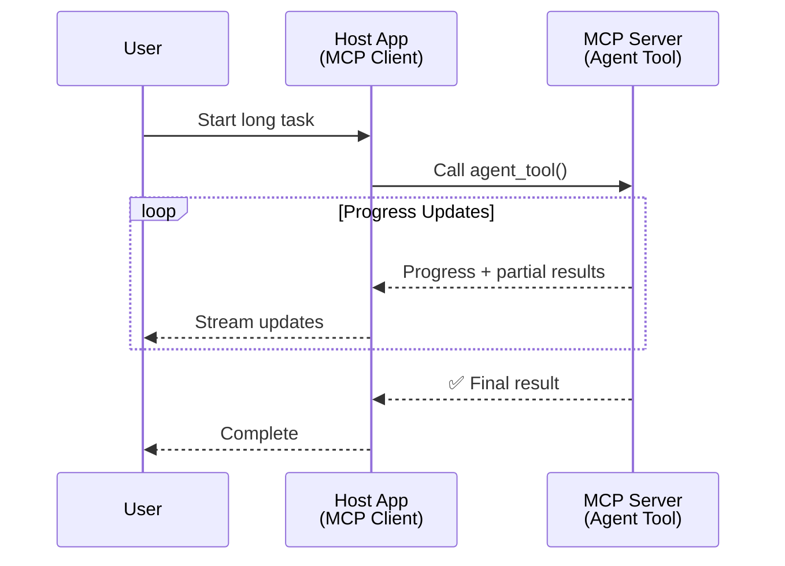
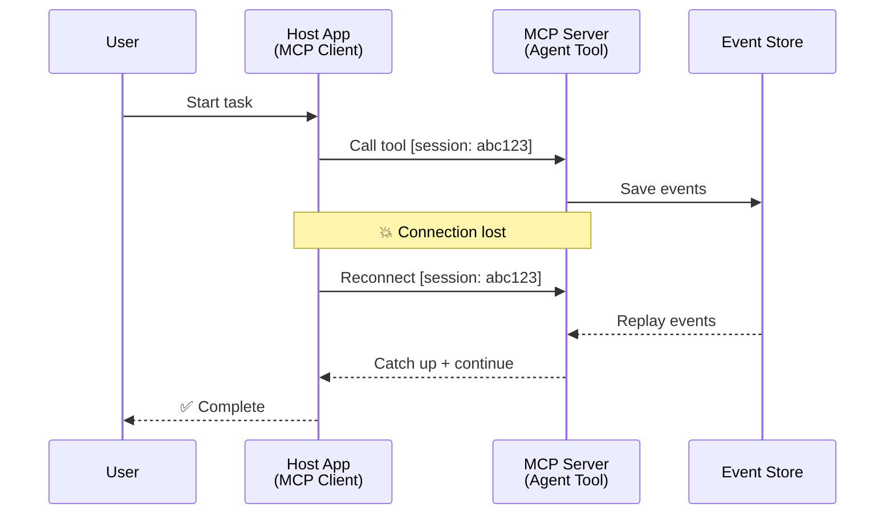
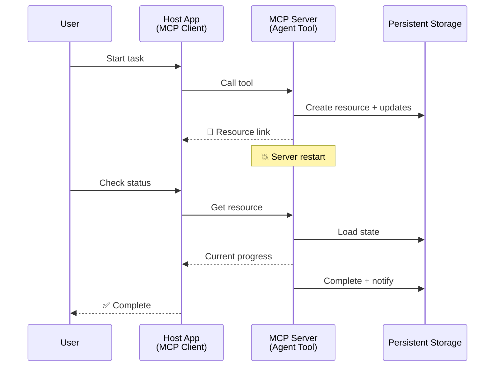
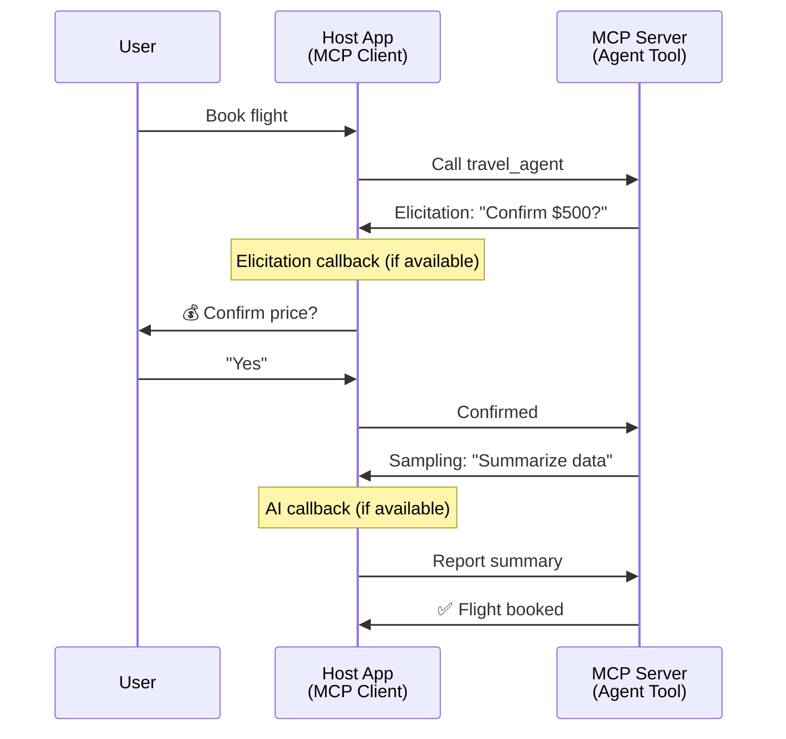
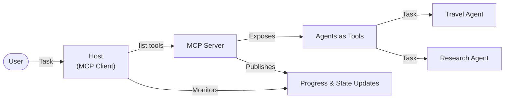

<!--
CO_OP_TRANSLATOR_METADATA:
{
  "original_hash": "5cc6836626047aa055e8960c8484a7d0",
  "translation_date": "2025-08-21T13:43:03+00:00",
  "source_file": "11-mcp/code_samples/mcp-agents/README.md",
  "language_code": "my"
}
-->
# MCP ဖြင့် Agent-to-Agent ဆက်သွယ်မှုစနစ်များ တည်ဆောက်ခြင်း

> TL;DR - MCP ပေါ်တွင် Agent2Agent ဆက်သွယ်မှု တည်ဆောက်နိုင်ပါသလား? အတိအကျ - တည်ဆောက်နိုင်ပါသည်!

MCP သည် "LLMs များအတွက် အကြောင်းအရာပေးခြင်း" ဆိုသော မူလရည်ရွယ်ချက်ထက် အလွန်တိုးတက်လာခဲ့ပါသည်။ [resumable streams](https://modelcontextprotocol.io/docs/concepts/transports#resumability-and-redelivery), [elicitation](https://modelcontextprotocol.io/specification/2025-06-18/client/elicitation), [sampling](https://modelcontextprotocol.io/specification/2025-06-18/client/sampling), နှင့် [progress](https://modelcontextprotocol.io/specification/2025-06-18/basic/utilities/progress) နှင့် [resources](https://modelcontextprotocol.io/specification/2025-06-18/schema#resourceupdatednotification) အကြောင်းကြားချက်များအပါအဝင် နောက်ဆုံးတိုးတက်မှုများဖြင့် MCP သည် အဆင့်မြင့် agent-to-agent ဆက်သွယ်မှုစနစ်များ တည်ဆောက်ရန် အခြေခံအုတ်မြစ်တစ်ခုကို ပံ့ပိုးပေးနိုင်ပါသည်။

## Agent/Tool အထင်မှား

Agentic အပြုအမူများ (ကြာရှည်လည်ပတ်မှု, အလယ်အလတ်တွင် ထပ်မံ input လိုအပ်နိုင်မှု စသည်) ရှိသော tools များကို စမ်းသပ်နေသော developer များအနက် MCP သည် မသင့်လျော်ကြောင်း အထင်မှားတစ်ခု ရှိနေသည်။ အဓိကအကြောင်းမှာ MCP ၏ tools primitive မူလဥပမာများသည် ရိုးရှင်းသော request-response ပုံစံများကို အာရုံစိုက်ထားသောကြောင့် ဖြစ်ပါသည်။

ဤအထင်မှားသည် ယခုအခါ မသင့်လျော်တော့ပါ။ MCP specification သည် နောက်ဆုံးလများအတွင်း agentic အပြုအမူများ တည်ဆောက်ရန် gap ကို ဖြည့်ဆည်းနိုင်သော စွမ်းရည်များဖြင့် အလွန်တိုးတက်လာခဲ့ပါသည်။

- **Streaming & Partial Results**: လည်ပတ်မှုအတွင်း အချိန်နှင့်တပြေးညီ အခြေအနေ update များ
- **Resumability**: Client များ disconnect ဖြစ်ပြီးနောက် ပြန်လည်ဆက်သွယ်နိုင်မှု
- **Durability**: Server restart ဖြစ်ပါက ရလဒ်များ မပျောက်ဆုံးခြင်း (ဥပမာ - resource links)
- **Multi-turn**: Elicitation နှင့် sampling ဖြင့် လည်ပတ်မှုအတွင်း interactive input

ဤ features များကို ပေါင်းစပ်၍ MCP protocol ပေါ်တွင် အဆင့်မြင့် agentic နှင့် multi-agent application များကို တည်ဆောက်နိုင်ပါသည်။

အညွှန်းအနေဖြင့် agent ကို MCP server ပေါ်တွင် ရရှိနိုင်သော "tool" အဖြစ် ရည်ညွှန်းပါမည်။ ဤသည်မှာ MCP client ကို implement လုပ်သော host application တစ်ခု ရှိနေသည်ကို ဆိုလိုပြီး MCP server နှင့် session တစ်ခုကို တည်ဆောက်ကာ agent ကို ခေါ်နိုင်သည်။

## MCP Tool ကို "Agentic" ဖြစ်စေသော အချက်များ

Implementation ကို စတင်မပြုမီ ကြာရှည်လည်ပတ်နိုင်သော agents များကို ပံ့ပိုးရန် လိုအပ်သော infrastructure စွမ်းရည်များကို သတ်မှတ်ပါမည်။

> Agent ကို ကြာရှည်လည်ပတ်နိုင်သော အလိုအလျောက် လုပ်ဆောင်နိုင်သော entity အဖြစ် သတ်မှတ်ပါမည်။ ဤ agent သည် အချိန်နှင့်တပြေးညီ feedback အပေါ် အခြေခံ၍ အကြိမ်ကြိမ် အပြောင်းအလဲများ လိုအပ်နိုင်သော အလုပ်များကို လုပ်ဆောင်နိုင်ရမည်။

### 1. Streaming & Partial Results

ရိုးရှင်းသော request-response ပုံစံများသည် ကြာရှည်လည်ပတ်မှုအတွက် မသင့်လျော်ပါ။ Agents များသည် အောက်ပါအချက်များကို ပံ့ပိုးရမည်။

- အချိန်နှင့်တပြေးညီ progress update များ
- အလယ်အလတ်ရလဒ်များ

**MCP Support**: Resource update notifications သည် streaming partial results ကို enable လုပ်ပေးနိုင်သည်။ သို့သော် JSON-RPC ၏ 1:1 request/response model နှင့် conflict မဖြစ်စေရန် သေချာစွာ design လုပ်ရန် လိုအပ်ပါသည်။

| Feature                    | Use Case                                                                                                                                                                       | MCP Support                                                                                |
| -------------------------- | ------------------------------------------------------------------------------------------------------------------------------------------------------------------------------ | ------------------------------------------------------------------------------------------ |
| Real-time Progress Updates | User သည် codebase migration task တစ်ခုကို request လုပ်သည်။ Agent သည် progress ကို stream လုပ်သည် - "10% - Analyzing dependencies... 25% - Converting TypeScript files... 50% - Updating imports..."          | ✅ Progress notifications                                                                  |
| Partial Results            | "Generate a book" task သည် partial results ကို stream လုပ်သည်။ ဥပမာ - 1) Story arc outline, 2) Chapter list, 3) အချိန်နှင့်တပြေးညီ ပြီးစီးသော chapter များ။ Host သည် inspection, cancellation, သို့မဟုတ် redirection ပြုလုပ်နိုင်သည်။ | ✅ Notifications ကို "extended" လုပ်၍ partial results ထည့်သွင်းနိုင်သည်။ PR 383, 776 အပေါ် အဆိုပြုချက်များကို ကြည့်ပါ။ |

<div align="center" style="font-style: italic; font-size: 0.95em; margin-bottom: 0.5em;">
<strong>ပုံ 1:</strong> MCP agent သည် ကြာရှည်လည်ပတ်မှုအတွင်း host application သို့ အချိန်နှင့်တပြေးညီ progress update များနှင့် partial results များကို stream လုပ်ပေးပုံကို ဤ diagram တွင် ဖော်ပြထားသည်။
</div>



### 2. Resumability

Agents များသည် network interruption များကို gracefully handle လုပ်နိုင်ရမည်။

- Client disconnect ဖြစ်ပြီးနောက် ပြန်လည်ဆက်သွယ်နိုင်မှု
- Disconnect ဖြစ်သည့်နေရာမှ ဆက်လက်လုပ်ဆောင်နိုင်မှု (message redelivery)

**MCP Support**: MCP StreamableHTTP transport သည် session IDs နှင့် last event IDs ဖြင့် session resumption နှင့် message redelivery ကို ပံ့ပိုးပေးပါသည်။ Server သည် EventStore ကို implement လုပ်ပြီး client reconnect ဖြစ်ပါက event replays ကို enable လုပ်ပေးရမည်။

| Feature      | Use Case                                                                                                                                                   | MCP Support                                                                |
| ------------ | ---------------------------------------------------------------------------------------------------------------------------------------------------------- | -------------------------------------------------------------------------- |
| Resumability | Client disconnect ဖြစ်သည့်အချိန်တွင် ကြာရှည်လည်ပတ်မှု task တစ်ခုရှိနေသည်။ Client ပြန်လည်ဆက်သွယ်ပါက session သည် missed events များကို replay လုပ်ပြီး seamless ဆက်လက်လုပ်ဆောင်နိုင်သည်။ | ✅ StreamableHTTP transport with session IDs, event replay, and EventStore |

<div align="center" style="font-style: italic; font-size: 0.95em; margin-bottom: 0.5em;">
<strong>ပုံ 2:</strong> MCP ၏ StreamableHTTP transport နှင့် event store သည် session resumption ကို enable လုပ်ပေးပုံကို ဤ diagram တွင် ဖော်ပြထားသည်။ Client disconnect ဖြစ်ပါက ပြန်လည်ဆက်သွယ်ပြီး missed events များကို replay လုပ်ကာ task ကို ဆက်လက်လုပ်ဆောင်နိုင်သည်။
</div>



### 3. Durability

ကြာရှည်လည်ပတ်မှု agents များသည် persistent state ရှိရမည်။

- Server restart ဖြစ်ပါက ရလဒ်များ မပျောက်ဆုံးခြင်း
- Status ကို out-of-band မှ retrieve လုပ်နိုင်ခြင်း
- Session များအတွင်း progress tracking

**MCP Support**: MCP သည် tool calls အတွက် Resource link return type ကို ပံ့ပိုးပေးပါသည်။ Tool သည် resource တစ်ခုကို ဖန်တီးပြီး resource link ကို ချက်ချင်း return ပြန်ပေးသော pattern ကို design လုပ်နိုင်သည်။ Tool သည် background မှ task ကို ဆက်လက်လုပ်ဆောင်ပြီး resource ကို update လုပ်နိုင်သည်။ Client သည် resource ၏ state ကို poll လုပ်ကာ partial သို့မဟုတ် full results ကို ရယူနိုင်သည်။

| Feature    | Use Case                                                                                                                                        | MCP Support                                                        |
| ---------- | ----------------------------------------------------------------------------------------------------------------------------------------------- | ------------------------------------------------------------------ |
| Durability | Server crash ဖြစ်သည့်အချိန်တွင် data migration task တစ်ခုရှိနေသည်။ Results နှင့် progress သည် restart ဖြစ်ပါက မပျောက်ဆုံးဘဲ client သည် status ကို စစ်ဆေးပြီး persistent resource မှ ဆက်လက်လုပ်ဆောင်နိုင်သည်။ | ✅ Resource links with persistent storage and status notifications |

<div align="center" style="font-style: italic; font-size: 0.95em; margin-bottom: 0.5em;">
<strong>ပုံ 3:</strong> MCP agents သည် persistent resources နှင့် status notifications ကို အသုံးပြုကာ server restart ဖြစ်ပါက ကြာရှည်လည်ပတ်မှု task များကို ဆက်လက်လုပ်ဆောင်နိုင်ပုံကို ဤ diagram တွင် ဖော်ပြထားသည်။
</div>



### 4. Multi-Turn Interactions

Agents များသည် လည်ပတ်မှုအတွင်း အပို input များကို လိုအပ်နိုင်သည်။

- လူ့ clarification သို့မဟုတ် အတည်ပြုချက်
- AI အကူအညီ
- Dynamic parameter ပြင်ဆင်မှု

**MCP Support**: Sampling (AI input အတွက်) နှင့် elicitation (လူ့ input အတွက်) ဖြင့် အပြည့်အဝ ပံ့ပိုးထားသည်။

| Feature                 | Use Case                                                                                                                                     | MCP Support                                           |
| ----------------------- | -------------------------------------------------------------------------------------------------------------------------------------------- | ----------------------------------------------------- |
| Multi-Turn Interactions | Travel booking agent သည် user မှ price အတည်ပြုချက်ကို request လုပ်ပြီးနောက် AI ကို travel data ကို အကျဉ်းချုပ်ရန် request လုပ်ကာ booking transaction ကို ပြီးစီးစေသည်။ | ✅ Elicitation for human input, sampling for AI input |

<div align="center" style="font-style: italic; font-size: 0.95em; margin-bottom: 0.5em;">
<strong>ပုံ 4:</strong> MCP agents သည် လည်ပတ်မှုအတွင်း လူ့ input ကို request လုပ်ခြင်း သို့မဟုတ် AI အကူအညီကို request လုပ်ခြင်းဖြင့် complex workflows ကို ပံ့ပိုးပေးပုံကို ဤ diagram တွင် ဖော်ပြထားသည်။
</div>



## MCP ပေါ်တွင် ကြာရှည်လည်ပတ်မှု Agents များကို တည်ဆောက်ခြင်း - Code အကျဉ်းချုပ်

ဤဆောင်းပါးတွင် [code repository](https://github.com/victordibia/ai-tutorials/tree/main/MCP%20Agents) တစ်ခုကို ပံ့ပိုးပေးထားပြီး MCP Python SDK နှင့် StreamableHTTP transport ကို အသုံးပြုကာ session resumption နှင့် message redelivery ကို implement လုပ်ထားသည်။ Implementation သည် MCP ၏ စွမ်းရည်များကို ပေါင်းစပ်ကာ sophisticated agent-like behaviors ကို enable လုပ်ပေးပုံကို ပြသထားသည်။

### Key Implementation Concepts

#### Streaming & Progress Updates - လည်ပတ်မှုအခြေအနေ

```python
# From server/server.py - Travel agent sending progress updates
for i, step in enumerate(steps):
    await ctx.session.send_progress_notification(
        progress_token=ctx.request_id,
        progress=i * 25,
        total=100,
        message=step,
        related_request_id=str(ctx.request_id)
    )
    await anyio.sleep(2)  # Simulate work

# Alternative: Log messages for detailed step-by-step updates
await ctx.session.send_log_message(
    level="info",
    data=f"Processing step {current_step}/{steps} ({progress_percent}%)",
    logger="long_running_agent",
    related_request_id=ctx.request_id,
)
```

#### Elicitation - User Input ကို Request လုပ်ခြင်း

```python
# From server/server.py - Travel agent requesting price confirmation
elicit_result = await ctx.session.elicit(
    message=f"Please confirm the estimated price of $1200 for your trip to {destination}",
    requestedSchema=PriceConfirmationSchema.model_json_schema(),
    related_request_id=ctx.request_id,
)

if elicit_result and elicit_result.action == "accept":
    # Continue with booking
    logger.info(f"User confirmed price: {elicit_result.content}")
elif elicit_result and elicit_result.action == "decline":
    # Cancel the booking
    booking_cancelled = True
```

#### Sampling - AI အကူအညီကို Request လုပ်ခြင်း

```python
# From server/server.py - Research agent requesting AI summary
sampling_result = await ctx.session.create_message(
    messages=[
        SamplingMessage(
            role="user",
            content=TextContent(type="text", text=f"Please summarize the key findings for research on: {topic}")
        )
    ],
    max_tokens=100,
    related_request_id=ctx.request_id,
)

if sampling_result and sampling_result.content:
    if sampling_result.content.type == "text":
        sampling_summary = sampling_result.content.text
        logger.info(f"Received sampling summary: {sampling_summary}")
```

#### Resumability - Session Continuity

```python
# From server/event_store.py - Simple in-memory event store
class SimpleEventStore(EventStore):
    def __init__(self):
        self._events: list[tuple[StreamId, EventId, JSONRPCMessage]] = []
        self._event_id_counter = 0

    async def store_event(self, stream_id: StreamId, message: JSONRPCMessage) -> EventId:
        """Store an event and return its ID."""
        self._event_id_counter += 1
        event_id = str(self._event_id_counter)
        self._events.append((stream_id, event_id, message))
        return event_id

    async def replay_events_after(self, last_event_id: EventId, send_callback: EventCallback) -> StreamId | None:
        """Replay events after the specified ID for resumption."""
        # Find events after the last known event and replay them
        for _, event_id, message in self._events[start_index:]:
            await send_callback(EventMessage(message, event_id))

# From server/server.py - Passing event store to session manager
def create_server_app(event_store: Optional[EventStore] = None) -> Starlette:
    server = ResumableServer()

    # Create session manager with event store for resumption
    session_manager = StreamableHTTPSessionManager(
        app=server,
        event_store=event_store,  # Event store enables session resumption
        json_response=False,
        security_settings=security_settings,
    )

    return Starlette(routes=[Mount("/mcp", app=session_manager.handle_request)])

# Usage: Initialize with event store
event_store = SimpleEventStore()
app = create_server_app(event_store)
```

### Code Organization



## Multi-Agent Communication သို့ တိုးချဲ့ခြင်း

Host application ကို intelligent orchestrator အဖြစ် တိုးချဲ့ကာ distributed agent capabilities ကို coordinate လုပ်နိုင်သည်။

## နိဂုံး

MCP ၏ တိုးတက်လာသော စွမ်းရည်များသည် agent-to-agent ဆက်သွယ်မှုများကို enable လုပ်ပေးနိုင်သည်။

**ဝက်ဘ်ဆိုက်မှတ်ချက်**:  
ဤစာရွက်စာတမ်းကို AI ဘာသာပြန်ဝန်ဆောင်မှု [Co-op Translator](https://github.com/Azure/co-op-translator) ကို အသုံးပြု၍ ဘာသာပြန်ထားပါသည်။ ကျွန်ုပ်တို့သည် တိကျမှန်ကန်မှုအတွက် ကြိုးစားနေပါသော်လည်း၊ အလိုအလျောက်ဘာသာပြန်ဆိုမှုများတွင် အမှားများ သို့မဟုတ် မမှန်ကန်မှုများ ပါဝင်နိုင်သည်ကို သတိပြုပါ။ မူလဘာသာစကားဖြင့် ရေးသားထားသော စာရွက်စာတမ်းကို အာဏာတည်သော ရင်းမြစ်အဖြစ် သတ်မှတ်သင့်ပါသည်။ အရေးကြီးသော အချက်အလက်များအတွက် လူသားပညာရှင်များမှ ပြုလုပ်သော ပရော်ဖက်ရှင်နယ်ဘာသာပြန်ဆိုမှုကို အကြံပြုပါသည်။ ဤဘာသာပြန်ဆိုမှုကို အသုံးပြုခြင်းမှ ဖြစ်ပေါ်လာသော နားလည်မှုမှားများ သို့မဟုတ် အဓိပ္ပာယ်မှားများအတွက် ကျွန်ုပ်တို့သည် တာဝန်မယူပါ။