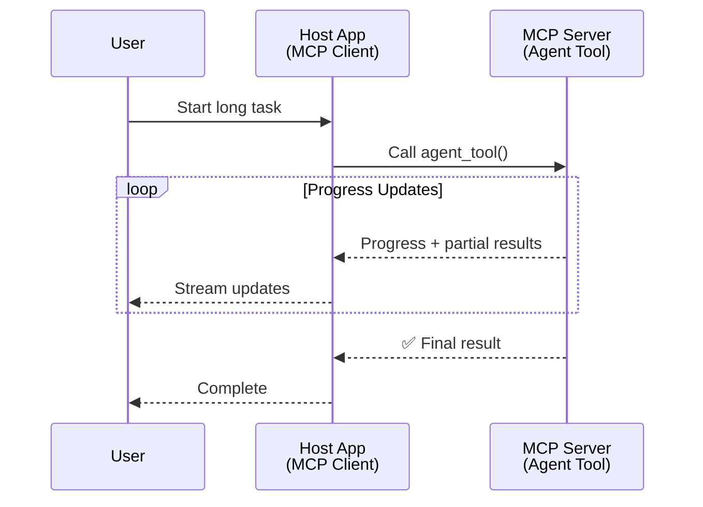
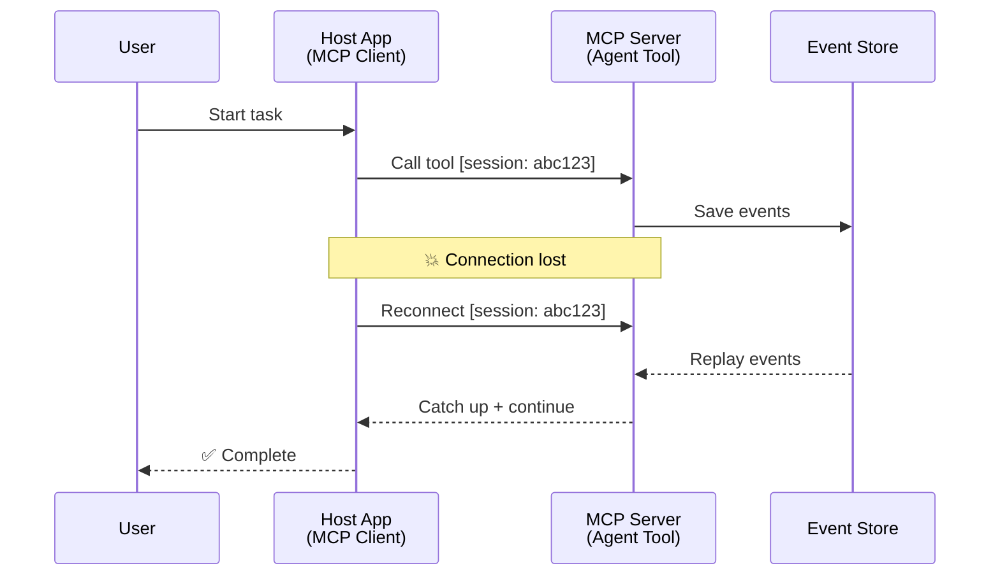
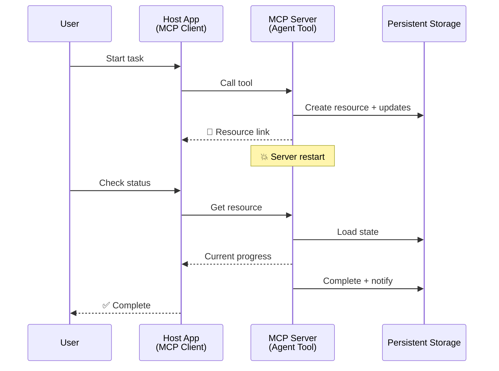
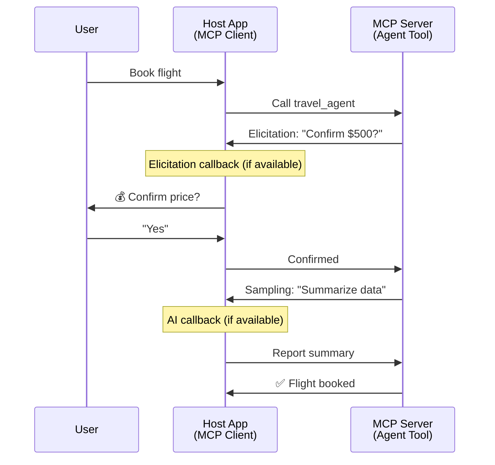

<!--
CO_OP_TRANSLATOR_METADATA:
{
  "original_hash": "5cc6836626047aa055e8960c8484a7d0",
  "translation_date": "2025-07-24T08:44:01+00:00",
  "source_file": "11-mcp/code_samples/mcp-agents/README.md",
  "language_code": "my"
}
-->
# MCP ဖြင့် အေးဂျင့်-မှ-အေးဂျင့် ဆက်သွယ်မှုစနစ်များ တည်ဆောက်ခြင်း

> TL;DR - MCP ပေါ်တွင် Agent2Agent ဆက်သွယ်မှု တည်ဆောက်နိုင်မလား? အဖြေက ဟုတ်တယ်!

MCP သည် "LLMs များအတွက် အကြောင်းအရာပေးခြင်း" ဆိုသည့် မူလရည်ရွယ်ချက်ထက် အလွန်တိုးတက်လာပြီဖြစ်သည်။ [resumable streams](https://modelcontextprotocol.io/docs/concepts/transports#resumability-and-redelivery), [elicitation](https://modelcontextprotocol.io/specification/2025-06-18/client/elicitation), [sampling](https://modelcontextprotocol.io/specification/2025-06-18/client/sampling), နှင့် [progress](https://modelcontextprotocol.io/specification/2025-06-18/basic/utilities/progress) နှင့် [resources](https://modelcontextprotocol.io/specification/2025-06-18/schema#resourceupdatednotification) အပါအဝင် နောက်ဆုံးတိုးတက်မှုများဖြင့် MCP သည် အေးဂျင့်-မှ-အေးဂျင့် ဆက်သွယ်မှုစနစ်များ တည်ဆောက်ရန် အခိုင်အမာအခြေခံစနစ်တစ်ခုကို ပံ့ပိုးပေးနိုင်ပါပြီ။

## အေးဂျင့်/Tool အကြောင်း အထင်မှားမှု

အေးဂျင့်ဆန်သော အပြုအမူများ (ကြာရှည်စွာ လည်ပတ်နိုင်ခြင်း၊ အလယ်အလတ်တွင် ထပ်မံအချက်အလက်လိုအပ်နိုင်ခြင်း စသည်) ပါဝင်သော tools များကို တီထွင်နေသော developer များများလာသည်နှင့်အမျှ MCP သည် မသင့်တော်ကြောင်း အထင်မှားမှုတစ်ခု ရှိနေသည်။ အဓိကအကြောင်းမှာ MCP ၏ tools primitive ၏ မူလဥပမာများသည် ရိုးရှင်းသော request-response ပုံစံများကို အခြေခံထားခြင်းဖြစ်သည်။

ဤအမြင်သည် ယနေ့အချိန်တွင် မမှန်တော့ပါ။ MCP specification သည် ကြာရှည်လည်ပတ်နိုင်သော အေးဂျင့်ဆန်သော အပြုအမူများ တည်ဆောက်ရန် လိုအပ်သော စွမ်းရည်များဖြင့် နောက်ဆုံးလများအတွင်း အလွန်တိုးတက်လာပြီဖြစ်သည်-

- **Streaming & Partial Results**: လည်ပတ်မှုအတွင်း အချိန်နှင့်တပြေးညီ တိုးတက်မှုများကို အပ်ဒိတ်ပေးခြင်း
- **Resumability**: Client များသည် ချိတ်ဆက်မှုပြတ်တောက်ပြီးနောက် ပြန်လည်ဆက်သွယ်နိုင်ခြင်း
- **Durability**: Results များသည် server ပြန်လည်စတင်မှုများကို ရှင်သန်နိုင်ခြင်း (ဥပမာ- resource links ဖြင့်)
- **Multi-turn**: လည်ပတ်မှုအတွင်း interactive input များကို elicitation နှင့် sampling ဖြင့် လက်ခံနိုင်ခြင်း

ဤ features များကို ပေါင်းစပ်၍ MCP protocol ပေါ်တွင် ကြီးမားသော အေးဂျင့်ဆန်သော နှင့် multi-agent applications များကို တည်ဆောက်နိုင်ပါသည်။

အညွှန်းအနေဖြင့် MCP server ပေါ်တွင် ရရှိနိုင်သော "tool" တစ်ခုအဖြစ် အေးဂျင့်ကို ရည်ညွှန်းပါမည်။ ၎င်းသည် MCP client တစ်ခုကို အကောင်အထည်ဖော်ထားသော host application တစ်ခု ရှိနေသည်ကို ဆိုလိုသည်။ ၎င်း client သည် MCP server နှင့် session တစ်ခုကို တည်ဆောက်ပြီး အေးဂျင့်ကို ခေါ်နိုင်သည်။

## MCP Tool တစ်ခုကို "Agentic" ဖြစ်စေသည့် အချက်များ

အကောင်အထည်ဖော်မှုကို စတင်မပြုမီ ကြာရှည်လည်ပတ်နိုင်သော အေးဂျင့်များကို ပံ့ပိုးရန် လိုအပ်သော အခြေခံအဆောက်အအုံစွမ်းရည်များကို သတ်မှတ်လိုက်ပါမည်။

> အေးဂျင့်ကို ကြာရှည်လည်ပတ်နိုင်သော၊ အချိန်နှင့်တပြေးညီ အချက်အလက်များအပေါ် အခြေခံ၍ ပြန်လည်ညှိနှိုင်းမှုများ လိုအပ်နိုင်သော ရှုပ်ထွေးသော တာဝန်များကို ကိုင်တွယ်နိုင်သော entity တစ်ခုအဖြစ် သတ်မှတ်ပါမည်။

### 1. Streaming & Partial Results

ရိုးရှင်းသော request-response ပုံစံများသည် ကြာရှည်လည်ပတ်မှုများအတွက် မသင့်တော်ပါ။ အေးဂျင့်များသည် အောက်ပါအချက်များကို ပံ့ပိုးရမည်-

- အချိန်နှင့်တပြေးညီ တိုးတက်မှုအပ်ဒိတ်များ
- အလယ်အလတ်ရလဒ်များ

**MCP Support**: Resource update notifications သည် streaming partial results များကို ပံ့ပိုးပေးနိုင်သည်။ သို့သော် JSON-RPC ၏ 1:1 request/response ပုံစံနှင့် မတူညီမှုများကို ရှောင်ရှားရန် သေချာစွာ ဒီဇိုင်းဆွဲရမည်။

| Feature                    | Use Case                                                                                                                                                                       | MCP Support                                                                                |
| -------------------------- | ------------------------------------------------------------------------------------------------------------------------------------------------------------------------------ | ------------------------------------------------------------------------------------------ |
| Real-time Progress Updates | အသုံးပြုသူသည် codebase migration task တစ်ခုကို တောင်းဆိုသည်။ အေးဂျင့်သည် တိုးတက်မှုကို stream လုပ်ပေးသည်- "10% - Analyzing dependencies... 25% - Converting TypeScript files... 50% - Updating imports..."          | ✅ Progress notifications                                                                  |
| Partial Results            | "Generate a book" task သည် အလယ်အလတ်ရလဒ်များကို stream လုပ်ပေးသည်- ၁) Story arc outline, ၂) Chapter list, ၃) အချိန်နှင့်တပြေးညီ ပြီးစီးသည့် Chapter များ။ Host သည် အချိန်မရွေး စစ်ဆေး၊ ဖျက်သိမ်း၊ သို့မဟုတ် redirect ပြုလုပ်နိုင်သည်။ | ✅ Notifications can be "extended" to include partial results see proposals on PR 383, 776 |

<div align="center" style="font-style: italic; font-size: 0.95em; margin-bottom: 0.5em;">
<strong>ပုံ ၁:</strong> ဤပုံသည် MCP အေးဂျင့်တစ်ခုက ကြာရှည်လည်ပတ်မှုအတွင်း အချိန်နှင့်တပြေးညီ တိုးတက်မှုအပ်ဒိတ်များနှင့် အလယ်အလတ်ရလဒ်များကို host application သို့ stream လုပ်ပေးပုံကို ဖော်ပြသည်။
</div>


```mermaid
sequenceDiagram
    participant User
    participant Host as Host App<br/>(MCP Client)
    participant Server as MCP Server<br/>(Agent Tool)

    User->>Host: Start long task
    Host->>Server: Call agent_tool()

    loop Progress Updates
        Server-->>Host: Progress + partial results
        Host-->>User: Stream updates
    end

    Server-->>Host: ✅ Final result
    Host-->>User: Complete
```

### 2. Resumability

အေးဂျင့်များသည် network ပြတ်တောက်မှုများကို သက်သာစွာ ကိုင်တွယ်နိုင်ရမည်-

- (client) ချိတ်ဆက်မှုပြတ်တောက်ပြီးနောက် ပြန်လည်ဆက်သွယ်နိုင်ခြင်း
- ပြတ်တောက်သည့်နေရာမှ ဆက်လက်လုပ်ဆောင်နိုင်ခြင်း (message redelivery)

**MCP Support**: MCP StreamableHTTP transport သည် session IDs နှင့် last event IDs ဖြင့် session resumption နှင့် message redelivery ကို ပံ့ပိုးပေးပါသည်။ ဤနေရာတွင် အရေးကြီးသောအချက်မှာ server သည် client ပြန်လည်ချိတ်ဆက်မှုအတွင်း event replays များကို ပံ့ပိုးပေးနိုင်သော EventStore တစ်ခုကို အကောင်အထည်ဖော်ထားရမည်ဖြစ်သည်။  
Transport-agnostic resumable streams ကို စူးစမ်းထားသော community proposal (PR #975) တစ်ခုလည်း ရှိပါသည်။

| Feature      | Use Case                                                                                                                                                   | MCP Support                                                                |
| ------------ | ---------------------------------------------------------------------------------------------------------------------------------------------------------- | -------------------------------------------------------------------------- |
| Resumability | Client သည် ကြာရှည်လည်ပတ်မှုအတွင်း ချိတ်ဆက်မှုပြတ်တောက်သွားသည်။ ပြန်လည်ချိတ်ဆက်မှုအတွင်း session သည် ပြတ်တောက်သည့်နေရာမှ ဆက်လက်လုပ်ဆောင်နိုင်သည်။ | ✅ StreamableHTTP transport with session IDs, event replay, and EventStore |

<div align="center" style="font-style: italic; font-size: 0.95em; margin-bottom: 0.5em;">
<strong>ပုံ ၂:</strong> ဤပုံသည် MCP ၏ StreamableHTTP transport နှင့် event store သည် seamless session resumption ကို ဘယ်လိုပံ့ပိုးပေးသည်ကို ဖော်ပြသည်- client ပြတ်တောက်သွားပါက ပြန်လည်ချိတ်ဆက်ပြီး ပြတ်တောက်သည့်နေရာမှ ဆက်လက်လုပ်ဆောင်နိုင်သည်။
</div>


```mermaid
sequenceDiagram
    participant User
    participant Host as Host App<br/>(MCP Client)
    participant Server as MCP Server<br/>(Agent Tool)
    participant Store as Event Store

    User->>Host: Start task
    Host->>Server: Call tool [session: abc123]
    Server->>Store: Save events

    Note over Host,Server: 💥 Connection lost

    Host->>Server: Reconnect [session: abc123]
    Store-->>Server: Replay events
    Server-->>Host: Catch up + continue
    Host-->>User: ✅ Complete
```

### 3. Durability

ကြာရှည်လည်ပတ်သော အေးဂျင့်များသည် အမြဲတမ်းအခြေအနေကို ထိန်းသိမ်းထားရမည်-

- Results များသည် server ပြန်လည်စတင်မှုများကို ရှင်သန်နိုင်ရမည်
- Status ကို out-of-band ဖြင့် ပြန်လည်ရယူနိုင်ရမည်
- Sessions များအတွင်း တိုးတက်မှုကို ထိန်းသိမ်းထားနိုင်ရမည်

**MCP Support**: MCP သည် tool calls များအတွက် Resource link return type ကို ပံ့ပိုးပေးပါသည်။ ယနေ့တွင် tool တစ်ခုကို resource တစ်ခုဖန်တီးပြီး resource link တစ်ခုကို ချက်ချင်းပြန်ပေးသော pattern တစ်ခုကို ဒီဇိုင်းဆွဲနိုင်သည်။ tool သည် background တွင် task ကို ဆက်လက်လုပ်ဆောင်ပြီး resource ကို update ပြုလုပ်နိုင်သည်။ Client သည် resource ၏ အခြေအနေကို poll လုပ်၍ partial သို့မဟုတ် full results များကို ရယူနိုင်သည် (server ပေးသော resource updates များအပေါ်မူတည်၍) သို့မဟုတ် resource update notifications များကို subscribe လုပ်နိုင်သည်။

ဤနေရာတွင် polling resources သို့မဟုတ် updates များကို subscribe လုပ်ခြင်းသည် resource များကို စားသုံးနိုင်ပြီး scale တွင် သက်ရောက်မှုများရှိနိုင်သည်။ Webhooks သို့မဟုတ် triggers များကို server သည် client/host application သို့ update များကို အသိပေးရန် ခေါ်နိုင်စေရန် အလားအလာကို စူးစမ်းထားသော community proposal (#992 အပါအဝင်) တစ်ခုလည်း ရှိပါသည်။

| Feature    | Use Case                                                                                                                                        | MCP Support                                                        |
| ---------- | ----------------------------------------------------------------------------------------------------------------------------------------------- | ------------------------------------------------------------------ |
| Durability | Server သည် data migration task အတွင်း crash ဖြစ်သွားသည်။ Results နှင့် progress များသည် restart ကို ရှင်သန်နိုင်ပြီး client သည် status ကို စစ်ဆေးပြီး persistent resource မှ ဆက်လက်လုပ်ဆောင်နိုင်သည်။ | ✅ Resource links with persistent storage and status notifications |

ယနေ့တွင် tool တစ်ခုကို resource တစ်ခုဖန်တီးပြီး resource link တစ်ခုကို ချက်ချင်းပြန်ပေးသော pattern တစ်ခုကို ဒီဇိုင်းဆွဲနိုင်သည်။ tool သည် background တွင် task ကို ဆက်လက်လုပ်ဆောင်ပြီး resource notifications များကို progress updates အဖြစ် သို့မဟုတ် partial results များအဖြစ် ထုတ်ပေးနိုင်သည်။

<div align="center" style="font-style: italic; font-size: 0.95em; margin-bottom: 0.5em;">
<strong>ပုံ ၃:</strong> ဤပုံသည် MCP အေးဂျင့်များသည် persistent resources နှင့် status notifications များကို အသုံးပြု၍ ကြာရှည်လည်ပတ်မှုများသည် server ပြန်လည်စတင်မှုများကို ရှင်သန်နိုင်စေပြီး client များသည် progress ကို စစ်ဆေးပြီး failure များနောက်ပိုင်းတွင် results များကို ပြန်လည်ရယူနိုင်သည်ကို ဖော်ပြသည်။
</div>


```mermaid
sequenceDiagram
    participant User
    participant Host as Host App<br/>(MCP Client)
    participant Server as MCP Server<br/>(Agent Tool)
    participant DB as Persistent Storage

    User->>Host: Start task
    Host->>Server: Call tool
    Server->>DB: Create resource + updates
    Server-->>Host: 🔗 Resource link

    Note over Server: 💥 Server restart

    User->>Host: Check status
    Host->>Server: Get resource
    Server->>DB: Load state
    Server-->>Host: Current progress
    Server->>DB: Complete + notify
    Host-->>User: ✅ Complete
```

### 4. Multi-Turn Interactions

အေးဂျင့်များသည် လည်ပတ်မှုအတွင်း အလယ်အလတ် input များကို လိုအပ်နိုင်သည်-

- လူ့အကူအညီ သို့မဟုတ် အတည်ပြုချက်
- ရှုပ်ထွေးသော ဆုံးဖြတ်ချက်များအတွက် AI အကူအညီ
- Dynamic parameter adjustment

**MCP Support**: Sampling (AI input အတွက်) နှင့် elicitation (လူ့ input အတွက်) ဖြင့် အပြည့်အဝ ပံ့ပိုးပေးထားသည်။

| Feature                 | Use Case                                                                                                                                     | MCP Support                                           |
| ----------------------- | -------------------------------------------------------------------------------------------------------------------------------------------- | ----------------------------------------------------- |
| Multi-Turn Interactions | ခရီးသွားစာရင်း agent သည် အသုံးပြုသူထံမှ စျေးနှုန်းအတည်ပြုချက်တောင်းဆိုပြီးနောက် AI ကို ခရီးသွားအချက်အလက်များကို အကျဉ်းချုပ်ရန် တောင်းဆိုပြီး booking transaction ကို ပြီးစီးစေသည်။ | ✅ Elicitation for human input, sampling for AI input |

<div align="center" style="font-style: italic; font-size: 0.95em; margin-bottom: 0.5em;">
<strong>ပုံ ၄:</strong> ဤပုံသည် MCP အေးဂျင့်များသည် လည်ပတ်မှုအတွင်း လူ့ input ကို interactively elicit လုပ်ခြင်း သို့မဟုတ် AI အကူအညီကို တောင်းဆိုခြင်းဖြင့် ရှုပ်ထွေးသော multi-turn workflows များကို ပံ့ပိုးပေးပုံကို ဖော်ပြသည်။
</div>


```mermaid
sequenceDiagram
    participant User
    participant Host as Host App<br/>(MCP Client)
    participant Server as MCP Server<br/>(Agent Tool)

    User->>Host: Book flight
    Host->>Server: Call travel_agent

    Server->>Host: Elicitation: "Confirm $500?"
    Note over Host: Elicitation callback (if available)
    Host->>User: 💰 Confirm price?
    User->>Host: "Yes"
    Host->>Server: Confirmed

    Server->>Host: Sampling: "Summarize data"
    Note over Host: AI callback (if available)
    Host->>Server: Report summary

    Server->>Host: ✅ Flight booked
```

## MCP ပေါ်တွင် ကြာရှည်လည်ပတ်နိုင်သော အေးဂျင့်များကို အကောင်အထည်ဖော်ခြင်း - Code အကျဉ်းချုပ်

ဤဆောင်းပါး၏ အစိတ်အပိုင်းအဖြစ် [code repository](https://github.com/victordibia/ai-tutorials/tree/main/MCP%20Agents) တစ်ခုကို ပံ့ပိုးပေးထားပြီး MCP Python SDK နှင့် StreamableHTTP transport ကို အသုံးပြု၍ session resumption နှင့် message redelivery ကို ပြသထားသော ကြာရှည်လည်ပတ်နိုင်သော အေးဂျင့်များ၏ အကောင်အထည်ဖော်မှုကို ပါဝင်သည်။ 

အထူးသဖြင့် server တွင် အဓိကအေးဂျင့် tools နှစ်ခုကို အကောင်အထည်ဖော်ထားသည်-

- **Travel Agent** - elicitation ဖြင့် စျေးနှုန်းအတည်ပြုချက်ကို ပြုလုပ်သည့် ခရီးသွားစာရင်းဝန်ဆောင်မှုကို simulation ပြုလုပ်သည်
- **Research Agent** - sampling ဖြင့် AI-assisted အကျဉ်းချုပ်များကို အသုံးပြု၍ သုတေသနလုပ်ငန်းများကို ဆောင်ရွက်သည်

အေးဂျင့်နှစ်ခုစလုံးသည် အချိန်နှင့်တပြေးညီ တိုးတက်မှုအပ်ဒိတ်များ၊ interactive confirmations များနှင့် session resumption စွမ်းရည်များကို ပြသထားသည်။

### အရေးကြီးသော အကောင်အထည်ဖော်မှု အယူအဆများ

Server-side အေးဂျင့်အကောင်အထည်ဖော်မှုနှင့် client-side host handling ကို အောက်ပါအပိုင်းများတွင် ဖော်ပြထားသည်-

#### Streaming & Progress Updates - လည်ပတ်မှုအခြေအနေကို အချိန်နှင့်တပြေးညီ ပြသခြင်း

Streaming သည် ကြာရှည်လည်ပတ်မှုများအတွင်း အေးဂျင့်များကို အချိန်နှင့်တပြေးညီ တိုးတက်မှုအပ်ဒိတ်များကို ပေးနိုင်စေပြီး အသုံးပြုသူများကို လည်ပတ်မှုအခြေအနေနှင့် အလယ်အလတ်ရလဒ်များကို သိရှိစေသည်။

**Server Implementation (agent sends progress notifications):**

```python
# From server/server.py - Travel agent sending progress updates
for i, step in enumerate(steps):
    await ctx.session.send_progress_notification(
        progress_token=ctx.request_id,
        progress=i * 25,
        total=100,
        message=step,
        related_request_id=str(ctx.request_id)
    )
    await anyio.sleep(2)  # Simulate work

# Alternative: Log messages for detailed step-by-step updates
await ctx.session.send_log_message(
    level="info",
    data=f"Processing step {current_step}/{steps} ({progress_percent}%)",
    logger="long_running_agent",
    related_request_id=ctx.request_id,
)
```

**Client Implementation (host receives progress updates):**

```python
# From client/client.py - Client handling real-time notifications
async def message_handler(message) -> None:
    if isinstance(message, types.ServerNotification):
        if isinstance(message.root, types.LoggingMessageNotification):
            console.print(f"📡 [dim]{message.root.params.data}[/dim]")
        elif isinstance(message.root, types.ProgressNotification):
            progress = message.root.params
            console.print(f"🔄 [yellow]{progress.message} ({progress.progress}/{progress.total})[/yellow]")

# Register message handler when creating session
async with ClientSession(
    read_stream, write_stream,
    message_handler=message_handler
) as session:
```

#### Elicitation - အသုံးပြုသူ input တောင်းဆိုခြင်း

Elicitation သည် လည်ပတ်မှုအလယ်အလတ်တွင် အသုံးပြုသူ input ကို တောင်းဆိုနိုင်စေသည်။ ၎င်းသည် ကြာရှည်လည်ပတ်မှုများအတွင်း အတည်ပြုချက်များ၊ ရှင်းလင်းချက်များ သို့မဟုတ် အတည်ပြုချက်များအတွက် အရေးကြီးသည်။

**Server Implementation (agent requests confirmation):**

```python
# From server/server.py - Travel agent requesting price confirmation
elicit_result = await ctx.session.elicit(
    message=f"Please confirm the estimated price of $1200 for your trip to {destination}",
    requestedSchema=PriceConfirmationSchema.model_json_schema(),
    related_request_id=ctx.request_id,
)

if elicit_result and elicit_result.action == "accept":
    # Continue with booking
    logger.info(f"User confirmed price: {elicit_result.content}")
elif elicit_result and elicit_result.action == "decline":
    # Cancel the booking
    booking_cancelled = True
```

**Client Implementation (host provides elicitation callback):**

```python
# From client/client.py - Client handling elicitation requests
async def elicitation_callback(context, params):
    console.print(f"💬 Server is asking for confirmation:")
    console.print(f"   {params.message}")

    response = console.input("Do you accept? (y/n): ").strip().lower()

    if response in ['y', 'yes']:
        return types.ElicitResult(
            action="accept",
            content={"confirm": True, "notes": "Confirmed by user"}
        )
    else:
        return types.ElicitResult(
            action="decline",
            content={"confirm": False, "notes": "Declined by user"}
        )

# Register the callback when creating the session
async with ClientSession(
    read_stream, write_stream,
    elicitation_callback=elicitation_callback
) as session:
```

#### Sampling - AI အကူအညီ တောင်းဆိုခြင်း

Sampling သည် လည်ပတ်မှုအတွင်း ရှုပ်ထွေးသော ဆုံးဖြတ်ချက်များ သို့မဟုတ် အကြောင်းအရာဖန်တီးမှုအတွက် LLM အကူအညီကို တောင်းဆိုနိုင်စေသည်။ ၎င်းသည် လူ့-AI ပေါင်းစပ်လုပ်ငန်းစဉ်များကို ပံ့ပိုးပေးသည်။

**Server Implementation (agent requests AI assistance):**

```python
# From server/server.py - Research agent requesting AI summary
sampling_result = await ctx.session.create_message(
    messages=[
        SamplingMessage(
            role="user",
            content=TextContent(type="text", text=f"Please summarize the key findings for research on: {topic}")
        )
    ],
    max_tokens=100,
    related_request_id=ctx.request_id,
)

if sampling_result and sampling_result.content:
    if sampling_result.content.type == "text":
        sampling_summary = sampling_result.content.text
        logger.info(f"Received sampling summary: {sampling_summary}")
```

**Client Implementation (host provides sampling callback):**

```python
# From client/client.py - Client handling sampling requests
async def sampling_callback(context, params):
    message_text = params.messages[0].content.text if params.messages else 'No message'
    console.print(f"🧠 Server requested sampling: {message_text}")

    # In a real application, this could call an LLM API
    # For demo purposes, we provide a mock response
    mock_response = "Based on current research, MCP has evolved significantly..."

    return types.CreateMessageResult(
        role="assistant",
        content=types.TextContent(type="text", text=mock_response),
        model="interactive-client",
        stopReason="endTurn"
    )

# Register the callback when creating the session
async with ClientSession(
    read_stream, write_stream,
    sampling_callback=sampling_callback,
    elicitation_callback=elicitation_callback
) as session:
```

#### Resumability - ချိတ်ဆက်မှုပြတ်တောက်မှုများအတွင်း session ဆက်လက်လုပ်ဆောင်နိုင်

**ဝက်ဘ်ဆိုက်မှတ်ချက်**:  
ဤစာရွက်စာတမ်းကို AI ဘာသာပြန်ဝန်ဆောင်မှု [Co-op Translator](https://github.com/Azure/co-op-translator) ကို အသုံးပြု၍ ဘာသာပြန်ထားပါသည်။ ကျွန်ုပ်တို့သည် တိကျမှန်ကန်မှုအတွက် ကြိုးစားနေပါသော်လည်း၊ အလိုအလျောက်ဘာသာပြန်မှုများတွင် အမှားများ သို့မဟုတ် မမှန်ကန်မှုများ ပါဝင်နိုင်သည်ကို သတိပြုပါ။ မူရင်းစာရွက်စာတမ်းကို ၎င်း၏ မူလဘာသာစကားဖြင့် အာဏာတည်သောရင်းမြစ်အဖြစ် သတ်မှတ်သင့်ပါသည်။ အရေးကြီးသော အချက်အလက်များအတွက် လူကောင်းမွန်သော ပရော်ဖက်ရှင်နယ်ဘာသာပြန်ဝန်ဆောင်မှုကို အကြံပြုပါသည်။ ဤဘာသာပြန်မှုကို အသုံးပြုခြင်းမှ ဖြစ်ပေါ်လာသော နားလည်မှုမှားများ သို့မဟုတ် အဓိပ္ပါယ်မှားများအတွက် ကျွန်ုပ်တို့သည် တာဝန်မယူပါ။ 