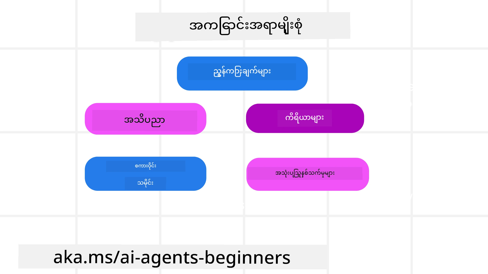
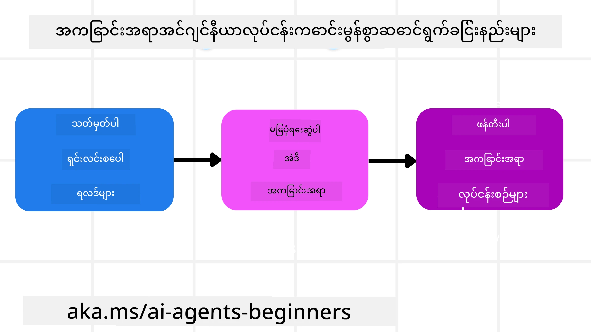

# AI ကိုယ်စားလှယ်များအတွက် Context Engineering

> _(ဒီသင်ခန်းစာရဲ့ ဗီဒီယိုကို ကြည့်မည်ဆိုပါက အပေါ်မှာရှိတဲ့ ပုံကို နှိပ်ပါ)_

သင်တည်ဆောက်နေတဲ့ AI ကိုယ်စားလှယ်အတွက် ဆော့ဖ်ဝဲလ်၏ ပြုလုပ်မှု စိတ်ဝင်စားစရာရှိမှုကို နားလည်ခြင်းမှာ ယုံကြည်စိတ်ချရမှုရှိတဲ့ AI ကိုယ်စားလှယ်တစ်ခု တည်ဆောက်ရာတွင် အရေးကြီးသည်။ အဆင့်မြင့် လိုအပ်ချက်များကို ဖြေရှင်းနိုင်ရန် အချက်အလက်များကို ထိထိရောက်ရောက် စီမံခန့်ခွဲနိုင်သော AI ကိုယ်စားလှယ်များကို တည်ဆောက်ရန်လိုအပ်သည်။

ဒီသင်ခန်းစာမှာ context engineering ဆိုတာဘာလဲ၊ AI ကိုယ်စားလှယ်တွေတည်ဆောက်ရာမှာ ၎င်းရဲ့ အရေးပါမှုအကြောင်းကို ကြည့်ရှုပါမယ်။

## မှတ်ပုံတင်

ဒီသင်ခန်းစာမှာ ကောက်နုတ်သွားမှာကတော့-

• **Context Engineering ဆိုတာဘာလဲ**၊ prompt engineering နဲ့ ဘာကြောင့် ကွဲပြားကြသည်။

• **Context Engineering အတွက် ထိရောက်သောနည်းဗျူဟာများ၊** အချက်အလက်ရေးသားခြင်း၊ ရွေးချယ်ခြင်း၊ ဖိလို့ဖြည်းခြင်းနှင့် သီးခြားခြင်း စသည်ဖြင့်။

• **AI ကိုယ်စားလှယ်ကို မွမ်းမံပစ်ခတ်နိုင်သည့် နာမည်ကြီး Context ပြဿနာများနှင့် ပြင်ဆင်နည်းများ။**

## သင်ယူဖို့ရည်ရွယ်ချက်များ

ဒီသင်ခန်းစာပြီးမြောက်ပါက အောက်ပါကို နားလည်သိရှိပါလိမ့်မယ်-

• **Context engineering ကို အဓိပ္ပါယ်ဖေါ်ပြပြီး prompt engineering နဲ့ ကွဲပြားချက်ရှင်းပြနိုင်မယ်။**

• **ကြီးမားသော စကားလုံးတန်းမော်ဒယ် (LLM) လျှောက်လွှာများအတွက် context ရဲ့ အဓိကပါဝင်မှုအင်္ဂါရပ်များကို ဖော်ထုတ်နိုင်မယ်။**

• **Agent ရဲ့ လုပ်ဆောင်ချက်ကို တိုးတက်စေရန် context ရေးသားခြင်း၊ ရွေးချယ်ခြင်း၊ ဖိလို့ဖြည်းခြင်းနှင့် သီးခြားခြင်းနည်းဗျူဟာများကို အသုံးချနိုင်မယ်။**

• **Context ပြဿနာများဖြစ်သော poisoning, distraction, confusion, clash စတဲ့ ပြဿနာများကို မှတ်မှတ်သားသား မှတ်သားပြီး ထိန်းချုပ်နည်းဗျူဟာများကို အသုံးပြုနိုင်မယ်။**

## Context Engineering ဆိုတာ ဘာလဲ?

AI ကိုယ်စားလှယ်များအတွက် context ဆိုတာ AI ကိုယ်စားလှယ်တစ်ယောက်က တစ်ထပ်တည်းဖြစ်စေလိုသည့် လုပ်ဆောင်ချက်များကို ရေးဆွဲဖန်တီးရာမှ ဆောင်ရွက်စေသည်။ Context Engineering ဟာ AI ကိုယ်စားလှယ်က လုပ်ငန်းအသစ်ဆက်လုပ်ဖို့ လိုအပ်သော မှန်ကန်သော အချက်အလက်များ ရှိစေဖို့ လုပ်ငန်းလေ့လာခြင်းဖြစ်သည်။ Context window ဟာ အရွယ်အစားကန့်သတ်ရှိတဲ့အတွက်၊ ကိုယ်စားလှယ် တည်ဆောက်သူတွေဟာ အဲ့ဒီ context window ထဲမှာ ပါဖို့ အချက်အလက်ထည့်ခြင်း၊ ဖယ်ရှားခြင်း၊ နည်းနည်း ပြင်ဆင်ဖို့ စနစ်တွေနဲ့ လုပ်ထုံးလုပ်နည်းတွေ တည်ဆောက်ရပါမယ်။

### Prompt Engineering နဲ့ Context Engineering ကွာခြားချက်

Prompt engineering ဆိုတာ AI ကိုယ်စားလှယ်များကို လမ်းညွန်ပေးဖို့ အတည်ပြုထားသော စည်းမျဉ်းများဖြင့် တစ်ဦးတည်း ရပ်တည်သည့် မျှင်များအပေါ် အာရုံစိုက်ခြင်းဖြစ်သည်။ Context engineering ကတော့ အစတွင် ပေးရေးထားသော prompt ပါဝင်ပြီး ပြောင်းလဲသွားနိုင်သည့် အချက်အလက်များကို စီမံခန့်ခွဲခြင်းဖြစ်ပြီး AI ကိုယ်စားလှယ်သည် မျိုးစုံ အချက်အလက်များကို အချိန်အလိုက် ရယူနိုင်စေရန် ဖြစ်ပါသည်။ Context engineering ရဲ့ အဓိက ရည်ရွယ်ချက်မှာ ဒီလုပ်ငန်းစဉ်ကို နောက်ပြန်လုပ်နိုင်ပြီး ယုံကြည်စိတ်ချရတဲ့ ဖြစ်စေရန်ဖြစ်သည်။

### Context အမျိုးအစားများ

Context ဆိုတာ တစ်ခုတည်းမဟုတ်ဘူးဆိုတာ မေ့မထားစေချင်ပါဘူး။ AI ကိုယ်စားလှယ် တစ်ယောက်လို့လိုအပ်တဲ့ အချက်အလက်တွေဟာ အမျိုးမျိုးသော ရင်းမြစ်အများကြီးကနေ ရနိုင်ပြီး၊ အဲဒီရင်းမြစ်တွေကို ကိုယ်စားလှယ်ရယူနိုင်စေရန်ကျွန်ုပ်တို့အဖြစ် ကြိုးစားစီမံရပါမယ်။

AI ကိုယ်စားလှယ်တစ်ယောက် လက်တွေ့ စီမံကြပ်မတ်ရမည့် context အမျိုးအစားများမှာ-

• **ညွှန်ကြားချက်များ:** ၎င်းမှာ ကိုယ်စားလှယ်ရဲ့ "စည်းမျဉ်းများ" ကဲ့သို့ဖြစ်ပြီး prompt များ၊ စနစ်မက်ဆေ့ခ့်များ၊ ဥပမာနည်း (few-shot examples, AI ကို လုပ်ဆောင်ပုံပြသခြင်း) နှင့် အသုံးပြုနိုင်သော ကိရိယာများ ဖော်ပြချက်တို့ ပါဝင်သည်။ ၎င်းမှာ prompt engineering နဲ့ context engineering တို့ပေါင်းစည်းရာဖြစ်သည်။

• **အသိပညာ:** အချက်အလက်များ၊ ဒေတာဘေ့စ်မှ ရယူထားသော သတင်းအချက်အလက်များ၊ သိုလှောင်ထားသော အကြောင်းအရာကြာရှည်မှတ်ဉာဏ်များ ပါဝင်သည်။ RAG စနစ်တစ်ခု ထည့်သွင်းခြင်းဖြင့် မတူညီသော အသိပညာ လုပ်ငန်းခွဲများမှ အချက်အလက်များ ရယူလေ့ရှိသည်။

• **ကိရိယာများ (Tools):** အပြင်ဘက် လုပ်ဆောင်မှုများ၊ API များ နှင့် MCP Server များကို ကိုယ်စားလှယ်ခေါ်ယူနိုင်ခြင်းနှင့် ၎င်းတို့အသုံးပြုပြီးရယူသောတုံ့ပြန်ချက်များ (ရလဒ်များ) ပါဝင်သည်။

• **စကားပြောမှု သမိုင်း:** အသုံးပြုသူနှင့် ရှေ့ဆက်ပြောဆိုနေခြင်းများ ဖြစ်ပြီး အချိန်ကြာလာသည်နှင့်အမျှ စကားပြောမှုများ ပိုရှည်လာပြီး ပိုပြင်းထန်စွာ ဖွံ့ဖြိုးလာသည်။ ထို့ကြောင့် context window ထဲမှာ နေရာယူလာတတ်သည်။

• **အသုံးပြုသူ စိတ်ကြိုက်များ:** အသုံးပြုသူ၏ နှစ်သက်မှုများ၊ မနှစ်သက်မှုများကို အချိန်ကြာလာသည်နှင့်အတူ သိရှိလာသည်။ ၎င်းကို သိမ်းဆည်းပြီး အသုံးပြုသူ ဦးစားပေးချက် ဝိုင်းထောက်ခံမှုအတွက် အသုံးပြုနိုင်သည်။

## ထိရောက်သော Context Engineering အတွက် နည်းဗျူဟာများ

### စီမံချက် နည်းဗျူဟာများ

ကောင်းမွန်သော context engineering ဟာ ကောင်းမွန်သော စီမံချက်မှ စတင်သည်။ context engineering မှတ်ချက်ကို စတင်စဉ်းစားရန်အတွက် ဒီလိုနည်းတစ်ခု ဖြစ်ပါသည်-

1. **ရလဒ်ရလဒ်သန့်ရှင်းစွာ သတ်မှတ်ပါ** - AI ကိုယ်စားလှယ်များအား ခန့်အပ်မည့် တာဝန်ရလဒ်များကို ပြတ်သားစွာ သတ်မှတ်ရမည်။ “AI ကိုယ်စားလှယ် လုပ်ငန်းပြီးဆုံးချိန်မှာ ကမ္ဘာကြီးဘယ်လို ဖြစ်နေမလဲ?” ဆိုတဲ့ မေးခွန်းကို ဖြေဆိုပါ။ ဒါမှမဟုတ် အသုံးပြုသူ AI ကိုယ်စားလှယ်နဲ့ ဆက်သွယ်ပြီးနောက် ပြောင်းလဲပြီး သတင်းအချက်အလက် တစ်ခု၊ တုံ့ပြန်ချက် တစ်ခု ရရှိစေရမည်။

2. **Context ကို မြေပုံဆွဲပါ** - AI ကိုယ်စားလှယ်ရဲ့ ရလဒ်ကို သတ်မှတ်ပြီးနောက် “အဲဒီတာဝန်လုံးဝ ပြီးစီးဖို့အတွက် AI ကိုယ်စားလှယ်ဟာ ဘယ်အချက်အလက်များလိုအပ်မလဲ?” ဆိုပြီး မေးပါ။ ဒီနည်းနဲ့တင်တော့ အဲ့ဒီအချက်အလက်တွေ ဘယ်နေရာမှာ ရှိနေတာကို မြေပုံဆွဲနိုင်ပါလိမ့်မယ်။

3. **Context Pipeline များ ဖန်တီးပါ** - အချက်အလက်တွေရှိတာ သိပြီးနောက် “Agent က ဒီအချက်အလက်တွေ ဘယ်လိုရယူမလဲ?” ဆိုတဲ့ မေးခွန်းကို ဖြေဆိုစေဖို့ ဖြစ်ပါတယ်။ RAG, MCP Servers အသုံးပြုခြင်း၊ အခြားကိရိယာများစသဖြင့် နည်းလမ်းကွာခြားစွာနဲ့ ပြုလုပ်နိုင်သည်။

### လက်တွေ့ အကြံပြုချက်များ

စီမံချက်ရေးခြင်းအရေးကြီးပေမယ့် အချက်အလက်များက ကိုယ်စားလှယ်ရဲ့ context window ထဲ လှိုင်းထဲကဲ့သို့ဝင်လာတာက စတင်သွားပါက၊ အဲဒီကို ထိန်းချုပ်ဖို့ လက်တွေ့နည်းလမ်းများ လိုအပ်ပါသည်-

#### Context ကို စီမံခန့်ခွဲခြင်း

အချက်အလက်တချို့ကို context window ထဲ လုပ်ဆောင်မှုအလိုအလျောက် ထည့်သွားနိုင်သော်လည်း, context engineering ကတော့ အချက်အလက်ကို ပိုမိုလှုံ့ဆော်တက်ကြွစွာ လုပ်ကိုင်ဖို့ပါ။ နည်းလမ်း အနည်းငယ်ကတော့-

 1. **Agent Scratchpad**  
  AI ကိုယ်စားလှယ် တစ်ယောက်ဟာ လက်ရှိတာဝန်နဲ့ အသုံးပြုသူ ဆက်ဆံရေးကိစ္စများ ပတ်သက်သော သက်ဆိုင်ရာ အချက်အလက်များကို မှတ်စုယူနိုင်စေသည်။ ၎င်းဟာ context window ပြင်ပရှိ သေတ္တာတစ်ခု (ဖိုင် သို့မဟုတ် runtime အရာဝတ္ထု) တွင် တည်ရှိထားပြီး ၄င်းကို session တစ်ခုအတွင်း လိုအပ်သလို ပြန်ယူနိုင်သည်။

 2. **မှတ်ဉာဏ်များ (Memories)**  
 Scratchpad တစ်ခုက session တစ်ခုတိတိ context window ပြင်ပမှာ အချက်အလက် ထိန်းသိမ်းရန် ကောင်းသည်။ မှတ်ဉာဏ်တွေကတော့ မတူညီသော session များအတွက် အချက်အလက် အသီးသီးညှိနှိုင်းပြီး သိမ်းဆည်း၊ ပြန်ယူနိုင်စေသည်။ ဒီမှာ အကျဉ်းချုပ်များ၊ အသုံးပြုသူစိတ်ကြိုက်နှင့် အရေးကြီးသောတုံ့ပြန်ချက်များ ပါဝင်နိုင်သည်။

 3. **Context ဖိလို့ဖြည်းခြင်း**  
 context window က တိုးလာပြီး အကန့်အသတ်နီးကပ်လာသည်သာ စာတမ်းညွှန်းခြင်းနဲ့ ဖြတ်တောက်ခြင်းနည်းများ အသုံးပြုနိုင်သည်။ အထူးသဖြင့် သက်ဆိုင်ရာ အချက်အလက်သာ သိမ်းထားခြင်း၊ အထက်ဆုံးအသက်သာဆုံးစာတိုက် ပိုင်းကိုသာ ထားရှိခြင်း၊ ဟောင်းရှေးသော မက်ဆေ့ချ်များ ဖယ်ရှားခြင်းတို့ ပါဝင်သည်။

 4. **Multi-Agent စနစ်များ**  
 Multi-agent စနစ် တည်ဆောက်ခြင်းမှာ context engineering အမျိုးအစားတစ်ခုပဲဖြစ်သည်၊ မကြာခဏ AI သုံးခု၊ agent များစွာမှာ context window များကို ပိုင်ဆိုင်သည်။ အဲဒီ context များ ပေးပို့ခြင်း၊ ပြန်ရယူခြင်းနည်းလမ်းတွေကို စီမံချက်ဆွဲခြင်း အရေးကြီးသည်။

 5. **Sandbox ပတ်ဝန်းကျင်**  
 Agent တစ်ယောက်က ကုဒ်အချို့ကို ပြေးရန် လိုအပ်သော်လည်း ဒෝကျူမန့်တွင် အချက်အလက် များစွာကို ဖော်ထုတ်ရန် ကုဒ်များ run ကြောင်းအတွက် token ပမာဏကြီး တောင်းဆိုနိုင်သည်။ အဲ့ဒီအချက်အလက်များ context window ထဲ တစ်ချက်တည်း မထားဘဲ sandbox ပတ်ဝန်းကျင်ထဲ run ပေးပြီး ရလဒ်နဲ့ သက်ဆိုင်ရာ အချက်အလက်တွေကိုသာ Agent က ဖတ်ရှုနိုင်စေရန်။

 6. **Runtime State အရာဝတ္ထုများ**  
  Agent တစ်ခုပြဿနာရှုပ်ထွေးသော တာဝန်ရှိစဉ် ကျော်လွန်ရာတွင် အချက်အလက် containers ဖန်တီး၍ သိမ်းဆည်း စီမံသည်။ Subtask တစ်ခုချင်းစီရဲ့ ရလဒ်များ ခြေလှမ်းခြေလှမ်း သိမ်းဆည်းနိုင်သောအတွက် context သည် ပတ်သက်သော subtask သို့သာ ချိတ်ဆက်ထားနိုင်သည်။

#### Context ကို သုံးသပ်စစ်ဆေးခြင်း

 နောက်ထပ် strategy တစ်ခုကို အသုံးပြုပြီးနောက်မှာ မော်ဒယ်တစ်ခုအားလုံး ခေါ်ဆိုစဉ် ဘာတွေထည့်သွင်းပေးခဲ့တာလဲဆိုတာ စစ်ဆေးဖို့ အကျိုးရှိသည်။ အထောက်အကူပြု debugging မေးခွန်းဟာ-

> ကိုယ်စားလှယ်က context များစွာ၊ မှားနေသော context သို့မဟုတ် လိုအပ်သည့် context မပါတဲ့ အချက်အလက်များ ထည့်သွင်းခဲ့လား?

 ဒီမေးခွန်းကို ဖြေရှင်းရန် raw prompt များ၊ tool ထုတ်လွှင့်မှုများ၊ မှတ်ဉာဏ်အချက်အလက်များ log ပြုလုပ်ရန် မလိုအပ်ပါ။ production ဖော်ပြရာမှာ အပေါ်အချက်များကို နည်းသော context စစ်ဆေးမှု မှတ်တမ်းများထဲမှာ စာရင်းသွင်းထားသင့်သည်-

- **ရွေးချယ်ခြင်း:** အမြင်များ ကျော်လွှားခြင်း၊ အသုံးပြု tool များ၊ မှတ်ဉာဏ်များ စစ်တမ်းစာရင်း ရယူခြင်း၊ မည်မြားရွေးချယ်သလဲ၊ ဘယ်ဥပဒေ ဒါမှမဟုတ် အကဲဖြတ်မှု လုပ်၍ တခြားများ ဖယ်ရှားခဲ့သလဲ စသည့် အရာများကို မှတ်သားခြင်း။

- **ဖိလို့ဖြည်းခြင်း:** မူလအရင်းအမြစ်, trace id, summary id, ဖိစက်ခြင်းမတိုင်ခင်နဲ့ ပြီးနောက် token အရေအတွက် ခန့်မှန်းချက် နှင့် မူရင်းပါဝင်မှုနောက်တစ်ခေါ်မှု မှ အပါအဝင်မဟုတ်ခြင်း။

- **သီးခြားခြင်း:** ဘယ် subtask ကို agent သီးခြား၊ session သီးခြား သို့မဟုတ် sandbox မှာ run တဲ့၊ ဘယ် bounded summary ကို ပြန်လာတယ်၊ အသေးစား tool ရလဒ်များကို မိဘ agent context ကနေ ဝေးထားတယ်ဆိုတာ။

- **မှတ်ဉာဏ်နဲ့ RAG:** ရယူချက်စာရွက် id များ၊ မှတ်ဉာဏ် id များ၊ အမှတ်အသားများ၊ ရွေးချယ်ထားသော id များ နဲ့ နောက်တည်ထောင်ရေး အခြေအနေကို ရယူထားခြင်း (returned text မပြသပဲ)။

- **လုံခြုံမှုနဲ့ ကိုယ်ရေးကိုယ်တာ:** တမင် prompt စာသား၊ tool parameter များ၊ tool ရလဒ်များ သို့မဟုတ် အသုံးပြုသူ မှတ်ဉာဏ်အကြောင်းအရာများ ထက် hash, id, token buckets နဲ့ policy labels များ စာရင်းသွင်းရန်။

ရည်ရွယ်ချက်မှာ context ကို မပိုမဖြစ် ထည့်သွင်းခြင်း မဟုတ်ပဲ developer တစ်ဦးက ဘယ် context strategy ကို run တဲ့လဲ၊ နောက်ခေါ်ထားတဲ့ မော်ဒယ်ခေါ်ဆိုမှုကို ရည်ရွယ်ချက်အတိုင်းပြောင်းလဲထားဆိုတာကို စစ်ဆေးနိုင်ဖို့ လိုသည်။

### Context Engineering ဥပမာ

AI ကိုယ်စားလှယ်ကို **"ကျွန်တော်ကို ပါရီသို့ ခရီးစဉ် စီစဉ်ပေးပါ။"** လို့ ခေါ်ဆိုချင်တယ်ဆိုပါစို့။

• Prompt engineering သာ သုံးတဲ့ ဆင်းရဲနေတဲ့ agent ကတော့ အဲဒီမေးခွန်းပေးလျက် **"ကောင်းပါပြီ၊ ပါရီသို့ ဘယ်နေ့သွားချင်ပါသလဲ?"** လို့သာ ဖြေပါတယ်။ User က မေးသမျှ တိုက်ရိုက် မေးခွန်းကို တစ်ချိန်တည်းမှာပဲ ဖြေပေးခြင်း။

• Context engineering နည်းလမ်းများကို သုံးတဲ့ agent ဟာ အများများ ပြုလုပ်နိုင်ပါမယ်။ ဖြေဆိုရာမစခင် အောက်ပါ အမှုများကို လုပ်ဆောင်မှာဖြစ်သည်-

  ◦ **သင့်လုပ်ငန်းမှတ်တမ်း** ကို စစ်ဆေးပါ (Real-time data ကို ရယူသည်)။

 ◦ **ပြီးခဲ့သော ခရီးသွား စိတ်ကြိုက်ချက်များကို ပြန်လည်မှတ်မိပါ။** (ရှည်လျားသော မှတ်ဉာဏ်မှ)၊ သင့်နှစ်သက်သော လေကြောင်းလိုင်း၊ ဘတ်ဂျက် သို့မဟုတ် တိုက်ရိုက် လေယာဉ်ငှားခြင်း များစသည်တို့။

 ◦ **လေယာဉ်လေ့လာခြင်းနှင့် ဟိုတယ် စင်တာများ ပေးနိုင်သည့် ကိရိယာများ** ကို ရှာဖွေပါ။

- ပြီးနောက် ဥပမာဖြေဆိုချက်မှာ "ဟိုင်း [ သင့်နာမည် ]! အောက်တိုဘာလ ပထမအပတ်မှာ သင့်စောင့်ကြည့်နေမှုဖြစ်ပါတယ်။ သင့်အား [Preferred Airline] က တိုက်ရိုက် လေယာဉ်ဈေးနှုန်းဖြင့် [Budget] ဘတ်ဂျက်အတွင်း ပါရီသို့ လေယာဉ်တွေ ရှာဖွေပေးရမလား?" လို့ ပြောနိုင်ပါလိမ့်မယ်။ ဒီလို context-အသိပညာ အသုံးချမှု ပိုမိုပြီးနက်ရှိုင်းတဲ့ ဖြေဆိုချက်က context engineering ၏ ခွန်အားကြီးမားမှုကို ပြသသည်။

## နာမည်ကြီး Context ပြဿနာများ

### Context Poisoning

**ဘာလဲ:** Hallucination (LLM က မူလတန်းမှမဟုတ်သော ဖန်တီးချက်) သို့မဟုတ် အမှားတစ်ခု context ပြဿနာထဲ ဝင်ရောက်ပြီး ဆက်တိုက် ဖြစ်ပေါ်နေရာ AI က မဖြစ်နိုင်သော ရည်မှန်းချက်များ ရယူခြင်း သို့မဟုတ် မဆီးညဇာတ်ကောင်း မဟုတ်သော နည်းဗျူဟာတွေ ဖန်တီးခြင်း ဖြစ်ခြင်း။

**ဘာလုပ်မလဲ:** **Context validation** နဲ့ **quarantine** လုပ်ပါ။ အချက်အလက်ကို ရှေ့ရှု လမ်းကြောင်းသို့ စတင်ထည့်မည့်အရောက်မှာ စစ်ဆေးပါ။ Poisoning ဖြစ်နိုင်ခြေရှိသည်ဆိုရင် context ကို သန့်စင်ဖို့ သစ်စက်တဲ့ context threads ဖွင့်ပါ၊ အမှားအချက်အလက် မဖြန့်ချိပေါ်လွင်စေရန်။

**ခရီးစဉ် စီစဉ်ခြင်း ဥပမာ:** သင့် AI ကိုယ်စားလှယ်က **ရွာငယ်တစ်ရွာက လေဆိပ်မှ နိုင်ငံတကာမြို့ကြီးတစ်မြို့သို့ တိုက်ရိုက်လေယာဉ်ရှိသည်ဟု hallucinate လုပ်ခြင်း** ဖြစ်ပြီး၊ ၎င်း လေယာဉ်လမ်းကြောင်းဟာ ပြီးခဲ့ပြီဖြစ်သော်လည်း အမှားအကျဉ်း ဖြစ်နေသော flight detail ကို context ထဲသိမ်းထည့်ထားသည်။ ပြီးရင် သင့်အတွက် ခရီးစဉ် စီစဉ်ရန် မေ့လျော့နေတာဖြစ်ပြီး အဲဒီ လမ်းကြောင်းလေယာဉ်တစ်စင်းကို ရှာဖွေနေတယ်၊ အမှားများ ဆက်လက်ဖြစ်ပေါ်နေသည်။

**ဖြေရှင်းနည်း:** လေယာဉ်လမ်းကြောင်း အမှန်တကယ် ရှိခြင်းကို အမှန်တကယ် API သုံး၍ **စစ်ဆေးချိန်မီ** အချက်အလက်ထည့်ပါ။ စစ်ဆေးမှု မအောင်မြင်ပါက အမှားအချက်အလက်ကို quarantine ပြီး မထည့်သွင်းပါ။

### Context Distraction

**ဘာလဲ:** Context window တိုးလာပြီး background မှ သတင်းအချက်အလက်များပေါင်းများစွာ စုပုံဖွဲ့မှုကြောင့် မော်ဒယ်ဟာ သင်ကြားမှုအချိန်မှာ သင်ယူသည့် အချက်အလက် ထက် ရှေ့သတင်းအချက်အလက် တွေမှာ အာရုံစိုက်လို့ လက်ရှိ လုပ်ဆောင်မှုများ မထိရောက်ဖွယ်ဖြစ်သွားသည်။ Context window ပြည့်မီခင် မှားယွင်းမှုများ ဖြစ်လာတတ်သည်။

**ဘာလုပ်မလဲ:** **Context စုစည်းခြင်း (summarization)** အသုံးပြုပါ။ ခဏခဏ စုစည်းထားသည့် အချက်အလက်များကို အကျဉ်းချုပ်ထားသော စာတမ်းများအဖြစ် ဖိလို့ ဖြည်းပါ။ အရေးကြီးသော အချက်အလက်များကို သိမ်းပြီး အသုံးမပြုတော့သော ရှေးဟောင်းဖြစ်သော အချက်အလက်များ နှိမ့်ဆင်းစေပါသည်။ ပါဝင်မှုကို "reset" လုပ်၍ အာရုံကို ပြန်စစ်အောင်လုပ်သည်။

**ခရီးစဉ် စီစဉ်ခြင်း ဥပမာ:** คุณได้พูดคุยเกี่ยวกับสถานที่ท่องเที่ยวในฝันหลายแห่งมาเป็นเวลานาน รวมทั้งรายละเอียดเกี่ยวกับการท่องเที่ยวแบบกระเป๋าเป้สองปีก่อน เมื่อคุณถามให้ **"ช่วยหาตั๋วเครื่องบินราคาถูกสำหรับเดือนหน้า"** ตัวแทนกลับสนใจในเนื้อหาเก่าๆเกี่ยวกับกระเป๋าเป้หรือแผนการเดินทางที่ผ่านมา และละเลยคำขอปัจจุบันของคุณ

**แก้ไข:** หลังจากการสนทนาในรอบจำนวนหนึ่ง หรือเมื่อบริบทเติบโตจนใหญ่เกินไป ตัวแทนควร **สรุปส่วนที่เกี่ยวข้องและล่าสุดของการสนทนา** - โฟกัสที่วันที่และจุดหมายปลายทางของคุณ - และใช้สรุปนี้สำหรับการเรียกใช้ LLM ครั้งถัดไป ละเว้นบทสนทนาเก่าที่ไม่เกี่ยวข้อง

### Context Confusion

**ဘာလဲ:** မလိုလားအပ်သော context, များလွန်းသော ကိရိယာများ ရရှိနေခြင်းဟာ မော်ဒယ်ကို မမှန်ကန်သော ဖြေဆိုချက် ရယူခြင်း ဒါမှမဟုတ် မသင့်တော်သော ကိရိယာခေါ်ယူမှုလုပ်ပေးခြင်း ဖြစ်စေသည်။ အသေးစားမော်ဒယ်များမှာ အထူးသဖြင့် ဖြစ်နိုင်ခြေရှိသည်။

**ဘာလုပ်မလဲ:** RAG နည်းဗျူဟာ အသုံးပြု၍ **tool loadout ကို စီမံပါ**။ Tool ဖော်ပြချက်များကို vector database မှာ သိမ်းပြီး တာဝန်တစ်ခုချင်းစီအတွက် သင့်လျော်ဆုံး tool များကိုသာ ရွေးချယ်ပါ။ သုတေသနပြသသည့်အတိုင်း tool ရွေးချယ်မှုကို ၃၀ ကျော် မဖြစ်အောင် ကန့်သတ်သည်။

**ခရီးစဉ် စီစဉ်ခြင်း ဥပမာ:** AI ကိုယ်စားလှယ်မှာ `book_flight`, `book_hotel`, `rent_car`, `find_tours`, `currency_converter`, `weather_forecast`, `restaurant_reservations` စတဲ့ tool အလွှာများ ရှိသည်။ သင်မေးတော့ **"ပါရီအတွင်း ခရီးသွားရန် နည်းလမ်းအကောင်းဆုံး ဘာလဲ?"** တော့ tool များ များစွာတော့ agent ဟာ ရှုပ်ထွေးပြီး `book_flight` ကို ပါရီအတွင်း သို့ ခေါ်ယူခြင်း၊ သင်မြို့တော်သွားပြေးကားထက် ယူနာဖို့ ကြိုက်တဲ့အတွက် `rent_car` ကို အသုံးပြုခြင်း စသည်ဖြင့် မမှန်ကန်သောလုပ်ဆောင်ချက်များ ပြုလုပ်နိုင်သည်။

**ဖြေရှင်းနည်း:** Tool ဖော်ပြချက်များကို RAG နည်းလမ်းဖြင့် မေးခွန်းအရ အရေးပါဆုံး tool များသာ ရွေးချယ်ကာ LLM အတွက် ရွေးချယ် tool ကန့်သတ်မှုကို ဖော်ပြပါ။ ပါရီခရီးအတွက် `rent_car` သို့မဟုတ် `public_transport_info` ကဲ့သို့ပဲ အသုံးပြုပြီး ဖြေချက်ပေးပါမယ်။

### Context Clash

**ဘာလဲ:** Context ထဲမှာ မကိုက်ညီသော အချက်အလက်များ ရှိနေပြီး၊ မတူညီသော အာရုံစိုက်ခြင်းများ ဖြစ်လာခြင်း၊ နောက်ဆုံးရလဒ် မမှန်ကန်မှု ဖြစ်ပေါ်စေသည်။ အစပိုင်းမှားယွင်းချက်များ context ထဲမှာ ဆက်ရွေ့နေခြင်းကြောင့် ဖြစ်တတ်သည်။

**ဘာလုပ်မလဲ:** Context စနစ်နှင့် အသစ်တိုးလာသည့် အသေးစိတ်များအလုပ်မလုပ်တော့တော့ခါမှာ **context pruning** ပြုလုပ်ပြီး အဟောင်းအကျျပင်းမှားသော အချက်အလက်များ ဖယ်ရှားပါ။ **Offloading** ကို အသုံးပြု၍ မူလ context ကို မထိခိုက်စေဘဲ context ကို ပြင်ဆင်နိုင်ရန် scratchpad လုပ်ငန်းခွင် အသုံးပြုပါ။
**ခရီးသွားဘောက်ကင် ဥပမာ:** ကိုယ်စတင်ပြောဆိုချိန်မှာ ကိုယ်代理အား **"ငါ ပိုက္ဆံသက်သာတဲ့ စီးပွားဖြစ်ခရီးတံခါးတန်းနဲ့ ရွှေ့ချင်တယ်"** လို့ပြောပါတယ်။ ပြောဆိုမှုတစ်လျှောက်မှာ ပြန်ပြောင်းလိုက်ပြီး **"တကယ်แล้ว ဒီခရီးအတွက်တော့ အလုပ်သဘောတန်းနဲ့ သွားကြမယ်"** လို့ပြောပါတယ်။ အဲဒီနှစ်ခုစကားဝိုင်းတွေ context မှာကြာရှည်တည်ရှိနေခဲ့ရင် ဆိုင်ရာဉီးစားပေးချက်တွေ ပါဏီစည်းမြှောက်မှု ဖြစ်ပေါ်နိုင်ပြီး သင့်လျော်တဲ့ရွေးချယ်မှုဘာမှမသိသာနိုင်ပါတယ်။

**ဖြေရှင်းနည်း:** **context pruning** ကို အသုံးပြုပါ။ အသစ်ဖြစ်သော ညွှန်ကြားချက်သည် အဟောင်းနှင့် ဆန့်ကျင်မှုရှိပါက အဟောင်းညွှန်ကြားချက်ကို context မှဖယ်ရှားပစ်ခြင်း သို့မဟုတ် အထူးသဖြင့် ထောက်ပြချလိုက်ခြင်းဖြင့် ပယ်ဖယ်လိုက်ပါ။ ဘယ်လောက်ကောင်းမွန်စွာဆိုရင် agent သည် **scratchpad** ကို အသုံးပြုပြီး ဆန့်ကျင်မှုရှိနေသော သဘောတူညီချက်များကို သေချာ စိစစ်ပြီး နောက်ဆုံးအချက်အလက် သာ ကိုယ်စားပြုစေရန်လုပ်ဆောင်နိုင်ပါသည်။

## Context Engineering အကြောင်း ထပ်မံသိရှိလိုပါသလား?

[Microsoft Foundry Discord](https://aka.ms/ai-agents/discord) တွင် အခြားလေ့လာသူများနှင့် တွေ့ဆုံကြည့်ရှု၊ ရုံးချိန်များ တက်ရောက်ရန်နှင့် သင်၏ AI Agents မေးခွန်းများ၏ ဖြေကြားချက်များရယူနိုင်ပါသည်။

---

<!-- CO-OP TRANSLATOR DISCLAIMER START -->
**ပြောကြားချက်**
ဤစာတမ်းကို AI ဘာသာပြန်ဝန်ဆောင်မှု [Co-op Translator](https://github.com/Azure/co-op-translator) အသုံးပြု၍ ဘာသာပြန်ထားပါသည်။ ကျွန်ုပ်တို့သည် တိကျမှန်ကန်မှုအတွက် ကြိုးပမ်းနေသော်လည်း၊ စက်ကိရိယာဘာသာပြန်ခြင်းများတွင် အမှားများ သို့မဟုတ် မှားယွင်းချက်များ ပါဝင်နိုင်ကြောင်း သတိပြုပါရန် လိုအပ်ပါသည်။ မူလစာတမ်းကို မူရင်းဘာသာဖြင့်သာ ယုံကြည်စိတ်ချရသော အချက်အလက်အဖြစ် သတ်မှတ်သင့်သည်။ အရေးကြီးသည့် သတင်းအချက်အလက်များအတွက် ပရော်ဖက်ရှင်နယ် လူသားဘာသာပြန်သူဝန်ဆောင်မှုကို အကြံပြုပါသည်။ ဤဘာသာပြန်ချက်ကို အသုံးပြုခြင်းမှ ဖြစ်ပေါ်လာသော နားလည်မှုကွာခြားမှုများ သို့မဟုတ် မမှန်ကန်သော အသုံးပြုမှုများအတွက် ကျွန်ုပ်တို့ တာဝန်မခံပါ။
<!-- CO-OP TRANSLATOR DISCLAIMER END -->