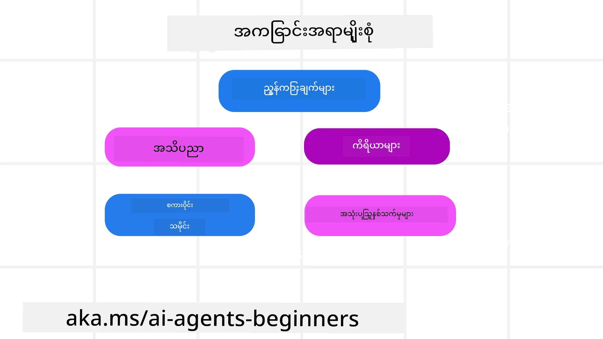
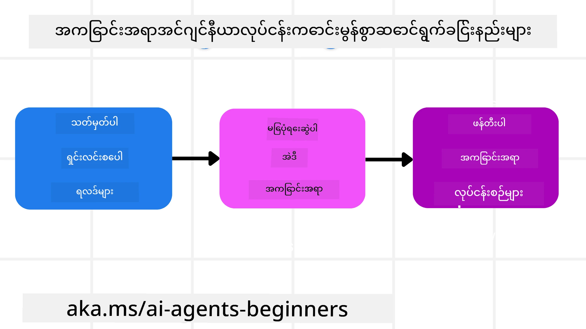

# AI ကိုယ်စားလှယ်များအတွက် Context Engineering

> _(ဤသင်ခန်းစာ၏ ဗွီဒီယိုကို ကြည့်ရန် ပုံအား နှိပ်ပါ)_

သင်တည်ဆောက်နေသော AI ကိုယ်စားလှယ်အတွက် အသုံးပြုမည့် အက်ပလီကေးရှင်း၏ရှုပ်ထွေးမှုကို နားလည်ခြင်းသည် ယုံကြည်စိတ်ချရသော AI ကိုယ်စားလှယ်တစ်ခု ဖန်တီးရာတွင် ဦးတည်ချက်တစ်ခုဖြစ်သည်။ Prompt Engineering အပြင် စိတ်ကြိုက်လိုအပ်ချက်များကို ဖြေရှင်းနိုင်ရန်အတွက် ထိရောက်စွာ သတင်းအချက်အလက်များကို စီမံခန့်ခွဲနိုင်သော AI ကိုယ်စားလှယ်များ ပေါင်းစပ်ဖန်တီးရန် လိုအပ်ပါသည်။

ဤသင်ခန်းစာတွင် Context Engineering ဆိုသည်မှာ အဘယ်နည်း၊ AI ကိုယ်စားလှယ်များ ဖန်တီးရာတွင် ၎င်း၏ အခန်းကဏ္ဍအကြောင်း သိရှိကြမည် ဖြစ်သည်။

## နိဒါန်း

ဤသင်ခန်းစာသည် အောက်ပါအကြောင်းအရာများကို ဖုံးလွှမ်းမည်ဖြစ်သည်။

• **Context Engineering ဆိုသည်မှာ အဘယ်နည်း** နှင့် ၎င်းသည် prompt engineering နှင့် မည်သို့ကွဲပြားချက်ရှိသနည်း။

• **ထိရောက်သော Context Engineering ကိရိယာများ၊** အထူးသဖြင့် သတင်းအချက်အလက်များကို စာရေးခြင်း၊ ရွေးချယ်ခြင်း၊ ဖိအားပေးခြင်းနှင့် စိတ်ပိုင်းခြားထုတ်ခြင်းတို့ကို မည်သို့ အသုံးချရမည်နည်း။

• **AI ကိုယ်စားလှယ်ကို ပျက်ကွက်စေနိုင်သော အထူး Context အမှားများ** နှင့် ၎င်းတို့ကို ထိရောက်စွာ ပြင်ဆင်နည်းများ။

## သင်ယူရမည့် ရည်မှန်းချက်များ

ဤသင်ခန်းစာပြီးဆုံးလျှင် သင်သည် အောက်ပါအရာများကို နားလည်သွားပါလိမ့်မည်။

• **context engineering ကို သတ်မှတ်ခြင်း** နှင့် prompt engineering မှ ကွဲပြားချက်ကို ခွဲခြားသိရှိခြင်း။

• Large Language Model (LLM) အက်ပလီကေးရှင်းများတွင် context ၏ အဓိကအစိတ်အပိုင်းများကို သတ်မှတ်နိုင်ခြင်း။

• **context ကို စာရေးခြင်း၊ ရွေးချယ်ခြင်း၊ ဖိအားပေးခြင်းနှင့် စိတ်ပိုင်းခြားထုတ်ခြင်း အတွက် အာရုံစိုက်နည်းလမ်းများ အသုံးပြုခြင်း** ဖြင့် ကိုယ်စားလှယ်၏ လုပ်ဆောင်မှုတိုးတက်စေရန်။

• **ပျက်ကွက်လွန်သော အထူး context အမှားများကို သိမြင်ခြင်း**၊ ဥပမာ - data poisoning, distraction, confusion, clash ဟူသော အမှားများကို နှိမ်နင်းနည်းလမ်းများ ပြုလုပ်ခြင်း။

## Context Engineering ဆိုသည်မှာ အဘယ်နည်း။

AI ကိုယ်စားလှယ်များအတွက် context ဆိုသည်မှာ  AI ကိုယ်စားလှယ် တစ်ဦး သတ်မှတ်ထားသော လုပ်ငန်းတစ်ခုဆက်လက်အောင်မြင်ရန် ဆောင်ရွက်ရမည့် အစီအစဉ်များအား မောင်းနှင်ပေးသည့် အချက်အလက်များဖြစ်သည်။ Context Engineering ဆိုသည်မှာ AI ကိုယ်စားလှယ်၏ လုပ်ငန်းရှေ့ဆက်ခြေလှမ်းတစ်ခု ပြီးမြောက်စေရန် လိုအပ်သော မှန်ကန်သော Thawithအချက်အလက်များ ရှိစေရန် လုပ်ဆောင်ခြင်း ဖြစ်သည်။ Context window ချိတ်သိမ်းနိုင်သော အရွယ်အစား ကန့်သတ်ထားသည်၊ ဒီကြောင့် ကိုယ်စားလှယ် တည်ဆောက်သူများအနေဖြင့် Context window အတွင်းသို့ သတင်းအချက်အလက် ထပ်မံထည့်ခြင်း၊ ဖယ်ရှားခြင်းနှင့် ဖိအားပေးခြင်း စနစ်များနှင့် လုပ်ထုံးလုပ်နည်းများ တည်ဆောက်ရန် လိုအပ်ပါသည်။

### Prompt Engineering နှင့် Context Engineering ၏ ကွာခြားချက်

Prompt engineering သည် တစ်ခုတည်းသော တည်ငြိမ်သော အညွှန်းများအပေါ် ဦးတည်၍ AI ကိုယ်စားလှယ်များအား စည်းမျဉ်းတစ်စုဖြင့် ထိရောက်စွာ လမ်းညွှန်ပေးသည်။ Context engineering သည် စတင်ချက်ပေးခြင်းအပါအဝင် အချက်အလက်ပေါင်းများစွာကို စီးပြားရေးစနစ် သင်္ကေတစနစ်အတိုင်း စီမံခန့်ခွဲပေးရန်ဖြစ်သည်။ Context engineering ၏ အဓိကရည်ရွယ်ချက်မှာ  ဤလုပ်ငန်းစဉ်ကို ထပ်တလဲလဲပြုလုပ်နိုင်ခြင်းနှင့် ယုံကြည်စိတ်ချရမှုရှိစေရန် ဖြစ်သည်။

### Context ၏ အမျိုးအစားများ

Context သည် တစ်ခုတည်းသော အရာတစ်ခုမဟုတ်ကြောင်း သတိထားရန် အရေးကြီးပါသည်။ AI ကိုယ်စားလှယ် လိုအပ်သည့် အချက်အလက်များသည် အမျိုးမျိုးသော အရင်းအမြစ်များမှ ရလာနိုငျပြီး ၎င်းတို့သို့ ရောက်ရှိနိုင်ရန် ကိုယ်စားလှယ်တွင် ဝင်ရောက်နိုင်ရန် ကျွန်ုပ်တို့ တာဝန်ရှိသည်။

AI ကိုယ်စားလှယ်သည် စီမံခန့်ခွဲရန် လိုအပ်နိုင်သော context အမျိုးအစားများမှာ -

• **ညွှန်းချက်များ -** ၎င်းတို့သည် ကိုယ်စားလှယ်၏ ‘စည်းမျဉ်းများ’ နည်းဖြင့် ဖြစ်သည်။ Prompt များ၊ စနစ်သတင်းများ၊ နည်းစနစ် မျက်နှာဖုံးအသေးစိတ် (few-shot examples)နှင့် ကိုယ်စားလှယ်အသုံးပြုနိုင်သည့် ကိရိယာများ ဖော်ပြချက်များ ဖြစ်သည်။ ၎င်းသည် prompt engineering နှင့် context engineering ၏ မျက်နှာဖုံးဖြစ်သည်။

• **အသိပညာ -** အချက်အလက်များ၊ ဒေတာဘေ့(စ်)မှ ရယူထားသော သတင်းအချက်အလက်များ သို့မဟုတ် ကိုယ်စားလှယ်သည် စုဆောင်းထားသည့် အချိန်ကာလရှည်မှတ်ဉာဏ်များ ဖြစ်သည်။ RAG (Retrieval Augmented Generation) စနစ်ကို အချက်အလက်၊ ဒေတာဘေ့(စ်) များအမျိုးမျိုးထံမှ လိုအပ်လျှင် ျမင်သာစေခြင်း ရယူစနစ် တစ်ရပ် ပါဝင်နိုင်သည်။

• **ကိရိယာများ -** ဒီကိရိယာများသည် ကိုယ်စားလှယ်မှ ခေါ်ယူအသုံးပြုနိုင်သော ပြင်ပလုပ်ဆောင်မှုများ၊ API များနှင့် MCP ဆာဗာများ၏ အကြောင်းအရာ အဓိပ္ပါယ်များဖြစ်ပြီး ၎င်းအသုံးပြုပြီးရသော အထွက်အဖြစ် ဆက်လက် ရရှိသည့် တုံ့ပြန်ချက်များပါဝင်သည်။

• **ဆက်သွယ်မှုမှတ်တမ်း -** အသုံးပြုသူနှင့် ဆက်လက်စကားပြောခြင်းများဖြစ်သည်။ အချိန်ဖြတ်သေပြီဆို ပိုပြီးရှည်လျားပြီး ရှုပ်ထွေးလာပြီး Context window တွင် အခန်းသွားသည်။

• **အသုံးပြုသူနှစ်သက်ချက်များ -** အသုံးပြုသူအကြိုက်များ သို့မဟုတ် မနှစ်သက်သည့် အချက်အလက်များကို အချိန်မီ သင်ယူထားခြင်း ဖြစ်သည်။ အဓိကဆုံးဆုံးဖြတ်ချက်ပေးခြင်းတွင် အသုံးပြုသည်။

## ထိရောက်သော Context Engineering ၏ နည်းလမ်းများ

### စီမံခန့်ခွဲမှု ရေရှည်အစီအစဉ်များ

Context engineering တွင် အရိုးရှင်းဆုံးအရာမှာ စီမံခန့်ခွဲမှုကောင်းကောင်းဖြစ်ပြီး ယခုနည်းလမ်းမှ မိတ်ဆက်လိုပါသည်။

1. **ရလဒ်များကို သေချာသတ်မှတ်ပါ** - AI ကိုယ်စားလှယ်ကို ကမ်းလှမ်းသော အလုပ်များ၏ ရလဒ်သည် တိကျသေချာ သတ်မှတ်ထားသင့်သည်။ "AI ကိုယ်စားလှယ်၏ အလုပ်ပြီးဆုံးလျှင် ကမ္ဘာပုံရိပ်ဘယ်လိုဖြစ်မည်နည်း?" ကို ဖြေကြားပါ။ အဓိကအားဖြင့် အသုံးပြုသူသည် AI ကိုယ်စားလှယ်နှင့် ဆက်သွယ်ပြီးနောက် မည်သည့် အာရုံစိုက်ချက်၊ အချက်အလက် သို့မဟုတ် တုံ့ပြန်ချက် ရရှိ မည်နည်း။
 2. **Context ကို မြေပုံပြုပါ** - AI ကိုယ်စားလှယ်ရဲ့ ရလဒ်များကို သတ်မှတ်ပြီးနောက် "AI ကိုယ်စားလှယ်သည် ဤလုပ်ငန်းကို ဖြေရှင်းရန် မည်သည့် အချက်အလက် လိုအပ်သနည်း?" ဟူသောမေးခွန်းကို ဖြေဆိုရမည်။ ၎င်းဖြင့် အချက်အလက်များ ရှိသည့် နေရာကို မြေပုံပြုနိုင်ပါသည်။
 3. **Context pipeline များ ဖန်တီးပါ** - အချက်အလက်တစ်ခုခု ရှိသည့် နေရာသိလျှင် "အချက်အလက်ကို ကိုယ်စားလှယ် မည်သို့ ရယူမည်နည်း?" ဟူသော မေးခွန်းကို ဖြေဆိုပါ။ RAG စနစ် ၊ MCP ဆာဗာများနှင့် အခြားကိရိယာများကို ထည့်သွင်းနိုင်ပါသည်။

### လက်တွေ့ကျသော နည်းလမ်းများ

စီမံခန့်ခွဲမှုက အရေးကြီးသော်လည်း အချက်အလက်များသည် ကိုယ်စားလှယ်၏ context window ထဲသို့ တက်လာသည့်အခါ တိကျတက်သော နည်းလမ်းများ ဖြင့် စီမံရမည်။

#### Context ကို စီမံခြင်း

အချက်အလက်တချို့ကို context window ထဲသို့ အလိုအလျောက်ထည့်သွင်းပေမယ့် Context Engineering သည် အချက်အလက်များကို ပိုမိုထိရောက်စွာ ထိန်းချုပ်ရန် နည်းလမ်းများသုံးခြင်းဖြစ်သည်။

 1. **Agent Scratchpad**
 AI ကိုယ်စားလှယ်သည် လုပ်ငန်းနှင့် အသုံးပြုသူဆက်သွယ်မှုဆိုင်ရာ သတင်းအချက်အလက်များကို တစ်ခုတည်းသော အစည်းအဝေးအတွင်း မှတ်စုထားနိုင်သည်။ ၎င်းသည် context window အပြင်တွင် ဖိုင်တစ်ခု သို့မဟုတ် runtime object တစ်ခုအဖြစ် တည်ရှိသင့်ပြီး လိုအပ်လျှင် ဆက်လက်ရယူနိုင်သည်။

 2. **မှတ်ဉာဏ်များ (Memories)**
 Scratchpad များက တစ်စိတ်တစ်ပိုင်း session ၏ context window ပြင်ပရှိသည့် သတင်းအချက်အလက်များကို စီမံရန် သင့်တော်သည်။ Memory အားဖြင့် ကိုယ်စားလှယ်များသည် ရှေးဟောင်း session များအတွင်း အရေးပါသည့် သတင်းအချက်အလက်များကို သိမ်းဆည်းထားခြင်းနှင့် ပြန်လည်ရယူနိုင်စေသည်။ ၎င်းတွင် အကျဉ်းချုပ်များ၊ အသုံးပြုသူနှစ်သက်ချက်များနှင့် တိုးတက်မှုအတွက် တုံ့ပြန်ချက်များ ပါဝင်နိုင်သည်။

 3. **Context ကို ဖိအားပေးခြင်း (Compressing Context)**
  Context window ကြီးလာပြီး အကန့်အသတ်နီးစပ်လာသည်အချိန်တွင် အကျဉ်းချုပ်ခြင်း နှင့် ဖြုတ်ခြင်း နည်းပညာများ အသုံးပြုနိုင်သည်။ ဥပမာ - အရေးပါဆုံး သတင်းအချက်အလက်များကိုသာ ထိန်းသိမ်းခြင်း သို့မဟုတ် အသက်အဟောင်းဆုံး မက်ဆေ့ချ်များကို ဖယ်ရှားခြင်း။
  
 4. **Multi-Agent Systems**
  Multi-agent system တည်ဆောက်ခြင်းမှာ Context engineering ၏ ပုံစံတစ်ခုဖြစ်သည်။ အဲဒီလိုပြုလုပ်ပါက ကိုယ်စားလှယ်တိုင်းမှာ ကိုယ်ပိုင် context window ရှိမည် ဖြစ်ပြီး ၎င်း context များကို မည်သို့မျှဝေကာ ထပ်တလဲလဲ ကိုယ်စားလှယ်များအကြား လွှဲပြောင်းပေးမည်ဆိုတာကို စီမံရန်လိုအပ်သည်။
  
 5. **Sandbox Environments**
  ကိုယ်စားလှယ်တစ်ဦးသည် ကုဒ်တစ်ချို့ကို run ပြီး သို့မဟုတ် စာရွက်စာတမ်းကြီးများအတွင်း အချက်အလက်များကို လုပ်ဆောင်ရန် လိုအပ်လျှင် context window ထဲတွင် တစ်ပါတည်း ထည့်သွင်းထားခြင်းမဟုတ်ဘဲ ထိုကုဒ်ကို run နိုင်သော sandbox လုပ်ငန်းပတ်ဝန်းကျင်တစ်ခု အသုံးပြုနိုင်ပြီး ထိုရလဒ်များနှင့် အရေးပါသည့် သတင်းအချက်အလက်များသာ ဖတ်ရှုနိုင်ပါသည်။
  
 6. **Runtime State Objects**
   ဤသည်မှာ ကိုယ်စားလှယ်သည်  အချက်အလက်များသိုလှောင်ရန် ကွန်တိနာတွစ်များကို ဖန်တီးခြင်းဖြစ်ပြီး ရှုပ်ထွေးသော လုပ်ငန်းများတွင် အလုပ်တစ်ခုချင်းစီ၏ရလဒ်များကို တစ်ဆင့်ချင်းဆင့် သိမ်းဆည်းနိုင်စေသည်။ ၎င်းက context ကို ထိုအလုပ်အပိုင်းရဲ့ သီးသန့် connection နှင့်သာ ဆက်လက်ထားရှိရန် လွယ်ကူစေသည်။

#### Context ကို စစ်ဆေးခြင်း

ထိုနည်းလမ်းများမှ တစ်ခုခုကို အသုံးပြုချင်း လုပ်ပြီးနောက် မော်ဒယ်ကို ခေါ်သုံးရာတွင် အဖြစ်မှန်ရသော အသုံးပြုချက်ကို စစ်ဆေးသင့်သည်။ စိစစ်ရရန် အသုံးဝင်သည့်မေးခွန်းမှာ -

> ကိုယ်စားလှယ်သည် context များကို များလွန်စွာတင်သည်၊ အမှားသော context တစ်ခုတည်းယူသည် သို့သော် လိုအပ်သည့် context များကို ကျန်သွားသည်လား?

၎င်းမေးခွန်းကို ဖြေရှင်းရန် raw prompt များ၊ ကိရိယာအဖြတ်အပျက်များ သို့မဟုတ် memory အကြောင်းအရာများကို မှတ်တမ်းတင်ရန် မလိုအပ်ပါ။ ထုတ်လုပ်မှုအတွက် context inspection မှတ်တမ်းများ သေးငယ်၍ အောက်ပါအချက်များကို ဖမ်းယူထားသင့်သည် -

- **ရွေးချယ်ခြင်း (Selection):** စဉ်ဆက်မပြတ် စဉ်းစားခဲ့သော chunks, ကိရိယာများ သို့မဟုတ် memory များ၏ အရေအတွက်၊ ရွေးချယ်လိုက်သော အရေအတွက်နှင့် ရွေးချယ်ပစ်ကွက်မှုအပေါ် အတိုင်းအတာ သို့မဟုတ် အမှတ်အသား။
- **ဖိအားပေးခြင်း (Compression):** အရင်းအမြစ် အစီအစဉ် ကွပ် (source range or trace id), အကျဉ်းချုပ် အမှတ် (summary id), ဖိအားပေးမှု မတိုင်မီနှင့် ပြီးနောက် token အရေအတွက်ခန့်မှန်းချက်များ၊ raw content ကို နောက်ဆုံးခေါ်သုံးမှုမှ ထုတ်ပယ်မှု။
- **စိတ်ပိုင်းခြားထုတ်ခြင်း (Isolation):** အသီးသီး agent, session သို့မဟုတ် sandbox မှ run ခဲ့သော အလုပ်အကိုင်များ၊ သတ်မှတ်ထားသော အကျဉ်းချုပ် များ၊ အကြီးမားသော ကိရိယာ အဖြတ်အပျက်များ မိခင် agent context ပြင်ပတွင် မရှိခဲ့ခြင်း။
- **Memory နှင့် RAG:** ရယူထားသော စာရွက်စာတမ်း ID များ၊ memory ID များ၊ အမှတ်ကွဲများ၊ ရွေးချယ်ထားသော ID များနှင့် ကိုယ်စားပြု စာသားပိုင်းဖြတ်မှု အခြေအနေ တို့ကို တိုက်ဆိုင်မှုမရှိသော အပြည့်အစုံစာသား အစား သိမ်းဆည်းခြင်း။
- **လုံခြုံရေးနှင့် ကိုယ်ရေးအချက်အလက်ကာကွယ်မှု:** ဖော်ပြချက် စာသားများ၊ ကိရိယာ အမည်စကား၊ ကိရိယာ ရလဒ်များ သို့မဟုတ် အသုံးပြုသူ memory အကြောင်းအရာများ၏ အစား hash များ၊ ID များ၊ token သိုက်များနှင့် ကိုယ်ပိုင်မူဝါဒ အမှတ်တံဆိပ်များကို ဦးစားပေးသုံးစွဲပါ။

ရည်ရွယ်ချက်မှာ context များ ပိုမိုထည့်သွင်းခြင်း မဟုတ်ပါ။ Developer တစ်ဦးသည် မည်သည့် context နည်းလမ်းအသုံးပြုခဲ့သည် ဆိုသည်ကို သိနိုင်ရန်နှင့် နောက်မော်ဒယ် ခေါ်သုံးမှုကို ရည်ရွယ်ချက်အတိုင်း ပြောင်းလဲနိုင်ခဲ့သည်ဟု အထောက်အထား လုံလောက်စွာထားရှိရန် ဖြစ်သည်။

### Context Engineering ၏ ဥပမာ

ကျွန်ုပ်တို့သည် AI ကိုယ်စားလှယ်အား **"ပဲရစ်သို့ ခရီးသွား အမှာစာတင်ပါ။"** ဟု တောင်းဆိုလိုသည်ဟု ဆိုကြပါစို့။

• အရိုးရှင်းဆုံး prompt engineering ကို သုံးသော ကိုယ်စားလှယ်သည် အောက်ပါစာကိုသာ ပြန်လည်ဖြေကြားနိုင်သည်။ **"အင်း၊ ဘယ်အချိန်မှာ ပဲရစ်သို့ သွားမလဲ?"** ယင်းက သင့်၏ တိုက်ရိုက်မေးခွန်းကို သုံးစွဲခဲ့သည်။

• Context engineering နည်းလမ်းများကို အသုံးပြုသော ကိုယ်စားလှယ်သည် ပိုမိုနက်ရှိုင်းစွာ ဆောင်ရွက်မည်ဖြစ်သည်။ ဖြေကြားမည့် ယခင်တွင် စနစ်က လုပ်ဆောင်သည်မှာ -

  ◦ **သင့်ရက်ဇယားကို စစ်ဆေးသည်** (အချိန်နှင့်တပြေးညီ ဒေတာ ရယူခြင်း)။

 ◦ **အတိတ်ခရီးသွားနှစ်သက်ချက်များကို နောက်မော်ဒယ်မှတ်ဉာဏ်မှ ပြန်လည်သုံးသပ်သည်**၊ ဥပမာ သင့်နှစ်သက်သော လေကြောင်းလိုင်း၊ ဘတ်ဂျက် သို့မဟုတ် တိုက်ရိုက်လေကြောင်းတို့ကို။

 ◦ **လေကြောင်းနှင့် ဟိုတယ် Booking အတွက် ရနိုင်သည့် ကိရိယာများကို ဖော်ထုတ်သည်**။

- ထို့နောက် ဥပမာအဖြေတစ်ခုမှာ။ "ဟေ့ [သင့်နာမည်]! အောက်တိုဘာလ ပထမ ပတ်တွင် သင့်ရက်ပွင့်ပါသည်။ သင်နှစ်သက်သော လေကြောင်းလိုင်း [Preferred Airline] နှင့် သင့် ဘတ်ဂျက် [Budget] အတွင်း ပဲရစ်သို့ တိုက်ရိုက်လေကြောင်းများ ရှာဖွေရမလား?" ဟုပြောသည်။ ၎င်းအကြောင်းအရာချင့်ချိန်ကိုယ်စားလှယ်သည် context engineering ၏ စွမ်းအားကို ပြသသည်။

## ပျက်ကွက်လွန်သော Context အမှားများ

### Context Poisoning (အညစ်အကြေးမှု)

**အဓိပ္ပါယ်** - LLM မှ ထုတ်လုပ်သော မှားယွင်းသော အချက်အလက်များ (hallucination) သို့မဟုတ် အမှားများ Context ထဲသို့ ထည့်သွင်းခြင်းဖြင့် များမြားစွာ ပြန်လည်ဖြစ်ပေါ်သည့် အဖြစ်များ၊ ကူးစက်ပြီး ကိုယ်စားလှယ်ကို မဖြစ်နိုင်သော ရည်မှန်းချက်များ၊ မဖြစ်မနေ မျှော်မှန်းချက်များ သို့မဟုတ် အလှည့်အပြောင်းမဲ့နည်းဗျူဟာများ စတင်လာခြင်း။

**လုပ်ဆောင်ရန်** - **Context တိုးတက်မှု ဖောက်သည့် အချက်အလက်များကို စိစစ်ခြင်းနှင့် စနစ်တကျ လုံခြုံရေးထားရှိခြင်း**။ အထူးသဖြင့် အချက်အလက်များကို ရှင်းလင်းသော သိုလှောင်မှုသို့ ထည့်မည်မတိုင်မှီ စိစစ်ပါ။  မသင့်လျော်သော အချက်အလက်ကို တွေ့ရှိပါက  Context thread အသစ်တွေ ပြုလုပ်၍ အဆိုးအမှောင်များ ပျံ့နှံ့ရန် တားဆီးပါ။

**ခရီးစဉ် Booking ဥပမာ** - ကိုယ်စားလှယ်သည် လေကြောင်း လမ်းကြောင်း တစ်ခု ကို ပြုလုပ်မည်ဟု မှားယွင်းစွာ ဖန်တီးထားသော - နယ်စပ်ထိပ်တန်း အပြင်ပိုင်း ပြည်သူ့ပင်လယ်ကမ်းခြေမှတ်တိုင်မှ နိုင်ငံတကာမြို့တစ်မြို့သို့ တိုက်ရိုက် လေကြောင်း မရှိပါ။ ထိုလေကြောင်းအချက်အလက်ကို Context ထဲသိမ်းဆည်းထားသည်။ ပြီးနောက် ကိုယ်စားလှယ်ကို ဘယ်အရာများဆိုလိုလဲဆိုသော အမိန့်များ လုပ်သော်အထိ မဖြစ်မြောက်နိုင်သော လမ်းကြောင်းများအတွက် လက်မှတ်ရှာဖွေဖို့ ကြိုးစားခြင်း ဖြစ်ပေါ်ပြီး မှားယွင်းမှုများ ဖြစ်ပျက်တတ်သည်။

**ဖြေရှင်းနည်း** – လေကြောင်းလက်မှတ်အချက်အလက်များကို ကိုယ်စားလှယ် context work စဉ်မပြုမီ အမှန်တရားရှိ/မရှိစစ်ဆေးသော real-time API ချပေးမှုတစ်ခု ထည့်သွင်းပါ။ သက်ဆိုင်ရာ လေကြောင်း အချက်အလက်ကို စစ်ဆေး၍ မှားယွင်းပါက ၎င်း အချက်အလက်ကို "quarantine" ပြုလုပ်ပြီး ဖြတ်သိမ်းထားမည်။

### Context Distraction

**အဓိပ္ပါယ်** - Context ကြီးထွားလာပြီး မော်ဒယ်သည် သင်ယူထားသည့် သင်ကြားမှုများအစား ပြီးစပ်ထားသော စာမေးပွဲအမှတ်များကို ဦးတည်ဖွယ် ဖြစ်၍ ထပ်ခါထပ်ခါခြွမ်းပျက်သွားသော လုပ်ဆောင်ချက်များကို စတင်ပေးသည်။ Context window မပြည့်ခင်မှတောင် မော်ဒယ်မှားယွင်းမှုများ ဖြစ်တတ်သည်။

**လုပ်ဆောင်ရန်** - **Context အကျဉ်းချုပ်ခြင်း**။ ပိုမိုသေးငယ်သော အကျဉ်းချုပ်များသို့ အချက်အလက်များကို периодично ဖိအားပေးခြင်းပြီး အရေးကြီးသော အချက်အလက်များသာ ထိန်းသိမ်းထား၍ မတူညီသော အစားထိုးမှုများကို ဖယ်ရှားပစ်ပါ။ ၎င်းသည် ၎င်း၏ အာရုံစူးစိုက်မှုကို ပြန်လည် စတင်နိုင်သောနည်းလမ်းဖြစ်သည်။

**ခရီးစဉ် Booking ဥပမာ** - သင့်သည် အချိန်ကြာရှည်ကြာ ခရီးသွားအကြောင်းများကို ဆွေးနွေးခဲ့ပြီး နှစ် ၂ နှစ်အကြာမှ သင့်နောက်ဆုံး ခရီး သွားဖြစ်စဉ်ကို အကြမ်းဖျင်း ပြောဖော်ခဲ့သည်။ သင်သည် **"လာမည့် လတွင် စျေးသက်သာဆုံး လေကြောင်းလက်မှတ် ရှာပေးပါ"** ဟုပြောသည်။ ကိုယ်စားလှယ်သည် အရင်က ခရီးသွား ပစ္စည်းများနှင့် နောက်ဆုံးတွင် သွားခဲ့သည့် ခရီးစဉ်အကြောင်းများ ကို နှစ်သက်၍ လက်ရှိ တောင်းဆိုချက် များကို မျှော်လင့်သင့်သော်တောင်မြင်မရ။

**ဖြေရှင်းနည်း** - သတ်မှတ်ထားသော အကြိမ်အရေအတွက်၊ သို့မဟုတ် Context ကြီးလာသောအခါ ကိုယ်စားလှယ်သည် နောက်ဆုံးနှင့်အရေးပါဆုံး ဆွေးနွေးမှု အပိုင်းများကို အကျဉ်းချုပ်၍  လက်ရှိ ခရီးစဉ်ရက်စွဲ နှင့် သွားရာနေရာများအတွက် အာရုံစိုက်ထားပြီး LLM ခေါ်သုံးမှုနောက်တစ်ခု အတွက် ထိုအကျဉ်းကို အသုံးပြုသင့်သည်။ တိကျမှုနည်းသော သမိုင်းဆက် ဝေါဟာရများကို စနစ်တကျ ပယ်ဖျက်ပစ်ပါ။

### Context Confusion

**အဓိပ္ပါယ်** - မလိုအပ်သော context, ပုံမှန်အားဖြင့် အသုံးပြုနိုင်သည့် ကိရိယာများ အလွန်များနေသည်မှာ မော်ဒယ်သို့ မမှန်ကန်သော တုံ့ပြန်ချက်များ သို့မဟုတ် မဟုတ်သော ကိရိယာ ခေါ်ဆိုမှုများ ဖြစ်စေသည်။ သေးငယ်သော မော်ဒယ်များသည် အထူးသဖြင့် ထိုပြဿနာအပေါ် အထူးပရိုက်တိတ် ဖြစ်တတ်သည်။

**လုပ်ဆောင်ရန်** - RAG နည်းလမ်းများကို အသုံးပြု၍ **ကိရိယာများ ကို စီမံခြင်း**။ ကိရိယာ ဖော်ပြချက်ကို vector ဒေတာဘေ့(စ်) တွင် သိမ်းဆည်းပြီး တစ်ခုပြီးတစ်ခု ဆောင်ရြက်ရမည့် လုပ်ငန်းအတွက် သင့်လျော်ဆုံး ကိရိယာများကိုသာ ရွေးချယ်ပါ။ သုတေသနများကြား အကွာအစီအရပ် ၃၀ ထက်နည်းသည့် ကိရိယာများကို တိုင်းတာထားသည်။

**ခရီးစဉ် Booking ဥပမာ** - မင်းရဲ့ ကိုယ်စားလှယ်တွန့် ကိရိယာ အဆာပေါင်းများစွာကို တင်ထားသည်။ `book_flight`, `book_hotel`, `rent_car`, `find_tours`, `currency_converter`, `weather_forecast`, `restaurant_reservations` စသည်တို့ပါဝင်သည်။ မင်းမေးတာက **"ပဲရစ်တွင် အကောင်းဆုံး သွားလာနည်း ဘာလဲ?"** ဖြစ်သည်။ ကိရိယာများ များစွာရှိမှုကြောင့် ကိုယ်စားလှယ်သည် ကိုက်ညီမှုမရှိသော တုံ့ပြန်ချက်များများ ဖြစ်ပေါ်ပြီး `book_flight` ကို ပဲရစ်တွင်းမှာခေါ်ဆို၍ မတော်တဆ ဖြစ်စေသည် သို့မဟုတ် မင်းကြိုက်သလို မဟုတ်သည့် ရထားကို ယူရန် ကြိုးစားသည်။

**ဖြေရှင်းနည်း** - ကိရိယာ ဖော်ပြချက်များကို RAG ဖြင့် ထိန်းသိမ်းပါ။ မင်းက ပဲရစ်သွားနည်းကို မေးသောအခါ စနစ်သည် မင်း၏ မေးခွန်းအပေါ် အခြေခံပြီး `rent_car` သို့မဟုတ် `public_transport_info` ကဲ့သို့ သင့်လျော်သော ကိရိယာများကိုသာ ရယူပေးသောကိရိယာ "loadout" တစ်ခု ဦးတည်စွာ LLM သို့ ရှင်းလင်းပေးသည်။

### Context Clash

**အဓိပ္ပါယ်** - Context အတွင်း သတင်းအချက်အလက် မတူညီသော အချက်များ ရှိနေချိန်တွင် စိတ်ဝင်စားမှု မတည့်မှုခြင်း သို့မဟုတ် မကောင်းသော နိဂုံးချုပ်များ ဖြစ်ပေါ်နိုင်သည်။ ဤကဲ့သို့ ဖြစ်ပေါ်ခြင်းများသည် အချက်အလက်များ အပိုင်းပိုင်းဖြင့် ရောက်ရှိလာပြီး စတင်ကတည်းက မှားနေသော သဘောထားများ Context ထဲတွင် ကျန်ရှိနေသောအခါ ဖြစ်တတ်သည်။

**လုပ်ဆောင်ရန်** - Context pruning နှင့် offloading ကို အသုံးပြုပါ။ Pruning ဖြင့် သက်တမ်းကုန်၊ ကွာဟချက်ရှိ သတင်းအချက်အလက်များကို ဖယ်ရှားသည်။ Offloading ဖြင့် မော်ဒယ်အား ခွဲထုတ်ထားသော "scratchpad" စာမျက်နှာအသစ်ထဲတွင် လုပ်ဆောင်နိုင်ရန် ပေးကာ မူလ context ကို သန့်စင်စေသည်။

**ခရီးသွားစာရင်းသွင်းခြင်း ဥပမာ:** သင်သည် စတင်မှာယူစဉ်၊ **"ကျွန်ုပ် အီကွိုနော်ကလပ်ဖြင့် ခရီးသွားလိုပါသည်။"** ဟု သင်၏ အေးဂျင့်အား ပြောကြားသည်။ စကားပြောဆိုမှုတွင် နောက်ပိုင်းတွင် သင်စိတ်ပြောင်းလဲလာပြီး၊ **"အမှန်တော့ ဒီခရီးအတွက် ဘစ်နေ့စ်ကလပ်ဖြင့် သွားကြရအောင်။"** ဟု ပြောဆိုသည်။ ဤ ညွှန်ကြားချက်နှစ်ခုစလုံးသည် စကားဝိုင်း၌ ထားရှိနေပါက အေးဂျင့်သည် ရှာဖွေမှုရလဒ်များ ဒေါက်တက်ခြင်း သို့မဟုတ် မည်သည့် ဦးစားပေးချက်ကို ဦးစားပေးရမည်ကို စိတ်မစေချင်မှု ဖြစ်ပေါ်နိုင်သည်။

**ဖြေရှင်းချက်။** **context pruning** ကို အကောင်အထည်ဖော်ပါ။ အသစ်ထွက်သည့် ညွှန်ကြားချက်သည် အဟောင်းနှင့် ဆန့်ကျင်ပါက အဟောင်း ညွှန်ကြားချက်ကို ဖယ်ရှားရန် သို့မဟုတ် ကြေညာစွာ အစားထိုးရန်လိုအပ်သည်။ အခြားရွေးချယ်စရာအနေဖြင့်၊ အေးဂျင့်သည် **scratchpad** ကို အသုံးပြု၍ ဆန့်ကျင်သော စိတ်ကြိုက်မှုများကို စုပေါင်းညှိနှိုင်းပြီးဆုံးဖြတ်ရန် စဉ်းစားနိုင်ရန်လုပ်ဆောင်သည်၊ ၎င်းမှ နောက်ဆုံး၊ စည်းကမ်းသေချာသည့် ညွှန်ကြားချက်တစ်ခုသာ ၎င်း၏ လုပ်ဆောင်ချက်များကို ဦးတည်စေနိုင်သည်။

## Context Engineering အကြောင်း အပိုမေးခွန်းများ ရှိပါသလား?

အခြားလေ့လာသူများနှင့် တွေ့ဆုံရန်၊ အလုပ်ချိန်များအား တက်ရောက်ရန်နှင့် သင့် AI Agent များ၏ မေးခွန်းများကို ဖြေကြားပေးခြင်းအတွက် [Microsoft Foundry Discord](https://discord.com/invite/ATgtXmAS5D) တွင် တက်ရောက်ပါ။

---

<!-- CO-OP TRANSLATOR DISCLAIMER START -->
**ပြောကြားချက်**
ဤစာတမ်းကို AI ဘာသာပြန်ဝန်ဆောင်မှု [Co-op Translator](https://github.com/Azure/co-op-translator) အသုံးပြု၍ ဘာသာပြန်ထားပါသည်။ ကျွန်ုပ်တို့သည် တိကျမှန်ကန်မှုအတွက် ကြိုးပမ်းနေသော်လည်း၊ စက်ကိရိယာဘာသာပြန်ခြင်းများတွင် အမှားများ သို့မဟုတ် မှားယွင်းချက်များ ပါဝင်နိုင်ကြောင်း သတိပြုပါရန် လိုအပ်ပါသည်။ မူလစာတမ်းကို မူရင်းဘာသာဖြင့်သာ ယုံကြည်စိတ်ချရသော အချက်အလက်အဖြစ် သတ်မှတ်သင့်သည်။ အရေးကြီးသည့် သတင်းအချက်အလက်များအတွက် ပရော်ဖက်ရှင်နယ် လူသားဘာသာပြန်သူဝန်ဆောင်မှုကို အကြံပြုပါသည်။ ဤဘာသာပြန်ချက်ကို အသုံးပြုခြင်းမှ ဖြစ်ပေါ်လာသော နားလည်မှုကွာခြားမှုများ သို့မဟုတ် မမှန်ကန်သော အသုံးပြုမှုများအတွက် ကျွန်ုပ်တို့ တာဝန်မခံပါ။
<!-- CO-OP TRANSLATOR DISCLAIMER END -->