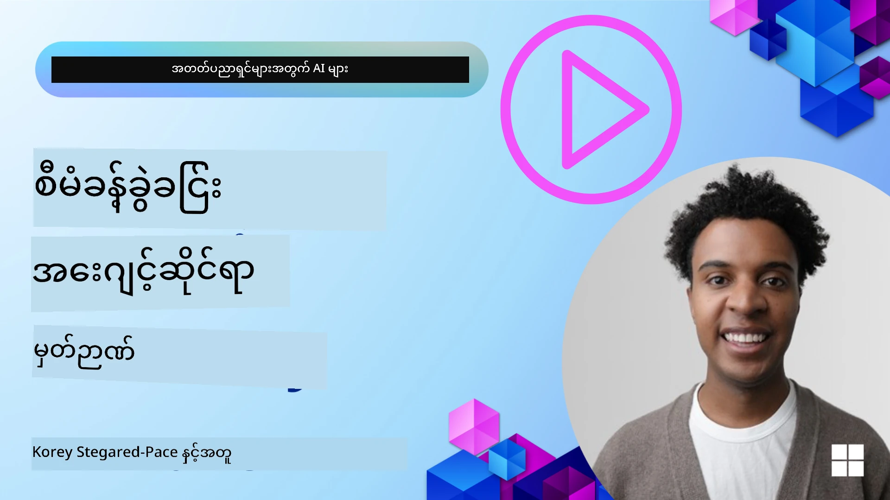

# AI အေဂျင့်များအတွက် မှတ်ဉာဏ် 

AI အေဂျင့်များ ဖန်တီးရာတွင် ထူးခြားတဲ့ အကျိုးကျေးဇူးနှစ်ခုကို အဓိက ဆွေးနွေးကြသည်။ ထိုနှစ်ခုမှာ အလုပ်များကို ပြီးစီးရန် ကိရိယာများကို ခေါ်ယူနိုင်ခြင်းနှင့် အချိန်ဖြတ်သွားချိန်နေရင်း တိုးတက်မှု လုပ်နိုင်ခြင်း ဖြစ်သည်။ ကိုယ်တိုင် တိုးတက်လာနိုင်သော အေဂျင့်များကို ဖန်တီးရာတွင် မှတ်ဉာဏ်သည် သက်ရောက်မှု အတွေ့အကြုံများကို ပိုမိုကောင်းမွန်အောင် ဖန်တီးပေးနိုင်ရန် အခြေခံဖြစ်သည်။

ဤသင်ခန်းစာတွင် ကျွန်တော်တို့သည် AI အေဂျင့်များအတွက် မှတ်ဉာဏ်ဆိုတာ ဘာလဲ၊ ထိုမှတ်ဉာဏ်ကို မည်သို့ စီမံခန့်ခွဲ၍ မည်သို့ အသုံးချနိုင်မည်ကို ကြည့်မည်ဖြစ်သည်။

## နိဒါန်း

ဤသင်ခန်းစာတွင် ပါဝင်သော အကြောင်းအရာများမှာ -

• **AI အေဂျင့်များအတွက် မှတ်ဉာဏ်ကို နားလည်ခြင်း**: မှတ်ဉာဏ်ဆိုသည်မှာ ဘာလဲ၊ အေးဂျင့်များအတွက် အရေးကြီးသော အကြောင်းရင်းများ။

• **မှတ်ဉာဏ် အကောင်အထည်ဖော်ခြင်းနှင့် သိမ်းဆည်းခြင်း**: သင့် AI အေဂျင့်များတွင် မှတ်ဉာဏ်စွမ်းရည်များ ထည့်သွင်းနိုင်ရန် လက်တွေ့နည်းလမ်းများ၊ အဓိကအားဖြင့် ရှေ့တွင်အသုံးပြုသော short-term နှင့် ရေရှည် long-term မှတ်ဉာဏ်များပေါ် အာရုံစိုက်ခြင်း။

• **AI အေဂျင့်များကို ကိုယ်တိုင် တိုးတက်လာစေခြင်း**: မှတ်ဉာဏ်က အေးဂျင့်များကို အတိတ် အပြန်အလှန်များမှ သင်ယူပြီး အချိန်အတော်ကြာလာသဖြင့် မည်သို့ တိုးတက်စေသနည်း။

## ရနိုင်သော အကောင်အထည်ဖော်နည်းများ

ဤသင်ခန်းစာတွင် တစ်ချို့ ပြည့်စုံသော notebook သင်ခန်းစာ နှစ်ခု ပါဝင်သည်။

• **[13-agent-memory.ipynb](./13-agent-memory.ipynb)**: Mem0 နှင့် Azure AI Search ကို Microsoft Agent Framework ဖြင့် အသုံးပြု၍ မှတ်ဉာဏ်အား အကောင်အထည်ဖော်သည်။

• **[13-agent-memory-cognee.ipynb](./13-agent-memory-cognee.ipynb)**: Cognee ကို အသုံးပြု၍ ဖွဲ့စည်းထားသော မှတ်ဉာဏ်ကို အကောင်အထည်ဖော်ပြီး embeddings ဖြင့် ထောက်ပံ့ထားသော အသိပညာ ဂရပ်ကို အလိုအလျောက် တည်ဆောက်ခြင်း၊ ဂရပ်ကို မြင်ကွင်းဖေါ်ပြခြင်းနှင့် ထိရောက်စွာ ရှာဖွေရေး ကျွမ်းကျင်စွာ ဆောင်ရွက်ပုံများကို ပြသသည်။

## သင်ယူရမည့် ရည်မှန်းချက်များ

ဤသင်ခန်းစာကို ပြီးမြောက်ပါက သင်သည် အောက်ပါများကို သိရှိနိုင်ပါလိမ့်မည် -

• **အမျိုးမျိုးသော AI အေဂျင့် မှတ်ဉာဏ်အမျိုးအစားများကို ကွဲပြားခြားနားစေရန်**: working, short-term, long-term မှတ်ဉာဏ်များနှင့် persona နှင့် episodic ကဲ့သို့ အထူးပြု အမျိုးအစားများကို တွဲဖက်နားလည်ခြင်း။

• **Microsoft Agent Framework ကို အသုံးပြု၍ AI အေဂျင့်များအတွက် short-term နှင့် long-term မှတ်ဉာဏ်များကို အကောင်အထည်ဖော်ပြီး စီမံခန့်ခွဲနိုင်ရန်**: Mem0, Cognee, Whiteboard မှတ်ဉာဏ်ကိရိယာများနှင့် Azure AI Search နှင့် ပေါင်းစည်းအသုံးချခြင်း။

• **ကိုယ်တိုင် တိုးတက်လာနိုင်သော AI အေဂျင့်များ၏ အခြေခံ မူဝါဒများကို နားလည်ခြင်း**နှင့် ရေရှည် သင်ယူဆက်လက်လျှောက်လှမ်းနိုင်စေရန် ခိုင်မာသော မှတ်ဉာဏ်စနစ်များ၏ အကျိုးအမြတ်များကို နားလည်ခြင်း။

## AI အေဂျင့် မှတ်ဉာဏ်ကို နားလည်ခြင်း

အခြေခံအားဖြင့်၊ **AI အေဂျင့်များအတွက် မှတ်ဉာဏ်ဆိုသည်မှာ အချက်အလက်များကို သိမ်းဆည်း၍ ပြန်လည်သတိဖြင့် ရယူနိုင်စေရန် အစီအစဉ်များကို ဆိုလိုသည်**။ ဤအချက်အလက်များသည် စကားပြောဆိုမှုအကြောင်းအရာများ၊ အသုံးပြုသူ၏ သဘောကျချက်များ၊ အရင်လုပ်ဆောင်ခဲ့သည့် လှုပ်ရှားမှုများ သို့မဟုတ် သင်ယူလာသော အလေ့အထများ ဖြစ်နိုင်သည်။

မှတ်ဉာဏ်မရှိပါက AI အက်ပ်လီကေးရှင်းများသည် မကြာခဏ stateless ဖြစ်စေပြီး အချက်အလက်တိုင်းကို အစကနေစတင်ရသည်။ ၎င်းအခြေအနေကြောင့် စကားပြန်ပြန်ဖြစ်သော နှင့် စိတ်မချဖြစ်စေသော အသုံးပြုသူအတွေ့အကြုံကို ရရှိစေပြီး အေးဂျင့်သည် အရင် context သို့မဟုတ် သဘောကျချက်များကို "မေ့" သွားသည်။

### မှတ်ဉာဏ် ဘာကြောင့် အရေးကြီးသလဲ?

အေးဂျင့်၏ တက္ကသိုလ်နိုင်မှုသည် အတိတ် အချက်အလက်များကို ပြန်လည် သတိမိပြီး အသုံးချနိုင်ခြင်းနှင့် နီးပါး ဆက်စပ်နေသည်။ မှတ်ဉာဏ်က အေးဂျင့်များအား အောက်ပါအတိုင်း ဖြစ်စေပါသည် -

• **ပြန်လေ့လာသင်ယူနိုင်ခြင်း**: အတိတ်လုပ်ဆောင်ချက်များနှင့် ရလဒ်များမှ သင်ယူခြင်း။

• **အပြန်အလှန် ဆက်သွယ်နိုင်မှု**: ဆက်လက်ဆိုင်ရာ စကားဝိုင်းတွင် context ကို ထိန်းသိမ်းနိုင်ခြင်း။

• **ကြိုတင် လုပ်ဆောင်နိုင်ခြင်းနှင့် တုံ့ပြန်နိုင်ခြင်း**: သမိုင်းစဉ်အချက်အလက်များအရ လိုအပ်ချက်များကို ကြိုထင်မြင်၍ သို့မဟုတ် သင့်လျော်စွာ တုံ့ပြန်ရန် ဖြစ်စေခြင်း။

• **ကိုယ်ပိုင် လွတ်လပ်စွာ လည်ပတ်နိုင်ခြင်း**: သိမ်းဆည်းထားသော အသိပညာများကို ဆွဲယူပြီး ပိုမိုကိုယ်ပိုင် အုပ်ချုပ်နိုင်စွမ်းရှိစေခြင်း။

မှတ်ဉာဏ်အား အကောင်အထည်ဖော်ရခြင်း၏ ရည်ရွယ်ချက်မှာ အေးဂျင့်များကို ပိုမို **ယုံကြည်စရာရှိပြီး အရည်အသွေးမြင့်** ဖြစ်စေရန် ဖြစ်သည်။

### မှတ်ဉာဏ်အမျိုးအစားများ

#### Working Memory

ဤအမျိုးအစားကို တစ်ခုတည်း ဆက်လက်လုပ်ကိုင်နေသည့် အလုပ်သို့ အတွေးအစဉ်လုပ်ငန်းစဉ်အတွင်း အေးဂျင့်အသုံးပြုသည့် တစ်ပြားစာရွက်စ زمانအဖြစ် တွေးပါ။ ထိုသည် နောက်တစ်ဆင့်တွက်ချက်ရန် လိုအပ်သော အချက်အလက်များကို အချိန်နီးပါး သိမ်းဆည်းထားသည်။

AI အေဂျင့်များအတွက် working memory သည် ပြောဆိုမှုမှ အဓိက သက်ဆိုင်ရာ အချက်အလက်များကို ဖမ်းယူ၍ ထိန်းသိမ်းတတ်သည်၊ သင်္ကေတဘက်မှတ်စုများကြီးမား၍ ဖျက်သိမ်းထားရပေမယ့်ပါ။ ၎င်းသည် လိုအပ်ချက်များ၊ အဆိုပြုချက်များ၊ ဆုံးဖြတ်ချက်များ နှင့် လှုပ်ရှားမှုများကဲ့သို့သော အဓိက အစိတ်အပိုင်းများကို ထုတ်ယူရာတွင် အာရုံစိုက်သည်။

**Working Memory Example**

ခရီးစဥ် ကြိုတင် မှာယူရေးအေးဂျင့်တစ်ခုတွင်၊ working memory က အသုံးပြုသူ၏ လက်ရှိ တောင်းဆိုချက်ကို ဖမ်းမိနိုင်သည်၊ ဥပမာ - "ပဲရစ်သို့ ခရီးတစ်ခရီး စာရင်းမှာချင်ပါတယ်" ဆိုသော တောင်းဆိုချက်ကဲ့သို့။ ဤ သီးခြား တောင်းဆိုချက်ကို အေးဂျင့်၏ အချိန်နီးကပ် context တွင် ထိန်းသိမ်းထားပြီး လတ်တလော ဆက်ဆံရေးကို ဦးတည်ရန် အကူပြုသည်။

#### Short Term Memory

ဤအမျိုးအစားသည် တစ်ခုတည်းသော စကားဝိုင်း သို့မဟုတ် အစည်းအဝေး တစ်ခုတည်းအတွင်း သာ မှတ်ဉာဏ်ကို ထိန်းသိမ်းထားသည်။ ၎င်းသည် လက်ရှိ စကားဝိုင်း၏ context ဖြစ်ပြီး အေးဂျင့်အား စကားပြန် ပြန်လည် ရည်ညွှန်းနိုင်စေရန် ခွင့်ပြုသည်။

**Short Term Memory Example**

အသုံးပြုသူက "ပဲရစ်သို့ သွားမယ့် လေယာဉ်လက်မှတ်က ဘယ်လောက် ကျမလဲ?" ဟု မေးပြီး အပြီးတွင် "အဲ့ဒီမှာ အဆောင်ကော?" ဟု ဆက်မေးလျှင်၊ short-term memory က တစ်ဆက်တည်းသော စကားဝိုင်းအတွင်း "အဲ့ဒီမှာ" ဆိုသည်မှာ "ပဲရစ်" ကို ရည်ညွှန်းသည်ကို အေးဂျင့် သိရှိစေသည်။

#### Long Term Memory

ဤသည်မှာ စကားဝိုင်းများ သို့မဟုတ် အစည်းအဝေးများ အများကြီး ပေါက်ကွဲသော်လည်း တာရှည် ထိန်းသိမ်းထားသည့် အချက်အလက်များ ဖြစ်သည်။ ၎င်းက အေးဂျင့်များကို အသုံးပြုသူ၏ နှစ်သက်ချက်များ၊ သမိုင်းဆိုင်ရာ ဆက်ဆံမှုများ သို့မဟုတ် ပုံမှန် အသိပညာများကို ကြာရှည်အထိ သတိပြုစေရန် ခွင့်ပြုသည်။ ၎င်းသည် ကိုယ်ပိုင်ရေးရာ အပြုအမူများကို ပိုမိုထိရောက်စေရာ အရေးကြီးသည်။

**Long Term Memory Example**

ရေရှည် မှတ်ဉာဏ်တစ်ခုမှာ "Ben သည် စကီးနှင့် ပြင်ပ လှုပ်ရှားမှုများကို နှစ်သက်ပြီး တောင်မြင်ကောင်းသော ခင်ဗျားပုံတင်ကော်ဖီကို နှစ်သက်ကာ ယခင်ဒဏ်ရာကြောင့် အဆင့်မြင့် စကီလမ်းကြောင်းများကို ရှောင်ချင်သည်" ဟူသော အချက်များကို သိမ်းဆည်းထားနိုင်သည်။ ဤအချက်အလက်များသည် အရင် ဆက်ဆံမှုများမှ သင်ယူလာကြောင်းဖြစ်ပြီး အနာဂတ် ခရီးစီစဉ်မှုများတွင် အကြံပြုချက်များကို ပိုမို ကိုယ်ပိုင်ဖြစ်အောင် သက်ရောက်စေသည်။

#### Persona Memory

ဤ အထူးပြု မှတ်ဉာဏ်အမျိုးအစားသည် အေးဂျင့်တစ်ဦး၏ တစ်ခါတစ်ရံရှိသော "ပုဂ္ဂလိက အင်အား" သို့မဟုတ် "persona" ကို တည်ဆောက်နိုင်ရန် အကူဖြစ်သည်။ ၎င်းက အေးဂျင့်ကို မိမိအကြောင်း သို့မဟုတ် ရည်ရွယ်ထားသည့် အခန်းကဏ္ဍအကြောင်း အသေးစိတ်များကို မှတ်ထားနိုင်စေပြီး ဆက်ဆံမှုများကို ပိုမို လွယ်ကူပြီး အာရုံစူးစိုက်စေရန် အထောက်အကူဖြစ်စေသည်။

**Persona Memory Example**
ခရီးသွား အေးဂျင့်အား "ကျွမ်းကျင်သော စကီ စီစဉ်သူ" အဖြစ် ဒီဇိုင်းလုပ်ထားသော်လည်း၊ persona memory က ဤ အခန်းကဏ္ဍကို အတက်အကျ တာရှည် ပြီး အဖြေများကို ကျွမ်းကျင်သူ၏ အသံနှင့် အသိပညာနှင့် ကိုက်ညီစေရန် ထောက်ပံ့နိုင်သည်။

#### Workflow/Episodic Memory

ဤမှတ်ဉာဏ်သည် အချိုးကျလုပ်ငန်းတစ်ခုကို ဆောင်ရွက်စဉ် အေးဂျင့်က ဆောင်ရွက်သည့် လုပ်ဆောင်ချက်အဆင့် အတွဲကို (အောင်မြင်မှုများနှင့် မအောင်မြင်မှုများ အပါအဝင်) သိမ်းဆည်းသည်။ ၎င်းသည် အတိတ်ကာလ အတွေ့အကြုံများ (အပိုင်းအဖြစ်) ကို မှတ်သားထားသကဲ့သို့ သင်ယူရန် အကူဖြစ်စေသည်။

**Episodic Memory Example**

အေးဂျင့်က သတ်မှတ်ထားသော လေယာဉ်ကို ကြိုတင် မှာရန် ကြိုးစားခဲ့မိပါက၊ လေယာဉ်မရရှိနိုင်ခြင်းကြောင့် မအောင်မြင်ခဲ့ပါက episodic memory သည် ဤ မအောင်မြင်မှုကို မှတ်တမ်းတင်နိုင်ပြီး နောက်ထပ် ကြိုးပမ်းမှုတွင် အစားထိုး လေယာဉ်များကို ကြိုးစားရန် သို့မဟုတ် အသုံးပြုသူအား ပိုမို အသိပညာရှိစွာ ပြောကြားနိုင်ရန် အကူဖြစ်စေမည် ဖြစ်သည်။

#### Entity Memory

ဤသည်မှာ စကားဝိုင်းများထဲမှ လူများ၊ နေရာများ သို့မဟုတ် အရာများကဲ့သို့ အထူးဖော်ထုတ်ချက်များနှင့်เหตุการณ์များကို ကိုင်တွယ်၍ မှတ်သားခြင်း ဖြစ်သည်။ ၎င်းက အေးဂျင့်အား ဆွေးနွေးထားသည့် အဓိက အစိတ်အပိုင်းများကို ဖွဲ့စည်းထားသည့် နားလည်မှုတစ်ခု တည်ဆောက်ရန် အခွင့်ရေးပေးသည်။

**Entity Memory Example**

ဧ။ ဥပမာ အရင်ခရီးစဉ်တခုအကြောင်း စကားပြောဆိုခြင်းမှ အေးဂျင့်သည် "Paris", "Eiffel Tower", "dinner at Le Chat Noir restaurant" ကဲ့သို့ အရာဝတ္ထုများကို ဖော်ထုတ်နိုင်သည်။ အနာဂတ် ဆက်ဆံမှုတွင် အေးဂျင့်သည် "Le Chat Noir" ကို ပြန်လည် မှတ်မိ၍ ထိုနေရာတွင် ကားကိုင်Booking အသစ်တစ်ခု ပြုလုပ်ပေးရန် အကြံပြုနိုင်သည်။

#### Structured RAG (Retrieval Augmented Generation)

RAG သည် ကျယ်ပြန့်သော နည်းပညာတစ်ခု ဖြစ်သော်လည်း "Structured RAG" ကို အထူးအားဖြင့် အရေးကြီးသော မှတ်ဉာဏ်နည်းပညာတစ်ရပ်အဖြစ် ထုတ်ဖော်ပြသထားသည်။ ၎င်းသည် ဆွေးနွေးချက်များ၊ အီးမေးလ်များ၊ ဓာတ်ပုံများကဲ့သို့ မျိုးစုံသော အရင်းအမြစ်များမှ တိုထွာ ဖွဲ့စည်းထားသည့် သင့်လျော် သေချာသော အချက်အလက်များကို ကောက်ယူပြီး တုံ့ပြန်မှုများတွင် တိကျမှု၊ ပြန်လည် ရှာဖွေရေးနှင့် အမြန်နှုန်းကို မြှင့်တင်ရန် အသုံးချသည်။ classic RAG သည် semantic ဆင်တူမှုကိုသာ မူတည်သလို မဟုတ်ဘဲ Structured RAG သည် အချက်အလက်၏ ပါဝင်သည့် ဖွဲ့စည်းပုံကိုလည်း လက်လှမ်းမီစေသည်။

**Structured RAG Example**

စကားလုံးများကိုသာ ကိုက်ညီစေခြင်းမဟုတ်ဘဲ Structured RAG သည် အီးမေးလ်တစ်စောင်မှ လေယာဉ် အသေးစိတ် (ရောက်ရှိရာ, ရက်စွဲ, အချိန်, လေကြောင်းကုမ္ပဏီ) များကို ဖေါ်ထုတ်၍ ဖွဲ့စည်းထားသော ပုံစံဖြင့် သိမ်းဆည်းနိုင်သည်။ ဤကြောင့် "အင်္ဂါနေ့က ပဲရစ်သို့ ကျွန်တော်/ကျွန်မ မှာထားတဲ့ လေယာဉ် ဘယ်ဟာလဲ?" ကဲ့သို့ တိကျစွာ မေးခွန်းများအား ဖြေရှင်းနိုင်စေသည်။

## မှတ်ဉာဏ်အား အကောင်အထည်ဖော်ခြင်းနှင့် သိမ်းဆည်းခြင်း

AI အေးဂျင့်များအတွက် မှတ်ဉာဏ်ကို အကောင်အထည်ဖော်ခြင်းဆိုသည်မှာ **မှတ်ဉာဏ်စီမံခန့်ခွဲမှု** အဆင့်လိုက် လုပ်ငန်းစဉ်တစ်ခု ဖြစ်ပြီး ၎င်းတွင် ဖန်တီးခြင်း၊ သိမ်းဆည်းခြင်း၊ ရှာဖွေခြင်း၊ ပေါင်းစည်းခြင်း၊ အပ်ဒိတ်လုပ်ခြင်းနှင့် "မေ့စေခြင်း" (သို့မဟုတ် ဖျက်ပစ်ခြင်း) တို့ ပါဝင်သည်။ အထူးသဖြင့် ရှာဖွေရေး (retrieval) ကို အလွန် အရေးကြီးသည်ဟု သတ်မှတ်နိုင်ပါသည်။

### အထူးပြု မှတ်ဉာဏ် ကိရိယာများ

#### Mem0

Agent မှတ်ဉာဏ်ကို သိမ်းဆည်းနှင့် စီမံရန် တစ်နည်းလမ်းမှာ Mem0 ကဲ့သို့ အထူးပြု ကိရိယာများကို အသုံးပြုခြင်းဖြစ်သည်။ Mem0 သည် အမြဲတမ်း ထိန်းသိမ်းထားနိုင်သော မှတ်ဉာဏ် အလွှာတစ်ခုအဖြစ် လည်ပတ်ကာ အေးဂျင့်များအနေဖြင့် သက်ဆိုင်ရာ ဆက်ဆံမှုများကို ပြန်လည် မှတ်တမ်းတင်နိုင်ရန်၊ အသုံးပြုသူနှစ်သက်မှုများနှင့် အချက်အလက်ပတ်ဝန်းကျင်ကို သိမ်းဆည်းနိုင်ရန်နှင့် အောင်မြင်မှုများ၊ မအောင်မြင်မှုများမှ သင်ယူနိုင်ရန် အကူဖြစ်စေသည်။ အယူအဆမှာ stateless အေးဂျင့်များကို stateful အဖြစ် ပြောင်းလဲစေခြင်း ဖြစ်သည်။

၎င်းသည် **နှစ်ပိုင်းမှတ်ဉာဏ် ပိုင်းစဉ်လမ်းကြောင်း: ဖော်ထုတ်ခြင်းနှင့် အပ်ဒိတ်လုပ်ခြင်း** ဖြင့် လည်ပတ်သည်။ ပထမဦးဆုံး အေးဂျင့်၏ သရိုက်သူသော thread ထဲသို့ ထည့်သွင်းသော စာသားများကို Mem0 ဝန်ဆောင်ခွင့်သို့ ပို့ပြီး၊ Mem0 သည် ကြီးမားသော ဘာသာစကား မော်ဒယ် (LLM) ကို အသုံးပြုကာ စကားဝိုင်းသမိုင်းကို အကျဉ်းချုပ်ကာ မှတ်ဉာဏ် အသစ်များကို ဖော်ထုတ်သည်။ ထို့နောက် LLM ထောက်ပံ့မှုဖြင့် အပ်ဒိတ်ကာလတွင် ၎င်းမှတ်ဉာဏ်များကို ထည့်ရန်၊ ပြင်ဆင်ရန် သို့မဟုတ် ဖျက်ရန် ဆုံးဖြတ်ပေးပြီး ဗက်တာ၊ ဂရပ်နှင့် key-value ဒေတာဘေ့စ်များ ပါဝင်နိုင်သည့် hybrid ဒေတာသိုလှောင်စနစ်တွင် သိမ်းဆည်းသည်။ ဤစနစ်သည် မတူညီသည့် မှတ်ဉာဏ်အမျိုးအစားများကို ထောက်ပံ့နိုင်ပြီး အရာဝတ္ထုများအကြား ဆက်ဆံရေးများကို စီမံရန် ဂရပ် မှတ်ဉာဏ်ကိုလည်း ထည့်သွင်းနိုင်သည်။

#### Cognee

အခြားထောက်ပံ့နိုင်သည့် နည်းလမ်းတစ်ခုမှာ **Cognee** ဖြစ်သည်။ Cognee သည် open-source semantic မှတ်ဉာဏ်စနစ်တစ်ခုဖြစ်ပြီး ဖွဲ့စည်းထားသော နှင့် မဖွဲ့စည်းထားသော ဒေတာများကို embeddings ဖြင့် ထောက်ပံ့ထားသော query ထားနိုင်သည့် အသိပညာ ဂရပ်များသို့ ပြောင်းလဲပေးသည်။ Cognee သည် ဗက်တာ ဆင်တူမှု ရှာဖွေမှုနှင့် ဂရပ် ဆက်စပ်မှုများကို ပေါင်းစပ်ထားသည့် dual-store ဖွဲ့စည်းမှုကို အသုံးပြု၍ အချက်အလက်များ၏ ဆင်တူမှုကိုသာမက အယူအဆများအကြား ဆက်နွယ်မှုများကိုလည်း နားလည်စေသည်။

၎င်းသည် ဗက်တာ ဆင်တူမှု၊ ဂရပ် ဖွဲ့စည်းပုံနှင့် LLM အတွေးပေါင်းစပ်သည့် hybrid retrieval တွင် ထူးချွန်ပြီး မူလ ကွန်ကရီဒ် chunk lookup မှ ဂရပ်ကို အသိannaခံ၍ မေးခွန်းဖြေခြင်းထိ အမျိုးမျိုးသော retrieval နည်းလမ်းများကို ပေးနိုင်သည်။ စနစ်သည် တိုးတက်ပြောင်းလဲသွားနိုင်သော "အသက်ရှိတဲ့ မှတ်ဉာဏ်" ကို ထိန်းသိမ်းထားကာ တစ်ခုဆက်စပ်ထားသည့် ဂရပ်အဖြစ် ပြန်လည်မေးမြန်းနိုင်ခြင်း ရှိစေသည်၊ အတိုင်းအတာအနည်းငယ်ပင် short-term session context နှင့် long-term persistent memory နှစ်မျိုးစလုံးကို ထောက်ပံ့နိုင်သည်။

Cognee notebook သင်ခန်းစာ ([13-agent-memory-cognee.ipynb](./13-agent-memory-cognee.ipynb)) တွင် ဤ ညီညွတ်ထားသော မှတ်ဉာဏ် အလွှာကို တည်ဆောက်ပုံ၊ မတူညီသော ဒေတာအရင်းအမြစ်များကို အပေါင်းသင်ထည့်သွင်းမှု၊ အသိပညာ ဂရပ်ကို မြင်ကွင်းဖော်ပြပုံများနှင့် အေးဂျင့်လိုအပ်ချက်အလိုက် မတူညီသည့် ရှာဖွေရေး နည်းလမ်းများဖြင့် မေးမြန်းပုံများကို လက်တွေ့ ဥပမာများဖြင့် ဖေါ်ပြထားသည်။

### RAG ဖြင့် မှတ်ဉာဏ် သိမ်းဆည်းခြင်း

mem0 ကဲ့သို့ အထူးပြု မှတ်ဉာဏ်ကိရိယာများအပြင်၊ **Azure AI Search ကို မှတ်ဉာဏ်များကို သိမ်းဆည်းရန်နှင့် ပြန်လည် ရှာဖွေရန် backend အဖြစ် အသုံးပြုနိုင်သည်**။ အထူးသဖြင့် Structured RAG အတွက် အထူးသင့်လျော်သည်။

ဤနည်းလမ်းက သင့်အေးဂျင့်၏ ဖြေဆိုချက်များကို သင့်ဒေတာနှင့် အခြေခံ၍ တည်ဆောက်နိုင်စေပြီး ပိုမို သက်ဆိုင်မှုရှိသည့်နှင့် တိကျမှုရှိသည့် ဖြေရှင်းချက်များရရှိစေသည်။ Azure AI Search သည် အသုံးပြုသူ သက်ဆိုင်ရာ ခရီးမှတ်ဉာဏ်များ၊ ထုတ်ကုန်စာရင်းများ သို့မဟုတ် အခြားနယ်ပယ်ဆိုင်ရာ အသိပညာများကို သိမ်းဆည်းရန် အသုံးပြုနိုင်သည်။

Azure AI Search သည် **Structured RAG** ကဲ့သို့ တိုးတက်သော စွမ်းဆောင်ရည်များကို ထောက်ပံ့နိုင်ပြီး၊ conversation history, emails, images ကဲ့သို့ ကြီးမားသော ဒေတာစုစည်းမှုများမှ အပြည့်အဝ ဖော်ထုတ်နိုင်၍ တိကျမှု၊ ပြန်လည် ရှာဖွေရေးနှင့် အမြန်နှုန်းတို့ကို မြှင့်တင်ပေးသည်။ ယင်းသည် ရိုးရိုး စာသား ချန်ခ် ခွဲခြမ်းခြင်းနှင့် embedding နည်းလမ်းများနှင့် နှိုင်းယှဉ်လျှင် "superhuman precision and recall" ကို ပေးစွမ်းနိုင်သည်။

## AI အေဂျင့်များကို ကိုယ်တိုင် တိုးတက်လာစေခြင်း

ကိုယ်တိုင် တိုးတက်လာနိုင်သော အေဂျင့်များအတွက် ဆက်ပြောကြကျတဲ့ ပုံစံတခုမှာ "knowledge agent" တစ်ခု ခွဲထုတ်ပြုလုပ်ခြင်းဖြစ်သည်။ ဤအခြား အေးဂျင့်သည် အသုံးပြုသူနှင့် အဓိက အေးဂျင့်အကြား ဖြစ်ပျက်နေသည့် ဆက်ဆံမှုကို လေ့လာစစ်ဆေးသည်။ ၎င်း၏ အခန်းကဏ္ဍများမှာ -

1. တန်ဖိုးရှိသော အချက်အလက်များကို သတ်မှတ်ခြင်း: ဆွေးနွေးမှု၏ မည်သည့် အပိုင်းကို မျှဝေလတ်ဖို့ သို့မဟုတ် အသုံးပြုသူ အနှစ်သာရအဖြစ် သိမ်းရန် သင်ယူရန် တန်ဖိုးရှိသလဲကို သတ်မှတ်သည်။

2. ဖော်ထုတ်ခြင်းနှင့် အကျဉ်းချုမ်းရေးခြင်း: ဆွေးနွေးမှုမှ အဓိက သင်ယူချက် သို့မဟုတ် နှစ်သက်ချက်ကို အကျဉ်းချုပ် ဖော်ထုတ်သည်။

3. အသိပညာအရင်းအမြစ်ထဲသို့ သိမ်းဆည်းခြင်း: အကြောင်းအရာများကို ပုံမှန်အားဖြင့် vector database တို့တွင် သိမ်းဆည်းပြီး နောက်တွင် ပြန်လည် ရှာဖွေနိုင်စေသည်။

4. အနာဂတ် မေးခွန်းများအား တိုးပွားစွာ ထောက်ပံ့ခြင်း: အသုံးပြုသူအသစ်မေးသောအခါ၊ knowledge agent သည် သိမ်းဆည်းထားသော သက်ဆိုင်ရာ အချက်အလက်များကို ရယူပြီး အသုံးပြုသူ၏ prompt ထဲသို့ ထပ်ဆောင်းထည့်သွင်းကာ အဓိက အေးဂျင့်အား အရေးကြီးသော context ကို ပံ့ပိုးပေးသည် (RAG နှင့် ဆင်တူ)။

### မှတ်ဉာဏ်အတွက် တိုးတက်ထိထိရောက်ရောက် အဆင်ပြေလုပ်နည်းများ

• **Latency Management**: အသုံးပြုသူဆက်ဆံမှုများ အလျော့မိုက်စေချင်လျှင်၊ ပထမဦးစွာ တန်ဖိုးနည်းပြီး အမြန် လည်ပတ်နိုင်သော မော်ဒယ်တစ်ခုကို အသုံးပြုကာ အချက်အလက်ကို သိမ်းဆည်းရန် သို့မဟုတ် ရှာဖွေရန် တန်ဖိုးရှိမရှိကို အမြန်စစ်ဆေးနိုင်သည်၊ လိုအပ်သည်နှင့်ချိတ်ဆက်ပြီးပိုရှုပ်ထွေးသော ဖော်ထုတ်/ရှာဖွေရေး အဆင့်များကိုသာ ခေါ်ယူနိုင်သည်။

• **Knowledge Base Maintenance**: အသိပညာ အခြေခံဒေတာ တိုးချဲ့လာသည့်အခါ၊ အသုံးမနှုန်းသေးသော အချက်အလက်များကို ကုန်ကျစရိတ် ထိန်းသိမ်းရန် "cold storage" သို့ ရွှေ့ဆိုင်းနိုင်သည်။

## AI အေဂျင့် မှတ်ဉာဏ်အကြောင်း ရော မေးစရာများ ရှိပါသလား?

အခြား သင်ယူသူများနှင့် တွေ့ဆုံရန္၊ office hours များ တက်ရောက်ရန်နှင့် သင့် AI အေဂျင့် မေးခွန်းများကို ဖြေရှင်းစေရန် [Microsoft Foundry Discord](https://aka.ms/ai-agents/discord) တွင် ပါဝင်ဆွေးနွေးပါ။

---

<!-- CO-OP TRANSLATOR DISCLAIMER START -->
အာမခံချက်:
ဤစာရွက်စာတမ်းကို AI ဘာသာပြန် ဝန်ဆောင်မှု [Co-op Translator](https://github.com/Azure/co-op-translator) ဖြင့် ဘာသာပြန်ထားပါသည်။ ကျွန်ုပ်တို့သည် တိကျမှန်ကန်ရေးအတွက် ကြိုးပမ်းနေသော်လည်း အလိုအလျောက် ဘာသာပြန်ချက်များတွင် အမှားများ သို့မဟုတ် မှားယွင်းချက်များ ပါဝင်နိုင်ကြောင်း သတိပြုပါ။ မူလစာရွက်စာတမ်းကို မူရင်းဘာသာစကားဖြင့် တရားဝင် အရင်းအမြစ် အဖြစ် သတ်မှတ်ရမည်။ အရေးကြီးသော အချက်အလက်အတွက် သက်ဆိုင်ရာ ပရော်ဖက်ရှင်နယ် လူ့ဘာသာပြန်ကို အသုံးပြုရန် အကြံပြုပါသည်။ ဤဘာသာပြန်ချက်ကို အသုံးပြုရာမှ ဖြစ်ပေါ်လာသော အမှားနားလည်မှုများ သို့မဟုတ် မှားယွင်းဖော်ပြချက်များအတွက် ကျွန်ုပ်တို့သည် တာဝန်မခံပါ။
<!-- CO-OP TRANSLATOR DISCLAIMER END -->