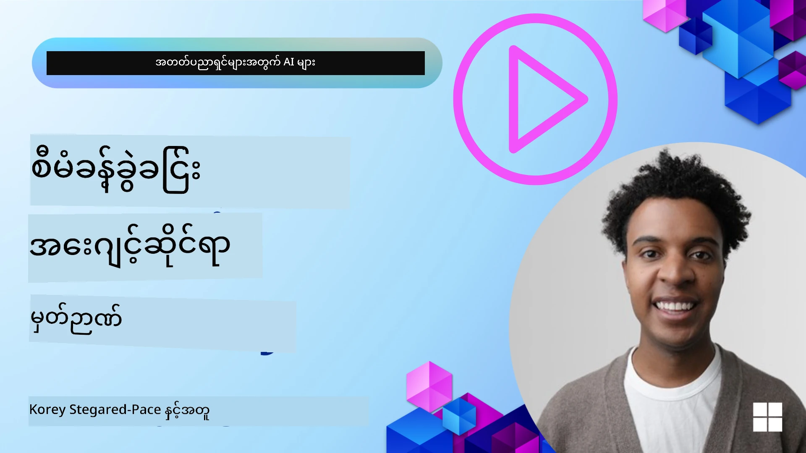

# AI အေးဂျင့်များအတွက်မှတ်ဉာဏ်

AI အေးဂျင့်များဖန်တီးခြင်း၏ ထူးခြားသောအကျိုးကျေးဇူးများကို ဆွေးနွေးသည့်အခါ၊ လုပ်ငန်းများကို ပြီးမြောက်စေရန်ကိရိယာများကို ခေါ်ယူနိုင်မှုနှင့် အချိန်အလိုက် တိုးတက်ကောင်းမွန်လာနိုင်ရေးတို့နှစ်가ိမျးကို အဓိကဆွေးနွေးကြသည်။ မှတ်ဉာဏ်သည် အသုံးပြုသူများအတွက် ပိုမိုကောင်းမွန်သော အတွေ့အကြုံများ ဖန်တီးပေးနိုင်သော မိမိကိုယ်ကို တိုးတက်ကောင်းမွန်လာသော အေးဂျင့် ဖန်တီးရာ၏ အခြေခံဖြစ်သည်။

ဤသင်ခန်းစာတွင်၊ AI အေးဂျင့်များအတွက် မှတ်ဉာဏ်란 ဘာတွေဖြစ်ပြီး မည်သို့ စီမံခန့်ခွဲပြီး အသုံးပြုနိုင်သည့် နည်းလမ်းများကို ကြည့်ရှုသွားမည်။

## မိတ်ဆက်

ဤသင်ခန်းစာတွင် ပါဝင်သောအချက်များမှာ

• **AI အေးဂျင့်မှတ်ဉာဏ်ကိုနားလည်ခြင်း**: မှတ်ဉာဏ်란 ဘာလဲ၊ အေးဂျင့်များအတွက် အရေးကြီးမှုသည် အဘယ်ကြောင့်လဲ။

• **မှတ်ဉာဏ်ကို အကောင်အထည်ဖော်ခြင်းနှင့် သိမ်းဆည်းခြင်း**: သင်၏ AI အေးဂျင့်များအတွက် မှတ်ဉာဏ် အား ဖြည့်စွက်ပေးရန် အသုံးချနိုင်သည့် လက်တွေ့နည်းလမ်းများ၊ အထူးသဖြင့် အတိုချုပ်နှင့် ရေရှည်မှတ်ဉာဏ်ကို အာရုံစိုက်ခြင်း။

• **AI အေးဂျင့်များကို မိမိကိုယ်တိုင် တိုးတက်ကောင်းမွန်လာနိုင်စေခြင်း**: မှတ်ဉာဏ်က အေးဂျင့်များအား ယခင်အပြန်အလှန် ဖြစ်ပေါ်ခဲ့သော အကြောင်းအရာများမှ သင်ယူပြီး အချိန်အလိုက် တိုးတက်ဖွံ့ဖြိုးစေသည်။

## ရနိုင်သော အကောင်အထည်ဖော်မှုများ

ဤသင်ခန်းစာတွင် ဖော်ပြထားသော နုတ်ဘုတ်တွေ နှစ်ခု ပါဝင်သည်။

• **[13-agent-memory.ipynb](./13-agent-memory.ipynb)**: Mem0 နှင့် Azure AI Search ကို Microsoft Agent Framework နှင့် တွဲဖက်အသုံးပြုပြီး မှတ်ဉာဏ် အကောင်အထည်ဖော်မှု

• **[13-agent-memory-cognee.ipynb](./13-agent-memory-cognee.ipynb)**: Cognee ကို အသုံးပြုကာ ဖွဲ့စည်းထားသော မှတ်ဉာဏ်ကို အကောင်အထည်ဖော်၊ embedding များအရ ထောက်ပံ့ထားသော အသိပညာ ဂရပ် ဖန်တီးခြင်း၊ ဂရပ်ကို မြင်သာစွာ ပြသခြင်းနှင့် အာရုံစိုက်၍ ရယူခြင်း။

## သင်ယူမည့်ရည်ရွယ်ချက်များ

ဤသင်ခန်းစာအပြီးတွင် သင်သည်

• **AI အေးဂျင့်မှတ်ဉာဏ် အမျိုးအစားများ (အလုပ်လုပ်မှတ်ဉာဏ်၊ အတိုချုပ်မှတ်ဉာဏ်၊ ရေရှည်မှတ်ဉာဏ်၊ နှင့် ပုဂ္ဂိုလ်ရေး၊ အပိုင်းအခြားမှတ်ဉာဏ်များ)** ကို ခြားနားစွာ သိရှိနိုင်လိမ့်မည်။

• **Microsoft Agent Framework အသုံးပြုကာ AI အေးဂျင့်များအတွက် အတိုချုပ်နှင့် ရေရှည်မှတ်ဉာဏ်ကို အကောင်အထည်ဖော်ပြီး စီမံခန့်ခွဲနိုင်ခြင်း (Mem0, Cognee, Whiteboard memory နှင့် Azure AI Search တွဲဖက်အသုံးပြုခြင်း အပါအဝင်)**။

• **မိမိကိုယ်တိုင် တိုးတက်ကောင်းမွန်လာသော AI အေးဂျင့်များ၏ မူကြောင်းများနှင့် ခိုင်မာသော မှတ်ဉာဏ် စီမံခန့်ခွဲမှုစနစ်များသည် နောက်ဆက်တွဲ သင်ယူမှုများနှင့် လိုက်လျောညီထွေ ပြောင်းလဲမှုများကို ရရှိစေခြင်းကို နားလည်သိရှိပါမည်။**

## AI အေးဂျင့်မှတ်ဉာဏ်ကို နားလည်ခြင်း

အခြေခံအားဖြင့်၊ **AI အေးဂျင့်များအတွက် မှတ်ဉာဏ်란 ၎င်းတို့ကို အချက်အလက်များ သိမ်းဆည်းနှင့် ပြန်လည်အသုံးပြု ခြင်းတို့ကို ခွင့်ပြုသော စနစ်များကို ဆိုလိုသည်။** ၎င်းအချက်အလက်များ အပြောအဆိုအသေးစိတ်များ၊ အသုံးပြုသူစိတ်ကြိုက်များ၊ ယခင်လုပ်ဆောင်မှုများ သို့မဟုတ် သင်ယူထားသော ပုံစံများ ဖြစ်နိုင်ပါသည်။

မှတ်ဉာဏ်မရှိပါက AI အက်ပ်များသည် မညီမှတ်ဘဲဖြစ်ကာ တစ်ခါတိုင်း တစုံတစ်ရာ သစ်စက်စက် စတင်လုပ်ဆောင်ရသည်။ ၎င်းသည် အသုံးပြုသူအတွေ့အကြုံကို ထပ်တလဲလဲနဲ့ မစွမ်းဆောင်နိုင်ဘဲ မမြင့်မားသည့် အခြေအနေ ဖြစ်စေသည်။

### မှတ်ဉာဏ် အရေးပါမှု

အေးဂျင့်၏ ဉာဏ်ကြီးမှုသည် ယခင်အချက်အလက်များကို ပြန်လည်အသုံးပြုနိုင်မှုနှင့် အတူ တိုက်ရိုက်တွဲဖက်နေသည်။ မှတ်ဉာဏ်က အေးဂျင့်များကို အောက်ပါအတိုင်း ဖြစ်စေသည်။

• **ပြန်လည်အတွေးအခေါ်လုပ်ပါသည်**: ယခင်လုပ်ဆောင်မှုများနှင့် ရလဒ်များမှ သင်ယူခြင်း။

• **အပြန်အလှန်ဆက်သွယ်မှုရှိစေသည်**: ဆက်လက်ပြောဆိုနေစဉ် အကြောင်းအရာများကို ထိန်းသိမ်းရန်။

• **တုံ့ပြန်မှုနှင့် ကြိုတင်ပြင်ဆင်မှုရှိစေသည်**: ယခင်အချက်အလက်များအပေါ်အခြေခံ၍ လိုအပ်ချက်များကို မျှော်လင့်ခြင်း သို့မဟုတ် သင့်တော်စွာ တုံ့ပြန်ခြင်း။

• **အလိုလို လုပ်ဆောင်နိုင်စေသည်**: သိမ်းဆည်းထားသော အသိပညာအပေါ် မှီငြမ်းကာ ပိုမိုလွတ်လပ်စွာ လုပ်ဆောင်ခြင်း။

မှတ်ဉာဏ်အကောင်အထည်ဖော်ခြင်း၏ ရည်မှန်းချက်မှာ အေးဂျင့်များကို ပိုမို **ယုံကြည်စိတ်ချစေပြီး တတ်နိုင်မှုရှိစေခြင်း** ဖြစ်သည်။

### မှတ်ဉာဏ် အမျိုးအစားများ

#### အလုပ်လုပ်မှတ်ဉာဏ် (Working Memory)

၎င်းသည် အေးဂျင့်တစ်ဦးတွင် တစ်ခုတည်းသော ဆက်လက်ဆောင်ရွက်နေသည့် လုပ်ငန်း သို့မဟုတ် အခြားစဉ်းစားမှုအတွင်း အသုံးပြုသော စက္ကူလက်တစ်စက်အား စဉ်းစားပါ။ နောက်တစ်ခြားလှုပ်ရှားမှုအဆင့်သို့ ရောက်ရန် လိုအပ်သော အချက်အလက်များကို ဆက်တိုက်ထိန်းသိမ်းထားသည်။

AI အေးဂျင့်များအတွက် အလုပ်လုပ်မှတ်ဉာဏ်သည် ဆက်သွယ်မှုမှ အဓိက အချက်အလက်များ၊ မလိုအပ်လွန်းသော စကားပြောသမိုင်းတစ်လျှောက်  ရှည်လျားသော ပိတ်အသီးဝေးသော်လည်း အဓိကအချက်များကို ယူဆောင်ထားသော အချက်များကို ဖော်ပြသည်။ ၎င်းတွင် လိုအပ်ချက်များ၊ အဆိုပြုချက်များ၊ ဆုံးဖြတ်ချက်များနှင့် လုပ်ဆောင်ချက်များပါဝင်သည်။

**အလုပ်လုပ်မှတ်ဉာဏ် ဥပမာ**

ခရီးသွားဘွတ်ကင်အေးဂျင့်တွင်၊ အလုပ်လုပ်မှတ်ဉာဏ်သည် အသုံးပြုသူ၏ လက်ရှိတောင်းဆိုချက်ကို ဖမ်းဆီးနိုင်သည်၊ ဥပမာ “ကျွန်တော်ဟာ ပဲရစ်ကို ခရီးသွားဘွတ်ကင်ချင်တယ်”။ ၎င်းလိုအပ်ချက်တိကျမှုကို လက်ရှိ ဆက်သွယ်မှုကို ဦးတည်ရန် အေးဂျင့်၏ ချက်တင်အကြောင်းအရာတွင် သိမ်းဆည်းထားသည်။

#### အတိုချုပ် မှတ်ဉာဏ် (Short Term Memory)

ဤအမျိုးအစားမှတ်ဉာဏ်သည် တစ်ခုတည်းသော ဆွေးနွေးမှု သို့မဟုတ် အစည်းအဝေးတစ်ခုအတွင်း အချက်အလက်များကို သိမ်းဆည်းထားသည်။ ၎င်းသည် လက်ရှိ စကားပြောဆက်စပ်မှုအခြေအနေဖြစ်ပြီး အေးဂျင့်အား စကားပြောလမ်းကြောင်းမတိုင်မီ သတင်းအချက်အလက်များကို ပြန်လည် ရည်ညွှန်းခွင့် ပေးသည်။

[Microsoft Agent Framework](https://github.com/microsoft/agent-framework) Python SDK စမ်းသပ်မှုများတွင်၊ ၎င်းသည် `agent.create_session()` ဖြင့် ဖန်တီးသည့် `AgentSession` နှင့် ကိုက်ညီသည်။ Session သည် ဖရိamework ၏ ဖွင့်ထားသော အတိုချုပ် မှတ်ဉာဏ်အတွက် ဖြစ်သည်။ ၎င်းသည် ဆက်ဆံမှုအခြေအနေကို session အသုံးပြုနေစဉ် ထိန်းသိမ်းထားသော်လည်း session ကွပ်မျက်သည်ဟု စဉ်းစားသောအခါ အချက်အလက်အား သိမ်းဆည်းထားမထားပဲ ပယ်ဖျက်သွားသည်။ ရေရှည်မှတ်ဉာဏ်သည် အစဉ်မပြတ်သက်တမ်းရှိသည့် သတင်းအချက်အလက်များ၊ စိတ်ကြိုက်အချက်များအတွက် database, vector index သို့မဟုတ် အခြားသိမ်းဆည်းခြင်းစနစ်များမှ တဆင့် အသုံးပြုသည်။

**အတိုချုပ် မှတ်ဉာဏ် ဥပမာ**

အသုံးပြုသူမှ “ပဲရစ်သို့ လေယာဉ်ခရီး သင့်ဘယ်လောက်ကျသလဲ?” ဟု မေးသောအခါ ပြီးနောက် “အဲဒီမှာ ဧည့်ခန်းဘယ်လိုလဲ?” ဟူ၍ မေးပါက၊ အတိုချုပ် မှတ်ဉာဏ်သည် အဲ့ဒီ "အဲဒီမှာ" ဆိုသည်မှာ "ပဲရစ်" ကို ရည်ညွှန်းသည်ကို သိရှိထားစေသည်။

#### ရေရှည်မှတ်ဉာဏ် (Long Term Memory)

၎င်းသည် မတူညီသော ဆွေးနွေးမှုများ သို့မဟုတ် ဆက်သွယ်မှုများ ဖက်ရှင်ကျော်တတ်စွာ သိမ်းဆည်းထားသော အချက်အလက်အမျိုးအစား ဖြစ်သည်။ ၎င်းသည် အသုံးပြုသူစိတ်ကြိုက်ချက်များ၊ ရှေးယခင် ပြန်ပေးပိုင်းများ သို့မဟုတ် အမှတ်တရအသိပညာများကို သိမ်းမှတ်ထားရန် ခွင့်ပြုသည်။ ဤအချက်အလက်သည် ပုဂ္ဂိုလ်ရေးလိုက်စားမှုများတွင် အရေးကြီးသည်။

**ရေရှည်မှတ်ဉာဏ် ဥပမာ**

ရေရှည်မှတ်ဉာဏ်သည် “ဘင်းသည် အေးဂျင့်တစ်ယောက်အနေနှင့် စကီးနှင့် ပြင်ပလှုပ်ရှားမှုများကို နှစ်သက်ပြီး တောင်တန်းမျက်နှာပြင်ကြောင့် ကော်ဖီကို နှစ်သက်ကာ ယခင်ထိခိုက်မှုကြောင့် အဆင့်မြင့် စကီးလမ်းကြောင်းများကို ရှောင်ကြဉ်နေသည်” ဆိုသော သတင်းအချက်အလက်များကို သိမ်းဆည်းထားနိုင်သည်။ ဤသတင်းအချက်အလက်များသည် နောက်လာမည့် ခရီးစဉ် စီမံခန့်ခွဲမှုတွင် အကြံပြုချက်များကို ပိုမိုပုဂ္ဂိုလ်ရေးစိတ်ကြိုက်ဖြစ်စေသည်။

#### ပုဂ္ဂိုလ်ရေးမှတ်ဉာဏ် (Persona Memory)

၎င်းအမျိုးအစားမှတ်ဉာဏ်သည် အေးဂျင့်တစ်ဦး၏ စည်းကမ်းတကျရှိသော "ပုဂ္ဂိုလ်မန်နောင်" သို့မဟုတ် "persona" တစ်ခု တည်ဆောက်ဖို့ ကူညီပေးသည်။ ၎င်းသည် အေးဂျင့်ကို ၎င်း၏ ကိုယ်ပိုင်အချက်အလက် သို့မဟုတ် ရည်ရွယ်ချက်များကို သတိထားစေရန် ခွင့်ပြုကာ ပိုမိုချောမွေ့ပြီး အာရုံစိုက်သော ဆက်ဆံမှုများဖြစ်စေသည်။

**ပုဂ္ဂိုလ်ရေးမှတ်ဉာဏ် ဥပမာ**
ခရီးသွားအေးဂျင့်သည် "စကီးလုပ်ငန်း ကျွမ်းကျင်သူ" အဖြစ် ဒီဇိုင်းရေးဆွဲထားပါက၊ ပုဂ္ဂိုလ်ရေးမှတ်ဉာဏ်က ၎င်း၏ တုံ့ပြန်ချက်များကို ကျွမ်းကျင်သူတစ်ဦး၏ အသံနှင့် အသိပညာသုံးစွဲအောင် ထောက်ပံ့ပေးနိုင်သည်။

#### လုပ်ငန်းစဉ်/အပိုင်းအစ မှတ်ဉာဏ် (Workflow/Episodic Memory)

ဤမှတ်ဉာဏ်က အေးဂျင့်သည် ခက်ခဲသော လုပ်ငန်းကို ဆောင်ရွက်စဉ် ကြုံတွေ့သည့် အဆင့်များ၊ အောင်မြင်မှုများနှင့် မအောင်မြင်မှုများကို သိမ်းဆည်းပေးသည်။ ၎င်းသည် ရှေးက အတွေ့အကြုံအသီးသီးကို မှတ်တမ်းတင်ထားခြင်း၊ သင်ယူရန်အတွက် ဖြစ်သည်။

**အပိုင်းအစ မှတ်ဉာဏ် ဥပမာ**

အေးဂျင့်က သတ်မှတ်ထားသော လေယာဉ်ခရီးစဉ်တစ်ခုကို ဘွတ်ကင်လုပ်တတ်ခွင့်မရ၍ မအောင်မြင်ခဲ့ပေမယ့်၊ episodic memory သည် ၎င်းမအောင်မြင်မှုကို မှတ်တမ်းတင်ကာ နောက်တစ်ကြိမ် ကြိုးစားသည့်အခါ အခြားလေယာဉ်ခရီးစဉ်များကို စမ်းကြည့်ရန် သို့မဟုတ် အသုံးပြုသူကို ပိုမိုသိရှိမှုရှိစေကာ ပြဿနာအကြောင်း အကြောင်းပြန်ပြနိုင်သည်။

#### အချက်အလက် မှတ်ဉာဏ် (Entity Memory)

၎င်းသည် ဆွေးနွေးမှုများမှ လူမှုဖက်၊ နေရာများ သို့မဟုတ် အရာဝတ္ထုများနှင့် ဖြစ်ရပ်များကို ထုတ်ယူ၍ သတိထား သိမ်းဆည်းခြင်းပါဝင်သည်။ အေးဂျင့်မှာ ဆွေးနွေးခန်း၏ အဓိကအချက်များဆိုင်ရာ ဖွဲ့စည်းထားသော နားလည်မှုတစ်ခု တည်ဆောက်ရန် ခွင့်ပြုသည်။

**အချက်အလက် မှတ်ဉာဏ် ဥပမာ**

ယခင်ခရီးစဉ်အကြောင်း ဆွေးနွေးရာတွင်၊ အေးဂျင့်သည် "ပဲရစ်", "Eiffel Tower" နှင့် "Le Chat Noir စားသောက်ဆိုင်မှာ အစားအစာစားခြင်း" ကို အချက်အလက်များအဖြစ် ထုတ်ယူနိုင်သည်။ နောက်ကွယ်တွင် ဆက်သွယ်မှုတွင် "Le Chat Noir" ကို ပြန်လည်အသုံးပြုကာ ထပ်မံစာရင်းသွင်းရန် ကူညီပေးနိုင်သည်။

#### ဖွဲ့စည်းထားသော RAG (Retrieval Augmented Generation)

RAG သည် ပိုမိုကျယ်ပြန့်သော နည်းဗျူဟာတစ်ခုဖြစ်သော်လည်း၊ "Built Structured RAG" ကို အရေးကြီးသော မှတ်ဉာဏ် နည်းပညာအဖြစ် ဖော်ပြထားသည်။ ၎င်းသည် အချက်အလက် များ (ဆွေးနွေးမှုများ၊ အီးမေးလ်များ၊ ပုံများ) မှ စုစည်းဖတ်ချိန် ပြုလုပ်ကာ တိကျမှန်ကန်မှု၊ ပြန်လည် ရယူနိုင်မှု နှင့် တွေပေးမှု၏ အရှိန်အဟုန် တိုးတက်စေသည်။ မူလ RAG က semantic similarity ကိုသာအခြေခံသော်လည်း Built Structured RAG သည် အချက်အလက် ဖွဲ့စည်းမှုကို အခြေခံကာ လုပ်ဆောင်သည်။

**Built Structured RAG ဥပမာ**

စကားလုံးများကိုသာ တွဲဖက်ခြင်းမပြုဘဲ၊ Built Structured RAG က အီးမေးလ်တွင် ပါသည့် လေယာဉ်ခရီးစဉ်အချက်အလက်များ (ပို့ဆောင်ရာနေရာ၊ ရက်စွဲ၊ အချိန်၊ လေကြောင်းကုမ္ပဏီ) ကို ဖော်ထုတ်ကာ ဖွဲ့စည်းထားသော ပုံစံဖြင့် သိမ်းဆည်းသွားသည်။ ၎င်းက "အင်္ဂါနေ့မှာ ပဲရစ်သို့ ဘယ်လေယာဉ်ကို ဘွတ်ကင်လုပ်ခဲ့တာလဲ?" ဆိုသည့် တိကျစွာမေးခွန်းများကို ဖြေကြားနိုင်စေသည်။

## မှတ်ဉာဏ် ကို အကောင်အထည်ဖော်ခြင်းနှင့် သိမ်းဆည်းခြင်း

AI အေးဂျင့်များအတွက် မှတ်ဉာဏ်ကို အကောင်အထည်ဖော်ခြင်းသည် **မှတ်ဉာဏ်စီမံခန့်ခွဲမှု** အဆင့်ဆက်ဖြစ်ပြီး အသုံးပြုမှု၊ သိမ်းဆည်းမှု၊ ရယူမှု၊ ပေါင်းစည်းမှု၊ ပြုပြင်မွမ်းမံမှုနှင့် အချက်အလက်များကို "မေ့မြော့" (ဖျက်ပစ်) လုပ်ခြင်းတို့ ပါဝင်သည်။ အထူးသဖြင့် ရယူမှုသည် အလွန်အရေးကြီးသည်။

### အထူးပြုထားသော မှတ်ဉာဏ်ကိရိယာများ

#### Mem0

အေးဂျင့်မှတ်ဉာဏ်ကို သိမ်းဆည်းပြီး စီမံခန့်ခွဲရန် နည်းလမ်းတစ်ခုမှာ Mem0 ကဲ့သို့သော အထူးပြုထားသော ကိရိယာများကို အသုံးပြုခြင်းဖြစ်သည်။ Mem0 သည် တည်တံ့သော မှတ်ဉာဏ်အလွှာအဖြစ် လုပ်ဆောင်ကာ အေးဂျင့်များအား သက်ဆိုင်ရာ ဆက်ဆံမှုများကို ပြန်လည်သတိရ၊ အသုံးပြုသူစိတ်ကြိုက်ချက်များနှင့် သတင်းအချက်အလက်များကို သိမ်းဆည်းပြီး အောင်မြင်မှုများနှင့် မအောင်မြင်မှုများမှ သင်ယူနိုင်စေရန် ခွင့်ပြုသည်။ အဓိကမိသားစုက stateless agent များကို stateful agent များသို့ ပြောင်းလဲပေးသည်။

၎င်းသည် **နှစ်အဆင့်မှတ်ဉာဏ်လုပ်ငန်းစဉ်: ထုတ်ယူခြင်းနှင့် ပြင်ဆင်ခြင်း** အတိုင်း လုပ်ဆောင်သည်။ ပထမအဆင့်တွင် အေးဂျင့်၏ thread တွင် ထည့်သွင်းထားသည့် မက်ဆေ့ခ်ျများသည် Mem0 ၀န်ဆောင်မှုသို့ ပို့ပေးပြီး၊ ၎င်းသည် Large Language Model (LLM) ကို အသုံးပြုကာ ဆွေးနွေးမှု သမိုင်းကို အနှစ်ချုပ်ဆောင်ပြီး မှတ်ဉာဏ်အသစ်များ ထုတ်ယူသည်။ နောက်တစ်ဆင့်တွင် LLM ဖန်တီးသော ပြင်ဆင်မှု အဆင့်ဖြင့် ၎င်းမှတ်ဉာဏ်များအား ထည့်သွင်းခြင်း၊ ပြင်ဆင်ခြင်း သို့မဟုတ် ဖျက်ပစ်ခြင်း ဆုံးဖြတ်ပြီး vector, graph နှင့် key-value database များ ပါဝင်သော ဟိုက်ဘရစ် ဒေတာစတိုးသို့ သိမ်းဆည်းသည်။ ၎င်းစနစ်သည် မှတ်ဉာဏ်အမျိုးအစားအမျိုးမျိုးကို ပံ့ပိုးကာ အချက်အလက်များအကြား ဆက်နွယ်မှုများကို စီမံခန့်ခွဲရန် ဂရပ်မှတ်ဉာဏ်ပါ လက်ခံနိုင်သည်။

#### Cognee

အခြားအင်အားကြီးသော နည်းလမ်းမှာ **Cognee** ဖြစ်ပြီး၊ ၎င်းသည် AI အေးဂျင့်များအတွက် semantic memory အဖြစ် ဖွဲ့စည်းထားသော နှင့် မဖွဲ့စည်းသော ဒေတာများကို embeddings အား အခြေခံ၍ ရှာဖွေမေးမြန်းနိုင်သော အသိပညာဂရပ်များသို့ ပြောင်းလဲပေးသည်။ Cognee သည် vector similarity search နှင့် graph ဆက်နွယ်မှုများကို ပေါင်းစပ်ထားသော **dual-store architecture** ကို ပံ့ပိုးကာ၊ အေးဂျင့်သည် သတင်းအချက်အလက်များထက် ၎င်းတို့ ဆက်နွယ်မှုကို နားလည်နိုင်စေသည်။

၎င်းသည် raw chunk lookup မှ graph-aware မေးမြန်းမှုအထိ vector similarity, graph structure နှင့် LLM reasoning တို့ ပေါင်းစပ်၍ **hybrid retrieval** နှင့် **၎င်း၏ရှင်သန်နေသော မှတ်ဉာဏ်** (living memory) အတွက် သင့်တော်စွာ ထိန်းသိမ်းလျက် ရှာဖွေနိုင်သော ပေါင်းစည်းသည့် graph အဖြစ် တိုးတက်တည်မြဲစေသည်။ ၎င်းသည် အတိုချုပ် session context နှင့် ရေရှည်ပြည့်စုံသော မှတ်ဉာဏ်နှစ်မျိုးကို ထောက်ခံပါသည်။

Cognee နုတ်ဘုတ် သင်ခန်းစာ ([13-agent-memory-cognee.ipynb](./13-agent-memory-cognee.ipynb)) သည် အမျိုးမျိုးသော ဒေတာအရင်းအမြစ်များကို ထည့်သွင်းခြင်း၊ အသိပညာဂရပ်ကို မြင်သာစေခြင်းနှင့် အေးဂျင့်လိုအပ်ချက်အလိုက် ထူးခြားသည့် ရှာဖွေမှုနည်းလမ်းများဖြင့် မေးမြန်းခြင်းတို့၏ လက်တွေ့ကွပ်မျဉ်းများကို ပြသထားသည်။

### RAG ဖြင့် မှတ်ဉာဏ် သိမ်းဆည်းခြင်း

Mem0 ကဲ့သို့ အထူးပြုထားသော မှတ်ဉာဏ်ကိရိယာများအပြင်၊ ယုံကြည်စိတ်ချရသော ရှာဖွေရေးဝန်ဆောင်မှုများ ဖြင့် **Azure AI Search ကို မှတ်ဉာဏ် သိမ်းဆည်းခြင်းနှင့် ရယူခြင်းအတွက် နောက်ခံအနေဖြင့် အသုံးပြုနိုင်သည်**၊ အထူးသဖြင့် ဖွဲ့စည်းထားသော RAG အတွက်။

၎င်းက သင်၏ အေးဂျင့်၏ တုံ့ပြန်ချက်များကို သင့်ဒေတာဖြင့် အခြေခံထားသည်ဖြင့် ပိုမိုသက်ဆိုင်မှုရှိပြီး တိကျမှန်ကန်မှုများ ရရှိစေရန် အကောင်းဆုံးဖြစ်စေသည်။ Azure AI Search ကို အသုံးပြုကာ အသုံးပြုသူစုံစမ်းသိရှိမှုများ၊ ထုတ်ကုန်ကတ်တလော့များ သို့မဟုတ် မည်သည့် စနစ်တကျသိရှိမှုများကိုမဆို သိမ်းဆည်းနိုင်သည်။

Azure AI Search သည် **ဖွဲ့စည်းထားသော RAG** အား ထောက်ခံကာ ဆွေးနွေးမှုသမိုင်းများ၊ အီးမေးလ်များ သို့မဟုတ် ပုံများကဲ့သို့သော ကြီးမားသော ဒေတာစုစည်းမှုမှ တင်းကြပ် တိကျ စီစဉ်ပါဝင်သည့် အချက်အလက်များကို ထုတ်ယူ၍ ပြန်လည် ရယူနိုင်ကြောင်း အထူးတလည်ထောက်ပြသည်။ ၎င်းသည် မူလစာသားကြိတ်ခြင်းနှင့် embedding နည်းလမ်းများနှင့်နှိုင်းယှဉ်စဉ် "တန်ခိုးကြီး များစွာသော တိကျမှန်ကန်မှုနှင့် ပြန်လည်ရယူမှု" ကို ပေးစွမ်းနိုင်သည်။

## AI အေးဂျင့်များကို မိမိကိုယ်တိုင် တိုးတက်ကောင်းမွန်စေခြင်း

မိမိကိုယ်တိုင် တိုးတက်ကောင်းမွန်လာသော အေးဂျင့်များအတွက် ပုံမှန် နည်းလမ်းမှာ **"အသိပညာ အေးဂျင့်"** တစ်ခုကို စတင်မိတ်ဆက်ခြင်းဖြစ်သည်။ ၎င်းအေးဂျင့်သည် အသုံးပြုသူနှင့် အဓိက အေးဂျင့် အကြား ဆွေးနွေးနေသည့် အဓိက ဆက်သွယ်မှုအား သတိထားစောင့်ကြည့်နေသည်။ ၎င်း၏ အလုပ်မှာ

1. **တန်ဖိုးရှိချက်များအား တွေ့ရှိခြင်း**: ဆွေးနွေးမှုအပိုင်းအစ တစ်ခုခုကို ယေဘူယျအသိပညာ သို့မဟုတ် အသုံးပြုသူစိတ်ကြိုက်ချက် အဖြစ် သိမ်းဆည်းဦးမည် ဟုတ်/မဟုတ် ဆုံးဖြတ်ခြင်း။

2. **ထုတ်ယူခြင်းနှင့် အနှစ်ချုပ်ဆောင်ခြင်း**: ဆွေးနွေးမှူမှ အဓိက သင်ယူချက် သို့မဟုတ် စိတ်ကြိုက်မှုကို ခပ်တည်းအောင် ဆန်းစစ်ခြင်း။

3. **အသိပညာ အခြေခံ၌ သိမ်းဆည်းခြင်း**: ဤထုတ်ယူအချက်အလက်ကို တည်တံ့စွာ သိမ်းဆည်းရာ vector database တစ်ခုတွင် သိမ်းဆည်းခြင်း။ နောက်တစ်ကြိမ် ရယူရန်ရည်ရွယ်သည်။

4. **အနာဂတ် မေးခွန်းများကို ကျယ်ပြန့်အောင် ထောက်ပံ့ခြင်း**: အသုံးပြုသူက မေးခွန်းအသစ်တစ်ခု စတင်သော အခါ၊ အသိပညာအေးဂျင့်က သက်ဆိုင်ရာ သိမ်းဆည်းထားသော အချက်အလက်များကို ရယူ၍ အသုံးပြုသူ၏ နှုတ်ကြားချက်သို့ ပေါင်းထည့်ပေးကာ အဓိက အေးဂျင့်အတွက် အရေးပါသော နောက်ခံအကြောင်းအရာကို ပံ့ပိုးပေးသည် (RAG ဆင်တူ)။

### မှတ်ဉာဏ် အတွက် တိုးတက်မှုများ

• **နောက်ကျမှု စီမံခန့်ခွဲမှု**: အသုံးပြုသူ၏ ပုံမှန် ဆက်ဆံမှုများကို နှေးကွေးစေရန်မလိုအပ်ဘဲ၊ စျေးသက်သာပြီး မြန်ဆန်သော မော်ဒယ်တစ်ခုကို ပထမ ဦးဆောင် အသုံးပြုပြီး အချက်အလက်သည် သိမ်းဆည်းဖို့ သင့်တော်မှုရှိသော ဒါမှမဟုတ် ရယူဖို့လိုအပ်မှုရှိသော တိကျမှုကို စစ်ဆေးကာ ပိုမိုရှုပ်ထွေးသော ထုတ်ယူခြင်း/ရယူခြင်း လုပ်ငန်းစဉ်ကိုသာ လိုအပ်စဉ်တွင် ခေါ်ယူခြင်း ဖြစ်သည်။

• **အသိပညာ ဂိုဏ်း ထိန်းသိမ်းမှု**: အသိပညာ ဂိုဏ်းတိုးတက်လာသည်နှင့်အမျှ အနည်းငယ်သုံးသော အချက်အလက်များကို ကျေးလမ်းගိုဏ်းသို့ ရွှေ့ပြောင်းကာ ကုန်ကျစရိတ်များကို စီမံခန့်ခွဲသည်။

## အေးဂျင့်မှတ်ဉာဏ်နှင့် ပတ်သက်၍ မေးခွန်းများ ရှိပါသလား?

[Microsoft Foundry Discord](https://discord.com/invite/ATgtXmAS5D) တွင် ဝင်ရောက်ပါက သင်ယူသူအခြားသူများနှင့် တွေ့ဆုံနိုင်ပြီး၊ ရုံးချိန်များတွင် တက်ရောက်ပြီး သင်၏ AI အေးဂျင့်ဆိုင်ရာ မေးခွန်းများကို ဖြေရှင်းနိုင်ပါသည်။

---

<!-- CO-OP TRANSLATOR DISCLAIMER START -->
**ပြောကြားချက်**
ဤစာတမ်းကို AI ဘာသာပြန်ဝန်ဆောင်မှု [Co-op Translator](https://github.com/Azure/co-op-translator) အသုံးပြု၍ ဘာသာပြန်ထားပါသည်။ ကျွန်ုပ်တို့သည် တိကျမှန်ကန်မှုအတွက် ကြိုးပမ်းနေသော်လည်း၊ စက်ကိရိယာဘာသာပြန်ခြင်းများတွင် အမှားများ သို့မဟုတ် မှားယွင်းချက်များ ပါဝင်နိုင်ကြောင်း သတိပြုပါရန် လိုအပ်ပါသည်။ မူလစာတမ်းကို မူရင်းဘာသာဖြင့်သာ ယုံကြည်စိတ်ချရသော အချက်အလက်အဖြစ် သတ်မှတ်သင့်သည်။ အရေးကြီးသည့် သတင်းအချက်အလက်များအတွက် ပရော်ဖက်ရှင်နယ် လူသားဘာသာပြန်သူဝန်ဆောင်မှုကို အကြံပြုပါသည်။ ဤဘာသာပြန်ချက်ကို အသုံးပြုခြင်းမှ ဖြစ်ပေါ်လာသော နားလည်မှုကွာခြားမှုများ သို့မဟုတ် မမှန်ကန်သော အသုံးပြုမှုများအတွက် ကျွန်ုပ်တို့ တာဝန်မခံပါ။
<!-- CO-OP TRANSLATOR DISCLAIMER END -->