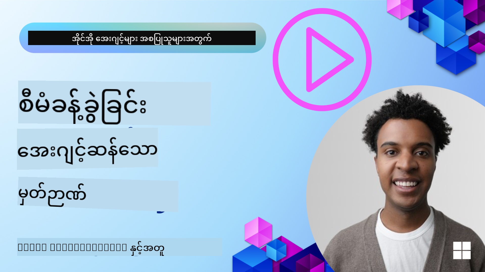

<!--
CO_OP_TRANSLATOR_METADATA:
{
  "original_hash": "d2c9703548140bafa2d6a77406552542",
  "translation_date": "2025-10-03T15:12:41+00:00",
  "source_file": "13-agent-memory/README.md",
  "language_code": "my"
}
-->
# AI အေးဂျင့်များအတွက် မှတ်ဉာဏ်

AI အေးဂျင့်များကို ဖန်တီးရာတွင် အထူးအကျိုးကျေးဇူးများကို ဆွေးနွေးသောအခါ၊ အဓိကအားဖြင့် အေးဂျင့်များ၏ တာဝန်များကို ပြည့်စုံစွာ ဆောင်ရွက်ရန် အထောက်အကူပြုသော tools များကို ခေါ်ယူနိုင်ခြင်းနှင့် အချိန်ကြာလာသည်နှင့်အမျှ တိုးတက်လာနိုင်ခြင်းတို့ကို အဓိကထားဆွေးနွေးကြသည်။ AI အေးဂျင့်များကို ကိုယ်တိုင်တိုးတက်လာနိုင်သော အေးဂျင့်အဖြစ် ဖန်တီးရန်အတွက် မှတ်ဉာဏ်သည် အခြေခံအဆင့်တစ်ခုဖြစ်သည်။

ဒီသင်ခန်းစာမှာ AI အေးဂျင့်များအတွက် မှတ်ဉာဏ်ဆိုတာ ဘာလဲ၊ အေးဂျင့်များ၏ အကျိုးကျေးဇူးအတွက် မှတ်ဉာဏ်ကို ဘယ်လို စီမံခန့်ခွဲပြီး အသုံးချနိုင်မလဲဆိုတာကို လေ့လာပါမည်။

## အကျဉ်းချုပ်

ဒီသင်ခန်းစာမှာ အောက်ပါအကြောင်းအရာများကို လေ့လာပါမည်-

• **AI အေးဂျင့်မှတ်ဉာဏ်ကို နားလည်ခြင်း**: မှတ်ဉာဏ်ဆိုတာ ဘာလဲ၊ အေးဂျင့်များအတွက် အရေးကြီးတဲ့အကြောင်း။

• **မှတ်ဉာဏ်ကို ထည့်သွင်းခြင်းနှင့် သိမ်းဆည်းခြင်း**: အေးဂျင့်များအတွက် အနာဂတ်မှတ်ဉာဏ်နှင့် ရေရှည်မှတ်ဉာဏ်ကို ထည့်သွင်းရန် လက်တွေ့နည်းလမ်းများ။

• **AI အေးဂျင့်များကို ကိုယ်တိုင်တိုးတက်လာစေရန်**: မှတ်ဉာဏ်က အေးဂျင့်များကို အတိတ်အတွေ့အကြုံများမှ သင်ယူပြီး အချိန်ကြာလာသည်နှင့်အမျှ တိုးတက်လာစေရန် ဘယ်လို အထောက်အကူပြုနိုင်မလဲ။

## သင်ယူရမည့်ရည်မှန်းချက်များ

ဒီသင်ခန်းစာပြီးဆုံးပြီးနောက်တွင် သင်သည် အောက်ပါအရာများကို သိရှိနိုင်ပါမည်-

• **AI အေးဂျင့်မှတ်ဉာဏ်အမျိုးအစားများကို ခွဲခြားနိုင်ခြင်း**: အလုပ်လုပ်နေသော မှတ်ဉာဏ်၊ အနာဂတ်မှတ်ဉာဏ်၊ ရေရှည်မှတ်ဉာဏ်နှင့် persona memory, episodic memory ကဲ့သို့ အထူး memory အမျိုးအစားများ။

• **AI အေးဂျင့်များအတွက် အနာဂတ်မှတ်ဉာဏ်နှင့် ရေရှည်မှတ်ဉာဏ်ကို ထည့်သွင်းခြင်းနှင့် စီမံခန့်ခွဲခြင်း**: Semantic Kernel framework ကို အသုံးပြုခြင်း၊ Mem0 နှင့် Whiteboard memory tools များကို အသုံးပြုခြင်း၊ Azure AI Search နှင့် ပေါင်းစပ်ခြင်း။

• **AI အေးဂျင့်များကို ကိုယ်တိုင်တိုးတက်လာစေရန် နောက်ခံအခြေခံအယူအဆများကို နားလည်ခြင်း**: memory management systems များက အဆက်မပြတ် သင်ယူခြင်းနှင့် အလျင်အမြန် ပြောင်းလဲနိုင်စွမ်းကို ဘယ်လို အထောက်အကူပြုနိုင်မလဲ။

## AI အေးဂျင့်မှတ်ဉာဏ်ကို နားလည်ခြင်း

အခြေခံအားဖြင့် **AI အေးဂျင့်များအတွက် မှတ်ဉာဏ်ဆိုတာ သတင်းအချက်အလက်များကို သိမ်းဆည်းပြီး ပြန်လည်သုံးနိုင်စေသော mechanism များကို ဆိုလိုသည်**။ ဒီသတင်းအချက်အလက်များမှာ စကားဝိုင်းတစ်ခုအတွင်းရှိ အချက်အလက်များ၊ အသုံးပြုသူ၏ အကြိုက်များ၊ အတိတ်လုပ်ဆောင်မှုများ၊ သို့မဟုတ် သင်ယူထားသော pattern များဖြစ်နိုင်သည်။

မှတ်ဉာဏ်မရှိပါက AI အက်ပလီကေးရှင်းများသည် အခြေအနေမရှိသော (stateless) ဖြစ်ပြီး၊ interaction တစ်ခုစတင်တိုင်း အစမှစရပါမည်။ ဒီအခြေအနေကြောင့် အေးဂျင့်သည် အတိတ် context သို့မဟုတ် အကြိုက်များကို "မေ့သွား" သည့် အတွေ့အကြုံများကြောင့် အသုံးပြုသူအတွက် ပြန်လည်ထပ်တလဲလဲဖြစ်ပြီး စိတ်ပျက်စရာကောင်းသော အခြေအနေဖြစ်လာနိုင်သည်။

### မှတ်ဉာဏ်အရေးကြီးမှု

အေးဂျင့်၏ ဉာဏ်ရည်သည် အတိတ်သတင်းအချက်အလက်များကို ပြန်လည်သုံးနိုင်စွမ်းနှင့် နက်နက်ရှိုင်းရှိုင်း ဆက်စပ်နေသည်။ မှတ်ဉာဏ်က အေးဂျင့်များကို အောက်ပါအတိုင်း ဖြစ်စေသည်-

• **အတိတ်အတွေ့အကြုံများမှ သင်ယူနိုင်စွမ်း**: အတိတ်လုပ်ဆောင်မှုများနှင့် ရလဒ်များမှ သင်ယူခြင်း။

• **အဆက်မပြတ် စကားဝိုင်းများကို ထိန်းသိမ်းနိုင်စွမ်း**: စကားဝိုင်းအတွင်း context ကို ထိန်းသိမ်းခြင်း။

• **အတိတ်အချက်အလက်များအပေါ် အခြေခံပြီး အလိုလိုလုပ်ဆောင်နိုင်စွမ်း**: အတိတ် data အပေါ် အခြေခံပြီး လိုအပ်ချက်များကို ကြိုတင်ခန့်မှန်းခြင်း သို့မဟုတ် သင့်တော်သော အဖြေများပေးခြင်း။

• **ကိုယ်တိုင်လုပ်ဆောင်နိုင်စွမ်း**: သိမ်းဆည်းထားသော အချက်အလက်များကို အသုံးပြု၍ ပိုမိုလွတ်လပ်စွာ လုပ်ဆောင်နိုင်ခြင်း။

မှတ်ဉာဏ်ကို ထည့်သွင်းခြင်း၏ ရည်မှန်းချက်မှာ အေးဂျင့်များကို ပိုမို **ယုံကြည်ရပြီး စွမ်းဆောင်နိုင်စွမ်းရှိစေရန်** ဖြစ်သည်။

### မှတ်ဉာဏ်အမျိုးအစားများ

#### အလုပ်လုပ်နေသော မှတ်ဉာဏ် (Working Memory)

ဒီအမျိုးအစားမှတ်ဉာဏ်ကို အေးဂျင့်တစ်ခု၏ ongoing task သို့မဟုတ် စဉ်းစားမှုအတွင်း အသုံးပြုသော temporary information အဖြစ် စဉ်းစားနိုင်သည်။ 

AI အေးဂျင့်များအတွက် အလုပ်လုပ်နေသော မှတ်ဉာဏ်သည် စကားဝိုင်းတစ်ခု၏ အရေးကြီးဆုံး အချက်အလက်များကို ဖမ်းယူပြီး၊ အရေးကြီးသော အချက်များကို extract လုပ်ခြင်း။

**အလုပ်လုပ်နေသော မှတ်ဉာဏ်ဥပမာ**

ခရီးသွားအေးဂျင့်တစ်ခုတွင် "ပဲရစ်ကို ခရီးသွားချင်တယ်" ဆိုသော အသုံးပြုသူ၏ လိုအပ်ချက်ကို immediate context အဖြစ် သိမ်းဆည်းထားပြီး လက်ရှိ interaction ကို လမ်းညွှန်ပေးသည်။

#### အနာဂတ်မှတ်ဉာဏ် (Short Term Memory)

ဒီအမျိုးအစားမှတ်ဉာဏ်သည် စကားဝိုင်းတစ်ခု၏ အတွင်း context ကို သိမ်းဆည်းထားပြီး၊ စကားဝိုင်းအတွင်း အတိတ်အကြောင်းအရာများကို ပြန်လည်ရယူနိုင်စေသည်။

**အနာဂတ်မှတ်ဉာဏ်ဥပမာ**

အသုံးပြုသူက "ပဲရစ်ကို လေယာဉ်ခရီးစရိတ်ဘယ်လောက်လဲ" ဟုမေးပြီး၊ "အဲဒီမှာ အိပ်စရာဘယ်လိုလဲ" ဟု ဆက်မေးပါက၊ အနာဂတ်မှတ်ဉာဏ်က "အဲဒီမှာ" ဆိုသည်မှာ "ပဲရစ်" ကို ဆိုလိုသည်ဟု သိရှိစေသည်။

#### ရေရှည်မှတ်ဉာဏ် (Long Term Memory)

ဒီအမျိုးအစားမှတ်ဉာဏ်သည် စကားဝိုင်းများနှင့် session များအကြား သတင်းအချက်အလက်များကို သိမ်းဆည်းထားပြီး၊ personalization အတွက် အရေးကြီးသည်။

**ရေရှည်မှတ်ဉာဏ်ဥပမာ**

"Ben သည် နှင်းလျှောစီးခြင်းနှင့် အပြင်ပန်းလှုပ်ရှားမှုများကို နှစ်သက်ပြီး၊ တောင်တန်းရှုခင်းရှိနေရာတွင် ကော်ဖီသောက်ရန်နှစ်သက်သည်၊ နှင်းလျှောစီးရာ advanced slope များကို ရှောင်ရှားရန်လိုအပ်သည်" ဆိုသော အချက်အလက်ကို သိမ်းဆည်းထားပြီး၊ အနာဂတ်ခရီးစီမံကိန်းများတွင် highly personalized အကြံပေးချက်များပေးနိုင်သည်။

#### Persona Memory

ဒီ memory အမျိုးအစားသည် အေးဂျင့်တစ်ခု၏ consistent personality သို့မဟုတ် role ကို ဖွံ့ဖြိုးစေသည်။

**Persona Memory Example**

ခရီးသွားအေးဂျင့်ကို "နှင်းလျှောစီး expert planner" အဖြစ် ဖန်တီးထားပါက၊ persona memory က အေးဂျင့်၏ expert tone နှင့် knowledge ကို ထိန်းသိမ်းပေးသည်။

#### Workflow/Episodic Memory

ဒီ memory က အေးဂျင့်တစ်ခု၏ complex task အတွင်း success နှင့် failure အဆင့်များကို သိမ်းဆည်းထားသည်။

**Episodic Memory Example**

အေးဂျင့်က လေယာဉ်တစ်စင်းကို book လုပ်ရန် ကြိုးစားခဲ့ပြီး၊ အတည်ပြုမရသည့်အခြေအနေကို သိမ်းဆည်းထားပြီး၊ နောက်တစ်ကြိမ်တွင် alternative flight များကို ကြိုးစားရန် သို့မဟုတ် အသုံးပြုသူကို informed အဖြေများပေးရန် အထောက်အကူပြုသည်။

#### Entity Memory

ဒီ memory က စကားဝိုင်းများမှ specific entities (လူများ၊ နေရာများ၊ အရာများ) နှင့် အဖြစ်အပျက်များကို extract လုပ်ပြီး သိမ်းဆည်းထားသည်။

**Entity Memory Example**

"Le Chat Noir" တွင် ညစာစားခဲ့သည်ဟု စကားဝိုင်းတစ်ခုမှ extract လုပ်ထားပြီး၊ နောက်တစ်ကြိမ်တွင် "Le Chat Noir" တွင် reservation ပြုလုပ်ရန် အကြံပေးနိုင်သည်။

#### Structured RAG (Retrieval Augmented Generation)

Structured RAG သည် semantic similarity အပေါ်မူတည်သည့် classic RAG ထက် သတင်းအချက်အလက်များ၏ inherent structure ကို အသုံးပြု၍ precision, recall, speed တိုးတက်စေသည်။

**Structured RAG Example**

Structured RAG က email မှ flight details (destination, date, time, airline) ကို structured အနေနှင့် extract လုပ်ထားပြီး၊ "မင်္ဂလာနေ့တွင် ပဲရစ်သို့ ဘယ်လေယာဉ်ကို book လုပ်ခဲ့လဲ" ဆိုသော precise query များကို ဖြေရှင်းနိုင်သည်။

## မှတ်ဉာဏ်ကို ထည့်သွင်းခြင်းနှင့် သိမ်းဆည်းခြင်း

AI အေးဂျင့်များအတွက် memory management ကို systematic process အဖြစ် စီမံခန့်ခွဲရမည်။ memory management တွင် generate, store, retrieve, integrate, update, delete အဆင့်များပါဝင်သည်။

### အထူး memory tools များ

Mem0 က persistent memory layer အဖြစ် အေးဂျင့်များကို relevant interaction များကို ပြန်လည်သတိရစေပြီး၊ user preferences နှင့် factual context များကို သိမ်းဆည်းထားသည်။

### RAG ဖြင့် memory သိမ်းဆည်းခြင်း

Azure AI Search ကို backend memory storage အဖြစ် အသုံးပြုနိုင်သည်။ Structured RAG က conversation history, emails, images ကဲ့သို့သော data များမှ dense, structured information ကို extract လုပ်ပြီး၊ superhuman precision နှင့် recall ပေးသည်။

## AI အေးဂျင့်များကို ကိုယ်တိုင်တိုးတက်လာစေရန်

"knowledge agent" pattern ကို အသုံးပြု၍ self-improving agent များကို ဖန်တီးနိုင်သည်။ knowledge agent သည် အရေးကြီးသော သတင်းအချက်အလက်များကို extract လုပ်ပြီး knowledge base တွင် သိမ်းဆည်းထားသည်။

### မှတ်ဉာဏ်အတွက် အဆင့်မြှင့်တင်မှုများ

• **Latency Management**: အချက်အလက်များကို store/retrieve လုပ်ရန် အချိန်မကြာစေဖို့ အမြန်ဆုံး model ကို အသုံးပြုခြင်း။

• **Knowledge Base Maintenance**: အချက်အလက်များကို "cold storage" သို့ ရွှေ့ခြင်း။

## AI အေးဂျင့်မှတ်ဉာဏ်အကြောင်း မေးခွန်းများရှိပါသလား?

[Azure AI Foundry Discord](https://aka.ms/ai-agents/discord) တွင် အခြားသော သင်ယူသူများနှင့် တွေ့ဆုံပြီး၊ office hours တွင် ပါဝင်ကာ AI အေးဂျင့်များနှင့် ပတ်သက်သော မေးခွန်းများကို ဖြေရှင်းနိုင်ပါသည်။

---

**အကြောင်းကြားချက်**:  
ဤစာရွက်စာတမ်းကို AI ဘာသာပြန်ဝန်ဆောင်မှု [Co-op Translator](https://github.com/Azure/co-op-translator) ကို အသုံးပြု၍ ဘာသာပြန်ထားပါသည်။ ကျွန်ုပ်တို့သည် တိကျမှုအတွက် ကြိုးစားနေသော်လည်း အလိုအလျောက် ဘာသာပြန်မှုများတွင် အမှားများ သို့မဟုတ် မတိကျမှုများ ပါဝင်နိုင်သည်ကို သတိပြုပါ။ မူရင်းဘာသာစကားဖြင့် ရေးသားထားသော စာရွက်စာတမ်းကို အာဏာတရ အရင်းအမြစ်အဖြစ် သတ်မှတ်သင့်ပါသည်။ အရေးကြီးသော အချက်အလက်များအတွက် လူ့ဘာသာပြန်ပညာရှင်များကို အသုံးပြုရန် အကြံပြုပါသည်။ ဤဘာသာပြန်မှုကို အသုံးပြုခြင်းမှ ဖြစ်ပေါ်လာသော အလွဲအလွတ်များ သို့မဟုတ် အနားလွဲမှုများအတွက် ကျွန်ုပ်တို့သည် တာဝန်မယူပါ။