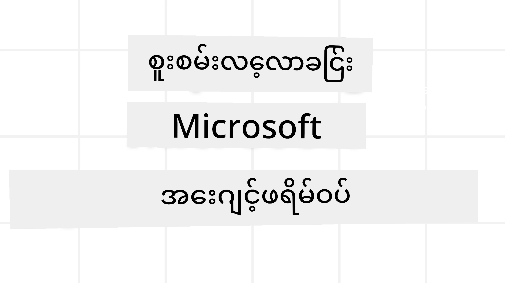
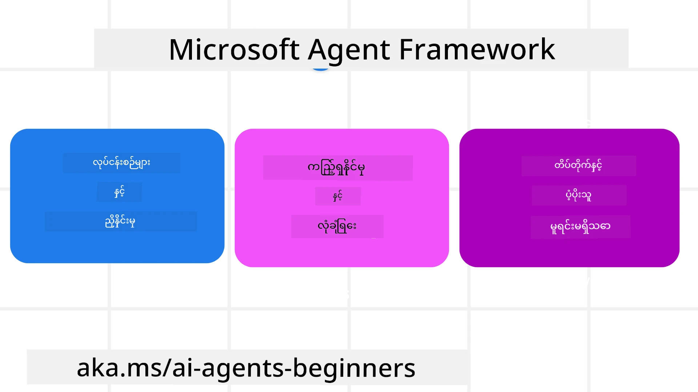
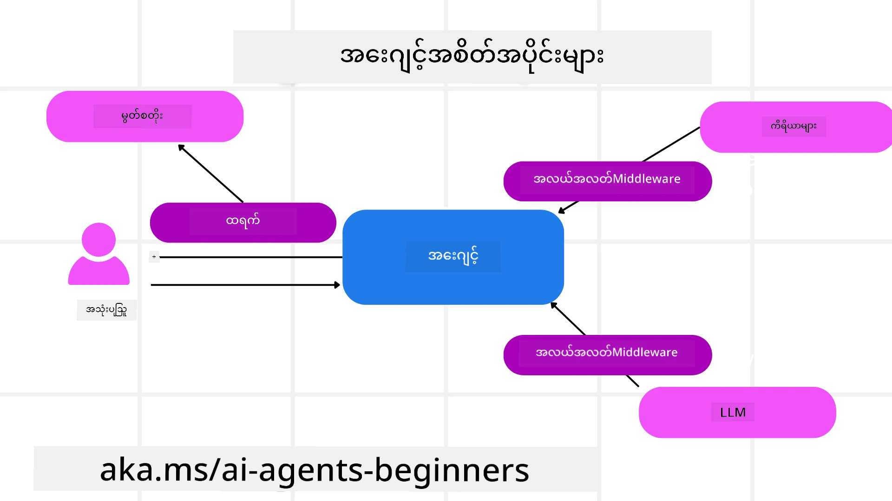

# Microsoft Agent Framework ကို စူးစမ်းလေ့လာခြင်း



### နိဒါန်း

ဒီသင်ခန်းစာမှာ အောက်ပါအချက်များကို ဖေါ်ပြပါမယ်။

- Microsoft Agent Framework ကို နားလည်ခြင်း - အဓိက လက္ခဏာများနှင့် တန်ဖိုးများ  
- Microsoft Agent Framework ၏ အဓိကအယူအဆများ စူးစမ်းလေ့လာခြင်း
- အဆင့်မြင့် MAF ပုံစံများ - မူဝါဒလမ်းကြောင်းများ၊ Middleware နှင့် မွတ်စလင်

## သင်ယူရမည့်ရည်မှန်းချက်များ

ဒီသင်ခန်းစာပြီးဆုံးပါက သင်အောက်ပါ အရာများကို သတိရနိုင်ပါလိမ့်မည်။

- Microsoft Agent Framework ကို အသုံးပြု၍ ထုတ်လုပ်မှုသင့် AI Agents တည်ဆောက်ခြင်း
- Microsoft Agent Framework ၏ အဓိက လက္ခဏာများကို သင့် Agentic အသုံးပြုမှုအတွက် အသုံးပြုခြင်း
- အဆင့်မြင့် ပုံစံများဖြစ်သော မူဝါဒလမ်းကြောင်းများ၊ middleware နှင့် စောင့်ကြည့်ရန် နည်းလမ်းများကို သုံးခြင်း

## ကိုဒ်နမူနာများ

[Microsoft Agent Framework (MAF)](https://aka.ms/ai-agents-beginners/agent-framework) တွင်ကိုဒ်နမူနာများကို ဒီ repository ၏ `xx-python-agent-framework` နှင့် `xx-dotnet-agent-framework` ဖိုင်များတွင် ရှာဖွေနိုင်ပါသည်။

## Microsoft Agent Framework ကို နားလည်ခြင်း



[Microsoft Agent Framework (MAF)](https://aka.ms/ai-agents-beginners/agent-framework) သည် Microsoft ၏ AI agent များ ဆောက်လုပ်ရန်အတွက် ထိတွေ့သည့် framework တစ်ခုဖြစ်သည်။ ၎င်းသည် ထုတ်လုပ်မှုနှင့် သုတေသနပတ်ဝန်းကျင် ရှိ ကိန်းတူ agentic အသုံးပြုမှုများအတွက် လိုအပ်ချက်များကို ဖြေရှင်းနိုင်ရန် လွတ်လပ်မှုများ ပေးသည်။

- **စဉ်ဆက်မပြတ် Agent စီမံခန့်ခွဲခြင်း** - အဆင့်လိုက် လုပ်ငန်းစဉ်များ လိုအပ်သော အခြေအနေများတွင်။
- **တပြိုင်နက် လုပ်ငန်းစဉ်စီမံခန့်ခွဲခြင်း** - Agent များ တစ်ပြိုင်နက်တည်း လုပ်ဆောင်ရမည့် အခြေအနေများတွင်။
- **အဖွဲ့အစည်း စကားပြော ဆွေးနွေးမှု စီမံခန့်ခွဲခြင်း** - Agent များ တစ်ခုတည်းသော အလုပ်အတွက် ပူးပေါင်း ဆောင်ရွက်နိုင်သော အခြေအနေများတွင်။
- **အလုပ်လွှဲ ပြောင်းပေးခြင်း စီမံခန့်ခွဲခြင်း** - Task များ၏ ညွှန်ကြားချက်များ ပြီးစီးသည့်အခါ Agent များ တစ်ဦးမှ တစ်ဦး သို့ အလုပ်လွှဲပြောင်းပေးနိုင်သော အခြေအနေများတွင်။
- **မက်ဂျစ် တစ်စ် မျဉ်း စီမံခန့်ခွဲခြင်း** - မန်နေဂျာ Agent တစ်ဦးသည် အလုပ်စာရင်းကို ဖန်တီးပြင်ဆင်ပြီး၊ Subagents များ၏ ညှိနှိုင်းမှုများကို ကိုင်တွယ်ပြီး အလုပ်များကို ပြီးစီးစေခြင်း။

ထုတ်လုပ်မှုတွင် AI Agents များ တင်ပို့ရန် MAF သည် အောက်တွင်ဖော်ပြသော လက္ခဏာများပါဝင်သည်။

- **စောင့်ကြည့်နိုင်မှုပြုခြင်း** - OpenTelemetry ကိုအသုံးပြုမှုမှတဆင့် AI Agent ၏ လုပ်ဆောင်ချက်တစ်ခုချင်းစီတွင် tools ခေါ်ဆိုခြင်း၊ စီမံခန့်ခွဲခြင်းအဆင့်များ၊ အကြောင်းတရားဖြတ်ပိုင်းများနှင့် Microsoft Foundry dashboard များမှ performance စောင့်ကြည့်မှုများပါဝင်သည်။
- **လုံခြုံရေး** - Agents များကို Microsoft Foundry အတွင်း သဘာဝအတိုင်း ထားရှိကာ Role-based access, ကိုယ်ပိုင်ဒေတာ ကိုင်တွယ်မှုနှင့် content လုံခြုံမှုများနှင့် အတူ လုံခြုံမှုထိန်းချုပ်မှုများ ပါဝင်သည်။
- **ခံနိုင်ရည်** - Agent threads နှင့် workflow များသည် တားဆီးမှုများအတွက် ရပ်တန့်၊ ပြန်ဆက်တင်၊ အမှားများမှ ပြန်ကောင်းစေခြင်းတို့ကို ပံ့ပိုးကာ ကြာရှည်သော လုပ်ငန်းစဉ်များ ရရှိစေသည်။
- **ထိန်းချုပ်မှု** - လူကွန်ရက်ဖြစ်သော workflow များကို ပံ့ပိုးရာတွင် လူ၏ အတည်ပြုချက်လိုအပ်သည့် အလုပ်များကို မှတ်သားပေးသည်။

Microsoft Agent Framework သည် ပူးပေါင်းလုပ်ဆောင်စေရန်လည်း အာရုံစိုက်ထားသည်။

- **Cloud-agnostic ဖြစ်ခြင်း** - Agents များကို containers, on-premises နှင့် မတူညီသော cloud များပေါ်တွင် အလုပ်လုပ်နိုင်သည်။
- **Provider-agnostic ဖြစ်ခြင်း** - Azure OpenAI နှင့် OpenAI အပါအဝင် သင့်နှစ်သက်ရာ SDK များစွာမှ Agents များကို ဖန်တီးနိုင်သည်။
- **Open Standards ပေါင်းစည်းမှု** - Agent-to-Agent (A2A) နှင့် Model Context Protocol (MCP) တွင် ပါဝင်သော ပရိုတိုကောများကို အသုံးပြု၍ အခြား Agent များနှင့် tools များကို ရှာဖွေနိုင်သည်။
- **Plugins နှင့် Connectors** - Microsoft Fabric, SharePoint, Pinecone နှင့် Qdrant ကဲ့သို့ ဒေတာနှင့် မွတ်စလင် ဝန်ဆောင်မှုများနှင့် ချိတ်ဆက်နိုင်သည်။

ယခုတော့ Microsoft Agent Framework ၏ အဓိကအယူအဆများအပေါ်၌ အဆိုပါ လက္ခဏာများ ရောထွေမှုကို ကြည့်လိုက်ကြပါစို့။

## Microsoft Agent Framework ၏ အဓိကအယူအဆများ

### Agents



**Agents ဖန်တီးခြင်း**

Agent ဖန်တီးခြင်းမှာ inference service (LLM Provider), AI Agent သည် လိုက်နာရမည့်ညွှန်ကြားချက်အစုလိုက်၊ နှင့် ဖော်ပြထားသော `name` တစ်ခု သတ်မှတ်ခြင်းဖြစ်သည်။


```python
agent = AzureOpenAIChatClient(credential=AzureCliCredential()).create_agent( instructions="You are good at recommending trips to customers based on their preferences.", name="TripRecommender" )
```

အထက်ပါနမူနာသည် `Azure OpenAI` အား အသုံးပြုသော်လည်း Agents များကို ကျယ်ပြန့်သော ဝန်ဆောင်မှုများမှ တစ်ဆင့် ဖန်တီးနိုင်ပြီး ထို့အနက် `Microsoft Foundry Agent Service` ပါဝင်သည်။

```python
AzureAIAgentClient(async_credential=credential).create_agent( name="HelperAgent", instructions="You are a helpful assistant." ) as agent
```

OpenAI ၏ `Responses`, `ChatCompletion` APIs များ

```python
agent = OpenAIResponsesClient().create_agent( name="WeatherBot", instructions="You are a helpful weather assistant.", )
```

```python
agent = OpenAIChatClient().create_agent( name="HelpfulAssistant", instructions="You are a helpful assistant.", )
```

ဒါမှမဟုတ် [MiniMax](https://platform.minimaxi.com/) ကို အသုံးပြုနိုင်ပြီး၊ ၎င်းသည် OpenAI နှင့် ကိုက်ညီသော API ကို 204K tokens ရှိသည့် ကြီးမားသော context windows များနှင့် ပံ့ပိုးသည်။

```python
agent = OpenAIChatClient(base_url="https://api.minimax.io/v1", api_key=os.environ["MINIMAX_API_KEY"], model_id="MiniMax-M3").create_agent( name="HelpfulAssistant", instructions="You are a helpful assistant.", )
```

ဒါမှမဟုတ် A2A protocol ကို အသုံးပြုသော remote agents များ။

```python
agent = A2AAgent( name=agent_card.name, description=agent_card.description, agent_card=agent_card, url="https://your-a2a-agent-host" )
```

**Agents မောင်းနှင်ခြင်း**

Agents များကို `.run` သို့မဟုတ် `.run_stream` များအား အသုံးပြု၍ non-streaming သို့မဟုတ် streaming responses များအတွက် မောင်းနှင့်နိုင်သည်။

```python
result = await agent.run("What are good places to visit in Amsterdam?")
print(result.text)
```

```python
async for update in agent.run_stream("What are the good places to visit in Amsterdam?"):
    if update.text:
        print(update.text, end="", flush=True)

```

တစ်ခုချင်းစီသော agent run တွင် `max_tokens`, agent သုံးနိုင်သော `tools`, နှင့် agent အတွက် သုံးစွဲမည့် `model` စသည်တို့ ကဲ့သို့သော parameter များကို ပြောင်းလဲလုပ်ဆောင်နိုင်သည့် ရွေးချယ်စရာများပါဝင်သည်။

၎င်းသည် အသုံးပြုသူ၏ အလုပ်ကို ပြီးမြောက်စေရန် အထူးသတ်မှတ်ထားသော မော်ဒယ်များ သို့မဟုတ် tools များ လိုအပ်သော ကိစ္စများတွင် အထူးသင့်တော်သည်။

**Tools များ**

Tools များကို Agent ကိုသတ်မှတ်ရာတွင် သတ်မှတ်နိုင်ပြီး။

```python
def get_attractions( location: Annotated[str, Field(description="The location to get the top tourist attractions for")], ) -> str: """Get the top tourist attractions for a given location.""" return f"The top attractions for {location} are." 


# ChatAgent ကို တိုက်ရိုက် ဖန်တီးတဲ့အချိန်မှာ

agent = ChatAgent( chat_client=OpenAIChatClient(), instructions="You are a helpful assistant", tools=[get_attractions]

```

နှင့် Agent ကို မောင်းထုတ်ရာတွင်လည်း သတ်မှတ်နိုင်ပါသည်။

```python

result1 = await agent.run( "What's the best place to visit in Seattle?", tools=[get_attractions] # ဤအသုံးပြုမှုအတွက်သာ ပေးထားသည့်ကိရိယာ)
```

**Agent Threads**

Agent Threads များကို multi-turn စကားပြောဆိုမှုများကို ကိုင်တွယ်ရန်အသုံးပြုသည်။ Threads များကို အောက်ပါအတိုင်း ဖန်တီးနိုင်သည်။

- `get_new_thread()` ကို သုံး၍ အချိန်ကြာလာတာမီ Thread ကို သိမ်းဆည်းနိုင်သည်။
- Agent run အချိန်တွင် ကိုယ့်အလိုအလျောက် Thread တည်ဆောက်ပြီး အဆိုပါ run အတွင်းသာ ရှိခြင်း ဖြစ်စေသည်။

Thread တည်ဆောက်ရန် ကုဒ်သည် အောက်ပါအတိုင်း ဖြစ်သည်။

```python
# သေးကြွေပုဒ်အသစ်တစ်ခု ဖန်တီးပါ။
thread = agent.get_new_thread() # သေးကြွေပုဒ်နှင့်အတူ အေးဂျင့်ကို လည်ပတ်ပါ။
response = await agent.run("Hello, I am here to help you book travel. Where would you like to go?", thread=thread)

```

ထို့နောက် thread ကို သိမ်းဆည်းရန် serialize လုပ်နိုင်သည်။

```python
# အသစ်သော တိရိစ္ဆာန်တစ်ခု ဖန်တီးပါ။
thread = agent.get_new_thread() 

# တိရိစ္ဆာန်နှင့်အတူ အေးဂျင့်ကို ပြေးပါ။

response = await agent.run("Hello, how are you?", thread=thread) 

# သိမ်းဆည်းမှုအတွက် တိရိစ္ဆာန်အား စီးရီးလိုက်ရေးဆွဲပါ။

serialized_thread = await thread.serialize() 

# သိမ်းဆည်းမှုမှ ထုတ်ပြီးနောက် တိရိစ္ဆာန်အခြေအနေကို ပြန်လည်ဖတ်ပါ။

resumed_thread = await agent.deserialize_thread(serialized_thread)
```

**Agent Middleware**

Agents များသည် Tools နှင့် LLM များနှင့် ပူးပေါင်းပြီး အသုံးပြုသူ၏ အလုပ်များကို ပြီးမြောက်စေသည်။ နည်းတစ်ခုမှာ ၎င်းတို့အကြား အရာတစ်ခုချင်း လုပ်ဆောင်ခြင်း သို့မဟုတ် တွေ့ရှိခြင်း ပြုလုပ်ချင်သည်ဆိုလျှင် Agent middleware ဖြစ်သည်။

*Function Middleware*

ဒီ middleware သည် Agent နှင့် function/tool ၏ ခေါ်ဆောင်ချက်အကြား ကိန်းလုပ်ဆောင်ရန် သို့မဟုတ် မှတ်တမ်းတင်ရန် ခွင့်ပြုသည်။ ဥပမာအားဖြင့် function call တွင် logging ပြုလုပ်လိုသောအခါ အသုံးပြုနိုင်သည်။

အောက်ပါကုဒ်တွင် `next` သည် နောက်ထပ် middleware သို့မဟုတ် အလုပ်တကယ်လုပ်ကိုင်သော function ကို ခေါ်ရန် သတ်မှတ်သည်။

```python
async def logging_function_middleware(
    context: FunctionInvocationContext,
    next: Callable[[FunctionInvocationContext], Awaitable[None]],
) -> None:
    """Function middleware that logs function execution."""
    # ကြိုတင်ပြုလုပ်ခြင်း: ဖွင့်ဆောင်ရွက်မှုမတိုင်မှီ မှတ်တမ်းတင်ခြင်း
    print(f"[Function] Calling {context.function.name}")

    # နောက်ထပ် middleware သို့မဟုတ် ဖွင့်ဆောင်ရွက်မှုဆက်လက်လုပ်ဆောင်ရန်
    await next(context)

    # နောက်ဆက်တွဲလုပ်ငန်း: ဖွင့်ဆောင်ရွက်ပြီးမှတ်တမ်းတင်ခြင်း
    print(f"[Function] {context.function.name} completed")
```

*Chat Middleware*

ဒီ middleware သည် Agent နှင့် LLM ၏ အကြား ပြုလုပ်သော အဆိုပြုချက်များအကြား လုပ်ဆောင်ချက်တစ်ခု များ များကို စောင့်ကြည့် သို့မဟုတ် မှတ်တမ်းတင်နိုင်သည်။

၎င်းတွင် AI ဝန်ဆောင်မှုသို့ ပေးပို့သော `messages` အချက်အလက်များ ပါဝင်သည်။

```python
async def logging_chat_middleware(
    context: ChatContext,
    next: Callable[[ChatContext], Awaitable[None]],
) -> None:
    """Chat middleware that logs AI interactions."""
    # ကြိုတင်ဖြေရှင်းမှု: AI အကြောင်းရင်းခေါ်ဆိုမှုမတိုင်ခင် မှတ်တမ်းတင်ခြင်း
    print(f"[Chat] Sending {len(context.messages)} messages to AI")

    # နောက်ထပ် middleware သို့မဟုတ် AI ဝန်ဆောင်မှုသို့ ဆက်လက်သွားပါ
    await next(context)

    # ပြီးစီးပြီးနောက်: AI အဖြေ ပြန်လာပြီး အဆုံးမှတ်တမ်းတင်ခြင်း
    print("[Chat] AI response received")

```

**Agent Memory**

`Agentic Memory` သင်ခန်းစာတွင်ဖော်ပြထားသည့်အတိုင်း_memory_ သည် Agent ကို ကွဲပြားသော context များအတွင်း လည်ပတ်နိုင်စေရန် အရေးကြီးသော အချက်တစ်ခုဖြစ်သည်။ MAF တွင်_memory_ အမျိုးအစား လေးမျိုး ရှိပါသည်။

*In-Memory Storage*

ဤ memory သည် application runtime အတွင်း Threads များ၌ သိမ်းဆည်းထားသော memory ဖြစ်သည်။

```python
# သစ်သတ်ထိုးတစ်ခုအသစ် ဖန်တီးပါ။
thread = agent.get_new_thread() # အသတ်ထိုးနှင့်အတူ အေးဂျင့်ကို တွန်းလှန်ပါ။
response = await agent.run("Hello, I am here to help you book travel. Where would you like to go?", thread=thread)
```

*Persistent Messages*

ဒီ memory ကို session များ အလျားအလတ် တွင် စကားပြောဆိုမှုသမိုင်းတမ်းကို သိမ်းဆည်းရန် အသုံးပြုသည်။ ၎င်းကို `chat_message_store_factory` ဖြင့် သတ်မှတ်ထားသည်။

```python
from agent_framework import ChatMessageStore

# ဆက်သွယ်စာကိုယ်ပိုင်ဂိုဒေါင်တစ်ခုဖန်တီးပါ
def create_message_store():
    return ChatMessageStore()

agent = ChatAgent(
    chat_client=OpenAIChatClient(),
    instructions="You are a Travel assistant.",
    chat_message_store_factory=create_message_store
)

```

*Dynamic Memory*

ဒီ memory သည် agents မောင်းနှင်မှုမပြုမီ context ထဲ ထည့်သွင်းသည်။ ဒီ memory များကို mem0 ကဲ့သို့သော ပြင်ပဝန်ဆောင်မှုများတွင် သိမ်းဆည်းနိုင်သည်။

```python
from agent_framework.mem0 import Mem0Provider

# ကြိုတင်မှတ်ဉာဏ်စွမ်းရည်များအတွက် Mem0 ကို အသုံးပြုခြင်း
memory_provider = Mem0Provider(
    api_key="your-mem0-api-key",
    user_id="user_123",
    application_id="my_app"
)

agent = ChatAgent(
    chat_client=OpenAIChatClient(),
    instructions="You are a helpful assistant with memory.",
    context_providers=memory_provider
)

```

**Agent Observability**


တရားဝင်စနစ်များကို ယုံကြည်စိတ်ချရပြီး ထိန်းသိမ်းစောင့်ရှောက်ရ လွယ်ကူစေရန် Observability သည် အရေးကြီးသည်။ MAF သည် observability ကို ပိုမိုကောင်းမွန်စေရန် tracing နှင့် meters များ ပေးဆောင်ရန် OpenTelemetry နှင့် ပူးပေါင်းလုပ်ဆောင်သည်။

```python
from agent_framework.observability import get_tracer, get_meter

tracer = get_tracer()
meter = get_meter()
with tracer.start_as_current_span("my_custom_span"):
    # တစ်ခုခုလုပ်ပါ
    pass
counter = meter.create_counter("my_custom_counter")
counter.add(1, {"key": "value"})
```

### အလုပ်စဉ်များ (Workflows)

MAF သည် တာဝန်တစ်ခုကိုပြီးမြောက်စေရန် ကြိုတင်သတ်မှတ်ထားသောအဆင့်များဖြစ်သည့် အလုပ်စဉ်များကို ပံ့ပိုးပေးပြီး ထိုအဆင့်များတွင် AI agents များကို ကဏ္ဍအဖြစ် ပါဝင်ပါသည်။

အလုပ်စဉ်များမှာ ဆက်သွယ်မှုကောင်းမွန်အောင် ထိရောက်သော ထိန်းချုပ်မှု ကိုအတွက် ကဏ္ဍအမျိုးမျိုးဖြင့် ဖွဲ့စည်းထားသည်။ အလုပ်စဉ်များသည် **multi-agent orchestration** နှင့် **checkpointing** ကိုလည်း ထောက်ပံ့ပေးကာ အလုပ်စဉ်၏ အခြေအနေများကို သိမ်းဆည်းနိုင်သည်။

အလုပ်စဉ်၏ အဓိကကဏ္ဍများမှာ-

**အကောင်အထည်ဖော်သူများ (Executors)**

အကောင်အထည်ဖော်သူများသည် input စာတိုက်များ လက်ခံပြီး သတ်မှတ်ထားသော တာဝန်များကို ပြုလုပ်ပြီးနောက် output စာတိုက်တစ်ခု ထုတ်ပေးသည်။  ၎င်းသည် အလုပ်စဉ်ကို ဆက်လက်တိုးတက်စေပြီး တာဝန်ကြီးကို ပြီးမြောက်စေသည်။ အကောင်အထည်ဖော်သူများသည် AI agent ဖြစ်လို့ရ၊ custom logic ဖြစ်လို့လည်း ရပါသည်။

**ဆက်သွယ်မှုများ (Edges)**

ဆက်သွယ်မှုများသည် အလုပ်စဉ်အတွင်း စာတိုက်များ၏ ဆက်သွယ်မှုလမ်းကြောင်းကို သတ်မှတ်ရန် အတွက် အသုံးပြုသည်။ ၎င်းများမှာ-

*တိုက်ရိုက် ဆက်သွယ်မှုများ (Direct Edges)* - အကောင်အထည်ဖော်သူများအကြား ရိုးရိုးရှင်းရှင်း တစ်ကိုယ်တစ်တစ် ဆက်သွယ်မှုများဖြစ်သည်။

```python
from agent_framework import WorkflowBuilder

builder = WorkflowBuilder()
builder.add_edge(source_executor, target_executor)
builder.set_start_executor(source_executor)
workflow = builder.build()
```

*အခြေအနေဆိုင်ရာဆက်သွယ်မှုများ (Conditional Edges)* - သတ်မှတ်ထားသော အခြေအနေ ဖြစ်လာပြီးနောက် တက်ကြွစွာ ဆောင်ရွက်သည်။ ဥပမာ၊ ဟိုတယ်အခန်းများ မရရှိနိုင်သောအခါ အကောင်အထည်ဖော်သူတစ်ဦးက အခြားရွေးချယ်စရာများ အကြံပြုနိုင်သည်။

*Switch-case ဆက်သွယ်မှုများ* - သတ်မှတ်ထားသောအခြေအနေများအပေါ် မူတည်၍ စာတိုက်များကို အကောင်အထည်ဖော်သူများ သို့လမ်းညွှန်ပေးသည်။ ဥပမာ။ ခရီးသွားဖောက်သည်တွင် ဦးစားပေး ခွင့်ရှိပြီး ၎င်းတို့၏ တာဝန်များကို အခြားအလုပ်စဉ်မှတဆင့် ကိုင်တွယ်မည်။

*Fan-out ဆက်သွယ်မှုများ* - တစ်ခုသောစာတိုက်ကို ပရိသတ်အများစုသို့ ပေးပို့ခြင်း။

*Fan-in ဆက်သွယ်မှုများ* - အကောင်အထည်ဖော်သူများ အမျိုးမျိုးမှ စာတိုက်များကိုစုစည်းပြီး တစ်ခုသော ပိုင်းသို့ ပေးပို့ခြင်း။

**ဖြစ်ရပ်များ (Events)**

အလုပ်စဉ်များအပေါ် ပိုမိုကောင်းမွန်သော observability ပေးရန်အတွက် MAF သည် အကောင်အထည်ဖော်မှုအတွင်း ဖြစ်ပွားသည့် ဖြစ်ရပ်များကို အင်္ဂါရပ် အဖြစ် ပံ့ပိုးပေးသည်။

- `WorkflowStartedEvent`  - အလုပ်စဉ် အကောင်အထည်ဖော်မှု စတင်သည်
- `WorkflowOutputEvent` - အလုပ်စဉ် မှထွက်လာသော အချက်အလက်
- `WorkflowErrorEvent` - အလုပ်စဉ်တွင် လွှဲမှားမှု ဖြစ်ပွားသည်
- `ExecutorInvokeEvent`  - အကောင်အထည်ဖော်သူ အလုပ်စတင်
- `ExecutorCompleteEvent`  -  အကောင်အထည်ဖော်သူ အလုပ်ပြီးဆုံး
- `RequestInfoEvent` - တောင်းဆိုမှုတစ်ခု ထုတ်ပြန်သည်

## MAF နည်းပညာမြင့် မျိုးစုံ

အထက်ဖော်ပြထားသော အပိုင်းများတွင် Microsoft Agent Framework ၏ အဓိကအကြောင်းအရာများကို ဖော်ပြထားသည်။ ရှုပ်ထွေးသော အေးဂျင့်များ ဖန်တီးရာတွင် ပိုမိုခွဲခြားစိတ်ဖြာပြီး အောက်ပါ နည်းပညာမြင့် မျိုးစုံများကို စဥ်းစားနိုင်ပါသည်-

- **Middleware ဖွဲ့စည်းခြင်း**: လိုဂ်ဖြတ်ခြင်း၊ မှတ်ပုံတင်ခြင်း၊ အမြန်နှုန်းကန့်သတ်ခြင်း စသည့် middleware handlers များကို function နှင့် chat middleware အသုံးပြု၍ အေးဂျင့်အပြုအမူကို ပိုမိုတိကျသော ထိန်းချုပ်မှု ရရှိစေရန် သန်းခေါ်ခြင်း။
- **အလုပ်စဉ် Checkpointing**: အလုပ်စဉ်ဖြစ်ရပ်များ နှင့် serialization ကို အသုံးပြု၍ ရေရှည်အလုပ်လုပ်နေသော အေးဂျင့်များ၏ ဖြစ်ရပ်အခြေအနေများ သိမ်းဆည်းပြီး ပြန်လည်ဆက်လက် အသုံးပြုနိုင်စေရန်။
- **Dynamic ပစ္စည်းရွေးချယ်ခြင်း**: tool ဖော်ပြချက်များအပေါ် RAG ကိုပေါင်းစပ်၍ MAF ၏ tool မှတ်ပုံတင်မှုနှင့် လိုက်၍ မေးခွန်းအလိုက် ပိုမိုသက်ဆိုင်သော tool များကိုသာ ပြသရန်။
- **Multi-Agent လျှောလည်ပေးခြင်း**: အလုပ်စဉ်ဆက်သွယ်ချက်များနှင့် အခြေအနေဆိုင်ရာ မောင်းနှင်မှုများကိုအသုံးပြု၍ သီးခြားအေးဂျင့်များအကြား လျှောလည်ပေးမှုကို စည်းရုံးခြင်း။

## Microsoft Foundry တွင် LangChain / LangGraph အေးဂျင့်များကို ဖျော်ဖြေရန်

Microsoft Agent Framework သည် **framework-interoperable** တစ်ခုဖြစ်၍ MAF ဖြင့်သာ မရေးသားထားသော အေးဂျင့်များကိုလည်း ကန့်သတ်ခြင်းမရှိပါ။ သင်တွင် **LangChain** သို့မဟုတ် **LangGraph** အသုံးပြု င့်ပြီးသား အေးဂျင့်ရှိပါက Foundry ၏ runtime, session, scaling, identity နှင့် protocol endpoint များကို စီမံခန့်ခွဲပေးသည့် **Microsoft Foundry hosted agent** အဖြစ် ထုတ်ပြန်နိုင်ပြီး သင်၏ agent logic သည် LangGraph တွင် ဆက်လက်တည်ရှိနိုင်ပါသည်။

၎င်းကို `langchain_azure_ai.agents.hosting` ပက်ကေ့ဂျ်က တစ်ခုတည်းသော protocol များအားဖြင့် ဖွဲ့စည်းထားသော compiled LangGraph graph ကိုဖော်ပြသည်။

**၁။ hosting extra ကို ထည့်သွင်းရန်:**

```bash
pip install -U "langchain-azure-ai[hosting]>=1.2.4" azure-identity
```

`hosting` extra သည် Foundry protocol library များ ဖြစ်သည့် `azure-ai-agentserver-responses` (OpenAI-compatible `/responses` endpoint) နှင့် `azure-ai-agentserver-invocations` (generic `/invocations` endpoint) ကို ထည့်သွင်းသည်။

**၂။ hosting protocol တစ်ခု ရွေးချယ်ရန်:**

| Protocol | Host class | Endpoint | အသုံးပြုရန် |
|----------|-----------|----------|----------|
| **Responses** | `ResponsesHostServer` | `/responses` | OpenAI-compatible chat, streaming, response history, နှင့် စကားပြော ဆက်သွယ်မှု threading ကိုလိုချင်သောအခါ - စကားပြောအေးဂျင့်များအတွက် အဖွင့်ချိန်ရိုးရာ default ဖြစ်သည်။ |
| **Invocations** | `InvocationsHostServer` | `/invocations` | သင့်အား custom JSON ပုံစံတစ်ခု၊ webhook-style endpoint သို့မဟုတ် ဆက်သွယ်မှုမပါသော ပြုလုပ်မှုများ လိုအပ်သောအခါ။ |

**Responses API သည် Foundry တွင် အေးဂျင့်ပုံစံဖွဲ့စည်းမူအတွက် အဓိက API ဖြစ်သောကြောင့်** များစွာသော အေးဂျင့်များအတွက် အများဆုံး `ResponsesHostServer` ဖြင့် စတင်သင့်သည်။

**၃။ ပတ်ဝန်းကျင် environment variable များကို ပြင်ဆင်ရန်** (`az login` ဆောင်ရွက်ပြီး `DefaultAzureCredential` သည် authentication လုပ်နိုင်ရန်):

```bash
export FOUNDRY_PROJECT_ENDPOINT="https://<resource>.services.ai.azure.com/api/projects/<project>"
export FOUNDRY_MODEL_NAME="gpt-4.1"
```

အေးဂျင့်သည် နောက်ပိုင်း Foundry hosted agent တစ်ခုအဖြစ် အလုပ်လုပ်စဉ်တွင် platform သည် `FOUNDRY_PROJECT_ENDPOINT` ကို အလိုအလျောက် ထည့်သွင်းပေးမည်ဖြစ်သည်။

**၄။ LangGraph အေးဂျင့်တစ်ခုကို Responses protocol အပေါ် ဖော်ပြရန်:**

```python
import os

from azure.ai.projects import AIProjectClient
from azure.identity import DefaultAzureCredential, get_bearer_token_provider
from langchain.agents import create_agent
from langchain_openai import ChatOpenAI
from langchain_azure_ai.agents.hosting import ResponsesHostServer

_AZURE_AI_SCOPE = "https://ai.azure.com/.default"


def build_chat_model() -> ChatOpenAI:
    project_endpoint = os.environ["FOUNDRY_PROJECT_ENDPOINT"].rstrip("/")
    deployment = os.environ.get("FOUNDRY_MODEL_NAME", "gpt-4.1")
    credential = DefaultAzureCredential()
    project = AIProjectClient(endpoint=project_endpoint, credential=credential)
    openai_client = project.get_openai_client()
    token_provider = get_bearer_token_provider(credential, _AZURE_AI_SCOPE)

    # ဒီမှာ ChatOpenAI က Foundry ပရောဂျက်ရဲ့ OpenAI-compatible (Responses) endpoint ကိုရည်ရွယ်ထားပါတယ်။
    return ChatOpenAI(
        model=deployment,
        base_url=str(openai_client.base_url),
        api_key=token_provider,
    )


def main() -> None:
    graph = create_agent(build_chat_model(), tools=[])
    port = int(os.environ.get("PORT", "8088"))
    ResponsesHostServer(graph).run(port=port)


if __name__ == "__main__":
    main()
```

ဒါကို ဒေသတွင်း `python main.py` ဖြင့် चालှောင်ပြီးနောက် `http://localhost:8088/responses` သို့ Responses တောင်းဆိုမှု ပေးပို့နိုင်သည်။

**အဓိက အပြုအမူများ:**

- **စကားပြောမှုများ**: ဖောက်သည်များသည် `previous_response_id` သို့မဟုတ် `conversation` ID ကို ပေးပို့ခြင်းအားဖြင့် စကားပြောမှုကို ဆက်လက်လုပ်ဆောင်နိုင်သည်။ သင်၏ graph သည် LangGraph checkpointer ဖြင့် compiled ပြုလုပ်ထားပါက Foundry သည် စကားပြောမှုအခြေအနေကို checkpoint နှင့် နှိုင်းယှဉ်သည် (ထုတ်လုပ်မှုတွင် durable checkpointer ကိုသုံးရန်; ဒေသတွင်း စမ်းသပ်မှုအတွက် `MemorySaver` အဆင်ပြေလိမ့်မည်)။
- ** လူနှင့် အတူ လက်ဆောင်မှု**: သင်၏ graph သည် LangGraph ၏ `interrupt()` အား အသုံးပြုပါက, `ResponsesHostServer` သည် pending interrupt ကို Responses ၏ `function_call` / `mcp_approval_request` ပစ္စည်းအဖြစ် ပြသပြီး ဖောက်သည်များသည် တူညီသော `function_call_output` / `mcp_approval_response` ဖြင့် ဆက်လက် ပြုလုပ်နိုင်သည်။
- **Foundry သို့ Deploy လုပ်ခြင်း**: Azure Developer CLI ကိုအသုံးပြုပါ — `azd ext install azure.ai.agents`, `azd ai agent init -m <manifest>`, `azd ai agent run` (ဒေသတွင်း, Docker လိုအပ်သည်), ထို့နောက် `azd provision` နှင့် `azd deploy` လုပ်ဆောင်ပါ။ Hosted-agent ထုတ်ဖော်ရေးရာတွင် **Foundry Project Manager** ခွင့်ပြုချက် လိုအပ်သည်။

ဤနမူနာ၏ runnable ဖိုင်ကို [code-samples/14-langchain-hosted-agent.py](../../../14-microsoft-agent-framework/code-samples/14-langchain-hosted-agent.py) တွင်တွေ့နိုင်သည်။ လုံးလုံးလေးလမ်းညွှန်မှု (Invocations protocol, custom request schemas နှင့် troubleshooting) အတွက် [Host LangGraph agents as Foundry hosted agents](https://learn.microsoft.com/azure/foundry/how-to/develop/langchain-hosted-agents) ကိုလေ့လာပါ။

## ကုတ်နမူနာများ

Microsoft Agent Framework အတွက် ကုတ်နမူနာများကို ဤ repository တွင် `xx-python-agent-framework` နှင့် `xx-dotnet-agent-framework` ဖိုင်များအောက်တွင် လေ့လာနိုင်သည်။

## Microsoft Agent Framework နှင့် ပတ်သက်၍ နောက်ထပ်မေးခွန်းများရှိပါသလား?

အခြားသင်ယူသူများနှင့် တွေ့ဆုံရန်၊ ရုံးချိန်များတက်ရောက်ရန်နှင့် သင့် AI Agents တို့ဆိုင်ရာ မေးခွန်းများကို ဖြေရှင်းရန် [Microsoft Foundry Discord](https://discord.com/invite/ATgtXmAS5D) ကို ဝင်ရောက်ပါ။

---

<!-- CO-OP TRANSLATOR DISCLAIMER START -->
**ပြောကြားချက်**
ဤစာတမ်းကို AI ဘာသာပြန်ဝန်ဆောင်မှု [Co-op Translator](https://github.com/Azure/co-op-translator) အသုံးပြု၍ ဘာသာပြန်ထားပါသည်။ ကျွန်ုပ်တို့သည် တိကျမှန်ကန်မှုအတွက် ကြိုးပမ်းနေသော်လည်း၊ စက်ကိရိယာဘာသာပြန်ခြင်းများတွင် အမှားများ သို့မဟုတ် မှားယွင်းချက်များ ပါဝင်နိုင်ကြောင်း သတိပြုပါရန် လိုအပ်ပါသည်။ မူလစာတမ်းကို မူရင်းဘာသာဖြင့်သာ ယုံကြည်စိတ်ချရသော အချက်အလက်အဖြစ် သတ်မှတ်သင့်သည်။ အရေးကြီးသည့် သတင်းအချက်အလက်များအတွက် ပရော်ဖက်ရှင်နယ် လူသားဘာသာပြန်သူဝန်ဆောင်မှုကို အကြံပြုပါသည်။ ဤဘာသာပြန်ချက်ကို အသုံးပြုခြင်းမှ ဖြစ်ပေါ်လာသော နားလည်မှုကွာခြားမှုများ သို့မဟုတ် မမှန်ကန်သော အသုံးပြုမှုများအတွက် ကျွန်ုပ်တို့ တာဝန်မခံပါ။
<!-- CO-OP TRANSLATOR DISCLAIMER END -->