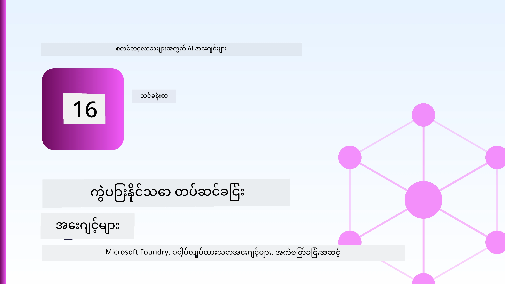
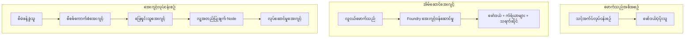
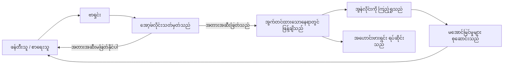
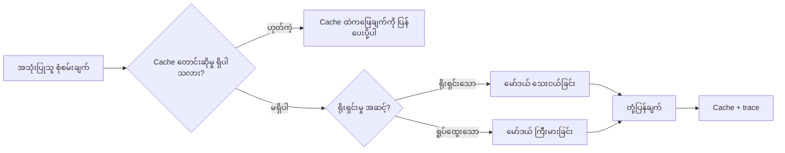
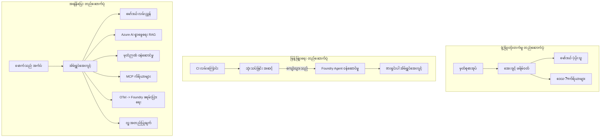

# Microsoft Foundry ဖြင့် ကျယ်ပြန့်စွာ အသုံးပြုနိုင်သော ကိုယ်စားလှယ်များ ထည့်သွင်းတင်ပို့ခြင်း



ဒီချိန်အထိ သင်တန်းတွင် သင်သည် ကိုယ်စားလှယ်များကို သင့်လပ်တော့ပေါ်တွင်၊ နိုတ်ဘုတ်အတွင်း၊ `az login` နှင့် ပတ်ဝန်းကျင် အပြောင်းအလဲ vàiုံးငယ် တချို့ဖြင့် သိမ်းဆည်းပြီး ပြေးဆွဲခဲ့ပါပြီ။ ၎င်းသည် သင်ကြားရန်မှန်ကန်သော နည်းလမ်းဖြစ်သည်။ သို့သော် ရံဖန် ၄ နာရီမှာ သန်းသောင်းနဲ့ဖောက်သည်များကိုမူ ယုံကြည်စွာ စောင့်ရှောက်ပေးရသော ကိုယ်စားလှယ်ကို ပြေးဆွဲရရန် မှန်ကန်သော နည်းလမ်းမဟုတ်ပါ။

ဒီသင်ခန်းစာသည် "ကျွန်တော့်စက်ထဲမှာ အလုပ်လုပ်တယ်" နှင့် "ထုတ်လုပ်မှုမှာ ယုံကြည်စိတ်ချစွာ၊ သက်သာစွာ အလုပ်လုပ်တယ်" ဆိုတဲ့ ဘေးကွာမွေးကိုဆက်ကျပ်တာပါ။ ကျွန်တော်တို့သည် **Microsoft Foundry** နှင့် **Microsoft Foundry Agent Service** ကို အသုံးပြုကာ အဲဒီကွာမွေးကို ပိတ်ပေးမှာပါ၊ ဟောင့်တကယ် ဖောက်သည်စောင့်ရှောက်ရေး ကိုယ်စားလှယ်တစ်ယောက်ကို ရှာဖွေ၊ မှတ်ဥာဏ်၊ အကဲဖြတ်ခြင်းနှင့် စောင့်ကြည့်ခြင်းကိရိယာများပါဝင်အောင် တည်ဆောက်တယ်။

## နိဒါန်း

ဒီသင်ခန်းစာမှာ ဖော်ပြမယ့်အကြောင်းအရာများမှာ -

- **prototype ကိုယ်စားလှယ်** နဲ့ **deploy လုပ်ပြီးသား ကိုယ်စားလှယ်** အကြား ကွာခြားချက်၊ ပြောင်းလဲမှုက မော်ဒယ်အပေါ်မဟုတ်ပဲ အနားက အရာရာအပေါ် ပိုများတယ်။
- ကိုယ်စားလှယ်များအတွက် **တင်သွင်းခြင်း ပုံစံများ**: client-hosted, service-hosted (Hosted Agents), workflow-orchestrated။
- Microsoft Foundry ပေါ်ရှိ **ကိုယ်စားလှယ်အသက်တမ်း** — ဖန်တီးခြင်း၊ ဗားရှင်းထုတ်ခြင်း၊ တင်သွင်းခြင်း၊ အကဲဖြတ်ခြင်း၊ စောင့်ကြည့်ခြင်း၊ အနားယူခြင်း။
- **ကျယ်ပြန့်တိုးချဲ့မှုနည်းလမ်းများ**: မော်ဒယ်လမ်းညွှန်ခြင်း၊ caching, concurrency, stateless ဒီဇိုင်း။
- OpenTelemetry နှင့် Foundry ပေါ်မှာ စောင့်ကြည့်ခြင်း။
- မော်ဒယ်ရွေးချယ်ခြင်း၊ routing၊ evaluation gate ဖြင့် **ကုန်ကျစရိတ် ထိန်းချုပ်ခြင်း**။
- **စီးပွားရေးအတွက် စဉ်းစားချက်များ**: အုပ်ချုပ်မှု၊ လူ့အတည်ပြုချက်၊ MCP server များကို ထုတ်လုပ်မှုမှာ ဘေးကင်းစွာ ပြေးဆွဲခြင်း။

## သင်ယူရမည့် ရည်မှန်းချက်များ

ဒီသင်ခန်းစာပြီးဆုံးဆုံးမှ တို့တွေမှုများကို ပြုလုပ်နိုင်မှာဖြစ်သည် -

- ကိုယ်စားလှယ်၏ အလုပ်သမားဖော်ဆောင်မှုအတွက် သင့်တော်မှုရှိသည့် တင်သွင်းပုံစံကို ရွေးချယ်နိုင်မည်။
- ကိုယ်စားလှယ်ကို Microsoft Foundry Agent Service သို့ တင်ပို့၍ ဗားရှင်းရှိ၊ အုပ်ချုပ်မှုရှိ၊ စောင့်ကြည့်နိုင်စေရန်။
- ကိုယ်စားလှယ် trace ဖြင့် ဝိုင်းဝန်းလုပ်ဆောင်ခြင်းနှင့် ရှင်းလင်းချက် Pipeline ကို အသုံးပြုပြီး ထုတ်ပေးခြင်း။
- သင့်ကို မော်ဒယ် routing နှင့် caching ကို အသုံးပြုခြင်းဖြင့် နောက်ကျောနှည်းခြင်းနှင့် ကုန်ကျစရိတ်ထိန်းချုပ်နိုင်မည်။
- အန္တရာယ်အခြေအနေများအတွက် လူ့အတည်ပြုချက်တန်းကို ထည့်သွင်းပြီး MCP server ကို ထုတ်လုပ်မှုသက်သာစွာ ဆက်သုံးနိုင်မည်။

## လိုအပ်ချက်များ

ဒီသင်ခန်းစာသည် အရင်သင်ခန်းစာများကို အပြီးသတ်ပြီး၊ အောက်ပါအရာများကို သုံးသပ် နားလည်ထားသူဖြစ်ကြောင်း သတ်မှတ်သည် -

- [Microsoft Agent Framework](../14-microsoft-agent-framework/README.md) ဖြင့် ကိုယ်စားလှယ်တည်ဆောက်ခြင်း (သင်ခန်းစာ 14)။
- [Tool Use](../04-tool-use/README.md) (သင်ခန်းစာ 4) နှင့် [Agentic RAG](../05-agentic-rag/README.md) (သင်ခန်းစာ 5)။
- [Agent Memory](../13-agent-memory/README.md) (သင်ခန်းစာ 13) နှင့် [Agentic Protocols / MCP](../11-agentic-protocols/README.md) (သင်ခန်းစာ 11)။
- [Observability and Evaluation](../10-ai-agents-production/README.md) (သင်ခန်းစာ 10) — ဒီသင်ခန်းစာမှာ တိုက်ရိုက် ဆက်လက်တည်ဆောက်ထားသည်။

ထို့အပြင်လိုအပ်သည်မှာ -

- **Azure subscription** နှင့် **Microsoft Foundry ပရောဂျက်** တစ်ခုဖြစ်ပြီး chat model တစ်ခုထက်မနည်း တင်ပို့ထားရမည်။
- **Azure CLI** ကိုအတည်ပြုထား (`az login`)။
- Python 3.12+ နှင့် repository ရှိ [`requirements.txt`](../../../requirements.txt) တွင်ပါဝင်သည့် package များ။

## Prototype မှ ထုတ်လုပ်မှုသို့: အမှန်တကယ် ပြောင်းလဲသည့်အရာများ

Prototype ကိုယ်စားလှယ်နှင့် ထုတ်လုပ်မှုကိုယ်စားလှယ်သည် အခြေခံ loop ကိုမျှတူသည် — အကြောင်းပြချက်၊ ကိရိယာခေါ်ဆိုခြင်း၊ တုံ့ပြန်ခြင်း။ ပြောင်းလဲသည့်အရာမှာ သဲThist loop ကို ဝန်းကျင်ပတ်လည်ရှိ အရာအားလုံးဖြစ်သည်။ မော်ဒယ်သည် ထုတ်လုပ်မှုကိုယ်စားလှယ်၏ ၂၀% ခန့်သာ ဖြစ်ပြီး၊ အခြား ၈၀% သည် စီမံခန့်ခွဲမှုအဖွဲ့အစည်းဖြစ်သည်။

| အရေးပါချက် | Prototype | ထုတ်လုပ်မှု |
| --- | --- | --- |
| **Hosting** | သင့် နိုတ်ဘုတ်ထဲမှာ ပြေးသည် | Hosted service အဖြစ် ပြေးဆွဲပြီး ဗားရှင်းထုတ်ပြီး ဖြန့်ချိသည် |
| **Identity** | သင့် `az login` token | Scoped RBAC နှင့် ကိုင်တွယ်ထားသော managed identity |
| **State** | မျက်မှောက်မှတ်ဉာဏ်တွင်ရှိသည်၊ ပြန်ဖွင့်တိုင်း ပျောက်ဆုံး | အပြင်မှာထားရှိသည် (thread store, memory service) |
| **Failure** | traceback ကို မြင်ရသည် | ပြန်ကြိုးစားမှုများ၊ လက်မခံမှုများ၊ dead-letter, alert များ |
| **Cost** | "အနည္းငယ်သာ" | တောင်းဆိုမှုတိုင်းအတွက် စောင့်ကြည့် ထိန်းချုပ် ငွေပမာဏ ချမှတ်ထားသည် |
| **Quality** | output ကို ကိုယ်တိုင်စောင့်ကြည့်သည် | ထုတ်မတင်မီ သာမာန်အားဖြင့် အကဲဖြတ်သည် |
| **Trust** | လုပ်ဆောင်ချက်တိုင်းကို ကိုယ်တိုင် အတည်ပြုသည် | အန္တရာယ်ရှိ အရေးယူမှုအတွက် မူဝါဒနှင့် လူ့အတည်ပြုချက် |

ဒီဇယားကို စဉ်းစားပါ။ အောက်ပါအစိတ်အပိုင်းတိုင်းသည် ဒီဇယားအပိုင်းတစ်ခုနှင့် ဆက်နွယ်သည်။

## ကိုယ်စားလှယ် တင်သွင်းမှု ပုံစံများ

သုံးခုသော ပုံစံများကို သင်အများနှင့် အတူ သုံးစွဲပါလိမ့်မည်။

### 1. Client-Hosted Agents

ကိုယ်စားလှယ် object သည် *သင့်* application process နေရာတွင်ရှိသည်။ သင်၏ကုဒ်သည် မော်ဒယ်ပေးသွင်းသူကို တိုက်ရိုက်ခေါ်ဆိုသည်၊ reasoning loop သည် သင့်ဝန်ဆောင်မှုတွင် ပြေးဆွဲသည်။ ဒါဟာ ယခင်သင်ခန်းစာတိုင်း ပြုလုပ်ခဲ့တာဖြစ်သည်။

- **အသုံးပြုချိန်** သင် loop ကို အပြည့်အစုံထိန်းချုပ်ဖို့လိုအပ်သောအခါ၊ custom middleware ရှိသောအခါ၊ သို့မဟုတ် သင့်ကိုယ်စားလှယ်ကို ချိတ်ဆက်ထားသော backend ဖြင့် တွဲဖက် embed လုပ်ချင်လျှင်။
- **ပြောရမည့်အချက်**: သင့်ဘက်က scaling, state, resilience ကို ကိုင်တွယ်ရပါမည်။

### 2. Hosted Agents (Foundry Agent Service)

ကိုယ်စားလှယ်သည် Microsoft Foundry တွင် *resource အဖြစ် မှတ်ပုံတင်သည်*။ Foundry သည် reasoning loop ကို ဧည့်ခံပေး၊ thread များသိမ်းဆည်း၊ မဟုတ်သောအကြောင်းအရာကို ကန့်သတ်၊ RBAC ထိန်းသိမ်းပြီး ကိုယ်စားလှယ်ကို Foundry portal တွင် မြင်သာစေသည်။ သင့် app သည် threads တည်ဆောက်၍ တုံ့ပြန်ချက်များကို ဖတ်ရသော သေးငယ်သော client ဖြစ်လာသည်။

- **အသုံးပြုချိန်** မီ_RESULTငြိင်သော့, အဆောက်အအုံစောင့်ကြည့်မှု built-in ၊ အုပ်ချုပ်မှုနှင့် အသုံးပြုမှု အပိုင်းပိုသိပ်လျော့ချချင်သောအခါ။
- **ပြောရမည့်အချက်**: managed runtime အတွက် နည်းနည်း ထိန်းချုပ်မှု လျော့နည်းခြင်း။

### 3. Agent Workflows

ကိုယ်စားလှယ်များနှင့် ကိရိယာများအများစုကို graph တစ်ခုအဖြစ် ဖွဲ့စည်း၍ ထိန်းချုပ်မှုစီးရီး — အဆင့်လိုက် လုပ်ဆောင်မှုများ၊ ရွှေ့ပြောင်းခြင်းများ၊ လူ့အတည်ပြုချက် node များနှင့် ရပ်ခွား၍ ပြန်ဆက်စပ်နိုင်သော durable checkpoints များ ပါရှိသည်။ Microsoft Agent Framework ရဲ့ **Workflows** လုပ်ဆောင်မှုစွမ်းရည်ကို ကြီးမားသော အတိုင်းအတာတင်သွင်းမှုမှာအသုံးပြုခြင်း။

- **အသုံးပြုချိန်** တစ်ခုတည်းဖြစ်သော လုပ်ငန်းတာဝန်သည် အမျိုးမျိုးလုပ်ငန်းအထူးပြု ကိုယ်စားလှယ်များသို့ လျှောက်လှမ်းရသောအခါ သို့မဟုတ် အတည်ပြုခြင်း လုပ်ငန်းစဥ် တစ်ခုလိုအပ်သောအခါ။
- **ပြောရမည့်အချက်**: အပိုင်းအစများများဖြစ်၍ orchestration အဆင့် စောင့်ကြည့်ရမည်။



## Microsoft Foundry ပေါ်ရှိ ကိုယ်စားလှယ် အသက်တာစဉ်

ကိုယ်စားလှယ် တင်ပို့ခြင်းသည် တစ်ခေါက် `push` တင်ခြင်းမဟုတ်ပါ။ Loop တစ်ခုဖြစ်ပြီး၊ software release cycle နည်းနည်းနှင့်တူသည်။



အဓိကအကြောင်းအရာမှာ [သင်ခန်းစာ 10](../10-ai-agents-production/README.md) ကနေ ဆက်သွယ်နေသည် - **offline အကဲဖြတ်ခြင်းသည် ခြံစည်းကြားတစ်ခုပင် ဖြစ်သည်၊ သို့မဟုတ် မှတ်ချက်နောက်ခံတွင်မဟုတ်ပါ။** ဗားရှင်းအသစ်သည် သင်၏ အကဲဖြတ်ခြေံ့အကန့်အသတ်များကို ဖြတ်သန်းပြီးမှသာ ထုတ်ပေးသည်။ Online စောင့်ကြည့်မှုက ပြင်ပမှ ချို့ယွင်းမှုများကို offline စမ်းသပ်မှုများတွင် ထည့်သွင်းပေးသည်။ ၎င်းသည် loop အားလုံးဖြစ်သည်။

## တိုးချဲ့မှု မဟာဗျူဟာများ

ကိုယ်စားလှယ် တိုးချဲ့ခြင်းသည် stateless web API တိုးချဲ့ခြင်းနှင့် ကွဲပြားသည်။ တောင်းဆိုမှုတိုင်းတွင် မော်ဒယ်များနှင့် ကိရိယာများခေါ်ဆိုမှုများအများကြီးဖြစ်နိုင်၍ပါ။ နည်းလမ်းလေးခုသည် အဓိက တာဝန်များကို ကြီးထွားစေသည်။

**Stateless request handling** — သင့် process မှာ တောင်းဆိုသူအလိုက် state မထားပါနဲ့။ Foundry thread store သို့မဟုတ် memory service တွင် စကားပြော thread များသိမ်းထား၍ အချင်းချင်း instance များက တစုံတရာတောင်းဆိုမှုကို ဆောင်ရွက်နိုင်စေသည်။ ၎င်းက horizontal scaling အတွက် ခွင့်ပြုသည် — instance အသစ်ထည့်နိုင်၊ sticky session မလိုပါ။

**Model routing** — တောင်းဆိုမှုတိုင်းသည် သင့်အတွက် အစွမ်းထက်ဆုံး (နောက်ကျသော၊ ကျော်ကြီးသော) မော်ဒယ်မလိုအပ်ပါ။ ရိုးရှင်းသောတောင်းဆိုမှုများ — အဓိပ္ပါယ်ခွဲခြားမှု၊ တိုတောင်းပြီး သက်သေအကြောင်းကြားချက်များကို တော်တော်တောက်တောက် မော်ဒယ်သေးသေးသုတ်သုတ်ထံ လမ်းကြောင်းညွှန်ပြီး မူလ မြင်သာသော အတွက် မော်ဒယ်သိပ်ကြီးအတွက် သီးသန့်ထားပါ။ Foundry ရဲ့ **Model Router** က ထိုကိစ္စကို လုပ်ပေးနိုင်သလို သင်လည်း မူကိုယ်တိုင် ကလစ်စီဖာရေးတစ်ခု တည်ဆောက်နိုင်သည်။ သင်လက်တွေ့ လက်မောင်းပေါ်မှာ ကိုယ်တိုင် လေ့လာနေပါမည်။

**Response caching** — အများဆုံးသော ထောက်ခံကူညီမှု မေးခွန်းများသည် ပြန်တူတူ ("လျှို့ဝှက်နံပါတ် ပြန်လည်သတ်မှတ်နည်း?") ဖြစ်သည်။ စကားမေးခွန်းပုံမှန်များအတွက် ဖြေချက်များကို cache ထား၍ မော်ဒယ်ကို တိုက်ရိုက်မရိုက်ဘဲ ထောက်ပံ့ပါ။ နည်းငယ်ထားရှိသော cache hitting rate တောင် ကုန်ကျစရိတ်နှင့် နောက်ကျောကို ဆက်တိုက် လျှော့ချနိုင်သည်။

**Concurrency and backpressure** — မော်ဒယ် ပေးသွင်းသူများသည် rate limit ရှိသည်။ ကို concurrency ကို ကန့်သတ်ထား၊ exponential backoff ဖြင့် ပြန်ကြိုးစား၊ ချို့ယွင်းမှုများသည် အသုံးပြုသူအား ထိခိုက်မှုမဖြစ်စေရန် (queued "we're on it" တုံ့ပြန်မှုသည် 500 error ထက် ဦးစားပေးသည်)။



## ထုတ်လုပ်မှုတွင် စောင့်ကြည့်ခြင်း

မမြင်နိုင်ရင် မအောင်မြင်နိုင်။ သင်ခန်းစာ 10 တွင် ဖော်ပြသည့်အတိုင်း Microsoft Agent Framework သည် **OpenTelemetry** trace များကို သဘာဝအတိုင်းထုတ်ပေးသည်။ မော်ဒယ်ခေါ်ဆိုမှုတိုင်း၊ ကိရိယာခေါ်ဆိုမှုတိုင်းနှင့် orchestration အဆင့်တိုင်းမှာ span ဖြစ်လာသည်။ ထုတ်လုပ်မှုတွင် သင်သည် အာရုံစိုက်သည့် spans များကို Microsoft Foundry (သို့) OTel-ကိုက်ညီသော backend များထံ ပို့သည်၊ ဒါကြောင့်:

- ဖောက်သည်တစ်ဦး၏ ပြဿနာတိုင်ကြားချက်ကို မော်ဒယ်နှင့် ကိရိယာခေါ်ဆိုမှုမှ စပြီး အဆုံးအထိ ထောက်လှမ်းကြည့်နိုင်သည်။
- အချိန်အလိုက် p50/p95 နောက်ကျောနှေးမြန်မှုနှင့် တောင်းဆိုမှုများအားဖြင့် ကုန်ကျစရိတ်ကို ကြည့်ရှုနိုင်သည်။
- စိတ်ပျက်မှုနှုန်းတက်မြင့်ခြင်းနှင့် ကုန်ကျစရိတ် မမှန်ကန်မှုများအတွက် အသုံးပြုသူ သို့မဟုတ် ငွေကြေးအဖွဲ့ကို မသိသေးခင် အထိ ပေးပို့နိုင်သည်။

```python
from agent_framework.observability import get_tracer

tracer = get_tracer()

with tracer.start_as_current_span("support_request") as span:
    span.set_attribute("customer.tier", "enterprise")
    span.set_attribute("routed.model", "gpt-5-nano")
    # ဒီ span အတွင်းမှာ agent အကောင်အထည်ဖော်မှုကို အလိုအလျောက်တံဆိပ်သားတည်ဆဲဖြစ်ပါတယ်။
```

`customer.tier` နှင့် `routed.model` ကဲ့သို့သော attribute များသည် trace အလုံးစုံကို ပြန်လည်ဖြေကြားနိုင်သော မေးခွန်းများ ("စီးပွားရေးဖောက်သည်များကို သေးငယ်သော မော်ဒယ်ကြီးထံ မကြာခဏ သွားရောက်ခြင်း ရှိပါသလား?") အဖြစ် ပြောင်းလဲစေသည်။

## ကုန်ကျစရိတ် ထိန်းချုပ်ခြင်း

ထုတ်လုပ်မှုကိုယ်စားလှယ်များတွင် ကုန်ကျစရိတ်မှာ token များဖြင့် အဓိကဆုံးဖြစ်သည်။ ထိရောက်မှုအဆင့်နှင့်အမျှ လေးခုရှိသည် -

1. **မော်ဒယ်အရွယ်အစားကို သင့်တော်စေပါ။** အကဲဖြတ်ခြင်းတိုင်မှတ်ထားသော မော်ဒယ်သေးသေးတစ်ခုသည် မော်ဒယ်ကြီးတစ်ခုထက် ပိုသက်သာသည်။ အကြီးဆုံးမော်ဒယ်ကို တောင်မဆင်ခြင်ပဲပဲ သုံးရန်မလိုအပ်ဘူးဟု သက်သေပြရန် အကဲဖြတ်ချက်ကို အသုံးပြုပါ။
2. **ရိုးရာနည်းဖြင့် မော်ဒယ်ကို လမ်းညွှန်ပါ။** အထက်ဖော်ပြပါအတိုင်း — မော်ဒယ်ကြီးလိုအပ်မှု မရှိသောတောင်းဆိုမှုများကို သေးငယ်သော မော်ဒယ်သို့ပဲ ပေးပါ။
3. **တင်းကြပ်စွာ cache ထားပါ။** အဓိကခွင့်ငွေမပါဘဲ မော်ဒယ်ခေါ်ဆိုခြင်းကို လျော့ပါ။

အကဲဖြတ် ရှေ့တွင်ရှိသော Gate များနှင့် ကုန်ကျစရိတ် ထိန်းချုပ်မှုသည် တန်းတူသော မျက်နှာကြီးများဖြစ်ကြသည် — အကဲဖြတ်ချက်သည် *အရည်အသွေး အနိမ့်ဆုံး* ကို ပြသသည်၊ routing နှင့် caching သည် အဲ့ဒီ အနိမ့်ဆုံးကုန်ကျစရိတ်ကို ကျော်လွန်မိရန် မဖြစ်သင့်ဘဲ ထိန်းသိမ်းထားသည်။

## စီးပွားရေးအဖွဲ့များအတွက် တင်သွင်းမှု စဉ်းစားချက်များ

**အုပ်ချုပ်မှု။** Hosted Agents များသည် Foundry ရဲ့ RBAC, content safety, နှင့် audit logging များကို ဆက်လက်ယူဆောင်သည်။ ကိုယ်စားလှယ်တိုင်းကို လိုအပ်သမျှ အနည်းဆုံးအကြွင်းမဲ့ managed identity ပေးပါ — သိပ္ပံအခြေခံ အချက်အလက်စာရင်း အဖတ်ခွင့်၊ ticketing API သို့ အကျုံ့နယ်တော် ထိန်းသိမ်းခွင့်၊ တစ်ခုတည်းပါ။

**လူ့အတည်ပြုချက် ပါဝင်ခြင်း။** အချို့ အသုံးပြုမှုများကို အလိုအလျောက် လုပ်ဆောင်ရန် မလုံလောက်သည့်အတွက် - ငွေပြန်သွင်းခြင်း၊ အကောင့်ဖျက်ခြင်း၊ ဥပဒေမကြီးမှိုင်းမှု ကို အဆင့်မြှင့်ခြင်း။ Microsoft Agent Framework သည် **approval-required** tools များအား ထောက်ခံသည် - ကိုယ်စားလှယ်သည် ထိုလုပ်ငန်းစဉ်ကို ရှင်းလင်းပေးပြီး အကောင်အထည်ဖော်မှု ရပ်တန့်သည်၊ လူတစ်ယောက်က အတည်ပြု သို့မဟုတ် ရှုထောင့်လျှော့ပြီး workflow ပြန်လည်ဆက်လက်ဖြစ်ပေါ်စေသည်။ သင်သည် [သင်ခန်းစာ 6](../06-building-trustworthy-agents/README.md) တွင် မူလ ဤအရာကို တွေ့ရှိရပြီး ယခုမှာ တင်သွင်းသည်။

**ထုတ်လုပ်မှု MCP။** [MCP](../11-agentic-protocols/README.md) သည် ကိုယ်စားလှယ်အား ပုံမှန် interface ကို အသုံးပြု၍ ပြင်ပကိရိယာများကို သုံးစွဲခွင့်ပြုသည်။ ထုတ်လုပ်မှုတွင် MCP server ထပ်တူတောင်းဆိုမှုအတိုင်း သေချာစွာ ယုံကြည်၍ မလိုသည့် အရာများနှင့် မခွဲခြားသင့်ဘူး။ server ဗားရှင်းကို ပိတ်ထားပြီး စက်ကို scoped identity နဲ့ ပြေးဆွဲပါ၊ ရလဒ်တုံ့ပြန်မှုများကို တည်ငြိမ်စွာ စစ်ဆေးပါ၊ လျှို့ဝှက်ချက်များ မဖော်ထုတ်ပါနှင့်။ MCP server သည် ကျော်ကြားမှုတစ်ခုဖြစ်ပြီး ကျော်ကြားမှုများသည် patch ခံပါက audit ပြုလုပ်ပါက rate limit ထားပါသည်။



ဒီဇယား သုံးခု — ဖွံ့ဖြိုးမှု, တင်သွင်းမှု, ပြေးဆွဲမှု runtime သည် ကိုယ်စားလှယ် တစ်စင်း၏ အသက်တာ အဆင့်သုံးပုံတူဟု ဆိုနိုင်သည်။ အောက်မှာရှိသည့် lab သည် ၎င်းကို တည်ဆောက်ခြင်းလမ်းညွှန်ပေးသည်။

## လက်တွေ့ လက်တွေ့လုပ်ဆောင်မည့် lab: ထုတ်လုပ်မှုအဆင့် အသင့် Customer Support Agent

[`code_samples/16-python-agent-framework.ipynb`](./code_samples/16-python-agent-framework.ipynb) ကို ဖွင့်၍ အစမှ အဆုံးထိ လေ့လာပါ။ သင်သည် **Contoso customer support agent** တစ်ခုကို ထုတ်လုပ်မှုစိုးရိမ်ချက်တိုင်းနှင့် တင်ဆက်မည်ဖြစ်သည်။

1. **Tool calling** — အမှာစာအခြေအနေ ကြည့်ရှုခြင်းနှင့် အထောက်အပံ့ လက်မှတ်ဖွင့်ခြင်း။
2. **RAG** — သိပ္ပံအခြေခံ မေးခွန်းများကို ဖြေကြားခြင်း (Azure AI Search ကို အသုံးပြုပါ၊ notebook သည် Search resource မရှိဘဲ အလုပ်လုပ်ပါသည်)။
3. **Memory** — စကားပြောခြင်းအတွင်း ဖောက်သည်ကို မှတ်ဥာဏ်ထိန်းထားခြင်း။
4. **Model routing** — ခက်ခဲမှု ခွဲခြားသော classifier တစ်ခုသည် တောင်းဆိုမှုတစ်ခုချင်းစီကို သေးငယ် သို့မဟုတ် ကြီးမားသော မော်ဒယ်ထံ လမ်းညွှန်သည်။
5. **Response caching** — မေးခွန်းများပြန်ဖြေသည့်အခါ cache မှာ ပြန်ထုတ်ပြန်ဆောင်ရွက်သည်။
6. **Human approval** — အမြင့်ဆုံးအဆင့်ထက် အတွင်း ငွေပြန် အတည်ပြုခြင်း။
7. **Evaluation pipeline** — စမ်းသပ်မှုသေးသေးသပ်သပ် ရှိမှုဖြင့် ကိုယ်စားလှယ်ကို အကဲဖြတ်ပြီး version ထုတ်ခွင့်။
8. **Observability** — OpenTelemetry ကို အသုံးပြု၍ တောင်းဆိုမှုတိုင်းပေါ် Tracing။

### လမ်းညွှန်

notebook သည် ထုတ်လုပ်မည့် စိုးရိမ်ချက်မျိုးစုံမှာ တစ်ခုချင်းစီကို အမိန့်မရှိစွာ ပြေးနိုင်သော အပိုင်းများအဖြစ် စီစဉ်ထားသည်။ အဓိကအချက်မှာ routing နှင့် caching တောင်းဆိုမှုကို ကိုင်တွယ်ခြင်းဖြစ်သည်။

```python
async def handle_support_request(query: str, customer_id: str) -> str:
    # ၁။ နိုင်သမျှ cache မှာ ဆာဗ်ပြုမည်။
    cached = response_cache.get(normalize(query))
    if cached:
        return cached

    # ၂။ ကုန်ကျစရိတ်ထိန်းချုပ်ရန် ဒုတိယအဆင့်အားဖြင့် စနစ်တကျပို့ဆောင်မည်။
    model = "gpt-5-nano" if is_simple(query) else "gpt-5-mini"

    # ၃။ ကြည့်ရှုနိုင်မှုအတွက် trace span အတွင်း အေးဂျင့်ကို ပြေးဆွဲမည်။
    with tracer.start_as_current_span("support_request") as span:
        span.set_attribute("routed.model", model)
        span.set_attribute("customer.id", customer_id)
        response = await support_agent.run(query, model=model)

    # ၄။ cache ထိန်းမယ် ပြန်ပေးမယ်။
    response_cache.set(normalize(query), response.text)
    return response.text
```

ထုတ်ပေးခွင့်အတွက် အကဲဖြတ် Gate သည် အောက်ပါအတိုင်း ဖြစ်သည်။

```python
async def evaluation_gate(agent, test_cases, threshold: float = 0.8) -> bool:
    passed = 0
    for case in test_cases:
        result = await agent.run(case["input"])
        if score_response(result.text, case["expected"]) >= 0.8:
            passed += 1
    pass_rate = passed / len(test_cases)
    print(f"Evaluation pass rate: {pass_rate:.0%} (gate: {threshold:.0%})")
    return pass_rate >= threshold  # တံခါးပိတ် ခွင့်ပြုခဲ့မှသာ ထုတ်လွှတ်ပါ။
```

သွားဖတ်မည့် လိုင်းတိုင်းကို ဖတ်ပါ — notebook သည် သိသာသော framework ခေါ်ဆိုမှု မရှိစေရန် ပုံမှန် code များကို အသေးစိတ် ရေးသားထားသည်။

## တင်သွင်းပြီးသား ကိုယ်စားလှယ်ကို Smoke Tests ဖြင့် သက်သေပြခြင်း

အပေါ်တွင် ဖော်ပြထားသည့် အကဲဖြတ် gate သည် ကိုယ်စားလှယ် object ကို *offline* မှာ စမ်းသပ်သည်။ Hosted Agent အဖြစ် တင်သွင်းပြီးလျှင် တစ်ခုခု ပိုမိုသက်သာသော စစ်ဆေးမှုတစ်ခု လိုအပ်သည် — **တင်သွင်းပြီးသော endpoint က တုံ့ပြန်တယ်လား?**

"အောင်မြင်စွာ" တင်သွင်းခြင်း သည် control plane သည် အသေးစိတ်ကို လက်ခံသည်ကိုသာ ပြသမည်ဖြစ်၍ ကိုယ်စားလှယ်တုံ့ပြန်မှုရှိမှုကို မသက်သေပြနိုင်ပါ။ မလိုအပ်သော dependency ပျောက်ဆုံးခြင်း၊ မမှန်ကန်သော မော်ဒယ် လမ်းညွှန်မှု၊ သို့မဟုတ် connection မတည်ငြိမ်မှုဖြစ်ရပါက ကိုယ်စားလှယ်တစ်ခုသည် အကြောင်းတစ်ခုဖြင့် မတုံ့ပြန်နိုင်သည်။ **smoke test** သည် ဒါကို စက္ကန့်အတွင်း ဖမ်းဆီးပေးပြီး အကြီးအကျယ် အကဲဖြတ်မှုစရိတ် မရှိဘဲ တစ်ခါတည်း တင်ပို့ချိန်တိုင်း လုပ်ဆောင်ပေးသည်။

ဒီ repository သည် AI Smoke Test GitHub Action ကို အခြေခံ၍ အသုံးပြုနိုင်သော smoke-test pipeline တစ်ခု ပါရှိပါသည်။

- **Catalog** — [`tests/lesson-16-smoke-tests.json`](../../../tests/lesson-16-smoke-tests.json) တွင် Contoso support agent အတွက် prompts နှင့် assertion များ ပါရှိသည် (grounded အခြေခံ မူဝါဒဖြေချက်များ၊ အမှာစာရှာဖွေမှု၊ ဘာသာရပ်ပေါ် မကျခြင်း၊ နှစ်ဆက်မှု thread ဆက်သွယ်မှု)။ အခြား သင်ခန်းစာအတွက် ကိုယ်စားလှယ်များ ရှိသည့် catalogs များကိုလည်း တွေ့နိုင်သည် — ကြည့်ရှုရန် [`tests/README.md`](../tests/README.md)။
- **Workflow** — [`.github/workflows/smoke-test.yml`](../../../.github/workflows/smoke-test.yml) မှ Azure OIDC ဖြင့် ဝင်ပြီး prompt တစ်ခုချင်း စီကို agent ရဲ့ Responses endpoint သို့ POST လုပ်သည်၊ assertion ပြတ်တောက်ပါက အလုပ် (job) ပျက်သွားသည်။

```yaml
- name: Smoke-test hosted agent
  uses: JFolberth/ai-smoketest@v1
  with:
    project_endpoint: ${{ inputs.project_endpoint }}
    agent_name: ContosoSupportAgent
    tests_file: tests/lesson-16-smoke-tests.json
```


သင့်ရဲ့ agent ကို deploy ပြီးပါက **Actions** tab ကနေ run ပါ၊ သင့် Foundry project endpoint နဲ့ agent နာမည်ကိုထည့်ပြီး run ပါ။ federated identity ကို Foundry project scope မှာ **Azure AI User** role လိုအပ်ပါတယ်။ layers တွေကို ပီရမာက်စ်တစ်ခုလို စဉ်းစားပါ - smoke tests (ရောက်ရှိနိုင်ပြီး တုံ့ပြန်နေလား?) ကို deploy တစ်ခုချင်းစီမှာ run ပြုလုပ်ပြီး၊ offline evaluation (ship ပေးလိုက်ဖို့ အဆင်ပြေလား?) ကို promotion မလုပ်ခင် run ပြုလုပ်ပြီး၊ online evaluation (လေတွင်းမှာ ဘယ်လိုလုပ်ဆောင်နေလဲ?) ကို ဆက်တိုက် run လုပ်နေလို့ဖြစ်ပါတယ်။

## ဗဟုသုတ စစ်ဆေးခြင်း

သင်ကိုယ်တိုင် ပြန်သုံးသပ်ပြီး တာဝန်ပေးမှုဆီသို့ ရွေ့ပါ။

**၁။ ထုတ်လုပ်မှု agent အတွက် "model" က ဘယ်လောက်ခန့်ဖြစ်ပြီး ကျန်တာတွေက ဘာတွေလဲ?**

<details>
<summary>ဖြေချက်</summary>

Model က စနစ်ရဲ့ အနည်းငယ်သာဖြစ်ပြီး လူသိများတာက အနီးကပ် ၂၀% ခန့်ဖြစ်တယ်။ ကျန်တာတွေက လည်ပတ်ခန္ဓာကိုယ်ဖြစ်ပြီး - hosting နဲ့ versioning, identity နဲ့ RBAC, အပြင်မှာထားတဲ့ state, အခက်အခဲ ကိုင်တွယ်မှု, ကုန်ကျစရိတ် ချက်ခြင်း, အကဲဖြတ်ခြင်းနဲ့ လူတွေနဲ့ ဆက်သွယ်ထိန်းချုပ်မှု စတာတွေ ဖြစ်တယ်။ ထုတ်လုပ်မှုသို့ ရွေ့ပြောင်းခြင်းက reasoning loop ၏အနောက်က အားလုံးကို တည်ဆောက်ခြင်းအကြောင်းဖြစ်တယ်။
</details>

**၂။ Hosted Agent နဲ့ client-hosted agent တို့အနက် ဘယ်အချိန်မှာ Hosted Agent ကို ရွေးချယ်မလဲ?**

<details>
<summary>ဖြေချက်</summary>

သင် managed runtime ပါတဲ့ durability (ပြီးရှင်တည်သော နဲ့ ပြန်လည်စတင်နိုင်သော threads), observability, content safety နဲ့ RBAC ပါဝင်ထားတဲ့ agent တစ်ခုလိုချင်လျှင်ဖြစ်ပြီး၊ reasoning loop ကို နည်းပညာအနိမ့်လေးနဲ့ထိန်းချုပ်မှုကို အနည်းငယ်လျှော့ချမယ်ဆိုရင် Hosted Agent ကိုရွေးချယ်ပါ။ client-hosted က reasoning loop ကို လုံးဝထိန်းချုပ်လိုသူများ သို့မဟုတ် agent ကို ရှိပြီးသား backend ထဲမှာ ထည့်သွင်းထားလိုသူများအတွက်ပိုကောင်းပါတယ်။
</details>

**၃။ scalable agent က သူ့ရဲ့ process memory မှာ stateless ဖြစ်ဖို့ဘာကြောင့်လိုပါသလဲ?**

<details>
<summary>ဖြေချက်</summary>

လိုအပ်သော request တစ်ခုခုကို instance တစ်ခုက မည်သည့်အချိန်မဆို ကိုင်တွယ်နိုင်ဖို့ပါ၊ ဒါပေမယ့် horizontal scaling ကို sticky session မလိုအပ်ဘဲလုပ်နိုင်ပါတယ်။ အသုံးပြုသူတစ်ဦးချင်းဆီယောက်ထားတဲ့ conversation state ကို thread store သို့မဟုတ် memory service မှာ ထည့်ထားပါတယ်။ state ကို process memory မှာထားရင် restart လုပ်တဲ့အခါ state ကိုဆုံးရှုံးပြီး load ကို အောင်မြင်စွာ ဖြန့်ချိလို့မရပါ။
</details>

**၄။ model routing က ဘာပြဿနာကို ဖြေရှင်းပြီး အကဲဖြတ်ခြင်းနဲ့ ဘယ်လိုဆက်နွယ်သလဲ?**

<details>
<summary>ဖြေချက်</summary>

Routing က ရိုးရှင်းတဲ့တောင်းဆိုမှုတွေကို အသေးစား၊ စျေးသက်သာ၊ လျင်မြန်တဲ့ model ကို လွှဲတင်ပို့ပြီး ကြီးမားတဲ့ model ကို စစ်မှန်တဲ့ reasoning အတွက် ကြားခံထားတော့ latency နဲ့ ကုန်ကျစရိတ်နှစ်ခုလုံးကို ထိန်းချုပ်နိုင်ပါတယ်။ evaluation နဲ့ဆက်နွယ်တာက evaluation က အသေးစား model က တောင်းဆိုမှုတစ်မျိုးအတွက် လုံလောက်ပြီဆိုတာ *ထောက်ခံသွားတာ* ပါ၊ ဘဲ evaluation မရှိတဲ့ routing က ခန့်မှန်းခြေ လိုတယ်။
</details>

**၅။ "evaluation gate" ဆိုတာဘာလဲ၊ ဘယ်နေရာမှာရှိသလဲ?**

<details>
<summary>ဖြေချက်</summary>

evaluation gate က offline စမ်းသပ်မှုလုပြီး agent နယူး version များအတွက် ပြေးဆွဲတယ်၊ pass rate က threshold ကင်းအောင် မဖြတ်ရင် deploy ကိုတားမြစ်တယ်။ lifecycle မှာ "version" နဲ့ "deploy" အကြားမှာရှိပြီး မထွက်ခွါမီ အရည်အသွေးကို အခြေခံထားစေတယ်။
</details>

**၆။ MCP server ကိုထုတ်လုပ်မှုမှာ မယုံကြည်ရတဲ့ အခြေအနေတစ်ခုအနေနဲ့ ဘာကြောင့်扱စရာ ရှိသလဲ?**

<details>
<summary>ဖြေချက်</summary>

MCP server က အပြင် dependency တစ်ခုဖြစ်ပြီး agent က ကူးယူသွားပါတယ်။ version ကို pin လုပ်ပြီး scoped identity နဲ့ run ပြီး output များကို valid လုပ်၊ rate-limit ပြုလုပ်ပြီး၊ secret များ exposure မလုပ်ဖို့ လိုအပ်ပါတယ် - သုံးပေါင်းခြင်း third-party dependency ကြောင့်လိုပဲ။ output တွေဟာ agent reasoning မှာရောက်တဲ့အတွက် မှားယွင်းစွာယုံကြည်ခြင်းဟာ security risk ဖြစ်တယ်။
</details>

**၇။ ထုတ်လုပ်မှု agent ကုန်ကျစရိတ်မှာ အမြဲတမ်း အကျိုးသက်ရောက်မှု အကြီးဆုံးဖြစ်စေတဲ့ တစ်ခုတည်းပြောင်းလဲမှုက ဘာလဲ၊ ဘာကြောင့်လဲ?**

<details>
<summary>ဖြေချက်</summary>

모델 크기 ကို မှန်ကန်စွာ ရွေးချယ်ခြင်း — သင့် evaluation gate ကို ကျော်ဖြတ်တဲ့ အနည်းဆုံး 모ဒယ်ကို အသုံးပြုခြင်း၊ ကုန်ကျစရိတ်ကို tokens တွေအာဏာပိုင်ပြီး model တစ်ခုက အရည်အသွေး စံနှုန်းဆီကို သက်သာတယ်ဆိုရင် အဆင့်ကြီးထက်များသက်သာပါတယ်။ caching နဲ့ routing က တန်ဖိုးကို ရှင်းလင်းပြီး လျှော့ချပေးတယ်၊ ဒါပေမဲ့ ဗဟို model မှန်ကန်စွာ ရွေးတယ်ဆိုတာက ပထမအဆင့် အပြောင်းအလဲ အကြီးဆုံးဖြစ်တယ်။
</details>

**၈။ `customer.tier` နဲ့ `routed.model` ဆိုပြီး span attribute တွေက observability မှာ ဘာလုပ်ဆောင်လဲ?**

<details>
<summary>ဖြေချက်</summary>

သတ်မှတ်ချက်များက အကြောင်းပြန်မြင်နိုင်တဲ့ စီးပွားရေး မေးခွန်းများအဖြစ် ပြောင်းလဲစေတယ်။ attribute မရှိရင် span တွေအုန်းကြီးဖြစ်သလို attribute တွေရှိရင် မေးနိုင်တယ် - "ကုမ္ပဏီအဆင့်ထားသောဖောက်သည်များကို အမြဲတမ်း အသေးစား model ကို လှမ်းပို့လား?" သို့မဟုတ် "ဘယ် model က ကျွန်တော်တို့ အနည်းဆုံး လိုအပ်သော request တွေကို ကိုင်တွယ်နေလဲ?" attribute တွေက telemetry ကို သင့် operation နဲ့ဆိုင်သော dimension များအလိုက် ခွဲခြားစစ်ဆေးဖို့နည်းလမ်းဖြစ်ပါတယ်။
</details>

## တာဝန်ပေးမှု

lab မှ ဖောက်သည် အသံထောက် agent ကို ယူပြီး အထူးသော အခြေအနေနဲ့ ခိုင်မာစေပါ - **SaaS ကုမ္ပဏီအတွက် subscription billing support agent**.

သင့်တင်သွင်းမှုမှာ အောက်ပါအချက်များ ပါဝင်ရပါမည် -

၁။ **ကိရိယာများအား** billing နှင့်ဆက်နွယ်ရာကိရိယာများဖြင့် အစားထိုးပါ - `get_subscription_status`, `get_invoice`, နဲ့ `issue_credit` (၅၀ ဒေါ်လာကျော်တဲ့ credits တွေမှာ လူကို ခွင့်ပြုချက်လိုအပ်ပါသည်)။
၂။ **RAG စာတမ်း သုံးခု** ထည့်ပါ - ကုမ္ပဏီရဲ့ refund မူဝါဒ၊ billing ကာလနှင့် cancellation မူဝါဒ။
၃။ **အကဲဖြတ်မှု စစ်ဆေးမှု အစုံ** ကို အနည်းဆုံး ၈ ခုအထိ တိုးချဲ့ပါ၊ အနည်းဆုံး နှစ်ခုမှာ လူခွင့်ပြုရာလမ်းကြောင်း ထိခိုက်စေဖို့ရှိရမည်၊ တကယ် evaluation gate အောင်မြင် / မအောင်မြင်ကို စစ်ဆေးပြီး သေချာတည်မြဲစေပါ။
၄။ **ကုန်ကျစရိတ် အစီရင်ခံစာ တစ်ခု** ထည့်ပါ -  agent မှတဆင့် မျိုးစုံသော ၁၀ ခုသောမေးခွန်း တွေကို run လုပ်ပြီး၊ အသေးစား model သို့ မည်နှစ်ခုပြန်သွားပြီး၊ ကြီးမားတဲ့ model သို့ မည်နှစ်ခုပြန်သွားပြီး၊ cache မှ မည်နှစ်ခု ဝန်ဆောင်မှုပေးခဲ့သည်ဆိုတာကို ပြပါ။

အတိုချုံး စာပိုဒ်တစ်ပိုဒ် (markdown cell ထဲ) ဖြင့် ရေးပါ၊ သင့်ရွေးချယ်ထားတဲ့ model-routing စည်းကမ်းနဲ့ တကယ့် traffic နဲ့ ဘယ်လိုစစ်ဆေးလဲဆိုတဲ့နည်းလမ်းကိုရွေ့ပါ။ တစ်ခုတည်းတာဖြစ်လို့ မမှန်တာ မရှိ၊ ထုတ်လုပ်မှုဆိုင်ရာစိုးရိမ်မှုများကို ပေါင်းစပ် ထည့်သွင်းထားဖို့အပေါ် စမ်းသပ်သုံးသပ်အခြေခံပေးထားပါတယ်။

## အနှစ်ချုပ်

ဒီစာသင်ခန်းမှာ Microsoft Foundry နဲ့ agent ကို prototype စနစ်ကနေ ထုတ်လုပ်မှုသို့ ရွေ့လိုက်ပါသည်။

- ထုတ်လုပ်မှုသို့ ရွေ့ပြောင်းခြင်းမှာ အဓိကအားဖြင့် model အပြင် လည်ပတ်ခန္ဓာကိုယ် (**operational skeleton**) ဖြစ်ပါတယ် - hosting, identity, state, အခက်အခဲ ကိုင်တွယ်မှု, ကုန်ကျစရိတ်, အရည်အသွေး၊ ယုံကြည်မှု။
- သင်သိရှိလာသော **deployment နမူနာသုံးမျိုး** — client-hosted, Hosted Agents, နဲ့ Agent Workflows — နဲ့ ဘယ်ဟာ ဘယ်အချိန်မှန်သလဲ။
- **agent lifecycle** မှာ ရွေ့ကြမှာဖြစ်ပြီး offline **evaluation က အထွတ်အခြင်း gate** အဖြစ် လုပ်ဆောင်ပြီး online observability က failure တွေကို စမ်းသပ်ရာ စစ်ဆေးမှုထဲ ပြန်ထည့်သွား။
- **scaling နည်းလမ်းများ** — stateless design, model routing, caching, နဲ့ bounded concurrency — ကို အသုံးပြုပြီး **ကုန်ကျစရိတ် ထိန်းချုပ်မှု** နဲ့ ချိတ်ဆက်ထား။
- **စီးပွားရေးထိန်းချုပ်မှု** တို့ကိုအသုံးပြုပြီး - RBAC, လူနှင့် Loop တွင် ခွင့်ပြုချက်, ထုတ်လုပ်မှုအတွက် MCP integration လုံခြုံစေ။
- သင်ထိတွေ့ခဲ့တဲ့ စိုးရိမ်မှု အားလုံးကို runnable code မှာ ချိတ်ဆက်ထားသော **ထုတ်လုပ်မှုအဆင်သင့်ဖောက်သည် အသံထောက် agent** တည်ဆောက်လိုက်။

နောက်တစ်ခုပိုင် instruction က ဆန့်ကျင်တဲ့ ခရီးပါ - agent များကို cloud ထဲမှာ မျှဝေချဲ့ခွင့်မှ လျှော့ချပြီး တစ်ဦးချင်း developer စက်တစ်လုံးပေါ် မျှဝေနဲ့ run လုပ်ပါမည်။

## ထပ်ဆောင်းအရင်းအမြစ်များ

- <a href="https://learn.microsoft.com/azure/ai-foundry/what-is-azure-ai-foundry" target="_blank">Microsoft Foundry စာရွက်စာတမ်း</a>
- <a href="https://learn.microsoft.com/azure/ai-foundry/agents/overview" target="_blank">Microsoft Foundry Agent Service အကျဉ်းချုပ်</a>
- <a href="https://learn.microsoft.com/en-us/agent-framework/overview/?wt.mc_id=youtube_26688_organicsocial_reactor&pivots=programming-language-python" target="_blank">Microsoft Agent Framework</a>
- <a href="https://learn.microsoft.com/azure/ai-foundry/concepts/model-router" target="_blank">Microsoft Foundry မှ Model Router</a>
- <a href="https://learn.microsoft.com/azure/search/search-what-is-azure-search" target="_blank">Azure AI Search</a>
- <a href="https://opentelemetry.io/" target="_blank">OpenTelemetry</a>
- <a href="https://github.com/marketplace/actions/ai-smoke-test" target="_blank">AI Smoke Test GitHub Action</a>
- <a href="https://modelcontextprotocol.io/" target="_blank">Model Context Protocol (MCP)</a>

## ယခင်စာသင်ခန်း

[Building Computer Use Agents (CUA)](../15-browser-use/README.md)

## နောက်အဆင့်စာသင်ခန်း

[Creating Local AI Agents](../17-creating-local-ai-agents/README.md)

---

<!-- CO-OP TRANSLATOR DISCLAIMER START -->
**ပြောကြားချက်**
ဤစာတမ်းကို AI ဘာသာပြန်ဝန်ဆောင်မှု [Co-op Translator](https://github.com/Azure/co-op-translator) အသုံးပြု၍ ဘာသာပြန်ထားပါသည်။ ကျွန်ုပ်တို့သည် တိကျမှန်ကန်မှုအတွက် ကြိုးပမ်းနေသော်လည်း၊ စက်ကိရိယာဘာသာပြန်ခြင်းများတွင် အမှားများ သို့မဟုတ် မှားယွင်းချက်များ ပါဝင်နိုင်ကြောင်း သတိပြုပါရန် လိုအပ်ပါသည်။ မူလစာတမ်းကို မူရင်းဘာသာဖြင့်သာ ယုံကြည်စိတ်ချရသော အချက်အလက်အဖြစ် သတ်မှတ်သင့်သည်။ အရေးကြီးသည့် သတင်းအချက်အလက်များအတွက် ပရော်ဖက်ရှင်နယ် လူသားဘာသာပြန်သူဝန်ဆောင်မှုကို အကြံပြုပါသည်။ ဤဘာသာပြန်ချက်ကို အသုံးပြုခြင်းမှ ဖြစ်ပေါ်လာသော နားလည်မှုကွာခြားမှုများ သို့မဟုတ် မမှန်ကန်သော အသုံးပြုမှုများအတွက် ကျွန်ုပ်တို့ တာဝန်မခံပါ။
<!-- CO-OP TRANSLATOR DISCLAIMER END -->