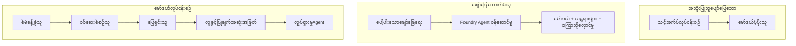
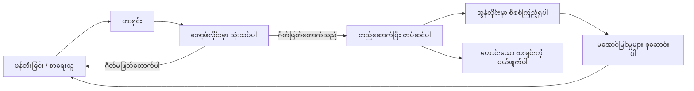
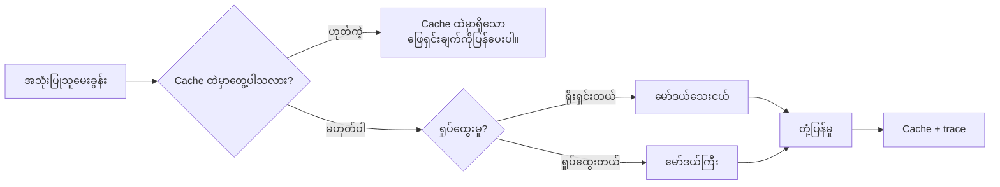
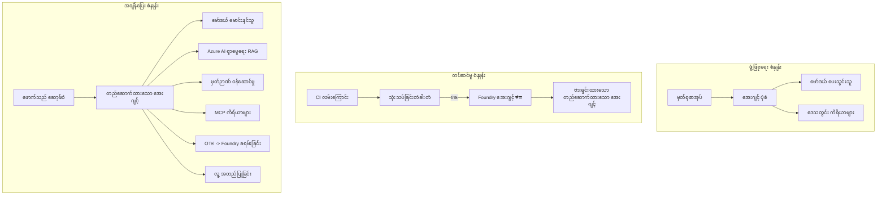

# Microsoft Foundry ဖြင့် လူဦးရေ တိုးတက်စေသော Agent များကို တပ်ဆင်ခြင်း


မိမိသည် ဒီသင်ခန်းစာအထိ လက်တော့ပ်ထပ်တွင်၊ notebook အတွင်းတွင် run ခဲ့သော၊ `az login` နှင့် environment variable အနည်းငယ်ဖြင့် သက်ဆိုင်သော agent များကို တည်ဆောက်ထားပြီးဖြစ်သည်။ ၎င်းသည် သေချာစွာ လေ့လာရန် မှန်ကန်သော နည်းလမ်းဖြစ်သည်။ သို့သော် မနက် ၃ နာရီတွင် သုံးသပ်သူထောင်ချီ များအသုံးပြုသော agent ကို run ပြုလုပ်ရန် မှန်ကန်သော နည်းလမ်းမဟုတ်သည်။

ဒီသင်ခန်းစာမှာ "မိမိစက်ပေါ်မှာ အလုပ်လုပ်တယ်" နဲ့ "ထုတ်လုပ်မှုတွင် ယုံကြည်စိတ်ချစွာနှင့် သက်တောင့်သက်သာ လုပ်ဆောင်နေတယ်" ဆိုတဲ့ အကြားကို ဖော်ပြပေးမှာဖြစ်ပြီး၊ **Microsoft Foundry** နှင့် **Microsoft Foundry Agent Service** ကို အသုံးပြုကာ real customer support agent တစ်ခုကို လုပ်ဆောင်မှာဖြစ်သည်။ ထို agent တွင် ကိရိယာများ၊ ရှာဖွေမှု၊ မှတ်ဉာဏ်၊ အကဲချေမှု နှင့် စောင့်ကြည့်မှုတို့ ပါဝင်သည်။

## မိတ်ဆက်

ဒီသင်ခန်းစာတွင် ပါဝင်သော အကြောင်းအရာများမှာ -

- **prototype agent** နှင့် **deployed agent** တို့၏ ကွာခြားချက်၊ အဓိကအားဖြင့် မော်ဒယ်အနောက်တွင် ရှိသော အချက်အလက်များဆီသို့ ပူးပေါင်းမှု။
- Agent များအတွက် **deployment ပုံစံများ** — client-hosted, service-hosted (Hosted Agents), နှင့် workflow-orchestrated။
- Microsoft Foundry တွင် **agent lifecycle** — ဖန်တီးခြင်း၊ ဗားရှင်းထုတ်ခြင်း၊ တပ်ဆင်ခြင်း၊ အကဲချယ်ခြင်း၊ ကြည့်ကြည့်မြင်မြင်ခြင်း၊ အနုတ်ခံခြင်း။
- **scaling နည်းလမ်းများ** : မော်ဒယ်လမ်းညွှန်ခြင်း၊ caching, concurrency နှင့် stateless ဒီဇိုင်း။
- OpenTelemetry နှင့် Foundry tracing ဖြင့် **observability**။
- မော်ဒယ်ရွေးချယ်မှု၊ လမ်းညွှန်ခြင်း၊ အကဲဖြတ်ခြေများမှတဆင့် **ကုန်ကျစရိတ်ချွေတာမှု**။
- **အကြီးစားလုပ်ငန်းများအတွက် စဉ်းစားစရာ**: အုပ်ချုပ်မှု, လူ့အတည်ပြုမှု, MCP စာာဗာအား ထုတ်လုပ်မှုလုံခြုံစွာ ပြေးဆွဲမှု။

## သင်ယူလိုသော ရည်မှန်းချက်များ

ဒီသင်ခန်းစာပြီးပါက သင်သိရှိနားလည်နိုင်မည့် အရာများမှာ -

- agent workloads များအတွက် သင့်တော်သော deployment ပုံစံကို ရွေးချယ်နိုင်ခြင်း။
- Microsoft Foundry Agent Service တွင် agent တစ်ခုတပ်ဆင်ကာ ဗားရှင်းထုတ်ခြင်း၊ အုပ်ချုပ်ခြင်းနှင့် စောင့်ကြည့်နိုင်ခြင်း။
- tracing အတွက် agent ကို အမှတ်စဉ်တပ်ပြီး မိတ်ဆက်ပြီး၊ ပြုလုပ်မည့် release မတိုင်မှီ အကဲဖြတ်နည်းလမ်းတစ်ခုချိတ်ဆက်နိုင်ခြင်း။
- မော်ဒယ်လမ်းညွှန်ခြင်းနှင့် caching ကို အသုံးပြုကာ တုံ့ပြန်အချိန်နှင့် ကုန်ကျစရိတ်ကို ထိန်းချုပ်နိုင်ခြင်း။
- အန္တရာယ်မြင့်သော လုပ်ဆောင်ချက်များအတွက် လူ့အတည်ပြုမှုမြှင့်တင်ခြင်းနှင့် MCP စာာဗာအား ထုတ်လုပ်မှု လုံခြုံစွာ ချိတ်ဆက်နိုင်ခြင်း။

## လိုအပ်ချက်များ

ဒီသင်ခန်းစာအတွက် အိမ်ရှေ့သင်ခန်းစာများကို ပြီးမြောက်ပြီး၊ အောက်ပါအရာများတွင် နားလည်သဘောပေါက်မှသာ လက်ခံမည်။

- [Microsoft Agent Framework](../14-microsoft-agent-framework/README.md) ဖြင့် agent များတည်ဆောက်ခြင်း (Lesson 14)။
- [Tool Use](../04-tool-use/README.md) (Lesson 4) နှင့် [Agentic RAG](../05-agentic-rag/README.md) (Lesson 5)။
- [Agent Memory](../13-agent-memory/README.md) (Lesson 13) နှင့် [Agentic Protocols / MCP](../11-agentic-protocols/README.md) (Lesson 11)။
- [Observability and Evaluation](../10-ai-agents-production/README.md) (Lesson 10) — ဒီသင်ခန်းစာသည် တိုက်ရိုက် ထပ်တူ သက်ဆိုင်သည်။

သင်အောက်ပါအသုံးပြုရမည့် အရာများလည်းရှိသည်။

- **Azure subscription** နှင့် အနည်းဆုံး deployed chat model တစ်ခုပါဝင်သော **Microsoft Foundry project**။
- **Azure CLI** မှ authenticator ဖြစ်ပြီး(`az login`) ဖြင့် လုပ်ဆောင်နိုင်မှု။
- Python 3.12+ နှင့် repository ထဲရှိ [`requirements.txt`](../../../requirements.txt) ဖိုင်များထည့်သွင်းထားခြင်း။

## Prototype မှ Production သို့: အမှန်တကယ်ပြောင်းလဲသည့် အရာများ

prototype agent နှင့် production agent သို့မဟုတ် လေ့လာမှုဟာ အဓိက loop တူညီသော်လည်း — အကြောင်းအရင်းရှာခြင်း, ကိရိယာခေါ်ဆိုခြင်း, တုံ့ပြန်ခြင်း — အဝိုင်းပတ်ရှိ အရာအားလုံးကို ပြောင်းလဲသည်။ မော်ဒယ်မှာ ရာခိုင်နှုန်း ၂၀ ခန့်သာ ဖြစ်ပြီး၊ ရှေ့နေ ၈၀% က လည်ပတ်မှု၏ အစိတ်အပိုင်းဖြစ်သည်။

| စိုးရိမ်စရာ | Prototype | Production |
| --- | --- | --- |
| **Hosting** | မိမိ notebook တွင် run ပြုလုပ်သည် | version လုပ်ပြီး Hosted service အဖြစ် run လုပ်သည်။ |
| **Identity** | မိမိ `az login` token ကို အသုံးပြုသည် | Scoped RBAC ပါရှိသည့် managed identity ကို အသုံးပြုသည် |
| **State** | မိမိ process memory တွင်သာ ရှိပြီး restart မှာဆုံးရှုံးသည် | ပြင်ပ(local thread store, memory service) တွင် သိမ်းဆည်းသည် |
| **Failure** | traceback ကို မြင်ရသည် | retry, fallback, dead-letter, alert များရှိသည် |
| **Cost** | "ငွေရေး စင်တစ်ချောင်းကျောင်း" | တစ်ကြိမ်စာတောင်းခံမှသာ စတော့ဝယ်/လျှော့ချပေးသည်၊ cache အား အသုံးပြုသည်၊ ကြိုတင် ငွေကြေး ထားရှိသည် |
| **Quality** | output ကို မျက်စိဖြင့် စစ်ဆေးသည် | Release မချစ်ခင် အလိုအလျောက် Evaluation ပြုလုပ်သည် |
| **Trust** | လုပ်ဆောင်ချက်တိုင်းကို သက်ဆိုင်သူ မင်းတော်မှ အတည်ပြုသည် | နည်းပညာ၊ လောကအတွင်း လူ့အတည်ပြုစနစ်ပါဝင်သည် |

အဆိုပါဇယားကို စဉ်းစားပါ။ အောက်တွင်ရှိသည့် အစိတ်အပိုင်းတိုင်းသည် အဆိုပါ ဇယားရှိ အတန်းတစ်ခုနှင့် ထပ်တူညီသည်။

## Agent Deployment ပုံစံများ

သုံးမျိုးတဲ့ ပုံစံများကို အမြဲတမ်း ပေါင်းစပ်ပြီး အသုံးပြုကြသည်။

### ၁။ Client-Hosted Agents

agent object ဟာ *သင့်* application process အတွင်းနေထိုင်သည်။ မိမိ၏ code က မော်ဒယ် ပေးသူကိုတိုက်ရိုက်ခေါ်ဆိုပြီး reasoning loop လည်း သင့် service အတွင်း run ဖြစ်သည်။ ဒီလို သင်ခန်းစာတွေမှာ ကျွန်တော်တို့ လုလုပ်ခဲ့တာဖြစ်သည်။

- **အသုံးပြုရန်** loop အပေါ် လုံးဝထိန်းချုပ်မှုလိုအပ်သောအခါ၊ custom middlewareလိုအပ်သောအခါ သို့မဟုတ် agent ကို လက်ရှိ backend ထဲတွင် ထည့်သွင်းချိတ်ဆက်စရာလိုပါက။
- **ပြန်လည် ဆွေးနွေးမှု** : သင်တစ်ဦးတည်းပြီး scaling, state နှင့် resilience ကို ကိုယ်တိုင် ထိန်းချုပ်ရမည်။

### ၂။ Hosted Agents (Foundry Agent Service)

agent ကို Microsoft Foundry တွင် *resource အဖြစ် မှတ်ပုံတင်ထားသည်*။ Foundry သည် reasoning loop ကို host လုပ်ကာ threads သိမ်းဆည်း၊ content security နှင့် RBAC ကို အကောင်အထည်ဖော်၊ agent ကို Foundry portal တွင် မြင်ရစေသည်။ သင့် app သည် thread များဖန်တီးပြီး တုံ့ပြန်ချက်ဖတ်သော client အဖြစ် ဖြစ်လာသည်။

- **အသုံးပြုရန်** ခိုင်မာမှုရှိသော Durable ဖြစ်စေရန်၊ built-in observability, governance နှင့် အုပ်ချုပ်မှု ကို လျော့နည်းစေရန်လိုယ်။
- **ပြန်လည် ဆွေးနွေးမှု** : managed runtime အတွက် အနည်းငယ်သာ ထိန်းချုပ်မှု တိကျမှုနည်းသည်။

### ၃။ Agent Workflows

အရာများစွာ agent များနှင့် ကိရိယာများကို explicit control flow ဖြင့် graph အဖြစ် ဖွဲ့စည်းသည် - တန်းစီဆက်တိုက် လုပ်ဆောင်မှုများ၊ branch များ၊ လူတစ်ဦး၏ အတည်ပြုမှု node များ၊ ရပ်တန့်ပြီး ပြန်စတင်နိုင်သော durable checkpoint များ။ ၎င်းသည် Microsoft Agent Framework **Workflows** စွမ်းဆောင်မှုဖြစ်ပြီး deployment scale တို့တွင် လက်တွေ့အသုံးချသည်။

- **အသုံးပြုရန်** တစ်ခုတည်းသော အလုပ်တစ်ခုတွင် အထူးပြု agent များ စုပေါင်းလိုလျှင်၊ အတည်ပြုပြေးလမ်းအပိုင်းတစ်ခုလိုလျှင်။
- **ပြန်လည် ဆွေးနွေးမှု** : အစိတ်အပိုင်းများပေါများခြင်း၊ orchestration-level observability လိုအပ်သည်။



## Microsoft Foundry တွင် Agent 生命周期

Agent တစ်ခုတပ်ဆင်ခြင်းသည် တစ်ကြိမ်တည်းသော `push` တင်ခြင်းမဟုတ်ပါ။ ၎င်းသည် loop တစ်ခုဖြစ်ပြီး နောက်တစ်ချက်တော့ software release cycle နှင့် လုံးဝ တူညီပါသည်။



[Lesson 10](../10-ai-agents-production/README.md) မှ ကူးယူထားသော အချက်အလက်အဓိကမှာ - **offline evaluation ကို လမ်းကြောင်းတစ်ခုအဖြစ်သာ ရှုမယ်၊ ယခုအပေါ်မှ နောက်တွဲတစ်ခု မဟုတ်ပါ။** နယောက် agent ဗားရှင်းအသစ်သည် သင့်အကဲဖြတ်စံနစ်မှ ဒီဇာတ်မြောက်ရန်မလိုအပ်ပါက မပို့ပေးပါ။ online observability ကလည်း အမှားတွေကို offline test set ထဲ ပြန်ကျော်ယူတာပါ။ ဒါက loop လုံးလုံးပါပဲ။

## Scaling နည်းလမ်းများ

Agent တစ်ခုအား scaling ပြုလုပ်ခြင်းသည် stateless web API များ တိုးမြှင့်ခြင်းနှင့် ကွာခြားသည်၊ အကြောင်းမှာ တောင်းဆိုချက်တစ်ခုခြင်းသည် မြှောက်ရမ်းစရာ မော်ဒယ် call များနှင့် ကိရိယာခေါ်ဆိုမှုများစွာကို ဖန်တီးနိုင်သည်။ နည်းလမ်းလေးခုသည် အများဆုံး ဖြစ်စေသည်။

**Stateless request မှာန်ခြင်း။** သင့် process memory အတွင်း အသုံးပြုသူ အတိုင်အကျ ဂရုမစိုက်ပါနှင့်။ ဆက်သွယ်မှု thread များကို Foundry thread store သို့မဟုတ် memory service တွင် သိမ်းဆည်းထားသည့်အတွက် instance အသီးသီးသည် တောင်းဆိုချက် မည်သည့်အခါမဆို ကိုင်တွယ်နိုင်သည်။ ဒီနည်းလမ်းက horizontal scaling ကို ခွင့်ပြုပေးသည် - instance အသစ်တွေထည့်သွင်းနိုင်ပြီး sticky sessions မလိုအပ်ပါ။

**Model routing.** အားလုံးတောင်းဆိုချက်များကို သင့်ရဲ့ အကြီးစား (နှင့် အခြားဆုံးရွေးချယ်မော်ဒယ်) မဖြစ်စေရန်။ ရိုးရှင်းသော မော်ဒယ်များကို (ဥပမာ: ရည်ရွယ်ချက် သတ်မှတ်ခြင်း၊ အတိုချုံး အဖြေများ) ချိတ်ဆက်ပြီး မူလ မော်ဒယ်အတွက် စိတ်ကြိုက် reasoning ကို রাখতেပါတယ်။ Foundry ရဲ့ **Model Router** က ဒီအားပေးနိုင်သည်၊ ဒါမှမဟုတ် သင့်ကိုယ်ပိုင် light classifier ကို ဆောက်နိုင်သည်။ lab မှာ သင် DIY ပုံစံကို တည်ဆောက်မည်။

**Response caching.** မေးခွန်းများအပေါ် ပြန်လည်မေးခွန်းများ အများအပြား ဖြစ်သည် ("စကားဝှက်ပြန်လည်သတ်မှတ်ရာမှာ ဘယ်လိုလုပ်မလဲ?")။ ထုံးစံမေးခွန်းများ၏ အဖြေများကို cache ထားပြီး မော်ဒယ်ကို မခံစားပဲ ဖြေကြားပါ။ cache hit rate နည်းမကောင်းသော်လည်း ကုန်ကျစရိတ်နှင့် တုံ့ပြန်အချိန်ကို ကျဆင်းစေသည်။

**Concurrency နှင့် backpressure.** မော်ဒယ်ပေးသူများသည် နှုန်းထားကန့်သတ်ချက်များ ရှိသည်။ သင့် concurrency ကို ကန့်သတ်ပြီး exponential backoff ဖြင့် retries များ၊ ချိုသာစွာ fail ရမည် (queue ထဲရှိ "ကျွန်တော်တို့လုပ်ဆောင်နေပါပြီ" တုံ့ပြန်ချက်သည် ၅၀၀ internal server error နှင့် ကောင်းသည်)။



## ထုတ်လုပ်မှုတွင် Observability

မနုတ်တက်သော အရာကို မမြင်ရပါ။ Lesson 10 တွင်ဖော်ပြခဲ့သလို၊ Microsoft Agent Framework သည် **OpenTelemetry** trace များကို ယိုယွင်းစွာ ထုတ်ပေးသည် — မော်ဒယ်ခေါ်ဆိုမှု တစ်ချက်၊ ကိရိယာခေါ်ဆိုမှု တစ်ချက် နှင့် orchestration အဆင့်တိုင်းသည် span ဖြစ်သည်။ ထုတ်လုပ်မှုတွင် သင်သည် မြင်သာမှုများကို Microsoft Foundry (သို့မဟုတ် OTel-compatible backend များ) သို့ export ပြုလုပ်သည်၊ ၎င်းဖြင့် -

- တစ်ဦးချင်းသော ရောင်းသူ တောင်းဆိုချက်အပေါ် အဆုံးအဖြတ်အထိ မော်ဒယ်နှင့် ကိရိယာခေါ်ဆိုမှုအားလုံးကို trace လုပ်နိုင်သည်။
- p50/p95 တုံ့ပြန်ချိန်နှင့် တောင်းဆိုမှုတစ်ကြိမ်စီ၏ကုန်ကျစရိတ် ကြည့်ရှုနိုင်သည်။
- စားစရာမတော်တဆမှုများနှင့် ကုန်ကျစရိတ်များပိုသွားမှုအပေါ် သင်၏အသုံးပြုသူ (သို့မဟုတ် ငွေကြေးအသင်း) သိမှတ်မရခြင်းမတိုင်မီ သတိပေးနိုင်ပါသည်။

```python
from agent_framework.observability import get_tracer

tracer = get_tracer()

with tracer.start_as_current_span("support_request") as span:
    span.set_attribute("customer.tier", "enterprise")
    span.set_attribute("routed.model", "gpt-5-nano")
    # ဤ span အတွင်းတွင် agent အမှုဆောင်မှုကို အလိုအလျောက် မှတ်တမ်းတင်သည်။
```

`customer.tier` နှင့် `routed.model` ကဲ့သို့သော attribute များသည် trace များစုစုပေါင်းကို မေးခွန်းဖြေရှင်းနိုင်သော မေးခွန်းများ ("အကြီးစား customer များသည် အကြီးမဲ့ မော်ဒယ်များကို မကြာခဏခေါ်ဆိုခြင်း ရှိနေပါသလား?") အဖြစ် ပြောင်းလဲပေးသည်။

## ကုန်ကျစရိတ်ချွေတာခြင်း

ထုတ်လုပ်မှု agent များ၏ ကုန်ကျစရိတ်မှာ token များဖြစ်ပြီး ထိရောက်မှုရှိသော လှုပ်ရှားမှုသုံးခုရှိသည်။

၁။ **မော်ဒယ်ကို မှန်ကန်စွာ ရွေးချယ်ပါ။** သင်၏ အကဲဖြတ်မှတ်တိုက်ကျော်လွှားသော စမ်းသပ်မှုအောင်မြင်သော သေးငယ်သောမော်ဒယ်သည် အကြီးမားသော မော်ဒယ်တစ်ခုထက် ပိုမိုတန်ဖိုးသက်သာသည်။ သက်သေပြရန်အတွက် အကဲဖြတ်မှုကိုအသုံးပြုပါ၊ အစစ်အမှန်ဖြစ်ကြောင်း ပြသပါ၊ အနောက်မော်ဒယ်ကို default အဖြစ် မရွေးချယ်ရပါ။
၂။ **ရှုပ်ထွေးမှုအရ လမ်းညွှန်ပါ။** အပေါ်တွင်ဖော်ပြသလို — ကြီးမားသော မော်ဒယ်ကို မျှော်စင်ရေး ရှုပ်ထွေးသော reasoning လုပ်ဆောင်မှုများမှသာ အသုံးပြုပါ။
၃။ **အစွမ်းထက်စွာ cache ကို အသုံးပြုပါ။** အကြီးဆုံးသော မော်ဒယ်ခေါ်ဆိုမှုသည် မခေါ်ဆိုခဲ့သော အခါ ဖြစ်သည်။

အကဲဖြတ်ခြေများနှင့် ကုန်ကျစရိတ် ထိန်းချုပ်မှုမှာ နည်းလမ်း နှစ်မျိုး ဖြစ်ပြီး — အကဲဖြတ်မှုသည် *အရည်အသွေး အနိမ့်ဆုံး* ကို ပြောပြသည်၊ လမ်းညွှန်ခြင်းနှင့် caching မှ ကုန်ကျစရိတ်ကို အနိမ့်ဆုံးအောက်မှာ တည်မြဲစေသည်။

## အကြီးစား လုပ်ငန်းများအတွက် deployment စဉ်းစားစရာများ

**Governance.** Hosted Agents များတွင် Foundry ၏ RBAC, content safety နှင့် audit logging ကို ရရှိသည်။ Agent တစ်ခုခြင်းစီအတွက် လုံလောက်သည့် လုပ်ဆောင်ခွင့် နည်းဆုံး Managed Identity တစ်ခုဖြစ်စေပါ။ Knowledge base ကို ဖတ်ခွင့်သာ၊ ticketing API ကို Scoped access အဖြစ်သာ၊ အခြားမလိုအပ်ပါ။

**Human-in-the-loop.** တချို့လည်သူများလုပ်ဆောင်ချက်များကို အလိုအလျောက် လုပ်မည့်အစား (refund, account ဖျက်ခြင်း, ဥပဒေရေးရာအဖွဲ့ သို့ ဆက်သွယ်ခြင်း) အတည်ပြုပြီးမှ လုပ်ဆောင်သည်။ Microsoft Agent Framework သည် **approval-required** ကိရိယာများဖြင့်ထောက်ပံ့သည်။ Agent လုပ်ဆောင်မှုကို တင်ပြပြီး၊ pause ခံရပြီး လူတစ်ဦး၏ အတည်ပြုမှု ရရှိချိန်တွင် workflow အတက်ကျ လည်ပတ်သည်။ [Lesson 6](../06-building-trustworthy-agents/README.md) တွင် ၎င်းကို မြင်တွေ့ခဲ့ပြီး ယခုတွင် deployment ပြုလုပ်သည်။

**ထုတ်လုပ်မှုတွင် MCP.** [MCP](../11-agentic-protocols/README.md) ကိရိယာတစ်ခုဖြစ်ပြီး external tools များကို ကိုယ့် agent မှ စံနမူနာလမ်းညွှန် ဖြင့် သုံးစွဲနိုင်သည်။ ထုတ်လုပ်မှုတွင် MCP server တစ်ခုကို ယုံကြည်မှုမရှိသောနယ်နိမိတ်အဖြစ် ကစားပါ။ Server ဗားရှင်းကို pin ထားပါ၊ Scoped Identity ဖြင့် run ပြုလုပ်ပါ၊ ထွက်ရှိမှုများကို စစ်ဆေးပါ၊ စကားဝှက်များကို ထုတ်ဖော်ခြင်းမရှိပါ။ MCP server သည် dependency တစ်ခုဖြစ်ပြီး၊ dependency များကို patch ပြုလုပ်ခြင်း၊ audit ပြုလုပ်ခြင်းနှင့် နှုန်းထား ကန့်သတ်ထားသည်။



ဒီ diagram သုံးခု — ဖန်တီးမှု၊ deployment နှင့် runtime — ကို အကျဉ်းချုပ် agent တစ်ခု၏ သက်တမ်းသုံးအဆင့်ဖြစ်ကြောင်း ပြသသည်။ lab မှာ သင်အား အဆင့်ဆင့် ဖြတ်သန်းလေ့လာပေးမည်။

## လက်တွေ့ လေ့လာမှု Lab: ထုတ်လုပ်ရန် အသင့် Customer Support Agent

[`code_samples/16-python-agent-framework.ipynb`](./code_samples/16-python-agent-framework.ipynb) ကို ဖွင့်၍ အဆုံးအထိ လေ့လာလုပ်ဆောင်ပါ။ သင်သည် **Contoso customer support agent** တစ်ခုကို အသုံးပြုမှုတိုင်းဖြင့် တည်ဆောက်မည်။

၁။ **Tool ခေါ်ဆိုခြင်း** — အမှာစာအခြေအနေကို ရှာဖွေပြီး support ticket များ ဖွင့်သည်။
၂။ **RAG** — knowledge base (Azure AI Search, notebook ကို Search resource မလိုအပ်အောင် in-memory fallback ရှိသည်) မှ စည်းကမ်းမေးခွန်းများဖြေသည်။
၃။ **Memory** — စကားဝိုင်းကွက်တစ်ခုလုံးအတွင်း ဖောက်သည်ကို မှတ်ထားသည်။
၄။ **Model routing** — complexity classifier တစ်ခုသည် တောင်းဆိုချက်တိုင်းအား သေးငယ်သော်မဟုတ် ကြီးမားသော မော်ဒယ်သို့ လမ်းညွှန်သည်။
၅။ **Response caching** — ပြန်လည်မေးခွန်းများကို cache မှ ဖြေကြားသည်။
၆။ **လူ့အတည်ပြုခြင်း** — သတ်မှတ်ထားသော အခြေအနေနှင့်အတူ refund များကို လူ့အတည်ပြုမှုရရန် ရပ်နားစေသည်။
၇။ **Evaluation pipeline** — သေးငယ်သော offline စမ်းသပ်မှုများ စာရင်းဖြင့် agent ကို အမှတ်ပေး၍ release gate အဖြစ် သုံးသည်။
၈။ **Observability** — တောင်းဆိုချက်တိုင်း သို့ OpenTelemetry tracing ဆက်ရောက်သည်။

### လမ်းညွှန်ချက်

notebook သည် production သက်ဆိုင်ရာအမှန်တရားကို self-contained ဖြစ်ရန် ဆောင်ရွက်ထားပြီး runnable ပုဒ်မများအဖြစ် စုပုံထားသည်။ ယခုလေ့လာရန်အဓိကမှာ routing-plus-caching request handler ဖြစ်သည်။

```python
async def handle_support_request(query: str, customer_id: str) -> str:
    # ၁။ မဖြစ်နိုင်ချိန်အထိ ကိတ်ချပေးပါ။
    cached = response_cache.get(normalize(query))
    if cached:
        return cached

    # ၂။ ကုန်ကျစရိတ် ထိန်းချုပ်ရန် စိတ်ကြိုက်ဖြတ်တိုက်ပါ။
    model = "gpt-5-nano" if is_simple(query) else "gpt-5-mini"

    # ၃။ ကြည့်ရှုနိုင်မှုအတွက် အေးဂျင့်ကို trace span အတွင်း ပြေးပါ။
    with tracer.start_as_current_span("support_request") as span:
        span.set_attribute("routed.model", model)
        span.set_attribute("customer.id", customer_id)
        response = await support_agent.run(query, model=model)

    # ၄။ ကိတ်ပြီး ပြန်ပေးပါ။
    response_cache.set(normalize(query), response.text)
    return response.text
```

release ကိုကာကွယ်သော evaluation gate သည် ဒီအတိုင်း ပြသသည်။

```python
async def evaluation_gate(agent, test_cases, threshold: float = 0.8) -> bool:
    passed = 0
    for case in test_cases:
        result = await agent.run(case["input"])
        if score_response(result.text, case["expected"]) >= 0.8:
            passed += 1
    pass_rate = passed / len(test_cases)
    print(f"Evaluation pass rate: {pass_rate:.0%} (gate: {threshold:.0%})")
    return pass_rate >= threshold  # ဂိတ်က ကုန်ကျမှသာ တပ်ဆင်ပါ။
```

လိုင်းတိုင်းကို သေချာဖတ်ပါ — notebook သည် primitive များအား Framework call များအောက်မှာ  ဖုံးကွယ်ခြင်းမရှိစေရန် အမှန်သဖြင့်အသေးစားထားသည်။

## တပ်ဆင်ပြီးသည့် Agent ကို Smoke Tests နှင့် စစ်ဆေးခြင်း

အပေါ်တွင်ဖော်ပြထားသော evaluation gate ကို agent object အပေါ်တွင် *offline* ဖြင့် run ပြုလုပ်သည်။ Hosted Agent အဖြစ် တပ်ဆင်ပြီးပါက နောက်ထပ်တစ်ခု၊ ပိုမို လျှော့ချသည့် စစ်ဆေးမှုတစ်ခုလိုအပ်သည် — **တပ်ဆင်ပြီးသော endpoint ကြားဖြတ်တုံ့ပြန်နေပါသလား?** ဟူ၍။

"အောင်မြင်စွာ တပ်ဆင်ခြင်း" သည် control plane သည် definition ကို လက်ခံခြင်းသာ သက်သေပြသည် — agent ၏ တုံ့ပြန်မှုကို သက်သေမပြုပါ။ dependency မရှိခြင်း, model routing မမှန်ခြင်း (သို့) ဆက်သွယ်မှု သက်တမ်းကုန်ခြင်းက စစ်တမ်း သန့်ရှင်းခြင်းမရှိသော စနစ်တစ်ခုရှိစေသည်။ **smoke test** သည် ဒီအချက်ကို တစ်စက္ကန့်အတွင်း၊ တပ်ဆင်တိုင်း မှတ်တမ်းတင် အခမဲ့စစ်ဆေးပေးသည်။

ဒီ repository သည် သင့်အား အသုံးပြုနိုင်သော smoke-test pipeline တစ်ခုကို [AI Smoke Test](https://github.com/marketplace/actions/ai-smoke-test) GitHub Action အခြေပြု၍ ပေးဆောင်သည်။

- **Catalog** — [`tests/lesson-16-smoke-tests.json`](../../../tests/lesson-16-smoke-tests.json) တွင် Contoso support agent အတွက် prompts နှင့် assertions (မူအရ အဖြေများ၊ အမှာစာရှာဖွေခြင်း, မဟုတ်သော ခေါင်းစဉ်အကြောင်း, မဟုတ်သော turn များ ဆက်လက်၍ ဖော် ပြမှု) ပါဝင်သည်။ အခြားသင်ခန်းစာ agent များအတွက် catalog များသည် မြင်ကွင်းအလယ်၌ မြင်နိုင်သည် — [`tests/README.md`](../tests/README.md) ကို ကြည့်ပါ။
- **Workflow** — [`.github/workflows/smoke-test.yml`](../../../.github/workflows/smoke-test.yml) တွင် Azure OIDC ဖြင့် login ဝင်ပြီး တစ်ခုချင်း prompt များကို agent ၏ Responses endpoint သို့ POST ဆောင်ရွက်ပြီး assertion များ မကျေနပ်ပါက သင်တန်းအလုပ်ကို ပျက်စီးစေသည်။

```yaml
- name: Smoke-test hosted agent
  uses: JFolberth/ai-smoketest@v1
  with:
    project_endpoint: ${{ inputs.project_endpoint }}
    agent_name: ContosoSupportAgent
    tests_file: tests/lesson-16-smoke-tests.json
```


သင်၏ agent ကို deploy ပြီးပါက **Actions** တက်ဘ်မှတဆင့် ရောင့်ပါ၊ သင့် Foundry project endpoint နှင့် agent နာမည်ကို ဖြည့်စွက်လိုက်ပါ။ federated identity သည် Foundry project scope တွင် **Azure AI User** အခန်းကဏ္ဍလိုအပ်သည်။ layers များကို ပရမစ်အနေနဲ့ တွေးပါ: smoke tests (ရောက်ရှိနိုင်ပြီးတုံ့ပြန်နိုင်သလား?) သည် deployment တစ်ခုစီတွင် အမြဲ ran ပြီး၊ offline evaluation (တင်ပို့ရန် လုံလောက်အောင် ကောင်းမြတ်သလား?) ကို promotion မပြုလုပ်မီ လုပ်ဆောင်ပြီး၊ online evaluation (အပြင်ပတ်ဝန်းကျင်တွင် မည်ကဲ့သို့ လုပ်ဆောင်နေသနည်း?) ကို ဆက်တိုက် run လုပ်သည်။

## နည်းပညာ စစ်ဆေးမှု

သင်၏ နားလည်မှုကို စစ်ဆေးပြီး ဂိမ်းအပ်ရန်အတှကျ ဆက်သွားပါ။

**1. ထုတ်လုပ်မှု agent မှာ "model" ဟာ ဘယ်လောက်ခန့် ပါဝင်ပြီး ကျန်ရှိတာ ဘာတွေရှိသလဲ?**

<details>
<summary>အဖြေ</summary>

Model သည် စနစ်တစ်ခု၏ သေးငယ်သော အစိတ်အပိုင်းဖြစ်ပြီး ပြီးပြည့်စုံစွာ ၂၀% ခန့်သာ ရှိသည်ဟု မကြာခဏ ဆိုကြသည်။ ကျန်ရှိတာများမှာ operation skeleton ဖြစ်ပြီး hosting နှင့် versioning၊ identity နှင့် RBAC, externalised state, failure handling, cost tracking, evaluation, နှင့် human-in-the-loop controls များဖြစ်သည်။ ထုတ်လုပ်မှုသို့ရောက်ရှိခြင်းသည် reasoning loop ရှိ အရာအားလုံး *ဝှေ့ပတ်* ပြုလုပ်ခြင်း ဖြစ်သည်။
</details>

**2. Hosted Agent ကို client-hosted agent ထက် ဘယ်အချိန်မှာ ရွေးချယ်သင့်သလဲ?**

<details>
<summary>အဖြေ</summary>

သင်စိတ်တိုင်းကျ မပ်ဖိုင်းရှိပြီး (threads များ ထမင်းခြင်းနှင့် ပြန်ပေးနိုင်ခြင်း), observability, content safety နှင့် RBAC များပါရှိသော ပိုင်ဆိုင်မှု runtime ကိုမျှော်လင့်ပါက၊ reasoning loop ၏ အနိမ့်ဆုံးထိန်းချုပ်မှုကို လျော့နည်းသည့် operational area လှုပ်ရှားမှုများနှင့် ကုန်ကျစရိတ်ဖျော့ချလိုသူ၊ Hosted Agent ကို ရွေးချယ်သင့်သည်။ Client-hosted သည် reasoning loop အပေါ် ထိန်းချုပ်မှု အပြည့်ရှိရန်သော်လည်းကောင်း၊ နောက်ခံစနစ်တွင် Agent ကို ထည့်သွင်းသလို embed လုပ်ထားချင်သောအခါ သာဖြစ်သည်။
</details>

**3. scalable agent သည် မိမိ့ process memory တွင် stateless ဖြစ်ရခြင်း မည်သို့ အရေးကြီးသနည်း?**

<details>
<summary>အဖြေ</summary>

လက်ရှိ instance မည်သည့် request မဆို ကိုင်တွယ်နိုင်ရန်ဖြစ်ပြီး၊ sticky session မလိုအပ်ဘဲ horizontal scaling ပြုလုပ်နိုင်စေသည်။ အသုံးပြုသူတိုင်း၏ conversation state ကို thread store သို့မဟုတ် memory service တွင် ထုတ်ပြန်ထားသည်။ Process memory အတွင်း states ရှိရင် reset ပြုလုပ်လျှင် state ပျောက်ကွက်ပြီး load များကို မဖြန့်ဝေနိုင်တော့ပါ။
</details>

**4. model routing က ဘယ်ဆိုင်ရာပြဿနာကို ဖြေရှင်းပြီး evaluation နှင့် ဆက်နွယ်မှု ဘယ်လိုရှိသလဲ?**

<details>
<summary>အဖြေ</summary>

Routing သည် ရိုးရှင်းပြီး စျေးဆူသော model သို့ ရိုးရှင်း စစ်ဆေးမှုများ ပေးပို့ပြီး, ကြီးမားသော model ကို reasoning အတွက် သီးသန့်သုံးစွဲလိုက်သည်။ latency နဲ့ ကုန်ကျစရိတ်ကို ထိန်းချုပ်သည်။ evaluation နှင့် ဆက်နွယ်မှုမှာ evaluation သည် အကြောင်းအမျိုးအစားအချို့အတွက် စျေးသက်သာသော်လည်း ယုံကြည်စိတ်ချရမှု ရှိကြောင်း *အတည်ပြု*သည်။ Evaluation မပါက routing ဟာ ခန့်မှန်းခြေ တစ်ခုပင်ဖြစ်သည်။
</details>

**5. "evaluation gate" ဆိုတာဘာလဲ၊ lifecycle အတွင်း အရပ်ဘယ်မှာ ရှိသလဲ?**

<details>
<summary>အဖြေ</summary>

Evaluation gate သည် အွန်လိုင်း version အသစ်တစ်ခုအပေါ် offline စမ်းသပ်မှု set တစ်ခုကို run လုပ်ပြီး စာရင်းသွင်းခြင်းကိုကန့်သတ်သည်။ lifecycle တွင် "version" နှင့် "deploy" ကြားမှာ ရှိပြီး ထုတ်လုပ်မှုအရည်အသွေးကို ထွက်ပေါ်ရန်မတိုင်ခင် စီမံထားသည့် အသွင်အပြင်ဖြစ်သည်။
</details>

**6. MCP server ကို ထုတ်လုပ်မှုတွင် untrusted boundary အဖြစ် ဆက်ဆောင်ထားသင့်သည့် အကြောင်းရင်း?**

<details>
<summary>အဖြေ</summary>

သင်၏ agent မှ ခေါ်သည့် ပြင်ပ မှန်ကန်မှုတစ်ခုဖြစ်သောကြောင့် ဖြစ်သည်။ version မြန်းကို pin လုပ်၍ scoped identity ဖြင့် run ကာ output များကို တိကျမှန်ကန်ကြောင်းစစ်ဆေးပေးရန်၊ rate-limit တပ်ရန်၊ လျှို့ဝှက်ချက်များကို မဖော်ထုတ်ရန်လိုသည်။ တတိယပါတီ မှန်ကန်မှု အတိုင်း စနစ်ပေါ်တွင် အတည်မပြုချေမှုသည် လုံခြုံရေးအန္တရာယ်ဖြစ်သည်။
</details>

**7. ထုတ်လုပ်မှု agent ၏ ကုန်ကျစရိတ်ကို အကြီးဆုံး သက်တိုးမှု ပေးသော တစ်ခုတည်း ပြောင်းလဲမှုဘာလဲ၊ အကြောင်းရင်းကဘာလဲ?**

<details>
<summary>အဖြေ</summary>

Model အရွယ်အစားကိုမှန်ကန်စွာရွေးခြင်း — သင့် evaluation gate ပေါ်မူတည်ပြီး အငယ်ဆုံး model ကိုသွားရွေးခြင်းဖြစ်သည်။ ကုန်ကျစရိတ်မှာ token များကစားလို့ ဖြစ်သည့်အတွက် အရည်အသွေးအတိုင်းအတာဖြစ်ရသော သေးငယ်သော model သည် ကြီးမားသော model ထက် ပိုသက်သာခြင်းရှိသည်။ Caching နှင့် routing များက ဆက်လက်ထိရောက်အောင်လုပ်ပေးသည်, ဒါပေမယ့် အခြေခံ model သတ်မှတ်ခြင်းမှာ အကြီးဆုံး သက်တိုးမှုရှိသည်။
</details>

**8. `customer.tier` နှင့် `routed.model` ဖော်ပြချက်များသည် observability တွင် ဘာအခန်းကဏ္ဍရှိသလဲ?**

<details>
<summary>အဖြေ</summary>

၎င်းတို့သည် မူရင်း trace များကို အဖြေရှာနိုင်သော စီးပွားရေးမေးခွန်းများအဖြစ် ပြောင်းလဲပေးသည်။ attributes မရှိရင် span တွေ အနှံ့ သီးခြားထင်ရုန်းရုံ၊ attributes ဖြင့် “တိုးတက်သော customer များသည် သေးငယ်သော model သို့ အများအပြား ခေါ်သလား?” သို့မဟုတ် “အေ့ကျဆုံးမေးခွန်းကို မည်သည့် model ကင်တွယ်နေလဲ?” စသဖြင့် မေးနိုင်သည်။ attributes များဖြင့် ဤမျိုး များသော telemetry နှင့် စနစ်သုံးနေ့စွဲများကို ဖြတ်တောက်နိုင်သည်။
</details>

## သတ်မှတ်အပ်ရန် လုပ်ငန်းတာဝန်

lab အတွက် customer support agent ကို ယူပြီး အထူးသီးသန့် သဘောထားမှာခိုင်မာစေရန်: **SaaS ကုမ္ပဏီအတွက် subscription billing support agent။**

သင်၏ တင်သွင်းမှုတွင် ပါဝင်ရန် -

၁။ **နည်းပညာများကို billing နှင့်ပတ်သက်သောအရာများဖြင့် အစားထိုးပါ** - `get_subscription_status` , `get_invoice` နှင့် `issue_credit` (၁၀၀၀၀ထက်ပိုသော credit များအတွက် လူလက်ခံအတည်ပြုချက်လိုအပ်သည်)။
၂။ **refund policy၊ billing cycle နှင့် cancellation policy ကိုဖုံးကွယ်ထားသည့် RAG စာရွက် ၃ ခုထည့်သွင်းပါ။**
၃။ **evaluation စာရင်းကို အနည်းဆုံး ၈ မျိုးခန့်ချဲ့ထွင်၍ လူလက်ခံအတည်ပြုချက် လမ်းကြောင်း တစ်ခုခုပါ ရှိရမည်။ evaluation gate ကို မှန်ကန်စွာ pass သို့မဟုတ် fail ဖြစ်သည်ကို အတည်ပြုပါ။**
၄။ **ကုန်ကျစရိတ်အစီရင်ခံစာ တစ်ခုထည့်ပါ**: agent ဖြတ်သွားသော mixed queries ၁၀ ခုမှ မည်မျှတွေက အငယ်ဆုံး model, မည်မျှတွေကြီးမားသော model, မည်မျှတွေ cache ထဲကနေဖြစ်သည်ကို ထုတ်ပေးပါ။

မှတ်စုကွန်ပျူတာရှိ မြောက်စု စာသားတစ်ပုဒ် (markdown cell) ဖြင့် မည်သည့် model-routing အိုင်တီင်းကို ရွေးချယ်ပြီး အမှန်တကယ် traffic ဖြင့် မည်သို့ စစ်ဆေးမည်ကို ရှင်းပြပါ။ တစ်ခုတည်း အတိအကျ အဖြေ မရှိပါ၊ ထုတ်လုပ်မှုစိုးရိမ်ရမှုများကို သေချာ စွာချိတ်ဆက်ထားခြင်းအပေါ် သင့်ကို တန်ဖိုးထားခြင်းဖြစ်သည်။

## အနှစ်ချုပ်

ဒီသင်ခန်းစာမှာ Microsoft Foundry အသုံးပြု၍ agent ကို prototype မှ ထုတ်လုပ်မှုသို့ ရွှေ့ပြောင်းခဲ့သည်။

- ထုတ်လုပ်မှုသို့ ရွှေ့ပြောင်းခြင်းမှာ model အပေါ်ရှိ **operation skeleton** (hosting, identity, state, failure handling, cost, quality, trust) အပေါ်ကို ဦးစားပေးထားသည်။
- သင်သည် **deployment နည်းပညာ ၃ မျိုး** — client-hosted, Hosted Agents, နှင့် Agent Workflows — နှင့် မည်သည့်အခြေအနေတွင် ရောင့်သောကြောင်း သင်ယူခဲ့သည်။
- သင်သည် **agent lifecycle** ကို လမ်းလျှောက်ခဲ့ပြီး offline **evaluation သည် release gate အဖြစ် လုပ်ဆောင်ပြီး** အွန်လိုင်း observability သည် failure များကို test set သို့ ပြန်ပို့သည်။
- သင်သည် **scaling နည်းဗျူဟာများ** — stateless design, model routing, caching, နှင့် bounded concurrency — ကို အသုံးပြုပြီး **ကုန်ကျစရိတ် ထိန်းချုပ်မှုနှင့် ဆက်စပ်** ခဲ့သည်။
- အဖွဲ့အစည်းသုံး ထိန်းချုပ်ခြင်းများကို ချိတ်ဆက်ခဲ့သည် - RBAC, human-in-the-loop approval, နှင့် ထုတ်လုပ်မှုလုံခြုံ MCP ပေါင်းစည်းခြင်း။
- သင်သည် ယခု အချက်အလက်တစ်ခုချင်းစီကို runnable code ဖြင့် ပေါင်းစည်းထားသည့် **ထုတ်လုပ်မှုသုံး Customer Support Agent** တစ်ခု တည်ဆောက်ခဲ့သည်။

နောက်တစ်ခါ သင်ခန်းစာသည် အပြန်တဖြည်းဖြည်းသွားမှာဖြစ်ပြီးကဲ့သို့ - agent များကို cloud ထဲ တိုးမြှင့်ခြင်းမဟုတ်ဘဲ developer ပျော့တစ်ယောက်၏ စက်ကိုယ်တိုင်တွင် လုံးဝကိုယ်တိုင် local run ပြုလုပ်ရန် ရှေ့ဆက်ပါမည်။

## အပိုဆောင်း အရင်းအမြစ်များ

- <a href="https://learn.microsoft.com/azure/ai-foundry/what-is-azure-ai-foundry" target="_blank">Microsoft Foundry documentation</a>
- <a href="https://learn.microsoft.com/azure/ai-foundry/agents/overview" target="_blank">Microsoft Foundry Agent Service overview</a>
- <a href="https://learn.microsoft.com/en-us/agent-framework/overview/?wt.mc_id=youtube_26688_organicsocial_reactor&pivots=programming-language-python" target="_blank">Microsoft Agent Framework</a>
- <a href="https://learn.microsoft.com/azure/ai-foundry/concepts/model-router" target="_blank">Model Router in Microsoft Foundry</a>
- <a href="https://learn.microsoft.com/azure/search/search-what-is-azure-search" target="_blank">Azure AI Search</a>
- <a href="https://opentelemetry.io/" target="_blank">OpenTelemetry</a>
- <a href="https://github.com/marketplace/actions/ai-smoke-test" target="_blank">AI Smoke Test GitHub Action</a>
- <a href="https://modelcontextprotocol.io/" target="_blank">Model Context Protocol (MCP)</a>

## မတိုင်မီ သင်ခန်းစာ

[Building Computer Use Agents (CUA)](../15-browser-use/README.md)

## နောက်တစ်ခန်း သင်ခန်းစာ

[Creating Local AI Agents](../17-creating-local-ai-agents/README.md)

---

<!-- CO-OP TRANSLATOR DISCLAIMER START -->
**ပြောကြားချက်**
ဤစာတမ်းကို AI ဘာသာပြန်ဝန်ဆောင်မှု [Co-op Translator](https://github.com/Azure/co-op-translator) အသုံးပြု၍ ဘာသာပြန်ထားပါသည်။ ကျွန်ုပ်တို့သည် တိကျမှန်ကန်မှုအတွက် ကြိုးပမ်းနေသော်လည်း၊ စက်ကိရိယာဘာသာပြန်ခြင်းများတွင် အမှားများ သို့မဟုတ် မှားယွင်းချက်များ ပါဝင်နိုင်ကြောင်း သတိပြုပါရန် လိုအပ်ပါသည်။ မူလစာတမ်းကို မူရင်းဘာသာဖြင့်သာ ယုံကြည်စိတ်ချရသော အချက်အလက်အဖြစ် သတ်မှတ်သင့်သည်။ အရေးကြီးသည့် သတင်းအချက်အလက်များအတွက် ပရော်ဖက်ရှင်နယ် လူသားဘာသာပြန်သူဝန်ဆောင်မှုကို အကြံပြုပါသည်။ ဤဘာသာပြန်ချက်ကို အသုံးပြုခြင်းမှ ဖြစ်ပေါ်လာသော နားလည်မှုကွာခြားမှုများ သို့မဟုတ် မမှန်ကန်သော အသုံးပြုမှုများအတွက် ကျွန်ုပ်တို့ တာဝန်မခံပါ။
<!-- CO-OP TRANSLATOR DISCLAIMER END -->