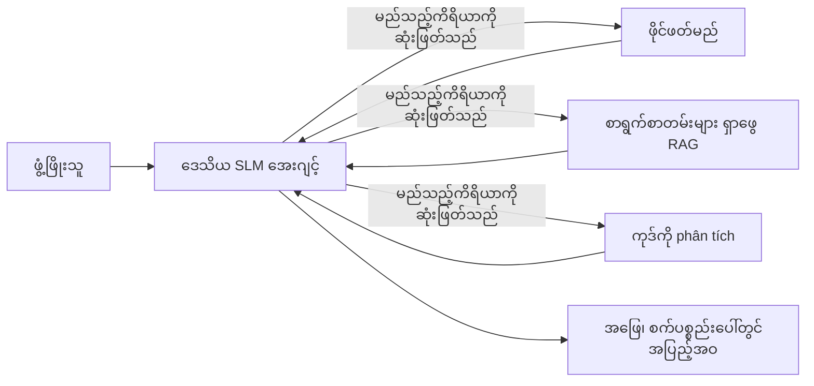
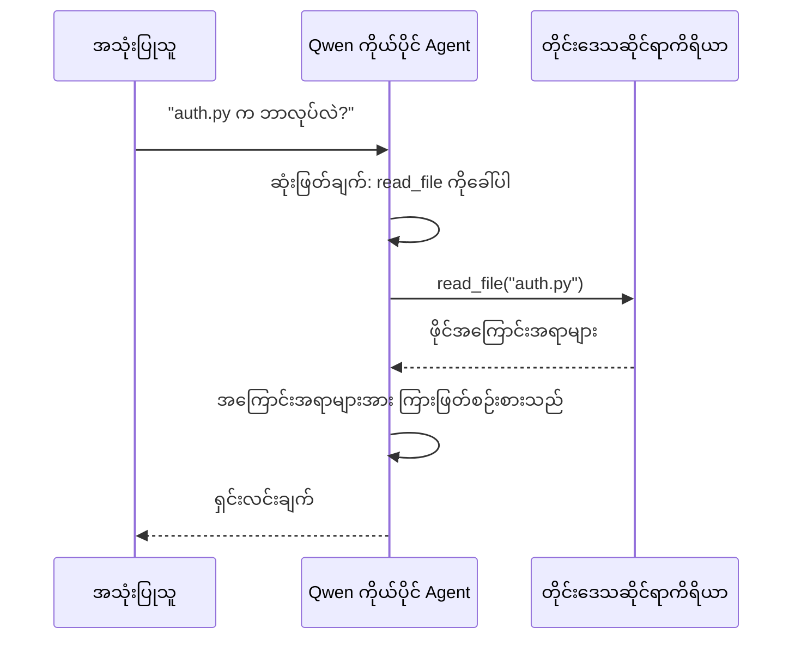
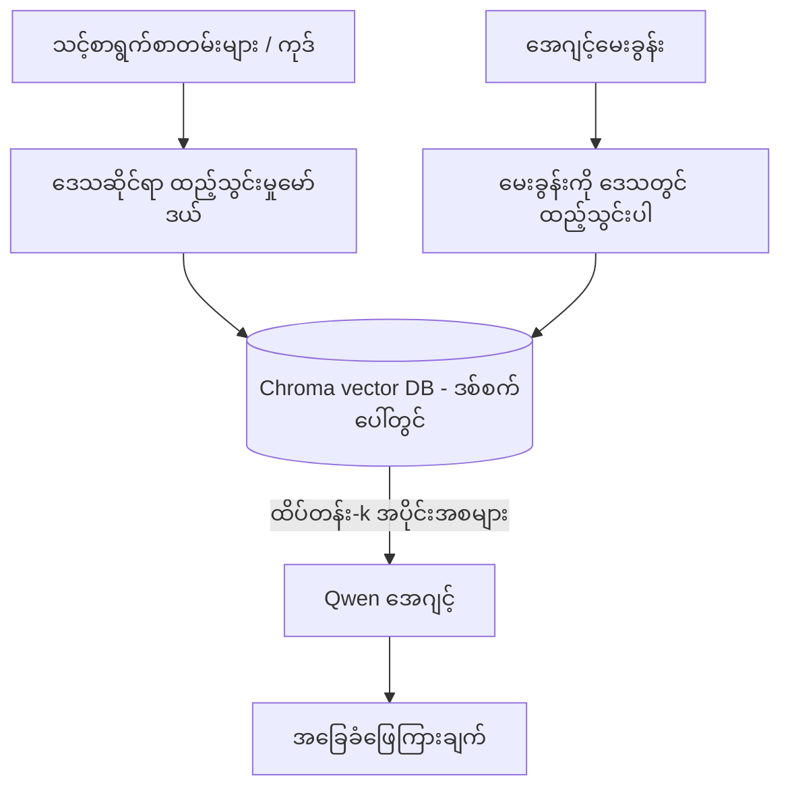
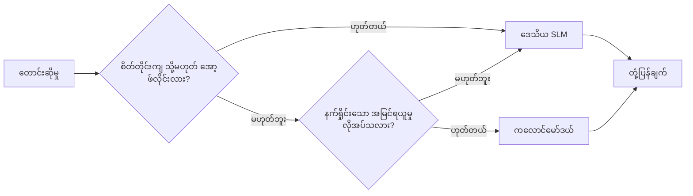

# Microsoft Foundry Local နှင့် Qwen ကို အသုံးပြု၍ ဒေသခံ AI ကိုယ်စားလှယ်များ ဖန်တီးခြင်း


ယခင်သင်ခန်းစာတွင် ကိုယ်စားလှယ်များကို မိုးကောင်းကင်သို့ *တက်* မြှင့်ခဲ့သည်။ ယခုသင်ခန်းစာတွင် အဆိုပါကိုယ်စားလှယ်များကို တစ်စက်ယောက်တွင် *ဆင်း* ကာ ထားသည်။ အဆုံးတွင် မည်သည့်မိုးကောင်းကင် inference ဖုန်းခေါ်မှုမျှ မရှိဘဲ အလုပ်လုပ်နိုင်သည့် အင်ဂျင်နီယာ ကူညီသူတစ်ဦး ရရှိမည် ဖြစ်သည်။

အဲဒါကို ဘာကြောင့်လိုလဲ။ အင်ဂျင်နီယားအလုပ်တွင် အမြဲတမ်းတွေ့ကြုံရသည့် အကြောင်းပြချက် သုံးချက်ရှိသည်။

- **ကိုယ်ပိုင်လုံခြုံရေး။** ကုဒ်နှင့်စာရွက်စာတမ်းများသည် စက်မှ မထွက်ပါ။ မည်သည့် prompt, snippet, သို့မဟုတ် ဖောက်သည်ဒေတာမှ ပြင်ပကွန်ယက်သို့ မထွက်ပို့ပါ။
- **ကုန်ကျစရိတ်။** ဒေသခံ inference တွင် token တစ်ခုချင်းစီအတွက် ငွေကြေးမရှိပါ။ လျှပ်စစ်ဓာတ်အားကုန်ကျစရိတ်နှုန်းဖြင့် နေ့လုံးပတ် iteration ပြုလုပ်နိုင်သည်။
- **အော့ဖ်လိုင်း။** လေယာဉ်ပျံ၊ လုံခြုံရေးအဆောက်အအုံတွင် သို့မဟုတ် အဓိကကွဲပြားမှုရှိစဉ်တွင် ရှိရန်လည်း ကိုယ်စားလှယ် အလုပ်လုပ်နေဆဲ။

ပြဿနာမှာ သင်၏ CPU, GPU သို့မဟုတ် NPU ပေါ်တွင် ပြေးနိုင်သည့် **စာသားအတို (SLM)** ကို frontier cloud မော်ဒယ်အစား အသုံးပြုခြင်းဖြစ်သည်။ ဤသင်ခန်းစာမှာ အဆိုပါကန့်သတ်ချက်အတွင်း သင့်တော်သော ကိုယ်စားလှယ်များကို တည်ဆောက်သင့်သည်ကို ပြောသည်၊ ကန့်သတ်ချက် မရှိသလို ယုံကြည်ခြင်း မဟုတ်ပါ။

## မိတ်ဆက်

ဤသင်ခန်းစာသည် အောက်ပါအကြောင်းအရာများကို ရေးသားသည်။

- **စာသားအတိုအမည် (SLMs)** — ၎င်းတို့ ဘာဖြစ်ကြောင်း၊ ဘယ်နေရာတွင်ထူးချွန်ကြောင်းနှင့် မထူးချွန်သောနေရာများ။
- **Microsoft Foundry Local** — မော်ဒယ်များကို စက်၌ဒေါင်းလုဒ်လုပ်ကာ ဖြန့်ဝေသည့် runtime၊ **OpenAI-compatible API** ဖြင့်။
- **Qwen function-calling မော်ဒယ်များ** — ဒေသခံ *ကိုယ်စားလှယ်* များ ဖြစ်ရန် အရေးကြီးသည့် ယုံကြည်စိတ်ချရသော ကိရိယာခေါ်ဆိုမှုများ ဖန်တီးနိုင်သော SLM များ။
- **ဒေသခံ ကိရိယာများ၊ ဒေသခံ RAG ပေါင်းစပ်ခြင်းနှင့် ဒေသခံ MCP** — မိုးကောင်းကင် မပါဘဲ ကိုယ်စားလှယ်အား စွမ်းရည်ပေးခြင်း။
- **ပေါင်းစပ်ပုံစံများ** — ဘယ်အချိန်တွင် ဒေသခံမှပင် ထိန်းသိမ်းရန် နှင့် ဘယ်အချိန်တွင် မိုးကောင်းကင်ထံ ဆက်သွယ်ရန်။

## သင်ယူရမည့်ရည်ရွယ်ချက်များ

ဤသင်ခန်းစာကိုပြီးမြောက်သွားပါက၊ သင်သည် အောက်ပါ အရာများကို သိရှိမည်ဖြစ်သည်။

- SLM များ၏ ကိစ္စရပ်များကို ဆွေးနွေးပြီး ဒေသခံကိုယ်စားလှယ်သုံးမှု ဆုံးဖြတ်နိုင်ခြင်း။
- Foundry Local ဖြင့် ဒေသခံ Qwen မော်ဒယ်တင်ပြီး OpenAI-compatible endpoint နှင့် ချိတ်ဆက်နိုင်ခြင်း။
- ကိရိယာခေါ်ဆိုမှုကို အပြည့်အဝ စက်ပေါ်တွင် ပေးဆောင်သော ကိုယ်စားလှယ်တစ်ဦး ဖန်တီးနိုင်ခြင်း။
- ဒေသခံ vector database (Chroma) ကို အသုံးပြုကာ ကိုယ်ပိုင်စာရွက်စာတမ်းများအပေါ် ဒေသခံ RAG ထည့်သွင်းခြင်း။
- ဒေသခံ MCP ဆားဗာနှင့် ချိတ်ဆက်ကာ ဒေသခံ/မိုးကောင်းကင် ပေါင်းစပ်ဖြေပုံများကို သုံးသပ်နိုင်ခြင်း။

## ကြိုတင်လိုအပ်ချက်များ

ဤသင်ခန်းစာသည် ယခင်သင်ခန်းစာများ ပြီးမြောက်ပြီး အောက်ပါအချက်များ၌ ချောမွေ့မှု ရှိကြောင်း ပြုစုထားသူများအတွက်ဖြစ်သည်။

- [Tool Use](../04-tool-use/README.md) (သင်ခန်းစာ ၄) နှင့် [Agentic RAG](../05-agentic-rag/README.md) (သင်ခန်းစာ ၅)။
- [Agentic Protocols / MCP](../11-agentic-protocols/README.md) (သင်ခန်းစာ ၁၁)။
- [Microsoft Agent Framework](../14-microsoft-agent-framework/README.md) (သင်ခန်းစာ ၁၄)။

သင်တွင် လိုအပ်သော အရာများဖြစ်သည် -

- ဖန်တီးသူ စက်တစ်စက်။ **အနည်းဆုံး RAM 8 GB သည် လက်ခံနိုင်သည်**; 16 GB+ သည် သက်သာစေသည်။ GPU သို့မဟုတ် NPU လည်းကောင်း၊ မလိုအပ်ပါ။
- **Microsoft Foundry Local** တပ်ဆင်ထားခြင်း (အောက်တွင် စက်တင်ခြင်း အပိုင်းကို ကြည့်ပါ)။
- Python 3.12+ နှင့် repository တွင် ရေးထားသော [`requirements.txt`](../../../requirements.txt) တွင်ရှိသော ပက်ကေ့ဂျ်များ၊ နောက်ထပ် `foundry-local-sdk`၊ `openai` နှင့် `chromadb` တို့။

## စာသားအတို လျှော့ချမှုးများ: ဒေသခံအလုပ်အတွက် သင့်တော်သော ကိရိယာ

frontier cloud မော်ဒယ်တွင် parameter သန်းပေါင်းများစွာနှင့် ဒေတာစင်တာတစ်ခုရိွသည်။ SLM သည် parameter သန်းအနည်းငယ်ရှိပြီး လက်ပ်တော့၏ RAM ထဲတွင်တည်နိုင်ရမည်။ ဒီကွာခြားချက်က ရည်မှန်းချက်များ ထင်ထင်ရှားရှားထားပေးသည်။

**SLM များ၏ အားသာချက်များမှာ-**

- ဖွဲ့စည်းထားသော လမ်းစဉ်များ၊ ကန့်သတ်ထားသောလုပ်ငန်းများ - သတ်မှတ်စာရွက်စာတမ်းများ၏ အမျိုးအစားသတ်မှတ်ခြင်း၊ ထုတ်ယူခြင်း၊ အနှစ်ချုပ်ရေးသားခြင်း။
- **ကိရိယာခေါ်သုံးခြင်း** — ဘယ် function ကို ဖုန်းခေါ်ရမည်နှင့် argument များကို ဘာအသုံးပြုရမည်ကိုဆုံးဖြတ်ခြင်း။
- သင့်ဒေတာအပေါ် အမြန်နှုန်းမြင့်၊ စျေးသက်သာပြီး ကိုယ်ပိုင် iteration ပြုလုပ်နိုင်ခြင်း။

**SLM များ၏အားနည်းချက်များမှာ-**

- ကြီးမားသော ပတ်ဝန်းကျင်အတွင်း ဟော့ပ်များစွာ ထပ်ခါပြီး မရှင်းလင်းသော ဆန်းစစ်မှု။
- ကျယ်ပြန့်သော လူ့အသိပညာ (နည်းပါးသည့်အချက်များ ရှိပြီး မေ့ဆွယ်မှု လွယ်ကူ)။

ဒေသခံ ကိုယ်စားလှယ်များအတွက် အောင်မြင်သည်မှာ - **SLM ကို ညှိနှိုင်းအုပ်ချုပ်ရန်ခွင့်ပြု ပါ၊ ကိရိယာများအား မြင့်မားသော အလုပ်တစ်လုံးအဖြစ် စီမံခန့်ခွဲရန်ခွင့်ပြုပါ။** မော်ဒယ်သည် သင့်ကုဒ်အခြေခံကို *သိရန်* မလိုအပ်ပါ၊ လိုအပ်တာက ဘယ်အချိန်တွင် `read_file` နှင့် `search_docs` ကို ခေါ်မည်ကို သိရခြင်းသာ ဖြစ်သည်။ ၎င်းသည် SLM ၏ အားသာချက်များကို တိုက်ရိုက် အသုံးချခြင်းဖြစ်သည်။



## Microsoft Foundry Local

**Microsoft Foundry Local** သည် မော်ဒယ်များကို ဒေါင်းလုဒ်၊ စီမံခန့်ခွဲနှင့် စက်ပေါ်တွင် အပြည့်အဝ ဖြန့်ဝေသည့် အလွယ်တကူ runtime တစ်ခုဖြစ်သည်။ အရေးကြီးဆုံး အင်္ဂါရပ်မှာ **OpenAI-compatible HTTP endpoint** တစ်ခုကို ထုတ်ပေးခြင်းဖြစ်ပြီး၊ ထိုသို့ ဖြစ်ခြင်းကြောင့် OpenAI SDK နှင့် Microsoft Agent Framework ၏ OpenAI client ကို `base_url` ပြောင်းခြင်းဖြင့်သာ အသုံးပြု၍ ထို endpoint တို့အား အလုပ်လုပ်အောင် လုပ်နိုင်သည်။ သင်သည် ကိုယ်စားလှယ်များ တည်ဆောက်သင်ယူထားသည့် အရာမျှလုံးသည် မိုးကောင်းကင်မှ `localhost` သို့သာ ပြောင်းထားခြင်း ဖြစ်သည်။

Foundry Local သည် သင့်ကွန်ပျူတာပစ္စည်းအတိုင်း CPU, CUDA/GPU သို့မဟုတ် NPU build အကောင်းဆုံးကို အလိုအလျောက် ရွေးချယ်ပေးသည်၊ ထို့ကြောင့် စက်စူးစမ်း optimize မလုပ်ရဘဲဖြစ်ပါသည်။

### စက်တင်ခြင်း

OS အတွက် [စာရွက်စာတမ်း](https://learn.microsoft.com/azure/ai-foundry/foundry-local/) အတိုင်း Foundry Local ကို တပ်ဆင်ပြီး၊ အောက်ပါအတိုင်း အလုပ်လုပ်မှု စစ်ဆေးပါ-

```bash
# တပ်ဆင်ပါ (ဥပမာ; သင့်ပလက်ဖောင်းအတွက် ကိုးကားစာတမ်းများကို လိုက်နာပါ)
winget install Microsoft.FoundryLocal      # Windows
# brew install microsoft/foundrylocal/foundrylocal   # macOS

# Qwen မော်ဒယ်ကို ဒေါင်းလုဒ်လုပ်ပြီး စတင်အပ်ပါ၊ ဒါမှ ပြီးမှ ဒေသခံဝန်ဆောင်မှုကို စတင်ပါ။
foundry model run qwen2.5-7b-instruct
foundry service status
```

ဝန်ဆောင်မှု ပြေးနေသောအခါ၊ သင်တွင် ဒေသခံ OpenAI-compatible endpoint (ပုံမှန်အားဖြင့် `http://localhost:PORT/v1`) ရှိသည်။ notebook သည် `foundry-local-sdk` ကို အသုံးပြုကာ အလိုအလျောက် endpoint ဖြည့်စွက်သည်၊ ထို့ကြောင့် ပေါ့တ်ကို စက်တင်ထားရန် မလိုအပ်ပါ။

## Qwen function calling: အရေးကွယ်ခြင်း

ကိုယ်စားလှယ်သည် သာလွန်သူတစ်ဦး ဖြစ်ရန် ကိရိယာခေါ်ဆိုနိုင်ရမည်။ SLM အများစု သာမကချောက်ထား၍ မယုံကြည်စိတ်ချရသော၊ ကြေကွဲထားသော ကိရိယာခေါ်ဆိုမှုများ ဖန်တီးတတ်ကြသည်။ **Qwen** မော်ဒယ်များသည် function calling အတွက် လေ့ကျင့် ပြီး ယုံကြည်စိတ်ချရသော ကိရိယာခေါ်မှု ဖန်တီးကြသည်၊ ၎င်းသည် ဒေသခံ chat မော်ဒယ်ကို ဒေသခံ *ကိုယ်စားလှယ်* သို့ ပြောင်းလဲမှု ဖြစ်စေသည်။

လည်ပတ်ပုံမှာ သင် သိပြီးသား ပုံမှန် tool-calling loop တူပြီး device ပေါ်တွင် ပြေးသော ပုံစံဖြစ်သည်။



## ဒေသခံ RAG

စာရွက်စာတမ်း ရှာဖွေရေးသည် ဒေသခံ ကိုယ်စားလှယ်များအတွက် အကျိုးရှိသော နေရာဖြစ်သည်။ SLM သည် framework စာရွက်စာတမ်းများကို မှတ်မိထားသည်ဟု မျှော်လင့်နေခြင်း အစား၊ ထိုစာရွက်စာတမ်းများကို **ဒေသခံ vector database** အဖြစ် ထည့်သွင်းပြီး ကြိုက်သလို အပိုင်းများကို ကိုယ်စားလှယ်က ရယူသည်။

Chroma ကို အသုံးပြုသည်။ ၎င်းသည် ထိန်းချုပ်စီမံရာတွင် server မလိုအပ်သော embedded vector store ဖြစ်သည်။ အစီအစဉ်ရပ်တန်းသည် လူ့အသုံးအဆောင်တစ်ခုလုံး ဒေသခံဖြစ်ပြီး၊ ဒေသခံ embedding မော်ဒယ် → ဒေသခံ vectorများ → ဒေသခံ ရယူမှု → ဒေသခံ SLM ဖြစ်သည်။



ယင်းသည် Lesson 5 မှ Agentic RAG ပုံစံနှင့် တူသည်― ကဏ္ဌတိုင်းသည် သင်၏ စက်ပေါ်တွင်သာ ပြေးသည်။

## ဒေသခံ MCP ဆားဗာများ

[MCP](../11-agentic-protocols/README.md) သည် ကွန်ယက်ဝန်ဆောင်မှုမဟုတ်ပဲ သယ်ယူပို့ဆောင်ရေးဖြစ်သည်။ MCP ဆားဗာကို သင့်စက်ပေါ်တွင် `stdio` ပေါ်တွင် ဒေသခံလုပ်ငန်းစဉ်အဖြစ် ပြေးစေ၍ ကိရိယာများကို ကိုယ်စားလှယ်ထံ ပေးပို့သည့် ပုံမှန် protocol ဖြင့် ထုတ်ပေးနိုင်သည်။ ထို့ကြောင့် MCP ဆားဗာများ စုပေါင်းလာသည့် စနစ်များ— ဖိုင်စနစ်ဝင်ရောက်ခွင့်၊ git လုပ်ဆောင်ချက်များ၊ ဒေတာဘေ့စ် စုံစမ်းမှုများ— ကို အော့ဖ်လိုင်း မှာ အပြည့်အဝ အသုံးပြုနိုင်သည်။

လုံခြုံရေး အခြေနေသည် မိုးကောင်းကင်နှင့် မတူပါ၊ သို့သော် မရှိသေးသောအမျိုးမျိုးမဟုတ်ပါ။ ဒေသခံ MCP ဆားဗာသည် သင့်အသုံးပြုသူ ခွင့်ပြုချက်ဖြင့် ပြေးသောကြောင့် ဖြတ်တောက်လိုသည့် အရာများကို အကန့်အသတ်ပေးပြီး (ဥပမာ - စီမံကိန်း ဒိုင်ရေးထရီတစ်ခုသာ ဖြတ်သည့်) ၎င်းထုတ်လွှင့်သည့် အချက်အလက်များကို စစ်ဆေးပြီး အတည်ပြုပြုလုပ်ရမည်ဖြစ်သည်။

## ပေါင်းစပ်သော မိုးကောင်းကင်-ဒေသခံ ပုံစံများ

ဒေသခံဦးတည်မှု သာ ဆက်တိုက် သာမက။ ကြီးပွားသောစနစ်များတွင် သိသိသာသာ နှင့် အခက်ခဲအလိုက် လမ်းညွှန်မှု ပြုလုပ်သည်။

| အခြေအနေ | ဘယ်နေရာတွင် ပြေးသလဲ |
| --- | --- |
| ကိုယ်ရေးအချက်အလက်/ တင်းကြပ်သော ဒေတာ သို့မဟုတ် အော့ဖ်လိုင်း မဖြစ်သည့် အခြေအနေ | **ဒေသခံ SLM** |
| ရိုးရှင်းပြီး ကန့်သတ်ထားသော အလုပ် | **ဒေသခံ SLM** (စျေးသက်သာ၊ အမြန်) |
| ခက်ခဲသော အကြိမ်ရေများလောင်းခြင်း (multi-hop) နိုင်ငံတကာ knowledge မပါသော ဒေတာ | **မိုးကောင်းကင်မော်ဒယ်** |
| နေရာတိုင်းတွင်, အဓိကကွဲပြားမှုအချိန် | **ဒေသခံ SLM** (အဆင့်ဆင်းသက်သာခြင်း) |

၎င်းသည် Lesson 16 ၏ **မော်ဒယ်လမ်းညွှန်မှု** ဆင်တူသည် - ဒေသခံစက်ကို မော်ဒယ်တစ်ခုအဖြစ် သတ်မှတ်ထားသည်။ မိုးကောင်းကင် မရနိုင်လျှင် ဒေသခံကို ပြန်လည်အသုံးပြု၍ ကိုယ်စားလှယ်၏ အရည်အသွေး ညှစ်ယှက်မှု ရှိစေရန် ဖြစ်သည်။



## အားဖြည့် လက်တွေ့လေ့ကျင့်ခန်း: ဒေသခံ အင်ဂျင်နီယာ ကူညီသူ

[`code_samples/17-local-agent-foundry-local.ipynb`](./code_samples/17-local-agent-foundry-local.ipynb) ကိုဖွင့်ကာ လေ့လာပါ။ သင်သည် **ဒေသခံ အင်ဂျင်နီယာ ကူညီသူ** တစ်ဦး တည်ဆောက်မည်ဖြစ်ပြီး အလုပ်အပြည့်အဝ သင့်စက်ပေါ်တွင် ပြေးသည်။ ၎င်းသည် -

1. **ကိရိယာများ ခေါ်ဆိုနှိပ်ပါ** — Foundry Local မှစ၍ Qwen function calling ဖြင့်။
2. **ဒေသခံ ဖိုင် လုပ်ဆောင်မှုများ တည်ဆောင်ပါ** — စီမံကိန်း ဒိုင်ရေးထရီ၌ ဖိုင်များ စာရင်းပြုစုနှင့် ဖတ်ခြင်း။
3. **ကုဒ် 分析 ပြုလုပ်ပါ** — အခြေခံ အတိုင်းအတာများကို အရင်းအမြစ်ဖိုင်ပေါ် မျှဝေသည်။
4. **စာရွက်စာတမ်း ရှာဖွေပါ** — Chroma ကို အသုံးချသည့် သင့်စာရွက်ဌာနအတွင်း ဒေသခံ RAG။
5. **MCP အသုံးပြုပါ** — ဒေသခံ MCP ဆားဗာနှင့် ချိတ်ဆက်ခြင်း (မရှိပါက ညိုညိုမွှေးမွှေး ဖြတ်သွားသည်)။

မည်သည့်မိုးကောင်းကင် inference ကိုမိမိ ဘယ်အချိန်တွင်မျှ မသုံးပါ။

### လမ်းညွှန်ချက်များ

ကူညီသူသည် OpenAI-compatible endpoint ကို သုံး၍ Foundry Local နှင့် ချိတ်ဆက်သည်၊ ထို့ကြောင့် ကိုယ်စားလှယ်ကုဒ်သည် မိုးကောင်းကင်သင်ခန်းစာများနှင့် တူညီသော်လည်း client တစ်ခုသာ ကွဲပြားသည်။

```python
from foundry_local import FoundryLocalManager
from openai import OpenAI

# Foundry Local သည် မော်ဒယ်ကို ရှာဖွေ下载ယူပြီး မိမိတို့အား ဒေသတွင်း အဆုံးအစွန် တစ်ခု ပေးသည်။
manager = FoundryLocalManager(\"qwen2.5-7b-instruct\")
client = OpenAI(base_url=manager.endpoint, api_key=manager.api_key)  # api_key သည် ဒေသတွင်း နေရာသတ်မှတ်ချက်ဖြစ်သည်။
```

ကိရိယာများသည် စီမံကိန်း ဒိုင်ရေးထရီအတွင်း သတ်မှတ်ထားသော ပုံမှန် Python function များဖြစ်သည်။

```python
def read_file(path: str) -> str:
    \"\"\"Read a file, but only inside the sandboxed project directory.\"\"\"
    full = (PROJECT_ROOT / path).resolve()
    if PROJECT_ROOT not in full.parents and full != PROJECT_ROOT:
        return \"Access denied: path is outside the project directory.\"
    return full.read_text(encoding=\"utf-8\")
```

sandbox စစ်ဆေးချက်ကို မှတ်ပါတော့ - ဒေသခံမှာ တန်ဆာမပြိုင် ဖတ်သည့် ဂရုပျမာန့်ထားသော ကိရိယာသည် အန္တရာယ်ရှိနိုင်သည်။ notebook ေတွမှာ တစ်စီမံကိန်း အစအဆုံးကိုသာ ကန့်သတ်ထားသည်။

## ဗဟုသုတ စစ်ဆေးမှု

မူကြမ်း လုပ်ငန်းသို့ ရောက်ရှိရန် မတိုင်ခင် သင်၏ နားလည်မှုကို စစ်ဆေးပါ။

**၁။ ကိုယ်စားလှယ်အား မိုးကောင်းကင်တွင် မဟုတ်ဘဲ ဒေသခံတွင် ပြေးရန် အကြောင်းပြချက် နှစ်ချက် ထုတ်ပြောပါ။**

<details>
<summary>အဖြေ</summary>

မည်သည့် နှစ်ခုမဆို — **ကိုယ်ပိုင်လုံခြုံရေး** (ကုဒ်နှင့်ဒေတာ မစက်မှ ထွက်ခြင်းမရှိ), **ကုန်ကျစရိတ်** (token တစ်ခုချင်းစီအတွက် inference အခကြေးမရှိ), နှင့် **အော့ဖ်လိုင်း စွမ်းဆောင်ရည်** (ကွန်ယက်မရှိဘဲ လေယာဉ်ပျံ၊ လုံခြုံရေး အဆောက်အအုံ၊ သို့မဟုတ် အဝက်ပျက်စဉ်တွေ့ရာ)။ ကိုယ်ပိုင်လုံခြုံရေးအတွက် regulation/compliance ကန့်သတ်ချက်များမှာ data ကို device ပြင်ပသို့ ပို့ပေးရန် မဖြစ်စေရန် အကြောင်းတရားအများဆုံးဖြစ်သည်။
</details>

**၂။ ဒေသခံ ကိုယ်စားလှယ်တွင် SLM နှင့် ကိရိယာများအကြား အလုပ်ခွဲဝေမျိုးက ဘာဖြစ်ပြီး အကြောင်းရင်းက ဘာလဲ?**

<details>
<summary>အဖြေ</summary>

SLM သည် **ညှိနှိုင်းရေး** ပြုလုပ်စေပါ (ဘယ်ကိရိယာကို ဘယ် argument နှင့် ခေါ်မည်ကို ဆုံးဖြတ်ခြင်း)၊ ကိရိယာများကို **အလုပ်ဒဏ်ငွေတက်သောအလေးချိန်** (ဖိုင်ဖတ်ခြင်း,စာရွက်ရှာခြင်း, ရလဒ်တွက်ချက်ခြင်း) ပြုလုပ်ခွင့်ပြုပါ။ SLM များသည် ကန့်သတ်ဆုံးဖြတ်ချက်များ (tool ရွေးချယ်မှု) တို့တွင် အားသာသော်လည်း ကျယ်ပြန့်သော အသိပညာနှင့် multi-hop reasoning များတွင် အားနည်းကြသည်၊ ထို့ကြောင့် ကိရိယာများကို မူတည်ခြင်းသည် ၎င်းတို့၏ အားသာချက်များကို အသုံးချခြင်း ဖြစ်ပါသည်။
</details>

**၃။ Foundry Local နှင့် cloud ကိုယ်စားလှယ်ကုဒ်ကို ထပ်မံအသုံးပြုနိုင်ခြင်း၏ အကြောင်းရင်းဘာလဲ?**

<details>
<summary>အဖြေ</summary>

Foundry Local သည် **OpenAI-compatible HTTP endpoint** ကို ထုတ်ပေးသည်။ OpenAI SDK နှင့် Agent Framework ၏ OpenAI client သည် `base_url` ပြောင်းချက် (နှင့် ဒေသခံ placeholder API key အသုံးပြုခြင်း) ဖြင့် အသုံးပြုနိုင်ပြီး ကိုယ်စားလှယ်ကုဒ် များကို အခြား အရာများ မပြောင်းလဲ ပါ။ 
</details>

**၄။ ဘာကြောင့် သည်သင်ခန်းစာတွင် မည်သည့် SLM မဆိုမဟုတ်ဘဲ Qwen function-calling မော်ဒယ်ကို တိတိကျကျ သုံးသလဲ?**

<details>
<summary>အဖြေ</summary>

အကြောင်းမှာ ကိုယ်စားလှယ်သည် ယုံကြည်စိတ်ချရသော၊ တိကျမွန်ကန်သော **tool call များ** ထုတ်လုပ်နိုင်ရန်လိုသည်။ SLM များစွာသည် chat ပြုနိုင်သော်လည်း malformed သို့မဟုတ် မတူညီသော tool call ဖွဲ့စည်းမှုများ ထုတ်လွှင့်တတ်သည်။ Qwen မော်ဒယ်များသည် function calling အတွက် လေ့ကျင့်ပြီး တိတိကျကျ tool call များ ထုတ်လွှင့်နိုင်ပြီး ဒေသခံ chat မော်ဒယ် များကို စွမ်းဆောင်နိုင်သည့် ဒေသခံ ကိုယ်စားလှယ်သို့ ပြောင်းလဲစေသည်။
</details>

**၅။ ဒေသခံ RAG အစီအစဉ်အတွင်း မည်သည့် ကဏ္ဍများသည် စက်ပေါ်တွင် ပြေးသနည်း?**

<details>
<summary>အဖြေ</summary>

အားလုံးကိုပါ — embedding မော်ဒယ်၊ vector database (Chroma, disk ပေါ်ရှိ), ရယူခြင်း အဆင့်နှင့် SLM တို့ကိုပါ။ စာရွက်စာတမ်းများကို ဒေသခံတွင် ထည့်သွင်း၊ သိမ်းဆည်း၊ ရယူ နှင့် ဆန်းစစ်သည်။ ဘာအရာမျှ မိုးကောင်းကင်ကို ထိမိပါ။ 
</details>

**၆။ ဒေသခံ MCP ဆားဗာသည် သင့်စက်ပေါ်တွင် ပြေးနေသည်။ ဒါဟာ အကြောင်းတရား ဘာကြောင့် လုံခြုံပါသလဲ? ဘယ်သတိပြုချက် ပြုလုပ်သင့်သနည်း?**

<details>
<summary>အဖြေ</summary>

မဟုတ်ပါ။ ဒေသခံ MCP ဆားဗာသည် သင့်အသုံးပြုသူ ခွင့်ပြုချက်ဖြင့် ပြေးသောကြောင့် သင်၏ခွင့်ရှိသည့် အရာများကို ရယူနိုင်သည်။ ၎င်းအား လိုအပ်သည့် ဒိုင်ရေးထရီတစ်ခု သို့မဟုတ် စီမံကိန်းတစ်ခုတည်း အတွင်း ကန့်သတ်၍ ထုတ်လွှင့်ချက်များကို input အဖြစ် စစ်ဆေးပြီး အသုံးပြုပါ။
</details>

**၇။ ဒေသခံ မော်ဒယ် ပါဝင်သည့် သင့်တော်သော ပေါင်းစပ် စနစ် လမ်းညွှန်ချက်တစ်ခု ဖော်ပြပါ။**

<details>
<summary>အဖြေ</summary>

ကိုယ်ရေးအချက်အလက် သို့မဟုတ် အော့ဖ်လိုင်း မဖြစ်သော တောင်းဆိုချက်များအား ဒေသခံ SLM သို့ လမ်းညွှန်ပြီး၊ ရိုးရှင်းပြီး ကန့်သတ်ထားသောလုပ်ငန်းများအား ဦးစားပေးစွဲ၍ ဒေသခံ SLM ထံ လမ်းညွှန်ပါ။ ခက်ခဲသော multi-hop reasoning များအား မိုးကောင်းကင်မော်ဒယ်သို့ လမ်းညွှန်ပြီး မိုးကောင်းကင်မရနိုင်ပါက ဒေသခံ SLM ကို ပြန်သုံးပြီး ကိုယ်စားလှယ်သည် အရည်အသွေး ဘယ်ကွာခွာမှု မရှိဘဲ အရည်အသွေး လျော့နည်းမှုရှိစေရန် ဖြစ်ပါသည်။ ၎င်းမှာ Lesson 16 ၏ မော်ဒယ်လမ်းညွှန်မှုဖြစ်ပြီး ဒေသခံစက်ကို မော်ဒယ်တစ်ခုအဖြစ် သတ်မှတ်ထားသည်။
</details>

**၈။ ဤသင်ခန်းစာတွင် ဒေသခံ ကိုယ်စားလှယ်ကို ပြေးရန် လိုအပ်သော အနည်းဆုံး RAM ထားရှိရန်ဖြစ်သော ဖြစ်နိုင်ခြေကို ဖော်ပြပါ၊ RAM ပိုမိုရှိခြင်းက ဘာကို ယူဆောင်လာသည်နည်း?**

<details>
<summary>အဖြေ</summary>

လက်တွေ့အနည်းဆုံး သည် **8 GB** ဖြစ်ပြီး 16 GB+ သည် သက်သာစေသည်။ RAM ပိုမိုရှိခြင်းသည် ပိုကြီးမား၍ ပိုမိုစွမ်းဆောင်နိုင်သော မော်ဒယ်များကို လျှောက်ထားရန်နှင့် ပိုမို မပါဝင်သော context ကို မှတ်ဉာဏ်တွင် ထိန်းသိမ်း၍ မိမိစွမ်းဆောင်နိုင်ရန် ခွင့်ပြုသည်။ GPU သို့မဟုတ် NPU သည် inference ကို မြန်ဆန်လာစေသော်လည်း မလိုအပ်ပါ။ Foundry Local သည် accelerator မရှိပါက CPU build ကို ရွေးချယ်ပေးသည်။
</details>

## သတ်မှတ်ချက်

ဒေသခံ အင်ဂျင်နီယာ ကူညီသူကို သင့်ရွေးချယ်သည့် သေးငယ်သော စီမံကိန်းအတွက် **ဒေသခံ စာရွက်စာတမ်း စိစစ်သူ** တစ်ဦး အဖြစ် တိုးချဲ့ပါ (အကယ်၍ Interface repo ၏ သင်ခန်းစာ ဖိုလ်ဒါတစ်ခုမှအသုံးပြုလိုပါက)။

သင့်တင်သွင်းမှုသည် -

၁။ **နက်ရှိုင်းသော စာရွက်စာတမ်း/ကုဒ် ဒိုင်ရေးထရီ တစ်ခုကို Chroma တွင် အညွှန်းဖော်ပါ** (ဖိုင်ငါးဖိုင်အနည်းဆုံး)။
၂။ **`find_todos` ကိရိယာတစ်ခု ထည့်သွင်းပြီး စီမံကိန်းအတွင်းရှိ `TODO`/`FIXME` မှတ်ချက်များကို ဖိုင်နာမည်နှင့် ကြောင်းအမှတ်ဖြင့် ရှာဖွေ၍ ပြန်လည်ပေးပါ** - `read_file` ကဲ့သို့ အခြေခံ sandbox စစ်ဆေးမှု ရှိစေရန်။

3. **ဤအိုင်ဂျင့်ကို တစ်ခါတည်းသုံးတဲ့ကိရိယာတွေကို ပေါင်းစပ်ဖို့ မဖြစ်မနေမေးမြန်းရမယ့် မေးခွန်းသုံးချက်**: ရိုးရှင်းတဲ့ RAG မေးခွန်းတစ်ခု၊ ဖိုင်တစ်ခုကို ဖတ်ရှုရမယ့် မေးခွန်းတစ်ခု၊ TODO တွေရှာဖွေရမယ့် မေးခွန်းတစ်ခု။
4. **တိုင်းတာပါ**: မေးခွန်းသုံးချက်လုံးရဲ့ အဖြေဖြေချိန်ကိုတိုင်းတာပြီး markdown cell မှာ မှတ်သားထားပါ။ သင့်လုပ်ငန်းစဉ်အတွက် စောင့်ဖြတ်ချိန်က လက်ခံနိုင်မလား သုံးသပ်ပါ။

ပြီးလျှင် ဒီစစ်ဆေးသူအတွက် **ဘာတွေကို လေကြောင်းကလောင်မှာထားမလဲ၊ ဘာတွေကို ဒေသတွင်းမှာထားမလဲ** ပြောရေးပြီး အကြောင်းရင်းနဲ့ တစ်ပြချင်းဖော်ပြပါ။ ဒေသတွင်းကိရိယာတွေကို မှန်ကန်စွာချိတ်ဆက်ထားတယ်၊ သင့်ရဲ့ ခြုံငုံအတတ်ပညာက သေချာတယ်ဆိုတာနဲ့ပဲ သတ်မှတ်ခံရမှာဖြစ်ပြီး မော်ဒယ်အရည်အသွေးပေါ်မှာ မဟုတ်ပါ။

## အနှစ်ချုပ်

ဒီသင်ခန်းစာမှာ သင်ရဲ့စက်ပေါ်မှာဘဲ အပြည့်အစုံပြေးဆဲ အိုင်ဂျင့်ကို တည်ဆောက်လိုက်ပါပြီ။

- **SLMs** သည် ကိုယ်ပိုင်ပုဂ္ဂိုလ်ရေး၊ ကုန်ကျစရိတ်နှင့် ကိုယ်ပိုင်မရှိသည့် စွမ်းဆောင်ရည်အတွက် နေရာချထားပြီး၊ ကိုယ်တိုင်သိမ်းဆည်းထားခြင်းမရှိဘဲ ကိရိယာများကို **ကြပ်မတ်စေသောအခါ ထူးခြားလှသည်။**
- **Foundry Local** သည် မော်ဒယ်များကို device အတွင်းမှာ **OpenAI-compatible endpoint** နောက်ကျဆန့်တွင် ဝန်ဆောင်မှုပေးပြီး၊ သင့် cloud အိုင်ဂျင့် ကုဒ်ကို တစ်ကြောင်းပြောင်းခြင်းဖြင့် ပြောင်းရွှေ့နိုင်သည်။
- **Qwen function-calling models** သည် ဒေသတွင်းကိရိယာခေါ်သုံးမှုကို ယုံကြည်စိတ်ချစေပြီး ထို့ကြောင့် ဒေသတွင်း *အိုင်ဂျင့်* များကို အလုပ်လုပ်နိုင်စေသည်။
- **Local RAG** (Chroma) နှင့် **local MCP** တို့က စက်ကနေ မထွက်ပဲ အိုင်ဂျင့်တို့ကို စွမ်းဆောင်ရည်ပေးသည်။
- **Hybrid ပုံစံများ** သည် သိရှိမှုနှင့် မျှတမှုအားဖြင့် တိုက်ရိုက်လမ်းကြောင်း သတ်မှတ်ပေးပြီး ဒေသတွင်းကို ဂရေဆ်ဖွတ် fallback အဖြစ် အသုံးပြုနိုင်စေသည်။

ဒါက တပ်ဆင်ခြင်းအပိုင်းကို ပြီးစီးစေသည်။ သင်ခန်းစာ 16 မှာ အိုင်ဂျင့်များကို Microsoft Foundry ထဲသို့ ပိုမိုကြီးထွားစေပြီး ဒီသင်ခန်းစာမှာ တစ်စက်ပေါ်ကို ခယ်မည်။ နောက်တစ်သင်ခန်းစာမှာ တပ်ဆင်ထားသော အိုင်ဂျင့်များကို ဘေးကင်းစေရန် ဦးတည်သည်။

## အပိုဆောင်းနည်းပညာများ

- <a href="https://learn.microsoft.com/azure/ai-foundry/foundry-local/" target="_blank">Microsoft Foundry Local မှတ်တမ်းစာတမ်းများ</a>
- <a href="https://learn.microsoft.com/azure/ai-foundry/what-is-azure-ai-foundry" target="_blank">Microsoft Foundry မှတ်တမ်းစာတမ်းများ</a>
- <a href="https://learn.microsoft.com/en-us/agent-framework/overview/?wt.mc_id=youtube_26688_organicsocial_reactor&pivots=programming-language-python" target="_blank">Microsoft Agent Framework</a>
- <a href="https://qwen.readthedocs.io/en/latest/framework/function_call.html" target="_blank">Qwen function calling မှတ်တမ်းစာတမ်းများ</a>
- <a href="https://modelcontextprotocol.io/" target="_blank">Model Context Protocol (MCP)</a>
- <a href="https://docs.trychroma.com/" target="_blank">Chroma vector database</a>

## ယခင်သင်ခန်းစာ

[Deploying Scalable Agents](../16-deploying-scalable-agents/README.md)

## နောက်တစ်သင်ခန်းစာ

[Securing AI Agents](../18-securing-ai-agents/README.md)

---

<!-- CO-OP TRANSLATOR DISCLAIMER START -->
**ပြောကြားချက်**
ဤစာတမ်းကို AI ဘာသာပြန်ဝန်ဆောင်မှု [Co-op Translator](https://github.com/Azure/co-op-translator) အသုံးပြု၍ ဘာသာပြန်ထားပါသည်။ ကျွန်ုပ်တို့သည် တိကျမှန်ကန်မှုအတွက် ကြိုးပမ်းနေသော်လည်း၊ စက်ကိရိယာဘာသာပြန်ခြင်းများတွင် အမှားများ သို့မဟုတ် မှားယွင်းချက်များ ပါဝင်နိုင်ကြောင်း သတိပြုပါရန် လိုအပ်ပါသည်။ မူလစာတမ်းကို မူရင်းဘာသာဖြင့်သာ ယုံကြည်စိတ်ချရသော အချက်အလက်အဖြစ် သတ်မှတ်သင့်သည်။ အရေးကြီးသည့် သတင်းအချက်အလက်များအတွက် ပရော်ဖက်ရှင်နယ် လူသားဘာသာပြန်သူဝန်ဆောင်မှုကို အကြံပြုပါသည်။ ဤဘာသာပြန်ချက်ကို အသုံးပြုခြင်းမှ ဖြစ်ပေါ်လာသော နားလည်မှုကွာခြားမှုများ သို့မဟုတ် မမှန်ကန်သော အသုံးပြုမှုများအတွက် ကျွန်ုပ်တို့ တာဝန်မခံပါ။
<!-- CO-OP TRANSLATOR DISCLAIMER END -->