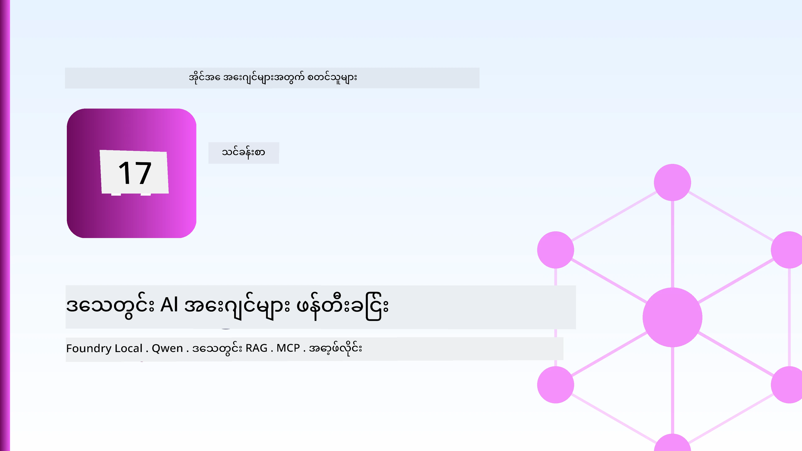
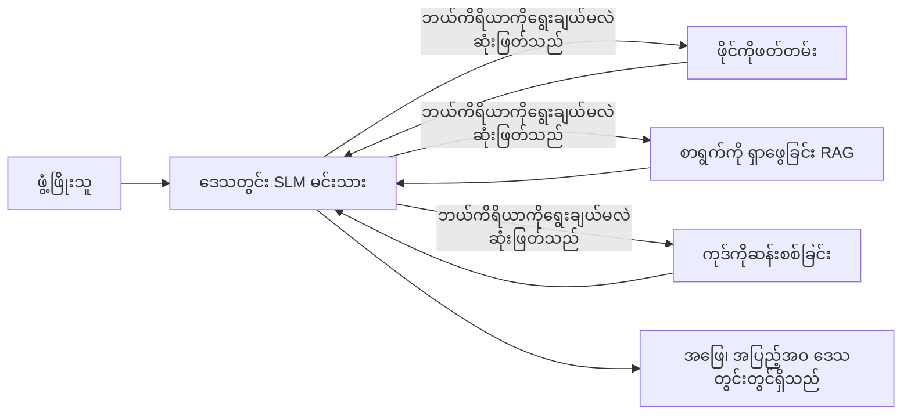
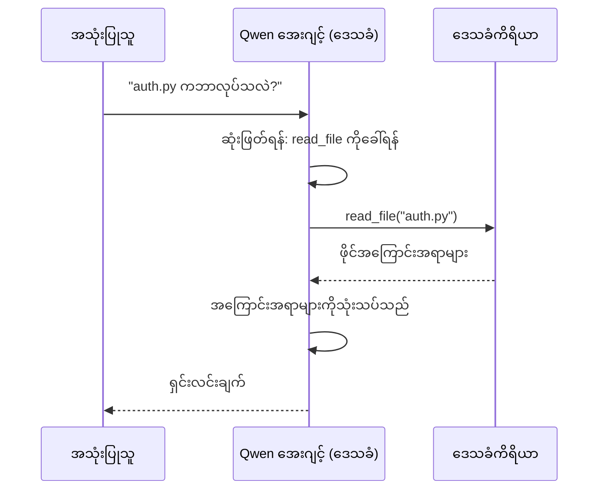
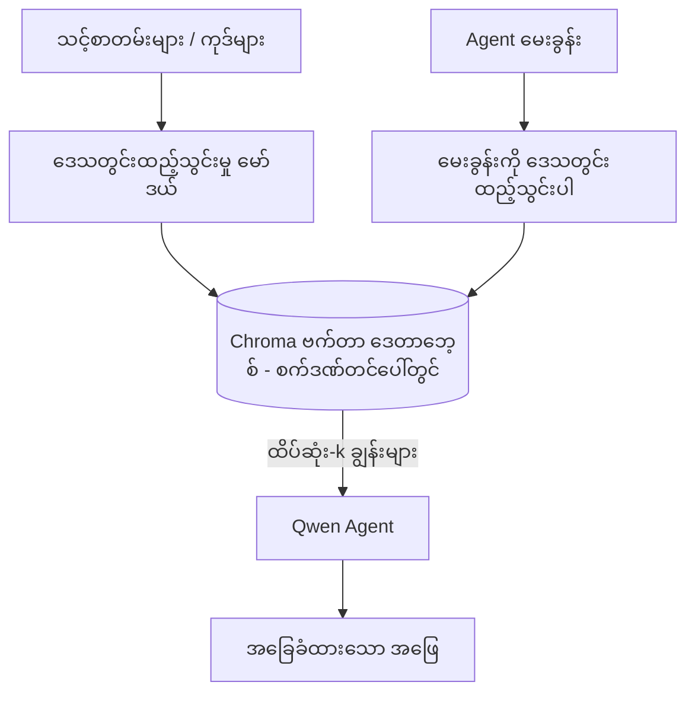
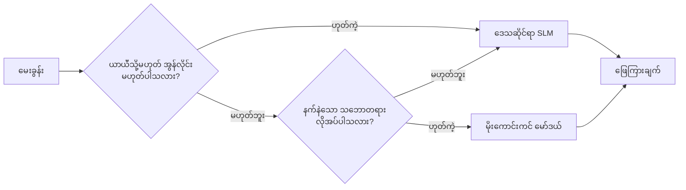

# Microsoft Foundry Local နှင့် Qwen ကိုအသုံးပြုပြီး ဒေသတွင်း AI ကိုယ်စားလှယ်များ ဖန်တီးခြင်း



မတိုင်မီသင်ခန်းစာတွင် ကိုယ်စားလှယ်များကို အလင်းမြင့်တင်၍ cloud တွင် တင်ဆောင်ခဲ့သည်။ ယခုသင်ခန်းစာသည် ထိုကိုယ်စားလှယ်များကို တစ်စက်ကွန်ပျူတာတည်းတွင် ဆင်းချထားပါသည်။ အဆုံးသတ်တွင် သင်တွင် စက်ကိရိယာများကို ခေါ်ယူကာ သင့်ဖိုင်များကို ဖတ်ရှုနိုင်ပြီး သင်၏စာတမ်းများကို ရှာဖွေအသုံးပြုနိုင်သော အလုပ်လုပ်နိုင်သော အင်ဂျင်နီယာ အကူအညီပေးဖြစ်ပါလိမ့်မည် — **တစ်ချက်ပြော cloud inference ခေါ်ဆိုမှုမရှိဘဲ။**

ဘာကြောင့်လဲ? အင်ဂျင်နီယာ အလုပ်တွင် ပုံမှန်တွေ့ကြုံရသော သုံးချက်ရှိပါသည်။

- **ကိုယ်ပိုင်လုံခြုံမှု။** ကုဒ်နှင့်စာရွက်စာတမ်းများသည် စက်ကနေ ထွက်မလာပါ။ မည်သည့် prompt၊ snippet၊ သုံးစွဲသူဒေတာ မှ တာဝန်ခံကွန်ရက်သို့မ ဖြတ်မ၏။
- **ကုန်ကျစရိတ်။** ဒေသတွင်း inference သည် token လျှင် ဘေးလွတ်ငွေ ကျသင့်ခြင်း မရှိပါ။ လျှပ်စစ်စျေးနှုန်းဖြင့် တစ်နေ့လုံးပြန်ပြင်နိုင်သည်။
- **Offline ဖြစ်နိုင်မှု။** လေယာဉ်ပေါ်၊ လုံခြုံသောနေရာတွင် သို့မဟုတ် အင်တာနက်ပျက်ကွက်စဉ်၌ ကိုယ်စားလှယ်သည် အလုပ်လုပ်သေးတယ်။

သို့သော် သင်သည် frontier cloud မော်ဒယ်တစ်ခုကို သင့် CPU၊ GPU သို့မဟုတ် NPU တွင် ကာကွယ်သည့် **Small Language Model (SLM)** နဲ့ လဲလှယ်နေသည်။ ဤသင်ခန်းစာသည် ထိုကန့်သတ်မှုတွင် *ရမ်း*ကောင်းသော ကိုယ်စားလှယ်များ ဖန်တီးခြင်းအကြောင်းဖြစ်ပြီး ကန့်သတ်မှု မရှိကြောင်း သဘောမမြင်သောအစား ဖြစ်သည်။

## နိဒါန်း

ဤသင်ခန်းစာတွင် ဖော်ပြသွားမည်မှာ -

- **Small Language Models (SLMs)** — ၎င်းတို့သည် ဘာဖြစ်ပြီး ဘယ်မှာထွက်ခဲတယ်၊ ဘယ်မှာ မထွက်ခဲပါ။
- **Microsoft Foundry Local** — မော်ဒယ်များကို ဒေသတွင်း သွင်းယူကာ **OpenAI-compatible API** ဖြင့် မျက်နှာချင်းဆိုင် တင်ဆက်ပေးသည့် runtime တစ်ခု။
- **Qwen function-calling models** — local *agents* ဖြစ်စေသော အချက်ဖြစ်သော အာရုံစိုက်သော tool ခေါ်ဆိုမှု ကျွမ်းကျင်မှု ဆောင်ရွက်နိုင်သော SLM များ။
- **ဒေသတွင်း tools၊ ဒေသတွင်း RAG၊ နှင့် ဒေသတွင်း MCP** — cloud မပါဘဲ ကိုယ်စားလှယ်အင်အားများ ပေးခြင်း။
- **Hybrid ပုံစံများ** — ဘယ်အခါ ဒေသတွင်းထားရမည်၊ ဘယ်အချိန် cloud ကို ဆွဲယူရမည်။

## သင်ယူရန် အဓိက ရည်ရွယ်ချက်များ

ဤသင်ခန်းစာ ပြီးဆုံးပါက သင်၏ သိရှိမှတ်သားမှုများမှာ -

- SLM များ၏ ကာယကံရှင်အရွေးချယ်မှုများကို ရှင်းပြနိုင်ခြင်းနှင့် ကိုယ်စားလှယ်အသုံးပြုမှု မှတ်ချက်များ ရွေးချယ်နိုင်ခြင်း။
- Foundry Local အသုံးပြု၍ ဒေသတွင်း Qwen မော်ဒယ် တည်ဆောက်ခြင်းနှင့် OpenAI-compatible endpoint မှတစ်ဆင့် ချိတ်ဆက်ခြင်း။
- သင့်စက်ပေါ်တွင် တစ်ပြိုင်နက်လုံး အကောင်အထည်ဖော်လို့ရသော tool-calling ကိုယ်စားလှယ် တည်ဆောက်ခြင်း။
- ဒေသတွင်း vector database (Chroma) ကို အသုံးပြုပြီး သင်၏စာရွက်စာတမ်းများအပေါ် ဒေသတွင်း RAG အား ပေါင်းထည့်ခြင်း။
- ဒေသတွင်း MCP server နှင့် ချိတ်ဆက်ပြီး hybrid ဒေသတွင်း/cloud ဒီဇိုင်းများ အကြောင်း စဥ်းစားတတ်ခြင်း။

## မတိုင်မီ လိုအပ်ချက်များ

ဤသင်ခန်းစာသည် ယခင်သင်ခန်းစာများ ပြီးမြောက်ပြီး နားလည်ထားကြောင်း စိတ်ချရသည်ဟုယူဆသည် -

- [Tool Use](../04-tool-use/README.md) (သင်ခန်းစာ ၄) နှင့် [Agentic RAG](../05-agentic-rag/README.md) (သင်ခန်းစာ ၅)။
- [Agentic Protocols / MCP](../11-agentic-protocols/README.md) (သင်ခန်းစာ ၁၁)။
- [Microsoft Agent Framework](../14-microsoft-agent-framework/README.md) (သင်ခန်းစာ ၁၄)။

လိုအပ်တာတွေက -

- developer workstation တစ်လုံး။ **အနည်းဆုံး ၈ GB RAM အနည်းဆုံးအဖြစ် အသုံးပြုရမည်။** ၁၆ GB+ သည် သက်တောင့်သက်သာရှိစေရန်။ GPU သို့မဟုတ် NPU တစ်ခုကူညီပေးနိုင်သော်လည်း မလိုအပ်ပါ။
- **Microsoft Foundry Local** ထည့်သွင်းထားရှိရန် (အောက်မှာ setup အပိုဒ်ကိုကြည့်ပါ)။
- Python 3.12+ နှင့် repository အတွင်းပါ၀င်သည့် [`requirements.txt`](../../../requirements.txt) တွင်ပါရှိသော packages များ၊ ထို့အပြင် `foundry-local-sdk`, `openai`, နှင့် `chromadb` ဒီသင်ခန်းစာအတွက်လိုအပ်သည်။

## Small Language Models: ဒေသတွင်းအလုပ်အတွက် ကိုက်ညီသော ကိရိယာ

Frontier cloud model တွင် ယူနစ် သန်း သိန်းကျော်သော parameter များ ရှိပြီး ဒေတာစင်တာတစ်ခုထောက်ပံ့ဖြစ်သည်။ SLM တွင် parameter သန်းချီ ကျီချည်းသာရှိပြီး သင့် laptop ရဲ့ RAM ထဲကို ဖြည့်သွင်းရမည်။ ထိုကွာခြားချက်သည် တိကျစွာ မျှော်မှန်းချက်များ ပေးစွမ်းသည်။

**SLM များ ကောင်းမွန်သည်မှာ -**

- စနစ်တကျ၊ ကန့်သတ်ထားသော အလုပ်များ — အမျိုးအစားခွဲခြားခြင်း၊ ထုတ်ယူခြင်း၊ ရှိပြီးသားစာရွက်စာတမ်း တိုတောင်းချုပ်ခြင်း။
- **Tool ခေါ်ဆိုခြင်း** — ဘယ် function ကိုခေါ်ယူမည်နှင့် ဘာ argument များ ရှိမည်ကို ဆုံးဖြတ်ခြင်း။
- သင့်ဒေတာကို အသုံးပြုပြီး အမြန်၊ သက်သာ၊ ကိုယ်ပိုင် iteration ပြုလုပ်ခြင်း။

**SLMs အားနည်းသည်မှာ -**

- အသီးသီးဘက်ပေါ်မှာ အဆင့်မြင့် multi-hop သဘောထား reasoning များ။
- လောကထဲမှာ ကျယ်ပြန့်သော အကြောင်းအရာ များ (အနည်းငယ်သာ မြင်တွေ့ပြီး ပိုမိုမေ့နေသော)။

ဒေသတွင်း ကိုယ်စားလှယ်များအတွက် အောင်မြင်သော မဟာဗျူဟာမှာ - **SLM ကို ဦး ဆောင်ခေါ်ဆိုပေးစေပြီး tools များကို အလုပ်ကြီးများ ယူဆောင်စေပါ။** မော်ဒယ်သည် သင်တို့ကုတ်ဘေ့စ်ကို *သိ*ရန်မလိုအပ်ပါ — ၎င်းသည် `read_file` နှင့် `search_docs` ကို ဘယ်အချိန်ခေါ်ရမည် ထင်ရပါသည်။ ၎င်းသည် တိုက်ရိုက် SLM ၏အားသာချက်များနှင့် ကိုက်ညီသည်။



## Microsoft Foundry Local

**Microsoft Foundry Local** သည် မော်ဒယ်များကို ဒေသတွင်းမှာ ပြန်လည်ဒေါင်းလုပ်၊ စီမံခန့်ခွဲခြင်းနှင့် တတ်နိုင်သမျှ သင့်စက်ပေါ်တွင် တင်ဆက်ပေးသော ပြတ်သန့်အလေးချိန် runtime တစ်ခုဖြစ်သည်။ ကျွန်တော်တို့အတွက် အရေးကြီးဆုံးအင်္ဂါရပ်မှာ ၎င်းသည် **OpenAI-compatible HTTP endpoint** ကို ထုတ်ဖော်ပေးသည့်အတွက် OpenAI SDK နှင့် Microsoft Agent Framework ၏ OpenAI client များသည် `base_url` ပြောင်းခြင်းတစ်ခုပဲ လိုအပ်၍ တိကျစွာ ဆွဲဆောင်နိုင်ပါသည်။ agent များ စီမံခန့်ခွဲရာတွင် သင်သင်ယူခဲ့သော အရာအားလုံး သေချာဖွဲ့စည်းမှုရှိပြီး သာ endpoint ပင် cloud မှ localhost သို့ ရွှေ့ပါသည်။

Foundry Local သည် သင့်ဟာ့ဒ်ဝဲအတွက် အကောင်းဆုံးမော်ဒယ်ထုတ်လုပ်မှုကို အလိုအလျောက် ရွေးချယ်ပေးသည် — CPU build, CUDA/GPU build, သို့မဟုတ် NPU build — ထို့ကြောင့် ကိုယ်တိုင် မိတ်ဆက်စီမံရန် မလိုအပ်ပါ။

### စတင်တပ်ဆင်ခြင်း

Foundry Local ကို တပ်ဆင်ပါ (သင့် OS အတွက် [စာရွက်စာတမ်းကို](https://learn.microsoft.com/azure/ai-foundry/foundry-local/) ကြည့်ပါ)၊ ပြီးလျှင် ၎င်းပျော်ရွှင်စွာ လုပ်ဆောင်တယ်ဆိုတာ ပြသပါ -

```bash
# 설치 (ဥပမာ; သင့်ပလက်ဖောင်းအတွက်စာတမ်းများကိုလိုက်နာပါ)
winget install Microsoft.FoundryLocal      # Windows
# brew install microsoft/foundrylocal/foundrylocal   # macOS

# Qwen မော်ဒယ်ကိုဒေါင်းလုပ်လုပ်ပြီးလုပ်ဆောင်ပြီးနောက် ဒေသဆိုင်ရာ၀န်ဆောင်မှုကိုစတင်ပါ
foundry model run qwen2.5-7b-instruct
foundry service status
```

စက်ပေါ်ရှိ service တည်နေရာတွင် ဒေသတွင်း OpenAI-compatible endpoint (ပုံမှန်အားဖြင့် `http://localhost:PORT/v1`) ရှိသည်။ notebook တွင် `foundry-local-sdk` ကိုသုံးကာ endpoint ကို အလိုအလျောက် ရှာဖွေသည်၊ သင် port ကိုကိုင်တွယ်ရေးရန် မလိုအပ်ပါ။

## Qwen Function Calling: အရေးပါမှု

ကိုယ်စားလှယ်သည် ကိရိယာများကို ခေါ်နိုင်မှသာ ကိုယ်စားလှယ်ဟုခေါ်ပါသည်။ SLM များစွာသည် စကားပြောနိုင်သော်လည်း ယုံကြည်ရန် မလုံလောက်သည့် ဒေါ်မစ် tool ခေါ်ဆိုမှု အခြေအနေ များ ထုတ်ပေးသွားသည်။ **Qwen** မော်ဒယ်များသည် function calling အတွက် သင်ကြားထားပြီး အသုံးပြုရသင့်သော tool call ဖွဲ့စည်းမှုများကို တိကျစွာ ထုတ်ပေးသည် — ၎င်းသည် ဒေသတွင်း chat မော်ဒယ်ကို ဒေသတွင်း *agent* ဖြစ်စေသည်။

အလှည့်ကျလုပ်ငန်းစဉ်မှာ စံမှတ် tool-calling loop ဖြစ်ပြီး သင် မူလက သိထားသော အတိုင်း device ပေါ်တွင် လည်ပတ်နေသည်။



## ဒေသတွင်း RAG

စာရွက်စာတမ်း ရှာဖွေရေးသည် ဒေသတွင်း ကိုယ်စားလှယ်များ အလုပ်လုပ်နိုင်စေသောနေရာ ဖြစ်သည်။ SLM သည် သင့် Framework ၏ စာရွက်စာတမ်းများကို မှတ်ထားခဲ့ဖြစ်မည်ဟု မမျှော်လင့်ဘဲ ၎င်းစာရွက်စာတမ်းများကို **ဒေသတွင်း vector database** ထဲ ထည့်သွင်းကာ agent သည် လိုအပ်သလို သက်ဆိုင်ရာ အပိုင်းများ ကို ရှာဖွေရန် ခွင့်ပြုသည်။

ကျွန်ုပ်တို့သည် **Chroma** ကို အသုံးပြုသည်၊ ၎င်းသည် in-process တည်ရှိသော embedded vector store ဖြစ်ပြီး စာရင်းသင်ကြားမှု server မလိုအပ်။ လမ်းကြောင်းအတွင်း အားလုံးသည် ဒေသတွင်းဖြစ်သည်: ဒေသတွင်း embedding model → ဒေသတွင်း vectors → ဒေသတွင်း retrieval → ဒေသတွင်း SLM။



၎င်းသည် Lesson 5 ၏ Agentic RAG ပုံစံတူသည် — အပြောင်းအလဲတစ်ခုမှာ ဆက်စပ်အစိတ်အပိုင်းများအားလုံးကို သင့်စက်ပေါ်တွင် တင်ဆောင်ခြင်းသာ ဖြစ်သည်။

## ဒေသတွင်း MCP Servers

[MCP](../11-agentic-protocols/README.md) သည် လွှဲပြောင်းပို့ဆောင်ရေးဖြစ်ကာ cloud service မဟုတ်ပါ။ MCP server တစ်ခုကို `stdio` တွင် ဒေသတွင်း process အနေနဲ့ လည်ပတ်စေကာလိုအပ်အပ်တန်ကိရိယာများကို agent သို့ စံ protocol ဖြင့် ချိတ်ဆက်ပေးသည်။ ထိုကြောင့် MCP server စနစ်ကုိ အွန်လိုင်း မလိုအပ်ဘဲ ရေးသားထားသော filesystem access, git operation, database query စနစ်များအား ရေစီးဆင်းမှုဖြင့် ပြန်လည်အသုံးပြုနိုင်သည်။

လုံခြုံရေးအသွင်ကွဲပြားသည် cloud မှကွဲလွဲသော်လည်း မရှိနေခြင်း မဟုတ်ပါ; ဒေသတွင်း MCP server သည် သင်၏အသုံးပြုသူ ခွင့်ပြုချက်ဖြင့် လည်ပတ်သဖြင့် ၎င်းက ပါတီခွဲစေသည့် ဖိုင်တစ်ခုတည်း (လုပ်ငန်း directories တစ်ခု) အတွင်းသာ ကန့်သတ်ပေးရန်နှင့် ထုတ်လုပ်မှုများကို input အဖြစ် သုံးစွဲ၍ စစ်ဆေးသင့်သည်။

## Hybrid Cloud နှင့် ဒေသတွင်း ပုံစံများ

ဒေသတွင်း-first မဖြစ်ဘဲ ဒေသတွင်း-only မဟုတ်ပါ။ ရင်းရင်းနှီး ရွေးချယ်မှုအရ စနစ်များသည် sensitivity နှင့် ခက်ခဲမှုအပေါ် ကို ညွှန်ကြားသည်။

| အခြေအနေ | အလုပ်လုပ်ရာနေရာ |
| --- | --- |
| sensitive ကုဒ်/ဒေတာ သို့မဟုတ် offline ဖြစ်နေသောကာလ | **ဒေသတွင်း SLM** |
| ရိုးရှင်း၍ ကန့်သတ်ထားသော အလုပ် | **ဒေသတွင်း SLM** (သက်သာ၊ မြန်) |
| နက်နဲပြီးရှည်လျားသော multi-hop reasoning ၊ sensitive မဟုတ်သောဒေတာတွင် | **Cloud မော်ဒယ်** |
| အကဲဖြတ်ကာလတွင် အားလုံး | **ဒေသတွင်း SLM** ( gracefully degrade) |

၎င်းသည် Lesson 16 ထဲမှ **မော်ဒယ်လမ်းညွှန်မှု (model routing)** အယူအဆကို ရှုမြင်ခြင်းဖြစ်ပြီး စက်တစ်ခုကမော်ဒယ်တစ်ခုဖြစ်နေပါသည်။ cloud မရနိုင်ပျက်ကွက်သောအခါ ဒေသတွင်းတွင် ပြန်လည်ဆင်းပေးရန် ပုံမှန်ဒီဇိုင်း ဖြစ်သည်။ ထို့ကြောင့် ကိုယ်စားလှယ်သည် အရည်အသွေး ကျဆင်းမှု သာ ဖြစ်ပေါ်နိုင်ပြီး လုံးဝ မပျက်စီးပါ။



## လက်တွေ့ လေ့ကျင့်ခန်း: ဒေသတွင်း အင်ဂျင်နီယာ အကူအညီပေးမှု

[`code_samples/17-local-agent-foundry-local.ipynb`](./code_samples/17-local-agent-foundry-local.ipynb) ကိုဖွင့်၍ လေ့လာပါ။ သင်သည် သင့်စက်ပေါ်တွင် တစ်လုံးလုံးလည်ပတ်နိုင်ပြီး အောက်ပါအရာများလုပ်ဆောင်ပါသည့် **ဒေသတွင်း အင်ဂျင်နီယာ အကူအညီပေးမှု** တစ်ခု ဖန်တီးပါလိမ့်မည် -

1. **ကိရိယာများ ခေါ်ယူခြင်း** — Foundry Local မှတဆင့် Qwen function calling ဖြင့်။
2. **ဒေသတွင်းဖိုင် လုပ်ဆောင်ချက်များ ဆောင်ရွက်ခြင်း** — project directory အတွင်း ဖိုင်စာရင်းပြခြင်း နှင့် ဖတ်ခြင်း။
3. **ကုဒ်ခွဲခြမ်းစိတ်ဖြာခြင်း** — အခြေခံ အချို့နယ်ပယ်များကို အစီရင်ခံခြင်း။
4. **စာရွက်စာတမ်း ရှာဖွေရေး** — Chroma ဖြင့် docs ဖိုလ်ဒါပေါ် ဒေသတွင်း RAG အသုံးပြုခြင်း။
5. **MCP ဦးဆောင် ပြုလုပ်ခြင်း** — MCP server ဒေသတွင်းဆာဗာ တစ်ခုနှင့် ချိတ်ဆက်ခြင်း (မရှိသည့်အခါ စနစ် သတ်မှတ် ထား တော်တော် သွက်လက်စွာ အနားပေးခြင်း)။

တစ်ချက်တည္းသော cloud inference ခေါ်ဆိုမှု မပါဝင်ပါ။

### လမ်းညွှန်ချက်

အကူအညီပေးသူသည် Foundry Local နှင့် OpenAI-compatible endpoint မှတဆင့် ချိတ်ဆက်သည်ဖြစ်၍ agent ကုဒ်သည် cloud သင်ခန်းစာများနီးပါးတူညီရန် တွေ့ရသည် — client သာ ပြောင်းလဲသည်။

```python
from foundry_local import FoundryLocalManager
from openai import OpenAI

# Foundry Local သည် မော်ဒယ်ကို ရှာဖွေနှင့် ဒေါင်းလုပ်လုပ်ပြီး ဒေသိယ endpoint တစ်ခုကို ပေးသည်။
manager = FoundryLocalManager(\"qwen2.5-7b-instruct\")
client = OpenAI(base_url=manager.endpoint, api_key=manager.api_key)  # api_key သည် ဒေသိယ placeholder ဖြစ်သည်။
```

ကိရိယာများမှာ project directory အတွင်း ရှိ ပုံမှန် Python function များဖြစ်ပါသည် -

```python
def read_file(path: str) -> str:
    \"\"\"Read a file, but only inside the sandboxed project directory.\"\"\"
    full = (PROJECT_ROOT / path).resolve()
    if PROJECT_ROOT not in full.parents and full != PROJECT_ROOT:
        return \"Access denied: path is outside the project directory.\"
    return full.read_text(encoding=\"utf-8\")
```

sandbox စစ်ဆေးမှုကို မှတ်သားပါ — ဒေသတွင်းမဆို arbitrary path ကိုဖတ်သော tool တစ်ခုသည် တာဝန်မေ့လျော့မှုဖြစ်နိုင်သည်။ notebook သည် tool တစ်ခုစီကို project root တစ်ခု တည်းထဲတွင် ကန့်သတ်ထားသည်။

## သိမြင်မှု စစ်တမ်း

သင်၏ နားလည်မှုကို စိစစ်ပြီး assignment ကို ဆက်လက်မှုများဆောင်ပါ။

**1. ကိုယ်စားလှယ် ကို ဒေသတွင်း စက်ပေါ်တွင်အလုပ်လုပ်စေသည့် အကြောင်းနှစ်ချက်ကို ဖော်ပြပါ။**

<details>
<summary>အဖြေ</summary>

တစ်ခုခုကို အောက်ပါထဲမှ ရွေးပါ - **လုံခြုံရေး** (ကုဒ်နှင့်ဒေတာများ မစက်ထဲက ပြေးထွက်ခြင်း မရှိပါ), **ကုန်ကျစရိတ်** (token အလိုက် သက်သာခြင်းရှိမှု မရှိ) နှင့် **offline ဖြစ်နိုင်ခြင်း** (လေယာဉ်ပေါ်၊ လုံခြုံသောနေရာ၊ သို့မဟုတ် အင်တာနက်ပျက်ကွက်စဉ်တွင် အလုပ်လုပ်ဆဲဖြစ်ခြင်း)။ regulator သို့မဟုတ် compliance အကြောင်းကြောင့် ဒေတာများကို စက်ပြင်ပသို့ ပို့ရန် တားမြစ်သည့် အခြေအနေများသည် privacy ၏ အကြောင်းတရားများကို အများအားဖြင့် ဖြစ်စေသည်။
</details>

**2. ဒေသတွင်း agent တွင် SLM နှင့် tools များ၏ လုပ်ငန်းခွဲတော်မူချက်ကို အကြံပြုခြင်းနှင့် အကြောင်းရင်း?**

<details>
<summary>အဖြေ</summary>

SLM သည် **orchestrate** လုပ်ပြီး (ဘယ် tool ကို ဘယ် argument နှင့်ခေါ်မလဲ ဆုံးဖြတ်ခြင်း) tools များစွမ်းဆောင်မှုများကို **ခြံထုတ်လုပ်မှုလုပ်ပါ။** SLM များသည် tool ရွေးခြင်း ကဲ့သို့သော ကန့်သတ်ထားသော ဆုံးဖြတ်ချက်များတွင်ကောင်းမွန်သော်လည်း ကျယ်ပြန့်သော知识နှင့် ရှည်လျားသော multi-hop reasoning တွင် အားနည်းသောကြောင့် tools ကိုဖြစ်နိုင်သမျှ အားကောင်းစေခြင်းသည် ၎င်းတို့အားသာချက်သို့ ဦးတည်ခြင်းဖြစ်သည်။
</details>

**3. Foundry Local ဖြင့် cloud agent code ကို ပြန်လည်အသုံးပြုနိုင်စေခြင်းကို ဘာကြောင့်ဖြစ်သနည်း?**

<details>
<summary>အဖြေ</summary>

Foundry Local သည် **OpenAI-compatible HTTP endpoint** ကို ထုတ်ဖော်သည်။ OpenAI SDK နှင့် Agent Framework ၏ OpenAI client များသည် `base_url` မှာ သာ ပြောင်းလဲခြင်းဖြင့်၊ local placeholder API key ဖြင့် ဒီ endpoint ကို အသုံးပြုသည်။ agent ကုဒ်အခြားပိုင်းအားလုံး တူညီနေသည်။
</details>

**4. ဘာကြောင့် SLM များအစား Qwen function-calling မော်ဒယ်ကို အထူးအသုံးပြုသနည်း?**

<details>
<summary>အဖြေ</summary>

ကိုယ်စားလှယ်သည် ယုံကြည်စိတ်ချနိုင်သော၊ ရိုးရှင်းသော **tool calls** ကို ထုတ်ပေးနိုင်ရမည်။ SLM များစွာသည် စကားပြောနိုင်သော်လည်း မှားယွင်း သို့မဟုတ် မတည့်ညီသော tool-call ဖွဲ့စည်းမှုများ ထုတ်ပေးနိုငယ်။ Qwen မော်ဒယ်များ function calling အတွက် သင်ယူထားပြီး တူညီစနစ်တကျ tool calls ထုတ်ပေးသောကြောင့် local chat မော်ဒယ်ကို local agent တစ်ခုဖြစ်စေသည်။
</details>

**5. ဒေသတွင်း RAG အတွင်း မော်ဒယ်သည် စက်ပေါ်တွင် အသုံးပြုသည့် အစိတ်အပိုင်းများ ဘာများဖြစ်သနည်း?**

<details>
<summary>အဖြေ</summary>

အားလုံးဖြစ်သည် — embedding model, vector database (Chroma, disk ပေါ်တွင်), retrieval အဆင့်, နှင့် SLM တို့ — စာရွက်စာတမ်းများကို ဒေသတွင်းတွင် ထည့်သွင်းထားသည်၊ ဒေသတွင်းသိမ်းဆည်းထားသည်၊ ဒေသတွင်း ရှာဖွေထုတ်ယူမှု ပြုလုပ်သည်၊ ဒေသတွင်း မော်ဒယ်ဖြင့် အစီရင်ခံချက်လုပ်သည် — cloud ကို ပြသသည့် အစိတ်အပိုင်းမရှိပါ။
</details>

**6. ဒေသတွင်း MCP server ကို သင့်စက်ပေါ်တွင် လည်ပတ်နေသည်။ ၎င်းသည် အလိုအလျောက် လုံခြုံသနည်း? ပြုလုပ်သင့်သော သတိပြုေးစရာ ကဘာများရှိသနည်း?**

<details>
<summary>အဖြေ</summary>

မဟုတ်ပါ။ ဒေသတွင်း MCP server သည် သင့်အသုံးပြုသူ ခြင့်ပြုချက်ဖြင့် လည်ပတ်သဖြင့် သင်သည် ကူညီကာကွယ်နိုင်သော သက်ဆိုင်ရာကိစ္စများအား လက်လှမ်းရောက်နိုင်သည်။ ၎င်းကို လိုအပ်သလို ကန့်သတ်ပေးပြီး (ဥပမာ အလုပ် directory တစ်ခုသာ၊ နေအိမ် ဖိုလ်ဒါအပြည့် မဟုတ်) ထွက်ရှိသော output များကို input အဖြစ် သတ်မှတ်၍ သေချာစစ်ဆေးပါ။
</details>

**7. ဒေသတွင်း မော်ဒယ်ကို ပါဝင်သည့် hybrid routing နည်းလမ်းတစ်ခုကို ဖော်ပြပါ။**

<details>
<summary>အဖြေ</summary>

sensitive သို့မဟုတ် offline တောင်းဆိုချက်များကို ဒေသတွင်း SLM သို့ လမ်းညွှန်ပါ။ ရိုးရှင်းကန့်သတ်ထားသော အလုပ်များကို သက်သာမြန်ဆန်ဖို့ ဒေသတွင်း SLM သို့ လမ်းညွှန်ပါ။ နက်နဲ၍ multi-hop reasoning များကို cloud မော်ဒယ်သို့ လမ်းညွှန်ပြီး cloud မရောက်နိုင်သောအခါ ဒေသတွင်း SLM သို့ ပြန်လည်လမ်းသွားစေရန် သေချာပါစေ။ ၎င်းသည် Lesson 16 တွင် ဖော်ပြသော ရမ်းနားမှုနဲ့ ပုံစံတူကိစ္စဖြစ်ပြီး ဒေသတွင်း စက်ကို မော်ဒယ်တစ်ခုအဖြစ် အသုံးပြုသည်။
</details>

**8. ဤသင်ခန်းစာတွင် ဒေသတွင်း ကိုယ်စားလှယ် ပြုလုပ်ရန် လိုအပ်သော အနည်းဆုံး RAM အရွယ်အစား နှင့် RAM ကြီးမားသည်ဆိုတာက ဘာတွဲ သိသာစေသနည်း?**

<details>
<summary>အဖြေ</summary>

အနည်းဆုံး **8 GB** ဖြစ်ပြီး 16 GB+ သည် အသုံးပြုရ အဆင်ပြေသည်။ RAM ပိုများသည် မော်ဒယ်များကြီးမားပြားများ ပြုလုပ်ရန်နှင့် context ပိုများစွာ ရှိထားနိုင်ရန် ကူညီသည်။ GPU သို့မဟုတ် NPU က inference ကို မြန်ဆန်စေနိုင်သော်လည်း မလိုအပ်ပါ — Foundry Local သည် accelerator မရှိပါက CPU build ကို ရွေးချယ်ပေးသည်။
</details>

## တာဝန်ပေးအပ်မှု

ဒေသတွင်း အင်ဂျင်နီယာ အကူအညီပေးမှုကို သင့်နှစ်သက်သော ပရောဂျက်ငယ်တစ်ခုအတွက် **ဒေသတွင်း စာရွက်စာတမ်း ပြန်သုံးသပ်သူ** အဖြစ် တိုးချဲ့ပါ (ဒီ repository ရဲ့ သင်ခန်းစာဖိုင်တစ်ခုကို အသုံးပြုပါက ကောင်းပါသည်)။

သင့်တင်သွင်းမှုမှာ -

1. အမှန်တကယ်ရှိသော စာရွက်စာတမ်း/ကုဒ်ဖိုင် ဖိုလ်ဒါ ကို Chroma တွင် အညွှန်းပြုလုပ်ပါ (ဖိုင်ငါးခုအနည်းဆုံး)။
2. `find_todos` ကိရိယာတစ်ခု ထည့်သွင်းပါ၊ ဤကိရိယာသည် ပရောဂျက်၌ `TODO` / `FIXME` မှတ်စုများကို ဖော်ထုတ်ပြီး ဖိုင်နာမည်နှင့် အတန်းနံပါတ်ဖြင့် ပြန်လည်ပေးပါမည် — `read_file` ကဲ့သို့ပင် sandbox စစ်ဆေးမှုပါရှိသည်။

3. **အေးဂျင့်ကို မေးခွန်းသုံးခု မေးပါ**၊ tools တွေကို ပေါင်းစပ်ဖို့လိုအပ်တဲ့ မေးခွန်းတစ်ခုကတော့ စင်တာအပြည့် RAG မေးခွန်းတစ်ခု၊ ဖိုင်တစ်ခုကို ဖတ်ရန်လိုအပ်တဲ့ မေးခွန်းတစ်ခု၊ TODO တွေကို ရှာဖွေရန်လိုအပ်တဲ့ မေးခွန်းတစ်ခုဖြစ်ပါသည်။
4. **တိုင်းတာပါ**: မေးခွန်းသုံးခုကို တုံ့ပြန်ချိန်တိုင်းကို တိုင်းတာပြီး markdown စလုပ်ာထဲ မှတ်သားပါ။ မည်သည့်အချိန်ကြာမြင့်မှုသည် သင်၏ ရည်ရွယ်ချက်ဖြစ်သော workflow အတွက် လက်ခံနိုင်သလဲ မလက်ခံနိုင်သလဲ ကို မှတ်ချက်ရေးပါ။

ထို့နောက် အကြောင်းအရာတို တစ်ပိုဒ်ရေးပါ၊ ဒီ reviewer အတွက် **ကလောင်ပေါ်ကို ဘာတွေရွှေ့မလဲ၊ ဘာတွေကို ဒေသဆိုင်ရာမှာ ထားမလဲ**၊ ဘာကြောင့်လဲဆိုတာပြောပါ။ ဒေသဆိုင်ရာ အစိတ်အပိုင်းတွေ ကိုမှန်ကန်စွာချိတ်ဆက်ထားခြင်း၊ သင်၏ hybrid reasoning မှန်ကန်မှုတို့အပေါ် အကဲဖြတ်ခံရမည် မူတွဲပြီး မော်ဒယ်အရည်အသွေးပေါ်မူတည်ခြင်းမဟုတ်ပါ။

## အကျဉ်းချုပ်

ဒီသင်ခန်းစာမှာ သင်၏စက်ကိုယ်တိုင်မှာ run လုပ်တဲ့ အေးဂျင့်ကို တည်ဆောက်ခဲ့သည်။

- **SLMs** သည် ကိုယ်ပိုင်မှုလုံခြုံမှု၊ ကုန်ကျစရိတ်နှင့် အော့ဖ်လိုင်း လည်ပတ်မှုအတွက် အသွားအလာပိုမိုဆုံးရှုံးပြီး၊ သူတို့ကိုယ်တိုင် တတ်မြောက်မှုအားလုံးကို ကမ်းလှမ်းခြင်းမဟုတ်ဘဲ **tools များကို စုပေါင်းနေရင်း** စွမ်းဆောင်နိုင်သည်။
- **Foundry Local** သည် ဒီဒိုင်းထဲမှာ မော်ဒယ်များကို **OpenAI-compatible endpoint** ရှိသည့် နောက်တွင် ဆာဗာပေးသည်၊ ဒါကြောင့် cloud အေးဂျင့် code ကို လူကြီးတစ်ကြောင်းပြောင်းလဲမှုဖြင့် ရွှေ့ပြောင်းနိုင်သည်။
- **Qwen function-calling models** သည် ယုံကြည်စိတ်ချရသော ဒေသဆိုင်ရာ tools ခေါ်ယူရန် ခွင့်ပြုသည်၊ ဒါဖြင့် ဒေသဆိုင်ရာ *agents* များအတွက် ဖြစ်နိုင်သည်။
- **ဒေသဆိုင်ရာ RAG** (Chroma) နှင့် **ဒေသဆိုင်ရာ MCP** က agent ကို စက်မှ ထွက်ခြင်းမရှိဘဲ စွမ်းဆောင်နိုင်စွမ်း ပေးသည်။
- **Hybrid ပုံစံများ** သည် သိသာချက်နှင့်အခက်အခဲအားဖြင့် လမ်းကြောင်းချနိုင်ရန် ခွင့်ပြုသည်၊ ဒေသဆိုင်ရာမှာ လူကြီးတစ်ယောက်အဖြစ် gracefully fallback ဖြစ်သည်။

ဒီသည် deployment အကွက်ကို တည်ဆောက်ခြင်းပြီးစီးသည်။ Lesson 16 မှ agents များကို Microsoft Foundry ထဲသို့ များပြားစေခဲ့ပြီး ယခုသင်ခန်းစာသည် agents များကို တစ်စက် workstation များသို့ တင်းကြပ်သည်။ နောက်တန်းသင်ခန်းစာသည် deployment ပြုလုပ်ထားသော agents များအတွက် လုံခြုံရေးကို စိုးရိမ်ခြင်း ဖြစ်သည်။

## ပိုမိုသိရရန် ရင်းမြစ်များ

- <a href="https://learn.microsoft.com/azure/ai-foundry/foundry-local/" target="_blank">Microsoft Foundry Local စာတမ်းများ</a>
- <a href="https://learn.microsoft.com/azure/ai-foundry/what-is-azure-ai-foundry" target="_blank">Microsoft Foundry စာတမ်းများ</a>
- <a href="https://learn.microsoft.com/en-us/agent-framework/overview/?wt.mc_id=youtube_26688_organicsocial_reactor&pivots=programming-language-python" target="_blank">Microsoft Agent Framework</a>
- <a href="https://qwen.readthedocs.io/en/latest/framework/function_call.html" target="_blank">Qwen function calling စာတမ်းများ</a>
- <a href="https://modelcontextprotocol.io/" target="_blank">Model Context Protocol (MCP)</a>
- <a href="https://docs.trychroma.com/" target="_blank">Chroma vector database</a>

## ယခင်သင်ခန်းစာ

[Deploying Scalable Agents](../16-deploying-scalable-agents/README.md)

## နောက်တန်းသင်ခန်းစာ

[Securing AI Agents](../18-securing-ai-agents/README.md)

---

<!-- CO-OP TRANSLATOR DISCLAIMER START -->
**ပြောကြားချက်**
ဤစာတမ်းကို AI ဘာသာပြန်ဝန်ဆောင်မှု [Co-op Translator](https://github.com/Azure/co-op-translator) အသုံးပြု၍ ဘာသာပြန်ထားပါသည်။ ကျွန်ုပ်တို့သည် တိကျမှန်ကန်မှုအတွက် ကြိုးပမ်းနေသော်လည်း၊ စက်ကိရိယာဘာသာပြန်ခြင်းများတွင် အမှားများ သို့မဟုတ် မှားယွင်းချက်များ ပါဝင်နိုင်ကြောင်း သတိပြုပါရန် လိုအပ်ပါသည်။ မူလစာတမ်းကို မူရင်းဘာသာဖြင့်သာ ယုံကြည်စိတ်ချရသော အချက်အလက်အဖြစ် သတ်မှတ်သင့်သည်။ အရေးကြီးသည့် သတင်းအချက်အလက်များအတွက် ပရော်ဖက်ရှင်နယ် လူသားဘာသာပြန်သူဝန်ဆောင်မှုကို အကြံပြုပါသည်။ ဤဘာသာပြန်ချက်ကို အသုံးပြုခြင်းမှ ဖြစ်ပေါ်လာသော နားလည်မှုကွာခြားမှုများ သို့မဟုတ် မမှန်ကန်သော အသုံးပြုမှုများအတွက် ကျွန်ုပ်တို့ တာဝန်မခံပါ။
<!-- CO-OP TRANSLATOR DISCLAIMER END -->