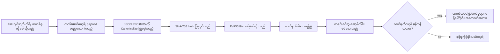

[သင်ခန်းစာဗီဒီယိုကြည့်ရှုရန် - ကိုဒ်လက်မှတ်ဖြင့် AI အေးဂျင့်များကိုလုံခြုံရေးအောင်မြင်ခြင်း](https://youtu.be/PLACEHOLDER_VIDEO_ID)

> _(သင်ခန်းစာဗီဒီယိုနှင့်ထုံးပေါ်ပုံစံကို Microsoft အကြောင်းအရာအဖွဲ့မှ ပေါင်းစပ်ပြီး သင်ခန်းစာ ၁၄ / ၁၅ ပုံစံနှင့် ကိုက်ညီစေရန် နောက်ပိုင်းထည့်သွင်းမည်။)_

# ကိုဒ်လက်မှတ်ဖြင့် AI အေးဂျင့်များကိုလုံခြုံရေးအောင်မြင်ခြင်း

## အနေအထားသွားရောက်မှု

ဤသင်ခန်းစာတွင် ပါဝင်သွားမည့်အကြောင်းအရာများမှာ-

- AI အေးဂျင့်များအတွက် audit trails မည်သို့ လိုအပ်ပြီး လိုက်နာမှု၊ မှားယွင်းမှုရှာဖွေခြင်းနှင့် ယုံကြည်မှုအတွက် အရေးကြီးသည်။
- ကိုဒ်လက်မှတ်(receipt) ဆိုတာဘာလဲ၊ လက်မထိုးထားသည့် log များနှင့် မတူဘဲ ဘာတွေရှိသလဲ။
- Python ရိုးရှင်းစွာပြင်ပသုံး၍ အေးဂျင့်၏ tool ခေါ်ဆိုမှုအတွက် လက်မှတ်ထိုးထားသော receipt တစ်ခု ဖန်တီးနည်း။
- သီးခြား အွန်လိုင်းမလိုပဲ receipt ကိုမှန်ကန်မှုစစ်ဆေးနည်း နှင့် သိမ်းဆည်းရာမှာဖြစ်လာနိုင်သည့် ဆိုးဆိုးကျေနပ်မှုများကို ဖော်ထုတ်နည်း။
- receipts များကို ဇွန်းဆက်လိုက် chaining လုပ်ခြင်းဖြင့် တစ်ခုဖယ်ရှား/ပြောင်းလဲခြင်းအား ဇွန်းတန်းပျက်စီးမှုဖြစ်ပေါ်စေခြင်း။
- receipts များသည် ဘာများကိုသက်သေပြနိုင်သလဲ နှင့် ဘာများကို ပြသခံမရပါ။

## သင်ယူလိုက်လို့ရမယ့် ရလဒ်များ

ဤသင်ခန်းစာပြီးဆုံးလျှင် သင်သည် -

- အေးဂျင့်လုပ်ဆောင်ချက်များအတွက် ကိုဒ်လက်မှတ် provenance သက်သေအမှားများကို ဆန်းစစ်မှတ်သားနိုင်မည်။
- canonical JSON payload ပေါ်တွင် Ed25519 လက်မှတ်ထိုးထားသော receipt တစ်ခု ဆောက်နိုင်မည်။
- လက်မှတ်ထိုးသူ၏ public key ဖြစ်ရုံဖြင့် receipt တစ်ခုကို သီးခြားစစ်ဆေးနိုင်မည်။
- ပြင်ဆင်၍ထားသော receipt ကို Verification ပြန်လည်လုပ်ပြီး သံသယရှိမှုကို ဖော်ထုတ်နိုင်မည်။
- hash chained receipts များ စုစည်းပြီး ဇွန်းအရေးကြီးမှုကို နားလည်ရှင်းလင်းနိုင်မည်။
- receipts မဟုတ်တာနှင့် အမှန်တရား ရှိမှု နှင့် policy သက်ဆိုင်မှုကို ခွဲခြားဖော်ထုတ်နိုင်မည်။

## ပြဿနာ - သင်၏အေးဂျင့်၏ audit trail

Contoso Travel အတွက် AI အေးဂျင့်တစ်ခု တပ်ဆင်ထားသည်ဟု စဉ်းစားပါ။ အဲ့ဒီအေးဂျင့်သည် ဖောက်သည်၏တောင်းဆိုမှုများကို ဖတ်ရှုပြီး၊ flights API ကိုခေါ်ကာ လေယာဉ်ခုံထိုင်ခွင့်များ စစ်ဆေးပြီး ဖောက်သည်အတွက် ခုံများစာရင်းသွင်းသည်။ ယခင်သုံးလအတွင်း ၅၀,၀၀၀ ခုံရရှိခဲ့သည်။

ဒီနေ့မှာ စစ်ဆေးသူတစ်ဦး ရောက်ရှိသည်။ "သင်၏အေးဂျင့် ဘာလုပ်ခဲ့တာလဲ ပြပါ" ဟု မေးသည်။

သင် log ဖိုင်များကို ပေးပို့သည်။ စစ်ဆေးသူက ထို log များကိုကြည့်ပြီး “ဒီ log တွေ တည်းဖြတ်မထားဘူးဆိုတာ ဘယ်လိုသိမလဲ?” ဟု မေးသည်။

ဤကိစ္စသည် audit-trail ပြဿနာဖြစ်သည်။ အများဆုံး agent deployments တွင်-

- **Application logs**: အေးဂျင့်ကိုယ်တိုင်ရေးသားထားပြီး ဖိုင်စနစ်ကို ချွေတာနိုင်သူတိုင်းပြင်ဆင်နိုင်သည်။
- **Cloud logging services**: platform အဆင့်တွင် tamper-evident ဖြစ်သော်လည်း auditor က platform operator ကိုယုံကြည်မှသာ။
- **Database transaction logs**: ဒေတာပြောင်းလဲမှုများအတွက် ဦးစားပေးသင့်ပေမယ့် စစ်ဆေးလမ်းညွှန်တည့်တဲ့ call များအတွက် မထိုက်တန်။

ဤမည်သည့်နည်းလမ်းမျိုးမှ auditor ၏ မေးခွန်းကို တုံ့ပြန်ခြင်းအတွက် auditor ၏ယုံကြည်မှုလိုအပ်ချက်ကို ဖြည့်ဆည်းပေး၍ မရပါ။ အတွင်းပိုင်းအသုံးပြုမှုအတွက် ယုံကြည်မှုသည် သက်ဆိုင်နိုင်ပါသည်။ ဥပဒေရေးရာ (finance, healthcare, EU AI Act အောက်ပါ အလုပ်များ) အတွက် မဖြစ်နိုင်ပါ။

ကိုဒ်လက်မှတ်များသည် agent လုပ်ဆောင်ချက်တိုင်းကို သီးခြားစစ်ဆေးနိုင်စေသဖြင့် ဤပြဿနာကိုဖြေရှင်းပေးသည်။ auditor သည် သင်ကိုယုံကြည်ရန် မလိုအပ်ပေ။ သူတို့ ယောကျာ်းလေးသည် public key နှင့် receipt ကိုပင်လိုအပ်သည်။

## ကိုဒ်လက်မှတ်ဆိုတာဘာလဲ?

Receipt သည် အေးဂျင့်လုပ်ဆောင်ချက်များကို မှတ်တမ်းတင်သည့် JSON အရာဝတ္ထုဖြစ်ပြီး လက်မှတ်ထိုးထားသည်။


  
အမူအရာ receipt အနည်းငယ်မှာ အောက်ပါပုံစံဖြစ်သည်-

```json
{
  "type": "agent.tool_call.v1",
  "agent_id": "contoso-travel-bot",
  "tool_name": "lookup_flights",
  "tool_args_hash": "sha256:a3f9c1...",
  "result_hash": "sha256:7b2e1d...",
  "policy_id": "contoso-travel-policy-v3",
  "timestamp": "2026-04-25T14:30:00Z",
  "sequence": 47,
  "previous_receipt_hash": "sha256:9d4e6a...",
  "signature": {
    "alg": "EdDSA",
    "sig": "c5af83...",
    "public_key": "8f3b2c..."
  }
}
```
  
သုံးခုသောအချက်များက အလုပ်လုပ်သည်-

1. **လက်မှတ်**။ ဤ receipt ကို Ed25519 ကိုယ်ပိုင် key ဖြင့် agent ၏ gateway မှ လက်မှတ်ထိုးသည်။ public key ရှိသူ မည်သူမဆို signature ကို အွန်လိုင်းမလိုဘဲ စစ်ဆေးနိုင်သည်။ ဘာသာရပ်တစ်ခုမဆို ပြောင်းလဲမှုသည် signature ကို မမှန်ကန်အောင် လုပ်ပေးသည်။

2. **Canonical Encoding**။ လက်မှတ်ထိုးမီ JSON Canonicalization Scheme (JCS, RFC 8785) ဖြင့် serialize လုပ်သည်။ ဒီနည်းက လိုဂျစ်တစ်ခုတည်းသော receipt များသည် byte ပမာဏတူညီသော output ကို များပြားစေသည်။ canonicalization မရှိလျှင် JSON serializer မတူပါက signature မတူပါ။

3. **Hash chaining**။ `previous_receipt_hash` ကာနယ်သည် receipt တစ်ခုတိုင်းကို မကြာခဏရှေ့receipt နှင့် ဆက်သွယ်ပေးသည်။ receipt တစ်ခုဖယ်ရှားခြင်း သို့မဟုတ် ပြောင်းလဲသည် chain အား ချိုးဖျက်ပေးသည်။ single signature ကို ကျော်လွှားခြင်းဖြစ်ပါက chaining မှာ ထိခိုက်မှု တွေကို သိသိသာသာ တွေ့နိုင်ပါသည်။

အခြားအားဖြင့် ဤအချက်များသည်သုံးချက်အာမခံချက် ပေးသည်-

- **Attribution**: key ထို content ကို လက်မှတ်ထိုးသည်။
- **Integrity**: content သည် လက်မှတ်ထိုးချိန်မှ ပြောင်းလဲမှု မရှိပါ။
- **Ordering**: receipt ဒီအကြောင်းအရာ chain တွင် ထို receipt ၏နောက်ထပ်ဖြစ်သည်။

## Python ဖြင့် Receipt ဖန်တီးနည်း

Receipt ဖန်တီးရန် အထူးစာကြည့်တိုက် မလိုအပ်ပါ။ Cryptography primitives များကျယ်ပြန့်စွာရနိုင်ပြီး Python ကုဒ် အတော်များများလုပ်နိုင်သည်။

`code_samples/18-signed-receipts.ipynb` မှ ခြေလှမ်းနိဒါန်းလမ်းညွှန်ချ မည်။ အကျဉ်းချုပ်-

```python
import json
import hashlib
import base64
from nacl import signing
from jcs import canonicalize  # RFC 8785 canonical JSON

def b64url_nopad(data: bytes) -> str:
    return base64.urlsafe_b64encode(data).decode("ascii").rstrip("=")

def sha256_canonical(obj) -> str:
    """SHA-256 of a Python object's JCS-canonical JSON form."""
    return f"sha256:{hashlib.sha256(canonicalize(obj)).hexdigest()}"

# လက်မှတ်ရေးထိုးသော key ကို ထုတ်ပေးသို့မဟုတ် load ပြုလုပ်ပါ (ထုတ်လုပ်မှုတွင် key vault တွင်သိမ်းဆည်းပါ)
signing_key = signing.SigningKey.generate()
verify_key = signing_key.verify_key

# လက်ခံမည့် payload ကို တည်ဆောက်ပါ (လက်မှတ်မထိုးသေးပါ)
tool_args = {"origin": "SYD", "destination": "LAX"}
tool_result = [{"flight": "QF11", "price": 1850, "stops": 0}]

payload = {
    "type": "agent.tool_call.v1",
    "agent_id": "contoso-travel-bot",
    "tool_name": "lookup_flights",
    "tool_args_hash": sha256_canonical(tool_args),
    "result_hash": sha256_canonical(tool_result),
    "policy_id": "contoso-travel-policy-v3",
    "timestamp": "2026-04-25T14:30:00Z",
    "sequence": 0,
    "previous_receipt_hash": None,
}

# canonicalize ပြုလုပ်ပြီး hash၊ လက်မှတ်ရေးထိုးပါ။
canonical_bytes = canonicalize(payload)
message_hash = hashlib.sha256(canonical_bytes).digest()
signature_bytes = signing_key.sign(message_hash).signature

# ဖွဲ့စည်းထားသော လက်မှတ် object ကို ပူးတွဲပါ။
receipt = {
    **payload,
    "signature": {
        "alg": "EdDSA",
        "sig": b64url_nopad(signature_bytes),
        "public_key": b64url_nopad(bytes(verify_key)),
    },
}
```
  
ဤနည်းလမ်းသည် စုစုပေါင်း ကုဒ်တည်ဆောက်မှုဖြစ်သည်။ notebook တွင် တစိတ်တပိုင်းစီကို ခြေလှမ်းတိုင်းအဆင့်ဆင့် ေသာ့ပြပေးသည်။

## Receipt ကို စစ်ဆေး နည်းနှင့် Tampering ရှာဖွေရေး

Verification သည် အပြန်အလှန် ဆောင်ရွက်မှုဖြစ်သည်-

```python
import base64
import hashlib
from nacl import signing
from nacl.exceptions import BadSignatureError
from jcs import canonicalize

def b64url_decode(s: str) -> bytes:
    padding = "=" * ((4 - len(s) % 4) % 4)
    return base64.urlsafe_b64decode(s + padding)

def verify_receipt(receipt: dict) -> bool:
    # နှုတ်ဆက်ချက်မှာ ဖွဲ့စည်းပြီးသော အရာဝတ္တုဖြစ်သည်- {"alg", "sig", "public_key"}။
    sig_obj = receipt.get("signature")
    if not sig_obj or sig_obj.get("alg") != "EdDSA":
        return False

    # အမှန်တကယ် လက်မှတ်ရေးထိုးခဲ့သော payload ကို ပြန်လည်ဖန်တီးပါ (လက်မှတ်ကိုမှပယ်လွှတ်၍ အားလုံး)။
    payload = {k: v for k, v in receipt.items() if k != "signature"}

    canonical_bytes = canonicalize(payload)
    message_hash = hashlib.sha256(canonical_bytes).digest()

    try:
        verify_key = signing.VerifyKey(b64url_decode(sig_obj["public_key"]))
        verify_key.verify(message_hash, b64url_decode(sig_obj["sig"]))
        return True
    except BadSignatureError:
        return False
```
  
ဤ function သည် receipt ကို ယူ၍ လက်မှတ်မှန်ကန်လျှင် `True` ပြန်ပေးသည်၊ မမှန်လျှင် `False` ဖြစ်သည်။ network ချိတ်ဆက်မှု အလိုမရှိ၊ service မပါသော အသုံးပြုမှုမရှိ၊ နောက်သုံးပုဂ္ဂိုလ်တစ်ဦးကို ယုံကြည်ရန် မလိုအပ်သည်။

tampering detection ကို ပြသရန် notebook ထဲတွင်-

1. မှန်ကန်သော receipt တစ်ခုဖန်တီး၍ စစ်ဆေးပီးဖြစ်ကြောင်း အတည်ပြု။
2. `tool_args_hash` field အတွင်း byte တစ်ခု ကို ပြောင်းလဲ။
3. နောက်တပြန် verification လုပ်ပြီး မအောင်မြင်ကြောင်းတွေ့ရှိ။

receipt များသည် tamper-evident ဖြစ်ကြောင်း အသုံးပြုသူတွေ နားလည်မှုရှိလာစေသည်- ပြင်ဆင်မှု မည်မျှမဆို signature ပျက်စီးစေမည်။

## multi-step agents များအတွက် Receipt chaining

တစ်ခုတည်းသော signed receipt သည် လုပ်ဆောင်ချက်တစ်ခုကာကွယ်ပေးသည်။ အတွဲလိုက် receipts များသည် အဆက်တွဲလုပ်ဆောင်ချက်များကို ကာကွယ်ပေးသည်။


  
receipt တစ်ခုစီသည် ယခင် receipt ၏ hash ကို မှတ်ထားသည်။ receipt 2 ကို တိတ်ဆိတ်ဖျက်လျှင်-

- Receipt 3 ၏ `previous_receipt_hash` ကို ပြောင်းလဲရန်လို (receipt 3 ၏ signature ပျက်စီးခြင်း) သို့မဟုတ်
- ပြောင်းလဲပြီးသော receipt 3 တွင် လက်မှတ်အသစ်ထိုးရန် (agent ၏ private key လိုအပ်သည်)

private key ကို hardware key vault တွင် သိမ်းဆည်းပြီး public key ကို receipt တစ်ခုစီနှင့် ထုတ်ပြန်ပါက လည်း ကိုယ့်အတွက် 공격မှု အားလုံးကို ဖော်ထုတ်နိုင်မည်မဟုတ်၊ ကိုယ်တိုင်ရှောင့်တင်နိုင်ခြင်းလည်း မရှိပါ။

notebook တွင်-

1. receipt သုံးခုစီဈေး တည်ဆောက်ခြင်း
2. receipt တစ်ခုချင်း အရင်ယူခဲ့သော receipt ၏ `previous_receipt_hash` သေချာကိုက်ညီမှုစစ်ဆေးခြင်း
3. အလယ်ဆုံး receipt တစ်ခု ခြိမ်းခြောက်၍ ဇွန်းပျက်စီးမှုကို သက်သေပြခြင်း။

ဒီနည်းလမ်းဖြင့် သင့်အပြင်အဆင် Auditor က သင့်အား ယုံကြည်မှုမရှိပဲ audit trail ကို စစ်ဆေးနိုင်မည်။

## Receipt များသက်သေပြတာ (နှင့် မပြောတာ)

ဤအပိုင်းသည် အသေးစိတ်အရေးကြီးဆုံးဖြစ်သည်။ receipt များ၏ရည်ရွယ်ချက်များနှင့် အားနည်းချက်များကို ဖော်ထုတ်ထားသည်။

**Receipts သက်သေပြသည့် အချက်များ-**

1. **Attribution**: သတ်မှတ်ထားသော key က payload ကို လက်မှတ်ထိုးသည်။
2. **Integrity**: payload သည်လက်မှတ်ထိုးချိန်မှ ဆက်လက်မပြောင်းလဲ။
3. **Ordering**: receipt များနေရာဟောင်းရှေ့စာရင်းတွင် ကြိုးခိုးထားသည်။

**Receipts မသက်သေပြသည့် အချက်များ-**

1. **မှန်ကန်မှု**: agent ၏ လုပ်ဆောင်ချက် မှန်ကြောင်း။

2. **policy လိုက်နာမှု**: `policy_id` မှာ ဖေါ်ပြထားသော policy ကို တိတိကျကျ သုံးသပ် လုပ်ခြင်းမရှိပေ၊ သို့မဟုတ် policy သတ်မှတ်ချက်နှင့် လိုက်လျောညီထွေနိုင်ခြင်း မဟုတ်ပါ။

3. **key ဖြင့်အတူperson အတွဲ**: receipt သည် "ဒီ key လက်မှတ်ထိုးသည်" ကို ပြောသည်၊ "ဤလူ ဆုံးဖြတ်ချက်ပေးသည်" ဟူသော အသိအမှတ်ပေးမှု မဟုတ်ပါ။ အသက်မွေးမှုဆိုင်ရာ နောက်ခံအဖွဲ့အစည်းလိုအပ်သည်။

4. **input အကြောင်းအရာမှန်ကန်မှု**: agent သည် ထိရောက်မှုရှိသော prompt နောက်ခံရှိသော်လည်း receipt သည် လုပ်ဆောင်ချက်ကို ရုပ်တိုင်အောင် မှတ်တမ်းတင်သည်။ receipt မဟုတ် input လက်ခံစစ်ဆေးခြင်းအစားမဖြစ်ပါ။

ဒီခြားနားမှုသည် ဒီအချက်နှစ်ချက်အတွက် အရေးပေါ်-

- receipt များအဖွဲ့အစည်းစီးရီးအကန့်အသတ်ကို ကျော်၍ agent လုပ်ဆောင်ချက်ကို auditable နှင့် tamper-evident ဖြစ်စေရန် အသုံးဝင်မှုကို ပြောပြသည်။
- သင်အပ်နှံရန်အပိုင်းများ (input validation, policy enforcement, identity infrastructure) ကို ပြောကြားသည်။

တစ်ခါတလေ "receipt ရှိသည်" ဆိုသည်မှာ "Governance ရှိသည်" ဟု မှားလွယ်သည်။ receipt သည် အခြေခံဖြစ်ပြီး governance သည် အဲဒီအပေါ် တည်ဆောက်သော စနစ်ဖြစ်သည်။

## ထုတ်လုပ်မှု အညွှန်းများ

ဤသင်ခန်းစာအတွင်း python ကုဒ်များသည် အတော်လေး လွန်စွာရိုးရှင်းပြီး ရိုးရာမှ တစ်ကြောင်းစီကို မြင်တွေ့နားလည်ရန်ဖြစ်သည်။ ထုတ်လုပ်မှုတွင်-

1. **Cryptographic primitives ကိုတိုက်ရိုက်အသုံးပြုသည်။**အထက်ဖော်ပြသည့် ၅၀ ကြောင်းသည် အများငယ်သုံးစွဲမှုအတွက်လုံလောက်သည်။ PyNaCl (Ed25519) နှင့် `jcs` package (canonical JSON) သည် ပြုပြင်ထိန်းသိမ်းရေးနှင့် စစ်ဆေးမှုရှိသော libraries ဖြစ်သည်။

2. **ထုတ်လုပ်မှု receipt library အသုံးပြုသည်။** အောက်ပါအင်္ဂါရပ်များအား အစွမ်းထက်သော open-source projects များ ရှိသည်- key rotation, batch verification, JWK Set ဖြန့်ဝေမှု၊ policy engine အထောက်အပံ့ -
   - ဤသင်ခန်းစာမှာ အသုံးပြုထားသော receipt format သည် ယခု IETF Internet-Draft (`draft-farley-acta-signed-receipts`) အား ကျင်းပလျက်ရှိပြီး စံနမူနာဖြစ်လာချိန်။
   - Microsoft Agent Governance Toolkit သည် Cedar-based policy ဆုံးဖြတ်ချက်များနှင့် receipt ကို ထုတ်လုပ်သည်။ Tutorial 33 တွင် အပြည့်အစုံ မျက်နှာစာပါ။
   - `protect-mcp` (npm) နှင့် `@veritasacta/verify` (npm) မှ Node.js ပေါ်တွင် receipt လက်မှတ်နှင့် verification လုပ်ဆောင်မှုကို ဖန်တီးပြီး MCP စနစ်များအတွက် tamper-evident audit trail ကို ထောက်ပံ့သည်။
   - **[nobulex](https://github.com/arian-gogani/nobulex)** Python SDK (`pip install nobulex`) သည် Python တွင် Ed25519 + JCS လက်မှတ်ထိုးပုံစံကို LangChain နှင့် CrewAI ပေါင်းစပ်၍ 提供သည့် cross-validation vectors နှင့် OWASP PR #2210 မှ compliance mapping ပါဝင်သည်။

ကိုယ်တိုင် library ဖန်တီးခြင်းနှင့် ရှိပြီးသား library အသုံးပြုခြင်းသည် JWT library အသစ်ရေးသားခြင်းနှင့် စမ်းသပ်ပြီးသား library ကို အသုံးပြုခြင်းအကြား မတူညီမှုကဲ့သို့ ဖြစ်သည်။ library သည် အချိန်တိုနှင့် audit area ကို လျှော့ချပေးသည်။ သင့်ကိုယ်ပိုင်ရေးဖြင့် primitive တစ်ခုစီကို နားလည်ရန် ဆောင်ရွက်လိုက်သည်။

ဤသင်ခန်းစာသည် ကိုယ်တိုင်ရေးသားမှုနည်းလမ်းများကို သင်ကြားလိုက်သည်။

## အသိပညာ စစ်ဆေးခြင်း

လေ့ကျင့်မှု အလေ့အကျင့်မပြုမီ သင်၏ နားလည်မှုစမ်းသပ်ပါ။

**1. receipt ကို agent ၏ ကိုယ်ပိုင် Ed25519 key ဖြင့် လက်မှတ်ထိုးသည်။ auditor သည် public key တစ်ခုသာရှိသည်။ auditor သည် receipt ကို အွန်လိုင်းမလိုဘဲ စစ်ဆေးနိုင်ပါသလား?**

<details>
<summary>ဖြေကြားချက်</summary>

ဟုတ်ကဲ့။ Ed25519 verification သည် public key နှင့် signed bytes ကိုသာ လိုအပ်သည်။ network ချိတ်ဆက်မှုမရှိ၊ service မှီခိုမှု မလို၊ ယခုအချက်သည် air-gapped, မတူညီသော အဖွဲ့အစည်းမြားမှ audit အတွက် အထောက်အကူပြုသည်။
</details>

**2. attacker တစ်ယောက် receipt ၏ `policy_id` ကို ပိုသည်းခံ‌ခွင့်များရှိသော policy ဖြင့် ပြောင်းလဲလိုက်သည်။ လက်မှတ်သည် မူလ payload ပေါ်တွင်သာရှိသည်။ Verification အတွင်းဘာဖြစ်မလဲ?**

<details>
<summary>ဖြေကြားချက်</summary>

Verification မအောင်မြင်ပါ။ Signature သည် မူလ payload ၏ canonical bytes တွေပေါ်တွင်စမ်းသပ်သည်။ field တစ်ခုကိုပြောင်းလဲသည်သည် canonical bytes ကို ပြောင်းလဲပြီး SHA-256 hash သို့ အကျိုးသက်ရောက်စေသည်။ signature မထိုက်တန်တော့သည်။ attacker သည် private key မရှိသောကြောင့် signature အသစ် မထုတ်နိုင်ပါ။
</details>

**3. receipt တွင် raw arguments နှင့် result မထည့်ပဲ `tool_args_hash` နှင့် `result_hash` ထည့်သည့် အကြောင်းအရင်းများ?**

<details>
<summary>ဖြေကြားချက်</summary>

အကြောင်းနှစ်ချက်ရှိသည်။ ပထမ - receipt ကို အထိရောက်သည့်နေရာများတွင် သိမ်းဆည်း/ပို့ဆောင်လိုက်တဲ့အခါ raw data (PII, စီးပွားရေး အချက်အလက်များ) ထွက်မိမှု ပြဿနာဖြစ်တတ်သည်။ Hashing သည် receipt အရေအတွက် သေးငယ်စေပြီး အကြောင်းအရာကို လျှို့ဝှက်ထားသည်။ Auditor သည် hash ကို တစ်ခြားထားရှိသော အချက်အလက်နှင့် နှိုင်းယှဥ်စစ်ဆေးသည်။ ဒုတိယ - hash များသည် fixed ပမာဏရှိသောကြောင့် receipt ပမာဏသည် input/output size မရွယ်ပါ။
</details>

**4. receipt များ၏ `previous_receipt_hash` field က receipt တစ်ခုချင်း၏ ယခင် receipt နှင့် ဆက်သွယ်သည်။ attacker တစ်ယောက် သံသယမရှိဘဲ ဇွန်းအလယ်က receipt တစ်ခု ဖျက်လျှင် မည်ကိစ္စပျက်စီးသလဲ?**

<details>
<summary>ဖြေကြားချက်</summary>

ဖျက်ထားသော receipt အပြီးရောက်ခဲ့သော receipt များအား လုံးမှာ invalid ဖြစ်သည်။ သူတို့၏ `previous_receipt_hash` များမှာ ဇွန်းတွင် မတူညီတော့ပါ။ Receipt ကြားနေရာမှာ ဖျက်သိမ်းမှုကို ဖုံးကွယ်ရန် attacker သည် ဖျက်ထားသော receipt အပြီးခေတ္တ ချိုးဖောက် receipt များအားလုံးကို ပြန်လက်မှတ်ထိုးရန်လိုအပ်သည်။ ၎င်းအတွက် private key လိုအပ်သည်။
</details>

**5. receipt သည် ဝန်ခံမှုဖြစ်စေရန် verification မှန်ကန်သည်။ ဒါပေမယ့် agent ၏ လုပ်ဆောင်ချက်မှန်ကန်စွာဖြစ်နေသလား၊ policy နှင့် လိုက်နာမှုရှိသလား ထက်သေပြသလား?**

<details>
<summary>ဖြေကြားချက်</summary>

မဟုတ်ပါ။ အသေအချာ receipt သက်သေပြနိုင်သည်။ attribution (သတ်မှတ်သော key လက်မှတ်ထိုးသည်), integrity (လက်မှတ်ထိုးပြီးနောက် မပြောင်းလဲသည်) နှင့် ordering (receipt တစ်ခုသည် chain အတွင်းတွင်နောက်ထပ်) ဖြစ်သည်။ သို့သော် လုပ်ဆောင်ချက်မှန်ကန်မှု၊ `policy_id` တွင်ဖော်ပြထားသော policy ကို သုံးသပ်မှုရှိခြင်း၊ သို့မဟုတ် agent သည် စည်းကမ်းအားလုံးကိုလိုက်နာမှု မဟုတ်ပါ။ Receipt များသည် agent လုပ်ဆောင်ချက် auditable ဖြစ်စေသည်။ မှန်ကန်မှု မရှိ။

ဤသည် သင်ခန်းစာ၏ အရေးပါဆုံး နယ်နိမိတ်ဖြစ်သည်။
</details>

## လေ့ကျင့်မှု အတန်း

`code_samples/18-signed-receipts.ipynb` ဖိုင်ကို ဖွင့်၍ အပိုင်းသုံးခုလုံး ပြီးမြောက်ပါ-

1. **အပိုင်း 1**: ပထမဆုံး receipt လက်မှတ်ထိုးပြီး verify လုပ်ပါ။
2. **အပိုင်း 2**: receipt ခြိမ်းခြောက်ပြီး verification မအောင်မြင်မှု ကြည့်ပါ။
3. **အပိုင်း 3**: receipt သုံးခု chained structure ကို ဖန်တီးကာ integrity စစ်ဆေးပါ။
4. **အပိုင်း 4**: Microsoft Agent Framework နဲ့ ဖန်တီးထားသော agent တစ်ခုတွင် pattern ကို အသုံးပြု၍ tool call ကို receipt-signing ဖြင့် ခြင်းကာ receipt ကို သီးခြား verify ပြုလုပ်ပါ။
**Stretch challenge 1:** သင်ရွေးချယ်ထားသော ထပ်မံကွယ်ရာ အကွက်တစ်ခုဖြင့် receipt schema ကို တိုးချဲ့ပါ (ဥပမာ အလိုက်ဖြတ်ရန် request ID တစ်ခု), canonical signing logic ကို update လုပ်ပြီး ဤအကွက်ပါဝင်စေပါ။ ဒါနဲ့အတူ receipt က ရုပ်သိမ်းမှုမှတ္တမ်း တတိယအဆင့် verify ခြင်းကို မပြောင်းလဲဘဲ ရှိနေသလား စစ်ဆေးပါ။ ၎င်းအကွက်ကို အမှတ်အသား ထားပြီးနောက် ပြင်ဆင်၍ verification မအောင်မြင်ကြောင်း သေချာစေပါ။ ၎င်းသည် canonical encoding ၏ ဘိုင်တစ်ခုပြီးတစ်ခုပြီး ရိုက်နှိပ်မှု စာ签 လုပ်ထုံးလုပ်နည်းကို နားလည်ရန်အတွက် အခက်အခဲဖြစ်စေပါလိမ့်မယ်။

**Stretch challenge 2:** သင်၏ receipt နှစ်ခုကို SHA-256 ဖြင့် hash တင်ပါ (သူတို့ရဲ့ canonical bytes ကို သတ်မှတ်ထားသော အလိုက်အရှေ့တွဲစဉ်းစားချက် ဖြင့် ပေါင်းစည်းပါ)၊ ထို digest ကို သုံးခုမြောက် receipt တွင် အကွက်သစ်အဖြစ်ထည့်သွင်းပြီး လက်မှတ်ထိုးပါ။ သုံးခုလုံး receipt များ အလွယ်တကူ verify ပြန်လည်ပြုလုပ်နိုင်ကြောင်း သေချာစေရန်စစ်ဆေးပါ။ သင်သည် တစ်ဆင့်ထဲသော အသုံးပြုထောက်ခံချက်ကို တည်ဆောက်ထားတာဖြစ်သည်။ သုံးခုမြောက် receipt ကို ကိုင်ဆောင်ထားသူ မည်သူမဆို ပထမနှစ်ခု receipt များ သက်ဆိုင်ရာအချိန်တွင် ရှိခဲ့ကြောင်း အတည်ပြုနိုင်သည့်အပြင် ၎င်းတို့၏ အကြောင်းအရာများကို ဖော်ပြရန်မလိုအပ်ပါ။ ၎င်းသည် selective-disclosure receipt များမှာ စာရင်းသွင်းမှုအဆင့်တွင် အသုံးပြုသည့် ပုံစံဖြစ်သည် (Merkle commitments, RFC 6962)။

## နိဂုံးချုပ်

Cryptographic receipt များသည် AI အေးဂျင့်များကို audit trail တစ်ခု ပေးသည်၊ ၎င်းသည် -

- **အလွယ်တကူ အသိအမှတ်ပြုနိုင်ခြင်း**: မည်သူမဆို public key ဖြင့် verify ပြုလုပ်နိုင်သည်၊ အင်တာနက်ဝန်ဆောင်မှုအပေါ် မူတည်မှုမရှိ။
- **ဖျက်ဆီးရန် မလွယ်ကူခြင်း**: ပြင်ဆင်မှုတိုင်းသည် signature မတည့်ခြင်း ဖြစ်စေသည်။
- **ယူဆောင်ရန် လွယ်ကူခြင်း**: receipt သည် အတိုချုံး JSON ဖိုင်သေးသေးလေးဖြစ်သည်။ ဒါကြောင့် သိုလှောင်၊ ပို့ဆောင်၊ နှင့် verifying လုပ်နိုင်သည်။
- **စံချိန်စနစ်နှင့် ကိုက်ညီခြင်း**: Ed25519 (RFC 8032), JCS (RFC 8785), နှင့် SHA-256 ပေါ် မူတည်၍ တည်ဆောက်ထားပြီး ကျယ်ကျယ်ပြန့်ပြန့်အသုံးပြုသော primitives များဖြစ်သည်။

၎င်းတို့သည် input validation, policy enforcement, သို့မဟုတ် identity infrastructure ၏ အစားထိုးမဖြစ်ကြပါ။ အဲဒီလွှာများအတွက် အခြေခံအမျိုးအစားဖြစ်ပါသည်။ နိုင်ငံတကာစည်းမျဉ်းများရှိသော ပတ်ဝန်းကျင်များ၊ စုပေါင်းအဖွဲ့အစည်း လုပ်ငန်းစဉ်များ သို့မဟုတ် လာမည့် audit ဆိုင်ရာလက်ခံသူများသည် သင့်ကို ယုံကြည်မည်မဟုတ်သော နေရာများတွင် agent များ deploy လုပ်ပါက receipt များသည် audit trail ကို တရားဝင်စေသည်။

အလွန်အရေးကြီးဆုံး ကျွတ်ချက်မှာ - receipt များသည် ဘယ်သူ ဘာပြောသလဲ၊ ဘယ်အချိန်မှာဆိုသည်ကို သက်သေပြပေးသည်။ သူတို့သည် ပြောသောအကြောင်းအရာတကယ်မှန်ကန်သည်ကို သက်သေပြခြင်း မဟုတ်ပါ။ ဤအနားလေးကို တစ်ဖက်သား တင်းကျပ်စွာ သိရှိထားရန်လိုသည်။ ၎င်းသည် ရိုးသားသော မှတ်တမ်းစနစ်နှင့် မမှန်ကန်သောတဲ့စနစ်အကြား ကွာခြားချက်ဖြစ်သည်။

## ထုတ်လုပ်မှု စစ်ေဆးရေးစာရင်း

အကောင်းဆုံး AI receipt-signed agents များကို အမှန်တကယ် ပတ်ဝန်းကျင်၌ တပ်ဆင်ရန် အသင့်ဖြစ်သည့်အခါ -

- [ ] **Signing key ကို developer laptop မှ ရွှေ့ပါ။** Azure Key Vault, AWS KMS သို့မဟုတ် hardware security module အသုံးပြုပါ။ သင်၏ receipts များကို လက်မှတ်ထိုးရာတွင် အသုံးပြုသော private key သည် source control ထဲတွင် သို့မဟုတ် plaintext အဖြစ် application machines တွင် မရှိသင့်ပါ။
- [ ] **Verification public key ကို ပုံဖော်ထုတ်ပါ။** Auditors များအတွက် offline မှာ verify လုပ်ရန်လိုအပ်ပါသည်။ စံနှုန်းပုံစံမှာ JWK Set ကို ပုံမှန်သိထားသော URL တည်နေရာ (RFC 7517) တွင် ထုတ်ဖော်သည်။ ဥပမာ - `https://your-org.example.com/.well-known/agent-keys.json`။
- [ ] **စက်ဘီးကြောင်းအား ပြင်ပတွင် အတည်ပြုပါ။**  နောက်ဆုံး chain head hash ကို အချိန်အခါကြောင်းကြာမြင့်စွာ transparency log (Sigstore Rekor, RFC 3161 timestamp authority, သို့မဟုတ် ဒုတိယ အတွင်းစနစ်) ထဲတွင် ရေးသားပါ။ ဒါကြောင့် ပြင်ပအဖွဲ့အစည်းတစ်ခုက “ဤ စက်ဘီးကြောင်းသည် ဤအချိန်တွင် ရှိခဲ့သည်” ဟု အတည်ပြုနိုင်သည်။
- [ ] **Receipts များကို မဖြုတ်ဖျက်နိုင်မည့် အခြေအနေတွင် သိမ်းဆည်းပါ။** Append-only blob storage (Azure Storage တွင် immutability နည်းပညာများ၊ AWS S3 Object Lock) ဖြင့် insider တစ်ဦးက သိုလှောင်မှုအဆင့်တွင် သမိုင်းကို ပြန်လည်ရေးသားခြင်း မဖြစ်စေရန်ကာကွယ်ထားသည်။
- [ ] **သိမ်းဆည်းမည့် ကာလကို ဆုံးဖြတ်ပါ။** အများအပြားလိုက်နာမှု စည်းမျဉ်းများသည် နှစ်ပေါင်းများစွာ သိမ်းဆည်းရန်လိုအပ်သည်။ Receipt များ တိုးပွားမှု (receipt တစ်ခုက ~500 bytes; agent တစ်ယောက်သည် တနေ့ 10K calls လုပ်ပါက နှစ်စဉ် ~1.8 GB ထုတ်လုပ်သည်) ပြင်ဆင်မည်။
- [ ] **Receipt မဖြစ်သင့်သည့်အရာများကို မှတ်တမ်းတင်ပါ။** Receipt များသည် ခွဲခြားမှု၊ ပြုပြင်မှုမရှိသောအခြေအနေ၊ နှင့် အစဉ်အလာ တို့ကို သက်သေပြသည်။ သင်၏ ပြုလုပ်နည်းချက် အတွင်း နောက်ထပ်ထိန်းချုပ်မှုများ (input validation, policy enforcement, rate limiting, identity infrastructure) များreceipt များနှင့် တွဲဖက်အသုံးပြုသည်ကို ထည့်သွင်း ရေးသားသင့်သည်။

### AI အေးဂျင့်များကို လုံခြုံစိတ်ချစွာ ထိန်းချုပ်ချင်ပါသလား?

[Microsoft Foundry Discord](https://aka.ms/ai-agents/discord) သို့ ပါဝင်၊ အခြား သင်ကြားသူများနှင့် တွေ့ဆုံ၊ office hours တက်ရောက်၊ သင့် AI အေးဂျင့် မေးခွန်းများ အဖြေရှာပါ။

## ဤ အတန်းကို ကျော်လွှား၍ ကျော်လွှားရန်

ဤသင်ခန်းစာသည် single-receipt signing နှင့် hash-chained sequences ကို ဖော်ပြထားသည်။ governance အခြေအနေနှင့်အညီ လေ့လာရသော အဆင့်မြင့်ပုံစံများ အနည်းငယ်ဖြစ်ရာ -

- **Selective disclosure.** Receipt ၏ အကွက်များကို ပုဂ္ဂိုလ်ရေးတိုင်ကြား (RFC 6962 နည်း Merkle tree) ဖြင့် အတည်ပြုပြီး၊ သင်သည် တိကျသည့်အကွက်များကို သတ်မှတ်ထားသော auditor များကို ဖော်ပြ၍ အခြားအကွက်များအပြောင်းအလဲ မရှိကြောင်း သက်သေပြနိုင်ပါသည်။ ဤနည်းပါးသည် receipt တစ်ခုက စုံလင်သော audit အတွက် (တစ်ချက်ပြုစုတောင်းဆိုချက်ရှိသည်) နှင့် အချက်အလက်လျှော့ချမှု guideline များ (ဥပမာ GDPR) တို့နှစ်ခုလုံး ဖြည့်ဆည်းရမည့်အခါ အသုံးဝင်သည်။
- **Receipt revocation.** Signing key မတရားဝင်ပိုင်ဆိုင်ခံရကာ သင့်သည် အထက်ပိုင်းမှစပြီး  အချိန်ပြည့်လက်မှတ်ထိုးထားသော receipt များအား သောက်ခံမရအောင် အမှတ်အသား ချမှတ်ရန် လိုအပ်သည်။ စံပုံစံများမှာ - အချိန်တို signing key များနှင့် ထုတ်ဖော်ထားသော ပြန်လည်ဖျက်သိမ်းခြင်းစာရင်း (revocation list) သို့မဟုတ် transparency log နှင့် revocation အချက်အလက်များ။
- **Bilateral / split-signature receipts.** အချို့အသုံးပြုမှုများတွင် signed payload ကို pre-execution (`authorization_*`) နှင့် post-execution (`result_*`) အပိုင်းနှစ်ပိုင်းအဖြစ် ခွဲခြားပြီး signature ကို ပြီးပြည့်စုံစွာ လုပ်ဆောင်သည်၊ authorization ဆုံးဖြတ်ချက်နှင့် ကြုံတွေ့ရသောရလဒ်ကို ကွဲပြားသော actor များမှ သို့မဟုတ် ကွဲပြားသောအချိန်ကာလများတွင် ထွက်ရှိသည့်အခါ အသုံးဝင်သည်။ ၎င်းသည် ဤသင်ခန်းစာတွင် သင်ကြားသော receipt ပုံစံအပေါ် ပေါင်းထည့်အသုံးပြုနိုင်သည်။
- **Payload composition.** Receipt သည် `result_hash` တွင် ထည့်သွင်းထားသော ဘိုင်များအားလုံးကို ဖုံးကွယ်သည်။ အလုပ်လုပ်တဲ့ ဖြစ်စဉ်တွင် tools တစ်ခုလုံးရဲ့ ရလဒ်ထက် အကျယ်ပြန့်သော payload များ ပါဝင်နိုင်သည် - ဆုံးဖြတ်ချက်မတိုင်ခင် လူမှုတုံ့ပြန်မှု အတွေ့အကြုံ (model prediction, options considered, proof and its completeness, risk posture, accountability chain, gate outcome) များအား အသီးသီး payload အတွင်း သိမ်းဆည်းပြီး receipt တစ်ခုနဲ့ မြှင့်တင်ထားသည်။ ဤနည်းသည် receipt ပုံစံကို သေးငယ်သိမ်မွေ့သည်မှာ ဖော်ပြကာ payload schema များကို domain အလိုက် တိုးတက်စေသည်။
- **Cross-implementation conformance.** Receipt ပုံစံတူ အမှန်တကယ် အသုံးပြုမှုများ (Python, TypeScript, Rust, Go) သည် ထပ်တူ စစ်ဆင်မှုတိုက်တွန်းများကို စစ်ဆေးနိုင်သည်။ သင်၏ implementation တစ်ခုကို တည်ဆောက်ပါက ထုတ်ပြန်ထားသော စမ်းသပ် vector များနှင့် စိစစ်ခြင်းဖြင့် wire compatibility ရှိကြောင်း အတည်ပြုနိုင်သည်။
- **Post-quantum migration.** Ed25519 သည် ယနေ့ခေတ်တွင် ကျယ်ကျယ်ပြန့်ပြန့် အသုံးပြုသော algorithm ဖြစ်သော်လည်း quantum-attack မခံနိုင်ပါ။ Receipt ပုံစံသည် algorithm-agile ဖြစ်သည်။ `signature.alg` တွင် `ML-DSA-65` (NIST post-quantum signature စံချိန်) ကို သယ်ယူနိုင်ပြီး သင်လွှဲပြောင်းလိုသောအချိန် ကာလတွင် receipt များကို နှစ်ချက်လက်မှတ်ထိုး နိုင်သည်။

## ပိုမိုသိရှိနိုင်သော ရင်းမြစ်များ

- <a href="https://datatracker.ietf.org/doc/draft-farley-acta-signed-receipts/" target="_blank">IETF Internet-Draft: Signed Decision Receipts for Machine-to-Machine Access Control</a>
- <a href="https://learn.microsoft.com/azure/ai-studio/responsible-use-of-ai-overview" target="_blank">Responsible AI overview (Azure AI)</a>
- <a href="https://datatracker.ietf.org/doc/html/rfc8032" target="_blank">RFC 8032: Edwards-Curve Digital Signature Algorithm (EdDSA)</a>
- <a href="https://datatracker.ietf.org/doc/html/rfc8785" target="_blank">RFC 8785: JSON Canonicalization Scheme (JCS)</a>
- <a href="https://datatracker.ietf.org/doc/html/rfc6962" target="_blank">RFC 6962: Certificate Transparency</a> (selective-disclosure receipts တွင် အသုံးပြုသော Merkle-tree ဖွဲ့စည်းပုံ)
- <a href="https://github.com/microsoft/agent-governance-toolkit/blob/main/docs/tutorials/33-offline-verifiable-receipts.md" target="_blank">Microsoft Agent Governance Toolkit, Tutorial 33: Offline-Verifiable Decision Receipts</a>
- <a href="https://github.com/ScopeBlind/agent-governance-testvectors" target="_blank">Cross-implementation conformance test vectors</a> (ဤသင်ခန်းစာတွင် အသုံးပြုသော receipt format အတွက် Apache-2.0)
- <a href="https://pynacl.readthedocs.io/" target="_blank">PyNaCl documentation</a> (Python တွင် Ed25519)

## ယခင်သင်ခန်းစာ

[Building Computer Use Agents (CUA)](../15-browser-use/README.md)

## နောက်တန်းသင်ခန်းစာ

_(သင်ခန်းစာများထိန်းသိမ်းသူများက ဆုံးဖြတ်မည်)_

---

<!-- CO-OP TRANSLATOR DISCLAIMER START -->
**ပြောကြားချက်**
ဤစာတမ်းကို AI ဘာသာပြန်ဝန်ဆောင်မှု [Co-op Translator](https://github.com/Azure/co-op-translator) အသုံးပြု၍ ဘာသာပြန်ထားပါသည်။ ကျွန်ုပ်တို့သည် တိကျမှန်ကန်မှုအတွက် ကြိုးပမ်းနေသော်လည်း၊ စက်ကိရိယာဘာသာပြန်ခြင်းများတွင် အမှားများ သို့မဟုတ် မှားယွင်းချက်များ ပါဝင်နိုင်ကြောင်း သတိပြုပါရန် လိုအပ်ပါသည်။ မူလစာတမ်းကို မူရင်းဘာသာဖြင့်သာ ယုံကြည်စိတ်ချရသော အချက်အလက်အဖြစ် သတ်မှတ်သင့်သည်။ အရေးကြီးသည့် သတင်းအချက်အလက်များအတွက် ပရော်ဖက်ရှင်နယ် လူသားဘာသာပြန်သူဝန်ဆောင်မှုကို အကြံပြုပါသည်။ ဤဘာသာပြန်ချက်ကို အသုံးပြုခြင်းမှ ဖြစ်ပေါ်လာသော နားလည်မှုကွာခြားမှုများ သို့မဟုတ် မမှန်ကန်သော အသုံးပြုမှုများအတွက် ကျွန်ုပ်တို့ တာဝန်မခံပါ။
<!-- CO-OP TRANSLATOR DISCLAIMER END -->