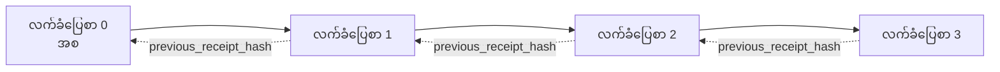

[သင်ရိုးရုပ်သံကိုကြည့်ရှုရန်: Cryptographic Receipts ဖြင့် AI Agent များကိုလုံခြုံစေခြင်း](https://youtu.be/PLACEHOLDER_VIDEO_ID)

> _(သင်ခန်းစာရုပ်သံနှင့် thumbnail ကို Microsoft content အသင်းမှ merge ပြီးနောက် ထည့်သွင်းမည်ဖြစ်ပြီး သင်ခန်းစာ ၁၄ / ၁၅ မှ ပုံစံနှင့် ကိုက်ညီပါမည်။)_

# Cryptographic Receipts ဖြင့် AI Agent များကိုလုံခြုံစေခြင်း

## နိဒါန်း

ဤသင်ခန်းစာတွင် တွက်သွင်းမှာမှာဖြစ်သည်။။

- AI agents များအတွက် audit trails များက compliance၊ debugging နှင့် ယုံကြည်မှုအတွက် အရေးကြီးသောကြောင့်။
- Cryptographic receipt ဆိုသည်မှာဘာဖြစ်ပြီး unsigned log line နှင့် မည်သို့ ကွာခြားသည်ကို။
- Python ဖြင့် agent ၏ tool call အတွက် signed receipt ပြုလုပ်နည်း။
- Offline တွင် receipt ကို စစ်ဆေးပြီး ထိုးနှက်မှုပြုနိုင်ခြင်း။
- Receipt များကို ချိတ်ဆက်၍ တစ်ခုဖယ်ရှားရန် သို့မဟုတ် ထပ်တလဲလဲရန် ချိတ်ဆက်မှု ပျက်ကွက်ခြင်း။
- Receipt များက အတည်ပြုသည့် အရာများနှင့် မတိကျခဲသောအချက်များ။

## သင်ယူရန်ရည်ရွယ်ချက်များ

ဤသင်ခန်းစာ ပြီးမြောက်ပါက သင်မှာ မည်သို့ သိရှိနိုင်မည်ကို။

- Agent လုပ်ဆောင်မှုအတွက် cryptographic provenance လိုအပ်စေသည့် မတော်တဆမှု အမျိုးအစားများ သတ္တိပြုရန်။
- Canonical JSON payload ပေါ်တွင် Ed25519 ဖြင့် အမည်သတ်စာသွင်း receipt တစ်ခု ထုတ်လုပ်ရန်။
- ရာထူးပိုင်၏ public key ဖြင့် receipt ကို လွတ်လပ်စွာ စစ်ဆေးနိုင်ရန်။
- ဖြစ်နိုင်သည့်ပြုပြင်ပြောင်းလဲမှုများကို သတ်မှတ်ရန် verification ကို ထပ်မံ ပြုလုပ်ရန်။
- Receipt များကို ထပ်တလဲလဲ ချိတ်ဆက်ပြီး ချိတ်ဆက်မှု၏ အရေးပါမှုကို ရှင်းပြရန်။
- Receipt များက အတည်ပြုသော အချက်များ (အသိအမှတ်ပြုခြင်း၊ လုံခြုံမှု၊ အစီအစဉ်) နှင့် မအတည်ပြု သည့် အချက်များ (အချက်စစ်မှန်မှု၊ မူဝါဒ၏ အသစ်စစ်မှု) နှင့် ခြားနားမှုကို အသိပေးရန်။

## ပြဿနာ: သင့် agent ၏ audit trail

Contoso Travel အတွက် AI agent တစ်ခု တပ်ဆင်ထားသည်ဟု ထင်ပါစို့။ အဲ့ဒီ agent သည် ဖောက်သည်တောင်းဆိုမှုများကိုဖတ်ပြီး၊ လေကြောင်းလိုင်း API ကို ခေါ်ယူကာ ရွေးချယ်မှုများ ရှာဖွေပြီး ဖောက်သည်အတွက် ထိုင်ခုံတွေ စီစဉ်ပေးသည်။ အကြိမ်ရေ ၅၀,၀၀၀ ကျော်ကောက်ယူခဲ့သည်။

ယနေ့ auditor တစ်ဦး လာရောက်သည်။ သူတို့သည် ရိုးရှင်းသောမေးခွန်းတစ်ခု မေးသည်။ "သင့် agent ဘာလုပ်ဆောင်ခဲ့သည်ကို ပြပါ။

သင်သည် log ဖိုင်များကို ပေးဆောင်သည်။ Auditor သည် နောက်ထပ် ခက်ခဲသော မေးခွန်းတစ်ခု မေးသည်။ "ဒီ log များ ပြင်ဆင်မှု မရှိကြောင်း ကျွန်တော်ဘယ်လိုသက်သေ ရမလဲ?"

ဒါက audit trail ပြဿနာဖြစ်သည်။ ယနေ့အများစု agent deployment များမှာ အောက်ပါအတိုင်းအခြေခံသည်။

- **Application logs**: agent ကိုယ်တိုင်ရေးသားခဲ့ပြီး ဖိုင်စနစ် လက်လှမ်းရှိသူတိုင်း ပြင်ဆင်နိုင်သည်။
- **Cloud logging services**: platform အဆင့်၌ tamper-evident ဖြစ်စေသော်လည်း auditor မှ platform operator ကို ယုံကြည်ရမည်။
- **Database transaction logs**: ဒေတာပြောင်းလဲမှုအတွက် အသင့်တော်ပေမယ့် arbitrary tool call များအတွက် မသင့်တော်။

ထိုသို့ယုံကြည်ရသူမရှိလျှင်၊ auditor ၏ မေးခွန်းကို မဖြေရှင်းနိုင်ပါ။ ကျွန်ုပ် သို့မဟုတ် cloud provider သို့မဟုတ် database vendor တစ်ယောက်ကို သေါ်ယူရန် လိုသည်။ အတွင်းပိုင်းအသုံးအတွက် ယုံကြည်ခြင်းသည် အဆင်ပြေသည်။ နိုင်ငံရေးဥပဒေပေါ်မူတည်သော အသုံးပြုမှုများအတွက် (ဘဏ္ဍာရေး၊ ကျန်းမာရေး၊ EU AI Act စသဖြင့်) မလက်ခံနိုင်ပါ။

Cryptographic receipts များသည် agent လုပ်ဆောင်မှုတိုင်းကို လွတ်လပ်စွာ စစ်ဆေးနိုင်စေရန် ဖြေရှင်းပေးသည်။ Auditor ကို သင်ကိုယုံကြည်ရန် မလိုအပ်ပါ။ သူတို့တွင် public key နှင့် receipt လက်တွေ့သာ လိုအပ်သည်။

## Cryptographic Receipt ဆိုသည်မှာဘာလဲ?

Receipt ဆိုသည်မှာ agent ၏ လုပ်ဆောင်ချက်ကို မှတ်တမ်းတင်ထားသော JSON object ဖြစ်ပြီး ဒစ်ဂျစ်တယ်လက်မှတ်ဖြင့် စာမှတ်ရေးထားသည်။


```mermaid
flowchart LR
    A[ကိုယ်စားလှယ်သည်ကိရိယာတစ်ခုကိုခေါ်ဆောင်သည်] --> B[လက်ခံစာပေးပို့မှုဒေတာတည်ဆောက်သည်]
    B --> C[JSON RFC 8785 ကိုပုံမှန်ပုံစံပြုလုပ်သည်]
    C --> D[SHA-256 ဟက်ရှ်]
    D --> E[Ed25519 လက်မှတ်ထိုးသည်]
    E --> F[လက်မှတ်ပါသောလက်ခံစာ]
    F --> G[စစ်ဆေးသူသည် အော့ဖ်လိုင်းတွင်စစ်ဆေးသည်]
    G --> H{လက်မှတ်တရားဝင်သလား?}
    H -- yes --> I[ဖျက်ဆီးမှုသက်သေထုတ်ပြန်ချက်]
    H -- no --> J[လက်ခံစာကို ငြင်းပယ်ခံရသည်]
```

အနည်းဆုံး receipt ပုံစံအနေဖြင့် ဒီလိုဖြစ်သည်။

```json
{
  "type": "agent.tool_call.v1",
  "agent_id": "contoso-travel-bot",
  "tool_name": "lookup_flights",
  "tool_args_hash": "sha256:a3f9c1...",
  "result_hash": "sha256:7b2e1d...",
  "policy_id": "contoso-travel-policy-v3",
  "timestamp": "2026-04-25T14:30:00Z",
  "sequence": 47,
  "previous_receipt_hash": "sha256:9d4e6a...",
  "signature": {
    "alg": "EdDSA",
    "sig": "c5af83...",
    "public_key": "8f3b2c..."
  }
}
```

အကျိုးရှိသော လက္ခဏာသုံးခုရှိသည်-

၁။ **လက်မှတ်**။ receipt ကို agent ၏ gateway မှ Ed25519 private key ဖြင့် လက်မှတ်ရေးထိုးသည်။ နောက်ထပ် အသုံးပြုသည့် public key နဲ့ offline verification ပြုလုပ်နိုင်သည်။ field များတစ်ခုခုကို ဖျက်ဆီးခဲ့လျှင် လက်မှတ်မမှန်တော့ပါ။

၂။ **Canonical encoding**။ လက်မှတ်ရေးထိုးမီ JSON Canonicalization Scheme (JCS, RFC 8785) ဖြင့် serialized နိုင်ပါသည်။ ဒီနည်းဖြင့် တူညီသော logical receipt နှစ်ခုသည် နိုင်ငံခြားပါဝင်မှု သိန်းတင်အတိုင်း တူညီသော byte output ထွက်လာသည်။ Canonicalization မရှိလျှင် JSON serializers မတူကွဲပြားမှုကြောင့် လက်မှတ်များ ကွဲပြားနိုင်သည်။

၃။ **Hash chaining**။ `previous_receipt_hash` field သည် receipt အစီအစဉ် ပေါ်တွင် receipt တစ်ခုချင်းပြီးခါတုန်းက receipt ကူးတယ်။ receipt တစ်ခု ဖယ်ရှားသည်ခါတုန်းက ချိတ်ဆက်မှု ပျက်ကွက်ပြီး ဖြစ်စေသည်။ သင့်တော်ခြင်းကို လက်မှတ်များဖြတ်ကျော်သော သရုပ်မပြုနိုင်ပေ။

၎င်း property များသည် အာမခံချက် သုံးခု ပေးဆောင်သည်။

- **အသိအမှတ်ပြုခြင်း**: ဤ key သည် ဤ အကြောင်းအရာကို လက်မှတ်ရေးထိုးသည်။
- **လုံခြုံမှု**: အကြောင်းအရာအားလုံးသည် လက်မှတ်ရေးထိုးပြီးမှ မပြောင်းလဲခဲ့ပါ။
- **အစီအစဉ်**: ဤ receipt သည် ချိတ်ဆက်မှုတွင် ထို receipt အပြီးတွင် ဖြစ်သည်။

## Python တွင် Receipt တစ်ခု ထုတ်လုပ်ခြင်း

Receipt ထုတ်လုပ်ရန် အထူးစာကြည့်တိုက်မလိုအပ်ပါ။ Cryptographic primitive များ ကျယ်ပြန့်စွာ ရရှိနိုင်ပြီး logic သည် Python သန်းတောင့်အနည်းငယ်သာရှိသည်။

`code_samples/18-signed-receipts.ipynb` တွင် လက်တွေ့ လေ့ကျင့်ခန်းများဖြင့် လမ်းညွှန်ထားသည်။ အကျဉ်းချုပ်အားဖြင့် -

```python
import json
import hashlib
import base64
from nacl import signing
from jcs import canonicalize  # RFC 8785 ကနာနီကယ် JSON

def b64url_nopad(data: bytes) -> str:
    return base64.urlsafe_b64encode(data).decode("ascii").rstrip("=")

def sha256_canonical(obj) -> str:
    """SHA-256 of a Python object's JCS-canonical JSON form."""
    return f"sha256:{hashlib.sha256(canonicalize(obj)).hexdigest()}"

# စာချုပ်သုံးသော key ကို ထုတ်လုပ် သို့မဟုတ် load လုပ်ပါ (ထုတ်လုပ်မှုတွင် key vault တွင်သိမ်းဆည်းပါ)
signing_key = signing.SigningKey.generate()
verify_key = signing_key.verify_key

# လက်ခံရရှိမှု payload ကို တည်ဆောက်ပါ (လက်မှတ်မတင်သေး)
tool_args = {"origin": "SYD", "destination": "LAX"}
tool_result = [{"flight": "QF11", "price": 1850, "stops": 0}]

payload = {
    "type": "agent.tool_call.v1",
    "agent_id": "contoso-travel-bot",
    "tool_name": "lookup_flights",
    "tool_args_hash": sha256_canonical(tool_args),
    "result_hash": sha256_canonical(tool_result),
    "policy_id": "contoso-travel-policy-v3",
    "timestamp": "2026-04-25T14:30:00Z",
    "sequence": 0,
    "previous_receipt_hash": None,
}

# ကနာနီကယ်အဖြစ်ပြုပြင်၊ hash နှင့် လက်မှတ်ပါ။
canonical_bytes = canonicalize(payload)
message_hash = hashlib.sha256(canonical_bytes).digest()
signature_bytes = signing_key.sign(message_hash).signature

# ဖွဲ့စည်းတည်ဆောက်သော လက်မှတ် အရာဝတ္ထုကို တွဲပါ။
receipt = {
    **payload,
    "signature": {
        "alg": "EdDSA",
        "sig": b64url_nopad(signature_bytes),
        "public_key": b64url_nopad(bytes(verify_key)),
    },
}
```

အဲဒါပေါ့လက်မှတ်ရေးထိုးမှု လုံးဝဖြစ်သည်။ လေ့ကျင့်ခန်းများတွင် အဆင့်တိုင်းကို လေ့လာနိုင်သည်။

## Receipt စစ်ဆေးခြင်းနှင့် ထိုးနှက်မှု ရှာဖွေရန်

Verification သည် လှည့်လည် လုပ်ဆောင်မှုဖြစ်သည်။

```python
import base64
import hashlib
from nacl import signing
from nacl.exceptions import BadSignatureError
from jcs import canonicalize

def b64url_decode(s: str) -> bytes:
    padding = "=" * ((4 - len(s) % 4) % 4)
    return base64.urlsafe_b64decode(s + padding)

def verify_receipt(receipt: dict) -> bool:
    # လက်မှတ်သည် ဖွဲ့စည်းထားသောအရာဝတ္ထုဖြစ်သည် - {"alg", "sig", "public_key"}။
    sig_obj = receipt.get("signature")
    if not sig_obj or sig_obj.get("alg") != "EdDSA":
        return False

    # တကယ်လက်မှတ်ထိုးထားသော payload ကို ပြန်လည်တည်ဆောက်ပါ (လက်မှတ်မှ ပယ်ထားသော အရာအားလုံး)။
    payload = {k: v for k, v in receipt.items() if k != "signature"}

    canonical_bytes = canonicalize(payload)
    message_hash = hashlib.sha256(canonical_bytes).digest()

    try:
        verify_key = signing.VerifyKey(b64url_decode(sig_obj["public_key"]))
        verify_key.verify(message_hash, b64url_decode(sig_obj["sig"]))
        return True
    except BadSignatureError:
        return False
```

ဤ function သည် receipt တစ်ခုကို လက်ခံ၍ signature မှန်ကန်လျှင် `True` ပြန်လည်ပေးပြီး မမှန်လျှင် `False` ပြန်ပေးသည်။ ကွန်ရက်ခေါ်ဆိုမှု မရှိ၊ ဝန်ဆောင်မှု မလိုအပ်၊ တတိယ ကတိများတွင် မယုံကြည်လိုအပ်ပါ။

ထိုးနှက်မှု ရှာဖွေရေး လေ့ကျင့်ခန်းတွင် -

၁။ သက်ဆိုင်ရာ receipt တစ်ခု ထုတ်လုပ်ပြီး verification အောင်မြင်သည်ကို တည်ငြိမ်စေသည်။
၂။ `tool_args_hash` field တစ်ခုကို byte တစ်ခု ပြင်ဆင်သည်။
၃။ Verification ကို ထပ်မံ ပြုလုပ်ပြီး မအောင်မြင်ပါ။

ဤကနေ ရင့်ကြည်သောအထောက်အထားတစ်ခု ပါသည် - receipt များသည် ထိုးနှက်မှု ခြိမ်းခြောက်မှုကိုပြသသည်။

## Multi-Step Agent များအတွက် Receipt ချိတ်ဆက်ခြင်း

အသီးသီး လက်မှတ်ရေးထိုး receipt တစ်ခု သည် သီးသန့် လုပ်ဆောင်ချက် တစ်ခုကို ကာကွယ်ပေးသည်။ Receipt ချိတ်ဆက်သဖြင့် အစီအစဉ် တစ်ခုကို ကာကွယ်ပေးသည်။


```mermaid
flowchart LR
    R0[လက်ခံပြေစာ 0<br/>အစ] --> R1[လက်ခံပြေစာ 1]
    R1 --> R2[လက်ခံပြေစာ 2]
    R2 --> R3[လက်ခံပြေစာ 3]
    R1 -. previous_receipt_hash .-> R0
    R2 -. previous_receipt_hash .-> R1
    R3 -. previous_receipt_hash .-> R2
```

Receipt တစ်ခုစီတွင် အရင် receipt ၏ hash တန်ဖိုးကိုမှတ်ထားသည်။ Receipt ၂ ကိုတော့ ထိပ်ခြေမထိအောင် ဖယ်ရှားလိုပါက -

- Receipt ၃ ၏ `previous_receipt_hash` field ကိုပြင်ဆင်ရမည် (receipt ၃ ၏ signature ကိုဖောက်ထွင်းမည်။)
- Receipt ၃ ၏ပြင်ဆင်ထားသော receipt အတွက် နောက်လက်မှတ်တစ်ခု ဖောက်ထွင်းရမည် (agent ၏ private key လိုအပ်သည်)။

Private key ကို hardware key vault တွင် ထိန်းသိမ်းပြီး public key ကို receipt များနှင့် ထုတ်ဝေရပါက ဝင်ခံမှုမရှိဘဲ တိုက်ခိုက်မှု မဖြစ်နိုင်။

Notebook သို့ လမ်းညွှန်ထားသည်-

၁။ Receipt သုံးခု ချိတ်ဆက်မှု တည်ဆောက်ခြင်း။
၂။ Receipt တစ်ခုစီ၏ `previous_receipt_hash` သည် နောက် receipt ၏ အမှန်တကယ် hash နှင့် ကိုက်ညီမှု စစ်ဆေးခြင်း။
၃။ အလယ်ရှိ receipt တစ်ခုကို ထိုးနှက်ခြင်းဖြင့် ချိတ်ဆက်မှု ပျက်ခြင်းကို ကြည့်ရှုခြင်း။

ဒီလိုနည်းဖြင့် သင့်ကို ယုံကြည်စရာမလိုဘဲ ထောက်ခံသူ တစ်ယောက်က စစ်ဆေးနိုင်သော audit trail တစ်ခု ပြုလုပ်နိုင်သည်။

## Receipt များသည် အတည်ပြုသော အရာများ (နှင့် မအတည်ပြုသော အရာများ)

ဤသည်မှာ သင်ခန်းစာ၏ အရေးကြီးဆုံး အပိုင်းဖြစ်သည်။ Receipt များသည် အံ့သြဖွယ်ကောင်းသော်လည်း ၎င်းတို့၏ အင်အားမှာ ကန့်သတ်ထားသည်။

**Receipt များသည် အရာသုံးခုကို အတည်ပြုသည်။**

၁။ **အသိအမှတ်ပြုခြင်း**: သတ်မှတ်ထားသော key တစ်ခုသည် သတ်မှတ် payload ကို လက်မှတ်ရေးထိုးသည်။
၂။ **လုံခြုံမှု**: လက်မှတ်ရေးထိုးပြီးမှ မပြောင်းလဲခဲ့သော payload ဖြစ်သည်။
၃။ **အစီအစဉ်**: Receipt သည် hash ချိတ်ဆက်မှုတွင် ထို receipt အဆက်တွင်ဖြစ်သည်။

**Receipt များ မအတည်ပြုသော အရာများ:**

၁။ **မှန်ကန်မှု**: Agent ၏ လုပ်ဆောင်ချက်သည် မှန်ကန်သည်ဟု အတည်ပြုခြင်းမဟုတ်ပါ။ မှားယွင်းသော အဖြေကိုပါ Receipt ဖြင့် လက်မှတ်ရေးထိုးနိုင်သည်။
၂။ **မူဝါဒလိုက်နာမှု**: `policy_id` တွင် ဖော်ပြထားသော မူဝါဒသည် စစ်ဆေးပြီးဖြစ်ပါသလား၊ ပြဋ္ဌာန်းထားသော်လည်း လုပ်ဆောင်ခွင့်ရှိသလား မဖော်ပြပါ။ Receipt သည် ဟန်ချက်ကို မှတ်တမ်းတင်သည်၊ လုပ်ဆောင်ခြင်းမဟုတ်ပါ။
၃။ **Key မဟုတ်ပါက ကိုယ်ပိုင်အချက်အလက်**: Receipt မှ "ဤ key သည် ဤအကြောင်းအရာကို လက်မှတ်ရေးထိုးသည်" ဟု ပြောသည်။ "ဤ လူသားသည် ခွင့်ပြုသည်" ဟု မဆိုပါ။ Key နှင့် လူ/အဖွဲ့အစည်းချိတ်ဆက်ရန် ကြားနာဂျာနယ်၊ public key မှတ်ပုံတင်စနစ် တစ်ခု လိုအပ်သည်။
၄။ **ထည့်သွင်းချက်အမျိုးမျိုးမှန်ကန်မှု**: Agent သည် ပြောင်းလဲထားသော prompt ႏွင့် လုပ်ဆောင်လျှင် Receipt မှာ လုပ်ဆောင်ချက်ကို မှန်ကန်စွာ မှတ်တမ်းတင်သည်။ Receipt များသည် input validation ၏ downstream အဖြစ်ဖြစ်ပြီး အစားအစာမဟုတ်ပါ။

၎င်းခြားနားမှုသည် အရေးပါသည် -

- Receipt များသည် Agent အပြုအမူကို auditable နှင့် tamper-evident ဖြစ်စေသည်၊ အဖွဲ့အစည်း အကန့်အသတ်ကျော်လွန်လည်း။
- ထည့်သွင်းချက်ပြန်ဖြေရှင်းခြင်း (lesson 6), မူဝါဒ အကောင်အထည်ဖော်ခြင်း (အောက်တွင် သိမ်းဆည်းထား), ကိုယ်ပိုင်အချက်အလက် infrastructure (ဤသင်ခန်းစာတွင် မပါဝင်) စသည်ဖြင့် ထပ်တိုးကွက်ချက်များ လိုအပ်ကြောင်း။

လူများ မေးမြန်းသည် "Receipt ရှိသည်ဆိုတာ အုပ်ချုပ်မှုရှိသည်" ဟူသော မှားယွင်းချက်ကျနော်တို့ တွေ့ရှိသည်။ Receipt သည် အခြေခံဖြစ်ပြီး အုပ်ချုပ်မှုသည် ဤအပေါ်တွင် တည်ဆောက်သော စနစ်ဖြစ်သည်။

## ထုတ်လုပ်မှု ကိုးကားချက်များ

ဤသင်ခန်းစာတွင် Python code များထိုင်းသိမ်းပုံသေခွင့်အရ တင်းကျပ်ပြီး ဘာဖြစ်ကြောင်း မွန်မြတ်စွာ သဘောပေါက်စေသည်။ ထုတ်လုပ်မှုတွင် ရွေးချယ်လို့ရသည့် နည်းလမ်းနှစ်ခုရှိသည် -

၁။ **Cryptographic primitive များကို တိုက်ရိုက် တည်ဆောက်ခြင်း**။ ၅၀ လိုင်းစာနည်းပညာသည်အများအတွက် လုံလောက်သည်။ PyNaCl (Ed25519) နှင့် `jcs` package (canonical JSON) သည် ကောင်းမွန်စွာ ထိန်းသိမ်းပြီး စစ်ဆေးထားသော စာကြည့်တိုက်များဖြစ်သည်။

၂။ **ထုတ်လုပ်ရေး receipt thư viện ကို အသုံးပြုခြင်း**။ အများအပြား open-source project များသည် အောက်ပါအစီအစဉ်နှင့် feature များသုံးပြီး အကောင်အထည်ဖော်သည် (key rotation, batch verification, JWK Set distribution, policy engines တွင် ထည့်သွင်းခြင်း) -
   - ဤ lesson မှ အသုံးပြုသည့် receipt ပုံစံမှာ IETF Internet-Draft (`draft-farley-acta-signed-receipts`) ဖြစ်ပြီး ယခု standard ဖြစ်ရေး လုပ်ငန်းစဉ်တွင်ရှိသည်။
   - Microsoft Agent Governance Toolkit သည် Cedar-based policy အတွက် receipts ဖွဲ့စည်းပုံ ပါရှိသည်၊ repository ၏ Tutorial 33 တွင် အပြီးအစီးဥပမာ ရှိသည်။
   - `protect-mcp` (npm) နှင့် `@veritasacta/verify` (npm) packages များသည် Node-based receipt signing နှင့် offline verification ကို ထောက်ပံ့ပြီး MCP server များအတွက် tamper-evident audit trail ကို ပို့ဆောင်ရန် ရည်ရွယ်သည်။
   - **[nobulex](https://github.com/arian-gogani/nobulex)** Python SDK (`pip install nobulex`) သည် Ed25519 + JCS signing ပုံစံကို Python ပေါ်တွင် LangChain နှင့် CrewAI သုံးစွဲမှုများ ပါဝင်ပြီး cross-validation test vector များ နှင့် compliance map များကို OWASP PR #2210 မှ တကျယ်ဝန်းလျှောက်ထားသည်။

ကိုယ်တိုင်ရေးသားခြင်းနှင့် thư viện အသုံးပြုခြင်း အကြား ဆုံးဖြတ်ချက်သည် JWT thư viện ကို ကိုယ်တိုင်ရေးသားခြင်းနှင့် စမ်းသပ်ပြီး thư viện အသုံးပြုခြင်း၏ ဆုံးဖြတ်ချက်နှင့် ဆင်တူသည်။ နှစ်ခုစလုံး အဆင်ပြေသည်။ thư viện သည် အချိန်ကုန်သက်သာစေပြီး audit မွိန်ခြင်း လျော့နည်းစေသည်။ စတင်ရေးသားမှုသည် primitive လုံးဝနားလည်မှု ပေးစွမ်းသည်။ ဤသင်ခန်းစာသည် စတင်ချက်ဖြစ်ပြီး ရွေးချယ်မှုနှစ်သွယ်ကို ကိုယ်တိုင် ရယူနိုင်သည်။

## သိမှတ်ချက် စစ်ဆေးခြင်း

လေ့ကျင့်ခန်းဆက်မလုပ်မီ သင်၏ နားလည်မှုကို စမ်းသပ်ပါ။

**၁။ Receipt သည် agent ၏ နယ်ပယ် Ed25519 key ဖြင့် လက်မှတ်ရေးထိုးသည်။ Auditor ၌ public keyသာရှိသည်။ Auditor သည် receipt ကို offline verification လုပ်နိုင်သည်နည်း?**

<details>
<summary>ဖြေချက်</summary>

ဟုတ်သည်။ Ed25519 verification တွင် public key နှင့် signed bytes များသာလိုသည်။ ကွန်ရက်ခေါ်ဆိုမှုမလို၊ ဝန်ဆောင်မှု အားထားမှုပိုင်း မလိုအပ်ပါ။ ဤအင်္ဂါရပ်သည် receipt များကို အဲယားဂျက်စနစ်များ၊ မျိုးစုံ အဖွဲ့အစည်းများ သို့မဟုတ် ယုံကြည်မှုနည်းသော audit ဆိုင်ရာများ၌ အသုံးပြုရန် အထောက်အကူပြုသည်။
</details>

**၂။ တိုက်ခိုက်သူသည် receipt ၏ `policy_id` field ကို ပြင်ဆင်ပြီး ပို၍ ခွင့်ပြုမှုရရှိသော policy ဖြင့် ထိန်းချုပ်ထားသည် ဟု သံသယရှိအောင် ပြုလုပ်သည်။ Signature သည် မူရင်း payload ပေါ်တွင် ရှိသည်။ Verification အတွင်း အဖြစ်အပျက် ဘာဖြစ်မလဲ?**

<details>
<summary>ဖြေချက်</summary>

Verification မအောင်မြင်ပါ။ Signature သည် မူရင်း payload ၏ canonical bytes အပေါ်တွက်ချက်ပြီးဖြစ်သည်။ Field တစ်ခုခု ပြင်ဆင်မှ canonical bytes ပြောင်းလဲ၍ SHA-256 hash ပြောင်းလဲပြီး signature မမှန်ကန်တော့ပါ။ တိုက်ခိုက်သူသည် private key ရရှိရန် လိုအပ်သည်၊ အဲဒါ မရှိပါ။
</details>

**၃။ Receipt တွင် raw arguments နှင့် result မပါဘဲ `tool_args_hash` နှင့် `result_hash` များပါဝင်သည့် အကြောင်းအရင်း ဘာလဲ?**

<details>
<summary>ဖြေချက်</summary>

နှစ်ချက် အရှိဆုံးဖြစ်သည်။ ပထမဆုံး၊ receipt ကို သိမ်းဆည်းလိုသည့် ဒေသများအတွက် raw content (PII, လုပ်ငန်းဒေတာ) လွှတ်တင်ခြင်းမလိုအပ်သော အခါတွင် Hashing သည် receipt အရွယ်အစားကို သာလာစေနိုင်ပြီး အကြောင်းအရာကို လျှို့ဝှက်ထားနိုင်ရန် အကူအညီဖြစ်သည်။ Auditor သည် hash ကို actual content ၏ copies နှင့် ကိုက်ညီမှုကို စစ်ဆေးသည်။ ဒုတိယ၊ hash များသည် fixed size ဖြစ်သည်။ Hash ပါသော receipt သည် input နှင့် output အရွယ်အစား မည်မျှကြီးမဆို အရွယ်အစား ကန့်သတ်ထားသည်။
</details>

**၄။ `previous_receipt_hash` field သည် receipt တစ်ခုစီကို ယခင် receipt နှင့် ချိတ်ဆက်သည်။ တိုက်ခိုက်သူက chain ၏ အလယ်မှ receipt တစ်ခုကို စတိတျခား ဖျက်ပစ်လျှင် ဘာမဖြစ်မလဲ?**

<details>
<summary>ဖြေချက်</summary>

ဖျက်သွားသော receipt မှနောက်တွင် ရှိသော receipt အားလုံးပျက်ကွက်နေသည်။ ၎င်းတို့၏ `previous_receipt_hash` မဟုတ်သော hash နှင့် ကိုက်ညီမှု မရှိတော့ပေ။ ဖျက်ပစ်မှုကိုဝှက်ဖို့အတွက် တိုက်ခိုက်သူသည် နောက် receipt အားလုံးကို ထပ်မံ လက်မှတ်ရေးထိုးရမည်ဖြစ်ပြီး ဒါအတွက် private key လိုအပ်သည်။
</details>

**၅။ Receipt သည် ပေါက်လံစစ်ဆေးမှု ကျေညာပါက၊ agent ၏ လုပ်ဆောင်ချက်မှာ မွန်ကန်မှု၊ soundness သို့မဟုတ် မူဝါဒလိုက်နာမှု မဖြစ်ကြောင်း သက်သေပြပါသလား?**

<details>
<summary>ဖြေချက်</summary>

မဟုတ်ပါ။ လက်မှတ်ခံ receipt သည် သုံးချက် အတည်ပြုသည်။ အသိအမှတ်ပြုခြင်း (key သည် content လက်မှတ်ရေးထိုးသည်), လုံခြုံမှု (content မပြောင်းလဲပါ), အစီအစဉ် (receipt သည် ပါဝင်သော chain တွင် အစီအစဉ်ရှိသည်)။ ဒါ့အပြင် လုပ်ဆောင်ချက်မှန်ကန်မှု၊ `policy_id` မှာ ဖော်ပြထားသော မူဝါဒ စစ်ဆေးခြင်းရှိမရှိ, agent က စောင့်ကြပ်ထားတဲ့ မူဝါဒများ နောက်လိုက်ခြင်း မဟုတ်ပါ။ Receipt သည် agent ရဲ့ပုံမှန်အပြုအမူကို auditable ဖြစ်စေတယ်၊ မှန်ကန်မှု အတည်ပြုခြင်း မဟုတ်ပါ။ ဤက အဓိက ထိရောက်မှုတွင် ဖြစ်သည်။
</details>

## လေ့ကျင့်ခန်း

`code_samples/18-signed-receipts.ipynb` ကိုဖွင့်ပြီး အပိုင်းလေးခု ပြီးစီးပါ -

၁။ **အပိုင်း ၁**: သင်၏ပထမဆုံး receipt ကို လက်မှတ်ရေးထိုးပြီး စစ်ဆေးပါ။
၂။ **အပိုင်း ၂**: Receipt ကို ပြုစုပျက်ပြစ်ပြီး Verification မအောင်မြင်ပါစေ။
၃။ **အပိုင်း ၃**: Receipt သုံးခု ချိတ်ဆက်မှု တစ်ခု တည်ဆောက်ပြီး ချိတ်ဆက်မှု၏ သမာဓိ စစ်ဆေးပါ။
၄။ **အပိုင်း ၄**: Microsoft Agent Framework အသုံးပြု၍ Agent တစ်ခုအတွက် pattern ကို သက်ဆိုင်ရာ tool call တွင် Receipt လက်မှတ်ရေးထိုးပြီး သက်ဖွယ် verification ကို လွတ်လပ်စွာ ပြုလုပ်ပါ။


**ဖြန့်ချိမှု စိန်ခေါ်မှု ၁:** သင်ကြိုက်နှစ်သက်ရာ နယ်ပယ်အသစ်တစ်ခုဖြင့် ရက်ခံစာ schema ကိုချဲ့ထွင်ပါ (ဥပမာ၊ ကူးလူးခြင်းသီးသန့်အတည်ပြုရေးအတွက် တောင်းဆိုမှတ်သားစဉ် ID)၊ canonical လက္မှတ်ရေးထိုးတတ်ဆင့်ချက်ကို ထည့်သွင်းအသစ်လုပ်ပါ၊ ထို့နောက် ရက်ခံစာသည် ပြန်လည်စစ်ဆေးခြင်းဖြင့် မှန်ကန်ဖြစ်နေမှုကို အတည်ပြုပါ။ ထို့နောက် လက္မှတ်ရေးထိုးပြီးနောက် နယ်ပယ်ကိုပြောင်းလဲပြီး ပြန်လည်စစ်ဆေးရာတွင် မအောင်မြင်ခြင်းကို အတည်ပြုပါ။  ၎င်းသည် canonical encode ကြောင်းရှိ byte တစ်ခုချင်းစီသည် လက္မှတ်ရေးထိုးမှုတွင် မည်သို့ပါဝင်သည်ကို နားလည်ရန် အကြောင်းမတိုးအောင် ဖိအားပေးသည်။

**ဖြန့်ချိမှု စိန်ခေါ်မှု ၂:** သင့်ရဲ့ ရက်ခံစာနှစ်ခုကို SHA-256 သုံးပြီး ဟက်ရှ်လုပ်ပါ (၎င်းတို့၏ canonical bytes ကို သေချာထားသော အစီအစဉ်ဖြင့် ထပ်ဆောင်းချိတ်ဆက်ခြင်း)၊ ထို့နောက် ထုတ်ပေးထားသော digest ကို တတိယရက်ခံစာအတွင်း နယ်ပယ်အသစ်တစ်ခုအဖြစ် ထည့်သွင်းပြီး လက္မှတ်ရေးထိုးပါ။ ရှစ် ဓာတ်ပုံ သုံးခုလုံးသည် ပြန်လည်ပြင်ဆင်ခြင်းဖြင့် မှန်ကန်နေခြင်းကို အတည်ပြုပါ။ သင့်အနေနဲ့ တစ်ဆင့်ထဲသော တက်မှုအထောက်အထားဆက်သွယ်နည်းကို ဖန်တီးထားသည်။ တတိယရက်ခံစာကိုင်ဆောင်သူသည် မည်သူမဆို လက်မှတ်ရေးထိုးချိန်တွင် ပထမနှစ်ခု ရရှိခဲ့ကြောင်း အကြောင်းအရာများ ထုတ်ဖော်ပြရန်မလိုဘဲ အတည်ပြုနိုင်ပါသည်။ ၎င်းသည် selective-disclosure receipts များကို ကျယ်ပြန့်စွာအသုံးပြုသော ပုံစံဖြစ်သည် (Merkle commitments, RFC 6962)။

## နိဂုံးချုပ်

အချက်အလက် ရိုက်နှိပ်ခြင်းမှ စက်ရုပ်များအတွက် သ cryptographic ဖတ်ရေးလက်ခံဘွဲ့များမှာ အောက်ပါအတိုင်း တင်ပြသည်-

- **ကိုယ်တိုင်သက်သေခံနိုင်သော**: လူမှုအသုံးပြုပြားမည်သူမဆို အများသုံးသော key ဖြင့် စစ်ဆေးနိုင်ကြောင်း၊ ၀န်ဆောင်မှု မလိုအပ်။
- **ချိုးဖောက်မှုကို ဖော်ထုတ်နိုင်သော**: မည်သည့်ပြင်ဆင်မှုမဆို လက်မှတ် မရှိမဖြစ်ဖြစ်စေ။
- **သယ်ယူပို့ဆောင်နိုင်သော**: ရက်ခံစာသည် JSON ဖိုင်သေးသေးလေးဖြစ်သည်၊ ဘယ်နေရာတွင်မဆို သိမ်းဆည်း၊ ပို့ဆောင်၊ စစ်ဆေးနိုင်သည်။
- **စံချိန်စံညိွှန်းနှင့် ကိုက်ညီသော**: Ed25519 (RFC 8032), JCS (RFC 8785), နှင့် SHA-256 အခြေခံထားသော၊ သိပ်သည်းကျယ်စွာသုံးသော ပရမိတိတ်များ။

၎င်းများသည် အချက်အလက် မူဝါဒစီမံခန့်ခွဲမှုသို့မဟုတ် အထောက်အထားအင်ဖရာ များ၏ အစားထိုးမဟုတ်ပါ။ ၎င်းတို့သည် ထိုအလွှာတွက် အခြေခံခ yapıများဖြစ်သည်။ သင်သည် တရားညီမျှမှုရှိသော လုပ်ထုံးလုပ်နည်းများတွင် စက်ရုပ်များအား တပ်ဆင်သည့်အခါ၊ အဖွဲ့အစည်းအလွှာများ တွင် သို့မဟုတ် အနာဂတ်စစ်ထောက်တစ်ဦးသည် သင့်အား ယုံကြည်ကြောင်း မယူဆနိုင်သော နေရာတွင် ရက်ခံစာများသည် audit trail ကို ရိုးသားစွာ မှတ်သားပေးသည်။

အရေးကြီးဆုံး သင်ခန်းစာမှာ - ရက်ခံစာများသည် ဘယ်သူ ဘာ အချိန်တွင် ပြောခဲ့သည်ကို အတည်ပြုသည်။ ပြောခဲ့သည်မဟုတ်ဘဲ မှန်ကန်ခြင်းကို အတည်ပြုခြင်း မဟုတ်ပါ။ ၎င်းကို အတည်ပြုရန် မျက်နှာမနှောင့်ယှက်ပဲ သိရှိထားပါ။ ၎င်းသည် ရိုးသားသော အသက်မွေးဝမ်းကြောင်းစနစ်နှင့် မှားယွင်းသော တစ်ခုအကြား ကွာခြားချက် ဖြစ်သည်။

## ထုတ်လုပ်မှု စစ်ဆေးစာရင်း

သင်သည် ဤ သင်ခန်းစာမှ ဘာသာရပ်ဆင်းပြီး ထုတ်လုပ်မှုပတ်ဝန်းကျင်တွင် ရက်ခံစာလက္မှတ်ထိုးထားသော စက်ရုပ်များ အသုံးပြုရန် ပြင်ဆင်နေစဉ်တွင်-

- [ ] **လက်မှတ်ရေးထိုးသော key ကို ဖန်တီးသူ laptop မှ ရွှေ့ပါ။** Azure Key Vault, AWS KMS သို့မဟုတ် hardware security module ကို အသုံးပြုပါ။ သင်၏ ရက်ခံစာများကို လက်မှတ်ရေးထိုးသော ကိုယ်ပိုင် key ကို မည်သည့်အချိန်မဆို source control သို့မဟုတ် plaintext အဖြစ် application ကိရိယာများတွင် ဖော်ပြခြင်းမပြုရ။ 
- [ ] **သက်သေခံသော အများသုံး key ကို ထုတ်ဝေပါ။** စစ်ထောက်များသည် offline မှာစစ်ဆေးနိုင်ဖို့လိုအပ်သည်။ ပုံမှန်ဝေမျှမှုမှာ JWK သတင်းအုပ်စု (RFC 7517) ဖြစ်ပြီး၊ ဥပမာ `https://your-org.example.com/.well-known/agent-keys.json` တွင်ရှိသည်။
- [ ] **သင့်ဝှက်ချက် ချိတ်ဆက်မှုကို ပြင်ပတွင် တည်ဆောက်ပါ။** အချို့အချိန်များအတွင်း လက်ရှိချိတ်ဆက်မှု ခေါင်းအဆီတို့၏ ဟက်ရှ်အရွယ်အစားကို transparency log (Sigstore Rekor, RFC 3161 timestamp authority, သို့မဟုတ် ဒုတိယအတွင်းစနစ်) ပေါ်တွင် မှတ်ဉာဏ်ရေးဆွဲပြီး ပြင်ပကွင်းများက "ဤချိတ်ဆက်မှုအချိန်ယာဉ် သာမန်ရှိသည်" ဟု အတည်ပြုနိုင်သည်။
- [ ] **ရက်ခံစာများကို မပြောင်းလဲနိုင်သောအဖြစ် သိမ်းဆည်းပါ။** Append-only blob storage (Azure Storage with immutability policies, AWS S3 Object Lock) သည် အတွင်းမပ်တစ်ယောက်အား storage အလွှာတွင် သမိုင်းရေးရာကို ပြင်ဆင်ခြင်းမပြုရန်ကာကွယ်သည်။
- [ ] **သိမ်းဆည်းထားရန် ဆုံးဖြတ်ပါ။** Compliance စည်းမျဉ်းစည်းကမ်းများအများစုသည် နှစ်ပေါင်းများစွာ သိမ်းဆည်းရန်လိုအပ်သည်။ ရက်ခံစာမှတ်တမ်းတိုးပွားမှုကို စီစဉ်ပါ (ရက်ခံစာတစ်ခုသည် ~၅၀၀ bytes ဖြစ်သည်၊ တစ်ရက်ကို ၁၀၀၀၀ Calls ပြုလုပ်သော စက်ရုပ်သည် တစ်နှစ်တွင် ~၁.၈ GB ထွက်ရှိသည်)။
- [ ] **ရက်ခံစာများ မဖုံးလွှမ်းသည့် အမှုများကို မှတ်ချက်ပြုပါ။** ရက်ခံစာများသည် attribution၊ သက်ဝင်ခြင်းနှင့် အစဉ်အလာကို သက်သေပြသည်။ သင်၏ runbook တွင် အပို ထိန်းချုပ်မှုများ (input validation, policy enforcement, rate limiting, identity infrastructure) များ ရက်ခံစာများနှင့်အတူ သင့်အုပ်ချုပ်မှုအလှPosture ၌ မည်သို့ တည်ရှိသည်ကို ဖော်ပြရန် လိုအပ်သည်။

### တခြား စက်ရုပ်များလုံခြုံရေးအတွက် ကိစ္စများ မေးလိုပါသလား?

[Microsoft Foundry Discord](https://aka.ms/ai-agents/discord) ကို ဝင်ရောက်ပါ၊ အခြား သင်ယူသူများနှင့်တွေ့ဆုံပြီး၊ အလုပ်အချိန်များဆွေးနွေးပြီး၊ သင်၏ AI Agents မေးခွန်းများကို ဖြေကြားနိုင်ပါသည်။

## ဤသင်ခန်းစာအပြီးတွင်

ဤသင်ခန်းစာတွင် တစ်ခုတည်းသော ရက်ခံစာလက္မှတ်ရေးထိုးခြင်းနှင့် ဟက်ရှ်ချိန်းလိုက်ဗျည်းများကို ဖော်ပြသည်။ သင်၏ အုပ်ချုပ်မှုပုံစံ တိုးတက်လာသလို ဒီပရမိတိတ်များသည် နောက်ထပ်အဆင့်မြင့်ပုံစံများသို့ တည်ဆောက်နိုင်သည်-

- **Selective disclosure။** ရက်ခံစာ၏ နယ်ပယ်များကို သီးသန့် အတည်ပြုထားသော (RFC 6962-style Merkle tree) မှာ သီးခြားအပေါ် မူတည်၍ နယ်ပယ်များကို သီးခြားစစ်တမ်းရေးသူများ အား ဖျော်ဖြေပြီး ကျန်သော အရာများ မပြောင်းလဲကြောင်း သက်သေပြနိုင်ပြီး အကြောင်းအရာများကို ဖော်ထုတ်ရန် မလိုအပ်အောင် ပြုလုပ်နိုင်သည်။ ဤဟာသည် တပြိုင်နက် audit အတွက် ပြီးပြည့်စုံမှုလိုလိုသော စစ်တမ်းများနှင့် ဒေတာလျှော့ချမှုအညွှန်းလိုအပ်ချက်များ (ဥပမာ GDPR) တွင် အသုံးဝင်သည်။
- **ရက်ခံစာ သက်တမ်းကုန်ဆုံးခြင်း။** လက်မှတ်ရေးထိုး key တစ်ခု ပျက်ကွက်လာပါက ထို key ဖြင့် လက်မှတ်ရေးထိုးထားသော ရက်ခံစာအားလုံးကို အနာဂတ်ကာလမှ စ၍ ယုံကြည်စိတ်ချမရကြောင်း သတ်မှတ်ရန် လိုအပ်သည်။ ပုံမှန်စနစ်များမှာ ချိန်ပေါ်က အားနည်းသော လက်မှတ်ရေးထိုးခြင်း key များနှင့် ထုတ်ပြန်ထားသော သက်တမ်းကုန်ဆုံးခြင်းစာရင်း သို့မဟုတ် အတည်ပြုမှု logs တွင် သက်တမ်းကုန်ဆုံးခြင်း မှတ်တမ်းဓါတ်များ ပါဝင်သည်။
- **နှစ်ဖက် / ခွဲပြီးလက္မှတ်ရေးထိုးခြင်း ရက်ခံစာများ။** တချို့ ဆောင်ရွက်ချက်များသည် လက်မှတ်ရေးထိုး payload ကို အကောင်အထည်ပြုမှုမတိုင်ခင် မတိုင်ခင် (authorization_*) နှင့် အကောင်အထည်ပြုမှုနောက်ပိုင်း (result_*) သူငယ်ချင်းသားနှစ်ပိုင်းအဖြစ်ခွဲခြားပြီး လက္မှတ်ကြွယ်ဝသော လက်မှတ်များ ပါဝင်သည်၊ ထိုဟာသည် authorization ဆုံးဖြတ်ချက်နှင့် သတိထားသော အကျိုးဆက်ကို မတူညီသော ရိုက်နှိပ်သူ သို့မဟုတ် ကွဲပြားသော အချိန်များတွင် ထုတ်လုပ်သည့် အခါ သုံးစွဲရန်အသုံးဝင်သည်။ ၎င်းသည် ဤသင်ခန်းစာတွင် သင်ကြားသည့် ရက်ခံစာပုံစံအပေါ် ထပ်လောင်းထားသည်။
- **Payload အစည်းအဝေး။** ချိတ်ဆက်သည် result_hash တွင်မှတ်သားထားသည့် စတုဂ္ဂလိန့်ကို ချုပ်ဆိုသည်။ လက်တွေ့အကောင်အထည်payload များသည် တစ်ခုတည်းသော ကိရိယာခေါ်ဆိုမှုရလဒ်ထက် ပိုမိုချမ်းသာသည်- ဆုံးဖြတ်ချက်မတိုင်ခင် အလေ့အထ (မော်ဒယ်ခန့်မှန်းချက်, ရွေးချယ်ခွင့်များ, သက်သေများနှင့် ၎င်းတို့၏ ပြည့်စုံမှု, အန္တရာယ်အခြေအနေ, တာဝန်ခံဆက်စပ်မှု ၊ gate အဆုံးဖြတ်ချက်) တိုင်းသွားအတွင်း payload တွင်နေရသည်၊ ရက်ခံစာတစ်ခုဖြင့် ဆီလျော်စွာ ချုပ်ဆိုထားသည်။ ၎င်းသည် ရက်ခံစာပုံစံကို သေးငယ်စေပြီး payload schema များသည် ဒိုမိန်းအလိုက် တိုးတက်ပြောင်းလဲရန်ခွင့်ပြုသည်။
- **Cross-implementation conformance.** တူညီသော ရက်ခံစာပုံစံကို လွတ်လပ်စွာ ဖော်ဆောင်ထားသော အစိတ်ရပ်များ (Python, TypeScript, Rust, Go) သည် မျှဝေထားသော စမ်းသပ် vector များကို တိုက်ဆိုင်စွာ စစ်ဆေးသည်။ သင်သည် မိမိအသုံးပြုမည့် ဖန်တီးမှုကို စိတ်တိုင်းကျဆောက်ခဲ့လျှင် ထုတ်ဝေထားသော vector များနှင့် နှိုင်းယှဉ်စစ်ဆေးခြင်းအား wire ကိုက်ညီမှု သေချာစေသည်။
- **Post-quantum ပြောင်းလဲမှု။** Ed25519 သည် ယနေ့တွင် ကျယ်ပြန့်စွာ အသုံးပြုကြသည်၊ သို့သော် quantum-အသက်မခံနိုင်ပါ။ ရက်ခံစာပုံစံသည် ဘာသာစကားသက်သပ်နိုင်သောဖြစ်ပြီး `signature.alg` နယ်ပယ်တွင် `ML-DSA-65` (NIST post-quantum လက္မှတ်နည်းစနစ်) ထည့်သွင်းနိုင်သည်၊ သင်ပြောင်းရွှေ့လိုသောအခါတွင် တစ်ကြိမ်တည်းလက်မှတ်ခွဲတစ်ပါးဖြင့် ရက်ခံစာများကို သိမ်းဆည်းရန် စီစဉ်ပါ။

## အပိုအရင်းအမြစ်များ

- <a href="https://datatracker.ietf.org/doc/draft-farley-acta-signed-receipts/" target="_blank">IETF Internet-Draft: Machine-to-Machine Access Control အတွက် လက်မှတ်ရေးထိုးထားသော ဆုံးဖြတ်ချက် ရက်ခံစာများ</a>
- <a href="https://learn.microsoft.com/azure/ai-studio/responsible-use-of-ai-overview" target="_blank">တာဝန်ယူသော AI အကျဉ်းမြှုပ် (Azure AI)</a>
- <a href="https://datatracker.ietf.org/doc/html/rfc8032" target="_blank">RFC 8032: Edwards-Curve Digital Signature Algorithm (EdDSA)</a>
- <a href="https://datatracker.ietf.org/doc/html/rfc8785" target="_blank">RFC 8785: JSON Canonicalization Scheme (JCS)</a>
- <a href="https://datatracker.ietf.org/doc/html/rfc6962" target="_blank">RFC 6962: Certificate Transparency</a> (selective-disclosure receipts မှ အသုံးပြုသော Merkle-tree ဖွဲ့စည်းမှု)
- <a href="https://github.com/microsoft/agent-governance-toolkit/blob/main/docs/tutorials/33-offline-verifiable-receipts.md" target="_blank">Microsoft Agent Governance Toolkit, Tutorial 33: အော့ဖ်လိုင်း စစ်ဆေးလက်ရှိသော ဆုံးဖြတ်ချက် ရက်ခံစာများ</a>
- <a href="https://github.com/ScopeBlind/agent-governance-testvectors" target="_blank">ဤသင်ခန်းစာတွင် အသုံးပြုသည့် ရက်ခံစာပုံစံအတွက် ဆန့်ကျင်ဖော်ဆောင်မှု စစ်ဆေးချက် vectors များ</a> (Apache-2.0)
- <a href="https://pynacl.readthedocs.io/" target="_blank">PyNaCl စာရွက်စာတမ်းများ</a> (Python တွင် Ed25519)

## ယခင် သင်ခန်းစာ

[ကွန်ပျူတာအသုံးပြု စက်ရုပ်များ ဖန်တီးခြင်း (CUA)](../15-browser-use/README.md)

---

<!-- CO-OP TRANSLATOR DISCLAIMER START -->
**ပြောကြားချက်**
ဤစာတမ်းကို AI ဘာသာပြန်ဝန်ဆောင်မှု [Co-op Translator](https://github.com/Azure/co-op-translator) အသုံးပြု၍ ဘာသာပြန်ထားပါသည်။ ကျွန်ုပ်တို့သည် တိကျမှန်ကန်မှုအတွက် ကြိုးပမ်းနေသော်လည်း၊ စက်ကိရိယာဘာသာပြန်ခြင်းများတွင် အမှားများ သို့မဟုတ် မှားယွင်းချက်များ ပါဝင်နိုင်ကြောင်း သတိပြုပါရန် လိုအပ်ပါသည်။ မူလစာတမ်းကို မူရင်းဘာသာဖြင့်သာ ယုံကြည်စိတ်ချရသော အချက်အလက်အဖြစ် သတ်မှတ်သင့်သည်။ အရေးကြီးသည့် သတင်းအချက်အလက်များအတွက် ပရော်ဖက်ရှင်နယ် လူသားဘာသာပြန်သူဝန်ဆောင်မှုကို အကြံပြုပါသည်။ ဤဘာသာပြန်ချက်ကို အသုံးပြုခြင်းမှ ဖြစ်ပေါ်လာသော နားလည်မှုကွာခြားမှုများ သို့မဟုတ် မမှန်ကန်သော အသုံးပြုမှုများအတွက် ကျွန်ုပ်တို့ တာဝန်မခံပါ။
<!-- CO-OP TRANSLATOR DISCLAIMER END -->