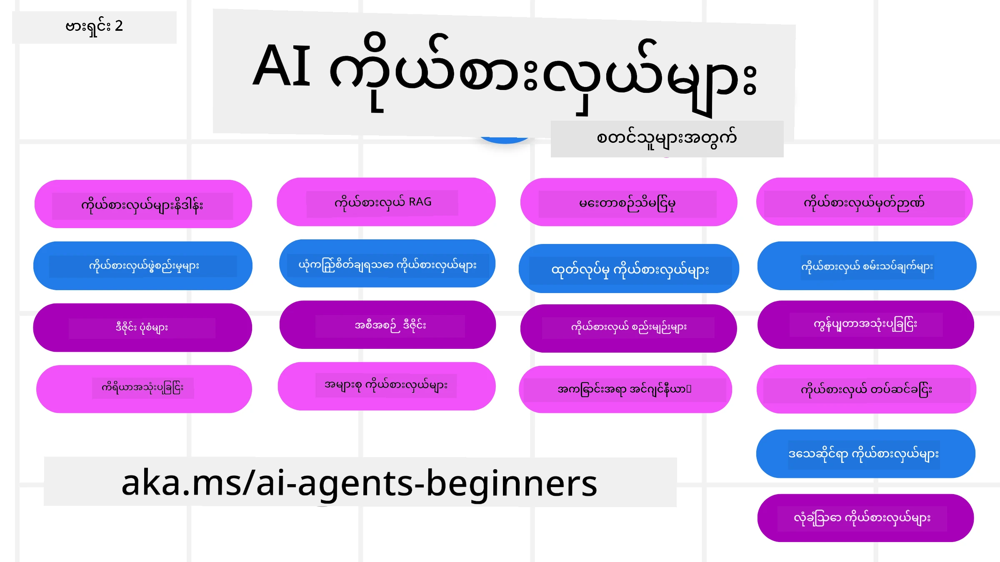

# AI Agents for Beginners - သင်ခန်းစာတစ်ခု



## AI Agents တည်ဆောက်ဖို့ စတင်ရန် လိုအပ်သမျှအားလုံးကို သင်ကြားပေးသော သင်ခန်းစာ

[](https://github.com/microsoft/ai-agents-for-beginners/blob/master/LICENSE?WT.mc_id=academic-105485-koreyst)
[](https://GitHub.com/microsoft/ai-agents-for-beginners/graphs/contributors/?WT.mc_id=academic-105485-koreyst)
[](https://GitHub.com/microsoft/ai-agents-for-beginners/issues/?WT.mc_id=academic-105485-koreyst)
[](https://GitHub.com/microsoft/ai-agents-for-beginners/pulls/?WT.mc_id=academic-105485-koreyst)
[](http://makeapullrequest.com?WT.mc_id=academic-105485-koreyst)

### 🌐 ဘာသာစကားအမျိုးမျိုးကို ထောက်ပံ့မှု

#### GitHub Action ဖြင့် ထောက်ပံ့ခြင်း (အလိုအလျောက် & အမြဲသစ်လွန်းထားခြင်း)

<!-- CO-OP TRANSLATOR LANGUAGES TABLE START -->
[Arabic](../ar/README.md) | [Bengali](../bn/README.md) | [Bulgarian](../bg/README.md) | [Burmese (Myanmar)](./README.md) | [Chinese (Simplified)](../zh-CN/README.md) | [Chinese (Traditional, Hong Kong)](../zh-HK/README.md) | [Chinese (Traditional, Macau)](../zh-MO/README.md) | [Chinese (Traditional, Taiwan)](../zh-TW/README.md) | [Croatian](../hr/README.md) | [Czech](../cs/README.md) | [Danish](../da/README.md) | [Dutch](../nl/README.md) | [Estonian](../et/README.md) | [Finnish](../fi/README.md) | [French](../fr/README.md) | [German](../de/README.md) | [Greek](../el/README.md) | [Hebrew](../he/README.md) | [Hindi](../hi/README.md) | [Hungarian](../hu/README.md) | [Indonesian](../id/README.md) | [Italian](../it/README.md) | [Japanese](../ja/README.md) | [Kannada](../kn/README.md) | [Khmer](../km/README.md) | [Korean](../ko/README.md) | [Lithuanian](../lt/README.md) | [Malay](../ms/README.md) | [Malayalam](../ml/README.md) | [Marathi](../mr/README.md) | [Nepali](../ne/README.md) | [Nigerian Pidgin](../pcm/README.md) | [Norwegian](../no/README.md) | [Persian (Farsi)](../fa/README.md) | [Polish](../pl/README.md) | [Portuguese (Brazil)](../pt-BR/README.md) | [Portuguese (Portugal)](../pt-PT/README.md) | [Punjabi (Gurmukhi)](../pa/README.md) | [Romanian](../ro/README.md) | [Russian](../ru/README.md) | [Serbian (Cyrillic)](../sr/README.md) | [Slovak](../sk/README.md) | [Slovenian](../sl/README.md) | [Spanish](../es/README.md) | [Swahili](../sw/README.md) | [Swedish](../sv/README.md) | [Tagalog (Filipino)](../tl/README.md) | [Tamil](../ta/README.md) | [Telugu](../te/README.md) | [Thai](../th/README.md) | [Turkish](../tr/README.md) | [Ukrainian](../uk/README.md) | [Urdu](../ur/README.md) | [Vietnamese](../vi/README.md)

> **ဒေသတွင်းမှာ Clone လုပ်ချင်ပါသလား?**
>
> ဒီ repository မှာ ဘာသာစကား ၅၀ ကျော်အတွက် ဘာသာပြန်ထားပြီး ဒါကြောင့် ဒေါင်းလုပ်အရေအတွက် အများကြီးသွားပါတယ်။ ဘာသာပြန်မပါဘဲ clone လုပ်ချင်ရင် sparse checkout ကို အသုံးပြုပါ:
>
> **Bash / macOS / Linux:**
> ```bash
> git clone --filter=blob:none --sparse https://github.com/microsoft/ai-agents-for-beginners.git
> cd ai-agents-for-beginners
> git sparse-checkout set --no-cone '/*' '!translations' '!translated_images'
> ```
>
> **CMD (Windows):**
> ```cmd
> git clone --filter=blob:none --sparse https://github.com/microsoft/ai-agents-for-beginners.git
> cd ai-agents-for-beginners
> git sparse-checkout set --no-cone "/*" "!translations" "!translated_images"
> ```
>
> ဒါက သင်ဤသင်ခန်းစာကို ပြီးမြောက်စွာ လေ့လာနိုင်ရန် လိုအပ်ချက်အားလုံးကို ပိုမြန်ဆန်တဲ့ ဒေါင်းလုပ်နဲ့ ပေးပါလိမ့်မယ်။
<!-- CO-OP TRANSLATOR LANGUAGES TABLE END -->

**အပိုဘာသာစကားများ ထောက်ပံ့လိုပါက [ဒီမှာ](https://github.com/Azure/co-op-translator/blob/main/getting_started/supported-languages.md) ဖတ်ရှုနိုင်ပါသည်။**

[](https://GitHub.com/microsoft/ai-agents-for-beginners/watchers/?WT.mc_id=academic-105485-koreyst)
[](https://GitHub.com/microsoft/ai-agents-for-beginners/network/?WT.mc_id=academic-105485-koreyst)
[](https://GitHub.com/microsoft/ai-agents-for-beginners/stargazers/?WT.mc_id=academic-105485-koreyst)

[](https://discord.gg/nTYy5BXMWG)


## 🌱 စတင်တက်ကြွခြင်း

ဒီသင်ခန်းစာမှာ AI Agents တည်ဆောက်ခြင်း၏ အခြေခံအချက်အလက်များကို သင်ခန်းစာတစ်ခုချင်းစီတွင် ဖော်ပြထားသည်။ သင်နှစ်သက်ရာ အခန်းကဏ္ဍမှာ စတင်လေ့လာနိုင်ပါသည်!

ဒီသင်ခန်းစာအတွက် ဘာသာစကားအမျိုးမျိုး ထောက်ပံ့ချက် ရှိသည်။ ကျွန်ုပ်တို့ရဲ့ [ရရှိနိုင်သော ဘာသာစကားများ](#-multi-language-support) ကို ကြည့်ပါ။

Generative AI မော်ဒယ်များဖြင့် ပထမဆုံးအကြိမ်တည်ဆောက်နေရင်တော့ ကျွန်ုပ်တို့ရဲ့ [Generative AI For Beginners](https://aka.ms/genai-beginners) သင်ခန်းစာကို လေ့လာပါ၊ ဤသင်ခန်းစာတွင် GenAI ဖြင့် တည်ဆောက်ခြင်းဆိုင်ရာ သင်ခန်းစာ ၂၁ ခု ပါဝင်သည်။

ဒီ repository ကို [ကြယ် မျက်နှာပြင် (🌟) နှိပ်ရန်](https://docs.github.com/en/get-started/exploring-projects-on-github/saving-repositories-with-stars?WT.mc_id=academic-105485-koreyst) နှင့် [fork လုပ်ရန်](https://github.com/microsoft/ai-agents-for-beginners/fork) မမေ့ပါနဲ့၊ ဒါမှ code ကို စမ်းသပ်နိုင်ပါမည်။

### အခြားသင်ယူသူများနှင့် တွေ့ဆုံပြီး မေးခွန်းများဖြေကြားပါ

AI Agents တည်ဆောက်ခြင်းတွင် အခက္ခဲကြုံခဲ့ရပါက သို့မဟုတ် မေးခွန်းများရှိပါက ကျွန်ုပ်တို့၏ သတ်မှတ်ထားသော Discord ချန်နယ်ကို [Microsoft Foundry Discord](https://aka.ms/ai-agents/discord) တွင် ဝင်ပါ။

### လိုအပ်သည့်အရာများ

ဒီသင်ခန်းစာရှိ အခန်းကျင်းတိုင်းတွင် code ဥပမာများ ပါဝင်ပြီး၊ code_samples ဖိုလ်ဒါတွင် ရှိသည်။ မိမိကိုယ်ပိုင် ကူးယူရန် [repository ကို fork လုပ်ပါ](https://github.com/microsoft/ai-agents-for-beginners/fork)။

ဒီအထောက်အထားများတွင် Microsoft Agent Framework နှင့် Azure AI Foundry Agent Service V2 ကို အသုံးပြုထားသည်-

- [Microsoft Foundry](https://aka.ms/ai-agents-beginners/ai-foundry) - Azure အကောင့် လိုအပ်သည်

ဒီသင်ခန်းစာတွင် Microsoft မှ ထောက်ပံ့ထားသော AI Agent frameworks နှင့် services များကို အသုံးပြုထားသည်-

- [Microsoft Agent Framework (MAF)](https://aka.ms/ai-agents-beginners/agent-framework)
- [Azure AI Foundry Agent Service V2](https://aka.ms/ai-agents-beginners/ai-agent-service)

အချို့သော code ဥပမာများသည် OpenAI နှင့် ကိုက်ညီသော နောက်ထပ် provider များ (ဥပမာ [MiniMax](https://platform.minimaxi.com/)) ကိုလည်း ထောက်ပံ့ပြီး၊ ၎င်းသည် သုညပေါင်း 204K အထိ မော်ဒယ်များကို ပံ့ပိုးပေးပါသည်။ ဖော်ပြချက်များအတွက် [Course Setup](./00-course-setup/README.md) ကို ကြည့်ပါ။

ဒီသင်ခန်းစာအတွက် code ပြေးခြင်းဆိုင်ရာ အသေးစိတ်အချက်အလက်များကို [Course Setup](./00-course-setup/README.md) မှာ ရွှေ့ပြောင်း ကြည့်ရှုနိုင်ပါသည်။

## 🙏 ကူညီလိုပါသလား?

အကြံပြုချက်များရှိပါသလား? စာလုံးပေါင်း အမှားများ သို့မဟုတ် code အမှားတွေတွေ့ရပါသလား? [issue တင်ပါ](https://github.com/microsoft/ai-agents-for-beginners/issues?WT.mc_id=academic-105485-koreyst) သို့မဟုတ် [pull request တစ်ခုဖန်တီးပါ](https://github.com/microsoft/ai-agents-for-beginners/pulls?WT.mc_id=academic-105485-koreyst)


## 📂 အခန်းတိုင်းတွင် ပါဝင်သောအရာများ

- README တွင် ရေးသားထားသော သင်ခန်းစာနှင့် အသေးစားဗွီဒီယိုတစ်ခု
- Microsoft Agent Framework နှင့် Azure AI Foundry ကို အသုံးပြုသော Python code ဥပမာများ
- သင်ယူမှုဆက်လက်လုပ်ဆောင်ရန် အပိုအရင်းအမြစ်များထံ ဖော်ပြချက်များ အလျောက်ရရှိနိုင်မှု


## 🗃️ သင်ခန်းစာများ

| **သင်ခန်းစာ**                                | **စာသားနှင့် Code**                                   | **ဗွီဒီယို**                                               | **အပိုသင်ယူမှု**                                                                      |
|----------------------------------------------|-------------------------------------------------------|-------------------------------------------------------------|----------------------------------------------------------------------------------------|
| AI Agents နှင့် Agent အသုံးပြုမှုများ ဝင်ရောက်ပြောဆိုခြင်း | [Link](./01-intro-to-ai-agents/README.md)               | [Video](https://youtu.be/3zgm60bXmQk?si=z8QygFvYQv-9WtO1)     | [Link](https://aka.ms/ai-agents-beginners/collection?WT.mc_id=academic-105485-koreyst)  |
| AI Agentic Framework များကို ရှာဖွေခြင်း           | [Link](./02-explore-agentic-frameworks/README.md)       | [Video](https://youtu.be/ODwF-EZo_O8?si=Vawth4hzVaHv-u0H)     | [Link](https://aka.ms/ai-agents-beginners/collection?WT.mc_id=academic-105485-koreyst)  |
| AI Agentic ဒီဇိုင်းပုံစံများနားလည်ခြင်း            | [Link](./03-agentic-design-patterns/README.md)          | [Video](https://youtu.be/m9lM8qqoOEA?si=BIzHwzstTPL8o9GF)     | [Link](https://aka.ms/ai-agents-beginners/collection?WT.mc_id=academic-105485-koreyst)  |
| စက်ပစ္စည်း အသုံးပြုမှု ဒီဇိုင်းပုံစံ                  | [Link](./04-tool-use/README.md)                         | [Video](https://youtu.be/vieRiPRx-gI?si=2z6O2Xu2cu_Jz46N)     | [Link](https://aka.ms/ai-agents-beginners/collection?WT.mc_id=academic-105485-koreyst)  |
| Agentic RAG                                   | [Link](./05-agentic-rag/README.md)                       | [Video](https://youtu.be/WcjAARvdL7I?si=gKPWsQpKiIlDH9A3)     | [Link](https://aka.ms/ai-agents-beginners/collection?WT.mc_id=academic-105485-koreyst)  |
| ယုံကြည်စိတ်ချရသော AI Agents တည်ဆောက်ခြင်း           | [Link](./06-building-trustworthy-agents/README.md)      | [Video](https://youtu.be/iZKkMEGBCUQ?si=jZjpiMnGFOE9L8OK )    | [Link](https://aka.ms/ai-agents-beginners/collection?WT.mc_id=academic-105485-koreyst)  |
| စီမံကိန်းရေးဆွဲခြင်း ဒီဇိုင်းပုံစံ                  | [Link](./07-planning-design/README.md)                  | [Video](https://youtu.be/kPfJ2BrBCMY?si=6SC_iv_E5-mzucnC)     | [Link](https://aka.ms/ai-agents-beginners/collection?WT.mc_id=academic-105485-koreyst)  |
| Multi-Agent ဒီဇိုင်းပုံစံ                            | [Link](./08-multi-agent/README.md)                      | [Video](https://youtu.be/V6HpE9hZEx0?si=rMgDhEu7wXo2uo6g)     | [Link](https://aka.ms/ai-agents-beginners/collection?WT.mc_id=academic-105485-koreyst)  |
| Metacognition စဉ်းစားသုံးသပ်မှု ဒီဇိုင်း ပုံစံ         | [Link](./09-metacognition/README.md)               | [Video](https://youtu.be/His9R6gw6Ec?si=8gck6vvdSNCt6OcF)  | [Link](https://aka.ms/ai-agents-beginners/collection?WT.mc_id=academic-105485-koreyst) |
| ထုတ်လုပ်မှုသုံး AI အေးဂျင့်များ                      | [Link](./10-ai-agents-production/README.md)        | [Video](https://youtu.be/l4TP6IyJxmQ?si=31dnhexRo6yLRJDl)  | [Link](https://aka.ms/ai-agents-beginners/collection?WT.mc_id=academic-105485-koreyst) |
| Agentic Protocols (MCP, A2A နှင့် NLWeb) အသုံးပြုခြင်း    | [Link](./11-agentic-protocols/README.md)           | [Video](https://youtu.be/X-Dh9R3Opn8)                                 | [Link](https://aka.ms/ai-agents-beginners/collection?WT.mc_id=academic-105485-koreyst) |
| AI အေးဂျင့်များအတွက် စာမျက်နှာတည်ဆောက်ခြင်း               | [Link](./12-context-engineering/README.md)         | [Video](https://youtu.be/F5zqRV7gEag)                                 | [Link](https://aka.ms/ai-agents-beginners/collection?WT.mc_id=academic-105485-koreyst) |
| Agentic မှတ်ဉာဏ် စီမံခန့်ခွဲခြင်း                  | [Link](./13-agent-memory/README.md)     |      [Video](https://youtu.be/QrYbHesIxpw?si=vZkVwKrQ4ieCcIPx)                                                      |                                                                                        |
| Microsoft Agent Framework ကို ရှာဖွေခြင်း                     | [Link](./14-microsoft-agent-framework/README.md)                            |                                                            |                                                                                        |
| ကွန်ပျူတာ အသုံးပြု အေးဂျင့်များ (CUA) တည်ဆောက်ခြင်း    | [Link](./15-browser-use/README.md)     |                                                            | [Link](https://docs.browser-use.com/examples/templates/playwright-integration)         |
| Scalable Agents တပ်ဆင်ခြင်း                          | မကြာမီ ရရှိတော့မည်                          |                                                            |                                                                                        |
| ဒေသတွင်း AI အေးဂျင့်များ ဖန်တီးခြင်း                  | မကြာမီ ရရှိတော့မည်                               |                                                            |                                                                                        |
| AI Agents များ လုံခြုံစွာ ထိန်းသိမ်းခြင်း               | [Link](./18-securing-ai-agents/README.md)  |                                                            | [Link](https://aka.ms/ai-agents-beginners/collection?WT.mc_id=academic-105485-koreyst) |

## 🎒 အခြား သင်တန်းများ

အဖွဲ့သားများက အခြား သင်တန်းများလည်း ထုတ်လုပ်နေပါသည်! ကြည့်ရှုပါ -

<!-- CO-OP TRANSLATOR OTHER COURSES START -->
### LangChain
[](https://aka.ms/langchain4j-for-beginners)
[](https://aka.ms/langchainjs-for-beginners?WT.mc_id=m365-94501-dwahlin)
[](https://github.com/microsoft/langchain-for-beginners?WT.mc_id=m365-94501-dwahlin)
---

### Azure / Edge / MCP / Agents
[](https://github.com/microsoft/AZD-for-beginners?WT.mc_id=academic-105485-koreyst)
[](https://github.com/microsoft/edgeai-for-beginners?WT.mc_id=academic-105485-koreyst)
[](https://github.com/microsoft/mcp-for-beginners?WT.mc_id=academic-105485-koreyst)
[](https://github.com/microsoft/ai-agents-for-beginners?WT.mc_id=academic-105485-koreyst)

---
 
### Generative AI Series
[](https://github.com/microsoft/generative-ai-for-beginners?WT.mc_id=academic-105485-koreyst)
[-9333EA?style=for-the-badge&labelColor=E5E7EB&color=9333EA)](https://github.com/microsoft/Generative-AI-for-beginners-dotnet?WT.mc_id=academic-105485-koreyst)
[-C084FC?style=for-the-badge&labelColor=E5E7EB&color=C084FC)](https://github.com/microsoft/generative-ai-for-beginners-java?WT.mc_id=academic-105485-koreyst)
[-E879F9?style=for-the-badge&labelColor=E5E7EB&color=E879F9)](https://github.com/microsoft/generative-ai-with-javascript?WT.mc_id=academic-105485-koreyst)

---
 
### Core Learning
[](https://aka.ms/ml-beginners?WT.mc_id=academic-105485-koreyst)
[](https://aka.ms/datascience-beginners?WT.mc_id=academic-105485-koreyst)
[](https://aka.ms/ai-beginners?WT.mc_id=academic-105485-koreyst)
[](https://github.com/microsoft/Security-101?WT.mc_id=academic-96948-sayoung)
[](https://aka.ms/webdev-beginners?WT.mc_id=academic-105485-koreyst)
[](https://aka.ms/iot-beginners?WT.mc_id=academic-105485-koreyst)
[](https://github.com/microsoft/xr-development-for-beginners?WT.mc_id=academic-105485-koreyst)

---
 
### Copilot Series
[](https://aka.ms/GitHubCopilotAI?WT.mc_id=academic-105485-koreyst)
[](https://github.com/microsoft/mastering-github-copilot-for-dotnet-csharp-developers?WT.mc_id=academic-105485-koreyst)
[](https://github.com/microsoft/CopilotAdventures?WT.mc_id=academic-105485-koreyst)
<!-- CO-OP TRANSLATOR OTHER COURSES END -->

## 🌟 အသိုင်းအဝိုင်း ကျေးဇူးတင်ပါတယ်

Agentic RAG ကို ပြသသည့် အရေးပါသော ကုဒ်နမူနာများ ထည့်သွင်းပေးသော [Shivam Goyal](https://www.linkedin.com/in/shivam2003/) ကို ကျေးဇူးတင်ပါတယ်။

## ပါဝင်ဆောင်ရွက်ခြင်း

ဤပရောဂျက်သည် ပါဝင်ဆောင်ရွက်ခြင်းများနှင့် အကြံပြုချက်များကို ကြိုဆိုပါသည်။ အများဆုံး ပါဝင်ဆောင်ရွက်မှုများတွင် သင်သည် ထောက်ခံချက်စာချုပ် (Contributor License Agreement - CLA) သို့ သဘောတူညီရမည်ဖြစ်ပြီး၊ သင့် ပံ့ပိုးမှုကို အသုံးပြုခွင့်ပေးထားကြောင်း မှန်ကန်စွာ ရှိပါသည်။ အသေးစိတ်အချက်အလက်များအတွက် <https://cla.opensource.microsoft.com> တွင် ကြည့်ရှုနိုင်ပါသည်။

သင်ပြုလုပ်မည့် pull request တင်သွင်းသောအခါ CLA bot သည် သင့်အား CLA လိုအပ်မလိုအပ်ကို သတ်မှတ်ပြီး PR ကို ပြင်ဆင်ပေးမည်ဖြစ်သည် (ဥပမာ - အခြေအနေ စစ်ဆေးခြင်း၊ မှတ်ချက်)။ bot မှ ပေးထားသော ညွှန်ကြားချက်များကို လိုက်နာပါ။ CLA သည် မည်သည့်repo မဆို တစ်ကြိမ်တည်းသာ လိုအပ်သည်။

ဤပရောဂျက်သည် [Microsoft Open Source Code of Conduct](https://opensource.microsoft.com/codeofconduct/) ကို လက်ခံအသုံးပြုထားသည်။ ပိုမိုသိရှိလိုပါက [Code of Conduct FAQ](https://opensource.microsoft.com/codeofconduct/faq/) သို့မဟုတ် [opencode@microsoft.com](mailto:opencode@microsoft.com) သို့ ဆက်သွယ်နိုင်ပါသည်။

## စာချုပ်အမှတ်တံဆိပ်များ

ဤပရောဂျက်တွင် စာချုပ်အမှတ်တံဆိပ်များ သို့မဟုတ် လိုဂိုများ ပါဝင်နိုင်ပါသည်။ Microsoft ၏ စာချုပ်အမှတ်တံဆိပ်များ သို့မဟုတ် လိုဂိုများကို သတ်မှတ်ထားသော အသုံးပြုခွင့်သည် [Microsoft ၏ စာချုပ်အမှတ်တံဆိပ်နှင့် အမှတ်တံဆိပ် လမ်းညွှန်ချက်များ](https://www.microsoft.com/legal/intellectualproperty/trademarks/usage/general) ကို လိုက်နာရမည်ဖြစ်သည်။ Microsoft စာချုပ်အမှတ်တံဆိပ်များ သို့မဟုတ် လိုဂိုများကို ဒီပရောဂျက်အတွက် ပြင်ဆင်ထားသည့် ဗားရှင်းများတွင် အသုံးပြုခြင်းသည် ရောထွေးမှုဖြစ်ခြင်း သို့မဟုတ် Microsoft ၏ ချစ်ကြည်မှုကို ယူဆစေခြင်း မဖြစ်စေရန် ဖြစ်ရပါမည်။ တတိယကိစ္စ၏ စာချုပ်အမှတ်တံဆိပ်များ သို့မဟုတ် လိုဂိုများကို အသုံးပြုမှုသည် ထိုတတိယများ၏ မူဝါဒများအတွင်း ဖြစ်ရမည်။

## အကူအညီတောင်းများ

အကူအညီလိုအပ်ပါက သို့မဟုတ် AI အက်ပ်များ ဖန်တီးရာတွင် မေးခွန်းများရှိပါက:

[](https://aka.ms/foundry/discord)

ထုတ်ကုန်တုံ့ပြန်ချက်များ သို့မဟုတ် တည်ဆောက်ခြင်းအတွင်း အမှားများရှိပါက:

[](https://aka.ms/foundry/forum)

---

<!-- CO-OP TRANSLATOR DISCLAIMER START -->
**ပြောကြားချက်**
ဤစာတမ်းကို AI ဘာသာပြန်ဝန်ဆောင်မှု [Co-op Translator](https://github.com/Azure/co-op-translator) အသုံးပြု၍ ဘာသာပြန်ထားပါသည်။ ကျွန်ုပ်တို့သည် တိကျမှန်ကန်မှုအတွက် ကြိုးပမ်းနေသော်လည်း၊ စက်ကိရိယာဘာသာပြန်ခြင်းများတွင် အမှားများ သို့မဟုတ် မှားယွင်းချက်များ ပါဝင်နိုင်ကြောင်း သတိပြုပါရန် လိုအပ်ပါသည်။ မူလစာတမ်းကို မူရင်းဘာသာဖြင့်သာ ယုံကြည်စိတ်ချရသော အချက်အလက်အဖြစ် သတ်မှတ်သင့်သည်။ အရေးကြီးသည့် သတင်းအချက်အလက်များအတွက် ပရော်ဖက်ရှင်နယ် လူသားဘာသာပြန်သူဝန်ဆောင်မှုကို အကြံပြုပါသည်။ ဤဘာသာပြန်ချက်ကို အသုံးပြုခြင်းမှ ဖြစ်ပေါ်လာသော နားလည်မှုကွာခြားမှုများ သို့မဟုတ် မမှန်ကန်သော အသုံးပြုမှုများအတွက် ကျွန်ုပ်တို့ တာဝန်မခံပါ။
<!-- CO-OP TRANSLATOR DISCLAIMER END -->