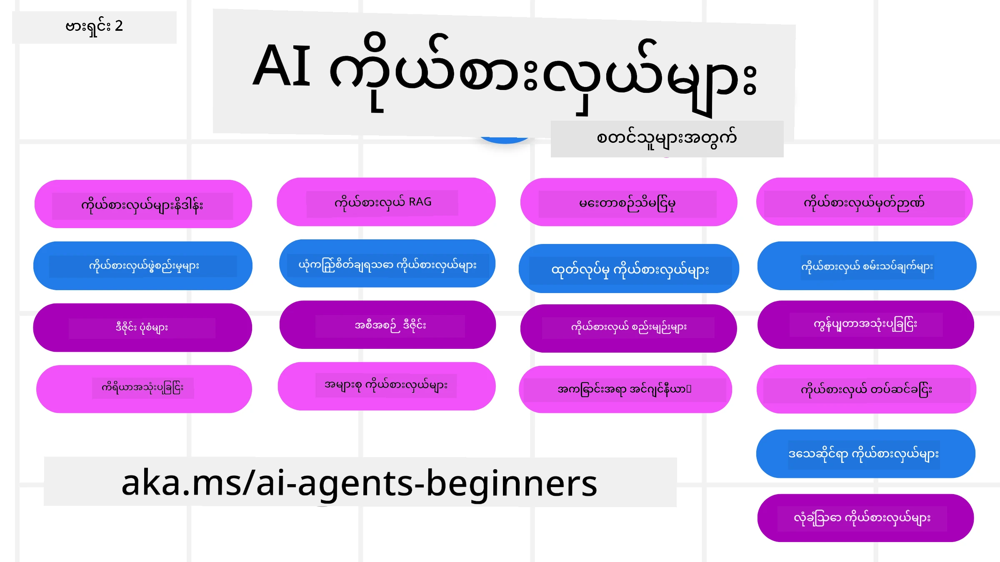

# AI Agent များအတွက် စတင်လေ့လာသူများ - သင်တန်း



## AI Agent များ တည်ဆောက်ခြင်းကို စတင်လုပ်ဆောင်ရန် လိုအပ်သမျှ အရာအားလုံးကို သင်ကြားပေးသော သင်တန်း

[](https://github.com/microsoft/ai-agents-for-beginners/blob/master/LICENSE?WT.mc_id=academic-105485-koreyst)
[](https://GitHub.com/microsoft/ai-agents-for-beginners/graphs/contributors/?WT.mc_id=academic-105485-koreyst)
[](https://GitHub.com/microsoft/ai-agents-for-beginners/issues/?WT.mc_id=academic-105485-koreyst)
[](https://GitHub.com/microsoft/ai-agents-for-beginners/pulls/?WT.mc_id=academic-105485-koreyst)
[](http://makeapullrequest.com?WT.mc_id=academic-105485-koreyst)

### 🌐 ဘာသာစကားများစွာ ထောက်ခံမှု

#### GitHub Action မှ တဆင့် ထောက်ခံထားသည် (အလိုအလျောက်နှင့် အမြဲတမ်းနောက်ဆုံးရရှိမှု)

<!-- CO-OP TRANSLATOR LANGUAGES TABLE START -->
[Arabic](../ar/README.md) | [Bengali](../bn/README.md) | [Bulgarian](../bg/README.md) | [Burmese (Myanmar)](./README.md) | [Chinese (Simplified)](../zh-CN/README.md) | [Chinese (Traditional, Hong Kong)](../zh-HK/README.md) | [Chinese (Traditional, Macau)](../zh-MO/README.md) | [Chinese (Traditional, Taiwan)](../zh-TW/README.md) | [Croatian](../hr/README.md) | [Czech](../cs/README.md) | [Danish](../da/README.md) | [Dutch](../nl/README.md) | [Estonian](../et/README.md) | [Finnish](../fi/README.md) | [French](../fr/README.md) | [German](../de/README.md) | [Greek](../el/README.md) | [Hebrew](../he/README.md) | [Hindi](../hi/README.md) | [Hungarian](../hu/README.md) | [Indonesian](../id/README.md) | [Italian](../it/README.md) | [Japanese](../ja/README.md) | [Kannada](../kn/README.md) | [Khmer](../km/README.md) | [Korean](../ko/README.md) | [Lithuanian](../lt/README.md) | [Malay](../ms/README.md) | [Malayalam](../ml/README.md) | [Marathi](../mr/README.md) | [Nepali](../ne/README.md) | [Nigerian Pidgin](../pcm/README.md) | [Norwegian](../no/README.md) | [Persian (Farsi)](../fa/README.md) | [Polish](../pl/README.md) | [Portuguese (Brazil)](../pt-BR/README.md) | [Portuguese (Portugal)](../pt-PT/README.md) | [Punjabi (Gurmukhi)](../pa/README.md) | [Romanian](../ro/README.md) | [Russian](../ru/README.md) | [Serbian (Cyrillic)](../sr/README.md) | [Slovak](../sk/README.md) | [Slovenian](../sl/README.md) | [Spanish](../es/README.md) | [Swahili](../sw/README.md) | [Swedish](../sv/README.md) | [Tagalog (Filipino)](../tl/README.md) | [Tamil](../ta/README.md) | [Telugu](../te/README.md) | [Thai](../th/README.md) | [Turkish](../tr/README.md) | [Ukrainian](../uk/README.md) | [Urdu](../ur/README.md) | [Vietnamese](../vi/README.md)

> ** ဒေသဆိုင်ရာ မိတ္တူယူ၍ လေ့လာလိုပါသလား?**
>
> ဤ repository တွင် ဘာသာစကား ၅၀ ကျော်အတွက် ဘာသာပြန်ထောက်ခံမှုရှိသည့်ကြောင့် ဒေါင်းလုပ်ဖိုင် အရွယ်အစား ပြီးခဲ့ပါသည်။ ဘာသာပြန်များ မပါဘဲ မိတ္တူယူရန် sparse checkout ကို အသုံးပြုပါ:
>
> **Bash / macOS / Linux:**
> ```bash
> git clone --filter=blob:none --sparse https://github.com/microsoft/ai-agents-for-beginners.git
> cd ai-agents-for-beginners
> git sparse-checkout set --no-cone '/*' '!translations' '!translated_images'
> ```
>
> **CMD (Windows):**
> ```cmd
> git clone --filter=blob:none --sparse https://github.com/microsoft/ai-agents-for-beginners.git
> cd ai-agents-for-beginners
> git sparse-checkout set --no-cone "/*" "!translations" "!translated_images"
> ```
>
> သင်တန်းတက်ရောက်ခြင်းကို ပိုမိုမြန်ဆန်စွာ ပြီးမြောက်စေရန် လိုအပ်သမျှ အရာအားလုံးကို ယခုနည်းဖြင့် ရယူနိုင်ပါသည်။
<!-- CO-OP TRANSLATOR LANGUAGES TABLE END -->

**အကယ်၍ သင်ထပ်မံဘာသာပြန်ရန်လိုအပ်သော ဘာသာစကားများရှိလျှင် [ဒီမှာ](https://github.com/Azure/co-op-translator/blob/main/getting_started/supported-languages.md) တွင် ဖော်ပြထားပါသည်။**

[](https://GitHub.com/microsoft/ai-agents-for-beginners/watchers/?WT.mc_id=academic-105485-koreyst)
[](https://GitHub.com/microsoft/ai-agents-for-beginners/network/?WT.mc_id=academic-105485-koreyst)
[](https://GitHub.com/microsoft/ai-agents-for-beginners/stargazers/?WT.mc_id=academic-105485-koreyst)

[](https://discord.com/invite/ATgtXmAS5D)


## 🌱 စတင်ရန်

ဤသင်တန်းတွင် AI Agent များ တည်ဆောက်ခြင်း အခြေခံ စွမ်းရည်များ များပါရှိသည်။ သင်တန်းတစ်ခုချင်းစီတွင် မိမိစိတ်ကြိုက် အကြောင်းအရာကို စတင်လေ့လာနိုင်ပါသည်။

ဒီသင်တန်းတွင် ဘာသာစကားများစွာကို ထောက်ခံထားသည်။ ကျွန်ုပ်တို့၏ [ရရှိနိုင်သော ဘာသာစကားများ](#-multi-language-support) သို့ သွားရောက်ကြည့်ရှုနိုင်ပါသည်။

သင်သည် Generative AI မော်ဒယ်များဖြင့် ပထမဆုံးတည်ဆောက်ခြင်းဖြစ်ပါက ကျွန်ုပ်တို့၏ [Generative AI For Beginners](https://aka.ms/genai-beginners) သင်တန်းကို ကြည့်ရှုပါ၊ ၎င်းတွင် GenAI ဖြင့် တည်ဆောက်ခြင်းအကြောင်း သင်ခန်းစာ ၂၁ ခု ပါရှိသည်။

ဤ repo ကို [ကြယ်ပွင့် (🌟) ပေးရန်မမေ့ပါနှင့်](https://docs.github.com/en/get-started/exploring-projects-on-github/saving-repositories-with-stars?WT.mc_id=academic-105485-koreyst) နှင့် ကုဒ်များကို လည်ပတ်ရန် [repo ကို fork လုပ်ပါ](https://github.com/microsoft/ai-agents-for-beginners/fork)။

### အခြား ကျောင်းသားများနှင့် တွေ့ဆုံ၊ မေးခွန်းများကို ဖြေကြားကြပါစို့

သင် AI Agent များတည်ဆောက်ရာတွင် အခက်အခဲတက်ပါက သို့မဟုတ် မေးခွန်းများရှိပါက ကျွန်ုပ်တို့၏ [Microsoft Foundry Discord](https://aka.ms/ai-agents/discord) တွင် ရှိသည့် အထူး Discord Channel တွင် ပါဝင်ဆွေးနွေးနိုင်ပါသည်။

### လိုအပ်သောအရာများ

ဤသင်တန်းရှိ သင်ခန်းစာတိုင်းတွင် ကုဒ်နမူနာများ ပါ၀င်ပြီး၊ ၎င်းတို့ကို code_samples ဖိုင်တွဲ၌ ရှာဖွေနိုင်သည်။ သင်၎င်းကို [repo ကို fork လုပ်၍](https://github.com/microsoft/ai-agents-for-beginners/fork) မိမိ၏ မိတ္တူကို ဖန်တီးနိုင်သည်။

ဤလေ့ကျင့်ခန်းခွဲများရှိ ကုဒ်နမူနာများတွင် Microsoft Agent Framework နဲ့ Microsoft Foundry Agent Service V2 ကို အသုံးပြုထားသည်။

- [Microsoft Foundry](https://aka.ms/ai-agents-beginners/ai-foundry) - Azure အကောင့်လိုအပ်သည်

ဤသင်တန်းတွင် Microsoft မှ AI Agent frameworks နှင့် service များကို အသုံးပြုသည်-

- [Microsoft Agent Framework (MAF)](https://aka.ms/ai-agents-beginners/agent-framework)
- [Microsoft Foundry Agent Service V2](https://aka.ms/ai-agents-beginners/ai-agent-service)

အချို့ ကုဒ်နမူနာများတွင် ထပ်တူ OpenAI-ယှဉ်မှု ဆိုင်ရာ ပံ့ပိုးသူများဖြစ်သည့် [MiniMax](https://platform.minimaxi.com/) ကဲ့သို့ စာလုံးအတောအတွင်းကြီးမြင့်သော မော်ဒယ်များ(၂၀၄K tokens ထိ)ကို ရရှိနိုင်သည်။ ကွန်ဖစ်ဂျူရေးရှင်းအသေးစိတ်အတွက် [Course Setup](./00-course-setup/README.md) ကို ကြည့်ရှုပါ။

ဤသင်တန်းအတွက် ကုဒ်ပြုလုပ်မှုအသေးစိတ် များအတွက် [Course Setup](./00-course-setup/README.md) သို့ ဝင်ကြည့်ပါ။

## 🙏 ကူညီလိုပါသလား?

သင်အကြံပြုချက်ရှိပါက သို့မဟုတ် စာလုံးမှားနှင့် ကုဒ်မှားတွေ တွေ့ရှိခဲ့ပါက [issue တင်ပါ](https://github.com/microsoft/ai-agents-for-beginners/issues?WT.mc_id=academic-105485-koreyst) သို့မဟုတ် [pull request ဖန်တီးပါ](https://github.com/microsoft/ai-agents-for-beginners/pulls?WT.mc_id=academic-105485-koreyst)


## 📂 သင်ခန်းစာတိုင်း၌ ပါဝင်သည့်အရာများ

- README တွင်ရေးသားထားသော သင်ခန်းစာနှင့် အတိုချုပ် ဗီဒီယို
- Microsoft Agent Framework နှင့် Microsoft Foundry ကို အသုံးပြုသော Python ကုဒ်နမူနာများ
- သင်ကြားမှုဆက်လက်လုပ်ဆောင်နိုင်ရန် အပို ရင်းမြစ်များ၏ လင့်များ


## 🗃️ သင်ခန်းစာများ

| **သင်ခန်းစာ**                                   | **စာသားနှင့် ကုဒ်များ**                              | **ဗီဒီယို**                                                 | **အပို လေ့လာမှု**                                                                    |
|----------------------------------------------|----------------------------------------------------|------------------------------------------------------------|----------------------------------------------------------------------------------------|
| AI Agents နှင့် Agent အသုံးပြုမှုများ အခြေခံ        | [လင့်](./01-intro-to-ai-agents/README.md)               | [ဗီဒီယို](https://youtu.be/3zgm60bXmQk?si=z8QygFvYQv-9WtO1) | [လင့်](https://aka.ms/ai-agents-beginners/collection?WT.mc_id=academic-105485-koreyst)  |
| AI Agentic Framework များ လေ့လာခြင်း                 | [လင့်](./02-explore-agentic-frameworks/README.md)        | [ဗီဒီယို](https://youtu.be/ODwF-EZo_O8?si=Vawth4hzVaHv-u0H) | [လင့်](https://aka.ms/ai-agents-beginners/collection?WT.mc_id=academic-105485-koreyst)  |
| AI Agentic ဒီဇိုင်း ပုံစံများ နားလည်ခြင်း               | [လင့်](./03-agentic-design-patterns/README.md)           | [ဗီဒီယို](https://youtu.be/m9lM8qqoOEA?si=BIzHwzstTPL8o9GF) | [လင့်](https://aka.ms/ai-agents-beginners/collection?WT.mc_id=academic-105485-koreyst)  |
| Tool Use ဒီဇိုင်း ပုံစံ                             | [လင့်](./04-tool-use/README.md)                          | [ဗီဒီယို](https://youtu.be/vieRiPRx-gI?si=2z6O2Xu2cu_Jz46N) | [လင့်](https://aka.ms/ai-agents-beginners/collection?WT.mc_id=academic-105485-koreyst)  |
| Agentic RAG                                      | [လင့်](./05-agentic-rag/README.md)                       | [ဗီဒီယို](https://youtu.be/WcjAARvdL7I?si=gKPWsQpKiIlDH9A3) | [လင့်](https://aka.ms/ai-agents-beginners/collection?WT.mc_id=academic-105485-koreyst)  |
| ယုံကြည်စိတ်ချရသော AI Agent များ တည်ဆောက်ခြင်း         | [လင့်](./06-building-trustworthy-agents/README.md)       | [ဗီဒီယို](https://youtu.be/iZKkMEGBCUQ?si=jZjpiMnGFOE9L8OK ) | [လင့်](https://aka.ms/ai-agents-beginners/collection?WT.mc_id=academic-105485-koreyst)  |
| Planning ဒီဇိုင်း ပုံစံ                            | [လင့်](./07-planning-design/README.md)                   | [ဗီဒီယို](https://youtu.be/kPfJ2BrBCMY?si=6SC_iv_E5-mzucnC) | [လင့်](https://aka.ms/ai-agents-beginners/collection?WT.mc_id=academic-105485-koreyst)  |
| Multi-Agent ဒီဇိုင်း ပုံစံ                         | [လင့်](./08-multi-agent/README.md)                       | [ဗီဒီယို](https://youtu.be/V6HpE9hZEx0?si=rMgDhEu7wXo2uo6g) | [လင့်](https://aka.ms/ai-agents-beginners/collection?WT.mc_id=academic-105485-koreyst)  |

| Metacognition Design Pattern                 | [Link](./09-metacognition/README.md)               | [Video](https://youtu.be/His9R6gw6Ec?si=8gck6vvdSNCt6OcF)  | [Link](https://aka.ms/ai-agents-beginners/collection?WT.mc_id=academic-105485-koreyst) |
| AI Agents in Production                      | [Link](./10-ai-agents-production/README.md)        | [Video](https://youtu.be/l4TP6IyJxmQ?si=31dnhexRo6yLRJDl)  | [Link](https://aka.ms/ai-agents-beginners/collection?WT.mc_id=academic-105485-koreyst) |
| Using Agentic Protocols (MCP, A2A and NLWeb) | [Link](./11-agentic-protocols/README.md)           | [Video](https://youtu.be/X-Dh9R3Opn8)                                 | [Link](https://aka.ms/ai-agents-beginners/collection?WT.mc_id=academic-105485-koreyst) |
| Context Engineering for AI Agents            | [Link](./12-context-engineering/README.md)         | [Video](https://youtu.be/F5zqRV7gEag)                                 | [Link](https://aka.ms/ai-agents-beginners/collection?WT.mc_id=academic-105485-koreyst) |
| Managing Agentic Memory                      | [Link](./13-agent-memory/README.md)     |      [Video](https://youtu.be/QrYbHesIxpw?si=vZkVwKrQ4ieCcIPx)                                                      |                                                                                        |
| Exploring Microsoft Agent Framework                         | [Link](./14-microsoft-agent-framework/README.md)                            |                                                            |                                                                                        |
| Building Computer Use Agents (CUA)           | [Link](./15-browser-use/README.md)     |                                                            | [Link](https://docs.browser-use.com/examples/templates/playwright-integration)         |
| Deploying Scalable Agents                    | လာမည့်အချိန်တွင်                            |                                                            |                                                                                        |
| Creating Local AI Agents                     | လာမည့်အချိန်တွင်                               |                                                            |                                                                                        |
| Securing AI Agents                           | [Link](./18-securing-ai-agents/README.md)  |                                                            | [Link](https://aka.ms/ai-agents-beginners/collection?WT.mc_id=academic-105485-koreyst) |

## 🎒 အခြားသင်တန်းများ

ကျွန်ုပ်တို့အဖွဲ့သည် အခြားသင်တန်းများကို ထုတ်လုပ်ပေးပါသည်။ ကြည့်ရှုပါ:

<!-- CO-OP TRANSLATOR OTHER COURSES START -->
### LangChain
[](https://aka.ms/langchain4j-for-beginners)
[](https://aka.ms/langchainjs-for-beginners?WT.mc_id=m365-94501-dwahlin)
[](https://github.com/microsoft/langchain-for-beginners?WT.mc_id=m365-94501-dwahlin)
---

### Azure / Edge / MCP / Agents
[](https://github.com/microsoft/AZD-for-beginners?WT.mc_id=academic-105485-koreyst)
[](https://github.com/microsoft/edgeai-for-beginners?WT.mc_id=academic-105485-koreyst)
[](https://github.com/microsoft/mcp-for-beginners?WT.mc_id=academic-105485-koreyst)
[](https://github.com/microsoft/ai-agents-for-beginners?WT.mc_id=academic-105485-koreyst)

---
 
### Generative AI Series
[](https://github.com/microsoft/generative-ai-for-beginners?WT.mc_id=academic-105485-koreyst)
[-9333EA?style=for-the-badge&labelColor=E5E7EB&color=9333EA)](https://github.com/microsoft/Generative-AI-for-beginners-dotnet?WT.mc_id=academic-105485-koreyst)
[-C084FC?style=for-the-badge&labelColor=E5E7EB&color=C084FC)](https://github.com/microsoft/generative-ai-for-beginners-java?WT.mc_id=academic-105485-koreyst)

[-E879F9?style=for-the-badge&labelColor=E5E7EB&color=E879F9)](https://github.com/microsoft/generative-ai-with-javascript?WT.mc_id=academic-105485-koreyst)

---
 
### အခြေခံသင်ယူမှု
[](https://aka.ms/ml-beginners?WT.mc_id=academic-105485-koreyst)
[](https://aka.ms/datascience-beginners?WT.mc_id=academic-105485-koreyst)
[](https://aka.ms/ai-beginners?WT.mc_id=academic-105485-koreyst)
[](https://github.com/microsoft/Security-101?WT.mc_id=academic-96948-sayoung)
[](https://aka.ms/webdev-beginners?WT.mc_id=academic-105485-koreyst)
[](https://aka.ms/iot-beginners?WT.mc_id=academic-105485-koreyst)
[](https://github.com/microsoft/xr-development-for-beginners?WT.mc_id=academic-105485-koreyst)

---
 
### Copilot စီးရီးများ
[](https://aka.ms/GitHubCopilotAI?WT.mc_id=academic-105485-koreyst)
[](https://github.com/microsoft/mastering-github-copilot-for-dotnet-csharp-developers?WT.mc_id=academic-105485-koreyst)
[](https://github.com/microsoft/CopilotAdventures?WT.mc_id=academic-105485-koreyst)
<!-- CO-OP TRANSLATOR OTHER COURSES END -->

## 🌟 အသိုင်းအဝိုင်း၏ ကျေးဇူးတင်ခြင်း

Agentic RAG ကိုဖော်ပြသည့် အရေးကြီးသောကုဒ်နမူနာများကို ပေးအပ်ခဲ့သော [Shivam Goyal](https://www.linkedin.com/in/shivam2003/) သို့ ကျေးဇူးတင်ပါသည်။

## အထောက်အပံ့ပေးခြင်း

ဤပရောဂျက်သည် အထောက်အပံ့များနှင့် အကြံပြုချက်များကို ကြိုဆိုပါသည်။  များသောအားဖြင့် အထောက်အပံ့များအတွက် သင်သည်
ကိုင်တွယ်မှု လိုင်စင် သဘောတူစာချုပ် (CLA) သို့ သဘောတူရပါမည်၊ ၎င်းသည် သင်မှာ သင်၏ အထောက်အပံ့ကို အသုံးပြုခွင့်ရှိပြီး မှန်ကန်စွာ မှပေးသည်ဟု ကြေညာခြင်း ဖြစ်သည်။
အသေးစိတ်အတွက် <https://cla.opensource.microsoft.com> ကို လည်ပတ်ကြည့်ရှုပါ။

သင်သည် pull request တင်သည့်အခါ၊ CLA bot သည် CLA တောင်းဆိုခြင်း လိုအပ်မှုရှိ/မရှိကို အလိုအလျောက်ဆုံးဖြတ်ပြီး ထို PR ကို သင့်တော်သည့် နည်းဖြင့် အလှဆင်ပါလိမ့်မည် (ဥပမာ- အခြေအနေ စစ်ဆေးခြင်း၊ မှတ်ချက်)။
Bot မှ ပေးသော ညွှန်ကြားချက်များကို လိုက်နာပါ။ သင်သည် ကျွန်ုပ်တို့၏ CLA ကို အသုံးပြုသည့် Repo များ အားလုံးအတွင်း တစ်ခါတည်းသာ ဒီလုပ်ငန်းစဉ်ကို လုပ်အောင် လုပ်ရပါမည်။


ပိုမိုသိရှိလိုပါက [Code of Conduct FAQ](https://opensource.microsoft.com/codeofconduct/faq/) ကို ကြည့်ရှုပါ သို့မဟုတ်
[opencode@microsoft.com](mailto:opencode@microsoft.com) သို့ မေးခွန်းများ သို့မဟုတ် တုံ့ပြန်ချက်များပို့ပါ။


## ကုန်သွယ်မှုအမှတ်တံဆိပ်များ

ဤပရောဂျက်တွင် ပရောဂျက်များ၊ ထုတ်ကုန်များ သို့မဟုတ် ဝန်ဆောင်မှုများအတွက် ကုန်သွယ်မှုအမှတ်တံဆိပ်များ သို့မဟုတ် အမှတ်တံဆိပ်များ ပါရှိနိုင်သည်။ Microsoft ၏
ကုန်သွယ်မှုအမှတ်တံဆိပ်များ သို့မဟုတ် အမှတ်တံဆိပ်များကို အသုံးပြုခြင်းသည်
[Microsoft ၏ ကုန်သွယ်မှုအမှတ်တံဆိပ်နှင့် အမှတ်တံဆိပ်လမ်းညွှန်များ](https://www.microsoft.com/legal/intellectualproperty/trademarks/usage/general) သို့ ကိုက်ညီနေရမည်။
ဤပရောဂျက်၏ ပြင်ဆင်ထားသည့် ဗားရှင်းများတွင် Microsoft ၏ ကုန်သွယ်မှုအမှတ်တံဆိပ်များ သို့မဟုတ် အမှတ်တံဆိပ်များကို အသုံးပြုခြင်းဖြင့် ရောနှောမှုဖြစ်ပေါ်စေရေး သို့မဟုတ် Microsoft ကြီးကြပ်မှု ရှိသည့်အဖြစ် သို့မဟုတ် ထောက်ခံခြင်း သည်မဟုတ်အောင် ကာကွယ်ရမည်။
ပါတနာ တတိယက အမှတ်တံဆိပ်များ သို့မဟုတ် အမှတ်တံဆိပ်များကိုအသုံးပြုခြင်းသည် ၎င်းပါတီများ၏ မူဝါဒများကို လိုက်နာရမည်။

## ကူညီမှုရယူရန်


AI အက်ပ်များ တည်ဆောက်ရာတွင် အခက်အခဲရှိပါက သို့မဟုတ် မေးခွန်းများရှိပါက ပါဝင်ဆွေးနွေးရန်:

[](https://aka.ms/foundry/discord)

ထုတ်ကုန်တုံ့ပြန်ချက် သို့မဟုတ် အမှားအယွင်းများရှိပါက အောက်ပါလိပ်စာသို့ သွားရောက်ပါ:

[](https://aka.ms/foundry/forum)

---

<!-- CO-OP TRANSLATOR DISCLAIMER START -->
**ပြောကြားချက်**
ဤစာတမ်းကို AI ဘာသာပြန်ဝန်ဆောင်မှု [Co-op Translator](https://github.com/Azure/co-op-translator) အသုံးပြု၍ ဘာသာပြန်ထားပါသည်။ ကျွန်ုပ်တို့သည် တိကျမှန်ကန်မှုအတွက် ကြိုးပမ်းနေသော်လည်း၊ စက်ကိရိယာဘာသာပြန်ခြင်းများတွင် အမှားများ သို့မဟုတ် မှားယွင်းချက်များ ပါဝင်နိုင်ကြောင်း သတိပြုပါရန် လိုအပ်ပါသည်။ မူလစာတမ်းကို မူရင်းဘာသာဖြင့်သာ ယုံကြည်စိတ်ချရသော အချက်အလက်အဖြစ် သတ်မှတ်သင့်သည်။ အရေးကြီးသည့် သတင်းအချက်အလက်များအတွက် ပရော်ဖက်ရှင်နယ် လူသားဘာသာပြန်သူဝန်ဆောင်မှုကို အကြံပြုပါသည်။ ဤဘာသာပြန်ချက်ကို အသုံးပြုခြင်းမှ ဖြစ်ပေါ်လာသော နားလည်မှုကွာခြားမှုများ သို့မဟုတ် မမှန်ကန်သော အသုံးပြုမှုများအတွက် ကျွန်ုပ်တို့ တာဝန်မခံပါ။
<!-- CO-OP TRANSLATOR DISCLAIMER END -->